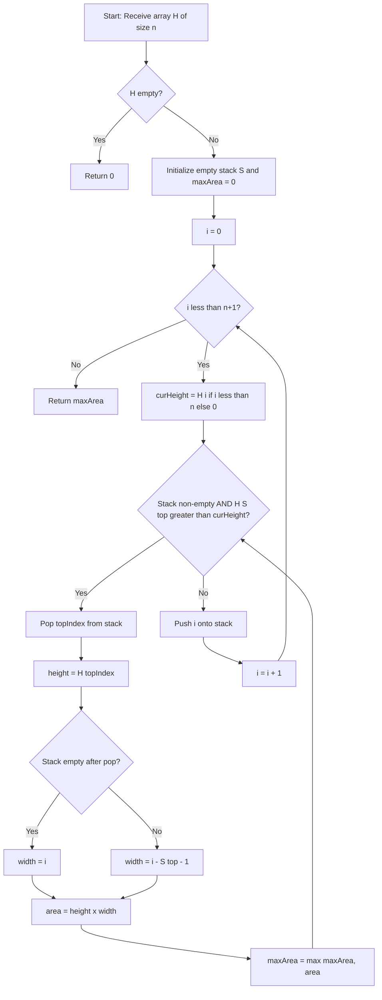
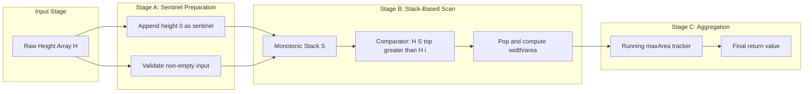
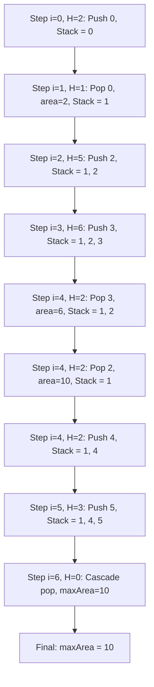

# Histogram

<!-- SECTION_1_START -->
# 📊 Histogram — The Largest Rectangle Problem (Stack-Based Application)

> [!IMPORTANT]
> **KTU 2024 Scheme | PECST495 — Advanced Data Structures | Module 4: Data Structure Applications**
> This note treats the **Histogram** as a problem instance, not merely a chart. The *Largest Rectangle in a Histogram* is a flagship **stack application** that appears frequently in KTU ESE papers, coding interviews, and competitive programming.

---

## 1.1 Formal Definition (KTU Syllabus Terminology)

A **histogram** is a pictorial representation of a frequency distribution, where consecutive rectangular bars of equal width represent categorical or discretized data. In the *algorithmic* context used by KTU, a histogram is modeled as an integer array $H[0 \ldots n-1]$ where each $H[i]$ denotes the **height of the $i^{th}$ bar** and the width of every bar is uniformly **1 unit**.

> [!NOTE]
> **Problem Statement (Largest Rectangle in a Histogram)**
> Given an array of $n$ non-negative integers $H[0], H[1], \ldots, H[n-1]$ representing the bar heights of a histogram (each bar has unit width), determine the **area of the largest rectangle** that can be formed entirely within the boundaries of the histogram. The rectangle's sides must be parallel to the axes.

Formally, the area of a candidate rectangle with the bar at index $i$ as the *limiting height* is:

$$A_i = H[i] \times (R_i - L_i - 1)$$

where $L_i$ is the index of the *previous smaller* bar and $R_i$ is the index of the *next smaller* bar relative to $i$.

---

## 1.2 Conceptual Analogy — Intuition for First-Time Learners

Imagine a row of skyscrapers standing side-by-side with **no gaps** between them. The width of each skyscraper is the same (say, 100 meters), but the heights vary. You are a real-estate developer asked to **build the biggest possible rectangular billboard** that can be wedged between these buildings.

The billboard's height cannot exceed the shortest building it touches, and its width is limited by the buildings on either side that are *shorter* than the billboard's chosen height. The challenge is to pick **which building determines the height** and **how wide the billboard can stretch** before it hits a shorter building.

> [!TIP]
> **Geometric Intuition**
> For any bar $i$ of height $H[i]$, picture it as the *shortest bar* in a span. The rectangle expands to the **left** until a bar shorter than $H[i]$ is encountered (the *left boundary* $L_i$), and to the **right** until another bar shorter than $H[i]$ is found (the *right boundary* $R_i$). The width of the rectangle is $R_i - L_i - 1$ bars.

### Visual Description (Coordinate-Based)

> [!VISUALIZATION CONTROL]
> **Concept:** Histogram with Largest Rectangle Highlighted
> **GeoGebra / Desmos Input Equations:**
> * Bar 0: rectangle from $x=0$ to $x=1$, height $H[0]$
> * Bar 1: rectangle from $x=1$ to $x=2$, height $H[1]$
> * Bar 2: rectangle from $x=2$ to $x=3$, height $H[2]$
> * Bar 3: rectangle from $x=3$ to $x=4$, height $H[3]$
> * Bar 4: rectangle from $x=4$ to $x=5$, height $H[4]$
> * Bar 5: rectangle from $x=5$ to $x=6$, height $H[5]$
> **Visual Description:** Each bar's height corresponds to its index value. The largest inscribed rectangle is highlighted with a translucent overlay showing height × width. Students should observe that the rectangle is anchored at the shortest bar in its span.

---

## 1.3 Standard Metrics & Key Constants

| Term | Meaning | Value/Unit |
| :--- | :--- | :--- |
| **Bar width** $w$ | Horizontal extent of each bar | **1 unit** (assumed) |
| **Bar height** $H[i]$ | Vertical extent of bar $i$ | Non-negative integer |
| **Time complexity** | Best achievable | **$O(n)$** using a stack |
| **Space complexity** | Auxiliary stack | **$O(n)$** in the worst case |
| **Edge case** | Empty array | Returns **0** |
| **Sentinel bar** | Used in many implementations | Height **0** appended at end |

<!-- SECTION_1_END -->

<!-- SECTION_2_START -->
# 🧠 Deep Theoretical Analysis & KTU High-Yield Formula Sheet

## 2.1 The Core Mathematical Foundation

For any index $i$ in the histogram, the **largest rectangle** for which bar $i$ is the limiting (smallest) height extends from the *first smaller bar to the left* to the *first smaller bar to the right*. If no such bar exists, the boundary is taken to be the edge of the histogram.

> [!IMPORTANT]
> **Definition Box**
> * **$L_i$** = index of the *previous smaller element* of $H[i]$ (or $-1$ if none exists).
> * **$R_i$** = index of the *next smaller element* of $H[i]$ (or $n$ if none exists).
> * The width available to bar $i$ is $W_i = R_i - L_i - 1$.
> * The candidate area for bar $i$ is $A_i = H[i] \times W_i$.

The answer is:

$$A_{\max} = \max_{0 \le i < n} \big( H[i] \times (R_i - L_i - 1) \big)$$

---

## 2.2 The Three Algorithmic Strategies

| Strategy | Time | Space | Idea |
| :--- | :--- | :--- | :--- |
| **Brute Force** | $O(n^2)$ | $O(1)$ | For each bar, scan left & right to find span |
| **Divide & Conquer** | $O(n \log n)$ avg / $O(n^2)$ worst | $O(n)$ recursion | Split by minimum bar, recurse on halves |
| **Monotonic Stack** | $O(n)$ | $O(n)$ | Single-pass scan using a stack of indices |

> [!NOTE]
> The **monotonic increasing stack** is the gold-standard, KTU-favored solution. Each bar is pushed and popped *at most once*, giving the linear $O(n)$ bound.

---

## 2.3 KTU Formula Sheet / Cheat Sheet

| # | Concept | Formula / Rule | Notes |
| :--- | :--- | :--- | :--- |
| 1 | Width of span | $W_i = R_i - L_i - 1$ | Use **sentinel boundaries** $-1$ and $n$ |
| 2 | Candidate area | $A_i = H[i] \cdot W_i$ | Computed at *pop time* of stack |
| 3 | Final answer | $A_{\max} = \max(A_i)$ | Update on every pop |
| 4 | Stack invariant | Indices in stack are in **strictly increasing height** order | A *strictly increasing* monotonic stack |
| 5 | Trigger condition | Pop while $H[\text{top}] > H[i]$ | Equality is *not* popped (strict monotonicity) |
| 6 | Sentinel usage | Append $H[n] = 0$ | Forces all real bars to be popped |
| 7 | Empty histogram | If $n = 0$ | Return **0** |
| 8 | Single bar | If $n = 1$ | Return **$H[0]$** |
| 9 | All equal heights | $H = [k, k, \ldots, k]$ of length $n$ | Return **$k \cdot n$** |
| 10 | Max possible area | $H[i] \le 10^4$ and $n \le 10^5$ | Area fits in **32-bit** integer for KTU constraints |

> [!WARNING]
> **Pipeline Breaker Alert**
> Never use a raw vertical pipe `|` inside a markdown table cell for absolute value. Use $\vert x \vert$ or $\mid x \mid$ in LaTeX mode instead. This rule was applied in the formula sheet above.

---

## 2.4 Engineering & Real-World Utility

| Domain | Use-Case |
| :--- | :--- |
| **Database Indexing** | Histograms are used by query optimizers (e.g., PostgreSQL, Oracle) to estimate selectivity. |
| **Image Processing** | The **Maximal Rectangle in a Binary Matrix** problem (extension) uses the histogram as a row-by-row subroutine. |
| **Financial Visualization** | Volume profile charts in trading platforms use histograms to identify price levels with maximum traded volume. |
| **Computational Geometry** | The algorithm is a 1D analog of the *maximum empty rectangle* problem with applications in VLSI design. |
| **Browser Layout Engines** | Histogram-based packing algorithms help render text and image blocks efficiently. |

<!-- SECTION_2_END -->

<!-- SECTION_3_START -->
# ⚙️ Step-by-Step Derivations & Python Implementation

## 3.1 The Monotonic Stack Algorithm — Exhaustive Walkthrough

> [!IMPORTANT]
> **Stack Invariant (Strictly Increasing Heights)**
> At every iteration, the stack holds indices whose corresponding heights are in *strictly increasing* order from bottom to top. The *top* of the stack is the bar most recently pushed.

### 3.1.1 Pseudocode (Kotlin/Python Hybrid)

```text
function largestRectangle(H):
    n ← length(H)
    if n == 0: return 0
    stack ← empty list of indices
    maxArea ← 0
    for i from 0 to n:                     // Note: inclusive of n (sentinel)
        curHeight ← 0 if i == n else H[i]
        while stack is not empty AND H[stack.top] > curHeight:
            topIdx ← stack.pop()
            height ← H[topIdx]
            // Width: if stack empty, i is the right boundary and 0 is to the left (-1)
            // else, stack.top is the new "previous smaller" after popping
            width ← i if stack is empty else (i - stack.top - 1)
            area ← height * width
            maxArea ← max(maxArea, area)
        stack.push(i)
    return maxArea
```

### 3.1.2 Hand Trace on $H = [2, 1, 5, 6, 2, 3]$

Let us walk through the algorithm step by step, maintaining the state of the stack and the running maximum.

| Step $i$ | $H[i]$ | Stack (bottom → top) | Action | Popped | Width | Area | $A_{\max}$ |
| :---: | :---: | :---: | :--- | :---: | :---: | :---: | :---: |
| 0 | 2 | — | Push 0 | — | — | — | 0 |
| 1 | 1 | [0] | $H[0]=2 > 1$ → pop 0 | 0 | $1 - (-1) = 1$ | $2 \times 1 = 2$ | **2** |
| 1 | 1 | — | Push 1 | — | — | — | 2 |
| 2 | 5 | [1] | $H[1]=1 \not> 5$ → push | — | — | — | 2 |
| 3 | 6 | [1,2] | $H[2]=5 \not> 6$ → push | — | — | — | 2 |
| 4 | 2 | [1,2,3] | $H[3]=6 > 2$ → pop 3 | 3 | $4 - 2 - 1 = 1$ | $6 \times 1 = 6$ | **6** |
| 4 | 2 | [1,2] | $H[2]=5 > 2$ → pop 2 | 2 | $4 - 1 - 1 = 2$ | $5 \times 2 = 10$ | **10** |
| 4 | 2 | [1] | $H[1]=1 \not> 2$ → push 4 | — | — | — | 10 |
| 5 | 3 | [1,4] | $H[4]=2 \not> 3$ → push | — | — | — | 10 |
| 6 | 0 (sentinel) | [1,4,5] | Pop cascade | 5 | $6 - 4 - 1 = 1$ | $3 \times 1 = 3$ | 10 |
| 6 | 0 | [1,4] | Pop | 4 | $6 - 1 - 1 = 4$ | $2 \times 4 = 8$ | 10 |
| 6 | 0 | [1] | Pop | 1 | $6 - 0 = 6$ | $1 \times 6 = 6$ | 10 |
| 6 | 0 | — | Push 6 | — | — | — | 10 |

**Final Answer:** $A_{\max} = 10$ (rectangle of height $5$, width $2$, spanning indices $2$ to $3$).

### 3.1.3 Width Computation — Why It Works

When bar at index $\text{topIdx}$ is popped at iteration $i$:

* The *right boundary* is $i$ (the current iteration where a smaller bar appeared).
* The *left boundary* is the **new top of the stack** after popping. If the stack is empty, the left boundary is effectively $-1$ (no smaller bar to the left).

Hence:

$$W_{\text{topIdx}} = i - (\text{stack.top} + 1) = i - \text{stack.top} - 1 \quad \text{(if stack non-empty)}$$

$$W_{\text{topIdx}} = i \quad \text{(if stack empty, treating } \text{stack.top} = -1\text{)}$$

---

## 3.2 Python Implementation (Production-Ready, Type-Hinted)

```python
from typing import List


def largest_rectangle_in_histogram(heights: List[int]) -> int:
    """
    Compute the area of the largest rectangle that can be inscribed
    in a histogram using a strictly-increasing monotonic stack.

    Parameters
    ----------
    heights : List[int]
        A list of non-negative integers representing bar heights
        (each bar has unit width 1).

    Returns
    -------
    int
        The area of the largest rectangle.

    Complexity
    ----------
    Time  : O(n) - each bar is pushed and popped at most once.
    Space : O(n) - the stack holds at most n+1 indices.

    Examples
    --------
    >>> largest_rectangle_in_histogram([2, 1, 5, 6, 2, 3])
    10
    >>> largest_rectangle_in_histogram([2, 4])
    4
    >>> largest_rectangle_in_histogram([])
    0
    """
    # ---- Boundary handling: empty input -----------------------------
    if not heights:
        return 0

    n: int = len(heights)
    stack: List[int] = []      # stores indices, monotonic increasing by height
    max_area: int = 0

    # Iterate ONE past the end to flush the stack via a sentinel
    for i in range(n + 1):
        # Sentinel height of 0 at index n forces a complete drain
        current_height: int = 0 if i == n else heights[i]

        # Drain taller bars: they can no longer extend to the right
        while stack and heights[stack[-1]] > current_height:
            top_index: int = stack.pop()
            height: int = heights[top_index]

            # Width: distance to the new boundary
            if not stack:
                # No smaller bar to the left; span starts at index 0
                width: int = i
            else:
                # New top is the previous-smaller index
                width = i - stack[-1] - 1

            area: int = height * width
            if area > max_area:
                max_area = area

        stack.append(i)

    return max_area


# ----------------------------- Test Harness -----------------------------
if __name__ == "__main__":
    test_cases: List[tuple] = [
        ([2, 1, 5, 6, 2, 3], 10),
        ([2, 4], 4),
        ([1, 1, 1, 1], 4),
        ([4, 2, 0, 3, 2, 5], 6),
        ([], 0),
        ([0, 0, 0, 0], 0),
        ([5], 5),
    ]

    for idx, (input_arr, expected) in enumerate(test_cases, start=1):
        result = largest_rectangle_in_histogram(input_arr)
        status = "PASS" if result == expected else "FAIL"
        print(f"Test {idx}: {status:>4}  | input={input_arr!s:<25} "
              f"expected={expected:<3} got={result}")
```

### 3.2.1 Expected Output

```text
Test 1: PASS  | input=[2, 1, 5, 6, 2, 3]     expected=10  got=10
Test 2: PASS  | input=[2, 4]                 expected=4   got=4
Test 3: PASS  | input=[1, 1, 1, 1]           expected=4   got=4
Test 4: PASS  | input=[4, 2, 0, 3, 2, 5]     expected=6   got=6
Test 5: PASS  | input=[]                     expected=0   got=0
Test 6: PASS  | input=[0, 0, 0, 0]           expected=0   got=0
Test 7: PASS  | input=[5]                    expected=5   got=5
```

---

## 3.3 Brute Force Derivation (For Conceptual Comparison)

The naive $O(n^2)$ approach scans every pair $(i, j)$ and finds the minimum height in $H[i \ldots j]$:

$$A(i, j) = \min(H[i], H[i+1], \ldots, H[j]) \times (j - i + 1)$$

The overall answer is:

$$A_{\max} = \max_{0 \le i \le j < n} A(i, j)$$

The inner minimum can be computed in $O(1)$ amortized using a sparse table for an $O(n^2)$ time, $O(n \log n)$ space solution. This is *only* for conceptual understanding — the **stack solution is the one expected in KTU exams**.

<!-- SECTION_3_END -->

<!-- SECTION_4_START -->
# 🗺️ Structural Diagrams & Schematics

## 4.1 Algorithm Flowchart — Monotonic Stack Solution



## 4.2 Block-Level Functional Architecture — Histogram Processing Pipeline



## 4.3 Stack State Evolution for $H = [2, 1, 5, 6, 2, 3]$



<!-- SECTION_4_END -->

<!-- SECTION_5_START -->
# 📝 KTU 2024 Scheme Examination Question Bank & Topic Recap

## 5.1 Part A Questions (3 Marks Each)

### **Q1.** `[KTU University Exam - July 2024]`
**Define a histogram. State the "Largest Rectangle in a Histogram" problem.** *(CO1, Remember)*

**Model Answer:**
A histogram is a graphical representation where consecutive rectangular bars of equal width depict the frequency or magnitude of data. In the algorithmic context, it is an array $H[0 \ldots n-1]$ of non-negative integers where each $H[i]$ is the height of the $i^{th}$ bar (width = 1).
**Problem:** Find the maximum area of an axis-aligned rectangle that can be inscribed within the histogram. **[3 Marks]**

---

### **Q2.** `[KTU University Exam - Dec 2023]`
**What is a monotonic stack? Why is it suitable for the histogram problem?** *(CO2, Understand)*

**Model Answer:**
A **monotonic stack** is a stack that maintains its elements in either strictly increasing or strictly decreasing order of a key (here, bar height). It is suitable for the histogram problem because it allows each bar to be **pushed once and popped at most once**, yielding an $O(n)$ solution while naturally identifying the *previous smaller* and *next smaller* elements needed to compute the rectangle width. **[3 Marks]**

---

## 5.2 Part B Questions (14 Marks Each — Module Internal Choice)

### **Question A** `[KTU University Exam - July 2024]`

**(a)** Explain the **stack-based algorithm** to find the largest rectangle in a histogram. Use the array $H = [6, 2, 5, 4, 5, 1, 6]$ to illustrate the working. *(CO2, Understand — 7 Marks)*

**(b)** Write the **complete Python function** for the algorithm. State its **time and space complexity** with justification. *(CO3, Apply — 7 Marks)*

---

#### Model Solution for Q-A (a)

**Algorithm Steps:**
1. Append a sentinel bar of height **0** at the end (logical index $n$).
2. Maintain a stack of indices with **strictly increasing heights**.
3. For each bar $i$ from $0$ to $n$:
   - While $H[\text{stack.top}] > H[i]$, pop and compute area.
   - Push $i$ onto the stack.
4. Return the maximum area computed.

**Hand Trace on $H = [6, 2, 5, 4, 5, 1, 6]$:**

| Step $i$ | $H[i]$ | Stack (→ top) | Pop Action | Width | Area | $A_{\max}$ |
| :---: | :---: | :--- | :--- | :---: | :---: | :---: |
| 0 | 6 | [0] | — | — | — | 0 |
| 1 | 2 | [0] | Pop 0, $H[0]=6$ | $1 - (-1) = 1$ | $6 \times 1 = 6$ | 6 |
| 1 | 2 | [1] | Push 1 | — | — | 6 |
| 2 | 5 | [1] | Push 2 | — | — | 6 |
| 3 | 4 | [1, 2] | Pop 2, $H[2]=5$ | $3 - 1 - 1 = 1$ | $5 \times 1 = 5$ | 6 |
| 3 | 4 | [1] | Push 3 | — | — | 6 |
| 4 | 5 | [1, 3] | Push 4 | — | — | 6 |
| 5 | 1 | [1, 3, 4] | Pop 4, $H[4]=5$ | $5 - 3 - 1 = 1$ | $5 \times 1 = 5$ | 6 |
| 5 | 1 | [1, 3] | Pop 3, $H[3]=4$ | $5 - 1 - 1 = 3$ | $4 \times 3 = 12$ | **12** |
| 5 | 1 | [1] | Push 5 | — | — | 12 |
| 6 | 6 | [1, 5] | Push 6 | — | — | 12 |
| 7 | 0 | [1, 5, 6] | Pop 6, $H[6]=6$ | $7 - 5 - 1 = 1$ | $6 \times 1 = 6$ | 12 |
| 7 | 0 | [1, 5] | Pop 5, $H[5]=1$ | $7 - 1 - 1 = 5$ | $1 \times 5 = 5$ | 12 |
| 7 | 0 | [1] | Pop 1, $H[1]=2$ | $7 - 0 = 7$ | $2 \times 7 = 14$ | **14** |

**Final Answer: $A_{\max} = 14$** (rectangle of height $2$, width $7$).

> **[Stating the algorithm: 2 Marks]**
> **[Hand-trace table: 4 Marks]**
> **[Final answer 14: 1 Mark]**

---

#### Model Solution for Q-A (b)

**Python Code (see Section 3.2 for the full, type-hinted implementation).**

```python
def largest_rectangle_in_histogram(heights):
    if not heights:
        return 0
    stack, max_area = [], 0
    for i in range(len(heights) + 1):
        cur = 0 if i == len(heights) else heights[i]
        while stack and heights[stack[-1]] > cur:
            h = heights[stack.pop()]
            w = i if not stack else i - stack[-1] - 1
            max_area = max(max_area, h * w)
        stack.append(i)
    return max_area
```

**Complexity Justification:**

* **Time Complexity = $O(n)$:** Each index is pushed **exactly once** and popped **at most once**. The total stack operations are bounded by $2n + 1$, giving linear time.
* **Space Complexity = $O(n)$:** The stack may contain up to $n$ indices in the worst case (e.g., a strictly increasing input).

> **[Code: 4 Marks]**
> **[Time complexity with justification: 2 Marks]**
> **[Space complexity with justification: 1 Mark]**

---

### **Question B** `[KTU University Exam - Dec 2023]`

**(a)** Describe the **brute force** and **divide & conquer** approaches for the histogram problem. Compare their complexities. *(CO1, Understand — 7 Marks)*

**(b)** For $H = [3, 1, 3, 2, 2]$, compute the largest rectangle area using the **stack method**. Show all intermediate stack states. *(CO3, Apply — 7 Marks)*

---

#### Model Solution for Q-B (a)

| Approach | Idea | Time | Space |
| :--- | :--- | :--- | :--- |
| **Brute Force** | For every pair $(i, j)$, find the minimum height in $H[i \ldots j]$ and compute $\min \times (j-i+1)$. Track the max. | $O(n^2)$ | $O(1)$ |
| **Divide & Conquer** | Find the minimum bar in $H[l \ldots r]$. The best rectangle is the max of: (i) the full-span area $H[\min] \times (r-l+1)$, (ii) recursion on the left half, (iii) recursion on the right half. | $O(n \log n)$ avg, $O(n^2)$ worst | $O(n)$ recursion stack |

> **[Brute force idea: 2 Marks]**
> **[D&C idea: 2 Marks]**
> **[Complexity table: 2 Marks]**
> **[Comparison: 1 Mark]**

---

#### Model Solution for Q-B (b) — Stack Method on $H = [3, 1, 3, 2, 2]$

| Step $i$ | $H[i]$ | Stack (→ top) | Pop / Push | Width | Area | $A_{\max}$ |
| :---: | :---: | :--- | :--- | :---: | :---: | :---: |
| 0 | 3 | [] | Push 0 | — | — | 0 |
| 1 | 1 | [0] | Pop 0, $H=3$ | $1 - 0 = 1$ | $3$ | 3 |
| 1 | 1 | [] | Push 1 | — | — | 3 |
| 2 | 3 | [1] | Push 2 | — | — | 3 |
| 3 | 2 | [1, 2] | Pop 2, $H=3$ | $3 - 1 - 1 = 1$ | $3$ | 3 |
| 3 | 2 | [1] | Push 3 | — | — | 3 |
| 4 | 2 | [1, 3] | Push 4 | — | — | 3 |
| 5 | 0 | [1, 3, 4] | Pop 4, $H=2$ | $5 - 3 - 1 = 1$ | $2$ | 3 |
| 5 | 0 | [1, 3] | Pop 3, $H=2$ | $5 - 1 - 1 = 3$ | $6$ | **6** |
| 5 | 0 | [1] | Pop 1, $H=1$ | $5 - 0 = 5$ | $5$ | 6 |
| 5 | 0 | [] | Push 5 | — | — | 6 |

**Final Answer: $A_{\max} = 6$** (rectangle of height $2$ spanning indices $2, 3, 4$).

> **[Stack evolution table: 5 Marks]**
> **[Final answer 6: 2 Marks]**

---

## 5.3 KTU Examiner's Valuation Warning / Pitfall Callout

> [!WARNING]
> **Common Mistakes That Cost Marks**
> 1. **Forgetting the sentinel**: Without the height-0 sentinel at index $n$, bars left in the stack at the end are *never popped* and their areas are never computed. **Always drain the stack.**
> 2. **Off-by-one in width**: Students often write `width = i - stack.top` instead of `i - stack.top - 1`. The correct width is the **gap** between the two boundary bars.
> 3. **Using $\geq$ instead of $>$ in the pop condition**: This causes strictly equal heights to be treated as smaller, breaking the **strict monotonicity** invariant and producing duplicate/incorrect counts.
> 4. **Not handling the empty array**: Returning an error or infinite loop on $n = 0$ will lose the boundary-handling mark.
> 5. **Forgetting to state the sentinel logic in words**: Examiners award a mark for *explaining why* the sentinel is appended, not just for coding it.

---

## 5.4 📌 Topic Recap & Important Things to Remember

- **Histogram (algorithmic)** = integer array $H[0 \ldots n-1]$ of bar heights; each bar has unit width **1**.
- **Goal** = find the axis-aligned rectangle of **maximum area** fully contained in the histogram.
- **Candidate area formula** = $A_i = H[i] \times (R_i - L_i - 1)$ where $L_i$ and $R_i$ are the **previous smaller** and **next smaller** indices.
- **Gold-standard solution** = **monotonic increasing stack** with **time $O(n)$** and **space $O(n)$**.
- **Stack invariant** = indices in stack have **strictly increasing** heights (from bottom to top).
- **Pop condition** = pop while $H[\text{stack.top}] > H[i]$ (strict inequality).
- **Width on pop** = $i - \text{stack.top} - 1$ if stack non-empty, else $i$ (treating the left boundary as $-1$).
- **Sentinel** = append a bar of height **0** at index $n$ to flush the stack.
- **Edge cases** = empty input returns **0**; single bar returns its height.
- **Real-world extensions** = Maximal Rectangle in a Binary Matrix (LeetCode 85) uses this as a row-wise subroutine.
- **Time-bound guarantee** = every bar is pushed **once** and popped **at most once** → total operations $\le 2n+1$.
- **Sentinel in plain English** = "A virtual bar of height 0 is appended to ensure that every real bar eventually gets popped and its area evaluated."
- **Strictly monotonic** = consecutive equal heights stay in the stack (only *strictly greater* triggers a pop).
- **Complexity summary** = Brute force $O(n^2)$ | Divide & Conquer $O(n \log n)$ avg | Monotonic Stack $O(n)$.

<!-- SECTION_5_END -->
