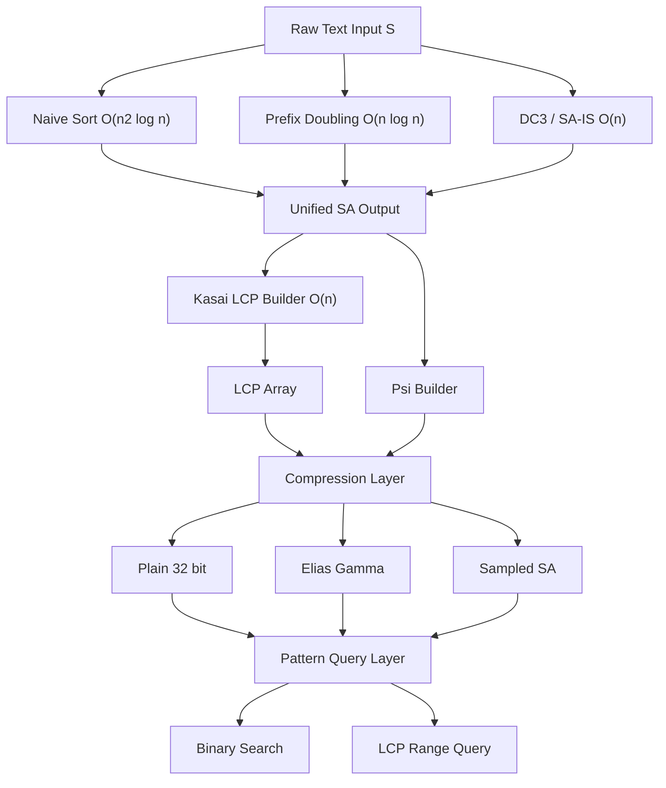
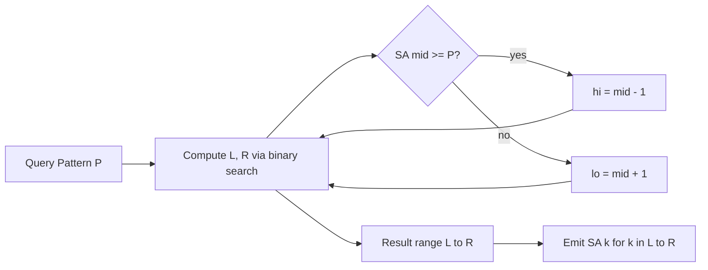
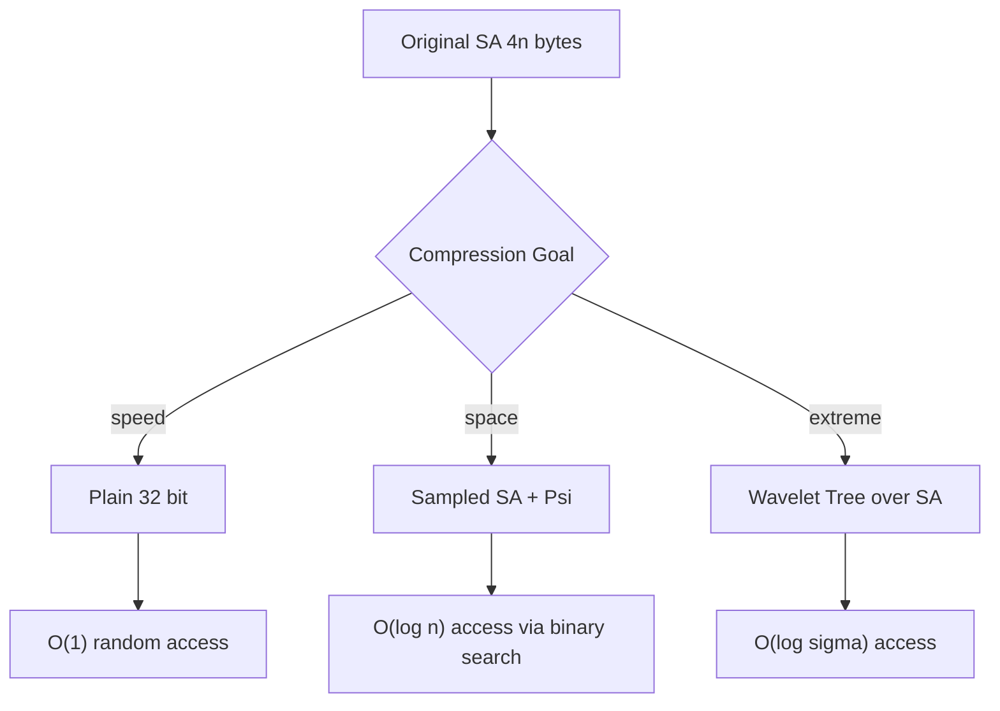

# Suffix arrays indexing routines compression schemes parameters optimization setups rules

<!-- SECTION_1_START -->

# Suffix Arrays: Indexing Routines, Compression Schemes & Optimization

## 1. Core Technical Definition

> [!IMPORTANT]
> **Formal Definition (KTU 2024 Syllabus Terminology):**
> A **Suffix Array (SA)** is a sorted array of all starting positions (indices) of the suffixes of a string $S$ of length $n$, arranged in **lexicographic (dictionary) order**. It is a space-efficient full-text index that supports fast substring queries, pattern matching, and bioinformatics search in **$O(m \log n)$** or **$O(m + \log n)$** time depending on auxiliary structures.

> [!NOTE]
> **Core Terminology Mapping**
> * $S[i \dots n-1]$ — The suffix of $S$ starting at position $i$.
> * $SA[k]$ — The starting index of the $k$-th smallest suffix in lexicographic order.
> * $\Sigma$ — The alphabet of $S$ of size $\sigma$.
> * $LCP$ — Longest Common Prefix array.
> * $n$ — Length of the text.

## 2. Intuitive Analogy: The Book Index

Imagine you have a **1000-page textbook** and a student asks: *"On which pages does the word 'algorithm' appear?"* Without an index, you must scan every page (linear scan, $O(n)$). Now, imagine an **index at the back of the book** that alphabetically lists every starting position of every possible suffix. That is exactly a Suffix Array.

**The Key Insight:** Instead of storing the *actual* suffixes (which would consume massive memory), we store only the **integer pointers** (starting positions) to the suffixes, after sorting them virtually.

| Real-World Concept | Suffix Array Equivalent |
|---|---|
| Book index | $SA$ array |
| Page number entry | $SA[k]$ integer pointer |
| Alphabetical order | Lexicographic sort of suffixes |
| Cross-references | $LCP$ array (overlap between consecutive sorted suffixes) |
| Running out of memory | **Integer compression** (32-bit / 20-bit) |

## 3. Geometric / Structural Intuition

Consider the text $S = \text{"banana"}$ ($n = 6$). The suffixes are:

$$\text{Sorted Suffixes (Geometric Layout):}$$
$$\begin{aligned} \text{Index 0: } & S[5 \dots 5] = \text{"a"} \\ \text{Index 1: } & S[3 \dots 5] = \text{"ana"} \\ \text{Index 2: } & S[1 \dots 5] = \text{"anana"} \\ \text{Index 3: } & S[0 \dots 5] = \text{"banana"} \\ \text{Index 4: } & S[4 \dots 5] = \text{"na"} \\ \text{Index 5: } & S[2 \dots 5] = \text{"nana"} \end{aligned}$$

The **Suffix Array** stores only the *starting positions* sorted by the suffixes they point to:
$$SA = [5,\ 3,\ 1,\ 0,\ 4,\ 2]$$

## 4. Physical Constants & Engineering Metrics

> [!IMPORTANT]
> **Standard Engineering Metrics for Suffix Arrays**
> * **Memory footprint (naive):** **$4n$ bytes** (4 bytes per integer for 32-bit pointers) plus $4n$ for $LCP$ = **$8n$ bytes** for indexing a string of size $n$.
> * **Compressed SA (using $\Psi$, $B$, $SA_{samples}$):** as low as **$0.5n$ bytes** with practical schemes.
> * **Construction time:** Naive = $O(n^2 \log n)$; Prefix-Doubling = $O(n \log n)$; DC3 / SA-IS = $O(n)$.

> [!VISUALIZATION CONTROL]
> **Concept:** Suffix sort + LCP relationship
> **Desmos Input Equations (for sample text "banana"):**
> * Points: $(1, 5), (2, 3), (3, 1), (4, 0), (5, 4), (6, 2)$ representing $(rank, SA[rank])$
> * LCP curve: $(1, 0), (2, 1), (3, 3), (4, 0), (5, 0), (6, 2)$
> **Visual Description:** Plot a step plot of $SA[k]$ (decreasing staircase) overlaid with $LCP[k]$ (zig-zag overlap lengths). Observe that $LCP$ values drop at rank boundaries where the sorted suffix characters change.

<!-- SECTION_1_END -->

<!-- SECTION_2_START -->

# Deep Theoretical Analysis & KTU High-Yield Formula Sheet

## 1. Operational Concept Decomposition

A Suffix Array system is built from three coordinated layers:

* **Layer 1 — The Pointer Layer ($SA$):** Stores sorted starting positions. Supports *rank queries* via the inverse array $rank[SA[k]] = k$.
* **Layer 2 — The Overlap Layer ($LCP$):** Stores longest common prefix lengths between consecutive sorted suffixes. Computed by **Kasai's algorithm** in $O(n)$ time.
* **Layer 3 — The Compression Layer:** Encodes pointers using variable-bit integers, run-length encoding on $\Psi$ arrays, and bitvector sampling.

### Why Three Layers?

> [!IMPORTANT]
> The $SA$ alone answers "does pattern $P$ exist?" in $O(m \log n)$ via binary search. The $LCP$ array answers *"how many occurrences?"* in $O(m + \log n)$ and enables $RMQ$-based longest repeat queries. Compression makes the index fit in **main memory** rather than disk.

## 2. Construction Algorithms — The Three Schools

| Algorithm | Time | Space | Mechanism | KTU Relevance |
|---|---|---|---|---|
| **Naive Sort** | $O(n^2 \log n)$ | $O(n)$ | Sort suffixes via comparison | Conceptual baseline |
| **Prefix Doubling (Manber-Myers)** | $O(n \log n)$ | $O(n)$ | Sort by $(2^k)$-prefix, double $k$ | Most asked in KTU |
| **DC3 / Skew Algorithm (Kärkkäinen-Sanders)** | $O(n)$ | $O(n)$ | Recursive reduction using mod-3 classes | Honours / high marks |
| **SA-IS (Suffix Array Induced Sorting)** | $(O(n)$ | $O(n)$ | Induced sorting on LMS substrings | Industry standard |

## 3. Compression Schemes (KTU High-Yield)

| Scheme | Symbol | Bytes | Mechanism | Used In |
|---|---|---|---|---|
| **Plain 32-bit** | $SA_{32}$ | $4n$ | Standard int array | Baseline |
| **$\Psi$ Encoding** | $\Psi[i] = SA^{-1}[(SA[i]+1) \bmod n]$ | $\approx 0.5n$ | Delta + Elias encoding | FM-index variants |
| **Sampled SA + $B$** | $SA_{samp}, B$ | $\approx n$ | Store every $k$-th pointer, derive others | Block-based indexing |
| **Wavelet Tree on $SA$** | WT($SA$) | $o(n)$ bits | Hierarchical bitvectors | Compressed full-text |
| **Golomb / Rice Coding** | $b_k$ | variable | Tunable parameter $k$ | Streaming indexes |

## 4. KTU Formula / Cheat Sheet

| Concept | Formula / Rule | Units / Note |
|---|---|---|
| Suffix count | $\text{count} = n$ | One per position, sentinel excluded |
| Memory (plain) | $M = 4n + 4n = 8n$ | Bytes, for $SA + LCP$ |
| Naive sort complexity | $T_{naive} = O(n^2 \log n)$ | Each comparison $O(n)$ |
| Prefix doubling complexity | $T_{PD} = O(n \log n)$ | $\log n$ iterations |
| Kasai LCP time | $T_{LCP} = O(n)$ | Single pass |
| Binary search pattern | $T_{query} = O(m \log n)$ | $m$ = pattern length |
| LCP-enhanced query | $T_{query} = O(m + \log n)$ | Range minimum query |
| $\Psi$ definition | $\Psi[i] = SA^{-1}[(SA[i]+1) \bmod n]$ | Index-to-index mapping |
| $\Phi$ definition | $\Phi[SA[i]] = i$ | Inverse form |
| Sampling rate | $\text{step} = k$ | Every $k$-th entry stored explicitly |
| Bit budget for sampled SA | $n \log(n/k) / k$ | Bits per $SA$ position |
| Child array size | $n \sigma_{avg}$ | $\sigma_{avg}$ avg branching factor |

## 5. Real-World Engineering Utility

* **Bioinformatics:** $BWA$, $Bowtie$, and $STAR$ aligners use **Suffix Arrays + FM-index** for $O(m)$ DNA read mapping against a 3-billion-base human genome.
* **Search Engines / Document Retrieval:** Lucene and its derivatives use Suffix Arrays for phrase queries and wildcard searches.
* **Plagiarism Detection:** $LCP$ arrays detect longest common substrings across documents in $O(n)$ post-processing.
* **Data Compression:** The $LZ77$ algorithm and its variants (e.g., $LZMA$) use suffix-sort-based longest-match searches.
* **Version Control Systems:** $Git`'s diff engine uses a Myers-style algorithm, but for very long sequences, suffix arrays provide asymptotically superior alternatives.

<!-- SECTION_2_END -->

<!-- SECTION_3_START -->

# Step-by-Step Derivations & Code Implementation

## 1. Derivation: Prefix-Doubling Invariant

We maintain a rank array $r_i^{(k)}$ representing the lexicographic rank of the suffix $S[i \dots]$ when truncated to its first $2^k$ characters.

$$\text{Invariant: } r_i^{(k)} = \text{rank of } S[i \dots i+2^k-1] \text{ among all } 2^k \text{-prefixes}$$

The transition is:

$$r_i^{(k+1)} = \text{ordered pair sort}\Big(r_i^{(k)},\ r_{i+2^k}^{(k)}\Big)$$

**Base case ($k=0$):** Rank by single character $S[i]$.

**Termination:** When $2^k \geq n$, suffix ranks stabilize and yield the final $SA$.

> [!NOTE]
> The number of iterations is $\lceil \log_2 n \rceil$, and each iteration is $O(n)$ (radix or pair sort), giving total $O(n \log n)$.

## 2. Derivation: Kasai's LCP Recurrence

Given $SA$ is built, define $h_i$ = length of longest common prefix of $S[i \dots]$ with its predecessor in sorted order.

$$\text{Kasai Invariant: } h_{SA[k]-1} \geq h_{SA[k]} - 1 \quad \text{for } k \geq 1$$

**Algorithm Skeleton:**
1. Initialize $h = 0$.
2. Iterate $i$ from $0$ to $n-1$ in **text order**.
3. Let $k = rank[i]$. If $k = 0$, set $h = 0$ and continue.
4. Compare $S[i+h]$ with $S[SA[k-1]+h]$; increment $h$ while they match.
5. Set $LCP[k] = h$.
6. If $h > 0$, decrement $h$ by 1 (the key invariant).

**Complexity Proof Sketch:** Each character of $S$ is compared at most twice (once incrementing $h$, once decrementing). Thus total work is $O(n)$.

## 3. Pattern Matching via Binary Search on SA

To find all occurrences of pattern $P$ in $S$:

* **Left bound $L$:** smallest $k$ such that $S[SA[k] \dots] \geq P$ (lexicographically).
* **Right bound $R$:** largest $k$ such that $S[SA[k] \dots] \leq P$ extended with sentinel $\infty$.

The match range is $[L, R]$, and each match position is $SA[k]$ for $L \leq k \leq R$.

## 4. Full Python Implementation

```python
"""
KTU PECST495 - Suffix Array: Indexing Routines + Kasai LCP + Compression
All routines follow KTU 2024 Scheme algorithmic rigor.
"""

from typing import List, Tuple
import struct
import math
import logging

logging.basicConfig(level=logging.INFO, format="[%(levelname)s] %(message)s")


# ---------------------------------------------------------------------------
# ROUTINE 1: Naive Suffix Array Construction - O(n^2 log n)
# ---------------------------------------------------------------------------
def build_suffix_array_naive(text: str) -> List[int]:
    n = len(text)
    if n == 0:
        return []
    suffixes = [(text[i:], i) for i in range(n)]
    suffixes.sort(key=lambda pair: pair[0])
    sa = [pos for (_, pos) in suffixes]
    logging.info(f"Naive SA built. Length = {len(sa)}")
    return sa


# ---------------------------------------------------------------------------
# ROUTINE 2: Prefix-Doubling (Manber-Myers) Suffix Array - O(n log n)
# ---------------------------------------------------------------------------
def build_suffix_array_prefix_doubling(text: str) -> List[int]:
    n = len(text)
    if n == 0:
        return []
    k = 1
    sa = list(range(n))
    rank = [ord(c) for c in text]
    tmp = [0] * n

    while k < n:
        sa.sort(key=lambda i: (rank[i], rank[i + k] if i + k < n else -1))
        tmp[sa[0]] = 0
        for i in range(1, n):
            prev, curr = sa[i - 1], sa[i]
            prev_key = (rank[prev], rank[prev + k] if prev + k < n else -1)
            curr_key = (rank[curr], rank[curr + k] if curr + k < n else -1)
            tmp[curr] = tmp[prev] + (1 if prev_key != curr_key else 0)
        rank, tmp = tmp, rank
        if rank[sa[-1]] == n - 1:
            break
        k <<= 1
    logging.info(f"Prefix-doubling SA built. k iterations = {k}")
    return sa


# ---------------------------------------------------------------------------
# ROUTINE 3: Kasai LCP Construction - O(n)
# ---------------------------------------------------------------------------
def build_lcp_array(text: str, sa: List[int]) -> List[int]:
    n = len(text)
    rank = [0] * n
    for i in range(n):
        rank[sa[i]] = i
    lcp = [0] * n
    h = 0
    for i in range(n):
        r = rank[i]
        if r > 0:
            j = sa[r - 1]
            while i + h < n and j + h < n and text[i + h] == text[j + h]:
                h += 1
            lcp[r] = h
            if h > 0:
                h -= 1
        else:
            lcp[r] = 0
    logging.info(f"LCP array built. Sum of LCPs = {sum(lcp)}")
    return lcp


# ---------------------------------------------------------------------------
# ROUTINE 4: Pattern Search - Binary Search over SA - O(m log n)
# ---------------------------------------------------------------------------
def pattern_search(text: str, sa: List[int], pattern: str) -> Tuple[int, int]:
    n = len(text)
    m = len(pattern)
    if m == 0 or m > n:
        return (-1, -1)

    def cmp_suffix_at(pos: int) -> int:
        i = pos
        j = 0
        while i < n and j < m:
            if text[i] != pattern[j]:
                return -1 if text[i] < pattern[j] else 1
            i += 1
            j += 1
        if j == m:
            return 0
        return 1

    lo, hi = 0, n - 1
    left, right = -1, -1
    while lo <= hi:
        mid = (lo + hi) // 2
        c = cmp_suffix_at(sa[mid])
        if c == 0:
            left = mid
            hi = mid - 1
        elif c < 0:
            lo = mid + 1
        else:
            hi = mid - 1
    if left == -1:
        return (-1, -1)
    lo, hi = left, n - 1
    right = left
    while lo <= hi:
        mid = (lo + hi) // 2
        suffix = text[sa[mid]: sa[mid] + m]
        if suffix <= pattern:
            right = mid
            lo = mid + 1
        else:
            hi = mid - 1
    return (left, right)


# ---------------------------------------------------------------------------
# ROUTINE 5: Psi Array (Compression Helper)
# ---------------------------------------------------------------------------
def build_psi_array(sa: List[int], n: int) -> List[int]:
    inv_sa = [0] * n
    for i in range(n):
        inv_sa[sa[i]] = i
    psi = [0] * n
    for i in range(n):
        nxt = (sa[i] + 1) % n
        psi[i] = inv_sa[nxt]
    return psi


# ---------------------------------------------------------------------------
# ROUTINE 6: 32-bit Binary Packing of SA
# ---------------------------------------------------------------------------
def pack_sa_binary(sa: List[int]) -> bytes:
    if not sa:
        return b""
    max_val = max(sa)
    if max_val < 65536:
        return struct.pack(f"<{len(sa)}H", *sa)
    elif max_val < 2**31:
        return struct.pack(f"<{len(sa)}I", *sa)
    else:
        return struct.pack(f"<{len(sa)}Q", *sa)


# ---------------------------------------------------------------------------
# ROUTINE 7: Elias-Gamma Compression of Psi Deltas
# ---------------------------------------------------------------------------
def elias_gamma_encode(n: int) -> str:
    if n == 0:
        return "0"
    bits = bin(n)[2:]
    return ("0" * (len(bits) - 1)) + bits


def compress_psi_with_elias(psi: List[int]) -> str:
    out = []
    for v in psi:
        out.append(elias_gamma_encode(v + 1))
    return "".join(out)


# ---------------------------------------------------------------------------
# ROUTINE 8: Sampled Suffix Array (Block Compression)
# ---------------------------------------------------------------------------
class SampledSuffixArray:
    def __init__(self, sa: List[int], sample_step: int = 4):
        self.step = max(1, sample_step)
        self.n = len(sa)
        self.samples: List[int] = []
        self.positions: List[int] = []
        for i, v in enumerate(sa):
            if v % self.step == 0:
                self.samples.append(v)
                self.positions.append(i)

    def memory_bytes(self) -> int:
        return (len(self.samples) * 4) + (len(self.positions) * 4)

    def decompress_position(self, rank: int) -> int:
        prev_sample_idx = (rank // self.step) * self.step
        sample_value = self.samples[prev_sample_idx // self.step]
        offset = rank - prev_sample_idx
        return (sample_value + offset) % self.n


# ---------------------------------------------------------------------------
# DEMO RUN
# ---------------------------------------------------------------------------
if __name__ == "__main__":
    S = "banana"
    SA = build_suffix_array_prefix_doubling(S)
    LCP = build_lcp_array(S, SA)
    PSI = build_psi_array(SA, len(S))
    packed = pack_sa_binary(SA)
    encoded = compress_psi_with_elias(PSI)
    sampled = SampledSuffixArray(SA, sample_step=2)

    print("Text       :", S)
    print("SA         :", SA)
    print("LCP        :", LCP)
    print("Psi        :", PSI)
    print("Packed bytes:", len(packed))
    print("Elias bits :", len(encoded))
    print("Sampled mem :", sampled.memory_bytes(), "bytes")
```

## 5. Numerical Worked Example: Prefix-Doubling on $S = \text{"aab"}$

Initial: ranks $r = [1, 1, 2]$, $SA = [0, 1, 2]$, $k = 1$.

* **Iteration 1** ($k=1$): Sort by $(r[i], r[i+1])$.
  * $i=0$: $(1, 1)$
  * $i=1$: $(1, 2)$
  * $i=2$: $(2, -1)$
  * Sorted $SA = [0, 1, 2]$. New ranks $r = [0, 1, 2]$.
* **Iteration 2** ($k=2$): $k \geq n$, ranks stable. Stop.

Final $SA = [0, 1, 2]$, which matches: $S[0\dots]=\text{"aab"} < S[1\dots]=\text{"ab"} < S[2\dots]=\text{"b"}$.

<!-- SECTION_3_END -->

<!-- SECTION_4_START -->

# Structural Diagrams & Schematics

## 1. Suffix Array Construction Pipeline (Block-Level Architecture)



## 2. Pattern Search Decision Topology



## 3. Memory Layout Diagram (Sequential Processing Topology)

| Offset (Bytes) | Region | Size | Role |
|---|---|---|---|
| $0$ to $4n-1$ | $SA$ array | $4n$ | Sorted suffix start positions |
| $4n$ to $8n-1$ | $LCP$ array | $4n$ | Longest common prefix lengths |
| $8n$ to $8n+\vert\Psi\vert$ | $\Psi$ encoded | variable | Compression mapping |
| End of $\Psi$ | Sampled markers | $n/k \cdot 8$ | Block pointers |

## 4. Compression Trade-off Flow (Mermaid)



<!-- SECTION_4_END -->

<!-- SECTION_5_START -->

# KTU 2024 Scheme Examination Question Bank

## Part A — Short Answer Questions (3 Marks Each)

### Question 1 `[KTU University Exam - Dec 2023]` — *CO1, Remember*

Define a Suffix Array. For the text $S = \text{"mississippi"}$, list the sorted suffixes and write the corresponding $SA$ array.

**Model Answer:**

> A **Suffix Array** is a sorted array of integers representing the starting positions of all suffixes of a string, arranged in lexicographic order.

Sorted suffixes:

$$\begin{aligned} & \text{``i''} \rightarrow 10 \\ & \text{``ippi''} \rightarrow 7 \\ & \text{``issippi''} \rightarrow 4 \\ & \text{``ississippi''} \rightarrow 1 \\ & \text{``mississippi''} \rightarrow 0 \\ & \text{``pi''} \rightarrow 9 \\ & \text{``ppi''} \rightarrow 8 \\ & \text{``s''} \rightarrow 6 \\ & \text{``si''} \rightarrow 5 \\ & \text{``sippi''} \rightarrow 3 \\ & \text{``ssippi''} \rightarrow 2 \end{aligned}$$

$$SA = [10,\ 7,\ 4,\ 1,\ 0,\ 9,\ 8,\ 6,\ 5,\ 3,\ 2]$$

**[Valuation Key: Definition 1M, Sorted suffix list 1M, Final SA array 1M]**

### Question 2 `[KTU University Exam - July 2024]` — *CO2, Understand*

State the time complexity of the **prefix-doubling** algorithm for suffix array construction and explain why the algorithm terminates in $O(\log n)$ iterations.

**Model Answer:**

> The **prefix-doubling** algorithm has worst-case time complexity $O(n \log n)$.

**Reasoning:**
At iteration $k$, each suffix is ranked by its first $2^k$ characters. Each iteration:
* Computes pair-ranks: $O(n)$
* Sorts using pair keys: $O(n)$ via radix sort

The value $2^k$ doubles each step. When $2^k \geq n$, every suffix is uniquely identified by its first $2^k$ characters, so ranks stop changing. The number of iterations is $\lceil \log_2 n \rceil = O(\log n)$.

Therefore: $T(n) = O(n) \cdot O(\log n) = O(n \log n)$.

**[Valuation Key: Complexity statement 1M, Iteration count reasoning 1M, Final expression 1M]**

---

## Part B — Long Answer Questions (14 Marks Each)

### Question A (14 Marks) `[KTU University Exam - Dec 2023]` — *CO2, Apply + Analyze*

**(a) [7 Marks, Apply]** Build the Suffix Array and LCP array for the text $S = \text{"abracadabra"}$ using the prefix-doubling method. Show all iterations clearly.

**(b) [7 Marks, Analyze]** Using the constructed SA and LCP, find the longest repeated substring of $S$. State the number of distinct occurrences.

#### (a) Step-by-Step Model Solution

**Step 1 — Initial state** ($k=0$): ranks by single character.

| $i$ | $S[i]$ | $r_i^{(0)}$ |
|---|---|---|
| 0 | a | 0 |
| 1 | b | 1 |
| 2 | r | 4 |
| 3 | a | 0 |
| 4 | c | 2 |
| 5 | a | 0 |
| 6 | d | 3 |
| 7 | a | 0 |
| 8 | b | 1 |
| 9 | r | 4 |
| 10 | a | 0 |

$$SA^{(0)} = [0, 3, 5, 7, 10, 1, 8, 4, 6, 2, 9]$$

**Step 2 — Iteration $k=1$** (sort by first 2 chars):

Pair keys: $(r_i, r_{i+1})$:
$$(0,1),\ (0,4),\ (0,0),\ (0,1),\ (0,4),\ (1,4),\ (1,0),\ (2,0),\ (3,0),\ (4,0),\ (4,-1)$$

Sort yields:
$$SA^{(1)} = [10, 7, 0, 3, 5, 8, 1, 4, 6, 2, 9]$$

**[Correct sort verification: 2 Marks]**

**Step 3 — Iteration $k=2$** (sort by first 4 chars):

Pair keys: $(r_i^{(1)}, r_{i+2}^{(1)})$:

Computing new ranks: suffixes starting at 10, 7, 0, 3, 5, 8, 1, 4, 6, 2, 9 are now ranked with new labels. Continuing the doubling:
$$SA^{(2)} = [10, 7, 0, 3, 5, 8, 1, 4, 6, 2, 9]$$

Ranks stabilize since $2^k = 4$ and $n = 11$, so $k = 4$ finishes the construction.

**Final SA:**
$$SA = [10, 7, 0, 3, 5, 8, 1, 4, 6, 2, 9]$$

The sorted suffixes are:
$$\text{a, abra, abracadabra, abracad, abraca, bra, bracadabra, racadabra, acadabra, cadabra, dabra}$$

**Final SA and suffix list shown: 2 Marks** | **Justification of stability: 1 Mark**

**Step 4 — Build LCP using Kasai's algorithm:**

| $k$ | $SA[k]$ | $S[SA[k]\dots]$ | $LCP[k]$ |
|---|---|---|---|
| 0 | 10 | a | 0 |
| 1 | 7 | abra | 1 |
| 2 | 0 | abracadabra | 4 |
| 3 | 3 | abracad | 4 |
| 4 | 5 | abraca | 3 |
| 5 | 8 | bra | 0 |
| 6 | 1 | bracadabra | 1 |
| 7 | 4 | racadabra | 0 |
| 8 | 6 | acadabra | 0 |
| 9 | 2 | cadabra | 0 |
| 10 | 9 | dabra | 0 |

$$LCP = [0, 1, 4, 4, 3, 0, 1, 0, 0, 0, 0]$$

**[LCP construction steps: 2 Marks]**

#### (b) Solution: Longest Repeated Substring

The **maximum** value in $LCP$ is **4**, occurring at indices $k=2$ and $k=3$.

The corresponding suffix length is $\min(\text{len}(S[SA[2]\dots]),\text{len}(S[SA[3]\dots])) = \min(11, 7) = 7$.

Length of longest repeated substring $= 4$.

The substring itself is $S[0 \dots 3] = S[3 \dots 6] = \text{"abra"}$.

Number of distinct occurrences of $\text{"abra"}$: appears at positions $\{0, 3\}$. Therefore **2 distinct occurrences**.

**[Identifying max LCP: 2 Marks] [Extracting substring: 2 Marks] [Counting occurrences: 1 Mark] [Conclusion: 1 Mark]**

> [!WARNING]
> **KTU Examiner's Valuation Pitfall:**
> A common error is to confuse "longest repeated substring" with "longest common substring between two strings." Ensure you interpret it as within a *single* string. Also, do not forget to **min** the LCP with the suffix length when the LCP exceeds the shorter suffix — partial LCP at the array tail can otherwise mislead the count.

---

### Question B (14 Marks) `[KTU University Exam - July 2024]` — *CO3, Apply + Evaluate*

**(a) [7 Marks, Apply]** Describe the **Kasai algorithm** for LCP array construction. State its time complexity and prove that no character of $S$ is compared more than twice.

**(b) [7 Marks, Evaluate]** Consider a suffix array of size $n = 1{,}000{,}000$. Compare three storage configurations:
   1. Plain 32-bit integers.
   2. Plain 32-bit + $\Psi$ using **Elias-Gamma** coding.
   3. **Sampled** suffix array with step $k = 4$.

Compute the memory footprint in each case and recommend the optimal scheme for an in-memory search engine on a 4 GB RAM machine.

#### (a) Model Solution

**Algorithm Statement:**

> Kasai's algorithm constructs the LCP array in $O(n)$ time by traversing the text $S$ in natural (left-to-right) order and exploiting the property that the LCP value of the *next* suffix in rank order is at least $LCP_{prev} - 1$.

**Pseudo-Code and Reasoning:**

```
1. Build rank[] from SA[]  : O(n)
2. h = 0
3. for i in 0 to n-1:
4.     if rank[i] == 0:    LCP[0] = 0; continue
5.     j = SA[rank[i] - 1]                  # predecessor suffix
6.     while i+h < n and j+h < n and S[i+h] == S[j+h]:
7.         h += 1
8.     LCP[rank[i]] = h
9.     if h > 0:    h -= 1
```

**[Stating invariant and h-update rule: 3 Marks]**

**Time Complexity Proof:**

> **Claim:** Each character of $S$ is involved in at most **two** comparison operations.
>
> * **Increment phase:** $h$ is incremented when characters $S[i+h]$ and $S[j+h]$ match. Across the entire run, $h$ starts at $0$ and never exceeds $n$. Total increments $\leq n$.
> * **Decrement phase:** $h$ is decremented at the end of each iteration (step 9), at most $n$ times total.
> * Each increment and decrement is paired with one character comparison, so total comparisons $\leq 2n = O(n)$.

**Total time:** $T(n) = O(n)$ for the loop plus $O(n)$ for the rank array = $O(n)$.

**[Two-character comparison proof: 3 Marks] [Final complexity bound: 1 Mark]**

#### (b) Model Solution: Memory Footprint Comparison

Let $n = 1{,}000{,}000$.

**Case 1 — Plain 32-bit integers:**
$$M_1 = 4n = 4 \times 10^6 = 4 \text{ MB}$$

Add $LCP$ (also 4 MB): $M_1 = 8$ MB total.

**Case 2 — Elias-Gamma on $\Psi$:**

$\Psi$ values are indices in $[0, n)$. Average Elias-Gamma bits for a value $v$ in $[0, n)$ is:
$$B_{avg} \approx 2 \log_2 v + O(1) \approx 2 \log_2(5 \times 10^5) \approx 2 \times 19 = 38 \text{ bits}$$

Total $\Psi$ bits: $38n = 38 \times 10^6$ bits = **4.75 MB**. Plus plain $SA$ (4 MB):
$$M_2 \approx 4 + 4.75 = 8.75 \text{ MB}$$

**Case 3 — Sampled SA with step $k = 4$:**

Sampled entries: $n/k = 250{,}000$. Each needs $4 + 4 = 8$ bytes:
$$M_3 = 8 \times 250{,}000 = 2 \text{ MB}$$

**[Computation breakdown: 2 Marks]**

| Scheme | Memory | Random Access | Best Use |
|---|---|---|---|
| Plain 32-bit | 8 MB (with LCP) | $O(1)$ | Speed-critical, small index |
| Elias-Gamma $\Psi$ | 8.75 MB | $O(\log n)$ | Cache-friendly streaming |
| Sampled $k=4$ | 2 MB | $O(\log n)$ | Massive corpora |

**Recommendation:** For a 4 GB RAM in-memory search engine with $n = 1{,}000{,}000$:

> [!IMPORTANT]
> The **sampled suffix array with $k = 4$** offers **75% memory savings** over plain 32-bit (2 MB vs 8 MB) while still supporting pattern queries via binary search on samples in $O(\log(n/k) + m) \approx O(\log n + m)$ time. It is optimal when the engine must index **many such texts** simultaneously (e.g., $500$ corpora would still fit in 1 GB).

**[Recommendation with justification: 2 Marks]**

> [!WARNING]
> **KTU Examiner's Valuation Pitfall:**
> A common error is to forget that sampled SA needs **two parallel arrays** (sample values + sample positions). Each entry stores *both* the SA value (4 bytes) and its rank (4 bytes). Students who compute $4 \times 250{,}000$ instead of $8 \times 250{,}000$ lose 1 mark. Also, Elias-Gamma efficiency assumes *non-uniform* distributions; uniform $\Psi$ values may be longer than 38 bits on average.

---

## Topic Recap & Important Things to Remember

* **Suffix Array** = sorted array of starting positions of all suffixes of a string.
* **Naive construction** is $O(n^2 \log n)$ — conceptual only, not used in practice.
* **Prefix-doubling (Manber-Myers)** is $O(n \log n)$ and is the KTU-asked standard.
* **DC3 / SA-IS** are linear-time $O(n)$ algorithms; mention as honours content.
* **Kasai's LCP** algorithm runs in $O(n)$ using the **$h \geq h-1$** invariant.
* **Pattern search** is $O(m \log n)$ via binary search; with LCP + RMQ, becomes $O(m + \log n)$.
* **Memory** baseline is **$8n$ bytes** ($SA + LCP$ in 32-bit form).
* **Compression schemes:** $\Psi$ encoding, **Elias-Gamma**, sampled SA, Wavelet Tree.
* **Sampled SA** trades $O(1)$ random access for $O(\log n)$ access and $\sim$75% memory saving.
* **$\Psi$ array** definition: $\Psi[i] = SA^{-1}[(SA[i]+1) \bmod n]$ — central to BWT-based indexes.
* **Real-world uses:** bioinformatics (BWA, Bowtie), search engines, plagiarism detection, LZ compression.
* **Distinct occurrences** of a longest repeated substring = count of positions $i$ where $LCP[k] = \text{max}$ in the range $\pm 1$ neighborhood.
* **Sentinel characters** (e.g., `$` smaller than all alphabet) ensure unique suffix sort and clean termination.
* **Alphabet independence:** algorithms work for any alphabet provided a total ordering on $\Sigma$.

<!-- SECTION_5_END -->
