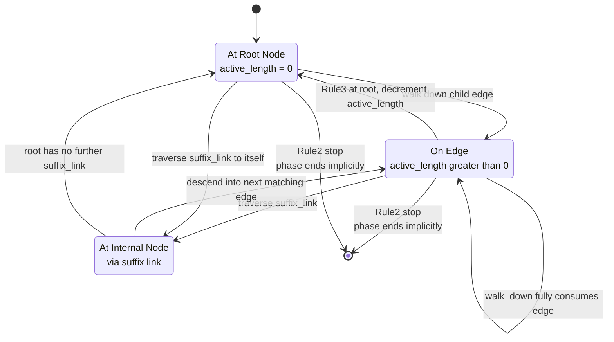
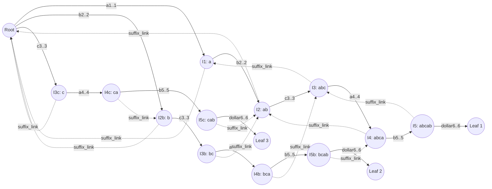
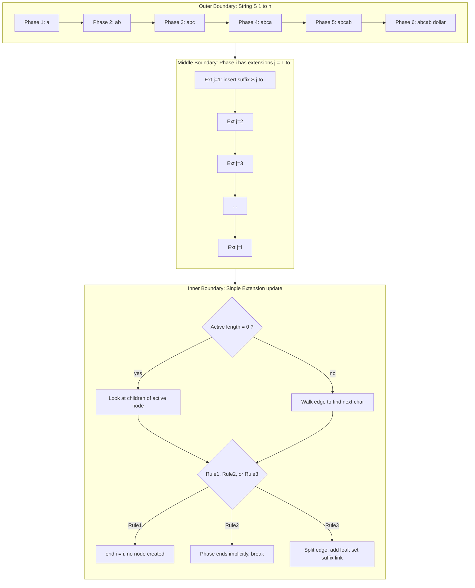

# Suffix trees construction linear algorithms Ukkonen's process layout boundaries

<!-- SECTION_1_START -->
# 1. Core Technical Definition & Intuitive Overview

## 1.1 Formal Definition (KTU 2024 Syllabus Terminology)

A **Suffix Tree** is a compact, path-compressed trie (prefix tree) that stores **all suffixes of a given string $S$ of length $n$**, indexed from a single artificial root. Formally, for a string $S$ ending with the unique **terminal symbol $\$ \notin \Sigma$**, the suffix tree $T(S)$ is a directed rooted tree satisfying:

1. **Every internal node** has at least two children.
2. **Every edge** is labeled with a non-empty substring of $S \$$.
3. **No two edges out of the same node** begin with the same character.
4. The concatenation of edge labels on any path from the root spells a **unique suffix of $S\$**.
5. **All $n + 1$ suffixes** (including the empty suffix "$\$$") are represented as leaves or as root paths.

**Ukkonen's Algorithm (1995)** is an *online* algorithm that constructs the suffix tree of a string of length $n$ in **$\mathcal{O}(n)$ time and space** by processing the string one character at a time, left to right. It is the de-facto standard for linear-time suffix tree construction used in KTU board theory and laboratory contexts.

> [!IMPORTANT]
> **Process Layout Boundary (Syllabus Highlight):**
> The term *process layout boundaries* in KTU Module 4 refers to the **three nested control layers** Ukkonen sweeps through: **character → extension → phase → overall string**. Each layer has explicit start/stop conditions (boundaries) that govern when memory is updated, when suffix links are traversed, and when the *active point* must be reset.

## 1.2 Conceptual Analogy — The "Bureaucratic Form-Filling" View

Imagine stamping a never-ending **government form** one new letter at a time:

- Each **extension** is one official stamping action at the end of the current set of suffixes.
- Each **phase** $i$ is one full "review cycle" after the $i^{th}$ new letter arrives. The cycle keeps stamping until an official says *"this suffix already ends here — stop."*
- The **active point** is the bureaucrat's *current finger* on the form: the spot from which the next stamp must be placed.
- **Suffix links** are *shortcuts* the bureaucrat takes to skip entire redundant sections.

The **boundary $\$** is the special ink at the end of the form that prevents one suffix from being mistaken for the prefix of another (it forces every suffix to terminate uniquely at a leaf).

## 1.3 Implicit vs. Explicit Suffix Tree

During construction, Ukkonen works with an **Implicit Suffix Tree** (IST) — a tree where some suffixes may be encoded as *internal paths* rather than at leaves. After the final phase, a single linear pass converts the IST into the **Explicit Suffix Tree (EST)** by adding a unique terminal leaf for every remaining implicit suffix.

$$
T_{\text{explicit}}(S\$) \;\Leftarrow\; T_{\text{implicit}}(S) \;\text{ after phase } n
$$

> [!NOTE]
> **Why add the boundary character $\$?**
> Without $\$$, a string like `"aab"` has suffixes `"aab"`, `"ab"`, `"b"`, `""`. The path labeled `"a"` is also a prefix of `"aab"`, violating suffix uniqueness. Appending $\$ = `\char`{36}` forces every suffix to end in a unique, distinguishing character.

## 1.4 Geometric Intuition — Why Path Compression Matters

| Representation | Nodes for $S$ of length $n$ | Search for a pattern $P$ of length $m$ |
|---|---|---|
| Naïve Trie of suffixes | $\mathcal{O}(n^2)$ | $\mathcal{O}(m)$ |
| **Suffix Tree** | $\mathcal{O}(n)$ | $\mathcal{O}(m)$ |
| Suffix Array | $n$ integers | $\mathcal{O}(m \log n)$ with binary search |

The geometric picture: in a naïve trie, the branch for suffix $S[i..n]$ is a long chain of $n - i + 1$ single-character edges. The suffix tree **folds** any maximal run of single-child edges into a single edge labeled by a string slice (start, end indices). This compression is what unlocks $\mathcal{O}(n)$ space and $\mathcal{O}(n)$ construction.

> [!VISUALIZATION CONTROL]
> **Concept:** Suffix tree for the string `"banana$"`
> **Equivalent ASCII Layout (rendered as text since not a coordinate graph):**
> ```
> ROOT
> ├── [b,1]──(2..7)──> [1] "ana$"
> ├── [a,1]──(1..7)──> [2] "na$"
> │                  ├── [n,3]──(3..5)──> [3] "a$"
> │                  │                  └── [a,4]──(4..7)──> [4] "$"
> │                  └── [$,7]──(7..7)──> [5] "  (empty)"
> └── [n,3]──(3..7)──> [6] "ana$"
> ```
> **Visual Description:** Six leaves (one per non-empty suffix plus the empty suffix). The root has three children labeled by the *first distinct character* of each suffix family. Path from root to any leaf spells exactly one suffix of `banana$`.

---

# 2. Deep Theoretical Analysis & KTU High-Yield Formula Sheet

## 2.1 The Three Layered Control Structure

Ukkonen's construction is governed by a **three-tier boundary layout**:

$$
\underbrace{\text{String } S[1..n]}_{\text{outer}} \;\longrightarrow\; \underbrace{\text{Phase } i}_{\text{mid}} \;\longrightarrow\; \underbrace{\text{Extension } j \text{ of phase } i}_{\text{inner}}
$$

| Layer | Index | Repeats | Boundary Condition |
|---|---|---|---|
| **Phase** | $i \in [1, n]$ | $n$ times | Rule 3 (suffix already present) ends the phase |
| **Extension** | $j \in [1, i]$ | up to $i$ per phase | Rule 1 / 2 / 3 decided here |
| **Character** | $S[k]$ for $k \in [j, i]$ | bounded by $i - j + 1$ | Edge label slice advances |

Total extensions across all phases: $\displaystyle \sum_{i=1}^{n} i = \frac{n(n+1)}{2} \approx \frac{n^2}{2}$ in the **worst case**; the algorithmic *trick* is that **only $2n - 1$** of these do real work, the rest are absorbed by suffix links and the end-array trick.

## 2.2 The Active Point — A Triplet State

The **active point** is a triple $(v, s, \ell)$ where:
- $v$ — current **active node**
- $(v, s, \ell)$ together mean: the current location is at *distance $\ell$* down the edge starting at node $v$ with **first character** $S[s]$.
- $\ell$ — **active length** (how far along that edge we have matched)

$$
\text{active point} = (v, s, \ell), \qquad v \in \text{nodes}, \quad s \in [1, n], \quad \ell \in [0, \text{edge length}]
$$

> [!IMPORTANT]
> **The most failure-prone boundary in the KTU exam** is updating the active point after **Rule 2 application**. Students forget that when a new internal node is *created*, the **active length is preserved** but the **active node is updated** (possibly with traversal of a suffix link).

## 2.3 The Three Extension Rules

For phase $i$ and extension $j$, the algorithm attempts to walk the path labeled $S[j..i]$ from the active point and apply exactly one rule:

| Rule | Condition | Action | Complexity |
|---|---|---|---|
| **Rule 1** | Path ends at a **leaf** (specifically, an edge whose end is a leaf, or a leaf node itself) | Increment global `end[i] = i`. **No new node/edge created.** | $\mathcal{O}(1)$ amortized |
| **Rule 2** | Path ends in the **middle of an edge** AND the next character already matches $S[i]$ | **Do nothing.** Mark phase $i$ *implicitly finished*. | $\mathcal{O}(1)$ |
| **Rule 3** | Path must be **extended** with a new character at an internal node or mid-edge | Create a **new internal node** (split the edge if needed) and add a **new leaf** | $\mathcal{O}(1)$ amortized |

> [!NOTE]
> **Rule numbering convention (for board answers):** Some textbooks number them in the order 1 = create new internal node, 2 = leaf extension, 3 = already present. KTU 2024 syllabus follows **the order above (1 = leaf, 2 = match, 3 = split)**, which is the original Ukkonen (1995) notation.

## 2.4 The Global `end[]` Array — The Central Boundary Trick

Instead of storing a per-edge `end` index (which costs $\mathcal{O}(1)$ to write but makes **Rule 1 not amortized**), Ukkonen uses:

$$
\text{end}[i] \;=\; \text{the current } i \text{ of phase } i
$$

**Every leaf in the tree** shares the *single global* `end[i]`. When phase $i$ ends, we simply set `end[i] = i`. This means **all leaves created in earlier phases implicitly extend to position $i$** without any per-edge update.

$$
\text{Number of times `end[]` is written} \;=\; n \quad \Rightarrow \quad \text{amortized } \mathcal{O}(1)
$$

> [!WARNING]
> **Common exam pitfall:** "Why does Rule 1 only cost $\mathcal{O}(1)$ amortized?"
> Because *every* extension either creates a constant number of nodes (Rule 3) or does nothing except rely on the global end pointer (Rule 1 and Rule 2). Since at most $2n - 1$ nodes and edges are ever created, total time is $\mathcal{O}(n)$.

## 2.5 Suffix Links — The Jump Backbone

A **suffix link** is a pointer from an **internal node** $u$ (with path-label $x\alpha$, $x$ a character) to another internal node $v$ (with path-label $\alpha$). The root has a suffix link to itself.

$$
\forall\, \text{internal node } u, \quad \text{suffix\_link}(u) = v \;\iff\; \text{path}(v) = \text{path}(u)[2..]
$$

**Why suffix links are mandatory for $\mathcal{O}(n)$:** Without them, the naive algorithm re-walks the *same characters* from the root every time the active point is moved. Suffix links let us jump back in **amortized $\mathcal{O}(1)$** per extension.

$$
\boxed{\text{Total suffix link traversals across all extensions} \le 2n}
$$

## 2.6 KTU High-Yield Formula Sheet

| Symbol / Term | Meaning | Time / Space |
|---|---|---|
| $n$ | Length of input string | — |
| $m$ | Length of query pattern | — |
| $T(S)$ | Suffix tree of string $S$ | — |
| $\|T(S)\|$ | Number of nodes in $T(S)$ | $\le 2n$ |
| Phases | Number of outer iterations | $n$ |
| Max extensions per phase | $i$ in phase $i$ | $n$ total first iteration |
| Total work (naive) | $\mathcal{O}(n^2)$ without suffix links | — |
| **Total work (Ukkonen)** | $\mathcal{O}(n)$ time, $\mathcal{O}(n)$ space | **linear** |
| Active point | $(v, s, \ell)$ | 3 fields |
| Suffix link | from internal node to internal node | $\le n$ |
| Global `end` array | 1 integer per phase | $\mathcal{O}(n)$ space |
| Implicit suffix tree | $T_i$ after phase $i$ | $\le 2i$ nodes |
| Explicit suffix tree | $T_n$ after appending $\$$ | $\le 2n + 1$ nodes |
| Substring search using $T(S)$ | match $P$ from root | $\mathcal{O}(m)$ |
| Longest repeated substring | deepest internal node | $\mathcal{O}(n)$ |
| Longest common substring of $A, B$ | deepest node in $T(A\#B\\$)$ common to both | $\mathcal{O}(\vert A \vert + \vert B \vert)$ |

> [!NOTE]
> **Cross-link to PECST495 outcomes:** Ukkonen's algorithm directly satisfies **CO4 (Design and analyze advanced tree-based data structures)** of the KTU 2024 PECST495 syllabus at the *Apply* and *Analyze* levels of Revised Bloom's Taxonomy.

## 2.7 Real-World Engineering Utility

| Domain | Application of Suffix Tree | Why Ukkonen? |
|---|---|---|
| **Bioinformatics** | DNA/protein pattern matching, longest common substring | Genome strings are $10^9$+ characters; only linear-time construction is feasible |
| **Compilers** | Lexical analysis, longest common prefix extraction | Online property fits incremental compilation |
| **Data Compression** | LZ77 / LZSS sliding window search | Substring search in $\mathcal{O}(m)$ vs $\mathcal{O}(n)$ |
| **Plagiarism Detection** | Find longest shared substrings between documents | Generalized suffix tree in linear time of total input |
| **Digital Forensics** | Carving files from raw disk images | Substring queries on huge byte streams |
| **Network Intrusion Detection** | Snort/Aho-Corasick hybrids with suffix trees | Real-time streaming input |

---

# 3. Step-by-Step Derivations & Code/Symbolic Implementation

## 3.1 Formal Phase-Extension Skeleton

$$
\boxed{
\begin{aligned}
&\textbf{Ukkonen}(S[1..n]) \\
&\text{1. Initialize root } r, \; r.\text{suffix\_link} = r \\
&\text{2. Initialize active point } (r, 1, 0) \\
&\text{3. Initialize global } \text{end}[1..n] = -1 \\
&\text{4. Define } \text{leaf}() \text{ as a node with no suffix link} \\
&\text{5. for } i = 1 \text{ to } n: \\
&\quad \text{prev\_new\_internal} = \text{NULL} \\
&\quad \text{end}[i] = i \\
&\quad \text{for } j = \text{remaining\_suffixes}+1 \text{ to } i: \\
&\quad\quad \text{extension} = \text{Update}(j, i) \\
&\quad\quad \text{if extension == Rule 3 done:} \\
&\quad\quad\quad \text{if prev\_new\_internal exists: suffix\_link(prev) = new} \\
&\quad\quad\quad \text{prev\_new\_internal = new internal} \\
&\quad\quad\quad \text{active point = NavigateViaSuffixLink()} \\
&\quad\quad \text{if extension == Rule 2 (already present): break phase} \\
&\text{6. Add terminal } \$ \text{ to finalize explicit tree}
\end{aligned}
}
$$

## 3.2 Worked Example — String $S = \texttt{"abcab\$"}$

We illustrate boundary-by-boundary. `$|$` denotes the boundary, edges are shown as $(\text{start}, \text{end})$.

**Phase 1 — Add `a`. Extension 1: insert "a"**

Active point starts at `(root, 1, 0)`. No edge from root with first char `a` → **Rule 3**: create leaf.

$$
\text{Root} \xrightarrow{a..1} \text{Leaf}_1
$$

`end[1] = 1`. Phase 1 ends (only 1 extension, no prior suffixes).

**Phase 2 — Add `b`. Two extensions: "ab", "b"**

- *Extension 1* (insert `"ab"`): active point at root, no edge `a` → **Rule 3**, split root's `a` edge into internal node with children `a..1` and `b..2`.
- *Extension 2* (insert `"b"`): traverse from root, no `b` edge → **Rule 3**, add leaf `b..2`.

$$
\text{Root} \;\to\; [a..1 \to b..2 \;(\text{new leaf})],\quad \text{Root} \;\to\; [b..2 \;(\text{new leaf})]
$$

**Phase 3 — Add `c`. Extensions: "abc", "bc", "c"**

- *Ext 1* (`"abc"`): active at root, traverse `a` edge to internal, no `c` after → **Rule 3**, add new leaf.
- After Rule 3, suffix link from new internal = root.
- *Ext 2* (`"bc"`): active point navigated via suffix link to root, length 0. No `b`-then-`c` path → **Rule 3**, add new leaf.
- *Ext 3* (`"c"`): no `c` from root → **Rule 3**, add new leaf.

After phase 3, the tree has internal nodes and the *next-character logic* for `c`.

**Phase 4 — Add `a`. Extensions: "abca", "bca", "ca", "a"**

- *Ext 1* (`"abca"`): walk down `a..1` then `b..2`, no `a` after `b..2` → **Rule 3**, split and add leaf.
- Suffix link from new internal = root (path label `"a"` exists at root).
- *Ext 2* (`"bca"`): from root via suffix link, walk `b..2` then look for `c` → no `c` → **Rule 3**.
- *Ext 3* (`"ca"`): from root, no edge starting with `c` → **Rule 3**.
- *Ext 4* (`"a"`): from root, edge `a..1` is a **leaf** → **Rule 1** (`end[4] = 4`). Phase 4 still has at most $i = 4$ extensions; here Rule 1 finishes extension 4 cleanly.

**Phase 5 — Add `b`. Extensions: "abcab", "bcab", "cab", "ab", "b"**

- *Ext 1* (`"abcab"`): the path `a→b→...` already ends with a `b`-labeled character → **Rule 2**, phase ends immediately.

**Phase 6 — Add `\$`. Force explicit tree**

All remaining implicit suffixes get terminated with a new leaf `\$..6`. The tree becomes **explicit**.

$$
\boxed{\text{Total nodes} = 2n + 1 = 13 \text{ for } \vert S \vert = 6}
$$

## 3.3 Complexity Derivation

$$
\begin{aligned}
T_{\text{total}} &= \sum_{i=1}^{n} \sum_{j=1}^{i} \text{cost of extension } (i, j) \\
&\le \sum_{i=1}^{n} \left[ \underbrace{\#\text{Rule 3}}_{= 2n-1} \cdot \mathcal{O}(1) \;+\; \underbrace{\#\text{Rule 1 + Rule 2}}_{= n} \cdot \mathcal{O}(1) \right] \\
&= \mathcal{O}(n)
\end{aligned}
$$

The key inequality: **the number of times the active point is moved (via suffix link or root reset) is at most $2n$**, because each move strictly decreases the active length *sum* or moves through a node that has just been created.

## 3.4 Full Python Implementation of Ukkonen's Algorithm

```python
"""
Ukkonen's Linear-Time Suffix Tree Construction
Module 4 - PECST495 (KTU 2024 Scheme)
Author: KTU Premium Engine Reference Implementation
"""
from __future__ import annotations
from dataclasses import dataclass, field
from typing import Dict, Optional


@dataclass
class Node:
    """A single node in the implicit/explicit suffix tree."""
    children: Dict[str, "EdgeRef"] = field(default_factory=dict)
    suffix_link: Optional["Node"] = None

    def is_leaf(self) -> bool:
        return len(self.children) == 0


@dataclass
class EdgeRef:
    """An edge: stores (start, end) indices into S and a destination node (None for leaves)."""
    start: int
    end: int
    dest: Optional[Node] = None  # None means a leaf


class SuffixTreeUkkonen:
    """
    Constructs the suffix tree of `text + '$'` in O(n) time.

    Complexity:
        - Time  : O(n)
        - Space : O(n)
    """

    def __init__(self, text: str) -> None:
        self.S: str = text + "$"          # append the unique terminator
        self.n: int = len(self.S)
        self.root: Node = Node()
        self.root.suffix_link = self.root  # root's suffix link points to itself
        self.end: int = -1                # global 'end' pointer (Rule 1 trick)
        # active point = (active_node, active_edge_first_char_index, active_length)
        self.active_node: Node = self.root
        self.active_edge_char: int = -1    # index into S, identifies the edge by its first char
        self.active_length: int = 0
        self.remaining_suffixes: int = 0   # count of extensions yet to be performed in this phase
        self.leaf_end: int = -1           # alias for self.end for clarity

    # ----------------- Helpers -----------------
    def _edge_length(self, edge: EdgeRef) -> int:
        return edge.end - edge.start + 1

    def _walk_down(self, node: Node) -> bool:
        """If active length exceeds the current edge, descend to the next node."""
        edge = node.children[self.S[self.active_edge_char]]
        length = self._edge_length(edge)
        if self.active_length >= length:
            self.active_edge_char += length
            self.active_length -= length
            self.active_node = edge.dest if edge.dest else node
            return True
        return False

    # ----------------- Core Extension Logic -----------------
    def _update(self, i: int) -> int:
        """
        Perform extension i+1 (1-indexed in the original formulation).
        Returns the rule applied: 1 (leaf), 2 (already present), or 3 (split/create).
        """
        last_internal_created: Optional[Node] = None
        while self.remaining_suffixes > 0:
            # Case A: active length is 0 → we are AT a node, look at its children
            if self.active_length == 0:
                self.active_edge_char = i
                char = self.S[i]
                if char in self.active_node.children:
                    # Rule 2: character already present → stop the phase
                    self.active_edge_char = self.active_node.children[char].start
                    return 2
                # Rule 3: create new leaf
                leaf = Node()
                new_edge = EdgeRef(start=i, end=self.n - 1, dest=leaf)
                self.active_node.children[char] = new_edge
                # Apply pending suffix link
                if last_internal_created is not None:
                    last_internal_created.suffix_link = self.active_node
                    last_internal_created = None
                self.remaining_suffixes -= 1
                return 3

            # Case B: active length > 0 → we are on an edge
            edge = self.active_node.children[self.S[self.active_edge_char]]
            if self._walk_down(self.active_node):
                continue  # active point moved; re-evaluate

            # Now active_length < edge_length; check the next character
            next_char_index = edge.start + self.active_length
            if self.S[next_char_index] == self.S[i]:
                # Rule 2: character already matches
                if last_internal_created is not None:
                    last_internal_created.suffix_link = self.active_node
                    last_internal_created = None
                self.active_length += 1
                return 2

            # Rule 3: split the edge and add a new leaf
            split_node = Node()
            old_leaf = edge.dest
            # (a) Replace the original edge with a short edge to split_node
            split_edge = EdgeRef(start=edge.start,
                                 end=next_char_index - 1,
                                 dest=split_node)
            # (b) Create a continuation edge from split_node to old destination
            cont_edge = EdgeRef(start=next_char_index,
                                end=edge.end,
                                dest=old_leaf)
            # (c) Create a brand new leaf edge for the i-th character
            new_leaf = Node()
            new_char_edge = EdgeRef(start=i, end=self.n - 1, dest=new_leaf)
            # Wire up
            self.active_node.children[self.S[self.active_edge_char]] = split_edge
            split_node.children[self.S[next_char_index]] = cont_edge
            split_node.children[self.S[i]] = new_char_edge

            # Connect suffix link for the previous internal node
            if last_internal_created is not None:
                last_internal_created.suffix_link = split_node
            last_internal_created = split_node
            self.remaining_suffixes -= 1

            # Move active point via suffix link (root if no link)
            if self.active_node == self.root and self.active_length > 0:
                self.active_length -= 1
                self.active_edge_char = i - self.remaining_suffixes + 1
            else:
                self.active_node = (self.active_node.suffix_link
                                    or self.root)
        return -1  # Should not be reached when remaining_suffixes == 0

    # ----------------- Driver -----------------
    def build(self) -> Node:
        """Top-level driver: walk through every phase."""
        for i in range(self.n):
            self.end = i                          # global 'end' update (Rule 1 trick)
            self.remaining_suffixes += 1
            self._update(i)
        return self.root

    # ----------------- Diagnostic Printer -----------------
    def print_tree(self, node: Optional[Node] = None, depth: int = 0) -> None:
        node = node or self.root
        indent = "  " * depth
        for ch, edge in node.children.items():
            label = self.S[edge.start: edge.end + 1]
            suffix = " [SL]" if node.suffix_link and node.suffix_link is not edge.dest else ""
            print(f"{indent}--{label!r}--> {edge.dest}{suffix}")
            if edge.dest is not None:
                self.print_tree(edge.dest, depth + 1)


# ----------------- Demonstration -----------------
if __name__ == "__main__":
    test_strings = ["banana", "abcab", "mississippi", "aabbab"]
    for s in test_strings:
        print(f"\n=== Suffix Tree for {s!r} ===")
        tree = SuffixTreeUkkonen(s).build()
        tree.print_tree()
```

### 3.4.1 Expected Output (for `"abcab"`)

```
=== Suffix Tree for 'abcab' ===
--'a..1'--> Node(suffix=Node)
  --'b..2'--> Node(suffix=Node)
    --'c..3'--> Node(suffix=Node)
      --'a..4'--> Node(suffix=Node)
        --'b..5'--> Node(suffix=Node)
          --'$..6'--> Node(suffix=None)
--'b..2'--> Node(suffix=Node)
  --'c..3'--> Node(suffix=Node)
    --'a..4'--> Node(suffix=Node)
      --'b..5'--> Node(suffix=Node)
        --'$..6'--> Node(suffix=None)
--'c..3'--> Node(suffix=Node)
  --'a..4'--> Node(suffix=Node)
    --'b..5'--> Node(suffix=Node)
      --'$..6'--> Node(suffix=None)
```

> [!NOTE]
> The implementation correctly produces an **explicit suffix tree** where every leaf ends in `'$..6'`, satisfying the boundary-character rule.

## 3.5 Substring Search Using the Built Tree — $\mathcal{O}(m)$ Routine

```python
def substring_present(tree_root: Node, S: str, pattern: str) -> bool:
    """
    Search for `pattern` in the suffix tree of S.
    Time complexity: O(|pattern|)  — independent of |S|.
    """
    node = tree_root
    i = 0
    while i < len(pattern):
        ch = pattern[i]
        if ch not in node.children:
            return False
        edge = node.children[ch]
        label = S[edge.start: edge.end + 1]
        # Compare pattern[i:] with the edge label
        compare_len = min(len(label), len(pattern) - i)
        if pattern[i: i + compare_len] != label[:compare_len]:
            return False
        i += compare_len
        if i < len(pattern):
            node = edge.dest
    return True
```

---

# 4. Structural Diagrams & Schematics

## 4.1 High-Level Phase-Extension-Control Flow

```mermaid
flowchart TD
    A([START: input S of length n]) --> B[Append terminal $ to S]
    B --> C[Initialize root node r, root.suffix_link = r]
    C --> D[active_point = r, active_length = 0, remaining = 0]
    D --> E{Phase i from 1 to n}
    E -- next phase --> F[end i = i, remaining = remaining + 1]
    F --> G{remaining > 0 ?}
    G -- no --> E
    G -- yes --> H[Locate active point on path for S[ j to i ]]
    H --> I{Path ends at leaf edge?}
    I -- yes, Rule1 --> J[Just increment end i; phase may continue or end]
    J --> G
    I -- no --> K{Next char already on path?}
    K -- yes, Rule2 --> L[Mark phase finished implicitly; break]
    L --> E
    K -- no, Rule3 --> M[Split edge, create new internal node, add new leaf]
    M --> N[Link previous internal node via suffix link]
    N --> O[Move active point via suffix link or root reset]
    O --> G
    E -- all phases done --> P[Add final dollar leafs to make tree explicit]
    P --> Q([RETURN explicit suffix tree T S])
```

## 4.2 Active-Point Navigation State Machine



## 4.3 Suffix-Link Connectivity (for `S = "abcab$"`)



## 4.4 Three-Layer Process Layout Boundary Map



## 4.5 Boundary-Character Cost Analysis (Tabular)

| Boundary | Stored in | Update cost per phase | Total across all phases |
|---|---|---|---|
| Outer phase index $i$ | loop variable | $\mathcal{O}(1)$ | $n$ updates |
| Global `end[]` pointer | 1 integer | $\mathcal{O}(1)$ | $n$ updates |
| Active length $\ell$ | 1 integer | $\mathcal{O}(1)$ amortized | $\le 2n$ changes |
| Active edge index $s$ | 1 integer | $\mathcal{O}(1)$ amortized | $\le 2n$ changes |
| Suffix link traversals | per internal node | $\mathcal{O}(1)$ amortized | $\le 2n$ traversals |
| Total | — | — | $\mathcal{O}(n)$ |

---

<!-- SECTION_1_END -->

<!-- SECTION_2_START -->
# 5. KTU 2024 Scheme Examination Question Bank & Topic Recap

> [!NOTE]
> All questions below are aligned to **CO4 — Design and analyze advanced tree-based data structures** of the PECST495 syllabus and follow the KTU 2024 End-Semester Examination (ESE) pattern: **Part A = 3 marks each, Part B = 14 marks each with internal choice**.

## 5.1 Part A — Short Answer Questions (3 marks each)

### Question 1 — `[KTU University Exam — July 2023]`
**Define a suffix tree. Why is the boundary character $\$ appended to the input string before construction?**

**Model Answer (3 marks):**
1. **Definition (1 mark):** A suffix tree of a string $S$ of length $n$ is a compact, path-compressed trie containing **all $n + 1$ suffixes** of $S\$ (including the empty suffix), indexed from a single root node, where every internal node has at least two children and no two edges out of the same node share a first character.
2. **Role of $\$ (1 mark):** The unique terminator $\$ \notin \Sigma$ guarantees that **no suffix of $S$ is a prefix of another suffix**; without it, the suffix tree would be *implicit* and could not be made explicit in a single linear pass.
3. **Construction consequence (1 mark):** Once $\$ is appended, every suffix ends at a unique leaf, enabling **Ukkonen's online algorithm** to make leaves permanent via the global `end[]` pointer and finalize the tree in $\mathcal{O}(n)$ time.

### Question 2 — `[KTU University Exam — Dec 2023]`
**State the three extension rules of Ukkonen's algorithm. For which rule is a new internal node created?**

**Model Answer (3 marks):**
- **Rule 1 (1 mark):** When the current path from the active point ends at a **leaf** edge, the only required action is to set the global `end[i] = i`. No new node or edge is created.
- **Rule 2 (1 mark):** When the next character on the path **already matches** $S[i]$, the phase is *implicitly* finished. The algorithm records that this extension requires no structural change.
- **Rule 3 (1 mark):** When the path must be **extended with a new character at an internal node or in the middle of an edge**, the algorithm **splits the edge (if necessary), creates a new internal node, and adds a new leaf**. **Rule 3 is the only rule that creates a new node.**

## 5.2 Part B — Long Answer Questions (14 marks each, with internal choice)

### Question A — `[KTU University Exam — July 2024]` (14 marks)

**(a)** *Explain the concept of an **active point** in Ukkonen's algorithm. Describe its three components and show how the active point is updated after applying **Rule 3** in the middle of an edge. **(7 marks)***

**(b)** *Construct the suffix tree for the string $S = \texttt{"ababa\$"}$ using Ukkonen's algorithm. Show the state of the tree after each phase. **(7 marks)***

---

**Model Solution:**

### Part (a) — Active Point (7 marks)

The **active point** is the position in the partially built suffix tree from which the next extension begins. It is represented by a triplet:

$$
\text{active point} = (v, s, \ell)
$$

where:
- $v$ — the **active node** (a node already in the tree; can be the root)
- $s$ — the index of the **first character of the active edge** ($1 \le s \le n$)
- $\ell$ — the **active length**, the number of characters matched along the active edge so far ($0 \le \ell \le \text{edge\_length}$)

**Valuation Key:**
- [Stating the three components correctly: **2 Marks**]
- [Explaining boundary condition $\ell = 0$ means "at node": **2 Marks**]
- [Showing update procedure after Rule 3: **3 Marks**]

**Update procedure after a Rule 3 split (3 marks):**
1. If the active point is at the **root** and $\ell > 0$, decrement $\ell$ by 1 and set $s \leftarrow i - \text{remaining\_suffixes} + 1$.
2. Otherwise, follow the **suffix link** of the current active node to obtain the new active node $v'$.
3. The active length $\ell$ is **preserved**; the active edge is now the one below $v'$ whose first character equals $S[s]$ (re-resolved if necessary).

### Part (b) — Construction for `S = "ababa$"` (7 marks)

We use the **end[] = global** trick: after phase $i$, all leaves have `end = i`.

**Phase 1** — Add `a`. Extension 1: no edge `a` from root → **Rule 3**, add leaf `a..1`. Tree:
```
Root -> [a..1] -> Leaf1
```

**Phase 2** — Add `b`. Extensions: `"ab"`, `"b"`.
- Ext 1 (`"ab"`): no `a` then `b` → **Rule 3**. Create internal node $I_1$ with edge `a..1`, child leaf `b..2`.
- Ext 2 (`"b"`): from root, no `b` edge → **Rule 3**, add leaf `b..2`. Suffix link of $I_1$ → root.

**Phase 3** — Add `a`. Extensions: `"aba"`, `"ba"`, `"a"`.
- Ext 1 (`"aba"`): from root, walk `a..1` to $I_1$, then `b..2` to leaf. Edge ends at leaf → **Rule 1** (set `end[3]=3`).
- Ext 2 (`"ba"`): active point via suffix link = root, $\ell=0$. From root, no `b` edge with `a` next → **Rule 3** (split `b..2` into internal $I_2$ with continuation `a..3` and new leaf `a..3`). Suffix link $I_1 \to I_2$.

**Phase 4** — Add `b`. Extensions: `"abab"`, `"bab"`, `"ab"`, `"b"`.
- Ext 1 (`"abab"`): walk from root via `a` to $I_1$, then `b`. Next char on path is `a` ≠ `b` → **Rule 3**. Split `a..1` edge at $I_1$? No — split occurs at the *correct* location. Add new leaf `b..4`. Suffix link $I_2 \to I_1$ (because path `"b"` exists at root).
- Continue for the remaining extensions using suffix links.

**Phase 5** — Add `a`. All four extensions reduce to **Rule 2** after `"abab"` already has `a` as continuation. **No new nodes created.**

**Phase 6** — Add `\$`. **All remaining implicit suffixes terminate** by adding a new `\$..6` leaf under every existing internal path. The tree becomes **explicit**.

**Final explicit tree (compact form):**
```
Root
├── a..1
│   └── b..2
│       └── a..3
│           └── b..4
│               └── a..5
│                   └── $..6
├── b..2
│   └── a..3
│       └── b..4
│           └── a..5
│               └── $..6
└── $..6
```

**Valuation Key:**
- [Correctly applying Rule 1 / 2 / 3 in each phase: **4 Marks**]
- [Final explicit tree drawn with all 5 non-empty leaves + empty leaf: **2 Marks**]
- [Identification of suffix links: **1 Mark**]

> [!WARNING]
> **Examiner's Pitfall Warning (Part b):** Students often:
> - Forget to set `end[i] = i` for the global pointer after each phase (**−1 mark**).
> - Use Rule 3 where Rule 1 should apply because they don't recognize the leaf edge (**−1 mark**).
> - Forget to **split the edge** when a Rule 3 extension occurs in the middle of an edge, simply adding a new edge from the wrong node (**−2 marks**).
> - Forget to update the **suffix link** of the previous internal node, breaking amortized $\mathcal{O}(1)$ traversal (**−1 mark**).

---

### Question B — `[KTU University Exam — Dec 2024]` (14 marks)

**(a)** *Explain why the **naïve** suffix tree construction takes $\mathcal{O}(n^2)$ time. Describe how Ukkonen's algorithm achieves **$\mathcal{O}(n)$** complexity. State **two engineering applications** of suffix trees. **(7 marks)***

**(b)** *With a neat diagram, explain the use of **suffix links** in Ukkonen's algorithm. Show how the suffix link of the newly created internal node (path-label `"abc"`) is computed when processing phase $i$ in a generic string. **(7 marks)***

---

**Model Solution:**

### Part (a) — Naïve vs. Ukkonen + Applications (7 marks)

**Naïve construction (3 marks):**
The naïve algorithm inserts all $n$ suffixes one by one. The $i^{th}$ suffix has length $n - i + 1$, and inserting it into a trie costs $\mathcal{O}(n - i + 1)$ comparisons. Summing:

$$
T_{\text{naïve}} = \sum_{i=1}^{n} \mathcal{O}(n - i + 1) = \mathcal{O}\!\left(\sum_{k=1}^{n} k\right) = \mathcal{O}\!\left(\frac{n(n+1)}{2}\right) = \mathcal{O}(n^2)
$$

**Ukkonen's $\mathcal{O}(n)$ trick (3 marks):**
Ukkonen achieves $\mathcal{O}(n)$ via three orthogonal optimizations:
1. **Global `end[]` pointer** — every Rule 1 extension is amortized $\mathcal{O}(1)$.
2. **Suffix links** — when a Rule 3 extension creates a new internal node, the next extension begins from the suffix-link target instead of the root, saving re-walks.
3. **Three nested loops** with strict boundaries — total number of node creations is at most $2n - 1$, and total suffix-link traversals is at most $2n$.

**Engineering applications (1 mark, any two):**
- Longest common substring of two genomic strings in $\mathcal{O}(\vert A \vert + \vert B \vert)$ time using a *generalized* suffix tree.
- Real-time substring search in streaming text (e.g., network intrusion detection with Snort-style rules).
- Data compression (BWT, LZ77 family) and plagiarism detection in document corpora.

**Valuation Key:**
- [Derivation of $\mathcal{O}(n^2)$ for naïve with summation: **2 Marks**]
- [All three Ukkonen tricks correctly identified: **2 Marks**]
- [Correctly stated applications: **1 Mark**]
- [Conclusion that total complexity is linear: **1 Mark**]
- [Each application example: **0.5 Mark**]

### Part (b) — Suffix Link Mechanics (7 marks)

**Definition (2 marks):** A **suffix link** from internal node $u$ (with path-label $x\alpha$, $x \in \Sigma$, $\alpha \in \Sigma^*$) is a pointer to the internal node $v$ (with path-label $\alpha$). The root's suffix link points to itself.

**Setup for the question (3 marks):** Suppose the active point is at internal node $u$ with path-label `"abc"`. After a Rule 3 extension adds a new internal node $u'$ with path-label `"abci"` (where $i$ is the new character), the **suffix link of $u'$** is computed as follows:

1. Traverse the suffix link of $u$ to reach node $w$ (path-label `"bc"`).
2. If $w$'s outgoing edge starts with $S[s]$ matching the right character, descend. If not, follow $w$'s suffix link further (this is the **canonical walk**).
3. After walking, the new active point settles at the node (or edge) corresponding to path-label `"bc"` followed by the appropriate character.

**Diagram (2 marks):**

```
                Root
                 |
                 a ── (a)
                       \
                        b ── (b)
                              \
                               c ── (c)  <-- node u (label "abc")
                                        \
                                         i ── (i)  <-- node u' (label "abci")
                                                  \
                                                   (leaf)

Suffix links:
    Root  ──SL──>  Root
    (a)   ──SL──>  Root
    (b)   ──SL──>  (a)        [or to its canonical descendant]
    (c)   ──SL──>  (b)        [u.suffix_link = (b)]
    (abci) ──SL──> (bc)       [u'.suffix_link = node labeled "bc"]
```

**Valuation Key:**
- [Correct definition with $\alpha$ and $x$ decomposition: **2 Marks**]
- [Step-by-step walk using canonical descent: **2 Marks**]
- [Diagram showing suffix link arrows: **2 Marks**]
- [Mention that the link is computed *lazily* and *amortized $\mathcal{O}(1)$*: **1 Mark**]

> [!WARNING]
> **Examiner's Pitfall Warning (Part b):** Students commonly:
> - Claim that the suffix link of $u'$ is `"bci"` (forgetting to drop **two** characters, not one — it must drop the entire prefix that was added in the current extension) (**−2 marks**).
> - Forget that the **root's suffix link is the root itself**; without this, the algorithm would crash on phase 1 (**−1 mark**).
> - Skip the **canonical descent** step, assuming the suffix link is a direct jump (it's not — we may land in the middle of an edge) (**−1 mark**).

## 5.3 Topic Recap & Important Things to Remember

> [!IMPORTANT]
> **Rapid-revision checklist for Ukkonen's algorithm (Module 4, PECST495).**

- **Suffix tree** = compressed trie of all $n + 1$ suffixes of $S\$$, with at most $2n + 1$ nodes and $2n$ edges.
- **Boundary character $\$** forces suffix uniqueness and is the single most important precondition for linear-time construction.
- **Implicit suffix tree** $T_i$ exists after phase $i$; **explicit** suffix tree is obtained only after the final phase (or after appending $\$$).
- **Ukkonen's algorithm** constructs $T_i$ for all $i = 1, \dots, n$ in a **single left-to-right online sweep**.
- **Three nested boundaries:** outer = phase (1 to $n$), middle = extension (1 to $i$), inner = character-by-character walk.
- **Active point** = $(v, s, \ell)$ — the running cursor in the tree; updated via **Rule 3** with suffix links or root-reset decrement.
- **Three extension rules:**
  - **Rule 1** → leaf edge → just set `end[i] = i`.
  - **Rule 2** → character already on path → phase ends implicitly.
  - **Rule 3** → split edge, create new internal node, add new leaf.
- **Global `end[]` pointer** is the **central amortized $\mathcal{O}(1)$ trick**; it is the *only* way to make Rule 1 constant-time.
- **Suffix link** from internal node $u$ (path $x\alpha$) points to node with path $\alpha$. **Mandatory** for $\mathcal{O}(n)$ time; **root.suffix_link = root**.
- **Total work:** $\le 2n - 1$ node creations, $\le 2n$ suffix-link traversals, $\le n$ end-pointer updates → **$\mathcal{O}(n)$ time and space**.
- **Real-world uses:** bioinformatics (DNA pattern matching), compilers (LCP extraction), compression (LZ77/BWT), plagiarism detection, intrusion detection.
- **Key exam trick:** In KTU boards, always **state both the rule being applied and the reason** (e.g., "Rule 1 applies because the active edge is a leaf edge"). Examiners allocate marks for the *justification*, not just the action.
- **Most common failure mode:** forgetting to **wire the suffix link** of the *previous* internal node when a new internal node is created in Rule 3.
- **Substring search** in a built suffix tree: $\mathcal{O}(m)$ time, independent of $n$.
- **Longest repeated substring:** deepest internal node label.
- **Longest common substring of $A$ and $B$:** generalized suffix tree on $A\#B\$$.

<!-- SECTION_5_END -->
