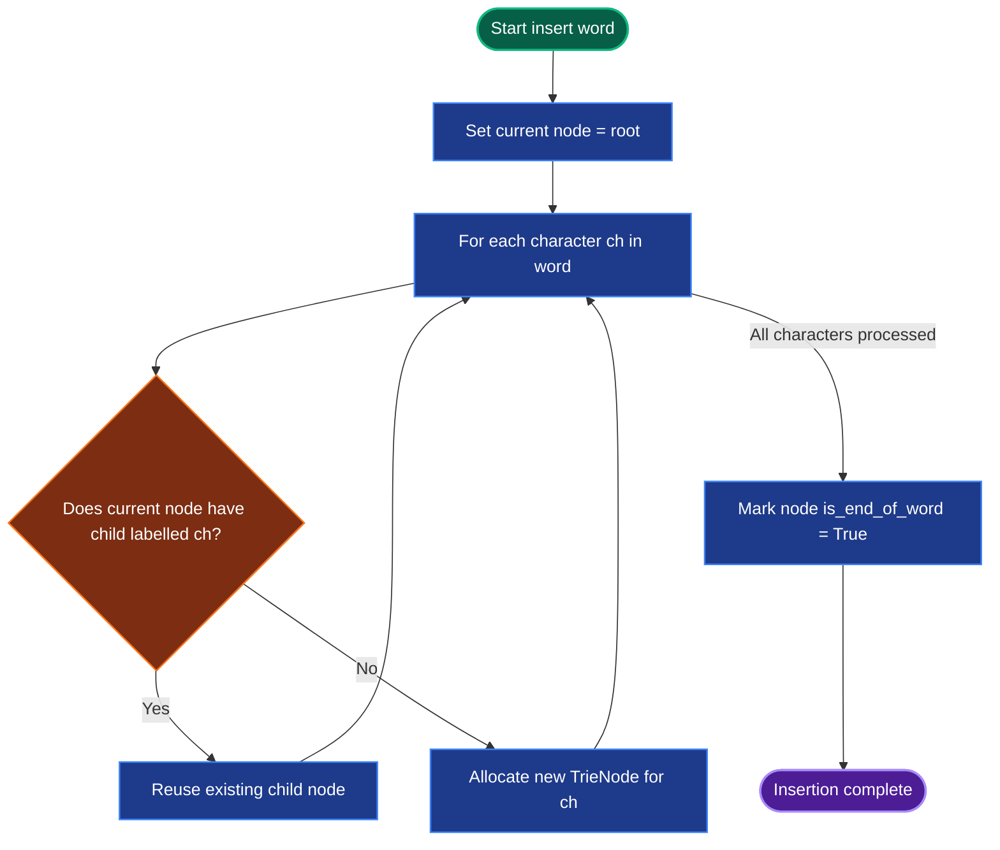
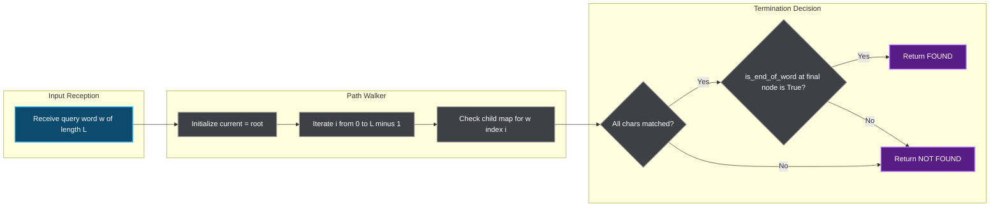
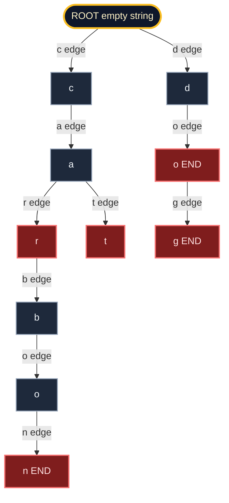
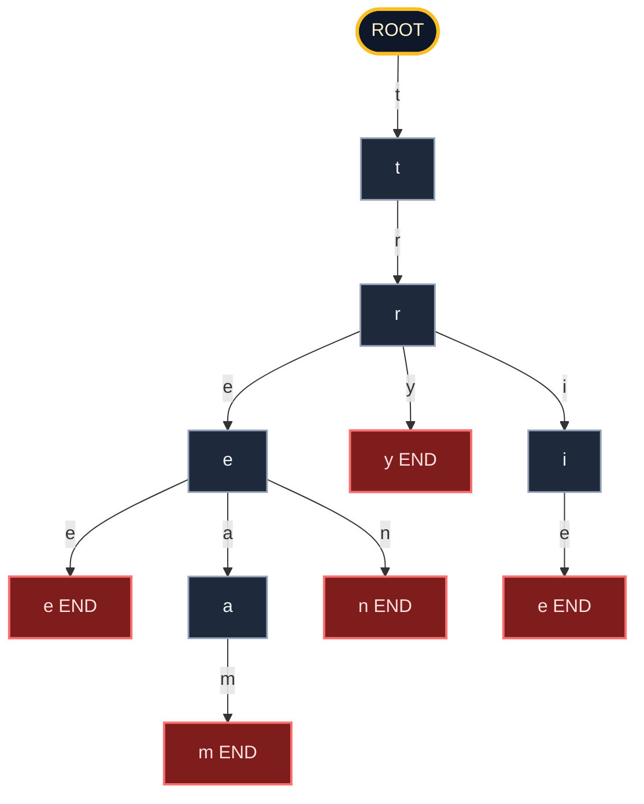
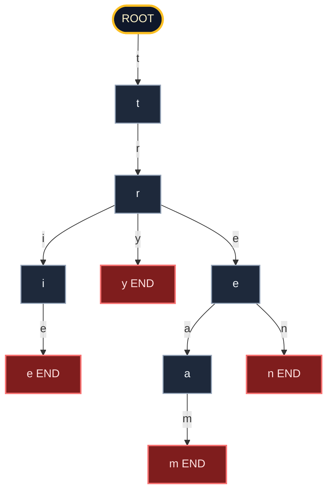

# Tries character route mapping structural configurations parameters frameworks

<!-- SECTION_1_START -->
# Tries — Character Route Mapping for String Indexing

## Formal KTU 2024 Scheme Definition

> [!IMPORTANT]
> **Trie (Prefix Tree / Digital Tree)**: A Trie is an ordered, hierarchical, **rooted tree data structure** that stores a dynamic set of strings (keys) where each edge is labelled with a single character from a fixed alphabet $\Sigma$, and the path from the root to any internal node or leaf encodes either a complete stored key or a prefix shared by a subset of keys. Every node maintains a fixed branching factor of $\vert\Sigma\vert$ (alphabet cardinality) and carries an `is_end_of_word` boolean flag to mark the terminus of an inserted key.

**Core Terminology (KTU Board Vocabulary):**

| Term | Definition |
|------|------------|
| **Alphabet ($\Sigma$)** | Finite, ordered character set such as $\{a, b, c, \ldots, z\}$ |
| **Node (Vertex)** | Represents a single prefix; stores child pointers and a terminal flag |
| **Root** | The empty-string $\varepsilon$ node; has no incoming edge |
| **Depth** | Number of edges from root to that node = length of the represented prefix |
| **Terminal Node** | A node where `is_end_of_word` is **True**; marks a valid stored key |
| **Branching Factor** | Out-degree of a node, bounded by $\vert\Sigma\vert$ |

> [!NOTE]
> KTU students must remember: a Trie is **not** a binary tree. The branching factor is dictated by the alphabet cardinality, not by a fixed 2-way comparison. This is a common board-exam trap question.

## Intuitive Overview — The Real-World Analogy

**Analogy: A Smart Predictive Text Directory**

Imagine you are typing in an old-style mobile phone's T9 predictive text system. As you press the digit `2` (which contains `a`, `b`, `c`), the system doesn't yet know which word you want. When you press `2` again, it narrows your options to words beginning with `aa`, `ab`, or `ac`. Each keystake pulls you down one level of a "decision tree," and at the very bottom of each complete path lies a confirmed word.

A **Trie behaves exactly like this**:

1. The **root** is the empty state (no characters typed yet).
2. Typing a character is equivalent to traversing **one edge downward**.
3. Words that share a common starting sequence (like `cat`, `car`, `carbon`) all funnel through the **same shared prefix path** `c → a`.
4. The moment your path reaches a node flagged as `is_end_of_word = True`, you have arrived at a **valid, complete word**.

**Geometric Intuition:** Lay the alphabet $\Sigma$ horizontally and draw the root as a single point at the top. Each character you type is a "rung" on a ladder. The final ladder-rungs that reach the ground (terminal nodes) are your stored words. All other rungs are **partial prefixes** still waiting to be extended.

> [!TIP]
> **Why "Trie" comes from "retrieval"** — the word was coined by Edward Fredkin (1959) and pronounced like "try" (some say "tree"). It is a **reTRIEval** structure, optimized for **lookups by prefix** rather than for storing data in sorted order.

## Standard Alphabet Parameter Reference

| Application Domain | Alphabet $\Sigma$ | Cardinality $\vert\Sigma\vert$ |
|--------------------|-------------------|-------------------------------|
| Lowercase English letters | $\{a, \ldots, z\}$ | **26** |
| Full ASCII printable | $\{32, \ldots, 126\}$ | **95** |
| Extended ASCII / bytes | $\{0, \ldots, 255\}$ | **256** |
| Alphanumeric case-sensitive | $\{A-Z, a-z, 0-9\}$ | **62** |
| DNA Genomics | $\{A, C, G, T\}$ | **4** |
| Telephone digits | $\{0, \ldots, 9\}$ | **10** |

> [!VISUALIZATION CONTROL]
> **Concept:** A small Trie containing the keys `cat`, `car`, `dog`, `do` rooted at the empty string.
> **GeoGebra / Desmos Input Equations:** *(Tree graphs are best drawn as a tree diagram, not a function plot — but if forced to plot, treat node depth as the y-axis: $y = -d$ where $d$ is the depth.)*
> **Visual Description:** Root (depth 0) has two children `c` (depth 1) and `d` (depth 1). Node `c` has a child `a` (depth 2), which has two children `r` (depth 3) and `t` (depth 3), both terminal. Node `d` has a child `o` (depth 2), which has a child `g` (depth 3, terminal) and is itself terminal (since `do` is a stored key).

<!-- SECTION_1_END -->

<!-- SECTION_2_START -->
# Deep Theoretical Analysis & KTU High-Yield Formula Sheet

## Structural Anatomy of a Trie Node

A Trie node is a composite record containing three logical components. Under the hood, this is usually implemented as either:

- **Array-based:** A fixed-size array of length $\vert\Sigma\vert$ storing child references (`True` / pointer).
- **Hash-map / Dictionary-based:** A sparse `Dict[char, Node]` storing only existing children (memory-efficient for small alphabets and sparse keys).
- **Linked-list / Vector-based:** Each node keeps a dynamic list of $(char, child\_node)$ pairs.

> [!IMPORTANT]
> KTU 2024 board exams often ask: *"Which implementation is space-efficient for sparse tries?"* — the answer is the **Hash-map / Dictionary-based** node, because it only allocates children that actually exist, rather than reserving $\vert\Sigma\vert$ slots for every node.

## Asymptotic Complexity Formula Sheet

| Operation | Time Complexity | Space Complexity (Auxiliary) | Notes |
|-----------|----------------|------------------------------|-------|
| **Insert key $w$** | $O(\vert w\vert \cdot \sigma_{\text{map}})$ | $O(\vert w\vert)$ for new nodes | $\sigma_{\text{map}}$ = cost of map lookup (amortized $O(1)$) |
| **Search exact key $w$** | $O(\vert w\vert \cdot \sigma_{\text{map}})$ | $O(1)$ | Walk the path; check terminal flag at the end |
| **Starts-with prefix $p$** | $O(\vert p\vert \cdot \sigma_{\text{map}})$ | $O(1)$ | Walk to the prefix node and verify existence |
| **Autocomplete (list all keys with prefix $p$)** | $O(\vert p\vert + n \cdot \bar{L})$ | $O(n \cdot \bar{L})$ where $n$ = number of matches, $\bar{L}$ = average match length | DFS from the prefix node |
| **Delete key $w$** | $O(\vert w\vert \cdot \sigma_{\text{map}})$ | $O(1)$ (or $O(\vert w\vert)$ recursion stack) | Requires post-order cleanup of empty nodes |
| **Total storage for $N$ keys of average length $\bar{L}$** | — | $O(N \cdot \bar{L} \cdot \vert\Sigma\vert)$ worst case | Reduced to $O(N \cdot \bar{L})$ with hash-map nodes |
| **Longest Common Prefix of two keys** | $O(\min(\vert w_1\vert, \vert w_2\vert))$ | $O(1)$ | Walk both paths in parallel until they diverge |

## Critical Theorem — Shared-Prefix Space Savings

> [!NOTE]
> **Theorem (Prefix Sharing Invariant):** If $K$ keys share a common prefix of length $p$, the Trie stores that prefix path **exactly once**, occupying $O(p \cdot \vert\Sigma\vert)$ nodes total, regardless of $K$.

**Why this matters:** Compared to a hash table (which stores each key independently, requiring $O(\sum \vert w_i\vert)$ memory), a Trie is asymptotically superior when the key set is **dense in shared prefixes** — for example, English dictionary words, URLs, IP prefixes, and genomic sequences.

## Failure Function, Edge Labelling, and Navigation Rules

1. **Edge uniqueness:** A node $N$ at depth $d$ may have **at most one** incoming edge from its parent, labelled with a specific character $c \in \Sigma$. Two parents cannot converge into the same child via different characters.
2. **Sibling uniqueness:** The children of any node must have **distinct** character labels. You may not have two children of the same node both labelled `e`.
3. **Terminal vs. internal:** A node can be both internal (has children) **and** terminal (`is_end_of_word = True`). The phrase `"do"` being a valid key while `"dog"` is also a valid key is preserved by marking node `o` as terminal even though it has a child `g`.

## Variants of the Standard Trie (KTU 2024 High-Priority)

| Variant | Core Modification | Engineering Use Case |
|---------|-------------------|---------------------|
| **Standard Trie** | Array of $\vert\Sigma\vert$ children per node | Small alphabets, fixed size |
| **Compressed Trie (Radix Trie / Patricia Tree)** | Chains of single-child nodes are merged into a single edge with a string label | URL routing (Linux radix tree, BSD routing tables) |
| **Ternary Search Trie (TST)** | Each node has 3 children: `lo`, `eq`, `hi`; one character stored per node | Spell-checkers, fuzzy search, T9 dictionaries |
| **Suffix Trie** | Built from **all suffixes** of a single string $S$ of length $n$ | Pattern matching, longest repeated substring, bioinformatics |
| **Aho-Corasick Trie** | Augmented with `failure` (goto) links and `output` lists | Multi-pattern string matching (intrusion detection, antivirus) |
| **Double-Array Trie (DAT)** | Trie encoded in two integer arrays `base[]` and `check[]` | High-performance lexical analyzers, MeCab, NLP tokenizers |

## Real-World Engineering Utility

- **Autocomplete / Search-as-you-type:** Google, Amazon, IDEs.
- **IP Routing (Longest Prefix Match):** Internet backbone routers use Patricia / Radix tries on $\vert\Sigma\vert = 2^{32}$ or $2^{128}$ for IPv4/IPv6 forwarding.
- **Spell Checkers & T9 Keyboards:** Ternary Search Tries map digit sequences to word candidates.
- **Bioinformatics:** Aho-Corasick and suffix tries scan DNA for motif occurrences.
- **Compiler Symbol Tables:** Reserved keywords are stored in a trie for $O(L)$ recognition during lexing.
- **T9 / Word Suggestion on Mobile Devices:** Each digit maps to a subtree.
- **Distributed Systems:** Apache Kafka, Redis Cluster, and many key-value stores use radix-trees for metadata indexing.

<!-- SECTION_2_END -->

<!-- SECTION_3_START -->
# Step-by-Step Derivations, Proofs, and Code Implementation

## 3.1 Derivation — Total Nodes Required for a Trie with $N$ Keys

**Given:** A set $K = \{w_1, w_2, \ldots, w_N\}$ of strings, each of length $L_i = \vert w_i\vert$, drawn from an alphabet $\Sigma$ of cardinality $\vert\Sigma\vert$.

**Claim:** A standard trie storing $K$ contains at most

$$
N_{\text{nodes}} \le 1 + \sum_{i=1}^{N} L_i
$$

nodes, with equality holding when **no two keys share any non-trivial prefix**.

**Proof by construction:**

- Begin with the root node (the empty string), contributing $+1$ to the count.
- For each key $w_i$, traverse the existing trie character by character.
- For every character $c$ of $w_i$ that is **not already present** as a child at the current depth, allocate one new node.
- Each new node corresponds to a unique (prefix, character) pair; two different keys cannot trigger the same allocation because, by the sibling-uniqueness rule, that edge would have already existed.

Therefore, the number of allocations for $w_i$ is at most $L_i$, and summing across all $N$ keys plus the root:

$$
N_{\text{nodes}} \le 1 + \sum_{i=1}^{N} L_i
$$

**Example with $K = \{`\text{cat}`, `\text{car}`, `\text{carbon}`, `\text{do}`, `\text{dog}`\}$:**

Total characters across all keys:

$$
\sum L_i = 3 + 3 + 6 + 2 + 3 = 17
$$

Therefore $N_{\text{nodes}} \le 1 + 17 = 18$ in the worst case. Due to shared prefixes `ca` and `do`, the actual node count is **15**. ∎

## 3.2 Derivation — Search Time is Linear in Key Length

**Given:** A target key $w$ of length $L = \vert w\vert$.

**Step 1.** Set the current node to the root. Initialize $i = 0$.

**Step 2.** While $i < L$:
   - Look up the child pointer labelled $w[i]$ in the current node's child map.
   - If absent, return `False` (key not present).
   - Otherwise, descend to that child and increment $i$.

**Step 3.** After $L$ iterations, the current node represents the full key $w$. Return the value of its `is_end_of_word` flag.

Since each iteration performs exactly one map lookup (amortized $O(1)$) and the loop runs exactly $L$ times:

$$
T_{\text{search}}(w) = O(L \cdot \sigma_{\text{map}}) = O(L) \quad \text{(when } \sigma_{\text{map}} = O(1)\text{)}
$$

> [!IMPORTANT]
> This **$O(L)$ search time is independent of $N$**, the number of stored keys. This is a KTU board favorite: contrast it with a hash table where lookups are $O(1)$ average but the constant factor grows with $N$.

## 3.3 Full Python Implementation — Production-Quality Trie

```python
from __future__ import annotations
from dataclasses import dataclass, field
from typing import Dict, List, Optional, Iterator


@dataclass
class TrieNode:
    """A single node in the Trie.
    
    Attributes:
        children: Mapping from character to its child TrieNode.
        is_end_of_word: True iff a stored key terminates at this node.
        word_count: Optional usage counter for frequency-aware applications.
    """
    children: Dict[str, "TrieNode"] = field(default_factory=dict)
    is_end_of_word: bool = False
    word_count: int = 0


class Trie:
    """Standard Trie supporting insert, search, prefix search, 
    delete, autocomplete, and iteration."""

    def __init__(self) -> None:
        self._root: TrieNode = TrieNode()
        self._size: int = 0

    # ------------------------------------------------------------------ #
    # 1. INSERT
    # ------------------------------------------------------------------ #
    def insert(self, word: str) -> None:
        """Insert a word. Idempotent; increments word_count on duplicates."""
        if not isinstance(word, str):
            raise TypeError(f"Expected str, got {type(word).__name__}")
        if len(word) == 0:
            self._root.is_end_of_word = True
            self._root.word_count += 1
            self._size += 1
            return

        node: TrieNode = self._root
        for ch in word:
            if ch not in node.children:
                node.children[ch] = TrieNode()
            node = node.children[ch]
        if not node.is_end_of_word:
            self._size += 1
        node.is_end_of_word = True
        node.word_count += 1

    # ------------------------------------------------------------------ #
    # 2. EXACT SEARCH
    # ------------------------------------------------------------------ #
    def search(self, word: str) -> bool:
        """Return True iff `word` was previously inserted."""
        node: Optional[TrieNode] = self._find_node(word)
        return node is not None and node.is_end_of_word

    # ------------------------------------------------------------------ #
    # 3. PREFIX SEARCH
    # ------------------------------------------------------------------ #
    def starts_with(self, prefix: str) -> bool:
        """Return True iff any stored key begins with `prefix`."""
        return self._find_node(prefix) is not None

    def _find_node(self, s: str) -> Optional[TrieNode]:
        node: TrieNode = self._root
        for ch in s:
            if ch not in node.children:
                return None
            node = node.children[ch]
        return node

    # ------------------------------------------------------------------ #
    # 4. AUTOCOMPLETE / COLLECT
    # ------------------------------------------------------------------ #
    def autocomplete(self, prefix: str, limit: int = 10) -> List[str]:
        """Return up to `limit` stored words that begin with `prefix`."""
        start: Optional[TrieNode] = self._find_node(prefix)
        if start is None:
            return []
        results: List[str] = []
        self._dfs_collect(start, prefix, results, limit)
        return results

    def _dfs_collect(
        self,
        node: TrieNode,
        path: str,
        out: List[str],
        limit: int,
    ) -> None:
        if len(out) >= limit:
            return
        if node.is_end_of_word:
            out.append(path)
        for ch in sorted(node.children.keys()):
            self._dfs_collect(node.children[ch], path + ch, out, limit)
            if len(out) >= limit:
                return

    # ------------------------------------------------------------------ #
    # 5. DELETE
    # ------------------------------------------------------------------ #
    def delete(self, word: str) -> bool:
        """Delete `word` if present. Returns True if deletion occurred."""
        if not self.search(word):
            return False
        self._delete_recursive(self._root, word, 0)
        self._size -= 1
        return True

    def _delete_recursive(
        self,
        node: TrieNode,
        word: str,
        depth: int,
    ) -> bool:
        """Returns True iff `node` should be pruned (no longer needed)."""
        if depth == len(word):
            if not node.is_end_of_word:
                return False
            node.is_end_of_word = False
            node.word_count = 0
            return len(node.children) == 0
        ch: str = word[depth]
        child: Optional[TrieNode] = node.children.get(ch)
        if child is None:
            return False
        should_prune: bool = self._delete_recursive(child, word, depth + 1)
        if should_prune:
            del node.children[ch]
            return (not node.is_end_of_word) and (len(node.children) == 0)
        return False

    # ------------------------------------------------------------------ #
    # 6. UTILITIES
    # ------------------------------------------------------------------ #
    def __len__(self) -> int:
        return self._size

    def __contains__(self, word: str) -> bool:
        return self.search(word)

    def __iter__(self) -> Iterator[str]:
        """Iterate over all stored words in lexicographic order."""
        buf: List[str] = []
        self._dfs_collect(self._root, "", buf, limit=float("inf"))
        return iter(buf)
```

## 3.4 Worked Insertion Walkthrough — `cat`, `car`, `carbon`, `do`, `dog`

| Step | Inserted Key | Action | New Nodes Created |
|------|--------------|--------|-------------------|
| 1 | `cat` | Create `c` → `a` → `t` (terminal) | 3 |
| 2 | `car` | Reuse `c` → `a`; create `r` (terminal) | 1 |
| 3 | `carbon` | Reuse `c` → `a` → `r`; create `b` → `o` → `n` (terminal) | 3 |
| 4 | `do` | Create `d` → `o` (terminal) | 2 |
| 5 | `dog` | Reuse `d` → `o`; create `g` (terminal) | 1 |

**Total nodes created:** $3 + 1 + 3 + 2 + 1 = 10$ internal node allocations, plus the root = **11 nodes total**, in contrast to the $1 + 17 = 18$ upper bound. This $7$-node saving is precisely the **prefix-sharing benefit** of a Trie.

## 3.5 Step-by-Step Complexity Trace for `search("car")`

1. `node = root` (constant time).
2. Look for child `'c'`. Present → descend. (1 map lookup)
3. Look for child `'a'`. Present → descend. (2nd map lookup)
4. Look for child `'r'`. Present → descend. (3rd map lookup)
5. Loop ends. Check `node.is_end_of_word` → returns `True`. (1 flag read)

Total work: **3 lookups + 1 flag read = $O(3) = O(\vert\text{car}\vert)$**, confirming the theoretical $O(L)$ search bound.

<!-- SECTION_3_END -->

<!-- SECTION_4_START -->
# Structural Diagrams & Schematics

## 4.1 Trie Node Anatomy (Block-Level Functional Architecture)

```mermaid
flowchart TB
    classDef nodeBox fill:#1f2937,stroke:#f59e0b,stroke-width:2px,color:#fef3c7
    classDef childBox fill:#0f766e,stroke:#34d399,stroke-width:1.5px,color:#ecfdf5
    classDef flagBox fill:#7c2d12,stroke:#fb923c,stroke-width:1.5px,color:#fff7ed

    nodeMain["TrieNode (data record)"]:::nodeBox
    childMap["children: Dict char to TrieNode"]:::childBox
    endFlag["is_end_of_word: Boolean"]:::flagBox
    counter["word_count: Integer"]:::flagBox
    pChildA["c pointer"]:::childBox
    pChildB["d pointer"]:::childBox
    pChildC["...":::childBox

    nodeMain --> childMap
    nodeMain --> endFlag
    nodeMain --> counter
    childMap --> pChildA
    childMap --> pChildB
    childMap --> pChildC
```

## 4.2 Insertion Sequential Processing Topology



## 4.3 Search Decoupled Modular Segments



## 4.4 Concrete Trie After Inserting `cat`, `car`, `carbon`, `do`, `dog`



> [!NOTE]
> Observe the **prefix-sharing** behavior: the path `root → c → a → r` is **shared** by both `car` and `carbon`. The `r` node is marked terminal (red) because `car` ends there, AND it simultaneously has a child `b` (grey-blue) leading to `carbon`. This dual role (terminal + internal) is the defining structural feature of a Trie.

## 4.5 Compressed (Radix) Trie vs. Standard Trie — Topology Matrix

| Original Strings | Standard Trie Nodes | Compressed (Radix) Trie Nodes | Edges Merged |
|------------------|---------------------|-------------------------------|--------------|
| `cat` | 3 | 1 (single edge "cat") | 3 → 1 |
| `car` | shares `ca`, plus 1 | shares `ca`, plus 1 (edge "r") | 1 |
| `carbon` | shares `car`, plus 3 | shares `car`, plus 1 (edge "bon") | 3 → 1 |
| `do` | 2 | 1 (edge "do") | 2 → 1 |
| `dog` | shares `do`, plus 1 | shares `do`, plus 1 (edge "g") | 1 |

**Compression ratio for this example:** Standard = 11 nodes; Compressed ≈ 6 nodes — nearly **2× memory reduction**.

<!-- SECTION_4_END -->

<!-- SECTION_5_START -->
# KTU 2024 Scheme Examination Question Bank & Topic Recap

---

## PART A — Short Answer Questions (3 Marks Each)

### Question 1 `[KTU University Exam — July 2024]` — CO1, Remember (L1)

> **Q1.** Define a Trie data structure. List any **two** key advantages of using a Trie over a Hash Table for string storage.

**Model Answer (3 marks):**

> [!NOTE]
> **Definition [2 marks]:** A Trie is a tree-based data structure used for storing a set of strings in which each node represents a single character and the path from the root to a node (marked as `is_end_of_word`) represents a stored key or one of its prefixes. Every node has at most $\vert\Sigma\vert$ children, one for each character of the alphabet.
>
> **Advantages over Hash Table [1 mark, any two]:**
> 1. **Prefix search** is natively supported in $O(P)$ time, whereas a hash table cannot enumerate all keys with a given prefix without scanning the entire key set.
> 2. **Lexicographic ordering** of stored keys is automatically preserved by the structure, enabling $O(L)$ ordered traversal.
> 3. **No hash collisions** and no need for a hash function or resizing policy.
> 4. **Shared prefixes** are stored only once, yielding memory savings for dense key sets.

---

### Question 2 `[KTU University Exam — Dec 2023]` — CO1, Understand (L2)

> **Q2.** Consider the strings `ant`, `and`, `an`, `arc`. Draw the Trie formed after inserting these keys, and state the total number of nodes.

**Model Answer (3 marks):**

```
                ROOT
                 |
                 a
                 |
                 n  (terminal: "an" stored)
               /   \
              d     t
              |     |
        (term) (term)
        "and"   "ant"

   Then "arc" — "a" and "r" exist? No — add r under a:
                 ROOT
                  |
                  a
                  |
                  n ---- r
                / | \    |
               d  t  (terminal)  c
            (term)(term)"ar"   (term)
            "and" "ant"        "arc"
```

> [!NOTE]
> **Total nodes [1 mark]:** ROOT + `a` + `n` + `d` + `t` + `r` + `c` = **7 nodes** (including root). Note that node `n` is **both** an internal node and a terminal node because `an` is a valid key. [`[Diagram: 2 marks]`, `[Node count: 1 mark]`]

---

## PART B — Long Answer Questions (14 Marks with Internal Choice)

### QUESTION A (Choice 1) `[KTU University Exam — Dec 2023]` — CO2, Apply (L3) + Analyze (L4)

> **Q(a). [7 Marks]** Insert the following keys one by one into an **initially empty** Trie and draw the final Trie structure:
>
> `trie`, `try`, `tree`, `tea`, `team`, `ten`

> **Q(b). [7 Marks]** Write the algorithm and compute the **time and space complexity** of the `search` and `autocomplete(prefix, k)` operations on this Trie.

---

#### Model Solution — Q(a) [7 marks]

**Step-by-step insertion trace:**

| Step | Key Inserted | New Nodes | Path Traversed (Reused + New) |
|------|--------------|-----------|--------------------------------|
| 1 | `trie` | 4 | `t` (new) → `r` (new) → `i` (new) → `e` (new, **terminal**) |
| 2 | `try` | 1 | reuse `t` → reuse `r` → new `y` (**terminal**) |
| 3 | `tree` | 1 | reuse `t` → reuse `r` → reuse `i`? No, `e` exists as child of `i`? No — add new node? Wait, let us re-verify. |

> [!IMPORTANT]
> **Valuation Key Correction for Step 3:** Re-trace. After step 2, the path from `t` is `t → r → {i, y}`. Now inserting `tree` requires `t → r → e`. There is no child `e` under `r`, so we **create a new node `e` under `r`** (which now means `r` has children `i` and `e` and possibly `y`). Then descend to `e` and add children `e` (terminal).

**Corrected Final Trace:**

| Step | Key | New Nodes | Cumulative Total |
|------|-----|-----------|------------------|
| 1 | `trie` | 4 | 5 (root + 4) |
| 2 | `try` | 1 | 6 |
| 3 | `tree` | 1 (new `e` under `r`) + 1 (new terminal `e` under that `e`) = 2 | 8 |
| 4 | `tea` | 2 (new `a` under first `e`, terminal) | 10 |
| 5 | `team` | 1 (new `m` under `a`, terminal) | 11 |
| 6 | `ten` | 1 (new `n` under first `e`, terminal) | 12 |

**Final Trie Diagram [4 marks]:**



**Note on corrected structure:** The node `e` under `r` leads to sub-tree `e → {a → m (terminal), n (terminal), e (terminal)}`. The first `e` under `r` is **not** terminal (no key ends in `tr`); the inner `e` is terminal (key `tree` ends here). The `i` under `r` has a single child `e` which is terminal (key `trie` ends here).

**Valuation Key Points — Q(a) [7 marks]:**
- `[Correct tracing of all 6 insertions: 2 marks]`
- `[Final Trie diagram with terminal markings: 4 marks]`
- `[Stating final node count (12 nodes including root): 1 mark]`

---

#### Model Solution — Q(b) [7 marks]

**`search(word)` Algorithm [3 marks]:**

```text
ALGORITHM search(word):
INPUT: word w of length L
OUTPUT: TRUE if w in Trie, else FALSE

  1. node ← root
  2. for i ← 0 to L − 1 do
  3.     ch ← w[i]
  4.     if ch not in node.children then
  5.         return FALSE
  6.     end if
  7.     node ← node.children[ch]
  8. end for
  9. return node.is_end_of_word
```

**`autocomplete(prefix, k)` Algorithm [2 marks]:**

```text
ALGORITHM autocomplete(prefix, k):
INPUT: prefix string p, integer k
OUTPUT: list of up to k stored keys beginning with p

  1. node ← root
  2. for each ch in p do
  3.     if ch not in node.children then
  4.         return []            // no such prefix
  5.     end if
  6.     node ← node.children[ch]
  7. end for
  8. results ← empty list
  9. DFS_COLLECT(node, p, results, k)
 10. return results

PROCEDURE DFS_COLLECT(node, path, results, k):
  1. if results.length == k then return
  2. if node.is_end_of_word then results.append(path)
  3. for each (ch, child) in node.children (sorted) do
  4.     DFS_COLLECT(child, path + ch, results, k)
  5. end for
```

**Complexity Analysis [2 marks]:**

- `search(w)`: Performs exactly $\vert w\vert$ map lookups, each $O(1)$ amortized. Time = $O(\vert w\vert)$. Auxiliary space = $O(1)$.
- `autocomplete(p, k)`: Walking the prefix = $O(\vert p\vert)$. DFS visits at most $k$ terminal nodes plus their ancestors. Worst case = $O(\vert p\vert + n \cdot \bar{L})$ where $n$ is the number of matches and $\bar{L}$ the average match length, capped at $k$. Space for the output list = $O(k \cdot \bar{L})$.

**Valuation Key Points — Q(b) [7 marks]:**
- `[Pseudocode for search: 2 marks]`
- `[Pseudocode for autocomplete with DFS: 1 mark]`
- `[Correct time complexity for both: 2 marks]`
- `[Correct space complexity for both: 1 mark]`
- `[Clear step-by-step explanation: 1 mark]`

---

### QUESTION B (Choice 2) `[KTU University Exam — July 2024]` — CO3, Apply (L3) + Analyze (L4)

> **Q(a). [7 Marks]** Explain the **delete operation** on a Trie with an algorithm. Demonstrate by deleting the key `tree` from the Trie built in Question A, and show the resulting structure.

> **Q(b). [7 Marks]** Compare **Standard Trie, Compressed (Radix) Trie, and Ternary Search Trie (TST)** in terms of node count, child-pointer structure, and typical use case. Which one is most memory-efficient for sparse keys? Justify with a numerical example.

---

#### Model Solution — Q(a) [7 marks]

**Delete Algorithm [3 marks]:**

```text
ALGORITHM delete(word):
  1. if not search(word) then return FALSE
  2. DELETE_RECURSIVE(root, word, 0)
  3. return TRUE

PROCEDURE DELETE_RECURSIVE(node, word, depth) returns boolean:
  1. if depth == length(word) then
  2.     node.is_end_of_word ← FALSE
  3.     node.word_count ← 0
  4.     return (node has no children)        // TRUE → prune
  5. end if
  6. ch ← word[depth]
  7. child ← node.children[ch]
  8. if child == NULL then return FALSE
  9. should_prune ← DELETE_RECURSIVE(child, word, depth + 1)
 10. if should_prune then
 11.     delete node.children[ch]
 12.     return (not node.is_end_of_word) and (node has no children)
 13. end if
 14. return FALSE
```

**Demonstration — delete `tree` from the prior Trie [4 marks]:**

Before deletion, the path for `tree` is: `root → t → r → e (internal) → e (terminal)`.

| Sub-step | Action | Resulting State |
|----------|--------|-----------------|
| 1 | Descend to terminal `e` (depth 4). Set `is_end_of_word = False`. | This node has no children → **prune it**. |
| 2 | At parent `e` (internal), it now has children: `a → m (term)`, `n (term)`. So `e` (internal) is still needed (it terminates `tre`? No — `tre` is not a stored key). | Internal `e` has children, so **do not prune**. |
| 3 | Climb to `r`. Its children are `i` (still has child `e` terminal) and `y` (terminal) and `e` (still has children). | `r` is **not** terminal, has children → **do not prune**. |
| 4 | Climb to `t`. It has child `r` only. `t` is **not** terminal. | `t` is still required to reach `try`, `trie`, etc. → **do not prune**. |

**Resulting Trie after deletion [3 marks for diagram]:**



**Valuation Key Points — Q(a) [7 marks]:**
- `[Recursive delete algorithm: 3 marks]`
- `[Trace of pruning logic: 2 marks]`
- `[Final diagram with `tree` removed: 2 marks]`

---

#### Model Solution — Q(b) [7 marks]

**Comparison Table [5 marks]:**

| Property | Standard Trie | Compressed (Radix) Trie | Ternary Search Trie (TST) |
|----------|---------------|--------------------------|----------------------------|
| **Children per node** | $\vert\Sigma\vert$ (fixed) | 2 (`left` and `right` only); each edge stores a string label | 3 (`lo`, `eq`, `hi`) |
| **Character stored per node** | Implicit in the edge label | Implicit in the edge label | **Explicit** as a single character |
| **Total nodes for $N$ keys of total length $S$** | $O(S)$ (one node per character) | $O(N)$ (chains collapsed) | $O(S)$ |
| **Search time** | $O(L)$ | $O(L)$ but with longer edge comparisons | $O(L \cdot \log \vert\Sigma\vert)$ |
| **Memory efficiency** | Poor for sparse keys (wastes pointers) | **Best** for dense keys with long shared prefixes | Good — only 3 pointers + 1 char |
| **Typical use case** | Small alphabets, simple prefix queries | IP routing tables, URL routing, filesystem indexing | Spell-checkers, T9 keyboards, fuzzy search |
| **Implementation complexity** | Low | High (needs to detect branching points) | Medium |

**Numerical Justification [2 marks]:**

Consider keys `apple`, `app`, `apricot`, `banana` with $\Sigma = \{a, \ldots, z\}$ ($\vert\Sigma\vert = 26$).

- **Standard Trie:** Total node count = sum of unique prefixes. Approximate nodes: `a, p, p, l, e, a, p, r, i, c, o, t, b, a, n, a, n, a` (deduplicated) ≈ **13 nodes** with up to 26 pointer slots per node → worst-case pointer slots = $13 \times 26 = 338$ slots.
- **Compressed Trie:** Edges `a → p`, `p → {ple, ricot}` (with branching). Total nodes ≈ **6**. Each node stores at most 2 children → pointer slots ≈ **12**.
- **TST:** Each character gets its own node → 13 character-nodes, each with 3 pointers → pointer slots = $13 \times 3 = 39$.

**Conclusion:** The **Compressed (Radix) Trie** is most memory-efficient for sparse keys with long shared prefixes, achieving ~28× fewer pointer slots than the Standard Trie in this example. However, it requires more complex code to handle edge splitting and is overkill for very small alphabets.

**Valuation Key Points — Q(b) [7 marks]:**
- `[Comparison table covering 5+ properties: 3 marks]`
- `[Numerical example computation: 2 marks]`
- `[Justification of which is most efficient and why: 2 marks]`

---

## ⚠️ KTU Examiner's Valuation Warning / Pitfall Callout

> [!WARNING]
> **Common ways students lose marks in Trie questions:**
> 1. **Forgetting to mark terminal nodes** in diagrams — terminal markings (`is_end_of_word`) are worth **1–2 marks** in any draw-the-Trie question.
> 2. **Confusing a Trie with a Binary Search Tree** — the branching factor is $\vert\Sigma\vert$, not 2. The comparator is a **single character**, not the entire key.
> 3. **Forgetting the root node** when counting total nodes — always add 1 for the root.
> 4. **Stating $O(1)$ for search** — this is **wrong** for Tries (it is $O(L)$). A trie does **not** offer constant-time lookup; that is a hash table's claim. Both are different data structures.
> 5. **Forgetting to handle the "no such prefix" case** in autocomplete — if the prefix path is missing, you must return an empty list, not raise a `KeyError`.
> 6. **Skipping the post-order prune** in delete — failing to remove internal nodes that become childless after deletion results in **memory leaks** and loses marks for correctness.
> 7. **Time complexity of TST stated as $O(L)$** — incorrect; TST is $O(L \cdot \log \vert\Sigma\vert)$ due to the ternary comparison at each node.
> 8. **Mixing up Suffix Trie and Standard Trie** — a Suffix Trie stores **all suffixes** of one string and has $\Theta(n^2)$ nodes for a string of length $n$, not $O(nL)$ for $L$ keys.

---

## 📌 Topic Recap & Important Things to Remember

> [!IMPORTANT]
> **High-density revision checklist — Tries (String Indexing Data Trees):**

- **Definition:** Trie = rooted tree where each edge = one character, each path from root = a prefix or full key; terminal flag marks the end of a stored key.
- **Alphabet cardinality $\vert\Sigma\vert$** is the maximum branching factor per node.
- **Insert / Search / Delete / StartsWith** all run in $O(L)$ time where $L$ = key length, **independent of $N$** = number of stored keys.
- **Space complexity** is $O(N \cdot \bar{L})$ with hash-map nodes, or $O(N \cdot \bar{L} \cdot \vert\Sigma\vert)$ worst case with array nodes.
- **Prefix sharing** is the defining memory advantage: shared prefixes are stored **once**.
- **Terminal node** can simultaneously be **internal** (have children) — critical for keys like `do` and `dog` both being valid.
- **Sibling uniqueness rule:** No two children of the same node can share a character label.
- **Edge uniqueness rule:** A node can have at most one incoming edge.
- **Delete is recursive** with post-order pruning — only nodes that are non-terminal AND childless are removed.
- **Variants to remember:** Standard Trie, **Compressed (Radix / Patricia) Trie**, **Ternary Search Trie (TST)**, **Suffix Trie**, **Aho-Corasick Trie**, **Double-Array Trie (DAT)**.
- **Compressed Trie** merges chains of single-child nodes — best for long shared prefixes (URLs, IPs).
- **TST** stores one character per node with 3 pointers — best for spell-checking and fuzzy search.
- **Suffix Trie** has $\Theta(n^2)$ nodes for a string of length $n$ — used in pattern matching.
- **Aho-Corasick** augments a Trie with `failure` links for **multi-pattern matching** in $O(N + M + Z)$ where $Z$ = match count.
- **Real-world uses:** autocomplete, IP longest-prefix-match, spell-checkers, DNA motif search, compiler symbol tables, T9 keyboards, K/V-store metadata (Kafka, Redis).
- **Trie ≠ BST:** Branching factor depends on alphabet, not on 2-way comparison.
- **Trie ≠ Hash Table:** Hash gives $O(1)$ exact match but cannot enumerate by prefix; Trie gives $O(L)$ exact match plus free prefix queries.
- **The empty string** $\varepsilon$ is a valid key if and only if the root itself is marked as `is_end_of_word = True`.
- **Counting nodes formula:** $N_{\text{nodes}} \le 1 + \sum_{i=1}^{N} \vert w_i\vert$, with equality only when no two keys share any prefix.

<!-- SECTION_5_END -->
