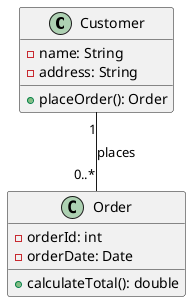
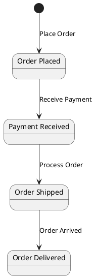
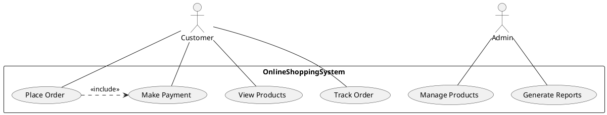
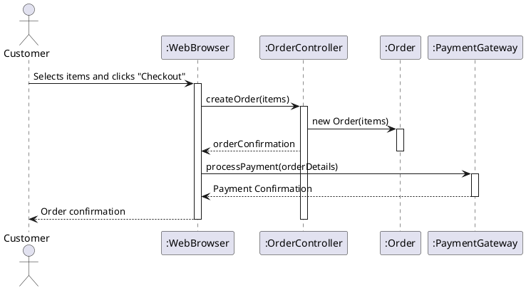
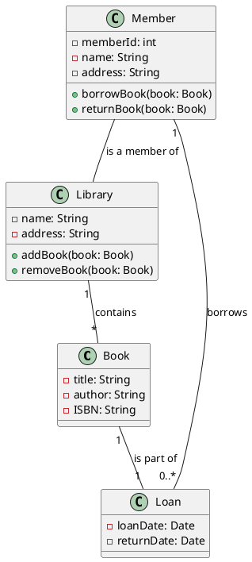
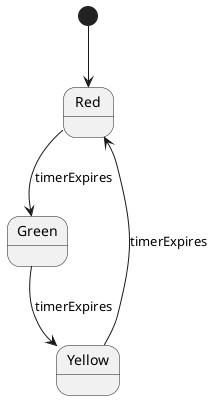
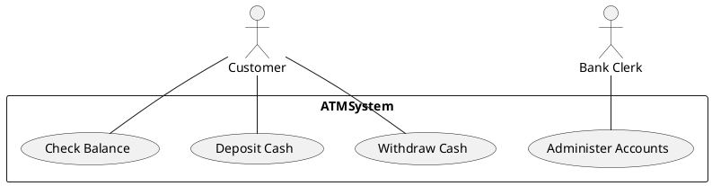
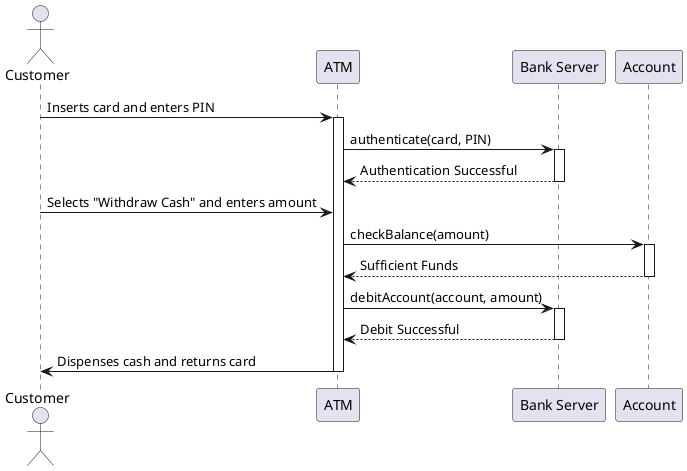

# Software Engineering - Module 2: Software Design - Object-Oriented Software Design & UML

## Learning Outcomes

*   Understand the principles of Object-Oriented Software Design (OOSD).
*   Differentiate between static and dynamic models in software design.
*   Create and interpret UML diagrams, including Class Diagrams, State Diagrams, Use Case Diagrams, and Sequence Diagrams.
*   Understand and apply UML relationships (Association, Aggregation, Composition, Inheritance, Realization, Dependency).

## 1. Object-Oriented Software Design (OOSD) Principles

Object-Oriented Software Design (OOSD) is a software development paradigm centered around the concepts of "objects," which contain data in the form of fields (attributes) and code in the form of procedures (methods).  OOSD aims to create reusable, maintainable, and scalable software systems.

**Key Principles:**

*   **Abstraction:**  Focusing on essential characteristics while ignoring irrelevant details.  For example, a car object exposes methods like `accelerate()` and `brake()` without revealing the inner workings of the engine or braking system.
*   **Encapsulation:**  Bundling data (attributes) and methods that operate on that data within an object, and restricting direct access to the internal data from outside the object (data hiding).  This protects the object's integrity.  Use access modifiers (e.g., `private`, `protected`, `public`) to control visibility.
*   **Inheritance:**  Creating new classes (derived classes or subclasses) based on existing classes (base classes or superclasses).  The derived class inherits attributes and methods from the base class, promoting code reuse and establishing an "is-a" relationship (e.g., a `Car` *is a* `Vehicle`).
*   **Polymorphism:**  The ability of an object to take on many forms.  It allows objects of different classes to be treated as objects of a common type.  This is typically achieved through inheritance and interfaces.  For example, a `draw()` method can be defined in a base class `Shape`, and derived classes like `Circle` and `Square` can implement their own specific `draw()` methods.

## 2. Static vs. Dynamic Models

In software design, models represent different aspects of the system. They can be broadly classified into:

*   **Static Models:** Describe the *structure* of the system at a particular point in time. They show the components, their relationships, and their properties. Static models are often used to represent the architecture of the system. They focus on the "what" of the system.
    *   **Example:**  Class Diagram (shows classes, attributes, and relationships).
*   **Dynamic Models:** Describe the *behavior* of the system over time.  They show how the system changes in response to events or stimuli. Dynamic models are often used to represent the flow of control in the system. They focus on the "how" of the system.
    *   **Examples:** State Diagram (shows states and transitions), Sequence Diagram (shows interactions between objects over time), Activity Diagram.

**Key Differences:**

| Feature        | Static Model                         | Dynamic Model                         |
|----------------|---------------------------------------|---------------------------------------|
| Purpose        | Structure & Relationships            | Behavior & Interactions             |
| Focus          | "What"                               | "How"                               |
| Representation | Classes, attributes, relationships   | States, transitions, messages       |
| Examples       | Class Diagram                         | State Diagram, Sequence Diagram       |

## 3. UML Diagrams

UML (Unified Modeling Language) is a standardized graphical notation for specifying, visualizing, constructing, and documenting the artifacts of software systems.  It provides a rich set of diagrams to represent different aspects of a system.  We'll focus on the following:

### 3.1 Class Diagram

*   **Purpose:**  Represents the static structure of a system by showing classes, their attributes, methods, and the relationships between them.
*   **Elements:**
    *   **Class:**  A blueprint for creating objects. Represented as a rectangle divided into three sections:
        *   **Name:** The name of the class (e.g., `Customer`, `Order`).
        *   **Attributes:** Data members that describe the class (e.g., `name: String`, `age: int`).  The format is `attributeName: DataType`.  Visibility modifiers can be added (e.g., `+name: String` (public), `-age: int` (private), `#address: String` (protected)).
        *   **Methods:**  Operations that the class can perform (e.g., `makePayment()`, `placeOrder()`). The format is `methodName(parameterList): returnType`. Visibility modifiers can be added (e.g., `+makePayment(): boolean`, `-calculateDiscount(amount: double): double`).
    *   **Relationships:** Connections between classes, indicating how they interact.  See Section 4 for detailed explanation.

**Example:**

This diagram shows a `Customer` class with attributes `name` and `address`, and a method `placeOrder()`.  It also shows an `Order` class with attributes `orderId` and `orderDate`, and a method `calculateTotal()`.  The line between `Customer` and `Order` represents a relationship: a `Customer` *places* zero or more `Order`s.

### 3.2 State Diagram

*   **Purpose:** Represents the dynamic behavior of an object by showing its possible states and the transitions between those states in response to events. It focuses on how an object changes over time.
*   **Elements:**
    *   **State:** A condition during which an object satisfies some condition, performs some action, or waits for an event. Represented as a rounded rectangle with the state name inside (e.g., `Idle`, `Active`, `Suspended`).
    *   **Transition:**  A change from one state to another, triggered by an event. Represented as an arrow from one state to another, labeled with the event that triggers the transition and an optional guard condition (e.g., `event / action`).  The format is `event[guard]/action`.
    *   **Initial State:** The starting state of the object. Represented as a filled circle.
    *   **Final State:**  The ending state of the object. Represented as a circle containing a smaller filled circle.

**Example:** (Simplified Online Order)

This diagram shows the states of an `Order` object from the time it's placed until it's delivered.

### 3.3 Use Case Diagram

*   **Purpose:**  Represents the functional requirements of a system from the perspective of the users (actors).  It shows what the system *does* for the users.
*   **Elements:**
    *   **Actor:**  A user or external system that interacts with the system. Represented as a stick figure (e.g., `Customer`, `Admin`).
    *   **Use Case:**  A specific goal or task that the actor wants to achieve using the system. Represented as an oval (e.g., `Place Order`, `Make Payment`, `Generate Report`).
    *   **Relationship:**  Connections between actors and use cases. A line connects an actor to the use cases they participate in.
        *   **Include:** A use case *includes* another use case if it is always executed as part of the base use case.  Represented by a dashed arrow with the `<<include>>` stereotype.
        *   **Extend:** A use case *extends* another use case if it is executed only under certain conditions. Represented by a dashed arrow with the `<<extend>>` stereotype.
        *   **Generalization:** An actor can be a specialization of another actor. Represented by a solid arrow with an empty triangle.

**Example:** (Online Shopping System)

This diagram shows a `Customer` and an `Admin` interacting with an `OnlineShoppingSystem`. The customer can `View Products`, `Place Order`, `Make Payment`, and `Track Order`. The admin can `Manage Products` and `Generate Reports`. Placing an order *includes* making a payment.

### 3.4 Sequence Diagram

*   **Purpose:**  Represents the interactions between objects in a sequential order over time.  It shows how objects collaborate to perform a specific use case or scenario.
*   **Elements:**
    *   **Objects/Instances:**  Represented by a rectangle with the object name underlined (e.g., `customer: Customer`, `order: Order`).
    *   **Lifeline:**  A vertical dashed line extending below the object, representing the object's existence over time.
    *   **Activation Box:**  A rectangle placed on the lifeline, representing the period when the object is actively processing a message.
    *   **Message:**  A communication between objects. Represented as an arrow from one object's lifeline to another.  Messages can be:
        *   **Synchronous:** The sender waits for a response before continuing (solid arrow with a filled arrowhead).
        *   **Asynchronous:** The sender does not wait for a response (arrow with a half arrowhead).
        *   **Return:**  A response to a message (dashed arrow with a half arrowhead).
    *   **Combined Fragments:** Control structures like loops, conditional branches, and parallel execution.

**Example:** (Placing an Order)

This diagram shows the sequence of interactions involved in placing an order, starting with the `Customer` interacting with the `WebBrowser`, which then interacts with the `OrderController`, `Order`, and `PaymentGateway`.

## 4. UML Relationships

UML relationships describe how classes are connected and interact with each other.

*   **Association:** A general relationship that represents a connection between classes. It indicates that objects of the classes are related in some way.  The relationship can be unidirectional or bidirectional.  Multiplicity (cardinality) specifies how many instances of one class are related to one instance of another class (e.g., 1..*, 0..1, 1, *).
    *   **Example:** A `Customer` is associated with one or more `Order`s.
*   **Aggregation:** A "has-a" relationship representing a whole-part relationship where the part can exist independently of the whole. Represented by a line with an empty diamond on the whole (aggregate) end.
    *   **Example:** A `Car` *has a* `Engine`.  The engine can exist independently of the car (e.g., it can be used in another car or sold separately).
*   **Composition:**  A stronger form of aggregation, representing a whole-part relationship where the part *cannot* exist independently of the whole.  The part is exclusively owned by the whole. Represented by a line with a filled diamond on the whole (composite) end.
    *   **Example:** A `House` *has* `Rooms`. A room cannot exist without a house.  If the house is destroyed, the rooms are destroyed as well.
*   **Inheritance (Generalization):**  An "is-a" relationship where one class (subclass/derived class) inherits attributes and methods from another class (superclass/base class). Represented by a solid line with an empty triangle pointing to the superclass.
    *   **Example:** A `Car` *is a* `Vehicle`.
*   **Realization (Interface Implementation):**  A relationship between a class and an interface, where the class implements the methods defined in the interface.  Represented by a dashed line with an empty triangle pointing to the interface.
    *   **Example:** A `DatabaseLogger` *realizes* the `Logger` interface.
*   **Dependency:**  A weaker relationship where one class uses another class. A change in the independent class may affect the dependent class.  Represented by a dashed line with an open arrowhead pointing to the independent class.
    *   **Example:**  A `ReportGenerator` class *depends on* a `Database` class to retrieve data.

**Summary Table:**

| Relationship | Meaning            | Representation                  | Example                                     |
|--------------|--------------------|---------------------------------|---------------------------------------------|
| Association   | Related            | Line                             | Customer - Order                             |
| Aggregation   | Has-a (independent) | Line with empty diamond         | Car ◊-- Engine                               |
| Composition   | Has-a (dependent)   | Line with filled diamond        | House ♦-- Room                               |
| Inheritance   | Is-a               | Solid line with empty triangle  | Car --|> Vehicle                              |
| Realization   | Implements         | Dashed line with empty triangle | DatabaseLogger ..|> Logger                   |
| Dependency    | Uses               | Dashed line with open arrowhead | ReportGenerator ..> Database                  |

## 5. Practice Questions and Exercises

**Question 1:** What are the key principles of Object-Oriented Software Design? Explain each principle with an example.

**Answer:** See section 1.  Examples include a `Car` using abstraction to hide its engine details, encapsulation of data in a `BankAccount`, inheritance where a `SavingsAccount` inherits from `Account`, and polymorphism allowing different shapes to implement a `draw()` method differently.

**Question 2:**  Differentiate between static and dynamic models. Give an example of a UML diagram for each.

**Answer:** See Section 2. A Class diagram (static) shows the structure of classes and their relationships, while a Sequence diagram (dynamic) shows the interaction between objects over time.

**Question 3:** Draw a Class Diagram for a Library Management System.  Include classes like `Book`, `Library`, `Member`, and `Loan`.  Show appropriate relationships.

**Answer:**

**Question 4:** Draw a State Diagram for a Traffic Light. Include states like `Red`, `Yellow`, and `Green`.

**Answer:**

**Question 5:** Draw a Use Case Diagram for an ATM system, including actors like `Customer` and `Bank Clerk` and use cases like `Withdraw Cash`, `Deposit Cash`, `Check Balance`, and `Administer Accounts`.

**Answer:**

**Question 6:** Draw a Sequence Diagram for withdrawing cash from an ATM.  Include objects like `Customer`, `ATM`, `Bank Server`, and `Account`.

**Answer:**

**Question 7:** Explain the difference between Aggregation and Composition with examples.

**Answer:** See Section 4. Aggregation (e.g., `Car` has an `Engine` - engine can exist independently), Composition (e.g., `House` has `Rooms` - room cannot exist without the house).

**Question 8:**  Describe the purpose of an Interface and how it relates to Realization in UML.

**Answer:** An interface defines a contract (set of methods) that classes can implement. Realization is the relationship where a class implements the methods defined in an interface. See Section 4.

## 6. Important Points to Remember

*   UML diagrams are tools for communication and documentation. Choose the right diagram for the specific purpose.
*   Focus on clarity and simplicity in your diagrams. Avoid unnecessary complexity.
*   Use consistent notation and naming conventions.
*   UML is an iterative process. Expect to refine your diagrams as your understanding of the system evolves.
*   Understand the different types of relationships and use them appropriately to model the connections between classes.
*   Practice creating diagrams regularly to improve your skills.  Use online tools to help.
*   Consider the audience of your diagrams.  Different stakeholders may require different levels of detail.
