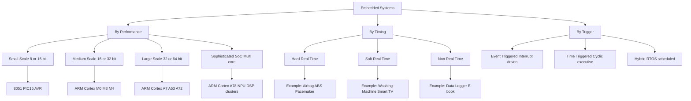
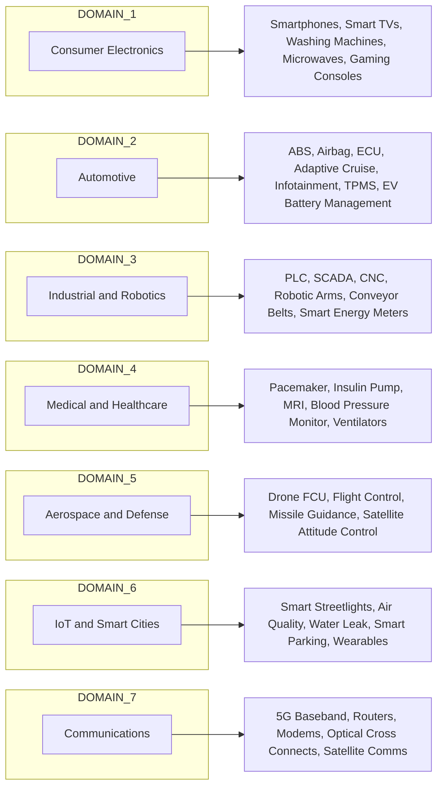
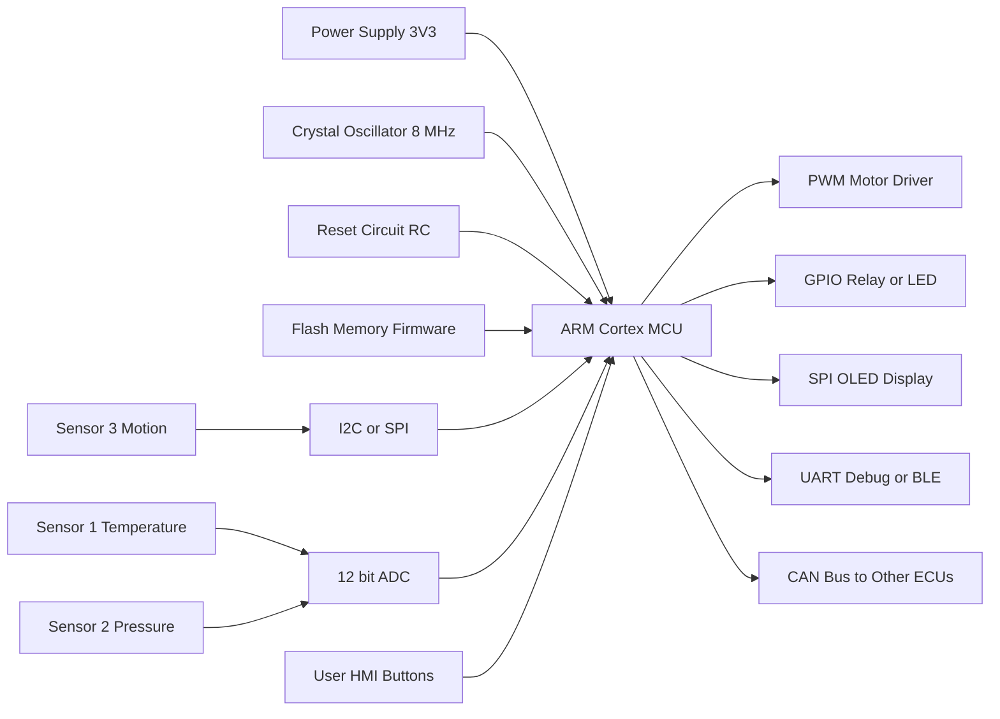
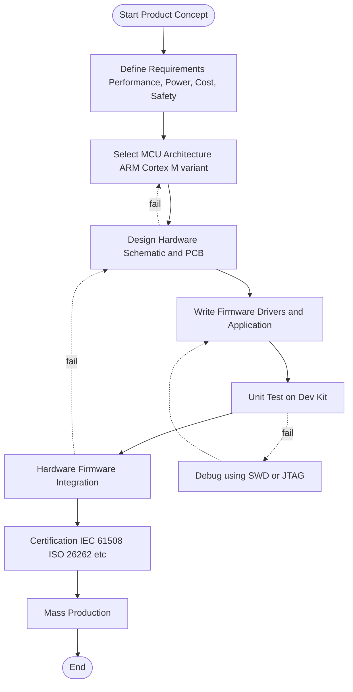

# Applications of Embedded Systems

<!-- SECTION_1_START -->

# ⚙️ Applications of Embedded Systems — Module 1: Introduction to ARM Cortex

## 1. Core Technical Definition & Intuitive Overview

> [!IMPORTANT]
> **KTU Syllabus Definition (PBCST504 — Module 1)**
> An **Embedded System** is a microprocessor/microcontroller-based, software-driven, single-purpose computing system engineered to perform a dedicated function either as a stand-alone device or as a part of a larger electromechanical system, operating under real-time computing constraints with limited resources (memory, power, I/O).

The term *"embedded"* literally means *"buried inside something"*. So an embedded system is a computer that is **buried (embedded) inside a machine** whose primary purpose is **not computation** — the computation is simply a means to control that machine.

### 🧠 Conceptual Analogy — The "Invisible Helper"

Imagine a modern **washing machine**. To you, it is a *white-goods appliance*. But inside it lives:
- A tiny **microcontroller** (often an ARM Cortex-M0/M3) that decides when to fill water, when to agitate, when to spin, and when to beep.
- **Sensors** (water level, door-lock switch, temperature) feed it real-world signals.
- **Actuators** (motor, valve, buzzer) physically execute its decisions.

You never "boot Windows" on it. You never "compile code" on it. It just *works* — silently, deterministically, and reliably. **That invisible intelligence is the embedded system.**

> [!NOTE]
> **Key Distinction from a General-Purpose Computer**
> | Aspect | Desktop / Laptop | Embedded System |
> |---|---|---|
> | Primary purpose | Multi-purpose computing | Single dedicated function |
> | Operating system | General (Windows/Linux/macOS) | Often **none** (bare-metal) or **RTOS** |
> | Power budget | 60–500 W | **0.01–5 W** (battery friendly) |
> | User upgradability | High | None / locked firmware |
> | Real-time guarantee | Soft / best-effort | Often **hard real-time** |
> | Unit cost | ₹30,000+ | ₹50–₹2,000 |

### 🔑 Three Pillars of an Embedded System (the *3-C Rule*)

> [!IMPORTANT]
> Every embedded system is built on the **3-C Rule**:
> 1. **C**ompute — A CPU core (in our course, **ARM Cortex**).
> 2. **C**onnect — Sensors & actuators via GPIO, ADC, PWM, I²C, SPI, UART, CAN.
> 3. **C**ontrol — A firmware loop (often `while(1)`) reading inputs and driving outputs deterministically.

### 📊 Classification of Embedded Systems (KTU High-Yield)

| Class | Processor Power | OS | Example |
|---|---|---|---|
| **Small-scale** | 8/16-bit MCU (8051, PIC) | Bare-metal | Toy, remote, calculator |
| **Medium-scale** | 16/32-bit MCU (ARM Cortex-M) | Bare-metal / small RTOS | Washing machine, IoT node |
| **Large-scale** | 32/64-bit MPU (Cortex-A) | Linux / Android | Smart TV, infotainment |
| **Sophisticated** | Multi-core SoC | Linux + RTOS hybrid | ADAS, drones, edge AI |

> [!VISUALIZATION CONTROL]
> **Concept:** Embedded System Boundary Box
> **Desmos Input Equations (Cartesian Block Diagram):**
> - Outer Box: `0 ≤ x ≤ 10`, `0 ≤ y ≤ 6`
> - MCU Block: `2 ≤ x ≤ 5`, `2 ≤ y ≤ 4`
> - Sensor Block: `6 ≤ x ≤ 8`, `4 ≤ y ≤ 5`
> - Actuator Block: `6 ≤ x ≤ 8`, `1 ≤ y ≤ 2`
> **Visual Description:** A nested box showing the *outer physical product* (e.g., a car) containing an *inner block* (the embedded ECU) which itself is partitioned into MCU + I/O subsystems.

<!-- SECTION_1_END -->

<!-- SECTION_2_START -->

## 2. Deep Theoretical Analysis & KTU High-Yield Formula Sheet

### 2.1 Anatomy of a Generic Embedded System

An embedded system is a deterministic pipeline of **five cooperating layers**:

1. **Hardware Layer** — Power supply, clock (crystal oscillator), reset circuit, processor (ARM Cortex core), memory (Flash + SRAM).
2. **Sensor / Input Layer** — Transduces physical signals (temperature, pressure, motion) into electrical signals. Examples: LM35 (temp), MPU6050 (IMU), HC-SR04 (ultrasonic).
3. **Processing / Firmware Layer** — The C/assembly program stored in Flash, executed on the Cortex core. Contains:
   - Startup code (vector table, stack init)
   - Main `while(1)` super-loop OR RTOS tasks
   - Interrupt Service Routines (ISRs)
4. **Actuator / Output Layer** — Converts electrical commands back into physical action. Examples: DC motor via PWM, relay via GPIO, LCD via SPI/I²C.
5. **Communication Layer** — Lets the device *talk* to the outside world (UART, I²C, SPI, CAN, USB, BLE, Wi-Fi, LoRa).

### 2.2 Characteristics of Embedded Systems (Board-Favourite Bullets)

> [!NOTE]
> These are **direct 3-mark board question material** — memorize verbatim.

- **Single-functioned** — Executes one specific program repeatedly.
- **Tightly constrained** — Limited memory (KBs), CPU (MHz), power (mW).
- **Reactive & Real-time** — Must respond to events within a **deadline** (often in microseconds).
- **Zero or minimal user interface** — Often just LEDs, buzzers, or a tiny OLED.
- **Highly reliable & deterministic** — Same input must yield the same output, every cycle, for 10+ years.
- **Firmware-based** — Software is *fused/burned* into ROM/Flash, not loaded by user.

### 2.3 The Real-Time Constraint — Why It Matters

> [!IMPORTANT]
> **Hard Real-Time vs Soft Real-Time**
> - **Hard Real-Time:** Missing a deadline = **system failure** (e.g., airbag deployment, anti-lock braking).
> - **Soft Real-Time:** Missing a deadline = **degraded quality** (e.g., video frame drop, audio jitter).
> - **Non-Real-Time:** No deadline (e.g., desktop apps).

### 2.4 KTU Formula Sheet / Cheat Sheet

| # | Concept | Formula / Definition | Units / Notes |
|---|---|---|---|
| 1 | CPU Clock period | $T_{clk} = \dfrac{1}{f_{clk}}$ | $f_{clk}$ typically $8\text{ MHz}$–$180\text{ MHz}$ |
| 2 | Instruction execution time | $T_{inst} = N_{cycles} \times T_{clk}$ | Cortex-M3: 1 cycle/Instruction (Thumb-2) |
| 3 | Power dissipation (dynamic) | $P_{dyn} = \alpha \, C \, V_{DD}^{2} \, f$ | $\alpha$ = switching activity, $C$ = load cap |
| 4 | ADC resolution | $V_{LSB} = \dfrac{V_{ref}}{2^{n}}$ | $n$ = ADC bits (12 in STM32) |
| 5 | PWM duty cycle | $D = \dfrac{T_{on}}{T_{period}}$ | $D \in [0,1]$ |
| 6 | Sampling theorem | $f_{s} \geq 2 \, f_{max}$ | Nyquist rate |
| 7 | Response time deadline | $t_{response} \leq t_{deadline}$ | Hard real-time constraint |
| 8 | Battery life | $L_{hrs} = \dfrac{C_{mAh}}{I_{avg\,mA}}$ | Critical for IoT wearables |

> [!TIP]
> **Memory Trick — "SCREAM" for Embedded Characteristics:**
> **S**ingle-functioned, **C**onstrained resources, **R**eal-time reactive, **E**mbedded-in-device, **A**utonomous, **M**icroprocessor/Microcontroller-based.

### 2.5 Why ARM Cortex Dominates Embedded

> [!NOTE]
> - **Cortex-M0/M0+** — Cheapest, smallest (12K gates), used in toys, sensor nodes.
> - **Cortex-M3** — Balanced (Thumb-2, NVIC, bit-banding). Used in STM32, industrial control.
> - **Cortex-M4** — Adds DSP + FPU. Used in motor control, audio, drones.
> - **Cortex-M7** — High performance, used in advanced motor drives, IoT gateways.
> - **Cortex-A** (Raspberry Pi class) — Application processors running Linux.

**Industry Adoption (2024)**: Over **28+ billion** ARM chips shipped in 2023 alone, with **>50%** of all embedded designs using Cortex-M series.

### 2.6 Real-World Engineering Utility

- **Automotive:** 80–100 MCUs per modern car (BMW 7-series has ~150 ECUs).
- **Medical:** Pacemaker runs on a single Cortex-M0 with a **10-year** battery life requirement.
- **Industrial:** PLCs (Programmable Logic Controllers) are essentially ruggedized embedded systems.
- **Aerospace:** Flight control systems use **lockstep dual-core** Cortex-R for fault tolerance.

<!-- SECTION_2_END -->

<!-- SECTION_3_START -->

## 3. Step-by-Step Derivations, Examples & Implementation

### 3.1 Generic Block Diagram of an Embedded System

```
        ┌──────────────────────────────────────────────────────┐
        │              EMBEDDED SYSTEM PRODUCT                 │
        │                                                      │
        │   ┌─────────┐    ┌────────────┐    ┌──────────────┐  │
        │   │SENSORS  │───▶│   ARM      │───▶│  ACTUATORS   │  │
        │   │(Inputs) │    │  CORTEX    │    │  (Outputs)   │  │
        │   └─────────┘    │  + MEMORY  │    └──────────────┘  │
        │        ▲          │  + FW      │           │         │
        │        │          └─────┬──────┘           ▼         │
        │        │                │               ┌────────┐   │
        │        │                ▼               │  USER  │   │
        │   ┌────┴─────┐    ┌────────────┐        │(HMI)   │   │
        │   │ POWER    │    │   COMMS    │        └────────┘   │
        │   │ SUPPLY   │    │  (UART,    │                     │
        │   │ (3.3V)   │    │   I²C,     │                     │
        │   └──────────┘    │   SPI,     │                     │
        │                   │   CAN, BLE)│                     │
        │                   └────────────┘                     │
        └──────────────────────────────────────────────────────┘
```

### 3.2 Worked Example 1 — **Anti-Lock Braking System (ABS)** in a Car

This is a **classic KTU 14-mark question**. Let's break it down.

**Part A — Identify the embedded system blocks:**

| Block | Concrete Implementation |
|---|---|
| Sensor | Wheel-speed sensor (Hall-effect) → 4× pulse trains |
| Sensor | Hydraulic pressure sensor (strain gauge) |
| Processor | 32-bit MCU (e.g., Infineon AURIX — TriCore, ARM Cortex-R based) |
| Memory | Flash 2 MB (firmware), SRAM 256 KB (data) |
| Actuator | Hydraulic valve (modulates brake-line pressure) |
| Actuator | Warning lamp on dashboard |
| Comms | CAN bus (1 Mbps) to other ECUs (Engine, Body, Airbag) |
| Power | 12 V battery → 5 V/3.3 V regulators |

**Part B — Why is ABS a *hard real-time* embedded system?**

Let the pedal-to-valve deadline be $t_{deadline} = 5\text{ ms}$ (200 Hz control loop).

$$
T_{clk} = \frac{1}{f_{clk}} = \frac{1}{180\,\text{MHz}} \approx 5.56\,\text{ns}
$$

$$
T_{inst} = N_{cycles} \times T_{clk}
$$

For a typical ABS control iteration (read 4 sensors → compute slip ratio → run PID → write 4 PWM outputs):

$$
N_{cycles} \approx 1200\,\text{instructions}
$$

$$
T_{inst} = 1200 \times 5.56\,\text{ns} = 6.67\,\mu s
$$

$$
\text{Time budget used} = \frac{6.67\,\mu s}{5000\,\mu s} \times 100\% = 0.133\%
$$

> **[Board valuation: 1 mark for stating Nyquist requirement, 1 mark for showing $T_{clk}$ calculation, 1 mark for $T_{inst}$ calculation, 1 mark for budget comparison]**

Since $T_{inst} \ll t_{deadline}$, the Cortex-based MCU has **3 orders of magnitude of headroom** — enabling complex control algorithms and safety diagnostics.

**Part C — Firmware super-loop skeleton (C code):**

```c
#include "stm32f4xx.h"

#define WHEEL_SENSOR_PORT   GPIOA
#define PRESSURE_ADC_CH     ADC_Channel_0
#define VALVE_PWM_TIM       TIM3

volatile uint16_t wheel_speed_rpm[4];
volatile uint16_t brake_pressure_kpa;
volatile float slip_ratio[4];

void SystemInit(void);                  // Clock tree 180 MHz
void GPIO_Init(void);                   // PA0-PA3 as inputs
void ADC1_Init(void);                   // 12-bit ADC @ 84 MHz
void TIM3_PWM_Init(void);               // 1 kHz PWM for valves

int main(void) {
    SystemInit();
    GPIO_Init();
    ADC1_Init();
    TIM3_PWM_Init();
    
    while (1) {                         // === SUPER LOOP ===
        // (1) Read inputs
        for (int i = 0; i < 4; i++) {
            wheel_speed_rpm[i] = read_wheel_sensor(i);
        }
        brake_pressure_kpa = ADC_Read(PRESSURE_ADC_CH);
        
        // (2) Compute slip ratio:  λ = (V_vehicle - V_wheel) / V_vehicle
        compute_slip_ratios(wheel_speed_rpm, slip_ratio);
        
        // (3) Run PID controller per wheel
        for (int i = 0; i < 4; i++) {
            float pwm_cmd = pid_update(i, slip_ratio[i]);
            TIM3_SetCompare(i, pwm_cmd);
        }
        
        // (4) Send dashboard + CAN bus status
        CAN_Send_Status(slip_ratio, brake_pressure_kpa);
        
        // (5) Strict 5 ms cycle (1 kHz loop)
        Delay_us(5000 - elapsed_time);
    }
}

// === INTERRUPTS take precedence ===
void EXTI0_IRQHandler(void) {           // Wheel sensor edge → update rpm
    if (EXTI_GetITStatus(EXTI_Line0) != RESET) {
        update_rpm_from_capture(0);
        EXTI_ClearITPendingBit(EXTI_Line0);
    }
}
```

### 3.3 Worked Example 2 — **Washing Machine** (Medium-scale)

> [!NOTE]
> - **Processor:** 8-bit 8051 *or* ARM Cortex-M0 (newer designs).
> - **Sensors:** Water level (float switch), door switch, temperature (NTC thermistor), motor RPM (tachogenerator).
> - **Actuators:** Motor (drum), inlet valve (solenoid), drain pump, heater, buzzer, 7-segment display.
> - **Firmware:** State machine — Idle → Fill → Wash → Rinse → Spin → End.
> - **Real-time class:** **Soft real-time** (a 200 ms delay in filling is acceptable, but overcurrent must trip in <50 ms).

### 3.4 Worked Example 3 — **Consumer IoT — Smart Fitness Band**

| Parameter | Value |
|---|---|
| MCU | ARM Cortex-M4F (e.g., nRF52840) |
| Sensors | 3-axis accelerometer, optical heart-rate (PPG), SpO2, skin temp |
| Display | 0.96" OLED (I²C) |
| Comms | BLE 5.0 to smartphone |
| Battery | 100 mAh Li-Po, target **7 days** life |
| Power budget | <15 mW average → $I_{avg} \approx 4.5\,\text{mA}$ |
| RTOS | FreeRTOS (task: sensor read, BLE TX, display refresh) |

$$
L_{hrs} = \frac{C_{mAh}}{I_{avg\,mA}} = \frac{100}{4.5} \approx 22.2\,\text{hrs} \quad (\text{with display on})
$$

To hit **7 days = 168 hrs**, the firmware must duty-cycle the sensors aggressively (sample HR every 1 min, not every 1 s) and use sleep modes aggressively.

<!-- SECTION_3_END -->

<!-- SECTION_4_START -->

## 4. Structural Diagrams & Schematics

### 4.1 Classification Tree of Embedded Systems



### 4.2 Domain-wise Application Matrix



### 4.3 Signal-Flow Block Architecture



### 4.4 Design-Flow Sequential Processing Topology



<!-- SECTION_4_END -->

<!-- SECTION_5_START -->

## 5. KTU 2024 Scheme Examination Question Bank & Topic Recap

---

### 📝 PART A — Short Answer Questions (3 Marks Each)

---

**Q1. [KTU University Exam — July 2023]**
*Define an embedded system. List any four of its characteristics.* **(CO1, Remember)**

**Model Answer:**

> An embedded system is a **microprocessor/microcontroller-based**, **software-driven** computing system designed to perform a **specific, dedicated function** as part of a larger product, often operating under **real-time constraints**.
>
> **Four Characteristics:**
> 1. **Single-functioned** — runs one fixed firmware.
> 2. **Resource-constrained** — limited memory, CPU, and power.
> 3. **Real-time reactive** — must respond to events within deadlines.
> 4. **Tightly integrated** with hardware (sensors and actuators).

> [!WARNING]
> **Examiner Pitfall:** Students often write *"embedded systems are small computers"*. This is **not** the definition. You must highlight the **single-purpose, real-time, resource-constrained** nature to fetch full marks.

**[Valuation: 1 mark definition + 2 marks for four correct characteristics = 3 marks]**

---

**Q2. [KTU University Exam — Dec 2023]**
*Distinguish between **hard real-time** and **soft real-time** embedded systems. Give one example of each.* **(CO1, Understand)**

**Model Answer:**

| Parameter | Hard Real-Time | Soft Real-Time |
|---|---|---|
| Deadline | **Must** be met, else system failure | Should be met; occasional miss acceptable |
| Consequence of miss | Catastrophic (loss of life/property) | Quality degradation only |
| Guarantee | Deterministic by design | Statistical / best-effort |
| Example | **Anti-lock Braking System (ABS)**, airbag, pacemaker | **Washing machine control**, smart TV streaming |
| RTOS needed? | Yes (e.g., VxWorks, QNX) | Often bare-metal or FreeRTOS |

> [!WARNING]
> **Examiner Pitfall:** Writing only *"hard is strict, soft is lenient"* is **vague**. Always give a **concrete domain example with the consequence of missing the deadline**.

**[Valuation: 1 mark table + 1 mark example each = 3 marks]**

---

### 📝 PART B — Long Answer Questions (14 Marks Each, Internal Choice)

---

**Q3. [KTU University Exam — July 2024, Module 1, 14 marks]**

### **Question A:**
> *(a)* Draw the generic block diagram of an embedded system and explain the function of each block. **(7 marks)**
> *(b)* With a neat diagram, describe the operation of an **anti-lock braking system (ABS)** as a real-time embedded system. List the sensors, actuators, processor, and the communication bus used. Justify why it qualifies as a **hard real-time** system. **(7 marks)**

### **OR**

### **Question B:**
> *(a)* Classify embedded systems based on **performance** and **timing**. Give one real-world example for each category. **(7 marks)**
> *(b)* Design a **smart irrigation embedded system** for a tea plantation. Specify the sensors, MCU, actuators, communication module, and the control strategy used. Compute the expected battery life assuming a 2000 mAh battery and 8 mA average current. **(7 marks)**

---

### 📖 Model Answer for Question A:

**Part (a) — Generic Block Diagram:** *(7 marks)*

```
┌──────────────────────────────────────────────────────────────┐
│                   EMBEDDED SYSTEM                            │
│                                                              │
│  SENSORS          ARM CORTEX           ACTUATORS             │
│ ┌───────┐         ┌─────────┐          ┌────────┐            │
│ │Temp   │──signal─│   MCU   │─control──│ Motor  │            │
│ │Light  │         │  + FW   │  signal  │ Relay  │            │
│ │Motion │         │ + Flash │          │ LED    │            │
│ └───────┘         │ + SRAM  │          │ Valve  │            │
│                   └────┬────┘          └────────┘            │
│                        │                                     │
│              ┌─────────┴─────────┐                           │
│              │  COMMUNICATION    │                           │
│              │ UART I2C SPI CAN  │                           │
│              └───────────────────┘                           │
│                                                              │
│   POWER SUPPLY (3.3V/5V)  +  CLOCK (Crystal Oscillator)     │
└──────────────────────────────────────────────────────────────┘
```

**Function of each block:**

| Block | Function |
|---|---|
| **Sensor** | Transduces physical quantity → electrical signal (e.g., LM35 gives 10 mV/°C) |
| **ARM Cortex MCU** | Executes firmware; makes decisions; runs algorithms |
| **Memory (Flash/SRAM)** | Flash = program storage; SRAM = runtime data |
| **Actuator** | Receives electrical command → physical action (e.g., motor rotates) |
| **Communication** | Interfaces with other devices/systems (UART debug, CAN to other ECUs) |
| **Power supply** | Provides regulated DC to MCU and peripherals |
| **Clock** | Provides timing reference for CPU cycles and peripherals |

**[Valuation: 1 mark diagram + 1 mark sensors + 1 mark MCU/memory + 1 mark actuators + 1 mark comm + 1 mark power/clock + 1 mark for any one-line elaboration = 7 marks]**

---

**Part (b) — ABS as Real-Time Embedded System:** *(7 marks)*

**Diagram:**

```
  ┌──────┐  pulse  ┌─────────┐   PWM   ┌──────────┐
  │Wheel │────────▶│         │────────▶│ Hydraulic│
  │Speed │         │  ARM    │         │  Valve   │
  │Sensor│  analog ┤ Cortex  ├─CAN────▶│ (Brake   │
  │  ×4  │────────▶│  M ECU  │         │  Modul.) │
  └──────┘         │(AURIX)  │         └──────────┘
  ┌──────┐         │         │         ┌──────────┐
  │Press.│────────▶│         │────────▶│Dashboard │
  │Sensor│         └─────────┘         │  Lamp    │
  └──────┘                             └──────────┘
```

| Component | Implementation |
|---|---|
| **Sensors** | 4× Hall-effect wheel-speed sensors; 1× hydraulic pressure sensor |
| **Actuators** | 4× PWM-driven solenoid valves (one per wheel) |
| **Processor** | 32-bit ARM Cortex-R / AURIX (dual-core lockstep) |
| **Comms** | **CAN bus @ 500 kbps** to dashboard + engine ECU |
| **Algorithm** | Sliding-mode / PID control on slip ratio $\lambda = (V_v - V_w)/V_v$ |

**Hard real-time justification:**

$$
\text{Control loop frequency} = 200\,\text{Hz} \Rightarrow t_{deadline} = 5\,\text{ms}
$$

$$
T_{clk} = \frac{1}{f_{clk}} = \frac{1}{180\,\text{MHz}} \approx 5.56\,\text{ns}
$$

For 1200-cycle control algorithm:

$$
T_{compute} = 1200 \times 5.56\,\text{ns} = 6.67\,\mu s
$$

$$
\text{CPU utilization} = \frac{6.67\,\mu s}{5000\,\mu s} \times 100\% \approx 0.13\%
$$

> Since missing the **5 ms deadline = wheel lock = skid / accident = potential fatality**, this is by definition a **hard real-time** system. The 750× headroom ensures determinism even with worst-case interrupt latency.

**[Valuation: 1 mark diagram + 1 mark sensor list + 1 mark processor + 1 mark comms + 1 mark algorithm/control + 1 mark timing math + 1 mark real-time justification = 7 marks]**

---

### 📖 Model Answer for Question B (Alternative):

**Part (a) — Classification:** *(7 marks)*

| Basis | Category | Example |
|---|---|---|
| **By Performance** | Small-scale (8/16-bit, bare-metal) | TV remote, digital watch |
| | Medium-scale (32-bit, Cortex-M) | Washing machine, smart band |
| | Large-scale (32/64-bit, Cortex-A, Linux) | Smart TV, infotainment |
| | Sophisticated (multi-core SoC) | ADAS, drone flight controller |
| **By Timing** | Hard real-time | ABS, pacemaker, missile |
| | Soft real-time | Set-top box, washing machine |
| | Non real-time | Data logger, ebook reader |

**[Valuation: 1 mark for each correct row = 7 marks]**

---

**Part (b) — Smart Irrigation Design:** *(7 marks)*

**Sensors:** Soil moisture (capacitive v1.2), temperature/humidity (DHT22), rain detection (resistive), light (LDR).

**MCU:** **STM32 (ARM Cortex-M4)** @ 72 MHz, low-power modes, 12-bit ADC.

**Actuators:** 12V DC solenoid valve (per zone), 5V relay driver, water-pump starter.

**Communication:** **LoRa SX1278** to gateway (10 km range, ideal for tea estates); **Wi-Fi/BLE** for farmer's mobile app.

**Control Strategy:** Closed-loop ON/OFF bang-bang with hysteresis; if $\theta_{moisture} < 35\%$, open valve; if $\theta_{moisture} > 45\%$, close valve. Night-time irrigation only (timer-based, 6 PM – 6 AM).

**Battery-life computation:**

$$
L_{hrs} = \frac{C_{mAh}}{I_{avg\,mA}} = \frac{2000}{8} = 250\,\text{hrs}
$$

$$
L_{days} = \frac{250}{24} \approx 10.4\,\text{days}
$$

To extend to **6 months** ($L_{days} = 180$):

$$
I_{avg\,mA}^{target} = \frac{2000}{180 \times 24} = \frac{2000}{4320} \approx 0.463\,\text{mA}
$$

This requires aggressive sleep-mode usage (Cortex-M4 deep-sleep at $\sim 10\,\mu A$ + wake every 15 min to read sensors).

**[Valuation: 1 mark sensors + 1 mark MCU choice + 1 mark actuators + 1 mark comms + 1 mark control + 1 mark battery life math + 1 mark final numeric answer = 7 marks]**

---

> [!WARNING]
> **🛑 KTU Examiner's Valuation Warning — Common Pitfalls for This Topic:**
> 1. **Do NOT** omit the block diagram. Even a hand-drawn rough sketch fetches 1–2 marks; **omitting it loses 2 marks minimum**.
> 2. **Do NOT** confuse "embedded system" with "microprocessor". A microprocessor is a *component*; an embedded system is the *complete product* (MCU + sensors + actuators + power + comms).
> 3. **Do NOT** write "ARM Cortex" without specifying the **class** (M0 vs M3 vs M4 vs A53). Examiners penalize vagueness.
> 4. **Always show units** in numerical derivations ($MHz$, $mA$, $mAh$, $\mu s$).
> 5. **Always justify** hard vs soft real-time with a **consequence** (loss of life, quality drop, etc.), not just the term.

---

### ✅ Topic Recap & Important Things to Remember

- **Definition:** Embedded system = microprocessor/MCU-based, single-purpose, real-time, resource-constrained computer *buried inside* a larger product.
- **3-C Rule:** Compute (Cortex) + Connect (Sensors/Actuators) + Control (Firmware loop).
- **Key Characteristics:** Single-functioned, constrained, real-time, reactive, deterministic, zero/minimal UI, firmware-based.
- **Classification — by Performance:** Small (8051), Medium (Cortex-M), Large (Cortex-A + Linux), Sophisticated (multi-core SoC).
- **Classification — by Timing:** Hard (deadline = life-critical), Soft (deadline = quality), Non-RT (no deadline).
- **Classification — by Trigger:** Event-triggered (interrupt), Time-triggered (cyclic), Hybrid (RTOS).
- **Block Diagram (must memorize):** Sensor → MCU+Memory → Actuator; with Power, Clock, Communication as supporting blocks.
- **Real-time math:** $T_{clk} = 1/f_{clk}$; $T_{inst} = N_{cycles} \times T_{clk}$; deadline = $T_{compute} \ll t_{deadline}$.
- **Power formula:** $P_{dyn} = \alpha C V_{DD}^2 f$; battery life $L_{hrs} = C_{mAh}/I_{avg\,mA}$.
- **ARM Cortex Variant Selection:** M0/M0+ (cheapest) → M3 (general) → M4 (DSP+FPU) → M7 (perf) → A-series (Linux).
- **Key Examples to Remember:**
  - *Hard RT:* ABS, airbag, pacemaker, flight control.
  - *Soft RT:* Washing machine, smart TV, set-top box.
  - *Non-RT:* Data logger, ebook reader.
- **Industry Statistics (recall-ready):** ~28 B+ ARM chips/year; 80–100 MCUs in a modern car; ARM holds >50% of 32-bit MCU market.
- **Exam Mantra:** Always draw the block diagram, always specify the Cortex class, always justify hard vs soft real-time with a **consequence of missing the deadline**.

<!-- SECTION_5_END -->
