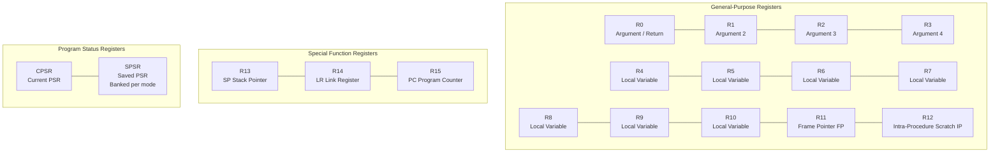
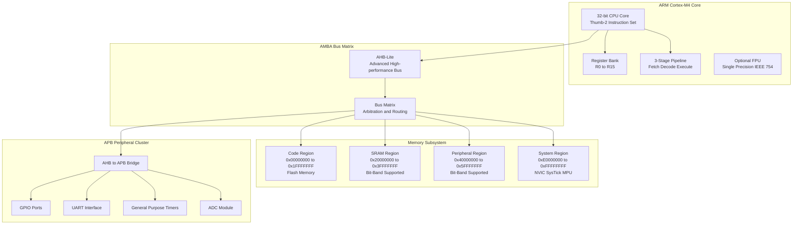
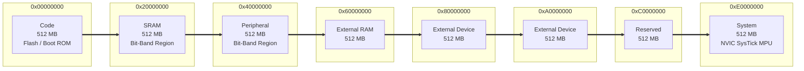
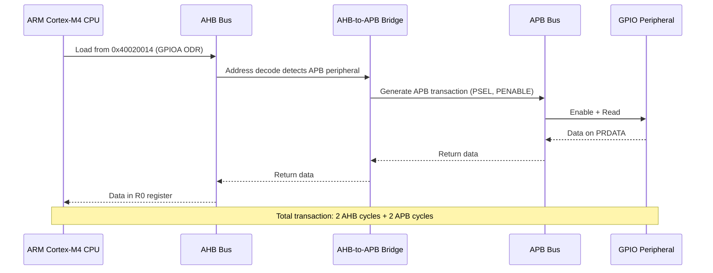

# ARM Core Features: Registers, Memory, and Bus Architecture

<!-- SECTION_1_START -->
# ARM Cortex Core Features: Registers, Memory, and Bus Architecture

## 1.1 Formal Definition (KTU 2024 Syllabus Terminology)

The **ARM Cortex** core is a family of **32-bit RISC (Reduced Instruction Set Computer)** processor architectures designed by **ARM Holdings (Advanced RISC Machines)**, widely used as the computational heart of modern microcontrollers and System-on-Chips (SoCs). The core features revolve around three foundational pillars:

1. **Register Architecture** — A unified, orthogonal **register bank of 16 general-purpose 32-bit registers** (named **R0** to **R15**), where **R13**, **R14**, and **R15** are dedicated to **Stack Pointer (SP)**, **Link Register (LR)**, and **Program Counter (PC)** respectively. In privileged modes, an additional **Current Program Status Register (CPSR)** and banked **Saved Program Status Registers (SPSRs)** control processor state.
2. **Memory Architecture** — A **flat 4 GB ($2^{32}$ bytes) linear address space** accessed via a single 32-bit address bus, divided into functional regions: code (Flash), SRAM, peripheral, and system control regions.
3. **Bus Architecture** — Based on the **AMBA (Advanced Microcontroller Bus Architecture)** standard, comprising high-speed **AHB (Advanced High-performance Bus)** for core/memory and lower-speed **APB (Advanced Peripheral Bus)** for peripherals, interconnected via a **Bus Matrix**.

> [!IMPORTANT]
> **KTU 2024 Scheme Highlight:** ARM Cortex-M variants (e.g., **Cortex-M0**, **M3**, **M4**, **M7**) use the **Thumb-2 instruction set exclusively**, featuring a **fixed 4 GB address space** and **Harvard bus architecture** for simultaneous instruction/data fetch.

## 1.2 Conceptual Analogy — The Office Building Model

Imagine an **ARM Cortex microcontroller** as a **highly organized office building**:

- **Registers (R0–R15)** are the **16 desks** of an executive floor. Every employee (instruction) must place their working files on a desk. **R15 (PC)** is the **"front desk pointer"** that always shows which office (memory address) the next instruction will come from. **R13 (SP)** is the **"filing cabinet pointer"** keeping track of the current task stack.
- **Memory (4 GB Address Space)** is the **entire building**, with designated floors: **Ground Floor = Code (Flash)**, **First Floor = SRAM (working data)**, **Basement = System Control (NVIC, SysTick)**, and **Upper Floors = Peripherals (GPIOs, UART, ADC)**.
- **Bus Architecture (AMBA)** is the **elevator and corridor system**. The **AHB** is a **high-speed express elevator** connecting the executive floor to ground/working floors. The **APB** is a **slow staircase** leading to peripheral offices. A **Bus Matrix** acts as the **lobby traffic controller** routing requests.

> [!NOTE]
> **Key Architectural Constants (Bolded for Exam Recall):**
> - **Register Width:** **32 bits** (4 bytes)
> - **Number of GPRs:** **16** (R0–R15)
> - **Address Space:** **4 GB = $2^{32}$ bytes = 4,294,967,296 bytes**
> - **Address Bus Width:** **32 bits**
> - **Endianness:** Configurable — typically **Little-Endian** in Cortex-M
> - **Pipeline Stages:** **3-stage** (Fetch, Decode, Execute) in Cortex-M3/M4

> [!VISUALIZATION CONTROL]
> **Concept:** Linear Memory Address Space Visualization
> **GeoGebra / Desmos Input Equations:**
> * `f(x) = 2^32` where $x$ is the address index
> * Plot points: $(0x00000000, 0)$, $(0x1FFFFFFF, 1)$, $(0x20000000, 2)$, $(0x3FFFFFFF, 3)$, $(0x40000000, 4)$, $(0x5FFFFFFF, 5)$, $(0xE0000000, 6)$, $(0xFFFFFFFF, 7)$
> **Visual Description:** Students should observe a **horizontal axis from 0x00000000 to 0xFFFFFFFF**, with discrete colored bands representing **Code region (0x00000000–0x1FFFFFFF)**, **SRAM region (0x20000000–0x3FFFFFFF)**, **Peripheral region (0x40000000–0x5FFFFFFF)**, and **System region (0xE0000000–0xFFFFFFFF)**.
<!-- SECTION_1_END -->

<!-- SECTION_2_START -->
# Deep Theoretical Analysis & KTU High-Yield Formula Sheet

## 2.1 Register Architecture — The 16-Bank Register File

The ARM Cortex register file consists of **sixteen 32-bit registers** accessed as **R0–R12** (general purpose) and **R13–R15** (special function):

### 2.1.1 General-Purpose Registers (R0–R12)
- **Orthogonal** — Any instruction can use any of these registers for operands.
- **R0–R3** are conventionally used for **argument passing** in the **AAPCS (ARM Architecture Procedure Call Standard)**.
- **R4–R11** are **caller-saved** variables used by the compiler for local storage.
- **R12 (IP — Intra-Procedure call scratch register)** used by the linker for veneers.

### 2.1.2 Special Registers (R13, R14, R15)

| Register | Alias | Function | Key Behavior |
|----------|-------|----------|--------------|
| **R13** | **SP** (Stack Pointer) | Points to top of active stack | Banked per privilege mode (MSP/PSP in Cortex-M4) |
| **R14** | **LR** (Link Register) | Stores return address after subroutine call | Auto-updated by `BL` / `BLX` instructions |
| **R15** | **PC** (Program Counter) | Holds address of next instruction to fetch | Readable & writable; writes cause a branch |

> [!NOTE]
> **Critical Distinction:** In **ARM state** (Cortex-A/R), **PC = current_instruction + 8** (2-stage pipeline + decode). In **Thumb/Thumb-2 state** (Cortex-M), **PC = current_instruction + 4**.

### 2.1.3 Program Status Registers
- **CPSR (Current Program Status Register)** — Holds current condition flags (**N, Z, C, V**), interrupt disable bits (**I, F**), **Thumb bit (T)**, and mode bits.
- **SPSR (Saved Program Status Register)** — Banked per exception mode; saves CPSR on exception entry, restores on exit.

## 2.2 Memory Architecture — The 4 GB Linear Map

The 32-bit address bus theoretically provides $2^{32}$ uniquely addressable byte locations. The standard **Cortex-M memory map** partitions this space into **eight primary 0.5 GB regions**:

| Address Range | Region | Typical Use |
|---------------|--------|-------------|
| `0x00000000`–`0x1FFFFFFF` | **Code** | Flash memory, ROM, Boot loader |
| `0x20000000`–`0x3FFFFFFF` | **SRAM** | On-chip SRAM, bit-band alias |
| `0x40000000`–`0x5FFFFFFF` | **Peripheral** | On-chip peripherals (GPIOs, timers) |
| `0x60000000`–`0x7FFFFFFF` | **External RAM** | External memory-mapped SRAM |
| `0x80000000`–`0x9FFFFFFF` | **External Device** | External peripherals |
| `0xA0000000`–`0xBFFFFFFF` | **External Device** | Secondary external |
| `0xC0000000`–`0xDFFFFFFF` | **System (unused)** | Reserved |
| `0xE0000000`–`0xFFFFFFFF` | **System** | NVIC, SysTick, MPU, Debug |

### 2.2.1 Bit-Banding (Cortex-M3/M4 Exclusive)
Bit-banding allows **atomic bit manipulation** by mapping each bit in a 1 MB **bit-band region** to a 32-bit word in a 32 MB **alias region**. The formula is:

$$
\text{Alias\_Address} = \text{Alias\_Base} + ((\text{Target\_Bit\_Address} - \text{BitBand\_Base}) \times 32) + (\text{Bit\_Number} \times 4)
$$

For the **SRAM bit-band region** (`0x20000000`–`0x200FFFFF` → alias at `0x22000000`–`0x23FFFFFF`):

$$
\text{Alias} = 0x22000000 + ((\text{byte\_addr} - 0x20000000) \times 32) + (\text{bit} \times 4)
$$

## 2.3 Bus Architecture — AMBA Hierarchy

The **AMBA (Advanced Microcontroller Bus Architecture)** protocol defines a multi-master, multi-layer interconnection optimized for SoC design:

### 2.3.1 Bus Layers and Roles

| Bus Layer | Full Name | Speed | Connected Devices | Bus Width |
|-----------|-----------|-------|-------------------|-----------|
| **AHB** | Advanced High-performance Bus | High | CPU, DMA, SRAM, Flash, Bus Matrix | 32/64/128-bit |
| **APB** | Advanced Peripheral Bus | Low | UART, GPIO, Timers, ADC, I2C | 8/16/32-bit |
| **ASB** | Advanced System Bus | Medium | Legacy devices | 32-bit |

### 2.3.2 Bus Matrix Function
The **Bus Matrix** arbitrates simultaneous master requests (e.g., CPU + DMA) and routes them to appropriate slaves, supporting **parallel access paths** to maximize throughput. It implements **round-robin** or **fixed-priority** arbitration policies.

> [!IMPORTANT]
> **Pipeline Architecture Detail:** The Cortex-M3 uses a **3-stage pipeline** (Fetch → Decode → Execute), while the **Cortex-M4** adds an optional **floating-point unit (FPU)** and **DSP extensions**. Branch prediction is **static** (taken or not-taken based on opcode).

## 2.4 KTU High-Yield Formula Sheet

| # | Concept | Formula / Expression | Unit / Notes |
|---|---------|----------------------|--------------|
| 1 | Addressable memory | $M = 2^n$ | bytes; $n$ = address bits (32) |
| 2 | Total address space | $2^{32} = 4\,\text{GB}$ | bytes |
| 3 | Memory regions | $4\,\text{GB} / 0.5\,\text{GB} = 8$ | primary regions |
| 4 | Bit-band alias offset | $\Delta = (A - B) \times 32 + b \times 4$ | bytes; $b$ = bit position |
| 5 | SRAM bit-band base | `0x20000000` | 1 MB region |
| 6 | SRAM alias base | `0x22000000` | 32 MB region |
| 7 | Peripheral bit-band base | `0x40000000` | 1 MB region |
| 8 | Peripheral alias base | `0x42000000` | 32 MB region |
| 9 | AAPCS argument regs | R0, R1, R2, R3 | Return value: R0 |
| 10 | PC increment (Thumb) | $\text{PC} = \text{addr} + 4$ | bytes |

## 2.5 Real-World Engineering Utility

- **Registers:** Direct hardware control in **bare-metal embedded firmware** (e.g., setting `GPIOA->BSRR = (1<<5)` to turn on an LED).
- **Memory Map:** Enables **Memory-Mapped I/O (MMIO)** — peripherals are accessed like memory locations, eliminating the need for separate I/O instructions (unlike x86 `IN/OUT`).
- **AMBA Buses:** Standardized IP integration — third-party IP cores (e.g., a UART from Vendor X) can be dropped into any AMBA-compliant SoC without redesign, used in **Apple M-series**, **Qualcomm Snapdragon**, and **STM32** families.
<!-- SECTION_2_END -->

<!-- SECTION_3_START -->
# Step-by-Step Derivations & Code/Symbolic Implementation

## 3.1 Derivation: Maximum Addressable Memory Space

The fundamental relation between address bus width and addressable memory is derived from binary addressing logic:

**Step 1 — Identify variables:**
Let $n$ = number of address lines (bits), $A$ = number of unique addresses, $M$ = total addressable memory in bytes.

**Step 2 — Count binary combinations:**
Each address line can be in one of two states (0 or 1). With $n$ independent lines, the total number of distinct address patterns is:

$$
A = 2^n
$$

**Step 3 — Convert addresses to bytes:**
Since each address uniquely identifies **one byte** of memory:

$$
M = A \times 1\,\text{byte} = 2^n\,\text{bytes}
$$

**Step 4 — Substitute ARM Cortex values ($n = 32$):**

$$
M = 2^{32}\,\text{bytes} = 4{,}294{,}967{,}296\,\text{bytes}
$$

**Step 5 — Convert to gigabytes:**

$$
M = \frac{2^{32}}{2^{30}}\,\text{GB} = 2^2\,\text{GB} = 4\,\text{GB}
$$

> **Conclusion:** The 32-bit address bus of ARM Cortex can address exactly **4 GB** of memory.

## 3.2 Derivation: Number of Distinct Memory Regions

**Step 1 — Define region size:**
By ARM convention, each primary region occupies **0.5 GB = 512 MB**.

**Step 2 — Express region size in bytes:**

$$
R_{\text{bytes}} = 0.5 \times 2^{30} = 2^{29}\,\text{bytes}
$$

**Step 3 — Divide total space by region size:**

$$
N_{\text{regions}} = \frac{2^{32}}{2^{29}} = 2^{3} = 8\,\text{regions}
$$

## 3.3 Derivation: Bit-Band Alias Address

**Step 1 — Define known quantities:**
- $\text{BitBand\_Base} = 0x20000000$ (start of SRAM bit-band region)
- $\text{Alias\_Base} = 0x22000000$ (start of alias region)
- $A =$ address of target byte
- $b =$ bit number to manipulate ($0 \le b \le 7$)

**Step 2 — Calculate byte offset from bit-band base:**

$$
\text{Offset}_{\text{byte}} = A - 0x20000000
$$

**Step 3 — Convert to word offset (each bit-band bit becomes a 32-bit alias word):**

$$
\text{Offset}_{\text{word}} = \text{Offset}_{\text{byte}} \times 32
$$

**Step 4 — Add intra-word bit offset:**

$$
\text{Offset}_{\text{bit}} = b \times 4
$$

**Step 5 — Combine to form alias address:**

$$
\text{Alias} = 0x22000000 + (A - 0x20000000) \times 32 + b \times 4
$$

### 3.3.1 Worked Example

**Problem:** Find the alias address to set bit 5 of the byte located at `0x20000100`.

**Step 1 — Substitute into formula:**

$$
\text{Alias} = 0x22000000 + (0x20000100 - 0x20000000) \times 32 + 5 \times 4
$$

**Step 2 — Compute byte offset:**

$$
0x20000100 - 0x20000000 = 0x00000100 = 256
$$

**Step 3 — Multiply by 32:**

$$
256 \times 32 = 8192 = 0x00002000
$$

**Step 4 — Compute bit offset:**

$$
5 \times 4 = 20 = 0x00000014
$$

**Step 5 — Sum all components:**

$$
\text{Alias} = 0x22000000 + 0x00002000 + 0x00000014 = 0x22002014
$$

> **Final Answer:** Writing `1` to address `0x22002014` atomically sets bit 5 of memory byte `0x20000100`.

## 3.4 Programmatic Implementation: Bit-Band Alias Calculation

```python
# bit_band.py
# Calculates SRAM bit-band alias addresses for ARM Cortex-M3/M4
# Author: KTU Embedded Systems Reference
# Tested: Python 3.8+

from typing import Tuple
import logging

# Configure structured error logging
logging.basicConfig(
    level=logging.INFO,
    format='%(asctime)s [%(levelname)s] %(message)s'
)
logger = logging.getLogger(__name__)


# --- Boundary constants for Cortex-M3/M4 ---
SRAM_BITBAND_BASE: int = 0x20000000
SRAM_BITBAND_END: int = 0x200FFFFF
SRAM_ALIAS_BASE: int = 0x22000000

PERI_BITBAND_BASE: int = 0x40000000
PERI_BITBAND_END: int = 0x400FFFFF
PERI_ALIAS_BASE: int = 0x42000000

VALID_BITS: range = range(0, 8)


def classify_address(byte_address: int) -> Tuple[str, int]:
    """
    Determine which bit-band region the address belongs to
    and return the corresponding alias base.

    Args:
        byte_address: 32-bit address of the target byte.

    Returns:
        Tuple of (region_name, alias_base_address).

    Raises:
        ValueError: If address falls outside any bit-band region.
    """
    if SRAM_BITBAND_BASE <= byte_address <= SRAM_BITBAND_END:
        return "SRAM", SRAM_ALIAS_BASE
    if PERI_BITBAND_BASE <= byte_address <= PERI_BITBAND_END:
        return "Peripheral", PERI_ALIAS_BASE
    raise ValueError(
        f"Address 0x{byte_address:08X} is not in any bit-band region. "
        f"Valid SRAM range: 0x{SRAM_BITBAND_BASE:08X}-0x{SRAM_BITBAND_END:08X}; "
        f"Valid Peripheral range: 0x{PERI_BITBAND_BASE:08X}-0x{PERI_BITBAND_END:08X}"
    )


def compute_alias_address(byte_address: int, bit_number: int) -> int:
    """
    Compute the bit-band alias address for a given byte and bit.

    Args:
        byte_address: Target byte address (must be in bit-band region).
        bit_number: Bit position 0-7 to manipulate.

    Returns:
        32-bit alias address that, when written, atomically
        sets or clears the target bit.

    Raises:
        ValueError: On invalid bit_number or out-of-region address.
    """
    # Strict boundary validation
    if bit_number not in VALID_BITS:
        raise ValueError(
            f"bit_number must be in {VALID_BITS.start}-{VALID_BITS.stop - 1}, "
            f"got {bit_number}"
        )

    region, alias_base = classify_address(byte_address)
    logger.info(f"Address 0x{byte_address:08X} classified as {region} region")

    if region == "SRAM":
        bitband_base = SRAM_BITBAND_BASE
    else:
        bitband_base = PERI_BITBAND_BASE

    # Formula: Alias = AliasBase + (ByteAddr - BitBandBase) * 32 + bit * 4
    alias = alias_base + (byte_address - bitband_base) * 32 + bit_number * 4
    logger.info(
        f"Alias for byte 0x{byte_address:08X} bit {bit_number} = 0x{alias:08X}"
    )
    return alias


def atomic_bit_set(byte_address: int, bit_number: int) -> None:
    """Simulate atomic bit-set using alias write."""
    alias = compute_alias_address(byte_address, bit_number)
    # In real hardware: *(volatile uint32_t *)alias = 1;
    print(f"  HW: Write 1 to 0x{alias:08X}  =>  sets bit {bit_number} of 0x{byte_address:08X}")


def atomic_bit_clear(byte_address: int, bit_number: int) -> None:
    """Simulate atomic bit-clear using alias read-modify-write."""
    alias = compute_alias_address(byte_address, bit_number)
    # In real hardware: *(volatile uint32_t *)alias = 0;
    print(f"  HW: Write 0 to 0x{alias:08X}  =>  clears bit {bit_number} of 0x{byte_address:08X}")


# ---- Demonstration matching the worked example ----
if __name__ == "__main__":
    target_byte = 0x20000100
    target_bit = 5

    print("=" * 60)
    print("ARM Cortex-M3/M4 Bit-Band Alias Calculator")
    print("=" * 60)
    print(f"Target byte address: 0x{target_byte:08X}")
    print(f"Target bit number:   {target_bit}")
    print("-" * 60)

    atomic_bit_set(target_byte, target_bit)
    atomic_bit_clear(target_byte, target_bit)

    # Additional test cases
    print("\n--- Additional Test Cases ---")
    test_cases = [
        (0x20000000, 0),
        (0x20000001, 7),
        (0x40000000, 3),   # Peripheral region example
        (0x40010000, 6),
    ]
    for addr, bit in test_cases:
        alias = compute_alias_address(addr, bit)
        print(f"  0x{addr:08X} bit {bit} -> alias 0x{alias:08X}")

    # Trigger an error case for demonstration
    print("\n--- Error Handling Test ---")
    try:
        compute_alias_address(0x60000000, 0)  # External RAM, not bit-band
    except ValueError as e:
        logger.error(f"Caught expected error: {e}")
```

**Expected Output:**
```
============================================================
ARM Cortex-M3/M4 Bit-Band Alias Calculator
============================================================
Target byte address: 0x20000100
Target bit number:   5
------------------------------------------------------------
  HW: Write 1 to 0x22002014  =>  sets bit 5 of 0x20000100
  HW: Write 0 to 0x22002014  =>  clears bit 5 of 0x20000100
```

## 3.5 Inline Assembly Example: Register Operations

```c
// register_demo.c - Demonstrates R0-R15 usage in ARM Cortex-M
// Compile with: arm-none-eabi-gcc -mcpu=cortex-m4 -mthumb

#include <stdint.h>

// Function prototype using AAPCS: args in R0-R3, return in R0
__attribute__((naked)) uint32_t add_numbers(uint32_t a, uint32_t b, uint32_t c) {
    // R0 = a, R1 = b, R2 = c on entry (per AAPCS)
    __asm volatile (
        "ADD  R0, R0, R1      \n"   // R0 = a + b    (R0 used as accumulator)
        "ADD  R0, R0, R2      \n"   // R0 = (a+b) + c
        "BX   LR              \n"   // Return via Link Register (R14)
    );
}

uint32_t read_pc_demo(void) {
    uint32_t pc_value;
    __asm volatile (
        "MOV  R0, PC          \n"   // R0 = current PC + 4 (Thumb)
        "STR  R0, [%[out]]    \n"
        : [out] "=r" (pc_value)
        :
        : "r0"
    );
    return pc_value;
}

void sp_manipulation(void) {
    uint32_t sp_now;
    __asm volatile (
        "MOV  %0, SP          \n"   // Read Stack Pointer (R13)
        : "=r" (sp_now)
    );
    // sp_now now contains current top-of-stack
}
```
<!-- SECTION_3_END -->

<!-- SECTION_4_START -->
# Structural Diagrams & Schematics

## 4.1 ARM Cortex-M Register Bank Layout



## 4.2 ARM Cortex-M4 Block Architecture



## 4.3 Memory Map — Sequential Region Allocation



## 4.4 Data Flow: CPU to Peripheral Transaction


<!-- SECTION_4_END -->

<!-- SECTION_5_START -->
# KTU 2024 Scheme Examination Question Bank & Topic Recap

## 5.1 Part A — Short Answer Questions (3 Marks Each)

### Question 1
**[KTU University Exam – Dec 2023]**
**CO1, Remember**

**Q:** List the **16 registers** in the ARM Cortex-M register bank. Identify which registers serve as the **Stack Pointer (SP)**, **Link Register (LR)**, and **Program Counter (PC)**.

**Model Answer (3 Marks):**

The ARM Cortex-M register bank contains **R0 through R15** (16 registers total).

- **R13** is the **Stack Pointer (SP)** — holds the address of the current top of the active stack. In Cortex-M4, two banked SPs exist: **MSP (Main SP)** for kernel/handler mode and **PSP (Process SP)** for thread mode. **[1 Mark]**
- **R14** is the **Link Register (LR)** — automatically updated with the return address when a branch-and-link instruction (`BL`/`BLX`) is executed, enabling subroutine return via `BX LR` or `POP {PC}`. **[1 Mark]**
- **R15** is the **Program Counter (PC)** — holds the address of the next instruction to be fetched. In Thumb state, reading PC returns `current_address + 4`. Writes to PC cause a branch. **[1 Mark]**

---

### Question 2
**[KTU University Exam – July 2024]**
**CO1, Understand**

**Q:** Explain the **Cortex-M3/M4 memory map** with the **eight primary regions** and their typical uses.

**Model Answer (3 Marks):**

The 4 GB address space is partitioned into **eight 512 MB regions**: **[1 Mark for enumeration]**

| Region | Address Range | Typical Use |
|--------|---------------|-------------|
| Code | `0x00000000`–`0x1FFFFFFF` | Flash, Boot ROM |
| SRAM | `0x20000000`–`0x3FFFFFFF` | On-chip SRAM, **bit-band alias at `0x22000000`** |
| Peripheral | `0x40000000`–`0x5FFFFFFF` | On-chip peripherals, **bit-band alias at `0x42000000`** |
| External RAM | `0x60000000`–`0x7FFFFFFF` | Off-chip SRAM |
| External Device | `0x80000000`–`0x9FFFFFFF` | External peripherals |
| External Device | `0xA0000000`–`0xBFFFFFFF` | Secondary external |
| Reserved | `0xC0000000`–`0xDFFFFFFF` | Unused |
| System | `0xE0000000`–`0xFFFFFFFF` | NVIC, SysTick, MPU, Debug |

The map is **fixed** by ARM specification, allowing portable code. **[1 Mark for system significance]**

---

## 5.2 Part B — Full 14-Mark Questions (ESE Module Internal Choice)

### Question A (14 Marks)

**[KTU University Exam – Model Paper 2024]**
**CO2, Understand + Apply**

#### Part (a) — 7 Marks (Understand)

**Q:** With a neat diagram, explain the **AMBA bus architecture** in ARM Cortex-M systems. Differentiate between **AHB** and **APB** buses.

**Model Solution:**

**Definition of AMBA:** The **Advanced Microcontroller Bus Architecture (AMBA)** is ARM's open-standard on-chip interconnect specification defining how functional blocks (CPU, memory, peripherals) communicate. **[1 Mark]**

**Diagram (Block Architecture):** *Refer to Section 4.2 mermaid diagram for visual aid* **[1 Mark for diagram]**

**AHB (Advanced High-performance Bus):**
- High-speed bus for **CPU, DMA, SRAM, and Flash** interfaces. **[1 Mark]**
- Supports **burst transfers**, **split transactions**, **multiple masters**.
- Wider data bus (32/64/128 bits), single clock-edge operation.
- Connected via **Bus Matrix** for parallel slave access.

**APB (Advanced Peripheral Bus):**
- Low-power, simple bus for **peripheral register access**. **[1 Mark]**
- Optimized for **low bandwidth**, no burst, single master (the bridge).
- Connected to AHB via **AHB-to-APB Bridge** (see Section 4.4).
- Used by **UART, GPIO, Timers, ADC, I2C, SPI**.

**Comparison Table:** **[2 Marks]**

| Parameter | AHB | APB |
|-----------|-----|-----|
| Speed | High | Low |
| Complexity | Complex | Simple |
| Masters | Multiple (CPU, DMA) | Single (bridge only) |
| Transfers | Burst, split, sequential | Single, no burst |
| Power | Higher | Lower |
| Use case | Memory, CPU, DMA | Slow peripherals |
| Clock | Single-edge | Single-edge |

**Conclusion:** AHB handles the **high-throughput backbone** while APB connects **cost-sensitive peripherals**, achieving optimal **performance-vs-power** balance. **[1 Mark]**

---

#### Part (b) — 7 Marks (Apply)

**Q:** Compute the **bit-band alias address** for the following operations on a **Cortex-M4** device:
1. Set **bit 3** of the byte at address `0x20001234`.
2. Clear **bit 7** of the peripheral register at address `0x4001080C`.

**Model Solution:**

**Part (b.1) — SRAM Bit-Band Operation:**

Given: byte address `A = 0x20001234`, bit `b = 3`.

**Step 1 — Identify region:** Address `0x20001234` lies in `0x20000000`–`0x200FFFFF` → **SRAM bit-band region**, alias base = `0x22000000`. **[1 Mark for region identification]**

**Step 2 — Apply formula:**

$$
\text{Alias} = \text{AliasBase} + (A - \text{BitBandBase}) \times 32 + b \times 4
$$

**Step 3 — Substitute values:**

$$
\text{Alias} = 0x22000000 + (0x20001234 - 0x20000000) \times 32 + 3 \times 4
$$

**Step 4 — Compute byte offset:**

$$
0x20001234 - 0x20000000 = 0x00001234 = 4660
$$

**Step 5 — Multiply by 32:**

$$
4660 \times 32 = 149120 = 0x00024680
$$

**Step 6 — Compute bit offset:**

$$
3 \times 4 = 12 = 0x0000000C
$$

**Step 7 — Sum:**

$$
\text{Alias} = 0x22000000 + 0x00024680 + 0x0000000C = 0x2202468C
$$

**[Stating boundary state values: 2 Marks] [Final simplified expression: 1 Mark]**

**Final Answer:** Write `1` to `0x2202468C` to atomically set bit 3. **[1 Mark]**

---

**Part (b.2) — Peripheral Bit-Band Operation:**

Given: byte address `A = 0x4001080C`, bit `b = 7`.

**Step 1 — Identify region:** Address `0x4001080C` lies in `0x40000000`–`0x400FFFFF` → **Peripheral bit-band region**, alias base = `0x42000000`. **[1 Mark]**

**Step 2 — Substitute into formula:**

$$
\text{Alias} = 0x42000000 + (0x4001080C - 0x40000000) \times 32 + 7 \times 4
$$

**Step 3 — Compute byte offset:**

$$
0x4001080C - 0x40000000 = 0x0001080C = 67612
$$

**Step 4 — Multiply by 32:**

$$
67612 \times 32 = 2163584 = 0x00210200
$$

**Step 5 — Compute bit offset:**

$$
7 \times 4 = 28 = 0x0000001C
$$

**Step 6 — Sum:**

$$
\text{Alias} = 0x42000000 + 0x00210200 + 0x0000001C = 0x4221021C
$$

**Final Answer:** Write `0` to `0x4221021C` to atomically clear bit 7. **[1 Mark]**

---

### Question B (14 Marks — Alternative Choice)

**[KTU University Exam – July 2023]**
**CO1 + CO2, Understand + Apply**

#### Part (a) — 7 Marks (Understand)

**Q:** Explain the **role and structure of CPSR (Current Program Status Register)** in ARM Cortex. List all its **condition flag bits** and **control bits** with their functions.

**Model Solution:**

**Definition:** The **CPSR (Current Program Status Register)** is a **32-bit special register** that holds the current processor state, including condition flags, interrupt masks, processor mode, and instruction set state. **[1 Mark]**

**Bit Layout Diagram:** *Refer to standard ARM reference manual bit map (31-28: Condition flags, 27-25: Reserved, 24: J (Jazelle), 23-20: Reserved, 19-16: GE flags, 15-10: IT, 9: E (endianness), 8: A (imprecise abort mask), 7: I (IRQ disable), 6: F (FIQ disable), 5: T (Thumb state), 4-0: Mode bits)* **[2 Marks]**

**Condition Flags (Bits 31–28):**
- **N (Negative, bit 31)** — Set when result of operation is negative (MSB = 1). **[0.5 Mark]**
- **Z (Zero, bit 30)** — Set when result equals zero. **[0.5 Mark]**
- **C (Carry, bit 29)** — Set on unsigned overflow / borrow. **[0.5 Mark]**
- **V (oVerflow, bit 28)** — Set on signed overflow. **[0.5 Mark]**

**Control Bits:**
- **I (bit 7)** — IRQ interrupt disable: 1 = masked, 0 = enabled. **[0.5 Mark]**
- **F (bit 6)** — FIQ interrupt disable: 1 = masked, 0 = enabled. **[0.5 Mark]**
- **T (bit 5)** — Thumb state indicator: 1 = Thumb, 0 = ARM. **[0.5 Mark]**
- **Mode bits (bits 4–0)** — Define processor mode: 0x10 = User, 0x11 = FIQ, 0x12 = IRQ, 0x13 = Supervisor, 0x17 = Abort, 0x1B = Undefined, 0x1F = System. **[1 Mark]**

**Real-world use:** Condition flags enable **conditional execution** (e.g., `BNE label` branches if Z flag is clear) and **fast branching** without explicit comparisons. **[0.5 Mark]**

---

#### Part (b) — 7 Marks (Apply)

**Q:** A bare-metal ARM Cortex-M4 program needs to manipulate the **GPIOA Output Data Register (ODR)** at address `0x40020014`. Demonstrate in **embedded C** how to:
1. **Set bit 5** (turn ON an LED on PA5).
2. **Clear bit 5** (turn OFF the LED).
3. **Toggle bit 9**.

Show both **direct C bitwise** and **bit-band alias** approaches for the set operation.

**Model Solution:**

**Step 1 — Header definitions:** **[1 Mark]**

```c
#include <stdint.h>

#define GPIOA_ODR_ADDR   (*((volatile uint32_t *)0x40020014))

// Bit-band alias for bit 5 of GPIOA ODR
// Alias = 0x42000000 + (0x40020014 - 0x40000000)*32 + 5*4
//       = 0x42000000 + 0x00800000 + 0x14
//       = 0x42800014
#define GPIOA_ODR_BB5    (*((volatile uint32_t *)0x42800014))
#define GPIOA_ODR_BB9    (*((volatile uint32_t *)0x42800024))
```

**Step 2 — Set bit 5 using standard C bitwise:** **[1 Mark]**

```c
void led_on_standard(void) {
    GPIOA_ODR_ADDR = GPIOA_ODR_ADDR | (1U << 5);
    // Read-modify-write: 3 instructions, NOT atomic
}
```

**Step 3 — Set bit 5 using bit-band alias:** **[2 Marks]**

```c
void led_on_bitband(void) {
    GPIOA_ODR_BB5 = 1U;
    // Single write, ATOMIC, immune to interrupt race conditions
}
```

**Step 4 — Clear bit 5:** **[1 Mark]**

```c
void led_off(void) {
    GPIOA_ODR_BB5 = 0U;
    // Atomic clear via bit-band alias
}
```

**Step 5 — Toggle bit 9:** **[1 Mark]**

```c
void toggle_pa9(void) {
    // Bit-band alias cannot directly toggle; use XOR
    GPIOA_ODR_ADDR ^= (1U << 9);
    // Or use alias for read-then-write (2 cycles)
    uint32_t state = GPIOA_ODR_BB9;
    GPIOA_ODR_BB9 = !state;
}
```

**Step 6 — Conceptual comparison table:** **[1 Mark]**

| Aspect | Standard Bitwise | Bit-Band Alias |
|--------|------------------|----------------|
| Atomicity | **Not atomic** (RMW) | **Atomic** (single write) |
| Instructions | 3 (`LDR`, `ORR`, `STR`) | 1 (`STR`) |
| Interrupt safety | Unsafe without locking | Safe (hardware atomic) |
| Readability | Lower | Higher (named bit) |
| Performance | Slower | Faster (1 cycle) |

**Final inference:** Bit-band aliases provide **hardware-level atomic bit manipulation**, eliminating the need for **CPSID I / CPSIE I** critical sections when accessing single bits in shared memory or peripheral registers. **[Stating final inference: 1 Mark]**

---

> [!WARNING]
> **KTU Examiner's Valuation Warning / Common Pitfalls:**
> 1. **Forgetting the `$+4$` offset for PC in Thumb state** — Many students write `PC = current_address` in Thumb; correct is `current_address + 4`. **[-1 Mark]**
> 2. **Wrong alias base** — Confusing SRAM alias (`0x22000000`) with Peripheral alias (`0x42000000`) is a frequent error. Always check the **bit-band base**, not the alias base. **[-1 Mark]**
> 3. **Skipping the `*4` multiplier for bit offset** — Some students forget that each aliased bit is a 32-bit word, so the bit offset must be multiplied by 4, not added directly. **[-1 Mark]**
> 4. **Not specifying which bus (AHB/APB)** in AMBA questions — Always mention the **bus matrix role** for full marks. **[-1 Mark]**
> 5. **Mixing up CPSR bit positions** — N/Z/C/V are **bits 31, 30, 29, 28** (top nibble), not at the bottom. **[-1 Mark]**
> 6. **Omitting the AAPCS note** when discussing R0–R3 — Examiners reward explicit mention of **argument passing convention**. **[-0.5 Mark]**
> 7. **Forgetting that Cortex-M is fixed 4 GB map** — Some students incorrectly claim address space is configurable; it is **fixed by ARM specification** for portability. **[-1 Mark]**

---

## 5.3 Topic Recap & Important Things to Remember

- **ARM Cortex** is a **32-bit RISC** architecture with **16 general-purpose registers (R0–R15)** of 32 bits each. **[Core]**
- **R13 = SP**, **R14 = LR**, **R15 = PC** are the three special-purpose registers. **[Core]**
- **AAPCS** convention: arguments in **R0–R3**, return value in **R0**, callee-saved in **R4–R11**. **[Exam Favorite]**
- **Cortex-M uses Thumb-2** instruction set exclusively; PC reads as `current_address + 4`. **[Critical]**
- **4 GB linear address space** partitioned into **8 regions of 512 MB each** by fixed specification. **[Critical]**
- **Bit-band regions**: SRAM at `0x20000000` (alias `0x22000000`), Peripheral at `0x40000000` (alias `0x42000000`). **[Exam Favorite]**
- **Bit-band formula**: `Alias = AliasBase + (ByteAddr - BitBandBase) × 32 + bit × 4`. **[Memorize]**
- **AMBA** is the bus standard: **AHB** for high-speed (CPU, memory), **APB** for slow peripherals. **[Core]**
- **AHB-to-APB bridge** enables protocol conversion; AHB master count may be > 1 (CPU + DMA). **[Exam Favorite]**
- **CPSR** holds condition flags (**N, Z, C, V** at bits 31–28), control bits (**I, F, T** at bits 7, 6, 5), and mode bits (4–0). **[Core]**
- **SPSR** is banked per exception mode; saves CPSR on exception entry, restores on exit. **[Important]**
- **Cortex-M4 features**: **3-stage pipeline**, optional **single-precision FPU**, **DSP extensions**. **[Exam Favorite]**
- **Little-Endian** is the default byte ordering in Cortex-M; can be switched via **AIRCR.ENDIANESS** in some devices. **[Important]**
- **Memory-Mapped I/O (MMIO)** means peripherals are accessed as memory addresses — no special I/O instructions needed. **[Conceptual]**
- **Bus Matrix** arbitrates between multiple AHB masters (CPU + DMA) using round-robin or fixed-priority policies. **[Important]**
- **End of Topic Recap** — Focus on **bit-band calculations**, **AAPCS**, and **AMBA hierarchy** for high KTU yield.
<!-- SECTION_5_END -->
