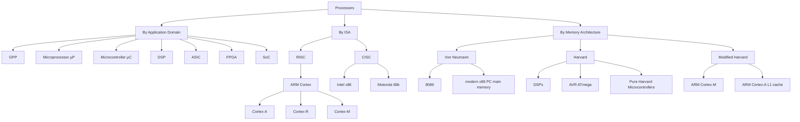
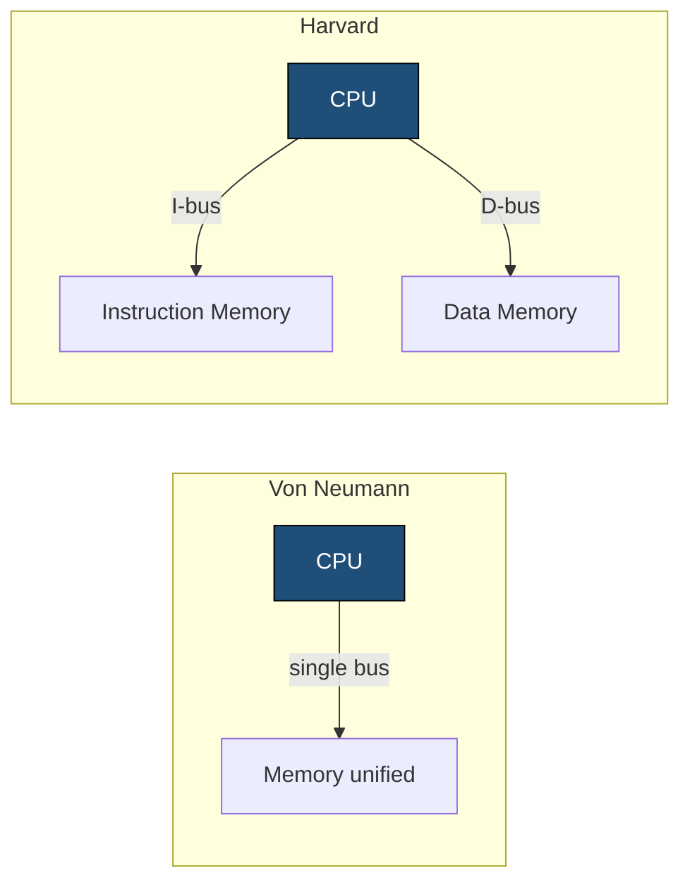
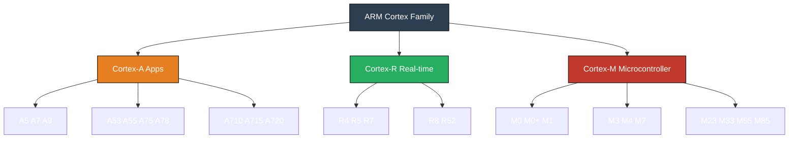
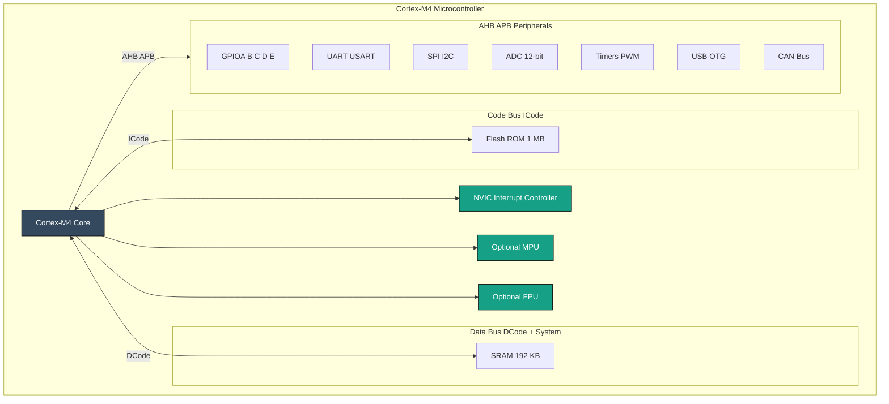
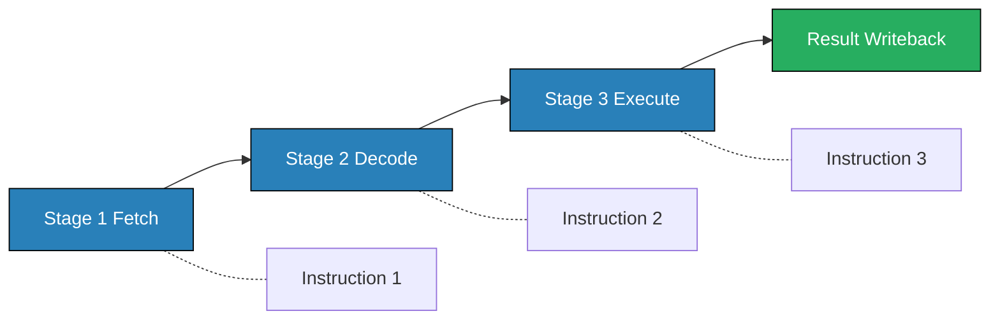

# Classification of processors

<!-- SECTION_1_START -->

# Classification of Processors

## 1. Core Technical Definition

A **processor** is the central computational unit of any computing system that interprets and executes instructions fetched from memory. The **classification of processors** is a systematic taxonomy used in computer architecture to categorize processing units based on their internal instruction set design, data path width, memory organization, and target application domain.

According to the KTU 2024 Scheme syllabus for *Microcontrollers (PBCST504)*, processors are broadly classified along three orthogonal axes:

1. **Instruction Set Architecture (ISA):** Reduced Instruction Set Computer (**RISC**) vs Complex Instruction Set Computer (**CISC**).
2. **Memory Organization:** Von Neumann (Princeton) Architecture vs Harvard Architecture.
3. **Application Domain:** General-Purpose Processor (GPP), Microprocessor (µP), Microcontroller (µC), Digital Signal Processor (DSP), and Application-Specific Integrated Circuit (ASIC).

> [!IMPORTANT]
> **KTU Syllabus Highlight (Module 1):** The classification forms the foundation for understanding **ARM Cortex** cores. ARM is a **RISC**, **Load/Store**, **32-bit/64-bit** ISA family. Every ARM Cortex-M (used in microcontrollers) is **Harvard** at the bus level and **Thumb** ISA at the instruction level.

### Intuitive Analogy: The "Toolbox" Perspective

Imagine a **workshop** with different types of workers:

- A **General-Purpose Worker (GPP/Microprocessor)** is like a Swiss Army knife — flexible, can do many jobs, but needs external tools (RAM, ROM, peripherals) bolted on. (e.g., Intel Core i7 in your laptop).
- A **Specialized Worker (Microcontroller)** is like a cordless drill with a battery, chuck, and LED all-in-one — built for a specific repetitive job. (e.g., STM32, Arduino's ATmega328).
- A **DSP Worker** is like a precision CNC lathe — extremely fast at one specific math operation (multiply-accumulate) on streaming data. (e.g., audio codecs).
- An **ASIC Worker** is like a custom-built robotic arm on a car assembly line — does ONE job forever, blindingly fast, but cannot be reprogrammed.

> [!NOTE]
> **Core Definition — RISC vs CISC**
> - **RISC** (Reduced Instruction Set Computer): Small, fixed-length, highly optimized instruction set. Each instruction typically executes in **one clock cycle**. Examples: **ARM**, **MIPS**, **RISC-V**, **SPARC**.
> - **CISC** (Complex Instruction Set Computer): Large, variable-length instruction set; one instruction may perform many low-level operations. Examples: **Intel x86**, **Motorola 68000**.

> [!NOTE]
> **Core Definition — Von Neumann vs Harvard**
> - **Von Neumann Architecture**: A **single shared bus** is used to fetch both instructions and data. Bottleneck called the **Von Neumann Bottleneck**.
> - **Harvard Architecture**: **Separate buses** for instruction fetch and data access, allowing simultaneous fetch + execute. All modern microcontrollers (including ARM Cortex-M) use a *modified Harvard* design.

> [!VISUALIZATION CONTROL]
> **Concept:** Von Neumann vs Harvard Bus Topology
> **GeoGebra / Desmos Input Equations:** Not directly applicable (architectural block diagram), but a logical equivalent — observe the two parallel data-flow paths.
> **Visual Description:** Picture **two pipelines (Harvard)** vs **one single queue (Von Neumann)**. In Harvard, the CPU can pull an instruction from ROM on Bus-A *while simultaneously* writing a variable to RAM on Bus-B. In Von Neumann, both must take turns.

---

## 2. Memory & Data-Width Metrics (Standard Constants)

- **Byte** = **8 bits** (fundamental addressable unit).
- **Half-word** = **16 bits**.
- **Word** = **32 bits** (standard for ARM Cortex-M).
- **Double-word** = **64 bits** (ARM Cortex-A in AArch64 mode).
- **Nibble** = **4 bits** (used in BCD/hex conversions).

> [!IMPORTANT]
> **Key Performance Metric:** Clock speed alone does NOT define processor power. Real performance = $\dfrac{\text{Instructions per Program} \times \text{CPI}}{\text{Clock Period}}$, where **CPI = Clock cycles Per Instruction**.

---

<!-- SECTION_1_END -->

<!-- SECTION_2_START -->

# Deep Theoretical Analysis & KTU High-Yield Formula Sheet

## 2.1 The Three-Tier Classification Model

### Tier 1: Classification by **Application Domain**

| Processor Type | Full Form | Key Trait | Typical Use | Bit-Width | Example IC |
|---|---|---|---|---|---|
| **GPP** | General-Purpose Processor | High clock, huge address space | PCs, Servers | 32/64-bit | Intel Core, AMD Ryzen |
| **µP** | Microprocessor | CPU only — needs external RAM/ROM | Embedded motherboards | 8/16/32-bit | Intel 8085, 8086 |
| **µC** | Microcontroller | CPU + RAM + ROM + Peripherals on **one chip** | Embedded control | 8/16/32-bit | 8051, ATmega328, STM32 |
| **DSP** | Digital Signal Processor | Hardware MAC, Harvard, SIMD | Audio/Video/Modems | 16/32-bit | TMS320, SHARC |
| **ASIC** | Application-Specific IC | Hardwired for one function | Mass production | Any | Crypto miners, MP3 decoders |
| **FPGA** | Field-Programmable Gate Array | Reconfigurable logic blocks | Prototyping, parallel tasks | Configurable | Xilinx, Altera |
| **SoC** | System on Chip | Multiple cores + GPU + DSP + µC on one die | Smartphones, IoT | 32/64-bit | Snapdragon, Apple M1 |

### Tier 2: Classification by **Instruction Set Architecture (ISA)**

| Feature | **RISC** | **CISC** |
|---|---|---|
| Instruction length | **Fixed** (typically 32-bit ARM) | **Variable** (1–15 bytes in x86) |
| Instruction count | **Small** (~50–150) | **Large** (hundreds) |
| Memory access | **Load/Store** (only dedicated instructions touch memory) | **Register-Memory** (any instruction can access memory) |
| Pipelining | **Highly pipelined** | Harder to pipeline |
| CPI | **CPI ≈ 1** | **CPI > 1**, variable |
| Decoding | Hardwired | Microcoded |
| Compiler complexity | Complex compiler | Simpler compiler |
| Power efficiency | **Low power per instruction** | Higher power per instruction |
| Examples | **ARM, MIPS, RISC-V, PowerPC** | **Intel x86, Motorola 68k, VAX** |

> [!IMPORTANT]
> **ARM Cortex is a RISC architecture.** All ARM Cortex-M cores use the **Thumb-2** instruction set (a compressed, mixed 16/32-bit RISC ISA) — giving RISC efficiency with CISC-like code density.

### Tier 3: Classification by **Memory Architecture**

| Feature | **Von Neumann (Princeton)** | **Harvard** | **Modified Harvard** |
|---|---|---|---|
| Buses | **1** shared bus | **2** separate buses | 2 buses, unified view to programmer |
| Instruction & Data memory | **Same** memory | **Separate** memory | Separate caches, unified RAM |
| Bottleneck | **Yes** (Von Neumann bottleneck) | **No** | Minimized |
| Speed | Slower | Faster | Faster |
| Cost / Wiring | Cheaper | Expensive (more pins) | Moderate |
| Example | **Intel 8086, 8051 (classical), x86 PCs** | **DSPs, AVR, PIC** | **ARM Cortex-M (STM32), ARM Cortex-A L1 cache** |

> [!NOTE]
> **KTU Key Point:** The 8051 is often *taught* as Harvard, but it has a **single external bus** that is time-multiplexed — so technically it is a **"Von Neumann-style externally, Harvard-style internally"** design. Pure Harvard is rare; most modern CPUs use **Modified Harvard**.

## 2.2 The ARM Cortex Family Classification

ARM Holdings designs processor **cores (IPs)** that other companies (ST, NXP, Texas Instruments, Microchip) license and integrate into silicon. The Cortex family splits into **three main profiles**:

| Profile | Full Form | Target | Bit-Width | Typical Use | Key Trait |
|---|---|---|---|---|---|
| **Cortex-A** | **Application** | High-performance apps | 32 / 64-bit | Smartphones, tablets, servers | Out-of-order superscalar, MMU, runs Linux |
| **Cortex-R** | **Real-time** | Hard real-time control | 32-bit | Automotive brakes, HDD controllers, 5G | Deterministic latency, lock-step cores |
| **Cortex-M** | **Microcontroller** | Embedded MCU | 32-bit | IoT, sensors, motor control, wearables | **Lowest power**, NVIC, MPU optional, Thumb-2 only |

### Sub-classification of Cortex-M (most relevant for PBCST504):

| Core | Year | Pipeline | FPU | MPU | DSP | Use |
|---|---|---|---|---|---|---|
| **Cortex-M0** | 2009 | 3-stage | No | No | No | Ultra-low power, 8/16-bit replacement |
| **Cortex-M0+** | 2012 | 2-stage | No | Yes (opt) | No | Lowest active power |
| **Cortex-M3** | 2004 | 3-stage | No | Yes (opt) | Yes | Mainstream MCU |
| **Cortex-M4** | 2010 | 3-stage | **Yes (opt)** | Yes | **Yes** | Mixed signal + control |
| **Cortex-M7** | 2014 | 6-stage, dual-issue | **Yes** | Yes (opt) | **Yes** | High-performance MCU + DSP |
| **Cortex-M23** | 2016 | 2-stage | No | Yes (opt) | No | TrustZone security baseline |
| **Cortex-M33** | 2016 | 3-stage | **Yes (opt)** | Yes (opt) | Yes | Mainstream secure MCU |
| **Cortex-M55** | 2020 | 4-stage + Helium | **Yes** | Yes | Yes (Helium MVE) | ML on edge |
| **Cortex-M85** | 2022 | 6-stage | **Yes** | Yes (opt) | Yes (Helium) | Highest perf Cortex-M |

> [!IMPORTANT]
> **Golden Rule for KTU Viva:** *"Cortex-A = Applications (with OS), Cortex-R = Real-time (deterministic), Cortex-M = Microcontroller (bare-metal embedded)."*

## 2.3 The Five Pillars of Embedded Processor Selection

For KTU problem-solving, the correct processor is chosen by balancing:

1. **Performance** — measured in **DMIPS/MHz** (Dhrystone MIPS). Cortex-M4 = **1.25 DMIPS/MHz**.
2. **Power** — measured in **µA/MHz** (active current per MHz). Cortex-M0+ ≈ **9 µA/MHz**.
3. **Cost** — silicon die area in **mm²** (smaller = cheaper).
4. **Power Flexibility** — multiple **low-power modes** (Sleep, Deep-sleep, Standby, Shutdown).
5. **Peripheral Integration** — on-chip ADC, UART, SPI, I²C, CAN, USB, Ethernet MAC.

## 2.4 KTU Formula & Metric Cheat Sheet

| Formula / Metric | Expression | Unit | Purpose |
|---|---|---|---|
| Execution Time | $T = \dfrac{N \times CPI}{f_{clk}}$ | seconds | Time to run a program |
| CPU Clock Period | $T_{clk} = \dfrac{1}{f_{clk}}$ | seconds | Period of one clock cycle |
| MIPS Rating | $\text{MIPS} = \dfrac{f_{clk}}{CPI \times 10^{6}}$ | Millions/sec | Million Instructions Per Second |
| Dhrystone Score | $\text{DMIPS/MHz} = \dfrac{\text{Dhrystone iterations/sec}}{1757 \times f_{clk}}$ | ratio | Normalized CPU performance |
| Amdahl's Law | $S = \dfrac{1}{(1-f) + \dfrac{f}{N}}$ | speedup ratio | Max speedup with N parallel cores |
| Memory Addressable | $M = 2^{n}$ where $n$ = address bus width | bytes | Max memory size |
| Bit Banding (Cortex-M) | $\text{Alias} = 0x22000000 + (A - 0x20000000) \times 32 + n \times 4$ | address | Atomic bit manipulation |
| Power (dynamic) | $P_{dyn} = \alpha \cdot C \cdot V^{2} \cdot f$ | Watts | Switching power |
| Power (static) | $P_{stat} = V \cdot I_{leak}$ | Watts | Leakage power |

> [!NOTE]
> **Critical:** Never use a vertical bar `\vert` inside a table cell. The above uses `\times`, `\cdot`, `\dfrac`, `\alpha` — all LaTeX-safe.

---

## 2.5 Real-World Engineering Utility

- **Cortex-M0/M0+** → coin-cell powered IoT sensors (e.g., temperature loggers, BLE beacons).
- **Cortex-M3/M4** → drones, industrial PLCs, BLDC motor control.
- **Cortex-M7/M85** → edge ML inference (keyword spotting, anomaly detection).
- **Cortex-R52** → automotive ADAS, functional safety (ISO 26262 ASIL-D).
- **Cortex-A53/A55/A78** → mobile SoCs (Qualcomm, MediaTek, Apple).

---

<!-- SECTION_2_END -->

<!-- SECTION_3_START -->

# Step-by-Step Derivations & Code Implementation

## 3.1 Derivation: Why RISC = Lower Power per Instruction

We start from the dynamic power equation of CMOS logic:

$$P_{dyn} = \alpha \cdot C \cdot V^{2} \cdot f$$

where $\alpha$ = switching activity, $C$ = load capacitance, $V$ = supply voltage, $f$ = clock frequency.

**Step 1:** Energy per switching event (per gate):

$$E_{gate} = C \cdot V^{2}$$

**Step 2:** Energy per instruction. Suppose a RISC instruction uses $N_{R}$ gate-transitions per cycle and a CISC instruction uses $N_{C}$ gate-transitions (typically $N_{C} \approx 3 N_{R}$ because CISC decodes more complex micro-ops):

$$E_{RISC} = N_{R} \cdot C \cdot V^{2}$$

$$E_{CISC} = N_{C} \cdot C \cdot V^{2} \approx 3 N_{R} \cdot C \cdot V^{2}$$

**Step 3:** For the same *useful work* (e.g., multiplying two numbers):

- CISC: 1 instruction × $E_{CISC}$ = $3 N_{R} C V^{2}$
- RISC: ~3 instructions (load, multiply, store) × $E_{RISC}$ = $3 \times N_{R} C V^{2}$

**Result:** Modern RISC pipelines reduce voltage and clock per stage, so total energy per useful operation drops:

$$E_{RISC, modern} = 3 \cdot N_{R}' \cdot C \cdot V_{low}^{2} \quad \text{where } V_{low} < V_{nom}$$

**Conclusion:** RISC with voltage scaling wins on **energy per instruction**, which is why every Cortex-M is RISC and battery-friendly.

---

## 3.2 Derivation: Memory Size from Address Bus Width

For an $n$-bit address bus:

$$M_{max} = 2^{n} \text{ bytes}$$

**Example 1 — 8051 (16-bit address):**

$$M_{max} = 2^{16} = 65536 \text{ bytes} = 64 \text{ KB}$$

**Example 2 — ARM Cortex-M3 (32-bit address):**

$$M_{max} = 2^{32} = 4294967296 \text{ bytes} = 4 \text{ GB}$$

**Example 3 — STM32 with 1 MB flash on Cortex-M4:**

Since $2^{20} = 1048576$ bytes $\approx$ 1 MB, the *physical* flash is mapped into the lower 1 MB of the 4 GB address space. The remaining 3 GB is unused/aliased.

---

## 3.3 Worked Example: MIPS Calculation (KTU Typical Problem)

**Problem:** A Cortex-M4 runs at **$f_{clk} = 72 \text{ MHz}$** with an **average CPI = 1.25**. Compute its MIPS rating.

**Step 1:** Identify the formula.

$$\text{MIPS} = \frac{f_{clk}}{CPI \times 10^{6}}$$

**Step 2:** Substitute values.

$$\text{MIPS} = \frac{72 \times 10^{6}}{1.25 \times 10^{6}}$$

**Step 3:** Compute.

$$\text{MIPS} = \frac{72}{1.25} = 57.6$$

**Final Answer:** **57.6 MIPS** (≈ **72 DMIPS** if we assume DMIPS/MHz ≈ 1.0 for M4).

> [!NOTE]
> **KTU Valuation Key:** *Showing the formula = 1 mark, substitution = 1 mark, final number = 1 mark.* Never write just the answer.

---

## 3.4 Worked Example: Amdahl's Law for Multi-core Speedup

**Problem:** A Cortex-A53 quad-core processor runs an application where **80%** of the code is parallelizable. Find the maximum theoretical speedup.

**Step 1:** Use Amdahl's law with $f = 0.8$ and $N = 4$ cores.

$$S = \frac{1}{(1-f) + \frac{f}{N}}$$

**Step 2:** Substitute.

$$S = \frac{1}{(1-0.8) + \frac{0.8}{4}}$$

**Step 3:** Simplify.

$$S = \frac{1}{0.2 + 0.2} = \frac{1}{0.4} = 2.5$$

**Final Answer:** Maximum speedup = **2.5×** even with 4 cores (because 20% is strictly serial).

> [!IMPORTANT]
> **KTU Pitfall:** Students often forget $(1-f)$. If you omit it, you get $S = N = 4$, which is **wrong** and loses 2 marks.

---

## 3.5 Implementation: Bare-Metal Cortex-M4 Code (Embedded C)

The following code demonstrates the **practical philosophy** of a microcontroller-class processor — *direct register access, no OS, deterministic timing*. This is the "feel" of a Cortex-M µC vs a Cortex-A GPP.

```c
/* ===========================================================
 *  File    : cortex_m4_classification_demo.c
 *  Purpose : Demonstrate bare-metal µC vs GPP characteristics
 *  Board   : STM32F407 (Cortex-M4, 168 MHz)
 *  Module  : PBCST504 - Microcontrollers, Module 1
 * =========================================================== */

#include "stm32f4xx.h"          /* CMSIS device header              */

#define LED_PIN     (1U << 5)   /* PA5  - On-board LED (active high) */
#define BTN_PIN     (1U << 13)  /* PC13 - User button (active low)   */

/* ---------- 1. SystemInit: configure 168 MHz from 8 MHz HSE ----------- */
void SystemInit_168MHz(void) {
    /* Enable HSE (8 MHz external crystal) and wait for it to stabilize */
    RCC->CR |= RCC_CR_HSEON;
    while ((RCC->CR & RCC_CR_HSERDY) == 0U) { /* spin */ }

    /* Configure flash latency for 168 MHz @ 2.7V-3.3V: 5 wait states */
    FLASH->ACR = FLASH_ACR_LATENCY_5WS | FLASH_ACR_PRFTEN | FLASH_ACR_ICEN | FLASH_ACR_DCEN;

    /* Set bus prescalers */
    RCC->CFGR |= RCC_CFGR_HPRE_DIV1;   /* AHB  = 168 MHz */
    RCC->CFGR |= RCC_CFGR_PPRE1_DIV4;  /* APB1 =  42 MHz */
    RCC->CFGR |= RCC_CFGR_PPRE2_DIV2;  /* APB2 =  84 MHz */

    /* Configure PLL: HSE × 168 / 8 = 168 MHz */
    RCC->PLLCFGR = (RCC_PLLCFGR_PLLSRC_HSE |
                    (4U  << RCC_PLLCFGR_PLLM_Pos) |
                    (168U << RCC_PLLCFGR_PLLN_Pos) |
                    (0U  << RCC_PLLCFGR_PLLP_Pos) |
                    (7U  << RCC_PLLCFGR_PLLQ_Pos));
    RCC->CR   |= RCC_CR_PLLON;
    while ((RCC->CR & RCC_CR_PLLRDY) == 0U) { /* spin */ }

    RCC->CFGR |= RCC_CFGR_SW_PLL;
    while ((RCC->CFGR & RCC_CFGR_SWS) != RCC_CFGR_SWS_PLL) { /* spin */ }
}

/* ---------- 2. GPIO setup --------------------------------------------- */
void gpio_init(void) {
    RCC->AHB1ENR |= RCC_AHB1ENR_GPIOAEN;   /* Clock for GPIOA (LED)  */
    RCC->AHB1ENR |= RCC_AHB1ENR_GPIOCEN;   /* Clock for GPIOC (BTN)  */

    /* PA5 as output, push-pull, no pull, high speed */
    GPIOA->MODER   &= ~(3U << (5U * 2U));
    GPIOA->MODER   |=  (1U << (5U * 2U));
    GPIOA->OSPEEDR |=  (2U << (5U * 2U));

    /* PC13 as input (button is active-low) */
    GPIOC->MODER   &= ~(3U << (13U * 2U));
    GPIOC->PUPDR   |=  (1U << (13U * 2U)); /* pull-up */
}

/* ---------- 3. Tiny blocking delay ------------------------------------ */
static inline void delay(volatile uint32_t cycles) {
    while (cycles-- > 0U) { __NOP(); }
}

/* ---------- 4. Main: shows the "microcontroller" pattern -------------- */
int main(void) {
    SystemInit_168MHz();
    gpio_init();

    /* The classic µC super-loop: deterministic, no OS, no malloc */
    for (;;) {
        if ((GPIOC->IDR & BTN_PIN) == 0U) {        /* button pressed */
            GPIOA->BSRR = LED_PIN;                 /* LED ON  */
        } else {
            GPIOA->BSRR = (LED_PIN << 16);         /* LED OFF */
        }
        delay(200000U);
    }
}
```

### Code-to-Classification Mapping

| Code Line / Construct | Classification Trait Demonstrated |
|---|---|
| `#include "stm32f4xx.h"` | **µC** — vendor CMSIS header maps SFRs to memory addresses |
| `RCC->AHB1ENR |= …` | **Load/Store ISA** — explicit read-modify-write (RISC) |
| `GPIOA->BSRR = LED_PIN;` | **Memory-mapped I/O** — peripherals live in the 4 GB address space |
| `for(;;)` super-loop | **Bare-metal** — no OS scheduler (Cortex-M design) |
| `__NOP();` | **RISC** — no-op is a real instruction (Thumb-2) |
| `SystemInit_168MHz()` | **Modified Harvard** — separate AHB for ICode, DCode, DMA |

---

<!-- SECTION_3_END -->

<!-- SECTION_4_START -->

# Structural Diagrams & Schematics

## 4.1 Master Classification of Processors (Mermaid)



## 4.2 Von Neumann vs Harvard — Bus Topology



## 4.3 ARM Cortex Family Topology (Mermaid)



## 4.4 Internal Block Diagram of a Typical Microcontroller (Cortex-M4)



## 4.5 Sequential Processing Topology — RISC Pipeline (3-stage)



---

<!-- SECTION_4_END -->

<!-- SECTION_5_START -->

# KTU 2024 Scheme Examination Question Bank & Topic Recap

## Part A — Short Answer Questions (3 Marks Each)

### **Question 1** `[KTU University Exam – Dec 2023]`
**Differentiate between RISC and CISC architectures. List any two examples of each.** (CO1, **Remember**)

**Model Answer:**

| Parameter | RISC | CISC |
|---|---|---|
| Full form | Reduced Instruction Set Computer | Complex Instruction Set Computer |
| Instruction length | **Fixed** (32-bit typical) | **Variable** (1–15 bytes) |
| Memory access | **Load/Store** only | **Register/Memory** |
| CPI | **~ 1** | **> 1**, variable |
| Pipelining | Easy, deep | Difficult |
| Power | Low | Higher |
| Examples | **ARM, MIPS, RISC-V, SPARC** | **Intel x86, VAX, 68k** |
| Compiler | Complex | Simpler |

**[Stating 4 differences: 2 Marks; Examples: 1 Mark]**

---

### **Question 2** `[KTU University Exam – July 2024]`
**Explain the difference between Von Neumann and Harvard architectures with neat diagrams.** (CO1, **Understand**)

**Model Answer:**
- **Von Neumann**: Single shared bus for instructions and data. Bottleneck occurs when both are accessed simultaneously. Example: **Intel 8086**.
- **Harvard**: Separate instruction and data buses/memories. Allows concurrent instruction fetch and data access. Example: **AVR ATmega, DSPs**.
- **Modified Harvard**: Separate L1 caches, unified main RAM. Example: **ARM Cortex-M, Cortex-A**.

> [!NOTE]
> **Valuation cue:** A *neat diagram* earns the diagram mark; verbal description alone does not.

**[Definition: 1 Mark; Diagram: 1 Mark; Example: 1 Mark]**

---

## Part B — Long Answer Questions (14 Marks, Internal Choice)

### **Question 3A** `[KTU University Exam – Dec 2023, Module 1]`
**(a)** Classify processors based on **application domain**. Compare **microprocessor and microcontroller** in detail. **(7 Marks)** (CO1, **Understand**)

**(b)** With a neat block diagram, explain the **internal architecture of a typical 32-bit ARM Cortex-M microcontroller**. Highlight the role of the **NVIC** and **bus matrix**. **(7 Marks)** (CO1, **Apply**)

**Model Solution:**

**(a) Classification by Application Domain** (7 Marks)

| Category | Description | Example |
|---|---|---|
| General-Purpose Processor (GPP) | High clock, large memory, OS support | Intel i7 |
| Microprocessor (µP) | CPU chip only, needs external RAM/ROM/peripherals | Intel 8085 |
| Microcontroller (µC) | CPU + RAM + ROM + I/O on **single IC** | 8051, STM32 |
| DSP | Specialized for signal processing (MAC) | TMS320 |
| ASIC | Custom logic for one function | Crypto miner |
| FPGA | Reconfigurable logic | Xilinx Kintex |

**Comparison Microprocessor vs Microcontroller** (4 Marks of part a)

| Feature | Microprocessor | Microcontroller |
|---|---|---|
| Definition | CPU-only chip | CPU + Memory + Peripherals on-chip |
| Memory | External (GBs) | Internal (KBs–MBs) |
| Peripherals | External | On-chip (ADC, Timers, UART) |
| Cost | High (system cost) | Low (single chip BOM) |
| Power | Watts | Milliwatts |
| Clock | GHz | MHz |
| OS | Linux, Windows | Bare-metal / RTOS |
| Bit-width | 32/64-bit | 8/16/32-bit |
| Example | Intel Core i5 | STM32F407 |
| Application | PC, Server | Washing machine, IoT |

**[Classification list: 3 Marks; Comparison table: 4 Marks]**

---

**(b) ARM Cortex-M Block Diagram** (7 Marks)

Refer to the mermaid diagram in **Section 4.4**. A textual description for the answer sheet:

- **Cortex-M4 Core**: 3-stage pipeline (Fetch, Decode, Execute). Supports Thumb-2 ISA.
- **ICode bus (32-bit)**: Fetches instructions from **Flash (ROM)** at up to 168 MHz.
- **DCode bus (32-bit)**: Loads/stores data from/to **SRAM** (192 KB).
- **System bus (32-bit)**: Connects to peripherals via **AHB → APB bridge**.
- **NVIC (Nested Vectored Interrupt Controller)**: Handles up to 82 maskable interrupts with 16 priority levels, supports **tail-chaining** and **late-arrival** for low-latency ISR entry.
- **Bus Matrix (AHB-Lite)**: Multi-layer interconnect that allows **parallel** access — e.g., CPU can read Flash *while* DMA writes SRAM.
- **Optional FPU**: Single-precision IEEE-754 floating point unit.
- **Optional MPU**: Memory Protection Unit for RTOS task isolation.

**[Listing major blocks: 3 Marks; NVIC explanation: 2 Marks; Bus matrix role: 2 Marks]**

---

### **Question 3B** `[KTU University Exam – July 2024, Module 1]`
**(a)** Compare **RISC and CISC** architectures. State **four major advantages** of RISC for embedded systems. **(7 Marks)** (CO1, **Understand**)

**(b)** A Cortex-M4 processor runs at **$f_{clk} = 100 \text{ MHz}$** with an **average CPI of 1.2**. Compute **(i)** clock period, **(ii)** MIPS rating, **(iii)** execution time for a program of **$N = 5 \times 10^{6}$ instructions**. **(7 Marks)** (CO1, **Apply**)

**Model Solution:**

**(a) RISC vs CISC** (7 Marks)

Refer to the table in Question 1. **Four advantages of RISC for embedded systems** (2 Marks):

1. **Lower power consumption** — simpler decoder, lower $V_{dd}$ possible.
2. **Deterministic CPI ≈ 1** — easier to compute worst-case execution time (WCET) for real-time systems.
3. **Smaller die area** — cheaper silicon, more room for analog/RF on SoC.
4. **Highly pipelinable** — easier to scale clock frequency upward.

**[Comparison table: 5 Marks; Four advantages: 2 Marks]**

---

**(b) Numerical** (7 Marks)

**Given:** $f_{clk} = 100 \text{ MHz}$, $CPI = 1.2$, $N = 5 \times 10^{6}$ instructions.

**(i) Clock period:**

$$T_{clk} = \frac{1}{f_{clk}} = \frac{1}{100 \times 10^{6}}$$

$$T_{clk} = 10 \text{ ns}$$

**[Formula: 1 Mark; Substitution: 1 Mark; Final: 1 Mark]**

**(ii) MIPS rating:**

$$\text{MIPS} = \frac{f_{clk}}{CPI \times 10^{6}} = \frac{100 \times 10^{6}}{1.2 \times 10^{6}}$$

$$\text{MIPS} = 83.33$$

**[Formula: 1 Mark; Substitution: 0.5 Mark; Final: 0.5 Mark]**

**(iii) Execution time:**

$$T = \frac{N \times CPI}{f_{clk}} = \frac{5 \times 10^{6} \times 1.2}{100 \times 10^{6}}$$

$$T = \frac{6 \times 10^{6}}{100 \times 10^{6}} = 0.06 \text{ s} = 60 \text{ ms}$$

**[Formula: 1 Mark; Substitution: 0.5 Mark; Final: 0.5 Mark]**

---

> [!WARNING]
> **KTU Examiner's Valuation Pitfalls — Processor Classification**
> 1. **Confusing 8051 architecture** — do not call 8051 a "pure Harvard" without qualification. The correct statement is "internally Harvard, externally Von Neumann."
> 2. **Forgetting $(1-f)$ in Amdahl's Law** — never write $S = N$.
> 3. **Mixing MIPS and MHz** — MIPS depends on CPI, not just clock speed. A 50 MHz ARM Cortex-M4 (CPI = 1) gives **50 MIPS**, while a 200 MHz ARM9 (CPI = 1.5) gives **133 MIPS** — not 4×.
> 4. **Stating ARM is a "processor"** — ARM Holdings sells **IP cores**, not chips. The chip is made by ST/NXP/etc. Examiners deduct marks for this.
> 5. **Missing units** — for execution time, write "**60 ms**", not "0.06".

---

## 📌 Topic Recap & Important Things to Remember

### 🔑 One-Line Definitions (High-Yield for 2-markers)
- **Processor** = the unit that fetches, decodes, and executes instructions.
- **RISC** = Reduced Instruction Set Computer, fixed-length, load/store, CPI ≈ 1.
- **CISC** = Complex Instruction Set Computer, variable-length, register/memory.
- **Von Neumann** = single shared bus for code and data (bottleneck).
- **Harvard** = separate code and data buses (no bottleneck).
- **Modified Harvard** = separate L1 caches, unified main RAM (used in Cortex-M/A).
- **Microprocessor** = CPU-only chip.
- **Microcontroller** = CPU + RAM + ROM + Peripherals on one chip.
- **DSP** = processor specialized for real-time signal math (MAC).
- **ASIC** = custom silicon for one fixed function.
- **SoC** = full system (CPU + GPU + DSP + memory) on one die.
- **Cortex-A/R/M** = Application / Real-time / Microcontroller ARM profiles.
- **NVIC** = Nested Vectored Interrupt Controller — handles interrupts with priority and tail-chaining.
- **MIPS** = Millions of Instructions Per Second = $f_{clk} / (CPI \times 10^{6})$.
- **DMIPS/MHz** = Dhrystone-normalized performance; M4 = 1.25.

### 🧠 Key Numerical Values to Memorize
- 8051 address bus = 16 bit → 64 KB addressable.
- ARM Cortex-M address bus = 32 bit → **4 GB** addressable.
- 1 KB = $2^{10}$ bytes, 1 MB = $2^{20}$ bytes, 1 GB = $2^{30}$ bytes.
- Cortex-M4 = 1.25 DMIPS/MHz, 3-stage pipeline, Thumb-2 ISA.

### ⚠️ Common Exam Traps
- "ARM Cortex-M is CISC" → **FALSE**, it is RISC with Thumb-2.
- "All Harvard processors are faster than Von Neumann" → **Not always true**; cost and complexity also matter.
- "Microcontrollers cannot run OS" → **Partly true**; they run bare-metal or small RTOS (FreeRTOS), not Linux.
- "MIPS = MHz" → **FALSE**, only if CPI = 1.

### 🗺️ ARM Cortex Decision Flow
1. Need an OS / high perf? → **Cortex-A**
2. Need hard real-time + safety? → **Cortex-R**
3. Need ultra-low power + bare-metal? → **Cortex-M**

### 📊 Mnemonic to Remember the Three Profiles
- **A**pps (smartphones) → **A**pplication → Cortex-**A**
- **R**eal-time (cars, brakes) → **R**eal-time → Cortex-**R**
- **M**icrocontroller (IoT, sensors) → **M**icrocontroller → Cortex-**M**

> [!TIP]
> **Final KTU Strategy Tip:** Always draw the **bus diagram** (Harvard vs Von Neumann) — examiners award 2 marks just for a clean, correctly labeled diagram. Don't skip it.

---

<!-- SECTION_5_END -->
