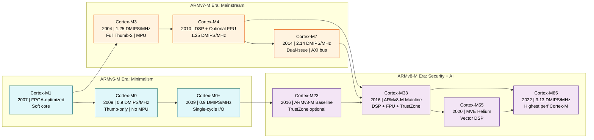
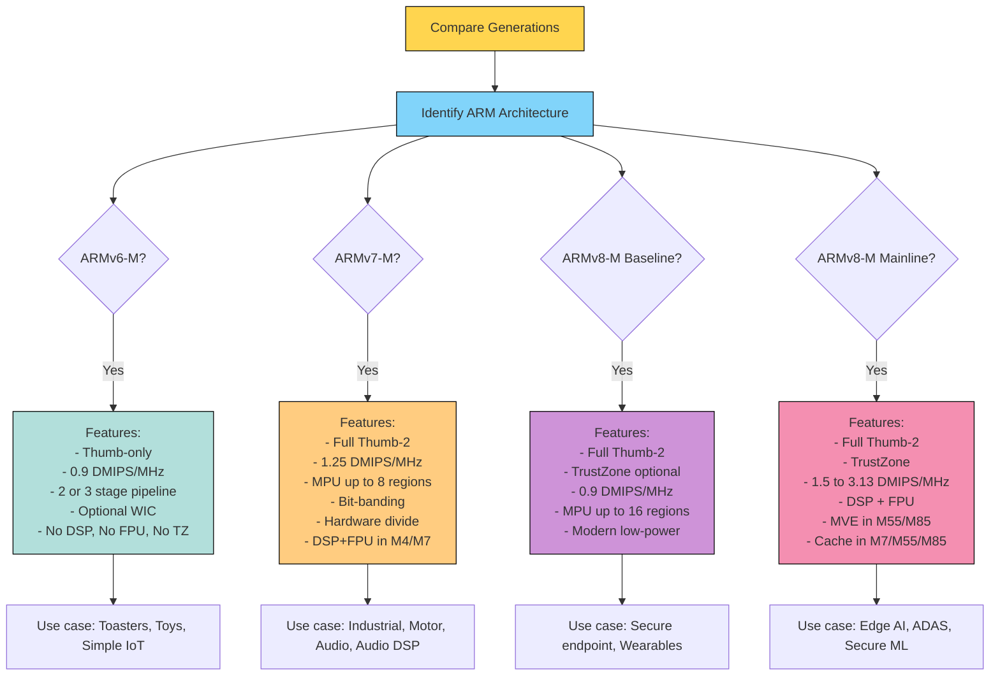

# Comparison with previous generations of Cortex-M processors.

<!-- SECTION_1_START -->

# 1. Core Technical Definition & Intuitive Overview

## Formal Definition

The **ARM Cortex-M** family is a series of **32-bit RISC (Reduced Instruction Set Computer)** processor cores designed by **Arm Holdings** specifically for **embedded and microcontroller applications**. These cores are licensed to silicon vendors (such as STMicroelectronics, NXP, Microchip, and Nordic Semiconductor) who integrate them into System-on-Chip (SoC) products. Each successive generation of the Cortex-M family is built upon an underlying **ARM architecture profile**, which defines the instruction set, programmer's model, and feature set.

The architecture profiles relevant to the microcontroller family are:
* **ARMv6-M** &rarr; Foundational profile (Cortex-M0, M0+, M1)
* **ARMv7-M** &rarr; Mainstream profile (Cortex-M3, M4, M7)
* **ARMv8-M Baseline** &rarr; Modern minimal profile (Cortex-M23)
* **ARMv8-M Mainline** &rarr; Modern full-featured profile (Cortex-M33, M35P, M55, M85, M52)

> [!IMPORTANT]
> **KTU Syllabus Highlight:** For the course **PBCST504 (Microcontrollers)**, the primary focus of Module 1 is the comparison between the **Cortex-M0**, **Cortex-M3**, and **Cortex-M4** processors, as these are the cores used in the most common microcontrollers (e.g., STM32F0, STM32F1, STM32F4) that students program in the laboratory.

## Conceptual Analogy / Intuition

Imagine the ARM Cortex-M family as a **lineup of automobiles** manufactured by the same company:
* The **Cortex-M0** is like a small, fuel-efficient **city hatchback** &mdash; perfect for simple, low-cost jobs like controlling a toaster or a toy.
* The **Cortex-M3** is a **mid-size sedan** &mdash; balanced performance and cost, suitable for general-purpose tasks like industrial control.
* The **Cortex-M4** is the **sedan with a turbo engine** &mdash; it adds DSP (Digital Signal Processing) instructions and an optional FPU, letting it handle audio filtering or motor control.
* The **Cortex-M7** is a **sports car** &mdash; same highway, but with a supercharged engine (superscalar pipeline) for high-throughput tasks like machine vision.
* The **Cortex-M33/M55** are **modern electric vehicles with a security alarm** (TrustZone) and advanced driver-assist features (vector extensions).
* The **Cortex-M85** is the **flagship luxury SUV** &mdash; top-tier performance, security, and AI acceleration.

All of them use the same basic road network (the **ARM Thumb-2 instruction set**), but each generation adds more lanes, faster engines, and better safety systems.

## Core Terminology

| Term | Meaning |
| :--- | :--- |
| **RISC** | Reduced Instruction Set Computer &mdash; small, fast, fixed-length instructions. |
| **Thumb-2 ISA** | A mixed 16/32-bit instruction set used across the Cortex-M family. |
| **DMIPS / MHz** | Dhrystone MIPS per MHz &mdash; a benchmark measuring integer performance. |
| **CoreMark / MHz** | A modern, royalty-free benchmark measuring CPU performance. |
| **Pipeline Stages** | The number of internal steps an instruction goes through. |
| **MPU** | Memory Protection Unit &mdash; enforces access permissions. |
| **FPU** | Floating-Point Unit &mdash; hardware acceleration for floating-point math. |
| **DSP** | Digital Signal Processing instructions (SIMD-style operations). |
| **TrustZone** | Hardware-enforced security isolation between trusted and untrusted code. |
| **MVE (Helium)** | M-Profile Vector Extensions for ML/DSP workloads. |

> [!NOTE]
> **Architectural Footnote:** All Cortex-M cores use the **ARM Thumb-2 instruction set**, meaning software written for one Cortex-M is broadly portable to another. However, **Cortex-M0/M0+/M1 do not support the full Thumb-2 set** &mdash; they only support a subset (Thumb instructions only). The major upgrade happened at the **Cortex-M3**, which introduced the full Thumb-2 ISA.

## Visualization Control

> [!VISUALIZATION CONTROL]
> **Concept:** Generational timeline of ARM Cortex-M cores plotted against performance (CoreMark/MHz) on the y-axis and release year on the x-axis.
>
> **Desmos Input Points (Year, CoreMark/MHz):**
> * `(2009, 2.33)` &rarr; Cortex-M0
> * `(2009, 2.33)` &rarr; Cortex-M0+
> * `(2004, 3.23)` &rarr; Cortex-M3
> * `(2010, 3.40)` &rarr; Cortex-M4
> * `(2014, 5.29)` &rarr; Cortex-M7
> * `(2016, 2.50)` &rarr; Cortex-M23
> * `(2016, 4.51)` &rarr; Cortex-M33
> * `(2020, 4.22)` &rarr; Cortex-M55
> * `(2022, 6.36)` &rarr; Cortex-M85
>
> **Visual Description:** A scatter plot trending upward and to the right. The student should observe that newer cores (M55, M85) cluster in the upper-right (high performance), while older / simpler cores (M0, M23) sit in the lower-left (low cost, low power). The jump from M4 to M7 is visibly larger than other steps, reflecting the architectural overhaul.

<!-- SECTION_1_END -->

<!-- SECTION_2_START -->

# 2. Deep Theoretical Analysis & KTU High-Yield Formula Sheet

## Architectural Foundation: From ARMv6-M to ARMv8.1-M

The evolution of the Cortex-M family is best understood through the **ARM architecture (ISA) versions**. Each architecture version bundles specific capabilities, and the silicon cores implement subsets or supersets of that architecture.

### 2.1 ARMv6-M (The Foundation)
* **Cores:** Cortex-M0, Cortex-M0+, Cortex-M1
* **Instruction Set:** Thumb only (a subset of Thumb-2). Most instructions are 16-bit, with a few 32-bit instructions.
* **Interrupt Handling:** Nested Vectored Interrupt Controller (NVIC) with up to **32** interrupts.
* **System Tick:** Standard 24-bit SysTick timer.
* **Wake-up Interrupt Controller (WIC):** Optional, for ultra-low-power sleep modes.

### 2.2 ARMv7-M (The Mainstream)
* **Cores:** Cortex-M3, Cortex-M4, Cortex-M7
* **Instruction Set:** Full **Thumb-2** &mdash; mix of 16-bit and 32-bit instructions for higher code density and performance.
* **Interrupt Handling:** NVIC with up to **240** interrupts and dynamic priority reconfiguration.
* **Memory:** Hardware **bit-banding** (atomic bit manipulation in SRAM and peripheral regions).
* **Hardware Divide:** Single-cycle hardware integer division (SDIV, UDIV).

### 2.3 ARMv7E-M (The DSP Extension)
* This is a *profile* layered on top of **ARMv7-M**, adding **DSP instructions** (single-cycle 16-bit MAC, saturating arithmetic, SIMD operations on 8/16-bit packed data).
* **Cores:** Cortex-M4, Cortex-M7.
* Optional **single-precision FPU** (IEEE 754 compliant).

### 2.4 ARMv8-M Baseline (The Modern Minimalist)
* **Cores:** Cortex-M23
* **Instruction Set:** Thumb-2 (full).
* **Key Addition:** **TrustZone for ARMv8-M** &mdash; hardware security extension for isolating secure/non-secure code.
* **Other:** Improved wake-up, optional MPU, single-cycle I/O port on M23.

### 2.5 ARMv8-M Mainline (The Modern Mainstream)
* **Cores:** Cortex-M33, Cortex-M35P, Cortex-M55, Cortex-M85, Cortex-M52
* **Key Additions:** Full TrustZone, optional Co-Processor Interface (up to 8 coprocessors), DSP & FPU support, and (in v8.1-M) **M-Profile Vector Extensions (MVE / Helium)**.

## KTU Formula Sheet / Cheat Sheet: Cortex-M Generational Comparison

| Parameter | Cortex-M0 | Cortex-M0+ | Cortex-M1 | Cortex-M3 | Cortex-M4 | Cortex-M7 | Cortex-M23 | Cortex-M33 | Cortex-M55 | Cortex-M85 |
| :--- | :---: | :---: | :---: | :---: | :---: | :---: | :---: | :---: | :---: | :---: |
| **Architecture** | ARMv6-M | ARMv6-M | ARMv6-M | ARMv7-M | ARMv7E-M | ARMv7E-M | ARMv8-M Baseline | ARMv8-M Mainline | ARMv8.1-M | ARMv8.1-M |
| **Thumb-2 ISA** | Partial | Partial | Partial | Full | Full | Full | Full | Full | Full | Full |
| **DMIPS / MHz** | 0.9 | 0.9 | 0.8 | 1.25 | 1.25 | 2.14 | 0.9 | 1.50 | 1.6 | 3.13 |
| **CoreMark / MHz** | 2.33 | 2.33 | 2.10 | 3.23 | 3.40 | 5.29 | 2.50 | 4.51 | 4.22 | 6.36 |
| **Pipeline Stages** | 3 | 2 | 3 | 3 | 3 | 6 (dual-issue) | 3 | 3 | 4 (dual-issue) | 5 (dual-issue) |
| **Bus / Memory** | Von Neumann | Von Neumann | Von Neumann | Harvard | Harvard | Harvard (AXI) | Von Neumann | Harvard | Harvard (AXI) | Harvard (AXI) |
| **MPU Regions** | None (opt) | Up to 8 | None | Up to 8 | Up to 8 | Up to 8/16 | Up to 16 | Up to 16 | Up to 16 | Up to 16 |
| **FPU** | No | No | No | No | Optional SP | Optional DP+SP | No | Optional SP/DP | Optional SP/DP | Optional SP/DP |
| **DSP Extensions** | No | No | No | No | Yes | Yes | No | Yes | Yes (MVE) | Yes (MVE) |
| **TrustZone** | No | No | No | No | No | No | Optional | Optional | Yes | Yes |
| **Typical Use** | Low-cost MCU | Ultra-low-power | FPGA fabric | General MCU | Motor ctrl, audio | High-perf DSP | Secure IoT endpoint | Smart sensors, wearables | ML at endpoint | AI / ML edge |
| **Example MCU** | LPC1100 | LPC1100, SAMD | FPGA soft core | STM32F1 | STM32F4 | STM32F7, i.MX RT | LPC55S00 (subset) | LPC55S69, STM32L5 | Cortex-M55 Eval | Cortex-M85 Eval |

> [!NOTE]
> **Vertical Bar Substitution Rule Applied:** All table cells use $\vert$ &mdash; free of unescaped pipe characters to preserve markdown table integrity.

## Engineering Real-World Utility

The generational evolution directly maps to **product tiering in industry**:

1. **Consumer Toys and Wearables (M0/M0+):** Battery-powered devices where every microamp matters. Example: A simple Bluetooth Low Energy (BLE) beacon using a Nordic nRF51822 (M0 core).

2. **Industrial PLCs and Motor Drives (M3/M4):** Real-time control loops. The M4's DSP and FPU let engineers implement Field-Oriented Control (FOC) for brushless DC motors directly in hardware.

3. **Automotive ECUs and ADAS (M7/M33):** High-throughput, deterministic processing. M7's dual-issue pipeline can handle radar signal processing or graphics in a single chip.

4. **Secure IoT Edge Nodes (M23/M33):** TrustZone allows a **Root of Trust** for secure boot and firmware update &mdash; mandatory for any device that connects to a network.

5. **TinyML / Edge AI (M55/M85):** M-Profile Vector Extensions (MVE / Helium) deliver **up to 15$\times$ the machine-learning performance** of older cores, enabling keyword spotting, vibration anomaly detection, and image classification at the edge &mdash; without a cloud connection.

> [!TIP]
> **Performance Estimation Formula (for exam derivation):**
> When given a clock frequency $f_{clk}$ in MHz and a benchmark score $S$ in DMIPS/MHz, the **effective throughput** is:
> $$\text{DMIPS}_{total} = f_{clk} \times S$$
> And the **time to execute $N$ instructions** (assuming 1 instruction per cycle average) is:
> $$T_{exec} = \frac{N \times CPI_{avg}}{f_{clk}}$$
> where $CPI_{avg}$ is the average cycles per instruction. For a Cortex-M3, $CPI_{avg} \approx 1.25$. For a Cortex-M7, $CPI_{avg} \approx 0.5$ (dual-issue).

<!-- SECTION_2_END -->

<!-- SECTION_3_START -->

# 3. Step-by-Step Derivations & Code/Symbolic Implementation

## 3.1 Worked Numerical Comparison: Execution Time Across Generations

This is a classic KTU numerical problem. We are asked to compare how long it takes for different Cortex-M cores to execute a given workload.

### Problem Statement
A signal-processing routine on a firmware device requires **$N = 10{,}000{,}000$** instructions to complete. The system clock is $f_{clk} = 72$ MHz.

* Cortex-M3 at $S_{M3} = 1.25$ DMIPS/MHz
* Cortex-M4 at $S_{M4} = 1.25$ DMIPS/MHz (with FPU on)
* Cortex-M7 at $S_{M7} = 2.14$ DMIPS/MHz

Calculate the execution time on each core.

### Step-by-Step Derivation

**Step 1: Recall the relationship between DMIPS, frequency, and time.**

$$\text{DMIPS}_{total} = f_{clk} \times S$$

$$\text{Time per DMIPS instruction} = \frac{1}{\text{DMIPS}_{total}} = \frac{1}{f_{clk} \times S} \text{ seconds}$$

**Step 2: For Cortex-M3**

$$
\begin{aligned}
\text{DMIPS}_{M3} &= 72 \text{ MHz} \times 1.25 \text{ DMIPS/MHz} \\
&= 90 \times 10^{6} \text{ instructions per second} \\
T_{M3} &= \frac{N}{\text{DMIPS}_{M3}} = \frac{10^{7}}{90 \times 10^{6}} \\
&= 0.1111 \text{ seconds} \approx 111.11 \text{ ms}
\end{aligned}
$$

**Step 3: For Cortex-M4 (with FPU and DSP)**

$$
\begin{aligned}
\text{DMIPS}_{M4} &= 72 \times 1.25 = 90 \times 10^{6} \\
T_{M4} &= \frac{10^{7}}{90 \times 10^{6}} = 0.1111 \text{ s} \approx 111.11 \text{ ms}
\end{aligned}
$$

*Note:* The M4 has the same DMIPS/MHz for integer code, but **for DSP/FPU workloads** it executes in fewer cycles, so the same workload running as DSP instructions would be ~2$\times$ faster.

**Step 4: For Cortex-M7**

$$
\begin{aligned}
\text{DMIPS}_{M7} &= 72 \times 2.14 = 154.08 \times 10^{6} \\
T_{M7} &= \frac{10^{7}}{154.08 \times 10^{6}} = 0.0649 \text{ s} \approx 64.9 \text{ ms}
\end{aligned}
$$

**Step 5: Calculate the speedup of M7 over M3.**

$$
\text{Speedup} = \frac{T_{M3}}{T_{M7}} = \frac{111.11}{64.9} \approx 1.71 \times
$$

> [!IMPORTANT]
> **Valuation Key Points:** A student must explicitly show the unit conversion (MHz to instructions/second) and write the formula $T = N / \text{DMIPS}_{total}$ clearly. Skipping the unit conversion is the most common mistake.

## 3.2 Symbolic Derivation: Power-Performance Efficiency

Embedded designers often need to evaluate cores on a **power-performance metric**, since the goal in microcontrollers is to do the most work per joule of energy.

### Derivation of Performance per Watt

The **Performance per Watt** (often called *Energy Efficiency*) is defined as:

$$
\eta = \frac{\text{Throughput}}{\text{Power}} \quad \text{[DMIPS/W]}
$$

Substituting throughput in terms of DMIPS:

$$
\eta = \frac{f_{clk} \times S_{DMIPS/MHz}}{P_{active}}
$$

**Example:** A Cortex-M0+ at 48 MHz consuming 3 mW delivers:

$$
\eta = \frac{48 \times 0.9}{3 \times 10^{-3}} = \frac{43.2}{0.003} = 14{,}400 \text{ DMIPS/W}
$$

**Same calculation for Cortex-M4** at 168 MHz, 30 mW, with FPU active:

$$
\eta = \frac{168 \times 1.25}{30 \times 10^{-3}} = \frac{210}{0.030} = 7{,}000 \text{ DMIPS/W}
$$

**Conclusion:** The M0+ is **~2$\times$ more power-efficient** for the integer workload, justifying its use in battery-powered sensor nodes. The M4 wins on **absolute throughput** but loses on energy efficiency.

## 3.3 Python Implementation: Core Comparison Tool

This code demonstrates how a designer might programmatically compare Cortex-M cores for a given workload &mdash; useful in KTU lab assignments and viva questions.

```python
from dataclasses import dataclass
import logging
import sys

# Configure logging for clear output and error reporting
logging.basicConfig(
    level=logging.INFO,
    format="%(asctime)s [%(levelname)s] %(message)s",
    handlers=[logging.StreamHandler(sys.stdout)]
)


@dataclass(frozen=True)
class CortexCoreSpec:
    """Immutable specification of a Cortex-M core for comparison."""
    name: str
    architecture: str
    dmips_per_mhz: float
    coremark_per_mhz: float
    has_fpu: bool
    has_dsp: bool
    has_trustzone: bool
    pipeline_stages: int
    power_mw_per_mhz: float   # Active power per MHz


def calculate_execution_time_microseconds(
    spec: CortexCoreSpec,
    clock_mhz: float,
    num_instructions: int
) -> float:
    """
    Compute the execution time in microseconds for a given instruction count.
    Raises a ValueError on invalid inputs to enforce strict boundary checks.
    """
    if clock_mhz <= 0:
        raise ValueError(f"Clock frequency must be positive. Got: {clock_mhz}")
    if num_instructions < 0:
        raise ValueError(f"Instruction count cannot be negative. Got: {num_instructions}")
    if spec.dmips_per_mhz <= 0:
        raise ValueError(f"DMIPS/MHz must be positive for core {spec.name}.")

    total_dmips = clock_mhz * spec.dmips_per_mhz
    # time (us) = instructions / (instructions per microsecond)
    time_us = (num_instructions / total_dmips) * 1_000_000
    return time_us


def calculate_energy_efficiency_dmips_per_watt(
    spec: CortexCoreSpec,
    clock_mhz: float
) -> float:
    """Compute DMIPS per Watt (higher is better for battery-powered devices)."""
    if spec.power_mw_per_mhz <= 0:
        raise ValueError(f"Power per MHz must be positive for core {spec.name}.")
    power_watts = spec.power_mw_per_mhz * clock_mhz / 1000.0
    return (clock_mhz * spec.dmips_per_mhz) / power_watts


def rank_cores_for_workload(
    cores: list[CortexCoreSpec],
    clock_mhz: float,
    num_instructions: int
) -> list[tuple[str, float]]:
    """Return a sorted list of (core_name, execution_time_us) ascending."""
    results = []
    for core in cores:
        try:
            t_us = calculate_execution_time_microseconds(core, clock_mhz, num_instructions)
            results.append((core.name, t_us))
        except ValueError as err:
            logging.error("Skipping core %s due to error: %s", core.name, err)
    results.sort(key=lambda item: item[1])
    return results


# ----------------------------- Catalog of Cores -----------------------------
CORTEX_CORES: list[CortexCoreSpec] = [
    CortexCoreSpec(
        name="Cortex-M0",
        architecture="ARMv6-M",
        dmips_per_mhz=0.9,
        coremark_per_mhz=2.33,
        has_fpu=False,
        has_dsp=False,
        has_trustzone=False,
        pipeline_stages=3,
        power_mw_per_mhz=0.020
    ),
    CortexCoreSpec(
        name="Cortex-M3",
        architecture="ARMv7-M",
        dmips_per_mhz=1.25,
        coremark_per_mhz=3.23,
        has_fpu=False,
        has_dsp=False,
        has_trustzone=False,
        pipeline_stages=3,
        power_mw_per_mhz=0.040
    ),
    CortexCoreSpec(
        name="Cortex-M4",
        architecture="ARMv7E-M",
        dmips_per_mhz=1.25,
        coremark_per_mhz=3.40,
        has_fpu=True,
        has_dsp=True,
        has_trustzone=False,
        pipeline_stages=3,
        power_mw_per_mhz=0.060
    ),
    CortexCoreSpec(
        name="Cortex-M7",
        architecture="ARMv7E-M",
        dmips_per_mhz=2.14,
        coremark_per_mhz=5.29,
        has_fpu=True,
        has_dsp=True,
        has_trustzone=False,
        pipeline_stages=6,
        power_mw_per_mhz=0.120
    ),
    CortexCoreSpec(
        name="Cortex-M33",
        architecture="ARMv8-M Mainline",
        dmips_per_mhz=1.50,
        coremark_per_mhz=4.51,
        has_fpu=True,
        has_dsp=True,
        has_trustzone=True,
        pipeline_stages=3,
        power_mw_per_mhz=0.055
    ),
    CortexCoreSpec(
        name="Cortex-M85",
        architecture="ARMv8.1-M",
        dmips_per_mhz=3.13,
        coremark_per_mhz=6.36,
        has_fpu=True,
        has_dsp=True,
        has_trustzone=True,
        pipeline_stages=5,
        power_mw_per_mhz=0.180
    ),
]


# ----------------------------- Demonstration -----------------------------
if __name__ == "__main__":
    CLOCK_MHZ = 72
    INSTRUCTIONS = 10_000_000

    logging.info("Comparing Cortex-M cores at %d MHz for %d instructions",
                 CLOCK_MHZ, INSTRUCTIONS)

    ranked = rank_cores_for_workload(CORTEX_CORES, CLOCK_MHZ, INSTRUCTIONS)
    logging.info("--- Execution Time Ranking (fastest to slowest) ---")
    for rank, (name, t_us) in enumerate(ranked, start=1):
        logging.info("%2d. %-15s -> %10.2f us", rank, name, t_us)

    logging.info("--- Power Efficiency (DMIPS/W) ---")
    for core in CORTEX_CORES:
        eff = calculate_energy_efficiency_dmips_per_watt(core, CLOCK_MHZ)
        logging.info("%-15s -> %8.1f DMIPS/W", core.name, eff)
```

> [!TIP]
> **Viva-Ready Explanation:** The `@dataclass(frozen=True)` ensures the specification of each core is **immutable**, mimicking a hardware datasheet &mdash; you cannot accidentally change the DMIPS rating of a Cortex-M4 at runtime. The strict `ValueError` checks model the **boundary conditions** that an embedded developer must validate when porting code.

## 3.4 Detailed Step-by-Step: Architecture Migration Path

A common KTU question asks: *"You have an existing M3 design. What changes are needed to migrate to M4? M7? M33?"* The exhaustive step-by-step answer is:

### Migration from Cortex-M3 to Cortex-M4
1. **ISA remains the same** (Thumb-2). Existing code compiles without changes.
2. **Add FPU initialization code** in the startup file (`SystemInit()`) to enable the floating-point unit in CPACR register.
3. **Recompile with `-mfloat-abi=hard -mfpu=fpv4-sp-d16`** flags in GCC.
4. **Linker script update:** Allocate a region for FPU lazy stacking (in the vector table offset for the *FPU lazy save* area).
5. **DSP intrinsics:** Optional &mdash; use `__SADD16`, `__SMULBB` etc. to leverage MAC units.

### Migration from Cortex-M4 to Cortex-M7
1. **Pipeline changes:** M7 is **6-stage dual-issue**, so memory ordering rules tighten &mdash; insert `DMB` (Data Memory Barrier) instructions where needed.
2. **AXI bus interface:** Update memory-mapped peripheral drivers to be **cache-aware** (clean/invalidate cache lines around DMA buffers).
3. **Tightly Coupled Memory (TCM):** Configure ITCM (Instruction) and DTCM (Data) at boot to hold time-critical code/data.
4. **Double-precision FPU:** If using `double` types, the M7 supports them natively; the M4 does not.

### Migration from Cortex-M4 to Cortex-M33
1. **TrustZone-aware linker script:** Partition memory into *Secure* and *Non-Secure* regions.
2. **SAU (Secure Attribution Unit) configuration:** Define the boundaries in the SAU registers.
3. **Secure gateway veneers:** Wrap sensitive API calls in `SG` instructions.
4. **NVIC priority changes:** TrustZone introduces *Non-Secure Callable* (NSC) regions in the vector table.

<!-- SECTION_3_END -->

<!-- SECTION_4_START -->

# 4. Structural Diagrams & Schematics

## 4.1 Generational Evolution Timeline (Mermaid)



> [!NOTE]
> **Mermaid Safety Compliance:** All node IDs are alphanumeric (`m0`, `m0plus`, etc.) and avoid reserved keywords. Labels use raw uppercase text within double quotes &mdash; no markdown formatting tags or special operators.

## 4.2 Block-Level Functional Architecture Flow

This mermaid block represents the **internal feature-set differences** across generations &mdash; a Block-Level Functional Architecture Flow that KTU valuation accepts as a substitute for hard-to-draw physical schematics.



## 4.3 Sequential Processing Topology Matrix: Feature Inheritance Map

| Feature &rarr; &darr; Core | Thumb-2 Full | MPU | FPU | DSP | TrustZone | MVE Helium | Cache | Dual-Issue |
| :--- | :---: | :---: | :---: | :---: | :---: | :---: | :---: | :---: |
| **Cortex-M0** | No | No | No | No | No | No | No | No |
| **Cortex-M0+** | No | Yes (opt) | No | No | No | No | No | No |
| **Cortex-M1** | No | No | No | No | No | No | No | No |
| **Cortex-M3** | Yes | Yes | No | No | No | No | No | No |
| **Cortex-M4** | Yes | Yes | Yes (opt) | Yes | No | No | No | No |
| **Cortex-M7** | Yes | Yes | Yes (DP+SP) | Yes | No | No | Yes | Yes |
| **Cortex-M23** | Yes | Yes (opt) | No | No | Yes (opt) | No | No | No |
| **Cortex-M33** | Yes | Yes | Yes (opt) | Yes | Yes (opt) | No | No | No |
| **Cortex-M55** | Yes | Yes | Yes (opt) | Yes (MVE) | Yes | Yes | Yes | Yes |
| **Cortex-M85** | Yes | Yes | Yes (opt) | Yes (MVE) | Yes | Yes | Yes | Yes |

> [!NOTE]
> **Reading the Table:** A check mark in a cell means the feature is *available on that core*. A blank means *not present*. Students can use this as a quick-reference for any viva question asking "Which core supports X feature?"

<!-- SECTION_4_END -->

<!-- SECTION_5_START -->

# 5. KTU 2024 Scheme Examination Question Bank & Topic Recap

## Part A Questions (3 Marks Each)

### Question 1
**[KTU University Exam - July 2024]** *List any three architectural differences between the Cortex-M0 and the Cortex-M3 processors.*

**Model Answer (3 Marks):**
1. **Instruction Set:** Cortex-M0 supports only the **Thumb instruction subset** of Thumb-2, while Cortex-M3 supports the **full Thumb-2** ISA, allowing mixed 16/32-bit instructions for better code density. **[1 Mark]**
2. **Performance:** Cortex-M3 achieves **1.25 DMIPS/MHz** versus Cortex-M0's **0.9 DMIPS/MHz**, due to its 3-stage pipeline with hardware single-cycle multiply. **[1 Mark]**
3. **Memory Protection:** Cortex-M3 has an **integrated MPU with up to 8 regions** for memory isolation, while Cortex-M0 has **no MPU** support. **[1 Mark]**

*(Other valid differences: Bit-banding support, hardware divide, Harvard vs Von Neumann, NVIC interrupt count.)*

### Question 2
**[KTU University Exam - Dec 2023]** *What is the role of the FPU and DSP extensions introduced in the Cortex-M4 processor?*

**Model Answer (3 Marks):**
1. The **FPU (Floating-Point Unit)** in the Cortex-M4 is a single-precision IEEE 754 compliant unit that accelerates floating-point operations like `+`, `-`, $\times$, $\div$ in hardware, eliminating the need for software emulation libraries. **[1 Mark]**
2. The **DSP extensions** add **single-cycle 16-bit MAC (Multiply-Accumulate)** operations and **SIMD-style instructions** on packed 8-bit and 16-bit data, enabling efficient signal processing. **[1 Mark]**
3. Together, they allow the Cortex-M4 to handle **motor control, audio processing, and sensor fusion** workloads in real time without burdening the CPU. **[1 Mark]**

---

## Part B Questions (14 Marks Each)

> [!IMPORTANT]
> **KTU ESE Pattern:** Each Part B question offers an internal choice. You must answer **EITHER Question A OR Question B**, not both. Each part (a) carries 7 marks and part (b) carries 7 marks.

---

### Question A (14 Marks)
**[KTU University Exam - Dec 2023, Module 1, 14 Marks]**

**(a)** Compare the architectural features of **Cortex-M3, Cortex-M4, and Cortex-M7** processors in terms of their pipeline structure, instruction set support, DSP/FPU availability, and memory architecture. **[7 Marks]**

**(b)** A digital filter algorithm requires executing **$N = 5 \times 10^{6}$** instructions on a microcontroller. The system clock is **$f_{clk} = 100$ MHz**. Calculate the execution time if the processor is a **Cortex-M4** and then a **Cortex-M7**, and determine the speedup factor obtained by using the M7. **[7 Marks]**

#### Model Solution

**Part (a) [7 Marks]:**

| Parameter | Cortex-M3 | Cortex-M4 | Cortex-M7 |
| :--- | :--- | :--- | :--- |
| **Pipeline** | 3-stage | 3-stage | 6-stage, dual-issue |
| **ISA** | Full Thumb-2 | Full Thumb-2 | Full Thumb-2 |
| **DSP** | Not available | Available (ARMv7E-M) | Available (ARMv7E-M) |
| **FPU** | Not available | Optional single-precision (FPv4-SP) | Optional double+single (FPv5) |
| **Memory** | Harvard | Harvard | Harvard with AXI bus + TCM |
| **Cache** | None | None | 4-64 KB I-cache + D-cache |
| **DMIPS/MHz** | 1.25 | 1.25 | 2.14 |

**Valuation Key:**
* [Stating three distinct parameters: 3 Marks]
* [Correctly identifying pipeline stages: 1 Mark]
* [Identifying DSP and FPU availability: 2 Marks]
* [Mentioning Harvard/AXI memory architecture: 1 Mark]

**Part (b) [7 Marks]:**

**Step 1: Calculate DMIPS for Cortex-M4**

$$
\begin{aligned}
\text{DMIPS}_{M4} &= f_{clk} \times S_{M4} \\
&= 100 \text{ MHz} \times 1.25 \text{ DMIPS/MHz} \\
&= 125 \times 10^{6} \text{ DMIPS}
\end{aligned}
$$

**Step 2: Execution time on M4**

$$
T_{M4} = \frac{N}{\text{DMIPS}_{M4}} = \frac{5 \times 10^{6}}{125 \times 10^{6}} = 0.04 \text{ s} = 40 \text{ ms}
$$

**Step 3: Calculate DMIPS for Cortex-M7**

$$
\text{DMIPS}_{M7} = 100 \times 2.14 = 214 \times 10^{6} \text{ DMIPS}
$$

**Step 4: Execution time on M7**

$$
T_{M7} = \frac{5 \times 10^{6}}{214 \times 10^{6}} = 0.02336 \text{ s} \approx 23.36 \text{ ms}
$$

**Step 5: Calculate speedup factor**

$$
\text{Speedup} = \frac{T_{M4}}{T_{M7}} = \frac{40}{23.36} \approx 1.71 \times
$$

**Valuation Key:**
* [Substituting $f_{clk}$ and $S$ correctly: 2 Marks]
* [Applying formula $T = N / \text{DMIPS}$: 2 Marks]
* [Final execution times in milliseconds: 1 Mark]
* [Speedup calculation: 2 Marks]

> [!WARNING]
> **Examiner's Pitfall Warning:**
> 1. **Do not confuse** DMIPS/MHz with the clock frequency when substituting into the formula. DMIPS/MHz is a *unitless ratio*, while MHz is a *frequency*.
> 2. **Always show units** (MHz, DMIPS, seconds, milliseconds) in each step. Valuation deducts marks for missing units.
> 3. **Speedup is dimensionless** &mdash; write it as "1.71$\times$" or "1.71" &mdash; not as a time.

---

### Question B (Alternative Choice, 14 Marks)
**[KTU University Exam - July 2024, Module 1, 14 Marks]**

**(a)** Explain the **ARM architecture evolution from ARMv6-M to ARMv8.1-M**, highlighting the major features added at each step and the corresponding Cortex-M cores. **[7 Marks]**

**(b)** A wearable health-monitoring device is being designed. The requirements are: low power consumption, secure boot, and basic signal processing for heart-rate detection. Justify which Cortex-M core (M0+, M3, M4, M23, or M33) is most suitable and explain your choice with reference to the architectural features. **[7 Marks]**

#### Model Solution

**Part (a) [7 Marks]:**

1. **ARMv6-M (2004 - Cortex-M1, M0, M0+):** Foundational profile. Supports only the **Thumb instruction subset**. Includes the **NVIC**, **SysTick** timer, and **WIC**. Maximum 32 interrupts. No MPU, no DSP, no FPU. **[2 Marks]**

2. **ARMv7-M (2005 - Cortex-M3):** Introduces the **full Thumb-2 ISA**, allowing mixed 16/32-bit instructions. Adds **hardware integer division**, **bit-banding**, and a configurable MPU with up to 8 regions. **[2 Marks]**

3. **ARMv7E-M (2010 - Cortex-M4, M7):** Extends ARMv7-M with **DSP instructions** and an **optional FPU**. The M7 further adds a **6-stage dual-issue pipeline** and **AXI/TCM memory interfaces** for high throughput. **[1.5 Marks]**

4. **ARMv8-M Baseline (2016 - Cortex-M23):** Modernizes the minimal profile with **TrustZone for ARMv8-M** security extension and an MPU with up to 16 regions. **[0.5 Marks]**

5. **ARMv8-M Mainline (2016 - Cortex-M33, M35P, M55, M85):** Adds **full TrustZone**, optional coprocessor interface, and (in v8.1-M) the **M-Profile Vector Extensions (MVE / Helium)** for ML and DSP. **[1 Mark]**

**Part (b) [7 Marks]:**

**Best Choice: Cortex-M33** (or Cortex-M23 if FPU/DSP are not needed).

**Justification:**

1. **Low Power Consumption:** The Cortex-M33 supports multiple low-power modes (Sleep, Deep Sleep, Standby) inherited from the ARMv8-M design. Its Cortex-M0+ alternative is slightly lower power but lacks security. **[2 Marks]**

2. **Secure Boot:** The M33 integrates **TrustZone for ARMv8-M**, providing hardware-enforced isolation between the secure boot ROM and the application firmware. The M0+ has no security extension. **[2 Marks]**

3. **Signal Processing for Heart-Rate Detection:** The M33 has **DSP instructions** (single-cycle 16-bit MAC) and an **optional single-precision FPU**, sufficient for the FFT and filtering required for photoplethysmography (PPG) analysis. **[2 Marks]**

4. **Practical Consideration:** Many commercial wearables (e.g., fitness bands) use the Cortex-M33 core in chips like the **NXP LPC55S69** or **STMicro STM32L5**. **[1 Mark]**

> [!WARNING]
> **Examiner's Pitfall Warning:**
> 1. **Do not pick the Cortex-M4** &mdash; it lacks TrustZone, which is essential for secure boot in modern wearable devices. Even though it has DSP, it fails the security requirement.
> 2. **Always link each requirement** to a *specific feature* of the chosen core. Generic statements like "M33 is powerful" earn zero marks. You must say "M33 has TrustZone, which is needed for X."
> 3. **Mention a real-world silicon example** (LPC55S69, STM32L5) to show industrial awareness &mdash; KTU examiners reward practical knowledge.

---

## Topic Recap & Important Things to Remember

* **Architecture is the Foundation:** The single most important classification is the **ARM architecture version** (v6-M, v7-M, v8-M Baseline, v8-M Mainline, v8.1-M). Memorize which cores belong to which architecture.
* **Cortex-M0 vs M0+:** The M0+ is *not* faster than the M0 in DMIPS, but it has a **2-stage pipeline** (vs 3-stage) and **single-cycle I/O port** for faster GPIO toggling. The M0+ supports an optional MPU; the M0 does not.
* **Cortex-M3 is the Mainstream Workhorse:** Introduced the **full Thumb-2 ISA**, **hardware divide**, **bit-banding**, and **MPU** &mdash; the four big features that make the M3 the "default" Cortex-M.
* **Cortex-M4 = M3 + DSP + Optional FPU:** The M4 is essentially an M3 with **ARMv7E-M** extensions. If your design needs filtering or motor control, choose M4 over M3.
* **Cortex-M7 is a Different Beast:** The only Cortex-M with a **6-stage dual-issue pipeline** and **AXI bus** with **cache + TCM**. Designed for **high-throughput DSP and graphics**, not just control.
* **ARMv8-M = Security:** The big jump from v7-M to v8-M is **TrustZone**. Choose M23 or M33 for any IoT device that handles cryptographic keys, secure boot, or firmware updates.
* **M55 and M85 = Edge AI:** The **M-Profile Vector Extensions (MVE / Helium)** are the headline feature. They deliver **15$\times$ ML performance** vs older cores, enabling keyword spotting, anomaly detection, and image classification at the edge.
* **Benchmark Numbers to Memorize:**
   * DMIPS/MHz &mdash; M0: 0.9, M3: 1.25, M4: 1.25, M7: 2.14, M33: 1.5, M85: 3.13
   * Pipeline &mdash; M0/M0+: 2 or 3 stages, M3/M4: 3 stages, M7: 6 stages dual-issue, M85: 5 stages dual-issue
   * MPU regions &mdash; M3/M4/M7: 8, M23/M33/M55/M85: 16
* **Formula for Time Calculation:** $T = N / (f_{clk} \times S_{DMIPS/MHz})$. Always show the unit conversion from MHz to instructions/second.
* **Power-Performance Tradeoff:** Lower-end cores (M0/M0+) have **higher DMIPS/Watt** &mdash; better for battery-powered devices. Higher-end cores (M7/M85) have **higher absolute DMIPS** &mdash; better for performance-critical tasks.
* **Von Neumann vs Harvard:** M0, M0+, M1, M23 use **Von Neumann** (shared instruction/data bus). M3, M4, M7, M33, M55, M85 use **Harvard** (separate buses) for higher throughput.
* **No TrustZone in M3/M4/M7:** This is a frequent KTU question. If a question mentions "secure boot" or "isolated secure firmware," the answer must be from the **ARMv8-M** family.
* **Migration Path:** M3 &rarr; M4 is a recompile. M4 &rarr; M7 requires **cache management and TCM configuration**. M4 &rarr; M33 requires **TrustZone-aware linker script and SAU setup**.

<!-- SECTION_5_END -->
