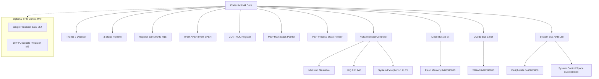
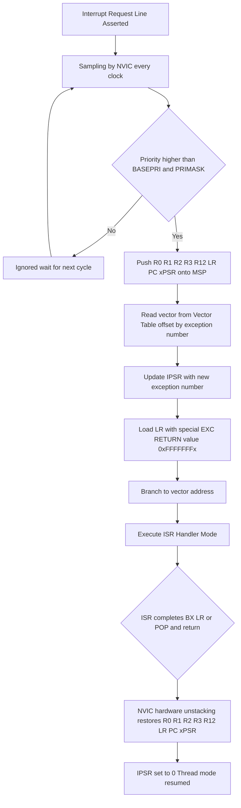
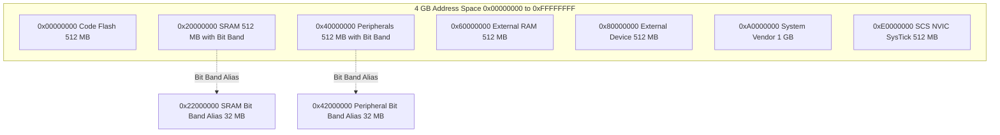

# Introduction to ARM Cortex-M Architecture:-

<!-- SECTION_1_START -->
# Introduction to ARM Cortex-M Architecture

## 1.1 Formal Academic Definition

> [!IMPORTANT]
> **KTU Syllabus Definition (PBCST504 - Module 1)**
> The **ARM Cortex-M** is a family of **32-bit RISC (Reduced Instruction Set Computer) processor cores** designed by **ARM Holdings** specifically for microcontroller and embedded system applications. It implements the **ARMv6-M** (Cortex-M0/M0+), **ARMv7-M** (Cortex-M3/M4/M7), or **ARMv8-M** (Cortex-M23/M33) architecture profiles, featuring a **Thumb-2 instruction set**, **Harvard bus architecture**, **hardware nested vectored interrupt controller (NVIC)**, deterministic interrupt latency, and a unified programmer's model optimized for low-power, real-time embedded systems.

The Cortex-M series is a **synthesis of the classic ARM architecture** with microarchitectural enhancements specifically tailored for deterministic, interrupt-driven embedded workloads. Unlike application processors (Cortex-A), Cortex-M cores **lack an operating system in the traditional sense** and are typically deployed in **bare-metal** or **RTOS (Real-Time Operating System)** environments.

### 1.2 The ARM Holdings Philosophy

**ARM** stands for **Advanced RISC Machines**. ARM Holdings does **not manufacture chips**; it designs and licenses **IP cores** to semiconductor vendors like STMicroelectronics, NXP, Texas Instruments, Microchip, and Nordic Semiconductor. The vendor integrates the core with peripherals, memory, and I/O to produce a complete **System-on-Chip (SoC)**.

| Layer | Owner | Example |
| :--- | :--- | :--- |
| **Architecture** | ARM Holdings | ARMv7-M |
| **Processor Core** | ARM Holdings | Cortex-M4 |
| **Microcontroller (SoC)** | Silicon Vendor | STM32F407VG |
| **Application Board** | OEM / Developer | Discovery Board |

> [!NOTE]
> **Key Insight for KTU Exam**: When asked *"Who manufactures ARM processors?"*, the answer is **"No one"** — ARM designs cores; third parties (ST, NXP, etc.) manufacture the chips.

### 1.3 Conceptual Analogy: The Cortex-M as a Highly Disciplined Office Worker

> [!TIP]
> **Intuitive Analogy — "The Specialist Clerk"**
> Imagine a government office where one highly trained clerk handles all incoming requests:
> - **The clerk's desk** = **CPU Registers** (small, fast, holds the current task).
> - **The filing cabinet** = **SRAM (Main Memory)** (larger, slower, where all records reside).
> - **The inbox tray** = **NVIC (Interrupt Controller)** (sorts urgent requests by priority).
> - **The rule book** = **Instruction Set Architecture (ISA)** (the clerk knows only a fixed set of operations).
> - **The clerk's daily schedule** = **Program Counter (PC)** (always knows what to do next).
>
> When a citizen files an urgent complaint (interrupt), the clerk **pauses** the current work, **saves the file on the desk** (stacking register values onto the stack), handles the urgent matter, **returns the file**, and **resumes** the previous task — all within a deterministic number of clock cycles.

### 1.4 Why Cortex-M? The Embedded Design Trilemma

Embedded designers face three competing constraints: **performance**, **power consumption**, and **cost/die area**. The Cortex-M family is engineered to balance all three:

$$
\text{Performance} \uparrow \quad \Leftrightarrow \quad \text{Power} \downarrow \quad \Leftrightarrow \quad \text{Cost} \downarrow
$$

> [!IMPORTANT]
> **Core Design Principles of Cortex-M**
> 1. **Deterministic Interrupt Response** — Interrupt latency is bounded and predictable (typically **12 clock cycles** on Cortex-M3/M4).
> 2. **Code Density via Thumb-2 ISA** — Combines 16-bit and 32-bit instructions to maximize code density in flash memory.
> 3. **Hardware Stack Model** — Dedicated stack pointer registers (MSP/PSP) eliminate the need for software stack management.
> 4. **Bit-Banding** — Atomic single-bit access to bit-band alias regions in SRAM and peripherals.
> 5. **Integrated NVIC** — Up to **240 physical interrupts** with **256 priority levels** (Cortex-M3/M4).

### 1.5 The Cortex-M Family Tree

> [!VISUALIZATION CONTROL]
> **Concept:** Cortex-M Family Performance & Feature Comparison
> **GeoGebra / Desmos Input Equations:**
> * X-axis (x): `Pipeline Stages` (2 to 6)
> * Y-axis (y): `DMIPS` (0 to 225)
> * Reference Points:
>   * `M0+  = (2, 0.95)`
>   * `M3   = (3, 125)`
>   * `M4   = (3, 225)`
>   * `M7   = (6, 503)`
> **Visual Description:** Plot the points on a 2D plane to observe how performance and pipeline depth scale across the family. The M7 sits at the top-right (highest performance, deepest pipeline), while the M0+ sits at the bottom-left (lowest power, simplest pipeline).

| Core | Architecture | Pipeline | DMIPS | FPU | DSP | Typical Use Case |
| :--- | :--- | :--- | :--- | :--- | :--- | :--- |
| **Cortex-M0** | ARMv6-M | 3-stage | 0.9 | No | No | Simple 8/16-bit replacement |
| **Cortex-M0+** | ARMv6-M | 2-stage | 1.0 | No | No | Ultra-low-power IoT |
| **Cortex-M3** | ARMv7-M | 3-stage | 125 | No | No | General-purpose MCU |
| **Cortex-M4** | ARMv7-M | 3-stage | 225 | Optional | Yes | Motor control, signal processing |
| **Cortex-M7** | ARMv7-M | 6-stage | 503 | Yes (DP-FPU) | Yes | High-performance DSP |
| **Cortex-M33** | ARMv8-M | 3-stage | 163 | Optional | Yes | Security (TrustZone-M) |

> [!NOTE]
> **DMIPS** = **Dhrystone Million Instructions Per Second** — a synthetic benchmark measuring integer CPU performance. **1 DMIPS/MHz** is the baseline for a VAX 11/780.

---

<!-- SECTION_1_END -->

<!-- SECTION_2_START -->
# 2. Deep Theoretical Analysis: The Cortex-M Microarchitecture

## 2.1 RISC Foundation

The Cortex-M inherits the **RISC (Reduced Instruction Set Computer)** philosophy from classic ARM:

- **Fixed-length instructions** (Thumb-2 mixes 16-bit and 32-bit, but each is decoded in a single cycle in most cases).
- **Load/Store architecture** — Data processing operates **only on registers**; memory is accessed exclusively via `LDR`/`STR` instructions.
- **Large uniform register file** — 16 general-purpose 32-bit registers (`R0`–`R12`) plus special registers (`R13=SP`, `R14=LR`, `R15=PC`).
- **Hardware control of subroutine linkage** via the **Link Register (LR)** and **Stack Pointer (SP)**.

> [!IMPORTANT]
> **KTU High-Yield Point**: A common KTU question asks *"Why is Cortex-M considered a Load/Store architecture?"* The answer: **Arithmetic and logical operations (ADD, SUB, AND, ORR) can only operate on register operands. To modify a memory location, you must first LDR (load) it into a register, perform the operation, and STR (store) it back.**

## 2.2 Von Neumann vs. Harvard: The Cortex-M Choice

| Feature | Von Neumann | Harvard | Cortex-M (Modified Harvard) |
| :--- | :--- | :--- | :--- |
| **Program & Data Buses** | Shared (one bus) | Separate | Separate, but unified address space |
| **Fetch + Data Access** | Cannot occur simultaneously | Simultaneous | Simultaneous |
| **Determinism** | Lower | Higher | Higher (used in MCUs) |
| **Example** | x86, 8051 (early) | DSPs | **Cortex-M3/M4/M7** |

> [!NOTE]
> The Cortex-M uses a **Modified Harvard architecture** internally (separate I-Code and D-Code buses for fetch and data access) but exposes a **single, unified 32-bit linear address space** ($0x00000000$ to $0xFFFFFFFF$) to the programmer.

## 2.3 The Programmer's Model: Register Set

The Cortex-M has **18 core registers** visible to the programmer. This is one of the **most heavily tested topics in KTU exams**.

### 2.3.1 General-Purpose Registers (R0 – R12)

- **R0 – R12**: Thirteen **32-bit general-purpose registers**.
- They have **no dedicated special function** in the architecture (unlike x86's `EAX`, `EBX`, etc.).
- All can be used for any data-processing operand.
- The compiler's **register allocator** freely assigns variables to these.

### 2.3.2 Special-Purpose Registers

| Register | Name | Role | Access |
| :--- | :--- | :--- | :--- |
| `R13` | **SP** (Stack Pointer) | Points to top of active stack | Special: `MSP` or `PSP` |
| `R14` | **LR** (Link Register) | Holds return address after `BL`/`BLX` | Read/Write |
| `R15` | **PC** (Program Counter) | Current instruction address + 4 | Read/Write (limited) |

### 2.3.3 The Two Stack Pointers

> [!IMPORTANT]
> **Cortex-M has TWO physical stack pointers**, but only ONE is active at a time:
> - **MSP (Main Stack Pointer)**: Used in **Handler mode** (interrupt/exception service routines) and optionally in Thread mode. This is the **default SP** after reset.
> - **PSP (Process Stack Pointer)**: Used in **Thread mode** only. Typically allocated to **RTOS application tasks** for stack isolation.
>
> The active SP is selected by bit[1] of the **CONTROL register**.

### 2.3.4 The Special Program Status Registers (xPSR)

The **Program Status Register (PSR)** is logically split into three sub-registers, accessible separately or combined:

$$
\text{xPSR} = \begin{cases} \text{APSR} & \text{(Application PSR)} \\ \text{IPSR} & \text{(Interrupt PSR)} \\ \text{EPSR} & \text{(Execution PSR)} \end{cases}
$$

| Sub-register | Purpose | Key Bits |
| :--- | :--- | :--- |
| **APSR** | Application flags from ALU | `N` (Negative), `Z` (Zero), `C` (Carry), `V` (Overflow), `Q` (Sticky saturate) |
| **IPSR** | Current exception number | `ISR_NUMBER` (0 = Thread mode, 1 = Reset, …, 16+ = IRQs) |
| **EPSR** | Execution state | `T` (Thumb bit — **always 1** on Cortex-M), `ICI/IT` (interrupt-continue / if-then flags) |

### 2.3.5 The CONTROL Register

| Bit | Name | Function |
| :--- | :--- | :--- |
| `[0]` | `nPRIV` | **0** = Privileged, **1** = Unprivileged (Thread mode only) |
| `[1]` | `SPSEL` | **0** = Use MSP, **1** = Use PSP (Thread mode only) |
| `[2]` | `FPCA` | (Cortex-M4F/M7) **1** = FP context active |

> [!WARNING]
> In **Handler mode**, `CONTROL[1]` is **always 0** (MSP is forced). The `FPCA` bit is only meaningful on cores with an FPU.

## 2.4 Operating Modes

The Cortex-M supports **two operating modes** and **two privilege levels**:

| Mode | Privilege | Stack | Typical Use |
| :--- | :--- | :--- | :--- |
| **Thread mode** | Privileged or Unprivileged | MSP or PSP | Normal application code, RTOS tasks |
| **Handler mode** | Always Privileged | Always MSP | Exception/Interrupt service routines |

> [!IMPORTANT]
> **After Reset**: The core enters **Thread mode**, **Privileged**, using **MSP**. Bits `EPSR.T = 1`, `CONTROL = 0`.

## 2.5 KTU Formula Sheet / Cheat Sheet

| Formula / Concept | Expression / Value | Unit / Note |
| :--- | :--- | :--- |
| **Addressable Memory Space** | $2^{32}$ bytes | $4 \text{ GB}$ total |
| **Register Width** | 32 bits | $R0 \ldots R15$, $xPSR$, $CONTROL$, `PRIMASK`, `BASEPRI`, `FAULTMASK` |
| **NVIC Interrupts (Cortex-M3/M4)** | $1 \text{ (NMI)} + 240 \text{ (IRQ)} + 16 \text{ (System)}$ | Max 256 total |
| **Priority Bits (M3/M4)** | 3 to 8 bits | $8$ bits = $256$ levels; configurable by vendor |
| **Interrupt Latency (M3/M4)** | $12 \text{ cycles}$ | For 0-wait-state memory |
| **Bit-band Region (SRAM)** | $0x20000000 \rightarrow 0x200FFFFF$ | Alias at $0x22000000 \rightarrow 0x23FFFFFF$ |
| **Bit-band Region (Peripherals)** | $0x40000000 \rightarrow 0x400FFFFF$ | Alias at $0x42000000 \rightarrow 0x43FFFFFF$ |
| **Bit-Band Alias Formula** | $\text{Alias} = 0x02000000 + (0xF0000000 \cdot n) + (4 \cdot b)$ | $n$ = bit-band byte offset, $b$ = bit number |
| **Endianness (configurable)** | Little-Endian (default) or Big-Endian | `AIRCR.ENDIANNESS` bit |
| **Reset Value of MSP** | Loaded from Vector Table $[0]$ | `R0` from $[1]$ (small init value) |
| **Reset Vector (PC init)** | Loaded from Vector Table $[1]$ | `EPSR` from $[3]` = `0x01000000` |
| **Stack Alignment on Exception** | 8-byte | Hardware enforces; misaligned SP triggers `UsageFault` |

## 2.6 Real-World Engineering Utility

> [!TIP]
> **Where Cortex-M is used in production (2024):**
> - **STM32** series (STMicroelectronics): Industrial control, drones, robotics.
> - **nRF52/53** (Nordic): Bluetooth Low Energy wearables, IoT sensors.
> - **SAMD21** (Microchip): Arduino MKR boards, maker projects.
> - **Kinetis / i.MX RT** (NXP): Automotive ECUs, BLDC motor control.
> - **RP2040** (Raspberry Pi): Dual-core Cortex-M0+ in Pico board.
>
> The deterministic interrupt response makes Cortex-M the **de-facto standard** for **safety-critical systems** certified to **ISO 26262** (automotive) and **IEC 61508** (industrial).

---

<!-- SECTION_2_END -->

<!-- SECTION_3_START -->
# 3. Step-by-Step Derivations, Code, and Symbolic Implementation

## 3.1 Derivation: The Vector Table and Reset Behavior

The Cortex-M boots using a **vector table** located at address `0x00000000` (aliased to flash). The first 16 entries (system exceptions) are architecturally fixed; vendor IRQs follow.

> [!NOTE]
> **Position `[0]`** → Initial **Main Stack Pointer** (MSP)
> **Position `[1]`** → Reset **Program Counter** (entry point of `Reset_Handler`)

### Worked Example 1: Reading the Reset Vector Table

Suppose the vendor's startup file declares the vector table as a 32-bit integer array:

```c
/* startup_stm32f407.c - simplified excerpt */
typedef void (*pFunc)(void);

extern uint32_t _estack;   /* Defined in linker script: top of SRAM */

__attribute__((section(".isr_vector")))
const pFunc g_pfnVectors[] = {
    (pFunc)(&_estack),     /* [0] Initial MSP   */
    Reset_Handler,         /* [1] Reset PC      */
    NMI_Handler,           /* [2] NMI           */
    HardFault_Handler,     /* [3] HardFault     */
    MemManage_Handler,     /* [4] MemManage     */
    BusFault_Handler,      /* [5] BusFault      */
    UsageFault_Handler,    /* [6] UsageFault    */
    0, 0, 0, 0,            /* [7]-[10] Reserved */
    SVC_Handler,           /* [11] SVCall       */
    DebugMon_Handler,      /* [12] DebugMon     */
    0,                     /* [13] Reserved     */
    PendSV_Handler,        /* [14] PendSV       */
    SysTick_Handler        /* [15] SysTick      */
};
```

**Step-by-step evaluation after hardware reset:**

1. The core reads `0x00000000` and loads it into `MSP`.
2. The core reads `0x00000004` and loads it into `PC`.
3. The core sets `EPSR.T = 1` (Thumb state) and `CONTROL = 0x00000000`.
4. Execution begins at the address stored in `PC[1]`.

$$
\begin{aligned}
\text{MSP}_{\text{init}} &= \text{Memory}[0x00000000] \\
\text{PC}_{\text{init}} &= \text{Memory}[0x00000004] \\
\text{APSR} &= 0x00000000 \\
\text{IPSR} &= 0x00000000 \quad \text{(Thread mode)} \\
\text{PRIMASK} &= 0 \quad \text{(interrupts enabled)} \\
\text{FAULTMASK} &= 0 \\
\text{BASEPRI} &= 0
\end{aligned}
$$

## 3.2 Derivation: Bit-Band Alias Address

The **bit-band feature** allows atomic read-modify-write of a single bit using a normal load/store, eliminating the need for read-modify-write sequences in software (which are not atomic in multi-task systems).

> [!IMPORTANT]
> **Bit-band formula for the SRAM alias region** ($0x20000000$ – $0x200FFFFF$):
> $$\text{Alias\_Word\_Address} = 0x22000000 + ((\text{Byte\_Offset}) \times 32) + (\text{Bit\_Number} \times 4)$$

### Worked Example 2: Compute the Bit-Band Alias

**Problem:** Set bit 7 of the byte at SRAM address `0x20000001` to 1 using bit-banding.

**Step 1 — Compute Byte Offset:**

$$
\text{Byte\_Offset} = 0x20000001 - 0x20000000 = 0x1
$$

**Step 2 — Apply the Formula:**

$$
\begin{aligned}
\text{Alias\_Address} &= 0x22000000 + (0x1 \times 32) + (7 \times 4) \\
&= 0x22000000 + 0x20 + 0x1C \\
&= 0x2200003C
\end{aligned}
$$

**Step 3 — Code Implementation in C:**

```c
#define BITBAND_SRAM(addr, bit) \
    (*((volatile uint32_t *) (0x22000000 + (((uint32_t)(addr) - 0x20000000) * 32) + ((bit) * 4))))

#define SRAM_BYTE (*((volatile uint8_t *) 0x20000001))

/* Set bit 7 of the byte at 0x20000001 atomically */
BITBAND_SRAM(0x20000001, 7) = 1;

/* Read bit 7 */
uint8_t bit_val = BITBAND_SRAM(0x20000001, 7);
```

> [!NOTE]
> The peripheral bit-band alias region ($0x40000000$ – $0x400FFFFF$) uses base `0x42000000` instead of `0x22000000`.

## 3.3 Derivation: Interrupt Priority Encoding

The Cortex-M3/M4 implements **priority levels** as the **upper N bits** of an 8-bit priority register, where N is configurable by the silicon vendor (3 to 8 bits).

### Worked Example 3: Decoding the Priority Value

**Problem:** A vendor uses 4 priority bits (`PRIGROUP = 0b011`, so 4 bits of priority in upper nibble). Determine the priority levels of two IRQs with priority registers `0x40` and `0x80`.

**Step 1 — Extract the Priority Field:**

$$
\begin{aligned}
\text{PRIORITY}_{\text{IRQ1}} &= 0x40 \gg 4 = 4 \quad (\text{decimal}) \\
\text{PRIORITY}_{\text{IRQ2}} &= 0x80 \gg 4 = 8 \quad (\text{decimal})
\end{aligned}
$$

**Step 2 — Interpret:**

- **Lower number = Higher priority** in Cortex-M (counter-intuitive but standard).
- Therefore, `IRQ2` (priority 8) has **lower priority** than `IRQ1` (priority 4).
- If both fire simultaneously, `IRQ1` is serviced first.

**Step 3 — Implemented in CMSIS:**

```c
/* CMSIS-style priority setter (STM32F4) */
NVIC_SetPriority(USART1_IRQn, 5);   /* priority = 5 (low) */
NVIC_SetPriority(DMA1_Stream0_IRQn, 2);  /* priority = 2 (high) */
NVIC_EnableIRQ(USART1_IRQn);
NVIC_EnableIRQ(DMA1_Stream0_IRQn);
```

> [!WARNING]
> **Common KTU Mistake**: Writing `NVIC_SetPriority(IRQn, 0x80)` and expecting priority 128. The **CMSIS function expects the RAW 8-bit register value**, not the shifted value. The function internally performs `priority << (8 - implemented_bits)`. Always check the vendor macro `__NVIC_PRIO_BITS`.

## 3.4 Full Assembly Demonstration: A "Bare-Metal" Cortex-M Program

```asm
    .syntax unified
    .cpu cortex-m4
    .thumb

    .global _start

    .section .text
_start:
    /* Load R0 with the literal value 0x12345678 */
    LDR  R0, =0x12345678      @ PC-relative literal load
    /* Move R0 -> R1 */
    MOV  R1, R0
    /* Add R1 and R0, store result in R2 */
    ADD  R2, R1, R0
    /* Compare R2 to 0 */
    CMP  R2, #0
    /* Branch to 'equal' if Z flag set (it won't be here) */
    BEQ  equal_label
    /* Otherwise store R2 to a memory-mapped GPIO */
    LDR  R3, =0x40020014      @ GPIOD->BSRR on STM32F4
    STR  R2, [R3]
    B    end_prog

equal_label:
    MOV  R2, #0

end_prog:
    B    end_prog              @ Infinite loop
```

**Line-by-line explanation (valuation-style):**

| Line | Operation | Effect | Flags Affected |
| :--- | :--- | :--- | :--- |
| `LDR R0, =0x12345678` | PC-relative literal load | `R0 = 0x12345678` | None |
| `MOV R1, R0` | Register move (data-processing) | `R1 = R0` | Sets `N` flag (MSB=0, so `N=0` if `0x12345678`, here `N=0`, `Z=0`) |
| `ADD R2, R1, R0` | Add registers | `R2 = R1 + R0` | Updates `N`, `Z`, `C`, `V` |
| `CMP R2, #0` | Compare with immediate | `R2 - 0`, result discarded | Sets `Z=1` if equal, `N=0` if `R2 > 0` |
| `BEQ equal_label` | Branch if Equal (Z=1) | If Z=1, PC = label | None |
| `LDR R3, =0x40020014` | Literal load | `R3 = 0x40020014` | None |
| `STR R2, [R3]` | Store to memory | `Memory[0x40020014] = R2` | None |
| `B end_prog` | Unconditional branch | `PC = end_prog` | None |

## 3.5 Memory Map Construction (Cortex-M3/M4)

The 4-GB linear address space is **divided into vendor-defined regions**. The architecturally defined regions are:

| Start Address | End Address | Size | Region |
| :--- | :--- | :--- | :--- |
| `0x00000000` | `0x1FFFFFFF` | 512 MB | **Code** (Flash, ROM) |
| `0x20000000` | `0x3FFFFFFF` | 512 MB | **SRAM** |
| `0x40000000` | `0x5FFFFFFF` | 512 MB | **Peripherals** |
| `0x60000000` | `0x7FFFFFFF` | 512 MB | **External RAM** |
| `0x80000000` | `0x9FFFFFFF` | 512 MB | **External Device** |
| `0xA0000000` | `0xDFFFFFFF` | 1 GB | **System / Vendor** |
| `0xE0000000` | `0xFFFFFFFF` | 512 MB | **System Control Space** (NVIC, SysTick, etc.) |

> [!IMPORTANT]
> Bit-banding is **only** supported in the first 1 MB of SRAM (`0x20000000` – `0x200FFFFF`) and the first 1 MB of Peripherals (`0x40000000` – `0x400FFFFF`). The rest of the regions are not bit-band capable.

## 3.6 Algorithm: Stack Frame on Exception Entry

When an exception fires, the Cortex-M hardware **automatically** stacks the following registers:

```text
        Higher Address  (Old MSP before exception)
            [ prev xPSR  ]  <- new SP after stacking
            [    PC      ]
            [    LR      ]
            [    R12     ]
            [    R3      ]
            [    R2      ]
            [    R1      ]
            [    R0      ]  <- new SP points here
        Lower Address
```

**Computational cost**: 8 words × 32 bits = 32 bytes, written to stack. With 1-cycle write to 0-wait-state memory, the entire stacking takes **8 cycles** for write + **4 cycles** for bus protocol overhead = **12 cycles total interrupt latency** on Cortex-M3/M4.

---

<!-- SECTION_3_END -->

<!-- SECTION_4_START -->
# 4. Structural Diagrams & Schematics

## 4.1 Mermaid Block Diagram: The Cortex-M3/M4 Internal Architecture



> [!NOTE]
> **Mermaid Safety Note**: All node IDs use **alphanumeric prefixes** (`A`, `B`, `ICode_Bus`, `FPU_Optional`) to avoid reserved-keyword conflicts. All labels with spaces are double-quoted.

## 4.2 Mermaid Flowchart: Exception Entry Sequence



## 4.3 Mermaid Diagram: Memory Map Visualization



## 4.4 Architecture Comparison Table (RISC vs CISC vs Cortex-M)

| Feature | RISC (Cortex-M) | CISC (x86) | DSP (Cortex-M4 DSP extensions) |
| :--- | :--- | :--- | :--- |
| **Instruction Length** | 16/32-bit (Thumb-2) | Variable 1–15 bytes | 16/32-bit |
| **Memory Access** | Load/Store only | Memory-to-Memory allowed | Load/Store + SIMD MAC |
| **Register File** | 16 × 32-bit | 16 × 64-bit (GPRs) | 16 × 32-bit + MAC unit |
| **Determinism** | High | Low (caches, pipelines) | High |
| **Power** | Low | High | Low |
| **Compiler Friendliness** | Excellent | Moderate | Excellent |

---

<!-- SECTION_4_END -->

<!-- SECTION_5_START -->
# 5. KTU 2024 Scheme Examination Question Bank & Topic Recap

## 5.1 Part A Questions (3 Marks Each)

### Question 1: Define ARM Cortex-M and list its key features. `[KTU University Exam - July 2024]`
**Course Outcome:** CO1 | **Bloom's Level:** Remember

> [!IMPORTANT]
> **Model Answer (3 Marks):**
>
> The **ARM Cortex-M** is a family of **32-bit RISC processor cores** designed by ARM Holdings for **microcontroller and embedded system** applications. **[1 Mark]**
>
> **Key features:**
> 1. **Thumb-2 instruction set** offering an optimal mix of 16-bit and 32-bit instructions for high code density. **[1 Mark]**
> 2. **Integrated NVIC (Nested Vectored Interrupt Controller)** providing deterministic interrupt latency (typically 12 clock cycles). **[0.5 Mark]**
> 3. **Hardware stack model** with dual stack pointers (MSP and PSP). **[0.5 Mark]**
>
> *(Total: 3 Marks)*

### Question 2: Differentiate between MSP and PSP in Cortex-M. `[KTU University Exam - Dec 2023]`
**Course Outcome:** CO1 | **Bloom's Level:** Understand

> [!IMPORTANT]
> **Model Answer (3 Marks):**
>
> | Parameter | **MSP (Main Stack Pointer)** | **PSP (Process Stack Pointer)** |
> | :--- | :--- | :--- |
> | **Used in** | Handler mode (ISR); Thread mode by default | Thread mode only (when selected) |
> | **Default after reset** | Yes | No (must be explicitly enabled) |
> | **Switch via** | Cannot be switched (always used in Handler) | `CONTROL[1] = 1` in Thread mode |
> | **Typical use** | Kernel / OS kernel stack, ISRs | Application task stacks in RTOS |
> | **Privilege** | Always privileged | Can be privileged or unprivileged |
>
> **[1 Mark per row of distinction, totaling 3 Marks]**

---

## 5.2 Part B Questions (14 Marks Each, Internal Choice)

### Question A (14 Marks): ARM Cortex-M Architecture Deep Dive `[KTU University Exam - July 2024]`
**Course Outcome:** CO1, CO2 | **Bloom's Level:** Understand → Apply

#### Part (a) — 7 Marks: Explain the programmer's model of ARM Cortex-M3 with a neat register diagram. List all 18 core registers.

> [!IMPORTANT]
> **Model Answer (7 Marks):**
>
> The **programmer's model** of ARM Cortex-M3 defines the registers visible to the software. There are **18 core registers**:
>
> 1. **Thirteen General-Purpose Registers (R0 – R12)** **[1 Mark]**
>    - 32-bit registers, freely usable for any data-processing operation.
>    - The compiler's register allocator maps C variables onto these.
>
> 2. **Stack Pointer (R13 / SP)** **[1 Mark]**
>    - Two physical stack pointers exist: **MSP** and **PSP**.
>    - Only one is active at a time, selected by `CONTROL[1]`.
>
> 3. **Link Register (R14 / LR)** **[1 Mark]**
>    - Stores the return address when a `BL` (Branch with Link) instruction is executed.
>    - Also used to store `EXC_RETURN` value on exception entry.
>
> 4. **Program Counter (R15 / PC)** **[1 Mark]**
>    - Always reads as `current_instruction_address + 4`.
>    - Writing to PC causes a branch.
>
> 5. **Program Status Registers (xPSR)** **[1.5 Marks]**
>    - Composite of **APSR** (flags: N, Z, C, V, Q), **IPSR** (exception number), and **EPSR** (Thumb bit, IT/ICI state).
>
> 6. **Special Mask Registers** (PRIMASK, FAULTMASK, BASEPRI) **[1 Mark]**
>    - Used to selectively enable/disable interrupts and exceptions.
>
> 7. **CONTROL Register** **[0.5 Mark]**
>    - Controls privilege level, stack pointer selection, and FPU context (M4F/M7).
>
> *Register Diagram (drawn on answer sheet):*
>
> | R0 | R1 | R2 | R3 | R4 | R5 | R6 | R7 | R8 | R9 | R10 | R11 | R12 |
> | :---: | :---: | :---: | :---: | :---: | :---: | :---: | :---: | :---: | :---: | :---: | :---: | :---: |
> | SP (MSP/PSP) | LR | PC | APSR | IPSR | EPSR | PRIMASK | FAULTMASK | BASEPRI | CONTROL |
>
> *(Total: 7 Marks)*

#### Part (b) — 7 Marks: With neat diagrams, explain the bit-banding feature of Cortex-M3. Compute the bit-band alias address for setting bit 5 of the byte at address `0x40020010`.

> [!IMPORTANT]
> **Model Answer (7 Marks):**
>
> **Bit-Banding Concept** **[2 Marks]**
>
> Bit-banding is a feature of the Cortex-M3/M4 that maps each bit in a special "bit-band region" to a full 32-bit word in a "bit-band alias region". Writing 1 to the alias word sets the bit atomically; writing 0 clears it. This eliminates race conditions in multi-threaded code and makes single-bit access more efficient.
>
> - **Bit-band region (Peripherals):** `0x40000000` – `0x400FFFFF` (1 MB)
> - **Bit-band alias region:** `0x42000000` – `0x43FFFFFF` (32 MB)
>
> **Bit-Band Alias Formula (Peripheral Region)** **[2 Marks]**
>
> $$\text{Alias} = 0x42000000 + ((\text{Address} - 0x40000000) \times 32) + (\text{Bit} \times 4)$$
>
> **Numerical Computation** **[2.5 Marks]**
>
> Given: Address = `0x40020010`, Bit = 5
>
> Step 1 — Compute the byte offset within the bit-band region:
>
> $$\text{Offset} = 0x40020010 - 0x40000000 = 0x00020010$$
>
> Step 2 — Apply the formula:
>
> $$\begin{aligned}
> \text{Alias} &= 0x42000000 + (0x00020010 \times 32) + (5 \times 4) \\
> &= 0x42000000 + 0x000400200 + 0x14 \\
> &= 0x42400214
> \end{aligned}$$
>
> **Code Snippet (0.5 Mark):**
>
> ```c
> #define BITBAND_PERI(addr, bit) \
>     (*((volatile uint32_t *) (0x42000000 + (((uint32_t)(addr) - 0x40000000) * 32) + ((bit) * 4))))
> BITBAND_PERI(0x40020010, 5) = 1;  /* Set bit 5 atomically */
> ```
>
> *Diagram (drawn on answer sheet):*
>
> ```
> Bit-Band Region (1 MB)            Bit-Band Alias (32 MB)
> 0x40000000  byte[0] bit[0..7]  →  0x42000000  word for bit[0]
>                                     0x42000004  word for bit[1]
>                                     ...
> 0x40020010  byte[..] bit[5]   →  0x42400214  word for bit[5]  ← target
> ```
>
> *(Total: 7 Marks)*

---

### Question B (14 Marks): Alternative Choice — Interrupt & Vector Table `[KTU University Exam - Dec 2023]`
**Course Outcome:** CO2 | **Bloom's Level:** Apply → Analyze

#### Part (a) — 7 Marks: Explain the vector table layout of Cortex-M3. What is stored at offsets 0x00, 0x04, 0x08, 0x0C? What happens immediately after a hardware reset?

> [!IMPORTANT]
> **Model Answer (7 Marks):**
>
> The **vector table** is an array of 32-bit words stored starting at `0x00000000` (in flash). The first 16 entries are **architecturally defined system exceptions**; the rest are **vendor-defined IRQs**.
>
> **First 16 Vector Entries** **[3 Marks]**
>
> | Offset | Entry | Description |
> | :--- | :--- | :--- |
> | `0x00` | Initial **MSP** value | Top of stack loaded into MSP |
> | `0x04` | **Reset_Handler** address | First PC value (entry point) |
> | `0x08` | **NMI_Handler** address | Non-Maskable Interrupt |
> | `0x0C` | **HardFault_Handler** address | All unhandled faults escalate here |
> | `0x10` | **MemManage_Handler** | MPU faults |
> | `0x14` | **BusFault_Handler** | Bus errors during fetch/data access |
> | `0x18` | **UsageFault_Handler** | Undefined instruction, divide by zero, etc. |
> | `0x1C` – `0x28` | Reserved (must be 0) | — |
> | `0x2C` | **SVCall_Handler** | SVC instruction (used by RTOS) |
> | `0x30` | **DebugMon_Handler** | Debug monitor |
> | `0x34` | Reserved | — |
> | `0x38` | **PendSV_Handler** | Used for RTOS context switching |
> | `0x3C` | **SysTick_Handler** | System tick timer |
>
> **Reset Sequence** **[4 Marks]**
>
> 1. **Hardware resets the core**, sets clocks to default state.
> 2. Core **reads `0x00000000`** and writes the value into **MSP** → sets the initial stack pointer. **[1 Mark]**
> 3. Core **reads `0x00000004`** and writes the value into **PC** → jumps to `Reset_Handler`. **[1 Mark]**
> 4. Core sets `LR = 0xFFFFFFFF`, `EPSR.T = 1` (Thumb state). **[0.5 Mark]**
> 5. Core sets `IPSR = 0` (Thread mode), `CONTROL = 0` (privileged, MSP). **[0.5 Mark]**
> 6. `Reset_Handler` typically:
>    - Copies `.data` from flash to SRAM.
>    - Zero-fills `.bss`.
>    - Calls `SystemInit()` (clock configuration).
>    - Calls `main()`. **[1 Mark]**
>
> *(Total: 7 Marks)*

#### Part (b) — 7 Marks: A vendor implements 4 priority bits. If `NVIC_IPR0` contains the value `0x30` and `NVIC_IPR3` contains `0x90`, determine the effective priority of the corresponding IRQs. Which IRQ has higher priority? Justify with calculations.

> [!IMPORTANT]
> **Model Answer (7 Marks):**
>
> **Setup** **[1 Mark]**
>
> With **4 priority bits** implemented, the priority value is stored in the **upper nibble** of the 8-bit IPR register; the lower 4 bits are reserved (read as zero).
>
> **Extraction** **[3 Marks]**
>
> For `NVIC_IPR0 = 0x30`:
>
> $$\text{Priority}_0 = 0x30 \gg 4 = 0x3 = 3_{10}$$
>
> For `NVIC_IPR3 = 0x90`:
>
> $$\text{Priority}_3 = 0x90 \gg 4 = 0x9 = 9_{10}$$
>
> **Comparison** **[2 Marks]**
>
> In Cortex-M, **lower numerical value = higher priority**. Therefore:
>
> $$\text{Priority}_0 = 3 \quad < \quad \text{Priority}_3 = 9$$
>
> $\Rightarrow$ The IRQ associated with `NVIC_IPR0` has **higher priority**. If both fire simultaneously, the IRQ for `IPR0` will be serviced first.
>
> **CMSIS Mapping Note** **[1 Mark]**
>
> The CMSIS function `NVIC_SetPriority(IRQn, n)` accepts the **raw 8-bit value** to write, but interprets `n` as the logical priority level (0 – 255). The function internally performs:
>
> ```c
> NVIC->IPR[IRQn] = n << (8 - __NVIC_PRIO_BITS);
> ```
>
> So `NVIC_SetPriority(IRQ, 3)` writes `0x30` to the register, and `NVIC_SetPriority(IRQ, 9)` writes `0x90`.
>
> *(Total: 7 Marks)*

---

## 5.3 KTU Examiner's Valuation Warning

> [!WARNING]
> **Common Mistakes — Where Students Lose Marks**
>
> 1. **Confusing "Higher" Priority with "Larger Number"**: The Cortex-M convention is **lower number = higher priority**. Writing the opposite costs full marks in Part (a) of priority questions.
> 2. **Forgetting to Show the Vector Table Layout**: In reset-sequence questions, **always draw the table** with offsets, not just prose. Examiners award 2–3 marks specifically for the diagram.
> 3. **Misapplying the Bit-Band Formula**: Students frequently use `0x22000000` (SRAM alias base) when the question is about **peripheral** bit-banding (which uses `0x42000000`). **Read the address range carefully.**
> 4. **Writing `LR = 0` on Reset**: The correct value is **`LR = 0xFFFFFFFF`**. This is an architectural constant indicating "no return address" — distinguishes from a normal function return.
> 5. **Forgetting the `EPSR.T = 1` Setting**: After reset, the Thumb bit is forced to 1. Failing to mention this in a reset-sequence answer costs 0.5–1 mark.
> 6. **Confusing `CONTROL[0]` (nPRIV) with `CONTROL[1]` (SPSEL)**: Know exactly what each bit does. The standard "SPSEL" question is **always** bit 1.

---

## 5.4 Topic Recap & Important Things to Remember

> [!NOTE]
> **🚀 Rapid Revision Checklist for KTU Exam Day**
>
> **Core Architecture**
> - Cortex-M is a **32-bit RISC** core designed for **MCUs and embedded** use.
> - Uses **Modified Harvard** architecture (separate I-Code and D-Code buses, unified address space).
> - **ARM Holdings designs cores; vendors (ST, NXP, TI) manufacture chips.**
>
> **Programmer's Model — 18 Registers**
> - **R0 – R12**: 13 general-purpose 32-bit registers.
> - **R13 = SP**: Two physical pointers — **MSP** (default) and **PSP** (RTOS task stacks).
> - **R14 = LR**: Holds return address / `EXC_RETURN` value (`0xFFFFFFFx`).
> - **R15 = PC**: Reads as `address + 4`.
> - **xPSR** = `APSR` (flags) + `IPSR` (exception no.) + `EPSR` (Thumb bit, IT/ICI).
> - **PRIMASK, FAULTMASK, BASEPRI**: Exception masking.
> - **CONTROL**: `bit[0]` = privilege, `bit[1]` = SP select, `bit[2]` = FPU context.
>
> **Operating Modes**
> - **Thread mode** (privileged/unprivileged, MSP/PSP) → normal code.
> - **Handler mode** (always privileged, always MSP) → ISRs.
>
> **Memory Map (4 GB)**
> - `0x00000000` — Code (Flash)
> - `0x20000000` — SRAM (bit-band capable)
> - `0x40000000` — Peripherals (bit-band capable)
> - `0xE0000000` — System Control Space (NVIC, SysTick)
>
> **Bit-Banding**
> - SRAM: `0x20000000` ↔ alias `0x22000000`
> - Peripheral: `0x40000000` ↔ alias `0x42000000`
> - Formula: `Alias = BASE + (Offset × 32) + (Bit × 4)`
>
> **Reset Behavior**
> - `MSP ← [0x00]`, `PC ← [0x04]`, `LR = 0xFFFFFFFF`
> - `EPSR.T = 1`, `CONTROL = 0`, `IPSR = 0`
>
> **NVIC & Interrupts**
> - Up to **240 IRQs + 16 system exceptions**.
> - **Lower priority number = higher urgency** (counter-intuitive!).
> - Interrupt latency: **12 cycles** (Cortex-M3/M4, 0-wait-state memory).
> - On entry, hardware stacks: **xPSR, PC, LR, R12, R3, R2, R1, R0** (8 words).
>
> **Thumb-2 ISA**
> - Mixes 16-bit and 32-bit instructions.
> - Improves code density vs. classic 32-bit ARM.
> - `EPSR.T = 1` always; cannot switch to ARM state.
>
> **Endianness**
> - **Little-Endian** by default (selectable via `AIRCR.ENDIANNESS`).
>
> **Family Comparison**
> - **M0/M0+**: Lowest power, M0+ has 2-stage pipeline, no DSP/FPU.
> - **M3**: General purpose, 3-stage, no FPU.
> - **M4**: Adds **DSP instructions** and **optional single-precision FPU**.
> - **M7**: 6-stage pipeline, **DP-FPU**, highest DMIPS in the family.
> - **M33/M23**: ARMv8-M, adds **TrustZone-M** security.

<!-- SECTION_5_END -->
