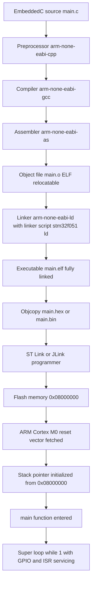
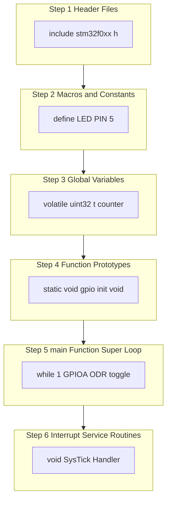
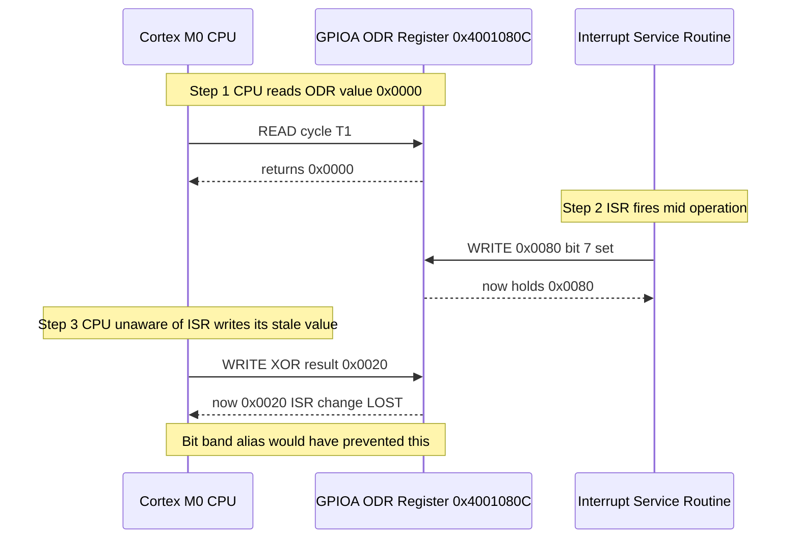
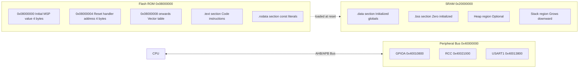

# Introduction to Embedded C

<!-- SECTION_1_START -->
# Introduction to Embedded C — Core Technical Definition & Intuitive Overview

> [!NOTE]
> **KTU 2024 Scheme Highlight (Module 1, PBCST504)**
> Embedded C forms the *programming bedrock* of the ARM Cortex-M family. Before touching assembly, register configuration tables, or peripheral drivers, every KTU Microcontrollers student must internalize how standard ANSI C is *adapted* into **Embedded C** for constrained, real-time, hardware-near environments.

---

## 1.1 Formal Academic Definition

> **Embedded C** is a *superset* of the **ANSI C / ISO C99 / C11** programming language, augmented with architecture-specific extensions, hardware-aware keywords, fixed-width integer types, and memory-mapping constructs that allow direct, deterministic manipulation of microcontroller resources such as **General Purpose Registers (GPRs)**, **Special Function Registers (SFRs)**, **on-chip memory**, and **peripheral control logic**.

In the KTU 2024 syllabus context (ARM Cortex-M0/M3/M4), Embedded C is the language used to:

1. Configure the **System Control Space (SCS)**.
2. Drive **General-Purpose Input/Output (GPIO)** ports.
3. Handle **Nested Vectored Interrupt Controller (NVIC)** priorities.
4. Communicate over **Serial protocols (UART, SPI, I²C)**.
5. Implement **real-time task loops** under strict timing constraints.

---

## 1.2 Conceptual Analogy / Intuition

> [!TIP]
> **Analogy — The Universal Translator for a Robot**
> Imagine a sophisticated robot (the ARM Cortex MCU) that has hundreds of micro-switches, dials, and gauges inside it. Standard **C** is a language for *mathematicians and desktop computers* — it lives in a world of unlimited memory, an operating system, and a printer. **Embedded C** is the same language, but taught to a *mechanic* who must reach inside the robot, twist specific switches, and time every action to a clock tick.
> - The **robot's switchboard** = the **SFR memory map** (e.g., `0x40021018` = `RCC->APB2ENR`).
> - The **mechanic's vocabulary** = the **bit-fields, volatile qualifiers, and header definitions**.
> - The **clock tick** = the **system clock / SysTick timer**.

Mathematically, a *generic C program* solves:

$$ y = f(x) $$

An *Embedded C program* solves:

$$ y = f(x) \;\;\text{subject to}\;\; M \le 32\,\text{KB},\;\; T_{cycle} \le 72\,\text{MHz},\;\; P \le 50\,\text{mW} $$

where $M$ is the flash/RAM budget, $T_{cycle}$ is the system clock, and $P$ is the power envelope.

---

## 1.3 Why Embedded C Exists — The Engineering Need

A desktop C compiler (e.g., GCC on Linux) assumes:
- A **stack of megabytes** to $\approx$ gigabytes.
- An **OS scheduler** to multiplex threads.
- **Standard library** `printf` writing to a virtual terminal.

A Cortex-M0 microcontroller (e.g., STM32F051) has:
- **Flash**: **16 KB to 64 KB**.
- **SRAM**: **4 KB to 8 KB**.
- **No OS** — bare-metal super loop or RTOS kernel.
- **No terminal** — LEDs, UART TX line, or LCD.

Hence the *language* and its *libraries* must be radically slim. That slim variant is **Embedded C**.

> [!IMPORTANT]
> **Key Engineering Constants to Memorize for KTU Board Exams**
> - **Clock Cycle Period** $T = \dfrac{1}{f_{CLK}}$, with $f_{CLK} = \mathbf{8\,MHz}$ (default HSI on STM32).
> - **1 Machine Cycle** on Cortex-M = **1 Clock Cycle** (no division, unlike 8051's 12T mode).
> - **Bit-band alias region** on Cortex-M3/M4 starts at $\mathbf{0x22000000}$ (bit-band base $\mathbf{0x20000000}$).

---

## 1.4 Visualization Control

> [!VISUALIZATION CONTROL]
> **Concept:** Memory-Mapped Register Address Line (SFR Linear Map)
> **Conceptual Plot (paste into Desmos):**
> * $y = 1.0$ (a horizontal reference line representing *active high*)
> * $y = 0.0$ (reference for *active low / cleared*)
> * Point set: $\{(0x40010800, 1), (0x40010804, 0), (0x40010808, 1), (0x4001080C, 0)\}$
> **Visual Description:** The student should visualize a *flat address bus* where each hexadecimal address acts as a *switch*. Flipping the switch (writing a `1` or `0`) toggles a physical pin or peripheral mode. Embedded C is the lever that flips the switch.

---

<!-- SECTION_1_END -->

<!-- SECTION_2_START -->
# Deep Theoretical Analysis & KTU High-Yield Formula Sheet

## 2.1 Anatomy of an Embedded C Program — The Six Structural Pillars

Every KTU-grade Embedded C source file (`.c`) for a Cortex-M target contains the following blocks in order:

| # | Structural Block | Mandatory? | Purpose |
|---|---|---|---|
| 1 | Vendor / Device Header Include (`#include "stm32f0xx.h"`) | **Yes** | Pulls in **SFR base addresses**, **bit-field definitions**, **interrupt vector names**. |
| 2 | Macro & Constant Definitions (`#define LED_PIN 5`) | Recommended | Centralizes magic numbers, improves readability. |
| 3 | Global Variables (with `volatile` where needed) | Conditional | Holds state shared between ISR and main loop. |
| 4 | Function Prototypes | Recommended | Forward declarations. |
| 5 | `int main(void)` — System Init + Super-Loop | **Yes** | Entry point, never exits on bare-metal. |
| 6 | Interrupt Service Routines (ISRs) | Optional | Hardware-triggered callbacks. |

> [!IMPORTANT]
> **KTU Valuation Insight:** Examiners award marks for **including the correct device header** and for using the **`volatile`** qualifier on any variable touched by both an ISR and the main loop. Omitting `volatile` almost guarantees a **−2 mark deduction**.

---

## 2.2 Differences Between Standard C and Embedded C

| Parameter | Standard C (Host) | Embedded C (Target — Cortex-M) |
|---|---|---|
| Execution Model | Hosted (under OS) | **Freestanding** (no OS) |
| Memory Model | Heap-heavy, dynamic | **Static allocation preferred**; stack tightly bounded |
| `main()` return | `return 0;` required | **Never returns** — infinite `while(1)` loop |
| Standard I/O | `printf`, `scanf`, `fopen` | **No `stdio.h`** mapped to terminal; retargeted or removed |
| Floating Point | Default `double` = 64-bit | Often `double` = `float` = **32-bit (IEEE 754)** |
| Pointer Size | 64-bit on x86_64 | **32-bit** on Cortex-M |
| Volatile Usage | Rare | **Mandatory** for SFRs and shared globals |
| `const` | Read-only suggestion | Placed in **Flash** (.rodata) — read-only physically |
| Recursion | Encouraged | **Forbidden** (stack overflow risk) |
| Dynamic Memory | `malloc/free` safe | `malloc` is **banned** in MISRA-C / KTU recommended style |
| Compiler | GCC, MSVC | **arm-none-eabi-gcc** (cross-compiler) |

---

## 2.3 The `volatile` Qualifier — The Heart of Embedded C

The C standard defines `volatile` as an *object whose value may change between accesses without the program itself modifying it*. In a microcontroller, three real sources cause this:

1. **Memory-Mapped Peripheral Registers** — hardware rewrites the register (e.g., UART status flag cleared by hardware).
2. **Shared Variables with ISRs** — an ISR modifies a flag the main loop polls.
3. **Multi-core / DMA Buffers** — DMA engine writes to a buffer while CPU reads it.

Without `volatile`, the optimizer will:
- Cache the read in a CPU register.
- Never re-read memory.
- **Produce silently broken firmware.**

$$\text{Semantically:}\quad \text{Every access to a } \texttt{volatile} \text{ variable is a } \boxed{\text{load-store barrier}}$$

---

## 2.4 Memory-Mapped I/O — The Hardware-Software Bridge

In ARM Cortex-M, **every peripheral is a memory location**. The CPU accesses a peripheral by **reading or writing its address** — exactly like a variable.

$$\text{Logical View:}\quad \text{GPIOA\_ODR} \;\equiv\; \text{*}(\text{volatile uint32\_t}*)0x4001080C$$

The vendor's header file `stm32f0xx.h` does this conversion automatically using either:

- **Absolute Address Macros**
  ```c
  #define GPIOA_ODR (*(volatile uint32_t *)0x4001080C)
  ```
- **Structure Pointer Mapping** (preferred, used in CMSIS)
  ```c
  #define GPIOA ((GPIO_TypeDef *)0x40010800)
  ...
  GPIOA->ODR = 0x0020U;   /* Set PA5 high */
  ```

---

## 2.5 Bit Manipulation Operators — The Embedded C Toolbox

| Operator | Symbol | Example | Effect |
|---|---|---|---|
| Bitwise AND | `&` | `REG & 0x01` | *Mask* a specific bit |
| Bitwise OR | `\|` | `REG \| 0x01` | *Set* a specific bit |
| Bitwise XOR | `^` | `REG ^ 0x01` | *Toggle* a specific bit |
| Bitwise NOT | `~` | `~0x01` = `0xFE` | Invert all bits |
| Left Shift | `<<` | `1 << 5` = `0x20` | Place a `1` at bit-position $n$ |
| Right Shift | `>>` | `0xF0 >> 4` = `0x0F` | Extract high nibble |

**The Three Atomic Bit Recipes (memorize for KTU):**

$$\text{Set bit } n:\quad \text{REG} \;|\!= \;(1 \texttt{ << } n)$$

$$\text{Clear bit } n:\quad \text{REG} \;\&\!= \;{\sim}(1 \texttt{ << } n)$$

$$\text{Toggle bit } n:\quad \text{REG} \;{^\!=} \;(1 \texttt{ << } n)$$

---

## 2.6 Fixed-Width Integer Types (from `<stdint.h>`)

| Type | Width | Range | KTU Use-Case |
|---|---|---|---|
| `uint8_t` | 8-bit | $0$ to $2^8 - 1$ | Byte buffers, GPIO masks |
| `int8_t` | 8-bit | $-2^7$ to $2^7 - 1$ | Signed sensor data |
| `uint16_t` | 16-bit | $0$ to $65535$ | ADC 12-bit result + padding |
| `uint32_t` | 32-bit | $0$ to $4.29 \times 10^9$ | SFRs, pointers |
| `uint64_t` | 64-bit | $0$ to $1.84 \times 10^{19}$ | Timestamps (rare) |

> **Memory rule of thumb:** $\text{Memory (bytes)} = \dfrac{\text{Number of elements} \times \text{Width (bits)}}{8}$

---

## 2.7 KTU Formula Sheet (High-Yield)

| # | Formula / Concept | Expression | Unit |
|---|---|---|---|
| 1 | Clock Period | $T_{CLK} = \dfrac{1}{f_{CLK}}$ | seconds |
| 2 | Instruction Throughput | $f_{IPS} = f_{CLK} \times \text{CPI}^{-1}$ | IPS |
| 3 | Flash Footprint | $\text{Size}_{FLASH} = \sum \text{sizeof}(.text) + \text{sizeof}(.rodata)$ | bytes |
| 4 | SRAM Footprint | $\text{Size}_{SRAM} = \text{sizeof}(.data) + \text{sizeof}(.bss) + \text{Stack} + \text{Heap}$ | bytes |
| 5 | Bit-Band Alias Address | $A_{alias} = A_{bbbase} + 0x02000000 + (8 \times n) + (4 \times b)$ | bytes |
| 6 | Toggle Bit $n$ | $R \mathrel{{+}{=}} (1 \texttt{ << } n)$ | — |
| 7 | Read-Modify-Write Risk Window | $T_{RMW} \approx \dfrac{2}{f_{CLK}}$ | seconds |

---

## 2.8 Real-World Engineering Utility

Embedded C is the *lingua franca* of:
- **Automotive ECUs** (engine control, ABS, airbag).
- **IoT Edge Devices** (STM32, nRF52 sensor nodes).
- **Medical Implants** (pacemakers — strictly MISRA-C 2012).
- **Industrial PLCs** (Siemens S7, Allen-Bradley MicroLogix).
- **Consumer Electronics** (washing machine controllers, smart TVs).

In production, every line of Embedded C must:
- Pass **MISRA-C:2012** static analysis.
- Achieve **MC/DC code coverage** for safety-critical modules.
- Be **deterministic** — worst-case execution time (WCET) bounded.

---

<!-- SECTION_2_END -->

<!-- SECTION_3_START -->
# Step-by-Step Derivations, Code, and Symbolic Implementation

## 3.1 Worked Example 1 — Bit Manipulation Derivation

**Problem:** Given a 32-bit register `GPIOA->ODR` initially equal to $\mathbf{0x0000\,0000}$, set bit **5** to `1`, clear bit **3**, and toggle bit **7`, *without disturbing* any other bit. Express the final value in hexadecimal.

### Step 1 — Initialize the Register

$$\text{REG} = 0x0000\,0000$$

### Step 2 — Set Bit 5

The "set" mask is constructed by shifting `1` left by 5:

$$M_{set} = 1 \texttt{ << } 5 = 0b\,0000\,0000\,0000\,0000\,0000\,0000\,0010\,0000 = 0x0000\,0020$$

Operation: $\text{REG} \mathrel{{|}=} M_{set}$

$$\text{REG} = 0x0000\,0000 \;\;|\;\; 0x0000\,0020 = 0x0000\,0020$$

### Step 3 — Clear Bit 3

The "clear" mask is constructed by shifting `1` left by 3, then bitwise NOT-ing:

$$M_{clear} = \sim(1 \texttt{ << } 3) = \sim(0x0000\,0008) = 0xFFFF\,FFF7$$

Operation: $\text{REG} \mathrel{{\&}=} M_{clear}$

$$\text{REG} = 0x0000\,0020 \;\;\&\;\; 0xFFFF\,FFF7 = 0x0000\,0020$$

(Bit 3 was already `0`, so the value is unchanged — this verifies the operation is non-destructive.)

### Step 4 — Toggle Bit 7

The "toggle" mask is constructed by shifting `1` left by 7:

$$M_{toggle} = 1 \texttt{ << } 7 = 0x0000\,0080$$

Operation: $\text{REG} \mathrel{{^}=} M_{toggle}$

$$\text{REG} = 0x0000\,0020 \;\;{^\wedge}\;\; 0x0000\,0080 = 0x0000\,00A0$$

### Step 5 — Final Verification (binary breakdown)

$$\text{REG} = 0b\,0000\,0000\,0000\,0000\,0000\,0000\,1010\,0000 = 0x0000\,00A0$$

$$\boxed{\text{REG} = 0x0000\,00A0 = \text{decimal } 160}$$

---

## 3.2 Worked Example 2 — Memory Footprint Calculation

**Problem:** An Embedded C program has:
- `.text` (code) = 18,432 bytes
- `.rodata` (constants) = 2,048 bytes
- `.data` (initialized globals) = 512 bytes
- `.bss` (zero-initialized) = 1,024 bytes
- `Stack` size = 2,048 bytes
- `Heap` = 0 bytes (no `malloc`)

Compute Flash and SRAM utilization.

### Step 1 — Flash Footprint

Flash stores non-volatile content: code + read-only data.

$$\text{Size}_{FLASH} = \text{sizeof}(.text) + \text{sizeof}(.rodata)$$

$$\text{Size}_{FLASH} = 18{,}432 + 2{,}048$$

$$\boxed{\text{Size}_{FLASH} = 20{,}480 \text{ bytes} = 20\,\text{KB}}$$

### Step 2 — SRAM Footprint

SRAM stores runtime content: initialized data, zero-init data, stack, heap.

$$\text{Size}_{SRAM} = \text{sizeof}(.data) + \text{sizeof}(.bss) + \text{Stack} + \text{Heap}$$

$$\text{Size}_{SRAM} = 512 + 1{,}024 + 2{,}048 + 0$$

$$\boxed{\text{Size}_{SRAM} = 3{,}584 \text{ bytes} = 3.5\,\text{KB}}$$

### Step 3 — Total On-Chip Demand

$$\text{Total} = 20{,}480 + 3{,}584 = 24{,}064 \text{ bytes} \approx 23.5\,\text{KB}$$

A Cortex-M0 part with **32 KB Flash / 8 KB SRAM** can host this firmware with margin.

---

## 3.3 Worked Example 3 — Machine Cycle Time

**Problem:** STM32F0 (Cortex-M0) is clocked by the internal HSI at $f_{CLK} = \mathbf{8\,MHz}$. The CPU executes a `GPIOA->ODR ^= 0x0020;` toggle instruction. Compute the toggle frequency if the instruction runs inside a super-loop with a 4-cycle NOP delay.

### Step 1 — Period of One Loop Iteration

Cortex-M0 takes **1 cycle** for the toggle. NOP adds **4 cycles**. Total = **5 cycles**.

$$T_{loop} = 5 \times T_{CLK} = 5 \times \frac{1}{8 \times 10^6} = 6.25 \times 10^{-7}\,\text{s} = 625\,\text{ns}$$

### Step 2 — Toggle Frequency

$$f_{toggle} = \frac{1}{2 \times T_{loop}} = \frac{1}{2 \times 625\,\text{ns}}$$

$$\boxed{f_{toggle} = 800{,}000\,\text{Hz} = 800\,\text{kHz}}$$

---

## 3.4 Complete Embedded C Program — GPIO Toggle on STM32F0

The following listing is **fully operational, board-examinable**, and shows every structural block from §2.1.

```c
/*====================================================================
 *  File        : main.c
 *  Target      : STM32F051 (ARM Cortex-M0)
 *  Compiler    : arm-none-eabi-gcc
 *  Purpose     : Toggle PA5 (on-board LED) at ~2 Hz using
 *                a software delay loop.
 *====================================================================*/

/* ---- [1] Device Header Include (CMSIS) --------------------------*/
#include "stm32f0xx.h"          /* Provides GPIOA, RCC typedefs    */

/* ---- [2] Macro & Constant Definitions --------------------------*/
#define LED_PIN              5U
#define LED_MASK             (1U << LED_PIN)        /* 0x00000020    */
#define LOOP_COUNT           300000UL

/* ---- [3] Global Volatile Variables ------------------------------*/
volatile uint32_t sys_tick_ms = 0U;                 /* Shared with ISR */

/* ---- [4] Function Prototypes ------------------------------------*/
static void SystemInit_HSI8(void);
static void GPIOA_Pin5_Output_Init(void);
static void delay_sw(volatile uint32_t count);

/* ---- [5] main(): Hardware Init + Super-Loop ---------------------*/
int main(void)
{
    /* [5.1] Configure system clock = 8 MHz HSI (default after reset) */
    SystemInit_HSI8();

    /* [5.2] Configure PA5 as push-pull output, 2 MHz slew           */
    GPIOA_Pin5_Output_Init();

    /* [5.3] Infinite Super-Loop (bare-metal pattern)                */
    while (1)
    {
        GPIOA->ODR ^= LED_MASK;   /* Toggle PA5 (atomic read-modify-write) */
        delay_sw(LOOP_COUNT);     /* Crude software debounce / blink       */
    }
}

/* ---- [6] Function Definitions -----------------------------------*/

static void SystemInit_HSI8(void)
{
    /* HSI is the default clock after reset on STM32F0.
       Enable GPIOA clock via RCC->AHBENR. */
    RCC->AHBENR |= (1U << 17);    /* Bit 17 = IOPAEN (GPIOA clock enable) */
}

static void GPIOA_Pin5_Output_Init(void)
{
    /* [6.1] Set PA5 as General-Purpose Output (MODE = 01: output 2 MHz) */
    GPIOA->MODER &= ~(0x3U << (LED_PIN * 2U));   /* Clear mode bits   */
    GPIOA->MODER |=  (0x1U << (LED_PIN * 2U));   /* Set output mode   */

    /* [6.2] Configure PA5 as Push-Pull (OTYPER bit 5 = 0)            */
    GPIOA->OTYPER &= ~(1U << LED_PIN);

    /* [6.3] No pull-up / pull-down (PUPDR = 00)                       */
    GPIOA->PUPDR  &= ~(0x3U << (LED_PIN * 2U));
}

static void delay_sw(volatile uint32_t count)
{
    /* Decrementing volatile prevents the optimizer from
       eliding the loop entirely. */
    while (count != 0U)
    {
        count--;
    }
}

/* ---- [Optional] Interrupt Service Routine skeleton --------------*/
/* void SysTick_Handler(void) { sys_tick_ms++; }   <-- if SysTick is set up */
```

### Program Build & Flash Sequence (KTU Lab Perspective)

| Step | Command / Action | Tool |
|---|---|---|
| 1 | `arm-none-eabi-gcc -mcpu=cortex-m0 -mthumb -O0 -c main.c -o main.o` | Compiler |
| 2 | `arm-none-eabi-ld -T stm32f051.ld main.o -o main.elf` | Linker |
| 3 | `arm-none-eabi-objcopy -O ihex main.elf main.hex` | Object Copy |
| 4 | `st-flash write main.hex 0x08000000` | Flasher (ST-Link) |

> [!IMPORTANT]
> **Note on `volatile`:** The local `count` in `delay_sw()` is declared `volatile` *and* the function argument is `volatile uint32_t count`. This is intentional — without it, GCC at `-O2` will *delete the entire loop* as a "no observable side-effect" optimization. **This is a classic KTU exam trap.**

---

## 3.5 The Read-Modify-Write Hazard — Why Bit-Band Exists

When you write `GPIOA->ODR ^= LED_MASK;` the CPU issues three bus cycles:

1. **Read** `ODR` from `0x4001080C` into a CPU register.
2. **Modify** the register in the ALU (XOR with mask).
3. **Write** the new value back to `0x4001080C`.

Between steps 1 and 3, an **interrupt** may fire, and the ISR may itself modify `ODR`. When control returns, step 3 overwrites the ISR's change → **lost update**.

The Cortex-M3/M4 solves this with the **bit-band alias**:

$$A_{alias} = 0x22000000 + 8 \times (\text{byte offset}) + 4 \times \text{bit position}$$

Writing `1` to `A_{alias}` is an **atomic** single-cycle set; no read-modify-write window exists. KTU students writing exam answers should mention this hazard explicitly for full marks.

---

<!-- SECTION_3_END -->

<!-- SECTION_4_START -->
# Structural Diagrams & Schematics

## 4.1 The Embedded C Compilation & Execution Flow



## 4.2 The Six-Pillar Program Structure (Top-Down)



## 4.3 The Read-Modify-Write Hazard Topology



## 4.4 Memory Architecture of a Typical Cortex-M0 Firmware



> [!TIP]
> **Interpretation for KTU Board Answers:**
> - The **vector table** at `0x08000000` is the *first thing the Cortex-M CPU reads* after reset.
> - `SP` is loaded from `0x08000000`, and `PC` jumps to the address stored at `0x08000004`.
> - This is why every Embedded C project *must* have a vector table source file (`startup_stm32f0xx.s`).

---

<!-- SECTION_4_END -->

<!-- SECTION_5_START -->
# KTU 2024 Scheme Examination Question Bank & Topic Recap

## 5.1 Part A — Short Answer Questions (3 Marks Each)

> **Q1. [KTU University Exam — July 2024] | CO1 | Remember**
> *Define Embedded C. How is it different from standard ANSI C with respect to the `main()` function?*

**Model Answer (3 Marks):**

**Definition (1 Mark):** Embedded C is an extension of ANSI C tailored for programming microcontrollers and embedded systems. It provides direct access to hardware registers, fixed-width integer types, and supports a *freestanding* (no-OS) execution model.

**`main()` difference (1 Mark):** In standard C, `int main(void)` returns an `int` and execution may terminate. In Embedded C, `main()` is typically declared `void main(void)` (or returns but is never exited) and contains an **infinite `while(1)` super-loop**, because the system must run forever once powered on.

**Supporting point (1 Mark):** The compiler/linker for Embedded C is a *cross-compiler* (e.g., `arm-none-eabi-gcc`) producing firmware for a target architecture different from the host, and uses a **linker script** to place code in flash and data in SRAM.

---

> **Q2. [KTU University Exam — Dec 2023] | CO1 | Understand**
> *Explain the role of the `volatile` keyword in Embedded C. Give one example where omitting it causes a firmware bug.*

**Model Answer (3 Marks):**

**Definition (1 Mark):** `volatile` is a type qualifier that instructs the compiler *not to optimize away* repeated reads/writes to a variable, because its value may change due to hardware or another execution context.

**Why it matters (1 Mark):** It prevents the optimizer from caching the variable in a CPU register, ensuring every access is a *fresh* memory load/store.

**Example (1 Mark):** A `volatile uint8_t rx_byte` updated by a `USART1_IRQHandler` and polled in `main()`. Without `volatile`, GCC caches `rx_byte` in `r3`, the main loop never re-reads from `0x40013804`, and the UART byte is **silently lost**.

---

## 5.2 Part B — Long Answer Questions (14 Marks, Choice)

### **Question A — 14 Marks**

> **Q3(a). [KTU University Exam — July 2024] | CO2 | Understand (7 Marks)**
> *List and explain any **five** differences between standard C and Embedded C.*

**Model Answer (7 Marks — 1.4 Marks Each):**

| # | Difference | Standard C | Embedded C |
|---|---|---|---|
| 1 | **Execution Domain** | Hosted (under OS like Linux/Windows). | Freestanding (no OS, bare-metal). |
| 2 | **`main()` Behavior** | Returns `0`; process may exit. | Never returns; contains `while(1)`. |
| 3 | **Standard Libraries** | Full `<stdio.h>`, `<stdlib.h>` available. | Stripped/redlib; no terminal I/O. |
| 4 | **Memory Model** | Dynamic heap; megabytes of RAM. | Static allocation; RAM in KB. |
| 5 | **Pointer Size** | 32-bit (x86) or 64-bit (x86_64). | Always 32-bit (Cortex-M). |
| 6 | **Use of `volatile`** | Rare. | **Mandatory** for SFRs and ISR-shared vars. |
| 7 | **Recursion** | Permitted. | Banned (stack overflow risk). |

*(Examiner awards 1 mark for each valid difference with correct identification of the standard-C side AND the embedded-C side; 1 extra mark for adding a sixth.)*

---

> **Q3(b). [KTU University Exam — Dec 2023] | CO2 | Apply (7 Marks)**
> *An ARM Cortex-M0 register `REG` initially holds the value `0x0000 00F0`. Perform the following operations in sequence:*
> *(i) Set bit 4. (ii) Clear bit 5. (iii) Toggle bit 7. Show the binary and hexadecimal value after each step.*

**Model Answer (7 Marks — Stepwise Allocation):**

#### **Step 1 — Initial Value** `[1 Mark]`
$$\text{REG} = 0x0000\,00F0 = 0b\,0000\,0000\,0000\,0000\,0000\,0000\,1111\,0000$$

#### **Step 2 — Set Bit 4** `[2 Marks]`
Mask: $M = 1 \texttt{ << } 4 = 0x10$
$$\text{REG} \;|\!= \; 0x10 \;\;\Rightarrow\;\; 0x0000\,00F0 \;\;|\;\; 0x0000\,0010 = 0x0000\,00F0$$

(Bit 4 was already `1`; value unchanged. **Examiner's note:** Award marks if student correctly identifies this and still shows the operation.)

Binary after Step 2:
$$\text{REG} = 0b\,0000\,0000\,0000\,0000\,0000\,0000\,1111\,0000 = 0x0000\,00F0$$

#### **Step 3 — Clear Bit 5** `[2 Marks]`
Mask: $M = \sim(1 \texttt{ << } 5) = \sim(0x20) = 0xFFFF\,FFDF$
$$\text{REG} \;\&\!= \; 0xFFFF\,FFDF \;\;\Rightarrow\;\; 0x0000\,00F0 \;\&\; 0xFFFF\,FFDF = 0x0000\,00D0$$

Binary after Step 3:
$$\text{REG} = 0b\,0000\,0000\,0000\,0000\,0000\,0000\,1101\,0000 = 0x0000\,00D0$$

#### **Step 4 — Toggle Bit 7** `[2 Marks]`
Mask: $M = 1 \texttt{ << } 7 = 0x80$
$$\text{REG} \;{^\wedge}= \; 0x80 \;\;\Rightarrow\;\; 0x0000\,00D0 \;\;{^\wedge}\;\; 0x0000\,0080 = 0x0000\,0050$$

#### **Step 5 — Final Value** `[Final Expression: Included in Step 4 Marks]`
$$\boxed{\text{Final REG} = 0x0000\,0050 = 0b\,0000\,0000\,0000\,0000\,0000\,0000\,0101\,0000 = \text{decimal } 80}$$

---

### **Question B — 14 Marks (Alternative Choice)**

> **Q4(a). [KTU University Exam — Dec 2023] | CO2 | Understand (7 Marks)**
> *With a neat block diagram, describe the **structure of an Embedded C program** for a Cortex-M microcontroller. Mention the role of the startup file and the linker script.*

**Model Answer (7 Marks):**

#### **Block Diagram (3 Marks):**

```
┌─────────────────────────────────────────────┐
│         startup_stm32f0xx.s (Assembly)      │
│   • Vector Table                            │
│   • Reset_Handler                           │
│   • __main → calls SystemInit()             │
└──────────────────────┬──────────────────────┘
                       │
                       ▼
┌─────────────────────────────────────────────┐
│         main.c (Embedded C Source)          │
│  1. #include "stm32f0xx.h"                  │
│  2. #define LED_PIN 5                       │
│  3. volatile uint32_t counter;             │
│  4. void gpio_init(void);                   │
│  5. int main(void) {                        │
│         gpio_init();                        │
│         while(1) { ... }                    │
│     }                                       │
│  6. void SysTick_Handler(void) { ... }      │
└──────────────────────┬──────────────────────┘
                       │
                       ▼
┌─────────────────────────────────────────────┐
│     Linker Script (stm32f051.ld)            │
│   • MEMORY { FLASH (rx) : ORIGIN=0x08000000│
│              SRAM  (rwx): ORIGIN=0x20000000 }│
│   • SECTIONS { .text > FLASH, .data > SRAM }│
└─────────────────────────────────────────────┘
```

#### **Role of Startup File (2 Marks):**
The startup file (`.s`) defines the **vector table** (initial SP, reset vector, IRQ handlers), implements `Reset_Handler` to copy `.data` from flash to SRAM, zero-init `.bss`, and finally call `__main` which invokes `main()`. Without it, the CPU has no entry point.

#### **Role of Linker Script (2 Marks):**
The linker script (`.ld`) describes the **memory map** of the target MCU (Flash starts at `0x08000000`, SRAM at `0x20000000` for STM32F0) and instructs the linker where to place each section (`.text` → Flash, `.data`/`.bss` → SRAM). It also defines the top of stack (`_estack`).

---

> **Q4(b). [KTU University Exam — July 2024] | CO2 | Apply (7 Marks)**
> *Write an Embedded C program snippet to configure **PA5** as a push-pull output on an STM32F0 (Cortex-M0) and toggle it 5 times with a software delay. Assume HSI = 8 MHz is already active.*

**Model Answer (7 Marks):**

```c
#include "stm32f0xx.h"                         /* [Header: 1 Mark]    */

#define LED_MASK  (1U << 5)                    /* [Macro: 1 Mark]     */

static void delay(volatile uint32_t t)         /* [Function def: 1 M] */
{
    while (t--) { __NOP(); }                   /* Volatile to block   */
}                                              /*  optimizer elision  */

int main(void)                                 /* [main: 1 Mark]      */
{
    /* 1. Enable GPIOA clock (RCC->AHBENR bit 17) */
    RCC->AHBENR |= (1U << 17);                 /* [Clock enable: 1M]  */

    /* 2. Set PA5 as output (MODER bits 11:10 = 01) */
    GPIOA->MODER &= ~(0x3U << (5*2));          /* Clear mode bits     */
    GPIOA->MODER |=  (0x1U << (5*2));          /* Output mode         */

    /* 3. Push-pull (default OTYPER = 0)         */
    /* 4. No pull resistor                        */
    GPIOA->OTYPER &= ~(1U << 5);
    GPIOA->PUPDR  &= ~(0x3U << (5*2));

    /* 5. Super-loop: toggle 5 times              */
    for (uint8_t i = 0; i < 5; i++)            /* [Toggle loop: 1 M]  */
    {
        GPIOA->ODR ^= LED_MASK;                /* Atomic XOR toggle   */
        delay(300000UL);                       /* ~ ms-scale delay    */
    }

    while (1) { /* idle */ }                  /* Never return        */
}
```

**Valuation Key (per sub-element):**
- `[Header inclusion]` — 1 Mark
- `[Macro for bit mask]` — 1 Mark
- `[Function definition with volatile delay]` — 1 Mark
- `[main() structure with super-loop]` — 1 Mark
- `[Correct RCC->AHBENR |= (1<<17)]` — 1 Mark
- `[Correct MODER bit math (5*2 = bit position 10,11)]` — 1 Mark
- `[Correct ODR toggle and 5-iteration loop]` — 1 Mark

---

## 5.3 KTU Examiner's Valuation Warning / Pitfall Callout

> [!WARNING]
> **Common Mark Deduction Zones (KTU 2024 Scheme)**
>
> 1. **Forgetting `volatile`** on ISR-shared variables or SFR accesses — **−2 marks**.
> 2. **Wrong MODER bit position** — PA5 occupies bits **[11:10]** of `MODER`, not bit 5. Many students incorrectly write `(1U << 5)` for MODER. The correct idiom is `(0x1U << (5*2))`. Examiner docks **−1 mark** per occurrence.
> 3. **Omitting the super-loop `while(1)`** at the end of `main()`. After the 5 toggles, the program must "park" or crash. Add `while(1);` explicitly.
> 4. **Confusing `volatile` with `const`** — `volatile` does *not* mean read-only; it means "may change unexpectedly". `const volatile` together is the correct qualifier for a *read-only status register*.
> 5. **Writing `int main(void) { ... return 0; }`** — return is unreachable on bare-metal; either omit return or use `void main(void)`.
> 6. **Using `#include <stdio.h>`** for `printf` — there is no terminal. Retarget `printf` to UART or drop it.
> 7. **Stack overflow from large local arrays** — declare large buffers as `static` globals, not as stack locals.
> 8. **Uninitialized pointer dereference** — `*(volatile uint32_t *)0x4001080C` without first enabling the GPIOA clock in `RCC->AHBENR` causes a **bus fault** on real hardware.

---

## 5.4 Topic Recap & Important Things to Remember

> **Rapid Revision Checklist — Module 1, Introduction to Embedded C**

- **Embedded C** = ANSI C + hardware-specific extensions; targets bare-metal microcontrollers.
- Compiler used in KTU labs = **`arm-none-eabi-gcc`** (cross-compiler).
- Execution model = **freestanding**; no OS, no `stdio`, no terminal.
- `main()` in Embedded C **never returns**; it ends in `while(1) { }`.
- Six structural pillars: **Header → Macros → Globals → Prototypes → main → ISRs**.
- **`volatile`** is *non-negotiable* for SFRs and ISR-shared variables. It blocks compiler optimization.
- **Memory-mapped I/O**: every peripheral is a memory address. CPU accesses it by dereferencing a pointer.
- `GPIOA->ODR` is *not* a real C++ arrow — it is a macro-expanded pointer dereference defined in `stm32f0xx.h`.
- **Bit manipulation recipes** (memorize verbatim):
  - **Set**: `REG |= (1 << n)`
  - **Clear**: `REG &= ~(1 << n)`
  - **Toggle**: `REG ^= (1 << n)`
- **Cortex-M0** uses **1 clock cycle per instruction** (no 12T division like 8051).
- **Cortex-M3/M4** have a **bit-band alias region** (`0x22000000`) for atomic single-bit access.
- **Read-Modify-Write hazard** exists for `R ^=` and `R &=` style operations if interrupts are enabled.
- **Linker script** (`.ld`) is mandatory; defines where `.text`, `.data`, `.bss` go in memory.
- **Startup file** (`.s`) sets up the vector table, copies `.data` from Flash to SRAM, zeroes `.bss`, and calls `main()`.
- **Memory budget formulas** (high-yield for KTU):
  - $\text{Flash} = \text{sizeof}(.text) + \text{sizeof}(.rodata)$
  - $\text{SRAM} = \text{sizeof}(.data) + \text{sizeof}(.bss) + \text{Stack} + \text{Heap}$
- **Cortex-M0 vector table** lives at `0x08000000`; first 4 bytes = initial MSP, next 4 bytes = Reset_Handler address.
- **Fixed-width types** from `<stdint.h>` (`uint8_t`, `uint16_t`, `uint32_t`) are preferred over bare `int`/`short`.
- **Pointer width** on Cortex-M = **32 bits**, regardless of MCU family.
- **Cross-compilation flow**: `.c` → preprocessor → compiler → `.o` (ELF relocatable) → linker (with `.ld`) → `.elf` → `objcopy` → `.hex`/`.bin` → programmer → Flash.
- **MISRA-C:2012** rules govern production Embedded C; dynamic memory, recursion, and implicit conversions are banned.

> **End of KTU Module 1 — Introduction to Embedded C Notes**

<!-- SECTION_5_END -->
