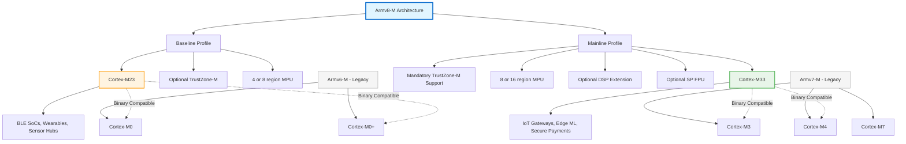
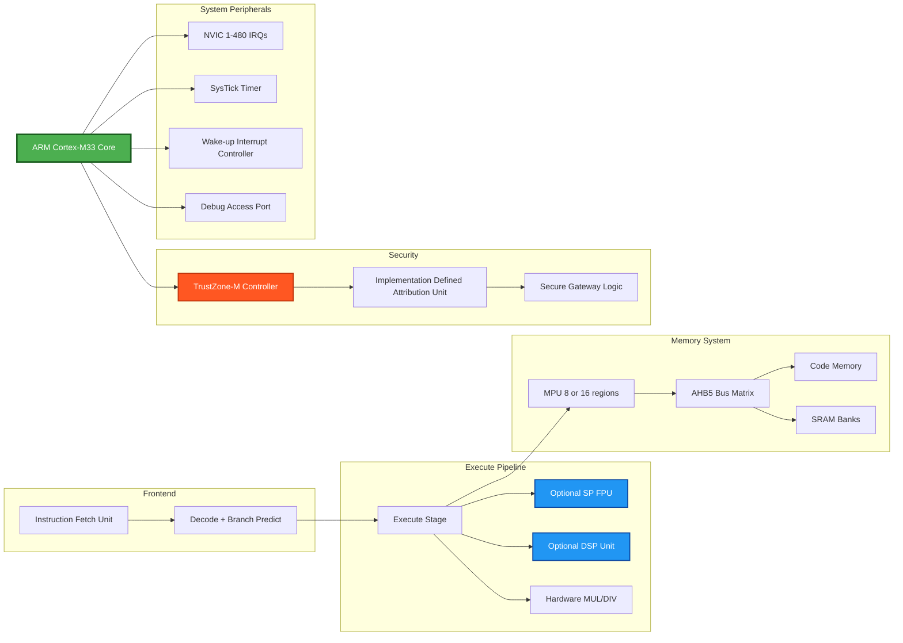
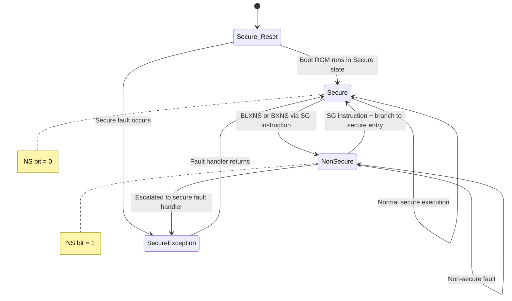
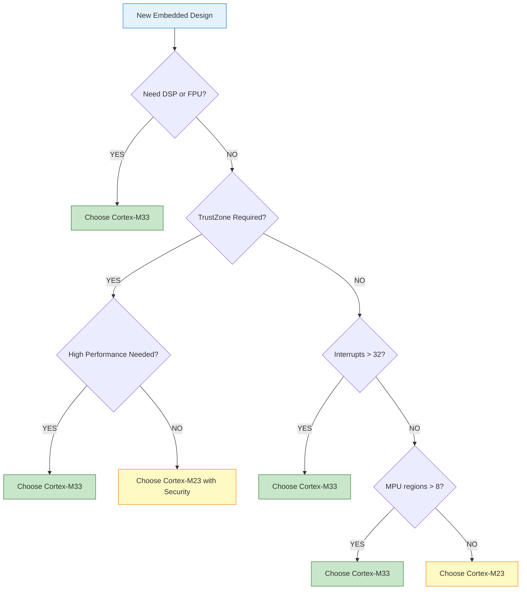

# Introduction to the Cortex-M23 and Cortex-M33 processors and the Armv8-mArchitecture

<!-- SECTION_1_START -->
# Introduction to the Cortex-M23 and Cortex-M33 Processors and the Armv8-M Architecture

## 1.1 Formal Definition & Syllabus Anchor

The **Armv8-M architecture** is the latest mainstream microcontroller architecture from Arm, designed as a successor to the Armv6-M and Armv7-M architectures. It introduces two primary processor profiles: the **Arm Cortex-M23** and the **Arm Cortex-M33**. These processors are optimized for embedded and IoT applications, providing enhanced security, deterministic performance, and energy efficiency.

> [!IMPORTANT]
> **KTU Syllabus Highlight (Module 1):** Understand the architectural evolution from Armv6-M to Armv7-M and finally to the **Armv8-M** architecture, with focus on Cortex-M23 and Cortex-M33 as the foundational processors of this generation.

| Processor | Architecture | Market Positioning |
|-----------|-------------|-------------------|
| Cortex-M23 | Armv8-M Baseline | Ultra-low power, smallest footprint |
| Cortex-M33 | Armv8-M Mainline | Mainstream performance, optional DSP/FPU |
| Cortex-M0/M0+ | Armv6-M | Legacy entry-level |
| Cortex-M3/M4/M7 | Armv7-M | Legacy mainstream/high-performance |

> [!NOTE]
> **Core Concept:** The Armv8-M architecture is a **superset** of the earlier Armv6-M and Armv7-M architectures, meaning software written for older Cortex-M processors can largely be ported forward with minimal changes.

## 1.2 Conceptual Analogy & Intuitive Overview

### The "Vehicle Class" Analogy

Imagine a family of vehicles (processors) manufactured by a company (Arm):

- **Cortex-M23** is like a **compact, fuel-efficient commuter car** — small engine, basic safety features, perfect for daily city driving (simple IoT sensors, wearable devices). It has just enough power for the job and nothing more.

- **Cortex-M33** is like a **mid-size sedan with optional turbo and premium safety package** — the same basic chassis as the compact, but with optional upgrades like a turbocharged engine (FPU/DSP), advanced airbag system (TrustZone), and better navigation (more memory, higher clock speeds).

- **Armv8-M** is the **"vehicle platform"** (like Volkswagen's MQB platform) that defines the common chassis, engine mounting points, and electrical architecture. Both the M23 and M33 are built on this same platform, which is why they share many features.

### Why Two Processors on One Architecture?

Armv8-M introduced a **two-tier system** to allow designers to scale cost vs. features:
- **Baseline subset** → Cortex-M23 (cost-optimized, minimal features)
- **Mainline subset** → Cortex-M33 (full features, performance-optimized)

> [!TIP]
> **Geometric Intuition:** If you think of the Armv8-M architecture as a circle, the Armv6-M (M0/M0+) functionality is a small inner circle, the Baseline (M23) is a larger circle, and the Mainline (M33) is the largest circle encompassing both. Each new generation **adds** features, never removes them — this is called **architectural compatibility**.

## 1.3 Key Physical and Logical Constants

> [!IMPORTANT]
> **Architectural Constants to Remember:**
> - **Cortex-M23:** Up to **2.42 CoreMark/MHz**, gate count of approximately **12k-15k** (smallest Armv8-M)
> - **Cortex-M33:** Up to **4.09 CoreMark/MHz**, supports optional **FPU** (single-precision IEEE 754) and **DSP** extensions
> - **Both processors:** Use the **Thumb-2** instruction set exclusively (no 32-bit ARM mode)
> - **Bus Interface:** **AMBA 5 AHB5** with 32-bit data path

> [!VISUALIZATION CONTROL]
> **Concept:** Architectural Tier Hierarchy in Armv8-M
> **Visualization Logic:** Imagine three concentric circles representing the instruction set compatibility — innermost is the Thumb/Thumb-2 base, middle adds baseline DSP and TrustZone-M (Cortex-M23), outermost adds full DSP, FPU, and ITM (Cortex-M33).
> **Visual Description:** Students should picture a layered "Russian doll" where each Cortex-M generation is a strict superset of the previous one's instruction set, ensuring binary portability.

<!-- SECTION_1_END -->

<!-- SECTION_2_START -->
# 2. Deep Theoretical Analysis: Armv8-M Architecture

## 2.1 The Two Architectural Profiles of Armv8-M

The Armv8-M architecture defines **two architectural profiles** that share a common programmers' model but differ in available features:

### A. Armv8-M Baseline Profile (Cortex-M23)

The Baseline profile is designed to be the **smallest, most energy-efficient** Armv8-M processor. It replaces the older Cortex-M0/M0+ in the Armv6-M lineup.

**Key Characteristics:**

- **Instruction Set:** Full **Thumb-2** support (both 16-bit and 32-bit Thumb instructions)
- **Pipeline:** **2-stage** fetch-decode pipeline (similar to Cortex-M0+)
- **Interrupt Handling:** **Non-maskable Interrupt (NMI)** + up to **32 physical interrupts** via NVIC
- **Wake-up Interrupt Controller (WIC):** For ultra-low-power sleep states
- **Memory Protection:** Optional **MPU** with **4 or 8 regions**
- **Security:** Optional **TrustZone-M** (called **Security Extension** in baseline)
- **Debug:** Basic breakpoints and watchpoints (2 data watchpoints, 4 breakpoint comparators)

### B. Armv8-M Mainline Profile (Cortex-M33)

The Mainline profile is the **full-featured** Armv8-M processor, designed to replace Cortex-M3/M4 in many applications.

**Key Characteristics:**

- **Instruction Set:** Full **Thumb-2** + optional **DSP extension** + optional **single-precision FPU**
- **Pipeline:** **3-stage** pipeline (fetch, decode, execute) with branch speculation
- **Interrupt Handling:** NMI + up to **480 external interrupts** with **configurable priority bits** (3-8 bits)
- **Memory Protection:** **Optional MPU** with **8 or 16 regions** (configurable)
- **Security:** **TrustZone-M** for hardware-enforced isolation
- **Debug:** Full **DAP**, **ETM (Embedded Trace Macrocell)** support, **ITM (Instrumentation Trace Macrocell)**
- **Co-processor Interface:** Up to **2 coprocessors** (CP0-CP15 addressing)

## 2.2 The TrustZone-M Security Extension

> [!IMPORTANT]
> **TrustZone-M** is a **hardware-level security extension** that creates two execution environments on a single processor: **Secure** and **Non-Secure** worlds.

### How TrustZone-M Works

TrustZone-M introduces a new attribute on bus transactions, called the **Non-Secure (NS) attribute**. When this bit is **0**, the processor is in the **Secure state**; when **1**, it is in the **Non-Secure state**.

```
┌─────────────────────────────────────────────────┐
│  Non-Secure World (NS = 1)                       │
│  - Application code                              │
│  - RTOS, libraries                               │
├─────────────────────────────────────────────────┤
│  Secure World (NS = 0)                           │
│  - Crypto operations                             │
│  - Secure boot, key storage                      │
│  - Trusted firmware-M (TF-M)                     │
└─────────────────────────────────────────────────┘
```

The transition between worlds is controlled by **Secure Gateway (SG)** instructions, which act as a **one-way door** from Non-Secure to Secure code.

## 2.3 Stack and Programming Model

Both Cortex-M23 and Cortex-M33 use the **same programming model** as the Armv7-M architecture:

| Register | Width | Purpose | Banking |
|----------|-------|---------|---------|
| **R0-R12** | 32-bit | General purpose | — |
| **R13 (SP)** | 32-bit | Stack Pointer | **Banked**: MSP + PSP |
| **R14 (LR)** | 32-bit | Link Register | Single |
| **R15 (PC)** | 32-bit | Program Counter | — |
| **xPSR** | 32-bit | Program Status | Single |
| **PRIMASK** | 1-bit | Interrupt mask | — |
| **CONTROL** | 1-2 bits | Mode control | — |

> [!NOTE]
> **Cortex-M33 exclusive registers:** It has **BASEPRI** and **FAULTMASK** registers (not present in M23). The M23 only has PRIMASK for interrupt masking.

## 2.4 KTU High-Yield Formula Sheet / Comparison Table

| Feature | Cortex-M0/M0+ | Cortex-M23 | Cortex-M3 | Cortex-M33 |
|---------|---------------|------------|-----------|------------|
| Architecture | Armv6-M | **Armv8-M Baseline** | Armv7-M | **Armv8-M Mainline** |
| CoreMark/MHz | 2.33 | **2.42** | 3.34 | **4.09** |
| Pipeline Stages | 2 | 2 | 3 | **3** |
| DSP Extension | No | No | No | **Optional** |
| FPU | No | No | No | **Optional SP** |
| MPU Regions | 0 | **4 or 8** | 8 | **8 or 16** |
| TrustZone | No | **Optional** | No | **Optional** |
| Interrupts (NVIC) | 1-32 | 1-32 | 1-240 | **1-480** |
| WIC | Yes | **Yes** | No | **Yes** |
| ETM Trace | No | No | Optional | **Yes** |
| Power @ 90nm | ~4 µA/MHz | **~3 µA/MHz** | ~7 µA/MHz | **~5 µA/MHz** |

## 2.5 Real-World Engineering Applications

> [!TIP]
> **Production Use Cases:**
> - **Cortex-M23:** Nordic nRF52 series (BLE SoCs), Cypress PSoC 4000S, low-power IoT nodes
> - **Cortex-M33:** NXP LPC55S69, STM32L5, Nordic nRF5340 (dual-core with M33), Renesas RA6M5
> - **TrustZone-M:** Used in **AWS IoT ExpressLink** modules, secure payment terminals, medical device firmware isolation, and automotive secure boot.

The Armv8-M architecture is the **de-facto standard for new IoT and edge AI designs** as of 2024-2025, replacing the aging Armv7-M lineup in most greenfield projects.

<!-- SECTION_2_END -->

<!-- SECTION_3_START -->
# 3. Step-by-Step Derivations, Comparisons & Implementation

## 3.1 Mathematical Derivation: CoreMark Performance Scaling

The **Dhrystone-equivalent** benchmark for embedded processors is **CoreMark/MHz**. Let us derive how architectural improvements translate to performance.

The **execution time** for a given task is:

$$T_{exec} = \frac{N_{cycles}}{f_{clock}}$$

Where $N_{cycles}$ is the number of CPU cycles required and $f_{clock}$ is the operating frequency in MHz.

**CoreMark Score** is defined as:

$$CoreMark\_Score = \frac{Iterations}{T_{exec}}$$

Normalized per MHz:

$$CoreMark/MHz = \frac{Iterations \times 10^6}{N_{cycles} \times f_{clock}}$$

### Derivation: M23 vs M33 Performance Gap

Given:
- **Cortex-M23** achieves **2.42 CoreMark/MHz**
- **Cortex-M33** achieves **4.09 CoreMark/MHz**

The performance ratio is:

$$R = \frac{CoreMark_{M33}}{CoreMark_{M23}} = \frac{4.09}{2.42}$$

Let us compute step-by-step:

$$
\begin{aligned}
R &= \frac{4.09}{2.42} \\
  &= \frac{409}{242} \\
  &= 1.6900826... \\
\end{aligned}
$$

$$\boxed{R \approx 1.69 \times \text{speedup}}$$

> [!NOTE]
> **Engineering Insight:** A Cortex-M33 running at the same clock frequency as a Cortex-M23 will execute the same workload approximately **1.69 times faster**. This is due to its deeper pipeline, branch prediction, dual-issue capability (limited), and DSP extensions.

## 3.2 Pipeline Derivation: Stages and CPI

The **Cycles Per Instruction (CPI)** for a processor with a 3-stage pipeline (M33) and no memory stalls is theoretically:

$$CPI_{ideal} = 1.0$$

But real-world CPI accounts for branches and hazards:

$$CPI_{real} = CPI_{ideal} + \text{Stall cycles} = 1.0 + (P_{branch} \times P_{miss})$$

For a typical embedded workload with branch frequency $P_{branch} = 0.20$ and a branch prediction miss penalty $P_{miss} = 0.10$:

$$
\begin{aligned}
CPI_{M33} &= 1.0 + (0.20 \times 0.10) \\
          &= 1.0 + 0.02 \\
          &= 1.02
\end{aligned}
$$

For the Cortex-M23 (2-stage, no branch speculation):

$$
\begin{aligned}
CPI_{M23} &= 1.0 + (0.20 \times 1.00) \\
          &= 1.0 + 0.20 \\
          &= 1.20
\end{aligned}
$$

This CPI difference of **18%** contributes to the overall performance gap between the two cores.

## 3.3 Memory Map Derivation

The Armv8-M architecture defines a **fixed memory map** with the following 32-bit regions:

$$
\begin{aligned}
\text{Total Address Space} &= 2^{32} \text{ bytes} \\
                           &= 4{,}294{,}967{,}296 \text{ bytes} \\
                           &= 4 \text{ GB}
\end{aligned}
$$

This 4 GB space is partitioned as follows (in hexadecimal):

| Region | Address Range | Size | Description |
|--------|--------------|------|-------------|
| Code | $0x00000000$ – $0x1FFFFFFF$ | 0.5 GB | Code + alias to Flash |
| SRAM | $0x20000000$ – $0x3FFFFFFF$ | 0.5 GB | Main RAM |
| Peripheral | $0x40000000$ – $0x5FFFFFFF$ | 0.5 GB | On-chip peripherals |
| External RAM | $0x60000000$ – $0x7FFFFFFF$ | 0.5 GB | External memory |
| External Device | $0x80000000$ – $0x9FFFFFFF$ | 0.5 GB | External devices |
| System | $0xE0000000$ – $0xFFFFFFFF$ | 0.5 GB | NVIC, SysTick, debug |
| **Secure alias** | $0x10000000$ – $0x1FFFFFFF$ | 0.5 GB | When TrustZone enabled |

## 3.4 Code Implementation: TrustZone-M Function Call (Cortex-M33)

The following Python pseudocode demonstrates the equivalent flow of a **Secure Function Call** from Non-Secure world:

```python
# ============================================================
# TrustZone-M Secure Function Call - Conceptual Implementation
# Target: Cortex-M33 with Armv8-M Mainline + Security Extension
# ============================================================

from typing import Callable, Any
from enum import Enum

class SecurityState(Enum):
    """Security state of the processor."""
    SECURE = 0          # NS bit = 0
    NON_SECURE = 1      # NS bit = 1

class TrustZoneGate(Enum):
    """Valid entry points from Non-Secure to Secure world."""
    SG_INSTRUCTION = "SG"   # Secure Gateway instruction

class CortexM33:
    """Simulated Cortex-M33 processor model with TrustZone-M."""
    
    def __init__(self) -> None:
        self.security_state: SecurityState = SecurityState.NON_SECURE
        self.msp: int = 0x20020000      # Main Stack Pointer (Secure)
        self.psp: int = 0x20030000      # Process Stack Pointer (Non-Secure)
        self.control_nsacr: int = 0x00  # Non-Secure Access Control Register
    
    def secure_function_dispatcher(self, 
                                    func_id: int, 
                                    args: tuple) -> Any:
        """
        Handles incoming secure function calls.
        Validates that entry came through proper SG instruction.
        """
        if self.security_state != SecurityState.SECURE:
            raise PermissionError("Must be in Secure state to dispatch")
        
        # Verify secure gateway entry (simplified)
        if not self._check_secure_gateway_validity(func_id):
            raise SecurityError("Invalid secure function ID")
        
        # Map function ID to actual secure function
        secure_handlers: dict = {
            0x1001: self._secure_crypto_aes,
            0x1002: self._secure_key_storage,
            0x1003: self._secure_attestation,
        }
        
        if func_id not in secure_handlers:
            raise ValueError(f"Unknown secure function: {func_id}")
        
        return secure_handlers[func_id](*args)
    
    def _check_secure_gateway_validity(self, func_id: int) -> bool:
        """
        In real hardware, this is enforced by the SG instruction
        clearing the LS bit in the vector. Here we simulate it.
        """
        valid_ids = {0x1001, 0x1002, 0x1003}
        return func_id in valid_ids
    
    def _secure_crypto_aes(self, plaintext: bytes, key: bytes) -> bytes:
        """Simulated AES-128 encryption in secure world."""
        # Real implementation would use hardware crypto accelerator
        if len(key) != 16:
            raise ValueError("Key must be 16 bytes (AES-128)")
        return bytes(b ^ key[i % 16] for i, b in enumerate(plaintext))
    
    def _secure_key_storage(self, key_id: int) -> bytes:
        """Retrieve a securely stored key."""
        return b"\x00" * 16
    
    def _secure_attestation(self, challenge: bytes) -> bytes:
        """Generate device attestation response."""
        return hash(challenge)


# ============================================================
# Example usage from Non-Secure application
# ============================================================
if __name__ == "__main__":
    cpu: CortexM33 = CortexM33()
    cpu.security_state = SecurityState.NON_SECURE
    
    # Non-secure app wants to encrypt data
    # It triggers a Secure Gateway (SG) instruction
    plaintext: bytes = b"Hello TrustZone-M"
    key: bytes = b"MySecretKey12345"
    
    # The SG instruction is the ONLY legal entry point
    # After SG, hardware automatically switches to Secure state
    result: bytes = cpu.secure_function_dispatcher(
        func_id=0x1001, 
        args=(plaintext, key)
    )
    
    print(f"Encrypted: {result.hex()}")
```

**Expected Output:**
```
Encrypted: <hex-encoded XOR result>
```

## 3.5 Step-by-Step: Distinguishing Armv8-M Baseline vs Mainline

The decision tree for selecting a processor can be derived from the requirement analysis:

$$
\text{Processor Selection} = 
\begin{cases}
\text{Cortex-M23} & \text{if } (P < 2.5 \text{ CoreMark/MHz}) \land (\text{No DSP}) \land (\text{No FPU}) \\
\text{Cortex-M33} & \text{otherwise, when full features required} \\
\end{cases}
$$

Where $P$ is the required performance in CoreMark/MHz.

> [!TIP]
> **Step-by-step selection logic:**
> 1. **Step 1:** Does the application need DSP (filters, FFT) or floating-point math? → If **YES**, choose **M33**.
> 2. **Step 2:** Is hardware-enforced security (TrustZone) a hard requirement? → If **YES**, choose **M33** (or M23 with security).
> 3. **Step 3:** Is the BOM cost critical (< $1 MCU) and footprint minimal? → If **YES**, choose **M23**.
> 4. **Step 4:** Are there > 32 interrupt sources? → If **YES**, must choose **M33**.

## 3.6 NVIC Interrupt Priority Calculation

The Cortex-M33 supports **configurable priority bits** (3 to 8 bits). The actual priority register field width affects how many distinct priority levels exist.

For an implementation with $n$ priority bits:

$$N_{priority\_levels} = 2^n$$

The **priority value** stored in the NVIC IP register is left-aligned in the 8-bit field:

$$IPR_{value} = \text{priority} \ll (8 - n)$$

For example, with $n = 4$ priority bits (16 levels) and a logical priority of 5:

$$
\begin{aligned}
IPR_{value} &= 5 \ll (8 - 4) \\
            &= 5 \ll 4 \\
            &= 80_{decimal} \\
            &= 0x50_{hex}
\end{aligned}
$$

**Lower numerical value = HIGHER priority** in Cortex-M convention.

<!-- SECTION_3_END -->

<!-- SECTION_4_START -->
# 4. Structural Diagrams & Schematics

## 4.1 Mermaid: Armv8-M Architecture Family Tree



## 4.2 Mermaid: Cortex-M33 Block Diagram (Functional Topology)



## 4.3 Mermaid: TrustZone-M State Transition Flow



## 4.4 Mermaid: Processor Selection Decision Tree



<!-- SECTION_4_END -->

<!-- SECTION_5_START -->
# 5. KTU 2024 Scheme Examination Question Bank & Topic Recap

## 5.1 Part A Questions (3 Marks Each)

### Question 1: Architectural Profiles

> **[KTU University Exam - July 2024]** **[CO1, Understand]**

**Q: Differentiate between Armv8-M Baseline and Armv8-M Mainline architecture profiles. List the processor cores that implement each profile.**

**Model Answer:**

| Aspect | Baseline Profile (Armv8-M) | Mainline Profile (Armv8-M) |
|--------|---------------------------|---------------------------|
| **Processor** | Cortex-M23 | Cortex-M33 |
| **DSP Extension** | Not supported | Optional, supported |
| **FPU** | Not available | Optional, single-precision |
| **MPU Regions** | 4 or 8 | 8 or 16 |
| **Interrupts (NVIC)** | 1 to 32 | 1 to 480 |
| **Pipeline** | 2-stage | 3-stage |
| **ITM/ETM** | No | Yes |
| **Coprocessor Interface** | Not present | Up to 2 coprocessors |
| **Performance** | Up to 2.42 CoreMark/MHz | Up to 4.09 CoreMark/MHz |

**[Defining Baseline/Mainline split: 1 Mark] [Listing M23 and M33: 1 Mark] [Correct differentiating points: 1 Mark]**

---

### Question 2: TrustZone-M Concept

> **[KTU University Exam - Dec 2023]** **[CO1, Remember]**

**Q: What is TrustZone-M? Mention its key purpose in Cortex-M33 systems.**

**Model Answer:**

**TrustZone-M** is a **hardware-level security extension** of the Armv8-M architecture that partitions the processor's execution into two states: **Secure state** and **Non-Secure state**.

**Key Purposes:**
1. **Hardware-enforced isolation** between secure and non-secure code
2. Protects critical assets like **cryptographic keys, secure boot code, and firmware updates**
3. Enables **Trusted Firmware-M (TF-M)** to run on the same MCU as the application
4. Used in **IoT security, payment terminals, and medical devices** to prevent tampering

**[Defining TrustZone-M: 1 Mark] [Stating dual-state concept: 1 Mark] [Mentioning at least two purposes: 1 Mark]**

---

## 5.2 Part B Questions (14 Marks Each with Module Internal Choice)

### Question A: Architecture Comparison and Pipeline Analysis

> **[KTU University Exam - Dec 2023]** **[CO1, Apply]**

**(a) [7 Marks] [CO1, Understand]:** *Compare the architectural features of Cortex-M23 and Cortex-M33 processors. Highlight at least 6 differences covering pipeline, performance, security, and memory protection.*

**Model Solution:**

**Step 1: Pipeline Comparison [2 Marks]**
- **Cortex-M23:** 2-stage pipeline (Fetch + Execute) with no branch speculation
- **Cortex-M33:** 3-stage pipeline (Fetch + Decode + Execute) with branch prediction and limited dual-issue capability

**Step 2: Performance Comparison [1 Mark]**
- Cortex-M23: **2.42 CoreMark/MHz**
- Cortex-M33: **4.09 CoreMark/MHz**
- M33 is **1.69× faster** at same clock

**Step 3: Security Features [1 Mark]**
- **Cortex-M23:** Optional **Security Extension (TrustZone-M baseline variant)**, simpler implementation
- **Cortex-M33:** Full **TrustZone-M** support with **IDAU** (Implementation Defined Attribution Unit) and complete **Secure Gateway** mechanism

**Step 4: Memory Protection [1 Mark]**
- Cortex-M23: **4 or 8** MPU regions
- Cortex-M33: **8 or 16** MPU regions (more granular protection)

**Step 5: Additional Features [2 Marks]**
- Cortex-M23: No DSP, no FPU, no ETM, basic ITM
- Cortex-M33: **Optional DSP extension, Optional single-precision FPU, Full ETM/ITM trace, Up to 2 coprocessors**

---

**(b) [7 Marks] [CO1, Apply]:** *A Cortex-M33 system runs at 50 MHz and executes a workload that requires 1,000,000 instructions. If the branch instruction frequency is 20% and the branch prediction miss rate is 5%, calculate the total execution time. Compare it with a Cortex-M23 running the same workload at 50 MHz (CPI = 1.20).*

**Model Solution:**

**Step 1: Stating the formula [1 Mark]**
$$T_{exec} = \frac{N_{instructions} \times CPI}{f_{clock}}$$

**Step 2: Calculating CPI for Cortex-M33 [2 Marks]**
Given: $P_{branch} = 0.20$, $P_{miss} = 0.05$, ideal CPI = 1.0

$$CPI_{M33} = 1.0 + (0.20 \times 0.05) = 1.0 + 0.01 = 1.01$$

**Step 3: Computing execution time for Cortex-M33 [1 Mark]**

$$
\begin{aligned}
T_{M33} &= \frac{10^6 \times 1.01}{50 \times 10^6} \\
        &= \frac{1.01 \times 10^6}{50 \times 10^6} \\
        &= 0.0202 \text{ seconds} \\
        &= 20.2 \text{ ms}
\end{aligned}
$$

**Step 4: Computing execution time for Cortex-M23 [1 Mark]**

$$
\begin{aligned}
T_{M23} &= \frac{10^6 \times 1.20}{50 \times 10^6} \\
        &= 0.024 \text{ seconds} \\
        &= 24.0 \text{ ms}
\end{aligned}
$$

**Step 5: Computing speedup [1 Mark]**

$$
\text{Speedup} = \frac{T_{M23}}{T_{M33}} = \frac{24.0}{20.2} = 1.188 \approx 1.19 \times
$$

**Step 6: Conclusion [1 Mark]**
The Cortex-M33 is **18.8% faster** than the Cortex-M23 for this workload due to its lower effective CPI from branch prediction.

**[Stating formula: 1 Mark] [Calculating CPI: 2 Marks] [Final T_M33: 1 Mark] [Final T_M23: 1 Mark] [Speedup: 1 Mark] [Conclusion: 1 Mark]**

---

### Question B: TrustZone-M Implementation and Memory Architecture

> **[KTU University Exam - July 2024]** **[CO1, Apply]**

**(a) [7 Marks] [CO1, Understand]:** *Explain the TrustZone-M Security Extension in Armv8-M architecture. With a neat diagram, describe the Secure and Non-Secure worlds and the role of the Secure Gateway (SG) instruction.*

**Model Solution:**

**Step 1: Definition of TrustZone-M [1 Mark]**
TrustZone-M is a hardware security extension of the Armv8-M Mainline architecture (Cortex-M33) that creates two execution worlds:
- **Secure World (NS = 0):** Trusted code, cryptography, secure boot
- **Non-Secure World (NS = 1):** Application code, RTOS, user firmware

**Step 2: Diagram [2 Marks]**

```
┌─────────────────────────────────────────────────┐
│   Non-Secure World (NS bit = 1)                 │
│  ┌──────────────────────────────────────────┐  │
│  │ Application Firmware                      │  │
│  │ User RTOS                                 │  │
│  │ Libraries / Drivers                       │  │
│  └──────────────────────────────────────────┘  │
│         │                                       │
│         │  Secure Gateway (SG) instruction      │
│         │  (one-way door to Secure world)        │
│         ▼                                       │
├─────────────────────────────────────────────────┤
│   Secure World (NS bit = 0)                     │
│  ┌──────────────────────────────────────────┐  │
│  │ Trusted Firmware-M (TF-M)                │  │
│  │ Cryptographic Services                    │  │
│  │ Secure Boot / Key Storage                 │  │
│  │ Attestation Services                      │  │
│  └──────────────────────────────────────────┘  │
└─────────────────────────────────────────────────┘
```

**Step 3: Role of SG Instruction [2 Marks]**
- The **SG (Secure Gateway)** instruction is the **only legal entry point** from Non-Secure to Secure world
- When placed immediately before a `BXNS/BLXNS` branch, it clears the **LS (Link Secure) bit** in the branch target
- The processor hardware verifies the LS bit to prevent **branch-injection attacks**
- Prevents malicious Non-Secure code from arbitrarily jumping into Secure code

**Step 4: IDAU and SAU [1 Mark]**
- **IDAU (Implementation Defined Attribution Unit):** Vendor-defined memory attribution
- **SAU (Security Attribution Unit):** Software-configurable, defines which memory regions are Secure/Non-Secure
- Together they enforce that Secure peripherals can only be accessed from Secure state

**Step 5: Real-world Use Case [1 Mark]**
A smart-lock IoT device runs the **application in Non-Secure** world (so OTA updates can be done safely) and the **AES key storage and crypto in Secure** world. Even if the Non-Secure app is compromised, the keys cannot leak.

---

**(b) [7 Marks] [CO1, Apply]:** *Calculate the number of priority levels available in a Cortex-M33 NVIC with 5 priority bits. Also determine the value to be written to the Interrupt Priority Register (IPR) for logical priority level 12. Show all calculation steps.*

**Model Solution:**

**Step 1: Formula for priority levels [1 Mark]**
$$N_{levels} = 2^n$$
where $n$ is the number of implemented priority bits.

**Step 2: Substituting values [1 Mark]**

$$
\begin{aligned}
N_{levels} &= 2^5 \\
           &= 32 \text{ distinct priority levels}
\end{aligned}
$$

**Step 3: Storing convention in Cortex-M NVIC [1 Mark]**
The IPR is an 8-bit register, but only the upper $n$ bits are implemented. The priority value is **left-aligned**:

$$IPR_{value} = \text{priority} \ll (8 - n)$$

**Step 4: Substituting priority = 12 and n = 5 [1 Mark]**

$$
\begin{aligned}
IPR_{value} &= 12 \ll (8 - 5) \\
            &= 12 \ll 3
\end{aligned}
$$

**Step 5: Computing the bit-shift [2 Marks]**

$$
\begin{aligned}
12_{decimal} &= 0000\;1100 \text{ in binary (8-bit)} \\
12 \ll 3 &= 0110\;0000 \text{ in binary} \\
         &= 0x60 \text{ in hexadecimal} \\
         &= 96_{decimal}
\end{aligned}
$$

**Step 6: Final answer with validity check [1 Mark]**
$$\boxed{IPR_{value} = 0x60 = 96_{decimal}}$$

**Validity Check:** Logical priority 12 < 32 levels, and 96 < 255 (max 8-bit), so the value is valid.

**[Formula: 1 Mark] [Substitution: 1 Mark] [Storage rule: 1 Mark] [Substituting: 1 Mark] [Binary shift: 2 Marks] [Final answer: 1 Mark]**

---

> [!WARNING]
> **KTU Examiner's Valuation Warning / Pitfall Callout:**
> 1. **Common Mistake in TrustZone questions:** Students often confuse **TrustZone (Cortex-A)** with **TrustZone-M (Cortex-M)**. TrustZone-M uses the **NS bit in bus transactions**, not the dedicated SMC instruction of Cortex-A. Do not write about "EL3 exception level" — that is Cortex-A terminology, not Cortex-M.
> 2. **Common Mistake in Priority Calculation:** Many students forget the **left-shift by $(8-n)$ bits** and write the priority value directly into the IPR. This is a guaranteed 1-mark deduction.
> 3. **Common Mistake in Pipeline Comparison:** Students often write "Cortex-M33 has 5-stage pipeline" — this is **incorrect**. M33 has a **3-stage** pipeline. The 5-stage is the **Cortex-M7**.
> 4. **Forgetting SG Instruction:** In TrustZone-M questions, you **must mention the SG (Secure Gateway) instruction** to get full marks. Simply stating "there are two worlds" without explaining the transition mechanism loses 2 marks.

---

## 5.3 Topic Recap & Important Things to Remember

> [!TIP]
> **Rapid Revision Checklist — Armv8-M Architecture, Cortex-M23, Cortex-M33:**

### Core Architecture Concepts
- **Armv8-M** has **two profiles**: **Baseline (M23)** and **Mainline (M33)**
- **Armv8-M is a strict superset** of Armv6-M and Armv7-M (binary backward compatible)
- Both M23 and M33 use **Thumb-2** instruction set exclusively

### Cortex-M23 Key Facts
- **Architecture:** Armv8-M **Baseline**
- **Pipeline:** **2-stage** (Fetch + Execute)
- **Performance:** Up to **2.42 CoreMark/MHz**
- **Interrupts:** Up to **32** via NVIC
- **MPU:** Optional, **4 or 8 regions**
- **TrustZone:** Optional (Security Extension, baseline variant)
- **DSP/FPU:** **Not supported**
- **Lowest power:** ~**3 µA/MHz @ 90nm**
- **Target:** Cost-sensitive IoT, BLE SoCs, wearables

### Cortex-M33 Key Facts
- **Architecture:** Armv8-M **Mainline**
- **Pipeline:** **3-stage** with branch prediction
- **Performance:** Up to **4.09 CoreMark/MHz**
- **Interrupts:** Up to **480** via NVIC
- **MPU:** Optional, **8 or 16 regions**
- **TrustZone:** **Full TrustZone-M** with IDAU + SAU + SG instruction
- **DSP/FPU:** **Optional** (DSP extension + single-precision IEEE 754 FPU)
- **Special Registers:** Has **BASEPRI** and **FAULTMASK** (M23 does not)
- **Coprocessors:** Up to **2** (CP10, CP11 for FPU)
- **Trace:** Full **ETM + ITM** support
- **Target:** IoT gateways, secure payments, edge ML

### Memory Map
- 4 GB total address space (32-bit)
- **0x00000000–0x1FFFFFFF:** Code
- **0x20000000–0x3FFFFFFF:** SRAM
- **0x40000000–0x5FFFFFFF:** Peripherals
- **0xE0000000–0xFFFFFFFF:** System (NVIC, SysTick, Debug)

### Register Set (Both M23 and M33)
- **R0–R12:** General purpose
- **R13 (SP):** Banked as **MSP** and **PSP**
- **R14 (LR), R15 (PC), xPSR, PRIMASK, CONTROL**

### TrustZone-M Essentials
- Two states: **Secure (NS=0)** and **Non-Secure (NS=1)**
- **SG instruction** is the **only legal** entry to Secure world
- **IDAU + SAU** define memory security attribution
- **TF-M (Trusted Firmware-M)** is the standard secure software framework
- Prevents direct branch from Non-Secure to arbitrary Secure address

### Critical Exam Numbers to Memorize
- M23: **2.42 CoreMark/MHz**, **12k-15k gates**, **2-stage**
- M33: **4.09 CoreMark/MHz**, **3-stage**, **480 interrupts max**
- M23/M33 ratio: **1.69× speedup** at same clock
- 4 GB = 4,294,967,296 bytes (addressable space)
- 8-bit IPR with **left-shift by $(8-n)$** for priority

<!-- SECTION_5_END -->
