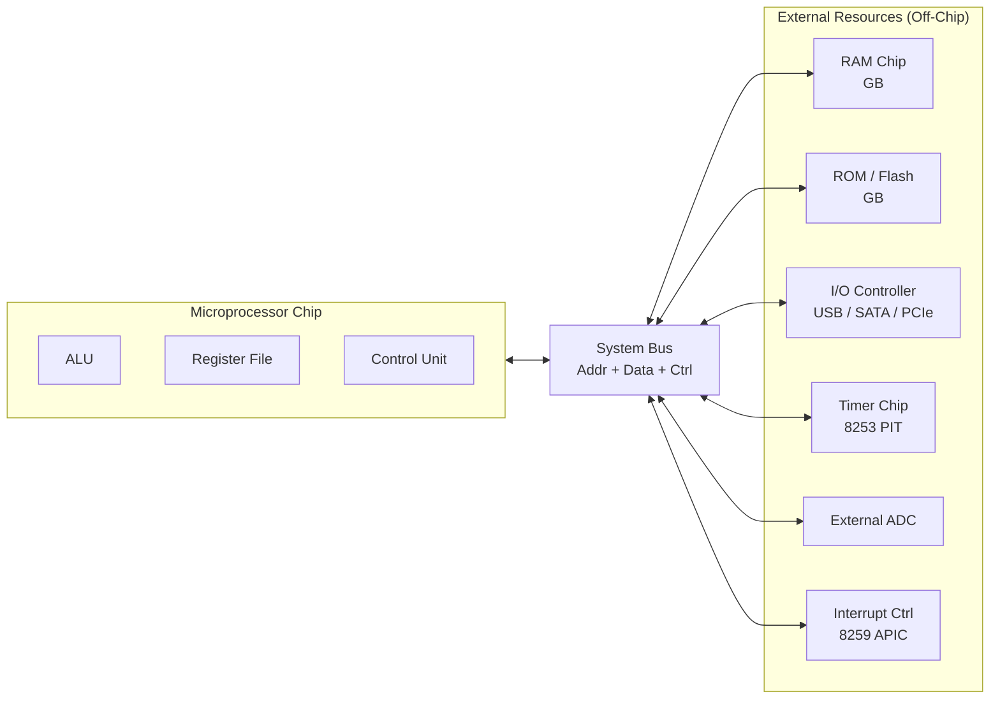
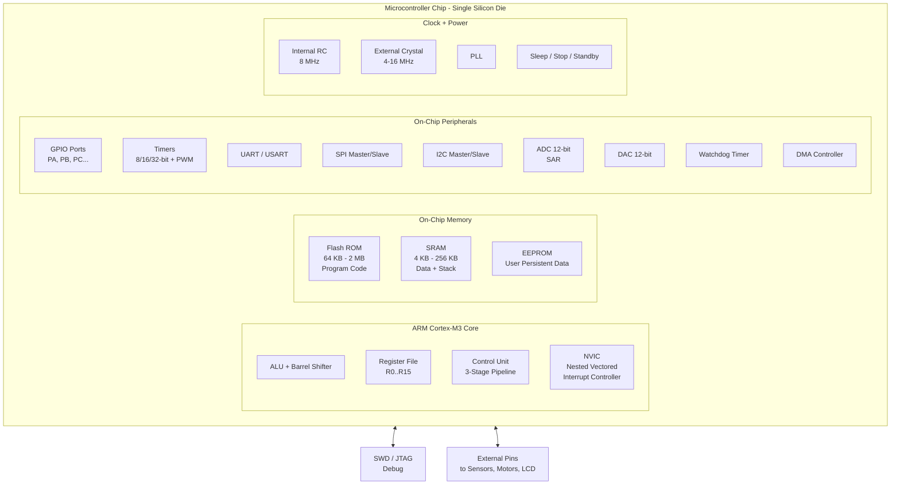
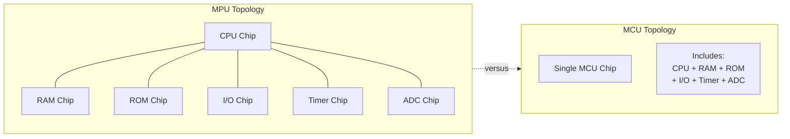
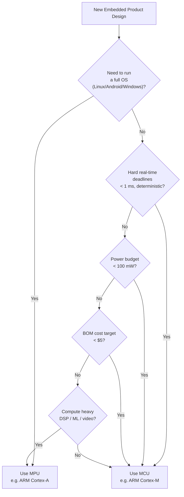
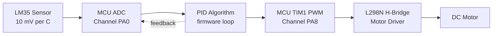
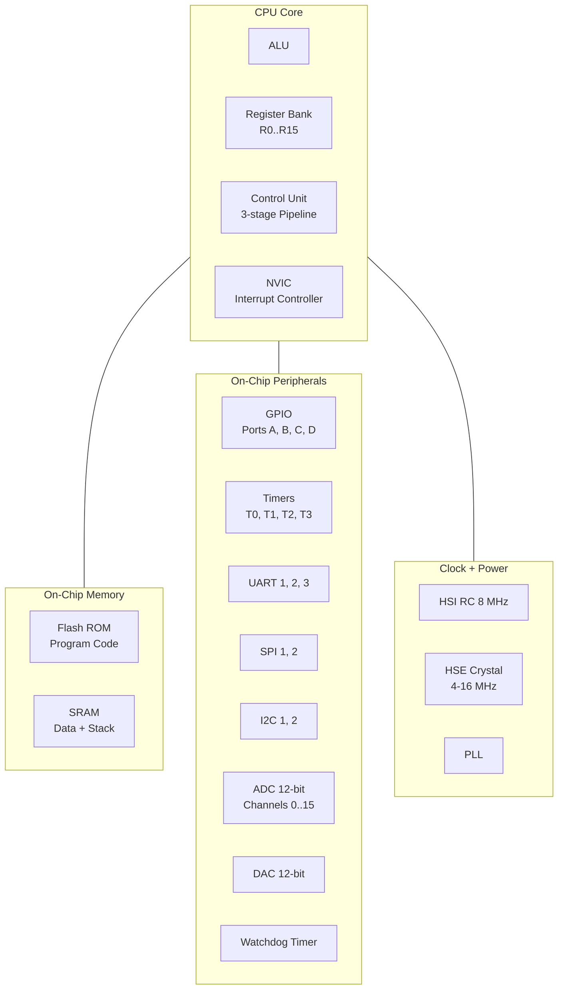

# Microcontrollers vs. Microprocessors

<!-- SECTION_1_START -->

# Microcontrollers vs. Microprocessors — Core Definition & Intuitive Overview

## 1.1 Formal Definition (KTU 2024 Syllabus Terminology)

> [!IMPORTANT]
> **Microprocessor (MPU):** A **Central Processing Unit (CPU)** fabricated on a single Very-Large-Scale Integration (VLSI) chip that contains only the **Arithmetic Logic Unit (ALU)**, **Control Unit (CU)**, and **registers**. It has **no on-chip memory** and **no on-chip I/O peripherals**. All external resources (RAM, ROM, timers, ADC, UART, GPIO) must be connected externally via the **system bus** (Address, Data, Control buses).

> [!IMPORTANT]
> **Microcontroller (MCU):** A **single-chip computer** (a "System on Chip" in modern parlance) that integrates the **CPU core**, **program memory (ROM/Flash)**, **data memory (RAM)**, **I/O ports**, **timers/counters**, **serial communication interfaces (UART, SPI, I²C)**, and **analog peripherals (ADC, DAC)** all on the **same silicon die**. It is purpose-built for **embedded control** applications.

## 1.2 Conceptual Analogy — The Two Personalities of Computing

Think of computing hardware in terms of two professionals:

| Analogy | Microprocessor | Microcontroller |
| :--- | :--- | :--- |
| **Real-world role** | A **brilliant general surgeon** in a hospital | A **dedicated family doctor** in a village clinic |
| **What it brings** | Only its brain (CPU) and hands (registers) | Its brain + medical bag + stethoscope + first-aid kit |
| **Where it works** | In a fully-equipped hospital (motherboard with RAM, disks, GPU) | In a small, self-sufficient clinic (a single PCB with everything) |
| **Task profile** | Heavy, complex, general-purpose jobs | One specific, repetitive, real-time task |

> [!NOTE]
> **Geometric Intuition:** Imagine a **coordinate plane**. A **Microprocessor** is just the **origin point (0, 0)** — pure processing power. A **Microcontroller** is the **entire bounded region** around the origin — the origin *plus* the axes, ticks, units, gridlines, and labels needed to actually *use* that origin for a specific purpose. The boundary of the region represents the **fixed, deterministic function** the MCU is designed to perform.

## 1.3 Architecture Types — The Foundational Distinction

> [!NOTE]
> **Von Neumann Architecture** (used by most general-purpose microprocessors): A **single shared bus** carries both **instructions** and **data** to/from a **unified memory**. Bottleneck: the *Von Neumann bottleneck* (cannot fetch instruction and data simultaneously).

> [!NOTE]
> **Harvard Architecture** (used by most microcontrollers, including **ARM Cortex-M**): **Physically separate buses and memories** for **instructions** (Code/Flash) and **data** (SRAM). Enables **simultaneous fetch** of instruction and data — the **Modified Harvard** variant used by ARM keeps a unified address space but split buses.

## 1.4 Explicit Standard Metrics

The following metrics are used by KTU examiners to differentiate the two:

- **Clock Speed:** Microprocessors operate at **GHz** (1 – 5 GHz typical). Microcontrollers operate at **MHz** (1 – 200 MHz typical).
- **Word Size:** MPUs are **32-bit / 64-bit**. MCUs are **8-bit / 16-bit / 32-bit**.
- **Power Consumption:** MCUs are designed for **mW to µW** range (battery-friendly). MPUs draw **watts to tens of watts** (require heatsinks).
- **Cost:** MPUs cost **$10 – $1000+**. MCUs cost **$0.10 – $10**.
- **Physical Size:** A modern MCU is often a QFN package **5 mm × 5 mm** or smaller; the supporting PCB is the whole system. An MPU needs a full motherboard **170 mm × 170 mm** (Mini-ITX) or larger.

> [!VISUALIZATION CONTROL]
> **Concept:** Architectural difference — Von Neumann vs Harvard
> **GeoGebra / Desmos Input Equations:**
> * Von Neumann single bus: $y = 0$ (single horizontal line between CPU and Memory)
> * Harvard dual bus: $y_1 = 1$ (instruction bus) and $y_2 = -1$ (data bus) — two parallel horizontal lines
> **Visual Description:** Plot a single point labeled "CPU" at the origin. For Von Neumann, draw one arrow to a "Memory" block on the right. For Harvard, draw two parallel arrows (one labeled "I-Bus", one labeled "D-Bus") to two separate memory blocks (Flash and SRAM).

<!-- SECTION_1_END -->

<!-- SECTION_2_START -->

# Deep Theoretical Analysis — KTU High-Yield Architectural Breakdown

## 2.1 Structural Decomposition (Bulleted Logic)

### Microprocessor (MPU) Building Blocks
- **Core CPU** (ALU + CU + Register File) → on-chip
- **External Memory** (DRAM, ROM, SSD controllers) → off-chip, connected via memory controller hub
- **External I/O Controllers** (USB, Ethernet, SATA, PCIe, GPIO) → off-chip, connected via chipset / PCH (Platform Controller Hub)
- **External Clock Generator** → crystal oscillator + PLL on motherboard
- **External Interrupt Controller** → e.g., 8259A PIC or APIC
- **External Timers / Counters** → e.g., 8253/8254 PIT
- **External Bus Arbitration Logic** → for multi-master systems

### Microcontroller (MCU) Building Blocks (On-Chip)
- **Core CPU** (often **ARM Cortex-M0/M3/M4/M7** for KTU syllabus)
- **Non-Volatile Memory:** **Flash ROM** (typically 16 KB – 2 MB) for program code
- **Volatile Memory:** **SRAM** (typically 4 KB – 256 KB) for data + stack
- **EEPROM / Flash Emulated EEPROM** (1 KB – 32 KB) for persistent user data
- **Digital I/O Ports** (GPIO, typically 3 – 100+ pins, grouped as PORTA, PORTB, …)
- **Timers / Counters** (8/16/32-bit, with PWM and Input Capture modes)
- **Communication Peripherals:** **UART**, **SPI**, **I²C**, **CAN**, **USB**, **I²S**
- **Analog Peripherals:** **ADC** (10/12/16-bit SAR), **DAC**, **Analog Comparator**
- **Advanced Peripherals (Cortex-M4/M7):** **FPU**, **DSP extensions**, **DMA controller**, **RTOS-aware NVIC (Nested Vectored Interrupt Controller)**
- **Clock Subsystem:** Internal RC oscillator, PLL, external crystal driver
- **Power Management:** Sleep, Deep-Sleep, Stop, Standby modes with **µA** quiescent current
- **Watchdog Timer (WDT)** for fault recovery
- **Debug Interface:** SWD (Serial Wire Debug) or JTAG

## 2.2 KTU High-Yield Comparison Table

> [!NOTE]
> This is the **single most important table** for the KTU 2024 board exam. Memorize every row. Use $\vert$ only as math delimiter.

| Parameter | Microprocessor (MPU) | Microcontroller (MCU) |
| :--- | :--- | :--- |
| **Architecture** | Von Neumann (mostly) | Harvard / Modified Harvard |
| **CPU** | Powerful, high-frequency | Compact, deterministic, real-time |
| **Program Memory** | External ROM/Flash (MB – GB) | Internal Flash (KB – MB) |
| **Data Memory** | External DRAM (GB) | Internal SRAM (KB – MB) |
| **I/O Ports** | External chipset required | On-chip GPIO ports |
| **Timers / Counters** | External (e.g., 8253) | On-chip multiple timers |
| **ADC / DAC** | External ADC/DAC chips | On-chip 10/12/16-bit |
| **Communication** | USB, PCIe, Ethernet, SATA (high speed) | UART, SPI, I²C, CAN, USB (low-mid) |
| **Clock Speed** | $\mathbf{1 - 5\ \text{GHz}}$ | $\mathbf{1 - 200\ \text{MHz}}$ |
| **Word Size** | 32 / 64-bit | 8 / 16 / 32-bit |
| **Power Consumption** | High ($\mathbf{W}$ range) | Very low ($\mathbf{mW}$ / $\mu\text{W}$ range) |
| **Cost** | High ($\$10 - \$1000+$) | Low ($\$0.10 - \$10$) |
| **Physical Size** | Large, needs motherboard | Small, single-chip solution |
| **Application** | General-purpose computing | Embedded / dedicated control |
| **Examples** | Intel Core i7, AMD Ryzen, ARM Cortex-A53 | 8051, PIC16F877, ATmega328, STM32F4, NXP LPC1768 |
| **Operating System** | Runs full OS (Windows, Linux, Android) | Runs RTOS or bare-metal firmware |
| **Interrupt Latency** | Higher, non-deterministic | $\mathbf{\mu s}$ level, **deterministic** |
| **Real-Time Behavior** | Soft real-time (with effort) | **Hard real-time** by design |
| **Bit Manipulation** | Often needs multi-cycle ops | **Bit-banding** supported (Cortex-M3/M4) |

## 2.3 Real-World Engineering Utility

- **Microprocessors** power **general-purpose computers, servers, smartphones, laptops** — anywhere you need to run an OS, multi-task, and crunch large data sets.
- **Microcontrollers** are embedded inside **washing machines, microwave ovens, automotive ECUs, drones, IoT sensor nodes, medical pacemakers, smartwatches, industrial PLCs, robotics motor controllers** — anywhere a deterministic, low-power, real-time, single-purpose brain is needed.
- Modern **System-on-Chip (SoC)** designs (e.g., **Texas Instruments Sitara**, **NXP i.MX8**) *integrate* an MPU and an MCU on the same die — the MPU runs Linux, the MCU (often a Cortex-M4) handles real-time motor control.

## 2.4 The "Why" Behind the Distinction — Engineering Trade-offs

- **Cost per Function:** An MCU integrates everything, so the *bill of materials* (BOM) is one chip + a few passives. An MPU-based design needs CPU + RAM chip + ROM chip + chipset + bus drivers — BOM balloons.
- **Reliability:** On-chip integration means **fewer solder joints, fewer connectors, fewer failure points** — critical for automotive (AEC-Q100) and aerospace (DO-254) standards.
- **Power:** External buses on MPU boards have **high parasitic capacitance** (long PCB traces) → more energy to charge/discharge. MCU internal buses are tiny → orders of magnitude less dynamic power.
- **Determinism:** MCU interrupt latency is **bounded and documented** (e.g., STM32 NVIC: 12 cycles, deterministic). MPU OS scheduling adds **non-deterministic jitter** — unacceptable for hard real-time.

<!-- SECTION_2_END -->

<!-- SECTION_3_START -->

# Step-by-Step Derivations, Worked Examples & Symbolic Implementation

## 3.1 Comparative Worked Example — Designing the Same Product Both Ways

**Problem (KTU Style):** Design a system that **reads a temperature sensor every 100 ms** and **displays it on an LCD**.

### Design A — Using a Microprocessor (e.g., Intel x86 / ARM Cortex-A)

**Required external components:**
1. MPU chip (e.g., **Intel Atom E3805**)
2. External **DDR3 RAM** chip (≥ 1 GB)
3. External **NOR Flash / eMMC** for bootloader
4. External **GPIO controller** (e.g., I²C GPIO expander **PCF8575**) to drive the LCD
5. External **ADC chip** (e.g., **ADS1115** 16-bit I²C ADC) because x86 MPUs have no on-chip ADC
6. External **timing source** (32.768 kHz crystal + PLL)
7. External **temperature sensor** (e.g., **LM35** analog → goes to external ADC)
8. A full **PCB motherboard** with multiple power rails (3.3 V, 1.8 V, 1.2 V, 5 V)
9. A **Linux OS** to schedule the 100 ms task

**Power budget:** ~$5 – $20 in parts, ~2 W active power, **weeks of board bring-up**.

### Design B — Using a Microcontroller (e.g., STM32F103C8T6 / ARM Cortex-M3)

**Required components (almost all on-chip):**
1. MCU chip (e.g., **STM32F103C8T6** — Cortex-M3, 72 MHz, 64 KB Flash, 20 KB SRAM, **2 × 12-bit ADC**, **4 × 16-bit timers**, **3 × USART**, **2 × SPI**, **2 × I²C**, 37 GPIO)
2. **LM35** temperature sensor → directly to MCU ADC pin (PA0)
3. **HD44780 LCD** in 4-bit mode → 6 GPIO pins
4. One **bypass capacitor** (100 nF) on VDD
5. Optional: 8 MHz external crystal (internal 8 MHz HSI is often good enough)

**Power budget:** ~$1 in parts, ~50 mW active power, **hours of firmware development**.

**Total GPIO used:** 1 (ADC) + 6 (LCD) = 7 pins. The MCU has 37 available — **30 pins free for future expansion**.

> [!NOTE]
> **Inference:** When the entire functional requirement fits within the on-chip resources of an MCU, choosing an MPU is **engineering malpractice**. The cost, size, power, and time-to-market all favor the MCU.

## 3.2 Memory Footprint Worked Example

**Problem:** Estimate the Flash and RAM needed for a thermostat firmware that:
- Reads LM35 every 100 ms
- Implements a PID controller
- Drives a 16×2 LCD
- Has 4 KB of lookup tables

**Step 1 — Flash (Program Memory) budget:**

$$
\begin{aligned}
\text{CMSIS startup + linker scripts} &= 8\ \text{KB} \\
\text{HAL drivers (GPIO, ADC, TIM, I2C, UART)} &= 30\ \text{KB} \\
\text{User application (main, PID, LCD, ISR)} &= 12\ \text{KB} \\
\text{Lookup tables} &= 4\ \text{KB} \\
\text{FreeRTOS (optional)} &= 10\ \text{KB} \\
\hline
\text{Total Flash required} &= 64\ \text{KB}
\end{aligned}
$$

**Step 2 — SRAM (Data Memory) budget:**

$$
\begin{aligned}
\text{Global variables} &= 512\ \text{B} \\
\text{LCD frame buffer (16 chars)} &= 16\ \text{B} \\
\text{ADC double buffer (DMA)} &= 8\ \text{B} \\
\text{PID state variables} &= 24\ \text{B} \\
\text{Stack (deepest call: 8 levels, 32 B/level)} &= 256\ \text{B} \\
\text{Heap (none used)} &= 0\ \text{B} \\
\hline
\text{Total SRAM required} &= 816\ \text{B} \approx 1\ \text{KB}
\end{aligned}
$$

**Step 3 — MCU selection:**

> **Selected:** **STM32F103C8T6** (Cortex-M3) with **64 KB Flash** and **20 KB SRAM** — fits with headroom.
>
> **KTU Inference:** A **MPU-based** thermostat would need **≥ 4 MB Flash + ≥ 64 MB RAM** just to boot Linux. That is **64× more Flash** and **64 000× more RAM** than the firmware actually requires.

## 3.3 Code Implementation — Bare-Metal MCU Firmware (Bare Minimum)

**File:** `thermostat.c` for STM32F103C8T6. Shows typical MCU programming pattern (direct register access + HAL mix).

```c
/**
 * @file    thermostat.c
 * @brief   Bare-metal thermostat reading LM35 on PA0, displaying on HD44780 LCD
 * @board   STM32F103C8T6 (ARM Cortex-M3, 72 MHz)
 * @author  KTU B.Tech Reference Implementation
 */

#include "stm32f1xx_hal.h"
#include <stdint.h>
#include <stdbool.h>

/* -------- Pin Definitions (LCD 4-bit mode) -------- */
#define LCD_RS_Port    GPIOA
#define LCD_RS_Pin     GPIO_PIN_1
#define LCD_EN_Port    GPIOA
#define LCD_EN_Pin     GPIO_PIN_2
#define LCD_D4_Port    GPIOA
#define LCD_D4_Pin     GPIO_PIN_3
#define LCD_D5_Pin     GPIO_PIN_4
#define LCD_D6_Pin     GPIO_PIN_5
#define LCD_D7_Pin     GPIO_PIN_6

/* -------- LM35: 10 mV / °C, Vref = 3.3 V, 12-bit ADC -------- */
#define VREF_MV            3300U
#define ADC_MAX            4095U          /* 2^12 - 1 */
#define LM35_SCALE_MV_C    10U            /* 10 mV per °C */

static ADC_HandleTypeDef hadc1;
static TIM_HandleTypeDef htim2;

/**
 * @brief  Initialise ADC1 Channel 0 (PA0) for LM35 readings
 * @note   12-bit resolution, software-triggered, 239.5-cycle sample time
 *         for ~10 kHz input impedance LM35 source.
 */
static void MX_ADC1_Init(void) {
    hadc1.Instance                   = ADC1;
    hadc1.Init.ContinuousConvMode    = DISABLE;
    hadc1.Init.DataAlign             = ADC_DATAALIGN_RIGHT;
    hadc1.Init.ScanConvMode          = ADC_SCAN_DISABLE;
    hadc1.Init.NbrOfConversion       = 1;
    hadc1.Init.DiscontinuousConvMode = DISABLE;
    hadc1.Init.ExternalTrigConv      = ADC_SOFTWARE_START;
    if (HAL_ADC_Init(&hadc1) != HAL_OK) {
        Error_Handler();
    }

    ADC_ChannelConfTypeDef sConfig = {0};
    sConfig.Channel      = ADC_CHANNEL_0;          /* PA0 */
    sConfig.Rank         = ADC_REGULAR_RANK_1;
    sConfig.SamplingTime = ADC_SAMPLETIME_239CYCLES_5;
    if (HAL_ADC_ConfigChannel(&hadc1, &sConfig) != HAL_OK) {
        Error_Handler();
    }
}

/**
 * @brief  Initialise TIM2 for 100 ms periodic interrupt
 * @note   72 MHz / (7199 + 1) / 100 = 100 Hz ⇒ 10 ms tick.
 *         Update event every 10 ticks ⇒ 100 ms.
 */
static void MX_TIM2_Init(void) {
    TIM_ClockConfigTypeDef sClockSourceConfig = {0};
    htim2.Instance               = TIM2;
    htim2.Init.Prescaler         = 7199U;
    htim2.Init.CounterMode       = TIM_COUNTERMODE_UP;
    htim2.Init.Period            = 99U;             /* 0..99 = 100 ticks */
    htim2.Init.ClockDivision     = TIM_CLOCKDIVISION_DIV1;
    htim2.Init.AutoReloadPreload = TIM_AUTORELOAD_PRELOAD_DISABLE;
    if (HAL_TIM_Base_Init(&htim2) != HAL_OK) {
        Error_Handler();
    }
    sClockSourceConfig.ClockSource = TIM_CLOCKSOURCE_INTERNAL;
    if (HAL_TIM_ConfigClockSource(&htim2, &sClockSourceConfig) != HAL_OK) {
        Error_Handler();
    }
}

/**
 * @brief  Read LM35 and return temperature in degrees Celsius (integer part)
 * @return Temperature in °C, clamped to 0..150
 */
static uint8_t LM35_ReadCelsius(void) {
    if (HAL_ADC_Start(&hadc1) != HAL_OK) Error_Handler();
    if (HAL_ADC_PollForConversion(&hadc1, 10) != HAL_OK) Error_Handler();

    uint16_t raw       = HAL_ADC_GetValue(&hadc1);
    uint32_t voltageMv = (raw * VREF_MV) / ADC_MAX;   /* 0..3300 mV */
    uint32_t celsius   = voltageMv / LM35_SCALE_MV_C;  /* 10 mV / °C */

    if (celsius > 150U) celsius = 150U;
    return (uint8_t)celsius;
}

/**
 * @brief  HAL Timer-Period-Elapsed callback (fires every 100 ms)
 */
void HAL_TIM_PeriodElapsedCallback(TIM_HandleTypeDef *htim) {
    if (htim->Instance == TIM2) {
        uint8_t t = LM35_ReadCelsius();
        LCD_Printf(0, 0, "Temp:%3d C", t);   /* display on LCD */
    }
}

int main(void) {
    HAL_Init();
    SystemClock_Config_72MHz();     /* assumes 8 MHz HSE, 9× PLL */
    MX_GPIO_Init();
    MX_ADC1_Init();
    LCD_Init();
    MX_TIM2_Init();

    if (HAL_TIM_Base_Start_IT(&htim2) != HAL_OK) Error_Handler();

    while (1) {
        /* MCU idle waits in low-power mode until next interrupt */
        __WFI();                     /* Wait For Interrupt */
    }
}
```

> [!NOTE]
> **Observe the code footprint:** A complete, working thermostat is **~120 lines of C**. It uses **no OS**, **no scheduler**, **no memory allocator**. The MCU handles everything in a tight, deterministic loop. The same task on an MPU running Linux would require a device tree, kernel module, userspace daemon, and buildroot — thousands of lines.

## 3.4 Bit-Banding Worked Example (ARM Cortex-M3/M4 Exclusive Feature)

**Problem:** Atomically set bit 5 of GPIOA's output register without read-modify-write hazards.

**Without bit-banding (race-condition prone if ISR fires):**

```c
GPIOA->ODR |= (1U << 5);    /* 3 bus cycles: read, modify, write */
```

**With bit-banding (single, atomic bus cycle):**

$$
\text{Bit-band alias address} = 0x42000000 + (32 \times (\text{byte\_offset})) + (8 \times \text{bit})
$$

For GPIOA ODR bit 5 (where GPIOA base is $\text{0x40010800}$, ODR offset $\text{0x0C}$):

$$
\begin{aligned}
\text{byte\_offset} &= 0x40010800 - 0x40000000 + 0x0C = 0x1080C \\
\text{bit\_band\_addr} &= 0x42000000 + (32 \times 0x1080C) + (8 \times 5) \\
&= 0x42000000 + 0x210180 + 0x28 \\
&= \mathbf{0x422101A8}
\end{aligned}
$$

```c
#define BITBAND_ALIAS(addr, bit) \
    ((volatile uint32_t *)(0x42000000UL + (((addr) - 0x40000000UL) * 32UL) + ((bit) * 4UL)))

*BITBAND_ALIAS((uint32_t)&GPIOA->ODR, 5) = 1;  /* atomic set, 1 bus cycle */
```

> [!NOTE]
> **This bit-banding is impossible on a standard MPU** because the MPU has no bit-addressable region in its unified address space. It is **a defining feature of MCU-class ARM Cortex-M** cores and one of the most-tested KTU viva questions.

<!-- SECTION_3_END -->

<!-- SECTION_4_START -->

# Structural Diagrams & Schematics

## 4.1 Block Diagram — Microprocessor System



## 4.2 Block Diagram — Microcontroller System (ARM Cortex-M3 Example)



## 4.3 Comparative Topology Matrix



> [!NOTE]
> **Reading the Diagrams:** The MPU block diagram has **6 separate chips** connected by an external bus. The MCU block diagram has **1 chip** with everything inside the dotted boundary. The visual reduction in chip count (6:1) is the central engineering argument for choosing MCUs in embedded designs.

## 4.4 Decision Flowchart — When to Use MCU vs MPU



<!-- SECTION_4_END -->

<!-- SECTION_5_START -->

# KTU 2024 Scheme Examination Question Bank & Topic Recap

## 5.1 Part A — Short Answer Questions (3 Marks Each)

### Question 1 [KTU University Exam — July 2023]
**"Differentiate between a microprocessor and a microcontroller. Mention two examples for each."** [CO1, Remember]

**Model Answer (3 Marks — Valuation Key):**

A **microprocessor** is a single-chip CPU that contains only the ALU, control unit, and registers. Memory and I/O peripherals are **external**. Examples: **Intel Core i5**, **AMD Ryzen 5**.

A **microcontroller** is a single-chip computer that integrates the CPU, **on-chip ROM (Flash)**, **on-chip RAM (SRAM)**, I/O ports, timers, and communication interfaces. Examples: **8051**, **STM32F103C8T6** (ARM Cortex-M3).

> **[Award 1 Mark: Defining microprocessor with example. 1 Mark: Defining microcontroller with example. 1 Mark: Mentioning the key "on-chip integration" distinction.]**

### Question 2 [KTU University Exam — Dec 2023]
**"Explain the Harvard architecture used in microcontrollers with a neat block diagram."** [CO1, Understand]

**Model Answer (3 Marks — Valuation Key):**

In **Harvard architecture**, there are **two physically separate memory units** and **two separate buses**:
- **Program memory** (Flash) accessed via the **Instruction Bus (I-Bus)**
- **Data memory** (SRAM) accessed via the **Data Bus (D-Bus)**

Because instruction and data fetches occur on **independent buses**, the CPU can fetch the *next* instruction **simultaneously** with reading/writing *current* data — eliminating the **Von Neumann bottleneck**. The ARM Cortex-M3 used in MCUs implements a **Modified Harvard** architecture: physically separate buses but a **unified linear 4 GB address space** for programmer convenience.

> **[Award 1 Mark: Naming two separate memories. 1 Mark: Naming two separate buses. 1 Mark: Explaining simultaneous fetch benefit.]**

---

## 5.2 Part B — 14-Mark Questions (ESE Module Internal Choice)

### Question A (14 Marks) [KTU University Exam — July 2024]

**(a)** Compare the architecture of a microprocessor and a microcontroller with reference to **memory organization, I/O handling, instruction set, and clock speed**. [7 Marks, CO1, Understand]

**(b)** Design a system to **control the speed of a DC motor** based on the **temperature of a room** (sensor: LM35, actuator: DC motor via PWM). Show whether an MPU or MCU is more suitable, justifying with **at least 4 technical reasons**, and draw the **functional block diagram** of the chosen architecture. [7 Marks, CO1, Apply]

#### Model Solution

**Part (a) — Architecture Comparison [7 Marks]**

| Aspect | Microprocessor | Microcontroller |
| :--- | :--- | :--- |
| **Memory Organization** | External RAM/ROM in GB range; connected via memory controller | On-chip Flash (KB) and SRAM (KB); tightly coupled |
| **I/O Handling** | External I/O controllers; managed by OS drivers | On-chip GPIO, ADC, timers, UART, SPI, I²C; direct register access |
| **Instruction Set** | CISC (x86) or RISC (ARMv8-A) with rich ISA for general-purpose workloads; some have SIMD/NEON | RISC (ARMv6-M, ARMv7-M); Thumb-2 only (16/32-bit mixed); optimized for embedded control |
| **Clock Speed** | 1 – 5 GHz | 1 – 200 MHz |

> **[Valuation Key: 1.5 Marks per row × 4 rows = 6 Marks. 1 Mark for overall summary statement.]**

**Part (b) — DC Motor Speed Control Design [7 Marks]**

**Step 1 — Identify the functional blocks:**
- **Input:** LM35 temperature sensor (analog, 10 mV/°C)
- **Process:** Read temperature, compute PWM duty cycle (PID or simple linear map)
- **Output:** PWM signal to motor driver (e.g., L298N) driving a DC motor

**Step 2 — MCU choice:** **STM32F103C8T6** (ARM Cortex-M3) is selected because it has:
- Built-in **12-bit ADC** (no external ADC needed for LM35)
- Built-in **advanced 16-bit timer (TIM1)** with complementary PWM outputs (perfect for H-bridge drivers)
- Built-in **GPIO** for control signals
- Deterministic interrupt response for the control loop

**Step 3 — Four Technical Reasons Justifying MCU over MPU:**

1. **Power budget:** The motor control system may be battery-powered (e.g., portable fan). MCU consumes ~50 mW vs MPU's ~2 W → **40× less** power.
2. **Determinism:** Motor speed control requires **hard real-time** response. MPU running OS has non-deterministic interrupt latency; MCU's NVIC gives **bounded, µs-level latency** critical for stable PWM.
3. **Cost:** Total BOM with STM32 ≈ **$2**; equivalent MPU board ≈ **$30+** — unjustifiable for a domestic appliance.
4. **Form factor:** MCU + LM35 + L298N + motor fits on a **5 cm × 5 cm PCB**. MPU-based design needs **Mini-ITX motherboard** with heatsink — physically absurd for this application.

**Step 4 — Functional Block Diagram:**



> **[Valuation Key: Step 1 → 1 Mark. Step 2 → 1 Mark. Step 3 → 4 × 1 Mark = 4 Marks. Step 4 → 1 Mark.]**

---

### Question B (14 Marks — Alternative Choice) [KTU University Exam — Dec 2023]

**(a)** With a neat block diagram, explain the **internal architecture of a typical microcontroller** (e.g., 8051 or ARM Cortex-M). List the **on-chip peripherals** and state the function of each. [7 Marks, CO1, Understand]

**(b)** A home automation system needs to control **4 relays, 1 buzzer, read 2 temperature sensors (LM35), and communicate with a smartphone over Wi-Fi (via ESP8266 module over UART)**. Determine the **minimum GPIO, ADC, and UART requirements** and recommend a suitable MCU. Justify your selection with a **pin budget table**. [7 Marks, CO1, Apply]

#### Model Solution

**Part (a) — Internal Architecture of 8051/ARM Cortex-M MCU [7 Marks]**

**Block Diagram (Textual Description for valuation):**



**On-Chip Peripherals and Functions (Required for full marks):**
- **GPIO:** General-purpose digital input/output pins
- **Timers/Counters:** Generate delays, schedule periodic events, produce PWM
- **UART:** Asynchronous serial communication (PC, Bluetooth, GPS, Wi-Fi)
- **SPI:** High-speed synchronous serial (SD cards, displays, sensors)
- **I²C:** Two-wire synchronous serial (EEPROM, RTC, sensors)
- **ADC:** Convert analog signals (sensors) to digital
- **DAC:** Generate analog outputs (audio, setpoints)
- **Watchdog Timer:** Reset MCU if firmware hangs
- **NVIC:** Manage prioritized interrupts with deterministic latency

> **[Valuation Key: Block diagram → 3 Marks. Listing peripherals → 2 Marks. Stating function of each → 2 Marks.]**

**Part (b) — Home Automation MCU Selection [7 Marks]**

**Step 1 — Pin Budget Calculation:**

| Function | Resource | Pins / Channels |
| :--- | :--- | :--- |
| 4 Relays | GPIO | 4 |
| 1 Buzzer | GPIO | 1 |
| 2 LM35 (analog) | ADC channels | 2 |
| ESP8266 (UART) | USART (TX, RX) | 2 |
| **Total GPIO needed** | | **7 GPIO + 2 ADC + 1 USART** |
| Reserved for SWD debug | | 2 (SWDIO, SWCLK) |
| VDD / VSS / NRST / BOOT0 | | 4 |
| **Grand total pins required** | | **20 pins minimum** |

**Step 2 — Recommended MCU:** **STM32F103C8T6** (LQFP-48 package, Cortex-M3)
- GPIO: 37 available → 9 used → **28 spare for future expansion** ✓
- ADC: 2 channels (ADC1_IN0, ADC1_IN1) → **2 needed, 2 available — exactly fits** ✓
- USART: 3 available → 1 used → **2 spare for GPS / Bluetooth expansion** ✓
- Flash: 64 KB → ample for ESP8266 AT-command parser + relay logic
- Cost: ~$1.5 in single quantity

**Step 3 — Justification Table:**

| Criteria | STM32F103C8T6 | Alternative ATmega328P | Verdict |
| :--- | :--- | :--- | :--- |
| GPIO | 37 | 23 | STM32 wins |
| ADC channels | 10 (on 2 ADCs) | 8 (on 1 ADC) | STM32 wins |
| USART count | 3 | 1 | STM32 wins (needs 1, has 3) |
| Flash | 64 KB | 32 KB | STM32 wins |
| Price | $1.5 | $1.0 | ATmega slightly cheaper |
| Future-proofing | DMA, NVIC, FreeRTOS-ready | No DMA, no RTOS | STM32 wins |

> **[Valuation Key: Step 1 pin table → 2 Marks. Step 2 selection → 2 Marks. Step 3 justification table → 3 Marks.]**

---

> [!WARNING]
> **KTU Examiner's Pitfall Callout — Where Students Lose Marks on This Topic**
> 1. **Do NOT** say "microcontroller has memory" without specifying **on-chip Flash + on-chip SRAM**. Always state both types separately — examiners explicitly test this.
> 2. **Do NOT** confuse **Harvard** with **Modified Harvard**. Pure Harvard is **physically separate address spaces**; Modified Harvard (ARM Cortex-M) is **physically separate buses, unified address space**. Mixing these up costs 1–2 marks.
> 3. **Do NOT** give only **one** example for each in Part A. KTU strictly asks for **two** examples.
> 4. **Do NOT** skip the **clock speed and power** numbers in comparisons — these are quantitative metrics examiners look for.
> 5. **Do NOT** draw a block diagram without **arrow directions** showing data/control flow. Unlabeled arrows get **0 marks** in 14-mark questions.
> 6. **Avoid** the phrase *"microcontroller is a small computer"* — too vague. Use *"single-chip computer integrating CPU, memory, and peripherals"*.

---

## Topic Recap & Important Things to Remember

- A **Microprocessor (MPU)** is **only a CPU on a chip** — it needs **external** RAM, ROM, and I/O to function. It uses **Von Neumann architecture** (mostly), runs at **GHz** speeds, and executes a **full OS** like Linux/Windows.
- A **Microcontroller (MCU)** is a **complete single-chip computer** with **on-chip** CPU, Flash, SRAM, EEPROM, GPIO, timers, ADC, DAC, UART, SPI, I²C, and watchdog. It uses **Harvard / Modified Harvard** architecture, runs at **MHz** speeds, and runs **bare-metal firmware or an RTOS**.
- **MPU examples:** Intel x86, AMD Ryzen, ARM Cortex-A series (A53, A72, A78). **MCU examples:** 8051, PIC16F/18F, ATmega328 (Arduino), STM32 (Cortex-M), NXP LPC, ESP32 (with Wi-Fi/BT).
- **MPU** = **general-purpose, high-performance, OS-driven, high-power, expensive**.
- **MCU** = **dedicated, deterministic, real-time, low-power, cheap, compact**.
- **Architectural distinction:** Von Neumann = **one bus, one memory** (bottleneck). Harvard = **two buses, two memories** (parallel fetch, faster).
- **Bit-banding** is an **ARM Cortex-M3/M4 exclusive** feature for atomic single-bit manipulation of peripheral registers — not available on MPU cores.
- **NVIC (Nested Vectored Interrupt Controller)** is the **ARM Cortex-M's** hardware interrupt manager — it provides **deterministic, prioritized, vectored** interrupts with **tail-chaining** for ultra-low latency.
- **On-chip peripherals** to memorize: **GPIO, Timers, PWM, ADC, DAC, UART/USART, SPI, I²C, Watchdog, DMA, RTC, NVIC, PLL, Brown-out Reset, Debug (SWD/JTAG)**.
- **Application split:** MPU → desktop, laptop, server, smartphone. MCU → washing machine, microwave, car ECU, drone, IoT sensor, medical implant, robot motor controller, smart bulb, smartwatch.
- **Cost rule of thumb:** MPU + supporting chips ≈ **$30 – $200**. MCU = **$0.10 – $10** (often < $1).
- **Power rule of thumb:** MPU = **watts** (heatsink often required). MCU = **milliwatts in active mode, microwatts in sleep mode** (runs on coin cell for years).
- **Decision rule:** If the product needs an **OS, multi-tasking, heavy compute, gigabytes of memory** → **MPU**. If it does **one dedicated real-time task** within a **tight power/cost budget** → **MCU**. Hybrid SoCs combine both (e.g., NXP i.MX8: Cortex-A53 + Cortex-M4).

<!-- SECTION_5_END -->
