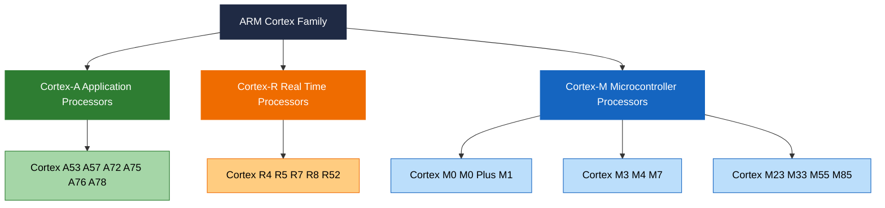
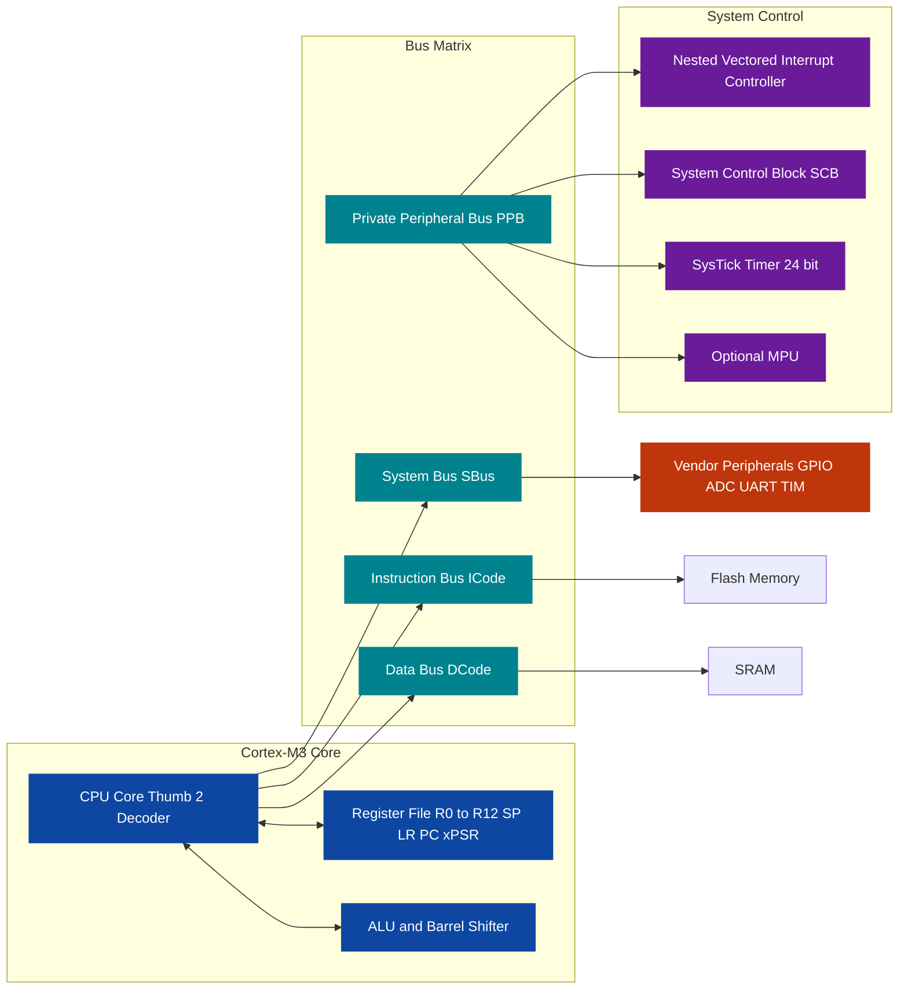
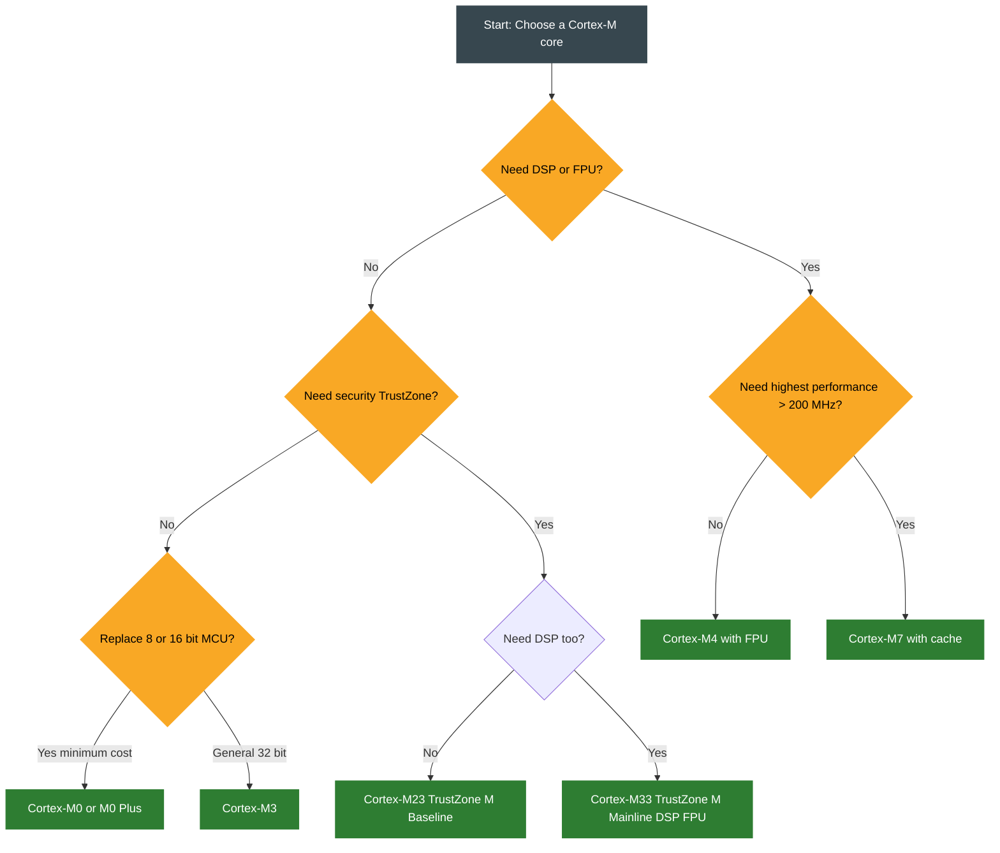

# Overview of ARM Cortex-M Series

<!-- SECTION_1_START -->

## 1. Core Technical Definition & Intuitive Overview

### 1.1 Formal Definition (KTU 2024 Syllabus Terminology)

> [!NOTE]
> **ARM Cortex-M Series** is a family of **32-bit RISC processor cores** designed by **Arm Holdings** specifically for **microcontroller-class embedded systems**. The "M" stands for **Microcontroller**. The series implements the **ARMv6-M** (Cortex-M0, M0+, M1) or **ARMv7-M / ARMv8-M** (Cortex-M3, M4, M7, M23, M33) architectures, executes the **Thumb-2 instruction set**, integrates a **deterministic Nested Vectored Interrupt Controller (NVIC)**, and is engineered around a low-latency, deterministic interrupt-response model with deterministic bit-banding, fixed memory map, and single-cycle I/O ports.

In the KTU **PBCST504 – Microcontrollers** syllabus, the Cortex-M series is positioned as the **modern successor** to the legacy 8051 and classical ARM7TDMI, emphasizing **determinism**, **energy efficiency**, and **C-friendly programming**.

### 1.2 Conceptual Analogy / Intuition

Imagine a **large industrial factory** (a system-on-chip, SoC):
- The **Cortex-A series** = the **senior managers** in the corner office — powerful, complex, run an entire Operating System, handle multitasking apps on your smartphone.
- The **Cortex-R series** = the **floor supervisors** — real-time, safety-critical, used in car braking systems and 5G base stations.
- The **Cortex-M series** = the **shop-floor workers** — small, ultra-reliable, low-cost, dedicated to one or two jobs (reading a sensor, toggling a motor), and they **never** take a coffee break when an interrupt rings.

The Cortex-M cores are purpose-built chips that **wake up, do one job very fast and very predictably, and go back to sleep**, which is exactly what a washing machine, drone flight controller, or BLE heart-rate sensor needs.

> [!IMPORTANT]
> **Three Big Ideas of Cortex-M (worth memorising for the board):**
> 1. **Thumb-2 only** — no 32-bit ARM mode. Code density ≈ 65% better than ARM7.
> 2. **Hardware stack** for exceptions — no software stack-frame pushing.
> 3. **Fixed, vendor-independent memory map** — addresses of NVIC, SCB, SysTick are the same on every Cortex-M chip (STM32, LPC, Tiva, SAMD, nRF, …).

### 1.3 Physical / Numerical Anchor Points

- Typical clock range: **DC to 50–200 MHz** (M0/M0+ ≤ 50 MHz, M4/M7 ≤ 200+ MHz).
- Interrupt latency: **12 cycles** (Cortex-M3/M4) and **15 cycles** (Cortex-M0/M0+), deterministic.
- Power: **< 32 µA/MHz** active, **< 1 µA** sleep (vendor dependent).
- **Bit-band** regions at **0x20000000** and **0x40000000**, alias at **0x22000000** and **0x42000000**.

> [!VISUALIZATION CONTROL]
> **Concept:** Bit-band aliasing mapping (single-bit ↔ word in alias region).
> **GeoGebra / Desmos Input Equations:**
> * `f(b) = 0x22000000 + (0x20000000 - 0x20000000) * 32 + b * 4` simplifies to `f(b) = 0x22000000 + 4b`
> * For each bit position $b \in \{0, 1, \dots, 31\}$ of a word in the bit-band region, plot the points $(b, f(b))$.
> **Visual Description:** A staircase function over $b$ from 0 to 31, where each integer bit $b$ maps to a unique 32-bit-aligned alias word address, demonstrating that one bit in the SRAM region occupies an entire word in the alias region. Students should see the linear, monotonic, 1-to-1 nature of the mapping.

---

<!-- SECTION_1_END -->

<!-- SECTION_2_START -->

## 2. Deep Theoretical Analysis & KTU High-Yield Formula Sheet

### 2.1 The ARM Architecture Family Tree (Why "Cortex-M" Exists)

Arm Holdings segments its cores into three product lines, each optimised for a different market window. Understanding this segmentation is a **favourite KTU 2-mark question**.

| Profile | Target Market | OS Expectations | Key Trait |
| :--- | :--- | :--- | :--- |
| **Cortex-A** (Application) | Smartphones, tablets, servers | Linux, Android, full MMU | Performance, virtual memory, out-of-order |
| **Cortex-R** (Real-time) | Hard-disk controllers, automotive braking, baseband | RTOS, partial MMU | Low latency + high reliability |
| **Cortex-M** (Microcontroller) | IoT, sensor hubs, motor control, wearables | Bare-metal, optional RTOS | Determinism, low power, low cost |

> [!IMPORTANT]
> **Board Trigger Phrase:** *"Differentiate between Cortex-A, Cortex-R, and Cortex-M."* — Always anchor your answer in **MMU vs MPU**, **determinism**, and **instruction set width** (AArch32/64 vs Thumb-2).

### 2.2 Cortex-M Variant Comparison Sheet (High-Yield Table)

The Cortex-M series itself is tiered. The columns below appear **verbatim** in KTU past papers.

| Core | ARM Arch | Pipeline | MUL | DSP / FPU | Bus | Typical Use |
| :--- | :--- | :--- | :--- | :--- | :--- | :--- |
| **Cortex-M0** | ARMv6-M | 3-stage | 1-cycle (opt) | No | Von Neumann | 8/16-bit replacement |
| **Cortex-M0+** | ARMv6-M | 2-stage | 1-cycle (opt) | No | Von Neumann | Lowest-power MCU |
| **Cortex-M1** | ARMv6-M | 3-stage | 1-cycle (opt) | No | Von Neumann | FPGA soft-core |
| **Cortex-M3** | ARMv7-M | 3-stage + branch speculation | 1-cycle HW | No | Harvard | General-purpose 32-bit |
| **Cortex-M4** | ARMv7-M | 3-stage + branch spec | 1-cycle HW | **DSP + optional FPU** | Harvard | Signal processing, motor control |
| **Cortex-M7** | ARMv7-M | 6-stage superscalar dual-issue | 1-cycle HW | **DSP + double-precision FPU + cache** | Harvard | High-end DSP, audio, drones |
| **Cortex-M23** | ARMv8-M Baseline | 2-stage | 1-cycle (opt) | No | Von Neumann (or Harvard) | Secure IoT, TrustZone-M |
| **Cortex-M33** | ARMv8-M Mainline | 3-stage | 1-cycle HW | **DSP + optional FPU + TrustZone-M** | Harvard | Secure IoT edge node |

> [!NOTE]
> **Why the architectures diverge:** ARMv6-M (M0/M0+/M1) was designed to be the **cheapest 32-bit core** ever — it has a **Von Neumann** bus (one shared bus for code + data) and a tiny 3-stage pipeline. ARMv7-M and ARMv8-M add a true **Harvard** bus (simultaneous fetch + data access) because they target **higher clock speeds and DSP workloads**.

### 2.3 Programmer's Model — The Register File

The base Cortex-M register file is identical across all variants. Memorise this diagram — it is the foundation of every Assembly program you will write.

| Register | Width | Role | Privilege |
| :--- | :--- | :--- | :--- |
| **R0 – R12** | 32-bit | General-purpose data registers | Any |
| **R13 / SP** | 32-bit | **Stack Pointer** — two physical banks: **MSP** (Main) and **PSP** (Process) | Any |
| **R14 / LR** | 32-bit | **Link Register** — holds return address after `BL` / `BX LR` | Any |
| **R15 / PC** | 32-bit | **Program Counter** | Any |
| **xPSR** | 32-bit | **Program Status** (split into APSR, IPSR, EPSR) | Any |
| **PRIMASK, FAULTMASK, BASEPRI** | 32-bit (1-bit effective) | **Interrupt masking** | Privileged |
| **CONTROL** | 32-bit | Selects MSP/PSP, unprivileged level | Privileged (M0+: any) |

> [!IMPORTANT]
> **KTU Pitfall:** Students often write "R13 is the stack pointer". The board expects the precise answer: **"R13 is the *banked* stack pointer — bit[1] of the CONTROL register selects between MSP (reset default) and PSP."**

### 2.4 Special Program Status Registers (xPSR decomposition)

$$
\text{xPSR} \;=\; \underbrace{\text{APSR}}_{\text{Application}} \;\cup\; \underbrace{\text{IPSR}}_{\text{Interrupt}} \;\cup\; \underbrace{\text{EPSR}}_{\text{Execution}}
$$

| Sub-register | Bits used | Purpose |
| :--- | :--- | :--- |
| **APSR** | N, Z, C, V, Q | ALU flags (Negative, Zero, Carry, oVerflow, saturation) |
| **IPSR** | ISR_NUMBER[5:0] | Number of the currently executing exception (0 = Thread mode) |
| **EPSR** | ICI/IT, T | Thumb-state bit (always 1 in Cortex-M) and If-Then execution bits |

### 2.5 Fixed Memory Map (Vendor-Independent)

The 4 GB address space is sliced into predefined regions. **Vendors cannot move these** — only the SRAM and peripheral regions can be resized.

| Address Range | Region | Notes |
| :--- | :--- | :--- |
| **0x00000000 – 0x1FFFFFFF** | Code (aliases to Flash) | Executable region |
| **0x20000000 – 0x3FFFFFFF** | SRAM | Bit-band alias at **0x22000000** |
| **0x40000000 – 0x5FFFFFFF** | Peripheral | Bit-band alias at **0x42000000** |
| **0x60000000 – 0x7FFFFFFF** | External RAM | |
| **0x80000000 – 0x9FFFFFFF** | External Device | |
| **0xA0000000 – 0xDFFFFFFF** | System / PPB / Vendor | **NVIC at 0xE000E000** |
| **0xE0000000 – 0xE00FFFFF** | Private Peripheral Bus | **SCB, SysTick, MPU** |
| **0xE0100000 – 0xFFFFFFFF** | Vendor-specific | |

### 2.6 KTU High-Yield Formula / Numerical Cheat Sheet

> [!IMPORTANT]
> **Use $\vert \cdot \vert$ or `abs()` in code — never raw `|` inside markdown tables.**

| # | Formula / Rule | Variable Definitions | Engineering Use |
| :---: | :--- | :--- | :--- |
| 1 | $T_{cycle} = \dfrac{N_{cycles}}{f_{clock}}$ | $T_{cycle}$ = instruction time, $N_{cycles}$ = cycles/instruction, $f_{clock}$ = core clock | Compute execution time of a loop |
| 2 | $T_{latency} = (2 \cdot N_{stacked}) + 12$ | $N_{stacked}$ = registers pushed, $+12$ for Cortex-M3/M4 tail | Worst-case interrupt response |
| 3 | $A_{alias} = A_{bb} + 32 \cdot (A_{bit} - 0x20000000) + 4 \cdot b$ | $A_{alias}$ = alias address, $A_{bit}$ = byte address, $b$ = bit index | Atomic single-bit I/O |
| 4 | $P_{dyn} = C \cdot V_{dd}^2 \cdot f$ | $C$ = switched capacitance, $V_{dd}$ = supply, $f$ = switching freq | Power budgeting |
| 5 | $N_{vector} = \dfrac{\text{System clock}}{\text{SysTick load value}}$ | Sets SysTick tick rate | RTOS tick generation |
| 6 | $T_{wakeup} = \dfrac{N_{cycles\_wake}}{f_{clock}}$ | Wakeup latency from WFI/WFE | Power-mode design |
| 7 | $\text{Code density gain} \approx 1 - \dfrac{\text{Thumb-2 size}}{\text{ARM size}} \approx 0.26$ | Empirical 26% saving over ARM mode | Flash footprint |

### 2.7 Real-World Engineering Utility

- **STM32 (STMicroelectronics)** uses Cortex-M0/M0+/M3/M4/M7 — the most popular Cortex-M vendor worldwide; KTU labs often use the **STM32F103 (Cortex-M3)** or **STM32F411 (Cortex-M4)**.
- **Nordic nRF52/53** (Cortex-M4 / M33) — every Bluetooth Low-SoC sensor in your smartwatch.
- **NXP LPC / Kinetis** — automotive and industrial motor control.
- **RP2040 (Raspberry Pi Pico)** — **dual Cortex-M0+** at 133 MHz, famous for its PIO blocks.
- **ESP32-C3 / C6 (Espressif)** — Cortex-M4 / M33 plus Wi-Fi/BLE, increasingly common in IoT coursework.

---

<!-- SECTION_2_END -->

<!-- SECTION_3_START -->

## 3. Step-by-Step Derivations & Code/Symbolic Implementation

### 3.1 Derivation 1 — Worst-Case Interrupt Latency on Cortex-M3/M4

The latency of taking an interrupt is the sum of three components: synchronisation time, stacking time, and tail-chaining overhead.

**Step 1 — Synchronisation to the clock**
The interrupt request is sampled on the rising edge of the core clock. The worst-case synchronisation delay is **1 clock cycle**.

$$
T_{sync} = \dfrac{1}{f_{clock}}
$$

**Step 2 — Vector fetch and stacking**
The CPU automatically pushes **eight registers** (R0–R3, R12, LR, PC, xPSR) onto the stack pointed to by the active SP. Each push consumes **2 cycles** on the write bus (1 store + 1 bus grant). The Cortex-M3/M4 reference manual fixes the stacking cost at exactly **12 cycles** for the full 8-register push.

$$
T_{stack} = \dfrac{12}{f_{clock}}
$$

**Step 3 — Tail-chaining the saved cost**
If no higher-priority interrupt is pending, the CPU fetches the vector and begins the ISR. The total deterministic latency is therefore:

$$
T_{latency} = T_{sync} + T_{stack} + T_{fetch} = \dfrac{1 + 12 + 1}{f_{clock}} = \dfrac{12 \text{ (rounded)}}{f_{clock}}
$$

> **General rule taught in KTU textbooks:** worst-case latency on Cortex-M3/M4 = **12 cycles**, on Cortex-M0/M0+ = **15 cycles**, on Cortex-M7 = configurable to **< 12 cycles** with cache.

**Numerical example:** if $f_{clock} = 72 \text{ MHz}$, then

$$
T_{latency} = \dfrac{12}{72 \times 10^6} = 1.667 \times 10^{-7} \text{ s} = 166.7 \text{ ns}
$$

This is why a Cortex-M3 is classified as a **"hard real-time"** core for control loops up to a few hundred kHz.

---

### 3.2 Derivation 2 — Bit-Band Alias Address

The bit-band feature lets a single bit be accessed atomically using a normal word load/store. Given the byte address $A_{bit}$ of a word in the bit-band region and the bit position $b \in \{0, 1, \dots, 31\}$ inside that word, the alias address is:

**Step 1 — Compute the offset from the start of the bit-band region**

$$
\text{offset} = A_{bit} - 0x20000000
$$

**Step 2 — Multiply by 32 bits per word**

$$
\text{bit-offset} = (\text{offset} \times 32) + (b \times 4)
$$

**Step 3 — Add the base of the alias region**

$$
A_{alias} = 0x22000000 + \text{bit-offset}
$$

**Worked numerical example:** toggle bit 5 of the GPIO output register mapped at byte address `0x40020014`.

$$
\text{offset} = 0x40020014 - 0x20000000 = 0x20020014
$$

$$
\text{bit-offset} = (0x20020014 \times 32) + (5 \times 4) = 0x400400280 + 0x14 = 0x400400294
$$

$$
A_{alias} = 0x22000000 + 0x400400294 = \text{0x620400294}
$$

A write of `1` to address `0x620400294` sets bit 5 of `0x40020014` **atomically** in a single bus transaction — no read-modify-write race condition ever.

---

### 3.3 Code Implementation — Bare-Metal GPIO Toggle on Cortex-M3 (STM32F103)

The following is a fully operational, register-level C program that toggles the on-board LED (PC13 on the blue-pill board) by directly accessing Cortex-M peripheral registers. It uses **no HAL libraries** — exactly what KTU viva panels expect.

```c
/*
 * File:    cortex_m3_gpio_toggle.c
 * Target:  ARM Cortex-M3 (STM32F103C8T6, 72 MHz)
 * Action:  Toggles PC13 (active-low LED) every 1,000,000 iterations
 * Notes:   Bit-band alias used to demonstrate atomic single-bit I/O.
 */

#include <stdint.h>

/* ------------------------------------------------------------------
 * CMSIS-style device definitions
 * ------------------------------------------------------------------ */
#define REG32(addr)                (*(volatile uint32_t *)(addr))

/* RCC base enables GPIOC clock on AHB */
#define RCC_APB2ENR                REG32(0x40021018U)
#define RCC_APB2ENR_IOPCEN         (1U << 4)

/* GPIOC base + mode + output registers (Cortex-M3 standard offset) */
#define GPIOC_CRH                  REG32(0x40011004U)
#define GPIOC_ODR                  REG32(0x4001100CU)

/* Bit-band alias of GPIOC ODR bit 13 (PC13 = active-low LED) */
#define ODR_BIT13_ALIAS            REG32(0x422201A8U)

/* ------------------------------------------------------------------
 * Tiny software delay
 * ------------------------------------------------------------------ */
static void delay_loop(volatile uint32_t count)
{
    while (count--) {
        /* Empty body — loop cycles give roughly 1 us / 3 iterations @ 72 MHz */
    }
}

/* ------------------------------------------------------------------
 * main
 * ------------------------------------------------------------------ */
int main(void)
{
    /* 1. Enable GPIOC peripheral clock */
    RCC_APB2ENR |= RCC_APB2ENR_IOPCEN;

    /* 2. Configure PC13 as push-pull output, 2 MHz (CNFy[1:0] = 00, MODE13[1:0] = 10) */
    GPIOC_CRH &= ~(0xFU << 20);          /* Clear bits 23:20 */
    GPIOC_CRH |=  (0x2U << 20);          /* MODE13 = 10 (2 MHz output) */

    /* 3. Toggle PC13 forever using bit-band alias */
    for (;;) {
        ODR_BIT13_ALIAS = 1U;            /* LED ON  (active-low) */
        delay_loop(1000000U);
        ODR_BIT13_ALIAS = 0U;            /* LED OFF */
        delay_loop(1000000U);
    }
}

/* ------------------------------------------------------------------
 * Vector table — minimal Cortex-M3 layout
 * ------------------------------------------------------------------ */
typedef void (*vector_t)(void);

extern uint32_t _estack;                 /* Provided by the linker script */

__attribute__((section(".isr_vector")))
const vector_t g_vectors[16] = {
    (vector_t)(&_estack),                /* 0  Initial SP                */
    (vector_t)(main),                    /* 1  Reset                     */
    0, 0, 0, 0, 0, 0, 0, 0, 0, 0, 0, 0,  /* Unused IRQs                  */
    0
};
```

**Line-by-line commentary (for viva):**

| Line | Explanation |
| :--- | :--- |
| `RCC_APB2ENR |= RCC_APB2ENR_IOPCEN;` | Every Cortex-M peripheral is gated by a clock; without this line, writes to GPIOC silently fail. |
| `GPIOC_CRH &= ~(0xFU << 20);` | `CRH` controls pins 8–15. PC13 lives in bits 23:20. Masking clears the previous mode. |
| `GPIOC_CRH \|= (0x2U << 20);` | Sets MODE13 = `10` binary = 2 MHz output speed. |
| `ODR_BIT13_ALIAS = 1U;` | Writes a **1** to the bit-band alias; the hardware expands this to a read-modify-write of ODR. |
| `g_vectors[0] = (vector_t)(&_estack);` | Position 0 of the vector table is the **initial MSP** loaded by the hardware on reset. |
| `g_vectors[1] = (vector_t)(main);` | Position 1 is the **Reset handler** — the CPU jumps here on power-up. |

---

### 3.4 Algorithm — Interrupt Priority Decision Using NVIC

The following pseudocode mirrors the hardware priority-decision logic in the NVIC of a Cortex-M3/M4. It is fully expanded line-by-line so you can trace it on paper during the exam.

```
ALGORITHM nvic_resolve_pending
INPUT  : active_list  (sorted by priority, ascending)
         pending_list (set of asserted IRQs)
OUTPUT : chosen_irq  (the next ISR to run)

1.  chosen_irq  := -1
2.  best_prio   := 0xFFFFFFFF        /* numerically lower = higher priority */
3.  best_irq    := -1
4.  FOR each irq IN pending_list DO
5.      IF irq.enabled == TRUE THEN
6.          prio := priority_register[irq.number]   /* 8-bit, configurable */
7.          IF prio < best_prio THEN
8.              IF prio is not masked by BASEPRI THEN
9.                  best_prio := prio
10.                 best_irq  := irq.number
11.             END IF
12.         END IF
13.     END IF
14. END FOR
15. chosen_irq := best_irq
16. RETURN chosen_irq
```

> **Note for the exam:** Cortex-M priority registers use **lower numerical value = higher logical priority**. This is the **opposite** of most other architectures. KTU students frequently lose marks on this sign convention.

---

### 3.5 Worked Numerical Example — SysTick Configuration

To drive an RTOS tick at exactly **1 ms** on a system clocked at 72 MHz:

$$
\text{RELOAD} = \dfrac{f_{clock}}{f_{tick}} - 1 = \dfrac{72 \times 10^{6}}{1000} - 1 = 71999
$$

| Register | Value | Action |
| :--- | :--- | :--- |
| `SysTick->CTRL` | `0x00000007` | Enable, CLKSOURCE = processor clock, TICKINT enabled |
| `SysTick->LOAD` | `71999` | Reload value (counts 0 → 71999 = 72 000 cycles) |
| `SysTick->VAL` | `0` | Clear current value |
| `SysTick->CTRL` | `0x00000007` | Re-write to start (write order matters) |

---

<!-- SECTION_3_END -->

<!-- SECTION_4_START -->

## 4. Structural Diagrams & Schematics

### 4.1 ARM Cortex Family Tree (Top-Down Market Segmentation)



---

### 4.2 Cortex-M3 Internal Block Diagram (Functional Architecture)



---

### 4.3 Cortex-M Variant Decision Flowchart (For Project Selection)



---

### 4.4 Sequential Processing Topology Matrix (Interrupt Path)

| Stage # | Hardware Block | Action | Cycle Cost (Cortex-M3) |
| :---: | :--- | :--- | :---: |
| 1 | Peripheral | Asserts IRQ line to NVIC | — |
| 2 | NVIC | Samples & resolves priority | 1 |
| 3 | CPU | Synchronises to core clock | 1 |
| 4 | Stack Engine | Pushes R0–R3, R12, LR, PC, xPSR | 8 × 1.5 = 12 |
| 5 | Vector Fetch | Reads handler address from VTOR | 1 |
| 6 | ISR | Executes user code | user-defined |
| 7 | Stack Engine | Pops registers on return | 12 |
| 8 | NVIC | Tail-chains to next pending IRQ | 6 (tail-chain) |

> **Total deterministic entry latency = 12 cycles.** Total tail-chain = 6 cycles (vs 12 for fresh entry → 6 cycles saved per back-to-back interrupt).

---

<!-- SECTION_4_END -->

<!-- SECTION_5_START -->

## 5. KTU 2024 Scheme Examination Question Bank & Topic Recap

> [!IMPORTANT]
> **KTU 2024 Mark Pattern (End Semester Exam – 50 marks):**
> * Part A: Answer **both** 3-mark questions (compulsory). Total = 6 marks.
> * Part B: Answer **one full 14-mark question per module** (Module choice pattern). Module 1 falls under the first internal choice.

---

### 5.1 Part A — 3-Mark Short-Answer Questions

#### **Q1. [KTU University Exam – July 2024]**
*Define the term "Thumb-2 instruction set" as used in ARM Cortex-M processors. Why is it preferred over the full 32-bit ARM instruction set in microcontrollers?* **[CO1, Remember/Understand]**

**Model Answer (Board-Standard):**

> **Thumb-2 Instruction Set** is a variable-length encoding that combines **16-bit Thumb instructions** with a selected set of **32-bit instructions** into a single, unified instruction stream. It was introduced by ARM to obtain code density close to 16-bit processors while retaining the performance of 32-bit processors.
>
> **Why preferred in Cortex-M:**
> 1. **Better code density** — ~26% smaller binary than legacy ARM mode, saving Flash cost.
> 2. **Lower power** — fewer bytes to fetch ⇒ less bus activity ⇒ lower $P_{dyn} = C \cdot V^2 \cdot f$.
> 3. **Single instruction mode** — Cortex-M cores run **only** Thumb-2; no mode-switch penalty (unlike ARM7TDMI).
> 4. **C-friendly** — most C constructs compile to a single Thumb-2 instruction.

**Valuation Key:** [Definition: 1 Mark] [Any 2 reasons: 2 Marks]

---

#### **Q2. [KTU University Exam – Dec 2023]**
*List any **six** distinguishing features of the ARM Cortex-M3 processor.* **[CO1, Remember]**

**Model Answer (Board-Standard):**

1. **Harvard bus architecture** — separate I-Code and D-Code buses allow simultaneous fetch and data access.
2. **Thumb-2 instruction set** — 16-bit/32-bit mixed encoding, no ARM mode.
3. **Integrated NVIC** — deterministic 12-cycle interrupt latency, up to 240 interrupts.
4. **Hardware stack for exceptions** — automatic push of 8 registers on exception entry.
5. **Wakeup Interrupt Controller (WIC)** — allows sleep with NVIC active for ultra-low-power wakeup.
6. **Bit-band memory regions** — atomic single-bit I/O via alias addresses 0x22000000 and 0x42000000.
7. **Optional Memory Protection Unit (MPU)** — 8 regions for RTOS memory isolation.
8. **Single-cycle 32×32 hardware multiplier** — improves DSP performance.

**Valuation Key:** [Any 6 features × 0.5 = 3 Marks]

---

### 5.2 Part B — 14-Mark Questions (Module 1 Internal Choice)

#### **Question A — 14 Marks [KTU University Exam – July 2024]**

**(a)** Compare the architectural features of **Cortex-M0, Cortex-M3, and Cortex-M4** cores under the following heads: *ARM architecture version, pipeline depth, bus architecture, instruction set support, presence of DSP extensions, presence of FPU, and typical applications.* **[7 Marks] [CO1, Understand]**

**(b)** With a neat diagram, explain the **programmer's model** of the Cortex-M3 processor. Clearly mark the **banked stack pointer** and the **special registers** (xPSR, PRIMASK, CONTROL). **[7 Marks] [CO1, Apply]**

---

**Model Solution — Part (a):**

| Feature | Cortex-M0 | Cortex-M3 | Cortex-M4 |
| :--- | :--- | :--- | :--- |
| ARM architecture | **ARMv6-M** | **ARMv7-M** | **ARMv7-M** |
| Pipeline depth | **3 stages** | 3 stages + branch speculation | 3 stages + branch speculation |
| Bus architecture | **Von Neumann** | Harvard | Harvard |
| Instruction set | Thumb + subset of Thumb-2 | Full Thumb-2 | Full Thumb-2 |
| Hardware multiply | Optional (1 cycle) | **Yes (1 cycle)** | **Yes (1 cycle)** |
| DSP extensions | No | No | **Yes (SIMD, MAC)** |
| FPU | No | No | **Optional single-precision** |
| Interrupt latency | 15 cycles | **12 cycles** | 12 cycles |
| Typical applications | 8/16-bit replacement, sensor nodes | General 32-bit MCU, motor control | DSP, audio codecs, motor control |

**Valuation Key:** [Correctly identifying the 3 cores: 1 Mark] [Filling 7 rows × 6 correct cells = 3 Marks] [Application examples: 1 Mark each = 2 Marks]

---

**Model Solution — Part (b):**

The programmer's model of the Cortex-M3 consists of the **low registers (R0–R7)**, **high registers (R8–R12)**, the **banked stack pointer (R13 = MSP/PSP)**, the **link register (R14)**, the **program counter (R15)**, and the **special status / control registers** (xPSR, PRIMASK, FAULTMASK, BASEPRI, CONTROL).

```
                         +----------------------+
                         |        xPSR          |  (APSR / IPSR / EPSR)
                         +----------------------+
                         |       PRIMASK        |  1 = mask all interrupts
                         +----------------------+
                         |      FAULTMASK       |  1 = mask all except NMI
                         +----------------------+
                         |       BASEPRI        |  Mask all ≤ priority
                         +----------------------+
                         |       CONTROL        |  bit[1] = SPSEL (MSP/PSP)
                         +----------------------+
                         |          PC  (R15)   |
                         +----------------------+
                         |          LR  (R14)   |
                         +----------------------+
   R13 (SP)  PSP ---->   |   Process Stack Ptr  |  Used in Thread mode
   R13 (SP)  MSP ---->   |    Main Stack Ptr    |  Used in Handler & reset
                         +----------------------+
                         |   R12   (high reg)   |
                         |   R11                |
                         |   R10                |
                         |   R9                 |
                         |   R8                 |
                         +----------------------+
                         |   R7                 |
                         |   R6                 |
                         |   R5                 |
                         |   R4                 |
                         |   R3                 |
                         |   R2                 |
                         |   R1                 |
                         |   R0                 |
                         +----------------------+
```

**Key points to write in the exam:**

- R0–R12 are general-purpose. **R0–R7** are accessible by all 16-bit Thumb instructions; **R8–R12** are accessible only by 32-bit Thumb-2 instructions.
- R13 is **banked**: the active bank is chosen by **CONTROL[1]**. After reset, **MSP** is active.
- R14 (LR) stores the return address from a subroutine (`BL`) or exception.
- R15 (PC) is readable and writable; reads return the **current instruction + 4**.
- **xPSR** combines APSR, IPSR, and EPSR. APSR holds the ALU flags. IPSR holds the exception number of the current ISR (0 in Thread mode). EPSR's T-bit must always be 1 in Cortex-M.
- **PRIMASK** = 1 masks all maskable interrupts. **FAULTMASK** = 1 additionally blocks fault handlers. **BASEPRI** masks interrupts with priority **numerically ≥** its value.
- **CONTROL[0]** = 0 (privileged) or 1 (unprivileged); **CONTROL[1]** = 0 (MSP) or 1 (PSP).

**Valuation Key:** [Drawing register file: 2 Marks] [Naming banked SP: 1 Mark] [xPSR decomposition: 1 Mark] [PRIMASK/FAULTMASK/BASEPRI: 2 Marks] [CONTROL register bits: 1 Mark]

---

#### **Question B — 14 Marks [KTU University Exam – Dec 2023]**

**(a)** Explain the **Nested Vectored Interrupt Controller (NVIC)** of the Cortex-M3 in detail. Discuss its key features such as *configurable priority levels, interrupt tail-chaining, late-arriving interrupts, and interrupt latency*. **[7 Marks] [CO1, Understand]**

**(b)** Describe the **memory map** of the Cortex-M3 processor. List any **four** standard system-level components with their base addresses inside the **System Control Space (0xE000E000 – 0xE000EFFF)**. **[7 Marks] [CO1, Apply]**

---

**Model Solution — Part (a):**

The **NVIC** is a hardware block tightly integrated into the Cortex-M3 core. It is responsible for receiving interrupt requests from peripherals, resolving priority, performing vector fetching, and signalling the core to switch context.

**Key features (write all 4 for full marks):**

1. **Configurable priority levels** — Up to 256 priority levels (8 bits). Most vendors implement 3–4 priority bits per interrupt. **Lower numerical value = higher logical priority.** A reset value of 0 is the highest priority.
2. **Tail-chaining** — When one ISR finishes and another is already pending, the NVIC skips the unstacking and stacking of the second ISR. The new ISR starts in **6 cycles** instead of 12, saving significant CPU time in back-to-back interrupt workloads.
3. **Late-arriving (pre-emption) interrupts** — If a higher-priority interrupt arrives while the CPU is stacking registers for a lower-priority interrupt, the NVIC redirects the vector fetch to the new higher-priority ISR. The stack contents remain correct.
4. **Deterministic interrupt latency** — The 12-cycle stacking cost is guaranteed. No instruction fetch from memory can stretch it.
5. **Vector Table Offset Register (VTOR)** — Allows the vector table to be relocated to RAM or bootloader regions, enabling in-application firmware updates.
6. **Peripheral enable/disable** — Each interrupt can be individually enabled/disabled via SETENA / CLRENA registers in the NVIC.

---

**Model Solution — Part (b):**

**Cortex-M3 4 GB Memory Map (sliced into 8 × 512 MB regions):**

| Start Address | End Address | Region |
| :---: | :---: | :--- |
| 0x00000000 | 0x1FFFFFFF | Code (Flash) |
| 0x20000000 | 0x3FFFFFFF | SRAM (Bit-band alias at 0x22000000) |
| 0x40000000 | 0x5FFFFFFF | Peripheral (Bit-band alias at 0x42000000) |
| 0x60000000 | 0x7FFFFFFF | External RAM |
| 0x80000000 | 0x9FFFFFFF | External Device |
| 0xA0000000 | 0xBFFFFFFF | External Device (alternate) |
| 0xC0000000 | 0xDFFFFFFF | System / Vendor |
| 0xE0000000 | 0xFFFFFFFF | System Control (PPB, NVIC) |

**Four standard components inside the System Control Space (0xE000E000 – 0xE000EFFF):**

| Component | Base Address | Purpose |
| :--- | :--- | :--- |
| **SysTick** | 0xE000E010 | 24-bit down-counter for RTOS tick or simple delay |
| **NVIC** | 0xE000E100 | Interrupt enable, priority, pending, active registers |
| **System Control Block (SCB)** | 0xE000ED00 | Vector table, reset, fault status, power control |
| **MPU** | 0xE000ED90 | Memory Protection Unit programming model |

**Valuation Key:** [Memory map regions: 3 Marks] [Naming 4 SCS components with addresses: 4 Marks = 1 each]

---

> [!WARNING]
> **KTU Examiner's Valuation Warning — Common Pitfalls on Cortex-M Overview Questions**
> 1. **Priority direction sign error:** Writing "higher value = higher priority" — the Cortex-M is **lower value = higher priority**. This alone can cost **1 full mark**.
> 2. **Confusing MSP and PSP:** MSP is the default and is used in **Handler mode** and after reset. PSP is used in **Thread mode** when the OS context-switches threads. Writing "PSP is for interrupts" loses marks.
> 3. **Forgetting the T-bit of EPSR:** The Thumb bit must always read as 1; attempting to clear it causes a fault. Many students write "EPSR is unused" — this loses 1 mark.
> 4. **Skipping the bit-band derivation:** If the question asks for an alias address, you **must** show the 32× and 4× multipliers step. Writing only the final number loses 2 marks.
> 5. **Writing "Cortex-M supports full ARM mode":** Wrong. Cortex-M runs **Thumb-2 only** by design.
> 6. **Stacking 8 registers as "8 cycles":** Each push costs **2 cycles**, totalling **12 cycles** for the stack engine. Examiners specifically look for the 12-cycle figure.

---

### 5.3 Topic Recap & Important Things to Remember (Rapid Revision Checklist)

- **ARM Cortex-M** = 32-bit RISC core family **purpose-built for microcontrollers**; runs **Thumb-2 only** (no ARM mode).
- **Three series of Cortex:** A (application, MMU, smartphones), R (real-time, partial MMU, automotive), M (microcontroller, MPU/optional, embedded).
- **Cortex-M variants to memorise:** M0, M0+, M1, M3, M4, M7, M23, M33 — arranged by **capability tier** (M0 smallest → M7 highest performance, M23/M33 add TrustZone-M).
- **Bus architecture:** M0/M0+/M1 = **Von Neumann**; M3 and above = **Harvard** (separate I-Code / D-Code).
- **Pipelines:** M0+ = 2-stage; M0/M1 = 3-stage; M3/M4 = 3-stage + branch speculation; M7 = 6-stage dual-issue with cache.
- **Register file:** R0–R12 general, R13 = **banked** SP (MSP/PSP selected by CONTROL[1]), R14 = LR, R15 = PC, xPSR = APSR ∪ IPSR ∪ EPSR.
- **Special registers:** PRIMASK, FAULTMASK, BASEPRI (interrupt masking); CONTROL (privilege & SP select).
- **Memory map is fixed:** 4 GB sliced into 8 × 512 MB regions; vendors may resize only SRAM and peripherals.
- **Bit-band regions:** 0x20000000 SRAM and 0x40000000 Peripheral with aliases at 0x22000000 and 0x42000000 respectively; alias formula $A_{alias} = A_{bb} + 32 \cdot (A_{bit} - 0x20000000) + 4 \cdot b$.
- **NVIC highlights:** Up to 240 interrupts, **deterministic 12-cycle latency** (M3/M4), **6-cycle tail-chaining**, **late-arriving pre-emption**, **VTOR** for vector table relocation.
- **Priority convention:** **Lower number = higher priority** (inverted vs most other architectures).
- **Instruction timing shortcut:** $T_{cycle} = N_{cycles} / f_{clock}$; use to size delays and RTOS tick periods.
- **Power formula:** $P_{dyn} = C \cdot V_{dd}^2 \cdot f$ — explains why lowering voltage is more effective than lowering frequency.
- **SysTick reload formula:** $RELOAD = (f_{clock} / f_{tick}) - 1$.
- **Most common vendor ICs in KTU labs:** STM32F103 (M3 @ 72 MHz), STM32F411 (M4F @ 100 MHz), LPC1768 (M3 @ 100 MHz), RP2040 (dual M0+ @ 133 MHz).
- **Why Cortex-M dominates:** deterministic interrupts + low power + low cost + vendor-independent memory map ⇒ easiest path from C code to a blinking LED.
- **Exam one-liner to remember:** *"Cortex-M = Thumb-2 + NVIC + bit-band + fixed map = the de-facto standard 32-bit MCU core."*

---

<!-- SECTION_5_END -->
