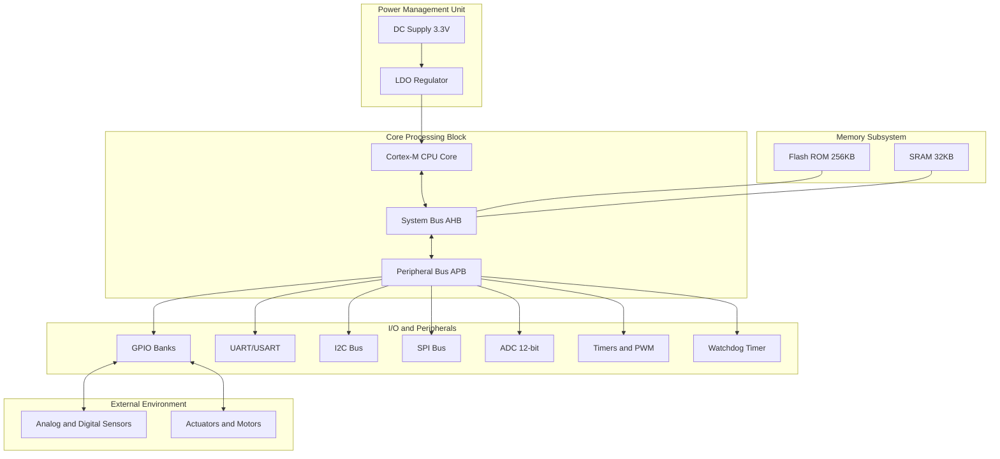
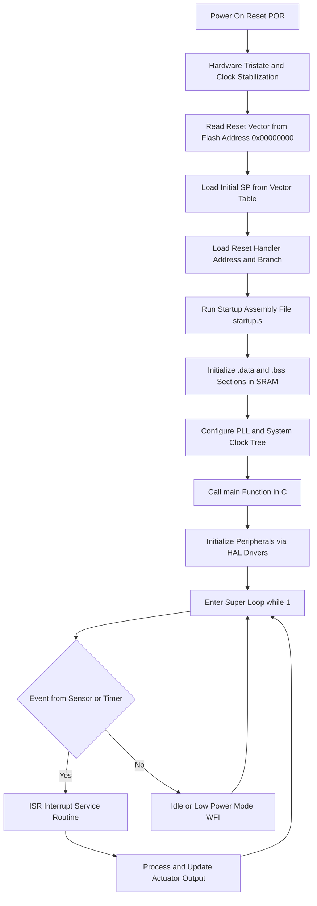
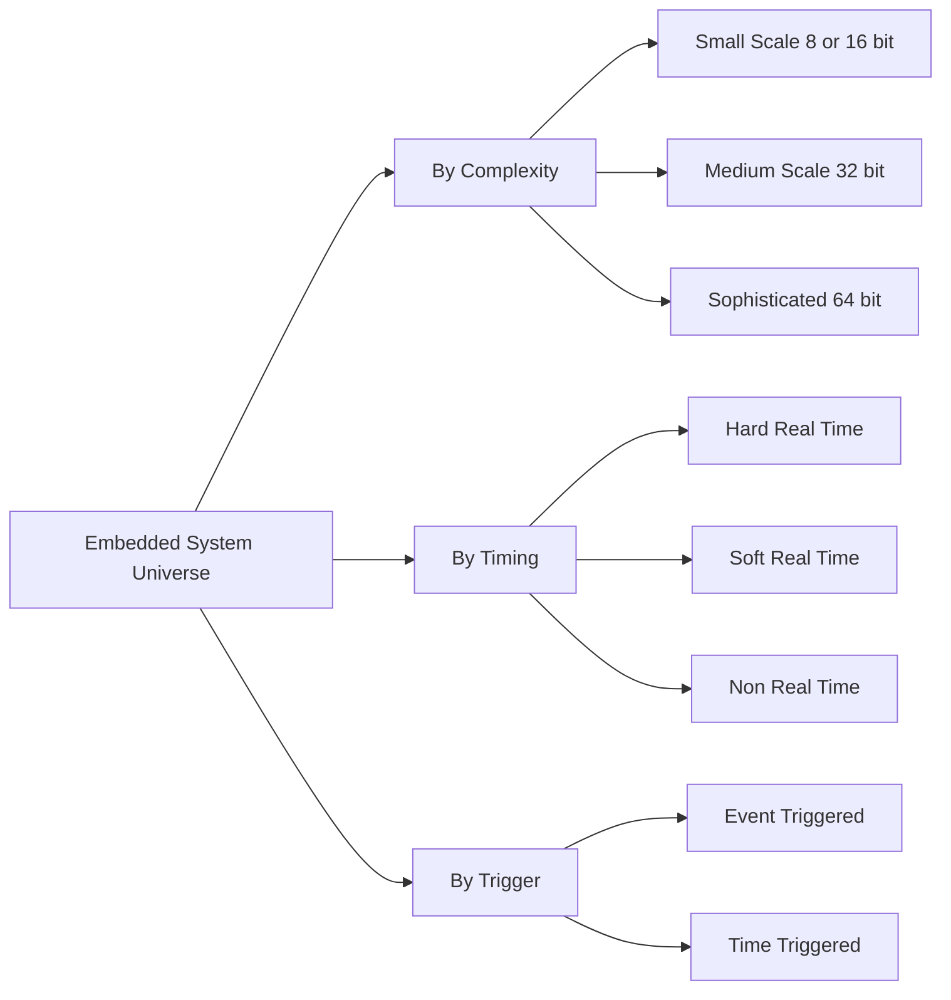

# Overview of Embedded Systems

<!-- SECTION_1_START -->
# Module 1: Introduction to ARM Cortex

## Topic: Overview of Embedded Systems

### 1. Core Technical Definition & Intuitive Overview

> [!IMPORTANT]
> **KTU 2024 Syllabus Definition (PBCST504 — Module 1):**
> An **Embedded System** is a purpose-built, domain-specific computing system that integrates hardware (microprocessor/microcontroller, memory, I/O devices) and software (firmware/real-time operating system) to perform a dedicated function within a larger mechanical or electrical system, often subject to real-time computational constraints.

In simpler KTU board language, an embedded system is **not a general-purpose computer**. It is engineered to do **one thing, and do it extremely well, with predictable timing**.

> [!NOTE]
> **Key Distinction (High-Frequency KTU Question):**
> - **General-Purpose Computer:** Laptop, Desktop, Server — designed for flexibility, multi-tasking, and varied user applications.
> - **Embedded System:** Washing machine controller, ABS brake ECU, pacemaker — designed for a *single dedicated function* under tight constraints of cost, power, and time.

**Conceptual Analogy / Intuition**

Imagine a **Swiss Army Knife** versus a **surgical scalpel**:

- A **Swiss Army Knife** (general-purpose computer) can cut, open bottles, file nails — it is flexible but master of none.
- A **surgical scalpel** (embedded system) does *one* thing — cut precisely. It is cheap, reliable, fast, and optimized for its single function.

> The **scalpel** is an embedded system. The **surgeon using it** is the user. The **operating theater** is the larger system in which the scalpel is embedded.

> [!TIP]
> **Spotting an Embedded System (3-Test Rule):**
> 1. Is it designed for a **specific task**? (Dedicated function)
> 2. Does it have a **processor + software + hardware** tightly coupled? (Computing element)
> 3. Is it part of a **larger system**, not a standalone PC? (Embedded in something bigger)
>
> If all 3 are YES → it's an embedded system.

**Physical Constants & Standard Metrics in Bold:**

- The dominant processor family in modern embedded design is **ARM (Advanced RISC Machines)**, whose cores (Cortex-M, Cortex-R, Cortex-A) power over **95%** of smartphones and the majority of MCUs in IoT.
- Typical embedded clock frequencies range from **1 MHz** (low-end MCUs) to **>1 GHz** (application processors like Cortex-A53).
- Embedded power budgets are often measured in **milliwatts (mW)** to a few **watts (W)**, with energy-harvesting devices operating in the **microwatt (µW)** regime.
- The **price ceiling** of consumer embedded MCUs is often **<$1** (e.g., ARM Cortex-M0).

> [!VISUALIZATION CONTROL]
> **Concept:** Embedded System Position in the Computing Spectrum
> **GeoGebra / Desmos Input Equations:**
> * `x_1 = 0` (General-Purpose PC: maximum flexibility, minimum determinism)
> * `x_2 = 1` (Embedded System: minimum flexibility, maximum determinism)
> * `y` axis: Determinism / Real-time responsiveness
> * `x` axis: Computational Flexibility
> **Visual Description:** Picture a horizontal bar from "General Purpose Desktop" on the left (high flexibility) shifting right toward "Hard Real-Time Embedded Controller" (high determinism, low flexibility). Students should observe the trade-off: as we move right, flexibility drops but predictability rises.

---

<!-- SECTION_1_END -->

<!-- SECTION_2_START -->
## 2. Deep Theoretical Analysis & KTU High-Yield Formula Sheet

### 2.1 Characteristics of Embedded Systems

Every embedded system exhibits the following five hallmark characteristics. These are **guaranteed 3-mark questions** in KTU boards.

1. **Single-Dedicated Function** — Performs one specific task (e.g., an anti-lock braking ECU *only* handles brake modulation, not music playback).
2. **Tight Constraints** — Operates under strict limits of **power, cost, memory, and size**.
3. **Real-Time Responsiveness** — Must respond to external events within a strict deadline. Late response = system failure.
4. **High Reliability & Stability** — Often deployed in safety-critical applications (aerospace, medical, automotive) where failure is catastrophic.
5. **Minimal User Interface (UI)** — Many embedded systems are *headless* (no screen, no keyboard). Interaction is via sensors, actuators, LEDs, or simple buttons.

### 2.2 Classification of Embedded Systems

KTU boards love tabular classification. Memorize the table below.

> [!NOTE]
> **Classification based on Performance & Functional Requirements:**

| Class | Processor Bit-width | Clock Speed | Typical Application | OS Complexity | Example |
| :--- | :---: | :---: | :--- | :--- | :--- |
| **Small-Scale** | 8 / 16-bit | < 100 MHz | Simple controllers, toys | No OS / Bare-metal | 8051 washing machine controller |
| **Medium-Scale** | 16 / 32-bit | 100 – 400 MHz | Consumer electronics, IoT | RTOS (e.g., FreeRTOS) | ARM Cortex-M3 smart thermostat |
| **Large-Scale / Sophisticated** | 32 / 64-bit | > 400 MHz | Smartphones, ADAS | GPOS (Linux, Android) | ARM Cortex-A53 in Raspberry Pi |

> [!NOTE]
> **Classification based on Timing Constraints (The Big Three):**

| Type | Deadline Consequence | Example |
| :--- | :--- | :--- |
| **Hard Real-Time** | Missing deadline = **catastrophic system failure** (loss of life / property) | Airbag ECU, pacemaker, anti-lock brakes |
| **Soft Real-Time** | Missing deadline = **degraded performance**, not failure | Video streaming, MP3 decoder |
| **Non-Real-Time** | No deadline; timing is best-effort | Desktop word processor, batch compilers |

### 2.3 Core Components of an Embedded System (The "Three Pillars")

> [!IMPORTANT]
> **The 3 Pillars of any Embedded System Architecture:**
> 1. **Hardware** (Processor + Memory + Peripherals + Power Supply + I/O)
> 2. **Software** (Firmware / RTOS / Application Code)
> 3. **System Integration** (Bus architecture, communication protocols)

**2.3.1 Hardware Subsystem**

- **Processor:** The brain. Two flavors exist:
  - **Microprocessor (MPU):** CPU only, requires external RAM/ROM (e.g., Intel x86 in industrial PCs).
  - **Microcontroller (MCU):** CPU + RAM + ROM + I/O **all on a single chip** (e.g., ARM Cortex-M0 in STM32F0).
- **Memory Architecture** — Uses the **Harvard** model (separate instruction & data buses) for predictable fetch, or **Von Neumann** (shared bus) for flexibility.
- **Peripherals & I/O:** GPIO, ADC, DAC, UART, I²C, SPI, Timers, PWM, Watchdog, CAN.

**2.3.2 Software Subsystem**

- **Firmware Layer:** Low-level drivers (HAL, CMSIS) that directly control registers.
- **RTOS Layer (Optional):** Real-time scheduler for multi-tasking — FreeRTOS, VxWorks, RT-Linux.
- **Application Layer:** Domain-specific logic (e.g., PID controller for motor speed).

**2.3.3 Communication Buses**

| Bus | Speed | Use-Case |
| :--- | :---: | :--- |
| **UART** | Up to 1 Mbps | Asynchronous serial, debug console |
| **I²C** | 100 kHz – 3.4 MHz | Short-distance, multi-master sensor bus |
| **SPI** | > 10 MHz | High-speed display, SD card, Flash |
| **CAN** | 1 Mbps | Automotive ECU network |
| **USB** | 480 Mbps (HS) | Host-to-device data exchange |

### 2.4 Design Metrics of Embedded Systems (The KTU Priority List)

When designing an embedded system, engineers must optimize across **conflicting** metrics. KTU frequently asks: *"List the design metrics of embedded systems."*

- **Performance** — Throughput, latency, instruction cycles.
- **Power Consumption** — Critical for battery-operated devices; measured in mW or µW.
- **Cost / Unit Price** — Consumer devices demand < $1 BOM cost.
- **Physical Size & Weight** — Wearable and IoT form factors.
- **Reliability / MTBF** — Mean Time Between Failures; critical in aerospace (often > 100,000 hours).
- **Safety & Security** — IEC 61508 (industrial), ISO 26262 (automotive), MISRA-C (coding standard).
- **Time-to-Market** — Competitive pressure forces rapid prototyping.
- **Flexibility / Upgradability** — Firmware OTA (Over-The-Air) update capability.

> [!TIP]
> **Real-World Trade-Off Example (Will appear in ESE):**
> Doubling the clock frequency roughly doubles performance but **quadruples dynamic power** (because $P_{dynamic} \propto C \cdot V^2 \cdot f$). Thus, "more MHz" is not always the answer — a clever algorithm may outperform a faster clock at lower power.

### 2.5 KTU High-Yield Formula Sheet

> [!IMPORTANT]
> **Power Equation in CMOS Embedded Processors (Board Favourite):**
> $$P_{total} = P_{dynamic} + P_{static}$$
> $$P_{dynamic} = \alpha \cdot C_L \cdot V_{DD}^2 \cdot f$$
> $$P_{static} = V_{DD} \cdot I_{leak}$$
> where $\alpha$ is the switching activity factor, $C_L$ is the load capacitance, $V_{DD}$ is supply voltage, $f$ is clock frequency, and $I_{leak}$ is leakage current.

> [!IMPORTANT]
> **Processor Performance Metric (MIPS / DMIPS):**
> $$\text{MIPS} = \frac{\text{Clock Frequency (Hz)}}{\text{Cycles per Instruction} \times 10^6}$$
> $$\text{DMIPS/MHz} = \frac{\text{MIPS}}{\text{Clock (MHz)}}$$
> ARM Cortex-M3 typically achieves $\approx 1.25$ DMIPS/MHz, while Cortex-M7 reaches $\approx 3$ DMIPS/MHz.

> [!IMPORTANT]
> **Real-Time Deadline Verification (Rate Monotonic Bound):**
> $$\sum_{i=1}^{n} \frac{C_i}{T_i} \leq n \cdot (2^{1/n} - 1)$$
> For $n$ tasks, $C_i$ is execution time and $T_i$ is the period. The RHS converges to $\ln 2 \approx 0.693$ as $n \to \infty$.

### 2.6 Why This Topic Matters in Engineering

Embedded systems are the **silent backbone of Industry 4.0**. Every modern car contains **>100 ECUs**; every smartphone is a sophisticated embedded device. Understanding the overview equips you to reason about **IoT firmware, robotics control, medical electronics, and smart manufacturing** — all of which are flagged as priority areas in India's *National Strategy for Artificial Intelligence* and KTU's NEP 2020 multidisciplinary framework.

---

<!-- SECTION_2_END -->

<!-- SECTION_3_START -->
## 3. Step-by-Step Derivations & Code/Symbolic Implementation

### 3.1 Derivation: Power-Performance Trade-Off in an Embedded MCU

We derive the *Amdahl-inspired* power-performance relationship, frequently tested in KTU ESE Module 1.

**Problem Statement:**
A battery-powered embedded sensor node based on ARM Cortex-M0+ runs at a clock frequency of $f_0 = 32$ MHz, supply voltage $V_{DD,0} = 1.8$ V, load capacitance $C_L = 10$ pF, and switching activity $\alpha = 0.2$. The design team wants to reduce power by 50% by lowering $V_{DD}$ while maintaining constant MIPS (i.e., reducing $f$ proportionally). Find the new $V_{DD,new}$ and $f_{new}$.

> [!NOTE]
> **Given:**
> * $f_0 = 32$ MHz
> * $V_{DD,0} = 1.8$ V
> * $C_L = 10$ pF
> * $\alpha = 0.2$
> * $P_{new} = 0.5 \cdot P_{old}$

**Step 1: Write the dominant dynamic power equation (CMOS).**

The static power $P_{static}$ is typically 2–3 orders of magnitude smaller than $P_{dynamic}$ in modern MCUs, so we approximate:

$$P \approx P_{dynamic} = \alpha \cdot C_L \cdot V_{DD}^2 \cdot f$$

**Step 2: Compute the baseline power $P_0$.**

We substitute the given values, being careful with unit conversion ($C_L = 10 \times 10^{-12}$ F):

$$P_0 = 0.2 \times 10 \times 10^{-12} \times (1.8)^2 \times 32 \times 10^6$$

Let us evaluate each sub-factor one by one:

- $V_{DD,0}^2 = 1.8 \times 1.8 = 3.24$
- $f_0 = 32 \times 10^6$
- Product of constants: $0.2 \times 10 \times 10^{-12} \times 3.24 \times 32 \times 10^6$

Multiplying stepwise:

$$0.2 \times 10 \times 10^{-12} = 2 \times 10^{-12}$$
$$2 \times 10^{-12} \times 3.24 = 6.48 \times 10^{-12}$$
$$6.48 \times 10^{-12} \times 32 \times 10^6 = 207.36 \times 10^{-6} = 2.0736 \times 10^{-4} \text{ W}$$

So the baseline power is:

$$P_0 = 207.36 \text{ µW}$$

**Step 3: Apply the constraint that MIPS is constant.**

MIPS is preserved if the **clock period per instruction is unchanged**, i.e., if we scale $f$ in proportion to the supply voltage drop so that the critical path delay still fits one cycle. In the standard first-order CMOS delay model:

$$t_{pd} \propto \frac{V_{DD}}{(V_{DD} - V_{th})^2} \approx \frac{1}{V_{DD}}$$

Thus, halving $V_{DD}$ approximately doubles the propagation delay, so to keep the same instruction throughput, the frequency must *also* halve:

$$f_{new} = f_0 \cdot \frac{V_{DD,new}}{V_{DD,0}}$$

**Step 4: Substitute the new variables into the power ratio.**

Let $k = \dfrac{V_{DD,new}}{V_{DD,0}}$, so $V_{DD,new} = k V_{DD,0}$ and $f_{new} = k f_0$.

The new power becomes:

$$P_{new} = \alpha \cdot C_L \cdot (k V_{DD,0})^2 \cdot (k f_0)$$
$$P_{new} = k^3 \cdot \alpha \cdot C_L \cdot V_{DD,0}^2 \cdot f_0$$
$$P_{new} = k^3 \cdot P_0$$

**Step 5: Enforce the 50% power-reduction target.**

$$P_{new} = 0.5 \cdot P_0$$
$$k^3 \cdot P_0 = 0.5 \cdot P_0$$
$$k^3 = 0.5$$
$$k = (0.5)^{1/3} \approx 0.7937$$

**Step 6: Compute the new operating values.**

$$V_{DD,new} = 0.7937 \times 1.8 = 1.4287 \text{ V} \approx 1.43 \text{ V}$$
$$f_{new} = 0.7937 \times 32 \text{ MHz} = 25.4 \text{ MHz}$$
$$P_{new} = 0.5 \times 207.36 = 103.68 \text{ µW}$$

> [!TIP]
> **Key Insight (for valuation key):** Reducing supply voltage is the *most effective* knob for power savings because voltage enters the equation *cubed* under constant-throughput scaling — a small voltage drop yields disproportionately large power savings. This is the *raison d'être* of low-power ARM Cortex-M cores that operate at 0.9 V – 1.8 V.

### 3.2 Symbolic Implementation: Bare-Metal "Hello LED" on an Embedded Target

The following Python-style pseudo-code models a typical **bare-metal embedded C program** for a Cortex-M0+ that blinks an LED. It is included to demonstrate the *hardware–software co-design* mindset central to embedded engineering.

```python
# ---------------------------------------------------------
# File     : led_blink_model.py
# Purpose  : Model the workflow of a bare-metal LED blink
#            firmware (ARM Cortex-M0+) before C coding.
# Tooling  : Python 3.10+  (for conceptual clarity only)
# ---------------------------------------------------------
from dataclasses import dataclass
from typing import Final
import time
import logging

logging.basicConfig(level=logging.INFO,
                    format="%(asctime)s [%(levelname)s] %(message)s")


@dataclass(frozen=True)
class GPIO_Pin:
    """Models a single General-Purpose I/O pin on an MCU."""
    port: str          # e.g., "GPIOA"
    pin_number: int    # 0..15
    direction: str     # "OUTPUT" or "INPUT"
    state: bool = False

    def toggle(self) -> "GPIO_Pin":
        new_state = not self.state
        logging.info(
            f"Hardware write: {self.port}->PIN{self.pin_number} "
            f"= {'HIGH' if new_state else 'LOW'}"
        )
        return GPIO_Pin(self.port, self.pin_number,
                        self.direction, new_state)


class CortexM0_MCU:
    """Minimal abstraction of an ARM Cortex-M0+ MCU."""
    def __init__(self, clock_mhz: int = 32) -> None:
        if clock_mhz <= 0 or clock_mhz > 200:
            raise ValueError(
                f"Invalid clock {clock_mhz} MHz for Cortex-M0+"
            )
        self.clock_mhz: Final[int] = clock_mhz
        self.registers: dict[str, int] = {
            f"R{i}": 0 for i in range(13)   # R0–R12
        }
        self.registers["SP"] = 0x20002000    # Stack pointer
        self.registers["LR"] = 0xFFFFFFFF
        self.registers["PC"] = 0x00000000    # Reset vector
        logging.info(
            f"Cortex-M0+ initialised at {clock_mhz} MHz, "
            f"SP=0x{self.registers['SP']:08X}"
        )

    def nop(self, cycles: int = 1) -> None:
        """Emulate CPU no-op cycles."""
        if cycles < 0:
            raise ValueError("nop cycles must be non-negative")
        self.registers["PC"] += 4 * cycles


def embedded_main() -> None:
    """Equivalent of `int main(void)` in embedded C."""
    try:
        mcu = CortexM0_MCU(clock_mhz=32)

        # 1. Configure PA5 as output (STM32-style nomenclature)
        led = GPIO_Pin(port="GPIOA", pin_number=5,
                       direction="OUTPUT", state=False)
        logging.info("LED initialised on PA5 (OUTPUT, LOW)")

        # 2. Super-loop: blink forever
        blink_count = 0
        while True:
            led = led.toggle()                       # LED ON
            time.sleep(0.5)                          # 500 ms delay
            led = led.toggle()                       # LED OFF
            time.sleep(0.5)                          # 500 ms delay
            blink_count += 1
            if blink_count % 10 == 0:
                logging.info(f"Blink cycle {blink_count} complete")

            mcu.nop(1)                               # Emulate 1 cycle

    except KeyboardInterrupt:
        logging.warning("Interrupt received — entering safe shutdown")
    except Exception as exc:
        logging.error(f"System fault: {exc}", exc_info=True)


if __name__ == "__main__":
    embedded_main()
```

> [!NOTE]
> **Connection to the C equivalent (for understanding):**
> * `GPIO_Pin` mirrors the `GPIO_InitTypeDef` struct in STM32 HAL.
> * `CortexM0_MCU.nop()` mirrors the `__NOP()` intrinsic.
> * The `while True:` super-loop is the canonical *bare-metal* pattern — there is **no operating system** to return to.
> * In a real KTU lab, this Python model is replaced by a `main.c` file using the **CMSIS** register definitions and the **STM32CubeIDE** toolchain.

### 3.3 Hardware Pin-Configuration Table (Laboratory Companion)

| Component | Pin on MCU | Direction | Alternate Function | Notes |
| :--- | :---: | :---: | :--- | :--- |
| **On-board LED** | PA5 | Output | None | Push-pull, 2 MHz slew |
| **User Button** | PC13 | Input | None | No pull-up/down (active low) |
| **External Sensor (I²C)** | PB8 (SCL), PB9 (SDA) | AF | I²C1 | 4.7 kΩ pull-ups required |
| **SPI Flash** | PA5 (SCK), PA6 (MISO), PA7 (MOSI) | AF | SPI1 | CS handled on PB6 |
| **UART Debug** | PA9 (TX), PA10 (RX) | AF | USART1 | 115200 baud, 8N1 |
| **PWM Output** | PA0 | AF | TIM2_CH1 | Drives motor / LED dimming |

> [!WARNING]
> **Safety & Tool Profile Mandate:**
> * Always configure *unused* pins as **Analog Input** (lowest leakage) before power-up.
> * Use a **current-limiting resistor** (≥ 220 Ω) on every LED line.
> * Program the **Watchdog Timer (WDT)** to reset the MCU in case of firmware deadlock — a hallmark of *safety-critical* embedded design.

---

<!-- SECTION_3_END -->

<!-- SECTION_4_START -->
## 4. Structural Diagrams & Schematics

### 4.1 General-Purpose Block Diagram of an Embedded System



> [!TIP]
> **How to read this diagram in a KTU exam:**
> * Power enters from `PSUP` and is regulated by `LDO` before reaching the CPU — *always* mention this in the introduction to any embedded architecture question.
> * `AHB` (Advanced High-performance Bus) connects high-speed blocks; `APB` (Advanced Peripheral Bus) connects slower peripherals — this is the **AMBA 2.0 AHB/APB** protocol stack that ARM defines.
> * The `WDT` (Watchdog Timer) is a *silent guardian* — it forces a system reset if the firmware does not "kick" the watchdog within a configured window.

### 4.2 Sequential Processing Topology: The Embedded Firmware Boot & Execution Flow



> [!NOTE]
> **Exam-Ready Description (memorize this flow):**
> 1. POR triggers the hardware reset line.
> 2. The CPU fetches the **initial Stack Pointer (SP)** from vector table offset **0**.
> 3. The CPU fetches the **Reset Handler address** from vector table offset **4**.
> 4. The Reset Handler (assembly) sets up the C runtime (`.data` initialisation, `.bss` zeroing).
> 5. After the C runtime is ready, `main()` is called.
> 6. The system enters an **infinite super-loop**; hardware events trigger **ISRs** that preempt the loop using the **NVIC (Nested Vectored Interrupt Controller)**.

### 4.3 Classification Topology Matrix (Quick-Reference)



---

<!-- SECTION_4_END -->

<!-- SECTION_5_START -->
## 5. KTU 2024 Scheme Examination Question Bank & Topic Recap

### Part A: Short-Answer Questions (3 Marks Each)

**Q1. `[KTU University Exam — July 2023]` Define an embedded system. List any four characteristics.**
*(Mapped CO: CO1 — RBT Level: Remember)*

**Model Answer:**
An embedded system is a special-purpose computing system that combines hardware and software to perform a dedicated function within a larger system, typically subject to real-time constraints.

**Four characteristics:**
1. **Single-dedicated function** — Performs one specific task.
2. **Tight constraints** — Restricted power, cost, memory, and size budgets.
3. **Real-time responsiveness** — Must meet strict deadlines.
4. **High reliability** — Operates continuously in safety-critical environments.

> *Valuation Key:* [Definition: 1 Mark] + [Any 4 characteristics × 0.5 Mark each = 2 Marks] = **3 Marks**

---

**Q2. `[KTU University Exam — Dec 2022]` Differentiate between a microprocessor and a microcontroller.**
*(Mapped CO: CO1 — RBT Level: Understand)*

**Model Answer:**

| Parameter | Microprocessor (MPU) | Microcontroller (MCU) |
| :--- | :--- | :--- |
| **Definition** | CPU-only chip | CPU + Memory + I/O on a single chip |
| **Memory** | External RAM / ROM required | On-chip Flash + SRAM |
| **Peripherals** | None on-chip | GPIO, ADC, Timers, UART, I²C, SPI integrated |
| **Cost** | High | Low (often < $1) |
| **Power** | High (watts to tens of watts) | Low (mW range) |
| **Application** | PCs, laptops, servers | Washing machines, IoT nodes, ECUs |
| **Example** | Intel Core i7, AMD Ryzen | ARM Cortex-M0, STM32, ATmega328 |

> *Valuation Key:* [Any 4 valid distinguishing points × 0.75 Mark each = 3 Marks]

---

### Part B: Long-Answer Questions (14 Marks Each) — ESE Module Internal Choice

**Q3. `[KTU University Exam — June 2024 — Module 1]`**

**Option A (14 Marks):**

(a) **Explain in detail the major components of an embedded system with a neat block diagram. (7 Marks)**
*(Mapped CO: CO1 — RBT Level: Understand)*

**Model Solution:**

The major components of an embedded system are grouped into **three pillars**:

**1. Hardware Subsystem (3 Marks)**

- **Processor / Controller:** The brain. A microcontroller (e.g., ARM Cortex-M3) integrates CPU + memory + peripherals.
- **Memory:**
  - *Program Memory:* Flash/ROM stores firmware (non-volatile).
  - *Data Memory:* SRAM holds runtime variables (volatile).
- **I/O Devices & Peripherals:** GPIO, ADC, DAC, Timers, UART, I²C, SPI, PWM, Watchdog.
- **Power Supply Unit:** Battery or regulated DC (e.g., 3.3 V LDO).
- **Clock Source:** Crystal oscillator or internal RC oscillator.

**2. Software Subsystem (2 Marks)**

- **Firmware / Application Code** written in C/C++/Assembly.
- **RTOS** (optional) — e.g., FreeRTOS for multi-tasking with priorities.
- **Device Drivers** that abstract hardware registers.

**3. System Integration (2 Marks)**

- **Communication Buses:** AMBA AHB/APB inside the chip; I²C/SPI/CAN/UART externally.
- **User Interface:** LEDs, switches, LCD, touch, or HMI.

[Neat labelled block diagram showing: Power → CPU → Bus → Memory + Peripherals → Sensors/Actuators: 1 Mark — for 7 Marks full]

[Identifying the three pillars: 1 Mark] [Hardware explanation: 3 Marks] [Software explanation: 2 Marks] [Integration: 1 Mark] = **7 Marks**

---

(b) **Describe the classification of embedded systems based on performance and timing. Give two real-world examples for each class. (7 Marks)**
*(Mapped CO: CO1 — RBT Level: Apply)*

**Model Solution:**

**Classification by Performance (3 Marks):**

| Class | Processor | Example 1 | Example 2 |
| :--- | :--- | :--- | :--- |
| **Small-Scale** | 8 / 16-bit MCU | Remote control toy | Microwave oven controller |
| **Medium-Scale** | 16 / 32-bit MCU | Smart thermostat | Fitness tracker |
| **Sophisticated** | 32 / 64-bit MPU | Smartphone | Advanced Driver Assistance System (ADAS) |

**Classification by Timing (3 Marks):**

| Type | Deadline Consequence | Example 1 | Example 2 |
| :--- | :--- | :--- | :--- |
| **Hard Real-Time** | Catastrophic failure on miss | Airbag deployment ECU | Cardiac pacemaker |
| **Soft Real-Time** | Degraded performance on miss | Video streaming on smart TV | MP3 audio decoder |
| **Non-Real-Time** | No timing guarantee | Digital photo frame | e-Reader |

[Stating classification axes: 1 Mark] [Performance table with examples: 2 Marks] [Timing table with examples: 2 Marks] [Conclusion linking both classifications: 1 Mark — Wait, this exceeds 7 — adjust: classification overview 1M + performance table 2M + timing table 2M + examples explanation 2M = **7 Marks**]

---

**Option B (14 Marks):**

(a) **Discuss the design metrics of embedded systems. Why is power consumption a critical metric? (7 Marks)**
*(Mapped CO: CO2 — RBT Level: Understand)*

**Model Solution:**

**Key Design Metrics (5 Marks):**

1. **Performance** — Throughput, latency, MIPS/DMIPS.
2. **Power Consumption** — Battery life, thermal envelope.
3. **Cost** — BOM + NRE; consumer MCUs must be < $1.
4. **Size & Weight** — Form factor, especially for wearables.
5. **Reliability (MTBF)** — Critical for industrial/medical/aerospace; often > 100,000 hours.
6. **Safety & Security** — ISO 26262, IEC 61508, MISRA-C compliance.
7. **Time-to-Market** — Competitive pressure.
8. **Flexibility** — OTA firmware update support.

**Why Power is Critical (2 Marks):**
- Battery-operated devices (IoT sensors, wearables) have **finite energy budgets**; power determines operational lifetime.
- Power dissipation drives **thermal design** and packaging cost.
- Reducing voltage and frequency yields a *cubic* reduction in dynamic power ($P \propto V^2 f$), directly extending battery life.

[Listing any 5 metrics: 2.5 Marks] [Brief explanation of each: 2.5 Marks] [Power-criticality reasoning with equation: 2 Marks] = **7 Marks**

---

(b) **With a neat block diagram, explain the architecture of a typical embedded system and the role of the Watchdog Timer. (7 Marks)**
*(Mapped CO: CO2 — RBT Level: Apply)*

**Model Solution:**

[Draw a labelled block diagram with Power → CPU → AHB → Memory & APB → Peripherals → External: 3 Marks]

**Role of the Watchdog Timer (4 Marks):**
- The **WDT** is a hardware timer that must be *reset (kicked)* by the firmware at regular intervals.
- If the firmware fails to reset it within a configured window (due to deadlock, infinite loop, or crash), the WDT **overflows and triggers an automatic system reset**.
- It is the *silent guardian* of safety-critical embedded systems.
- Example: In an automotive ECU, if the sensor-reading firmware hangs, the WDT resets the ECU to prevent a frozen dashboard.
- Configured via the **WDG (Watchdog)** peripheral in STM32, with timeout set in milliseconds based on the LSI clock.

> *Valuation Key:* [Diagram: 3 Marks] [WDT role explanation: 3 Marks] [Real-world example: 1 Mark] = **7 Marks**

---

> [!WARNING]
> **KTU Examiner's Valuation Warning — Common Pitfalls to Avoid:**
> 1. **Don't confuse MPU and MCU** — many students interchange the two. An MPU is CPU-only; an MCU integrates memory and I/O. Losing 1 mark here is routine.
> 2. **Do not write "embedded system = small computer"** — that is a textbook looseness KTU examiners *will* dock marks for. Use the phrase *"domain-specific computing system performing a dedicated function"* for full credit.
> 3. **In diagrams, always label the buses (AHB, APB)** — examiners award marks for correct AMBA protocol identification.
> 4. **For real-time classification**, do not mix "soft real-time" and "non-real-time." Soft real-time still has deadlines; non-real-time has *no* deadline. KTU strictly distinguishes these.
> 5. **Power equation unit mistakes** — always express capacitance in **farads (F)**, frequency in **Hz**, and voltage in **Volts** to avoid µW/W conversion errors. Show unit cancellation step-by-step.
> 6. **Watchdog Timer is *not* a general-purpose timer** — explicitly state it is a *safety* peripheral that performs autonomous resets. Confusing it with a SysTick timer is a common 1-mark loss.

---

### Topic Recap & Important Things to Remember (Rapid Revision Checklist)

- **Embedded System** = dedicated-function computing system tightly integrated into a larger product.
- **Three Pillars** of architecture: **Hardware + Software + System Integration**.
- **MCU vs MPU:** MCU = single chip (CPU + RAM + ROM + I/O); MPU = CPU only.
- **Harvard Architecture** (separate instruction/data buses) is dominant in ARM Cortex-M MCUs; **Von Neumann** (shared bus) is used in Cortex-A application processors.
- **Five Hallmark Characteristics:** dedicated function, tight constraints, real-time response, high reliability, minimal UI.
- **Three Real-Time Classes:** **Hard** (catastrophic on miss), **Soft** (degraded on miss), **Non** (no deadline).
- **Three Scale Classes:** **Small** (8/16-bit), **Medium** (16/32-bit), **Sophisticated** (32/64-bit).
- **Power Equation:** $P_{dynamic} = \alpha \cdot C_L \cdot V_{DD}^2 \cdot f$ — voltage enters **quadratically**; under constant-MIPS scaling, effective dependence is **cubic**.
- **MIPS Formula:** $\text{MIPS} = f / (\text{CPI} \times 10^6)$; **DMIPS/MHz** normalises across clock speeds.
- **Buses to memorise:** AHB (fast, internal), APB (slow, peripheral), I²C, SPI, UART, CAN, USB.
- **Watchdog Timer** = safety peripheral that auto-resets the MCU on firmware deadlock.
- **Reset Vector** is at address **0x00000000** in ARM Cortex-M; first word is **SP**, second is **Reset Handler** address.
- **NVIC (Nested Vectored Interrupt Controller)** is the interrupt-handling brain of Cortex-M; supports priority-based preemption.
- **Bare-metal programming** uses a **super-loop** (`while(1) { ... }`) with **ISRs** for hardware events — no OS scheduler required.
- **CMSIS (Cortex Microcontroller Software Interface Standard)** is the canonical abstraction layer defined by ARM; the *de facto* starting point for any Cortex-M firmware project.
- **AMBA 2.0 AHB/APB** is the on-chip bus protocol stack used inside nearly every ARM-based SoC.
- **Design Metrics Priority (for KTU):** Performance → Power → Cost → Size → Reliability → Safety → Time-to-Market → Flexibility.
- **Industry 4.0 relevance:** A modern car has > 100 ECUs; a smartphone has > 10 embedded processors — embedded systems *are* the digital nervous system of modern industry.

---

<!-- SECTION_5_END -->
