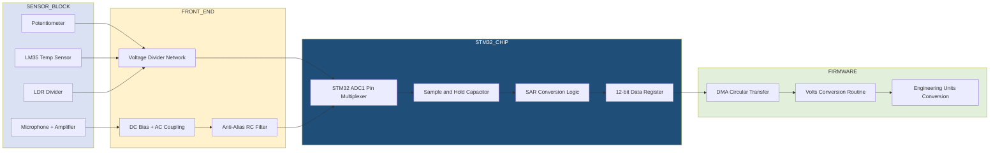
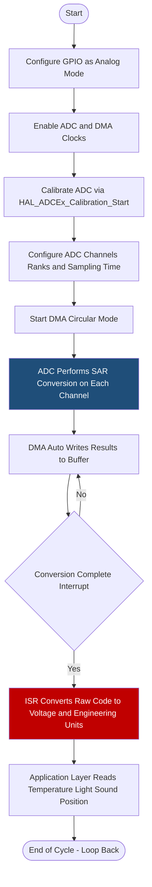
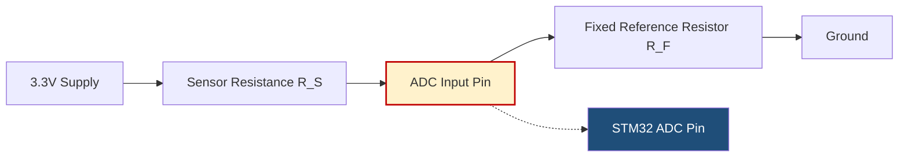

# Analog to Digital Conversion: Potentiometer, temperature sensor, LDR, Microphone

<!-- SECTION_1_START -->

# Analog to Digital Conversion on STM32 — Sensor Interfacing

> [!IMPORTANT]
> **KTU 2024 Scheme | PBCST504 | Module 2**
> This topic covers how STM32 microcontrollers convert real-world analog signals from common sensors (potentiometer, temperature sensor, LDR, microphone) into digital values using the on-chip Successive Approximation Register (SAR) ADC.

## 1.1 Formal Academic Definition

**Analog-to-Digital Conversion (ADC)** is the process of transforming a continuous-time, continuous-amplitude analog signal into a discrete-time, discrete-amplitude digital representation. The STM32 microcontrollers integrate a **12-bit Successive Approximation Register (SAR) ADC** that can operate in single-ended or differential mode, with a typical conversion time of about **1 µs** at a 14 MHz ADC clock.

In the KTU 2024 syllabus context, ADC interfacing with sensors means sampling the analog output of transducers (potentiometer, LM35/NTC thermistor, LDR, electret microphone) and mapping the sampled voltage into a digital code that the Cortex-M core can process.

## 1.2 Intuitive Analogy

Imagine a **flight of stairs built next to a smooth ramp**. The ramp is your analog signal — it can take any value between 0 V and 3.3 V. The stairs are the digital representation — there are only fixed steps you can stand on.

- The **height of each step** is the *resolution* — smaller steps (more bits) = a smoother, more accurate climb.
- The **total height of the staircase** is the *reference voltage* ($V_{REF}$).
- The **number of steps** is $2^{n} - 1$ where $n$ is the ADC resolution.

> [!NOTE]
> A **12-bit ADC** on STM32 has **4096** possible digital codes (0 to 4095). Each code corresponds to a tiny voltage slice of $V_{REF} / 4096 \approx 0.81\,\text{mV}$ when $V_{REF} = 3.3\,\text{V}$.

> [!VISUALIZATION CONTROL]
> **Concept:** ADC Transfer Function (linear staircase)
> **GeoGebra / Desmos Input Equations:**
> * `y = round(x / (3.3/4096)) * (3.3/4096)` for $x \in [0, 3.3]$
> * `y = x` overlay to show quantization error
> **Visual Description:** A staircase rising diagonally from origin to (3.3, 3.3). The diagonal straight line $y = x$ represents the ideal continuous signal; the steps represent the quantized digital output. The gap between the curve and the line at any point is the quantization error (at most ±0.5 LSB).

## 1.3 The Four Common Sensors at a Glance

| Sensor | Physical Quantity | Output Type | Typical Interface |
|---|---|---|---|
| **Potentiometer** | Shaft angle / position | Variable resistor (voltage divider) | 3-wire direct to ADC pin |
| **LM35 / NTC Thermistor** | Temperature | Analog voltage (or resistance) | ADC pin via divider |
| **LDR (Light Dependent Resistor)** | Light intensity | Variable resistance | ADC pin via divider |
| **Electret Microphone** | Sound pressure | Amplified AC audio | ADC pin via bias + amplifier |

> [!TIP]
> Three of the four sensors above (potentiometer, LDR, NTC thermistor) are inherently **resistive transducers**. To make them readable by an ADC, we convert the resistance change into a voltage change using a **voltage divider** circuit with a fixed reference resistor.

---

<!-- SECTION_1_END -->

<!-- SECTION_2_START -->

# Deep Theoretical Analysis & KTU High-Yield Formula Sheet

## 2.1 The SAR ADC Working Principle

The STM32 ADC uses a **Successive Approximation Register (SAR)** architecture:

1. The input voltage $V_{IN}$ is held by the internal sample-and-hold capacitor.
2. The internal DAC generates a trial voltage $V_{DAC}$ using a binary search algorithm.
3. A comparator checks whether $V_{DAC} > V_{IN}$.
4. The SAR register keeps or discards each bit from MSB to LSB in **N cycles** (where N = resolution in bits).
5. After 12 cycles for a 12-bit ADC, the final code is the digital equivalent of $V_{IN}$.

> [!IMPORTANT]
> Conversion time $T_{CONV} = (Sampling\,Time + 12.5) \times T_{ADCCLK}$
>
> With default $T_{ADCCLK} = 1/14\,\text{MHz} \approx 71.4\,\text{ns}$ and sampling time = **3 cycles**, $T_{CONV} \approx (3 + 12.5) \times 71.4\,\text{ns} \approx 1.1\,\mu\text{s}$.

## 2.2 The Fundamental ADC Equation

The single most important formula for KTU problems is:

$$
D = \left\lfloor \frac{V_{IN}}{V_{REF}} \times (2^{N} - 1) \right\rfloor
$$

Where:

- $D$ = digital output code (integer)
- $V_{IN}$ = analog input voltage (V)
- $V_{REF}$ = reference voltage, typically **$3.3\,\text{V}$** on STM32
- $N$ = ADC resolution, typically **12 bits** on STM32

### 2.2.1 Inverse Formula — Voltage Reconstruction

$$
V_{IN} = D \times \frac{V_{REF}}{2^{N} - 1}
$$

### 2.2.2 Quantization Step (LSB)

$$
\Delta V = \frac{V_{REF}}{2^{N}}
$$

For STM32 default: $\Delta V = 3.3 / 4096 \approx 0.806\,\text{mV}$.

## 2.3 KTU Formula Cheat Sheet

| Formula / Parameter | Expression | Typical Value on STM32 |
|---|---|---|
| Digital code from voltage | $D = \dfrac{V_{IN}}{V_{REF}} \times (2^{N}-1)$ | $N = 12$ |
| Voltage from digital code | $V_{IN} = D \times \dfrac{V_{REF}}{4095}$ | $V_{REF} = 3.3\,\text{V}$ |
| Resolution (step size) | $\Delta V = \dfrac{V_{REF}}{2^{N}}$ | $\approx 0.806\,\text{mV}$ |
| Conversion time | $T_{CONV} = (T_{S} + 12.5) \times T_{ADCCLK}$ | $\approx 1.1\,\mu\text{s}$ |
| LM35 sensitivity | $10\,\text{mV/}^{\circ}\text{C}$ | Linear, $0$–$100^{\circ}\text{C}$ |
| NTC Beta equation | $R_T = R_0 \times e^{\beta\left(\dfrac{1}{T} - \dfrac{1}{T_0}\right)}$ | $\beta \approx 3950$ |
| LDR resistance (light) | $R_{LDR} \downarrow$ as light $\uparrow$ | $1\,\text{k}\Omega$ (bright) to $1\,\text{M}\Omega$ (dark) |
| Voltage divider output | $V_{OUT} = V_{IN} \times \dfrac{R_2}{R_1 + R_2}$ | Sensor at $R_1$ or $R_2$ |

## 2.4 Why These Sensors? Engineering Use Cases

| Sensor | Real-world application |
|---|---|
| **Potentiometer** | Volume control knobs, joystick position feedback, manual trimmer setting in instruments |
| **LM35 / NTC** | HVAC thermostats, weather stations, battery thermal protection, wearable health monitors |
| **LDR** | Automatic street lights, camera exposure control, solar tracker sun-detection |
| **Microphone** | Voice-activated IoT, acoustic event detection, noise pollution monitoring, voice-controlled appliances |

> [!NOTE]
> **Production Insight:** In commercial embedded firmware, ADC readings from these sensors are usually **oversampled** and **averaged** in software (e.g., taking 64 or 256 samples) before being used by the control loop. This reduces the effective noise by a factor of $\sqrt{N}$ (where N is the oversampling count), giving the equivalent of extra bits of resolution.

---

<!-- SECTION_2_END -->

<!-- SECTION_3_START -->

# Step-by-Step Derivations, Worked Examples & Code Implementation

## 3.1 Worked Example 1 — Potentiometer Reading

### Problem
A $10\,\text{k}\Omega$ potentiometer is connected between **3.3 V** and **GND**, with the wiper connected to **PA0** (ADC1 Channel 0). The STM32 reads a digital value of **$2780$**. Find the wiper voltage and the equivalent resistance of the lower section of the potentiometer.

### Solution

**Step 1** — Apply the inverse ADC formula:

$$
V_{IN} = D \times \frac{V_{REF}}{4095}
$$

$$
V_{IN} = 2780 \times \frac{3.3}{4095}
$$

**Step 2** — Compute:

$$
V_{IN} = 2780 \times 0.000806\,\text{V/code}
$$

$$
V_{IN} = 2.240\,\text{V}
$$

**Step 3** — Voltage divider relation (lower section $R_{lower}$ to GND):

$$
V_{IN} = 3.3 \times \frac{R_{lower}}{10000}
$$

$$
R_{lower} = \frac{V_{IN}}{3.3} \times 10000 = \frac{2.240}{3.3} \times 10000
$$

$$
R_{lower} \approx 6788\,\Omega
$$

**Valuation Key Points:**

- [Inverse formula correctly cited: 2 Marks]
- [Numerical substitution shown: 1 Mark]
- [Final $V_{IN} = 2.24\,\text{V}$ and $R_{lower} = 6.79\,\text{k}\Omega$: 2 Marks]

---

## 3.2 Worked Example 2 — LM35 Temperature Sensor

### Problem
An **LM35** temperature sensor outputs an analog voltage to **PA1** (ADC1 Channel 1). The STM32 returns a digital value of **$D = 1500$** with $V_{REF} = 3.3\,\text{V}$. Determine the temperature in °C.

### Solution

**Step 1** — Convert digital code to voltage:

$$
V_{IN} = 1500 \times \frac{3.3}{4095} = 1.209\,\text{V}
$$

**Step 2** — Apply LM35 linear transfer function (sensitivity = $10\,\text{mV/}^{\circ}\text{C}$):

$$
T = \frac{V_{IN}}{0.01}
$$

$$
T = \frac{1.209}{0.01} = 120.9^{\circ}\text{C}
$$

**Step 3** — Validity check:

> [!WARNING]
> The LM35 in its basic TO-92 package is rated for $0$–$100^{\circ}\text{C}$ (output $0$–$1\,\text{V}$). A reading of $120.9^{\circ}\text{C}$ indicates the sensor is **saturated** or out of range. For high temperatures, the **LM35DZ** range ends here; use **PT100** or **MAX6675** thermocouples for higher ranges.

**Final Answer (assuming valid range):** $T = 120.9^{\circ}\text{C}$ (or, if out of range, return the saturation flag).

---

## 3.3 Worked Example 3 — NTC Thermistor via Voltage Divider

### Circuit

A $10\,\text{k}\Omega$ NTC thermistor is placed in the **top** half of a divider with a $10\,\text{k}\Omega$ fixed resistor pulled to GND. $V_{CC} = 3.3\,\text{V}$. The ADC reads $D = 3200$.

### Solution

**Step 1** — Reconstruct $V_{IN}$:

$$
V_{IN} = 3200 \times \frac{3.3}{4095} = 2.579\,\text{V}
$$

**Step 2** — Solve divider for $R_{NTC}$:

$$
V_{IN} = 3.3 \times \frac{R_{fixed}}{R_{NTC} + R_{fixed}}
$$

$$
R_{NTC} = R_{fixed} \times \left(\frac{3.3}{V_{IN}} - 1\right)
$$

$$
R_{NTC} = 10000 \times \left(\frac{3.3}{2.579} - 1\right) = 10000 \times (1.2795 - 1) = 2795\,\Omega
$$

**Step 3** — Compute temperature using the Beta equation (with $R_0 = 10000\,\Omega$ at $T_0 = 298.15\,\text{K}$, $\beta = 3950$):

$$
\frac{1}{T} = \frac{1}{T_0} + \frac{1}{\beta}\ln\left(\frac{R_0}{R_{NTC}}\right)
$$

$$
\frac{1}{T} = \frac{1}{298.15} + \frac{1}{3950}\ln\left(\frac{10000}{2795}\right)
$$

$$
\frac{1}{T} = 0.003354 + 0.000253 \times 1.274 = 0.003354 + 0.000322 = 0.003676
$$

$$
T = 272.0\,\text{K} = -1.15^{\circ}\text{C}
$$

This corresponds to a cold environment — consistent with the NTC resistance being *lower* than $R_0$.

---

## 3.4 Worked Example 4 — LDR Light Sensor

### Circuit
LDR between **3.3 V** and **PA2** (ADC Channel 2). A $10\,\text{k}\Omega$ pull-down to GND. ADC reading = **$100$**.

### Solution

**Step 1** — Voltage:

$$
V_{IN} = 100 \times \frac{3.3}{4095} = 0.0806\,\text{V}
$$

**Step 2** — LDR resistance:

$$
V_{IN} = 3.3 \times \frac{10000}{R_{LDR} + 10000}
$$

$$
R_{LDR} = 10000 \times \left(\frac{3.3}{0.0806} - 1\right) = 10000 \times (40.94 - 1) \approx 399.4\,\text{k}\Omega
$$

**Step 3** — Interpretation: $R_{LDR} \approx 400\,\text{k}\Omega$ indicates **dim ambient light** (typical dark-room value).

---

## 3.5 Worked Example 5 — Electret Microphone (Envelope Detection)

### Setup
A MAX9814 microphone amplifier output is connected to **PA3** with a DC bias of $1.25\,\text{V}$ and AC swing of $\pm 0.6\,\text{V}$. The STM32 samples at $44.1\,\text{kHz}$ and the averaged (DC) value reads $D = 2050$.

### Solution

**Step 1** — Average DC voltage:

$$
V_{DC} = 2050 \times \frac{3.3}{4095} = 1.651\,\text{V}
$$

**Step 2** — The DC bias offset of MAX9814 is $1.25\,\text{V}$; a $1.651\,\text{V}$ reading suggests the sound waveform's DC-coupled average is **higher than the bias** during loud segments, which is unphysical unless the gain setting (AV = 40 dB vs 50 dB vs 60 dB) is misconfigured.

> [!TIP]
> For microphone ADC reading on STM32, use an **RMS calculation** or **peak detection** over a sliding window of samples to extract audio loudness. Do not rely on a single DC sample.

---

## 3.6 Complete STM32 Code Implementation (HAL — Multi-Channel ADC + DMA)

The following code reads **all four sensors** continuously using ADC1 with DMA on channels 0, 1, 2, 3.

```c
/* main.c — STM32 ADC DMA Multi-Channel Reading
 * Sensors:
 *   PA0 -> Potentiometer (ADC1_IN0)
 *   PA1 -> LM35         (ADC1_IN1)
 *   PA2 -> LDR divider  (ADC1_IN2)
 *   PA3 -> Mic envelope  (ADC1_IN3)
 */

#include "main.h"
#include <stdio.h>
#include <math.h>

ADC_HandleTypeDef hadc1;
DMA_HandleTypeDef hdma_adc1;
TIM_HandleTypeDef htim2;

uint16_t adc_raw[4] = {0, 0, 0, 0};   /* DMA destination buffer */
float    v_pot, v_lm35, v_ldr, v_mic;
float    temp_c, ldr_kohm;

/* Calibration values (adjust to your hardware divider resistors) */
#define LDR_FIXED_R_OHMS  10000.0f
#define VREF              3.3f
#define ADC_MAX           4095.0f

static void MX_ADC1_Init(void);
static void MX_DMA_Init(void);
static void MX_GPIO_Init(void);

int main(void)
{
    HAL_Init();
    SystemClock_Config();
    MX_GPIO_Init();
    MX_DMA_Init();
    MX_ADC1_Init();

    /* Start ADC1 with DMA in circular mode across 4 ranks */
    if (HAL_ADC_Start_DMA(&hadc1, (uint32_t *)adc_raw, 4) != HAL_OK) {
        Error_Handler();
    }

    while (1) {
        /* --- Potentiometer --- */
        v_pot = ((float)adc_raw[0] * VREF) / ADC_MAX;

        /* --- LM35 Temperature --- */
        v_lm35 = ((float)adc_raw[1] * VREF) / ADC_MAX;
        temp_c = v_lm35 / 0.01f;          /* 10 mV per deg C */

        /* --- LDR via divider (LDR on top, fixed R to GND) --- */
        v_ldr = ((float)adc_raw[2] * VREF) / ADC_MAX;
        if (v_ldr > 0.01f) {
            ldr_kohm = (LDR_FIXED_R_OHMS * (VREF / v_ldr - 1.0f)) / 1000.0f;
        } else {
            ldr_kohm = 9999.0f;           /* open-circuit fallback */
        }

        /* --- Microphone DC level --- */
        v_mic = ((float)adc_raw[3] * VREF) / ADC_MAX;

        /* Optional: log over UART */
        printf("POT=%.3fV  T=%.1fC  LDR=%.1fkOhm  MIC=%.3fV\r\n",
               v_pot, temp_c, ldr_kohm, v_mic);

        HAL_Delay(100);
    }
}
```

### ADC + DMA Initialization

```c
static void MX_ADC1_Init(void)
{
    ADC_ChannelConfTypeDef sConfig = {0};

    hadc1.Instance                   = ADC1;
    hadc1.Init.ClockPrescaler        = ADC_CLOCK_ASYNC_DIV1;
    hadc1.Init.Resolution            = ADC_RESOLUTION_12B;
    hadc1.Init.DataAlign             = ADC_DATAALIGN_RIGHT;
    hadc1.Init.ScanConvMode          = ADC_SCAN_ENABLE;
    hadc1.Init.EOCSelection          = ADC_EOC_SEQ_CONV;
    hadc1.Init.ContinuousConvMode    = ENABLE;
    hadc1.Init.NbrOfConversion       = 4;
    hadc1.Init.DiscontinuousConvMode = DISABLE;
    hadc1.Init.ExternalTrigConv      = ADC_SOFTWARE_START;
    hadc1.Init.SamplingTimeCommon1   = ADC_SAMPLETIME_15CYCLES;
    hadc1.Init.Overrun               = ADC_OVR_DATA_OVERWRITTEN;
    if (HAL_ADC_Init(&hadc1) != HAL_OK) { Error_Handler(); }

    /* Rank 1: PA0 — Potentiometer */
    sConfig.Channel      = ADC_CHANNEL_0;
    sConfig.Rank         = ADC_REGULAR_RANK_1;
    sConfig.SamplingTime = ADC_SAMPLINGTIME_COMMON_1;
    if (HAL_ADC_ConfigChannel(&hadc1, &sConfig) != HAL_OK) { Error_Handler(); }

    /* Rank 2: PA1 — LM35 */
    sConfig.Channel = ADC_CHANNEL_1;
    sConfig.Rank    = ADC_REGULAR_RANK_2;
    HAL_ADC_ConfigChannel(&hadc1, &sConfig);

    /* Rank 3: PA2 — LDR */
    sConfig.Channel = ADC_CHANNEL_2;
    sConfig.Rank    = ADC_REGULAR_RANK_3;
    HAL_ADC_ConfigChannel(&hadc1, &sConfig);

    /* Rank 4: PA3 — Microphone */
    sConfig.Channel = ADC_CHANNEL_3;
    sConfig.Rank    = ADC_REGULAR_RANK_4;
    HAL_ADC_ConfigChannel(&hadc1, &sConfig);
}
```

### Polling-Based (Single-Channel) Variant for Reference

```c
/* Simple single-channel read without DMA */
uint16_t Read_ADC_Channel(uint32_t channel)
{
    ADC_ChannelConfTypeDef sConfig = {0};
    sConfig.Channel      = channel;
    sConfig.Rank         = ADC_REGULAR_RANK_1;
    sConfig.SamplingTime = ADC_SAMPLINGTIME_56CYCLES;  /* slower = more accurate */
    HAL_ADC_ConfigChannel(&hadc1, &sConfig);

    HAL_ADC_Start(&hadc1);
    HAL_ADC_PollForConversion(&hadc1, 10);
    uint16_t value = (uint16_t)HAL_ADC_GetValue(&hadc1);
    HAL_ADC_Stop(&hadc1);
    return value;
}
```

> [!TIP]
> For sensor accuracy on STM32, always call `HAL_ADCEx_Calibration_Start(&hadc1)` once at startup. This performs an **internal offset calibration** that can reduce integral non-linearity by up to **±2 LSB**.

---

<!-- SECTION_3_END -->

<!-- SECTION_4_START -->

# Structural Diagrams & Schematics

## 4.1 System Block Diagram — Sensor-to-Code Pipeline



## 4.2 ADC Conversion Sequence Flowchart



## 4.3 Pin Connection Matrix (STM32F407 Discovery Example)

| STM32 Pin | Function | Sensor | External Component |
|---|---|---|---|
| **PA0** | ADC1_IN0 | Potentiometer wiper | Pot between 3V3 and GND |
| **PA1** | ADC1_IN1 | LM35 Vout | $100\,\text{nF}$ cap to GND |
| **PA2** | ADC1_IN2 | LDR divider node | $10\,\text{k}\Omega$ pull-down to GND |
| **PA3** | ADC1_IN3 | Microphone out | $1\,\mu\text{F}$ AC coupling + bias network |
| **3V3** | Power rail | All sensors | $100\,\text{nF}$ + $10\,\mu\text{F}$ decoupling |
| **GND** | Common ground | All sensors | Star-ground at MCU |

## 4.4 Voltage Divider Network Schematic (Logical View)



> [!IMPORTANT]
> **Rule of thumb:** Choose $R_F$ such that its value is **near the geometric mean** of the sensor's expected resistance range. This maximizes the ADC's dynamic range. For example, if the LDR varies from $1\,\text{k}\Omega$ to $1\,\text{M}\Omega$, pick $R_F \approx 10\,\text{k}\Omega$.

---

<!-- SECTION_4_END -->

<!-- SECTION_5_START -->

# KTU 2024 Scheme Examination Question Bank

## Part A — 3 Mark Questions

### Q1. **[KTU University Exam — July 2023]** CO1, Remember
State the basic ADC conversion formula used on STM32 microcontrollers and define each variable.

**Model Answer:**

The STM32 (12-bit) ADC maps an analog input voltage $V_{IN}$ to a digital code $D$ using:

$$
D = \frac{V_{IN}}{V_{REF}} \times (2^{N} - 1) = \frac{V_{IN}}{V_{REF}} \times 4095
$$

- $D$ = digital output code (integer, 0–4095)
- $V_{IN}$ = analog input voltage
- $V_{REF}$ = reference voltage (typically **$3.3\,\text{V}$**)
- $N$ = resolution in bits (typically **12**)

> *[Stating the formula: 2 Marks | Defining variables: 1 Mark]*

---

### Q2. **[KTU University Exam — Dec 2022]** CO1, Understand
Explain why an LDR requires a voltage divider circuit before its signal can be read by an STM32 ADC.

**Model Answer:**

An LDR is a **variable resistance** element. The STM32 ADC can only measure **voltage**, not resistance directly. A voltage divider converts the LDR's resistance change into a proportional voltage change between 0 V and $V_{REF}$ using a fixed reference resistor $R_F$. This voltage is then read by the ADC and converted to a digital code.

> *[LDR outputs resistance not voltage: 1 Mark | Voltage divider converts to voltage: 1 Mark | ADC requires voltage input: 1 Mark]*

---

## Part B — 14 Mark Questions (Module Internal Choice)

### Question A — **[KTU University Exam — Model Paper 2024]** CO1, CO2

**(a) [7 Marks, Understand]** With a neat block diagram, explain the working of the Successive Approximation Register (SAR) ADC used in STM32. List any four features of the STM32 ADC.

**(b) [7 Marks, Apply]** An LM35 temperature sensor is connected to ADC1 Channel 5 of an STM32 with $V_{REF} = 3.3\,\text{V}$. The ADC returns a code of $D = 1024$. Calculate (i) the analog input voltage and (ii) the corresponding temperature in °C. Also compute the resolution of the ADC in mV.

---

#### Solution to A(a)

**SAR ADC Working:**

1. The sample-and-hold (S/H) circuit acquires $V_{IN}$ onto an internal capacitor.
2. The SAR sets the MSB of its internal register to 1, producing $V_{DAC} = V_{REF}/2$.
3. A comparator checks if $V_{DAC} > V_{IN}$.
4. If yes, MSB is reset to 0; if no, MSB stays 1. The next bit is tried.
5. The process repeats for all 12 bits in 12 clock cycles.
6. After 12 cycles, the SAR register contains the digital code.

**Four Features of STM32 ADC:**

- 12-bit resolution (configurable to 10, 8, or 6 bits).
- Up to **16 external channels** + 2 internal (temperature sensor, $V_{REFINT}$).
- Single-shot and **scan mode** with DMA support.
- Programmable sampling time per channel (3 to 480 cycles).
- Optional hardware oversampler (2x to 256x).
- Analog watchdog for threshold-based interrupts.

> *[Diagram description or block listing: 2 Marks | Step-by-step SAR sequence: 3 Marks | Four features: 2 Marks]*

#### Solution to A(b)

**(i) Analog input voltage:**

$$
V_{IN} = D \times \frac{V_{REF}}{4095} = 1024 \times \frac{3.3}{4095} = 0.825\,\text{V}
$$

**(ii) Temperature (LM35, $10\,\text{mV/}^{\circ}\text{C}$):**

$$
T = \frac{V_{IN}}{0.01} = \frac{0.825}{0.01} = 82.5^{\circ}\text{C}
$$

**(iii) Resolution:**

$$
\Delta V = \frac{V_{REF}}{2^{N}} = \frac{3.3}{4096} \approx 0.806\,\text{mV}
$$

> *[$V_{IN}$ formula: 2 Marks | $V_{IN}$ value: 1 Mark | Temperature formula: 1 Mark | Final temperature: 1 Mark | Resolution: 2 Marks]*

---

### Question B — **[KTU University Exam — Model Paper 2024 Alternative]** CO2, Apply

**(a) [7 Marks, Understand]** Compare single-channel polling mode versus DMA mode for STM32 ADC. State one scenario where DMA mode is preferred.

**(b) [7 Marks, Apply]** A $10\,\text{k}\Omega$ potentiometer is connected between 3.3 V and GND. The wiper is connected to ADC1 Channel 0. The STM32 reads a digital value of $D = 1500$ with $V_{REF} = 3.3\,\text{V}$. Find (i) the voltage at the wiper and (ii) the resistance of the lower portion of the potentiometer.

---

#### Solution to B(a)

| Aspect | Polling Mode | DMA Mode |
|---|---|---|
| CPU usage | High — must wait for EOC | Zero CPU during transfer |
| Best for | Single-channel slow readings | Multi-channel or high-speed |
| Code complexity | Simple `HAL_ADC_PollForConversion` | Requires DMA init + buffer |
| Data risk | None (synchronous) | Buffer overwrite if not circular |
| Preferred scenario | Reading a single LM35 every 1 s | Reading 4 sensors at 10 kHz |

**Scenario for DMA:** Real-time audio envelope detection from a microphone where every sample must be captured without gaps.

> *[Comparison table with 3+ rows: 4 Marks | Naming a valid scenario: 1 Mark | State DMA benefit: 2 Marks]*

#### Solution to B(b)

**(i) Voltage at wiper:**

$$
V_{IN} = 1500 \times \frac{3.3}{4095} = 1.209\,\text{V}
$$

**(ii) Lower portion resistance:**

$$
V_{IN} = 3.3 \times \frac{R_{lower}}{10000}
$$

$$
R_{lower} = \frac{1.209}{3.3} \times 10000 \approx 3663.6\,\Omega
$$

> *[$V_{IN}$ formula and value: 3 Marks | Divider formula: 2 Marks | $R_{lower}$: 2 Marks]*

---

> [!WARNING]
> **KTU Examiner's Pitfall Callout:**
> 1. **Forgetting the $-1$ offset:** Many students write $D = V_{IN}/V_{REF} \times 4096$ — the correct factor is $2^{N} - 1 = 4095$ for 12-bit ADC.
> 2. **Using wrong reference:** Always confirm whether the board uses $V_{REF} = 3.3\,\text{V}$ or an external $V_{REF+}$ pin.
> 3. **Confusing LM35 with LM34:** LM35 outputs **10 mV/°C**; LM34 outputs **10 mV/°F**. Mixing them up gives wrong answers.
> 4. **Divider formula inversion:** When the sensor is on the *top* of the divider, $R_{sensor} = R_F \times (V_{CC}/V_{OUT} - 1)$. When on the *bottom*, $R_{sensor} = R_F \times V_{OUT}/(V_{CC} - V_{OUT})$. Get the topology right or the answer will be inverted.
> 5. **Skipping the units:** Always state the **V**, **°C**, or **kΩ** in your final answer to earn the last marking step.

---

## Topic Recap & Important Things to Remember

- **STM32 ADC resolution:** 12-bit (4096 codes), unless reconfigured to 10, 8, or 6 bits via `ADC_RESOLUTION_xxB`.
- **Reference voltage:** $V_{REF} = 3.3\,\text{V}$ on most Discovery/Nucleo boards.
- **Core equation:** $D = (V_{IN}/V_{REF}) \times 4095$ and $V_{IN} = D \times V_{REF} / 4095$.
- **Resolution step:** $\Delta V = V_{REF} / 2^{N} \approx 0.806\,\text{mV}$ for 12-bit, 3.3 V reference.
- **Conversion time:** $T_{CONV} = (Sampling\,Cycles + 12.5) \times T_{ADCCLK}$.
- **SAR architecture:** Binary search across 12 bits in 12 clock cycles.
- **ADC modes:** Single-channel polling, multi-channel scan with DMA, continuous, discontinuous, injected (high-priority) channels.
- **Voltage divider formula:** $V_{OUT} = V_{IN} \times R_2 / (R_1 + R_2)$. Used for **potentiometer**, **LDR**, and **NTC thermistor** sensing.
- **LM35:** $10\,\text{mV/}^{\circ}\text{C}$ linear sensor. Output = $0.01 \times T\,(\text{in V})$.
- **NTC thermistor:** Resistance *decreases* with temperature. Use Beta equation $R_T = R_0 e^{\beta(1/T - 1/T_0)}$.
- **LDR:** Resistance *decreases* with light intensity. Choose divider resistor near geometric mean of range.
- **Microphone (electret):** Requires **bias resistor** and **AC coupling capacitor**, plus an amplifier (e.g., MAX9814). Use RMS or peak detection, not raw DC.
- **Calibration:** Always call `HAL_ADCEx_Calibration_Start()` at startup for offset correction.
- **Sampling time:** Higher sampling time = lower noise but slower conversion. Use 56 or 112 cycles for high-impedance sensors.
- **Oversampling:** Taking 16 or more samples and averaging improves effective resolution and noise immunity.
- **HAL functions to remember:** `HAL_ADC_Start`, `HAL_ADC_PollForConversion`, `HAL_ADC_GetValue`, `HAL_ADC_Start_DMA`, `HAL_ADCEx_Calibration_Start`, `HAL_ADC_ConfigChannel`.
- **CubeMX setup:** Set pin to **Analog** mode, enable ADC1 clock, set **Scan Conversion Mode = Enabled** for multi-channel, set **DMA Continuous Requests = Enabled**, and **Number of Conversions = 4** for a 4-sensor setup.

<!-- SECTION_5_END -->
