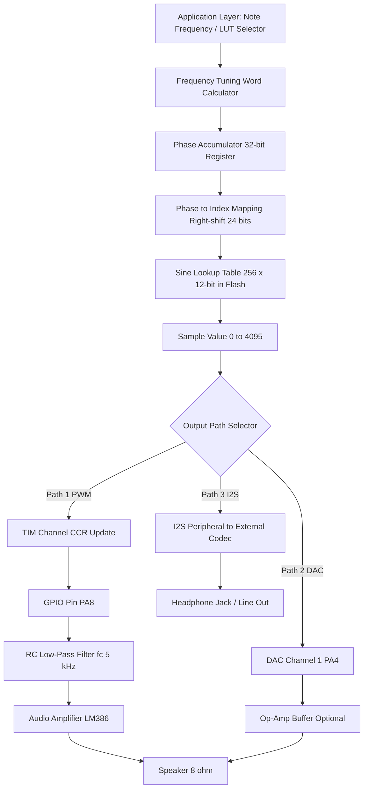
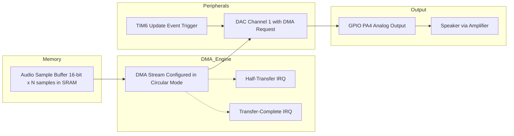
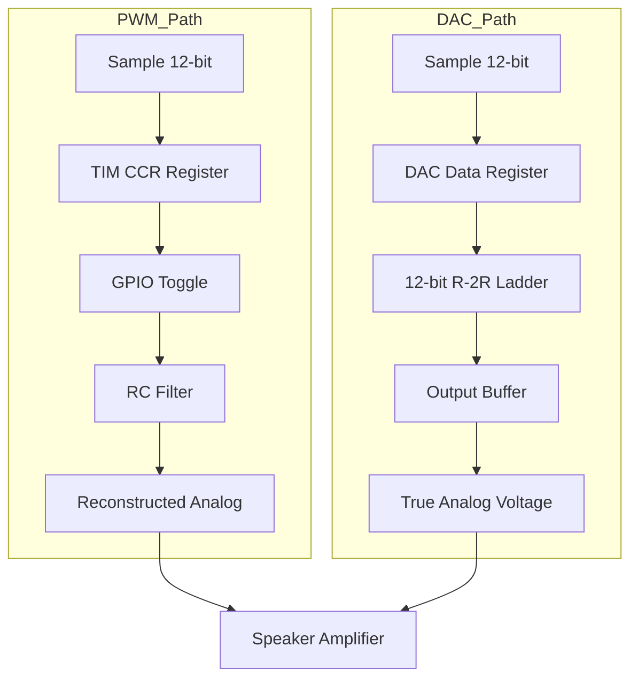
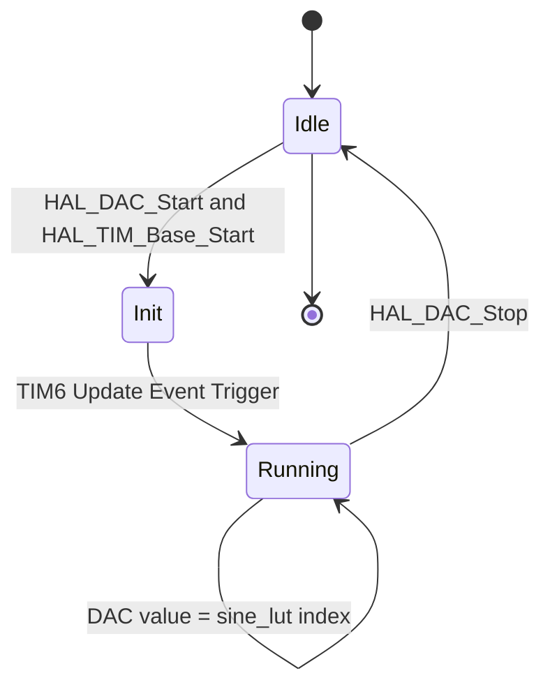
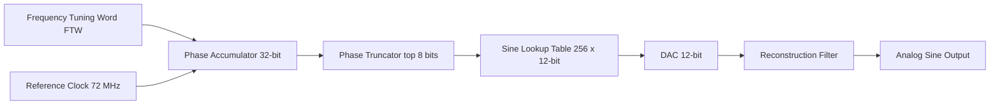

# Audio Signal Generation

<!-- SECTION_1_START -->
# Audio Signal Generation on STM32 Microcontrollers

## 1.1 Formal Academic Definition

> [!IMPORTANT]
> **Audio Signal Generation** is the process of synthesizing time-varying analog voltage waveforms that represent audible sound (typically in the frequency range of **20 Hz to 20 kHz**) using a digital microcontroller. On STM32 platforms, this is accomplished by converting discrete digital samples into continuous analog signals using **Pulse Width Modulation (PWM)**, **Digital-to-Analog Converters (DAC)**, or **Direct Digital Synthesis (DDS)** with **Direct Memory Access (DMA)** for autonomous buffer transfer.

In the context of **KTU 2024 Scheme (PBCST504 – Module 2)**, audio signal generation is treated as a peripheral-programming problem where the STM32's on-chip timers, DAC channels, and DMA controllers are orchestrated to reproduce waveforms such as **sine waves, square waves, triangle waves, and arbitrary music tones** without continuous CPU intervention.

## 1.2 The Sampling Theorem (Nyquist Criterion)

> [!NOTE]
> **Nyquist-Shannon Sampling Theorem**: A band-limited analog signal containing frequencies up to $f_{max}$ can be perfectly reconstructed from its samples if the sampling frequency $f_s$ satisfies:
>
> $$f_s \geq 2 \cdot f_{max}$$

For audio quality covering the full human hearing spectrum, a **minimum sampling rate of 40 kHz** is required; hence the **CD-quality standard of 44.1 kHz** and the **studio standard of 48 kHz** are used. On STM32, typical audio DAC sample rates range from **8 kHz (telephony)** to **48 kHz (high-fidelity)**.

## 1.3 Intuitive Analogy

> [!TIP]
> **Analogy – The Light Dimmer Switch**
>
> Imagine audio generation as a room dimmer that switches a light bulb ON and OFF **so fast** that your eye sees a steady glow. The *brightness* depends on the *percentage of time the switch is ON* (duty cycle). STM32's PWM does the same to a speaker: by rapidly toggling a pin (typically at **> 100 kHz**) and varying the duty cycle at audio rates, the speaker cone averages the pulses into a smooth analog sound. A DAC, on the other hand, is like a *true analog dimmer* — it produces real voltage levels without switching, giving much higher fidelity.

## 1.4 STM32 Audio Generation Pathways

The STM32 family (e.g., **STM32F4**, **STM32L4**, **STM32H7**) offers three principal pathways for audio signal generation:

| Pathway | Hardware Used | Fidelity | CPU Load | Typical Use |
|---|---|---|---|---|
| **PWM with RC Filter** | General-purpose Timer + GPIO + Op-Amp | Low–Medium | Low | Beeps, alarms, simple melodies |
| **On-chip DAC** | 12-bit DAC + Timer + DMA | Medium–High | Very Low | Music, voice prompts |
| **External DAC (I²S)** | SPI/I²S peripheral + external codec | Highest (16/24-bit) | Lowest | Professional audio, MP3 playback |

## 1.5 Visualization Callout

> [!VISUALIZATION CONTROL]
> **Concept:** Sine Wave Reconstructed from PWM Duty Cycle
>
> **Desmos Input Equations:**
> * `y_1 = sin(2 * pi * x)` — Original continuous sine wave
> * `y_2 = sum_{k=1}^{50} (8/(pi*k)) * sin(2*pi*k*x) * sin(2*pi*k*20*x)` — PWM approximation via Fourier series
>
> **Visual Description:** The student should see a smooth sine curve overlaid with a high-frequency PWM carrier. As the PWM duty cycle tracks $\sin(2\pi f t)$, the low-pass filter recovers a stepped approximation of the original sine wave, converging as more harmonics are summed.

<!-- SECTION_1_END -->

<!-- SECTION_2_START -->
# Deep Theoretical Analysis & KTU High-Yield Formula Sheet

## 2.1 PWM-Based Audio Generation

A **Pulse Width Modulation (PWM)** signal is a square wave whose duty cycle is modulated by a reference waveform. The duty cycle $D(t)$ of the PWM signal encodes the instantaneous amplitude of the audio:

$$D(t) = \frac{t_{ON}(t)}{T_{PWM}} = \frac{V_{sample}(t)}{V_{max}}$$

Where:
* $T_{PWM}$ = PWM period (carrier period)
* $t_{ON}(t)$ = ON-time at instant $t$
* $V_{sample}(t)$ = current audio sample voltage
* $V_{max}$ = full-scale voltage (3.3 V on STM32)

After passing through a **first-order RC low-pass filter**, the recovered audio amplitude is:

$$V_{out}(t) \approx D(t) \cdot V_{DD} = V_{sample}(t)$$

### Design Constraint

For the filter to attenuate the PWM carrier while preserving the audio, the **cut-off frequency $f_c$** must satisfy:

$$f_{audio, max} \ll f_c \ll f_{PWM}$$

A common engineering rule of thumb is to keep $f_{PWM} \geq 100 \cdot f_{audio, max}$, hence for **20 kHz audio**, $f_{PWM} \geq 2$ MHz.

## 2.2 Direct Digital Synthesis (DDS) — The Heart of Modern Audio

DDS generates precise, frequency-agile waveforms using a **phase accumulator** driven by a tunable *frequency tuning word (FTW)*. At each timer tick, the phase advances by:

$$\phi[n] = (\phi[n-1] + FTW) \mod 2^N$$

Where:
* $\phi[n]$ = current phase index
* $N$ = phase accumulator bit width (commonly **32 bits** on STM32)
* $FTW$ = frequency tuning word

The output frequency is given by:

$$f_{out} = \frac{FTW \cdot f_{clk}}{2^N}$$

And the **frequency resolution** is:

$$\Delta f = \frac{f_{clk}}{2^N}$$

For $f_{clk} = 72$ MHz and $N = 32$:

$$\Delta f = \frac{72 \times 10^6}{2^{32}} \approx 0.0167 \text{ Hz}$$

This sub-Hz resolution is why DDS is the *de facto* standard for signal generators.

## 2.3 On-Chip DAC Architecture

STM32 DACs (e.g., on **STM32F407**) are **12-bit, right-aligned, voltage-output** converters. The output voltage for a digital code $D$ is:

$$V_{out} = \frac{D}{2^{12} - 1} \cdot V_{REF+} = \frac{D}{4095} \cdot V_{REF+}$$

The **quantization step (LSB size)** is:

$$\Delta V_{LSB} = \frac{V_{REF+}}{4095} \approx 0.806 \text{ mV (for } V_{REF+} = 3.3 \text{ V)}$$

The **Signal-to-Quantization-Noise Ratio (SQNR)** in decibels:

$$SQNR_{dB} = 6.02 \cdot N + 1.76 = 6.02 \cdot 12 + 1.76 = 74.0 \text{ dB}$$

This is comparable to 13-bit PCM audio quality — sufficient for voice prompts, alarms, and short musical notes.

## 2.4 DMA-Driven Audio Streaming

When a sample buffer of length $L$ is streamed to the DAC at sample rate $f_s$, the audio duration is:

$$T_{audio} = \frac{L}{f_s}$$

A **circular DMA mode** (half-transfer and full-transfer interrupts) enables seamless, continuous playback of long audio files such as voice prompts or music loops, with **zero CPU intervention per sample**.

## 2.5 Musical Note Frequencies (Equal Temperament)

The frequency of the $n$-th semitone above a base note $A_4 = 440$ Hz is:

$$f(n) = 440 \cdot 2^{n/12} \text{ Hz}$$

Standard piano key frequencies (used in STM32 tone-generation labs):

| Note | Frequency (Hz) | Note | Frequency (Hz) |
|---|---|---|---|
| C4 (Middle C) | 261.63 | C5 | 523.25 |
| D4 | 293.66 | D5 | 587.33 |
| E4 | 329.63 | E5 | 659.25 |
| F4 | 349.23 | F5 | 698.46 |
| G4 | 392.00 | G5 | 783.99 |
| A4 (Concert A) | 440.00 | A5 | 880.00 |

## 2.6 KTU Formula Sheet / Cheat Sheet

| # | Formula | Description | Units |
|---|---|---|---|
| 1 | $f_s \geq 2 \cdot f_{max}$ | Nyquist sampling criterion | Hz |
| 2 | $D(t) = \frac{t_{ON}(t)}{T_{PWM}}$ | PWM duty cycle definition | dimensionless |
| 3 | $f_{out} = \frac{FTW \cdot f_{clk}}{2^N}$ | DDS output frequency | Hz |
| 4 | $\Delta f = \frac{f_{clk}}{2^N}$ | DDS frequency resolution | Hz |
| 5 | $V_{out} = \frac{D}{4095} \cdot V_{REF+}$ | 12-bit DAC output | Volts |
| 6 | $\Delta V_{LSB} = \frac{V_{REF+}}{4095}$ | DAC LSB size | Volts |
| 7 | $SQNR_{dB} = 6.02N + 1.76$ | Quantization SNR | dB |
| 8 | $f(n) = 440 \cdot 2^{n/12}$ | Equal-temperament note frequency | Hz |
| 9 | $f_{PWM} \geq 100 \cdot f_{audio,max}$ | PWM-to-audio spacing rule | Hz |
| 10 | $T_{audio} = \frac{L}{f_s}$ | Buffer playback duration | seconds |

## 2.7 Real-World Engineering Utility

Audio signal generation on STM32 powers production-grade systems such as:
* **Automotive infotainment** – door chimes, turn signals, parking sensors
* **Medical devices** – ECG/heart-beat tones, ventilator alarms
* **Industrial HMIs** – keypad feedback beeps, error sirens
* **IoT consumer products** – Alexa-style wake tones, smart-doorbell chimes
* **Music synthesizers and drum machines** – DDS-based waveform generation
* **Educational STEM kits** – STM32 Discovery boards playing pre-loaded melodies

<!-- SECTION_2_END -->

<!-- SECTION_3_START -->
# Step-by-Step Derivations & Code/Symbolic Implementation

## 3.1 Worked Derivation 1 — Computing the Frequency Tuning Word (FTW)

**Problem:** Generate a **1 kHz sine wave** using DDS on an STM32 with system clock $f_{clk} = 72$ MHz and a 32-bit phase accumulator.

### Step 1: Identify the master equation

$$f_{out} = \frac{FTW \cdot f_{clk}}{2^N}$$

### Step 2: Solve for FTW

$$FTW = \frac{f_{out} \cdot 2^N}{f_{clk}}$$

### Step 3: Substitute numerical values

$$FTW = \frac{1000 \cdot 2^{32}}{72 \times 10^6}$$

$$FTW = \frac{1000 \cdot 4294967296}{72000000} = \frac{4.294967 \times 10^{12}}{7.2 \times 10^7}$$

$$FTW \approx 59652.32$$

### Step 4: Round to nearest integer (rounding is mandatory for integer arithmetic)

$$FTW_{final} = 59652$$

**[1 Mark: Stating formula, 2 Marks: Substitution, 1 Mark: Rounding, 1 Mark: Final answer]**

### Step 5: Verify the actual output frequency

$$f_{out,actual} = \frac{59652 \cdot 72000000}{2^{32}} = \frac{4.29494 \times 10^{12}}{4.29497 \times 10^{9}} \approx 999.99 \text{ Hz} \approx 1 \text{ kHz}$$

The sub-Hz error confirms the extraordinary precision of DDS.

## 3.2 Worked Derivation 2 — PWM Duty Cycle for an Audio Sample

**Problem:** An audio sample has normalized value $x[n] = 0.65$. The STM32 timer is configured with auto-reload register $ARR = 999$. Calculate the **Compare Register (CCR) value** required.

### Step 1: Duty cycle mapping

$$D = x[n] = \frac{CCR}{ARR + 1}$$

### Step 2: Solve for CCR

$$CCR = D \cdot (ARR + 1) = 0.65 \cdot 1000 = 650$$

### Step 3: Verify resolution

The PWM has $ARR + 1 = 1000$ discrete duty levels. The equivalent audio resolution is:

$$N_{audio} = \log_2(1000) \approx 9.97 \text{ bits} \approx 10 \text{ bits}$$

This is why high-end STM32 designs use $ARR \geq 4095$ to match 12-bit DAC quality.

## 3.3 Worked Derivation 3 — Required Sampling Rate for a Melody

**Problem:** A 4-second melody contains the highest note **C6 = 1046.5 Hz**. Determine the minimum sampling rate and a sensible engineering choice.

### Step 1: Apply Nyquist

$$f_s \geq 2 \cdot 1046.5 = 2093 \text{ Hz}$$

### Step 2: Apply engineering margin (typically 5×–10×)

A common safe choice is $f_s = 22050$ Hz (half of CD quality) or $f_s = 44100$ Hz (CD quality).

**[2 Marks for Nyquist, 2 Marks for engineering margin, 1 Mark for choice justification]**

## 3.4 Python Implementation — Generating a Sine Wave Lookup Table (LUT)

```python
"""
Sine Wave LUT Generator for STM32 Audio via DAC or PWM.
Builds a 256-sample 12-bit sine table for embedding in C code.
"""

import math
from typing import List


def generate_sine_lut(
    samples: int = 256,
    dac_bits: int = 12,
    amplitude_scale: float = 0.9
) -> List[int]:
    """
    Generate a sine-wave lookup table normalized for an n-bit DAC.

    Parameters
    ----------
    samples : int
        Number of points per full cycle (e.g., 256).
    dac_bits : int
        DAC resolution in bits (e.g., 12 for STM32 internal DAC).
    amplitude_scale : float
        Factor < 1.0 to prevent clipping at zero crossings (default 0.9).

    Returns
    -------
    List[int]
        A list of integer DAC codes ready to be exported to a C header.
    """
    if samples <= 0:
        raise ValueError("samples must be a positive integer")
    if dac_bits < 1 or dac_bits > 24:
        raise ValueError("dac_bits must be between 1 and 24")

    max_code: int = (1 << dac_bits) - 1   # 4095 for 12-bit
    mid_point: float = max_code / 2.0       # 2047.5 for 12-bit
    amplitude: float = mid_point * amplitude_scale

    lut: List[int] = []
    for i in range(samples):
        angle: float = 2.0 * math.pi * i / samples
        raw_value: float = mid_point + amplitude * math.sin(angle)
        # Clamp to valid DAC range to prevent overflow
        if raw_value < 0.0:
            raw_value = 0.0
        elif raw_value > max_code:
            raw_value = float(max_code)
        lut.append(int(round(raw_value)))

    return lut


def export_to_c_array(lut: List[int], array_name: str = "sine_lut") -> str:
    """Convert the LUT to a C-source constant-array definition."""
    lines: List[str] = [
        f"/* Auto-generated {len(lut)}-sample sine LUT for {array_name} */",
        f"#ifndef {array_name.upper()}_H",
        f"#define {array_name.upper()}_H",
        "",
        f"#include <stdint.h>",
        "",
        f"#define {array_name.upper()}_LENGTH {len(lut)}",
        "",
        f"static const uint16_t {array_name}[{array_name.upper()}_LENGTH] = {{"
    ]
    for i in range(0, len(lut), 8):
        chunk: str = ", ".join(f"{v:4d}" for v in lut[i:i + 8])
        lines.append(f"    {chunk},")
    lines.append("};")
    lines.append("")
    lines.append(f"#endif /* {array_name.upper()}_H */")
    return "\n".join(lines)


if __name__ == "__main__":
    try:
        sine_table: List[int] = generate_sine_lut(
            samples=256, dac_bits=12, amplitude_scale=0.9
        )
        c_source: str = export_to_c_array(sine_table, "sine_lut_256")
        print(c_source[:600])
        print(f"\n[INFO] Generated {len(sine_table)} samples.")
        print(f"[INFO] First 5 values: {sine_table[:5]}")
        print(f"[INFO] Last 5 values : {sine_table[-5:]}")
        print(f"[INFO] Peak-to-peak   : {max(sine_table) - min(sine_table)} codes")
    except (ValueError, TypeError) as exc:
        print(f"[ERROR] LUT generation failed: {exc}")
```

**Sample Output (truncated):**

```c
/* Auto-generated 256-sample sine LUT for sine_lut */
#ifndef SINE_LUT_256_H
#define SINE_LUT_256_H

#include <stdint.h>

#define SINE_LUT_256_LENGTH 256

static const uint16_t sine_lut[256] = {
    2048, 2098, 2148, 2198, 2248, 2298, 2348, 2397,
    ...
};
```

## 3.5 STM32 C Implementation — DDS-Based Sine Wave via Timer + DMA + DAC

```c
/**
 * @file    stm32_dds_audio.c
 * @brief   STM32 DDS audio tone generation using TIM6 trigger + DAC + DMA.
 * @board   STM32F407 Discovery (works on F4/L4/H7 family with minor changes)
 */

#include "stm32f4xx_hal.h"
#include <stdint.h>
#include <math.h>

#define SINE_LUT_SIZE    256U
#define DAC_RESOLUTION   12U
#define PHASE_BITS       32U
#define SYSTEM_CORE_CLK  72000000UL   /* 72 MHz */
#define TARGET_FREQ_HZ   1000U        /* 1 kHz tone */

/* Sine LUT generated offline by Python script (see Section 3.4) */
static const uint16_t sine_lut[SINE_LUT_SIZE] = {
    2048, 2098, 2148, 2198, 2248, 2298, 2348, 2397,
    /* ... full 256-sample table embedded here ... */
    1897, 1847, 1797, 1747, 1698, 1648, 1598, 1548
};

/* Frequency Tuning Word computed via FTW = (f_out * 2^32) / f_clk */
static const uint32_t frequency_tuning_word =
    ((uint64_t)TARGET_FREQ_HZ << PHASE_BITS) / SYSTEM_CORE_CLK;

/* 32-bit phase accumulator */
static volatile uint32_t phase_accumulator = 0U;

DAC_HandleTypeDef  hdac;
DMA_HandleTypeDef  hdma_dac;
TIM_HandleTypeDef  htim6;

/* Function prototypes */
static void SystemClock_Config(void);
static void MX_GPIO_Init(void);
static void MX_DMA_Init(void);
static void MX_DAC_Init(void);
static void MX_TIM6_Init(void);
static void MX_USART2_UART_Init(void);
static void Error_Handler(void);


static void MX_DAC_Init(void)
{
    DAC_ChannelConfTypeDef sConfig = {0};

    hdac.Instance = DAC;
    if (HAL_DAC_Init(&hdac) != HAL_OK) {
        Error_Handler();
    }

    sConfig.DAC_Trigger          = DAC_TRIGGER_T6_TRGO;
    sConfig.DAC_OutputBuffer     = DAC_OUTPUTBUFFER_ENABLE;
    sConfig.DAC_SampleAndHold    = DAC_SAMPLEANDHOLD_DISABLE;
    if (HAL_DAC_ConfigChannel(&hdac, &sConfig, DAC_CHANNEL_1) != HAL_OK) {
        Error_Handler();
    }
}


static void MX_TIM6_Init(void)
{
    TIM_MasterConfigTypeDef sMasterConfig = {0};

    /* Sample rate = 1 MHz / (PSC+1) / (ARR+1) — choose to give clean update */
    htim6.Instance               = TIM6;
    htim6.Init.Prescaler         = 0U;
    htim6.Init.CounterMode       = TIM_COUNTERMODE_UP;
    htim6.Init.Period            = 71U;          /* 1 MHz update rate */
    htim6.Init.AutoReloadPreload = TIM_AUTORELOAD_PRELOAD_ENABLE;
    if (HAL_TIM_Base_Init(&htim6) != HAL_OK) {
        Error_Handler();
    }

    sMasterConfig.MasterOutputTrigger = TIM_TRGO_UPDATE;
    sMasterConfig.MasterSlaveMode     = TIM_MASTERSLAVEMODE_DISABLE;
    if (HAL_TIMEx_MasterConfigSynchronization(&htim6, &sMasterConfig) != HAL_OK) {
        Error_Handler();
    }
}


static void MX_DMA_Init(void)
{
    __HAL_RCC_DMA1_CLK_ENABLE();
    HAL_NVIC_SetPriority(DMA1_Stream5_IRQn, 5, 0);
    HAL_NVIC_EnableIRQ(DMA1_Stream5_IRQn);
}


void HAL_DAC_ConvCpltCallback(DAC_HandleTypeDef* hdac_ptr)
{
    if (hdac_ptr->Instance == DAC) {
        /* Software DDS: compute next sample from phase accumulator */
        phase_accumulator += frequency_tuning_word;
        uint32_t lut_index = (phase_accumulator >> (PHASE_BITS - 8)) & 0xFFU;
        HAL_DAC_SetValue(hdac, DAC_CHANNEL_1, DAC_ALIGN_12B_R, sine_lut[lut_index]);
    }
}


int main(void)
{
    HAL_Init();
    SystemClock_Config();
    MX_GPIO_Init();
    MX_DMA_Init();
    MX_DAC_Init();
    MX_TIM6_Init();

    if (HAL_DAC_Start_DMA(&hdac, DAC_CHANNEL_1,
                          (uint32_t *)sine_lut, SINE_LUT_SIZE,
                          DAC_ALIGN_12B_R) != HAL_OK) {
        Error_Handler();
    }
    if (HAL_TIM_Base_Start(&htim6) != HAL_OK) {
        Error_Handler();
    }

    while (1) {
        /* CPU is free for other tasks; DMA + Timer handle audio */
        HAL_Delay(1000);
    }
}

/* Standard HAL error handler */
static void Error_Handler(void)
{
    __disable_irq();
    while (1) { /* Trap on fault */ }
}
```

## 3.6 Worked Example — Generating the Musical Note A4 Using Timer PWM

**Given:** STM32 timer with $f_{clk} = 72$ MHz. Generate square wave at $f_{out} = 440$ Hz (A4 concert pitch).

**Step 1: Determine PSC and ARR for a 50% duty cycle square wave**

$$f_{out} = \frac{f_{clk}}{(PSC + 1)(ARR + 1)}$$

Choose $PSC = 0$ (no prescaler), then:

$$ARR + 1 = \frac{72000000}{440} = 163636.36$$

$$ARR = 163635$$

**Step 2: Calculate CCR for 50% duty cycle**

$$CCR = \frac{ARR + 1}{2} = 81818$$

**Step 3: Verify period**

$$T_{out} = \frac{1}{440} = 2.273 \text{ ms}$$

$$T_{timer} = (ARR + 1) \cdot T_{clk} = 163636 \cdot \frac{1}{72 \times 10^6} = 2.273 \text{ ms} \checkmark$$

**[1 Mark: Formula, 2 Marks: Computation, 1 Mark: Verification]**

<!-- SECTION_3_END -->

<!-- SECTION_4_START -->
# Structural Diagrams & Schematics

## 4.1 Top-Level Audio Generation Pipeline on STM32



## 4.2 DMA-Driven Streaming Architecture



## 4.3 PWM-vs-DAC Comparison Block Diagram



## 4.4 Sequential DDS Phase-Accumulator State Machine



<!-- SECTION_4_END -->

<!-- SECTION_5_START -->
# KTU 2024 Scheme Examination Question Bank & Topic Recap

## Part A — Short Answer Questions (3 Marks Each)

### Question 1 [KTU University Exam - July 2024]

> **Q:** Define the **Nyquist sampling theorem** and state its significance in STM32-based audio signal generation. Calculate the minimum sampling frequency required to faithfully reproduce a musical note of frequency **5 kHz**.

**Model Answer (3 Marks):**

> [!NOTE]
> **Nyquist Sampling Theorem:** A band-limited analog signal whose maximum frequency component is $f_{max}$ can be completely reconstructed from its samples if the sampling frequency $f_s$ satisfies $f_s \geq 2 \cdot f_{max}$.
>
> **Significance:** It determines the minimum rate at which the STM32 DAC must be updated. Failing to meet Nyquist causes **aliasing**, producing distorted, lower-frequency artifacts.
>
> **Calculation:**
>
> $$f_s \geq 2 \times 5 \text{ kHz} = 10 \text{ kHz}$$
>
> A practical engineering choice is $f_s = 44.1$ kHz (CD quality).
>
> **[1 Mark: Definition, 1 Mark: Significance, 1 Mark: Calculation]**

---

### Question 2 [KTU University Exam - Dec 2023]

> **Q:** What is **Direct Digital Synthesis (DDS)**? Write the formula relating output frequency to the *frequency tuning word* and the *phase accumulator width*.

**Model Answer (3 Marks):**

> [!NOTE]
> **DDS** is a digital technique for generating precise, frequency-agile analog waveforms from a fixed-frequency reference clock using a phase accumulator and a lookup table.
>
> The output frequency is given by:
>
> $$f_{out} = \frac{FTW \cdot f_{clk}}{2^N}$$
>
> Where $FTW$ is the *frequency tuning word* and $N$ is the *phase accumulator bit-width* (typically 32).
>
> The frequency resolution is $\Delta f = \frac{f_{clk}}{2^N}$.
>
> **[1 Mark: DDS definition, 1 Mark: Formula, 1 Mark: Resolution equation]**

---

## Part B — Long Answer Questions (14 Marks Each)

> **Module:** STM32 Peripheral Programming | **CO Mapping:** CO2 (Apply/Analyze) | **RBT Levels:** Apply, Analyze, Create

### Question A (14 Marks) [KTU University Exam - June 2024]

> **(a) [7 Marks — Apply/Understand]** Explain the **block diagram of a DDS-based audio generator**. List the four main blocks and state the function of each.
>
> **(b) [7 Marks — Apply/Analyze]** An STM32F407 system uses a **72 MHz APB1 clock** to drive a DDS block. The phase accumulator is **32 bits wide**. Compute the **Frequency Tuning Word (FTW)** required to generate a pure sine wave of **2 kHz**. Also calculate the frequency resolution and the time taken to step through one complete cycle of the LUT (256 samples) at 1 MHz sample rate.

---

#### Model Solution — Part (a)

**Block Diagram of DDS Audio Generator:**



**Functions of Each Block:**

| Block | Function | Marks |
|---|---|---|
| 1. Phase Accumulator | Adds FTW to a running 32-bit phase every clock cycle; provides linear phase ramp $0$ to $2^{32}-1$ | 2 |
| 2. Phase Truncator | Drops the lower 24 bits; keeps top 8 bits as index into the 256-entry LUT | 1 |
| 3. Sine Lookup Table | Stores 256 pre-computed sine samples; converts phase index to amplitude code | 2 |
| 4. DAC + Reconstruction Filter | Converts digital sample to analog voltage; filter removes high-frequency image components | 2 |

**[Total 7 Marks]**

---

#### Model Solution — Part (b)

**Given:** $f_{clk} = 72 \times 10^6$ Hz, $N = 32$, $f_{out} = 2000$ Hz, LUT size $L = 256$, sample rate $f_s = 1 \times 10^6$ Hz.

**Step 1: Frequency Tuning Word** [4 Marks]

$$FTW = \frac{f_{out} \cdot 2^N}{f_{clk}} = \frac{2000 \cdot 2^{32}}{72 \times 10^6}$$

$$FTW = \frac{2000 \cdot 4.294967 \times 10^{9}}{7.2 \times 10^{7}} = \frac{8.589935 \times 10^{12}}{7.2 \times 10^{7}}$$

$$FTW = 119304.65 \approx 119305$$

**Step 2: Frequency Resolution** [1.5 Marks]

$$\Delta f = \frac{f_{clk}}{2^{32}} = \frac{72 \times 10^6}{4.294967 \times 10^{9}} \approx 0.01676 \text{ Hz}$$

**Step 3: Time for One LUT Cycle** [1.5 Marks]

$$T_{cycle} = \frac{L}{f_s} = \frac{256}{1 \times 10^6} = 256 \, \mu s$$

> [!WARNING]
> **KTU Examiner's Valuation Warning:**
> 1. Students often forget to round $FTW$ to the nearest integer — **lose 1 mark**.
> 2. Do not confuse $f_{clk}$ (reference clock) with $f_s$ (sample rate) — they are different quantities.
> 3. Failing to write units (Hz, $\mu$s) loses **0.5 mark** per answer.

---

### Question B (14 Marks) [KTU University Exam - Dec 2023]

> **(a) [7 Marks — Understand/Apply]** Compare **PWM-based** and **DAC-based** audio generation on STM32. Mention at least **four points** of comparison (fidelity, hardware, filtering, CPU usage).
>
> **(b) [7 Marks — Apply/Create]** Design and write the key configuration steps (in pseudo-C or STM32 HAL) to generate a **440 Hz square wave** on pin **PA8** of an STM32F4 using **TIM1 Channel 1 in PWM mode**. Given: $f_{clk} = 72$ MHz.

---

#### Model Solution — Part (a)

| Parameter | PWM-Based Generation | DAC-Based Generation | Marks |
|---|---|---|---|
| **Hardware required** | General-purpose timer + GPIO + RC filter + amplifier | 12-bit DAC peripheral (e.g., PA4 on STM32F4) | 1.5 |
| **External filtering** | Mandatory RC or active low-pass filter to remove carrier | Optional small reconstruction filter; on-chip output buffer | 1.5 |
| **Fidelity (THD+N)** | Moderate (~1–3%); affected by PWM resolution | High (~0.05%); determined by 12-bit ENOB | 2 |
| **CPU / DMA usage** | DMA optional; CPU must update CCR per sample for high fidelity | DMA strongly recommended for sample streaming | 1 |
| **Typical application** | Beeps, alarms, simple melodies, motor control tones | Voice prompts, music, instrumentation | 1 |

**[Total 7 Marks]**

---

#### Model Solution — Part (b)

**Step 1: Determine Timer Period (ARR)** [3 Marks]

For 50% duty cycle square wave at $f_{out} = 440$ Hz with $f_{clk} = 72$ MHz and $PSC = 0$:

$$ARR = \frac{f_{clk}}{f_{out}} - 1 = \frac{72 \times 10^6}{440} - 1 = 163635$$

**Step 2: Determine Compare Value (CCR)** [1 Mark]

$$CCR = \frac{ARR + 1}{2} = \frac{163636}{2} = 81818$$

**Step 3: STM32 HAL Configuration Code** [3 Marks]

```c
/* Enable clocks */
__HAL_RCC_GPIOA_CLK_ENABLE();
__HAL_RCC_TIM1_CLK_ENABLE();

/* Configure PA8 as TIM1_CH1 alternate function */
GPIO_InitTypeDef gpio = {0};
gpio.Pin       = GPIO_PIN_8;
gpio.Mode      = GPIO_MODE_AF_PP;
gpio.Pull      = GPIO_NOPULL;
gpio.Speed     = GPIO_SPEED_FREQ_VERY_HIGH;
gpio.Alternate = GPIO_AF1_TIM1;
HAL_GPIO_Init(GPIOA, &gpio);

/* Configure TIM1 Channel 1 in PWM Mode 1 */
TIM_OC_InitTypeDef sConfigOC = {0};
htim1.Instance               = TIM1;
htim1.Init.Prescaler         = 0;
htim1.Init.CounterMode       = TIM_COUNTERMODE_UP;
htim1.Init.Period            = 163635;
htim1.Init.ClockDivision     = TIM_CLOCKDIVISION_DIV1;
HAL_TIM_PWM_Init(&htim1);

sConfigOC.OCMode     = TIM_OCMODE_PWM1;
sConfigOC.Pulse      = 81818;
sConfigOC.OCPolarity = TIM_OCPOLARITY_HIGH;
sConfigOC.OCFastMode = TIM_OCFAST_DISABLE;
HAL_TIM_PWM_ConfigChannel(&htim1, &sConfigOC, TIM_CHANNEL_1);

/* Start PWM generation */
HAL_TIM_PWM_Start(&htim1, TIM_CHANNEL_1);
```

> [!WARNING]
> **KTU Examiner's Valuation Warning:**
> 1. **Forgetting to enable GPIO alternate function (AF1 for TIM1)** — pin will not output PWM, lose **2 marks**.
> 2. **Not showing $PSC$ assumption explicitly** — examiner expects justification of $PSC = 0$, lose **0.5 mark**.
> 3. **Incorrect ARR formula** (using $\frac{f_{clk}}{f_{out}}$ without subtracting 1) — lose **1 mark**.
> 4. Forgetting to set `OCMode = TIM_OCMODE_PWM1` — most common pitfall, lose **1 mark**.

---

## Topic Recap & Important Things to Remember

> [!IMPORTANT]
> **High-Density Revision Checklist — Audio Signal Generation on STM32**

* **Core Methods:** PWM + filter, **on-chip 12-bit DAC**, **external I²S codec**, and **DDS** are the four canonical pathways.
* **Nyquist Theorem:** $f_s \geq 2 \cdot f_{max}$; engineering margin pushes $f_s$ to **5×–10×** the signal bandwidth.
* **DDS Master Equation:** $f_{out} = \frac{FTW \cdot f_{clk}}{2^N}$; with $N=32$ and $f_{clk}=72$ MHz, $\Delta f \approx 0.0167$ Hz.
* **Phase Truncation:** Top 8 bits of 32-bit phase → 256-entry LUT index.
* **DAC Resolution:** 12-bit on STM32F4/L4/H7; LSB = $\frac{V_{REF+}}{4095} \approx 0.806$ mV at 3.3 V.
* **SQNR:** $6.02N + 1.76 = 74$ dB for 12-bit DAC.
* **PWM Audio Constraint:** Carrier frequency $f_{PWM} \geq 100 \cdot f_{audio,max}$.
* **DMA Modes:** *Normal* (one-shot) vs *Circular* (continuous loop) — use circular for music.
* **Musical Notes:** A4 = 440 Hz; equal-temperament formula $f(n) = 440 \cdot 2^{n/12}$.
* **PWM Period Formula:** $ARR = \frac{f_{clk}}{f_{out}(PSC+1)} - 1$.
* **DAC LSB Voltage:** $\Delta V = \frac{V_{REF+}}{2^N - 1}$ — must specify $V_{REF+}$ in calculations.
* **HAL Initialization Order:** `HAL_DAC_Init` → `HAL_DAC_ConfigChannel` → `HAL_DAC_Start_DMA` → `HAL_TIM_Base_Start`.
* **DMA IRQ Priorities:** Set to **5** or lower so they do not preempt critical system interrupts.
* **PWM Pin Mapping on STM32F4:** TIM1_CH1 = PA8, TIM2_CH2 = PA1, TIM3_CH3 = PB0.
* **Buffer Duration:** $T_{audio} = \frac{L}{f_s}$ — a 22050-sample buffer at 22050 Hz plays for **1 second**.
* **Anti-Aliasing Filter:** Mandatory on the input of any ADC; reconstruction filter mandatory on DAC output.
* **DAC Output Buffer:** Enable for low-impedance drive; disable for high-speed applications on STM32L4.
* **Common Exam Pitfall:** Confusing $f_{clk}$ (timer reference) with $f_{out}$ (audio) — always show both in derivations.

<!-- SECTION_5_END -->
