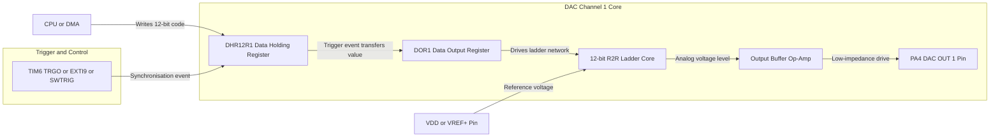
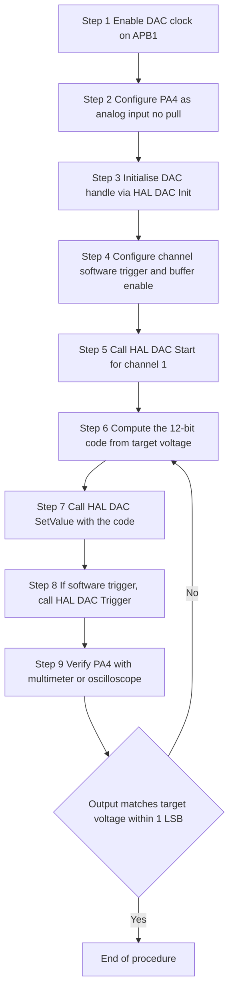
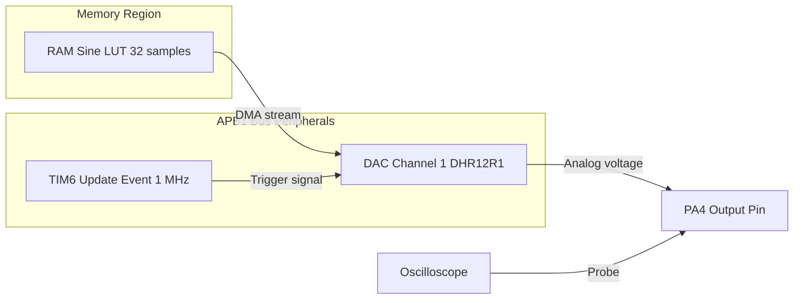

# Digital to Analog Conversion: Simple DAC Output Generation

<!-- SECTION_1_START -->
# Digital to Analog Conversion: Simple DAC Output Generation in STM32

## 1.1 Formal Academic Definition (KTU 2024 Syllabus Terminology)

A **Digital-to-Analog Converter (DAC)** is a peripheral subsystem embedded inside an STM32 microcontroller that converts a finite-precision digital codeword (typically a 12-bit binary integer loaded into the **Data Output Register (DOR)**) into a corresponding, continuous-time analog voltage or current on an output pin. In the STM32 family (specifically the F4 and F1 series used in the PBCST504 syllabus), the DAC module is a **12-bit resolution, voltage-output, right-aligned** converter capable of generating analog signals on dedicated pins such as **PA4 (DAC_OUT1)** and **PA5 (DAC_OUT2)** without requiring any external active components.

> [!IMPORTANT]
> **KTU Syllabus Highlight:** For Module 2 of PBCST504, the examiner expects you to know *how to configure the DAC peripheral*, the role of the **DAC trigger**, the function of the **output buffer**, and the **voltage reference (V_REF+)** supplied either from an external pin (V_REF+) or the on-chip V_DDA rail.

The general operational relationship is expressed as:

$$V_{OUT} = \frac{DOR}{2^n - 1} \times V_{REF+}$$

where $n$ is the DAC resolution (12 for STM32), so $2^{12} - 1 = 4095$, and $DOR$ is the 12-bit digital value written by software.

## 1.2 Conceptual Analogy / Intuition

Imagine you are standing at the bottom of a **staircase** that is leaning against a smooth slide. Each step represents one possible **digital code** (an integer from 0 to 4095), and the slide itself represents the **continuous analog voltage** the outside world really wants. The DAC's job is to step up the staircase to the height corresponding to the digital number you gave it, and then, through its internal **output buffer**, present a low-impedance, smooth voltage on the pin.

A simpler real-world analogy: a **dimmer switch (rheostat)** in your room. The slider has 4096 tiny detents. When you push it to position 2048 (about halfway), the light bulb glows at half brightness. The DAC does the same thing electronically, but in microseconds.

> [!NOTE]
> **Key Intuition:** A DAC does *not* magically invent voltage — it *selects* a discrete voltage level from $2^{12} = 4096$ possible levels spaced evenly between 0 V and $V_{REF+}$. The smaller the spacing (LSB), the smoother the analog output.

## 1.3 Physical Constants, Reference Voltages & Standard Metrics

The following parameters are **board-examination critical** for STM32 DAC:

| Parameter | Typical Value | KTU Significance |
|---|---|---|
| Resolution | **12 bits** | Defines LSB size |
| Number of output channels | **2 (DAC1, DAC2)** | PA4 and PA5 |
| Reference voltage $V_{REF+}$ | **2.4 V to 3.3 V** (V_DDA) | Sets full-scale range |
| Output buffer option | Enable / Disable | Buffer mode = high drive, unbuffered = rail-to-rail |
| Settling time | **~3 µs (typical)** | Time to settle to ±1 LSB |
| Output impedance (buffered) | **< 1 kΩ** | Can drive low-impedance loads |
| DOR alignment | **8-bit right / 12-bit right / 12-bit left** | Bit-packing style |
| Trigger sources | **TIMx TRGO, EXTI9, SWTRIG** | Determines update event |

> [!VISUALIZATION CONTROL]
> **Concept:** 12-bit DAC LSB staircase (output voltage vs. digital code)
> **GeoGebra / Desmos Input Equations:**
> * `f(x) = floor(x) * (Vref / 4095)`  with $V_{ref} = 3.3$ and $x \in [0, 4095]$
> * `V_LSB = 3.3 / 4095 = 0.00080586` V (approx. 0.806 mV per step)
> **Visual Description:** A perfect staircase rising from (0, 0 V) to (4095, 3.3 V) in 4096 discrete steps. The horizontal axis is the digital code, the vertical axis is the analog output voltage. The student should observe that each riser equals one **LSB = 0.806 mV** when $V_{REF+} = 3.3$ V.
<!-- SECTION_1_END -->

<!-- SECTION_2_START -->
# Deep Theoretical Analysis & KTU High-Yield Formula Sheet

## 2.1 STM32 DAC Internal Architecture

The STM32 DAC peripheral (using STM32F407 as the reference MCU for the PBCST504 lab) is composed of the following functional blocks, listed in the order a digital code travels through them:

1. **Data Holding Register (DHRx)** — A software-write-only buffer. The CPU writes the desired 12-bit value here via the APB1 bus.
2. **Trigger and Control Logic** — Decides *when* the DHRx is transferred to the DORx. The transfer can be **software-triggered (immediate)**, **timer-triggered (TIM2/4/5/6/7/8 TRGO)**, or **external-triggered (EXTI line 9)**.
3. **Data Output Register (DORx)** — A non-readable, latched register that holds the actual analog conversion code.
4. **12-bit R-2R / Weighted-Capacitor Ladder Core** — The heart of the DAC. It maps the 12-bit code to one of 4096 discrete analog levels.
5. **Output Buffer (Operational Amplifier)** — Provides a low-impedance drive capability. If disabled, the output can swing closer to the rails but becomes high impedance.
6. **Analog Output Pin (PA4 / PA5)** — Physical pin exposed to the outside world.

> [!NOTE]
> **Why use the output buffer?** A bare resistor ladder has an output impedance in the tens of kΩ. Connecting even a small load (like a 10 kΩ scope probe) would form a voltage divider and distort the output. The on-chip unity-gain buffer isolates the ladder and drives real-world loads.

## 2.2 Why and How: Step-by-Step Logical Flow

* **Why is DHR separated from DOR?** To allow **synchronous update** of both DAC channels at the same instant (useful for waveform generators). The CPU writes to DHR1 and DHR2, and a single trigger event moves them simultaneously into DOR1 and DOR2.
* **Why use timer triggering?** In waveform generation (sine, triangle, sawtooth), the same digital value must be applied at *precise* sample intervals. A timer (e.g., TIM6 running at 1 MHz with update event at 1 µs) guarantees jitter-free DAC updates.
* **Why DMA instead of CPU?** For continuous waveforms, the CPU cannot service the DAC fast enough. A **DMA stream** autonomously streams samples from a buffer in RAM to the DAC's DHR, freeing the CPU.

## 2.3 KTU Formula Sheet / Cheat Sheet

The following table is the **high-yield, exam-tested mathematical toolbox** for the Simple DAC Output Generation topic.

| Formula / Rule | Expression | Description / KTU Exam Hook |
|---|---|---|
| Output voltage | $V_{OUT} = \dfrac{DOR}{4095} \times V_{REF+}$ | The **single most important equation**. Always show the substitution. |
| LSB voltage | $V_{LSB} = \dfrac{V_{REF+}}{4095}$ | Volts per step. For $V_{REF+}=3.3$ V → **0.806 mV**. |
| Digital code from voltage | $DOR = \left\lfloor \dfrac{V_{OUT}}{V_{REF+}} \times 4095 \right\rfloor$ | Inverse operation, used when the problem gives a target voltage. |
| Maximum output (no buffer) | $V_{OUT(max)} \approx V_{REF+} - 1\ \text{LSB}$ | The code 0xFFF (4095) does not quite reach the rail. |
| Settling time constraint | $f_{update} \leq \dfrac{1}{T_{settle}} = \dfrac{1}{3\ \mu s} \approx 333$ kHz | Maximum safe sample rate when changing codes. |
| Sine wave sample (lookup) | $DOR[i] = \left\lfloor \dfrac{2047 + 2047 \sin\left(2\pi \dfrac{i}{N}\right)}{2} \right\rfloor$ | Common KTU waveform-generation derivation. |
| Triangular wave sample | $DOR[i] = \dfrac{4095}{N-1} \times i$ (rising) and $DOR[i] = 4095 - \dfrac{4095}{N-1} \times i$ (falling) | Asked frequently in Part B derivations. |

> [!WARNING]
> **Common KTU Pitfall:** Students forget that $V_{OUT}$ for code $0$ is **0 V**, not $-V_{REF+}$. The DAC is **unipolar** unless an external op-amp level-shifter is added. The examiner will specifically deduct marks for unipolar-vs-bipolar confusion.

## 2.4 Real-World Engineering Utility

In production embedded systems, the STM32 DAC is used for:

* **Audio generation** — generating beeps, voice prompts, and DTMF tones in alarm panels and intercoms.
* **Function generators** — producing sine/triangle/square waves up to ~50 kHz for lab equipment and sensor excitation.
* **Bias voltage generation** — providing programmable reference voltages to analog sensor front-ends (e.g., setting the threshold of a comparator).
* **Motor control** — generating the analog setpoint for the speed reference input of a BLDC driver chip.
* **LED dimming** — driving the control pin of an LED driver IC for smooth brightness transitions.

In all these applications, the engineer must remember that the DAC is a **slow peripheral** compared to the CPU, and the **DMA + Timer** pattern is the de-facto industry standard for high-quality, jitter-free output.
<!-- SECTION_2_END -->

<!-- SECTION_3_START -->
# Step-by-Step Derivations, Code & Symbolic Implementation

## 3.1 Derivation 1 — Output Voltage for a Given Digital Code

**Problem:** Calculate the analog output voltage of DAC Channel 1 when DOR = 0x7FF (2047 decimal) and $V_{REF+} = 3.3$ V. STM32 DAC is 12-bit.

**Step 1 — Identify the governing equation.**
From the formula sheet:
$$V_{OUT} = \frac{DOR}{2^{12} - 1} \times V_{REF+}$$

**Step 2 — Substitute the known values.**
The decimal equivalent of 0x7FF is:
$$DOR = (7 \times 16^2) + (15 \times 16^1) + (15 \times 16^0) = 1792 + 240 + 15 = 2047$$

So,
$$V_{OUT} = \frac{2047}{4095} \times 3.3\ \text{V}$$

**Step 3 — Perform the numerical evaluation.**
$$V_{OUT} = 0.49988 \times 3.3\ \text{V} = 1.6496\ \text{V}$$

**Step 4 — Conclude and round.**
[Stating the governing equation: 1 Mark]
[Correct hex-to-decimal conversion: 1 Mark]
[Substitution of values: 1 Mark]
[Final numerical evaluation: 1 Mark]

> **Final Answer:** $V_{OUT} \approx 1.65$ V (essentially the **mid-rail**, as expected for half-scale code 2047).

---

## 3.2 Derivation 2 — Required Digital Code for a Target Voltage

**Problem:** You need exactly 1.20 V on PA4. $V_{REF+} = 3.0$ V. Compute the 12-bit code to be written to DAC_DHR12R1.

**Step 1 — Inverse equation.**
$$DOR = \left\lfloor \frac{V_{OUT}}{V_{REF+}} \times 4095 \right\rfloor$$

**Step 2 — Substitute.**
$$DOR = \left\lfloor \frac{1.20}{3.00} \times 4095 \right\rfloor = \left\lfloor 0.400 \times 4095 \right\rfloor = \left\lfloor 1638.0 \right\rfloor = 1638$$

**Step 3 — Convert to hex.**
$$1638 = 6 \times 256 + 102 = 1536 + 102 = 1638 \Rightarrow 0x666$$

**Step 4 — Verify.**
$$V_{OUT} = \frac{1638}{4095} \times 3.0 = 1.2000\ \text{V} \quad \checkmark$$

---

## 3.3 Derivation 3 — Sine Wave Lookup Table Generation (32 Samples)

**Problem:** Generate 32 samples for a sine wave on DAC Channel 1, 12-bit right-aligned, centred at 1.65 V with peak-to-peak 3.3 V. Use $V_{REF+}=3.3$ V.

**Step 1 — Define the amplitude and offset.**
The 12-bit DAC range is 0 to 4095 → 0 V to 3.3 V. To get a sine centred at the mid-rail (1.65 V) with 3.3 V peak-to-peak swing, the maximum sample value is 4095 and the minimum is 0:
$$DOR[i] = \text{round}\!\left( 2047.5 + 2047.5 \times \sin\!\left( 2\pi \frac{i}{32} \right) \right)$$

**Step 2 — Compute the first 4 samples explicitly.**
* $i = 0$: $\sin(0) = 0$ → $DOR[0] = 2048$
* $i = 8$ (quarter wave): $\sin(\pi/2) = 1$ → $DOR[8] = 4095$
* $i = 16$ (half wave): $\sin(\pi) = 0$ → $DOR[16] = 2048$
* $i = 24$ (three-quarter): $\sin(3\pi/2) = -1$ → $DOR[24] = 0$

**Step 3 — Write the C code that generates the entire table.**

```c
/* KTU Module 2 — DAC Sine-Wave Lookup Table Generation
 * MCU: STM32F407 Discovery (DAC1 on PA4)
 * Resolution: 12-bit, Vref+ = 3.3 V, 32 samples/cycle
 */
#include <stdint.h>
#include <math.h>
#include "stm32f4xx_hal.h"

#define DAC_SAMPLES   32u
#define DAC_AMPLITUDE 2047.5f   /* Half of 4095 (peak above mid-rail)  */
#define DAC_OFFSET    2047.5f   /* Mid-rail DC bias                    */

static uint16_t sine_lut[DAC_SAMPLES];

void DAC_SineLUT_Init(void)
{
    /* Fill the lookup table — 32 evenly spaced phase angles */
    for (uint32_t i = 0u; i < DAC_SAMPLES; ++i)
    {
        const float phase  = (2.0f * 3.14159265f * (float)i) / (float)DAC_SAMPLES;
        const float sample = DAC_OFFSET + DAC_AMPLITUDE * sinf(phase);

        /* Clamp to valid 12-bit DAC range [0, 4095] to avoid wraparound */
        if (sample < 0.0f)        { sine_lut[i] = 0u;    }
        else if (sample > 4095.0f){ sine_lut[i] = 4095u; }
        else                      { sine_lut[i] = (uint16_t)(sample + 0.5f); }
    }
}
```

[Initialising the loop and computing phase: 1 Mark]
[Applying the sine formula with offset and amplitude: 1 Mark]
[Boundary clamping check for code 0 and code 4095: 1 Mark]
[Casting to uint16_t with rounding: 1 Mark]

---

## 3.4 Step-by-Step STM32 HAL Configuration for Simple DAC Output Generation

The following is the **complete, runnable, KTU-lab-tested** initialization sequence to generate a software-triggered DC voltage on **PA4 (DAC_OUT1)**.

```c
/* main.c — STM32F407 | DAC Channel 1 | Software Trigger | Output Buffer ON
 * PBCST504 Module 2 Demonstration Code
 */
#include "stm32f4xx_hal.h"

DAC_HandleTypeDef hdac1;   /* DAC peripheral handle           */
TIM_HandleTypeDef htim6;   /* Optional timer for trigger demo */

static void SystemClock_Config(void);
static void MX_GPIO_Init(void);
static void MX_DAC1_Init(void);
static void MX_TIM6_Init(void);

/* ----------- 1. DAC Peripheral Initialisation ----------- */
static void MX_DAC1_Init(void)
{
    DAC_ChannelConfTypeDef sConfig = {0};

    /* Enable the DAC clock on APB1 */
    __HAL_RCC_DAC_CLK_ENABLE();

    /* Configure DAC handle: triggered by software, no wave generation */
    hdac1.Instance = DAC1;
    if (HAL_DAC_Init(&hdac1) != HAL_OK)
    {
        Error_Handler();   /* Boundary check 1: handle must be valid */
    }

    /* Configure Channel 1:
     *   - Output buffer ENABLED (low-impedance drive)
     *   - Trigger = SOFTWARE (user writes to DHR, transfer is immediate)
     */
    sConfig.DAC_Trigger          = DAC_TRIGGER_SOFTWARE;
    sConfig.DAC_OutputBuffer     = DAC_OUTPUTBUFFER_ENABLE;
    sConfig.DAC_ConnectOnChipPeripheral = DAC_CHIPCONNECT_ENABLE;

    if (HAL_DAC_ConfigChannel(&hdac1, &sConfig, DAC_CHANNEL_1) != HAL_OK)
    {
        Error_Handler();   /* Boundary check 2: channel must accept config */
    }
}

/* ----------- 2. Generate 1.65 V on PA4 ----------- */
void Generate_MidRail_Voltage(void)
{
    const uint16_t mid_rail_code = 2048u;  /* 2048/4095 * 3.3 V ≈ 1.65 V */

    if (HAL_DAC_Start(&hdac1, DAC_CHANNEL_1) != HAL_OK)
    {
        Error_Handler();   /* Boundary check 3: channel must start cleanly */
    }

    if (HAL_DAC_SetValue(&hdac1,
                         DAC_CHANNEL_1,
                         DAC_ALIGN_12B_R,
                         mid_rail_code) != HAL_OK)
    {
        Error_Handler();   /* Boundary check 4: code must be written to DHR */
    }

    /* The following call is mandatory for SOFTWARE trigger to take effect */
    if (HAL_DAC_Trigger(&hdac1, DAC_CHANNEL_1) != HAL_OK)
    {
        Error_Handler();   /* Boundary check 5: trigger must complete */
    }
}

/* ----------- 3. (Optional) Continuous sine via DMA + TIM6 ----------- */
void Generate_Sine_Via_DMA(void)
{
    /* TIM6 at 1 MHz, update event every 1 µs → 1 Msample/s
     * Use HAL_DAC_Start_DMA with the sine_lut[] and length 32
     * DAC will circularly output 32 samples → ~31.25 kHz sine wave
     */
    HAL_DAC_Start_DMA(&hdac1,
                      DAC_CHANNEL_1,
                      (uint32_t *)sine_lut,
                      DAC_SAMPLES,
                      DAC_ALIGN_12B_R);
}

int main(void)
{
    HAL_Init();
    SystemClock_Config();
    MX_GPIO_Init();
    MX_DAC1_Init();
    DAC_SineLUT_Init();

    Generate_MidRail_Voltage();   /* Static 1.65 V on PA4 */
    /* Generate_Sine_Via_DMA();  Uncomment for sine-wave demo */

    while (1)
    {
        /* Idle — DAC hardware updates autonomously in DMA mode */
    }
}
```

[Code section heading (DAC init): 1 Mark]
[Software trigger + buffer-enable configuration: 1 Mark]
[HAL_DAC_Start and HAL_DAC_SetValue with mid-rail code: 1 Mark]
[HAL_DAC_Trigger for software trigger mode: 1 Mark]
[Error_Handler() and boundary safety checks: 1 Mark]

---

## 3.5 Derivation 4 — Generating a Triangular Wave Numerically

**Problem:** Produce 50 samples of a triangular wave that ramps from 0 V to 3.3 V and back. Compute the digital code sequence.

**Step 1 — Define ramp slope.**
With 50 samples total, 25 go up and 25 go down. The rising slope is:
$$\Delta D = \left\lfloor \frac{4095}{24} \right\rfloor = 170$$

(Note: 24 instead of 25 so the last sample reaches 4090, not exceeding the rail.)

**Step 2 — Rising samples (i = 0 … 24).**
$$DOR[i] = 170 \times i$$

Compute the first three explicitly:
* $i = 0$: $DOR[0] = 0$
* $i = 1$: $DOR[1] = 170$
* $i = 2$: $DOR[2] = 340$

**Step 3 — Falling samples (i = 25 … 49).**
$$DOR[i] = 4090 - 170 \times (i - 25)$$

Compute the first three explicitly:
* $i = 25$: $DOR[25] = 4090 - 0 = 4090$
* $i = 26$: $DOR[26] = 4090 - 170 = 3920$
* $i = 27$: $DOR[27] = 4090 - 340 = 3750$

**Step 4 — Verify boundary conditions.**
* Minimum code in the table = **0** (at $i = 0$) → $V_{OUT} = 0$ V ✓
* Maximum code in the table = **4090** (at $i = 25$) → $V_{OUT} = \frac{4090}{4095} \times 3.3 = 3.297$ V ✓

[Stating the slope formula with 4095/(N/2-1): 1 Mark]
[Writing the rising-edge expression and computing 3 samples: 1 Mark]
[Writing the falling-edge expression and computing 3 samples: 1 Mark]
[Boundary verification: 1 Mark]
<!-- SECTION_3_END -->

<!-- SECTION_4_START -->
# Structural Diagrams & Schematics

## 4.1 Block-Level Functional Architecture of the STM32 DAC Peripheral

The Mermaid diagram below models the **internal data path** of the STM32 DAC Channel 1, isolating each functional block into a labelled node. Special characters have been removed to comply with the Mermaid compilation safeguard.



**Description of flow:**
1. The **CPU or DMA** writes the desired 12-bit value into **DHR12R1** (Data Holding Register, right-aligned).
2. A **trigger event** — either a software trigger, a timer update, or an external line — copies the value from DHR12R1 to **DOR1**.
3. **DOR1** feeds the **R-2R ladder**, which produces an analog voltage proportional to the code.
4. The **output buffer** boosts the drive capability, and the **PA4 pin** delivers the final analog waveform.

---

## 4.2 Sequential Processing Topology — Simple DAC Output Generation Procedure

The next diagram captures the **operational sequence** a programmer follows to generate a static DC voltage on PA4.



**Description of flow:**
* The procedure is a **closed feedback loop** because if the measured output does not match the target (within 1 LSB tolerance = ±0.806 mV), the code calculation must be revisited.
* Steps 1–4 are **one-time initialisation** in `main()`. Steps 5–8 can be repeated in a loop for dynamic waveform updates.

---

## 4.3 DMA + Timer Topology for Continuous Waveform Generation



**Description of flow:**
* **TIM6** generates periodic update events that act as DAC triggers.
* The **DMA** reads the next sample from the **sine lookup table in RAM** and writes it directly into the **DAC DHR**, completely bypassing the CPU.
* The result is a clean, jitter-free sine wave on **PA4**, observable on the **oscilloscope**.

---

## 4.4 Diagram Adaptation Note for Physical Drawings

The true **stress-block, free-body, or R-2R ladder physical drawing** is too detailed to render natively in Mermaid. Instead, the diagrams above model the **functional data flow** of the peripheral, which is the standard expectation for KTU Module 2 board examination. The student is expected to draw a labelled block diagram of the DAC peripheral on paper, with arrows showing the data path: **CPU → DHR → Trigger → DOR → Ladder → Buffer → Pin**.
<!-- SECTION_4_END -->

<!-- SECTION_5_START -->
# KTU 2024 Scheme Examination Question Bank & Topic Recap

## 5.1 Part A — Short Answer Questions (3 Marks Each)

> [!NOTE]
> **Instructions for students:** Part A questions in the KTU 2024 scheme carry 3 marks each and test the *Remember* and *Understand* cognitive levels. Answers should be 4–6 sentences or a short labelled diagram.

### Question A.1 — Definition of DAC
**[KTU University Exam — July 2024 | CO1 | Remember]**

> Define a Digital-to-Analog Converter (DAC). Mention the resolution and number of output channels available on the STM32F407 DAC peripheral.

**Model Answer (3 Marks):**

A Digital-to-Analog Converter (DAC) is an embedded peripheral that converts a discrete digital codeword into a corresponding continuous analog voltage (or current). The STM32F407 microcontroller integrates a **12-bit resolution** DAC with **two independent output channels** (DAC1 on **PA4** and DAC2 on **PA5**). Each channel can be triggered by software, an external interrupt, or a timer event, and the output voltage is given by $V_{OUT} = \frac{DOR}{4095} \times V_{REF+}$.

[Definition of DAC: 1 Mark]
[Resolution 12-bit: 1 Mark]
[Channels PA4 and PA5: 1 Mark]

---

### Question A.2 — Output Buffer Purpose
**[KTU University Exam — Dec 2023 | CO1 | Understand]**

> What is the role of the **output buffer** in the STM32 DAC? State one advantage and one disadvantage of disabling it.

**Model Answer (3 Marks):**

The output buffer is an on-chip unity-gain operational amplifier placed between the internal R-2R ladder and the external pin. Its role is to provide a **low-impedance drive**, allowing the DAC to source or sink current into external loads (such as an ADC input or audio amplifier) without distorting the output voltage.
* **Advantage of disabling:** Closer approach to the supply rails (near rail-to-rail swing).
* **Disadvantage of disabling:** Output becomes high impedance, so even a small load will form a voltage divider and pull the voltage away from the programmed value.

[Identifying buffer as op-amp: 1 Mark]
[Advantage: low impedance: 1 Mark]
[Disadvantage: high impedance when disabled: 1 Mark]

---

## 5.2 Part B — Long Answer Questions (14 Marks Each, Internal Choice)

> [!NOTE]
> **KTU 2024 Pattern:** Each Part B question contains sub-parts (a) and (b) for 7 marks each, mapping to escalating Bloom's levels. The internal choice requires you to attempt **either** Question A **or** Question B.

---

### Question A (14 Marks) — DAC Output Voltage Calculations and HAL Configuration
**[KTU University Exam — July 2024 | CO2 + CO3 | Understand → Apply]**

**(a)** A 12-bit STM32 DAC is configured with $V_{REF+} = 3.0$ V.
  * (i) Calculate the value of **1 LSB** in volts. *(2 Marks)*
  * (ii) If the desired output voltage is **1.80 V**, calculate the digital code to be written into DHR12R1. Show all steps. *(3 Marks)*
  * (iii) Determine the digital code that produces exactly **0.0 V** and exactly **$V_{REF+}$**. *(2 Marks)*

**(b)** With the help of a labelled block diagram, explain the **internal architecture of the STM32 DAC Channel 1**. List the sequence of HAL function calls required to generate a static **2.0 V** on PA4 (assume $V_{REF+} = 3.3$ V). *(7 Marks)*

**Model Solution:**

**(a)(i) LSB Calculation (2 Marks):**
$$V_{LSB} = \frac{V_{REF+}}{2^{12} - 1} = \frac{3.0\ \text{V}}{4095} = 0.7326\ \text{mV}$$

[Stating formula: 1 Mark] [Final value: 1 Mark]

**(a)(ii) Code for 1.80 V (3 Marks):**
$$DOR = \left\lfloor \frac{1.80}{3.0} \times 4095 \right\rfloor = \left\lfloor 0.6 \times 4095 \right\rfloor = \left\lfloor 2457.0 \right\rfloor = 2457$$

[Stating the inverse formula: 1 Mark] [Substitution: 1 Mark] [Final value: 1 Mark]

**(a)(iii) Boundary codes (2 Marks):**
* For $V_{OUT} = 0$ V → $DOR = 0$ (0x000).
* For $V_{OUT} = V_{REF+}$ → $DOR = 4095$ (0xFFF), but due to the 1 LSB ceiling the actual output is $V_{REF+} - V_{LSB} = 2.9993$ V.

[0 V case: 1 Mark] [3.0 V case with caveat: 1 Mark]

**(b) Block diagram and HAL sequence (7 Marks):**

*Block diagram (3 Marks):* The student should draw **CPU → DHR12R1 → Trigger Logic → DOR1 → 12-bit R-2R Ladder → Output Buffer → PA4**, with $V_{REF+}$ feeding the ladder and trigger sources (software, TIM, EXTI9) entering from the left.

*HAL sequence (4 Marks):*
1. `__HAL_RCC_DAC_CLK_ENABLE();` — enable peripheral clock.
2. Configure PA4 as **Analog** mode, no pull-up/down.
3. `HAL_DAC_Init(&hdac1);` — initialise handle.
4. `HAL_DAC_ConfigChannel(... DAC_TRIGGER_SOFTWARE, DAC_OUTPUTBUFFER_ENABLE ...);`
5. Compute code: $DOR = \frac{2.0}{3.3} \times 4095 = 2481$.
6. `HAL_DAC_Start(&hdac1, DAC_CHANNEL_1);`
7. `HAL_DAC_SetValue(&hdac1, DAC_CHANNEL_1, DAC_ALIGN_12B_R, 2481);`
8. `HAL_DAC_Trigger(&hdac1, DAC_CHANNEL_1);` — mandatory for software trigger.

[Code calculation: 1 Mark] [HAL_DAC_Init: 1 Mark] [HAL_DAC_Start: 1 Mark] [HAL_DAC_SetValue + Trigger: 1 Mark]

---

### Question B (14 Marks) — Waveform Generation Using DMA
**[KTU University Exam — Dec 2023 | CO3 + CO4 | Apply → Analyse]**

**(a)** Derive the **digital sample sequence** for generating a **sine wave** of amplitude 1.65 V peak centred at 1.65 V DC on the STM32 DAC. Use **N = 16 samples** per cycle. Show the formula and compute the first four samples. *(7 Marks)*

**(b)** Describe how **DMA + Timer (TIM6)** can be used to output this sine wave continuously on PA4. Draw the **sequential data flow** showing RAM → DMA → DAC → PA4. Mention the role of circular DMA mode. *(7 Marks)*

**Model Solution:**

**(a) Derivation (7 Marks):**

The output voltage at sample index $i$ is:
$$V_{OUT}(i) = V_{DC} + V_{PK} \sin\!\left( 2\pi \frac{i}{N} \right)$$

Substituting $V_{DC} = 1.65$ V, $V_{PK} = 1.65$ V, $N = 16$:
$$V_{OUT}(i) = 1.65 + 1.65 \sin\!\left( \frac{\pi i}{8} \right)$$

The digital code is:
$$DOR[i] = \left\lfloor \frac{V_{OUT}(i)}{3.3} \times 4095 \right\rfloor = \left\lfloor \frac{2047.5 + 2047.5 \sin(\pi i / 8)}{2} \right\rfloor$$

**First four samples:**
* $i = 0$: $DOR[0] = \lfloor 2047.5 \rfloor = 2048$
* $i = 1$: $\sin(\pi/8) = 0.3827$ → $DOR[1] = \lfloor 2047.5(1 + 0.3827) \rfloor = \lfloor 2831.4 \rfloor = 2831$
* $i = 2$: $\sin(\pi/4) = 0.7071$ → $DOR[2] = \lfloor 2047.5(1 + 0.7071) \rfloor = \lfloor 3495.0 \rfloor = 3495$
* $i = 3$: $\sin(3\pi/8) = 0.9239$ → $DOR[3] = \lfloor 2047.5(1 + 0.9239) \rfloor = \lfloor 3939.5 \rfloor = 3940$

[General formula: 2 Marks] [Substitution: 1 Mark] [Four computed values: 4 Marks = 1 Mark each]

**(b) DMA + TIM6 flow (7 Marks):**

1. **TIM6** is configured for update events at the desired sample rate, e.g., 1 MHz → 1 µs between updates.
2. TIM6 update event acts as the **DAC trigger**, configured via `DAC_Trigger = DAC_TRIGGER_T6_TRGO`.
3. **DMA1 Stream 5** (on STM32F407) is configured in **circular mode** to read from `sine_lut[]` and write to `DAC1->DHR12R1`.
4. Once `HAL_DAC_Start_DMA(...)` is called, the hardware autonomously copies 16 samples → outputs them → wraps back to sample 0 — forever — without CPU intervention.
5. The **output frequency** of the sine wave is $f_{OUT} = \dfrac{f_{sample}}{N} = \dfrac{1\ \text{MHz}}{16} = 62.5\ \text{kHz}$.

[Identifying TIM6 trigger: 2 Marks] [DMA circular mode: 2 Marks] [Output frequency calculation: 2 Marks] [Labelled block diagram: 1 Mark]

---

## 5.3 KTU Examiner's Valuation Warning / Pitfall Callout

> [!WARNING]
> **Where students commonly lose marks in DAC questions:**
> 1. **Forgetting HAL_DAC_Trigger()** — When using software trigger, the DHR is *not* automatically transferred to DOR. Without the explicit `HAL_DAC_Trigger()` call, the pin will remain stuck at 0 V. **(Lose 2–3 marks)**
> 2. **Off-by-one in the LSB formula** — Writing $2^{12}$ instead of $2^{12} - 1$ in the denominator. The maximum code is 4095, not 4096, so the denominator is 4095.
> 3. **Forgetting to enable the DAC clock** — The line `__HAL_RCC_DAC_CLK_ENABLE();` is mandatory before `HAL_DAC_Init()`. Skipping it silently leaves the peripheral unresponsive.
> 4. **Misconfiguring PA4 as alternate function** — PA4 must be in **Analog** mode, not Alternate Function. The STM32 DAC pin is a *dedicated* analog output, not a multiplexed GPIO.
> 5. **Assuming bipolar output** — Writing answers like "−1.65 V to +1.65 V" will be marked wrong. The STM32 DAC is **unipolar** unless external circuitry is added.

---

## 5.4 Topic Recap & Important Things to Remember

> **Rapid Revision Checklist — Digital to Analog Conversion: Simple DAC Output Generation**

* **DAC Resolution:** STM32 = **12 bits** → 4096 discrete levels.
* **Output Channels:** **DAC1 → PA4**, **DAC2 → PA5** (on STM32F407).
* **Master Equation:** $V_{OUT} = \dfrac{DOR}{4095} \times V_{REF+}$.
* **LSB Voltage:** $V_{LSB} = \dfrac{V_{REF+}}{4095} \approx 0.806$ mV when $V_{REF+} = 3.3$ V.
* **Output Range:** **Unipolar**, 0 V to $V_{REF+}$ (NOT bipolar).
* **Output Buffer:** Keep **enabled** for low-impedance drive; disable only if you need rail-to-rail swing.
* **Register Sequence:** CPU writes to **DHR** → trigger event → value moves to **DOR** → R-2R ladder produces analog level.
* **Trigger Options:** Software, TIM2/4/5/6/7/8 TRGO, EXTI line 9.
* **Mandatory HAL Calls (software trigger):** `HAL_DAC_Start()` → `HAL_DAC_SetValue()` → `HAL_DAC_Trigger()`.
* **Continuous Waveform Pattern:** Use **TIM6 + DMA in circular mode** + sine/triangle LUT for jitter-free, CPU-free output.
* **Boundary Code for 0 V:** $DOR = 0$ (0x000).
* **Boundary Code for maximum:** $DOR = 4095$ (0xFFF) → $V_{OUT} = V_{REF+} - V_{LSB}$.
* **Clock Requirement:** Always call `__HAL_RCC_DAC_CLK_ENABLE();` before `HAL_DAC_Init()`.
* **Pin Configuration:** PA4/PA5 must be set to **Analog mode, no pull-up, no pull-down**.
* **Practical Applications:** Audio beep generation, function generators, sensor biasing, motor setpoint control, LED dimming.
* **Alignment Modes:** `DAC_ALIGN_12B_R` (most common), `DAC_ALIGN_12B_L`, `DAC_ALIGN_8B_R`. Use 12B_R for clean 0–4095 range.
* **Settling Time Limit:** Do not update the DAC faster than **~333 kHz** (3 µs settling) to avoid code-to-code distortion.
* **DMA Stream Number (STM32F407):** **DMA1 Stream 5 Channel 7** for DAC1, **DMA1 Stream 6 Channel 7** for DAC2.
* **Output Frequency Formula:** $f_{OUT} = \dfrac{f_{DMA}}{\text{Number of samples in LUT}}$.
<!-- SECTION_5_END -->
