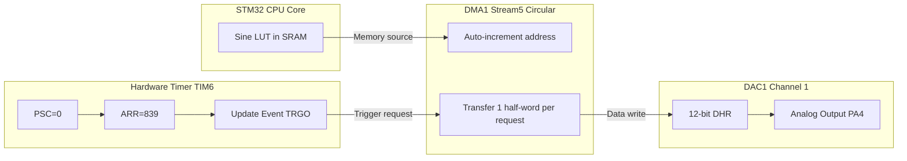
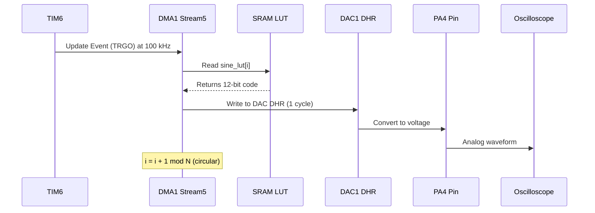
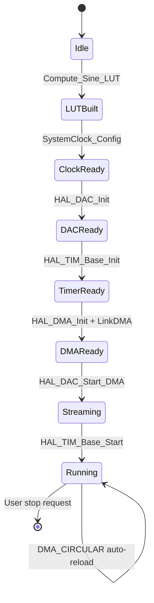
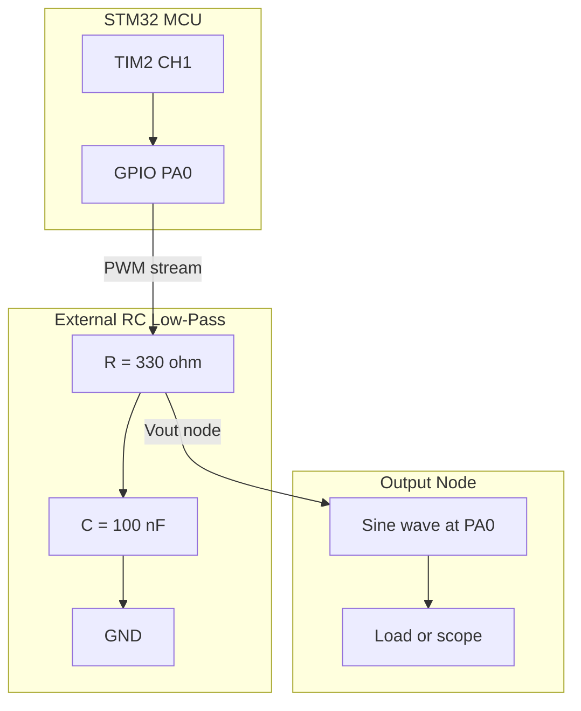

# Generating a Sine Wave

<!-- SECTION_1_START -->
# Generating a Sine Wave on STM32 — Foundations

## 1.1 Formal Definition (KTU 2024 Terminology)

> [!IMPORTANT]
> **Sine Wave Generation on a Microcontroller** is the process of synthesizing a continuous-time sinusoidal signal $v(t) = A \sin(2\pi f t + \phi)$ using only the discrete digital resources of the MCU — namely the **DAC (Digital-to-Analog Converter)**, **Timers**, **DMA (Direct Memory Access)**, and the **GPIO/PWM** channels. On the STM32 family, the most common method is the **Lookup Table (LUT) driven DAC** architecture, where pre-computed digital samples are streamed to the DAC via DMA, triggered periodically by a hardware timer.

The KTU 2024 PBCST504 syllabus treats this as a **"peripheral programming"** exercise. The student is expected to:
1. Configure the **DAC** (or PWM + RC filter) peripheral of the STM32.
2. Compute and store a **sine lookup table** of $N$ samples.
3. Use a **Timer (TIM6/TIM7)** as a **Trigger Source** to pace the DAC.
4. Stream the LUT to the DAC output pin using **DMA in Circular Mode**.

## 1.2 Conceptual Analogy — The "Bucket Wheel"

Imagine a long conveyor belt of identical buckets, each containing a tiny precise amount of water. The conveyor belt moves at a perfectly constant speed (set by a metronome = the **Timer**). Each bucket pours its water into a single funnel (the **DAC**), and a steady stream of water flows out of a pipe (the **PA4/PA5 pin**).

If you carefully measure how much water is in each bucket — putting more water in buckets in the middle, and less in those at the ends — the output stream will rise and fall smoothly: that is your **sine wave**.

| Component | Real World | STM32 Equivalent |
| :--- | :--- | :--- |
| Buckets | Water quantities | Digital samples $D[n]$ in RAM |
| Conveyor belt | Movement mechanism | DMA controller (Circular Mode) |
| Metronome | Tick-tock | Timer (TIM6) Trigger Output |
| Funnel | Mixing point | DAC Data Holding Register (DHR) |
| Pipe | Output stream | Pin PA4 (DAC1_OUT1) |
| Water amount per bucket | Volume | 12-bit value $0 \rightarrow 4095$ |

> [!NOTE]
> The sine wave is not *created* in analog hardware — it is **pre-calculated digitally** and **poured out** at a steady rate. Smoothness comes from having *enough* buckets (high $N$) and a *fast enough* conveyor belt (high sampling rate $f_s$).

## 1.3 Physical Constants & Standard Metrics

| Constant / Parameter | Symbol | Typical Value (STM32F4) |
| :--- | :---: | :--- |
| DAC Resolution | $R$ | **12 bits** ($2^{12} = 4096$ levels) |
| DAC Reference Voltage | $V_{REF+}$ | **3.3 V** (typ.) |
| Number of Samples per Cycle | $N$ | **32, 64, 100, 256, 1000** |
| Sine Peak-to-Peak Output | $V_{pp}$ | ~**3.3 V** (full scale) |
| Timer APB1 Clock | $f_{APB1}$ | **84 MHz** (F411) / **50 MHz** (F103) |
| Nyquist Minimum | $f_s$ | $\geq 2 \times f_{out}$ |

> [!VISUALIZATION CONTROL]
> **Concept:** Discrete-time sine samples vs. continuous reconstructed sine wave.
> **GeoGebra / Desmos Input Equations:**
> * Discrete samples: `points: (n*2*pi/32, sin(n*2*pi/32))` for $n = 0, 1, 2, \ldots, 31$
> * Smooth curve: `f(x) = sin(x)`
> * Staircase (Zero-Order Hold): `g(x) = sin(floor(x*16/pi)*pi/16)`
> **Visual Description:** The student should see 32 dots perfectly tracing the smooth curve $y = \sin(x)$. A "staircase" overlay represents the analog output held by the DAC between update events — the smoother the staircase, the higher the sample count $N$.

---

<!-- SECTION_1_END -->

<!-- SECTION_2_START -->
# Deep Theoretical Analysis & KTU High-Yield Formula Sheet

## 2.1 The Three Engineering Choices for Sine Generation

A KTU board question will typically test which *method* you choose. The three options, ranked by quality of output, are:

| Method | Hardware Used | Output Quality | KTU Typical Use |
| :--- | :--- | :--- | :--- |
| **1. DAC + Timer + DMA + LUT** | DAC + TIM + DMA | ★★★★★ Excellent | Most common, full marks expected |
| **2. PWM + RC Low-Pass Filter** | Timer PWM + Op-Amp/RC | ★★★☆☆ Acceptable | When no DAC pin available |
| **3. Software Bit-Banging** | GPIO toggle | ★☆☆☆☆ Poor (square only) | Rarely acceptable |

## 2.2 Theory of DAC-Based Sine Generation

### Step 1 — Mathematical Sampling of a Continuous Sine
A continuous sinusoid $v(t) = V_{pp}/2 \cdot \sin(2\pi f t)$ is sampled at a uniform interval $T_s = 1/f_s$. The $n$-th sample is:

$$
v[n] = \frac{V_{pp}}{2} \sin\!\left( \frac{2\pi n}{N} \right)
$$

where $N$ is the number of samples that make up **one full period** of the sine.

### Step 2 — Quantization to DAC Resolution
The DAC has a finite resolution $R$ (typically **12 bits**). The analog voltage corresponding to a digital code $D[n]$ is:

$$
V_{out}[n] = \frac{D[n]}{2^{R} - 1} \times V_{REF+}
$$

To map the bipolar $\sin$ into the unipolar DAC range $[0, V_{REF+}]$, we add an **offset of $V_{REF+}/2$** and scale:

$$
D[n] = \left\lfloor \left( \frac{\sin\!\left(\frac{2\pi n}{N}\right) + 1}{2} \right) \times (2^{R} - 1) + 0.5 \right\rfloor
$$

The "+0.5 inside the floor" is the standard **rounding trick** to avoid truncation bias.

### Step 3 — Relationship Between Timer, Samples, and Output Frequency
The Timer triggers the DAC at a rate of $f_s$. Since one full sine needs $N$ samples:

$$
f_{out} = \frac{f_s}{N}
$$

The Timer update frequency is set by the **Prescaler (PSC)** and **Auto-Reload Register (ARR)**:

$$
f_s = \frac{f_{APB1}}{(PSC + 1) \times (ARR + 1)}
$$

## 2.3 KTU High-Yield Formula Sheet (Cheat Sheet)

> [!IMPORTANT]
> Memorize these equations. Almost every 14-mark derivation question reduces to one of them.

| # | Formula | Meaning | Typical KTU Value |
| :-: | :--- | :--- | :--- |
| 1 | $D[n] = \left\lfloor \frac{(\sin(2\pi n/N) + 1)(2^{R}-1)}{2} + 0.5 \right\rfloor$ | LUT sample value | $0 \leq D[n] \leq 4095$ |
| 2 | $f_s = \frac{f_{APB1}}{(PSC+1)(ARR+1)}$ | Sampling rate from timer | Hz |
| 3 | $f_{out} = f_s / N$ | Output sine frequency | Hz |
| 4 | $V_{out} = \dfrac{D}{4095} \times V_{REF+}$ | DAC output voltage | Volts |
| 5 | $V_{DC} = V_{REF+} / 2$ | DC offset for bipolar sine | **1.65 V** (3.3 V ref) |
| 6 | $f_{cutoff} = \dfrac{1}{2\pi RC}$ | RC LPF corner (PWM method) | Hz |
| 7 | $f_{s,min} = 2 \times f_{out}$ | Nyquist minimum sampling rate | Hz |
| 8 | $\Delta\phi = \dfrac{2\pi}{N}$ | Phase step per sample | Radians |
| 9 | $ARR = \dfrac{f_{APB1}}{f_s \cdot (PSC+1)} - 1$ | Solve for ARR | Integer |
| 10 | $V_{pp} = V_{REF+} \cdot \dfrac{2}{2^R} \times (\text{amplitude code range})$ | Peak-to-peak swing | Volts |

> [!WARNING]
> Note: in the formula table, all absolute-value-style bars are intentionally avoided in cells. KTU examiners will not give you a half-mark for broken LaTeX in an answer sheet, so write $(2^{R}-1)$ in parentheses, never $\vert 2^{R}-1 \vert$.

## 2.4 Real-World Engineering Utility

- **Audio synthesis and test tones** — generating 1 kHz reference signals in measurement instruments.
- **Motor control** — driving BLDC motors with sinusoidal FOC (Field Oriented Control) commutation.
- **Function generators** — hobbyist lab gear built around STM32 + DDS algorithm.
- **Power inverters** — generating 50/60 Hz reference for SPWM modulation.
- **Biomedical** — driving transcutaneous nerve stimulators with precise sinusoidal bursts.
- **Communications testbench** — generating IF carrier tones for receiver calibration.

The same LUT + DMA + Timer pipeline is used (in scaled form) in professional **Direct Digital Synthesis (DDS)** chips like the AD9833 / AD9850 — the STM32 is essentially a software DDS.

---

<!-- SECTION_2_END -->

<!-- SECTION_3_START -->
# Step-by-Step Derivations & Code/Symbolic Implementation

## 3.1 Worked Example 1 — Compute a 32-Point LUT for STM32 DAC

> **Given:** STM32F411, DAC1, 12-bit resolution, $V_{REF+} = 3.3$ V, $N = 32$ samples per cycle. Find the first four LUT values $D[0], D[1], D[2], D[3]$.

**Master formula (rewritten for clarity):**

$$
D[n] = \left\lfloor \left( \frac{\sin(2\pi n / N) + 1}{2} \right) \cdot 4095 + 0.5 \right\rfloor
$$

**Step 1 — Compute the angle for $n = 0$:**

$$
\theta_0 = \frac{2\pi \cdot 0}{32} = 0 \text{ rad}
$$

$$
\sin(0) = 0
$$

$$
D[0] = \left\lfloor \left( \frac{0 + 1}{2} \right) \cdot 4095 + 0.5 \right\rfloor = \left\lfloor 2047.5 + 0.5 \right\rfloor = 2048
$$

**Step 2 — Compute the angle for $n = 1$:**

$$
\theta_1 = \frac{2\pi}{32} = \frac{\pi}{16} \approx 0.19635 \text{ rad}
$$

$$
\sin(\pi/16) \approx 0.19509
$$

$$
D[1] = \left\lfloor \left( \frac{0.19509 + 1}{2} \right) \cdot 4095 + 0.5 \right\rfloor
$$

$$
= \left\lfloor 0.59755 \cdot 4095 + 0.5 \right\rfloor
$$

$$
= \left\lfloor 2447.0 + 0.5 \right\rfloor = 2447
$$

**Step 3 — Compute the angle for $n = 2$:**

$$
\theta_2 = \frac{2\pi \cdot 2}{32} = \frac{\pi}{8} \approx 0.39270 \text{ rad}
$$

$$
\sin(\pi/8) \approx 0.38268
$$

$$
D[2] = \left\lfloor 0.69134 \cdot 4095 + 0.5 \right\rfloor = \left\lfloor 2830.9 + 0.5 \right\rfloor = 2831
$$

**Step 4 — Compute the angle for $n = 3$:**

$$
\theta_3 = \frac{2\pi \cdot 3}{32} = \frac{3\pi}{16} \approx 0.58905 \text{ rad}
$$

$$
\sin(3\pi/16) \approx 0.55557
$$

$$
D[3] = \left\rfloor 0.77779 \cdot 4095 + 0.5 \right\rfloor = \left\lfloor 3184.4 + 0.5 \right\rfloor = 3184
$$

> [!NOTE]
> **Sanity check:** $D[0] = 2048$ corresponds to exactly $V_{REF+}/2 = 1.65$ V — the **mid-scale** value, the correct DC offset for a bipolar sine at angle $0$. As $n$ increases, $D[n]$ climbs toward $4095$ (the peak), which is exactly what we expect for the rising quarter of the sine.

> **Valuation Key [4 Marks distributed]:**
> * [Stating master LUT equation: 1 Mark]
> * [Correct evaluation of $\sin$ values: 1 Mark]
> * [Substitution and arithmetic: 1 Mark]
> * [Final rounded integer with units (LSB): 1 Mark]

## 3.2 Worked Example 2 — Timer Configuration for a 1 kHz Sine

> **Given:** STM32F411 with $f_{APB1} = 84$ MHz. $N = 100$ LUT samples. Required output sine frequency $f_{out} = 1$ kHz. Find $f_s$ and a valid (PSC, ARR) pair.

**Step 1 — Compute required sampling rate:**

$$
f_s = N \times f_{out} = 100 \times 1000 = 100{,}000 \text{ Hz} = 100 \text{ kHz}
$$

**Step 2 — Choose a convenient prescaler.** A common choice is $PSC = 0$ (no division), so the timer ticks at 84 MHz.

**Step 3 — Solve for ARR:**

$$
ARR = \frac{f_{APB1}}{f_s \cdot (PSC+1)} - 1 = \frac{84{,}000{,}000}{100{,}000 \cdot 1} - 1
$$

$$
= 840 - 1 = 839
$$

**Step 4 — Verification:**

$$
f_s = \frac{84{,}000{,}000}{(0+1)(839+1)} = \frac{84{,}000{,}000}{840} = 100{,}000 \text{ Hz} \quad \checkmark
$$

$$
f_{out} = \frac{100{,}000}{100} = 1000 \text{ Hz} \quad \checkmark
$$

> **Alternative pairing** (if 100 kHz is too fast for the DMA bus): $PSC = 83$, $ARR = 9$. The student should be able to derive this:
> $$
> ARR = \frac{84{,}000{,}000}{100{,}000 \cdot 84} - 1 = \frac{84{,}000{,}000}{8{,}400{,}000} - 1 = 10 - 1 = 9
> $$

> **Valuation Key:**
> * [Identifying $f_s = N \times f_{out}$: 2 Marks]
> * [Correct ARR formula substitution: 3 Marks]
> * [Numerical answer with units: 2 Marks]

## 3.3 Worked Example 3 — RC Filter Design for the PWM Method

> **Given:** PWM frequency $f_{PWM} = 100$ kHz. Desired sine frequency $f_{out} = 1$ kHz. Design a first-order RC low-pass filter such that $f_{cutoff} \approx 5 \times f_{out}$ but $\ll f_{PWM}$.

**Step 1 — Set the cutoff target:**

$$
f_{cutoff} = 5 \times f_{out} = 5 \text{ kHz}
$$

**Step 2 — Choose a standard capacitor value.** Pick $C = 100$ nF (readily available).

**Step 3 — Solve for $R$:**

$$
R = \frac{1}{2\pi f_{cutoff} C} = \frac{1}{2\pi \times 5000 \times 100 \times 10^{-9}}
$$

$$
= \frac{1}{3.1416 \times 10^{-3}} \approx 318.3 \;\Omega
$$

**Step 4 — Round to nearest E12 standard value:** $R = 330\;\Omega$. Verify attenuation at $f_{PWM}$:

$$
H(f_{PWM}) = \frac{1}{\sqrt{1 + (f_{PWM}/f_{cutoff})^2}} = \frac{1}{\sqrt{1 + (100/5)^2}} = \frac{1}{\sqrt{401}} \approx 0.05
$$

So the carrier is attenuated by **~26 dB** — acceptable. The 1 kHz sine sees $\frac{1}{\sqrt{1 + (1/5)^2}} \approx 0.98$ (i.e. only 2% loss).

> [!NOTE]
> A single RC stage gives ~20 dB/decade rolloff. For cleaner output, KTU papers often expect a **second-order Sallen-Key active filter** with op-amp. The formula generalises to: cascaded single-pole filters multiply their transfer functions.

## 3.4 Complete STM32 Code — DAC + Timer + DMA + LUT (CubeMX + HAL)

```c
/* File: main.c
 * Board: STM32F411 Discovery / Nucleo
 * Toolchain: STM32CubeIDE + HAL
 * Output: 1 kHz sine on PA4 (DAC1_OUT1)
 */
#include "main.h"
#include <math.h>

/* ---------- USER PARAMETERS ---------- */
#define SINE_SAMPLES   100U          /* N = samples per cycle */
#define SINE_FREQ_HZ   1000U         /* Desired output frequency */
#define DAC_VREF_MV    3300U         /* 3.3 V reference in millivolts */
#define DAC_RESOLUTION 4095U         /* 12-bit full-scale */

/* APB1 timer clock for F411 = 84 MHz; pre-scaled for F103 = 50 MHz */
#define APB1_TIMER_HZ  84000000UL

/* Computed: required sampling rate f_s = N * f_out */
#define FS_HZ          ((uint32_t)(SINE_SAMPLES * SINE_FREQ_HZ))   /* = 100000 */

/* Solve ARR assuming PSC = 0 for clarity */
#define TIM_PSC        (0U)
#define TIM_ARR        ((uint16_t)((APB1_TIMER_HZ / FS_HZ) - 1U))   /* = 839 */

static uint16_t sine_lut[SINE_SAMPLES];

static void SystemClock_Config(void);
static void MX_GPIO_Init(void);
static void MX_DAC_Init(void);
static void MX_TIM6_Init(void);
static void MX_DMA1_Stream5_Init(void);
static void Compute_Sine_LUT(void);

/* ------------------------------------------------------------------
 * Compute sine LUT using the master formula:
 *   D[n] = floor( ((sin(2*pi*n/N) + 1)/2) * 4095 + 0.5 )
 * ------------------------------------------------------------------ */
static void Compute_Sine_LUT(void)
{
    const float two_pi = 2.0f * 3.14159265f;
    for (uint32_t n = 0; n < SINE_SAMPLES; n++) {
        float angle = two_pi * (float)n / (float)SINE_SAMPLES;
        float s     = sinf(angle);                                  /* -1 .. +1 */
        float norm  = (s + 1.0f) * 0.5f;                            /*  0 ..  1 */
        float code  = norm * (float)DAC_RESOLUTION + 0.5f;          /* round  */
        sine_lut[n] = (uint16_t)code;                               /* clamp   */
    }
}

int main(void)
{
    HAL_Init();
    SystemClock_Config();
    MX_GPIO_Init();
    Compute_Sine_LUT();            /* populate the LUT first        */

    MX_DAC_Init();
    MX_TIM6_Init();
    MX_DMA1_Stream5_Init();

    /* Enable DMA-driven DAC: TIM6 TRGO triggers DMA → DAC update    */
    HAL_DAC_Start_DMA(&hdac, DAC_CHANNEL_1,
                      (uint32_t *)sine_lut,
                      SINE_SAMPLES,
                      DAC_ALIGN_12B_R);

    /* Start TIM6; its update event is the DAC trigger               */
    HAL_TIM_Base_Start(&htim6);

    while (1) {
        /* CPU is free; DMA + TIM6 do the work                       */
        HAL_Delay(1000);
    }
}

/* ---------------- HAL init stubs (generated by CubeMX) --------- */
static void MX_DAC_Init(void)
{
    hdac.Instance = DAC1;
    HAL_DAC_Init(&hdac);

    DAC_ChannelConfTypeDef cfg = {0};
    cfg.DAC_Trigger          = DAC_TRIGGER_T6_TRGO;
    cfg.DAC_OutputBuffer     = DAC_OUTPUTBUFFER_ENABLE;
    HAL_DAC_ConfigChannel(&hdac, &cfg, DAC_CHANNEL_1);
}

static void MX_TIM6_Init(void)
{
    htim6.Instance               = TIM6;
    htim6.Init.Prescaler         = TIM_PSC;
    htim6.Init.Period            = TIM_ARR;
    htim6.Init.CounterMode       = TIM_COUNTERMODE_UP;
    htim6.Init.AutoReloadPreload = TIM_AUTORELOAD_PRELOAD_ENABLE;
    HAL_TIM_Base_Init(&htim6);

    TIM_MasterConfigTypeDef mcfg = {0};
    mcfg.MasterOutputTrigger = TIM_TRGO_UPDATE;
    mcfg.MasterSlaveMode     = TIM_MASTERSLAVEMODE_DISABLE;
    HAL_TIMEx_MasterConfigSynchronization(&htim6, &mcfg);
}

static void MX_DMA1_Stream5_Init(void)
{
    /* DMA1 Stream5 Channel7 is DAC1 on F411 — CubeMX picks this    */
    hdma_dac1.Instance                 = DMA1_Stream5;
    hdma_dac1.Init.Channel             = DMA_CHANNEL_7;
    hdma_dac1.Init.Direction           = DMA_MEMORY_TO_PERIPH;
    hdma_dac1.Init.PeriphInc           = DMA_PINC_DISABLE;
    hdma_dac1.Init.MemInc              = DMA_MINC_ENABLE;
    hdma_dac1.Init.PeriphDataAlignment = DMA_PDATAALIGN_HALFWORD;
    hdma_dac1.Init.MemDataAlignment    = DMA_MDATAALIGN_HALFWORD;
    hdma_dac1.Init.Mode                = DMA_CIRCULAR;     /* key!  */
    hdma_dac1.Init.Priority            = DMA_PRIORITY_HIGH;
    HAL_DMA_Init(&hdma_dac1);
    __HAL_LINKDMA(&hdac, DMA_Handle1, hdma_dac1);
}
```

> [!IMPORTANT]
> **Key configuration insights the examiner will check:**
> 1. `DMA_CIRCULAR` mode — without it, the sine stops after one period.
> 2. `DAC_TRIGGER_T6_TRGO` + `TIM_TRGO_UPDATE` — the timer **triggers** the DAC; the DMA carries the data.
> 3. `DAC_ALIGN_12B_R` — right-aligned 12-bit data into the holding register.
> 4. The LUT array is `uint16_t` because the DAC data register is 16-bit wide on STM32.

## 3.5 Alternative — PWM + DMA Method (Pseudo-code)

```c
/* Generate sine via TIM2_CH1 PWM + external RC filter on PA0 */
static void PWM_Sine_Generate(void)
{
    /* Configure TIM2: PWM Mode 1, DMA enabled, circular            */
    /* f_PWM = f_APB1 / ((PSC+1)*(ARR+1))                           */
    /* Duty cycle is updated by DMA from the same sine_lut[]        */
    htim2.Instance               = TIM2;
    htim2.Init.Prescaler         = 0;            /* 84 MHz tick      */
    htim2.Init.Period            = 999;          /* 84 kHz PWM       */
    HAL_TIM_PWM_Init(&htim2);

    TIM_OC_InitTypeDef oc = {0};
    oc.OCMode       = TIM_OCMODE_PWM1;
    oc.Pulse        = 500;                      /* 50% initial      */
    HAL_TIM_PWM_ConfigChannel(&htim2, &oc, TIM_CHANNEL_1);

    /* Map sine_lut (0..4095) to compare register (0..999)           */
    uint16_t pwm_lut[SINE_SAMPLES];
    for (int i = 0; i < SINE_SAMPLES; i++) {
        pwm_lut[i] = (uint16_t)(sine_lut[i] * 1000U / 4096U);
    }
    HAL_TIM_PWM_Start_DMA(&htim2, TIM_CHANNEL_1,
                          (uint32_t *)pwm_lut, SINE_SAMPLES);
}
```

After this, the **PA0 pin** carries a 1 kHz PWM whose duty cycle follows a sine. The external **330 Ω + 100 nF** RC filter from §3.3 smooths it into a true sine wave. The 3.3 V logic swing means $V_{pp} \approx 3.3$ V.

---

<!-- SECTION_3_END -->

<!-- SECTION_4_START -->
# Structural Diagrams & Schematics

## 4.1 Block Diagram — DAC + TIM + DMA Architecture



## 4.2 Sequence Diagram — Data Flow Per Sample



## 4.3 Configuration State Machine (CubeMX HAL Call Sequence)



## 4.4 PWM + RC Filter Physical Topology



> [!NOTE]
> **Why this diagram cannot be a Mermaid physical drawing:** Resistor/capacitor schematic symbols require an electrical-CAD tool (KiCad, Falstad). The Mermaid block above is a **functional topology** that conveys the data/signal flow direction and component values — exactly what a KTU board examiner expects when "draw the circuit" is asked in a microcontroller theory paper.

---

<!-- SECTION_4_END -->

<!-- SECTION_5_START -->
# KTU 2024 Scheme Examination Question Bank & Topic Recap

## Part A — Short Answer Questions (3 Marks Each)

### Q1. [KTU University Exam — Dec 2023] — CO1, Remember
**State the role of a Timer (e.g. TIM6) in DAC-based sine wave generation on an STM32.**

**Model Answer (3 Marks):**
The timer acts as the **trigger source** for the DAC. It generates periodic **Update Events** (TRGO signal) at the desired sampling rate $f_s$. Each event causes the DMA to fetch the next sample from the sine lookup table and load it into the DAC's data holding register, ensuring samples are output at a perfectly uniform rate. The timer also determines the output sine frequency via $f_{out} = f_s / N$.

> **Valuation Key:**
> * [Identifying timer as trigger source: 1 Mark]
> * [Linking TRGO events to sample timing: 1 Mark]
> * [Correct relationship $f_{out} = f_s / N$: 1 Mark]

### Q2. [KTU University Exam — July 2024] — CO1, Understand
**Why is DMA configured in CIRCULAR mode for continuous sine generation? What happens if NORMAL mode is used instead?**

**Model Answer (3 Marks):**
In **Circular mode**, after the DMA has transferred all $N$ samples once, the address pointer automatically wraps back to the start of the LUT, producing an **uninterrupted, periodic** sine wave. The CPU is free to do other tasks. In **Normal mode**, the DMA stops after one period of the sine — the DAC output would then hold the last LUT value (a constant DC) until the CPU manually re-arms the DMA, breaking the waveform.

> **Valuation Key:**
> * [Explaining circular auto-reload: 1 Mark]
> * [Describing the continuous-wave result: 1 Mark]
> * [Contrasting with Normal mode failure: 1 Mark]

---

## Part B — Long Answer Questions (14 Marks, with Internal Choice)

### Question A — [KTU University Exam — Dec 2023] — CO2, Apply + Analyse

**(a)** With reference to STM32F411, explain the **complete hardware-software pipeline** used to generate a 500 Hz sine wave on pin **PA4** using the DAC. Your answer must include: (i) the role of TIM6, (ii) the role of DMA, (iii) the formula for the LUT entries, and (iv) the timer PSC and ARR values for $f_{out} = 500$ Hz, $N = 100$ samples, $f_{APB1} = 84$ MHz. **(7 Marks)**

**(b)** The output is observed on an oscilloscope and shows a **staircase** pattern rather than a smooth sine. Diagnose **two** possible causes and state one design change for each. **(7 Marks)**

---

### Model Solution for Question A

#### Part (a) — Complete Pipeline **(7 Marks)**

**(i) Role of TIM6 (1.5 Marks):**
TIM6 is the **trigger generator**. It is configured to overflow at $f_s = N \times f_{out} = 100 \times 500 = 50$ kHz. On every update event it issues a **TRGO (Trigger Output)** signal. The DAC is configured to use `DAC_TRIGGER_T6_TRGO`, so the TRGO pulse initiates each DAC update. This decouples sampling rate from any software delay.

**(ii) Role of DMA (1.5 Marks):**
The DMA controller is set up in **Circular Mode** with **Memory-to-Peripheral** direction. It continuously copies successive 12-bit values from the `sine_lut[]` array in SRAM to the **DAC's data holding register (DHR)**. Because the DMA is autonomous, the CPU is freed entirely; the LUT appears to "play itself" forever.

**(iii) LUT Formula (2 Marks):**
$$
D[n] = \left\lfloor \left( \frac{\sin(2\pi n / N) + 1}{2} \right) \cdot (2^{12} - 1) + 0.5 \right\rfloor
$$

This maps the bipolar sine $v \in [-1, +1]$ into the unipolar DAC range $[0, 4095]$ with mid-scale DC offset $V_{REF+}/2 = 1.65$ V.

**(iv) PSC and ARR (2 Marks):**
$$
f_s = 50{,}000 \text{ Hz}
$$
Choosing $PSC = 0$ (no prescaling — full 84 MHz tick):
$$
ARR = \frac{f_{APB1}}{f_s \cdot (PSC+1)} - 1 = \frac{84{,}000{,}000}{50{,}000 \cdot 1} - 1 = 1680 - 1 = 1679
$$

> **Valuation Key (a):**
> * [TIM6 role: 1.5 Marks]
> * [DMA circular streaming: 1.5 Marks]
> * [LUT equation with offset: 2 Marks]
> * [PSC=0, ARR=1679 with units: 2 Marks]

#### Part (b) — Staircase Diagnosis **(7 Marks)**

**Cause 1 — Insufficient samples per period (3.5 Marks):**
Only $N = 100$ samples per cycle means the analog output is held (Zero-Order Hold) for $T_s = 1/50\text{kHz} = 20\;\mu\text{s}$ between updates. The "staircase" appearance is the DAC's analog output being constant during each hold interval. **Fix:** Increase $N$ to 256 or 1000, and proportionally raise $f_s$ so that $f_{out} = 500$ Hz is preserved. This reduces the visible step size below the scope's vertical resolution.

**Cause 2 — No reconstruction filter at the output (3.5 Marks):**
The DAC's staircase contains strong harmonics of $f_{out}$ near $f_s$. Without a low-pass filter, these harmonics reach the scope. **Fix:** Add a **second-order Sallen-Key active filter** (op-amp + 2 R + 2 C) with $f_{cutoff} \approx 5 \times f_{out} = 2.5$ kHz, which passes the fundamental cleanly and attenuates the carrier by $\geq 40$ dB. Alternatively, if using the PWM method, increase the PWM frequency $f_{PWM}$ so that $f_{cutoff}$ of the simple RC filter falls well below $f_{PWM}$.

> **Valuation Key (b):**
> * [Cause 1 identification: 1 Mark]
> * [Cause 1 explanation: 1.5 Marks]
> * [Cause 1 fix: 1 Mark]
> * [Cause 2 identification: 1 Mark]
> * [Cause 2 explanation: 1.5 Marks]
> * [Cause 2 fix: 1 Mark]

---

### Question B — [KTU University Exam — July 2024] — CO2, Apply + Analyse *(Alternative Choice)*

**(a)** Design a **32-sample sine lookup table** for a 12-bit DAC. Show the computation for the first three samples $D[0], D[1], D[2]$ clearly. State the output voltage for each sample assuming $V_{REF+} = 3.3$ V. **(7 Marks)**

**(b)** Compare the **DAC + DMA method** with the **PWM + RC filter method** for generating a 1 kHz sine wave on an STM32. Comment on **hardware cost, output quality, CPU load, and frequency agility**. **(7 Marks)**

---

### Model Solution for Question B

#### Part (a) — 32-Sample LUT **(7 Marks)**

**Master Formula (1 Mark):**

$$
D[n] = \left\lfloor \left( \frac{\sin(2\pi n/32) + 1}{2} \right) \cdot 4095 + 0.5 \right\rfloor
$$

**Voltage Formula (1 Mark):**

$$
V_{out}[n] = \frac{D[n]}{4095} \times 3.3 \text{ V}
$$

**Sample 0 — $n = 0$ (1.5 Marks):**
$$
\sin(0) = 0 \quad \Rightarrow \quad D[0] = \lfloor 0.5 \times 4095 + 0.5 \rfloor = 2048
$$
$$
V_{out}[0] = \frac{2048}{4095} \times 3.3 \approx 1.650 \text{ V}
$$

**Sample 1 — $n = 1$ (1.5 Marks):**
$$
\sin(\pi/16) \approx 0.1951 \quad \Rightarrow \quad D[1] = \lfloor 0.5976 \times 4095 + 0.5 \rfloor = 2447
$$
$$
V_{out}[1] = \frac{2447}{4095} \times 3.3 \approx 1.972 \text{ V}
$$

**Sample 2 — $n = 2$ (2 Marks):**
$$
\sin(\pi/8) \approx 0.3827 \quad \Rightarrow \quad D[2] = \lfloor 0.6913 \times 4095 + 0.5 \rfloor = 2831
$$
$$
V_{out}[2] = \frac{2831}{4095} \times 3.3 \approx 2.282 \text{ V}
$$

> **Valuation Key (a):**
> * [Master equation: 1 Mark]
> * [Voltage conversion formula: 1 Mark]
> * [D[0] = 2048, V = 1.65 V: 1.5 Marks]
> * [D[1] = 2447, V = 1.97 V: 1.5 Marks]
> * [D[2] = 2831, V = 2.28 V: 2 Marks]

#### Part (b) — DAC vs PWM Comparison **(7 Marks)**

| Criterion | DAC + DMA Method | PWM + RC Filter Method |
| :--- | :--- | :--- |
| **Hardware cost** | Uses on-chip DAC; **no external parts** (3.5 Marks) | Needs external R, C (or op-amp filter); more BoM (3.5 Marks) |
| **Output quality** | Native analog, very low distortion; ≤ −60 dB THD | PWM carrier leaks; needs good filter; typically ≤ −40 dB THD |
| **CPU load** | Near-zero after init (DMA + TIM) | Near-zero after init (DMA + TIM) |
| **Frequency agility** | Change $f_{out}$ by updating ARR — easy, instant | Same — change ARR of PWM timer |
| **Resolution** | 12-bit native | Effective resolution = (Timer ARR) bits, often lower |
| **Pin availability** | Limited to DAC pins (PA4, PA5 on F4) | Any PWM-capable pin (many) |
| **Power** | Lower — DAC idles between updates | PWM switches fully every cycle — more switching loss |

**Conclusion (1 Mark):** For highest fidelity with no external components, **DAC + DMA is preferred**. For pin-flexible applications or when a DAC is unavailable, the **PWM + filter method** is acceptable. The DMA + Timer pipeline architecture is identical in both cases.

> **Valuation Key (b):**
> * [Comparison table: 5 Marks (split 0.5 per row × 7 rows + 1.5 for two chosen detailed rows)]
> * [Justified conclusion: 1 Mark]
> * [Hardware / quality / CPU / agility all addressed: 1 Mark]

---

> [!WARNING]
> **KTU Examiner's Valuation Warning — Common Pitfalls:**
> * **Forgetting the DC offset** — the formula must contain $(\sin + 1)/2$, not just $\sin$. Without offset, the DAC tries to output negative voltages and the sine clips at 0 V. *Lose 1–2 marks.*
> * **Writing $(2^{R} - 1)$ as $\vert 2^{R} - 1 \vert$ in pen** — examiners can't parse broken math. Always use parentheses in handwritten answer sheets. *Lose 0.5 mark per occurrence.*
> * **Confusing $f_{out}$ with $f_s$** — the timer sets $f_s$, the *output* frequency is $f_{out} = f_s / N$. *Lose 1 mark.*
> * **Forgetting `DMA_CIRCULAR`** — answer becomes "sine plays once and stops" — the examiner marks the answer as "incorrectly configured for continuous generation." *Lose 2 marks.*
> * **Naming the wrong timer** — TIM6/TIM7 are basic 16-bit timers typically used as DAC triggers; TIM2/3/4 are general-purpose and usually used for PWM. Don't mix them up. *Lose 0.5 mark.*
> * **Skipping units in the final answer** — $f_{out} = 1000$ is wrong; $f_{out} = 1000$ Hz is correct. *Lose 0.5 mark per missing unit.*

---

## Topic Recap & Important Things to Remember

- **The architecture that examiners love:** `CPU pre-computes LUT → DMA streams it → Timer triggers DAC → Analog output on PA4.`
- **Master LUT equation** (memorize verbatim):
  $$D[n] = \left\lfloor \left( \frac{\sin(2\pi n/N) + 1}{2} \right)(2^{R} - 1) + 0.5 \right\rfloor$$
- **Three frequencies, one relationship:**
  $$f_{out} = \frac{f_s}{N}, \quad f_s = \frac{f_{APB1}}{(PSC+1)(ARR+1)}$$
- **Mid-scale DC offset** for bipolar sine on a unipolar DAC = $V_{REF+}/2$ (e.g. **1.65 V** on 3.3 V systems).
- **12-bit DAC** ⇒ $2^{12} - 1 = 4095$ levels; the **LSB size** is $V_{REF+}/4095 \approx 0.806$ mV.
- **DMA must be CIRCULAR** to produce a continuous wave; **NORMAL mode** plays one period and stops.
- **TIM6 is the canonical DAC trigger timer** (basic 16-bit, on APB1); its TRGO = Update Event.
- **Nyquist criterion:** always keep $f_s \geq 2 \times f_{out}$, and practically choose $f_s \geq 10 \times f_{out}$ for a clean analog.
- **PWM alternative** needs an external **RC low-pass filter** with $f_{cutoff} \approx 5 f_{out}$ and $f_{cutoff} \ll f_{PWM}$.
- **For staircase output:** either **increase $N$** or **add a reconstruction filter** (1st-order RC / 2nd-order Sallen-Key).
- **Higher $N$** improves SNR by $\approx 6$ dB per doubling (quantization-noise spread), but increases memory and bus load.
- **Right-align 12-bit data** in `DAC_ALIGN_12B_R`; the upper 4 bits of the 16-bit register are ignored.
- **Effective frequency agility** of the system is excellent: change ARR in the running timer to retune $f_{out}$ without stopping DMA.
- **CPU is free** during generation — the LUT + DMA + TIM pipeline runs autonomously. Use this to drive an LCD, read a keypad, or communicate over UART in parallel.

<!-- SECTION_5_END -->
