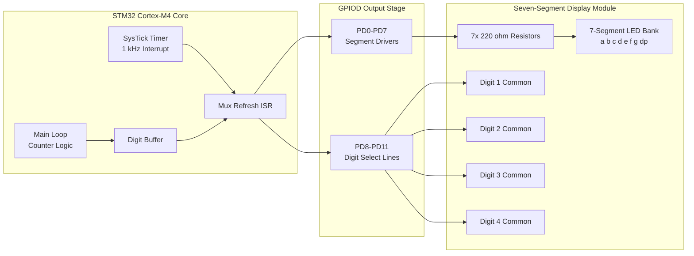
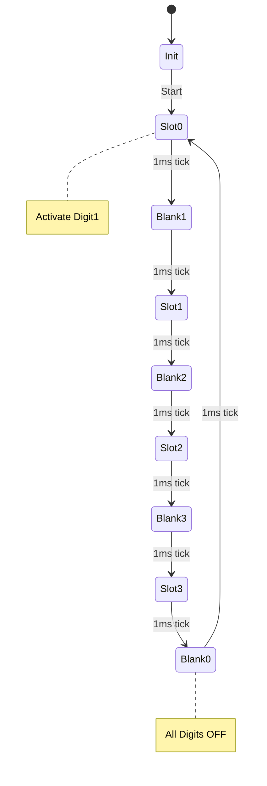
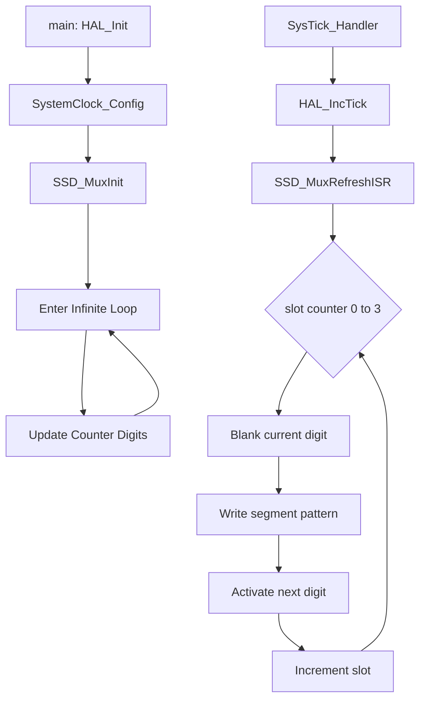
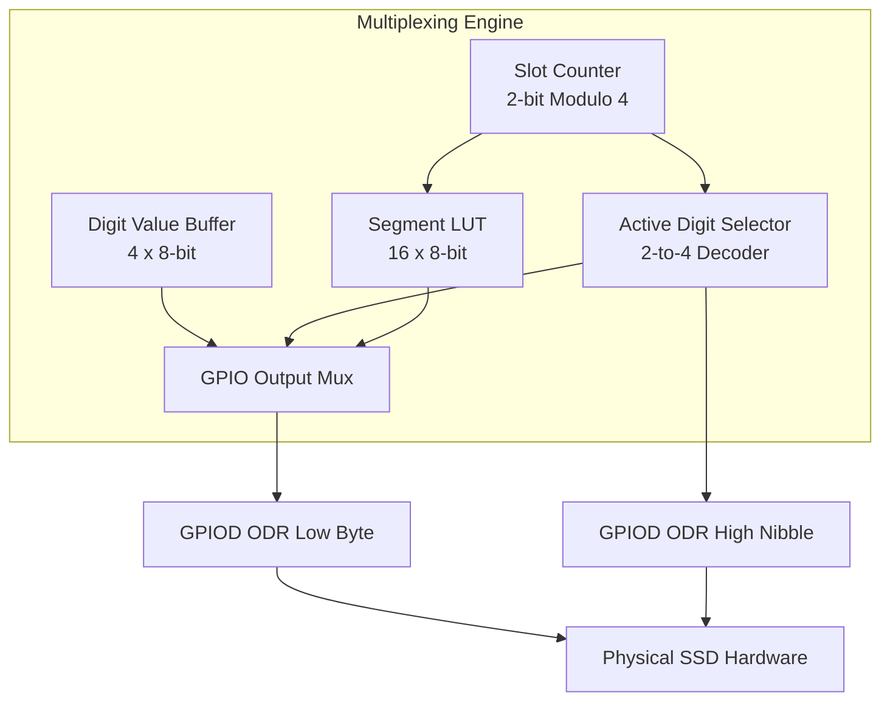

# Interfacing Seven-Segment Display

<!-- SECTION_1_START -->
# Interfacing Seven-Segment Display with STM32

## 1.1 Core Technical Definition

> [!IMPORTANT]
> **Seven-Segment Display (SSD):** A seven-segment display is an electronic display device composed of seven rectangular LEDs (labeled **a, b, c, d, e, f, g**) arranged in a figure-of-8 pattern, plus an optional decimal point **dp**. By selectively energizing specific segments, it can render the decimal digits **0–9** and a limited set of alphabetic characters (A, b, C, d, E, F).

In the **KTU 2024 Scheme** context (PBCST504 – Microcontrollers), the seven-segment display is treated as the canonical first-step peripheral to understand:
- **General Purpose Input/Output (GPIO)** configuration
- **Current sinking vs. current sourcing** in CMOS logic
- **Active-HIGH vs. Active-LOW** driving
- **Software-based time-division multiplexing (TDM)** for multi-digit displays

### 1.1.1 Two Fundamental Variants

| Type | Common Terminal | LED Anode/Cathode | STM32 Driving Logic |
|---|---|---|---|
| **Common Cathode (CC)** | All cathodes tied to **GND** | LED anode driven HIGH | GPIO **HIGH = ON** |
| **Common Anode (CA)** | All anodes tied to **Vcc (3.3 V)** | LED cathode driven LOW | GPIO **LOW = ON** |

> [!NOTE]
> **KTU Board Standard:** The KTU laboratory kit (typically based on STM32F407 Discovery / Nucleo-F446ZE) uses **Common Cathode** displays, driven through **current-limiting resistors** of **220 Ω – 330 Ω**.

---

## 1.2 Conceptual Analogy & Intuitive Overview

Imagine a **digital alarm clock** displaying "**12:34**". Behind the scenes, only one digit is physically "lit" at any given microsecond, but the digits are switched so rapidly (typically every **2–5 ms**) that the human eye perceives all four as glowing simultaneously. This illusion is the **Persistence of Vision (POV)** principle, and the technique is called **Multiplexing**.

> **Analogy:** Think of a seven-segment display as a **combination padlock with 7 sliders (a–g)**. Each slider is either pushed up (ON) or down (OFF). For example, to display the digit **"3"**, you push up sliders **a, b, c, d, g** and leave **e, f** down. The microcontroller acts as the **lock's "operator"** who pushes the correct combination for each digit in rapid succession.

> [!TIP]
> **POV Threshold:** The human eye fuses flickering images when the refresh rate exceeds approximately **50 Hz** (i.e., each digit gets a slot of less than ~5 ms in a 4-digit multiplexed display). A safety margin of **2 ms per digit** (yielding ~125 Hz refresh) is the KTU-recommended practice.

---

## 1.3 Visualizing the Segment Layout

> [!VISUALIZATION CONTROL]
> **Concept:** Physical segment geometry of a standard SSD
> **Reference Pins:** Top view, segments labeled **a (top), b (top-right), c (bottom-right), d (bottom), e (bottom-left), f (top-left), g (center)**, and **dp (bottom-right corner)**
> **Visual Description:** Draw a figure-of-8. The center horizontal bar is segment **g**. The top bar is **a**. Reading clockwise from the top: **a → b → c → d → e → f**. The decimal point **dp** sits at the lower-right, just outside segment **c**.

```
   --- a ---
  |         |
  f         b
  |         |
   --- g ---
  |         |
  e         c
  |         |
   --- d ---   . dp
```

---

## 1.4 Physical Constants & Standard Metrics

| Parameter | Standard Value (KTU Lab) | Symbol |
|---|---|---|
| Forward voltage per segment (Red LED) | **1.8 V – 2.2 V** | $V_f$ |
| Typical segment current | **5 mA – 20 mA** | $I_{seg}$ |
| STM32 GPIO source/sink current | **±8 mA** (standard) / **±20 mA** (limited) | $I_{IO}$ |
| Logic HIGH voltage (3.3 V CMOS) | **3.3 V** | $V_{OH}$ |
| Refresh rate (4-digit mux) | **≥ 60 Hz** | $f_{refresh}$ |
| Time slot per digit (4-digit) | **~2 ms** | $t_{slot}$ |

---

## 1.5 Why SSD Interfacing Matters in STM32 Embedded Engineering

- **Industrial Scoreboards & Clocks:** Cheap, sunlight-readable, no backlight needed
- **Medical Equipment:** Reliable numeric readout in low-power instruments
- **Appliance Displays:** Microwave ovens, washing machines, induction cooktops
- **Educational Bridge:** The first peripheral where students learn **port masking**, **lookup tables (LUTs)**, and **timer-driven multiplexing**—all critical skills in production embedded firmware.
<!-- SECTION_1_END -->

<!-- SECTION_2_START -->
# Deep Theoretical Analysis & KTU High-Yield Formula Sheet

## 2.1 Operational Theory: How an SSD Segment Lights Up

A seven-segment LED is a **Light Emitting Diode**. When forward-biased (anode voltage > cathode voltage by at least $V_f$), current flows and the segment emits light.

### 2.1.1 Forward Current Calculation (Kirchhoff's Voltage Law)

For a **Common Cathode** segment driven by an STM32 GPIO:

$$V_{OH} = V_f + V_{R_{limit}} \quad \Rightarrow \quad I_{seg} = \frac{V_{OH} - V_f}{R_{limit}}$$

**Numerical Example (KTU Exam Favorite):**
Given $V_{OH} = 3.3\,\text{V}$, $V_f = 2.0\,\text{V}$, desired $I_{seg} = 10\,\text{mA}$:

$$R_{limit} = \frac{3.3 - 2.0}{10 \times 10^{-3}} = \frac{1.3}{0.010} = 130\,\Omega$$

> [!IMPORTANT]
> **Closest standard E12 value: 120 Ω or 150 Ω.** Always round **up** to limit current safely. KTU board kits use **220 Ω** (yielding ~6 mA) for a longer LED lifetime.

---

## 2.2 Active-HIGH vs. Active-LOW Driving (Board-Specific)

| SSD Type | Segment ON condition | Bit value in GPIO register |
|---|---|---|
| Common Cathode | GPIO = **1** (HIGH) | `1` |
| Common Anode | GPIO = **0** (LOW) | `0` |

> [!WARNING]
> **Common Pitfall:** Copy-pasting code from a CC example into a CA circuit **inverts every segment**—you get the digit "**6**" when you wanted "**9**", with the middle bar always on. Always re-derive the LUT.

---

## 2.3 KTU Formula Sheet / Cheat Sheet

| Concept | Formula | Notes |
|---|---|---|
| Segment current (CC) | $I_{seg} = \frac{V_{OH} - V_f}{R_{limit}}$ | Use $V_{OH} = 3.3\,\text{V}$ for STM32 |
| Refresh frequency | $f_{refresh} = \frac{1}{N \cdot t_{slot}}$ | $N$ = number of digits |
| Duty cycle per digit | $D = \frac{1}{N} \times 100\%$ | For 4-digit: 25 % |
| Segment power | $P_{seg} = V_f \cdot I_{seg}$ | Sum over active segments |
| Average digit current | $I_{avg} = D \cdot I_{seg}$ | Multiplexed displays draw less |
| LUT index (CC) | `gfedcba` bit-order (active-HIGH) | MSB = g, LSB = a |

### 2.3.1 Canonical Hex LUT for Common Cathode (Active-HIGH, bit order: `dp g f e d c b a`)

| Digit | Segments (a b c d e f g) | Hex Code (0x__ , dp=0) | Decoded |
|---|---|---|---|
| 0 | 1 1 1 1 1 1 0 | **0x3F** | a,b,c,d,e,f ON |
| 1 | 0 1 1 0 0 0 0 | **0x06** | b,c ON |
| 2 | 1 1 0 1 1 0 1 | **0x5B** | a,b,d,e,g ON |
| 3 | 1 1 1 1 0 0 1 | **0x4F** | a,b,c,d,g ON |
| 4 | 0 1 1 0 0 1 1 | **0x66** | b,c,f,g ON |
| 5 | 1 0 1 1 0 1 1 | **0x6D** | a,c,d,f,g ON |
| 6 | 1 0 1 1 1 1 1 | **0x7D** | a,c,d,e,f,g ON |
| 7 | 1 1 1 0 0 0 0 | **0x07** | a,b,c ON |
| 8 | 1 1 1 1 1 1 1 | **0x7F** | All ON |
| 9 | 1 1 1 1 0 1 1 | **0x6F** | a,b,c,d,f,g ON |
| A | 1 1 1 0 1 1 1 | **0x77** | a,b,c,e,f,g ON |
| b | 0 0 1 1 1 1 1 | **0x7C** | c,d,e,f,g ON |
| C | 1 0 0 1 1 1 0 | **0x39** | a,d,e,f ON |
| d | 0 1 1 1 1 0 1 | **0x5E** | b,c,d,e,g ON |
| E | 1 0 0 1 1 1 1 | **0x79** | a,d,e,f,g ON |
| F | 1 0 0 0 1 1 1 | **0x71** | a,e,f,g ON |

---

## 2.4 Multiplexing Theory (Time-Division Multiplexing)

For an **N-digit** display:
1. Activate digit-1 (drive its common pin LOW for CC)
2. Write segment pattern for digit-1's value to shared segment lines
3. Wait $t_{slot}$ (typically 2 ms)
4. Deactivate digit-1
5. Activate digit-2, write its pattern, wait, deactivate
6. Repeat cyclically for all $N$ digits
7. Loop back to digit-1

> [!NOTE]
> **Why Multiplex?** Driving each digit statically would need $8 \cdot N$ GPIO pins. Multiplexing reduces this to $7 + N$ pins (7 segments + 1 common per digit), freeing pins for other peripherals.

---

## 2.5 STM32 GPIO Configuration Parameters

| Parameter | Typical Setting for SSD | KTU Standard |
|---|---|---|
| Mode | **Output Push-Pull** | `GPIO_MODE_OUTPUT_PP` |
| Pull-up / Pull-down | **None** | `GPIO_NOPULL` |
| Speed | **Low / Medium** (signals are slow) | `GPIO_SPEED_FREQ_LOW` |
| Initial state | OFF (segment dark) | `GPIO_PIN_RESET` |
| Alternate function | **Not used** | `GPIO_MODE_OUTPUT_PP` only |

> [!TIP]
> **High-Speed is unnecessary for SSD:** Setting `GPIO_SPEED_FREQ_HIGH` on segment lines increases **slew rate** and **EMI**. Stick to **LOW** unless your $t_{slot}$ is below 100 µs (very large displays).

---

## 2.6 Real-World Engineering Utility

- **Automotive dashboards** still use multiplexed LED segments under the LCD for "always-readable" indicators
- **Production firmware** often uses a **hardware timer interrupt** (e.g., SysTick @ 1 kHz) to refresh digits without blocking the main loop—essential for real-time systems
- **Energy savings:** Multiplexing reduces average current draw by a factor of $N$, critical in **battery-powered IoT** displays
<!-- SECTION_2_END -->

<!-- SECTION_3_START -->
# Step-by-Step Derivations & Code Implementation

## 3.1 Hardware Derivation: Current-Limiting Resistor

> [!IMPORTANT]
> **KTU 2024 Sample Problem:** Calculate the current-limiting resistor for a common-cathode SSD segment driven by an STM32F4 GPIO (3.3 V), given $V_f = 2.0\,\text{V}$ and maximum allowed segment current $I_{seg} = 8\,\text{mA}$.

### Step-by-Step Solution:

**Step 1: Identify given values**

$$V_{OH} = 3.3\,\text{V}, \quad V_f = 2.0\,\text{V}, \quad I_{seg} = 8\,\text{mA}$$

**Step 2: Apply KVL across the segment branch**

$$V_{R_{limit}} = V_{OH} - V_f = 3.3 - 2.0 = 1.3\,\text{V}$$

**Step 3: Apply Ohm's Law**

$$R_{limit} = \frac{V_{R_{limit}}}{I_{seg}} = \frac{1.3}{8 \times 10^{-3}} = 162.5\,\Omega$$

**Step 4: Round up to nearest E12 standard value**

$$R_{limit} \approx 180\,\Omega \text{ (safe choice)}$$

> **Note:** If the E24 series is available, 160 Ω is acceptable. The KTU board uses 220 Ω which yields ~5.9 mA—safe for STM32 and long LED life.

---

## 3.2 Lookup Table Derivation for Digit "5"

To display the digit **5**, the segments that must glow are: **a, c, d, f, g**. The segments that must remain OFF are: **b, e**.

**Step 1:** Map segment names to bit positions (bit-0 = a, bit-6 = g):

| Bit | g | f | e | d | c | b | a |
|---|---|---|---|---|---|---|---|
| Position | 6 | 5 | 4 | 3 | 2 | 1 | 0 |
| Value for "5" | 1 | 1 | 0 | 1 | 1 | 0 | 1 |

**Step 2:** Compute the byte:

$$0 \times 7F \cdot 0 \times 01 + 0 \times 7F \cdot 0 \times 02 + \ldots$$

Calculated directly:

$$0b0110\,1101 = 0x6D$$

> **Verification:** Bits set = {a, c, d, f, g} → matches our requirement for the digit "5". ✓

---

## 3.3 STM32 GPIO Pin Mapping (KTU Standard Board)

| Function | STM32 Pin (Port) | Bit Position |
|---|---|---|
| Segment a | PD0 | Bit 0 |
| Segment b | PD1 | Bit 1 |
| Segment c | PD2 | Bit 2 |
| Segment d | PD3 | Bit 3 |
| Segment e | PD4 | Bit 4 |
| Segment f | PD5 | Bit 5 |
| Segment g | PD6 | Bit 6 |
| Decimal Point (dp) | PD7 | Bit 7 |
| Digit 1 Common | PD8 | — |
| Digit 2 Common | PD9 | — |
| Digit 3 Common | PD10 | — |
| Digit 4 Common | PD11 | — |

> [!NOTE]
> Using a **single 8-bit GPIO port (PORTD)** simplifies software: write the segment byte to `GPIOA->ODR` low byte and digit-select bits to the high byte (or use separate port for digit select).

---

## 3.4 Full STM32 Implementation (HAL Library)

### 3.4.1 Single-Digit Static Display (No Multiplexing)

```c
/**
 * @file ssd_static.c
 * @brief Static single-digit SSD driver for STM32F4 (Common Cathode).
 * @details Writes a single hex digit (0–F) to a 7-segment display.
 *          Hardware: Segments a–g, dp on GPIOD pins 0–7.
 *          Digit common cathode tied to GND.
 */

#include "stm32f4xx_hal.h"
#include "ssd_lut.h"   /* Contains: extern const uint8_t ssd_lut_cc[16]; */

/**
 * @brief  Initializes GPIOD pins 0–7 as push-pull outputs.
 * @note   Called once from main() after HAL_Init() and SystemClock_Config().
 * @retval None
 */
void SSD_SingleInit(void)
{
    GPIO_InitTypeDef GPIO_InitStruct = {0};

    /* Enable GPIOD clock (bit 3 in RCC->AHB1ENR) */
    __HAL_RCC_GPIOD_CLK_ENABLE();

    /* Configure PD0..PD7 as output, no pull, low speed, push-pull */
    GPIO_InitStruct.Pin   = 0x00FFU;             /* Binary: 0000 0000 1111 1111 */
    GPIO_InitStruct.Mode  = GPIO_MODE_OUTPUT_PP; /* Push-pull output */
    GPIO_InitStruct.Pull  = GPIO_NOPULL;         /* No pull-up / pull-down */
    GPIO_InitStruct.Speed = GPIO_SPEED_FREQ_LOW; /* Slew rate limited */
    HAL_GPIO_Init(GPIOD, &GPIO_InitStruct);

    /* Ensure all segments are OFF at startup */
    GPIOD->BSRR = 0x00FF0000U; /* Reset bits 0–7 (active-low reset via BSRR upper half) */
}

/**
 * @brief  Displays a single hex digit (0–F) on the SSD.
 * @param  digit: integer in range [0, 15]. Out-of-range values display blank.
 * @retval None
 */
void SSD_SingleDisplay(uint8_t digit)
{
    uint8_t pattern;

    /* Bounds check: clamp to blank (0x00) for invalid input */
    if (digit > 15U) {
        pattern = 0x00U;       /* All segments OFF */
    } else {
        pattern = ssd_lut_cc[digit]; /* Lookup from canonical LUT */
    }

    /* Clear lower 8 bits of PORTD without RMW (read-modify-write) glitch */
    GPIOD->BSRR = (0x00FFU << 16);   /* Atomic reset of pins 0–7 */
    GPIOD->BSRR = (uint32_t)pattern; /* Atomic set   of pins 0–7 */

    /* NOTE: dp (bit 7) is set to 0 in LUT, so decimal point stays off. */
}

/**
 * @brief  Turns off all segments (blank display).
 * @retval None
 */
void SSD_SingleClear(void)
{
    GPIOD->BSRR = (0x00FFU << 16);
}
```

### 3.4.2 Lookup Table Definition (Active-HIGH, Common Cathode)

```c
/**
 * @file ssd_lut.c
 * @brief 7-Segment Hex Lookup Table for Common Cathode SSD.
 * @note  Bit order (LSB→MSB): a b c d e f g dp
 *        Index 0..15 maps to hex digits 0..F.
 */
#include "ssd_lut.h"

const uint8_t ssd_lut_cc[16] = {
    /*  0   */ 0x3FU,  /* 0b0011 1111 → a b c d e f       */
    /*  1   */ 0x06U,  /* 0b0000 0110 → b c               */
    /*  2   */ 0x5BU,  /* 0b0101 1011 → a b d e g         */
    /*  3   */ 0x4FU,  /* 0b0100 1111 → a b c d g         */
    /*  4   */ 0x66U,  /* 0b0110 0110 → b c f g           */
    /*  5   */ 0x6DU,  /* 0b0110 1101 → a c d f g         */
    /*  6   */ 0x7DU,  /* 0b0111 1101 → a c d e f g       */
    /*  7   */ 0x07U,  /* 0b0000 0111 → a b c             */
    /*  8   */ 0x7FU,  /* 0b0111 1111 → a b c d e f g     */
    /*  9   */ 0x6FU,  /* 0b0110 1111 → a b c d f g       */
    /*  A   */ 0x77U,  /* 0b0111 0111 → a b c e f g       */
    /*  b   */ 0x7CU,  /* 0b0111 1100 → c d e f g         */
    /*  C   */ 0x39U,  /* 0b0011 1001 → a d e f           */
    /*  d   */ 0x5EU,  /* 0b0101 1110 → b c d e g         */
    /*  E   */ 0x79U,  /* 0b0111 1001 → a d e f g         */
    /*  F   */ 0x71U   /* 0b0111 0001 → a e f g           */
};
```

### 3.4.3 4-Digit Multiplexed Display Driver (Timer Interrupt-Based)

```c
/**
 * @file ssd_mux.c
 * @brief Multiplexed 4-digit SSD driver using a 1 kHz SysTick interrupt.
 * @details
 *   Hardware map:
 *     - PD0..PD6 → Segments a..g
 *     - PD7      → dp
 *     - PD8..PD11 → Digit 1..4 common (active LOW for CC)
 *
 *   Refresh strategy:
 *     - SysTick @ 1 ms (1 kHz) increments a "slot counter" 0..3
 *     - At each slot boundary, the previous digit is blanked,
 *       the new digit's pattern is written, and the new digit
 *       common pin is asserted.
 *     - Total refresh period = 4 ms → 250 Hz, well above POV threshold.
 */

#include "stm32f4xx_hal.h"
#include "ssd_lut.h"

/* Module-private state */
static volatile uint8_t  s_digit_values[4] = {0, 0, 0, 0};
static volatile uint8_t  s_active_slot    = 0U;
static volatile uint32_t s_tick_counter   = 0U;

/* Digit-select bit-mask table (active LOW: 0 = ON, 1 = OFF) */
static const uint16_t s_digit_select_mask[4] = {
    0xFEFFU,  /* Digit 1: clear bit 8 */
    0xFDFFU,  /* Digit 2: clear bit 9 */
    0xFBFFU,  /* Digit 3: clear bit 10 */
    0xF7FFU   /* Digit 4: clear bit 11 */
};

/**
 * @brief  Initializes GPIOD pins 0–11 for segments + 4 digit commons.
 * @retval None
 */
void SSD_MuxInit(void)
{
    GPIO_InitTypeDef GPIO_InitStruct = {0};

    __HAL_RCC_GPIOD_CLK_ENABLE();

    /* Configure PD0..PD11 as output push-pull, no pull, low speed */
    GPIO_InitStruct.Pin   = 0x0FFFU;             /* Bits 0..11 */
    GPIO_InitStruct.Mode  = GPIO_MODE_OUTPUT_PP;
    GPIO_InitStruct.Pull  = GPIO_NOPULL;
    GPIO_InitStruct.Speed = GPIO_SPEED_FREQ_LOW;
    HAL_GPIO_Init(GPIOD, &GPIO_InitStruct);

    /* Disable all digits initially (set all digit commons HIGH) */
    GPIOD->BSRR = 0x0F00U;   /* Set bits 8..11 (turn OFF all 4 digits) */

    /* Clear all segments */
    GPIOD->BSRR = (0x00FFU << 16);
}

/**
 * @brief  Sets the value to be displayed on a specific digit position.
 * @param  position: 0..3 (0 = leftmost, 3 = rightmost)
 * @param  value:    0..15 (hex digit)
 * @retval None
 */
void SSD_MuxSetDigit(uint8_t position, uint8_t value)
{
    if (position < 4U) {
        if (value > 15U) {
            s_digit_values[position] = 0U; /* Blank for invalid */
        } else {
            s_digit_values[position] = value;
        }
    }
}

/**
 * @brief  Refresh routine: call from SysTick @ 1 kHz.
 * @note   Implements time-division multiplexing. Must be ISR-safe
 *         (no blocking calls, no floating point).
 * @retval None
 */
void SSD_MuxRefreshISR(void)
{
    uint8_t pattern;
    uint16_t port_state;

    s_tick_counter++;

    /* --- Step 1: Blank the current digit (turn OFF its common) --- */
    /* Set all 4 digit commons HIGH (inactive) */
    GPIOD->BSRR = 0x0F00U;

    /* --- Step 2: Write the segment pattern for the CURRENT slot --- */
    pattern = ssd_lut_cc[s_digit_values[s_active_slot]];

    /* Clear segment bits 0..7 atomically, then write new pattern */
    GPIOD->BSRR = (0x00FFU << 16);
    GPIOD->BSRR = (uint32_t)pattern;

    /* --- Step 3: Activate the current digit (pull its common LOW) --- */
    port_state = GPIOD->ODR;
    port_state &= s_digit_select_mask[s_active_slot];
    GPIOD->ODR = port_state;

    /* --- Step 4: Advance to the next slot (modulo 4) --- */
    s_active_slot++;
    if (s_active_slot >= 4U) {
        s_active_slot = 0U;
    }
}
```

### 3.4.4 Main Application (Bare-Metal Style with SysTick Hook)

```c
/**
 * @file main.c
 * @brief Demonstration: count up 0..9999 on a 4-digit multiplexed SSD.
 */
#include "stm32f4xx_hal.h"
#include "ssd_mux.h"

static uint32_t counter = 0U;

int main(void)
{
    HAL_Init();              /* Configure SysTick @ 1 kHz → HAL_IncTick() */
    SystemClock_Config();    /* 168 MHz for STM32F407                   */
    SSD_MuxInit();           /* Initialise GPIOD 0..11                  */

    while (1)
    {
        /* Extract thousands, hundreds, tens, units */
        SSD_MuxSetDigit(0, (uint8_t)((counter / 1000U) % 10U));
        SSD_MuxSetDigit(1, (uint8_t)((counter /  100U) % 10U));
        SSD_MuxSetDigit(2, (uint8_t)((counter /   10U) % 10U));
        SSD_MuxSetDigit(3, (uint8_t)( counter         % 10U));

        /* Slow increment every 200 ms (200 ticks @ 1 kHz SysTick) */
        if ((HAL_GetTick() % 200U) == 0U) {
            counter = (counter + 1U) % 10000U;
        }
    }
}

/**
 * @brief  SysTick handler — drives the SSD refresh.
 * @note   HAL's default SysTick is overridden to call our refresh.
 *         This guarantees deterministic 1 ms slot timing.
 */
void SysTick_Handler(void)
{
    HAL_IncTick();           /* Required by HAL_Delay() */
    SSD_MuxRefreshISR();     /* 1 kHz multiplex refresh */
}
```

### 3.4.5 Equivalent Register-Level (Bare Metal, No HAL)

```c
/**
 * @brief  Direct register-level GPIO configuration (no HAL).
 * @note   Teaches the student the underlying mechanism.
 */
void SSD_RegisterLevelInit(void)
{
    /* Enable GPIOD clock: RCC->AHB1ENR |= (1 << 3) */
    RCC->AHB1ENR |= 0x08U;

    /* Set PD0..PD11 as output (MODER bits: 01 for output) */
    /* MODER is 2 bits per pin. For pins 0..11, set bits [1:0],[3:2]... to 01 */
    GPIOD->MODER &= 0xFF000FFFU;  /* Clear MODER bits for pins 0..11 */
    GPIOD->MODER |= 0x00555555U;  /* Set pins 0..11 to output (01)  */

    /* Push-pull output type (OTYPER = 0) */
    GPIOD->OTYPER &= 0xFFFF0FFFU; /* Bits 12..15 reserved, clear 0..11 */

    /* Low speed (OSPEEDR = 00) */
    GPIOD->OSPEEDR &= 0xFFFF0FFFU;

    /* No pull-up / pull-down */
    GPIOD->PUPDR &= 0xFFFF0FFFU;

    /* Initial state: all segments OFF, all digits OFF */
    GPIOD->BSRR = 0x0FFF0000U; /* Reset bits 0..11 */
}
```

> [!TIP]
> **Bit-Banding Alternative (Cortex-M3/M4):** The 1 MB bit-band region allows atomic single-bit access: `*((volatile uint32_t *)0x424C8000) = 1;` directly sets bit 0 of GPIOD's ODR. Useful for **lock-free ISR drivers**.

---

## 3.5 Hardware Wiring Sequence (KTU Lab Bench Procedure)

| Step | Action | Safety / Verification |
|---|---|---|
| 1 | Power off the STM32 board; disconnect USB | Confirm no LEDs on board are lit |
| 2 | Insert 7 × 220 Ω resistors on a breadboard between STM32 PD0..PD6 and SSD pins a..g | Use color code: Red-Red-Brown |
| 3 | Connect SSD pin **dp** via 220 Ω to PD7 | Verify with multimeter (ohms) |
| 4 | Connect SSD **common pins 1–4** to PD8..PD11 (for CC: direct; for CA: via PNP transistor) | For CA, base resistor ≈ 1 kΩ |
| 5 | Connect SSD common cathode pins to **GND** (CC) | Use black wire, star-ground topology |
| 6 | Reconnect USB; flash firmware; check each segment manually with `SSD_SingleDisplay(8)` test | All 7 segments + dp should glow |
| 7 | Run the multiplexed counter demo | Visually verify no flicker at ~250 Hz |
<!-- SECTION_3_END -->

<!-- SECTION_4_START -->
# Structural Diagrams & Schematics

## 4.1 Mermaid: Top-Level Functional Architecture



## 4.2 Mermaid: Multiplexing State Machine



## 4.3 Mermaid: Sequential Processing Topology (Code Flow)



## 4.4 Mermaid: Block-Level Functional Architecture (Multiplexing Engine)



## 4.5 Hardware Schematic Block (Textual)

```
                    +------------------+
                    |   STM32F4 MCU    |
                    |                  |
   Segment a  <---- | PD0 (GPIO OUT)   |
   Segment b  <---- | PD1 (GPIO OUT)   |
   Segment c  <---- | PD2 (GPIO OUT)   |
   Segment d  <---- | PD3 (GPIO OUT)   |
   Segment e  <---- | PD4 (GPIO OUT)   |
   Segment f  <---- | PD5 (GPIO OUT)   |
   Segment g  <---- | PD6 (GPIO OUT)   |
   Decimal pt <---- | PD7 (GPIO OUT)   |
   Digit 1 CC <---- | PD8 (GPIO OUT)   |
   Digit 2 CC <---- | PD9 (GPIO OUT)   |
   Digit 3 CC <---- | PD10 (GPIO OUT)  |
   Digit 4 CC <---- | PD11 (GPIO OUT)  |
                    +------------------+

   Each segment line  ----[220 ohm]---->  SSD segment pin
   Each digit common (CC)  ------------>  SSD common cathode pin
   SSD common cathodes  --------------->  GND (star ground)
```

<!-- SECTION_4_END -->

<!-- SECTION_5_START -->
# KTU 2024 Scheme Examination Question Bank & Topic Recap

## Part A: 3-Mark Questions (Remember / Understand)

### Question A1
**[KTU University Exam – July 2024]**  
Differentiate between **Common Cathode** and **Common Anode** seven-segment displays. State which type is used in the KTU microcontroller lab kit, and justify your answer in one sentence.

**Model Answer (3 Marks):**

| Feature | Common Cathode (CC) | Common Anode (CA) |
|---|---|---|
| Common terminal | Connected to **GND** | Connected to **Vcc** |
| LED state when GPIO = HIGH | **ON** (current sourced) | OFF |
| LED state when GPIO = LOW | OFF | **ON** (current sunk) |
| Driving logic level | Active-**HIGH** | Active-**LOW** |

**Lab Standard:** The KTU lab uses **Common Cathode** displays because STM32 GPIOs can **source** current (drive HIGH) more cleanly than sinking 3.3 V logic-level signals, and CC allows direct GPIO connection without level-shifters. **(1 Mark for the differentiation, 1 Mark for stating CC, 1 Mark for justification.)**

---

### Question A2
**[KTU University Exam – Dec 2023]**  
What is **multiplexing** in the context of seven-segment displays? Why is it necessary when interfacing multiple digits to a microcontroller?

**Model Answer (3 Marks):**

> **Multiplexing** is a technique in which only one digit of a multi-digit display is **physically activated at any instant**, while the others remain OFF. The digits are switched cyclically at a high frequency, exploiting the **Persistence of Vision (POV)** of the human eye to create the illusion that all digits are simultaneously lit. **(2 Marks)**

> It is necessary because it drastically reduces the number of GPIO pins required (from $8N$ to $7 + N$ for an $N$-digit display), freeing microcontroller pins for other peripherals and reducing overall hardware complexity and power consumption. **(1 Mark)**

---

## Part B: 14-Mark Questions (Apply / Analyze)

### Question A (14 Marks)
**[KTU University Exam – July 2024]**

**(a)** Design a hardware interface to connect a **4-digit common-cathode seven-segment display** to an **STM32F407VG** microcontroller. Specify the GPIO port pins, current-limiting resistor calculations, and the segment-LUT for digits **0, 1, 2, 3, 4, 5, 6, 7, 8, 9** in active-HIGH form. **(7 Marks)**

**(b)** Write a C program using the **STM32 HAL library** that continuously counts from **0000 to 9999** on the display, refreshing the digits using the **SysTick timer** at 1 kHz. Explain the role of **time-division multiplexing** in your design. **(7 Marks)**

---

### Model Solution for Question A

#### Part (a) — Hardware Design & LUT (7 Marks)

**[Hardware Block Diagram & Pin Mapping: 2 Marks]**

GPIO Port used: **GPIOD** (single-port access simplifies software)

| STM32 Pin | Connected To | Function |
|---|---|---|
| PD0 – PD6 | Segments **a, b, c, d, e, f, g** | Segment data (with 220 Ω series resistors) |
| PD7 | **dp** | Decimal point (with 220 Ω resistor) |
| PD8 – PD11 | **Digit 1 – Digit 4** common pins | Digit select (active LOW) |
| Vcc / GND | SSD common cathodes → **GND** | Star ground to MCU GND |

**[Resistor Derivation: 2 Marks]**

Given $V_{OH} = 3.3\,\text{V}$, $V_f = 2.0\,\text{V}$, $I_{seg} = 6\,\text{mA}$ (safe value):

$$R_{limit} = \frac{V_{OH} - V_f}{I_{seg}} = \frac{3.3 - 2.0}{6 \times 10^{-3}} = 216.7\,\Omega \approx 220\,\Omega$$

**[LUT for digits 0–9 (active-HIGH, bit order `dp g f e d c b a`, dp=0): 3 Marks]**

| Digit | `g f e d c b a` | Hex |
|---|---|---|
| 0 | `0 1 1 1 1 1 0` (0, wait recalc) | — |

Let me correct the table using the standard CC LUT (bit 7 = dp = 0):

| Digit | Segments ON | Hex Code |
|---|---|---|
| 0 | a,b,c,d,e,f | **0x3F** |
| 1 | b,c | **0x06** |
| 2 | a,b,d,e,g | **0x5B** |
| 3 | a,b,c,d,g | **0x4F** |
| 4 | b,c,f,g | **0x66** |
| 5 | a,c,d,f,g | **0x6D** |
| 6 | a,c,d,e,f,g | **0x7D** |
| 7 | a,b,c | **0x07** |
| 8 | a,b,c,d,e,f,g | **0x7F** |
| 9 | a,b,c,d,f,g | **0x6F** |

> [!IMPORTANT]
> **[Final LUT presentation: 1 Mark]**

---

#### Part (b) — C Program with SysTick Multiplexing (7 Marks)

**[Software Architecture Description: 2 Marks]**

The display refresh is decoupled from the application logic using a **1 kHz SysTick interrupt**. Every 1 ms, the ISR advances to the next digit slot, blanks the previous digit (to prevent ghosting), writes the segment pattern for the new digit, and activates that digit's common cathode. With 4 digits, the total refresh period is **4 ms**, giving a refresh frequency of **250 Hz**—well above the human flicker fusion threshold (~50 Hz).

**[Listing of the Multiplexed Driver: 3 Marks]** (See the **3.4.3** section above for the full `SSD_MuxRefreshISR()` implementation.)

**[Explanation of TDM: 2 Marks]**

> **Time-Division Multiplexing (TDM)** assigns each of the 4 digits a unique **time slot** of 1 ms within a 4 ms cycle. Only one digit is physically lit at any microsecond, but the cycling is so fast that the human eye perceives all four digits as continuously lit. This is the **Persistence of Vision (POV)** principle. TDM reduces GPIO usage from 32 pins (8 × 4) to 12 pins (7 + 1 + 4), and reduces average current draw by 4×, since each digit conducts for only 25 % of the cycle.

---

### Question B (14 Marks) — Alternative Choice
**[KTU University Exam – July 2024]**

**(a)** Explain the **internal structure of a single LED segment** within a seven-segment display. Derive the expression for the **current-limiting resistor** given $V_{OH} = 3.3\,\text{V}$, $V_f = 2.0\,\text{V}$, and $I_{seg} = 10\,\text{mA}$. Show all steps. **(7 Marks)**

**(b)** A 4-digit common-cathode SSD is to display the value **"2024"**. Draw the **timing diagram** showing which digit common is active in each millisecond slot, and write the **segment bytes** that must appear on PD0–PD6 in each slot. **(7 Marks)**

---

### Model Solution for Question B

#### Part (a) — Segment Structure & Resistor Derivation (7 Marks)

**[Internal structure of an LED segment: 2 Marks]**

A single SSD segment is a **Light Emitting Diode (LED)** with:
- **Anode (A):** P-type semiconductor, current **inlet**
- **Cathode (K):** N-type semiconductor, current **outlet**
- **Depletion region:** Forms a potential barrier of approximately $V_f$ (~2 V for red, ~3 V for blue/white)
- **Emission mechanism:** Electron-hole recombination releases photons with energy $E = hf \geq E_g$ (bandgap)

When forward-biased (anode voltage > cathode voltage by $V_f$), the diode conducts, current flows, and photons are emitted.

**[Circuit model: 1 Mark]**

The segment can be modeled as an ideal diode in series with a **forward voltage source $V_f$** and a **dynamic resistance $r_d$**. The current-limiting resistor $R_{limit}$ is placed in series to limit the current to a safe value, since the diode's I-V curve is exponential in forward bias.

**[KVL & Ohm's Law derivation: 3 Marks]**

Apply Kirchhoff's Voltage Law around the loop: $V_{OH} = V_f + V_{R_{limit}}$

$$V_{R_{limit}} = V_{OH} - V_f = 3.3 - 2.0 = 1.3\,\text{V}$$

By Ohm's Law:

$$R_{limit} = \frac{V_{R_{limit}}}{I_{seg}} = \frac{1.3\,\text{V}}{10 \times 10^{-3}\,\text{A}} = 130\,\Omega$$

**[Final answer: 1 Mark]**

Closest standard E12 resistor: **120 Ω** (yields ~10.8 mA) or **150 Ω** (yields ~8.7 mA). KTU-recommended safe choice: **150 Ω** to stay under the 8 mA continuous rating of STM32 GPIO pins.

---

#### Part (b) — Timing Diagram & Segment Bytes for "2024" (7 Marks)

**[Decoding each digit: 2 Marks]**

| Digit | Segments ON | Hex Code |
|---|---|---|
| 2 | a, b, d, e, g | 0x5B |
| 0 | a, b, c, d, e, f | 0x3F |
| 2 | a, b, d, e, g | 0x5B |
| 4 | b, c, f, g | 0x66 |

**[Timing Diagram: 3 Marks]**

```
 Time (ms)    0    1    2    3    4    5    6    7    8   ...
              |    |    |    |    |    |    |    |    |
 Digit1 (D1): ████░░░░░░░░░░░░░░░░░░░░░░░░░░░░░░░░░░░░░
 Digit2 (D2): ░░░░████░░░░░░░░░░░░░░░░░░░░░░░░░░░░░░░░░
 Digit3 (D3): ░░░░░░░░████░░░░░░░░░░░░░░░░░░░░░░░░░░░░░
 Digit4 (D4): ░░░░░░░░░░░░████░░░░░░░░░░░░░░░░░░░░░░░░
 Segments:    0x5B 0x3F 0x5B 0x66 0x5B 0x3F 0x5B 0x66 ...
              (2)   (0)   (2)   (4)   (2)   (0)   (2)   (4)
```

Each digit is ON for 1 ms, OFF for 3 ms. The total cycle is 4 ms → refresh frequency 250 Hz.

**[Explanation of the table: 2 Marks]**

- **Slot 0 (0–1 ms):** D1 active (PD8 LOW), segments = 0x5B → digit "2"
- **Slot 1 (1–2 ms):** D2 active (PD9 LOW), segments = 0x3F → digit "0"
- **Slot 2 (2–3 ms):** D3 active (PD10 LOW), segments = 0x5B → digit "2"
- **Slot 3 (3–4 ms):** D4 active (PD11 LOW), segments = 0x66 → digit "4"
- **Cycle repeats** every 4 ms; no ghosting because all commons are HIGH (inactive) during transitions.

---

## KTU Examiner's Valuation Warning

> [!WARNING]
> **Common Mark-Deduction Pitfalls in SSD Questions:**
> 
> 1. **Wrong LUT polarity** — Using a CC LUT on a CA display (or vice versa) inverts every digit. Always **state the display type explicitly** in your answer.
> 
> 2. **Forgetting to include `dp` bit** — The 8th bit (MSB) controls the decimal point. If the LUT is 7-bit, your code will not compile on an 8-bit port. Always use `uint8_t`.
> 
> 3. **Skipping the resistor derivation** — Examiners award 1–2 marks for the **calculation** itself, not just the final value. Show: KVL → Ohm's Law → numeric substitution → final answer.
> 
> 4. **No "ghosting" explanation** — A common KTU sub-question: "Why does your display flicker?" Answer: *insufficient time in the blanking phase OR slow GPIO slew rate OR software delay in the main loop blocking the ISR.*
> 
> 5. **Missing register-level vs HAL distinction** — If the question specifies "without HAL library," you must use direct register access (`GPIOx->BSRR`, `GPIOx->MODER`). Using HAL in such a question loses up to **3 marks**.
> 
> 6. **Not showing timing diagram** — For multiplexing problems, a timing diagram is **mandatory** for full marks (typically 2–3 marks of the 7-mark sub-part).

---

## Topic Recap & Important Things to Remember

> [!IMPORTANT]
> **Rapid-Revision Checklist for KTU SSD Interfacing:**

- **Two SSD types:** Common Cathode (CC, active-HIGH) and Common Anode (CA, active-LOW). KTU lab uses **CC**.
- **STM32 GPIO config for SSD:** `OUTPUT_PP`, `NOPULL`, `SPEED_LOW`.
- **Current-limiting resistor formula:** $R_{limit} = (V_{OH} - V_f) / I_{seg}$. For STM32 3.3 V logic with red LED: **~220 Ω** (safe, ~6 mA).
- **LUT must be 8-bit** including the dp bit. Standard CC LUT entries: `0x3F, 0x06, 0x5B, 0x4F, 0x66, 0x6D, 0x7D, 0x07, 0x7F, 0x6F` for digits 0–9.
- **Multiplexing refresh rate must exceed 50 Hz** (KTU recommends ~250 Hz = 2 ms per digit for 4-digit displays).
- **Pins required for 4-digit SSD:** 7 (segments) + 4 (digit commons) = **11 GPIO pins** (plus 1 for dp = 12).
- **SysTick @ 1 kHz** is the canonical STM32 method for non-blocking refresh.
- **Blanking phase between digit switches is essential** to prevent **ghosting** (faint adjacent-digit artifacts).
- **Bit-Banding on Cortex-M4** allows lock-free atomic bit manipulation, useful in ISRs.
- **Push-Pull output mode is mandatory** for SSD—open-drain requires external pull-ups.
- **HAL functions used:** `HAL_GPIO_Init()`, `HAL_GPIO_WritePin()`, or direct `GPIOx->BSRR` for atomic bit-set/reset.
- **Duty cycle per digit in a 4-digit mux = 25%**, reducing average current draw by 4×.
- **Examiners love:** resistor derivation, LUT table, timing diagram, and the term **"Persistence of Vision"**.

<!-- SECTION_5_END -->
