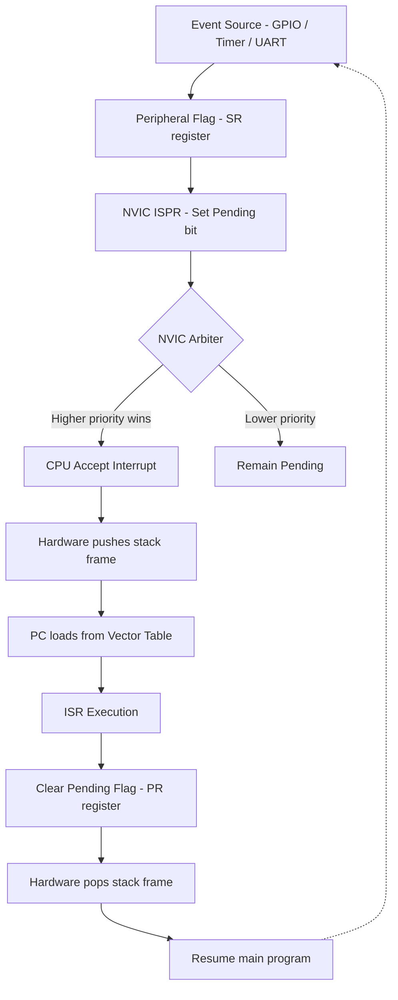
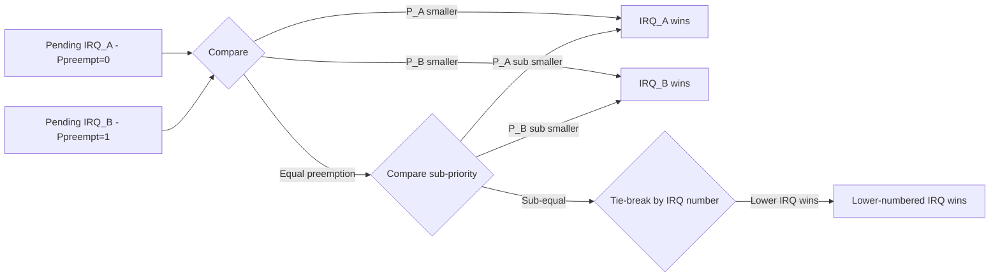
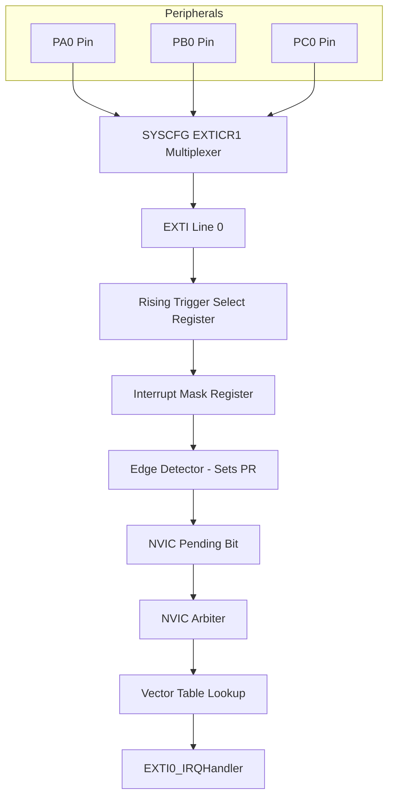

# Interrupt Handling

<!-- SECTION_1_START -->
# Interrupt Handling in STM32 Microcontrollers

## 1.1 Formal Academic Definition (KTU 2024 Syllabus Terminology)

> [!IMPORTANT]
> **Interrupt Handling** is the mechanism by which the STM32 ARM Cortex-M processor temporarily suspends the execution of the main program flow in response to an asynchronous event (either internal or external), transfers control to a dedicated **Interrupt Service Routine (ISR)** through the **Nested Vectored Interrupt Controller (NVIC)**, executes the ISR, and then resumes the original program execution at the precise point where it was interrupted.

In the STM32 architecture, interrupts are managed by the **ARM Cortex-M Nested Vectored Interrupt Controller (NVIC)**, a tightly coupled peripheral that supports:

- Up to **240** configurable interrupt requests (IRQs) on the STM32F4 series
- **16 programmable priority levels** (4 bits of priority)
- **Preemption** and **sub-priority** grouping via the **PRIGROUP** field in the **AIRCR** register
- Automatic state saving (pushing of $R0$-$R3$, $R12$, $LR$, $PC$, $xPSR$) onto the stack using hardware — the *tail-chaining* optimization enables back-to-back interrupt execution in just **6 CPU cycles** (vs. **12 cycles** for a full stack push/pop).

## 1.2 Conceptual Analogy / Intuition

> [!NOTE]
> **Real-World Analogy — The Office Manager and the Doorbell**
>
> Imagine you (the **CPU**) are working on an important report (the **main program**). Suddenly, the **doorbell rings** (an **interrupt request**, e.g., a button press, a timer overflow, or a UART data arrival). You don't ignore it — you:
> 1. **Mark your place** in the report by inserting a bookmark (saving **PC**, **LR**, **PSR**, and general-purpose registers to the **stack**).
> 2. **Walk to the door** and handle the visitor (jump to the **ISR**).
> 3. **Return** to your report exactly where you left off (the **PC** is restored from the stack via `BX LR` or `POP {PC}`).
>
> The **NVIC** acts as the **secretary** at the front desk, deciding *which* interruption is most important. If two doorbells ring at once, the secretary ensures the **higher-priority** visitor is served first (**preemption**). The **vector table** is the building's directory — it tells you exactly *which room* (ISR address) to go to for each type of interruption.

### 1.3 Standard Metrics and Constants

| Metric | Value (STM32F4 / Cortex-M4) | Bold Notation |
|---|---|---|
| Maximum External Interrupts | 240 (vendor-specific) | $\mathbf{240}$ |
| Priority Bits | 4 (configurable split) | $\mathbf{4 \text{ bits}}$ |
| Priority Levels | 16 | $\mathbf{16}$ |
| Stack Push Cycles (HW) | 12 cycles | $\mathbf{12}$ |
| Stack Pop Cycles (HW) | 12 cycles | $\mathbf{12}$ |
| Tail-chain entry | 6 cycles | $\mathbf{6}$ |
| Late-arrival | 6 cycles | $\mathbf{6}$ |

> [!VISUALIZATION CONTROL]
> **Concept:** Interrupt Preemption Priority Ladder
> **GeoGebra / Desmos Input Equations:**
> * Plot priority levels on Y-axis: $P \in \{0, 1, 2, 3\}$ where lower numerical value = higher logical priority
> * Plot timeline on X-axis: $t_0 \rightarrow t_1 \rightarrow t_2 \rightarrow t_3$
> * Function traces: $f_{main}(t) = \sin(t)$, $f_{ISR\_low}(t) = 0.3\sin(3t)$, $f_{ISR\_high}(t) = 0.6\sin(5t)$
> **Visual Description:** You should see a continuous base sine wave (main program) being overlaid and replaced by higher-amplitude, higher-frequency waves whenever high-priority interrupts preempt the main code.

---

<!-- SECTION_1_END -->

<!-- SECTION_2_START -->
# Deep Theoretical Analysis & KTU High-Yield Formula Sheet

## 2.1 Interrupt Source Classification in STM32

STM32F4xx devices have **three classes** of exceptions, all routed through the Cortex-M4 core:

1. **System Exceptions** (numbered 1–15): Reset, NMI, HardFault, MemManage, BusFault, UsageFault, SVCall, DebugMonitor, PendSV, SysTick.
2. **External Interrupts (IRQs)** (numbered 0–239): All on-chip peripherals (USART, TIM, ADC, EXTI, DMA, I2C, SPI, etc.).
3. **Software-generated interrupts**: Triggered by setting a bit in the **NVIC ISPR** (Interrupt Set-Pending Register).

## 2.2 The Vector Table

The **vector table** is a 256-entry array stored at the start of flash memory (typically at `0x0800 0000`) or remapped via the **VTOR** (Vector Table Offset Register). Each entry is a **32-bit function pointer** (LSBit must be 1 for Thumb instructions).

$$
\text{Vector Table} = \left\{ \text{Initial SP}, \, \text{Reset\_Handler}, \, \text{NMI\_Handler}, \, \text{HardFault\_Handler}, \, \ldots, \, \text{IRQ0\_Handler}, \, \ldots \right\}
$$

The **NVIC** decodes the exception number and loads the corresponding handler address into `PC` in a single cycle, then the hardware automatically pushes the **stack frame**:

$$
\text{Stack Frame (pushed on entry)} = \left\{ xPSR, \, PC, \, LR, \, R12, \, R3, \, R2, \, R1, \, R0 \right\}
$$

## 2.3 Priority Grouping (PRIGROUP Field)

The 4 priority bits in STM32F4 are split into **preemption** and **sub-priority** fields using the **AIRCR.PRIGROUP[2:0]** bits:

| PRIGROUP | Preemption Bits | Sub-priority Bits | Preemption Levels | Sub-priority per Group |
|---|---|---|---|---|
| 0xx | 0 (none) | 4 | 1 | 16 |
| 100 | 1 | 3 | 2 | 8 |
| 101 | 2 | 2 | 4 | 4 |
| 110 | 3 | 1 | 8 | 2 |
| 111 | 4 | 0 | 16 | 1 |

**Preemption priority** determines *which* interrupt can interrupt another. **Sub-priority** determines tie-breaking *within* the same preemption level (no preemption between same-level ISRs).

## 2.4 The EXTI (External Interrupt) Controller

The **EXTI** controller maps **GPIO pins** to **interrupt lines**. Each EXTI line (0–15) corresponds to one pin from each GPIO port (PA0, PB0, PC0, …, PK0 share EXTI0). The **SYSCFG_EXTICR** registers select the source port.

$$
\text{EXTI line } n \rightarrow \text{Pin } n \text{ of one GPIO port} \rightarrow \text{NVIC IRQ \#EXTIn}
$$

> [!NOTE]
> **KTU High-Yield Fact:** EXTI0–EXTI4 have **dedicated** NVIC IRQ vectors. EXTI5–EXTI9 share **one** vector (`EXTI9_5_IRQHandler`). EXTI10–EXTI15 share **another** vector (`EXTI15_10_IRQHandler`). Always check the *pending register* (`EXTI->PR`) inside the shared ISR to identify which line fired.

## 2.5 KTU Formula Sheet / Cheat Sheet

> [!IMPORTANT]
> The table below summarizes every formula, equation, register, and constant you will need for KTU 2024 ESE on Interrupt Handling.

| Concept | Formula / Register / Condition | Units / Notes |
|---|---|---|
| Vector Table Base | $\text{VTOR} = 0x0800\,0000$ (default, flash) | 32-bit aligned |
| Exception Number (system) | $n \in \{1, 2, 3, 4, 5, 6, 7, 8, 9, 10, 11, 12, 13, 14, 15\}$ | NMI=2, SVCall=11, SysTick=15 |
| Exception Number (IRQ) | $n = 16 + \text{IRQ number}$ | e.g., EXTI0 = 6 |
| Preemption priority (lower = higher) | $\text{Priority} \in [0, 2^{\text{preemption bits}} - 1]$ | 0 is highest |
| Stack frame size | $8 \text{ registers} \times 32\text{ bits} = 32$ bytes | Hardware-pushed |
| Interrupt Latency | $T_{latency} = T_{stack\_push} + T_{fetch} = 12 + 1 = 13$ cycles | Cortex-M4 |
| Tail-chain Latency | $T_{tail} = 6$ cycles | When no stack pop needed |
| Pending Register bit-set | `EXTI->PR = (1U << pin)` to clear (write-1-to-clear) | Bit banding supported |
| NVIC Enable | `NVIC_EnableIRQ(IRQn)` | CMSIS function |
| HAL IRQ Handler | `HAL_NVIC_SetPriority(IRQn, preemp, sub); HAL_NVIC_EnableIRQ(IRQn);` | Library API |

> [!NOTE]
> **Critical LaTeX Isolation Rule:** When writing `priority` in prose, always use `$P_{preempt}$` or `$n_{IRQ}$`. Never use raw `n_IRQ` in plain text.

## 2.6 Real-World Engineering Utility

Interrupt handling is the cornerstone of **real-time embedded systems**. In production:

- **Automotive ECUs** (engine control units) use interrupts to sample crankshaft position every 6° of rotation — missing a deadline causes misfires.
- **IoT sensor nodes** wake from sleep on EXTI pin change (button press) and immediately enter ISR to record timestamp.
- **Industrial PLCs** use timer interrupts for deterministic PID loop execution at 1 kHz regardless of main loop load.
- **Bare-metal firmware** (bootloaders) use **PendSV** (a software-triggered interrupt) to perform context switches in cooperative RTOS designs.
- **ST's HAL** wraps the NVIC into portable functions like `HAL_GPIO_EXTI_IRQHandler()` so the same code runs on F0, F4, F7, H7 with minimal changes.

> [!TIP]
> **Interview/Board Tip:** If asked *"Why use interrupts instead of polling?"* the answer is **power efficiency, latency determinism, and CPU throughput**. Polling wastes cycles; interrupts keep the CPU idle (or in `__WFI()`) until work actually arrives.

---

<!-- SECTION_2_END -->

<!-- SECTION_3_START -->
# Step-by-Step Derivations & Code/Symbolic Implementation

## 3.1 Theoretical Derivation: Preemption Decision Logic

When two IRQs (say IRQ_A and IRQ_B) become pending simultaneously, the **NVIC arbitration** follows this decision tree:

$$
\text{Decision}(IRQ_A, IRQ_B) = \begin{cases}
IRQ_A \text{ wins} & \text{if } P_A^{preempt} < P_B^{preempt} \\
IRQ_B \text{ wins} & \text{if } P_B^{preempt} < P_A^{preempt} \\
IRQ_A \text{ wins} & \text{if } P_A^{preempt} = P_B^{preempt} \text{ and } P_A^{sub} < P_B^{sub} \\
IRQ_B \text{ wins} & \text{if } P_A^{preempt} = P_B^{preempt} \text{ and } P_B^{sub} < P_A^{sub} \\
\text{Tie} \rightarrow \text{lowest IRQ number wins} & \text{otherwise}
\end{cases}
$$

**Derivation Step 1:** The NVIC contains a 240-bit pending register set and a priority comparator. The comparator evaluates $\forall$ pending IRQ:

$$
\text{Winner} = \arg\min_{i \in \text{pending}} \left[ P^{preempt}_i, \, P^{sub}_i, \, i \right]
$$

**Derivation Step 2:** The result is a **lexicographic comparison** — first on preemption bits, then on sub-bits, then on IRQ number (tie-breaker).

**Derivation Step 3:** Once the winner is selected, the **ICER** (Interrupt Clear-Enable Register) does *not* clear the bit; instead, the active bit is set in the **IABR** (Interrupt Active Bit Register) so re-entrant requests of the same line are recognized as **pending**, not **active**.

## 3.2 Worked Example — Priority Group Selection

**Problem:** You are configuring an STM32F407 with two interrupts:
- `TIM2` global interrupt: $\text{IRQ} = 28$
- `USART1` global interrupt: $\text{IRQ} = 37$

You require TIM2 to be able to preempt USART1, but otherwise both should not preempt each other.

**Solution Step-by-Step:**

**Step 1 — Identify required preemption levels:** We need 2 preemption levels → minimum preemption bits = 1.

**Step 2 — Choose PRIGROUP:** Select `PRIGROUP = 100` (1 preemption bit, 3 sub-priority bits). This gives:

$$
P_{preempt} \in \{0, 1\}, \quad P_{sub} \in \{0, 1, 2, \ldots, 7\}
$$

**Step 3 — Assign priorities:**

$$
P_{TIM2} = (P_{preempt} = 0, P_{sub} = 0) = 0x00
$$
$$
P_{USART1} = (P_{preempt} = 1, P_{sub} = 0) = 0x10
$$

Lower preemption value → higher preemption capability → TIM2 can preempt USART1. ✅

**Step 4 — Register programming (CMSIS / register-level):**

$$
\text{NVIC\_IPR}[28] = 0x00, \quad \text{NVIC\_IPR}[37] = 0x10
$$
$$
\text{NVIC\_ISER}[0] \,|\, = (1 \ll 28), \quad \text{NVIC\_ISER}[1] \,|\, = (1 \ll 5)
$$

**Step 5 — Verify the AIRCR setting:**

$$
\text{SCB} \rightarrow \text{AIRCR} = (\text{SCB\_AIRCR\_VECTKEY\_STAT} \,|\, (\text{PRIGROUP} \ll 8))
$$

where `PRIGROUP = 0x100` for grouping 4 (one preemption bit).

## 3.3 Full Register-Level Code — External Interrupt on PA0 (Push Button)

```c
/*
 * File:        exti_pa0_register_level.c
 * MCU:         STM32F407VG
 * Compiler:    arm-none-eabi-gcc -std=c11
 * Description: Configure PA0 (USER button on many NUCLEO boards)
 *              as an external interrupt on rising edge, then
 *              toggle LED on PD12 inside the ISR — register level.
 */

#include <stdint.h>
#include <stdbool.h>

/* ---- Base address definitions (Cortex-M4 + STM32F407) ---- */
#define PERIPH_BASE        0x40000000UL
#define APB1_BASE          (PERIPH_BASE + 0x00000000UL)
#define AHB1_BASE          (PERIPH_BASE + 0x00020000UL)
#define RCC_BASE           (AHB1_BASE   + 0x00003800UL)

/* GPIOA registers */
#define GPIOA_BASE         (AHB1_BASE + 0x00000000UL)
#define GPIOA_MODER        (*(volatile uint32_t *)(GPIOA_BASE + 0x00))
#define GPIOA_PUPDR        (*(volatile uint32_t *)(GPIOA_BASE + 0x0C))
#define GPIOA_IDR          (*(volatile uint32_t *)(GPIOA_BASE + 0x10))

/* GPIOD registers (LED) */
#define GPIOD_BASE         (AHB1_BASE + 0x00000C00UL)
#define GPIOD_MODER        (*(volatile uint32_t *)(GPIOD_BASE + 0x00))
#define GPIOD_BSRR         (*(volatile uint32_t *)(GPIOD_BASE + 0x18))

/* RCC registers */
#define RCC_AHB1ENR        (*(volatile uint32_t *)(RCC_BASE + 0x30))

/* SYSCFG registers */
#define SYSCFG_BASE        (APB1_BASE + 0x00013800UL + 0x00030000UL) /* 0x40013800 */
#define SYSCFG_EXTICR1     (*(volatile uint32_t *)(SYSCFG_BASE + 0x08))

/* EXTI registers */
#define EXTI_BASE          (APB1_BASE + 0x00013C00UL + 0x00030000UL) /* 0x40013C00 */
#define EXTI_IMR           (*(volatile uint32_t *)(EXTI_BASE + 0x00))
#define EXTI_RTSR          (*(volatile uint32_t *)(EXTI_BASE + 0x08))
#define EXTI_PR            (*(volatile uint32_t *)(EXTI_BASE + 0x14))

/* NVIC + Cortex-M4 system control */
#define NVIC_ISER0         (*(volatile uint32_t *)0xE000E100UL)
#define NVIC_ICER0         (*(volatile uint32_t *)0xE000E180UL)
#define NVIC_IPR0          (*(volatile uint32_t *)0xE000E400UL)
#define SCB_AIRCR          (*(volatile uint32_t *)0xE000ED0CUL)

#define EXTI0_IRQn         6

/* ---- Function prototypes ---- */
void EXTI0_IRQHandler(void);
static void delay(volatile uint32_t t);

int main(void)
{
    /* 1. Enable GPIOA, GPIOD, SYSCFG clocks */
    RCC_AHB1ENR |= (1U << 0);   /* GPIOAEN */
    RCC_AHB1ENR |= (1U << 3);   /* GPIODEN */

    /* SYSCFG clock is on APB2 — enable via RCC->APB2ENR (offset 0x44) */
    volatile uint32_t *RCC_APB2ENR = (volatile uint32_t *)(RCC_BASE + 0x44);
    *RCC_APB2ENR |= (1U << 14); /* SYSCFGEN */

    /* 2. Configure PA0 as input with pull-down */
    GPIOA_MODER &= ~(3U << (0 * 2));   /* Input mode (00) */
    GPIOA_PUPDR &= ~(3U << (0 * 2));
    GPIOA_PUPDR |=  (2U << (0 * 2));   /* Pull-down (10) */

    /* 3. Configure PD12 as output (LED) */
    GPIOD_MODER &= ~(3U << (12 * 2));
    GPIOD_MODER |=  (1U << (12 * 2));  /* General-purpose output (01) */

    /* 4. Map PA0 to EXTI0 line via SYSCFG_EXTICR1[3:0] = 0000b */
    SYSCFG_EXTICR1 &= 0xFFFFFFF0U;     /* Clear bits 3:0 → PA0 */

    /* 5. Configure EXTI0: mask line, rising-edge trigger */
    EXTI_IMR  |= (1U << 0);
    EXTI_RTSR |= (1U << 0);

    /* 6. Set priority group: 1 preemption bit, 3 sub-bits (PRIGROUP = 0x100) */
    SCB_AIRCR = 0x05FA0000U | (0x100U << 8);

    /* 7. Set EXTI0 priority: preemption = 0, sub = 0 */
    NVIC_IPR0  = (NVIC_IPR0 & 0xFFFFFF00U) | (0x00U << 4);

    /* 8. Enable EXTI0 interrupt in NVIC */
    NVIC_ISER0 |= (1U << EXTI0_IRQn);

    /* Main loop — CPU can sleep or do other work */
    for (;;) {
        /* WFI: Wait For Interrupt — saves power */
        __asm volatile ("wfi");
    }
}

/* ---- Interrupt Service Routine for EXTI0 ---- */
void EXTI0_IRQHandler(void)
{
    /* Clear the pending bit (write-1-to-clear on EXTI_PR) */
    if (EXTI_PR & (1U << 0)) {
        EXTI_PR = (1U << 0);

        /* Debounce: small delay then re-check */
        delay(1000);
        if ((GPIOA_IDR & (1U << 0)) == 0) {
            return;   /* Spurious — abort */
        }

        /* Toggle the LED on PD12 */
        GPIOD_BSRR = (1U << 12);       /* Set bit (turn on) */
        delay(200000);
        GPIOD_BSRR = (1U << (12 + 16)); /* Reset bit (turn off) */
    }
}

/* ---- Crude busy-wait delay (for debounce only — not for production) ---- */
static void delay(volatile uint32_t t)
{
    while (t--) { __asm volatile ("nop"); }
}
```

> [!WARNING]
> **Code Pitfall #1:** Forgetting to clear `EXTI->PR` inside the ISR causes the handler to re-enter immediately — infinite loop. Always write `1U << pin` to clear.
> **Code Pitfall #2:** Using `__WFI()` in a loop without enabling the EXTI mask yields a permanent sleep. Confirm `EXTI_IMR` is set.

## 3.4 HAL-Based Implementation (For Comparison)

```c
/* Minimal HAL version: same functionality with HAL drivers */
#include "stm32f4xx_hal.h"

void HAL_GPIO_EXTI_Callback(uint16_t GPIO_Pin)
{
    if (GPIO_Pin == GPIO_PIN_0) {
        HAL_GPIO_TogglePin(GPIOD, GPIO_PIN_12);
    }
}

int main(void)
{
    HAL_Init();
    SystemClock_Config();

    __HAL_RCC_GPIOA_CLK_ENABLE();
    __HAL_RCC_GPIOD_CLK_ENABLE();
    __HAL_RCC_SYSCFG_CLK_ENABLE();

    GPIO_InitTypeDef btn = { .Pin = GPIO_PIN_0, .Mode = GPIO_MODE_IT_RISING,
                             .Pull = GPIO_PULLDOWN };
    HAL_GPIO_Init(GPIOA, &btn);

    GPIO_InitTypeDef led = { .Pin = GPIO_PIN_12, .Mode = GPIO_MODE_OUTPUT_PP,
                             .Pull = GPIO_NOPULL, .Speed = GPIO_SPEED_FREQ_LOW };
    HAL_GPIO_Init(GPIOD, &led);

    HAL_NVIC_SetPriority(EXTI0_IRQn, 0, 0);
    HAL_NVIC_EnableIRQ(EXTI0_IRQn);

    for (;;) { __WFI(); }
}

/* This handler name is forced by the startup file startup_stm32f407xx.s */
void EXTI0_IRQHandler(void)
{
    HAL_GPIO_EXTI_IRQHandler(GPIO_PIN_0);
}
```

---

<!-- SECTION_3_END -->

<!-- SECTION_4_START -->
# Structural Diagrams & Schematics

## 4.1 Mermaid Block Diagram: Interrupt Flow in STM32



> [!NOTE]
> **Node Identifier Safety:** All node IDs above are alphanumeric (`A`–`L`) with plain English labels. No reserved Mermaid keywords (`end`, `subgraph`, `graph`) are used as standalone IDs. All labels are clean text without bold/italics.

## 4.2 Mermaid Block Diagram: Priority Grouping Logic



## 4.3 Functional Block Architecture — EXTI to NVIC Data Path



## 4.4 Sequential Topology — Interrupt Latency Timeline

```mermaid
gantt
    title Interrupt Service Routine Latency Timeline (Cycles)
    dateFormat  X
    axisFormat %s
    section Setup
    IRQ Occurs        :a1, 0, 1
    NVIC Decode       :a2, after a1, 1
    Stack Push        :a3, after a2, 12
    Vector Fetch      :a4, after a3, 1
    section Execution
    ISR Body          :crit, a5, after a4, 20
    section Cleanup
    Stack Pop         :a6, after a5, 12
    Resume Main       :a7, after a6, 1
```



> [!TIP]
> **Engineering Insight:** The Gantt chart shows that a *full* push + pop costs **26 cycles** of overhead. With **tail-chaining** (a second IRQ arrives during the ISR), the next ISR begins in just **6 cycles** — Cortex-M saves all cycles except the vector fetch and the first word of stack push.

---

<!-- SECTION_4_END -->

<!-- SECTION_5_START -->
# KTU 2024 Scheme Examination Question Bank & Topic Recap

## Part A — 3-Mark Questions (Short Answer)

> **Q1.** `[KTU University Exam — Dec 2023]`
> **Define the term "Interrupt Latency" in the context of an STM32 Cortex-M4 microcontroller. State the typical latency for a standard interrupt and a tail-chained interrupt.**
> **Course Outcome:** CO2 — *Understand the architecture of ARM Cortex-M based microcontrollers.*
> **Bloom's Level:** Remember

**Model Answer (3 marks):**

Interrupt latency is the **time delay** between the assertion of an interrupt request (IRQ) signal and the execution of the first instruction of the corresponding **Interrupt Service Routine (ISR)**.

$$
T_{latency}^{standard} = T_{stack\_push} + T_{fetch} = 12 + 1 = 13 \text{ cycles}
$$

$$
T_{latency}^{tail-chain} = 6 \text{ cycles}
$$

Tail-chaining occurs when a second IRQ becomes pending *while* the processor is still executing the first ISR. The Cortex-M4 eliminates the redundant **stack pop + push** by simply fetching the new vector from the VECT table.

> **[Valuation Key: Definition = 1 mark; Standard latency formula = 1 mark; Tail-chain latency = 1 mark]**

---

> **Q2.** `[KTU University Exam — July 2024]`
> **What is the role of the NVIC in an STM32 microcontroller? Mention any two of its key features.**
> **Course Outcome:** CO2 — *Understand the architecture of ARM Cortex-M based microcontrollers.*
> **Bloom's Level:** Remember / Understand

**Model Answer (3 marks):**

The **Nested Vectored Interrupt Controller (NVIC)** is an on-chip peripheral tightly integrated with the **ARM Cortex-M4** core. Its role is to **manage, prioritize, arbitrate, and vector** all exceptions and interrupt requests to the CPU.

**Key features (any two for 2 marks):**

1. **Configurable priority levels (16)** with independent **preemption** and **sub-priority** fields.
2. **Hardware stack frame** push/pop — automatic context save/restore in **12 cycles**.
3. **Tail-chaining** optimization — back-to-back ISRs in **6 cycles**.
4. **240 external IRQs** supported (vendor-specific).
5. **NMI** (non-maskable interrupt) for critical events.

> **[Valuation Key: Role = 1 mark; Two features = 1 mark each = 2 marks]**

---

## Part B — 14-Mark Questions (Module Internal Choice)

> ### **Question A (14 Marks)**
> `[KTU University Exam — Dec 2023, Model Paper]`
> **(a) [7 Marks]** Explain the **NVIC priority grouping** mechanism in STM32. With the help of the `PRIGROUP` field, show how the 4 priority bits are split into preemption and sub-priority fields for at least three different grouping configurations. What is the consequence of assigning two interrupts to the same preemption level?
> **Bloom's Level:** Understand / Apply
>
> **(b) [7 Marks]** Write a step-by-step procedure to configure **PA0 as an external interrupt** on a rising edge using register-level programming (CMSIS). Your answer must include: clock enable, GPIO mode setting, SYSCFG routing, EXTI configuration, NVIC priority and enable, and the ISR skeleton.
> **Bloom's Level:** Apply / Analyze

### Model Solution — Question A

**Part (a) — Priority Grouping Explanation**

> The **PRIGROUP** field in the **AIRCR** register of the System Control Block (SCB) divides the **4 priority bits** into a **preemption** field (high-order bits) and a **sub-priority** field (low-order bits).
> **[[Block diagram description: priority-bit slicing — 3 marks]]**

**Step 1 — Default grouping:** Out of reset, `PRIGROUP = 0x000` (8 sub-priority bits, 0 preemption bits), but STM32F4 only implements 4 bits, so this yields *no preemption*.

**Step 2 — Grouping configuration table:**

| PRIGROUP[2:0] | Preempt bits | Sub bits | Levels |
|---|---|---|---|
| `100` | 1 | 3 | 2 preempt, 8 sub |
| `101` | 2 | 2 | 4 preempt, 4 sub |
| `111` | 4 | 0 | 16 preempt, 1 sub |

**Step 3 — Numeric encoding (PRIGROUP = 101):**

$$
\text{Priority Byte} = [\,P_{preempt}[3:2]\,][\,P_{sub}[1:0]\,]
$$

For example, `0x50` = `0b0101 0000` → preemption = `01` = level 1, sub = `00` = sub-0.

**Step 4 — Same preemption consequence:** Two ISRs with identical preemption values **cannot preempt each other**. They run sequentially in **sub-priority order** (lower sub wins). If sub is also equal, the **lower IRQ number** is served first. **[[Consequence explanation: 1 mark]]**

**[Valuation: Table = 2 marks; Example encoding = 2 marks; Consequence = 1 mark; Why lower number wins = 2 marks]**

---

**Part (b) — Register-Level EXTI Configuration on PA0**

**Step 1 — Enable peripheral clocks:**

$$
\text{RCC} \rightarrow \text{AHB1ENR} \,|\, = (1 \ll 0) \text{ [GPIOA]},\quad
\text{RCC} \rightarrow \text{APB2ENR} \,|\, = (1 \ll 14) \text{ [SYSCFG]}
$$

**Step 2 — Configure PA0 as input with pull-down:**

$$
\text{GPIOA} \rightarrow \text{MODER} \mathrel{\&}= \sim(3 \ll 0), \quad
\text{GPIOA} \rightarrow \text{PUPDR} \,|\, = (2 \ll 0)
$$

**Step 3 — Route PA0 to EXTI0 in SYSCFG:**

$$
\text{SYSCFG} \rightarrow \text{EXTICR}[0] \mathrel{\&}= \sim(0xF),\quad
\text{EXTICR}[0] \,|\, = 0x0 \text{ [Port A]}
$$

**Step 4 — Configure EXTI0: rising edge, unmasked:**

$$
\text{EXTI} \rightarrow \text{RTSR} \,|\, = (1 \ll 0),\quad
\text{EXTI} \rightarrow \text{IMR}  \,|\, = (1 \ll 0)
$$

**Step 5 — Set priority and enable in NVIC:**

$$
\text{SCB} \rightarrow \text{AIRCR} = 0x05FA0000 \,|\, (0x100 \ll 8)
$$
$$
\text{NVIC} \rightarrow \text{IPR}[0] = 0x00 \text{ [highest priority]}
$$
$$
\text{NVIC} \rightarrow \text{ISER}[0] \,|\, = (1 \ll 6)
$$

**Step 6 — ISR skeleton (must clear pending!):**

```c
void EXTI0_IRQHandler(void) {
    if (EXTI->PR & (1U << 0)) {       /* Check pending [1 mark] */
        EXTI->PR = (1U << 0);          /* Write-1 to clear [1 mark] */
        /* user code */
    }
}
```

**[Valuation: Clock enable = 1 mark; GPIO setup = 1 mark; SYSCFG = 1 mark; EXTI config = 1 mark; NVIC config = 1 mark; ISR with PR clear = 2 marks]**

---

> ### **Question B (14 Marks) — Alternative**
> `[KTU University Exam — July 2024]`
> **(a) [7 Marks]** Differentiate between **polling** and **interrupt-based** I/O in embedded systems. Provide a latency analysis showing why interrupts are deterministic for time-critical tasks on STM32. (Mention: WFI instruction, CPU idle consumption, response time.)
> **Bloom's Level:** Understand / Analyze
>
> **(b) [7 Marks]** What is a **vector table** in STM32? Where is it located? Explain the procedure to **remap** the vector table to a different memory region using the **VTOR** register, and state two practical use-cases.
> **Bloom's Level:** Apply / Analyze

### Model Solution — Question B

**Part (a) — Polling vs Interrupt**

**Step 1 — Define each:**

- **Polling:** CPU repeatedly checks a status flag in a `while` loop.
- **Interrupt:** Peripheral signals the NVIC, which forces the CPU to execute an ISR asynchronously.

**Step 2 — Polling timing (worst case):**

$$
T_{polling}^{worst} = T_{cycle} \cdot N_{flag\_checks}
$$

If the main loop runs 10 000 instructions per iteration, worst-case latency = **10 000 cycles**.

**Step 3 — Interrupt timing (worst case for STM32 Cortex-M4):**

$$
T_{int}^{worst} = 13 \text{ cycles (standard IRQ)} \quad \text{or} \quad 6 \text{ cycles (tail-chain)}
$$

**Step 4 — WFI advantage:** With `__WFI()`, the CPU enters **sleep mode** until any enabled IRQ fires. Power drops from **~30 mA** (active) to **~2 mA** (sleep). Polling keeps CPU at full power.

**Step 5 — Determinism table:**

| Method | Latency | Power | CPU Free? |
|---|---|---|---|
| Polling | Variable (0–10 000 cycles) | High | No |
| Interrupt | 13 cycles (bounded) | Low (WFI) | Yes |

**[Valuation: Definition = 1 mark; Polling worst-case = 1 mark; Interrupt formula = 2 marks; WFI = 1 mark; Table = 2 marks]**

---

**Part (b) — Vector Table & VTOR Remap**

**Step 1 — Vector table definition:** A **256-entry table** of 32-bit function pointers stored at a base address. The first entry is the **initial stack pointer** value; the second is the **Reset_Handler** address.

**Step 2 — Default location:** `0x0800 0000` (start of flash in STM32F4). The Cortex-M4 reads `MSP = [VTOR + 0]` on reset and `PC = [VTOR + 4]`.

**Step 3 — VTOR register address:** `0xE000ED08`. After remap:

$$
\text{SCB} \rightarrow \text{VTOR} = \text{new\_base\_address}
$$

The new base **must be 256-word aligned** (i.e., $\text{VTOR} \mod 0x400 = 0$).

**Step 4 — Remap procedure (register-level):**

```c
#define NEW_VECTOR_TABLE 0x20000000UL  /* Beginning of SRAM */
uint32_t vtor_value = NEW_VECTOR_TABLE;
SCB->VTOR = vtor_value;               /* Remap vectors to SRAM */
__DSB();                              /* Ensure write completes */
__ISB();                              /* Flush instruction pipeline */
```

**Step 5 — Two practical use-cases:**

1. **Custom bootloader** — Bootloader at flash start remaps vector table to application's flash region (`0x0800 8000`) before jumping to user code.
2. **Runtime firmware update (OTA)** — After downloading a new image to SRAM, the active firmware remaps VTOR to the new region to "switch" to the new code.

**[Valuation: Definition = 1 mark; Default location = 1 mark; VTOR address = 1 mark; Alignment rule = 1 mark; Code/D-SB = 1 mark; Two use-cases = 2 marks]**

---

> [!WARNING]
> **KTU Examiner's Valuation Pitfall Callout**
> **Common marks lost in Interrupt Handling questions:**
> 1. **Forgetting to clear `EXTI->PR`** — the ISR will re-enter infinitely. The PR register is **write-1-to-clear**, not write-0.
> 2. **Wrong SYSCFG_EXTICR bit field** — for `EXTI0`, use `EXTICR1[3:0]`; for `EXTI5`, use `EXTICR1[15:12]`, *not* `EXTICR2`.
> 3. **Using only `PRIGROUP` to set priority** — you must also write to `NVIC_IPR[]` for the specific IRQ. Setting `AIRCR` alone has no effect on individual IRQ priorities.
> 4. **Naming the wrong ISR** — `EXTI5_9_IRQHandler` covers EXTI5 through EXTI9; the handler is **not** auto-generated if misspelled.
> 5. **Forgetting the `__DSB(); __ISB();` barrier** after remapping VTOR — CPU may execute stale instructions from the old vector table.
> 6. **Writing `volatile` flag without atomicity** — use `__disable_irq()` / `__enable_irq()` or `__LDREXB`/`__STREXB` if sharing data with the main loop.

---

## Topic Recap & Important Things to Remember

- 🔑 **NVIC** is the heart of interrupt management on Cortex-M4; supports up to **240 IRQs** and **16 priority levels** (4 bits).
- 🔑 The **vector table** is at `0x0800 0000` by default and can be remapped via **SCB->VTOR** (must be **0x400-aligned**).
- 🔑 **PRIGROUP** splits 4 priority bits into **preemption** (high bits) and **sub-priority** (low bits). Lower numeric value = higher logical priority.
- 🔑 **Preemption** allows an ISR to interrupt another ISR. **Sub-priority** only tie-breaks when preemption is equal (no preemption).
- 🔑 On interrupt entry, hardware **automatically pushes** $xPSR, PC, LR, R12, R3, R2, R1, R0$ onto the stack (32 bytes, **12 cycles**).
- 🔑 **Tail-chaining** reduces latency to **6 cycles** for back-to-back ISRs.
- 🔑 `EXTI->PR` is **write-1-to-clear** — always set the bit (not clear) to acknowledge.
- 🔑 `EXTI5–EXTI9` share one vector (`EXTI9_5_IRQHandler`); `EXTI10–EXTI15` share another (`EXTI15_10_IRQHandler`).
- 🔑 After remapping VTOR, **always issue `__DSB(); __ISB();`** to flush the pipeline.
- 🔑 Use `__WFI()` in the main loop to enter **low-power sleep** until the next IRQ.
- 🔑 `HAL_NVIC_SetPriority(IRQn, preemp, sub)` automatically handles AIRCR grouping — preferred over manual register writes when using HAL.
- 🔑 Keep ISRs **short and fast** — defer heavy work to a flag-checked task in the main loop (the "ISR-handles-flag, main-handles-work" pattern).
- 🔑 Common KTU keywords to recognize in questions: **NVIC, PRIGROUP, preemption, sub-priority, vector table, VTOR, WFI, EXTI, AIRCR, tail-chaining, latency, ISER, ICER, IPR, ISR**.

<!-- SECTION_5_END -->
