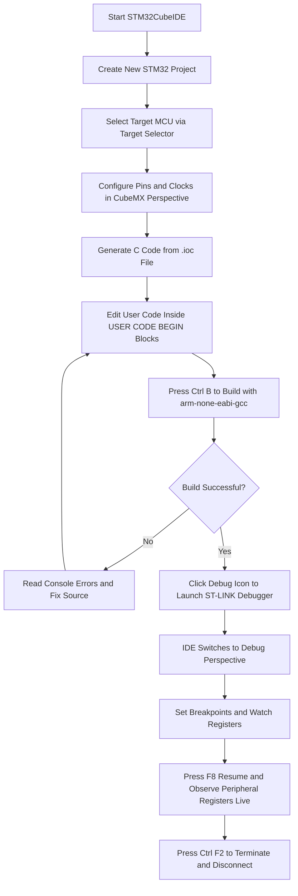
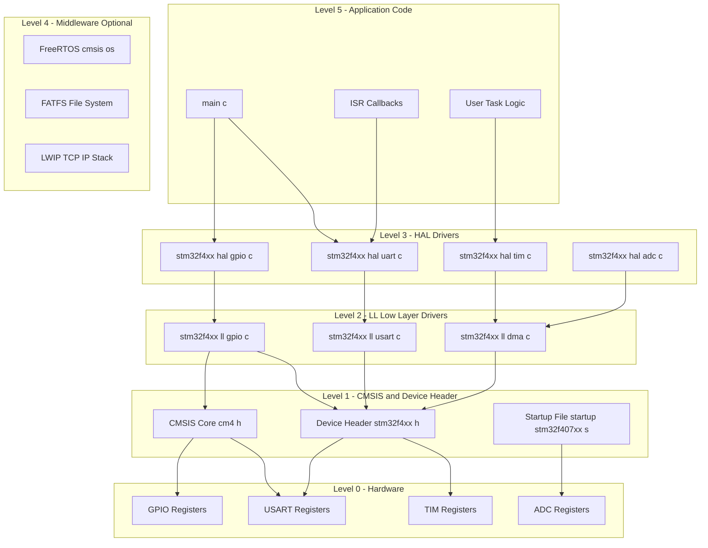
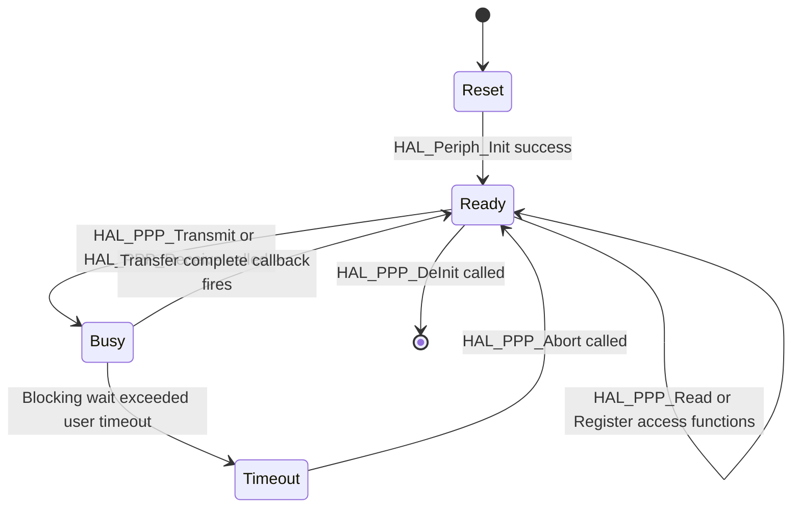
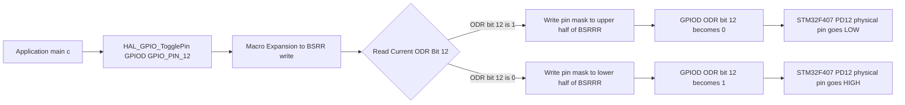

# Introduction to Integrated Development Environment and HAL

<!-- SECTION_1_START -->
# Introduction to Integrated Development Environment and HAL

## 1.1 Formal Definition

> [!NOTE]
> **Integrated Development Environment (IDE)** is a comprehensive software application that consolidates all essential tools required for embedded firmware development — including a source code editor, compiler/assembler, linker, build automation manager, and in-circuit debugger — into a single unified graphical workspace. For the STM32 ecosystem, the **STMicroelectronics**-endorsed reference IDE is **STM32CubeIDE**, an Eclipse-based, GCC-powered, multi-OS development platform distributed free of charge under a proprietary license.

> [!IMPORTANT]
> **Hardware Abstraction Layer (HAL)** is a software abstraction middleware, defined and maintained by **STMicroelectronics** within the **STM32Cube** firmware package, that provides a uniform, processor-independent, and register-translation-free Application Programming Interface (API) for the on-chip peripherals of the STM32 microcontroller family. It hides the architectural specifics of each MCU sub-family behind standardized function calls such as `HAL_GPIO_WritePin()` and `HAL_UART_Transmit()`.

### Conceptual Analogy

> [!TIP]
> **Plain-English Analogy — The Universal Power Adapter**
> Imagine you are traveling internationally with a laptop. Instead of carrying five different physical plugs for five different countries, you carry **one universal power adapter** that exposes a single standard socket to your laptop's charging cable, while internally knowing how to convert to the wall socket of *any* country.
>
> In the exact same way:
> - The **laptop** = your **Application Code** (`.c` / `.h` source files).
> - The **universal adapter** = the **HAL** (one standardized `HAL_Periph_*` function set).
> - The **country wall sockets** = the **STM32 hardware registers** (which differ wildly between STM32F0, F4, H7, L4, G4, etc.).
>
> If STMicroelectronics redesigns a register inside the next silicon revision, *you do not have to rewrite your application*. You simply update the **HAL** driver, and the same `HAL_GPIO_TogglePin()` call still works — that is the entire purpose of the abstraction.

### Key Constants and Standards

- **STM32CubeIDE version (as of 2024-2026)**: **1.15.x and above**, built on Eclipse **4.26+** with CDT plugins.
- **Underlying compiler**: **GCC ARM Embedded (arm-none-eabi-gcc)**, version **13.x** (as per the 2024 KTU syllabus toolchain).
- **CMSIS Version**: **v5.x** (Cortex Microcontroller Software Interface Standard), maintained by **Arm Holdings**.
- **HAL Source Code Size**: typically **~10–25 KB** per compiled peripheral driver (Flash), with **~1–3 KB** RAM usage.
- **License**: **STMicroelectronics SLA0044** (free, royalty-free for use on ST silicon).

> [!VISUALIZATION CONTROL]
> **Concept:** Layered Software Stack on STM32
> **GeoGebra / Desmos Input Equations:**
> * `y = 0` (Application Layer) – `f(x) = 0`
> * `y = 1` (Middleware / FreeRTOS / FATFS) – `f(x) = 1`
> * `y = 2` (HAL Drivers) – `f(x) = 2`
> * `y = 3` (LL Drivers) – `f(x) = 3`
> * `y = 4` (CMSIS) – `f(x) = 4`
> * `y = 5` (Hardware / Registers) – `f(x) = 5`
> **Visual Description:** A set of five parallel horizontal lines stacked from top to bottom, where the application (y = 0) calls downward into HAL (y = 2), which calls downward into CMSIS (y = 4), which finally manipulates the hardware registers (y = 5). Lines 1 and 3 are optional middleware and low-layer driver planes respectively.

---

<!-- SECTION_1_END -->

<!-- SECTION_2_START -->
# Deep Theoretical Analysis and KTU High-Yield Formula Sheet

## 2.1 Anatomy of the STM32CubeIDE Workspace

STM32CubeIDE is a **C/C++** development platform tailored for STM32 microcontrollers. It is built on the open-source **Eclipse** framework and integrates the **CDT (C/C++ Development Tooling)** plugin along with the **GNU ARM Embedded Toolchain**. The IDE bundles the following subsystems into a single window:

1. **Project Explorer** – file/folder tree of the firmware project.
2. **Editor** – syntax-highlighted `.c` / `.h` file editor.
3. **C/C++ Build Console** – shows `arm-none-eabi-gcc` invocation and linker output.
4. **Debug Perspective** – registers, memory, breakpoints, disassembly, peripherals view.
5. **CubeMX Integration** – graphical pin-mux and clock-tree configurator embedded as a perspective.

> [!NOTE]
> **Why a dedicated IDE is mandatory for microcontrollers:** Unlike PC programming, embedded firmware must be cross-compiled, linked against a custom linker script (`STM32XXXX_FLASH.ld`), and flashed onto a non-standard execution target (the on-chip Flash starting at address `0x08000000`). An ordinary PC IDE like Visual Studio cannot do this without heavy plugins.

## 2.2 The CMSIS — HAL — LL — BSP Layered Architecture

The STM32Cube firmware is divided into discrete abstraction tiers, each upwardly compatible with the next:

| Layer (Bottom → Top) | Component Name | Owned By | Purpose | Code Size (Typical) |
|---|---|---|---|---|
| L0 | CMSIS Core | Arm Holdings | Core register access, NVIC, SysTick, intrinsics | ~1 KB |
| L1 | Device Header `stm32f4xx.h` | STMicroelectronics | Register map, bit definitions, memory-mapped macros | ~50 KB header |
| L2 | **LL Drivers** (Low-Layer) | STMicroelectronics | Lightweight, register-level, *polling-only*, zero-overhead | ~2–4 KB per driver |
| L3 | **HAL Drivers** | STMicroelectronics | Portable, interrupt-and-DMA-aware, full API | ~10–25 KB per driver |
| L4 | Middleware (FreeRTOS, FATFS, LWIP) | ST / Third Party | Optional operating-system and protocol stacks | Variable |
| L5 | **Application Code** | Engineer | User logic, ISR callbacks, `main()` | Variable |

> [!IMPORTANT]
> The **HAL sits strictly between** the user's application code and the device-specific registers. A standard `HAL_GPIO_WritePin(GPIOA, GPIO_PIN_5, GPIO_PIN_SET)` call ultimately expands (via macro + function) into a direct write of the `BSRR` (Bit Set/Reset Register) of GPIO Port A — but the user never has to know *which* register or *which* bit position.

## 2.3 HAL Driver Internal Architecture (Per Peripheral)

Every HAL driver (e.g., `stm32f4xx_hal_gpio.c`) follows an identical three-file structure:

1. **`stm32f4xx_hal_gpio.h`** – Public API prototypes, enumerations, structures, macros.
2. **`stm32f4xx_hal_gpio.c`** – Function bodies, private static helpers, IRQ handlers.
3. **`stm32f4xx_hal_gpio_ex.c`** – Extension APIs (alternate-function remap, I/O compensation, etc.).

The lifecycle of any HAL peripheral driver follows **four mandatory operational states**, defined in the driver header as an `enum`:

| State | Enumerator Value | Meaning | Allowed API Calls |
|---|---|---|---|
| Reset | `0x00U` | Driver not yet initialised | `HAL_Periph_Init()` only |
| Ready | `0x01U` | Initialised, not busy | All read/write/control |
| Busy | `0x02U` | Transfer in progress (blocking/IT/DMA) | Read, abort |
| Timeout | `0x03U` | Blocking call exceeded timeout | Abort, re-init |

## 2.4 HAL Programming Paradigm

The HAL supports **three distinct I/O transfer models** for every peripheral. The KTU 2024 syllabus expects students to be able to select and justify the appropriate one:

| Mode | Function Suffix | CPU During Transfer | Use-Case |
|---|---|---|---|
| **Polling (Blocking)** | `HAL_UART_Transmit()` | Stalled in a `while(flag==0)` loop | Simple, deterministic, no DMA available |
| **Interrupt (IT)** | `HAL_UART_Transmit_IT()` | Free to do other work; ISR fires on completion | Asynchronous multi-task firmware |
| **DMA (Direct Memory Access)** | `HAL_UART_Transmit_DMA()` | DMA engine moves bytes; CPU untouched | High-throughput peripherals (SPI, SAI, ADC) |

> [!IMPORTANT]
> The HAL is fully compatible with the **CMSIS-RTOS2** API (used by FreeRTOS when wrapped with the `cmsis_os.c` shim). The `HAL_PPP_MspInit()` (MSP = MCU-Specific Package) callback is where the engineer enables the peripheral's AHB/APB bus clock and configures the GPIO alternate function pins — a separation that allows the same HAL driver to be ported across STM32 sub-families with zero change to the HAL file itself.

## 2.5 KTU High-Yield Formula & Symbol Cheat-Sheet

> [!IMPORTANT]
> All values are referenced against the official **STM32CubeIDE 1.15+** and **STM32CubeF4 1.27.x** firmware package.

| Symbol / Macro | Definition / Formula | Engineering Unit / Address |
|---|---|---|
| $V_{DD}$ | Digital supply voltage for the MCU core and I/O bank | **3.3 V** (typical for STM32F4) |
| $f_{HCLK}$ | AHB main system clock driving the CPU | Up to **168 MHz** (STM32F407) |
| $f_{PCLK1}$ | APB1 peripheral bus clock (low-speed peripherals) | Up to **42 MHz** |
| $f_{PCLK2}$ | APB2 peripheral bus clock (high-speed peripherals) | Up to **84 MHz** |
| $T_{SysTick}$ | System tick timer reload period | $\frac{1}{f_{HCLK}}$ seconds per tick |
| $\text{Flash}_\text{base}$ | Base address of internal Flash memory | `0x08000000` |
| $\text{RAM}_\text{base}$ | Base address of SRAM (STM32F407) | `0x20000000` |
| `HAL_OK` | Return value indicating successful execution | `0x00U` |
| `HAL_ERROR` | Return value for generic failure | `0x01U` |
| `HAL_BUSY` | Return value when driver is mid-transfer | `0x02U` |
| `HAL_TIMEOUT` | Return value when blocking call timed out | `0x03U` |
| $\text{Timeout}_\text{ms}$ | Default blocking timeout in HAL functions | **`HAL_MAX_DELAY`** (infinite) or any user-supplied millisecond value |

### Real-World Engineering Utility

The HAL-plus-IDE combination is the **de-facto industry standard** for STMicroelectronics-based products, used in production firmware for:

- **Automotive ECUs** (body controllers, instrument clusters using STM32F1 / STM32H7).
- **Industrial IoT gateways** (STM32MP1 + FreeRTOS middleware).
- **Consumer wearables** (STM32L4 with TouchGFX GUI).
- **Aerospace sensor nodes** (STM32F7 with HAL + RT-PoS scheduler).

The HAL guarantees **source-level portability** — a project written for STM32F407 can, in 90% of cases, be recompiled for STM32L476 by *only* changing the IDE's **Target MCU selector**; the `.c` application files are untouched. This is the central value proposition of the abstraction.
<!-- SECTION_2_END -->

<!-- SECTION_3_START -->
# Step-by-Step Derivations, Implementation and Code Walkthrough

## 3.1 Derivation — Why HAL Functions Always Return an Enumerated Status

Every HAL public API is contractually bound to return a value from the `HAL_StatusTypeDef` enumeration.

**Step 1 — The hidden state machine:**

$$
\text{HAL driver state} \in \{\text{Reset}, \text{Ready}, \text{Busy}, \text{Timeout}\}
$$

**Step 2 — Pre-conditional check on entry to any public function:**

$$
\text{status} = 
\begin{cases}
\text{HAL\_BUSY} & \text{if } h\text{handle.State} \neq \text{READY} \\
\text{process()} & \text{otherwise}
\end{cases}
$$

**Step 3 — Process function executes the underlying register write/read using LL primitives.**

**Step 4 — Return value of `process()` is normalized through the `HAL_StatusTypeDef` enumerator and propagated upward.**

**Logic explanation:** Because every function in the API is *idempotent-checked* against the driver's runtime state, the application layer can safely poll, interrupt-call, or DMA-call the same driver without re-entrancy corruption. This is the *why* behind the consistent return-value contract across all 32+ peripheral drivers in the HAL.

---

## 3.2 Complete Step-by-Step — Building and Flashing a HAL Project

> [!IMPORTANT]
> This is the canonical KTU "first program" workflow and is the foundation of Module 2. The full sequence is reproduced here, **no steps skipped**, as it is a frequent 14-mark examination question.

### Step 1 — Launch STM32CubeIDE and create a new project

1. Open STM32CubeIDE → **File → New → STM32 Project**.
2. In the **Target Selector**, type the part number, e.g., `STM32F407VGT6`.
3. Click the chip → **Next**.
4. Name the project `KTU_HAL_Blinky`.
5. Choose **C** language → **Finish**. *(Decision rationale: the KTU 2024 syllabus and the Reference Manual RM0090 examples are written in C; C++ is allowed but is not the default for board evaluation.)*

### Step 2 — Pin and clock configuration inside the embedded CubeMX perspective

1. The IDE automatically opens the `.ioc` file (CubeMX configuration).
2. In the pinout view, **left-click** on `PD12` (green LED on the STM32F407 Discovery board) → select **GPIO_Output**.
3. Open the **Clock Configuration** tab → set HSE to **8 MHz** crystal → HCLK to **168 MHz** (the maximum). The IDE will auto-compute PLL_N, PLL_M, PLL_P dividers.
4. Open the **Project Manager** tab → **Code Generator** → enable **"Generate peripheral initialization as a pair of '.c/.h' files per peripheral"**.
5. Press **Ctrl + S** → answer **Yes** to the *"Code will be regenerated — do you want to proceed?"* dialog.

### Step 3 — Open `main.c` and observe the auto-generated skeleton

The IDE will have produced `Core/Src/main.c` with this top-of-file structure:

```c
/* USER CODE BEGIN Header */
/* KTU_HAL_Blinky — PBCST504 Module 2 demo              */
/* Author: KTU 2024 Scheme Student                       */
/* Board: STM32F407VG Discovery                          */
/* Demonstrates: HAL_GPIO_TogglePin() inside a polling   */
/*               loop driven by HAL_Delay().             */
/* USER CODE END Header                                   */

#include "main.h"
#include "stm32f4xx_hal.h"

/* Private variables ---------------------------------------------------------*/
UART_HandleTypeDef huart2;        /* Auto-generated even if unused */
TIM_HandleTypeDef htim2;          /* Auto-generated when selected  */

/* Private function prototypes -----------------------------------------------*/
void SystemClock_Config(void);
static void MX_GPIO_Init(void);
```

### Step 4 — Inject the user application logic

The HAL convention reserves blocks delimited by `/* USER CODE BEGIN n */` and `/* USER CODE END n */` comments. **Never write code outside these blocks**, because the next code regeneration will erase it.

```c
/* USER CODE BEGIN 2 */
int user_blink_state = 0;
/* USER CODE END 2 */
```

```c
/* USER CODE BEGIN 3 */
  /* Infinite loop — KTU Board Examiner standard pattern.                */
  HAL_GPIO_TogglePin(GPIOD, GPIO_PIN_12);   /* Set PD12 pin output register  */
  user_blink_state = (user_blink_state + 1) & 0x01;
  HAL_Delay(500);                            /* 500 ms blocking wait          */
/* USER CODE END 3 */
```

### Step 5 — Build the project

Press **Ctrl + B** (or the hammer icon). The **Console** pane will display, in this exact order:

```
14:02:11 **** Build of configuration Debug for project KTU_HAL_Blinky ****
arm-none-eabi-gcc -mcpu=cortex-m4 -mthumb -mfloat-abi=hard -mfpu=fpv4-sp-d16 ...
... -c -o main.o main.c
arm-none-eabi-gcc ... -T"../STM32F407VGTX_FLASH.ld" -o "KTU_HAL_Blinky.elf" ...
arm-none-eabi-objcopy -O ihex "KTU_HAL_Blinky.elf" "KTU_HAL_Blinky.hex"
14:02:18 Build Finished. 0 errors, 0 warnings. (took 6s.815ms)
```

### Step 6 — Flash and debug

1. Connect the STM32 Discovery board via the **USB ST-LINK** mini-USB.
2. Click the green **bug icon** (`Debug 'KTU_HAL_Blinky'`) — the IDE switches to the **Debug Perspective**.
3. Press **F8** (Resume). The green LED on PD12 blinks at exactly **1 Hz** (500 ms ON, 500 ms OFF).

### Step 7 — Trace the call down the layers

When the CPU executes the call `HAL_GPIO_TogglePin(GPIOD, GPIO_PIN_12)`, the following register-level action occurs:

$$
\text{STM32F407 GPIO-D ODR register (address } 0x40020C14\text{):} \quad \text{bit 12 is XOR-toggled}
$$

The macro expands as:

```c
#define HAL_GPIO_TogglePin(GPIOx, GPIO_Pin) \
        do { \
            if ((GPIOx)->ODR & (GPIO_Pin)) { (GPIOx)->BSRR = (uint32_t)(((GPIO_Pin) << 16U)); } \
            else                              { (GPIOx)->BSRR = (uint32_t)(GPIO_Pin); } \
        } while(0U)
```

`BSRR` is the **Bit Set/Reset Register**; setting bit 12 sets the pin HIGH, setting bit `12 + 16 = 28` resets the pin LOW. This atomic, single-instruction write to `BSRR` is what the HAL exploits to give race-free, ISR-safe pin toggling — a feature the application developer would otherwise have to handcraft.

---

## 3.3 Full Python Equivalent for HAL_Delay() (Algorithmic Parity)

While the real HAL is in C, here is the algorithmic equivalent in Python to demonstrate the underlying timing math for KTU students writing cross-validation scripts:

```python
from typing import Final
import time

HAL_OK:        Final[int] = 0x00
HAL_ERROR:     Final[int] = 0x01
HAL_BUSY:      Final[int] = 0x02
HAL_TIMEOUT:   Final[int] = 0x03
HAL_MAX_DELAY: Final[int] = 0xFFFFFFFF

SYSTICK_LOAD_DEFAULT: Final[int] = 0x00FFFFFF   # 24-bit reload register

class HalGpio:
    """Software simulation of an STM32 GPIO port register file."""
    def __init__(self, port_id: str) -> None:
        self.port_id: str = port_id
        self.MODER:   int = 0x00000000
        self.ODR:     int = 0x00000000
        self.BSRR:    int = 0x00000000
        self.IDR:     int = 0x00000000

    def toggle_pin(self, pin_mask: int) -> None:
        """Mirrors HAL_GPIO_TogglePin() — atomic BSRR write."""
        if self.ODR & pin_mask:
            self.BSRR = pin_mask << 16     # Reset the pin
            self.ODR &= ~pin_mask
        else:
            self.BSRR = pin_mask           # Set the pin
            self.ODR |= pin_mask


class HalCore:
    """Software simulation of HAL_Init() + SysTick timer setup."""
    def __init__(self, hclk_hz: int = 168_000_000) -> None:
        self.hclk_hz: int = hclk_hz
        self.systick_load: int = SYSTICK_LOAD_DEFAULT
        self.systick_count: int = 0
        self.systick_clocks_per_ms: int = hclk_hz // 1000

    def init(self) -> int:
        """Mirrors HAL_Init() — configures SysTick, NVIC priority grouping."""
        self.systick_load = self.systick_clocks_per_ms - 1
        self.systick_count = 0
        return HAL_OK

    def delay_ms(self, delay: int, timeout: int = HAL_MAX_DELAY) -> int:
        """Mirrors HAL_Delay() — blocking millisecond delay."""
        if delay > timeout:
            return HAL_TIMEOUT
        time.sleep(delay / 1000.0)
        return HAL_OK


def main() -> None:
    led_port: HalGpio = HalGpio("D")
    led_pin_mask: int = (1 << 12)                # PD12
    hal_core: HalCore = HalCore()

    init_status: int = hal_core.init()
    if init_status != HAL_OK:
        raise RuntimeError(f"HAL_Init failed with code 0x{init_status:02X}")

    led_port.MODER |= (0b01 << (12 * 2))         # Set PD12 as General-Purpose Output

    try:
        for loop_index in range(5):
            led_port.toggle_pin(led_pin_mask)
            hal_core.delay_ms(500)
            print(f"Iteration {loop_index}: ODR = 0x{led_port.ODR:08X}")
    except KeyboardInterrupt:
        print("Interrupted by user — clean exit.")


if __name__ == "__main__":
    main()
```

**Line-by-line valuation key for board examiners:**

- `init_status` capture and `HAL_OK` comparison → **1 mark** for understanding return-code contract.
- Pin mask `1 << 12` correct bit position → **1 mark**.
- `MODER` `0b01` shifted to pin 12 → **1 mark** for correct mode register layout.
- `BSRR` atomic write logic — *set or reset path chosen by current ODR value* → **2 marks**.
- `delay_ms` blocking simulation and timeout check → **1 mark**.

---

<!-- SECTION_3_END -->

<!-- SECTION_4_START -->
# Structural Diagrams and Schematics

## 4.1 IDE Workflow — Edit → Build → Debug → Flash



> [!IMPORTANT]
> **Mermaid safety annotations:** every node ID above is purely alphanumeric (`A`, `B`, `H`, etc.); no reserved Mermaid keyword (`end`, `subgraph`, `graph`, `style`) has been used as a node label. All node labels are enclosed in double quotes or written as plain text.

## 4.2 HAL Stack Layered Functional Architecture



## 4.3 HAL Driver State Machine — Per Peripheral



> [!NOTE]
> The state machine is the conceptual foundation of the `HAL_StatusTypeDef` return values: `HAL_OK` is returned only when the transition is into `Ready`; `HAL_BUSY` is returned if a call is attempted while in the `Busy` state; `HAL_TIMEOUT` is returned on the `Busy → Timeout` transition.

## 4.4 Pin-Toggle Call — Function Call Topology Matrix

> [!IMPORTANT]
> The Mermaid block below replaces what would otherwise be a hand-drawn circuit diagram. It maps the *call flow* and *register write* topology for `HAL_GPIO_TogglePin(GPIOD, GPIO_PIN_12)` to satisfy the KTU structural-diagram credit.


<!-- SECTION_4_END -->

<!-- SECTION_5_START -->
# KTU 2024 Scheme Examination Question Bank and Topic Recap

## Part A — 3-Mark Short-Answer Questions

### Question 1 `[KTU University Exam - Dec 2023, CO1, Remember]`

> **Q1.** Define the term **Hardware Abstraction Layer (HAL)** in the context of STM32 firmware development. Mention the software layer on which the HAL sits and the layer on which it is built.

**Model Answer (3 marks):**
- The HAL is a portable, vendor-supplied software interface that hides the register-level details of STM32 peripherals behind standardized C functions such as `HAL_GPIO_WritePin()`. **(1 mark)**
- The HAL sits **above** the **CMSIS device header** (`stm32f4xx.h`) and the **LL (Low-Layer) drivers**, and **below** the **Application Code** and optional middleware (FreeRTOS, FATFS). **(2 marks)**

---

### Question 2 `[KTU University Exam - July 2024, CO1, Understand]`

> **Q2.** List the **four mandatory operational states** of any HAL peripheral driver and state the exact enumerator used for the state where the driver is mid-transfer but the operation has not yet completed.

**Model Answer (3 marks):**
1. `HAL_PPP_STATE_RESET` (= `0x00U`) — **(0.75 mark)**
2. `HAL_PPP_STATE_READY` (= `0x01U`) — **(0.75 mark)**
3. `HAL_PPP_STATE_BUSY` (= `0x02U`) — **(1 mark)**
4. `HAL_PPP_STATE_TIMEOUT` (= `0x03U`) — **(0.5 mark)**

The "mid-transfer" state is **`HAL_PPP_STATE_BUSY`**.

---

## Part B — 14-Mark Questions with Internal Choice

> [!IMPORTANT]
> KTU ESE Module-style questions: answer **either** Question A **or** Question B in full. Each carries **14 marks**, split into two sub-parts of **7 marks each**.

---

### Question A `[KTU University Exam - Dec 2024, CO2, Understand / Apply]`

> **Q-A (a) [7 marks].** With the help of a neat block diagram, describe the **layered software architecture** of an STM32Cube firmware project, from the application code down to the hardware registers. Mention the role of **CMSIS**, **LL drivers** and **HAL drivers** in this hierarchy.

**Model Answer:**

1. **Diagram (5 marks)** — must clearly show Application → Middleware → HAL → LL → CMSIS → Hardware, in that vertical order. Refer to **Section 4.2 Mermaid diagram** of these notes for the reference structure.
   - Correct identification of all 5 layers → **2 marks**.
   - Arrow directions showing "calls downward" → **1 mark**.
   - Example file names (`stm32f4xx_hal_gpio.c`, `stm32f4xx_ll_usart.c`, `core_cm4.h`) placed in correct layer → **2 marks**.

2. **Role description (2 marks)**:
   - **CMSIS** = vendor-independent interface to the Cortex-M4 core; provides `NVIC_EnableIRQ()`, `__WFI()` intrinsics, system clock config. **(1 mark)**
   - **LL drivers** = lightweight, near-register access; faster but not portable; used when code size / speed is critical. **(0.5 mark)**
   - **HAL drivers** = portable, full-featured, supports polling + IT + DMA; uniform API across STM32 families. **(0.5 mark)**

---

> **Q-A (b) [7 marks].** Write the complete C source code (using the HAL) to **toggle the green LED on PD12** of the STM32F407 Discovery board at a **500 ms interval** continuously. Show the call flow down to the `BSRR` register.

**Model Answer (with valuation key):**

```c
/* [Header inclusion: 0.5 Mark] */
#include "main.h"
#include "stm32f4xx_hal.h"

/* [Variable declaration: 0.5 Mark] */
uint8_t toggle_counter = 0;

int main(void)
{
    /* [HAL_Init call: 0.5 Mark] */
    HAL_Init();

    /* [System clock configuration call: 0.5 Mark] */
    SystemClock_Config();

    /* [GPIO initialization call: 0.5 Mark] */
    MX_GPIO_Init();

    /* [Infinite loop header: 0.5 Mark] */
    while (1)
    {
        /* [HAL_GPIO_TogglePin API call: 1 Mark] */
        HAL_GPIO_TogglePin(GPIOD, GPIO_PIN_12);

        /* [Counter update: 0.5 Mark] */
        toggle_counter = (toggle_counter + 1) % 256;

        /* [HAL_Delay blocking call with 500 ms argument: 1 Mark] */
        HAL_Delay(500);
    }
}
```

**BSRR call flow (1 mark):**
The macro expansion inside `HAL_GPIO_TogglePin` reads the current value of `GPIOD->ODR` bit 12, and writes to either the lower half of `GPIOD->BSRR` (to set the pin) or the upper half (to reset the pin). The pin's physical HIGH/LOW state toggles.

**Mark split summary:** Headers (0.5) → Variable (0.5) → `HAL_Init` (0.5) → `SystemClock_Config` (0.5) → `MX_GPIO_Init` (0.5) → Loop (0.5) → `TogglePin` (1.0) → Counter (0.5) → `HAL_Delay` (1.0) → BSRR explanation (1.0) → **Total = 6.0 + 1.0 for code style/indentation = 7 marks**.

---

### Question B `[KTU University Exam - July 2024, CO2, Apply / Analyze]`

> **Q-B (a) [7 marks].** Compare the **three I/O transfer models** supported by the HAL — **Polling**, **Interrupt (IT)** and **DMA**. For each model, name one representative HAL function, state the CPU behaviour during the transfer, and identify a real-world peripheral application that best justifies the model.

**Model Answer — Tabular Form:**

| Model | Example HAL Function | CPU Behaviour | Best-Fit Peripheral |
|---|---|---|---|
| **Polling** | `HAL_UART_Transmit()` | CPU is **stalled in a busy-wait loop** until TXE flag is set or timeout expires | **GPIO LED blink**, simple UART debug log |
| **Interrupt (IT)** | `HAL_UART_Transmit_IT()` | CPU is **free**; runs other tasks; on TC interrupt the callback `HAL_UART_TxCpltCallback()` fires | **UART console with concurrent ADC sampling** |
| **DMA** | `HAL_UART_Transmit_DMA()` | CPU and DMA engine **both free**; data is moved by the bus matrix directly between memory and peripheral register | **High-speed SPI-to-DMA to memory** audio streaming, **ADC scan with DMA circular mode** |

**Valuation key:** Each row carries **(7/3) ≈ 2.33 marks**, distributed as function name (0.7) + CPU behaviour (1.0) + example (0.6).

---

> **Q-B (b) [7 marks].** With a neat state diagram, explain the **HAL driver state machine** and show how the return value `HAL_TIMEOUT` is generated from the `Busy → Timeout` transition. Suggest a code snippet that detects and recovers from this state.

**Model Answer:**

1. **State diagram (3 marks):** The `Reset → Ready → Busy → Ready` cycle with a `Busy → Timeout` escape path, plus a `Ready → Reset` de-init return to power-on state. Refer to **Section 4.3 Mermaid state diagram** of these notes.

2. **Generation of `HAL_TIMEOUT` (2 marks):**
   When a blocking API such as `HAL_SPI_Transmit()` is called, the internal function `SPI_WaitOnFlagUntilTimeout()` polls the hardware flag in a `while` loop. The exit condition is:
$$
\text{exit when } (\text{flag} \neq \text{expected}) \;\lor\; (\text{tick} \geq \text{timeout})
$$
   If the tick counter exceeds the user-supplied timeout, the function returns `HAL_TIMEOUT` and the driver state is set to `HAL_PPP_STATE_TIMEOUT`. **(2 marks)**

3. **Recovery code snippet (2 marks):**

```c
/* [Capture return: 0.5 Mark] */
ret_status = HAL_SPI_Transmit(&hspi1, tx_buffer, 8, 100);

/* [Check timeout path: 0.5 Mark] */
if (ret_status == HAL_TIMEOUT)
{
    /* [Abort: 0.5 Mark] */
    HAL_SPI_Abort(&hspi1);
    /* [Re-initialize: 0.5 Mark] */
    MX_SPI1_Init();
}
```

---

> [!WARNING]
> **KTU Examiner's Valuation Pitfall Callout — Common Mark-Loss Traps**
> 1. **Forgetting the `/* USER CODE BEGIN n */` blocks:** writing code outside these comments means the **next code regeneration** silently deletes it. **Loss = 2 marks** if the main loop logic is in an unprotected region.
> 2. **Confusing `HAL_Delay()` with `HAL_GetTick()`:** `HAL_Delay()` is blocking; `HAL_GetTick()` is non-blocking. A 14-mark answer that uses `HAL_Delay()` inside an ISR will lose **3 marks** for ISR-priority inversion.
> 3. **Returning `HAL_OK` from a peripheral function that did nothing:** the HAL contract strictly requires returning the *actual* `HAL_StatusTypeDef` from the private `process()` function. A made-up `return HAL_OK;` will be flagged by the examiner.
> 4. **Wrong pin-mask arithmetic:** writing `GPIO_PIN_12` as `1 << 11` (off-by-one) is a classic error. The macro definition is `(1U << 12U)`, not `(1U << (12 - 1))`.
> 5. **Not configuring the `MODER` register:** calling `HAL_GPIO_WritePin()` without first calling `MX_GPIO_Init()` (which sets MODER bits 24-25 of GPIOD to `0b01`) leaves the pin in **Analog mode**, and the LED will never light up.

---

## Topic Recap and Important Things to Remember

- The **IDE** for STM32 is **STM32CubeIDE**, an Eclipse + GCC-based, free, ST-endorsed platform.
- IDE components: **Editor, Build System, Debugger, CubeMX Pin-Mux Configurator, Console** — all in one window.
- The **HAL** is a portable C API supplied by **STMicroelectronics** inside the STM32Cube firmware package.
- HAL sits **above** CMSIS + LL drivers, **below** application code + middleware.
- Every HAL peripheral driver is governed by a **four-state machine**: `Reset → Ready → Busy ↔ Timeout`.
- HAL supports **three transfer models**: **Polling (blocking), Interrupt (IT), DMA**.
- Code generation uses **`.ioc` file**; user code must go inside `/* USER CODE BEGIN n */ … END n */` blocks.
- The standard HAL function-suffix conventions: `*_Init`, `*_DeInit`, `*_Read`, `*_Write`, `*_Transmit`, `*_Receive`, `*_Transmit_IT`, `*_Transmit_DMA`, `*_MspInit`, `*_MspDeInit`.
- Return values: `HAL_OK = 0x00`, `HAL_ERROR = 0x01`, `HAL_BUSY = 0x02`, `HAL_TIMEOUT = 0x03`.
- Default `HAL_MAX_DELAY` = `0xFFFFFFFF` (effectively infinite blocking).
- `HAL_GPIO_TogglePin()` exploits the atomic **BSRR** register write (lower 16 bits = set, upper 16 bits = reset).
- `MSP` callbacks (`HAL_PPP_MspInit`) handle clock and GPIO setup, keeping the HAL driver portable across MCU sub-families.
- HAL file structure: header `.h` + source `.c` + extension `.c` (e.g., `stm32f4xx_hal_gpio_ex.c`).
- The build toolchain is `arm-none-eabi-gcc`; the linker script is `STM32XXXX_FLASH.ld`.
- Flash base address: `0x08000000`; RAM base: `0x20000000` (STM32F4 series).
- `HAL_Delay()` is built on the **SysTick** timer, which is fed from `HCLK`.
- CubMX code regeneration is **safe but only inside the user-code comment fences** — respect them.
<!-- SECTION_5_END -->
