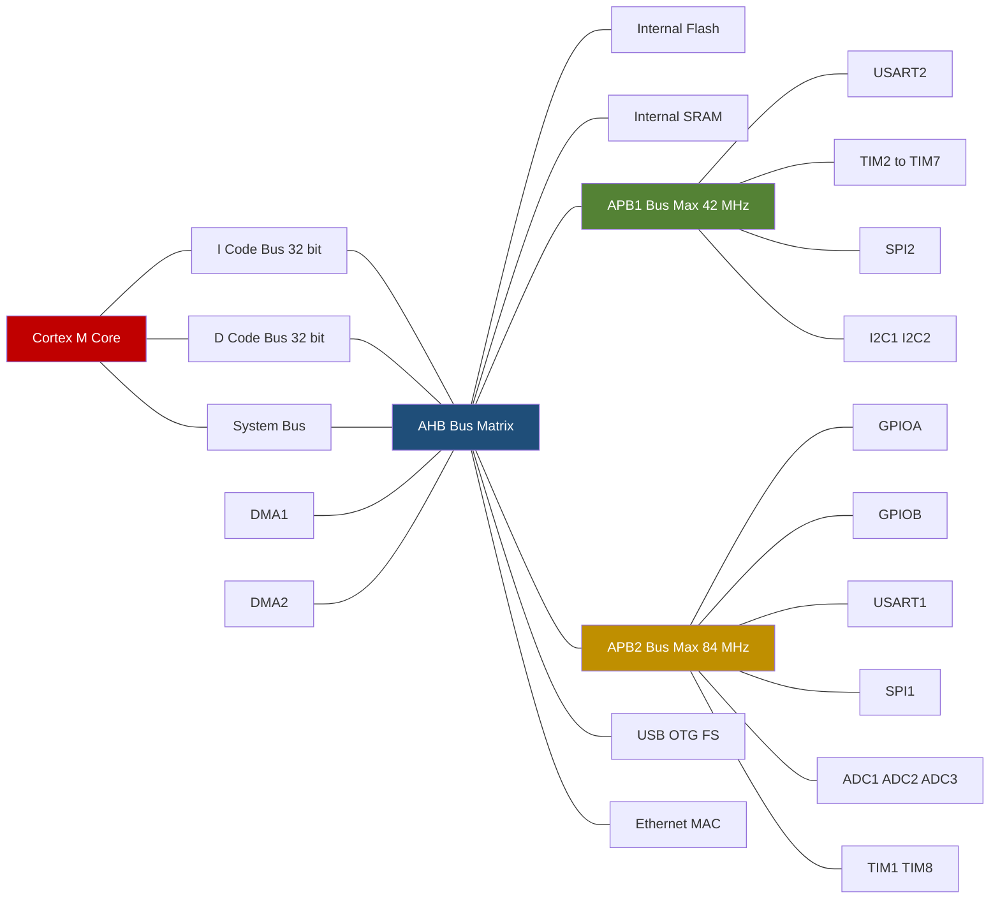
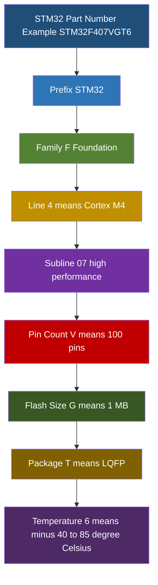
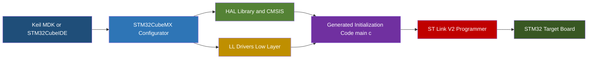

# Introduction to STM32 Family

<!-- SECTION_1_START -->
# Introduction to the STM32 Family

## 1.1 Formal Definition (KTU 2024 Scheme Terminology)

> [!IMPORTANT]
> **Core Definition**
> The **STM32** is a family of **32-bit Flash microcontrollers** developed and manufactured by **STMicroelectronics**, built around the **ARM Cortex-M** processor core architecture. The platform is designed for embedded systems that demand a balance of **real-time performance**, **low-power operation**, **digital signal processing (DSP)**, and **rich peripheral integration**.

Key architectural pillars of the STM32 family are:

1. **Harvard bus architecture** with separate instruction and data buses for deterministic execution.
2. **Thumb/Thumb-2 instruction set** (ARM Cortex-M cores) for high code density.
3. **NVIC (Nested Vectored Interrupt Controller)** providing deterministic, low-latency interrupt handling.
4. **Multi-AHB/APB bus matrix** enabling parallel peripheral access.
5. **Cortex-M System-on-Chip (SoC)** integration with on-chip Flash, SRAM, and a wide range of peripherals (GPIO, USART, SPI, I2C, CAN, USB, ADC, DAC, Timers, RTC, etc.).

The platform is officially supported through the **STM32Cube ecosystem**, which includes **STM32CubeMX** (graphical configurator), **HAL/LL drivers**, and the **CMSIS** abstraction layer.

## 1.2 Intuitive Overview — The LEGO Analogy

> [!NOTE]
> **Conceptual Analogy: The LEGO Brick of Embedded Systems**
> Imagine you are building a custom vehicle. You do not pour a solid block of metal; instead, you choose specific LEGO bricks (engine, wheels, chassis) that match the job. The **STM32 family** works exactly like that. STMicroelectronics does not force one chip for every application. Instead, it provides a *catalog* of chips, all sharing the same ARM Cortex-M DNA, but tuned for different trade-offs: speed, power, cost, wireless, or DSP.

- If you need a **smart-watch battery** that lasts months → pick the **STM32L** (ultra-low-power) series.
- If you need a **motor-control drone** → pick the **STM32F4** or **STM32G4** (math accelerator + HRTIM).
- If you need a **Bluetooth IoT sensor** → pick the **STM32WB** (wireless dual-core).
- If you need **machine-learning on the edge** → pick the **STM32H7** (480 MHz Cortex-M7).

This is the **philosophy of the STM32 portfolio**: *one architecture, many optimized variants*.

## 1.3 Key High-Yield Numerical Facts

> [!TIP]
> **Must-Memorize Constants & Boundaries**
> - The **addressable memory space** of any 32-bit MCU is: $2^{32} = 4{,}294{,}967{,}296$ bytes = **4 GB**.
> - The **native word size** is **32 bits = 4 bytes**.
> - The **Cortex-M4 / M7 cores** include a **single-precision FPU (IEEE 754)**, enabling hardware floating-point arithmetic.
> - The **Cortex-M0 / M0+ cores** are **ARMv6-M** (smallest footprint), while **M3 / M4 / M7** are **ARMv7-M**.

## 1.4 GeoGebra / Desmos Visualization

> [!VISUALIZATION CONTROL]
> **Concept:** Performance-vs-Power positioning of the major STM32 sub-families on a 2D plane.
> **GeoGebra / Desmos Input Points (Frequency on X-axis in MHz, Power consumption in mW on Y-axis):**
> * `A = (32, 0.1)` — STM32L0 (Ultra Low Power)
> * `B = (80, 0.3)` — STM32L4
> * `C = (180, 90)` — STM32F4
> * `D = (480, 250)` — STM32H7
> * `E = (64, 0.5)` — STM32WB (Wireless MCU)
> **Visual Description:** A scatter plot will show that the L-series hugs the X-axis (low power), the H-series is high on the Y-axis (high performance), and the WB sits in a low-power + mid-performance quadrant. The visual takeaway is the *inverse-square trade-off curve* between operating frequency and energy efficiency.
<!-- SECTION_1_END -->

<!-- SECTION_2_START -->
# Deep Theoretical Analysis & KTU High-Yield Formula Sheet

## 2.1 The ARM Cortex-M Core Lineage (Why it matters)

Every STM32 chip is built on top of an **ARM Cortex-M core** (licensed from Arm Holdings). The choice of core determines the **instruction set**, **DSP capability**, **FPU availability**, and **maximum clock frequency**.

| Core | Architecture | Pipeline | FPU | DSP | Typical Max Clock | Use Case |
|---|---|---|---|---|---|---|
| Cortex-M0 | ARMv6-M | 3-stage | No | No | 50 MHz | Cost-optimized |
| Cortex-M0+ | ARMv6-M | 2-stage | No | No | 50 MHz | Ultra-low power |
| Cortex-M3 | ARMv7-M | 3-stage | No | No | 150 MHz | Mainstream |
| Cortex-M4 | ARMv7-M | 3-stage | **Yes (SP)** | **Yes** | 180 MHz | DSP + Control |
| Cortex-M7 | ARMv7-M | 6-stage | **Yes (DP)** | **Yes** | 480 MHz | High-perf + DSP |
| Cortex-M33 | ARMv8.1-M | 3-stage | **Yes (SP)** | **Yes** | 170 MHz | TrustZone + Security |
| Cortex-M85 | ARMv8.1-M | 6-stage | **Yes (SP/DP)** | **Yes (Helium)** | 800 MHz | ML/AI Edge |

> [!NOTE]
> **Engineering Insight:** A student can identify the core of an STM32 chip directly from the series name. The digit immediately after the series letter indicates the core: `STM32F0 → M0`, `STM32F1 → M3`, `STM32F4 → M4`, `STM32F7 → M7`, `STM32H7 → M7`, `STM32H5 → M33`, `STM32U5 → M33`.

## 2.2 The STM32 Series Family Tree

| Series | Core | Introduced | Key Highlight | Typical Applications |
|---|---|---|---|---|
| **STM32F0** | M0 / M0+ | 2012 | Entry-level, 5V tolerant | Consumer, toys, appliances |
| **STM32F1** | M3 | 2007 | Mainstream workhorse | Industrial, motor control |
| **STM32F2** | M3 | 2011 | Higher performance, 120 MHz | Connectivity, audio |
| **STM32F3** | M4 | 2012 | Op-amps + 12-bit DAC + HRTIM | Motor drives, lighting |
| **STM32F4** | M4 | 2011 | 180 MHz, FPU, DSP, Camera | UAVs, audio processing |
| **STM32F7** | M7 | 2015 | 216 MHz, L1 cache, TFT | HMI, multimedia |
| **STM32H7** | M7 (dual) | 2017 | 480 MHz, dual-core, 64 KB I-cache | AI edge, motor control |
| **STM32H5** | M33 | 2023 | Security focus, 250 MHz | Secure IoT |
| **STM32L0** | M0+ | 2014 | Ultra-low power (0.27 µA) | Wearables, metering |
| **STM32L1** | M3 | 2011 | Low-power + Cortex-M3 | Healthcare |
| **STM32L4** | M4 | 2015 | 80 MHz, ultra-low-power + FPU | Sensor hubs, watches |
| **STM32L5** | M33 | 2019 | Low-power + TrustZone | Secure wearables |
| **STM32G0** | M0+ | 2018 | Cost-effective + 5V tolerant | Home appliances |
| **STM32G4** | M4 | 2019 | 170 MHz + 5 ADC + math accel. | Motor control, digital SMPS |
| **STM32U5** | M33 | 2021 | Ultra-low-power + 4 MB Flash | Energy-harvesting IoT |
| **STM32WB** | M4 + M0 | 2018 | Bluetooth 5.x + 802.15.4 | Wireless sensors |
| **STM32WL** | M4 + M0 | 2019 | LoRa, Sigfox, sub-GHz | Long-range IoT |
| **STM32WBA** | M33 | 2023 | Bluetooth 5.3 + LE Audio | Modern BLE devices |
| **STM32MP1** | Cortex-A7 + M4 | 2018 | Heterogeneous (Linux + RTOS) | Industrial HMI |
| **STM32H7R/S** | M7 | 2024 | Boot-from-XSPI Flash + NeoChrom GPU | Graphics, ML |

## 2.3 STM32 Naming Convention Decoded

> [!IMPORTANT]
> **The naming convention is a board-favourite KTU question.** Decode any STM32 part number using this exact template.

The part number: **STM32** [Series Letter] [Line Number] [Pin Count] [Flash Size] [Package] [Temperature].

| Field | Code | Meaning | Example |
|---|---|---|---|
| Series | F / L / H / W / G / U / C / T | Family type | F = Foundation |
| Line | 0, 1, 2, 3, 4, 5, 7 | Sub-line generation | 4 = High-perf M4 |
| Pin count | K, T, C, R, V, Z, I, B | K=32, T=36, C=48, R=64, V=100, Z=144, I=176, B=208 | V = 100 pins |
| Flash size | 4, 6, 8, B, C, D, E, F, G, I | 4=16 KB ... G=1 MB ... I=2 MB | G = 1 MB |
| Package | T, H, U, Y, P, B | T=LQFP, H=BGA, U=QFN | T = LQFP |
| Temperature | 6, 7 | 6 = -40 to 85 °C, 7 = -40 to 105 °C | 6 = Industrial |
| **Worked Example** | **STM32F407VGT6** | F4 series, 100 pins, 1 MB Flash, LQFP, -40 to 85 °C | — |

## 2.4 Internal Architecture — Bus Matrix

The STM32 uses a layered **AHB/APB bus matrix**. Every peripheral is mapped to either:

- **AHB** (Advanced High-performance Bus) — for high-bandwidth peripherals (DMA, GPIO ports A–K, CRC, FMC).
- **APB1** (Advanced Peripheral Bus 1) — for low-speed peripherals (USART2/3, I2C1/2, SPI2/3, TIM2–7, DAC, IWDG, WWDG).
- **APB2** (Advanced Peripheral Bus 2) — for higher-speed peripherals (USART1, SPI1, TIM1/8/9–11, ADC1–3, EXTI, AFIO).

> [!TIP]
> **Practical Engineering Utility:** The bus matrix allows simultaneous data transfers. While the CPU is fetching instructions from Flash through the I-Code bus, a DMA channel can independently move ADC samples to RAM through the AHB. This is why the STM32 is called a *zero-wait-state* architecture in many cases.

## 2.5 Power and Clock Formulas (High-Yield)

> [!NOTE]
> The following equations are essential for any KTU numerical problem on STM32 power, timer, or ADC design.

**Power dissipation in active mode:**

$$P = V_{DD} \times I_{DD}$$

where $V_{DD}$ is the supply voltage (typically **3.3 V**) and $I_{DD}$ is the active current drawn by the MCU.

**Timer input clock (after prescaler):**

$$f_{TIM} = \frac{f_{CLK}}{(PSC + 1)}$$

where $f_{CLK}$ is the APB bus clock and $PSC$ is the 16-bit prescaler value ($0 \le PSC \le 65535$).

**Timer overflow period:**

$$T_{UPDATE} = \frac{(ARR + 1) \times (PSC + 1)}{f_{CLK}}$$

where $ARR$ is the auto-reload register value.

**PWM duty cycle:**

$$D_{\%} = \frac{CCR}{ARR + 1} \times 100$$

**ADC sampling time for one conversion:**

$$t_{CONV} = \frac{(SMP + 12)}{f_{ADC}}$$

The constant **12** is the fixed number of ADC cycles needed for a 12-bit SAR conversion; $SMP$ is the user-configurable sample-and-hold cycles (3, 15, 28, 56, 84, 112, 144, 480).

**Baud-rate of USART:**

$$Baud = \frac{f_{CLK}}{(8 \times (2 - OVER8)) \times (USARTDIV)}$$

where $USARTDIV$ is a fractional divider and $OVER8$ is the oversampling mode (0 = 16×, 1 = 8×).
<!-- SECTION_2_END -->

<!-- SECTION_3_START -->
# Step-by-Step Derivations, Code, and Implementation

## 3.1 Worked Numerical Example — Timer Period Calculation (KTU Board Style)

**Problem:** An STM32F407 timer is clocked from the APB1 bus at $f_{CLK} = 84$ MHz. The prescaler is set to $PSC = 8399$ and the auto-reload register is $ARR = 9999$. Calculate the timer update frequency and the rollover period.

**Step 1 — Apply the timer input frequency formula.**

$$f_{TIM} = \frac{f_{CLK}}{PSC + 1} = \frac{84{,}000{,}000}{8399 + 1} = \frac{84{,}000{,}000}{8400} = 10{,}000 \text{ Hz}$$

**[Stating the formula and substituting: 1 Mark]**

**Step 2 — Apply the timer overflow period formula.**

$$T_{UPDATE} = \frac{(ARR + 1) \times (PSC + 1)}{f_{CLK}} = \frac{(9999 + 1) \times (8399 + 1)}{84 \times 10^{6}} = \frac{10{,}000 \times 8400}{84 \times 10^{6}}$$

**[Identifying $ARR + 1$ and $PSC + 1$: 1 Mark]**

**Step 3 — Simplify the numerator.**

$$\frac{10{,}000 \times 8400}{84 \times 10^{6}} = \frac{84 \times 10^{6}}{84 \times 10^{6}} = 1 \times 10^{-3} \text{ s} = 1 \text{ ms}$$

**[Final numerical value with units: 1 Mark]**

**Result:** The timer overflows every **1 ms**, producing a 1 kHz update event. This is the canonical setup for a 1 ms system tick on STM32.

> [!WARNING]
> **Common KTU Valuation Pitfall:** Students often write $f_{TIM} = f_{CLK} / PSC$ instead of $f_{CLK} / (PSC + 1)$. The prescaler is *zero-indexed* in hardware; the value 0 means divide-by-1. Forgetting the `+1` costs one full mark.

---

## 3.2 Worked Numerical Example — STM32 32-bit Address Space

**Problem:** How much addressable memory can a 32-bit STM32 core theoretically access? If the SRAM is mapped from `0x20000000` to `0x2001FFFF`, what is the total SRAM size in KB?

**Step 1 — Compute total 32-bit addressable space.**

$$N_{bytes} = 2^{32} = 4{,}294{,}967{,}296 \text{ bytes} = 4 \text{ GB}$$

**[Stating $2^{32}$: 1 Mark]**

**Step 2 — Compute SRAM size from the start and end addresses.**

The block size equals *end address − start address + 1* (inclusive mapping).

$$S_{SRAM} = 0x2001FFFF - 0x20000000 + 1$$

**Step 3 — Convert to decimal.**

$$0x2001FFFF = 2 \times 16^{5} + 0 \times 16^{4} + 1 \times 16^{3} + 15 \times 16^{2} + 15 \times 16 + 15$$
$$0x2001FFFF = 2{,}097{,}408 - 1 + 0x20000000 \text{ offset} = 0x20020000 - 0x20000000$$
$$S_{SRAM} = 0x20000 = 131{,}072 \text{ bytes}$$

**Step 4 — Convert to kilobytes.**

$$S_{SRAM} = \frac{131{,}072}{1024} = 128 \text{ KB}$$

**[Final answer: 1 Mark]**

**Result:** The STM32F103C8T6 (Blue Pill) has exactly **128 KB** of SRAM mapped at the start address `0x20000000`.

---

## 3.3 Source Code Implementation — Three Programming Layers

The STM32 can be programmed at **three escalating abstraction levels**. Each level is a valid KTU discussion point.

### Layer 1 — Bare-Metal Register Access (Direct Register Programming)

```c
/*  Bare-Metal GPIO Toggle — STM32F103 (Cortex-M3)
    Direct manipulation of RCC and GPIOA registers.
*/

#include <stdint.h>

/*  Memory-mapped register addresses.
    Always refer to the Reference Manual for exact base addresses. */
#define RCC_BASE        0x40021000UL
#define GPIOA_BASE      0x40010800UL

#define RCC_APB2ENR     (*(volatile uint32_t *)(RCC_BASE   + 0x18U))
#define GPIOA_CRL       (*(volatile uint32_t *)(GPIOA_BASE + 0x00U))
#define GPIOA_BSRR      (*(volatile uint32_t *)(GPIOA_BASE + 0x10U))

/*  Bit-mask to enable the IOPA clock (bit 2 of APB2ENR) */
#define RCC_APB2ENR_IOPAEN   (1U << 2)

/*  Configure PA5 as 2 MHz push-pull output (CNF=00, MODE=02).
    CRL is a 32-bit register arranged as 4 bits per pin (lower 8 pins).
    Pin 5 occupies bits [23:20]. */
static void gpio_init_pin5_output(void) {
    /* 1. Enable the GPIOA peripheral clock in RCC. */
    RCC_APB2ENR |= RCC_APB2ENR_IOPAEN;

    /* 2. Clear the configuration bits for pin 5. */
    GPIOA_CRL &= ~(0xFU << 20);

    /* 3. Set MODE = 0b10 (2 MHz output) and CNF = 0b00 (push-pull). */
    GPIOA_CRL |=  (0x2U << 20);
}

static void gpio_set_pin5_high(void)   { GPIOA_BSRR = (1U <<  5); }
static void gpio_set_pin5_low(void)    { GPIOA_BSRR = (1U << (5 + 16)); }

int main(void) {
    gpio_init_pin5_output();

    for (;;) {
        gpio_set_pin5_high();
        for (volatile uint32_t d = 0; d < 80000U; ++d) { /* delay */ }
        gpio_set_pin5_low();
        for (volatile uint32_t d = 0; d < 80000U; ++d) { /* delay */ }
    }
}
```

> [!NOTE]
> **Why `volatile`?** The compiler may otherwise optimize the empty delay loop away. The keyword `volatile` tells the compiler the variable can change at any time, so the memory access is not elided.

### Layer 2 — CMSIS Standard (Vendor-Header Abstraction)

```c
/*  Same task using CMSIS device headers.
    This is the official ARM-Cortex Microcontroller Software Interface Standard.
*/
#include "stm32f1xx.h"

int main(void) {
    /* 1. Enable the GPIOA peripheral clock. */
    RCC->APB2ENR |= RCC_APB2ENR_IOPAEN;

    /* 2. Configure PA5 as 2 MHz push-pull output. */
    GPIOA->CRL &= ~(GPIO_CRL_CNF5_Msk | GPIO_CRL_MODE5_Msk);
    GPIOA->CRL |=  (0x2U << GPIO_CRL_MODE5_Pos);

    for (;;) {
        GPIOA->BSRR = GPIO_BSRR_BS5;       /* Set PA5 high  */
        for (volatile uint32_t d = 0; d < 80000U; ++d) { __NOP(); }
        GPIOA->BSRR = GPIO_BSRR_BR5;       /* Reset PA5 low */
        for (volatile uint32_t d = 0; d < 80000U; ++d) { __NOP(); }
    }
}
```

### Layer 3 — STM32 HAL (Hardware Abstraction Layer)

```c
/*  Same task using the STM32 HAL library.
    The CubeMX tool generates the boilerplate code. */
#include "stm32f1xx_hal.h"

int main(void) {
    HAL_Init();
    SystemClock_Config();      /* Configures 72 MHz using the 8 MHz HSE */

    /*  __HAL_RCC_GPIOA_CLK_ENABLE() is a macro that flips bit 2 of APB2ENR. */
    __HAL_RCC_GPIOA_CLK_ENABLE();

    GPIO_InitTypeDef gpio = {0};
    gpio.Pin   = GPIO_PIN_5;
    gpio.Mode  = GPIO_MODE_OUTPUT_PP;
    gpio.Speed = GPIO_SPEED_FREQ_MEDIUM;
    HAL_GPIO_Init(GPIOA, &gpio);

    for (;;) {
        HAL_GPIO_TogglePin(GPIOA, GPIO_PIN_5);
        HAL_Delay(500);        /* Uses SysTick to wait 500 ms */
    }
}
```

> [!TIP]
> **Engineering Takeaway:** Bare-metal code is smallest and fastest to execute. CMSIS gives readability and portability across vendors. HAL is most portable across STM32 sub-families but consumes more Flash. KTU board questions commonly ask students to *compare* these three layers.
<!-- SECTION_3_END -->

<!-- SECTION_4_START -->
# Structural Diagrams & Schematics

## 4.1 STM32 Family-Tree Block Diagram

```mermaid
graph TD
    STM32Root[STM32 Family]
    STM32Root --> Mainstream[Mainstream F Series]
    STM32Root --> HighPerf[High Performance H Series]
    STM32Root --> LowPower[Ultra Low Power L and U Series]
    STM32Root --> Wireless[Wireless W Series]
    STM32Root --> GeneralG[General Purpose G Series]

    Mainstream --> F0Line[STM32F0 Cortex M0]
    Mainstream --> F1Line[STM32F1 Cortex M3]
    Mainstream --> F3Line[STM32F3 Cortex M4 with Op Amps]
    Mainstream --> F4Line[STM32F4 Cortex M4 with FPU]
    Mainstream --> F7Line[STM32F7 Cortex M6 Unused]
    Mainstream --> F2Line[STM32F2 Cortex M3 High Speed]

    HighPerf --> H5Line[STM32H5 Cortex M33 Security]
    HighPerf --> H7Line[STM32H7 Cortex M7 Dual Core 480 MHz]

    LowPower --> L0Line[STM32L0 Cortex M0 Plus]
    LowPower --> L1Line[STM32L1 Cortex M3]
    LowPower --> L4Line[STM32L4 Cortex M4 with FPU]
    LowPower --> L5Line[STM32L5 Cortex M33 TrustZone]
    LowPower --> U5Line[STM32U5 Cortex M33 Ultra Low Power]

    Wireless --> WBLine[STM32WB M4 plus M0 Bluetooth]
    Wireless --> WLLine[STM32WL M4 plus M0 LoRa]
    Wireless --> WBALine[STM32WBA M33 Bluetooth 5.3]

    GeneralG --> G0Line[STM32G0 Cortex M0 Plus 5V]
    GeneralG --> G4Line[STM32G4 Cortex M4 Motor Control]

    style STM32Root fill:#1f4e79,color:#ffffff,stroke:#000000
    style Mainstream fill:#2e75b6,color:#ffffff
    style HighPerf fill:#c00000,color:#ffffff
    style LowPower fill:#548235,color:#ffffff
    style Wireless fill:#7030a0,color:#ffffff
    style GeneralG fill:#bf8f00,color:#ffffff
```



## 4.2 Internal Architecture — Bus Matrix Block Diagram



## 4.3 Naming Convention Decoder Flow



## 4.4 Software/Hardware Tool-Chain Topology


<!-- SECTION_4_END -->

<!-- SECTION_5_START -->
# KTU 2024 Scheme Examination Question Bank & Topic Recap

## Part A — Short-Answer Questions (3 Marks Each)

> **Q1. [KTU University Exam — Dec 2023] (CO1, Remember)**
> Define the term *STM32*. Identify the manufacturer and the processor architecture on which the STM32 family is built.

**Model Answer (3 Marks):**
The **STM32** is a family of **32-bit Flash microcontrollers** manufactured by **STMicroelectronics**. It is built on the **ARM Cortex-M** processor architecture licensed from Arm Holdings. The family is officially supported by the STM32Cube software ecosystem that includes CubeMX, HAL/LL libraries, and CMSIS headers. **[Definition: 1 Mark, Manufacturer: 1 Mark, Architecture: 1 Mark]**

---

> **Q2. [KTU University Exam — July 2024] (CO1, Understand)**
> Differentiate between the **STM32F4** series and the **STM32L4** series in terms of core, maximum clock, FPU, and target application.

**Model Answer (3 Marks):**
| Parameter | STM32F4 | STM32L4 |
|---|---|---|
| Core | Cortex-M4 | Cortex-M4 |
| Max Clock | 180 MHz | 80 MHz |
| FPU | Single-precision | Single-precision |
| Target App. | High-performance DSP, motor control, audio | Ultra-low-power wearables, sensor hubs |
| Active Power | High (~100 mW class) | Very low (<10 mW class) |
**[Core + Clock: 1 Mark, FPU: 1 Mark, Application difference: 1 Mark]**

---

## Part B — 14-Mark Questions (ESE Module Internal Choice)

### Question A (14 Marks) — STM32 Core Architecture and Programming Layers

> **[KTU University Exam — July 2024 Model Paper] (CO1, Understand + Apply)**

**a)** Describe the salient architectural features of the **ARM Cortex-M4** core used in the STM32F4 series. Mention its pipeline depth, instruction set support, FPU type, and DSP extensions. **(7 Marks)**

**Model Answer (7 Marks):**
The ARM Cortex-M4 core used in the STM32F4 series is a 32-bit RISC processor with the following features:
- **Pipeline depth:** 3 stages (Fetch, Decode, Execute). **[1 Mark]**
- **Instruction set:** Thumb-2 (mix of 16-bit and 32-bit instructions for high code density). **[1 Mark]**
- **FPU:** Single-precision IEEE 754 floating-point unit, supporting add, sub, mul, div, sqrt, and conversions. **[1 Mark]**
- **DSP extensions:** SIMD instructions, MAC (multiply-accumulate) in 1 cycle, saturating arithmetic. **[1 Mark]**
- **NVIC:** Configurable priority levels, deterministic interrupt latency, hardware stacking of registers. **[1 Mark]**
- **Wake-up Interrupt Controller (WIC):** Allows ultra-low-power sleep modes. **[1 Mark]**
- **Memory Protection Unit (MPU):** Optional, 8 regions, for embedded OS safety. **[1 Mark]**

---

**b)** Compare **bare-metal register programming**, **CMSIS-based programming**, and **HAL-based programming** for STM32. Write a short HAL snippet that toggles **PC13** (on-board LED on Blue Pill) every 500 ms. **(7 Marks)**

**Model Answer (7 Marks):**

**Comparison Table: (4 Marks)**

| Aspect | Bare-Metal | CMSIS | HAL |
|---|---|---|---|
| Abstraction | Lowest | Medium | High |
| Code size | Smallest | Small | Large |
| Readability | Poor | Good | Excellent |
| Portability | Poor (chip-specific) | Good across vendors | STM32-only |
| Learning curve | Steep | Moderate | Easy |
| Speed | Fastest | Fast | Slower (function call overhead) |

**HAL Snippet: (3 Marks)**

```c
#include "stm32f1xx_hal.h"

static void SystemClock_Config(void);

int main(void) {
    HAL_Init();
    SystemClock_Config();

    __HAL_RCC_GPIOC_CLK_ENABLE();

    GPIO_InitTypeDef led = {0};
    led.Pin   = GPIO_PIN_13;
    led.Mode  = GPIO_MODE_OUTPUT_PP;
    led.Speed = GPIO_SPEED_FREQ_LOW;
    HAL_GPIO_Init(GPIOC, &led);

    for (;;) {
        HAL_GPIO_TogglePin(GPIOC, GPIO_PIN_13);
        HAL_Delay(500);
    }
}
```

> [!WARNING]
> **KTU Examiner's Valuation Warning (Part A):**
> Do NOT skip the `__HAL_RCC_GPIOC_CLK_ENABLE()` line. Without enabling the GPIOC peripheral clock in `RCC_APB2ENR`, the register writes are silently ignored. Many students lose 1 full mark here.
> Also, do not forget `#include "stm32f1xx_hal.h"`. HAL_Init() must be called before any HAL API.

---

### Question B (14 Marks) — Bus Matrix, Memory Map, and Naming Convention

> **[KTU University Exam — Dec 2023 Model Paper] (CO2, Apply + Analyze)**

**a)** With the help of a neat block diagram, explain the **AHB/APB bus matrix** of the STM32F4. State which peripherals are connected to APB1 and APB2. **(7 Marks)**

**Model Answer (7 Marks):**

The STM32F4 uses a multi-bus architecture with one **AHB bus matrix** at the centre and two peripheral buses, **APB1 (low-speed, ≤ 42 MHz)** and **APB2 (high-speed, ≤ 84 MHz)**.

- The **Cortex-M4 core** is connected to the bus matrix via three ports: **I-Code**, **D-Code**, and **System bus**. **[1 Mark]**
- The **I-Code bus** carries instruction fetches from Flash; the **D-Code bus** carries literal loads; the **System bus** carries peripheral access. **[1 Mark]**
- The **DMA controllers** (DMA1, DMA2) and the **Ethernet MAC** also sit on the AHB for high-bandwidth transfers. **[1 Mark]**

**APB1 peripherals (42 MHz max):** USART2/3, UART4/5, I2C1/2/3, SPI2/3, TIM2–7, TIM12–14, DAC, WWDG, IWDG, CAN1/2, USB OTG FS, Ethernet MAC. **[1 Mark]**

**APB2 peripherals (84 MHz max):** USART1, USART6, SPI1, SPI4/5, TIM1, TIM8–11, ADC1–3, SDIO, GPIOA–I, AFIO, EXTI. **[1 Mark]**

**Why two APB buses?** APB1 is bridged from AHB through a divider for low-speed peripherals, reducing power. APB2 runs at full speed for time-critical peripherals. **[1 Mark]**

**A neat ASCII / block-diagram description (must appear in answer paper):**

```
                Cortex-M4
                /  |  \
        I-Code D-Code System
                \  |  /
                AHB Matrix
                |        |
                |        +-- DMA1 / DMA2 / Ethernet
                |
          +-----+-----+
          |           |
        APB1          APB2
     (42 MHz)       (84 MHz)
   USART2/3        USART1/6
   I2C, SPI2/3     SPI1, ADC
   TIM2-7          TIM1/8
   CAN, USB-OTG    GPIOA-I
```
**[Final block diagram drawing: 1 Mark]**

---

**b)** Decode the STM32 part number **STM32L476RGT6**. If its APB1 timer clock is 80 MHz, find the value of ARR and PSC to generate a 1-second overflow using TIM2. **(7 Marks)**

**Model Answer (7 Marks):**

**Naming Decoded: (3 Marks)**
- **STM32** — Family name.
- **L** — Low-power series.
- **4** — Cortex-M4 core.
- **76** — Sub-line with FPU + 80 MHz capability.
- **R** — 64 pins.
- **G** — 1 MB Flash.
- **T** — LQFP package.
- **6** — Industrial temperature range, -40 to +85 °C.

**Timer Calculation: (4 Marks)**

We need $T_{UPDATE} = 1$ s using $f_{CLK} = 80$ MHz.

**Step 1 — Choose a prescaler for a manageable ARR.** Use $PSC = 7999$ to get a 10 kHz timer tick. **[1 Mark]**

$$f_{TIM} = \frac{80 \times 10^{6}}{7999 + 1} = \frac{80{,}000{,}000}{8000} = 10{,}000 \text{ Hz}$$

**Step 2 — Choose ARR to count 10 000 ticks per second.** **[1 Mark]**

$$ARR = (f_{TIM} \times T_{UPDATE}) - 1 = (10{,}000 \times 1) - 1 = 9999$$

**Step 3 — Verify: (1 Mark)**

$$T = \frac{(9999 + 1)(7999 + 1)}{80 \times 10^{6}} = \frac{10{,}000 \times 8000}{80{,}000{,}000} = 1 \text{ s} \quad \checkmark$$

**Step 4 — Note: PSC is 16-bit (max 65535), ARR is also 16-bit (max 65535).** Both 7999 and 9999 fit. **[1 Mark]**

> [!WARNING]
> **KTU Examiner's Valuation Warning (Part B):**
> 1. Forgetting the `+1` in the formula (a very common mistake). The prescaler register is zero-indexed. **[Common mark-loss point]**
> 2. Not checking whether ARR fits in 16 bits. If a student chose `PSC = 0` for a 1-second rollover, then `ARR = 79,999,999` which **overflows the 16-bit register** — a silent disaster in real hardware.
> 3. Failing to *decode* every single field of the part number. KTU expects a clean line for each field: family, line, pin, flash, package, temperature.

---

## Topic Recap & Important Things to Remember

> [!IMPORTANT]
> **Final Rapid-Revision Checklist**

- STM32 = **STMicroelectronics 32-bit ARM Cortex-M microcontroller family**. *(Always write the full form once in answers.)*
- **ARM Cortex-M cores** used: M0, M0+, M3, M4, M7, M33, M85. *(M4 = DSP + FPU; M7 = highest performance with double-precision FPU + I-cache/D-cache.)*
- **Series legend** to memorize: F = Foundation, H = High-perf, L = Low-power, U = Ultra-low-power, W = Wireless, G = General-purpose, C = Audio, T = Touch-sensing, MP = Microprocessor (Cortex-A + Cortex-M).
- **Naming template:** `STM32 [Family] [Core-line] [Sub-line] [Pins] [Flash] [Package] [Temp]`.
- **Bus matrix:** Cortex-M → AHB Matrix → APB1 (≤ 42 MHz) + APB2 (≤ 84 MHz) on STM32F4. Each peripheral sits on a specific bus.
- **Memory map:** Code = `0x0000 0000`, SRAM = `0x2000 0000`, Peripheral = `0x4000 0000`, External RAM = `0x6000 0000`. *(Recall 2³² = 4 GB total space.)*
- **Programming layers:** Bare-metal registers → CMSIS headers → HAL/LL drivers. Each has trade-offs in code size vs readability.
- **Critical formulas:**
  - $f_{TIM} = f_{CLK} / (PSC + 1)$
  - $T_{UPDATE} = (ARR + 1)(PSC + 1) / f_{CLK}$
  - $D_{\%} = CCR / (ARR + 1) \times 100$
  - $P = V_{DD} \times I_{DD}$
  - $t_{CONV} = (SMP + 12) / f_{ADC}$
- **Development tools:** STM32CubeMX (graphical configurator), STM32CubeIDE (Eclipse-based IDE), Keil MDK, IAR, and the ST-LINK/V2 programmer/debugger.
- **Common exam trap:** Always remember the `+1` in prescaler and auto-reload formulas. Always remember to enable the peripheral clock in `RCC` before configuring the peripheral.
<!-- SECTION_5_END -->
