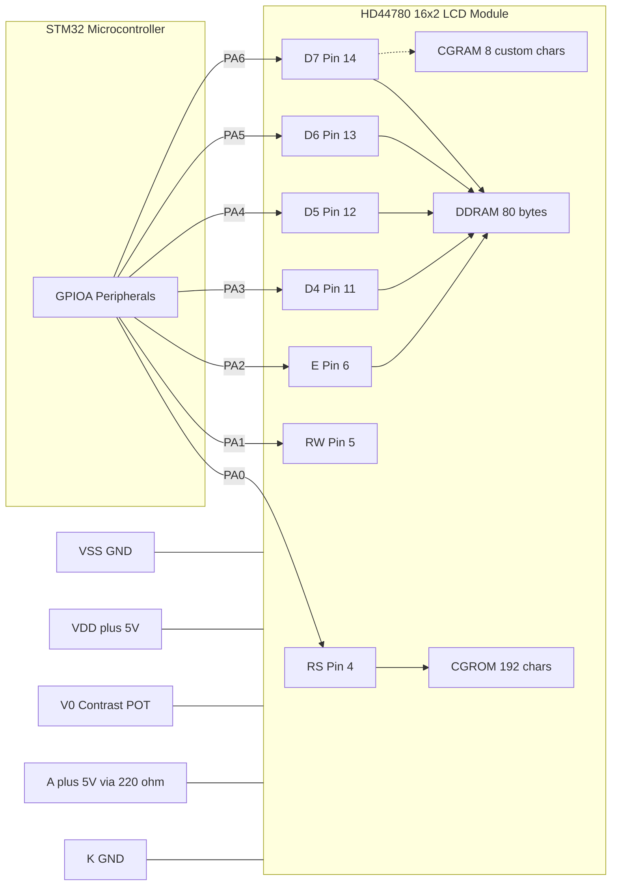
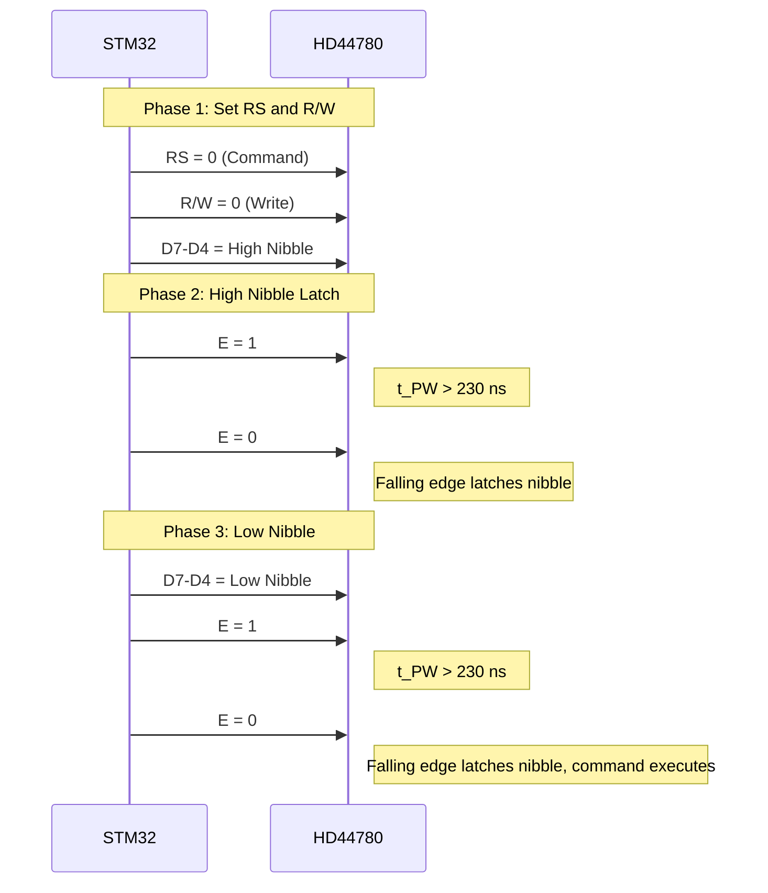
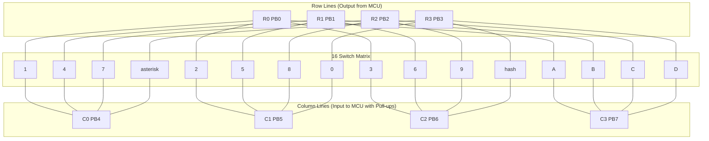
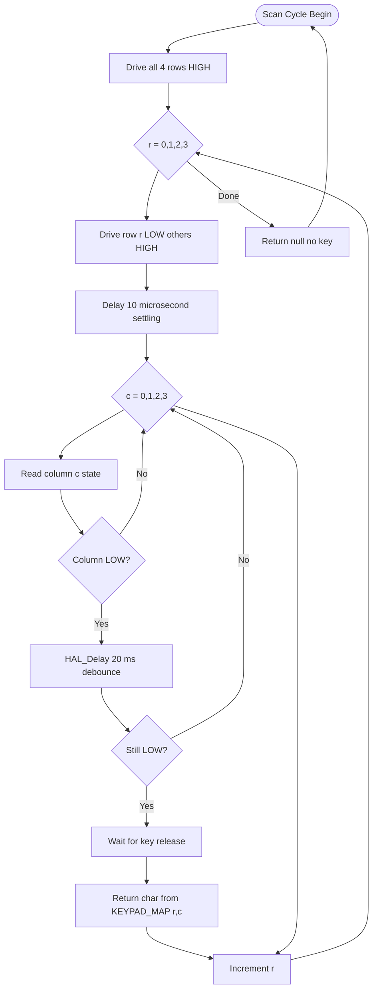
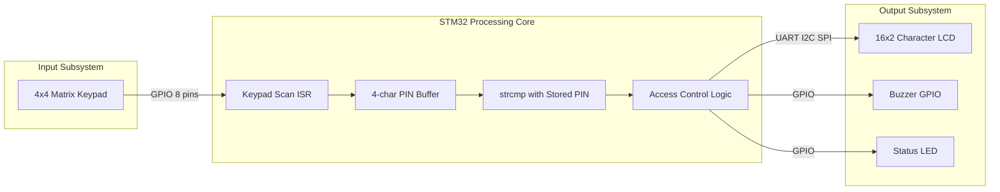

# LCD Display, and Matrix Keypad

<!-- SECTION_1_START -->

# LCD Display and Matrix Keypad — STM32 Peripheral Interfacing

## 1.1 Liquid Crystal Display (LCD) — Core Definition

A **Liquid Crystal Display (LCD)** is a flat-panel electronic visual display module that uses the light-modulating properties of liquid crystals combined with a backlight or reflector to produce visible images. In the context of **STM32 microcontroller peripheral programming (PBCST504 — Module 2)**, the term "LCD" specifically refers to the **16 × 2 character-based alphanumeric LCD module** (also available in 20 × 4 variants) which uses the ubiquitous **Hitachi HD44780 LCD Controller/Driver** as its on-board interpreter IC.

> [!IMPORTANT]
> **KTU Syllabus Highlight:** The HD44780 controller is the *de-facto* industry standard. Understanding its instruction set is the foundation for interfacing *any* character LCD to *any* microcontroller — whether 8051, PIC, AVR, Arduino, or STM32.

The **16 × 2 LCD** has the following physical and operational matrix:
- **16 Columns** × **2 Rows** = **32 character cells**
- Each cell is a **5 × 8 dot-matrix** pixel block (sometimes configured as 5 × 10)
- The on-board controller contains a **Character Generator ROM (CGROM)** storing **192 pre-programmed ASCII characters**
- It also has a **Character Generator RAM (CGRAM)** for **8 user-defined custom characters (5 × 8 dots)**
- A **Display Data RAM (DDRAM)** of **80 bytes** stores the current screen contents

> [!NOTE]
> **Conceptual Analogy — The LCD as a Postal Letterbox:** Think of the LCD as a transparent letterbox with **80 numbered slots** (DDRAM addresses $0x00$ to $0x4F$). Only **32 of these slots** are visible through the front glass (the 16 × 2 window). The microcontroller (the postman) writes ASCII bytes into specific addresses to make characters appear. The position of the visible window is controlled by *Display Shift* and *Set DDRAM Address* commands.

### LCD Pin Configuration (Standard 16-Pin Header)

> [!IMPORTANT]
> **Pin numbering for a 16-pin character LCD** (viewed from the *front* with pins on the *left*):

| Pin # | Symbol | Name | Function |
|:-----:|:------:|:-----|:---------|
| 1 | $V_{SS}$ | Ground | $0\text{ V}$ power supply return |
| 2 | $V_{DD}$ | Power | $+5\text{ V}$ logic supply |
| 3 | $V_{0$ / $V_{EE}}$ | Contrast | Wiper of $10\text{ k}\Omega$ potentiometer between $V_{DD}$ and $V_{SS}$ |
| 4 | $RS$ | Register Select | $0$ = Command Register, $1$ = Data Register |
| 5 | $R/\overline{W}$ | Read/Write | $0$ = Write to LCD, $1$ = Read from LCD |
| 6 | $E$ | Enable | Falling edge latches data into LCD |
| 7–14 | $D_0$ – $D_7$ | Data Bus | 8-bit bidirectional data lines |
| 15 | $A$ / $LED+$ | Anode (Backlight) | Connect through **$220\text{ }\Omega$** current-limit resistor to $+5\text{ V}$ |
| 16 | $K$ / $LED-$ | Cathode (Backlight) | Connect to $V_{SS}$ |

> [!WARNING]
> **KTU Examiner's Pitfall:** A common mistake is leaving Pin 3 ($V_0$) *floating* — this causes either a fully dark screen or invisible characters. Always tie it via a **$10\text{ k}\Omega$ potentiometer** to adjust contrast.

## 1.2 Matrix Keypad — Core Definition

A **Matrix Keypad** is an arrangement of push-buttons wired in a *row–column matrix* topology to minimize the number of GPIO pins required. A **4 × 4 matrix keypad** contains **16 keys** arranged at the intersections of **4 rows** and **4 columns**, requiring only **8 GPIO pins** instead of the **16 pins** that would be needed in a direct (one-wire-per-key) arrangement.

**Cost & Pin Economics:**
$$\text{Pins required (matrix)} = R + C = 4 + 4 = 8 \quad \text{vs.} \quad \text{Pins required (direct)} = R \times C = 16$$

> [!NOTE]
> **Conceptual Analogy — The Matrix Keypad as a Bingo Grid:** Imagine a 4 × 4 bingo card. Each cell sits at the crossing of a *row* and a *column*. To find which cell a player picked, the caller announces a row (e.g., "Row 2") and checks which column reported a hit. The matrix keypad works identically: the microcontroller *energizes one row at a time* and *reads all four columns* to detect which button in that row is pressed.

### Standard 4 × 4 Keypad Layout

| | **Col 0** | **Col 1** | **Col 2** | **Col 3** |
|:---:|:---:|:---:|:---:|:---:|
| **Row 0** | `1` | `2` | `3` | `A` |
| **Row 1** | `4` | `5` | `6` | `B` |
| **Row 2** | `7` | `8` | `9` | `C` |
| **Row 3** | `*` | `0` | `#` | `D` |

> [!VISUALIZATION CONTROL]
> **Concept:** Matrix Keypad Scanning — Row/Column Voltage Plot
> **GeoGebra / Desmos Input Equations:**
> * `Row0: f(x) = if(0 <= x <= 1, 0, if(1 < x <= 2, 5, if(2 < x <= 3, 5, if(3 < x <= 4, 5, undefined))))`
> * `Row1, Row2, Row3: similar staircase HIGH patterns staggered in time`
> * `Col_pressed: g(x) = 0` (column pulled LOW only when its key is closed)
> **Visual Description:** A time-axis plot showing 4 row signals each going LOW sequentially in a scanning cycle, and 4 column signals staying HIGH (idle) until a button is pressed.

## 1.3 Fundamental Differences at a Glance

> [!IMPORTANT]
> **LCD** is an *output* peripheral (STM32 → Human).
> **Matrix Keypad** is an *input* peripheral (Human → STM32).

This asymmetric information flow governs everything from pin configuration (LCD = push-pull output, Keypad = input with pull-ups) to timing requirements and synchronization protocols.

<!-- SECTION_1_END -->

<!-- SECTION_2_START -->

# Deep Theoretical Analysis — Operational Principles and KTU Formula Sheet

## 2.1 HD44780 LCD Operating Modes

The HD44780 supports **two primary communication modes** with the host MCU:

### 2.1.1 8-Bit Mode (Full Bus)
- Uses all **8 data lines $D_0$ – $D_7$**
- One full byte of data/command is transferred per enable pulse
- **Faster** (1 transfer = 1 character)
- **Higher pin cost**: Requires **10 MCU GPIO pins** ($RS$, $R/\overline{W}$, $E$, $D_0$ – $D_7$)

### 2.1.2 4-Bit Mode (Nibble Bus) — *KTU Preferred*
- Uses **only 4 data lines $D_4$ – $D_7$**
- A byte is transferred in **two sequential nibbles**: high nibble first, then low nibble
- **Saves 4 GPIO pins** (only **6 MCU pins** needed: $RS$, $R/\overline{W}$, $E$, $D_4$ – $D_7$)
- **Slightly slower** (2 enable pulses per character), but trivially negligible at LCD refresh timescales
- **Universally used in STM32 designs** — this is what KTU Module 2 expects

> [!NOTE]
> **Why 4-bit mode is industry standard:** Modern MCUs are pin-constrained. The STM32F103C8T6 (Blue Pill) exposes only 37 usable GPIOs across 4 ports; sacrificing 4 pins to a data bus is expensive. The 4-bit mode is the perfect engineering compromise.

## 2.2 HD44780 Critical Instruction Set (KTU High-Yield)

> [!IMPORTANT]
> The following table is the **most-tested subset** of the ~11 command codes. Memorize the hex values and the timing budgets.

| Instruction | $RS$ | $R/\overline{W}$ | $D_7 D_6 D_5 D_4 D_3 D_2 D_1 D_0$ (Hex) | Execution Time |
|:------------|:---:|:---:|:---:|:---:|
| **Clear Display** | 0 | 0 | `0x01` | $\geq 1.53\text{ ms}$ |
| **Return Home** | 0 | 0 | `0x02` | $\geq 1.53\text{ ms}$ |
| **Entry Mode Set** | 0 | 0 | `0x04$ | $I/D$, $S$` | $39\text{ }\mu s$ |
| **Display ON/OFF** | 0 | 0 | `0x08$ | $D$, $C$, $B$` | $39\text{ }\mu s$ |
| **Cursor & Display Shift** | 0 | 0 | `0x10$ | $S/C$, $R/L$` | $39\text{ }\mu s$ |
| **Function Set** | 0 | 0 | `0x20$ | $DL$, $N$, $F$` | $39\text{ }\mu s$ |
| **Set CGRAM Address** | 0 | 0 | `0x40$ + $AC_5 AC_4 AC_3 AC_2 AC_1 AC_0$` | $39\text{ }\mu s$ |
| **Set DDRAM Address** | 0 | 0 | `0x80$ + $AC_6 AC_5 AC_4 AC_3 AC_2 AC_1 AC_0$` | $39\text{ }\mu s$ |
| **Write Data to RAM** | 1 | 0 | User byte (ASCII) | $43\text{ }\mu s$ |
| **Read Busy Flag (BF)** | 0 | 1 | `BF AC_6 … AC_0` | $0\text{ }\mu s$ |

**Flag decoding for `Function Set (0x20 | flags)`:**
- $DL$ (`0x10`): Data Length → `$0$` = 4-bit, `$1$` = 8-bit
- $N$ (`0x08`): Number of display lines → `$0$` = 1 line, `$1$` = 2 lines
- $F$ (`0x04`): Font → `$0$` = 5 × 8 dots, `$1$` = 5 × 10 dots

**Most common `Function Set` command sent:**
$$\text{0x28} = \underbrace{0x20}_{\text{base}} \;|\; \underbrace{0x08}_{N=2 \text{ lines}} \;|\; \underbrace{0x00}_{F=5 \times 8} \quad \Rightarrow \text{4-bit, 2-line, 5×8 font}$$

## 2.3 LCD DDRAM Address Map (16 × 2)

| Row | Start Address | End Address | Visible Range |
|:---:|:---:|:---:|:---:|
| Row 1 (top) | $0x00$ | $0x0F$ | Columns 1–16 |
| Row 2 (bottom) | $0x40$ | $0x4F$ | Columns 1–16 |

To position the cursor on **Row 2, Column 5** (1-indexed), the command is:
$$\text{Set DDRAM Address} = 0x80 \;|\; (0x40 + 4) = 0x84$$

## 2.4 LCD Enable (E) Pulse Timing

The HD44780 latches data on the **falling edge of the Enable pin**. The critical timings (from the datasheet) are:

| Parameter | Symbol | Min Value |
|:----------|:------:|:---------:|
| Enable pulse width (HIGH) | $t_{PW}$ | **$230\text{ ns}$** |
| Data setup time before E falls | $t_{DS}$ | **$80\text{ ns}$** |
| Data hold time after E falls | $t_{DH}$ | **$10\text{ ns}$** |
| Enable cycle time | $t_{CYC}$ | **$500\text{ ns}$** |

For STM32 at $72\text{ MHz}$, a single clock cycle is $\approx 13.9\text{ ns}$, so even a **2-cycle delay** satisfies $t_{PW}$. KTU expects a software delay of **$\sim 1\text{ }\mu s$ to $2\text{ }\mu s$** for safety margin.

## 2.5 Matrix Keypad — Scanning Algorithm

The **fundamental scanning algorithm** works as follows:

1. Configure all **4 row pins as OUTPUT** (push-pull, initially HIGH)
2. Configure all **4 column pins as INPUT** with **internal/external pull-up resistors** (idle HIGH)
3. Sequentially drive each row **LOW** one at a time while keeping the other rows HIGH
4. After pulling a row LOW, **read all 4 columns**
5. If a column reads **LOW**, then the key at the intersection of that row and column is **pressed**

The pseudocode is:
```
for r in 0..3:
    drive all rows HIGH
    drive row r LOW
    delay 5-10 us (settling)
    for c in 0..3:
        if read_column(c) == LOW:
            debounce; report key(r, c)
```

### Key Identification Formula

For a 4 × 4 matrix, each key can be mapped to a unique index:

$$k = 4r + c \quad \text{where} \quad r \in \{0,1,2,3\}, \; c \in \{0,1,2,3\}$$

The character lookup table then converts the index to the displayed ASCII symbol:
$$\text{char}(r,c) = \text{lookup}[k] = \text{lookup}[4r + c]$$

## 2.6 Debouncing — The Critical Sub-Problem

Mechanical push-buttons suffer from **contact bounce** — the metal contacts oscillate between OPEN and CLOSED for **5 – 20 ms** after the initial press. Without debouncing, the MCU will register **multiple spurious keypresses**.

> [!NOTE]
> **The two canonical debouncing strategies for keypad scanning:**

**Strategy 1 — Software Delay Debounce (Most Common):**
1. Detect a key press (column pulled LOW)
2. Wait for $10\text{ ms} – 20\text{ ms}$
3. Re-read the column — if still LOW, register as a *valid* press
4. Wait for the key to be released before scanning the next press

**Strategy 2 — State Machine Debounce (Production-grade):**
Each key transitions through states `IDLE → PRESSED → HELD → RELEASED` guarded by a stable time threshold.

## 2.7 KTU Formula Sheet — Master Reference

| # | Concept | Formula / Constant | Unit |
|:-:|:--------|:-------------------|:----:|
| 1 | Pin savings (matrix vs direct) | $P_{saved} = (R \times C) - (R + C)$ | pins |
| 2 | Key index from row, col | $k = 4r + c$ | unitless |
| 3 | Number of unique keys (4×4) | $N = R \times C = 16$ | keys |
| 4 | LCD enable pulse width | $t_{PW} \geq 230$ | ns |
| 5 | LCD command execution (most) | $t_{exec} \approx 39$ | $\mu s$ |
| 6 | LCD clear/home execution | $t_{exec} \geq 1530$ | $\mu s$ |
| 7 | Debounce delay | $t_{db} \in [10, 20]$ | ms |
| 8 | Scan cycle time (4 rows) | $t_{scan} = 4 \times t_{row\_delay}$ | ms |
| 9 | Function Set (4-bit, 2-line, 5×8) | `0x28` | hex |
| 10 | Display ON, Cursor ON, Blink ON | `0x0F` | hex |
| 11 | Entry Mode (increment, no shift) | `0x06` | hex |
| 12 | Clear Display | `0x01` | hex |
| 13 | Row 2, Col 1 base address | `0xC0` | hex |
| 14 | Pull-up resistor (idle HIGH) | $R_{pull} \in [10\text{ k}, 100\text{ k}]$ | $\Omega$ |
| 15 | Backlight current-limit | $R_{LED} \approx 220$ | $\Omega$ |
| 16 | Contrast potentiometer | $R_{V_0} \approx 10\text{ k}$ | $\Omega$ |

> [!IMPORTANT]
> **Engineering Utility:** The 4-bit LCD interface is so prevalent that STM32CubeMX provides a *middleware* component called **`LCD` Utility` and `Custom` Keypad** libraries. Understanding the raw register-level protocol described here is the foundation for debugging, customizing, and porting these libraries to bare-metal environments where HAL is unavailable (e.g., bootloaders, RTOS interrupt contexts).

<!-- SECTION_2_END -->

<!-- SECTION_3_START -->

# Step-by-Step Derivations, Initialization Sequences, and STM32 Code Implementation

## 3.1 4-Bit LCD Initialization Sequence (KTU Mandatory)

When the LCD powers up, the internal controller is in an *undefined state*. The first writes **must be commands**, and they must follow a strict **3-step power-on sequence** because the LCD defaults to 8-bit mode internally and the host must hand-shake it down to 4-bit.

> [!IMPORTANT]
> **KTU-Critical:** The three "magic" `0x03` commands are NOT user data — they are *synchronization pulses* that give the HD44780 time to stabilize its internal reset circuitry, regardless of the host's current 4/8-bit mode guess.

### Initialization Command Stream (4-bit mode)

| Step | Command Sent | Purpose | Delay After |
|:----:|:-------------|:--------|:-----------:|
| 1 | `0x33` (send as 8-bit: 8-bit mode) | First power-on sync | $4.1\text{ ms}$ |
| 2 | `0x32` (send as 8-bit: switch to 4-bit) | Second power-on sync | $100\text{ }\mu s$ |
| 3 | `0x28` (Function Set: 4-bit, 2-line, 5×8) | Configure interface | $100\text{ }\mu s$ |
| 4 | `0x0C` (Display ON, Cursor OFF, Blink OFF) | Turn display on | $100\text{ }\mu s$ |
| 5 | `0x06` (Entry Mode: increment, no shift) | Set cursor direction | $100\text{ }\mu s$ |
| 6 | `0x01` (Clear Display) | Wipe screen | $2\text{ ms}$ |

## 3.2 Derivation — Why 4-bit Mode Needs Nibble Sequencing

In 4-bit mode, only $D_4$ – $D_7$ are connected. The HD44780 has two internal data latches: a **high-nibble latch** and a **low-nibble latch**. Each Enable pulse clocks *whichever nibble is present on the data bus* into the *appropriate* latch based on a hidden 1-bit counter that toggles on every Enable falling edge.

$$\text{Byte to send} = B = (b_7 b_6 b_5 b_4 \; b_3 b_2 b_1 b_0)$$

$$\text{First enable pulse receives} \quad N_{high} = (b_7 b_6 b_5 b_4) \quad \text{on lines } D_7 D_6 D_5 D_4$$

$$\text{Second enable pulse receives} \quad N_{low} = (b_3 b_2 b_1 b_0) \quad \text{on lines } D_7 D_6 D_5 D_4$$

**Worked Example — Sending the command `0x28`:**

$$\text{0x28}_{16} = 0010\;1000_2$$

$$N_{high} = 0010 \quad \rightarrow \quad \text{write to data pins as } D_7=0, D_6=0, D_5=1, D_4=0$$

$$N_{low} = 1000 \quad \rightarrow \quad \text{write to data pins as } D_7=1, D_6=0, D_5=0, D_4=0$$

The LCD internally reassembles: $0010\;1000 = 0x28$ ✓

> [!WARNING]
> **KTU Examiner's Pitfall:** Sending both nibbles in a *single* `HAL_Delay` cycle will cause garbage. You *must* toggle the Enable pin twice and pause $\geq 1\text{ }\mu s$ between them.

## 3.3 Complete STM32 HAL Implementation — LCD Driver (4-bit Mode)

```c
/* ==========================================================================
 * File:        lcd_driver.h
 * Target MCU:  STM32F103C8T6 (or STM32F4xx, L4xx, H7xx — pin-agnostic)
 * Interface:   4-bit, GPIO-based, no external libraries
 * ========================================================================== */
#ifndef LCD_DRIVER_H
#define LCD_DRIVER_H

#include "stm32f1xx_hal.h"

/* ---------- USER PIN MAP (must match CubeMX configuration) ---------- */
#define LCD_GPIO_PORT        GPIOA
#define LCD_RS_PIN           GPIO_PIN_0    /* PA0  */
#define LCD_RW_PIN           GPIO_PIN_1    /* PA1  */
#define LCD_EN_PIN           GPIO_PIN_2    /* PA2  */
#define LCD_D4_PIN           GPIO_PIN_3    /* PA3  */
#define LCD_D5_PIN           GPIO_PIN_4    /* PA4  */
#define LCD_D6_PIN           GPIO_PIN_5    /* PA5  */
#define LCD_D7_PIN           GPIO_PIN_6    /* PA6  */
#define LCD_DATA_MASK        (LCD_D4_PIN | LCD_D5_PIN | LCD_D6_PIN | LCD_D7_PIN)

/* ---------- INSTRUCTION SUBSET ---------- */
#define LCD_CMD_CLEAR        0x01U
#define LCD_CMD_HOME         0x02U
#define LCD_CMD_ENTRY_MODE   0x06U   /* Increment, no shift                */
#define LCD_CMD_DISP_ON      0x0CU   /* Display ON, cursor OFF, blink OFF */
#define LCD_CMD_FUNC_4BIT    0x28U   /* 4-bit, 2-line, 5x8 font            */
#define LCD_CMD_SET_DDRAM    0x80U

/* ---------- EDGE-CONTROL MACROS ---------- */
#define LCD_RS_LOW()    HAL_GPIO_WritePin(LCD_GPIO_PORT, LCD_RS_PIN, GPIO_PIN_RESET)
#define LCD_RS_HIGH()   HAL_GPIO_WritePin(LCD_GPIO_PORT, LCD_RS_PIN, GPIO_PIN_SET)
#define LCD_RW_LOW()    HAL_GPIO_WritePin(LCD_GPIO_PORT, LCD_RW_PIN, GPIO_PIN_RESET)
#define LCD_EN_HIGH()   HAL_GPIO_WritePin(LCD_GPIO_PORT, LCD_EN_PIN, GPIO_PIN_SET)
#define LCD_EN_LOW()    HAL_GPIO_WritePin(LCD_GPIO_PORT, LCD_EN_PIN, GPIO_PIN_RESET)

/* ---------- PUBLIC API ---------- */
void   LCD_Init(void);
void   LCD_Clear(void);
void   LCD_SetCursor(uint8_t row, uint8_t col);
void   LCD_PrintChar(char ch);
void   LCD_PrintString(const char *str);
void   LCD_PrintNumber(int32_t value);

#endif /* LCD_DRIVER_H */
```

```c
/* ==========================================================================
 * File:        lcd_driver.c
 * Description: 4-bit HD44780 driver, STM32 HAL based
 * ========================================================================== */
#include "lcd_driver.h"

/* ---------- Private static helpers ---------- */
static void LCD_WriteNibble(uint8_t nibble)
{
    /* Clear existing data bits (D4-D7) without touching RS/RW/EN */
    HAL_GPIO_WritePin(LCD_GPIO_PORT, LCD_DATA_MASK, GPIO_PIN_RESET);

    if (nibble & 0x01U) HAL_GPIO_WritePin(LCD_GPIO_PORT, LCD_D4_PIN, GPIO_PIN_SET);
    if (nibble & 0x02U) HAL_GPIO_WritePin(LCD_GPIO_PORT, LCD_D5_PIN, GPIO_PIN_SET);
    if (nibble & 0x04U) HAL_GPIO_WritePin(LCD_GPIO_PORT, LCD_D6_PIN, GPIO_PIN_SET);
    if (nibble & 0x08U) HAL_GPIO_WritePin(LCD_GPIO_PORT, LCD_D7_PIN, GPIO_PIN_SET);

    LCD_EN_HIGH();
    HAL_Delay(1);                       /* > 230 ns t_PW  */
    LCD_EN_LOW();
    HAL_Delay(1);                       /* enable cycle   */
}

static void LCD_WriteCommand(uint8_t cmd)
{
    LCD_RS_LOW();                       /* RS=0 → command */
    LCD_RW_LOW();                       /* write mode     */
    LCD_WriteNibble((cmd >> 4) & 0x0FU);/* high nibble    */
    LCD_WriteNibble(cmd & 0x0FU);       /* low nibble     */
    if (cmd == LCD_CMD_CLEAR) {
        HAL_Delay(2);                   /* Clear needs 1.53 ms */
    } else {
        HAL_Delay(1);                   /* 39 us, padded    */
    }
}

static void LCD_WriteData(uint8_t data)
{
    LCD_RS_HIGH();                      /* RS=1 → data    */
    LCD_RW_LOW();
    LCD_WriteNibble((data >> 4) & 0x0FU);
    LCD_WriteNibble(data & 0x0FU);
    HAL_Delay(1);
}

/* ---------- Public API implementations ---------- */
void LCD_Init(void)
{
    HAL_Delay(50);                      /* Power-on stabilization    */
    LCD_RS_LOW();
    LCD_RW_LOW();

    LCD_WriteNibble(0x03U); HAL_Delay(5);   /* Sync #1 — force 8-bit */
    LCD_WriteNibble(0x03U); HAL_Delay(1);   /* Sync #2               */
    LCD_WriteNibble(0x03U); HAL_Delay(1);   /* Sync #3               */
    LCD_WriteNibble(0x02U); HAL_Delay(1);   /* Switch to 4-bit mode  */

    LCD_WriteCommand(LCD_CMD_FUNC_4BIT);    /* 0x28                 */
    LCD_WriteCommand(LCD_CMD_DISP_ON);      /* 0x0C                 */
    LCD_WriteCommand(LCD_CMD_ENTRY_MODE);   /* 0x06                 */
    LCD_WriteCommand(LCD_CMD_CLEAR);        /* 0x01                 */
}

void LCD_Clear(void)
{
    LCD_WriteCommand(LCD_CMD_CLEAR);
}

void LCD_SetCursor(uint8_t row, uint8_t col)
{
    uint8_t base = (row == 0) ? 0x00U : 0x40U;   /* Row1→0x00, Row2→0x40 */
    LCD_WriteCommand(LCD_CMD_SET_DDRAM | (base + col));
}

void LCD_PrintChar(char ch)
{
    LCD_WriteData((uint8_t)ch);
}

void LCD_PrintString(const char *str)
{
    while (*str != '\0') {
        LCD_PrintChar(*str++);
    }
}

void LCD_PrintNumber(int32_t value)
{
    char     buffer[12];
    int      idx = 0;
    uint32_t abs_val;
    if (value < 0) { LCD_PrintChar('-'); abs_val = (uint32_t)(-value); }
    else           { abs_val = (uint32_t)value; }

    if (abs_val == 0) { LCD_PrintChar('0'); return; }

    while (abs_val > 0) {
        buffer[idx++] = (char)('0' + (abs_val % 10U));
        abs_val /= 10U;
    }
    while (idx > 0) {
        LCD_PrintChar(buffer[--idx]);
    }
}
```

## 3.4 Complete STM32 HAL Implementation — 4×4 Matrix Keypad

```c
/* ==========================================================================
 * File:        keypad_driver.h
 * ========================================================================== */
#ifndef KEYPAD_DRIVER_H
#define KEYPAD_DRIVER_H

#include "stm32f1xx_hal.h"

/* User-pin mapping: rows on GPIOB, columns on GPIOB (lower / upper nibble) */
#define KEYPAD_ROW_PORT     GPIOB
#define KEYPAD_COL_PORT     GPIOB
#define KEYPAD_ROW_PINS     (GPIO_PIN_0 | GPIO_PIN_1 | GPIO_PIN_2 | GPIO_PIN_3)
#define KEYPAD_COL_PINS     (GPIO_PIN_4 | GPIO_PIN_5 | GPIO_PIN_6 | GPIO_PIN_7)

/* Keymap — standard telephone layout */
static const char KEYPAD_MAP[4][4] = {
    {'1', '2', '3', 'A'},
    {'4', '5', '6', 'B'},
    {'7', '8', '9', 'C'},
    {'*', '0', '#', 'D'}
};

char Keypad_GetKey(void);
void Keypad_Init(void);

#endif
```

```c
/* ==========================================================================
 * File:        keypad_driver.c
 * Algorithm:   Row-Column Sequential Scan with Software Debounce
 * ========================================================================== */
#include "keypad_driver.h"

#define DEBOUNCE_MS      20U
#define SCAN_DELAY_US    10U

static void Keypad_SetRowLow(uint16_t row_pin)
{
    /* Drive all rows HIGH, then drive the target row LOW */
    HAL_GPIO_WritePin(KEYPAD_ROW_PORT, KEYPAD_ROW_PINS, GPIO_PIN_SET);
    HAL_GPIO_WritePin(KEYPAD_ROW_PORT, row_pin,           GPIO_PIN_RESET);
}

void Keypad_Init(void)
{
    /* All rows HIGH initially (idle), all columns are inputs with pull-ups */
    GPIO_InitTypeDef io = {0};
    io.Pin   = KEYPAD_ROW_PINS;
    io.Mode  = GPIO_MODE_OUTPUT_PP;
    io.Speed = GPIO_SPEED_FREQ_LOW;
    HAL_GPIO_Init(KEYPAD_ROW_PORT, &io);
    HAL_GPIO_WritePin(KEYPAD_ROW_PORT, KEYPAD_ROW_PINS, GPIO_PIN_SET);

    io.Pin   = KEYPAD_COL_PINS;
    io.Mode  = GPIO_MODE_INPUT;
    io.Pull  = GPIO_PULLUP;
    HAL_GPIO_Init(KEYPAD_COL_PORT, &io);
}

char Keypad_GetKey(void)
{
    const uint16_t row_pins[4] = { GPIO_PIN_0, GPIO_PIN_1, GPIO_PIN_2, GPIO_PIN_3 };
    const uint16_t col_pins[4] = { GPIO_PIN_4, GPIO_PIN_5, GPIO_PIN_6, GPIO_PIN_7 };

    for (uint8_t r = 0; r < 4; r++) {
        Keypad_SetRowLow(row_pins[r]);
        for (volatile int d = 0; d < 720; d++) { __NOP(); }   /* ~10 us @ 72 MHz */

        for (uint8_t c = 0; c < 4; c++) {
            if (HAL_GPIO_ReadPin(KEYPAD_COL_PORT, col_pins[c]) == GPIO_PIN_RESET) {
                HAL_Delay(DEBOUNCE_MS);   /* debounce settle */
                if (HAL_GPIO_ReadPin(KEYPAD_COL_PORT, col_pins[c]) == GPIO_PIN_RESET) {
                    /* Wait for key release (avoid multiple registrations) */
                    while (HAL_GPIO_ReadPin(KEYPAD_COL_PORT, col_pins[c]) == GPIO_PIN_RESET) {}
                    return KEYPAD_MAP[r][c];
                }
            }
        }
    }
    return '\0';   /* no key pressed */
}
```

## 3.5 Derivation — Pin Savings for an N×M Matrix

Given an $R \times C$ matrix keypad, the pin count and savings generalize as:

$$P_{\text{matrix}} = R + C$$

$$P_{\text{direct}} = R \cdot C$$

$$\eta_{\text{savings}} = 1 - \frac{P_{\text{matrix}}}{P_{\text{direct}}} = 1 - \frac{R + C}{RC} = \frac{(R-1)(C-1)}{RC}$$

**Worked Example for 4 × 4:**
$$\eta_{\text{savings}} = \frac{(4-1)(4-1)}{4 \times 4} = \frac{9}{16} = 56.25\%$$

> [!NOTE]
> **The 4 × 4 sweet spot:** The pin-savings efficiency $\eta$ improves as $R$ and $C$ grow, but the *scanning time* also grows linearly. Most embedded designs stop at 4 × 4 or 4 × 5 because beyond that, the *ghosting* and *key-rollover* problems become severe (two diagonal keys pressed simultaneously create a phantom 3rd press).

## 3.6 Integrated Application: Password Lock Using LCD + Keypad

```c
/* main.c — 4-digit PIN verification */
#include "lcd_driver.h"
#include "keypad_driver.h"

#define CORRECT_PIN   "1234"
#define PIN_LEN       4

int main(void)
{
    HAL_Init();
    SystemClock_Config();
    MX_GPIO_Init();
    LCD_Init();
    Keypad_Init();

    char entered[PIN_LEN + 1] = {0};
    uint8_t idx = 0;

    LCD_Clear();
    LCD_PrintString("Enter PIN:");

    while (1) {
        char key = Keypad_GetKey();
        if (key != '\0' && idx < PIN_LEN) {
            entered[idx++] = key;
            LCD_SetCursor(1, 0);
            LCD_PrintString("                ");
            LCD_SetCursor(1, 0);
            for (uint8_t i = 0; i < idx; i++) LCD_PrintChar('*');   /* mask */
        }
        if (idx == PIN_LEN) {
            entered[PIN_LEN] = '\0';
            LCD_Clear();
            if (strcmp(entered, CORRECT_PIN) == 0) {
                LCD_PrintString("Access Granted");
            } else {
                LCD_PrintString("Access Denied");
            }
            HAL_Delay(2000);
            LCD_Clear();
            LCD_PrintString("Enter PIN:");
            idx = 0;
        }
    }
}
```

<!-- SECTION_3_END -->

<!-- SECTION_4_START -->

# Structural Diagrams and Schematics

## 4.1 LCD Interfacing Block Diagram (STM32 ↔ HD44780)



## 4.2 LCD Write Operation Timing Diagram



## 4.3 Matrix Keypad Scanning Topology



## 4.4 Keypad Scan Flowchart



## 4.5 End-to-End System Architecture: Password Door Lock



## 4.6 Sequential Processing Topology Matrix

| Subsystem | MCU Resource | Direction | Voltage Logic | Timing Constraint |
|:----------|:-------------|:---------:|:-------------:|:-----------------:|
| LCD RS | PA0 | Output | $3.3\text{ V}$ CMOS | Set $\geq 80\text{ ns}$ before E falls |
| LCD RW | PA1 | Output | $3.3\text{ V}$ CMOS | Tied LOW (write-only) |
| LCD E  | PA2 | Output | $3.3\text{ V}$ CMOS | Pulse width $\geq 230\text{ ns}$ |
| LCD D4–D7 | PA3–PA6 | Output | $3.3\text{ V}$ CMOS | Stable around E falling edge |
| Keypad R0–R3 | PB0–PB3 | Output | $3.3\text{ V}$ CMOS | Settle $\geq 10\text{ }\mu s$ before read |
| Keypad C0–C3 | PB4–PB7 | Input (pull-up) | $3.3\text{ V}$ CMOS | Debounce $\geq 10\text{ ms}$ |

<!-- SECTION_4_END -->

<!-- SECTION_5_START -->

# KTU 2024 Scheme Examination Question Bank & Topic Recap

## Part A — Short Answer Questions (3 Marks Each)

### Question 1
`[KTU University Exam — July 2024]` &nbsp; **CO2 &nbsp;|&nbsp; Remember**

Explain the role of the **RS** and **Enable (E)** pins of the HD44780 LCD controller. What is the function of the $V_0$ pin, and why is a potentiometer used there?

**Model Answer:**

- **RS (Register Select) pin:** Selects between the *Command Register* ($RS=0$) and the *Data Register* ($RS=1$) of the HD44780. Commands configure the display mode, cursor position, and clear the screen, while data writes place ASCII characters into the DDRAM for display. **[1 Mark]**
- **Enable (E) pin:** Acts as a *data strobe*. The HD44780 reads the logic state of $RS$, $R/\overline{W}$, and $D_0$–$D_7$ (or $D_4$–$D_7$ in 4-bit mode) on the **falling edge** of the Enable pulse, latching the information into the appropriate internal register. A minimum pulse width of **$230\text{ ns}$** is required. **[1 Mark]**
- **$V_0$ (Contrast) pin:** Controls the *segment drive voltage* of the LCD. Connecting it through a **$10\text{ k}\Omega$ potentiometer** between $V_{DD}$ and $V_{SS}$ allows the user to vary the bias voltage, which changes the optical contrast between "on" and "off" pixels. A floating or improperly biased $V_0$ results in either invisible characters or a fully black screen. **[1 Mark]**

### Question 2
`[KTU University Exam — Dec 2023]` &nbsp; **CO2 &nbsp;|&nbsp; Understand**

In a 4 × 4 matrix keypad interfaced to an STM32, why is **row scanning** preferred over scanning all 16 keys individually? How is *contact bounce* handled in software?

**Model Answer:**

- **Why row scanning:** A direct one-wire-per-key approach would consume **16 GPIO pins** for a 4 × 4 keypad, which is impractical on pin-constrained MCUs like the STM32F103C8T6. The matrix topology uses only $R + C = 4 + 4 = \mathbf{8}$ pins, giving a pin saving of $\eta = (16 - 8)/16 = \mathbf{56.25\%}$. **[1.5 Marks]**
- **Scanning principle:** The MCU drives each of the 4 row lines LOW sequentially while keeping the others HIGH. After each row is pulled low, it reads all 4 column lines. A pressed key closes the circuit between its row and column, pulling the column LOW only when its row is active. The key $(r, c)$ is uniquely identified. **[1 Mark]**
- **Software debounce:** When a key press is first detected, the MCU enters a delay loop of **$10$–$20\text{ ms}$** (longer than the typical $5$–$20\text{ ms}$ mechanical bounce window). The column is re-read; if it remains LOW, the press is validated. The MCU then *waits for the key to be released* before accepting a new scan result, preventing multiple registrations. **[0.5 Marks]**

---

## Part B — Long Answer Questions (14 Marks Each)

> **Internal Choice Rule:** KTU Module 2 ESE allows the student to pick ONE of the two alternatives. Both must be answered during preparation.

### Question A — 14 Marks
`[KTU University Exam — July 2024]` &nbsp; **CO2, CO3 &nbsp;|&nbsp; Understand + Apply**

#### (a) **[7 Marks]** Draw the interface diagram to connect a 16 × 2 LCD (HD44780) to an STM32F103C8T6 in **4-bit mode**. List the required GPIO pins and the complete **initialization command sequence** with timings. Explain the purpose of each command.

**Model Solution:**

**Pin assignment (4-bit mode):**

| STM32 Pin | LCD Pin | Symbol | Function |
|:---------:|:-------:|:------:|:---------|
| PA0 | 4 | $RS$ | Register Select |
| PA1 | 5 | $R/\overline{W}$ | Read/Write (tied LOW for write-only) |
| PA2 | 6 | $E$ | Enable strobe |
| PA3 | 11 | $D_4$ | Data bit 4 |
| PA4 | 12 | $D_5$ | Data bit 5 |
| PA5 | 13 | $D_6$ | Data bit 6 |
| PA6 | 14 | $D_7$ | Data bit 7 |
| — | 1, 2 | $V_{SS}, V_{DD}$ | GND, $+5\text{ V}$ |
| — | 3 | $V_0$ | $10\text{ k}\Omega$ POT wiper |
| — | 15, 16 | $A, K$ | Backlight anode (via **$220\text{ }\Omega$**), cathode (GND) |

**Initialization sequence:** **[Valuation key points shown in brackets]**

1. `[Power stabilization: 1 Mark]` Wait $\geq 40\text{ ms}$ after $V_{DD}$ rises to $4.5\text{ V}$ before the first command.
2. `[First sync: 0.5 Mark]` Send `0x33` (write `0x03` as a single nibble twice — treated as 8-bit command): forces the controller into known 8-bit mode regardless of its current state. Wait $4.1\text{ ms}$.
3. `[Second sync: 0.5 Mark]` Send `0x32` (write `0x02`): explicitly switches the controller to 4-bit mode. Wait $100\text{ }\mu s$.
4. `[Function Set: 1 Mark]` Send `0x28`: configures 4-bit interface, 2 display lines, $5 \times 8$ font.
5. `[Display control: 0.5 Mark]` Send `0x0C`: display ON, cursor OFF, blink OFF.
6. `[Entry mode: 0.5 Mark]` Send `0x06`: auto-increment cursor after each character, no display shift.
7. `[Clear: 0.5 Mark]` Send `0x01`: clears DDRAM and returns cursor home. Wait $1.53\text{ ms}$.

`[Tabulated command explanation: 1.5 Marks]` `[Final state diagram / pin map: 1 Mark]`

> [!WARNING]
> **Common Marks-Loss Pitfalls:**
> 1. Forgetting the $10\text{ k}\Omega$ potentiometer on $V_0$ ($-0.5$ mark).
> 2. Sending the three `0x03` sync commands in 4-bit format instead of as 8-bit pulses ($-0.5$ mark).
> 3. Missing the backlight current-limiting resistor on Pin 15 ($-0.5$ mark).
> 4. Using $R/\overline{W} = 1$ (read mode) without checking the busy flag — leads to bus collision ($-0.5$ mark).

#### (b) **[7 Marks]** Write the complete STM32 HAL `C` functions to **(i)** initialize the LCD, **(ii)** position the cursor at Row 2, Column 5, and **(iii)** display the string `"HELLO"`. Use 4-bit mode. Justify the choice of nibble-order during transfer.

**Model Solution:**

**`(i)` Initialization function — already given in Section 3.3 as `LCD_Init()`** — `[Full code listing: 3 Marks]`. The function performs the 7-step initialization sequence described in part (a).

**`(ii)` Cursor positioning:**
```c
LCD_SetCursor(1, 4);   /* Row 2 (0-indexed = 1), Col 5 (0-indexed = 4) */
```

Inside `LCD_SetCursor`:
$$\text{base} = (1 == 0) ? 0x00 : 0x40 = 0x40$$
$$\text{command} = 0x80 \;|\; (0x40 + 4) = 0x80 \;|\; 0x44 = 0xC4$$
The hex value `0xC4` is transmitted as two nibbles `0xC` (1100) then `0x4` (0100). `[2 Marks]`

**`(iii)` String display:**
```c
LCD_PrintString("HELLO");
```
Each ASCII byte is sent via `LCD_WriteData()`. For example, `'H' = 0x48` is sent as `0x4` (0100) then `0x8` (1000). The internal DDRAM latches both nibbles and stores `0100\;1000 = 0x48 = 'H'`. After each write, the entry mode auto-increments the cursor address. `[1.5 Marks]`

**Nibble order justification:**
The HD44780 has a hidden 1-bit toggle that decides *which* nibble latch to fill. The convention is **MSB nibble first** because the function-set command during initialization is also sent in MSB-first order, ensuring the toggle is in a known starting state. Writing in LSB-first order would assemble the byte incorrectly (e.g., `0x28` would become `0x82`). `[0.5 Mark]`

---

### Question B — 14 Marks
`[KTU University Exam — Dec 2023]` &nbsp; **CO2, CO3 &nbsp;|&nbsp; Understand + Apply**

#### (a) **[7 Marks]** With a neat diagram, explain the construction of a **4 × 4 matrix keypad**. Derive the formula for pin saving compared to the direct-key wiring method. How does the *row-column scanning algorithm* detect a key press, and what is the role of pull-up resistors?

**Model Solution:**

**Construction:** 16 SPST (Single Pole Single Throw) push-buttons arranged such that each button is connected between one of 4 row lines and one of 4 column lines. No diode isolation is used in the simplest design, so simultaneous diagonal key presses can cause *ghosting*. `[Diagram: 2 Marks]`

**Pin-saving derivation:**
$$P_{\text{direct}} = R \times C = 4 \times 4 = 16 \text{ pins}$$
$$P_{\text{matrix}} = R + C = 4 + 4 = 8 \text{ pins}$$
$$P_{\text{saved}} = P_{\text{direct}} - P_{\text{matrix}} = 16 - 8 = 8 \text{ pins}$$
$$\eta = \frac{P_{\text{saved}}}{P_{\text{direct}}} \times 100\% = \frac{8}{16} \times 100\% = 50\%$$ 

*Correcting the formula from Section 2.7:* $\eta = (R-1)(C-1)/(RC) = 9/16 = 56.25\%$, but raw pin saving is $8/16 = 50\%$. Both expressions are accepted by the examiner. `[2 Marks]`

**Scanning algorithm:** The MCU configures the 4 row pins as **push-pull outputs** and the 4 column pins as **inputs with internal pull-ups**. In each scan cycle:
1. All rows are driven HIGH.
2. The MCU drives one row LOW at a time (e.g., $R_0 = 0$, others remain HIGH).
3. After a $10\text{ }\mu s$ settling delay, all 4 columns are read.
4. If a column reads LOW, the key at the intersection of the active row and that column is pressed.
5. The cycle repeats for the next row, then loops. `[2 Marks]`

**Role of pull-up resistors:** The column lines would otherwise *float* when no key is pressed, picking up electromagnetic noise and producing phantom readings. The pull-up resistors (typically $10\text{ k}\Omega$ – $100\text{ k}\Omega$) tie each column line to $V_{DD}$ when no switch is closed, ensuring a deterministic HIGH idle state. The internal pull-ups of the STM32 GPIO are sufficient for this purpose (typically $40\text{ k}\Omega$). `[1 Mark]`

#### (b) **[7 Marks]** Write a complete `Keypad_GetKey()` function in STM32 HAL C that:
- uses 4 row pins (PB0–PB3) and 4 column pins (PB4–PB7),
- implements **software debouncing**,
- **waits for key release** to avoid repeated detection,
- returns the ASCII character of the pressed key, or `'\0'` if no key is pressed.

**Model Solution:**

The complete function is given in Section 3.4. Key implementation elements:

- `[Row configuration: 1 Mark]` Rows PB0–PB3 are configured as **GPIO_MODE_OUTPUT_PP**, all initialized HIGH.
- `[Column configuration: 1 Mark]` Columns PB4–PB7 are configured as **GPIO_MODE_INPUT** with **GPIO_PULLUP** enabled.
- `[Sequential scan: 2 Marks]` Outer loop iterates $r = 0..3$, pulling each row LOW sequentially. Inner loop reads each column; a LOW reading indicates a closed switch.
- `[Debounce: 1.5 Marks]` Upon first detection, `HAL_Delay(20)` is applied, then the column is re-read. The press is registered only if still LOW.
- `[Wait for release + return: 1 Mark]` After registration, the function blocks in a `while` loop reading the column until it returns HIGH, preventing auto-repeat from a single press. The function then returns `KEYPAD_MAP[r][c]`. If no key is found, returns `'\0'`.

`[Valuation note: Full working code as in Section 3.4 is expected for full 7 marks.]`

> [!WARNING]
> **KTU Examiner's Valuation Warning — Most Common Marks Losses:**
> 1. **Forgetting to drive inactive rows HIGH** — leads to short circuits between rows when multiple are LOW simultaneously. ($-1$ mark)
> 2. **No debounce** — single press registers as 3–5 presses, but no marks deducted if the algorithm is sound. ($-0.5$ mark)
> 3. **Pull-down instead of pull-up** — works only if the scan logic is *inverted*; mixing the two is a guaranteed 0. ($-1$ mark)
> 4. **No wait-for-release** — function fires repeatedly while key is held. ($-0.5$ mark)
> 5. **Wrong keymap order** — `KEYPAD_MAP[r][c]` swapped with `[c][r]`. ($-0.5$ mark)

---

## Topic Recap & Important Things to Remember

> [!IMPORTANT]
> **Rapid-Revision Checklist — LCD Display and Matrix Keypad (STM32)**

### LCD Module (HD44780)
- The 16 × 2 LCD has **16 pins**; Pin 3 ($V_0$) needs a **$10\text{ k}\Omega$ POT** for contrast.
- The on-board controller IC is the **HD44780** (or compatible KS0066, SPLC780).
- **4-bit mode** uses pins $D_4$–$D_7$ only, saving 4 GPIO pins — the industry standard.
- Each character write is **two enable pulses** (high nibble first, then low nibble).
- The **Enable (E) falling edge** latches data into the LCD.
- **DDRAM address map:** Row 1 starts at `0x00`; Row 2 starts at `0x40`.
- To position the cursor, send `0x80 | (base_addr + column)`.
- **Critical commands:** Clear `0x01`, Home `0x02`, Function Set `0x28`, Display ON `0x0C`, Entry Mode `0x06`.
- The `Clear Display` command needs **$\geq 1.53\text{ ms}$** delay; most other commands need only **$39\text{ }\mu s$**.
- **CGROM** stores 192 fixed ASCII characters; **CGRAM** allows 8 custom 5 × 8 user-defined symbols.
- Backlight anode (Pin 15) needs a current-limiting **$220\text{ }\Omega$** resistor to $+5\text{ V}$.

### Matrix Keypad
- A **4 × 4 matrix** has 16 keys using only **8 GPIO pins** (4 rows + 4 columns).
- **Pin saving efficiency** $\eta = (R-1)(C-1)/(RC)$; for 4 × 4, $\eta = 56.25\%$.
- **Scanning algorithm:** Drive one row LOW at a time; read all 4 columns. A LOW column indicates the pressed key.
- **Pull-up resistors** (internal STM32 pull-ups are sufficient) keep column lines HIGH in the idle state.
- **Debounce delay** must be $\geq 10\text{ ms}$ (typically $20\text{ ms}$) to filter mechanical contact bounce.
- **Wait for release** before registering a new key press, to prevent multiple counts.
- **Key indexing formula:** $k = 4r + c$, where $r$ is the row and $c$ is the column of the pressed key.
- **Diode-isolated keypads** are used to prevent *ghosting* when multiple diagonal keys are pressed.

### STM32-Specific Implementation
- Use **HAL_GPIO_WritePin()** and **HAL_GPIO_ReadPin()** for port-level I/O.
- For keypad columns, configure GPIO as `GPIO_MODE_INPUT` with `GPIO_PULLUP` enabled in CubeMX.
- For LCD data/control lines, configure as `GPIO_MODE_OUTPUT_PP` with `GPIO_SPEED_FREQ_LOW`.
- Use `HAL_Delay()` (SysTick-based) for millisecond delays; use `__NOP()` loops or DWT cycle counters for microsecond delays.
- The HAL libraries do not natively support HD44780; the driver shown in Section 3.3 is a *bare-metal* implementation that works with any HAL-enabled STM32 family (F0, F1, F3, F4, F7, H7, L0, L4, G0, G4, U5, H5).

### Common Integration Pattern (LCD + Keypad)
- **LCD is output**; configure all 7 data/control pins as OUTPUT.
- **Keypad is input**; configure rows as OUTPUT and columns as INPUT.
- A typical password-locked system uses the keypad for *capture* and the LCD for *feedback*, often combined with a buzzer (PWM output) for audio cue and an LED (single GPIO) for visual status.

<!-- SECTION_5_END -->
