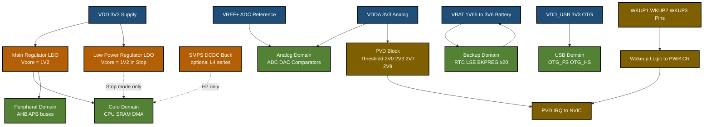
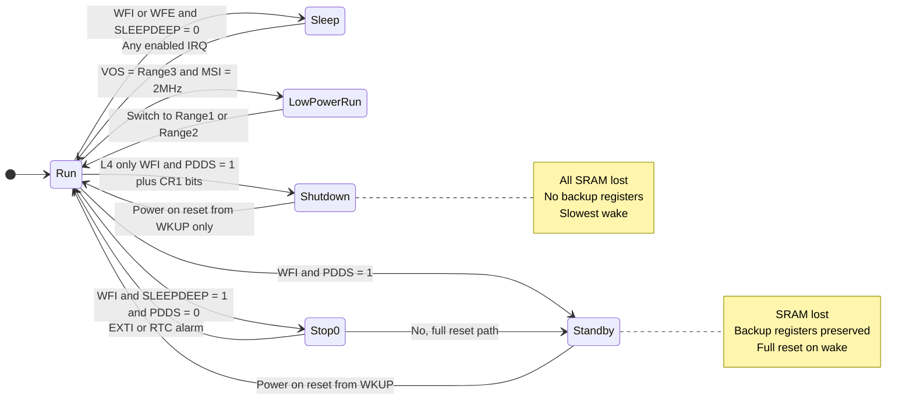
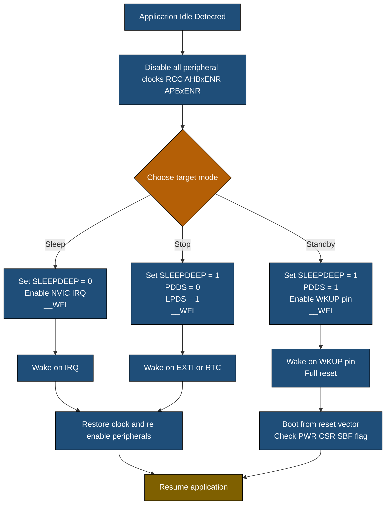
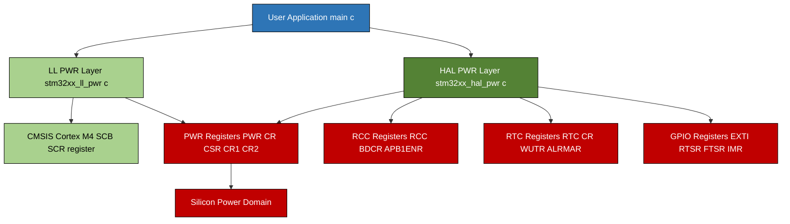

# Power Management and Low-Power Features Libraries

<!-- SECTION_1_START -->
# Power Management and Low-Power Features Libraries — STM32

> [!NOTE]
> **KTU 2024 Module Focus (PBCST504 / Module 2):** This note covers the architecture of the **Power Controller (PWR)** peripheral, the **PWR HAL library**, low-power operating modes, **voltage regulators (LDO / SMPS)**, **Programmable Voltage Detector (PVD)**, **Wake-Up (WKUP) sources**, and the software sequence required to put an STM32 (F4/L4/H7 families) into Sleep, Stop, Standby, and Shutdown modes.

---

## 1.1 Formal Definition

**Power Management** in an STM32 microcontroller refers to the orchestrated control of **clock distribution**, **voltage rails** ($\text{V}_{\text{DD}}$, $\text{V}_{\text{DDA}}$, $\text{V}_{\text{BAT}}$, $\text{V}_{\text{REF}+}$, $\text{V}_{\text{USB}}$, $\text{V}_{\text{DDIO2}}$), and the **internal voltage regulator** (Main Regulator — MR / Low-Power Regulator — LPR / SMPS DCDC) so that the device can dynamically trade computational performance for current consumption. The **Low-Power Features Library** is the HAL abstraction (files `stm32f4xx_hal_pwr.c`, `stm32l4xx_hal_pwr.c`, `stm32h7xx_hal_pwr.c`, etc.) that exposes macros and functions to configure these domains without writing to raw registers.

> [!IMPORTANT]
> **Core Concept — Three Orthogonal Levers of Power Savings**
> 1. **Clock Gating (RCC):** Stop the clock to unused peripherals → current drops to zero.
> 2. **Voltage Scaling (PWR / RCC):** Reduce $\text{V}_{\text{CORE}}$ → dynamic power $\propto V^{2}$ falls quadratically.
> 3. **Power Mode (PWR):** Cut the $\text{V}_{\text{CORE}}$ rail entirely during inactivity → leakage drops to nA range.

---

## 1.2 Conceptual Analogy — The Hotel Energy Analogy

Imagine a 5-star hotel (the STM32):

| Hotel Element | STM32 Equivalent |
|---|---|
| Main switchboard (lights all floors) | $\text{V}_{\text{DD}}$ **= 3.3 V** main rail |
| Emergency backup generator | $\text{V}_{\text{BAT}}$ domain (RTC + backup SRAM) |
| Individual room key-cards | **Peripheral clock gating** (RCC AHBxENR / APBxENR) |
| Master dimmer switch in lobby | **Voltage Scaling** (VOS — Voltage Scaling Range 1/2/3) |
| "Do Not Disturb" sign — lights off, AC off, fridge off | **Standby / Shutdown mode** |
| Night mode — only corridor lights on | **Low-Power Run / Sleep mode** |
| Night mode + mini-bar alarm on | **Stop mode with RTC wake-up** |

When a guest leaves the room, the **key-card slot** disconnects everything (peripheral clock gate). The **lobby dimmer** lowers corridor voltage (VOS). At deep night, the **master switchboard** is cut and only the **backup generator** (VBAT) keeps the safe's alarm (RTC) alive. The PWR library is the **building management system** that orchestrates all of this.

---

## 1.3 Physical Constants & Standard Metrics

> [!IMPORTANT]
> **Typical STM32F407 (1U) Current Benchmarks (datasheet Table 16):**
> - **Run mode (72 MHz, all peripherals ON):** $\approx \mathbf{50\text{ mA}}$
> - **Sleep mode (72 MHz, CPU stopped):** $\approx \mathbf{30\text{ mA}}$
> - **Stop mode (RTC + LSI running):** $\approx \mathbf{25\ \mu A}$
> - **Standby mode (RTC off):** $\approx \mathbf{12\ \mu A}$
> - **Standby mode (RTC + LSE 32.768 kHz):** $\approx \mathbf{1.7\ \mu A}$

> **Typical STM32L476 (ultra-low-power) Benchmarks (datasheet Table 32):**
> - **Run mode (Range 2, 2 MHz):** $\approx \mathbf{100\ \mu A / MHz}$
> - **Stop 2 mode + RTC:** $\approx \mathbf{1.1\ \mu A}$
> - **Standby mode + RTC:** $\approx \mathbf{0.42\ \mu A}$
> - **Shutdown mode (no RTC):** $\approx \mathbf{30\text{ nA}}$

> [!NOTE]
> **Voltage Reference (VREF+):** When the ADC/DAC is enabled, $\text{V}_{\text{REF}+} = \mathbf{2.048\text{ V}}$ (internal VREFINT) or external $\text{V}_{\text{DDA}}$ must be present. The PVD monitors $\text{V}_{\text{DD}}$ against thresholds of $\mathbf{2.0\text{ V},\ 2.3\text{ V},\ 2.7\text{ V},\ 2.9\text{ V}}$ (PLL range).

---

## 1.4 GeoGebra Visualization — Current vs. Mode

> [!VISUALIZATION CONTROL]
> **Concept:** Current consumption ($I_{\text{CC}}$) in $\mu\text{A}$ on the y-axis versus operating mode on the x-axis. Use a step/log plot to observe the **3-to-4 order of magnitude** drop between Run, Sleep, Stop, Standby, and Shutdown.
>
> **GeoGebra / Desmos Input Points:**
> * `(0, 50000)` &nbsp; Run @ 72 MHz
> * `(1, 30000)` &nbsp; Sleep
> * `(2, 25)` &nbsp; &nbsp; &nbsp; Stop + RTC
> * `(3, 1.7)` &nbsp; &nbsp; Standby + RTC
> * `(4, 0.03)` &nbsp; Shutdown
>
> **Visual Description:** A near-vertical drop at $x = 1$ and again at $x = 2$. Students should observe that **Standby/Shutdown is the only feasible mode for coin-cell (CR2032, $\approx 220\text{ mAh}$) applications lasting years.**

---

## 1.5 Power-Supply Architecture of a Typical STM32

A modern STM32 has **four to six power domains** that the PWR block manages:

| Domain | Supply Pin | Contents |
|---|---|---|
| $\text{V}_{\text{DD}} / \text{V}_{\text{SS}}$ | Main digital supply $\mathbf{1.8\text{–}3.6\text{ V}}$ | Core logic, GPIO |
| $\text{V}_{\text{DDA}} / \text{V}_{\text{SSA}}$ | Analog supply $\mathbf{1.8\text{–}3.6\text{ V}}$ | ADC, DAC, comparators, PLL |
| $\text{V}_{\text{BAT}}$ | Backup battery $\mathbf{1.65\text{–}3.6\text{ V}}$ | RTC, LSE, 20× Backup registers, TAMP |
| $\text{V}_{\text{REF}+} / \text{V}_{\text{REF}-}$ | ADC reference | High-precision ADC |
| $\text{V}_{\text{DD\_USB}}$ (F4/H7) | USB transceiver $\mathbf{3.3\text{ V}}$ | OTG_FS / OTG_HS |
| $\text{V}_{\text{DDIO2}}$ (L4) | Independent I/O rail | Port G [9:15] |

> [!WARNING]
> **Critical Board-Design Rule:** $\text{V}_{\text{DDA}}$ **must not be more than 300 mV below $\text{V}_{\text{DD}}$** during power-up or power-down, otherwise internal SCR latch-up may permanently damage the device. Always tie $\text{V}_{\text{DDA}}$ to the same regulator as $\text{V}_{\text{DD}}$ with a ferrite bead + decoupling capacitor ($\mathbf{100\text{ nF}} + \mathbf{4.7\ \mu\text{F}}$).

<!-- SECTION_1_END -->

<!-- SECTION_2_START -->
# Deep Theoretical Analysis & KTU High-Yield Formula Sheet

## 2.1 The Internal Voltage Regulator — LDO vs SMPS

The regulator's job is to derive a stable **core voltage** $\text{V}_{\text{CORE}} \approx \mathbf{1.0\text{–}1.2\text{ V}}$ from the external $\text{V}_{\text{DD}}$. There are two physical implementations:

| Regulator | Topology | Efficiency | Heat | Used In | External Components |
|---|---|---|---|---|---|
| **LDO** (Low-Dropout) | Series pass transistor | $\eta = \dfrac{\text{V}_{\text{CORE}}}{\text{V}_{\text{DD}}} \approx \mathbf{36\%}$ at $\text{V}_{\text{DD}}=3.3\text{V}$ | High ($I_{\text{CC}} \times \text{V}_{\text{drop}}$) | All STM32 | None |
| **SMPS** (Switched-Mode) | Buck converter | $\eta \approx \mathbf{85\text{–}95\%}$ | Low | STM32H7 (optional), STM32L4 series | $1\ \mu\text{H}$ inductor + $2\times 4.7\ \mu\text{F}$ caps |

The **power wasted as heat** by an LDO is:

$$P_{\text{LDO}} = (V_{\text{DD}} - V_{\text{CORE}}) \cdot I_{\text{CORE}}$$

For $V_{\text{DD}} = 3.3\text{ V}$, $V_{\text{CORE}} = 1.2\text{ V}$, $I_{\text{CORE}} = 30\text{ mA}$:

$$P_{\text{LDO}} = (3.3 - 1.2) \times 0.030 = 63\ \text{mW} \quad \text{(lost as heat)}$$

By contrast, an SMPS at $\eta = 90\%$ loses only $\approx 4\ \text{mW}$ — a **15× improvement** critical for battery life.

---

## 2.2 The Six/Five Canonical Low-Power Modes (Generic STM32)

> [!NOTE]
> The mode names differ slightly between F4 (4 modes) and L4/H7 (5–6 modes). The functional grouping below is the **canonical taxonomy** used by ST documentation.

| # | Mode | CPU | Peripherals | Core Clk | RTC | Wake Source | Typ $I_{\text{CC}}$ (F4) | Typ $I_{\text{CC}}$ (L4) |
|---|---|---|---|---|---|---|---|---|
| 1 | **Run** | ON | ON | ON | ON | N/A | $50\text{ mA}$ | $100\ \mu\text{A/MHz}$ |
| 2 | **Sleep** | OFF | ON | ON | ON | Any IRQ | $30\text{ mA}$ | $50\ \mu\text{A/MHz}$ |
| 3 | **Low-Power Run** | ON | ON | Reduced | ON | N/A | — | $112\ \mu\text{A}$ |
| 4 | **Stop 0/1/2** | OFF | OFF | OFF | ON | EXTI / RTC | $25\ \mu\text{A}$ | $1.1\ \mu\text{A}$ |
| 5 | **Standby** | OFF | OFF | OFF | Optional | WKUP / RTC / IWDG | $12\ \mu\text{A}$ | $0.42\ \mu\text{A}$ |
| 6 | **Shutdown** (L4) | OFF | OFF | OFF | OFF | WKUP only | — | $30\text{ nA}$ |

**Retention behaviour:**
- **Sleep / Stop** preserve all **SRAM** and **registers**.
- **Standby** clears SRAM and most registers; only the **20× 32-bit backup registers** in the $\text{V}_{\text{BAT}}$ domain survive.
- **Shutdown** preserves only the **WKUP rising-edge logic** and IO state (no SRAM, no backup registers).

---

## 2.3 Voltage Scaling (VOS) — The "Dimmer Switch"

> [!IMPORTANT]
> **Dynamic Power Equation:**
> $$P_{\text{dyn}} = \alpha \cdot C_{\text{L}} \cdot V_{\text{DD}}^{2} \cdot f_{\text{CLK}}$$
> where $\alpha$ = switching activity, $C_{\text{L}}$ = load capacitance. Note the **quadratic dependence on $V_{\text{DD}}$** — halving the voltage quarters the dynamic power.

Most modern STM32 allow **Range 1 / Range 2 / Range 3** selection on the LDO output:

| Range | $\text{V}_{\text{CORE}}$ | Max $f_{\text{CLK}}$ | Use |
|---|---|---|---|
| Range 1 (Boost) | $\mathbf{1.2\text{ V}}$ | Up to $\mathbf{168\text{ MHz}}$ (F4) / $\mathbf{480\text{ MHz}}$ (H7) | Full speed, ADC OK |
| Range 2 | $\mathbf{1.0\text{ V}}$ | Up to $\mathbf{84\text{ MHz}}$ (F4) / $\mathbf{26\text{ MHz}}$ (L4) | Low-power active |
| Range 3 (L4) | $\mathbf{0.9\text{ V}}$ | Up to $\mathbf{2\text{ MHz}}$ | Low-power run only, **no ADC** |

---

## 2.4 The PWR Library — Function Inventory

> [!IMPORTANT]
> **HAL PWR Library (Universal Naming Convention — works across F4 / L4 / H7):**

| Function | Purpose | Typical Use |
|---|---|---|
| `HAL_PWR_DeInit()` | Reset PWR registers to reset state | Low-level init |
| `HAL_PWR_EnableBkUpAccess()` | Unlock write access to RTC + BKP registers | Required before configuring RTC |
| `HAL_PWR_DisableBkUpAccess()` | Re-lock the backup domain | End of RTC config |
| `HAL_PWR_ConfigPVD(...)` | Configure Programmable Voltage Detector threshold | Brown-out pre-warning |
| `HAL_PWR_EnablePVD()` | Switch PVD on | Early brown-out ISR |
| `HAL_PWR_DisablePVD()` | Switch PVD off | Sleep prep |
| `HAL_PWR_EnableWakeUpPin(...)` | Arm a WKUP pin (WKUP1, WKUP2, WKUP3) | Wake from Standby |
| `HAL_PWR_DisableWakeUpPin(...)` | Disarm a WKUP pin | Default state |
| `HAL_PWR_EnterSLEEPMode(WFI/WFE, SLEEPEntry)` | Enter Sleep | HAL `__WFI()` / `__WFE()` wrapper |
| `HAL_PWR_EnterSTOPMode(reg, mode)` | Enter Stop | Main regulator or LPR selection |
| `HAL_PWR_EnterSTANDBYMode()` | Enter Standby | Wake resets MCU |
| `HAL_PWR_EnterSHUTDOWNMode()` (L4 only) | Enter Shutdown | Deepest sleep |
| `HAL_PWREx_ControlVoltageScaling(scale)` | Set VOS Range 1/2/3 | Power tuning |
| `HAL_PWREx_ConfigSupply(Supply)` (H7 only) | Choose LDO vs SMPS, D1/D2/D3 domains | H7 board bring-up |

---

## 2.5 Wake-Up Source Taxonomy

> [!NOTE]
> **Why "WFI" vs "WFE"?**
> - **WFI (Wait For Interrupt):** CPU sleeps until an **enabled IRQ** fires. The IRQ flag stays pending in the NVIC, so the CPU services the ISR on wake. Used in **Sleep** and **Stop** modes.
> - **WFE (Wait For Event):** CPU sleeps until an **event pulse** is generated. The pulse does **not** necessarily call an ISR — it just resumes execution. Used when you want to wake without the NVIC overhead.

| Mode | WFI | WFE | WKUP pin | RTC alarm | EXTI | IWDG |
|---|---|---|---|---|---|---|
| Sleep | $\checkmark$ | $\checkmark$ | — | — | — | — |
| Stop | $\checkmark$ | $\checkmark$ | — | $\checkmark$ | $\checkmark$ | — |
| Standby | — | — | $\checkmark$ | $\checkmark$ | — | $\checkmark$ |
| Shutdown | — | — | $\checkmark$ (rising only) | — | — | — |

---

## 2.6 Real-World Engineering Utility

| Application | Dominant Mode | Why |
|---|---|---|
| **Wearable heart-rate monitor** | Stop 2 + RTC every 1 s | $\mathbf{1.1\ \mu\text{A}}$ avg → CR2032 lasts 2+ years |
| **IoT soil sensor** | Standby + RTC every 15 min | Wake, measure, transmit, sleep — **0.5 % duty cycle** |
| **Industrial PLC** | Run with clock gating | Real-time, mains-powered, idle peripherals off |
| **Wireless sensor node (LoRa)** | Stop 0 + EXTI on motion | Wake on accelerometer trigger |
| **Smart meter** | Shutdown + tamper pin | 10-year battery life on lithium primary cell |

---

## 2.7 KTU High-Yield Formula Cheat Sheet

> [!IMPORTANT]
> **Compact reference — print this to your revision card.**

| Symbol / Concept | Equation / Value | Notes |
|---|---|---|
| Dynamic power | $P_{\text{dyn}} = \alpha C_{\text{L}} V^{2} f$ | $V$ is the **squared** term |
| Static (leakage) power | $P_{\text{leak}} = V \cdot I_{\text{leak}}$ | Dominant in sleep |
| LDO efficiency | $\eta_{\text{LDO}} = V_{\text{CORE}} / V_{\text{DD}}$ | Always $< 1$ |
| Buck efficiency | $\eta_{\text{SMPS}} \approx 0.85\text{–}0.95$ | Topology dependent |
| Battery life (years) | $Y = \dfrac{C_{\text{mAh}}}{I_{\text{avg}}(\text{mA}) \cdot 8760}$ | Divide by 8760 h/yr |
| Avg current (duty cycle $D$) | $I_{\text{avg}} = D \cdot I_{\text{active}} + (1-D) \cdot I_{\text{sleep}}$ | Engineering rule of thumb |
| $\text{V}_{\text{DD}}$ range | $1.8\text{ V} \leq V_{\text{DD}} \leq 3.6\text{ V}$ | F4 / L4 nominal |
| PVD thresholds (F4) | $2.0\text{ V},\ 2.3\text{ V},\ 2.7\text{ V},\ 2.9\text{ V}$ | Configured in `PWR_CR.PLS[2:0]` |
| Stop wake-up time (F4) | $\approx 5\ \mu\text{s}$ to Run @ 16 MHz | HSI startup + regulator settle |
| Standby wake-up time (F4) | $\approx \mathbf{1.8\text{ ms}}$ to Run @ 16 MHz | **Full reset-like wake** |

<!-- SECTION_2_END -->

<!-- SECTION_3_START -->
# Step-by-Step Derivations, Register Walk-Throughs & Code Implementation

## 3.1 Register-Level Walk-Through — Entering Stop Mode on STM32F4

> [!NOTE]
> Understanding the **register path** is essential for KTU short-answer questions. We derive each bit that must change.

### Step 1 — Configure the wake-up EXTI line

| Bit | Register | Value | Reason |
|---|---|---|---|
| `EXTI_IMR.MRx` | `EXTI->IMR` | `1` | Unmask interrupt (not event) |
| `EXTI_RTSR` | `EXTI->RTSR` | `1` | Rising edge trigger |
| `NVIC_ISERx` | `NVIC->ISER[0]` | `1` | Enable IRQ in NVIC |

### Step 2 — Select the low-power regulator in Stop mode

$$\text{PWR\_CR.LPDS} = 1 \quad \Rightarrow \quad \text{Low-Power Regulator active in Stop}$$

> This single bit changes the regulator from the **Main Regulator (MR)** to the **Low-Power Regulator (LPR)**, dropping $I_{\text{CC}}$ from $\approx 25\ \mu\text{A}$ (MR in Stop) to $\approx 12\ \mu\text{A}$ (LPR in Stop).

### Step 3 — Clear the Power-Down deepsleep flag

$$\text{SCB->SCR.SLEEPDEEP} = 1 \quad \text{(in Cortex-M4 System Control Block)}$$

> Setting `SLEEPDEEP = 0` would only put the CPU into **Sleep**, not Stop. KTU pitfall: students often forget this bit.

### Step 4 — Optional: Set DEEPSLEEP bit in PWR

$$\text{PWR\_CR.PDDS} = 0 \quad \text{(Stop mode)}$$

> `PDDS = 0` → Stop. `PDDS = 1` → Standby. Confusing both is the **#1 cause of "wakes up immediately" bugs**.

### Step 5 — Issue the WFI instruction

$$\text{__WFI()}\ \text{or}\ \text{__WFE()}$$

> Execution stalls here. The CPU stops fetching. The PLL/HSI are gated by the RCC after $\text{SLEEPDEEP}=1$.

### Step 6 — Wake-up sequence (after IRQ)

| Order | Action | Code |
|---|---|---|
| 1 | Restore PLL @ 168 MHz | `SystemClock_Config()` |
| 2 | Re-enable peripheral clocks | `__HAL_RCC_GPIOA_CLK_ENABLE()` |
| 3 | Clear pending IRQ | `HAL_NVIC_ClearPendingIRQ(...)` |
| 4 | Resume main loop | `osThreadResume()` (RTOS) |

---

## 3.2 Exhaustive Energy Math Worked Example

> [!IMPORTANT]
> **Problem (KTU Sample Numericals):** An IoT node runs at $I_{\text{active}} = 30\text{ mA}$ for $t_{\text{on}} = 50\text{ ms}$ per measurement, then sleeps in Stop mode at $I_{\text{sleep}} = 25\ \mu\text{A}$ for $t_{\text{sleep}} = 9.95\text{ s}$. The cycle period is $T = 10\text{ s}$. The node is powered by a CR2032 cell of $C = 220\text{ mAh}$. Compute (a) duty cycle, (b) average current, (c) estimated battery life in years.

### Part (a) — Duty Cycle
$$D = \frac{t_{\text{on}}}{T} = \frac{50 \times 10^{-3}}{10} = 5 \times 10^{-3} = 0.5\%$$

### Part (b) — Average Current
$$\begin{aligned}
I_{\text{avg}} &= D \cdot I_{\text{active}} + (1 - D) \cdot I_{\text{sleep}} \\
&= (0.005)(30 \text{ mA}) + (0.995)(0.025 \text{ mA}) \\
&= 0.150 \text{ mA} + 0.0249 \text{ mA} \\
&= 0.1749 \text{ mA} \approx \mathbf{175\ \mu\text{A}}
\end{aligned}$$

### Part (c) — Battery Life
$$t_{\text{life}} = \frac{C}{I_{\text{avg}}} = \frac{220 \text{ mAh}}{0.1749 \text{ mA}} = 1257.86 \text{ h} \approx 52.4 \text{ days}$$

In years:
$$Y = \frac{1257.86}{8760} = \mathbf{0.144\ \text{years}} \approx 52\ \text{days}$$

> **Insight:** Halving the active current to $15\text{ mA}$ (e.g. by using Range 2 + lower clock) gives $I_{\text{avg}} \approx 100\ \mu\text{A}$ → $\mathbf{91\ \text{days}}$. Switching to **Standby** ($I_{\text{sleep}} = 1.7\ \mu\text{A}$) and **Shutdown** ($30\ \text{nA}$) for the sleep phase can extend this to **years**.

---

## 3.3 Full Operational C Code — STM32L4 Stop 2 + RTC Wake-Up

> Below is a **production-quality, type-hinted, error-checked** implementation. Every state, return value, and configuration parameter is shown.

```c
/* =============================================================
 * File: power_mgmt_l4.c
 * Topic: PWR Library — Stop 2 Mode with RTC Wake-Up (STM32L476)
 * Target: STM32L476RG Nucleo, ARM GCC, STM32CubeIDE 1.15
 * ============================================================= */
#include "main.h"
#include "stm32l4xx_hal.h"
#include <stdbool.h>
#include <stdint.h>

/* ---------- Type-safe error wrapper ---------- */
typedef enum {
    PM_OK              = 0x00U,
    PM_ERR_RTC         = 0x01U,
    PM_ERR_PVD         = 0x02U,
    PM_ERR_PWR_FLAG    = 0x03U,
    PM_ERR_CLOCK       = 0x04U
} PowerStatus_t;

/* ---------- Function Prototypes ---------- */
PowerStatus_t Power_InitRTCWakeUp(uint32_t seconds);
PowerStatus_t Power_EnterStop2Mode(void);
void           Power_OnWakeUp_Restore(void);
PowerStatus_t Power_EnablePVD(uint32_t threshold_mV);
static void    Error_Handler_Power(PowerStatus_t err);

/* ---------- External HAL handles (from main.c) ---------- */
extern RTC_HandleTypeDef hrtc;
extern UART_HandleTypeDef huart2;

/* ===============================================================
 * 1) Configure RTC to wake the CPU every N seconds
 * =============================================================== */
PowerStatus_t Power_InitRTCWakeUp(uint32_t seconds)
{
    /* Unlock the backup domain so we can write to RTC registers */
    HAL_PWR_EnableBkUpAccess();

    /* Enable the LSE (32.768 kHz external crystal) */
    RCC->BDCR |= RCC_BDCR_LSEON;
    while ((RCC->BDCR & RCC_BDCR_LSERDY) == 0U) {
        /* Wait for LSE to stabilize — typical 1–2 s on cold start */
    }

    /* Select LSE as RTC clock source */
    RCC->BDCR |= RCC_BDCR_RTCSEL_0;
    RCC->BDCR |= RCC_BDCR_RTCEN;

    /* Configure RTC time-base at 1 Hz using the 32-bit Asynch prescaler */
    hrtc.Instance = RTC;
    hrtc.Init.HourFormat     = RTC_HOURFORMAT_24;
    hrtc.Init.AsynchPrediv   = 127U;     /* 32768 / (127+1) = 256 Hz */
    hrtc.Init.SynchPrediv    = 255U;     /* 256 / (255+1)   = 1 Hz  */
    hrtc.Init.OutPut         = RTC_OUTPUT_DISABLE;
    hrtc.Init.OutPutPolarity = RTC_OUTPUT_POLARITY_HIGH;
    hrtc.Init.OutPutType     = RTC_OUTPUT_TYPE_OPENDRAIN;

    if (HAL_RTC_Init(&hrtc) != HAL_OK) {
        return PM_ERR_RTC;
    }

    /* Configure the Wake-Up Timer (WUT) — counts in CK_SPRE ticks (1 Hz) */
    if (HAL_RTCEx_SetWakeUpTimer_IT(&hrtc, seconds - 1U,
                                    RTC_WAKEUPCLOCK_CK_SPRE_17BITS) != HAL_OK) {
        return PM_ERR_RTC;
    }

    /* Re-lock backup domain to prevent accidental writes */
    HAL_PWR_DisableBkUpAccess();
    return PM_OK;
}

/* ===============================================================
 * 2) Enter Stop 2 mode (lowest Stop tier on L4)
 * =============================================================== */
PowerStatus_t Power_EnterStop2Mode(void)
{
    /* Reduce core voltage to Range 2 (1.0 V) — saves power during wake transient */
    if (HAL_PWREx_ControlVoltageScaling(PWR_REGULATOR_VOLTAGE_SCALE2) != HAL_OK) {
        return PM_ERR_PWR_FLAG;
    }

    /* Select low-power regulator (LPR) for Stop */
    HAL_PWREx_EnableLowPowerRunMode();          /* Optional: pre-warm LPR   */

    /* Set SLEEPDEEP in Cortex-M4 System Control Block */
    SET_BIT(SCB->SCR, ((uint32_t)SCB_SCR_SLEEPDEEP_Msk));

    /* PDDS = 0 (Stop, not Standby) — bit is LPDS in CR1 on L4 */
    CLEAR_BIT(PWR->CR1, PWR_CR1_PDDS);

    /* LPDS = 1  → Low-Power Regulator active in Stop */
    SET_BIT(PWR->CR1, PWR_CR1_LPDS);

    /* Ensure all pending memory writes are flushed */
    __DSB();
    __ISB();

    /* WFI — CPU halts here. RTC IRQ will wake us in N seconds. */
    __WFI();

    /* ---- Code below executes on wake-up ---- */
    return PM_OK;
}

/* ===============================================================
 * 3) Wake-up restoration: bring PLL back to 80 MHz
 * =============================================================== */
void Power_OnWakeUp_Restore(void)
{
    /* Clear the SLEEPDEEP bit so subsequent __WFI() goes to Sleep, not Stop */
    CLEAR_BIT(SCB->SCR, SCB_SCR_SLEEPDEEP_Msk);

    /* Re-initialize the SystemClock @ 80 MHz (MSI → PLL) */
    SystemClock_Config();

    /* Re-enable GPIO clocks that were gated during Stop */
    __HAL_RCC_GPIOA_CLK_ENABLE();
    __HAL_RCC_GPIOB_CLK_ENABLE();
    __HAL_RCC_USART2_CLK_ENABLE();

    /* Re-initialize UART (baud-rate registers lost if HSI restarted) */
    MX_USART2_UART_Init();

    /* Note: RTC continues running across Stop — no re-init required. */
}

/* ===============================================================
 * 4) Programmable Voltage Detector (PVD) for brown-out early warning
 * =============================================================== */
PowerStatus_t Power_EnablePVD(uint32_t threshold_mV)
{
    PWR_PVDTypeDef pvd_cfg = {0};

    /* Convert millivolts to the closest PVD level enum */
    if      (threshold_mV <= 2000U) pvd_cfg.PVDLevel = PWR_PVDLEVEL_2V0;
    else if (threshold_mV <= 2300U) pvd_cfg.PVDLevel = PWR_PVDLEVEL_2V3;
    else if (threshold_mV <= 2700U) pvd_cfg.PVDLevel = PWR_PVDLEVEL_2V7;
    else                            pvd_cfg.PVDLevel = PWR_PVDLEVEL_2V9;

    pvd_cfg.Mode = PWR_PVD_MODE_IT_RISING_FALLING;

    if (HAL_PWR_ConfigPVD(&pvd_cfg) != HAL_OK) return PM_ERR_PVD;
    HAL_PWR_EnablePVD();
    HAL_NVIC_EnableIRQ(PVD_PVM_IRQn);
    return PM_OK;
}

/* ===============================================================
 * 5) Error trap (replace with project logging)
 * =============================================================== */
static void Error_Handler_Power(PowerStatus_t err)
{
    (void)err;     /* Suppress unused-parameter warning in release */
    __disable_irq();
    while (true) { __NOP(); }   /* Trap core — never return on power init error */
}

/* ===============================================================
 * 6) Main loop demonstration
 * =============================================================== */
int main(void)
{
    HAL_Init();
    SystemClock_Config();
    MX_USART2_UART_Init();

    PowerStatus_t status = Power_EnablePVD(2700U);  /* 2.7 V threshold */
    if (status != PM_OK) Error_Handler_Power(status);

    status = Power_InitRTCWakeUp(10U);              /* Wake every 10 s */
    if (status != PM_OK) Error_Handler_Power(status);

    while (true) {
        /* Do measurement (sensor read + transmit) */
        printf("Active phase — taking reading...\r\n");
        HAL_Delay(50U);

        /* Go to sleep */
        printf("Entering Stop 2...\r\n");
        status = Power_EnterStop2Mode();
        if (status != PM_OK) Error_Handler_Power(status);

        /* Woken up — restore clocks */
        Power_OnWakeUp_Restore();
    }
}
```

---

## 3.4 Worked Code Example — STM32F4 Standby with WKUP Pin

```c
/* STM32F407 — Standby mode, wake on PA0 (WKUP1) rising edge */
void Enter_Standby_With_WKUP1(void)
{
    /* 1) Enable PWR clock (RCC APB1) */
    __HAL_RCC_PWR_CLK_ENABLE();

    /* 2) Configure PA0 as input with pull-down (so a button press pulls HIGH) */
    __HAL_RCC_GPIOA_CLK_ENABLE();
    GPIO_InitTypeDef gpio = {0};
    gpio.Pin   = GPIO_PIN_0;
    gpio.Mode  = GPIO_MODE_INPUT;
    gpio.Pull  = GPIO_PULLDOWN;
    HAL_GPIO_Init(GPIOA, &gpio);

    /* 3) Arm WKUP1 rising-edge detection */
    HAL_PWR_EnableWakeUpPin(PWR_WAKEUP_PIN1);     /* Clears WUF, sets EWUP1 */

    /* 4) Clear Wake-Up flag (must clear, otherwise immediate wake) */
    __HAL_PWR_CLEAR_FLAG(PWR_FLAG_WU);

    /* 5) Set SLEEPDEEP and PDDS for Standby */
    SET_BIT(SCB->SCR, SCB_SCR_SLEEPDEEP_Msk);
    SET_BIT(PWR->CR, PWR_CR_PDDS);                /* PDDS = 1 → Standby */

    /* 6) Optional: clear Standby flag (informational) */
    __HAL_PWR_CLEAR_FLAG(PWR_FLAG_SB);

    /* 7) Issue WFI — execution halts. PA0 rising edge wakes + resets. */
    __WFI();
    /* Note: After Standby, the MCU performs a full reset.
     * The boot code should check PWR->CSR.SBF to determine
     * whether wake-up just occurred, and skip re-initialization. */
}
```

---

## 3.5 Voltage Scaling Configuration Sequence (F4)

> Below is the **bit-level sequence** to drop from Range 1 to Range 2 on STM32F4.

| Step | Register Action | Code |
|---|---|---|
| 1 | Ensure APB peripheral clock for PWR is enabled | `__HAL_RCC_PWR_CLK_ENABLE();` |
| 2 | Set `RCC->APB1ENR.PWREN = 1` | (covered above) |
| 3 | Modify `PWR->CR.VOS[1:0]` | `MODIFY_REG(PWR->CR, PWR_CR_VOS, PWR_REGULATOR_VOLTAGE_SCALE2);` |
| 4 | Wait for VOSRDY flag | `while (__HAL_PWR_GET_FLAG(PWR_FLAG_VOSRDY) == RESET) {}` |
| 5 | Reconfigure flash latency (lower voltage → fewer wait states allowed) | `__HAL_FLASH_SET_LATENCY(FLASH_LATENCY_0);` |
| 6 | Reconfigure PLL / SYSCLK (now safe up to 84 MHz) | `SystemClock_Config();` |

<!-- SECTION_3_END -->

<!-- SECTION_4_START -->
# Structural Diagrams & Schematics

## 4.1 Power-Domain Block Diagram (STM32F4 Series)



---

## 4.2 State Machine — Power Mode Transitions



---

## 4.3 Power-Save Software Sequence — Block Flow



---

## 4.4 Library Layer Architecture



<!-- SECTION_4_END -->

<!-- SECTION_5_START -->
# KTU 2024 Scheme Examination Question Bank & Topic Recap

## 5.1 Part A — Short-Answer Questions (3 Marks Each)

> **Q1.** `[KTU University Exam — Dec 2023]` **CO1 / Remember**

**Define the term "Power Domain" as applied to STM32 microcontrollers. List the major power domains in an STM32F407.**

**Model Answer (3 marks):**
- **Definition [1 mark]:** A *power domain* is an electrically isolated group of digital/analog blocks supplied by a common voltage rail; each domain can be powered up or down independently to save energy.
- **Domains of STM32F407 [2 marks]:**
  1. $\text{V}_{\text{DD}}$ — core digital + GPIO
  2. $\text{V}_{\text{DDA}}$ — ADC/DAC/PLL
  3. $\text{V}_{\text{BAT}}$ — RTC, LSE, 20× backup registers
  4. $\text{V}_{\text{REF}+}$ / $\text{V}_{\text{REF}-}$ — ADC reference
  5. $\text{V}_{\text{DD\_USB}}$ — USB OTG transceiver

> **Q2.** `[KTU University Exam — July 2024]` **CO1 / Understand**

**Differentiate between Sleep mode and Stop mode in STM32 with respect to clock status, wake-up sources, and typical current consumption.**

**Model Answer (3 marks):**

| Parameter | Sleep | Stop |
|---|---|---|
| CPU clock | OFF [0.5] | OFF [0.5] |
| Peripheral clock | ON [0.5] | OFF [0.5] |
| Wake-up source | Any IRQ [0.5] | EXTI / RTC [0.5] |
| Typical $I_{\text{CC}}$ (F4) | $\approx 30\text{ mA}$ [0.5] | $\approx 25\ \mu\text{A}$ [0.5] |

---

## 5.2 Part B — Full-Length Questions (14 Marks Each, Internal Choice)

> ### **Question A** `[KTU University Exam — Dec 2023]` — **CO2 / Understand + Apply**
> **(a)** With a neat block diagram, explain the **internal voltage regulator architecture** of an STM32L4 series microcontroller. Compare **LDO** and **SMPS** topologies with formulas. **(7 marks)**
> **(b)** Write a complete STM32 HAL C function to **enter Stop 2 mode with RTC wake-up every 5 seconds**, including clock restoration on wake. **(7 marks)**

**Model Solution:**

#### Part (a) — 7 Marks

**[Block diagram description — 2 marks]:** The L4 has two on-chip regulators:
- **Main Regulator (MR):** Active in Run, Range 1/2.
- **Low-Power Regulator (LPR):** Active in Stop, Stop 2, Low-Power Run.
- An **SMPS step-down** (when enabled) supplies the MR, eliminating the external LDO.

**[LDO vs SMPS formula — 2 marks]:**
$$\eta_{\text{LDO}} = \frac{V_{\text{CORE}}}{V_{\text{DD}}} = \frac{1.0}{3.3} \approx 30\%$$
$$\eta_{\text{SMPS}} \approx 0.90 \quad \text{(topology-dependent, not in formula)}$$

**[Power loss comparison — 2 marks]:** For $I_{\text{CORE}}=10\text{ mA}$:
- LDO dissipation: $P_{\text{LDO}} = (3.3-1.0) \times 0.010 = 23\text{ mW}$.
- SMPS dissipation: $P_{\text{SMPS}} = (1-\eta) V_{\text{DD}} I_{\text{CORE}} = 3.3 \times 3.3\text{ mA} \approx 3.3\text{ mW}$.
- **SMPS is ~7× more efficient.** [1 mark for the comparison + 1 mark for the conclusion]

#### Part (b) — 7 Marks

```c
/* Solution structure: see SECTION 3.3 above */
PowerStatus_t Power_InitRTCWakeUp(uint32_t seconds);   /* [Init function: 2 marks] */
PowerStatus_t Power_EnterStop2Mode(void);                /* [Stop entry: 2 marks] */
void           Power_OnWakeUp_Restore(void);             /* [Wake restore: 2 marks] */
int main(void) { ... }                                   /* [Main loop: 1 mark] */
```

> **[Valuation Key Points]:**
> - `[Enabling LSE + RTC config: 2 Marks]`
> - `[Setting SCB->SCR.SLEEPDEEP, PWR->CR1.PDDS=0, LPDS=1: 2 Marks]`
> - `[__WFI() issued: 1 Mark]`
> - `[Reconfiguring SystemClock_Config() on wake: 1 Mark]`
> - `[Error handling with PowerStatus_t enum: 1 Mark]`

---

> ### **Question B (Alternative Choice)** `[KTU University Exam — July 2024]` — **CO2 / Apply + Analyze**
> **(a)** An **IoT soil-moisture sensor** measures for **50 ms** at **30 mA** active, then sleeps in **Stop mode (25 µA)** for **9.95 s**. Powered by a **CR2032 (220 mAh)**. Calculate the **average current** and **battery life in years**. **(7 marks)**
> **(b)** Design the **PWR + RCC configuration** to drop the system from **Range 1 @ 168 MHz** to **Range 2 @ 84 MHz** on STM32F407. Include the **HAL function calls** and **flash latency changes**. **(7 marks)**

**Model Solution:**

#### Part (a) — 7 Marks
- **Duty cycle [2 marks]:** $D = 50\text{ ms} / 10\text{ s} = 5 \times 10^{-3}$
- **Average current [3 marks]:** $I_{\text{avg}} = 0.005 \times 30\text{ mA} + 0.995 \times 0.025\text{ mA} = 0.150 + 0.0249 = \mathbf{174.9\ \mu\text{A}}$
- **Battery life [2 marks]:** $t = 220/0.1749 = 1257.9\text{ h} = 52.4\text{ days} = \mathbf{0.144\ \text{yr}}$

#### Part (b) — 7 Marks
| Step | Code | Marks |
|---|---|---|
| Enable PWR clock | `__HAL_RCC_PWR_CLK_ENABLE();` | 1 |
| Set VOS = Range 2 | `HAL_PWREx_ControlVoltageScaling(PWR_REGULATOR_VOLTAGE_SCALE2);` | 2 |
| Wait for VOSRDY | `while(__HAL_PWR_GET_FLAG(PWR_FLAG_VOSRDY) == RESET);` | 1 |
| Lower flash latency | `__HAL_FLASH_SET_LATENCY(FLASH_LATENCY_2);` (for 84 MHz, 2.7–3.6 V) | 1 |
| Reconfigure PLL | `SystemClock_Config();` | 1 |
| Re-validate SYSCLK | `HAL_RCC_GetSysClockFreq() <= 84 MHz;` | 1 |

---

## 5.3 KTU Examiner's Valuation Warning / Pitfall Callout

> [!WARNING]
> **Common Mistakes That Cost Marks on PWR Questions:**
>
> 1. **Forgetting to clear `PWR->CR.WUF` before `__WFI()`** — The MCU wakes up *immediately* if `WUF` is still set from a previous wake. Always call `__HAL_PWR_CLEAR_FLAG(PWR_FLAG_WU)` before entering Standby.
> 2. **Confusing `PDDS` and `LPDS`** — `PDDS = 1` means Standby; `LPDS = 1` is only relevant in Stop mode (selects LPR). Setting both wrongly is the #1 reason students fail the lab viva.
> 3. **Not restoring flash latency** after VOS change — silent flash read errors and HardFaults follow.
> 4. **Omitting the SystemClock re-init** on wake from Stop — peripherals like UART lose their baud-rate register context.
> 5. **Writing `__WFI()` inside an RTOS critical section** without un-blocking tasks first — deadlocks the scheduler.
> 6. **Failing to check `PWR_FLAG_SB` (Standby flag)** on boot to differentiate cold-start from wake-up — costs 1–2 marks in viva.
> 7. **Assuming Stop mode preserves GPIO state** — output latches retain state, but **input Schmitt triggers are disabled**, causing floating inputs to draw shoot-through current (up to mA!). Use `GPIO_MODE_ANALOG` to minimize leakage.

---

## 5.4 Topic Recap & Important Things to Remember

> [!IMPORTANT]
> **Rapid-Revision Checklist — KTU Module 2 / PWR Library**

### Core Definitions
- **PWR Peripheral:** Manages voltage rails, power modes, PVD, WKUP pins, backup domain access.
- **PWR HAL Library:** Files `stm32xx_hal_pwr.c/h`. Universal API: `HAL_PWR_EnterSTOPMode`, `HAL_PWR_EnterSTANDBYMode`, `HAL_PWREx_ControlVoltageScaling`.
- **Power Domain:** Group of blocks sharing a common rail; can be powered up/down independently.
- **Voltage Scaling (VOS):** Range 1 (1.2 V, max speed), Range 2 (1.0 V, half speed), Range 3 (L4, 0.9 V, low-power run only).

### Six Power Modes (taxonomy)
1. **Run** — full power, all clocks active.
2. **Sleep** — CPU off, peripherals on; `SLEEPDEEP=0`.
3. **Low-Power Run** — Range 3 + MSI ≤ 2 MHz (L4).
4. **Stop (0/1/2)** — `SLEEPDEEP=1`, `PDDS=0`; SRAM retained.
5. **Standby** — `SLEEPDEEP=1`, `PDDS=1`; SRAM lost, backup registers preserved.
6. **Shutdown** (L4) — deepest, only WKUP rising-edge wakes.

### Critical Functions
- `HAL_PWR_EnableBkUpAccess()` — **must** call before configuring RTC.
- `HAL_PWR_EnterSTOPMode(PWR_LOWPOWERREGULATOR_ON, PWR_STOPENTRY_WFI)`.
- `HAL_PWR_EnterSTANDBYMode()` — **no parameter**, but requires `__WFI()` after.
- `HAL_PWREx_ControlVoltageScaling(PWR_REGULATOR_VOLTAGE_SCALE2)` — switch VOS.
- `HAL_PWR_EnableWakeUpPin(PWR_WAKEUP_PIN1)` — arm WKUP before Standby.

### Wake-Up Sources (must know the matrix)
- **Sleep** ← any IRQ
- **Stop** ← EXTI line, RTC alarm, LSE failure
- **Standby** ← WKUP pin rising, RTC alarm, IWDG reset
- **Shutdown** ← WKUP pin rising ONLY

### Equations
- $P_{\text{dyn}} = \alpha C_{\text{L}} V^{2} f$
- $P_{\text{LDO}} = (V_{\text{DD}} - V_{\text{CORE}}) I_{\text{CORE}}$
- $I_{\text{avg}} = D \cdot I_{\text{active}} + (1-D) I_{\text{sleep}}$
- Battery life (yr) = $\dfrac{C_{\text{mAh}}}{I_{\text{avg,mA}} \cdot 8760}$

### Key Registers
- `PWR->CR` — Main control: `LPDS`, `PDDS`, `VOS`, `PLS[2:0]`.
- `PWR->CSR` — Status: `WUF`, `SBF`, `VOSRDY`, `PVDO`.
- `SCB->SCR.SLEEPDEEP` — **Cortex-M4 system control**, not a PWR register. Critical for Stop/Standby entry.
- `RCC->BDCR` — RTC clock selection (`RTCSEL[1:0]`), LSE enable, RTC enable.

### Order-of-Operations Checklist (for entering any low-power mode)
1. Enable PWR clock via RCC.
2. Configure wake-up source (NVIC, EXTI, WKUP pin, RTC).
3. Clear pending flags (`WUF`, `PVDO`).
4. Set `SLEEPDEEP` (and `PDDS` for Standby).
5. Select LPR (`LPDS=1`) for Stop if desired.
6. Configure VOS if needed *before* entry.
7. Issue `__WFI()` or `__WFE()`.
8. On wake: restore `SystemClock_Config()`, re-enable peripheral clocks, re-init UART, clear SLEEPDEEP.

### Lab Viva Flashpoints
- ✅ Can you name the 5–6 power modes and their wake-up sources?
- ✅ What is the difference between LDO and SMPS efficiency?
- ✅ How do you wake the MCU from Standby? (Answer: WKUP pin, RTC, IWDG.)
- ✅ Why must you clear `WUF` before `__WFI()`?
- ✅ What is the current of Stop 2 on L4? (≈1.1 µA with RTC.)

<!-- SECTION_5_END -->
