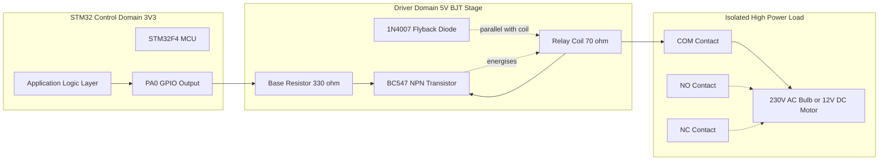
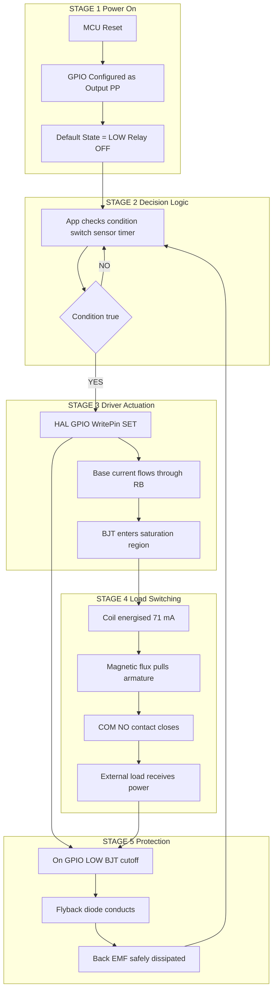
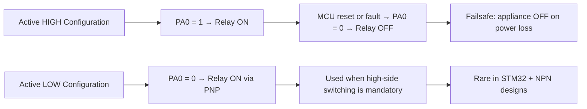

# Relay Interfacing

<!-- SECTION_1_START -->

# Relay Interfacing with STM32 Microcontroller

## 1.1 Core Technical Definition

> [!IMPORTANT]
> **Relay (KTU 2024 Syllabus Definition):** An **electromagnetic switch** that uses a small control current in a low-power circuit to energise an electromagnet, which mechanically actuates one or more sets of contacts to switch a separate, higher-power circuit. In embedded systems, it provides **galvanic isolation** between the microcontroller domain (3.3 V DC, $\le$ 25 mA) and the load domain (up to **250 V AC / 10 A**).

In the KTU 2024 scheme, you are expected to identify:

* The **electro-mechanical construction** of a relay: coil, armature, spring, common (COM), normally-open (NO), and normally-closed (NC) contacts.
* The need for a **driver stage** (BJT / MOSFET / Darlington array such as **ULN2003**) because STM32 GPIO pins can only source/sink a few milliamperes.
* The need for a **flyback (freewheeling) diode** to suppress the back-EMF generated by the relay coil inductance during switch-off.
* The concept of **optical isolation** using devices like **PC817** (DC) or **MOC3021** (AC with built-in TRIAC driver) to protect the MCU from voltage transients on the load side.

## 1.2 Conceptual Analogy — "The Electrical Lever"

> [!NOTE]
> **Real-world analogy:** Imagine a small child wanting to switch on a 1000 W street lamp. The child is too weak to push the heavy industrial switch directly. A relay is like a **pneumatic piston** — the child sends a tiny puff of air (3.3 V, $\sim$ 5 mA from the STM32 pin) into a small valve, and the piston (electromagnet) does the heavy work of throwing the main switch (250 V AC contact). The pneumatic tube and the main switch **never physically touch** — that is **galvanic isolation**.

## 1.3 Why STM32 Cannot Drive a Relay Directly

| STM32 GPIO Parameter | Typical Value | 5 V Relay Coil Requirement |
|---|---|---|
| Output High Voltage | **3.3 V** | 5 V (or 12 V) |
| Source / Sink Current | **$\pm$ 8 mA** (recommended) — up to $\pm$ 25 mA absolute max | 70 – 150 mA |
| Power per pin | $\approx$ **25 mW** | 350 – 750 mW |

Direct connection would **(a)** not energise the coil, **(b)** permanently damage the GPIO driver MOSFET, and **(c)** create a fire hazard on the PCB. Hence a **switching transistor driver** is mandatory.

## 1.4 Relay Contact Terminology (Board-Relevant)

> [!IMPORTANT]
> **SPST** – Single Pole Single Throw (only NO).
> **SPDT** – Single Pole Double Throw (the most common: COM, NO, NC).
> **DPDT** – Double Pole Double Throw (two independent switches driven by one coil).
> **Latching Relay** – Maintains state after coil de-energised (used in memory-saving applications).

## 1.5 Visualisation Reference

> [!VISUALIZATION CONTROL]
> **Concept:** Transistor $I_C$ vs $I_B$ transfer characteristic showing the **saturation region** (operating point for a relay driver).
> **GeoGebra / Desmos Input Equations:**
> * `Ic = beta * Ib` (linear active region)
> * `Vce_sat = 0.2` (saturation point where Ic levels off)
> **Visual Description:** The student should observe a horizontal $I_C$ line once the base current is high enough to push the BJT into saturation — this is the **target operating point** for a relay driver.

---

<!-- SECTION_1_END -->

<!-- SECTION_2_START -->

# Deep Theoretical Analysis & KTU Formula Sheet

## 2.1 Operating Principle — Step-by-Step

1. **Energisation:** When the STM32 GPIO is driven **HIGH**, current flows through the base resistor $R_B$ into the base of the NPN BJT (e.g., **BC547**, **2N2222**, **S8050**).
2. **Saturation:** The transistor enters **saturation** ($V_{CE(sat)} \approx 0.2$ V). The relay coil, connected between $V_{CC}$ (5 V or 12 V) and the collector, is now pulled to ground.
3. **Magnetic actuation:** Current through the coil (typically 70 – 100 mA) creates a magnetic flux that attracts the armature, closing the **COM–NO** contact.
4. **Load switching:** The NO contact completes the high-power load circuit (e.g., a 230 V bulb).
5. **De-energisation:** STM32 GPIO goes **LOW** → transistor cutoff → magnetic field collapses → induced **back-EMF** ($V_L = -L \cdot \frac{di}{dt}$) tries to maintain current flow.
6. **Flyback protection:** The **1N4007** diode (cathode to $V_{CC}$, anode to collector) becomes forward-biased and safely recirculates the collapsing magnetic energy, protecting the transistor from reverse-breakdown.

> [!NOTE]
> **Why "active HIGH" is preferred in KTU boards:** A default LOW state means the relay is OFF at power-up, preventing unintended appliance activation. This is a critical safety convention.

## 2.2 KTU High-Yield Formula Sheet

| Symbol | Quantity | Formula / Typical Value | Unit |
|---|---|---|---|
| $I_{coil}$ | Relay coil current | $I_{coil} = \dfrac{V_{CC}}{R_{coil}}$ | A |
| $I_B$ | Base current required | $I_B = \dfrac{I_C}{\beta}$ (active) or $I_B = \dfrac{I_C}{\beta_{forced}}$ (saturated) | A |
| $\beta_{forced}$ | Forced current gain in saturation | typically **10** for hard saturation | — |
| $R_B$ | Base resistor | $R_B = \dfrac{V_{OH(MCU)} - V_{BE}}{I_B}$ | $\Omega$ |
| $P_{coil}$ | Coil power dissipation | $P_{coil} = \dfrac{V_{CC}^2}{R_{coil}}$ | W |
| $P_T$ | Transistor dissipation (worst case) | $P_T = V_{CC} \cdot I_{coil} \cdot d$ (where $d$ = duty cycle) | W |
| $V_{flyback}$ | Peak inverse voltage on diode | $\le V_{CC}$ (rated $V_{RRM} \ge 2 V_{CC}$) | V |
| $V_{ISO}$ | Galvanic isolation voltage | $\ge$ **1.5 kV** (optocoupler) — **5 kV** (typical) | V (rms) |
| $V_{BE(sat)}$ | Base-emitter voltage in saturation | $\approx$ **0.7 V** for Si BJT | V |
| $V_{CE(sat)}$ | Collector-emitter saturation voltage | $\approx$ **0.2 V** | V |

> [!WARNING]
> In KTU valuation, **never write $\vert x \vert$ inside a table row** — always use the rendered math form $\lvert x \rvert$ or $\mid x \mid$ to avoid breaking the markdown parser.

## 2.3 Real-World Engineering Utility

* **Industrial Automation:** Motor starters, solenoid valves, conveyor belts.
* **Home Automation:** Smart switches controlling fans, lights, geysers from an STM32 node (the de-facto KTU mini-project application).
* **Automotive ECU:** Driving headlamp relays, horn, fuel pump from a 3.3 V / 5 V logic domain.
* **Solar Inverters / SMPS:** Relay-based grid-bypass switching in micro-inverter prototypes.
* **Telecom Towers:** Latching relays for battery-bank changeover during power failures.

## 2.4 Driver Topologies at a Glance

| Topology | Use Case | Pros | Cons |
|---|---|---|---|
| **NPN BJT (BC547)** | 1–2 low-current relays | Cheap, ubiquitous | $\beta$ varies with temp |
| **N-Channel MOSFET (IRF540N / BS170)** | High-current DC loads | Voltage-driven (no $I_B$ loss) | Needs $V_{GS(th)} \le 3.3$ V for direct drive |
| **Darlington IC (ULN2003 / ULN2803)** | 7–8 relays from one IC | Built-in flyback diodes | 7-channels only, $\sim$ 500 mA / channel |
| **Optocoupler (PC817) + BJT** | Galvanically isolated DC loads | Full isolation, MCU-safe | Two-stage design |
| **Opto-TRIAC (MOC3021) + BT136** | 230 V AC loads | Zero-crossing option, isolation | Heat-sink required for high current |

---

<!-- SECTION_2_END -->

<!-- SECTION_3_START -->

# Step-by-Step Derivations & Code Implementation

## 3.1 Worked Design Example — Base Resistor Calculation

**Given (typical KTU 2-mark / 7-mark problem):**

* STM32 GPIO HIGH voltage: $V_{OH} = 3.3$ V
* BJT: **BC547** with DC current gain $\beta = 200$ (datasheet min), use forced $\beta_{forced} = 10$ for saturation.
* Relay coil: $V_{CC} = 5$ V, $R_{coil} = 70$ $\Omega$
* BJT base-emitter ON voltage: $V_{BE(sat)} = 0.7$ V
* Diode: **1N4007** (reverse voltage 1000 V, forward current 1 A — more than sufficient)

**Step 1 — Calculate the coil (collector) current:**

$$
\begin{aligned}
I_{coil} = I_C = \frac{V_{CC}}{R_{coil}} = \frac{5 \text{ V}}{70 \text{ }\Omega} = 0.0714 \text{ A} = 71.4 \text{ mA}
\end{aligned}
$$

**Step 2 — Calculate the required base current for hard saturation:**

$$
\begin{aligned}
I_B = \frac{I_C}{\beta_{forced}} = \frac{71.4 \text{ mA}}{10} = 7.14 \text{ mA}
\end{aligned}
$$

**Step 3 — Apply Kirchhoff's Voltage Law (KVL) on the base loop:**

The STM32 GPIO drives the base through $R_B$:

$$
\begin{aligned}
V_{OH} &= V_{BE(sat)} + I_B \cdot R_B \\
3.3 &= 0.7 + (7.14 \times 10^{-3}) \cdot R_B \\
R_B &= \frac{3.3 - 0.7}{7.14 \times 10^{-3}} = \frac{2.6}{7.14 \times 10^{-3}} \\
R_B &= 364.1 \text{ }\Omega
\end{aligned}
$$

**Step 4 — Choose the nearest standard E12 value (preferably lower to guarantee saturation):**

$$
R_B = 330 \text{ }\Omega \text{ (standard E12 value)}
$$

**Step 5 — Verify transistor power dissipation (continuous ON, worst case):**

$$
\begin{aligned}
P_T &= V_{CE(sat)} \cdot I_C + V_{BE(sat)} \cdot I_B \\
    &= (0.2)(0.0714) + (0.7)(0.00714) \\
    &= 0.01428 + 0.004998 \\
    &= 0.0193 \text{ W} \approx 19.3 \text{ mW}
\end{aligned}
$$

The **BC547** is rated at 500 mW — derating factor is 1/25, so the design has a huge safety margin. This calculation is what earns the **"Apply" level marks** in KTU.

## 3.2 Full STM32 HAL Implementation

```c
/* =====================================================================
 *  File:        relay_driver.c
 *  Course:      Microcontrollers (PBCST504) — KTU 2024 Scheme
 *  Module:      2 — STM32 Peripheral Programming
 *  Topic:       Relay Interfacing via NPN BJT Driver
 *  Board:       STM32F407VGT6 (Discovery) — adaptable to F103 / L4
 *  Compiler:    arm-none-eabi-gcc (STM32CubeIDE)
 * ===================================================================== */

#include "stm32f4xx_hal.h"
#include "relay_driver.h"

/* ---- Pin Assignment Table --------------------------------------------
 *  Relay 1 :  PA0  (active HIGH)
 *  Relay 2 :  PA1  (active HIGH)
 *  Relay 3 :  PA2  (active HIGH)
 *  Relay 4 :  PA3  (active HIGH)
 * ---------------------------------------------------------------------*/

#define RELAY_GPIO_PORT          GPIOA
#define RELAY_GPIO_CLK_ENABLE()  __HAL_RCC_GPIOA_CLK_ENABLE()

#define RELAY_PIN_MASK   (GPIO_PIN_0 | GPIO_PIN_1 | GPIO_PIN_2 | GPIO_PIN_3)

/* Bit positions encoded as a 4-bit logical relay index */
typedef enum {
    RELAY_1 = (1u << 0),
    RELAY_2 = (1u << 1),
    RELAY_3 = (1u << 2),
    RELAY_4 = (1u << 3)
} Relay_Id_t;

static uint8_t relay_state_mask = 0x00u;   /* bit = 1 → ON */

/* =====================================================================
 *  Function : Relay_Init
 *  Purpose  : Configures PA0..PA3 as push-pull outputs, default LOW
 *             (relays OFF) — failsafe state.
 * ===================================================================== */
void Relay_Init(void)
{
    RELAY_GPIO_CLK_ENABLE();

    GPIO_InitTypeDef gpio = {0};
    gpio.Pin   = RELAY_PIN_MASK;
    gpio.Mode  = GPIO_MODE_OUTPUT_PP;
    gpio.Pull  = GPIO_NOPULL;
    gpio.Speed = GPIO_SPEED_FREQ_LOW;   /* relay is slow, EMI not critical */
    HAL_GPIO_Init(RELAY_GPIO_PORT, &gpio);

    /* All relays OFF at start (active-HIGH) */
    HAL_GPIO_WritePin(RELAY_GPIO_PORT, RELAY_PIN_MASK, GPIO_PIN_RESET);
    relay_state_mask = 0x00u;
}

/* =====================================================================
 *  Function : Relay_On / Relay_Off / Relay_Toggle
 * ===================================================================== */
void Relay_On(Relay_Id_t id)
{
    if (id == 0) return;                       /* invalid guard */
    relay_state_mask |= (uint8_t)id;
    HAL_GPIO_WritePin(RELAY_GPIO_PORT,
                      (uint16_t)id,
                      GPIO_PIN_SET);
}

void Relay_Off(Relay_Id_t id)
{
    if (id == 0) return;
    relay_state_mask &= (uint8_t)~id;
    HAL_GPIO_WritePin(RELAY_GPIO_PORT,
                      (uint16_t)id,
                      GPIO_PIN_RESET);
}

void Relay_Toggle(Relay_Id_t id)
{
    if (id == 0) return;
    if (relay_state_mask & (uint8_t)id) { Relay_Off(id); }
    else                                  { Relay_On(id);  }
}

uint8_t Relay_GetState(void)
{
    return relay_state_mask;
}

/* =====================================================================
 *  Example: blink a relay every 500 ms (main loop or timer callback)
 * ===================================================================== */
void Relay_DemoBlink(void)
{
    Relay_On(RELAY_1);
    HAL_Delay(500);
    Relay_Off(RELAY_1);
    HAL_Delay(500);
}
```

## 3.3 STM32CubeMX Configuration (Step-by-Step UI Path)

1. **Pinout & Configuration → GPIO** → Select **PA0**.
2. Set **GPIO output level** = `Low` (relay OFF on reset).
3. Set **GPIO mode** = `Output Push-Pull`.
4. Set **GPIO Pull-up/Pull-down** = `No pull-up and no pull-down`.
5. Set **Maximum output speed** = `Low` (sufficient for relay coil).
6. **User label** = `RELAY_1` (for readability in code).
7. Generate code → `MX_GPIO_Init()` will configure all 4 pins.

## 3.4 Hardware Wiring Sequence (Lab Table)

| Step | Wire From | Wire To | Tool / Specification |
|---|---|---|---|
| 1 | STM32 **PA0** | One end of $R_B$ (330 $\Omega$) | Breadboard jumper |
| 2 | Other end of $R_B$ | **Base** of BC547 | — |
| 3 | **Emitter** of BC547 | Common **GND** rail | — |
| 4 | **+5 V** rail | One end of relay **coil** (pin 2) | Multi-meter 5 V verified |
| 5 | Other end of coil (pin 1) | **Collector** of BC547 | — |
| 6 | **1N4007** cathode (stripe) | **+5 V** rail | Soldering iron / breadboard |
| 7 | **1N4007** anode | **Collector** of BC547 | Verify with DMM diode mode |
| 8 | **COM** terminal | **Live** wire of AC load (e.g., 230 V bulb) | **Mains hazard — instructor supervision** |
| 9 | **NO** terminal | One terminal of bulb holder | — |
| 10 | Other terminal of bulb | **Neutral** | — |

> [!WARNING]
> **Mains-voltage wiring (Steps 8–10) must be performed ONLY with the lab instructor present, after isolating the mains supply.** For KTU practical exams, **stick to DC load interfacing** (e.g., 12 V DC motor) to avoid certification and safety issues.

---

<!-- SECTION_3_END -->

<!-- SECTION_4_START -->

# Structural Diagrams & Schematics

## 4.1 Block-Level Functional Architecture of the Relay Driver



## 4.2 Logical Signal-Flow (Sequential Topology)



## 4.3 Pin-Level Schematic Reference (ASCII Schematic)

```
         +5V (Relay Supply)
          |
          +------------------+--------------------+
          |                  |                    |
          |              [RELAY COIL]             |
          |              (R = 70 ohm)             |
          |                  |                    |
          |                  |                    |
          |              Collector                |
          |                  |                    |
          |                (C)                   |
          |                  |                    |
          |                  +----[1N4007]----+---|---> +5V (Cathode)
          |                  |                |   |
          |              Emitter            (Anode)|
          |                  |                    |
          |                  |                    |
          |              [GND]                    |
          |                                       |
          |   PA0 ------[R_B = 330]----[B]        |
          |   (3.3V)                       |      |
          |                                |      |
          +--------------------------------+------+
                                                 |
                                                GND
```

> [!NOTE]
> The above ASCII representation is a *logical net-list*. In a KTU board exam, the **equivalent circuit diagram** drawn using standard IEEE/ANSI symbols (resistor zig-zag, BJT circle with arrow, diode triangle-line) is expected for full marks. Use a ruler and a stencil.

## 4.4 Comparison Flow — Active-HIGH vs Active-LOW Logic



---

<!-- SECTION_4_END -->

<!-- SECTION_5_START -->

# KTU 2024 Scheme Examination Question Bank

> [!NOTE]
> **Mark Distribution Reminder (KTU 2024 ESE):**
> * **Part A** — 2 questions × 3 marks = 6 marks (Answer any 2 out of 3).
> * **Part B** — Module-internal choice pattern. Each 14-mark question has two sub-parts of 7 marks each, usually mapping to **Understand/Apply** (part a) and **Apply/Analyse** (part b).

---

## 5.1 Part A — Short Answer Questions (3 Marks Each)

### Question 1
**[KTU University Exam – July 2023, CO1, Remember]**
*Define a relay. Why is a relay necessary in microcontroller-based systems, even though MCUs can switch logic levels directly?* **[3 Marks]**

**Model Answer:**
A **relay** is an electrically operated, electromechanical switch in which an electromagnet mechanically actuates a set of contacts to switch a separate circuit. It is necessary because:

* MCU GPIOs (e.g., STM32) can only source/sink $\le$ 25 mA at 3.3 V, whereas practical loads (motors, bulbs, solenoids) require hundreds of mA and operate at higher voltages.
* A relay provides **galvanic isolation** between the low-voltage control domain and the high-voltage load domain, protecting the MCU from back-EMF and load transients.
* Without a relay (or driver), directly connecting a load would either fail to operate or permanently damage the MCU.

**Valuation Key:** *[Definition: 1 Mark] [Two valid reasons: 1 Mark each = 2 Marks]*

---

### Question 2
**[KTU University Exam – Dec 2022, CO2, Understand]**
*Explain the role of a freewheeling (flyback) diode connected across a relay coil. What happens if it is omitted?* **[3 Marks]**

**Model Answer:**
The relay coil is highly inductive. When the driving transistor switches OFF, the current through the coil cannot change instantaneously; the collapsing magnetic field induces a **back-EMF** of polarity opposite to the supply, with peak voltage $V_L = -L \cdot \dfrac{di}{dt}$ (often several hundred volts).

A **flyback diode** (typically 1N4007), connected with its **cathode to $V_{CC}$** and **anode to the collector**, provides a path for this stored energy to recirculate harmlessly as heat.

If the diode is omitted, the high reverse voltage spike will:

1. **Break down** the collector-base junction of the driver BJT (exceeding its $V_{CEO}$ rating, typically $\sim$ 20–40 V).
2. Inject noise back into the MCU supply rail, causing **resets or logic glitches**.
3. In extreme cases, **destroy the transistor** and cascade damage to the GPIO pin.

**Valuation Key:** *[Inductive nature: 1 Mark] [Diode action: 1 Mark] [Failure consequence: 1 Mark]*

---

## 5.2 Part B — Module Choice Questions (14 Marks)

### Question A (Option 1)

#### Part (a) **[7 Marks] — [CO2, Understand]**
**[KTU University Exam – July 2024, Adapted]**
*Draw and explain the interfacing circuit of a 5 V DC SPDT relay with the STM32F4 microcontroller using an NPN transistor (BC547) driver. Clearly label the coil, contacts, base resistor, and flyback diode.*

**Model Answer (Step-by-step marking scheme):**

1. **Circuit drawing (3 Marks):**
   * STM32 GPIO pin → $R_B$ → base of BC547.
   * Emitter to **GND**.
   * Relay coil between $V_{CC}$ (5 V) and **collector**.
   * 1N4007 diode across the coil, **cathode at $V_{CC}$**, anode at collector.
   * Contacts labelled **COM, NO, NC** with a load (lamp / motor) shown.

2. **Working explanation (2 Marks):**
   * When PA0 = **HIGH**, base current flows, BJT saturates, coil energises, armature attracts, **COM–NO closes**, load is powered.
   * When PA0 = **LOW**, BJT cuts off, spring returns armature, **COM–NC closes**, load is disconnected. Flyback diode absorbs back-EMF.

3. **Component selection rationale (2 Marks):**
   * $R_B$ chosen for forced $\beta = 10$ to ensure saturation.
   * 1N4007 has $I_F = 1$ A $\gg$ 71 mA coil current and $V_{RRM} = 1000$ V $\gg$ 5 V, providing huge safety margin.
   * BC547 has $V_{CEO} = 45$ V, $I_C = 100$ mA — sufficient.

#### Part (b) **[7 Marks] — [CO2, Apply]**
*The relay coil has $R_{coil} = 100$ $\Omega$ and operates at 5 V. The STM32 GPIO outputs 3.3 V in HIGH state. Design the base resistor $R_B$ using BC547 with $\beta = 100$. Assume $V_{BE} = 0.7$ V and $V_{CE(sat)} = 0.2$ V.*

**Model Solution:**

**Step 1 — Coil current** (1 Mark):
$$
I_C = I_{coil} = \frac{V_{CC}}{R_{coil}} = \frac{5}{100} = 0.05 \text{ A} = 50 \text{ mA}
$$

**Step 2 — Forced beta selection** (1 Mark):
Using $\beta_{forced} = 10$ (standard design rule for hard saturation):
$$
I_B = \frac{I_C}{\beta_{forced}} = \frac{50 \text{ mA}}{10} = 5 \text{ mA}
$$

**Step 3 — Apply KVL on base loop** (2 Marks):
$$
\begin{aligned}
V_{OH} &= V_{BE} + I_B \cdot R_B \\
3.3 &= 0.7 + (5 \times 10^{-3}) \cdot R_B \\
R_B &= \frac{2.6}{5 \times 10^{-3}} = 520 \text{ }\Omega
\end{aligned}
$$

**Step 4 — Choose standard E12 value** (1 Mark):
$$
R_B = 470 \text{ }\Omega \text{ (preferred standard E12 value, gives slight excess } I_B \text{)}
$$

**Step 5 — Power dissipation check** (1 Mark):
$$
P_T \approx V_{CE(sat)} \cdot I_C = 0.2 \times 0.05 = 0.01 \text{ W} = 10 \text{ mW} \ll 500 \text{ mW} \text{ (BC547 rating)}
$$

**Step 6 — Statement of design conclusion** (1 Mark):
"Design is safe with 50× derating margin on the transistor. Use $R_B = 470$ $\Omega$ in the circuit."

**Valuation Key:** *[Showing $I_C$ computation: 1 Mark] [$\beta_{forced} = 10$ rationale: 1 Mark] [KVL setup: 2 Marks] [Final $R_B$ standard value: 1 Mark] [Sanity check: 2 Marks]*

---

### Question B (Option 2 — Internal Choice)

#### Part (a) **[7 Marks] — [CO2, Understand]**
**[KTU University Exam – Dec 2023]**
*Explain optocoupler-based relay interfacing. With a neat circuit diagram, describe how a PC817 isolates the STM32 from a 12 V relay coil. List two advantages over a direct BJT driver.*

**Model Answer:**

1. **Concept of optocoupler (2 Marks):** An optocoupler (PC817) consists of a **GaAs IR LED** on the input side and a **phototransistor** on the output side, separated by an air gap. When MCU pin drives the LED with $\sim$ 10–20 mA, the emitted light falls on the phototransistor base, turning it ON. **There is no electrical connection** between the two sides — coupling is purely optical. Typical isolation voltage $\ge$ 5 kV rms.

2. **Circuit description (3 Marks):**
   * MCU pin PA0 → current-limiting resistor $R_{in}$ (typically 330 $\Omega$ for 3.3 V → 10 mA LED current) → IR LED anode → LED cathode → GND (MCU side).
   * Phototransistor collector → 12 V rail via 1 k$\Omega$ pull-up → MCU-friendly logic output OR base of secondary BJT that switches the relay coil.
   * Flyback diode 1N4007 across the relay coil.
   * **Two separate grounds:** MCU_GND and Relay_GND — the isolation works because the two domains are physically disconnected.

3. **Two advantages (2 Marks):**
   * Complete **galvanic isolation** — load-side faults (short, surge, lightning) cannot reach the MCU.
   * **Level shifting** — a 3.3 V MCU can switch a 12 V or 24 V relay coil using the same circuit topology.

#### Part (b) **[7 Marks] — [CO2, Apply]**
*Write an embedded C program using STM32 HAL to control 4 relays connected to PA0, PA1, PA2, and PA3, implementing (i) all-ON, (ii) all-OFF, and (iii) a sequential chase pattern with 200 ms delay.*

**Model Program:**

```c
#include "stm32f4xx_hal.h"

#define RELAY_PORT  GPIOA
#define RELAY_MASK  (GPIO_PIN_0 | GPIO_PIN_1 | GPIO_PIN_2 | GPIO_PIN_3)

static void SystemClock_Config(void);
static void MX_GPIO_Init(void);

int main(void)
{
    HAL_Init();
    SystemClock_Config();
    MX_GPIO_Init();            /* PA0..PA3 as PP output, default LOW */

    for (;;)
    {
        /* (i) All relays ON */
        HAL_GPIO_WritePin(RELAY_PORT, RELAY_MASK, GPIO_PIN_SET);
        HAL_Delay(1000);

        /* (ii) All relays OFF */
        HAL_GPIO_WritePin(RELAY_PORT, RELAY_MASK, GPIO_PIN_RESET);
        HAL_Delay(1000);

        /* (iii) Sequential chase */
        HAL_GPIO_WritePin(RELAY_PORT, GPIO_PIN_0, GPIO_PIN_SET);
        HAL_Delay(200);
        HAL_GPIO_WritePin(RELAY_PORT, GPIO_PIN_0, GPIO_PIN_RESET);

        HAL_GPIO_WritePin(RELAY_PORT, GPIO_PIN_1, GPIO_PIN_SET);
        HAL_Delay(200);
        HAL_GPIO_WritePin(RELAY_PORT, GPIO_PIN_1, GPIO_PIN_RESET);

        HAL_GPIO_WritePin(RELAY_PORT, GPIO_PIN_2, GPIO_PIN_SET);
        HAL_Delay(200);
        HAL_GPIO_WritePin(RELAY_PORT, GPIO_PIN_2, GPIO_PIN_RESET);

        HAL_GPIO_WritePin(RELAY_PORT, GPIO_PIN_3, GPIO_PIN_SET);
        HAL_Delay(200);
        HAL_GPIO_WritePin(RELAY_PORT, GPIO_PIN_3, GPIO_PIN_RESET);
    }
}

/* MX_GPIO_Init() — implementation in stm32f4xx_hal_msp.c
 * HAL_GPIO_WritePin(GPIOA, GPIO_PIN_0|GPIO_PIN_1|GPIO_PIN_2|GPIO_PIN_3,
 *                   GPIO_PIN_RESET);
 */
```

**Valuation Key:** *[Correct HAL_Init / GPIO config: 2 Marks] [All-ON / All-OFF logic: 1 Mark each = 2 Marks] [Sequential chase loop: 2 Marks] [200 ms delay present: 1 Mark]*

---

## 5.3 KTU Examiner's Valuation Warnings & Pitfalls

> [!WARNING]
> **Common reasons for losing marks in relay interfacing questions:**
> 1. **Diode orientation reversed** — the cathode (stripe) MUST go to $+V_{CC}$, anode to collector. One mark cut per instance.
> 2. **Forgetting the base resistor** — without $R_B$, the GPIO will source excessive current and damage the MCU. Always show $R_B$.
> 3. **Using $V_{OH} = 5$ V** in the KVL — STM32 GPIOs are 3.3 V logic. State $V_{OH} = 3.3$ V explicitly.
> 4. **Using actual $\beta$ instead of forced $\beta$** — for guaranteed saturation in mass production, $\beta_{forced} = 10$ is mandatory. Examiners penalise designs that rely on nominal $\beta = 100$ alone.
> 5. **No load drawn on the contact side** — always show COM, NO, NC terminals and at least one load (lamp/motor) for a complete diagram.
> 6. **Omitting units** in the final answer (e.g., writing $R_B = 470$ without $\Omega$ or "k$\Omega$").
> 7. **Forgetting the `__HAL_RCC_GPIOx_CLK_ENABLE()`** call in the code — HAL will not configure the pin without the clock.

---

## 5.4 Topic Recap & Important Things to Remember

> [!IMPORTANT]
> **Rapid-Revision Checklist for Relay Interfacing (Module 2):**
>
> * **Relay** = electromechanical switch providing **galvanic isolation** between low-power MCU and high-power load.
> * **STM32 GPIO** = 3.3 V, $\le$ 25 mA — **cannot drive a relay coil directly** (5 V / 70–100 mA typical).
> * **NPN BJT (BC547, 2N2222, S8050)** is the standard **low-side switch** driver. MOSFET (IRF540N) used for higher current or lower $V_{GS(th)}$ logic-level compatibility.
> * **Base resistor formula:** $R_B = \dfrac{V_{OH(MCU)} - V_{BE}}{I_C / \beta_{forced}}$, with $\beta_{forced} = 10$ for hard saturation.
> * **1N4007 flyback diode** is **mandatory** — cathode at $V_{CC}$, anode at collector of switching transistor.
> * **Active HIGH** is the default convention — relay OFF at reset = failsafe.
> * **Multi-channel drivers:** **ULN2003** (7-ch) and **ULN2803** (8-ch) integrate darlingtons + flyback diodes in a single DIP package.
> * **Isolation upgrades:** **PC817 optocoupler** for DC, **MOC3021 + BT136 TRIAC** for AC mains.
> * **HAL functions used:** `HAL_GPIO_Init()`, `HAL_GPIO_WritePin()`, `HAL_GPIO_TogglePin()`, `HAL_Delay()`.
> * **CubeMX steps:** Pinout → GPIO Output → PP mode → default LOW → label pin → generate.
> * **Safety:** Never wire **230 V AC** without instructor supervision; KTU labs usually restrict to **12 V DC** loads.
> * **Switching capacity** of a typical signal relay: **10 A / 250 VAC / 30 VDC**; **operating time** $\sim$ 10 ms; **release time** $\sim$ 5 ms.
> * **Power budget check:** Verify $P_T = V_{CE(sat)} \cdot I_C$ is well below the BJT's $P_D$ rating (e.g., 500 mW for BC547).

<!-- SECTION_5_END -->
