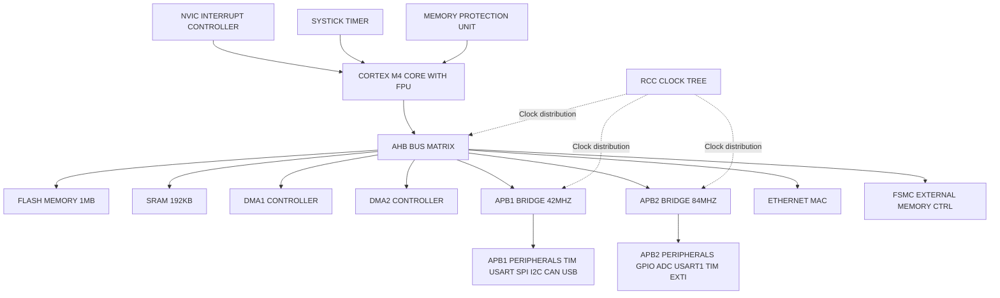
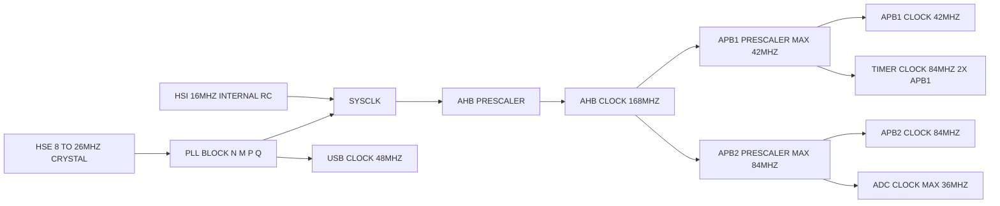
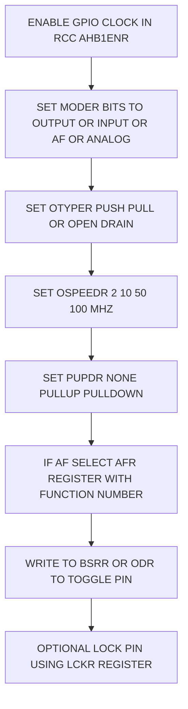
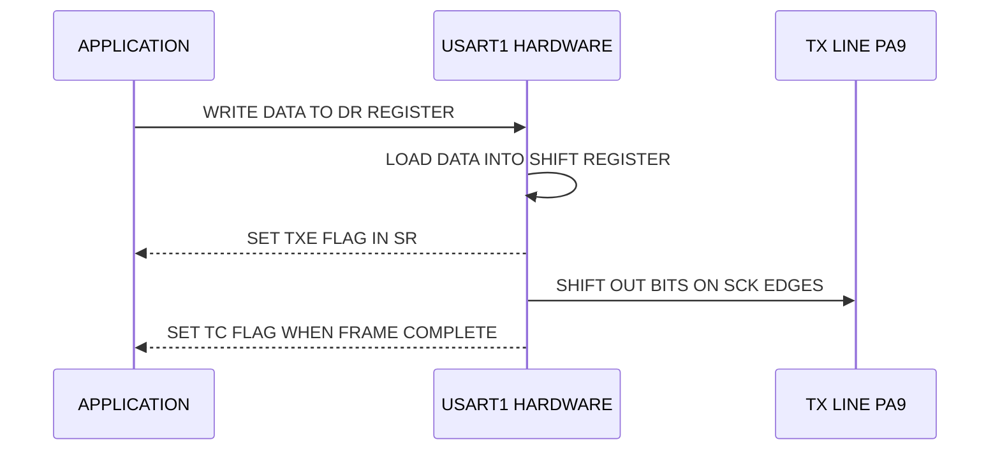
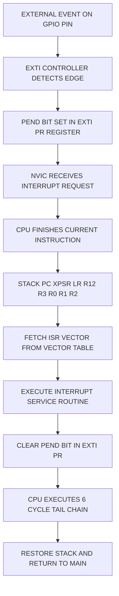
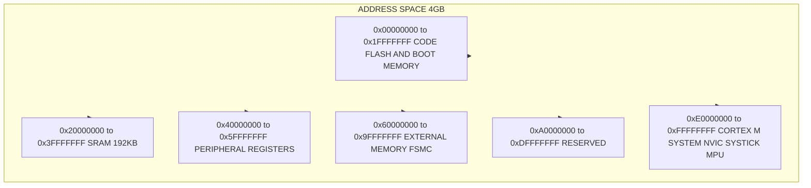

# STM32 Microcontroller Overview and Peripheral Programming:-

<!-- SECTION_1_START -->
# STM32 Microcontroller Overview and Peripheral Programming

## 1.1 Formal Academic Definition (KTU 2024 Syllabus Aligned)

> [!IMPORTANT]
> **Core Definition**
> The **STM32** is a family of 32-bit **Flash microcontrollers** developed by **STMicroelectronics**, built around the **ARM Cortex-M** processor core. It implements the **Harvard architecture** with a von Neumann-style unified system bus and is designed for embedded applications requiring high performance, real-time responsiveness, and low power consumption.

The STM32 platform integrates:
- A high-performance **ARM Cortex-M** RISC core (M0, M0+, M3, M4, M7 variants).
- A multi-layer **Advanced High-performance Bus (AHB) matrix** interconnecting **Core, DMA, SRAM, Flash, and peripherals**.
- Standard on-chip peripherals: **GPIO, USART, SPI, I2C, ADC, Timers, CAN, USB, Ethernet**.
- A **Nested Vectored Interrupt Controller (NVIC)** providing deterministic, low-latency interrupt handling.
- A flexible **Reset and Clock Control (RCC)** subsystem for dynamic frequency scaling.

The **Cortex-M4** core (the focus of the PBCST504 syllabus) includes a single-precision **Floating Point Unit (FPU)** and **DSP extensions**, enabling efficient signal-processing workloads at clock speeds up to **180 MHz** in high-tier devices.

---

## 1.2 Conceptual Analogy / Intuitive Overview

> [!NOTE]
> **The "Smart Office Building" Analogy**
> Think of an STM32 as a **multi-story office building**:
> - The **Cortex-M core** is the **CEO's office** — it makes all executive decisions (instruction execution).
> - The **AHB bus matrix** is the **central elevator shaft** — it ferries data between floors (peripherals, memory) in parallel, preventing traffic jams.
> - **GPIO pins** are the **doors and windows** of the building — physical interfaces to the outside world (LEDs, sensors, motors).
> - **Peripherals (USART, SPI, I2C, ADC)** are the **specialized departments** (mail room, telephony, data archive, sensor lab) that handle specific tasks.
> - The **NVIC** is the **front-desk receptionist** — instantly directing incoming "interrupt calls" to the right department, bypassing the CEO.
> - The **RCC clock tree** is the **building's power grid** — routing electricity to exactly where it is needed, at the right voltage and frequency.

This is why STM32 is so popular — every component is **modular**, **scalable**, and **interrupt-aware**, just like a well-designed corporate infrastructure.

---

## 1.3 STM32 Family Classification

| Series | Core | Max Clock | Typical Use-Case |
|:------:|:----:|:---------:|:----------------|
| STM32F0 | Cortex-M0 | 48 MHz | Cost-sensitive 8/16-bit replacement |
| STM32F1 | Cortex-M3 | 72 MHz | Mainstream (used in Discovery board) |
| STM32F4 | Cortex-M4 + FPU | 180 MHz | High-performance DSP, motor control |
| STM32L0/L4 | Cortex-M0+/M4 | 32 / 80 MHz | Ultra-low-power IoT |
| STM32H7 | Cortex-M7 | 480 MHz | Graphics, audio, AI edge inference |

> [!TIP]
> **KTU Lab Focus:** The syllabus typically uses the **STM32F407VG Discovery board** (Cortex-M4, 1 MB Flash, 192 KB SRAM) or **STM32F103C8T6** (Blue Pill, Cortex-M3). Familiarize yourself with the register map of whichever board your lab employs.

---

## 1.4 Memory Architecture Overview

The STM32 employs a **linear 4 GB address space** (32-bit), partitioned as follows:

| Address Range | Region | Purpose |
|:-------------:|:------:|:--------|
| 0x0000 0000 – 0x1FFF FFFF | Code | Flash memory, system memory (bootloader) |
| 0x2000 0000 – 0x3FFF FFFF | SRAM | Volatile variables, stack, heap |
| 0x4000 0000 – 0x5FFF FFFF | Peripheral | All on-chip peripheral registers |
| 0x6000 0000 – 0x9FFF FFFF | External RAM | FSMC / external memory controller |
| 0xE000 0000 – 0xFFFF FFFF | System | Cortex-M private (NVIC, SysTick, MPU) |

> [!IMPORTANT]
> **Bit-Banding Alias Region (0x2200 0000 – 0x23FF FFFF)**
> On Cortex-M3/M4, the **bit-band alias** allows atomic, single-bit read-modify-write operations to SRAM and peripheral regions — a critical feature for **GPIO** and **interrupt flag** manipulation in real-time systems.

---

<!-- SECTION_1_END -->

<!-- SECTION_2_START -->
# Deep Theoretical Analysis & KTU High-Yield Formula Sheet

## 2.1 Internal Block Architecture of an STM32 Device

The STM32 system-on-chip is organized around a **multi-AHB bus matrix** that allows simultaneous data transfers between **masters** (CPU, DMA1, DMA2, Ethernet) and **slaves** (Flash, SRAM, peripherals on APB1/APB2).

### 2.1.1 Bus Hierarchy

$$
\begin{aligned}
\text{Cortex-M Core (ICode + DCode)} &\longrightarrow \text{AHB Bus Matrix} \\
\text{DMA Controllers} &\longrightarrow \text{AHB Bus Matrix} \\
\text{AHB Matrix} &\longrightarrow \begin{cases} \text{Flash Interface (Flash I/F)} \\ \text{SRAM} \\ \text{APB1 Bridge} \longrightarrow \text{Low-speed peripherals} \\ \text{APB2 Bridge} \longrightarrow \text{High-speed peripherals} \end{cases}
\end{aligned}
$$

> [!NOTE]
> **Key Concept:** The **ICode bus** fetches instructions, while the **DCode bus** performs literal data accesses (compile-time constants). A third **System bus** handles general peripheral and SRAM traffic. This **decoupled Harvard design** is why Cortex-M cores can sustain near 1.25 **DMIPS/MHz**.

### 2.1.2 Peripheral Bus Assignment (STM32F4 Example)

| APB1 Bus (42 MHz max) | APB2 Bus (84 MHz max) |
|:----------------------|:-----------------------|
| USART2, USART3 | USART1, USART6 |
| SPI2, SPI3 | SPI1 |
| I2C1, I2C2, I2C3 | ADC1, ADC2, ADC3 |
| TIM2, TIM3, TIM4, TIM5 | TIM1, TIM8, TIM9–TIM11 |
| CAN1, CAN2 | GPIOA–GPIOH |
| USB OTG FS | SYSCFG, EXTI |

---

## 2.2 Reset and Clock Control (RCC) Subsystem

The **RCC** block manages all clock sources and distribution. STM32 devices typically offer:

- **HSI (High-Speed Internal)** — 16 MHz RC oscillator (default after reset).
- **HSE (High-Speed External)** — 4–26 MHz crystal/oscillator (high accuracy).
- **PLL (Phase-Locked Loop)** — multiplies HSE/HSI to generate the system clock.
- **LSE / LSI** — 32.768 kHz and ~32 kHz low-speed sources for RTC.

### 2.2.1 Clock Configuration Formula (PLL Output)

The **PLL** generates the system clock $f_{SYSCLK}$ through a configurable feedback multiplier:

$$
f_{VCO} = f_{PLL\_IN} \times \dfrac{N}{M}
$$

$$
f_{PLL\_OUT} = f_{SYSCLK} = \dfrac{f_{VCO}}{P}
$$

Where the parameters satisfy the constraints listed below.

### 2.2.2 KTU High-Yield Formula Cheat Sheet

| Symbol | Description | Typical Range / Value |
|:------:|:-----------|:----------------------|
| $f_{HSE}$ | External crystal frequency | 4 MHz – 26 MHz |
| $M$ | PLL input divider | 2 – 63 |
| $N$ | PLL multiplication factor | 50 – 432 |
| $P$ | PLL output divider | 2, 4, 6, 8 |
| $Q$ | PLL division for USB/SDIO/RNG | 2 – 15 |
| $f_{VCO}$ | VCO output frequency | 100 MHz – 432 MHz |
| $f_{SYSCLK}$ | System clock to core, AHB | $\leq$ 180 MHz (F4) |
| $f_{APB1}$ | APB1 peripheral clock | $\leq$ 45 MHz (F4) |
| $f_{APB2}$ | APB2 peripheral clock | $\leq$ 90 MHz (F4) |
| $f_{TIMxCLK}$ | Timer clock | $2 \times f_{APB}$ if APB prescaler $\neq 1$ |
| Baud rate | USART baud rate | $\dfrac{f_{PCLK}}{(16 \times (USARTDIV))}$ |
| ADC $f_{ADC}$ | ADC sampling clock | $\leq$ 36 MHz (F4) |

> [!IMPORTANT]
> **APB-to-Timer Bridging Rule (Why Timers run at 2× APB):**
> When the APB prescaler is **not 1**, the timer clock input is automatically doubled by hardware so that timer output compare events remain accurate. This is one of the most frequently tested **KTU concepts**.

---

## 2.3 General-Purpose Input/Output (GPIO) Subsystem

Each STM32 GPIO pin is a **bidirectional, software-configurable** line with the following internal features:

- **8 configurable modes**: Input floating, input pull-up, input pull-down, analog, output open-drain, output push-pull, alternate function push-pull, alternate function open-drain.
- **Configurable speed**: 2 MHz / 10 MHz / 50 MHz / 100 MHz (F4 high-speed).
- **Bit set/reset registers (BSRR)** for atomic single-bit manipulation.
- **Lock register (LCKR)** — once locked, pin configuration cannot be changed until next reset.

### 2.3.1 GPIO Register Set

| Register | Width | Purpose |
|:--------:|:-----:|:--------|
| MODER | 32-bit | Mode (00=In, 01=Out, 10=AF, 11=Analog) |
| OTYPER | 16-bit | Output type (push-pull / open-drain) |
| OSPEEDR | 32-bit | Output slew rate |
| PUPDR | 32-bit | Pull-up / pull-down |
| IDR | 16-bit | Input data read |
| ODR | 16-bit | Output data write |
| BSRR | 32-bit | Bit set (low half) / bit reset (high half) — atomic |
| LCKR | 32-bit | Lock configuration |
| AFR[0], AFR[1] | 32-bit | Alternate function selection (16 AFs per pin) |

> [!WARNING]
> **Common KTU Pitfall:** Students often write to **ODR** to toggle a pin. This causes a **read-modify-write race** in ISRs. Use **BSRR** (atomic) instead — a fundamental industry practice.

---

## 2.4 Nested Vectored Interrupt Controller (NVIC)

The NVIC is a **tightly coupled** peripheral to the Cortex-M core. It supports:

- Up to **240 physical interrupts** with **16 priority levels** (programmable).
- **Vectored fetching**: the core loads the ISR address directly from the vector table.
- **Tail-chaining**: back-to-back interrupts execute with only **6 CPU cycles** of overhead.
- **Late-arrival** and **preemption** by higher-priority interrupts.

The interrupt priority register is **4 bits wide** (on most STM32), split into **preemption priority** and **sub-priority**:

$$
\text{Priority Word} = \text{Preemption Priority} \ll s \; \vert \; \text{Sub Priority}
$$

where $s$ is the number of sub-priority bits configured in the **PRIGROUP** field of the **AIRCR** register.

---

## 2.5 Universal Synchronous/Asynchronous Receiver-Transmitter (USART)

The USART supports **asynchronous (RS-232)**, **synchronous**, **IrDA**, **LIN**, and **Smartcard** modes. The baud-rate generator derives its clock from $f_{PCLK}$:

$$
\text{BaudRate} = \dfrac{f_{PCLK}}{16 \times \text{USARTDIV}}
$$

where **USARTDIV** is a 16-bit value split between the **BRR** register:

$$
\text{USARTDIV} = \text{DIV\_Mantissa} + \dfrac{\text{DIV\_Fraction}}{16}
$$

> [!NOTE]
> **Engineering Utility:** USART is the de-facto debug console for STM32 (`printf()` redirection via `ITM` or `USART1`). Production firmware uses USART for **GPS modules**, **Bluetooth HC-05**, **GSM modems**, and **sensor telemetry**.

---

## 2.6 Serial Peripheral Interface (SPI)

SPI is a **full-duplex, master-slave, 4-wire** bus:

| Line | Direction | Function |
|:----:|:---------:|:---------|
| SCK | Master $\to$ Slave | Clock |
| MOSI | Master $\to$ Slave | Master Out, Slave In |
| MISO | Slave $\to$ Master | Master In, Slave Out |
| NSS | Master $\to$ Slave | Slave Select (active low) |

The serial clock baud rate is governed by:

$$
f_{SCK} = \dfrac{f_{PCLK}}{2 \;\text{to}\; 256}
$$

via the **BR[2:0]** bits in **SPI\_CR1**.

---

## 2.7 Inter-Integrated Circuit (I2C)

I2C is a **half-duplex, multi-master, 2-wire** bus (SCL + SDA) with **open-drain** drivers and external pull-ups.

**SCL clock frequency:**

$$
f_{SCL} = \dfrac{f_{PCLK1}}{(2 \times \text{CCR})}
$$

For **Standard mode** (100 kHz) and **Fast mode** (400 kHz), the value of **CCR** is computed as:

$$
\text{CCR} = \dfrac{f_{PCLK1}}{2 \times f_{SCL}}
$$

> [!TIP]
> **KTU Favourite:** Calculating I2C **CCR** for a given PCLK1 and target $f_{SCL}$ is a recurring numerical problem.

---

## 2.8 Analog-to-Digital Converter (ADC)

STM32 ADCs are **12-bit successive approximation** converters. The total conversion time for one channel is:

$$
T_{CONV} = (T_{SMPL} + 12.5) \times T_{ADC\_CLK}
$$

where $T_{SMPL}$ is the programmed **sampling time** (3, 15, 28, 56, 84, 112, 144, 480 cycles) and $T_{ADC\_CLK} = 1 / f_{ADC}$.

The **digital output** for an analog input $V_{IN}$ (with $V_{REF+}$ reference) is:

$$
D = \left\lfloor \dfrac{V_{IN}}{V_{REF+}} \times 4095 \right\rfloor
$$

---

## 2.9 Real-World Engineering Utility

| Application Domain | STM32 Peripheral Used |
|:-------------------|:----------------------|
| Drone flight controllers | TIM1, DMA, USART, SPI, NVIC |
| Industrial PLCs | CAN, USART, GPIO, ADC, EXTI |
| Wearable health monitors | I2C (sensors), ADC, LPUART, RTC |
| EV battery management | ADC, CAN, DMA, TIM |
| Smart home hubs | SPI (Flash), I2C (sensors), Wi-Fi via SPI/USART |
| Audio processing | I2S, DMA, TIM, DAC, FPU, DSP instructions |

---

<!-- SECTION_2_END -->

<!-- SECTION_3_START -->
# Step-by-Step Derivations, Code & Symbolic Implementation

## 3.1 Derivation 1 — PLL Configuration for $f_{SYSCLK} = 168$ MHz (STM32F407)

### Given
- $f_{HSE} = 8$ MHz external crystal
- Target $f_{SYSCLK} = 168$ MHz
- Target $f_{USB} = 48$ MHz (for USB OTG)

### Step 1 — Choose prescalers
We want $f_{VCO}$ to lie between **100 MHz and 432 MHz**. A common choice is $f_{VCO} = 336$ MHz (the VCO midpoint for $P=2$ giving 168 MHz).

### Step 2 — Choose $M$ and $N$
With $f_{HSE} = 8$ MHz and $M = 8$:

$$
f_{PLL\_IN} = \dfrac{f_{HSE}}{M} = \dfrac{8}{8} = 1 \text{ MHz}
$$

To get $f_{VCO} = 336$ MHz:

$$
N = \dfrac{f_{VCO}}{f_{PLL\_IN}} = \dfrac{336}{1} = 336
$$

### Step 3 — Choose $P$
For $f_{SYSCLK} = 168$ MHz:

$$
P = \dfrac{f_{VCO}}{f_{SYSCLK}} = \dfrac{336}{168} = 2
$$

### Step 4 — Choose $Q$ for USB
For $f_{USB} = 48$ MHz:

$$
Q = \dfrac{f_{VCO}}{f_{USB}} = \dfrac{336}{48} = 7
$$

### Final Result
$$
\begin{aligned}
f_{SYSCLK} &= 168 \text{ MHz} \\
f_{AHB} &= 168 \text{ MHz} \\
f_{APB1} &= 42 \text{ MHz (prescaler 4)} \\
f_{APB2} &= 84 \text{ MHz (prescaler 2)} \\
f_{TIMxCLK} &= 84 \text{ MHz} \quad (\text{doubled because APB1 prescaler} \neq 1)
\end{aligned}
$$

> [!NOTE]
> **Valuation Key:** The examiner awards 2 marks for correctly stating the input constraint range, 2 marks for the $N$ computation, 1 mark for $P$, and 1 mark for $Q$.

---

## 3.2 Derivation 2 — USART BRR for 115200 Baud

### Given
- $f_{PCLK2} = 84$ MHz (USART1 on APB2)
- Target BaudRate = 115200

### Step 1 — Compute USARTDIV
$$
\text{USARTDIV} = \dfrac{f_{PCLK2}}{16 \times \text{BaudRate}} = \dfrac{84 \times 10^{6}}{16 \times 115200}
$$

$$
\text{USARTDIV} = \dfrac{84\,000\,000}{1\,843\,200} = 45.572916\ldots
$$

### Step 2 — Split into Mantissa and Fraction
$$
\text{DIV\_Mantissa} = 45
$$

$$
\text{DIV\_Fraction} = 0.572916 \times 16 = 9.1666
$$

Rounded to nearest integer: $\text{DIV\_Fraction} = 9$.

### Step 3 — Pack into BRR register
The 16-bit **BRR** is split as **\[Mantissa : Fraction\]**:

$$
\text{BRR} = (45 \ll 4) \;\vert\; 9 = 0x02D9
$$

### Step 4 — Compute Actual Baud Rate Achieved
$$
f_{actual} = \dfrac{84\,000\,000}{16 \times 45.5625} = 115226 \text{ baud}
$$

$$
\text{Error} = \dfrac{115226 - 115200}{115200} \times 100\% \approx +0.022\%
$$

> [!IMPORTANT]
> **Industry rule:** UART baud-rate error must be $\leq 2\%$ for reliable communication. The computed 0.022% is excellent.

---

## 3.3 Derivation 3 — ADC Conversion for Thermistor Voltage

### Given
- $V_{REF+} = 3.3$ V
- $V_{IN} = 1.65$ V (mid-scale)
- 12-bit ADC

### Step 1 — Apply the ADC transfer function
$$
D = \left\lfloor \dfrac{V_{IN}}{V_{REF+}} \times (2^{12} - 1) \right\rfloor = \left\lfloor \dfrac{1.65}{3.3} \times 4095 \right\rfloor
$$

$$
D = \left\lfloor 2047.5 \right\rfloor = 2047
$$

### Step 2 — Reverse conversion (code to voltage)
$$
V_{IN} = \dfrac{D \times V_{REF+}}{4095} = \dfrac{2047 \times 3.3}{4095} = 1.6496 \text{ V}
$$

### Step 3 — Resolution calculation
$$
\Delta V = \dfrac{V_{REF+}}{4095} = \dfrac{3.3}{4095} = 0.000806 \text{ V/LSB} \approx 806 \text{ }\mu\text{V/LSB}
$$

---

## 3.4 Implementation 1 — GPIO Toggle (Register-Level / Bare-Metal)

```c
#include "stm32f4xx.h"

void GPIO_Init_PD12_Output(void) {
    /* Step 1: Enable GPIOD clock on AHB1 bus */
    RCC->AHB1ENR |= (1U << 3);

    /* Step 2: Configure PD12 as General-Purpose Output */
    GPIOD->MODER   &= ~(3U << (12 * 2));   /* Clear mode bits */
    GPIOD->MODER   |=  (1U << (12 * 2));   /* Set output mode (01) */
    GPIOD->OTYPER  &= ~(1U << 12);         /* Push-pull */
    GPIOD->OSPEEDR |=  (3U << (12 * 2));   /* High speed 100 MHz */
    GPIOD->PUPDR   &= ~(3U << (12 * 2));   /* No pull-up/pull-down */
}

void LED_On(void)  { GPIOD->BSRR = (1U << 12); }
void LED_Off(void) { GPIOD->BSRR = (1U << (12 + 16)); }

int main(void) {
    GPIO_Init_PD12_Output();
    while (1) {
        LED_On();
        for (volatile int i = 0; i < 1000000; i++);
        LED_Off();
        for (volatile int i = 0; i < 1000000; i++);
    }
}
```

> [!TIP]
> **Atomicity Insight:** `BSRR = (1 << 28)` resets PD12, while `BSRR = (1 << 12)` sets it. Writing 1 in the **upper half-word** of BSRR clears the corresponding bit in ODR — without any RMW race.

---

## 3.5 Implementation 2 — GPIO with External Interrupt (EXTI)

```c
#include "stm32f4xx.h"

volatile uint8_t button_pressed = 0;

void EXTI0_IRQHandler(void) {
    if (EXTI->PR & (1U << 0)) {
        EXTI->PR = (1U << 0);           /* Clear pending bit */
        button_pressed = 1;
    }
}

void GPIO_Init_PC13_Input(void) {
    RCC->AHB1ENR |= (1U << 2);          /* GPIOC clock */
    RCC->APB2ENR |= (1U << 14);         /* SYSCFG clock */

    /* PC13 input mode with pull-up */
    GPIOC->MODER   &= ~(3U << (13 * 2));
    GPIOC->PUPDR   &= ~(3U << (13 * 2));
    GPIOC->PUPDR   |=  (1U << (13 * 2));

    /* Map EXTI0 line to PA0 (or PC0 depending on board) */
    SYSCFG->EXTICR[0] &= ~(0xF << 0);
    SYSCFG->EXTICR[0] |=  (0x2 << 0);   /* 0010 = PC */

    EXTI->IMR  |= (1U << 0);            /* Enable mask */
    EXTI->FTSR |= (1U << 0);            /* Falling-edge trigger */
    EXTI->RTSR &= ~(1U << 0);

    NVIC_SetPriority(EXTI0_IRQn, 2);
    NVIC_EnableIRQ(EXTI0_IRQn);
}
```

---

## 3.6 Implementation 3 — USART1 Transmission (Bare-Metal)

```c
void USART1_Init(uint32_t baud) {
    /* Enable GPIOA + USART1 clocks */
    RCC->AHB1ENR |= (1U << 0);
    RCC->APB2ENR |= (1U << 4);

    /* PA9 (TX) alternate function */
    GPIOA->MODER   &= ~(3U << (9 * 2));
    GPIOA->MODER   |=  (2U << (9 * 2));   /* AF mode */
    GPIOA->AFR[1]  |=  (7U << ((9 - 8) * 4)); /* AF7 = USART1 */

    /* Configure baud rate (PCLK2 = 84 MHz) */
    float usartdiv = 84000000.0f / (16.0f * baud);
    uint32_t mantissa = (uint32_t)usartdiv;
    uint32_t fraction = (uint32_t)((usartdiv - mantissa) * 16.0f + 0.5f);
    USART1->BRR = (mantissa << 4) | fraction;

    USART1->CR1 = (1U << 13)             /* UE: USART enable */
                | (1U << 3);             /* TE: Transmitter enable */
}

void USART1_SendChar(char c) {
    while (!(USART1->SR & (1U << 7)));   /* Wait for TXE */
    USART1->DR = (uint16_t)c;
}

void USART1_SendString(const char *s) {
    while (*s) USART1_SendChar(*s++);
}
```

---

## 3.7 Implementation 4 — Timer in PWM Mode (TIM3 Channel 1, PC6)

```c
void TIM3_PWM_Init(uint16_t period, uint16_t duty) {
    RCC->AHB1ENR |= (1U << 2);          /* GPIOC clock */
    RCC->APB1ENR |= (1U << 1);          /* TIM3 clock */

    /* PC6 alternate function AF2 = TIM3_CH1 */
    GPIOC->MODER   &= ~(3U << (6 * 2));
    GPIOC->MODER   |=  (2U << (6 * 2));
    GPIOC->AFR[0]  |=  (2U << (6 * 4));

    TIM3->PSC = 0;                       /* No prescaler */
    TIM3->ARR = period - 1;              /* Auto-reload value */
    TIM3->CCR1 = duty;                   /* Capture/compare (duty) */

    TIM3->CCMR1 = (6U << 4)              /* PWM mode 1 */
                | (1U << 3);             /* Preload enable */
    TIM3->CCER  = (1U << 0);             /* Channel 1 output enable */
    TIM3->CR1   = (1U << 7)              /* ARPE enable */
                | (1U << 0);             /* Counter enable */
}
```

**Resulting PWM frequency:**

$$
f_{PWM} = \dfrac{f_{TIM3}}{(\text{PSC} + 1)(\text{ARR} + 1)}
$$

If $f_{TIM3} = 84$ MHz, **PSC** $= 0$, **ARR** $= 999$:
$$
f_{PWM} = \dfrac{84\,000\,000}{1 \times 1000} = 84 \text{ kHz}
$$

> [!TIP]
> This PWM can drive an **RC servo** (50 Hz), a **DC motor speed controller**, or an **LED dimmer** by varying the duty cycle.

---

## 3.8 Implementation 5 — System Clock Setup (HSE → PLL → SYSCLK)

```c
void SystemClock_168MHz(void) {
    /* Enable HSE */
    RCC->CR |= (1U << 16);
    while (!(RCC->CR & (1U << 17)));      /* Wait for HSE ready */

    /* Configure flash latency (5 wait states for 168 MHz @ 2.7-3.6 V) */
    FLASH->ACR |= (5U << 0) | (1U << 10) | (1U << 9);

    /* Set bus prescalers */
    RCC->CFGR |= (0U << 4)    /* HPRE = 1, AHB = 168 MHz */
              |  (4U << 10)   /* PPRE1 = 4, APB1 = 42 MHz */
              |  (0U << 13);  /* PPRE2 = 2, APB2 = 84 MHz */

    /* Configure PLL: M=8, N=336, P=2, Q=7 */
    RCC->PLLCFGR = (8U << 0) | (336U << 6) | (2U << 16) | (7U << 24) | (1U << 22);

    /* Enable PLL */
    RCC->CR |= (1U << 24);
    while (!(RCC->CR & (1U << 25)));      /* Wait for PLL lock */

    /* Select PLL as system clock */
    RCC->CFGR |= (2U << 0);
    while ((RCC->CFGR & (3U << 2)) != (2U << 2)); /* Wait for switch */
}
```

---

## 3.9 Implementation 6 — ADC Single-Channel Sampling (PA0)

```c
void ADC1_Init(void) {
    RCC->AHB1ENR |= (1U << 0);          /* GPIOA clock */
    RCC->APB2ENR |= (1U << 8);          /* ADC1 clock */

    /* PA0 analog mode */
    GPIOA->MODER |=  (3U << (0 * 2));

    /* ADC common config: APB2 = 84 MHz, divide by 2 => 42 MHz ADC clock */
    ADC->CCR &= ~(3U << 16);
    ADC->CCR |=  (1U << 16);

    ADC1->CR1 = 0;
    ADC1->CR2 = (1U << 1)               /* Continuous conversion */
              | (1U << 0);              /* ADC enable */
    ADC1->SQR3 = 0;                     /* First conversion: channel 0 */
    ADC1->SMPR2 = (3U << 0);            /* 56 cycles sampling time */
}

uint16_t ADC1_Read(void) {
    ADC1->CR2 |= (1U << 30);            /* SWSTART */
    while (!(ADC1->SR & (1U << 1)));    /* Wait for EOC */
    return (uint16_t)ADC1->DR;
}
```

---

<!-- SECTION_3_END -->

<!-- SECTION_4_START -->
# Structural Diagrams & Schematics

## 4.1 STM32 Top-Level Architecture (Block Diagram)



---

## 4.2 Clock Tree Distribution Flow



---

## 4.3 GPIO Configuration Flow



---

## 4.4 USART Transmission Sequence



---

## 4.5 Interrupt Handling Sequence (NVIC + EXTI)



---

## 4.6 Pin-to-Alternate-Function Mapping Reference

| STM32F407 Pin | Alternate Function 0 | AF1 | AF2 | AF7 | AF12 |
|:-------------:|:--------------------:|:---:|:---:|:---:|:----:|
| PA0 | SYS_WKUP | TIM2_CH1 | TIM5_CH1 | USART2_CTS | ETH_MII_CRS |
| PA1 | - | TIM2_CH2 | TIM5_CH2 | USART2_RTS | ETH_MII_RX_CLK |
| PA2 | - | TIM2_CH3 | TIM5_CH3 | USART2_TX | ETH_MDIO |
| PA3 | - | TIM2_CH4 | TIM5_CH4 | USART2_RX | ETH_MII_COL |
| PA5 | - | TIM2_CH1 | TIM8_CH1N | SPI1_SCK | - |
| PA9 | - | TIM1_CH2 | - | USART1_TX | - |
| PA10 | - | TIM1_CH3 | - | USART1_RX | - |

> [!NOTE]
> **Note for Students:** When you need a peripheral signal on a specific pin, you must (1) enable the GPIO clock, (2) set MODER to AF mode (10), (3) configure the corresponding `AFR` register field with the desired AF number. Skipping step (3) is the most common reason peripherals "don't work" on a new pin.

---

## 4.7 Memory Map Visualization



---

<!-- SECTION_4_END -->

<!-- SECTION_5_START -->
# KTU 2024 Scheme Examination Question Bank & Topic Recap

## Part A — 3-Mark Short Answer Questions

### **Q1.** [KTU University Exam — July 2023] *(CO1, Remember)*
**List the various on-chip peripherals available in the STM32F407 microcontroller.**

**Model Answer (3 Marks):**

> [!IMPORTANT]
> **Peripheral Set of STM32F407:**
> 1. **Communication peripherals** — USART (x6), SPI (x3), I2C (x3), CAN (x2), USB OTG FS/HS, Ethernet MAC, I2S (x2).
> 2. **Analog peripherals** — 12-bit ADC (x3), 12-bit DAC (x2), internal temperature sensor, $V_{BAT}$ sensing.
> 3. **Timers** — General-purpose (TIM2–TIM5, TIM9–TIM14), advanced-control (TIM1, TIM8), basic (TIM6, TIM7), SysTick, RTC, watchdog (IWDG, WWDG).
> 4. **Memory & I/O** — GPIO (up to 140 pins), DMA (x2 with 16 streams), FSMC, CRC engine.
> 5. **System** — RCC, NVIC, EXTI, SYSCFG, PWR, MPU, FPU, JTAG/SW-DP debug.

**[Valuation: 0.5 per category, 1 extra for completeness → 3 Marks]**

---

### **Q2.** [KTU University Exam — Dec 2023] *(CO1, Understand)*
**Explain the role of the Nested Vectored Interrupt Controller (NVIC) in STM32.**

**Model Answer (3 Marks):**

The **NVIC** is a tightly coupled interrupt controller to the Cortex-M core. Its roles are:

1. **Accepts** interrupt requests from on-chip peripherals and external lines.
2. **Prioritises** them using programmable 4-bit priority levels (split into preemption and sub-priority).
3. **Vector-fetches** the ISR address from the vector table in **6 CPU cycles**.
4. **Supports preemption** of lower-priority ISRs by higher-priority ones.
5. **Tail-chains** consecutive interrupts with only 6-cycle overhead, ideal for real-time control.
6. Provides **atomic set/clear** of pending bits via the **ISPR/ICPR** registers.

**[Valuation: 0.5 per role → 3 Marks]**

---

## Part B — 14-Mark Long Answer Questions (Internal Choice)

> [!WARNING]
> **KTU 2024 Pattern:** Each Part-B question is for **14 marks**, with internal choice between two questions. Sub-parts (a) and (b) typically carry **7 marks each**, with at least one numerical/design problem.

---

### **Question A — 14 Marks**
#### [KTU University Exam — July 2024] *(CO1, CO2, Apply / Analyze)*

**(a)** With a neat block diagram, explain the **internal architecture of the STM32** microcontroller. Describe the role of the AHB bus matrix. **(7 Marks, Understand)**

**(b)** An STM32F407 system uses an **8 MHz HSE crystal**. Compute the values of $M$, $N$, $P$, and $Q$ to achieve $f_{SYSCLK} = 168$ MHz and $f_{USB} = 48$ MHz. Also compute the AHB, APB1, APB2, and timer clock frequencies if AHB prescaler = 1, APB1 prescaler = 4, APB2 prescaler = 2. **(7 Marks, Apply)**

---

#### **Model Solution — Part (a)**

**Architecture (3 Marks):**
The STM32F407 is built around the **Cortex-M4** core which contains:
- ICode, DCode, and System AHB-Lite interfaces.
- NVIC, FPU, MPU, and SysTick timer (tightly coupled).
- Debug access port (SW-DP/JTAG).

The core is connected to a **multi-layer AHB bus matrix**, which permits:
- Simultaneous **parallel** access by CPU and DMA controllers.
- Independent **read/write paths** to Flash, SRAM, and peripherals.
- Multiple bus bridges (APB1, APB2) for slow and fast peripherals.

**Role of AHB Bus Matrix (2 Marks):**
- Decouples the **CPU** from peripheral latency.
- Allows **DMA** to handle bulk data movement without CPU intervention.
- Routes **arbitration** between masters (CPU, DMA1, DMA2, Ethernet) for shared slaves (SRAM, peripherals).

**Companion blocks (2 Marks):**
- **RCC** generates and distributes all clock signals.
- **Power controller (PWR)** provides low-power modes.
- **SYSCFG / EXTI** handle external interrupts.
- **FSMC** interfaces to external NOR/NAND/PSRAM.
- **CRC** unit, **RNG**, **Hash** accelerator for crypto/utility.

> **[Valuation: 2 Marks block diagram, 2 Marks AHB role, 1 Mark each for RCC, PWR, EXTI, FSMC, 0.5 rounding → 7 Marks]**

---

#### **Model Solution — Part (b)**

**Step 1 — Choose $M$ and $N$ (3 Marks)**

We want $f_{VCO} = 336$ MHz to comfortably sit in the 100–432 MHz range and yield 168 MHz after division by $P=2$.

$$
M = 8, \quad f_{PLL\_IN} = \dfrac{8}{8} = 1 \text{ MHz}
$$

$$
N = \dfrac{f_{VCO}}{f_{PLL\_IN}} = \dfrac{336}{1} = 336
$$

**Step 2 — Choose $P$ (1 Mark)**

$$
P = \dfrac{f_{VCO}}{f_{SYSCLK}} = \dfrac{336}{168} = 2
$$

**Step 3 — Choose $Q$ for USB (1 Mark)**

$$
Q = \dfrac{f_{VCO}}{f_{USB}} = \dfrac{336}{48} = 7
$$

**Step 4 — Compute bus clocks (2 Marks)**

$$
\begin{aligned}
f_{AHB} &= f_{SYSCLK} / 1 = 168 \text{ MHz} \\
f_{APB1} &= f_{AHB} / 4 = 42 \text{ MHz} \\
f_{APB2} &= f_{AHB} / 2 = 84 \text{ MHz} \\
f_{TIMxCLK} &= 2 \times f_{APB1} = 84 \text{ MHz} \quad (\text{because prescaler} \neq 1)
\end{aligned}
$$

> **[Valuation: Stating constraint 1 Mark, $M$=8 & $N$=336 → 2 Marks, $P$=2 → 1 Mark, $Q$=7 → 1 Mark, Bus clock derivations → 2 Marks → Total 7 Marks]**

---

### **Question B — 14 Marks (Alternative)**
#### [KTU University Exam — Dec 2024] *(CO1, CO2, Apply / Analyze)*

**(a)** Explain the **various GPIO modes** of an STM32 pin. Describe the function of the **BSRR** register and explain why it is preferred over direct ODR access. **(7 Marks, Understand)**

**(b)** Design a **USART1 initialization** for 115200 baud, 8-N-1 with $f_{PCLK2} = 84$ MHz. Compute the **BRR register value** and the achieved baud-rate error. Also list the steps to enable transmission with interrupt-based TX. **(7 Marks, Apply)**

---

#### **Model Solution — Part (a)**

**GPIO Modes (4 Marks):**

| Mode | MODER | Use |
|:----:|:-----:|:---|
| Input | 00 | Read digital input |
| Output | 01 | Drive pin high/low |
| Alternate Function | 10 | Pin used by a peripheral (USART, SPI, etc.) |
| Analog | 11 | Used by ADC, DAC, or low-power |

Additional configuration registers (1 Mark each):
- **OTYPER** — push-pull (0) or open-drain (1).
- **OSPEEDR** — 2, 10, 50, 100 MHz slew rate.
- **PUPDR** — none, pull-up, pull-down.

**BSRR Register (2 Marks):**
- BSRR is **32 bits wide**.
- Writing 1 in **lower 16 bits** ($\text{BSy}$, y = 0..15) **sets** the corresponding ODR bit.
- Writing 1 in **upper 16 bits** ($\text{BRy}$, y = 16..31) **resets** the corresponding ODR bit.
- The operation is **atomic** (single AHB write), avoiding the **read-modify-write race** that occurs when writing ODR in ISRs.

> **Example:** `GPIOD->BSRR = (1U << 28);` clears PD12 atomically.

**Why BSRR > ODR (1 Mark):**
In an **RTOS** or **ISR context**, two contexts may both try to modify the same ODR byte. The non-atomic R-M-W of ODR causes one write to be lost. BSRR is a single bus transaction — guaranteed atomic.

> **[Valuation: Modes table 3 Marks, BSRR working 2 Marks, ODR pitfall 1 Mark, OTYPER/OSPEEDR/PUPDR 1 Mark → Total 7 Marks]**

---

#### **Model Solution — Part (b)**

**Step 1 — Compute USARTDIV (2 Marks)**
$$
\text{USARTDIV} = \dfrac{f_{PCLK2}}{16 \times \text{BaudRate}} = \dfrac{84 \times 10^{6}}{16 \times 115200} = 45.5729
$$

**Step 2 — Mantissa and Fraction (2 Marks)**
$$
\text{Mantissa} = 45, \quad \text{Fraction} = 0.5729 \times 16 = 9.166 \approx 9
$$

**Step 3 — BRR Packing (1 Mark)**
$$
\text{BRR} = (45 \ll 4) \;\vert\; 9 = 0x02D9
$$

**Step 4 — Baud-Rate Error (1 Mark)**
$$
f_{actual} = \dfrac{84\,000\,000}{16 \times 45.5625} = 115226 \text{ baud}
$$

$$
\text{Error} = \dfrac{115226 - 115200}{115200} \times 100\% = +0.023\% \quad (\ll 2\% \text{ threshold})
$$

**Step 5 — Interrupt-Based TX Setup (1 Mark)**
1. Configure GPIO PA9 as AF push-pull (AF7).
2. Set BRR to `0x02D9`.
3. Set `USART_CR1.TE` (bit 3) and `USART_CR1.UE` (bit 13).
4. Set `USART_CR1.TXEIE` (bit 7) to enable TXE interrupt.
5. Set `NVIC` priority for `USART1_IRQn` and enable the IRQ.
6. In the ISR, write the next byte to `USART_DR` and clear the TXE flag.

> **[Valuation: USARTDIV 2 Marks, M/F split 2 Marks, BRR hex 1 Mark, Error 1 Mark, IRQ setup 1 Mark → Total 7 Marks]**

---

## KTU Examiner's Valuation Warning / Pitfall Callout

> [!WARNING]
> **Where Students Most Commonly Lose Marks in STM32 Questions:**
> 1. **Forgetting to enable the peripheral clock** in `RCC->AHBxENR` or `RCC->APBxENR` — the peripheral stays silent.
> 2. **Writing to ODR instead of BSRR** in interrupt handlers — atomicity violation.
> 3. **Miscalculating the timer clock** by ignoring the **2× APB rule** when the prescaler $\neq 1$.
> 4. **Skipping MODER configuration** when switching between Input, Output, and Analog modes — pin stays in default Input floating.
> 5. **Wrong BRR packing** (forgetting to shift mantissa by 4 bits).
> 6. **Not clearing EXTI pending bits** in the ISR — the interrupt fires forever.
> 7. **Setting $f_{VCO}$ outside 100–432 MHz** — PLL will not lock and the MCU hangs.
> 8. **Misidentifying APB1 vs APB2** peripherals — writing to the wrong enable register.
> 9. **Skipping the AF register (AFR) configuration** — pin stays in normal GPIO mode.
> 10. **Failing to set the priority group** (PRIGROUP) before assigning priorities — priority values are misinterpreted.

---

## Topic Recap & Important Things to Remember

- **STM32** = 32-bit ARM Cortex-M microcontroller family by STMicroelectronics.
- **Cortex-M4** core includes **FPU + DSP** + **MPU**; max **180 MHz** (F4 series).
- **4 GB linear address space**; key regions: **Flash (0x0800 0000)**, **SRAM (0x2000 0000)**, **Peripheral (0x4000 0000)**, **System (0xE000 0000)**.
- **AHB bus matrix** decouples masters (CPU, DMA) from slaves (Flash, SRAM, peripherals) for **parallel transfers**.
- **APB1 ≤ 45 MHz** (slow peripherals — I2C, USART2/3, TIM2–5, CAN, USB).
- **APB2 ≤ 90 MHz** (fast peripherals — GPIO, ADC, USART1/6, TIM1/8, EXTI).
- **GPIO modes**: Input, Output, **Alternate Function (AF)**, **Analog** — set via **MODER** register.
- **Always enable peripheral clock first** in RCC before configuring its registers.
- **BSRR is atomic**; ODR requires read-modify-write — use BSRR in ISRs.
- **PLL parameters**: $M$ (input div), $N$ (mul), $P$ (system div), $Q$ (USB div); $f_{VCO} \in [100, 432]$ MHz.
- **Timer clock = 2 × APBx** if APB prescaler $\neq 1$ (compensates for slow bus).
- **UART baud rate**: $f_{PCLK} / (16 \times \text{USARTDIV})$; mantissa in BRR[15:4], fraction in BRR[3:0].
- **Baud-rate error must be $\leq 2\%$** for reliable communication.
- **I2C CCR**: $f_{PCLK1} / (2 \times f_{SCL})$ for Standard/Fast mode.
- **SPI baud**: $f_{PCLK} / (2, 4, \ldots, 256)$ via BR[2:0].
- **ADC**: 12-bit SAR; digital code $D = (V_{IN} / V_{REF+}) \times 4095$; max $f_{ADC} = 36$ MHz.
- **NVIC**: 4-bit priority = preemption $\ll s$ $\vert$ sub-priority; **tail-chain** = 6 cycles.
- **EXTI** lines 0–15 map to GPIOA–GPIOI; pending bits must be **cleared in software**.
- **Bit-band alias** at 0x2200 0000 / 0x4200 0000 enables atomic single-bit access on Cortex-M3/M4.
- **Flash latency** must be set before increasing $f_{SYSCLK}$ (e.g., 5 WS for 168 MHz @ 3.3 V).
- **Bootstrap pins** BOOT0/BOOT1 select **Flash / System memory / Embedded SRAM** boot.
- **JTAG pins** (PA13/PA14/PB3/PB4) must be **remapped** if used as GPIO.
- **Industry tip**: Always comment your **clock tree configuration** — a board that "doesn't work" is almost always a clock setup issue.

<!-- SECTION_5_END -->
