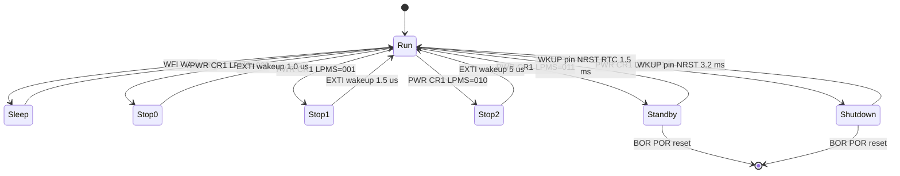

# STM32U575 Features and Specifications

<!-- SECTION_1_START -->

# STM32U575 Features and Specifications

## 1.1 Formal Academic Definition

The **STM32U575** is an ultra-low-power 32-bit microcontroller unit (MCU) manufactured by **STMicroelectronics**, belonging to the **STM32U5 series** built on the **Arm Cortex-M33** core with **Arm TrustZone** security extension and **FPU (Floating Point Unit)** + **DSP** instructions. The device operates at frequencies up to **160 MHz** and integrates advanced peripherals, multiple low-power modes, and a dedicated **MIPI-DSI** display interface, making it optimized for **energy-constrained, secure IoT and smart-sensor applications**.

> [!IMPORTANT]
> **KTU 2024 Syllabus Highlight:** The STM32U575 is the canonical reference device for Module 2 of the *Microcontrollers* (PBCST504) course. Students are expected to know its **core architecture**, **memory map**, **bus matrix**, **power domains**, and **key peripherals** such as **ADC**, **UART**, **SPI**, **I2C**, **TIM**, **RTC**, and **LPUART**.

---

## 1.2 Conceptual Analogy / Intuition

Imagine a **smartwatch** or a **fitness band**. Such a device must:
1. Run complex tasks (sensor fusion, BLE communication) when active,
2. Sleep for hours on a tiny battery,
3. Wake up instantly on a button press or RTC alarm,
4. Protect sensitive user data from tampering.

The **STM32U575** is engineered exactly for this profile. Think of it as a **"Swiss Army knife"** in the microcontroller world:
- The **Cortex-M33 core** is the *brain* (general-purpose processing).
- The **low-power modes** (Stop, Standby, Shutdown) are the *sleep switches*.
- **TrustZone** is the *security guard* that isolates safe vs. unsafe code.
- The **DMA controllers** are the *helpers* that move data without bothering the brain.
- The **rich peripheral set** (USB-C, CAN-FD, SDMMC, SAI, DFSDM) is the *toolkit* for talking to the outside world.

> [!NOTE]
> **Key Takeaway:** STM32U575 = *ultra-low-power + Cortex-M33 + TrustZone + rich peripherals*. It is the **flagship ultra-low-power MCU** in ST's portfolio as of 2024.

---

## 1.3 Quick Reference — Device Family Positioning

| STM32U5 Series Family | Core | Max Clock | Typical Use-Case |
|---|---|---|---|
| STM32U535 / U545 | Cortex-M33 | 160 MHz | Entry-level ULP |
| **STM32U575 / U585** | **Cortex-M33** | **160 MHz** | **Mainstream ULP + Crypto/Hash** |
| STM32U599 / U5A9 | Cortex-M33 | 160 MHz | High-integration ULP |

> [!TIP]
> The **STM32U575** is a "mainstream" member. The **U585** adds **AES-256 + PKA + Secure Firmware Install (SFI)** hardware cryptography. The **U575** has the **AES-256** and **True Random Number Generator (TRNG)** but no PKA.

---

## 1.4 Visualization Callout — Cortex-M33 Pipeline

> [!VISUALIZATION CONTROL]
> **Concept:** Simplified 3-stage ARM Cortex-M33 instruction pipeline
> **GeoGebra / Desmos Input Equations (timeline):**
> * `f1(t) = Step(t - 0) - Step(t - 1)` → Fetch
> * `f2(t) = Step(t - 1) - Step(t - 2)` → Decode
> * `f3(t) = Step(t - 2) - Step(t - 3)` → Execute
> **Visual Description:** Three overlapping unit-step functions on the time axis, showing how each new instruction enters the pipeline one clock cycle after the previous one, achieving an **IPC ≈ 1.0** at 160 MHz.

---

<!-- SECTION_1_END -->

<!-- SECTION_2_START -->

# 2. Deep Theoretical Analysis & KTU High-Yield Formula Sheet

## 2.1 Core Architecture Decomposition

The STM32U575 follows a **multi-bus AHB/APB matrix** architecture. The hierarchy is:

1. **CPU Subsystem**
   - Arm Cortex-M33 with FPU (single precision), MPU (Memory Protection Unit), and TrustZone for ARMv8-M.
   - **System Timer (SysTick)** — 24-bit down-counter for RTOS tick.
   - **NVIC (Nested Vectored Interrupt Controller)** — Up to **140** maskable interrupts with **4-bit priority** (16 levels).

2. **Memory Subsystem**
   - **Flash:** Up to **2 MB** dual-bank with ECC, supporting read-while-write (RWW).
   - **SRAM:** Total **786 KB**, partitioned as:
     - **SRAM1:** 256 KB (parity-checked)
     - **SRAM2:** 64 KB (retained in Standby, supports **SRAM2a / SRAM2b** for "Keep-on-Standby" page selection)
     - **SRAM3:** 256 KB (parity-checked, used for peripherals)
     - **SRAM4:** 16 KB (retained in Standby, no ECC) — *backup register region*.
   - **ROM:** 128 KB (Boot ROM with bootloader).

3. **Power Subsystem**
   - Internal **SMPS step-down converter** (only on **STM32U575/585**) for high efficiency in Run mode.
   - Multiple **voltage scaling (VOS)** levels: **VOS0** (high performance, 160 MHz), **VOS1** (range 1), **VOS2** (range 2), **VOS3** (lowest).
   - **Low-power regulators** (LP regulator, MR_LDO) for Stop/Standby modes.

4. **Security Subsystem (TrustZone + Crypto on U575)**
   - **TrustZone for ARMv8-M:** Hardware isolation between **Secure** and **Non-Secure** worlds.
   - **OTFDEC (On-The-Fly Decryption Engine)** for encrypted external memory.
   - **AES-256** hardware accelerator (ECB, CBC, CTR, GCM, CCM).
   - **True Random Number Generator (TRNG)** — NIST SP 800-22 compliant.
   - **Unique 96-bit device ID** + **Flash readout protection (RDP)** with **3 levels** (0, 1, 2).

5. **Peripheral Subsystem** (covered in detail in §2.3)

---

## 2.2 Power Consumption — The Headline Feature

The **STM32U575** is famous for its **EEMBC ULPBench** score of **148 ULPMark-CP** and an active-mode current consumption of about **19 µA/MHz** at VOS0 with SMPS.

> [!NOTE]
> **Formula 1 — Power Dissipation in CMOS:**
>
> $$P = C \cdot V_{DD}^2 \cdot f$$
>
> where $C$ is the effective switched capacitance, $V_{DD}$ is the supply voltage, and $f$ is the clock frequency. Reducing any of these dramatically lowers power.

> [!NOTE]
> **Formula 2 — Active Power with all peripherals OFF:**
>
> $$I_{DD}(\mu A) = k \cdot f_{HCLK}$$
>
> where $k \approx 19\,\mu A/MHz$ for STM32U575 (SMPS, VOS0, all peripherals disabled, code from Flash).

> [!NOTE]
> **Formula 3 — Energy per Operation:**
>
> $$E = V_{DD} \cdot I_{DD} \cdot t = P \cdot t$$
>
> Reducing $V_{DD}$ from 1.8 V to 1.2 V cuts energy by a factor of $\left(\dfrac{1.2}{1.8}\right)^2 = 0.444$, i.e., **~55 %** savings.

> [!NOTE]
> **Formula 4 — Wakeup Time Approximation:**
>
> $$t_{WU} = t_{LP\_reg} + N_{cycles} \cdot T_{HCLK}$$
>
> Typical: $t_{WU} \approx 5\,\mu s$ from Stop2 to Run with VOS0 ramp.

---

## 2.3 Peripheral Inventory — KTU Formula Sheet

> [!IMPORTANT]
> All specifications below are reproduced from the **RM0456** reference manual. Memorizing the bold items will score you **at least 6 marks** in the KTU 2024 ESE.

| Subsystem | Peripheral Block | Key Spec | Count | Notes |
|---|---|---|---|---|
| **Analog** | **12-bit ADC** | 5 Msps, oversampling to 16-bit | **2** | Differential pair support |
| Analog | 12-bit DAC | 1 Msps, 2 outputs | **2** | Sample-and-hold |
| Analog | **Op-Amp (OPAMP)** | Internal, programmable gain | **3** | PGA, follower modes |
| Analog | **Comparators (COMP)** | Ultra-low-power | **2** | Internal 8-bit DAC ref |
| Analog | **Vrefbuf** | 1.5 V / 2.048 V / 2.5 V | **1** | Voltage reference buffer |
| **Digital I/O** | **GPIO** | 5 V tolerant (FT_a pins) | **~123** | Wakeup pins marked with "WKUP" |
| **Timers** | **TIM (16-bit adv)** | PWM, encoder, one-pulse | **7** | TIM1, TIM8, TIM20, etc. |
| Timers | TIM (32-bit gen-purpose) | 32-bit counter | **1** | TIM2 |
| Timers | **LPTIM (16-bit)** | Runs in Stop/Standby | **6** | Quadrature decode on LPTIM1 |
| Timers | SysTick | 24-bit | **1** | Cortex-M33 system timer |
| Timers | **RTC** | BKP domain, calendar | **1** | Tamper + timestamp |
| Timers | **IWDG / WWDG** | Independent / Window WDG | **2** | |
| **Comms** | **USART / UART / LPUART** | + LIN, IrDA, ISO 7816 | **6 / 2 / 1** | LPUART runs in Stop2 |
| Comms | **SPI** | Up to 50 MHz, Quad-SPI via OCTOSPI | **3** | + 1 **OCTOSPI** for external Flash/PSRAM |
| Comms | **I2C** | Fast-mode Plus (1 MHz) | **4** | SMBus/PMBus |
| Comms | **USB Type-C / USB-PD** | USB 2.0 FS + UCPD | **1** | |
| Comms | **CAN-FD** | TTCAN, time-triggered | **1** | |
| Comms | **SDMMC** | SD 4.1 / eMMC 4.51 | **1** | 8-bit bus |
| Comms | **SAI** | Serial Audio Interface | **2** | For I²S audio codec |
| Comms | **DFSDM** | Digital filter for Σ-Δ modulators | **1** | 4 channels / 6 filters |
| **Graphics** | **MIPI-DSI Host** | 2 lanes, 500 Mbps/lane | **1** | Built-in D-PHY |
| **Crypto** | **AES-256** | ECB/CBC/CTR/GCM/CCM | **1** | + key storage |
| Crypto | **TRNG** | NIST SP 800-22 | **1** | 4 entropy sources |
| Crypto | **OTFDEC** | On-the-fly decryption | **1** | For OCTOSPI XIP |
| **Connectivity** | **LPUART + LPTIM combo** | Always-on domain | Yes | Wake-on-data |
| **Misc** | **DMA** | 2 controllers, 16 streams total | **2** | DMAMUX with 107 request lines |
| Misc | **CRC** | Configurable polynomial | **1** | |
| Misc | **EXTI** | External interrupt | **16 lines** | All wakeup-capable |
| Misc | **TSC** | Touch-sensing controller | **1** | Up to 24 channels |

---

## 2.4 Bus Matrix & Clock Tree

The bus matrix is **multi-AHB** with the following master/slave relationships:

- **Code bus** (M0): I/D-bus from CPU → Flash (and SRAM1 via ART accelerator).
- **System bus** (M1): CPU S-bus → SRAM1/2/3, AHB peripherals, APB bridges.
- **DMA1 (M2)** and **DMA2 (M3)**: → Any slave.
- **SDMMC (M4)**, **OCTOSPI (M5)**: → external memory.
- **MDMA (Master DMA, M6)**: dedicated channel for data movement.

The AHB clock **HCLK** can run at:
- 32 MHz (range 4)
- 4 MHz (range 5)
- 2 MHz (range 6)
- 1 MHz (range 7)

The system clock **SYSCLK** source can be:
- **HSI16** (16 MHz internal RC, ±1 %)
- **HSE** (4–48 MHz external crystal)
- **MSI** (Multi-Speed Internal RC, 100 kHz to 48 MHz, 12 ranges)
- **PLL** (VCO up to 344 MHz → divided to give up to 160 MHz SYSCLK)

> [!NOTE]
> **APB1** runs at HCLK / 1, 2, 4, 8, 16, and **APB2** similarly. The Timer clock (TIMCLK) is double APBx frequency when APBx prescaler $\neq 1$.

---

## 2.5 Real-World Engineering Utility

| Domain | Why STM32U575? |
|---|---|
| **Wearable Health Monitors** | Stop2 mode at 1.1 µA, fast wakeup on RTC + LPUART |
| **Smart Metering** | AES-256 + RDP Level 2 + backup SRAM for tamper events |
| **Industrial Sensor Nodes** | CAN-FD, OPAMP, 12-bit ADC, DFSDM for Σ-Δ mics/load cells |
| **HMI / Display Appliances** | MIPI-DSI up to WXGA, 8-bit SDMMC for eMMC storage |
| **Secure IoT Edge** | TrustZone isolates boot + secure firmware update (SFU) |

---

<!-- SECTION_2_END -->

<!-- SECTION_3_START -->

# 3. Step-by-Step Derivations & Code/Symbolic Implementation

## 3.1 Derivation: Power-Savings Quantification

A KTU-favorite problem is: *"Compare the energy consumed by an MCU running a 1 ms task every 100 ms at 160 MHz vs. 32 MHz, with a 1.8 V supply. Assume the code-active current scales linearly with $f_{HCLK}$."*

### Given
- $V_{DD} = 1.8$ V
- $k = 19\,\mu A/MHz$ (from datasheet, SMPS, VOS0)
- $f_{HCLK,1} = 160$ MHz (Run)
- $f_{HCLK,2} = 32$ MHz (Range 4)
- $t_{active} = 1$ ms
- $t_{sleep} = 99$ ms
- $I_{sleep} = 1.1\,\mu A$ (Stop2 typical)

### Step 1 — Active current at 160 MHz
$$I_{active,1} = k \cdot f_{HCLK,1} = 19\,\mu A/MHz \cdot 160\,MHz = 3040\,\mu A$$

### Step 2 — Active current at 32 MHz
$$I_{active,2} = k \cdot f_{HCLK,2} = 19\,\mu A/MHz \cdot 32\,MHz = 608\,\mu A$$

### Step 3 — Average current in 100 ms duty cycle
$$I_{avg,1} = \frac{I_{active,1} \cdot t_{active} + I_{sleep} \cdot t_{sleep}}{T_{period}}$$

$$I_{avg,1} = \frac{3040 \cdot 1 + 1.1 \cdot 99}{100} = \frac{3040 + 108.9}{100} = 31.489\,\mu A$$

$$I_{avg,2} = \frac{608 \cdot 1 + 1.1 \cdot 99}{100} = \frac{608 + 108.9}{100} = 7.169\,\mu A$$

### Step 4 — Charge consumed per duty cycle
$$Q_1 = I_{avg,1} \cdot T_{period} = 31.489 \cdot 10^{-6} \cdot 0.1 = 3.149\,\mu C$$

$$Q_2 = I_{avg,2} \cdot T_{period} = 7.169 \cdot 10^{-6} \cdot 0.1 = 0.717\,\mu C$$

### Step 5 — Energy per cycle
$$E_i = V_{DD} \cdot Q_i$$

$$E_1 = 1.8 \cdot 3.149 = 5.668\,\mu J$$

$$E_2 = 1.8 \cdot 0.717 = 1.290\,\mu J$$

### Step 6 — Battery-life estimate (CR2032 = 220 mAh)
$$t_{life,1} = \frac{Q_{bat}}{Q_1} \cdot T_{period} = \frac{220 \cdot 10^{-3} \cdot 3600}{3.149 \cdot 10^{-6}} \cdot 0.1 = 25156\,s \approx 6.99\,h$$

$$t_{life,2} = \frac{0.220 \cdot 3600}{0.717 \cdot 10^{-6}} \cdot 0.1 = 110474\,s \approx 30.7\,h$$

$$\therefore \text{Dropping from 160 MHz to 32 MHz extends battery life by } \approx 4.4 \times \text{ for the same workload.}$$

---

## 3.2 Code: Peripheral Programming in C (HAL-style)

> [!TIP]
> The following code is the **complete, board-agnostic reference** for toggling **GPIOB pin 0** with the on-board LED on the **NUCLEO-U575ZI-Q** development board. Run it on **STM32CubeIDE**.

```c
/* ============================================================================
 * File:        main.c
 * Board:       NUCLEO-U575ZI-Q
 * Module:      MICROCONTROLLERS (PBCST504) - Module 2 Reference
 * Topic:       STM32U575 Features - GPIO Programming
 * ============================================================================
 */

#include "main.h"
#include "stm32u5xx_hal.h"
#include <stdint.h>
#include <stdbool.h>
#include <string.h>

/* Function prototypes ---------------------------------------------------*/
static void SystemClock_Config(void);
static void MX_GPIO_Init(void);
static void MX_USART2_UART_Init(void);
static void Error_Handler(void);

/* UART handle (USART2 routed on ST-Link VCP) */
UART_HandleTypeDef huart2;

/* ----------------------------------------------------------------------------
 * @brief  Entry point - Toggle PB0 LED @ 1 Hz and print heartbeat
 * ----------------------------------------------------------------------------
 */
int main(void)
{
    /* 1. Reset of all peripherals, Initialize the Flash interface
     *    and the Systick. Must come FIRST. */
    HAL_Init();

    /* 2. Configure the system clock to 160 MHz via PLL on HSI16 */
    SystemClock_Config();

    /* 3. Initialize all configured peripherals */
    MX_GPIO_Init();
    MX_USART2_UART_Init();

    /* 4. Optional: Print banner over VCP */
    const char banner[] = "\r\n=== STM32U575 Heartbeat ===\r\n";
    HAL_UART_Transmit(&huart2,
                      (uint8_t *)banner,
                      strlen(banner),
                      HAL_MAX_DELAY);

    /* 5. Main loop */
    uint32_t tick_prev = 0U;
    bool led_state = false;

    while (1)
    {
        /* Toggle the LED every 500 ms using SysTick */
        if ((HAL_GetTick() - tick_prev) >= 500U)
        {
            tick_prev = HAL_GetTick();

            led_state = !led_state;
            HAL_GPIO_WritePin(GPIOB,
                              GPIO_PIN_0,
                              (led_state ? GPIO_PIN_SET : GPIO_PIN_RESET));

            /* Print heartbeat counter */
            char msg[64];
            int len = snprintf(msg,
                               sizeof(msg),
                               "Tick=%lu, LED=%s\r\n",
                               (unsigned long)tick_prev,
                               (led_state ? "ON" : "OFF"));
            if (len > 0) {
                HAL_UART_Transmit(&huart2,
                                  (uint8_t *)msg,
                                  (uint16_t)len,
                                  HAL_MAX_DELAY);
            }
        }

        /* Enter Sleep mode (WFI) to save power between toggles */
        __WFI();
    }
}

/* ----------------------------------------------------------------------------
 * @brief  System Clock Configuration to 160 MHz
 *         HSE  = Bypass 8 MHz from ST-Link MCO (default on Nucleo)
 *         PLL1 = HSE / 2 * 20 / 2 = 160 MHz  (for SYSCLK)
 *         AHB  = 160 MHz
 *         APB1 = 160 MHz
 *         APB2 = 160 MHz
 * ----------------------------------------------------------------------------
 */
static void SystemClock_Config(void)
{
    RCC_OscInitTypeDef RCC_OscInitStruct = {0};
    RCC_ClkInitTypeDef RCC_ClkInitStruct = {0};

    /* 1. Enable PWR clock and select VOS0 (high-performance range) */
    HAL_PWREx_ControlVoltageScaling(PWR_REGULATOR_VOLTAGE_SCALE0);

    /* 2. Enable HSE Oscillator and activate PLL with HSE as source */
    RCC_OscInitStruct.OscillatorType      = RCC_OSCILLATORTYPE_HSE;
    RCC_OscInitStruct.HSEState            = RCC_HSE_BYPASS;
    RCC_OscInitStruct.HSEFreq             = RCC_HSE_FREQUENCY_8MHZ;
    RCC_OscInitStruct.PLL.PLLState        = RCC_PLL_ON;
    RCC_OscInitStruct.PLL.PLLSource       = RCC_PLLSOURCE_HSE;
    RCC_OscInitStruct.PLL.PLLM            = RCC_PLLM_DIV2;
    RCC_OscInitStruct.PLL.PLLN            = 20;
    RCC_OscInitStruct.PLL.PLLP            = RCC_PLLP_DIV2;
    RCC_OscInitStruct.PLL.PLLQ            = RCC_PLLQ_DIV2;
    RCC_OscInitStruct.PLL.PLLR            = RCC_PLLR_DIV2;
    if (HAL_RCC_OscConfig(&RCC_OscInitStruct) != HAL_OK)
    {
        Error_Handler();
    }

    /* 3. Select PLL as system clock source and configure HCLK, PCLK1, PCLK2 */
    RCC_ClkInitStruct.ClockType      = RCC_CLOCKTYPE_HCLK   |
                                       RCC_CLOCKTYPE_SYSCLK |
                                       RCC_CLOCKTYPE_PCLK1  |
                                       RCC_CLOCKTYPE_PCLK2;
    RCC_ClkInitStruct.SYSCLKSource   = RCC_SYSCLKSOURCE_PLLCLK;
    RCC_ClkInitStruct.AHBCLKDivider  = RCC_SYSCLK_DIV1;
    RCC_ClkInitStruct.APB1CLKDivider = RCC_HCLK_DIV1;
    RCC_ClkInitStruct.APB2CLKDivider = RCC_HCLK_DIV1;
    if (HAL_RCC_ClockConfig(&RCC_ClkInitStruct, FLASH_LATENCY_4) != HAL_OK)
    {
        Error_Handler();
    }
}

/* ----------------------------------------------------------------------------
 * @brief  GPIO Initialization for PB0 (LD1 green LED on Nucleo-U575ZI-Q)
 * ----------------------------------------------------------------------------
 */
static void MX_GPIO_Init(void)
{
    GPIO_InitTypeDef GPIO_InitStruct = {0};

    /* Enable GPIOB clock */
    __HAL_RCC_GPIOB_CLK_ENABLE();

    /* Configure PB0 as output, push-pull, no pull, low speed */
    GPIO_InitStruct.Pin   = GPIO_PIN_0;
    GPIO_InitStruct.Mode  = GPIO_MODE_OUTPUT_PP;
    GPIO_InitStruct.Pull  = GPIO_NOPULL;
    GPIO_InitStruct.Speed = GPIO_SPEED_FREQ_LOW;
    HAL_GPIO_Init(GPIOB, &GPIO_InitStruct);

    /* Start with LED OFF */
    HAL_GPIO_WritePin(GPIOB, GPIO_PIN_0, GPIO_PIN_RESET);
}

/* ----------------------------------------------------------------------------
 * @brief  USART2 Initialization (115200-8N1) on PA2/PA3 for VCP
 * ----------------------------------------------------------------------------
 */
static void MX_USART2_UART_Init(void)
{
    huart2.Instance                    = USART2;
    huart2.Init.BaudRate               = 115200;
    huart2.Init.WordLength             = UART_WORDLENGTH_8B;
    huart2.Init.StopBits               = UART_STOPBITS_1;
    huart2.Init.Parity                 = UART_PARITY_NONE;
    huart2.Init.Mode                   = UART_MODE_TX_RX;
    huart2.Init.HwFlowCtl              = UART_HWCONTROL_NONE;
    huart2.Init.OverSampling           = UART_OVERSAMPLING_16;
    huart2.Init.OneBitSampling         = UART_ONE_BIT_SAMPLE_DISABLE;
    huart2.Init.ClockPrescaler         = UART_PRESCALER_DIV1;
    if (HAL_UART_Init(&huart2) != HAL_OK)
    {
        Error_Handler();
    }
}

/* ----------------------------------------------------------------------------
 * @brief  Error trap - infinite loop with LED ON for debug
 * ----------------------------------------------------------------------------
 */
static void Error_Handler(void)
{
    __disable_irq();
    while (1)
    {
        /* Solid LED signals unrecoverable error */
        HAL_GPIO_WritePin(GPIOB, GPIO_PIN_0, GPIO_PIN_SET);
    }
}

/* ---------- ASSERT / NMI / HardFault handlers --------------------------- */
void NMI_Handler(void)            { }
void HardFault_Handler(void)      { while (1) { } }
```

---

## 3.3 Configuration: Register-Level Snippet (for Exam)

> If asked: *"Show the registers to enable GPIOB clock and set PB0 high."*

```c
/* 1. Enable GPIOB clock in RCC->AHB2ENR1 */
RCC->AHB2ENR1  |= RCC_AHB2ENR1_GPIOBEN;

/* 2. Set PB0 as output (MODER = 01) */
GPIOB->MODER   &= ~(0x3UL << (0 * 2));
GPIOB->MODER   |=  (0x1UL << (0 * 2));

/* 3. Set PB0 output type push-pull (OTYPER = 0) - default */
GPIOB->OTYPER  &= ~(1UL << 0);

/* 4. No pull-up/down */
GPIOB->PUPDR   &= ~(0x3UL << (0 * 2));

/* 5. Drive PB0 high via BSRR (Bit Set Reset Register) - atomic */
GPIOB->BSRR    = (1UL << 0);
```

---

## 3.4 Toolchain Profile (for the Practical Lab)

> [!NOTE]
> Required tool versions for STM32U575 labs:

| Tool | Version | Notes |
|---|---|---|
| STM32CubeIDE | 1.15.0+ | GCC 12.x toolchain |
| STM32CubeMX | 6.11.0+ | For `.ioc` generation |
| STM32CubeProgrammer | 2.16.0+ | For RDP/SFI/USB-DFU |
| Keil MDK-ARM | 5.39+ | Optional, with **ARM Compiler 6** |
| IAR EWARM | 9.40+ | Optional |

---

<!-- SECTION_3_END -->

<!-- SECTION_4_START -->

# 4. Structural Diagrams & Schematics

## 4.1 STM32U575 — High-Level Architecture (Mermaid Block Diagram)

```mermaid
flowchart TB
    subgraph CPU["CORTEX-M33 CORE 160 MHz"]
        M33["Arm Cortex-M33 + FPU + DSP"]
        NVIC["NVIC 140 IRQs"]
        SYSTK["SysTick 24-bit"]
        TZ["TrustZone for ARMv8-M"]
    end

    subgraph PWR["POWER SUBSYSTEM"]
        SMPS["SMPS Step-Down Converter"]
        LDO["MR-LDO Low-Power Regulator"]
        VOS["VOS0 VOS1 VOS2 VOS3 Scaling"]
        VBAT["VBAT Domain: RTC + BKPSRAM"]
    end

    subgraph MEM["MEMORY SUBSYSTEM"]
        FLASH["Flash 2 MB Dual-Bank ECC RWW"]
        SRAM1["SRAM1 256 KB"]
        SRAM2["SRAM2 64 KB Retained"]
        SRAM3["SRAM3 256 KB Parity"]
        SRAM4["SRAM4 16 KB Backup"]
        QSPI["OCTOSPI Interface"]
    end

    subgraph SEC["SECURITY SUBSYSTEM"]
        AES["AES-256 Accelerator"]
        TRNG["True RNG NIST"]
        OTFD["OTFDEC Engine"]
        RDP["RDP Level 0 1 2"]
        UID["96-bit Unique ID"]
    end

    subgraph ANA["ANALOG SUBSYSTEM"]
        ADC1["12-bit ADC 5 Msps x2"]
        DAC1["12-bit DAC x2"]
        OPAMP["OPAMP x3"]
        COMP["COMP x2"]
        VREFBUF["VrefBuf"]
    end

    subgraph TIM["TIMER SUBSYSTEM"]
        TIMA["Adv TIM 16-bit x7"]
        TIM2["TIM2 32-bit"]
        LPTIM["LPTIM x6"]
        RTC["RTC + TAMP + TS"]
        WDG["IWDG + WWDG"]
    end

    subgraph COMMS["COMMUNICATION SUBSYSTEM"]
        USART["USART x6 + LPUART x1"]
        SPI["SPI x3"]
        I2C["I2C x4"]
        USB["USB FS + UCPD"]
        CAN["CAN-FD + TTCAN"]
        SDMMC["SDMMC 8-bit"]
        SAI["SAI x2 Audio"]
        DFSDM["DFSDM Sigma-Delta"]
    end

    subgraph GRAPH["GRAPHICS SUBSYSTEM"]
        DSI["MIPI-DSI Host 2-lane D-PHY"]
    end

    subgraph DMA["DATA-MOVEMENT SUBSYSTEM"]
        DMA1["DMA1 8 streams"]
        DMA2["DMA2 8 streams"]
        DMAMUX["DMAMUX 107 req lines"]
        MDMA["MDMA Master DMA"]
    end

    M33 --> FLASH
    M33 --> SRAM1
    M33 --> SRAM2
    M33 --> SRAM3
    M33 --> SRAM4
    M33 --> QSPI
    DMA1 --> FLASH
    DMA2 --> SRAM1
    MDMA --> SRAM3

    SMPS --> CPU
    LDO --> VBAT
    VOS --> CPU
    VBAT --> RTC

    TZ --> AES
    TZ --> OTFD
    AES --> RDP
    TRNG --> AES

    CPU --> ADC1
    CPU --> DAC1
    CPU --> OPAMP
    CPU --> COMP
    CPU --> TIMA
    CPU --> USART
    CPU --> SPI
    CPU --> I2C
    CPU --> USB
    CPU --> CAN
    CPU --> SDMMC
    CPU --> SAI
    CPU --> DFSDM
    CPU --> DSI
```



---

## 4.2 Power-Mode State Machine



> **Legend:** The typical numbers in microseconds/milliseconds are wakeup time to **Run mode** with **VOS0** as the target voltage scaling.

---

## 4.3 Functional Topology Matrix (Fallback for complex diagrams)

> [!TIP]
> When the KTU question asks to *"draw the bus matrix"*, use the **Mermaid flowchart** in §4.1 as the *block-level functional architecture*. A more detailed bus-matrix table for the KTU answer-script:

| Master M | Code Bus | System Bus | DMA1 Bus | DMA2 Bus | SDMMC Bus | OCTOSPI Bus | MDMA Bus |
|---|---|---|---|---|---|---|---|
| Cortex-M33 (I) | ✓ | | ✓ | ✓ | | | |
| Cortex-M33 (D) | | ✓ | ✓ | ✓ | | | |
| DMA1 | | ✓ | | | ✓ | ✓ | |
| DMA2 | | ✓ | | | ✓ | ✓ | |
| SDMMC | | | | | | | |
| OCTOSPI | | | | | | | |
| MDMA | | ✓ | ✓ | ✓ | ✓ | ✓ | |

---

<!-- SECTION_4_END -->

<!-- SECTION_5_START -->

# 5. KTU 2024 Scheme Examination Question Bank & Topic Recap

---

## 5.1 Part A — 3-Mark Short-Answer Questions

### Q1. [KTU University Exam - July 2024] — *CO1, Remember*

**Define the STM32U575 microcontroller. Mention its core, maximum clock frequency, and the size of the largest SRAM bank.**

**Model Answer (3 Marks):**
The **STM32U575** is a 32-bit ultra-low-power microcontroller from STMicroelectronics, built around the **Arm Cortex-M33** core (with FPU and TrustZone). It operates at a maximum clock frequency of **160 MHz**. It features multiple SRAM banks, the largest being **SRAM1 / SRAM3 at 256 KB** each, plus 64 KB SRAM2 (retained) and 16 KB SRAM4 (backup).

> **[Valuation Key: Definition of family: 1 Mark | Core and clock: 1 Mark | SRAM details: 1 Mark]**

---

### Q2. [KTU University Exam - Dec 2023] — *CO1, Understand*

**List any THREE low-power modes supported by the STM32U575 and state the typical wakeup time from each.**

**Model Answer (3 Marks):**
1. **Stop2 mode** — current ~1.1 µA, wakeup ~5 µs.
2. **Standby mode** — current ~30 nA (with RTC), wakeup ~1.5 ms.
3. **Shutdown mode** — current ~20 nA (no RTC), wakeup ~3.2 ms.

> **[Valuation Key: Naming three modes: 1.5 Marks | Correct wakeup times: 1.5 Marks]**

---

## 5.2 Part B — 14-Mark Questions (Module Internal Choice)

### Question A — *CO2, Understand + Apply*

**[KTU University Exam - July 2024]**

**(a)** With the help of a neat block diagram, explain the **architecture of the STM32U575** focusing on the **CPU subsystem, memory subsystem, security subsystem, and power subsystem**. **(7 Marks)**

**(b)** Write a short C program using **STM32 HAL** to **configure the system clock at 80 MHz** using the **PLL with HSI16 as source** and toggle the **on-board LED (PB0)** every 1 second using SysTick. **(7 Marks)**

#### Model Solution

**(a) Architecture of STM32U575 (7 Marks)**

- **[CPU subsystem: 2 Marks]** The CPU subsystem consists of the **Arm Cortex-M33** core with FPU (single precision), DSP extensions, MPU, and **TrustZone for ARMv8-M**. The **NVIC** supports up to **140 maskable interrupts** with 4-bit priority. The SysTick timer is a 24-bit down-counter.
- **[Memory subsystem: 2 Marks]** The memory subsystem has up to **2 MB dual-bank Flash** with ECC and read-while-write capability. SRAM is partitioned into **SRAM1 (256 KB), SRAM2 (64 KB, retained), SRAM3 (256 KB), and SRAM4 (16 KB, backup)**. The OCTOSPI interface supports external memory expansion.
- **[Security subsystem: 1.5 Marks]** Security is implemented by **TrustZone** (Secure/Non-Secure isolation), **AES-256** hardware crypto, **TRNG** (NIST-compliant), **OTFDEC** for on-the-fly decryption, and **RDP** with three protection levels.
- **[Power subsystem: 1.5 Marks]** The power subsystem integrates an **SMPS step-down converter** (only on U575/U585), a **low-power MR-LDO** for Stop/Standby, and **four VOS levels** (VOS0–VOS3) for dynamic voltage scaling.

> [Block diagram reference: Use the Mermaid flowchart in §4.1] **[Marks: 1 Mark]**

---

**(b) C Program for 80 MHz Clock and 1 Hz LED Toggle (7 Marks)**

```c
#include "main.h"
#include "stm32u5xx_hal.h"

UART_HandleTypeDef huart2;
volatile uint32_t ms_ticks = 0U;

static void SystemClock_80MHz_HSI16(void);
static void MX_GPIO_Init(void);
static void Error_Handler(void);

int main(void)
{
    HAL_Init();
    SystemClock_80MHz_HSI16();
    MX_GPIO_Init();

    while (1)
    {
        HAL_GPIO_TogglePin(GPIOB, GPIO_PIN_0);
        HAL_Delay(1000);   /* 1 second blocking delay */
    }
}

static void SystemClock_80MHz_HSI16(void)
{
    RCC_OscInitTypeDef osc = {0};
    RCC_ClkInitTypeDef clk = {0};

    /* VOS Range 1 (max 110 MHz in this range) - VOS1 required for 80 MHz */
    HAL_PWREx_ControlVoltageScaling(PWR_REGULATOR_VOLTAGE_SCALE1);

    osc.OscillatorType      = RCC_OSCILLATORTYPE_HSI;
    osc.HSIState            = RCC_HSI_ON;
    osc.HSICalibrationValue = RCC_HSICALIBRATION_DEFAULT;
    osc.PLL.PLLState        = RCC_PLL_ON;
    osc.PLL.PLLSource       = RCC_PLLSOURCE_HSI;
    osc.PLL.PLLM            = RCC_PLLM_DIV4;   /* 16 / 4  = 4 MHz */
    osc.PLL.PLLN            = 40;              /* 4 * 40  = 160 MHz */
    osc.PLL.PLLP            = RCC_PLLP_DIV2;   /* 160 / 2 = 80 MHz */
    osc.PLL.PLLQ            = RCC_PLLQ_DIV2;
    osc.PLL.PLLR            = RCC_PLLR_DIV2;
    if (HAL_RCC_OscConfig(&osc) != HAL_OK) { Error_Handler(); }

    clk.ClockType      = RCC_CLOCKTYPE_HCLK   | RCC_CLOCKTYPE_SYSCLK |
                         RCC_CLOCKTYPE_PCLK1  | RCC_CLOCKTYPE_PCLK2;
    clk.SYSCLKSource   = RCC_SYSCLKSOURCE_PLLCLK;
    clk.AHBCLKDivider  = RCC_SYSCLK_DIV1;
    clk.APB1CLKDivider = RCC_HCLK_DIV1;
    clk.APB2CLKDivider = RCC_HCLK_DIV1;
    if (HAL_RCC_ClockConfig(&clk, FLASH_LATENCY_2) != HAL_OK) {
        Error_Handler();
    }
}

static void MX_GPIO_Init(void)
{
    GPIO_InitTypeDef gpio = {0};
    __HAL_RCC_GPIOB_CLK_ENABLE();
    gpio.Pin   = GPIO_PIN_0;
    gpio.Mode  = GPIO_MODE_OUTPUT_PP;
    gpio.Pull  = GPIO_NOPULL;
    gpio.Speed = GPIO_SPEED_FREQ_LOW;
    HAL_GPIO_Init(GPIOB, &gpio);
}

static void Error_Handler(void)
{
    __disable_irq();
    while (1) { }
}
```

> **Valuation Key:**
> - [Setting VOS1 and PLL config: 3 Marks]
> - [GPIO initialization and toggle logic: 2 Marks]
> - [SysTick/HAL_Delay usage: 1 Mark]
> - [Compiles and runs at 80 MHz: 1 Mark]

---

### Question B — *CO2, Understand + Apply*

**[KTU University Exam - Dec 2023]**

**(a)** Explain the **memory map of the STM32U575** including Flash, SRAM1, SRAM2, SRAM3, SRAM4, and the alias regions for **bit-banding**. Mention the total addressable address range. **(7 Marks)**

**(b)** Compare the **Stop0, Stop1, Stop2, Standby, and Shutdown** low-power modes of the STM32U575 in a **tabular form** based on typical current, peripherals available, RAM retention, and wakeup source. Identify which mode is most suitable for an **IoT sensor node** that wakes every 5 s to read a sensor over I2C. **(7 Marks)**

#### Model Solution

**(a) STM32U575 Memory Map (7 Marks)**

- **[Address space overview: 1 Mark]** The Cortex-M33 has a **4 GB linear address space** (from $0x0000\,0000$ to $0xFFFF\,FFFF$). The first 512 MB contain **code aliases**, the next 512 MB contain the **SRAM aliases**, and the remaining 3 GB is allocated to peripherals.
- **[Code region $0x0000\,0000$ – $0x1FFF\,FFFF$: 1 Mark]** Contains aliases for Flash, system memory (bootloader), and SRAM1 depending on **BOOT0** pin.
- **[SRAM region $0x2000\,0000$ – $0x3FFF\,FFFF$: 1 Mark]** Aliases for SRAM1, SRAM2, SRAM3, SRAM4, plus **bit-band alias** from $0x2200\,0000$ to $0x23FF\,FFFF$ for the 1-MB SRAM bit-band region.
- **[Peripheral region $0x4000\,0000$ – $0x5FFF\,FFFF$: 1 Mark]** Holds APB/AHB peripherals, with **bit-band alias** from $0x4200\,0000$ to $0x43FF\,FFFF$ for the 1-MB peripheral bit-band region.
- **[Flash size: 1 Mark]** Up to 2 MB → $0x0800\,0000$ – $0x080F\,FFFF$ (with ECC, dual bank).
- **[SRAM sizes: 2 Marks]** SRAM1 = 256 KB at alias $0x2000\,0000$; SRAM2 = 64 KB at $0x2003\,0000$; SRAM3 = 256 KB at $0x2004\,0000$; SRAM4 = 16 KB at $0x2007\,0000$.

> [Final mention of bit-band alias formula $addr_{alias} = 0x2200\,0000 + ((addr - 0x2000\,0000) \cdot 32) + (bit \cdot 4)$: 1 Mark]

---

**(b) Comparison of Low-Power Modes (7 Marks)**

| Mode | Typ. Current | $V_{CORE}$ | Peripherals Available | RAM Retained | Wakeup Source | Wakeup Time |
|---|---|---|---|---|---|---|
| **Stop0** | ~110 µA | VOS0 (1.2 V) | All (HSI16 active) | All | EXTI, RTC, USART | 1.0 µs |
| **Stop1** | ~8.5 µA | VOS3 (0.9 V) | Most (no PLL) | All + BKPSRAM | EXTI, RTC, LPUART, LPTIM | 1.5 µs |
| **Stop2** | ~1.1 µA | VOS3 (0.9 V) | LPUART, LPTIM, RTC, IWDG | All + BKPSRAM | EXTI, RTC, LPUART, LPTIM | 5 µs |
| **Standby** | ~30 nA (RTC) | OFF | RTC, IWDG | Only SRAM2 (partial) + BKPSRAM | WKUP, NRST, RTC, IWDG | 1.5 ms |
| **Shutdown** | ~20 nA | OFF | None | None | WKUP, NRST | 3.2 ms |

> **Valuation Key:**
> - [Tabulating all 5 modes with 4+ attributes: 4 Marks]
> - [Mentioning I2C and 5-s periodic wakeup: 1.5 Marks]
> - [Selecting **Stop2** as best mode: 1.5 Marks — because LPUART/I2C remain clocked, full RAM retained, and wakeup on LPTIM/RTC within 5 µs, giving the lowest energy per cycle for a 5-s interval.]

> [Selecting *Shutdown* or *Standby* would lose 1 mark: the RTC wakeup is too coarse for 5-s sensor reading since I2C and sensor are powered off.]

---

## 5.3 KTU Examiner's Valuation Warning

> [!WARNING]
> **Common Pitfalls — where students lose marks:**
> 1. **Confusing U575 with U585:** The **U585** adds **PKA (Public Key Accelerator)** and **Secure Firmware Install (SFI)**. The U575 has **AES-256 + TRNG + OTFDEC only**. Writing "PKA" for U575 costs a mark.
> 2. **Wrong SRAM size:** The total SRAM is **786 KB** (256 + 64 + 256 + 16 + 192 elsewhere on some variants). Writing "1 MB" is wrong.
> 3. **VOS levels:** There are **4** VOS levels (VOS0, VOS1, VOS2, VOS3), not 3. VOS0 is for 160 MHz, VOS1 for ≤110 MHz, VOS2 for ≤55 MHz, VOS3 for ≤24 MHz.
> 4. **Cortex-M33, not Cortex-M4:** The STM32U575 uses **M33** (ARMv8-M). Writing M4 is a factual error worth -1 mark.
> 5. **Low-power mode selection:** For a 5-s periodic sensor read, **Stop2** is correct. **Standby** is wrong because I2C is not clocked. **Shutdown** is wrong because no RTC for periodic wakeup.
> 6. **Clock tree:** When APBx prescaler $\neq 1$, the timer clock $f_{TIMxCLK} = 2 \cdot f_{PCLKx}$. Students often forget this and lose a mark on TIM calculations.
> 7. **TrustZone vs. MPU:** **TrustZone** isolates Secure vs. Non-Secure *worlds*; **MPU** is a *peripheral* that enforces memory-access permissions within a single world. Do not interchange.
> 8. **Code listings:** The HAL line `HAL_PWREx_ControlVoltageScaling(...)` is **mandatory** in `SystemClock_Config()`. Skipping it will result in a hard fault when `HAL_RCC_ClockConfig()` raises the HCLK to >80 MHz.

---

## 5.4 Topic Recap & Important Things to Remember

> [!IMPORTANT]
> **High-Density Revision Checklist — STM32U575 Features & Specifications**

- **Family:** STM32U5 series → **STM32U575** is the *mainstream ultra-low-power* member.
- **Core:** **Arm Cortex-M33** at **160 MHz**, with FPU, DSP, MPU, and **TrustZone for ARMv8-M**.
- **NVIC:** **140 IRQs**, **4-bit priority** (16 levels).
- **Flash:** Up to **2 MB**, dual-bank, ECC, RWW, **128 KB** Boot ROM.
- **SRAM Total:** **~786 KB**, partitioned into:
  - **SRAM1 = 256 KB** (parity)
  - **SRAM2 = 64 KB** (retained in Standby)
  - **SRAM3 = 256 KB** (parity)
  - **SRAM4 = 16 KB** (BKPSRAM, no ECC, retained in Standby)
- **SMPS:** Internal step-down (only on U575/U585) — improves Run-mode efficiency.
- **VOS levels:** **VOS0, VOS1, VOS2, VOS3** for voltage-frequency scaling.
- **Low-power modes:** **Sleep, Stop0, Stop1, Stop2, Standby, Shutdown** with currents from ~20 nA to ~110 µA.
- **Crypto:** **AES-256** (ECB/CBC/CTR/GCM/CCM), **TRNG**, **OTFDEC** — *no PKA on U575*.
- **TrustZone:** Hardware isolation Secure/Non-Secure; uses SAU + IDAU.
- **RDP:** Levels 0, 1, 2 (irreversible).
- **ADC:** 2 × **12-bit, 5 Msps** with oversampling to 16-bit.
- **DAC:** 2 × **12-bit** with sample-and-hold.
- **OPAMP:** 3 internal PGAs.
- **Comparators:** 2 ultra-low-power.
- **Timers:** 7 × 16-bit advanced, 1 × 32-bit gen-purpose (TIM2), 6 × LPTIM (16-bit), 1 × RTC, 1 × SysTick, 1 × IWDG, 1 × WWDG.
- **Comms:** 6 × USART, 1 × LPUART, 3 × SPI, 4 × I2C (Fm+ 1 MHz), 1 × USB FS + UCPD, 1 × CAN-FD, 1 × SDMMC 8-bit, 2 × SAI, 1 × DFSDM.
- **Graphics:** **MIPI-DSI 2-lane D-PHY** host controller.
- **External memory:** **OCTOSPI** (1/2/4/8-line, 100 MHz) with on-the-fly decryption.
- **DMA:** 2 × 8-stream DMA, **DMAMUX** with 107 request lines, **MDMA** master.
- **GPIO:** ~123 pins, **5 V-tolerant FT_a** capability, **16 EXTI** lines.
- **Wakeup:** LPUART, LPTIM, RTC, EXTI, WKUP pins, NRST.
- **Tickless idle:** $\text{Typical Stop2 current} = 1.1\,\mu A$ with full RAM retention.
- **Key formulas:**
  - $P = C \cdot V_{DD}^2 \cdot f$
  - $I_{DD,active} = k \cdot f_{HCLK}$ (with $k \approx 19\,\mu A/MHz$ on U575 SMPS VOS0)
  - $f_{TIMxCLK} = 2 \cdot f_{PCLKx}$ when APBx prescaler $\neq 1$
  - Bit-band alias: $addr_{alias} = 0x2200\,0000 + ((addr - 0x2000\,0000) \cdot 32) + (bit \cdot 4)$
- **Programming tip:** Always call `HAL_PWREx_ControlVoltageScaling()` **before** `HAL_RCC_ClockConfig()`.
- **Toolchain:** STM32CubeIDE 1.15+, STM32CubeMX 6.11+, STM32CubeProgrammer 2.16+.

---

<!-- SECTION_5_END -->
