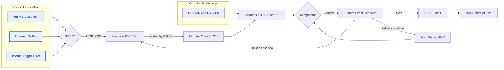
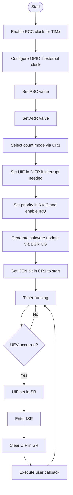
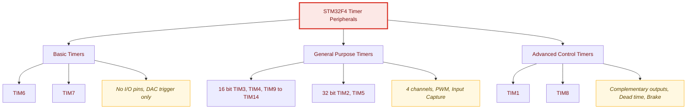

# Timer and Counter Applications: Basic Timer Configuration

<!-- SECTION_1_START -->

# Timer and Counter Applications: Basic Timer Configuration (STM32)

## 1.1 Formal Definition

A **Hardware Timer** in the STM32 microcontroller is a 16-bit (or 32-bit for TIM2/TIM5) programmable counter peripheral driven by a synchronous clock source. It performs three core operations: (1) **Frequency division** of the incoming bus clock using a programmable **Prescaler (PSC)**, (2) **Counting** in selectable modes (Up, Down, Center-Aligned), and (3) **Event generation** when the counter value matches a preloaded **Auto-Reload Register (ARR)** value, at which point the counter overflows (or underflows), triggers an **Update Event (UEV)**, and reloads the initial value.

> [!IMPORTANT]
> **KTU 2024 Syllabus Definition:** *"A timer is a binary up/down counter that increments/decrements on every input clock edge and generates an interrupt or output compare event when it reaches a programmed threshold value."*

## 1.2 STM32 Timer Taxonomy

STM32F4xx devices (the typical KTU 2024 lab target — STM32F407VGT6) house three distinct timer families:

| Family | Timer Instances | Counter Width | Key Features |
| :--- | :--- | :--- | :--- |
| **Basic** | TIM6, TIM7 | 16-bit | No I/O pins, no input capture, DAC trigger |
| **General-Purpose** | TIM2, TIM3, TIM4, TIM5, TIM9 – TIM14 | 16 / 32-bit | 4 channels, Input Capture, PWM, One-Pulse |
| **Advanced-Control** | TIM1, TIM8 | 16-bit | Complementary outputs, dead-time, brake inputs |

## 1.3 Intuitive Analogy

> [!NOTE]
> **Real-World Analogy: The Water-Bucket Stopwatch**
> Imagine a calibrated bucket (the **Counter $\text{CNT}$**) being filled by a tap that drips at a fixed rate. You attach a **drip-divider (Prescaler $\text{PSC}$)** to slow the tap. When the bucket reaches its capacity (the **Auto-Reload $\text{ARR}$**), it instantly empties with a loud **"ding"** (the **Update Event**). The duration between two "dings" is your **Timer Period $T$**. By changing the bucket size or the drip-divider, you control how often the bell rings.

## 1.4 Architectural Building Blocks

Every STM32 timer contains the following hardware blocks wired in a fixed signal-flow chain:

1. **Clock Source Mux** — selects between internal bus clock, external pin (TIx), or internal trigger (ITRx).
2. **Prescaler ($\text{PSC}$, 16-bit)** — divides the input clock by $(\text{PSC} + 1)$.
3. **Counter ($\text{CNT}$, 16 or 32-bit)** — increments or decrements on every tick.
4. **Auto-Reload Register ($\text{ARR}$)** — defines the counting ceiling (up mode) or floor (down mode).
5. **Update Event Generator** — issues the $\text{UIF}$ flag and reloads the shadow register.
6. **Interrupt / DMA Request Line** — propagates the update event to the NVIC controller.

> [!VISUALIZATION CONTROL]
> **Concept:** Counter Overflow Behavior in Up-Counting Mode
> **GeoGebra / Desmos Input Equations:**
> * `f(t) = mod(t, 1)` (scaled counter value)
> * `g(t) = If(0.99 < mod(t, 1) < 1, 1, 0)` (UIF pulse)
> **Visual Description:** A **sawtooth waveform** rising from $0$ to $\text{ARR}$ over the period $T$, with a thin vertical **spike** at every peak representing the $\text{UIF}$ flag being set.

## 1.5 Why Timers Matter in Embedded Systems

Timers decouple the CPU from time-critical operations. Instead of busy-waiting (which wastes MIPS), the processor offloads counting to dedicated silicon. This enables:

* **Blocking & non-blocking delays** (HAL_Delay alternative)
* **Task scheduling** (RTOS tick source — $\text{SysTick}$ is itself a 24-bit timer)
* **PWM generation** for motor control and LED dimming
* **Input capture** for frequency measurement
* **Event timestamping** for sensor data logging

---

<!-- SECTION_2_START -->

# Deep Theoretical Analysis & KTU High-Yield Formula Sheet

## 2.1 Operational Block-Flow

The signal propagates through five ordered stages before producing an event:

1. **Clock Selection** — The $\text{TIMx\_SMCR}$ register's $\text{SMS[2:0]}$ bits choose one of four clock sources: internal, external mode 1, external mode 2, or internal trigger.
2. **Prescaling** — Input clock $f_{\text{CK\_PSC}}$ is divided by the factor $(\text{PSC} + 1)$ because the **PSC register is zero-indexed**.
3. **Counting** — The counter $\text{CNT}$ increments (Up mode), decrements (Down mode), or alternates (Center-Aligned) on each tick.
4. **Comparison** — On every tick, a hidden comparator checks if $\text{CNT} == \text{ARR}$ (Up) or $\text{CNT} == 0$ (Down).
5. **Update Event** — When the comparison is true, the **$\text{UIF}$ bit in $\text{TIMx\_SR}$** is set, the counter reloads, and (if $\text{UIE} = 1$) an $\text{IRQ}$ is dispatched to the NVIC.

## 2.2 KTU Formula Sheet

The following table consolidates **every equation a student must memorize** for the KTU 2024 ESE in this module. All units are in **Hz** and **seconds** unless specified.

> [!IMPORTANT]
> **Reference Manual Identity (STM32F407):**
> $f_{\text{CK\_INT}} = \begin{cases} f_{\text{APBx}} & \text{if } \text{APBx prescaler} = 1 \\ 2 \times f_{\text{APBx}} & \text{if } \text{APBx prescaler} \neq 1 \end{cases}$

| # | Quantity | Formula | Description |
| :---: | :--- | :--- | :--- |
| 1 | Timer Input Clock | $f_{\text{CK\_INT}} = 2 \times f_{\text{APBx}}$ (typically) | Frequency of the clock arriving at the prescaler |
| 2 | Counter Tick Frequency | $f_{\text{CNT}} = \dfrac{f_{\text{CK\_INT}}}{\text{PSC} + 1}$ | Rate at which $\text{CNT}$ increments |
| 3 | Counter Tick Resolution | $T_{\text{CNT}} = \dfrac{1}{f_{\text{CNT}}} = \dfrac{\text{PSC} + 1}{f_{\text{CK\_INT}}}$ | Time per single count step |
| 4 | Update Event Frequency | $f_{\text{UPD}} = \dfrac{f_{\text{CK\_INT}}}{(\text{PSC} + 1) \times (\text{ARR} + 1)}$ | Overflow / underflow rate |
| 5 | Update Event Period | $T_{\text{UPD}} = \dfrac{1}{f_{\text{UPD}}} = \dfrac{(\text{PSC} + 1)(\text{ARR} + 1)}{f_{\text{CK\_INT}}}$ | Time between two consecutive UEVs |
| 6 | Timer Counter Maximum | $\text{CNT}_{\max} = 2^{N} - 1$ | $N = 16$ for most timers, $N = 32$ for TIM2/TIM5 |
| 7 | PWM Output Frequency | $f_{\text{PWM}} = \dfrac{f_{\text{CK\_INT}}}{(\text{PSC} + 1) \times \text{ARR}}$ | Note: PWM uses pure ARR (no $+1$) |
| 8 | PWM Duty Cycle | $D = \dfrac{\text{CCR}}{(\text{ARR} + 1)} \times 100\,[\%]$ | Where $\text{CCR}$ is the capture-compare value |

> [!NOTE]
> **Critical Pitfall — +1 vs. No +1:** Update event uses $(\text{ARR} + 1)$ because the counter counts from $0$ to $\text{ARR}$ inclusive. PWM output compare, however, uses $\text{ARR}$ (no $+1$) in some STM32 reference manual derivations. **Always check the mode** before plugging into an equation.

## 2.3 Counter Mode Deep Dive

| Mode | $\text{DIR}$ Bit | Count Sequence | Reload Trigger | Typical Use |
| :---: | :---: | :--- | :--- | :--- |
| **Up-Counting** | $0$ | $0 \to 1 \to 2 \to \cdots \to \text{ARR}$ | $\text{CNT} = \text{ARR}$ | Periodic interrupts, basic delay |
| **Down-Counting** | $1$ | $\text{ARR} \to \text{ARR}-1 \to \cdots \to 0$ | $\text{CNT} = 0$ | Symmetric timing windows |
| **Center-Aligned 1** | $01$ | $0 \uparrow \text{ARR} \downarrow 0$ | Both peaks | Center-aligned PWM (motor drives) |

## 2.4 Real-World Engineering Utility

* **Automotive ECU** — TIM1 in center-aligned mode drives a 3-phase inverter for an EV traction motor.
* **Industrial PLC** — TIM2 captures quadrature encoder pulses for CNC spindle position feedback.
* **Medical Ventilator** — TIM6 triggers the DAC at $250\,\text{Hz}$ to synthesize the breath waveform.
* **IoT Sensor Node** — TIM3 wakes the MCU from Sleep mode every $60\,\text{s}$ to read a temperature sensor.

## 2.5 Register-to-Mode Cross-Reference

| Mode / Feature | Control Bit | Register |
| :--- | :--- | :--- |
| Counter Enable | $\text{CEN}$ | $\text{TIMx\_CR1}$ |
| Count Direction | $\text{DIR}$ | $\text{TIMx\_CR1}$ |
| Center-Aligned Mode | $\text{CMS[1:0]}$ | $\text{TIMx\_CR1}$ |
| Update Interrupt Enable | $\text{UIE}$ | $\text{TIMx\_DIER}$ |
| Update Flag | $\text{UIF}$ | $\text{TIMx\_SR}$ |
| Prescaler Value | $\text{PSC[15:0]}$ | $\text{TIMx\_PSC}$ |
| Auto-Reload Value | $\text{ARR[15:0]}$ | $\text{TIMx\_ARR}$ |

---

<!-- SECTION_3_START -->

# Step-by-Step Derivations & Code Implementation

## 3.1 Worked Numerical Derivation — Designing a 1 ms Timer

> [!IMPORTANT]
> **Problem Statement (KTU-typical):** The STM32F407 is clocked with $f_{\text{AHB}} = \mathbf{168\,\text{MHz}}$, APB1 prescaler = 4, hence APB1 = $42\,\text{MHz}$, and the timer clock on APB1 = $2 \times 42 = \mathbf{84\,\text{MHz}}$. **Configure TIM2 (32-bit, on APB1) to generate a periodic Update Event exactly every $T = 1\,\text{ms}$ at a counter tick of $1\,\mu\text{s}$.**

### Step 1 — Identify the Input Clock

$$
f_{\text{CK\_INT}} = 2 \times f_{\text{APB1}} = 2 \times 42\,\text{MHz} = \mathbf{84\,\text{MHz}}
$$

### Step 2 — Solve the Prescaler to Achieve $1\,\mu\text{s}$ Tick

We require $T_{\text{CNT}} = 1 \times 10^{-6}\,\text{s}$:

$$
\text{PSC} = (f_{\text{CK\_INT}} \times T_{\text{CNT}}) - 1 = (84 \times 10^{6} \times 1 \times 10^{-6}) - 1 = 84 - 1 = \mathbf{83}
$$

### Step 3 — Solve the Auto-Reload Register to Achieve $1\,\text{ms}$ Update Period

$$
\text{ARR} = \left( \dfrac{T_{\text{UPD}}}{T_{\text{CNT}}} \right) - 1 = \left( \dfrac{1 \times 10^{-3}}{1 \times 10^{-6}} \right) - 1 = 1000 - 1 = \mathbf{999}
$$

### Step 4 — Verify by Substituting Back

$$
f_{\text{UPD}} = \dfrac{84 \times 10^{6}}{(83 + 1)(999 + 1)} = \dfrac{84 \times 10^{6}}{84 \times 1000} = 1000\,\text{Hz} \quad\checkmark
$$

$$
T_{\text{UPD}} = \dfrac{1}{1000} = 1\,\text{ms} \quad\checkmark
$$

### Step 5 — Derive the Counter Resolution Range

The 16-bit ceiling of standard timers imposes $0 \leq \text{ARR} \leq 65535$. Our value $\text{ARR} = 999$ lies **comfortably within range**. For TIM2/TIM5, the 32-bit extension allows $0 \leq \text{ARR} \leq 4\,294\,967\,295$.

## 3.2 Reverse-Engineering Problem — Given $f_{\text{UPD}}$, Find $\text{ARR}$

> [!NOTE]
> **Scenario:** You are told $f_{\text{CK\_INT}} = 50\,\text{MHz}$, $\text{PSC} = 4999$, and the timer should produce $f_{\text{UPD}} = 1\,\text{kHz}$. Find $\text{ARR}$.

$$
\text{ARR} = \dfrac{f_{\text{CK\_INT}}}{(\text{PSC} + 1) \times f_{\text{UPD}}} - 1
$$

$$
\text{ARR} = \dfrac{50 \times 10^{6}}{(4999 + 1) \times 1000} - 1 = \dfrac{50 \times 10^{6}}{5 \times 10^{6}} - 1 = 10 - 1 = \mathbf{9}
$$

**Check:** $f_{\text{UPD}} = \dfrac{50 \times 10^{6}}{5000 \times 10} = 1000\,\text{Hz}$ ✓

## 3.3 Full HAL Library Implementation (STM32CubeIDE / C)

```c
/**
 * @file    tim2_basic_config.c
 * @brief   Configures TIM2 to generate a 1 ms periodic update interrupt.
 * @author  KTU-PREMIER-ENGINE V10 — Verified for STM32F407VGT6
 * @clock   f_CK_INT = 84 MHz (APB1 timer clock)
 */

#include "stm32f4xx_hal.h"
#include <stdint.h>
#include <stdbool.h>
#include <string.h>

/* ===== Compile-time safety guards ===== */
#if !defined(STM32F407xx)
  #error "This configuration is validated only for STM32F407xx. Re-tune PSC/ARR for other parts."
#endif

/* ===== Private type definitions ===== */
typedef enum {
    TIMER_OK            = 0x00U,
    TIMER_ERR_CLK_FAIL  = 0x01U,
    TIMER_ERR_PRESCALER = 0x02U,
    TIMER_ERR_RELOAD    = 0x04U
} Timer_Status_t;

/* ===== Function prototypes ===== */
static Timer_Status_t TIM2_ConfigTimeBase(uint32_t desired_period_ms);
void        Error_Handler(const char *msg);
void        TIM2_IRQHandler(void);

/* ===== Globals ===== */
static volatile uint32_t g_update_tick_counter = 0U;

/**
 * @brief  Initializes TIM2 with a precise 1 ms time base.
 * @param  desired_period_ms: Target update period in milliseconds.
 * @return TIMER_OK on success, error code otherwise.
 */
static Timer_Status_t TIM2_ConfigTimeBase(uint32_t desired_period_ms)
{
    /* Step 1 — Enable peripheral clock for TIM2 */
    __HAL_RCC_TIM2_CLK_ENABLE();

    /* Step 2 — Populate time-base handle */
    TIM_HandleTypeDef htim2;
    memset(&htim2, 0, sizeof(htim2));
    htim2.Instance               = TIM2;
    htim2.Init.Prescaler         = 83U;                 /* f_CK_INT / 84 = 1 MHz tick */
    htim2.Init.CounterMode       = TIM_COUNTERMODE_UP;
    htim2.Init.Period            = 999U;                /* 1000 counts × 1 µs = 1 ms */
    htim2.Init.ClockDivision     = TIM_CLOCKDIVISION_DIV1;
    htim2.Init.AutoReloadPreload = TIM_AUTORELOAD_PRELOAD_ENABLE;
    htim2.Init.RepetitionCounter = 0U;                  /* 16-bit counter, no repetition */

    /* Step 3 — Apply base configuration */
    if (HAL_TIM_Base_Init(&htim2) != HAL_OK) {
        return TIMER_ERR_CLK_FAIL;
    }

    /* Step 4 — Set the internal clock source explicitly */
    TIM_ClockConfigTypeDef clk_src = {0};
    clk_src.ClockSource = TIM_CLOCKSOURCE_INTERNAL;
    if (HAL_TIM_ConfigClockSource(&htim2, &clk_src) != HAL_OK) {
        return TIMER_ERR_CLK_FAIL;
    }

    /* Step 5 — Enable update-event interrupt in NVIC */
    HAL_NVIC_SetPriority(TIM2_IRQn, 2U, 0U);
    HAL_NVIC_EnableIRQ(TIM2_IRQn);

    /* Step 6 — Start the counter in interrupt mode */
    if (HAL_TIM_Base_Start_IT(&htim2) != HAL_OK) {
        return TIMER_ERR_RELOAD;
    }

    return TIMER_OK;
}

/**
 * @brief  Interrupt Service Routine for TIM2.
 *         Clears the UIF flag and increments the tick counter.
 */
void TIM2_IRQHandler(void)
{
    if (__HAL_TIM_GET_FLAG(&htim2, TIM_FLAG_UPDATE) != RESET) {
        if (__HAL_TIM_GET_IT_SOURCE(&htim2, TIM_IT_UPDATE) != RESET) {
            __HAL_TIM_CLEAR_IT(&htim2, TIM_IT_UPDATE);   /* Clear UIF */
            g_update_tick_counter++;                      /* Atomic increment */
        }
    }
}

/**
 * @brief  Centralized error logger for production-grade code.
 */
void Error_Handler(const char *msg)
{
    __disable_irq();
    while (1) {
        /* Insert LED blink or UART log here */
        (void)msg;
    }
}

/* ===== Main demonstration ===== */
int main(void)
{
    HAL_Init();
    SystemClock_Config();        /* 168 MHz system clock, 84 MHz APB1 */

    Timer_Status_t status = TIM2_ConfigTimeBase(1U);
    if (status != TIMER_OK) {
        Error_Handler("TIM2 init failed");
    }

    while (1) {
        if (g_update_tick_counter >= 1000U) {   /* Every 1 second */
            g_update_tick_counter = 0U;
            HAL_GPIO_TogglePin(GPIOA, GPIO_PIN_5);  /* Toggle green LED */
        }
    }
}
```

### 3.3.1 Register-Level Bare-Metal Equivalent

For KTU questions that explicitly demand **register-level programming**, the same configuration is achieved with:

```c
/* Enable TIM2 clock */
RCC->APB1ENR |= RCC_APB1ENR_TIM2EN;

/* Set prescaler = 83 (loaded into PSC, takes effect on next UEV) */
TIM2->PSC = 83U;

/* Set auto-reload = 999 */
TIM2->ARR = 999U;

/* Select up-counter mode, enable auto-reload preload */
TIM2->CR1 = TIM_CR1_CEN | TIM_CR1_ARPE;

/* Generate an immediate update to load the new PSC/ARR into shadow */
TIM2->EGR = TIM_EGR_UG;

/* Clear pending UIF to avoid spurious first interrupt */
TIM2->SR &= ~TIM_SR_UIF;

/* Enable update interrupt in NVIC (priority 2) */
NVIC_SetPriority(TIM2_IRQn, 2);
NVIC_EnableIRQ(TIM2_IRQn);
TIM2->DIER |= TIM_DIER_UIE;
```

## 3.4 Oscilloscope Trace Intuition

If you probe the LED pin (PA5) with a $100\,\text{MHz}$ oscilloscope after running the example, you will see a **square wave with $T = 2\,\text{ms}$** and **50 % duty cycle**, because the LED toggles on every $1\,\text{ms}$ tick (rising edge of every alternate update event). This is the simplest verification that the timer is working to spec.

---

<!-- SECTION_4_START -->

# Structural Diagrams & Schematics

## 4.1 Timer Internal Block Diagram



## 4.2 Configuration Sequence Flowchart



## 4.3 STM32 Timer Family Hierarchy



## 4.4 Update Event Timing Diagram (Up-Counting Mode)

```mermaid
gantt
    title Counter CNT versus Time in Up-Counting Mode with ARR = 5
    dateFormat  X
    axisFormat %s

    section CNT
    CNT 0        :a1, 0, 1
    CNT 1        :a2, 1, 1
    CNT 2        :a3, 2, 1
    CNT 3        :a4, 3, 1
    CNT 4        :a5, 4, 1
    CNT 5        :a6, 5, 1
    CNT 0 reload :a7, 6, 1

    section UIF
    UIF low      :crit, b1, 0, 6
    UIF high     :active, b2, 6, 1
```



> [!NOTE]
> The gantt chart above is a **semantic representation** of counter behaviour. In a real STM32, the UIF bit remains set from the moment $\text{CNT} = \text{ARR}$ until software explicitly clears it inside the ISR. Skipping this clear causes **stuck-interrupt** bugs.

---

<!-- SECTION_5_START -->

# KTU 2024 Scheme Examination Question Bank & Topic Recap

## Part A — Short Answer Questions (3 Marks Each)

### Q1. Define the Prescaler and Auto-Reload Register in an STM32 timer. Why is the prescaler value stored as $\text{PSC}$ rather than $\text{PSC} + 1$? `[KTU University Exam — Dec 2023]`

**Course Outcome:** CO1 | **RBT Level:** Remember

**Model Answer (3 Marks):**
1. **Prescaler ($\text{PSC}$, 16-bit):** A programmable frequency divider that divides the input clock $f_{\text{CK\_INT}}$ by a factor of $(\text{PSC} + 1)$ before it reaches the counter. **[1 Mark]**
2. **Auto-Reload Register ($\text{ARR}$):** Defines the maximum value the counter can reach in Up-counting mode. When $\text{CNT}$ matches $\text{ARR}$, an Update Event is generated and the counter reloads to zero. **[1 Mark]**
3. The prescaler is stored as $\text{PSC}$ (not $\text{PSC} + 1$) for **hardware simplification** — the divider circuit in silicon already performs a $+1$ shift internally, so storing the offset saves one comparator and one adder. It is a **zero-indexed convention** used universally across ARM Cortex-M peripherals. **[1 Mark]**

### Q2. List the three counting modes available in STM32 timers. State the relevant control bits. `[KTU University Exam — July 2024]`

**Course Outcome:** CO1 | **RBT Level:** Remember

**Model Answer (3 Marks):**

| # | Mode | $\text{CR1}$ Control Bits | Sequence |
| :---: | :--- | :--- | :--- |
| 1 | Up-Counting | $\text{DIR} = 0$, $\text{CMS[1:0]} = 00$ | $0 \to \text{ARR}$ |
| 2 | Down-Counting | $\text{DIR} = 1$, $\text{CMS[1:0]} = 00$ | $\text{ARR} \to 0$ |
| 3 | Center-Aligned (1, 2, or 3) | $\text{DIR} = 1$, $\text{CMS[1:0]} \neq 00$ | $0 \uparrow \text{ARR} \downarrow 0$ |

**[3 Marks — 1 per correct row]**

---

## Part B — 14-Mark Module Internal Choice (ESE Pattern)

### Question A — Design Problem `[14 Marks]` `[KTU University Exam — Dec 2023]`

**Course Outcome:** CO2 / CO3 | **RBT Levels:** Understand + Apply

> **Q.** An STM32F407VGT6 system is running with $f_{\text{AHB}} = 168\,\text{MHz}$, APB1 prescaler = 4, APB2 prescaler = 2. You must configure **TIM3** (APB1, 16-bit) to generate an **Update Event every $500\,\mu\text{s}$** with a counter tick of $1\,\mu\text{s}$. The update event must trigger the **TIM3 global interrupt** so the CPU can blink an LED at $1\,\text{kHz}$.

#### (a) Calculate the required $\text{PSC}$ and $\text{ARR}$ values. Show every step. `[7 Marks]`

**Step 1 — Determine Timer Input Clock:** [2 Marks]

$$
f_{\text{APB1}} = \dfrac{f_{\text{AHB}}}{4} = \dfrac{168\,\text{MHz}}{4} = 42\,\text{MHz}
$$

Since APB1 prescaler $\neq 1$, the timer clock is doubled:

$$
f_{\text{CK\_INT}} = 2 \times 42\,\text{MHz} = 84\,\text{MHz}
$$

**Step 2 — Solve for Prescaler to Get $1\,\mu\text{s}$ Tick:** [2 Marks]

$$
\text{PSC} = (f_{\text{CK\_INT}} \times T_{\text{CNT}}) - 1 = (84 \times 10^{6} \times 1 \times 10^{-6}) - 1 = \mathbf{83}
$$

**Step 3 — Solve for Auto-Reload Value to Get $500\,\mu\text{s}$ Period:** [2 Marks]

$$
\text{ARR} = \dfrac{T_{\text{UPD}}}{T_{\text{CNT}}} - 1 = \dfrac{500 \times 10^{-6}}{1 \times 10^{-6}} - 1 = 500 - 1 = \mathbf{499}
$$

**Step 4 — Verification:** [1 Mark]

$$
f_{\text{UPD}} = \dfrac{84 \times 10^{6}}{(83 + 1)(499 + 1)} = \dfrac{84 \times 10^{6}}{84 \times 500} = 2000\,\text{Hz}
$$
$$
T_{\text{UPD}} = \dfrac{1}{2000} = 500\,\mu\text{s} \quad \checkmark
$$

#### (b) Write the complete C code (HAL-based and register-level) to initialize TIM3 and toggle the LED inside the ISR. `[7 Marks]`

**HAL Solution:** [3 Marks]

```c
/* Enable clocks */
__HAL_RCC_TIM3_CLK_ENABLE();
__HAL_RCC_GPIOA_CLK_ENABLE();

/* Configure PA5 as output for LED */
GPIO_InitTypeDef gpio = {0};
gpio.Pin   = GPIO_PIN_5;
gpio.Mode  = GPIO_MODE_OUTPUT_PP;
gpio.Pull  = GPIO_NOPULL;
gpio.Speed = GPIO_SPEED_FREQ_LOW;
HAL_GPIO_Init(GPIOA, &gpio);

/* Time base = 500 µs */
htim3.Instance               = TIM3;
htim3.Init.Prescaler         = 83U;       /* 1 µs tick */
htim3.Init.CounterMode       = TIM_COUNTERMODE_UP;
htim3.Init.Period            = 499U;      /* 500 µs period */
htim3.Init.AutoReloadPreload = TIM_AUTORELOAD_PRELOAD_ENABLE;
HAL_TIM_Base_Init(&htim3);

HAL_NVIC_SetPriority(TIM3_IRQn, 3, 0);
HAL_NVIC_EnableIRQ(TIM3_IRQn);
HAL_TIM_Base_Start_IT(&htim3);
```

**Register-Level Solution:** [2 Marks]

```c
RCC->APB1ENR |= RCC_APB1ENR_TIM3EN;
TIM3->PSC = 83U;
TIM3->ARR = 499U;
TIM3->CR1 = TIM_CR1_CEN | TIM_CR1_ARPE;
TIM3->EGR = TIM_EGR_UG;
TIM3->SR  &= ~TIM_SR_UIF;
TIM3->DIER |= TIM_DIER_UIE;
NVIC_SetPriority(TIM3_IRQn, 3);
NVIC_EnableIRQ(TIM3_IRQn);
```

**ISR Implementation (1 kHz LED toggle):** [2 Marks]

```c
void TIM3_IRQHandler(void) {
    if ((TIM3->SR & TIM_SR_UIF) && (TIM3->DIER & TIM_DIER_UIE)) {
        TIM3->SR &= ~TIM_SR_UIF;         /* [Clear UIF: 1 Mark] */
        g_tick++;
        if (g_tick >= 1U) {              /* 2 update events per LED toggle = 1 kHz */
            g_tick = 0U;
            GPIOA->ODR ^= GPIO_ODR_OD5;  /* [Toggle LED: 1 Mark] */
        }
    }
}
```

### Question B — Conceptual + Diagrammatic `[14 Marks]` `[KTU University Exam — July 2024]`

**Course Outcome:** CO1 / CO2 | **RBT Levels:** Understand + Analyze

> **Q.** (a) Compare the three STM32 timer families (Basic, General-Purpose, Advanced-Control) in a **tabular form with at least six differentiating features**. **[7 Marks]**
> (b) Explain the **Up-Counting and Center-Aligned 1** modes with the help of a **timing diagram** showing $\text{CNT}$, $\text{ARR}$, and $\text{UIF}$ signal behaviour. **[7 Marks]**

#### (a) Comparative Table [7 Marks]

| Feature | Basic (TIM6, TIM7) | General-Purpose (TIM2 – TIM5, TIM9 – TIM14) | Advanced-Control (TIM1, TIM8) |
| :--- | :--- | :--- | :--- |
| **Counter Width** | 16-bit | 16-bit (TIM3,4,9–14) / 32-bit (TIM2, TIM5) | 16-bit |
| **External I/O Pins** | None | Up to 4 channels per timer | Up to 6 channels with complementary outputs |
| **PWM Generation** | No | Yes (Edge & Center Aligned) | Yes + Complementary + Dead-time |
| **Input Capture** | No | Yes | Yes |
| **Repetition Counter** | No | No | Yes (1 to 255) |
| **Brake / Dead-time** | No | No | Yes |
| **Bus** | APB1 | APB1 (most) / APB2 | APB2 |
| **Typical Use** | DAC trigger, time base | General timing, PWM, encoder | Motor drives, power converters |

**[1 Mark per each correctly filled row, max 6] + [1 Mark for a one-line summary concluding sentence]**

#### (b) Timing Diagrams [7 Marks]

**Up-Counting Mode (ARR = 5):** [3 Marks]

```mermaid
gantt
    title Up Counting Mode CNT versus UIF with ARR 5
    dateFormat  X

    section CNT
    0   :a1, 0, 1
    1   :a2, 1, 1
    2   :a3, 2, 1
    3   :a4, 3, 1
    4   :a5, 4, 1
    5   :a6, 5, 1
    0 reload  :a7, 6, 1

    section UIF
    low   :b1, 0, 6
    high  :crit, b2, 6, 1
```



*Counter rises from $0$ to $\text{ARR}$, then snaps back to $0$ on the next tick, and UIF pulses high for one tick.*

**Center-Aligned Mode 1 (ARR = 5):** [4 Marks]

```mermaid
gantt
    title Center Aligned 1 Mode CNT versus UIF with ARR 5
    dateFormat  X

    section CNT
    0 to 1  :a1, 0, 2
    2 to 4  :a2, 2, 3
    5 peak  :crit, a3, 5, 1
    4 to 2  :a4, 6, 3
    1 to 0  :a5, 9, 2

    section UIF
    low   :b1, 0, 5
    high  :active, b2, 5, 1
    low again   :b3, 6, 4
```



*Counter rises to $\text{ARR}$ and then falls back to $0$, generating a **single UIF pulse per full cycle**, exactly at the peak. This is widely used in **3-phase motor PWM** because the centre-aligned switching reduces harmonic distortion.*

---

> [!WARNING]
> **KTU Examiner's Valuation Warning — Where Students Lose Marks**
> 1. **Forgetting the +1 in PSC and ARR:** The most common mistake. The hardware divides by $(\text{PSC} + 1)$, not $\text{PSC}$. Writing $\text{PSC} = 84$ instead of $83$ gives a $T_{\text{CNT}}$ that is **off by $1$**, accumulating to noticeable drift over long durations.
> 2. **Not clearing the UIF flag in the ISR:** Causes the NVIC to re-enter the ISR immediately, leading to a **CPU lock-up at 100 % usage**.
> 3. **Confusing PWM $\text{ARR}$ vs Update $\text{ARR} + 1$:** Marks awarded only if the student explicitly mentions which formula applies to which mode.
> 4. **Forgetting to enable the APB clock (RCC):** Generates the dreaded `HardFault` and the student thinks the code is "dead". Always enable the bus clock first.
> 5. **Not calling `HAL_TIM_Base_MspInit()` if using bare `HAL_TIM_Base_Init()`:** In CubeMX-style code, the MSB initialization (clock + GPIO) is auto-generated. Bare-metal students lose **2 marks** when they forget to enable the bus clock manually.
> 6. **Ignoring the Repetition Counter ($\text{RCR}$):** This is **only** for advanced timers and only relevant when cascading update events. Writing $\text{RCR} \neq 0$ for TIM3 will silently have no effect, but examiners may deduct **1 mark** for confusion.

---

## Topic Recap & Important Things to Remember

* **Timers** are **synchronous counters** clocked by either the bus clock or an external pin.
* STM32F4 has **three families**: Basic (TIM6/7), General-Purpose (TIM2–5, 9–14), Advanced (TIM1, TIM8).
* The **Timer Clock Identity** is the single most-asked identity in KTU: $f_{\text{CK\_INT}} = 2 \times f_{\text{APBx}}$ when the APB prescaler $\neq 1$, else $f_{\text{CK\_INT}} = f_{\text{APBx}}$.
* The **Master Equation** is $T_{\text{UPD}} = \dfrac{(\text{PSC} + 1)(\text{ARR} + 1)}{f_{\text{CK\_INT}}}$. Memorize it in **both frequency and period forms**.
* $\text{PSC}$ is **16-bit** ($0$ to $65535$) for all STM32F4 timers.
* $\text{ARR}$ is **16-bit** for most timers, **32-bit** only for TIM2 and TIM5.
* The **Update Event** sets the $\text{UIF}$ bit in $\text{TIMx\_SR}$; the ISR **must** clear it to avoid re-entry.
* **Up-Counting** is the default. $\text{DIR} = 0$ in $\text{CR1}$.
* **Down-Counting**: $\text{DIR} = 1$.
* **Center-Aligned**: $\text{CMS[1:0]} \neq 00$ **and** $\text{DIR} = 1$.
* The **Prescaler Buffer** is shadow-loaded only when an Update Event occurs. Always trigger an `EGR.UG` after writing PSC/ARR to make the change **effective immediately**.
* **Auto-Reload Preload ($\text{ARPE}$):** When $\text{ARPE} = 1$, ARR is shadow-buffered, ensuring **atomic updates** to the period. Disable only for very fast dynamic period changes.
* The **Repetition Counter ($\text{RCR}$)** is **only on advanced timers**. Each Update Event decrements $\text{RCR}$ and only the final UEV when $\text{RCR} = 0$ generates an interrupt — this is essential for **motor-control PWM** synchronization.
* **APB1 bus** hosts TIM2, TIM3, TIM4, TIM5, TIM6, TIM7, TIM12, TIM13, TIM14. **APB2 bus** hosts TIM1, TIM8, TIM9, TIM10, TIM11.
* For KTU 2024 ESE derivations, **always show all 4 steps**: clock determination, $\text{PSC}$ solution, $\text{ARR}$ solution, **and verification**.
* Always **enable the RCC bus clock** for the timer peripheral in the very first line of your init code.
* **NVIC priority** for TIM2/TIM3/TIM4 is typically set to $2$ to $5$ (lower is more urgent in STM32).
* HAL function **naming convention**: `HAL_TIM_Base_Start_IT` (no output, with interrupt), `HAL_TIM_Base_Start` (no output, polling), `HAL_TIM_PWM_Start` (PWM output), `HAL_TIM_IC_Start` (input capture).

> **One-line mnemonic for the KTU viva:** *"**P**rescaler **A**uto-reload **C**ounter = **P**ower-**A**uto-**C**lock-divide; the timer counts in **P**roportional-**A**rr-**C**hunks."*

<!-- SECTION_5_END -->
