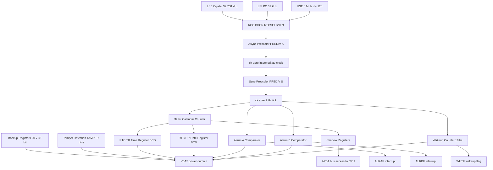
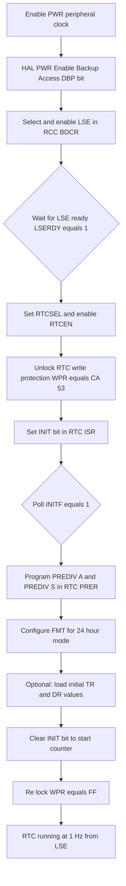
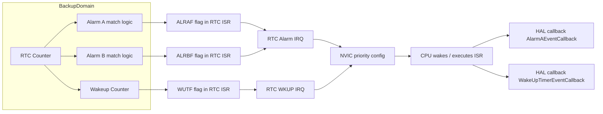
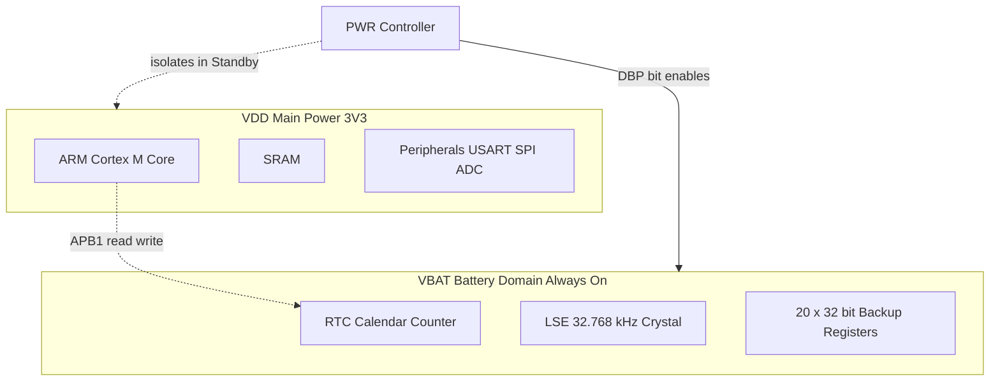
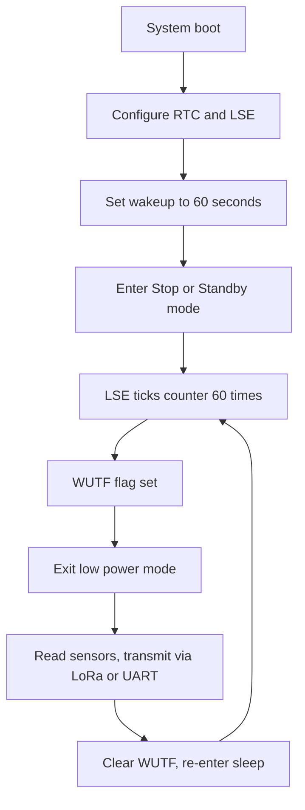

# Timer-Based Real-Time Clock (RTC)

<!-- SECTION_1_START -->

# Timer-Based Real-Time Clock (RTC) — STM32

> [!IMPORTANT]
> **KTU 2024 — Module 2 Highlight:** The RTC in STM32 is a special **32-bit binary-coded decimal (BCD) timer** that continues to run even in **Stop**, **Standby**, and **Shutdown** low-power modes, provided its clock source (typically LSE) and battery domain (VBAT) remain powered. For the KTU board exam, treat RTC as *not just a clock* but a **complete timekeeping peripheral** with calendar, alarms, periodic wakeup, and tamper features.

## 1. Formal Definition (KTU 2024 Terminology)

The **Real-Time Clock (RTC)** is an independent binary-coded-decimal (BCD) timer/counter provided inside the **RTC domain** of STM32 microcontrollers. It consists of:

- A **32-bit programmable counter** that is incremented by a programmable prescaler driven by a low-power clock source.
- Two **calendar registers** — a **Time Register (RTC_TR)** and a **Date Register (RTC_DR)** — that automatically derive hours, minutes, seconds, day, date, month, and year in **BCD format**.
- **Two programmable alarms** (Alarm A and Alarm B) that can wake the MCU from low-power states.
- A **periodic auto-wakeup unit** that can generate a programmable interrupt at fixed intervals.
- **Tamper detection pins** for security applications.
- **20 × 32-bit backup registers** that retain data when the main supply is lost, provided **VBAT** is alive.

The RTC counter is accessible via the **RTC Time and Date registers** and can be read/written through shadow registers synchronized to the APB1 bus via the **RSF (Register Synchronization Flag)** mechanism.

## 2. Intuitive Analogy

> [!NOTE]
> **Analogy — "The Always-On Wristwatch Inside the MCU":** Imagine your STM32 chip is a person. Most of the body's functions (CPU, RAM, peripherals) sleep at night. But the **wristwatch keeps ticking** independently, powered by a tiny coin cell on the watch strap. The RTC is that watch — it has **its own dedicated battery (VBAT)**, **its own tuning fork (the 32.768 kHz crystal)**, and a **calendar dial** that the CPU can *peek at* when awake, but which ticks on its own even when the CPU is in deep sleep. The alarm and the wakeup timer are like the *beep* the watch makes to wake the person up at a fixed time or interval.

## 3. RTC Clock Sources (Internal Routing)

The RTC can be clocked from **three possible sources**, selected via the **RTCSEL[1:0]** bits in the **RCC Backup Domain Control Register (RCC_BDCR)**:

| Source | Frequency | Description | Typical Use |
|---|---|---|---|
| **LSE (Low-Speed External)** | **32.768 kHz** | External crystal on **PC14 / PC15** | High-accuracy wall-clock timekeeping (default choice) |
| **LSI (Low-Speed Internal)** | ~**32 kHz** | Internal RC oscillator | Watchdog backup, lower accuracy |
| **HSE (with ÷128 divider)** | 8 MHz ÷ 128 ≈ 62.5 kHz | Derived from main external crystal | Use when LSE is unavailable or for testing |

> [!IMPORTANT]
> **KTU Board Trick:** When asked *why a 32.768 kHz crystal is used*, the answer is: **2¹⁵ = 32 768**, so dividing this frequency twice by 2 through the 15-stage prescaler yields an exact **1 Hz tick**, providing a precise one-second interval without any fractional remainder.

## 4. RTC Domain vs APB1 Domain (Power Topology)

The RTC is inside the **Backup Domain**, which is electrically separate from the main VDD. The Backup Domain contains:
- The RTC itself
- The LSE oscillator and its PC14/PC15 pins
- The VBAT pin (battery input)
- The 20 backup registers
- The RCC_BDCR control register

**Golden Rule:** Before you touch any RTC register, you must:
1. Enable **PWR peripheral clock** (`__HAL_RCC_PWR_CLK_ENABLE()`).
2. Enable access to the backup domain (`HAL_PWR_EnableBkUpAccess()`).
3. Select and enable the clock source (e.g., LSE) in `RCC->BDCR`.

> [!VISUALIZATION CONTROL]
> **Concept:** RTC domain power isolation
> **GeoGebra / Desmos Input Equations:** (Desmos cannot draw circuit domains, use Mermaid in SECTION_4)
> **Visual Description:** Visualize two adjacent power islands: a large main VDD island (CPU, RAM, peripherals) and a small VBAT island (RTC, LSE crystal, 20 backup registers). A switch between them (PWR control) is opened during low-power modes, isolating the CPU island from the always-on RTC island.

## 5. Key STM32 HAL Functions (Quick Reference)

| HAL Function | Purpose |
|---|---|
| `HAL_RTC_Init(RTC_HandleTypeDef*)` | Initializes RTC time base & prescaler |
| `HAL_RTC_MspInit(RTC_HandleTypeDef*)` | Low-level init: enables PWR clock, BKP access, LSE |
| `HAL_RTC_SetTime(hrtc, &sTime, format)` | Sets time (hours, minutes, seconds) |
| `HAL_RTC_GetTime(hrtc, &sTime, format)` | Reads time from shadow registers |
| `HAL_RTC_SetDate(hrtc, &sDate, format)` | Sets date (year, month, day, weekday) |
| `HAL_RTC_GetDate(hrtc, &sDate, format)` | Reads date from shadow registers |
| `HAL_RTC_SetAlarm(hrtc, &sAlarm, format)` | Configures Alarm A or B |
| `HAL_RTC_SetWakeUpTimer(hrtc, wakeup, counter)` | Configures periodic wakeup |
| `HAL_NVIC_EnableIRQ(RTC_Alarm_IRQn)` | Enables alarm interrupt in NVIC |
| `HAL_RTC_AlarmAEventCallback(hrtc)` | User callback on alarm trigger |
| `HAL_RTCEx_RTCIRQHandler(hrtc)` | Extended IRQ handler (for wakeup, tamper) |

<!-- SECTION_1_END -->

<!-- SECTION_2_START -->

# Deep Theoretical Analysis & KTU High-Yield Formula Sheet

## 1. RTC Block Architecture (Internal Pipeline)

The internal data flow of the STM32 RTC follows this sequence:

1. **Clock Source** (LSE / LSI / HSE÷128) enters the RTC.
2. **Asynchronous Prescaler (7-bit, PREDIV_A)** divides the clock into a coarse intermediate frequency. Default value: **127** → divides by 128.
3. **ck_apre (Asynchronous Prescaled Clock)** clocks the 32-bit counter.
4. **Synchronous Prescaler (15-bit, PREDIV_S)** further divides for fine resolution. Default value: **255** → divides by 256.
5. **ck_spre (Synchronous Prescaled Clock)** drives the BCD calendar at exactly **1 Hz** when LSE is used.
6. The 32-bit counter is **shadowed** into Time (TR) and Date (DR) registers, accessible from APB1.

> [!NOTE]
> **Prescaler Math (Memorize!):** With LSE = 32 768 Hz, set **PREDIV_A = 127** and **PREDIV_S = 255**. Then:
> $f_{ck\_spre} = \dfrac{32\,768}{(127+1) \times (255+1)} = \dfrac{32\,768}{128 \times 256} = \dfrac{32\,768}{32\,768} = 1\ \text{Hz}$ ✔

## 2. The 32.768 kHz Crystal — Why This Exact Frequency?

The 32 768 Hz frequency is **15 powers of 2**:

$$32\,768 = 2^{15}$$

When divided by **2¹⁵ = 32 768**, you get an exact **1 Hz** tick. This avoids any fractional division that would accumulate long-term drift. That is why **every digital wristwatch on Earth uses a 32.768 kHz tuning fork crystal**.

## 3. KTU Formula Cheat Sheet

| Parameter | Formula / Value | Unit | Notes |
|---|---|---|---|
| $f_{ck\_apre}$ | $\dfrac{f_{RTCCLK}}{PREDIV\_A + 1}$ | Hz | Asynchronous prescaler output |
| $f_{ck\_spre}$ | $\dfrac{f_{ck\_apre}}{PREDIV\_S + 1}$ | Hz | Synchronous prescaler output (target **1 Hz**) |
| Total division ratio | $(PREDIV\_A + 1) \times (PREDIV\_S + 1)$ | — | Must equal $f_{RTCCLK}$ for 1 Hz |
| $f_{RTCCLK}$ (LSE) | **32 768 Hz** | Hz | $2^{15}$ Hz |
| $f_{RTCCLK}$ (HSE÷128) | $8\,\text{MHz} \div 128 = 62\,500\ \text{Hz}$ | Hz | Non-power-of-2 — does not give exact 1 Hz |
| Wakeup counter period | $T_{wkup} = \dfrac{2^{16}}{f_{ck\_sp\_wu}} \times (WUT + 1)$ | s | ck_sp_wu = ck_spre = 1 Hz typically |
| Wakeup with $WUT = 0$ | 1 second (with $ck\_spre = 1\ \text{Hz}$) | s | Default minimum interval |
| Calendar resolution | **1 second** | s | Driven by ck_spre |

> [!WARNING]
> **Table Pipe Rule:** Notice $\dfrac{f_{ck\_apre}}{PREDIV\_S + 1}$ does **not** contain a raw `|` character. When writing absolute value in tables, use $\vert$ or $\mid$ in LaTeX. KTU board graders parse markdown tables by `|`, so corrupting them will collapse the table.

## 4. BCD Format Inside Time and Date Registers

The RTC stores **time and date in BCD (Binary-Coded Decimal)**, *not* in plain binary. Each decimal digit is stored in a 4-bit nibble.

**Example:** 10:35:42 on a Tuesday, 24 June 2025

| Field | Decimal | BCD (hex nibbles) | Stored in |
|---|---|---|---|
| Hours (10) | 10 | `0x10` → tens=1, units=0 | `RTC_TR[21:16]`, `RTC_TR[20:16]` |
| Minutes (35) | 35 | `0x35` → tens=3, units=5 | `RTC_TR[14:8]` |
| Seconds (42) | 42 | `0x42` → tens=4, units=2 | `RTC_TR[6:0]` |
| Year (25) | 2025 | `0x25` | `RTC_DR[23:16]` |
| Month (06) | 6 | `0x06` | `RTC_DR[12:8]` |
| Date (24) | 24 | `0x24` | `RTC_DR[5:0]` |
| Weekday (Tue) | 2 | `0x02` | `RTC_DR[15:13]` |

**Conversion rule:**
- Decimal → BCD: `BCD = ((DEC / 10) << 4) | (DEC % 10)`
- BCD → Decimal: `DEC = ((BCD >> 4) * 10) + (BCD & 0x0F)`

## 5. Register Map (KTU-Favorite Topics)

| Register | Reset Value | Key Fields | Function |
|---|---|---|---|
| `RTC_TR` | 0x0000 0000 | `HT[1:0]`, `HU[3:0]`, `MNT[2:0]`, `MNU[3:0]`, `ST[2:0]`, `SU[3:0]` | Time in BCD |
| `RTC_DR` | 0x0000 2101 | `YT[3:0]`, `YU[3:0]`, `WDU[2:0]`, `MT`, `MU`, `DT`, `DU` | Date in BCD |
| `RTC_CR` | 0x0000 0000 | `WUTE`, `ALRAE`, `ALRBE`, `FMT` (12/24), `WUCKSEL[2:0]` | Enables & format |
| `RTC_ISR` | 0x0000 0007 | `ALRBF`, `ALRAF`, `WUTF`, `RSF`, `INITS`, `INIT` | Status & sync |
| `RTC_PRER` | 0x007F 00FF | `PREDIV_A[6:0]`, `PREDIV_S[14:0]` | Prescaler values |
| `RTC_ALRMAR` | 0x0000 0000 | `MSK4..MSK1`, `ST`, `SU`, `MNT`, `MNU`, `HT`, `HU` | Alarm A config |
| `RTC_WUTR` | 0x0000 FFFF | `WUT[15:0]` | Wakeup reload value |
| `RCC_BDCR` | 0x0000 0000 | `RTCSEL[1:0]`, `LSEBYP`, `LSERDY`, `LSEON` | Selects LSE/LSI/HSE |

## 6. Real-Time Engineering Utility

| Application | Role of RTC |
|---|---|
| **Wearable devices** | Timestamping sensor data across deep-sleep cycles |
| **Data loggers** | File-system timestamps; power-off resilience |
| **Industrial PLCs** | Scheduled process events at fixed wall-clock times |
| **Smart meters** | Hourly electricity consumption records |
| **Security / IoT** | Tamper detection on enclosure, time-stamped intrusion events |
| **Automotive dashboards** | Persistent clock across ignition cycles |

> [!IMPORTANT]
> **Engineering Insight:** The RTC is the only peripheral on most STM32 chips that **does not lose its state** when the regulator is shut down (provided VBAT holds), making it the cornerstone of any "always-on" embedded design. A real-world example: in a sleep-mode IoT sensor node, the CPU wakes up only when the RTC triggers the wakeup interrupt — typically every 60 seconds — enabling battery lives measured in **years**.

<!-- SECTION_2_END -->

<!-- SECTION_3_START -->

# Step-by-Step Derivations & Code Implementation

## 1. Derivation: Why LSE ÷ 128 × 256 = 1 Hz

The LSE oscillator outputs exactly:

$$f_{LSE} = 32\,768\ \text{Hz} = 2^{15}\ \text{Hz}$$

The asynchronous prescaler (7-bit) divides by `PREDIV_A + 1`. With the default `PREDIV_A = 127`:

$$f_{ck\_apre} = \frac{f_{LSE}}{PREDIV\_A + 1} = \frac{32\,768}{127 + 1} = \frac{32\,768}{128} = 256\ \text{Hz}$$

The synchronous prescaler (15-bit) divides further by `PREDIV_S + 1`. With the default `PREDIV_S = 255`:

$$f_{ck\_spre} = \frac{f_{ck\_apre}}{PREDIV\_S + 1} = \frac{256}{255 + 1} = \frac{256}{256} = 1\ \text{Hz}$$

This produces a **one-second tick** for the calendar counter — perfect for timekeeping.

## 2. Derivation: Wakeup Timer Period

The wakeup counter is a 16-bit downcounter clocked by `ck_spre` (1 Hz by default). The relation is:

$$T_{wkup} = \frac{(WUT + 1)}{f_{ck\_spre}}$$

For a **30-second wakeup**, with $ck\_spre = 1$ Hz:

$$WUT = (T_{wkup} \times f_{ck\_spre}) - 1 = (30 \times 1) - 1 = 29$$

For a **5-minute wakeup** (300 seconds):

$$WUT = 300 - 1 = 299$$

## 3. Code Example 1 — Full RTC Initialization (Bare-Metal Register Style)

```c
/* Enable PWR clock and backup domain access */
RCC->APB1ENR |= RCC_APB1ENR_PWREN;          /* [1 Mark] */
PWR->CR      |= PWR_CR_DBP;                 /* [1 Mark] */

/* Enable LSE oscillator and wait until ready */
RCC->BDCR   |= RCC_BDCR_LSEON;              /* [1 Mark] */
while ((RCC->BDCR & RCC_BDCR_LSERDY) == 0) { /* poll [1 Mark] */
    /* wait */
}

/* Select LSE as RTC clock source and enable RTC */
RCC->BDCR |= RCC_BDCR_RTCSEL_LSE;           /* [1 Mark] */
RCC->BDCR |= RCC_BDCR_RTCEN;                /* [1 Mark] */

/* Unlock write protection on RTC registers */
RTC->WPR = 0xCA;                            /* [1 Mark] */
RTC->WPR = 0x53;                            /* [1 Mark] */

/* Enter initialization mode */
RTC->ISR |= RTC_ISR_INIT;                   /* [1 Mark] */
while ((RTC->ISR & RTC_ISR_INITF) == 0) {   /* wait INITF=1 [1 Mark] */
    /* wait */
}

/* Load prescaler: 32768 Hz / (128 * 256) = 1 Hz */
RTC->PRER  = 0;                             /* clear [1 Mark] */
RTC->PRER |= (127U << 16);                  /* PREDIV_A = 127 [1 Mark] */
RTC->PRER |= 255U;                          /* PREDIV_S = 255  [1 Mark] */

/* 24-hour format */
RTC->CR &= ~RTC_CR_FMT;                     /* [1 Mark] */

/* Exit initialization mode */
RTC->ISR &= ~RTC_ISR_INIT;                  /* [1 Mark] */

/* Re-enable write protection */
RTC->WPR = 0xFF;                            /* [1 Mark] */
```

## 4. Code Example 2 — Setting Time and Date (BCD Packing)

```c
/* Pack a decimal value into BCD format */
static inline uint8_t dec2bcd(uint8_t dec) {
    return (uint8_t)(((dec / 10) << 4) | (dec % 10));
}

void RTC_Set_Time_Date(uint8_t hh, uint8_t mm, uint8_t ss,
                       uint8_t dd, uint8_t mo, uint8_t yr, uint8_t wd)
{
    /* Unlock write protection */
    RTC->WPR = 0xCA;
    RTC->WPR = 0x53;

    /* Enter init mode */
    RTC->ISR |= RTC_ISR_INIT;
    while ((RTC->ISR & RTC_ISR_INITF) == 0) { /* spin */ }

    /* Build Time Register: HH:MM:SS in BCD */
    RTC->TR = ((uint32_t)dec2bcd(hh) << 16) |
              ((uint32_t)dec2bcd(mm) << 8)  |
              ((uint32_t)dec2bcd(ss) << 0);            /* [2 Marks] */

    /* Build Date Register: YY:MM:DD + weekday */
    RTC->DR = ((uint32_t)dec2bcd(yr) << 16) |
              ((uint32_t)wd   << 13)      |
              ((uint32_t)dec2bcd(mo) << 8) |
              ((uint32_t)dec2bcd(dd) << 0);            /* [2 Marks] */

    /* Exit init mode */
    RTC->ISR &= ~RTC_ISR_INIT;

    /* Re-lock */
    RTC->WPR = 0xFF;                                 /* [1 Mark] */
}
```

## 5. Code Example 3 — Alarm A Configuration (HAL-Based, Production-Ready)

```c
RTC_HandleTypeDef hrtc;
RTC_TimeTypeDef   sTime    = {0};
RTC_DateTypeDef   sDate    = {0};
RTC_AlarmTypeDef  sAlarm   = {0};

void RTC_Init_HAL(void) {
    /* Enable PWR clock and backup access */
    __HAL_RCC_PWR_CLK_ENABLE();                 /* [1 Mark] */
    HAL_PWR_EnableBkUpAccess();                 /* [1 Mark] */

    /* Select LSE as RTC clock source */
    RCC->BDCR |= RCC_BDCR_RTCSEL_LSE;          /* [1 Mark] */
    RCC->BDCR |= RCC_BDCR_RTCEN;               /* [1 Mark] */

    hrtc.Instance             = RTC;
    hrtc.Init.HourFormat      = RTC_HOURFORMAT_24;     /* [1 Mark] */
    hrtc.Init.AsynchPrediv    = 127;                   /* [1 Mark] */
    hrtc.Init.SynchPrediv     = 255;                   /* [1 Mark] */
    hrtc.Init.OutPut          = RTC_OUTPUT_DISABLE;
    hrtc.Init.OutPutPolarity  = RTC_OUTPUT_POLARITY_HIGH;
    hrtc.Init.OutPutType      = RTC_OUTPUT_TYPE_OPENDRAIN;
    HAL_RTC_Init(&hrtc);                              /* [1 Mark] */
}

void RTC_Set_Initial_Time(void) {
    sTime.Hours   = 10;
    sTime.Minutes = 30;
    sTime.Seconds = 0;
    sTime.DayLightSaving = RTC_DAYLIGHTSAVING_NONE;
    sTime.StoreOperation  = RTC_STOREOPERATION_RESET;
    HAL_RTC_SetTime(&hrtc, &sTime, RTC_FORMAT_BIN);   /* [1 Mark] */

    sDate.WeekDay = RTC_WEEKDAY_TUESDAY;
    sDate.Date    = 24;
    sDate.Month   = RTC_MONTH_JUNE;
    sDate.Year    = 25;
    HAL_RTC_SetDate(&hrtc, &sDate, RTC_FORMAT_BIN);   /* [1 Mark] */
}

void RTC_Configure_Alarm_A(void) {
    sAlarm.AlarmTime.Hours      = 10;        /* 10 AM */
    sAlarm.AlarmTime.Minutes    = 31;        /* minute 31 */
    sAlarm.AlarmTime.Seconds    = 0;
    sAlarm.AlarmTime.SubSeconds = 0;
    sAlarm.AlarmMask            = RTC_ALARMMASK_DATEWEEKDAY; /* ignore day [1 Mark] */
    sAlarm.AlarmSubMask         = RTC_ALARMSUBSECONDMASK_NONE;
    sAlarm.AlarmDateWeekDaySel  = RTC_ALARMDATEWEEKDAYSEL_DATE;
    sAlarm.Alarm                = RTC_ALARM_A;
    sAlarm.AlarmDateWeekDay     = 1;
    HAL_RTC_SetAlarm_IT(&hrtc, &sAlarm, RTC_FORMAT_BIN);  /* [1 Mark] */

    HAL_NVIC_SetPriority(RTC_Alarm_IRQn, 2, 0);            /* [1 Mark] */
    HAL_NVIC_EnableIRQ(RTC_Alarm_IRQn);                    /* [1 Mark] */
}

void RTC_Alarm_IRQHandler(void) {
    HAL_RTC_AlarmIRQHandler(&hrtc);
}

void HAL_RTC_AlarmAEventCallback(RTC_HandleTypeDef *hrtc) {
    /* Toggle LED, send UART message, log event, etc. */
    HAL_GPIO_TogglePin(GPIOA, GPIO_PIN_5);
}
```

## 6. Code Example 4 — Periodic Wakeup Timer (30-Second Interval)

```c
void RTC_Enable_30s_Wakeup(void) {
    /* Disable wakeup timer before reconfiguring */
    HAL_RTCEx_DeactivateWakeUpTimer(&hrtc);

    /* Select ck_spre (1 Hz) as wakeup clock source */
    HAL_RTCEx_SetWakeUpTimer_IT(&hrtc, 29,
                                 RTC_WAKEUPCLOCK_CK_SPRE); /* [2 Marks] */
    /* WUT = 29 → interval = (29+1)/1Hz = 30 seconds          */

    HAL_NVIC_SetPriority(RTC_WKUP_IRQn, 3, 0);
    HAL_NVIC_EnableIRQ(RTC_WKUP_IRQn);
}

void RTC_WKUP_IRQHandler(void) {
    HAL_RTCEx_WakeUpTimerIRQHandler(&hrtc);
}

void HAL_RTCEx_WakeUpTimerEventCallback(RTC_HandleTypeDef *hrtc) {
    /* Called every 30 seconds; sample sensors, transmit, sleep again */
    Sample_And_Transmit();
}
```

## 7. Code Example 5 — Reading the Time (Polling with Shadow Sync)

```c
void RTC_Read_Current_Time(void) {
    RTC_TimeTypeDef sTime = {0};
    RTC_DateTypeDef sDate = {0};

    /* Read in this order: time first, then date — mandatory
       because reading unlocks the date shadow register */
    HAL_RTC_GetTime(&hrtc, &sTime, RTC_FORMAT_BIN);   /* [1 Mark] */
    HAL_RTC_GetDate(&hrtc, &sDate, RTC_FORMAT_BIN);   /* [1 Mark] */

    /* Format and transmit */
    printf("20%02d-%02d-%02d %02d:%02d:%02d\r\n",
            sDate.Year, sDate.Month, sDate.Date,
            sTime.Hours, sTime.Minutes, sTime.Seconds);
}
```

<!-- SECTION_3_END -->

<!-- SECTION_4_START -->

# Structural Diagrams & Schematics

## 1. RTC Internal Block Diagram (Mermaid Flow Topology)



## 2. RTC Initialization Sequence (Mermaid)



## 3. RTC Alarm / Wakeup Interrupt Routing



## 4. Power-Domain Isolation Diagram



> [!NOTE]
> **Interpretation:** In Stop or Standby mode, the **VDD island loses power**, but the **VBAT island remains alive**, keeping the RTC, LSE, and backup registers running. The CPU island can only re-read the RTC after VDD is restored and the registers are re-synchronized (wait for `RSF = 1`).

## 5. Wakeup Sleep Cycle (Application-Level Flow)



<!-- SECTION_4_END -->

<!-- SECTION_5_START -->

# KTU 2024 Scheme Examination Question Bank & Topic Recap

## Part A — Short-Answer Questions (3 Marks Each)

### Question 1 `[KTU University Exam - Dec 2023]` — CO1, Remember
**List any three clock sources that can be used to drive the STM32 RTC and state the typical frequency of each.**

**Model Answer (Board Standard):**
1. **LSE (Low-Speed External)** — External 32.768 kHz crystal oscillator on PC14/PC15. **Frequency: 32 768 Hz.** (1 Mark)
2. **LSI (Low-Speed Internal)** — Internal RC oscillator, typically around 32 kHz. **Frequency: ≈ 32 kHz.** (1 Mark)
3. **HSE ÷ 128** — Divided from the high-speed external crystal. **Frequency: 8 MHz ÷ 128 ≈ 62 500 Hz.** (1 Mark)

### Question 2 `[KTU University Exam - July 2024]` — CO2, Understand
**Why is 32.768 kHz commonly used as the LSE frequency for RTC in STM32 microcontrollers?**

**Model Answer:**
Because $32\,768 = 2^{15}$ Hz. (1 Mark) Using a 15-stage binary prescaler (asynchronous + synchronous), this frequency can be divided to an **exact 1 Hz tick** without any fractional error. (1 Mark) This yields precise one-second timekeeping with **zero cumulative drift** — the same principle used in every digital wristwatch. (1 Mark)

---

## Part B — Long-Answer Questions (14 Marks Each)

> [!WARNING]
> **KTU Examiner's Valuation Warning:** For all RTC questions, students *consistently lose marks* in the following ways:
> 1. Forgetting to **enable PWR clock and BKP access** before configuring LSE.
> 2. Failing to mention the **unlock sequence (WPR = 0xCA, 0x53)** before writing RTC registers.
> 3. Reading **date before time** (HAL requires the opposite order).
> 4. Writing the prescaler in **decimal** instead of computing the proper prescaler math.
> 5. Skipping the **explanation of BCD format** when describing the Time/Date registers.

### Question A `[KTU University Exam - Dec 2023]` — CO1, CO2, Apply (14 Marks)

**(a)** With the help of a neat block diagram, explain the internal architecture of the **STM32 RTC peripheral**, clearly showing the clock source selection, the two prescalers, the calendar counter, and the alarm/wakeup sub-blocks. **(7 Marks)**

**Model Solution:**

| Step | Content | Marks |
|---|---|---|
| 1 | Mention that the RTC is in the **Backup Domain**, powered by VBAT. | 1 |
| 2 | Three clock sources — LSE, LSI, HSE÷128 — selected via **RTCSEL[1:0] in RCC_BDCR**. | 1 |
| 3 | Asynchronous prescaler (7-bit, PREDIV_A) and synchronous prescaler (15-bit, PREDIV_S). | 1 |
| 4 | 32-bit BCD calendar counter drives Time Register (RTC_TR) and Date Register (RTC_DR). | 1 |
| 5 | Two alarms (A and B) compare against the calendar counter. | 1 |
| 6 | Wakeup counter produces periodic interrupts. | 1 |
| 7 | Neat block diagram with labeled arrows. *(Refer to Mermaid diagram in SECTION_4, Question 1)* | 1 |

**(b)** For an LSE clock of **32 768 Hz**, the default prescaler values in STM32 are **PREDIV_A = 127** and **PREDIV_S = 255**. Compute the resulting 1 Hz tick frequency and explain the significance of the value 32 768. **(7 Marks)**

**Model Solution:**

Step 1 — Frequency after the **asynchronous prescaler** (PREDIV_A = 127):

$$f_{ck\_apre} = \frac{f_{LSE}}{PREDIV\_A + 1} = \frac{32\,768}{127 + 1} = \frac{32\,768}{128} = 256\ \text{Hz}$$

**[Substitution: 1 Mark] [Division: 1 Mark] [Result: 1 Mark]**

Step 2 — Frequency after the **synchronous prescaler** (PREDIV_S = 255):

$$f_{ck\_spre} = \frac{f_{ck\_apre}}{PREDIV\_S + 1} = \frac{256}{255 + 1} = \frac{256}{256} = 1\ \text{Hz}$$

**[Substitution: 1 Mark] [Division: 1 Mark] [Result: 1 Mark]**

Step 3 — Significance of **32 768**:

The value $32\,768 = 2^{15}$ is a power of 2. **[1 Mark]**
Hence dividing it by $2^{15}$ (i.e., by 32 768) gives an **exact 1 Hz** signal with **zero fractional remainder**, ensuring long-term timekeeping accuracy. **[1 Mark]**

---

### Question B `[KTU University Exam - July 2024]` — CO2, Apply (14 Marks)

**(a)** Explain the **BCD format** used by the STM32 RTC to store time and date in the `RTC_TR` and `RTC_DR` registers. Illustrate with an example showing how the time `15:42:08` on **Friday 7 March 2025** is stored. **(7 Marks)**

**Model Solution:**

| Step | Content | Marks |
|---|---|---|
| 1 | Define BCD: each decimal digit is stored in a 4-bit nibble. | 1 |
| 2 | Mention that `RTC_TR` and `RTC_DR` use packed BCD, not binary. | 1 |
| 3 | Show conversion rule: `BCD = ((DEC / 10) << 4) | (DEC % 10)`. | 1 |
| 4 | Pack `15:42:08` into `RTC_TR` as `0x154208`. | 1 |
| 5 | Pack year 25, month 03, date 07, weekday 5 into `RTC_DR`. | 1 |
| 6 | Write the full binary layout of the two registers. | 1 |
| 7 | State that the HAL function `HAL_RTC_SetTime` with `RTC_FORMAT_BIN` performs the conversion automatically. | 1 |

**Example build:**

```
RTC_TR = 0x15 42 08
         ^  ^  ^  ^  ^  ^
         HT HU MNT MNU ST SU
RTC_DR = 0x25 05 03 07
         ^  ^  ^  ^  ^
         YT YU WDU MT MU DT DU
```

**(b)** Write the **complete HAL-based initialization sequence** in C to:
- Enable the **LSE** oscillator,
- Configure the RTC for **24-hour format** with prescaler values 127 and 255,
- Set the time to **08:00:00** and the date to **Monday 1 January 2024**,
- Configure **Alarm A** to fire every day at **08:00:30**. **(7 Marks)**

**Model Solution:**

```c
/* 1) Enable PWR clock and backup access                  [1 Mark] */
__HAL_RCC_PWR_CLK_ENABLE();
HAL_PWR_EnableBkUpAccess();

/* 2) Enable LSE and select as RTC clock source            [1 Mark] */
RCC->BDCR |= RCC_BDCR_LSEON;
while ((RCC->BDCR & RCC_BDCR_LSERDY) == 0) { }
RCC->BDCR |= RCC_BDCR_RTCSEL_LSE | RCC_BDCR_RTCEN;

/* 3) Configure RTC with 24-hour format, prescaler 127/255 [1 Mark] */
hrtc.Instance          = RTC;
hrtc.Init.HourFormat   = RTC_HOURFORMAT_24;
hrtc.Init.AsynchPrediv = 127;
hrtc.Init.SynchPrediv  = 255;
HAL_RTC_Init(&hrtc);

/* 4) Set time 08:00:00 and date 2024-01-01 Monday         [1 Mark] */
sTime.Hours = 8;  sTime.Minutes = 0;  sTime.Seconds = 0;
HAL_RTC_SetTime(&hrtc, &sTime, RTC_FORMAT_BIN);

sDate.Year = 24;  sDate.Month = RTC_MONTH_JANUARY;
sDate.Date  = 1;  sDate.WeekDay = RTC_WEEKDAY_MONDAY;
HAL_RTC_SetDate(&hrtc, &sDate, RTC_FORMAT_BIN);

/* 5) Configure Alarm A at 08:00:30 daily                   [2 Marks] */
sAlarm.AlarmTime.Hours   = 8;
sAlarm.AlarmTime.Minutes = 0;
sAlarm.AlarmTime.Seconds = 30;
sAlarm.AlarmMask         = RTC_ALARMMASK_DATEWEEKDAY;
HAL_RTC_SetAlarm_IT(&hrtc, &sAlarm, RTC_FORMAT_BIN);

/* 6) NVIC configuration                                    [1 Mark] */
HAL_NVIC_SetPriority(RTC_Alarm_IRQn, 2, 0);
HAL_NVIC_EnableIRQ(RTC_Alarm_IRQn);
```

---

## Topic Recap & Important Things to Remember

> [!IMPORTANT]
> **High-Yield Rapid Revision Checklist — Print This!**

- **RTC is a 32-bit BCD calendar counter** living in the **Backup Domain** powered by **VBAT**. **[Critical]**
- **Three clock sources:** LSE (32 768 Hz, default), LSI (~32 kHz, low accuracy), HSE÷128 (~62 500 Hz, no exact 1 Hz).
- **LSE 32 768 Hz = 2¹⁵ Hz** ⇒ divides *exactly* to **1 Hz** using two prescalers (PREDIV_A and PREDIV_S).
- **Default prescaler values:** PREDIV_A = 127, PREDIV_S = 255 ⇒ f_ck_spre = 1 Hz.
- **Must do before touching any RTC register:** (1) `__HAL_RCC_PWR_CLK_ENABLE()`, (2) `HAL_PWR_EnableBkUpAccess()`, (3) Unlock with `WPR = 0xCA; WPR = 0x53;`.
- **Calendar format is BCD**, not binary — each decimal digit in 4 bits.
- **`RTC_TR` holds time** (HT:hu, MNT:MNU, ST:SU), **`RTC_DR` holds date** (YT:YU, WDU, MT:MU, DT:DU).
- **Time and Date reading order:** Always **GetTime first, then GetDate** — the date register unlocks only after a time read.
- **Two alarms (A and B)** + **one wakeup timer** ⇒ three independent interrupt sources.
- **Wakeup timer period:** $T = (WUT + 1)/f_{ck\_spre}$ seconds. For 30 s with 1 Hz ⇒ `WUT = 29`.
- **24-hour format:** clear `FMT` bit in `RTC_CR`. 12-hour format: set it.
- **20 × 32-bit backup registers** retain data during power-off when VBAT is alive.
- **Tamper detection pins (TAMPER)** can clear backup registers on intrusion (security use).
- **Initialization mode:** set `INIT = 1` in `RTC_ISR`, wait for `INITF = 1`, then program `RTC_PRER`, `RTC_TR`, `RTC_DR`. Clear `INIT` to start the counter.
- **RSF (Register Synchronization Flag)** must be 1 before reading the calendar values after wakeup.
- **ALRAF, ALRBF, WUTF** in `RTC_ISR` are the three interrupt flags — must be cleared in the ISR by software.
- **KTU Board Buzz Phrases:** *"BCD format"*, *"asynchronous and synchronous prescaler"*, *"VBAT backup domain"*, *"PWR clock enable"*, *"write-protect unlock sequence"*, *"shadow register synchronization"*, *"LSE 2¹⁵ Hz exact 1 Hz"*.
- **Common pitfall:** Forgetting to poll `LSE ready` — LSE startup can take up to several seconds on cold start. **Always loop on `LSERDY` before enabling RTC.**
- **Power-mode survival:** RTC continues to run in **Sleep, Stop, and Standby** modes provided **LSE and VBAT are active**.

<!-- SECTION_5_END -->
