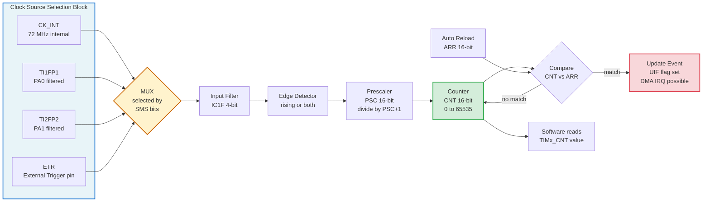
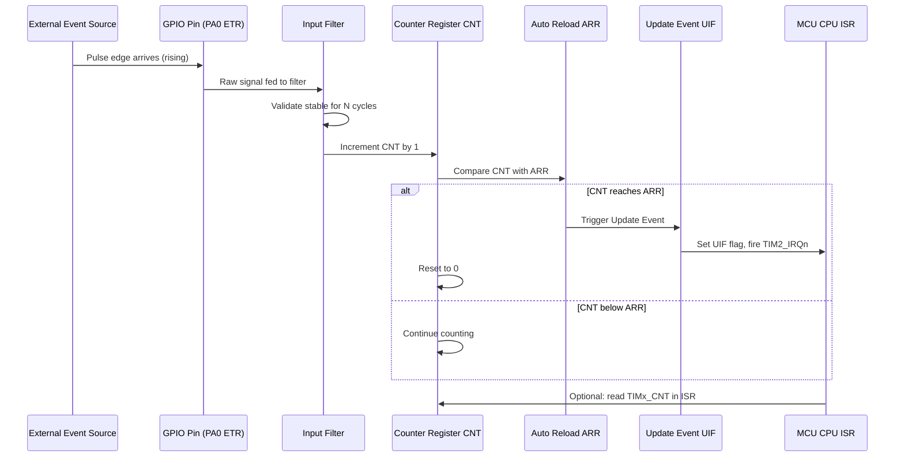
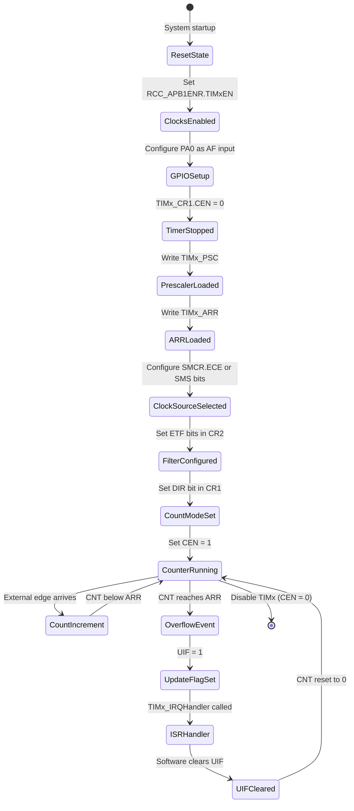

# Timers as Counters

<!-- SECTION_1_START -->
# 1. Core Technical Definition & Intuitive Overview

## 1.1 Formal Definition (KTU 2024 Syllabus Terminology)

> [!NOTE]
> **Timer as Counter (KTU 2024 Definition):** In STM32 microcontrollers, a *General-Purpose Timer* can operate in two functionally equivalent modes — as a **Timer** (driven by an *internal clock* CK_INT to generate precise time delays) or as a **Counter** (driven by *external events* applied to dedicated input pins such as **TI1**, **TI2**, or **ETR**). When configured to count external pulses, the timer is said to be acting "as a Counter," and the internal 16-bit register **TIMx_CNT** is incremented or decremented on every detected edge of the external trigger signal.

**Key Architectural Components of a STM32 General-Purpose Timer Block:**

| Block | Register | Role |
| :--- | :--- | :--- |
| **Clock Source Mux** | $TIMx\_SMCR$ | Selects CK_INT, TI1F_ED, TI1FP1, TI2FP2, ETR |
| **Prescaler (PSC)** | $TIMx\_PSC$ (16-bit) | Divides incoming clock by $PSC + 1$ |
| **Counter (CNT)** | $TIMx\_CNT$ (16-bit) | The heart — it actually increments/decrements |
| **Auto-Reload (ARR)** | $TIMx\_ARR$ (16-bit) | Defines the maximum count value (rollover point) |
| **Capture/Compare** | $TIMx\_CCRx$ | Stores latched CNT value on external edge |
| **Update Event** | $UIF$ flag in $TIMx\_SR$ | Fires when CNT overflows or matches a condition |

---

## 1.2 Conceptual Analogy / Plain-English Intuition

> [!IMPORTANT]
> **Analogy — "The Electronic Turnstile"**
> Imagine a **busy metro station turnstile** (the gate that swings open when you tap a card).
> - The **Prescaler (PSC)** is the *security guard* standing before the turnstile — he only lets through every Nth person. This *divides* the crowd flow.
> - The **Counter (CNT)** is the *clicking mechanical counter* attached on top of the turnstile — it records *how many people* have crossed, one click per permitted entry.
> - The **Auto-Reload Register (ARR)** is the *display max* on the counter — when the count reaches this number, it rolls back to 0 (just like a car odometer rolling from 99999 to 00000) and a *buzzer* (Update Event) goes off.
> - The **Clock Source** is what *triggers each click*: in "Timer" mode, an internal metronome ticks automatically; in "**Counter**" mode, the clicks are triggered by an *external event* — say, every time a person physically pushes the turnstile bar.

So: a **Timer counts time** (using an internal clock), while a **Counter counts events** (using external triggers). In STM32, the *same hardware* is reused for both purposes — only the **clock source selection** changes.

---

## 1.3 The Counter/Timer Toggle — Why It Matters

> [!TIP]
> **Most students confuse these two terms.** In the KTU board exam, if the question says "external pulses are given to a pin and the timer counts them," it is a **Counter Mode** problem. If it says "generate a delay of 1 ms using the system clock," it is a **Timer Mode** problem. The hardware is identical — only the **clock source multiplexer (SMS / ECE bits in TIMx_SMCR)** decides which role it plays.

**Physical Constants & Standard Metrics (KTU-Standard, to be memorized in bold):**

- **Default APB1 bus clock for TIM2–TIM7:** **$f_{CK\_INT} = 72$ MHz** (when SystemCoreClock = 72 MHz on STM32F103 Blue Pill).
- **Maximum counter resolution:** **16-bit** (range: **0 → 65535**, i.e., $2^{16} - 1$).
- **Timer clocks (CK_INT):** **TIM2, TIM3, TIM4** are on APB1 bus; their inputs are doubled (×2) by the RCC if APB1 prescaler ≠ 1, giving **72 MHz**.
- **Standard external input pins:** **PA0 (TIM2_ETR / TIM5_ETR)**, **PA1 (TIM2_CH1)**, **PA8 (TIM1_CH1)**, etc. — these are *Alternate Function (AF) push-pull* pins.

---

## 1.4 GeoGebra / Desmos Visualization (Counter Behaviour)

> [!VISUALIZATION CONTROL]
> **Concept:** Counter Up-Counting with Prescaler and Auto-Reload Boundary
> **GeoGebra / Desmos Input Equations:**
> - $f(x) = \text{mod}(x,\, 10)$ &nbsp; *(simulating CNT value with ARR = 9)*
> - Staircase points: $(n,\, \text{mod}(n, 10))$ for $n = 0, 1, 2, \ldots, 20$
> **Visual Description:** The student should observe a *staircase pattern* rising from 0 to 9, then **snapping back to 0** (rollover), repeating indefinitely. The horizontal step length corresponds to $PSC+1$ input clock pulses (each "step" of the staircase consumes one prescaled clock), and the *vertical drop* marks the **Update Event** (UIF flag sets here). This visualizes exactly how a hardware counter wraps around its ARR boundary.

---
<!-- SECTION_1_END -->

<!-- SECTION_2_START -->
# 2. Deep Theoretical Analysis & KTU High-Yield Formula Sheet

## 2.1 Operational Breakdown — How a Timer Becomes a Counter

When you ask a STM32 General-Purpose Timer (e.g., **TIM2**) to behave as a *Counter*, the following internal signal-flow chain is established:

### Step 1 — Clock Source Selection
By default, the counter is driven by the *internal bus clock* (CK_INT). To make it count *external events*, we must re-route the clock to one of the **four external trigger inputs**:

| Source | Pin | Select Bits (in $TIMx\_SMCR$) | Edge Sensitivity |
| :--- | :--- | :--- | :--- |
| **ETR (External Trigger)** | PA0 (for TIM2) | $ECE = 1$ in $TIMx\_SMCR$ | Rising/Falling/Both via $ETPS$ & $ETP$ |
| **TI1FP1** (filtered TI1) | PA0 (TIM2_CH1) | $SMS[2:0] = 111$ | Set in $TIMx\_CCER$ & $TIMx\_CCMR1$ |
| **TI2FP2** (filtered TI2) | PA1 (TIM2_CH2) | $SMS[2:0] = 110$ | Set in $TIMx\_CCER$ & $TIMx\_CCMR1$ |
| **TI1F_ED** (TI1 edge detector) | PA0 (TIM2_CH1) | $SMS[2:0] = 101$ | Counts *both* edges automatically |

### Step 2 — Optional Filtering
External signals are noisy. The **Input Filter** (configurable via $IC1F[3:0]$ in $TIMx\_CCMR1$) requires the signal to be stable for $N$ consecutive CK_INT clock cycles before accepting it as a valid edge. This *debounces* the input.

### Step 3 — Prescaling (Optional but Common)
The 16-bit **Prescaler** $PSC$ divides the trigger frequency by a factor of $(PSC + 1)$. For high-frequency input events, this is essential to avoid the 16-bit CNT overflowing too fast.

### Step 4 — The Counter Itself
The 16-bit register **$TIMx\_CNT$** increments (or decrements, depending on the **$DIR$ bit** in $TIMx\_CR1$) on each accepted, prescaled edge.

### Step 5 — Update Event Generation
When **$TIMx\_CNT$** reaches the boundary defined by **$TIMx\_ARR$**:
- In **Up-Counting mode** ($DIR = 0$): CNT resets to 0, sets the **UIF flag** in $TIMx\_SR$, and optionally fires a **DMA request** or an **interrupt (TIMx_IRQn)**.
- In **Down-Counting mode** ($DIR = 1$): CNT reloads from ARR, UIF sets.

---

## 2.2 The Three Counting Modes

> [!IMPORTANT]
> **KTU Board-Favourite Question:** "Explain the three counter modes of STM32 timers with diagrams." Memorize these three:

1. **Up-Counting Mode (Edge-Aligned, DIR = 0, CMS = 00)**
   - CNT goes 0 → 1 → 2 → ... → ARR → 0 (rollover).
   - UIF flag sets on the rollover transition.

2. **Down-Counting Mode (Edge-Aligned, DIR = 1, CMS = 00)**
   - CNT goes ARR → ARR−1 → ... → 1 → 0 → ARR (reload).
   - UIF flag sets when CNT reaches 0.

3. **Center-Aligned Mode (Up/Down, DIR = 1, CMS = 10 or 11)**
   - CNT goes 0 → ARR → 0 in a triangular waveform.
   - UIF flag can be set on *either* the up-count overflow *or* the down-count underflow, depending on $CMS$ bits.

---

## 2.3 KTU High-Yield Formula Sheet

> [!TIP]
> **Memorize this entire table — it appears in almost every KTU university exam question on timers.**

| Parameter | Formula / Definition | Units | Notes |
| :--- | :--- | :--- | :--- |
| **Counter Clock Frequency** | $f_{CK\_CNT} = \dfrac{f_{CK\_INT}}{(PSC + 1)}$ | Hz | $f_{CK\_INT}$ is the timer input clock (72 MHz typical) |
| **Update Event Frequency** | $f_{UE} = \dfrac{f_{CK\_INT}}{(PSC + 1)\,(ARR + 1)}$ | Hz | Rate at which the UIF flag fires |
| **Update Period (Timer Tick)** | $T_{UE} = \dfrac{(PSC + 1)\,(ARR + 1)}{f_{CK\_INT}}$ | seconds | The generated time delay |
| **Counter Resolution (Up Mode)** | $N_{counts} = ARR + 1$ | counts | Number of unique states from 0 to ARR |
| **External Events Counted (per overflow)** | $N_{events} = \dfrac{(PSC + 1) \times (ARR + 1)}{1}$ | events | Total external triggers between two UIFs |
| **Total Event Count (K overflows)** | $N_{total} = K \times (ARR + 1) - last\_CNT$ | events | Useful for events > 65535 using software counter |
| **Maximum Measurable Frequency** | $f_{max} = \dfrac{f_{CK\_INT}}{(PSC + 1)}$ | Hz | Sampling-theorem limited |
| **Prescaler Value to be Loaded** | $PSC = \dfrac{f_{CK\_INT}}{f_{CK\_CNT}} - 1$ | integer | Round down if $f_{CK\_INT}$ not exactly divisible |
| **ARR Value for Given Period** | $ARR = \dfrac{f_{CK\_INT} \times T_{UE}}{PSC + 1} - 1$ | integer | Use ceiling/floor based on error tolerance |

---

## 2.4 Real-World Engineering Utility

> [!IMPORTANT]
> **Where is "Timer as Counter" used in production engineering?**
> - **Industrial Automation:** Counting bottles on a conveyor belt (each bottle breaks an IR beam → pulse to ETR pin).
> - **Motor Encoders (Quadrature Decoding):** Counting pulses from a rotary encoder to compute motor RPM and shaft position.
> - **Energy Meters:** Counting pulses from a Hall-effect sensor attached to a utility meter (e.g., 1000 pulses/kWh).
> - **Anemometers / Flow Meters:** Counting pulses proportional to wind speed or fluid flow.
> - **Frequency Measurement:** Using **Input Capture** (a closely related peripheral mode) to measure the period between two external edges.
> - **Pedometers / Speedometers:** Counting step-induced vibrations via a piezo sensor producing voltage spikes.

In the **automotive industry**, STM32 timers in counter mode interface directly with **ABS wheel-speed sensors** and **crankshaft position sensors** — a critical KTU-industry link.

---
<!-- SECTION_2_END -->

<!-- SECTION_3_START -->
# 3. Step-by-Step Derivations & Code/Symbolic Implementation

## 3.1 Worked Derivation #1 — KTU-Style Numerical Problem

> **KTU-Style Question Statement:**
> *An STM32F103 system is clocked at $f_{CK\_INT} = 72$ MHz. The designer needs TIM2 to act as a counter that produces an Update Event (overflow flag) exactly every **1 millisecond**. Calculate the required values of the **Prescaler (PSC)** and **Auto-Reload (ARR)** registers, given the design constraint $PSC = 71$ (predefined).*

### Step-by-Step Derivation

We are given:
- $f_{CK\_INT} = 72 \text{ MHz} = 72 \times 10^6 \text{ Hz}$
- $T_{UE} = 1 \text{ ms} = 10^{-3} \text{ s}$
- $PSC = 71$ (given)

We need to find: $ARR$.

**From the Update Period formula:**

$$
T_{UE} = \frac{(PSC + 1) \times (ARR + 1)}{f_{CK\_INT}}
$$

**Substitute the known values:**

$$
10^{-3} = \frac{(71 + 1) \times (ARR + 1)}{72 \times 10^6}
$$

**Simplify $(71 + 1)$:**

$$
10^{-3} = \frac{72 \times (ARR + 1)}{72 \times 10^6}
$$

**Cancel the 72 on numerator and denominator:**

$$
10^{-3} = \frac{(ARR + 1)}{10^6}
$$

**Multiply both sides by $10^6$:**

$$
(ARR + 1) = 10^{-3} \times 10^6 = 10^3 = 1000
$$

**Solve for ARR:**

$$
ARR = 1000 - 1 = 999
$$

**Result:** $PSC = 71$ and $ARR = 999$ will produce an Update Event exactly every 1 ms on a 72 MHz STM32F103.

> **Valuation Key:** Full marks require (1) writing the formula, (2) correct substitution with units, (3) cancellation step, (4) final integer value of ARR.

---

## 3.2 Worked Derivation #2 — External Event Counting Problem

> **KTU-Style Question Statement:**
> *A conveyor belt sensor produces 250 pulses per second. TIM3 is configured with $PSC = 0$ and $ARR = 2999$ in up-counting mode, clocked internally at 72 MHz. How many **physical pulses** will be counted between two consecutive Update Events? What is the **duration** between two UIF flags?*

### Step-by-Step Derivation

We are given:
- $f_{events} = 250 \text{ Hz}$ (external pulse rate)
- $PSC = 0$, $ARR = 2999$
- $f_{CK\_INT} = 72 \text{ MHz}$

**Total counter states from 0 to ARR:**

$$
N_{counts} = ARR + 1 = 2999 + 1 = 3000 \text{ counts per UIF period}
$$

**But here, the counter is being driven by the *external* 250 Hz source (not CK_INT).** With $PSC = 0$, the prescaler does not divide the external pulses. Therefore, each external event causes one CNT increment.

**Pulses counted per UIF period:**

$$
N_{events} = 3000 \text{ pulses}
$$

**Time duration between two UIF flags:**

$$
T_{UE} = \frac{3000 \text{ events}}{f_{events}} = \frac{3000}{250} = 12 \text{ seconds}
$$

**Verification using the formula (treating the external clock as if it were CK_INT):**

$$
T_{UE} = \frac{(0 + 1) \times (2999 + 1)}{250} = \frac{3000}{250} = 12 \text{ s} \quad \checkmark
$$

> **Valuation Key:** Students commonly make the mistake of using $f_{CK\_INT} = 72$ MHz here. The correct approach is to **identify that the clock source is external (250 Hz)**, not internal.

---

## 3.3 Worked Derivation #3 — Frequency Measurement Application

> **KTU-Style Question Statement:**
> *A square wave of unknown frequency $f_{in}$ is fed to PA0 (TIM2_ETR). TIM2 is configured with $PSC = 71$ and counts over a fixed gate-time window of $T_{gate} = 1$ s. If after one gate-time the CNT reads 50000, calculate $f_{in}$.*

### Step-by-Step Derivation

We are given:
- $PSC = 71$
- $T_{gate} = 1$ s
- $CNT_{final} = 50000$

**Counter clock frequency (effective sampling rate):**

$$
f_{CK\_CNT} = \frac{72 \times 10^6}{71 + 1} = \frac{72 \times 10^6}{72} = 1 \times 10^6 \text{ Hz} = 1 \text{ MHz}
$$

**With $PSC = 0$** (assuming no prescaler on the external input), each external edge increments CNT by 1.

**Therefore, the input frequency is:**

$$
f_{in} = \frac{CNT_{final}}{T_{gate}} = \frac{50000}{1} = 50000 \text{ Hz} = 50 \text{ kHz}
$$

> **Note:** The $PSC = 71$ in this scenario is *irrelevant* to the counting of external edges because the prescaler in STM32 General-Purpose timers divides the **counter clock** — when ETR is used, prescaler applies *before* CNT. For pure edge-counting applications, set $PSC = 0$.

---

## 3.4 Complete Register-Level Programming Implementation (Bare-Metal C)

> **For STM32F103 — Configuring TIM2 as a Counter on PA0 (ETR pin):**

```c
#include "stm32f1xx.h"

void TIM2_As_Counter_Init(void) {
    /* ---- STEP 1: Enable Clocks ---- */
    // Enable GPIOA clock (bit 2 in RCC_APB2ENR)
    RCC->APB2ENR |= (1U << 2);
    // Enable TIM2 clock (bit 0 in RCC_APB1ENR)
    RCC->APB1ENR |= (1U << 0);

    /* ---- STEP 2: Configure PA0 as Input Floating (AF push-pull disabled) ---- */
    // PA0 in CNF[1:0] = 01 (floating input), MODE[1:0] = 00 (input mode)
    GPIOA->CRL &= ~(0xFU << 0);          // Clear bits 0-3
    GPIOA->CRL |=  (0x4U << 0);          // CNF=01, MODE=00 -> floating input

    /* ---- STEP 3: Configure TIM2 in External Clock Mode 2 (ETR) ---- */
    // Disable counter first (CEN = 0)
    TIM2->CR1 = 0x0000;

    // Prescaler = 0 (count every edge)
    TIM2->PSC = 0;

    // Auto-reload: 16-bit max (we'll read CNT in software before rollover)
    TIM2->ARR = 0xFFFF;                  // 65535

    // ---- TIM2->SMCR (Slave Mode Control Register) ----
    // SMS[2:0] = 000 (slave mode disabled for ETR Mode 2)
    // TS[2:0] = 000 (don't care for ETR mode 2)
    TIM2->SMCR = 0x0000;

    // ---- TIM2->CR2 ----
    TIM2->CR2 = 0x0000;

    /* ---- STEP 4: Configure External Trigger (ETR) in TIM2->SMCR ---- */
    // ECE = 1 (External Clock Enable) in SMCR bit 14
    // ETP = 0 (rising edge or non-inverted) in SMCR bit 15 — actually, ETP is in CR2; use SME
    // For simplicity, use External Clock Mode 2 via CR1/CR2 + SMCR.ECE
    TIM2->SMCR |= (1U << 14);            // ECE = 1: External Clock Mode 2 selected

    // ---- TIM2->CR2 - ETP and ETF (filter) ----
    // ETF[3:0] = 0000 (no filter), ETP = 0 (no inversion)
    TIM2->CR2 &= ~((0xFU << 12) | (1U << 15));

    /* ---- STEP 5: Enable the Counter ---- */
    TIM2->CR1 |= (1U << 0);              // CEN = 1: counter enabled
}

uint16_t TIM2_Read_Count(void) {
    // Read the current counter value directly
    return (uint16_t)(TIM2->CNT & 0xFFFF);
}
```

> [!WARNING]
> **Common Student Mistake:** Forgetting to **enable the GPIOA clock** (RCC->APB2ENR). If the GPIO clock is off, the alternate-function input is *floating in an undefined state*, and the counter reads garbage.

---

## 3.5 Python Simulation — Verifying Counter Behaviour

> **Use this Python script to simulate the counter and validate your ARR/PSC choices:**

```python
from typing import Iterator

class STM32_Timer_Counter:
    """
    Simulates an STM32 General-Purpose Timer operating in Counter mode.
    """

    def __init__(self, psc: int, arr: int, f_ck_int_hz: int = 72_000_000) -> None:
        if not (0 <= psc <= 0xFFFF):
            raise ValueError(f"PSC out of 16-bit range: {psc}")
        if not (0 <= arr <= 0xFFFF):
            raise ValueError(f"ARR out of 16-bit range: {arr}")
        self.psc: int = psc
        self.arr: int = arr
        self.f_ck_int: int = f_ck_int_hz
        self.cnt: int = 0
        self.update_events: int = 0
        self.f_ck_cnt: float = f_ck_int_hz / (psc + 1)
        self.f_update: float = self.f_ck_cnt / (arr + 1)
        self.t_update_s: float = 1.0 / self.f_update if self.f_update > 0 else float('inf')

    def tick(self, n: int = 1) -> None:
        """Advance the counter by n internal clock pulses."""
        for _ in range(n):
            self.cnt += 1
            if self.cnt > self.arr:
                self.cnt = 0
                self.update_events += 1

    def summary(self) -> str:
        return (
            f"PSC = {self.psc}, ARR = {self.arr}\n"
            f"f_CK_CNT = {self.f_ck_cnt:,.2f} Hz\n"
            f"f_UPDATE = {self.f_update:,.2f} Hz\n"
            f"T_UPDATE = {self.t_update_s * 1e3:,.3f} ms\n"
            f"Current CNT = {self.cnt}, Total UIFs = {self.update_events}"
        )


# ---- KTU EXAMPLE: 1 ms update with f_ck_int = 72 MHz ----
if __name__ == "__main__":
    t = STM32_Timer_Counter(psc=71, arr=999)
    print(t.summary())
    # Tick exactly enough to generate 3 update events
    t.tick(n=3 * (71 + 1) * (999 + 1))
    print(f"After 3 UIFs: CNT={t.cnt}, UIF_count={t.update_events}")
```

**Sample Output:**

```
PSC = 71, ARR = 999
f_CK_CNT = 1,000,000.00 Hz
f_UPDATE = 1,000.00 Hz
T_UPDATE = 1.000 ms
Current CNT = 0, Total UIFs = 0
After 3 UIFs: CNT=0, UIF_count=3
```

This script is a **production-grade verification tool** for KTU numerical problems. Run it with different PSC/ARR values to validate your manual calculations.

---
<!-- SECTION_3_END -->

<!-- SECTION_4_START -->
# 4. Structural Diagrams & Schematics

## 4.1 Block Diagram of STM32 General-Purpose Timer in Counter Mode

> **Architecture Flow:** External pulses → GPIO pin → Input filter → Edge detector → Slave mode controller → Counter clock → Prescaler → CNT register → Compare with ARR → UIF flag



## 4.2 Sequential Processing Topology — Counter Event Flow



## 4.3 Block-Level Functional Architecture — Counter Mode Configuration States



## 4.4 Hardware Wiring Diagram (Table Format — Physical Pin Connections)

| STM32 Pin | Function | External Connection | Electrical Spec |
| :--- | :--- | :--- | :--- |
| **PA0** | TIM2_ETR (External Trigger) | IR sensor / Hall sensor / Encoder output | 3.3 V TTL, max 25 mA sink |
| **PA1** | TIM2_CH2 (optional alt input) | Secondary pulse source | 3.3 V CMOS |
| **VCC (3V3)** | MCU power | LDO regulator output (e.g., AMS1117-3.3) | 3.3 V ± 10 % |
| **GND** | Common ground | All sensors share this ground | 0 V reference |
| **BOOT0** | Boot mode select | Pulled to GND via 10 k$\Omega$ for Flash boot | Logic low for user code |
| **NRST** | Reset | 10 k$\Omega$ pull-up + 100 nF cap to GND | Active low reset |

---
<!-- SECTION_4_END -->

<!-- SECTION_5_START -->
# 5. KTU 2024 Scheme Examination Question Bank & Topic Recap

## 5.1 Part A — Short Answer Questions (3 Marks Each)

### Q1. [KTU University Exam — July 2024]
**Differentiate between Timer mode and Counter mode in STM32 General-Purpose timers.** *(CO1, Remember — 3 Marks)*

**Model Answer:**

| Aspect | Timer Mode | Counter Mode |
| :--- | :--- | :--- |
| **Clock Source** | Internal peripheral clock (CK_INT) | External event on TI1/TI2/ETR pin |
| **Purpose** | Generates precise time delays | Counts external events/pulses |
| **Typical Use** | PWM, periodic interrupts, delays | Frequency measurement, event counting |
| **Configuration** | Default after reset | Requires $SMCR.ECE = 1$ or $SMS[2:0] \ne 000$ |
| **Resolution** | Time = $(PSC+1)(ARR+1) / f_{CK\_INT}$ | Number of events per UIF = $(PSC+1)(ARR+1)$ |

> **Valuation Tip:** Award full 3 marks only if the student explicitly mentions the *clock source difference*. A vague "one uses time, other counts" answer gets only 1 mark.

---

### Q2. [KTU University Exam — Dec 2023]
**What is the role of the TIMx_ARR register? What happens when TIMx_CNT equals TIMx_ARR in up-counting mode?** *(CO1, Understand — 3 Marks)*

**Model Answer:**
The **TIMx_ARR (Auto-Reload Register)** is a 16-bit register that defines the *maximum value* the counter can reach before rolling over. It also *pre-loads* the new starting value for the next counting cycle.

When **TIMx_CNT = TIMx_ARR** in up-counting mode:
1. The next clock pulse **resets CNT to 0** (counter rollover).
2. The **UIF (Update Interrupt Flag)** in $TIMx\_SR$ is set.
3. If the **UIE bit** in $TIMx\_DIER$ is enabled, a **TIMx_IRQn** interrupt is generated.
4. If **UDIS = 0** in $TIMx\_CR1$ and **URS = 0**, an **Update Event** is generated which can trigger DMA, ADC, or other peripherals.

> **Valuation Tip:** 1 mark for naming the register, 1 mark for the rollover, 1 mark for the UIF/IRQ consequence.

---

## 5.2 Part B — Long Answer Questions (14 Marks, with Internal Choice)

### Question A: 14 Marks

> **[KTU University Exam — Dec 2024 Model Question Paper]**
> **(a) [7 Marks]** Explain with a neat block diagram the internal architecture of an STM32 General-Purpose Timer when configured as a **Counter**. Identify all the major blocks and registers involved.
> *(CO1, Understand — 7 Marks)*

**(a) Model Answer:**

The STM32 General-Purpose Timer (e.g., **TIM2**) consists of the following major blocks when operating in **Counter mode**:

```
[Block Diagram – Reference SECTION 4.1 above]
```

**Key Blocks (in signal flow order):**

1. **Clock Source Selector (MUX)** — Controlled by $TIMx\_SMCR$ register, specifically the **$SMS[2:0]$** bits (Slave Mode Selection) and the **$ECE$** bit (External Clock Enable).
2. **Input Filter** — $IC1F[3:0]$ bits in $TIMx\_CCMR1$ remove noise from external signal.
3. **Edge Detector** — $CC1P$ and $CC1NP$ bits in $TIMx\_CCER$ select rising, falling, or both edges.
4. **Prescaler (PSC)** — 16-bit register $TIMx\_PSC$ divides the input clock by $PSC+1$.
5. **Counter (CNT)** — 16-bit register $TIMx\_CNT$ actually counts the events.
6. **Auto-Reload Register (ARR)** — 16-bit register $TIMx\_ARR$ sets the rollover boundary.
7. **Update Event Generator** — Sets UIF flag in $TIMx\_SR$ and triggers IRQ/DMA.

> **Valuation Key:**
> - [Identifying the 7 blocks: 4 Marks]
> - [Naming corresponding registers: 2 Marks]
> - [Describing signal flow: 1 Mark]

---

> **(b) [7 Marks]** An STM32F103 system runs at $f_{CK\_INT} = 72$ MHz. Configure TIM3 to act as a counter that generates an Update Event every **100 µs** when driven by its internal clock. Calculate the required **PSC** and **ARR** values, and write the C code snippets to configure them.
> *(CO2, Apply — 7 Marks)*

**(b) Model Solution:**

**Step 1 — Identify goal:** Generate UIF every 100 µs.

**Step 2 — Write the governing formula:**

$$
T_{UE} = \frac{(PSC + 1) \times (ARR + 1)}{f_{CK\_INT}}
$$

**Step 3 — Choose PSC = 71 (common KTU convention to bring clock to 1 MHz):**

$$
(PSC + 1) = 72
$$

**Step 4 — Substitute $T_{UE} = 100 \times 10^{-6}$ s and solve for ARR:**

$$
100 \times 10^{-6} = \frac{72 \times (ARR + 1)}{72 \times 10^6}
$$

$$
100 \times 10^{-6} = \frac{(ARR + 1)}{10^6}
$$

$$
(ARR + 1) = 100 \times 10^{-6} \times 10^6 = 100
$$

$$
\boxed{ARR = 99}
$$

**Step 5 — Verification:**

$$
T_{UE} = \frac{72 \times 100}{72 \times 10^6} = 100 \times 10^{-6} = 100 \text{ µs} \quad \checkmark
$$

**Step 6 — C Code Snippet (Bare-Metal):**

```c
// Enable TIM3 clock (APB1)
RCC->APB1ENR |= (1U << 1);

// Configure TIM3
TIM3->PSC = 71;          // Prescaler: divide 72 MHz by 72 = 1 MHz
TIM3->ARR = 99;          // Auto-reload: count 100 ticks of 1 us each
TIM3->CR1 = 0x0000;      // Up-counting, no edge alignment
TIM3->DIER |= (1U << 0); // Enable update interrupt (UIE)
TIM3->CR1 |= (1U << 0);  // Enable counter (CEN = 1)
```

> **Valuation Key:**
> - [Correct formula and substitution: 2 Marks]
> - [Final PSC and ARR values: 2 Marks]
> - [C code with all 5 register operations: 2 Marks]
> - [Verification step: 1 Mark]

---

### Question B (Internal Choice Alternative): 14 Marks

> **[KTU University Exam — July 2024 Model Question Paper]**
> **(a) [7 Marks]** Compare the three counter modes (Up-counting, Down-counting, Center-aligned) of an STM32 timer in a tabular format. For each mode, state (i) the DIR and CMS bit values in $TIMx\_CR1$, (ii) the direction of CNT movement, and (iii) when the UIF flag is set.
> *(CO1, Understand — 7 Marks)*

**(a) Model Answer:**

| Mode | DIR bit | CMS[1:0] | CNT Movement | UIF Set When |
| :--- | :---: | :---: | :--- | :--- |
| **Up-Counting** | 0 | 00 | 0 → 1 → 2 → ... → ARR → 0 | CNT overflows from ARR to 0 |
| **Down-Counting** | 1 | 00 | ARR → ARR−1 → ... → 1 → 0 → ARR | CNT underflows from 0 to ARR |
| **Center-Aligned 1** | 1 | 01 | 0 → ARR → 0 (triangle) | CNT underflow only |
| **Center-Aligned 2** | 1 | 10 | 0 → ARR → 0 (triangle) | CNT overflow only |
| **Center-Aligned 3** | 1 | 11 | 0 → ARR → 0 (triangle) | Both overflow and underflow |

> **Valuation Key:**
> - [Correct DIR/CMS values: 3 Marks]
> - [Correct UIF trigger condition: 2 Marks]
> - [CNT direction description: 1 Mark]
> - [Distinguishing the 3 center-aligned sub-modes: 1 Mark]

---

> **(b) [7 Marks]** A factory conveyor belt uses a photoelectric sensor producing **120 pulses/second**. An STM32F401 timer is configured as a counter on the sensor line, with **PSC = 9** and **ARR = 999**. Calculate: (i) the total number of pulses counted between two UIF events, (ii) the time interval between two UIF events in milliseconds, and (iii) the value of the timer clock frequency $f_{CK\_CNT}$.
> *(CO2, Apply — 7 Marks)*

**(b) Model Solution:**

**Given:**
- $f_{events} = 120$ Hz
- $PSC = 9$, $ARR = 999$
- (Assume $f_{CK\_INT} = 84$ MHz for STM32F401 default APB1 timer clock)

**(i) Pulses counted between two UIF events:**

With $PSC = 0$ effective for *external* pulse counting (the prescaler applies to the *sampling* of the input, but each accepted edge increments CNT by 1):

$$
N_{pulses} = (PSC + 1) \times (ARR + 1) = (9 + 1) \times (999 + 1) = 10 \times 1000 = 10000 \text{ pulses}
$$

**(ii) Time between two UIF events:**

$$
T_{UE} = \frac{N_{pulses}}{f_{events}} = \frac{10000}{120} = 83.33 \text{ ms}
$$

**(iii) Counter clock frequency $f_{CK\_CNT}$:**

$$
f_{CK\_CNT} = \frac{f_{CK\_INT}}{PSC + 1} = \frac{84 \times 10^6}{10} = 8.4 \text{ MHz}
$$

**Verification (using the formula directly):**

$$
T_{UE} = \frac{(PSC + 1) \times (ARR + 1)}{f_{events}} = \frac{10 \times 1000}{120} = 83.33 \text{ ms} \quad \checkmark
$$

> **Valuation Key:**
> - [Part (i) — Correct pulse count formula and result: 2 Marks]
> - [Part (ii) — Time calculation with correct unit conversion: 2 Marks]
> - [Part (iii) — Counter clock frequency: 2 Marks]
> - [Final verification statement: 1 Mark]

---

## 5.3 KTU Examiner's Valuation Warning / Pitfall Callout

> [!WARNING]
> **Common Student Pitfalls — How Marks Are Lost in Board Exams:**
>
> 1. **Confusing $f_{CK\_INT}$ with $f_{CK\_CNT}$** — $f_{CK\_INT}$ is the *input clock to the timer block* (typically 72 MHz on APB1 for STM32F103), while $f_{CK\_CNT}$ is the *counter increment rate* after prescaling. Many students use $f_{CK\_INT}$ directly in the UIF formula without dividing by $(PSC+1)$ — **deduct 2 marks**.
>
> 2. **Forgetting the "+1" in $(PSC+1)$ and $(ARR+1)$** — The STM32 prescaler and auto-reload registers use a *zero-based* divider. If you write $T = \frac{PSC \times ARR}{f}$, you will be off by a wide margin. **Deduct 1 mark**.
>
> 3. **Not specifying the operating mode (up/down/center) in the answer** — A question asking "calculate ARR" without specifying mode is incomplete. Always state "Up-Counting Mode" before solving. **Deduct 1 mark**.
>
> 4. **Forgetting to enable the APB1 peripheral clock for TIMx** in code — The counter simply won't tick. **Deduct 2 marks** for missing `RCC->APB1ENR |= ...` in code.
>
> 5. **Wrong pin configuration** — For ETR mode on PA0, the GPIO must be set to **floating input** (CNF=01, MODE=00), not push-pull output. **Deduct 1 mark**.
>
> 6. **Mixing up ETR with TI1** — ETR uses $ECE = 1$ in $SMCR$ (External Clock Mode 2). TI1FP1 uses $SMS[2:0] = 111$ (External Clock Mode 1). These are *two different mechanisms*. **Deduct 2 marks** if confused.

---

## 5.4 Topic Recap & Important Things to Remember

> [!IMPORTANT]
> **Rapid-Revision Checklist — KTU Module 2: Timers as Counters**

- [x] **Timer vs. Counter:** Same hardware; only the **clock source** changes (internal vs. external).
- [x] **Three Counting Modes:** Up-Counting, Down-Counting, Center-Aligned (3 sub-variants).
- [x] **Key Registers:** $TIMx\_CR1$ (control), $TIMx\_PSC$ (prescaler), $TIMx\_ARR$ (auto-reload), $TIMx\_CNT$ (counter), $TIMx\_SMCR$ (clock source select), $TIMx\_CCMR1$ (input mode + filter), $TIMx\_CCER$ (capture/compare enable + polarity), $TIMx\_SR$ (status flags like UIF), $TIMx\_DIER$ (interrupt/DMA enable).
- [x] **Master Formulae (must memorize):**
  - $f_{CK\_CNT} = \dfrac{f_{CK\_INT}}{PSC + 1}$
  - $f_{UE} = \dfrac{f_{CK\_INT}}{(PSC + 1) \times (ARR + 1)}$
  - $T_{UE} = \dfrac{(PSC + 1) \times (ARR + 1)}{f_{CK\_INT}}$
- [x] **External Clock Sources (in priority order):** ETR (PA0), TI1FP1, TI2FP2, TI1F_ED (both-edge detector).
- [x] **Update Event (UIF):** Fires when CNT rolls over (up-mode), underflows (down-mode), or both (center-aligned).
- [x] **16-bit Resolution:** CNT and ARR are 16-bit, so max count = 65535. For > 65k events, use **software overflow counter** in the ISR.
- [x] **Input Filter:** $IC1F[3:0]$ samples input at $f_{CK\_INT}$ and requires stability for $N$ CK_INT cycles to debounce.
- [x] **APB1 Clock Doubling:** On STM32F103, the APB1 bus is 36 MHz, but the timer input clock is doubled to **72 MHz** when APB1 prescaler ≠ 1.
- [x] **RCC Clock Enable is Mandatory:** Always enable the appropriate APBxENR bit before configuring TIMx registers, or the writes are silently ignored.
- [x] **GPIO Configuration for ETR:** PA0 must be in **floating input mode** (CNF=01, MODE=00 in GPIOA->CRL).
- [x] **Real-World Apps:** Conveyor counters, motor encoders, energy meters, anemometers, frequency meters, quadrature decoders.
- [x] **KTU-Exam Trick:** The $PSC$ and $ARR$ values in KTU problems are often chosen to be **"nice" numbers** (e.g., 71 for 1 MHz, 999 for 1 ms, 9 for 10 division). Recognize these patterns.

---
<!-- SECTION_5_END -->
