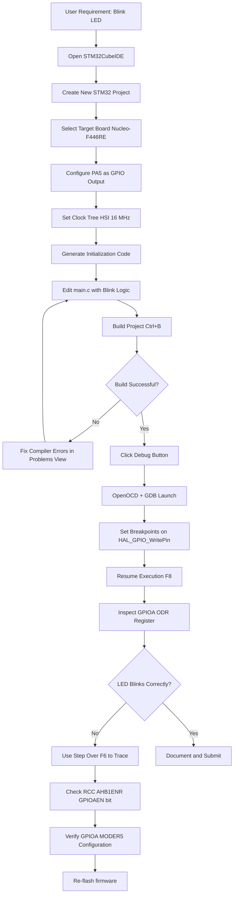
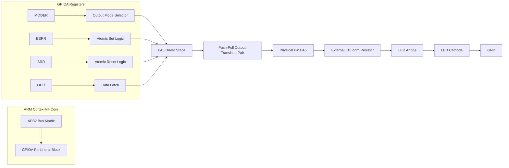

# Writing, and Debugging Your First Program(LED Interfacing)

<!-- SECTION_1_START -->
# 1. Core Technical Definition & Intuitive Overview

## 1.1 Formal Definition (KTU 2024 Syllabus Terminology)

**General Purpose Input/Output (GPIO)** is the fundamental, configurable digital interface peripheral of a microcontroller through which the CPU interacts with the external world. In the context of **STM32 ARM Cortex-M microcontrollers**, GPIO pins are multiplexed I/O lines controlled via a set of memory-mapped registers grouped under the **RCC** (Reset and Clock Control) and **GPIOx** peripheral blocks.

**LED Interfacing** is the canonical *first peripheral programming exercise* in any embedded systems curriculum. It requires the engineer to:
1. Enable the peripheral clock (RCC bus matrix).
2. Configure the GPIO pin mode (Output Push-Pull).
3. Drive the pin **HIGH** ($3.3\text{ V}$) or **LOW** ($0\text{ V}$) to switch the Light Emitting Diode (LED) ON or OFF.
4. Use a current-limiting series resistor (typically $R = 330\ \Omega$ to $1\ \text{k}\Omega$) to restrict forward current to a safe value of $I_F \approx 5\text{–}20\ \text{mA}$.

> [!IMPORTANT]
> **KTU Syllabus Highlight:** Module 2 of PBCST504 explicitly requires the student to develop, build, flash, and debug a complete LED program on an STM32 Nucleo/Discovery board using the **STM32CubeIDE** toolchain and the **HAL (Hardware Abstraction Layer)** libraries.

> [!NOTE]
> **Core Hardware Fact:** The on-board LED (LD2) on the **Nucleo-F446RE** / **STM32F407 Discovery** boards is connected to **PA5** (Port A, Pin 5). On the **Nucleo-F103RB**, it is mapped to **PC13** for the user LED (older revisions) or **PA5** for newer ones. Always check the *User Manual* of your specific board variant.

## 1.2 Conceptual Analogy / Plain-English Intuition

Imagine the STM32 microcontroller as a **large corporate office building (the chip)**. Inside this building, thousands of employees (registers and peripherals) sit at desks but only start working when the *janitor* (the **RCC clock system**) turns on the lights for that specific floor.

A **GPIO pin** is like a **window on the building's facade**:
- When the window is configured as an **Output**, the office worker inside (your `main()` code) can either open the curtain to the outside (drive the pin **HIGH** = $3.3\text{ V}$) or close it (drive the pin **LOW** = $0\text{ V}$).
- The **LED** is a small lamp hung outside that window. It only glows when current flows through it.
- A **current-limiting resistor** is the *fuse* that prevents the lamp from burning out due to excessive current.

**"Debugging"** is the process where you walk around the building with a flashlight (the **ST-Link/V2 debugger** integrated on Nucleo boards) and inspect each window to verify that the worker is doing the right thing at the right time, pausing execution at strategic *breakpoints* to peek at memory and CPU registers.

## 1.3 Physical Constants & Standard Metrics

| Parameter | Symbol | Typical Value | Unit |
| :--- | :---: | :---: | :---: |
| Logic HIGH Voltage | $V_{IH}$ | **$3.3$** | $\text{V}$ |
| Logic LOW Voltage | $V_{IL}$ | **$0.0$** | $\text{V}$ |
| LED Forward Voltage (Red) | $V_F$ | $1.8$ – $2.2$ | $\text{V}$ |
| LED Forward Current | $I_F$ | $5$ – $20$ | $\text{mA}$ |
| Series Resistor (Red LED, $5\ \text{mA}$) | $R_S$ | $\approx 330$ | $\Omega$ |
| GPIO Source/Sink Current (max) | $I_{IO}$ | $\pm 25$ | $\text{mA}$ |
| STM32 System Clock (default HSI) | $f_{SYS}$ | $16$ | $\text{MHz}$ |
| APB2 Bus Clock (for GPIOA) | $f_{APB2}$ | $16$ | $\text{MHz}$ |

> [!VISUALIZATION CONTROL]
> **Concept:** Voltage Divider / LED Resistor Calculation
> **GeoGebra Input Equations:**
> * `V_supply = 3.3`
> * `V_LED(x) = 2.0` (constant horizontal line)
> * `I(x) = (V_supply - V_LED(x)) / x`
> **Visual Description:** Plot $I(R_S)$ vs. $R_S$. Observe how current drops as resistance increases. The point where $I = 10\ \text{mA}$ corresponds to $R_S \approx 130\ \Omega$ — the design sweet spot for safe LED operation.

---

<!-- SECTION_2_START -->
# 2. Deep Theoretical Analysis & KTU High-Yield Formula Sheet

## 2.1 Architectural Breakdown: The Three Pillars of LED Programming

### Pillar 1 — The Clock Tree (RCC)
Before any peripheral can operate, its clock signal must be enabled. The **RCC (Reset and Clock Control)** unit distributes clock signals from sources such as the **HSI** (High-Speed Internal $16\ \text{MHz}$ RC oscillator) or **HSE** (High-Speed External crystal) through buses:
- **AHB** (Advanced High-performance Bus) — $f_{AHB}$
- **APB1** — for low-speed peripherals ($f_{APB1} = f_{AHB}/4$)
- **APB2** — for high-speed peripherals like **GPIOA**, **GPIOB** ($f_{APB2} = f_{AHB}/1$)

> If you forget to enable the clock on `GPIOA`, the pin will remain *floating* and unresponsive — the **#1 cause of "my LED won't blink" bugs**.

### Pillar 2 — GPIO Configuration Registers
Each STM32 GPIO port has a tight cluster of 32-bit registers. The most critical ones for LED output are:

| Register | Full Name | Function |
| :--- | :--- | :--- |
| `MODER` | Mode Register | Sets pin as **Input / Output / Alternate Function / Analog** |
| `OTYPER` | Output Type Register | **Push-Pull** or **Open-Drain** |
| `OSPEEDR` | Output Speed Register | Low / Medium / High / Very High slew rate |
| `PUPDR` | Pull-Up / Pull-Down Register | Internal resistor enabling |
| `IDR` | Input Data Register | Read pin state |
| `ODR` | Output Data Register | Write pin state (16 pins per port) |
| `BSRR` | Bit Set/Reset Register | Atomic pin manipulation (preferred over `ODR`) |
| `BRR` | Bit Reset Register | Atomic reset only |

### Pillar 3 — HAL vs. Register-Level Programming
KTU Module 2 mandates familiarity with **both** approaches:

- **Register-Level:** Direct manipulation of memory addresses via pointers. Faster, but tedious and non-portable.
- **HAL (Hardware Abstortion Layer):** High-level functions like `HAL_GPIO_WritePin()` and `HAL_GPIO_TogglePin()`. Portable across STM32 families, automatically generated by **STM32CubeMX**.

> [!IMPORTANT]
> **Why use `BSRR` instead of `ODR`?**
> Writing to `ODR` is a *read-modify-write* operation. In an **RTOS** or **interrupt** context, this can lead to race conditions. `BSRR` is **atomic** — it sets or resets bits in a single, non-interruptible bus cycle, guaranteeing thread safety.

## 2.2 KTU High-Yield Formula Sheet

| Concept | Equation / Rule | Engineering Utility |
| :--- | :--- | :--- |
| **Ohm's Law (LED current)** | $I_F = \dfrac{V_{CC} - V_F}{R_S}$ | Sizing the current-limiting resistor |
| **Power dissipation in LED** | $P_{LED} = V_F \cdot I_F$ | Thermal management of high-brightness LEDs |
| **APB2 clock relationship** | $f_{APB2} = \dfrac{f_{AHB}}{\text{prescaler}}$ | Understanding GPIO toggle speed limits |
| **GPIO toggle frequency (max)** | $f_{toggle} = \dfrac{f_{APB2}}{2 \cdot (\text{cycles per toggle})}$ | Setting PWM or blink frequencies |
| **BSRR atomic bit set** | `GPIOA->BSRR = (1U << 5);` | Sets PA5 HIGH in 1 cycle |
| **BRR atomic bit reset** | `GPIOA->BRR = (1U << 5);` | Resets PA5 LOW in 1 cycle |
| **CubeIDE build sizes (typical)** | `.text + .data + .bss} \leq \text{Flash size}$ | Verifying program fits in $256\ \text{kB}$ / $512\ \text{kB}$ Flash |
| **HSI internal RC tolerance** | $\pm 1\%$ at $25\ ^\circ\text{C}$ | Acceptable for LED timing, *not* for UART baud |

## 2.3 Engineering Utility & Real-World Applications

The LED blink program is the **"Hello World"** of embedded engineering, but the underlying skills transfer to:
- **Industrial control panels:** Status indicators on PLCs.
- **Automotive dashboards:** Tell-tale lamps for fuel, engine, indicators.
- **IoT devices:** RGB LEDs (WS2812B) for user feedback — driven via SPI/DMA.
- **Safety-critical systems:** Watchdog LEDs that prove the firmware is alive (the so-called "heartbeat LED").
- **Bare-metal bootloaders:** The first instruction in a bootloader is often `LED ON` to signal power-up.

---

<!-- SECTION_3_START -->
# 3. Step-by-Step Derivations & Code/Symbolic Implementation

## 3.1 Worked Derivation: Sizing the Current-Limiting Resistor

**Problem:** A red LED ($V_F = 2.0\ \text{V}$, $I_F = 10\ \text{mA}$ desired) is connected between PA5 (configured as push-pull output, $V_{OH} \approx 3.3\ \text{V}$) and GND. Compute the required series resistor $R_S$.

**Step 1 — Apply Kirchhoff's Voltage Law (KVL) around the loop:**

$$V_{OH} - V_{R_S} - V_F = 0$$

**Step 2 — Solve for the voltage drop across the resistor:**

$$V_{R_S} = V_{OH} - V_F = 3.3\ \text{V} - 2.0\ \text{V} = 1.3\ \text{V}$$

**Step 3 — Apply Ohm's Law to find $R_S$:**

$$R_S = \dfrac{V_{R_S}}{I_F} = \dfrac{1.3\ \text{V}}{10 \times 10^{-3}\ \text{A}} = 130\ \Omega$$

**Step 4 — Choose the next-highest standard E12 value:**

$$R_S = 150\ \Omega \quad \text{(E12 series)}$$

**Step 5 — Verify the actual LED current with the chosen resistor:**

$$I_{F,actual} = \dfrac{1.3\ \text{V}}{150\ \Omega} \approx 8.67\ \text{mA} \quad \text{(safe, within } 20\ \text{mA max)}$$

**Step 6 — Verify power dissipation in the resistor:**

$$P_{R_S} = I_{F,actual}^2 \cdot R_S = (8.67\ \times 10^{-3})^2 \cdot 150 \approx 11.3\ \text{mW}$$

A standard $\frac{1}{4}\ \text{W}$ ($250\ \text{mW}$) resistor is more than sufficient.

> [!NOTE]
> **Examiner's Tip:** For the on-board **LD2 LED** of the Nucleo-F446RE, the resistor is *already* integrated on the PCB (typically $510\ \Omega$ or $1\ \text{k}\Omega$). No external calculation is needed for the bundled example.

## 3.2 Project Setup Walk-Through (STM32CubeIDE + CubeMX)

1. **File → New STM32 Project** → select board **Nucleo-F446RE** (or Discovery-F407).
2. **Pinout & Configuration tab** → click **PA5** → select `GPIO_Output`.
3. Click **PA5** → set:
   * **GPIO output level:** `Low` (initial state, LED OFF)
   * **GPIO mode:** `Output Push-Pull`
   * **GPIO pull-up/pull-down:** `No pull-up and no pull-down`
   * **Maximum output speed:** `Low` (sufficient for LED, reduces EMI)
   * **User Label:** `LD2` (readability)
4. **Clock Configuration tab** → confirm HSI $16\ \text{MHz}$ routed to APB2.
5. **Project Manager tab** → set project name `LED_Blink_01` → Toolchain/IDE: **STM32CubeIDE** → Generate Code.

## 3.3 Full Source Code (HAL-Based, KTU-Standard)

```c
/* USER CODE BEGIN Header */
/**
  ******************************************************************************
  * @file           : main.c
  * @brief          : LED Blinking using HAL Driver (PA5 - Nucleo LD2)
  * @author         : KTU PBCST504 Student
  * @board          : STM32 Nucleo-F446RE
  * @IDE            : STM32CubeIDE v1.15+
  * @clock source   : HSI 16 MHz (default)
  ******************************************************************************
  */
/* USER CODE END Header */

#include "main.h"

/* Private function prototypes -----------------------------------------------*/
void SystemClock_Config(void);
static void MX_GPIO_Init(void);

int main(void)
{
  /* Reset of all peripherals, Initialize the Flash interface and the Systick. */
  HAL_Init();

  /* Configure the system clock */
  SystemClock_Config();

  /* Initialize all configured peripherals (GPIOA in our case) */
  MX_GPIO_Init();

  /* Infinite super-loop */
  while (1)
  {
    /* Step 1: Turn LED ON by driving PA5 HIGH */
    HAL_GPIO_WritePin(GPIOA, GPIO_PIN_5, GPIO_PIN_SET);

    /* Step 2: Insert a blocking delay of ~500 ms */
    HAL_Delay(500);

    /* Step 3: Turn LED OFF by driving PA5 LOW */
    HAL_GPIO_WritePin(GPIOA, GPIO_PIN_5, GPIO_PIN_RESET);

    /* Step 4: Insert a blocking delay of ~500 ms */
    HAL_Delay(500);
  }
}

/**
  * @brief GPIO Initialization Function
  * @param None
  * @retval None
  */
static void MX_GPIO_Init(void)
{
  GPIO_InitTypeDef GPIO_InitStruct = {0};

  /* GPIO Ports Clock Enable (CRITICAL: Pillar 1) */
  __HAL_RCC_GPIOA_CLK_ENABLE();

  /* Configure PA5 as push-pull output, no pull, low speed */
  GPIO_InitStruct.Pin   = GPIO_PIN_5;
  GPIO_InitStruct.Mode  = GPIO_MODE_OUTPUT_PP;
  GPIO_InitStruct.Pull  = GPIO_NOPULL;
  GPIO_InitStruct.Speed = GPIO_SPEED_FREQ_LOW;
  HAL_GPIO_Init(GPIOA, &GPIO_InitStruct);

  /* Initial pin state: LOW (LED OFF) */
  HAL_GPIO_WritePin(GPIOA, GPIO_PIN_5, GPIO_PIN_RESET);
}
```

## 3.4 Equivalent Register-Level Code (Bare-Metal)

```c
#include "stm32f4xx.h"          // CMSIS device header

int main(void)
{
    /* --- (1) Enable clock for GPIOA on AHB1 bus --- */
    RCC->AHB1ENR |= (1U << 0);          // Bit 0 = GPIOAEN

    /* --- (2) Configure PA5 as General Purpose Output (01) --- */
    GPIOA->MODER &= ~(3U << (5 * 2));   // Clear MODER5[1:0]
    GPIOA->MODER |=  (1U << (5 * 2));   // Set MODER5 = 01 (Output)

    /* --- (3) Set Output Type to Push-Pull (reset value, but explicit) --- */
    GPIOA->OTYPER &= ~(1U << 5);        // Bit 5 = 0 (Push-Pull)

    /* --- (4) Set Low Speed (sufficient for LED) --- */
    GPIOA->OSPEEDR &= ~(3U << (5 * 2));

    /* --- (5) No pull-up / pull-down --- */
    GPIOA->PUPDR &= ~(3U << (5 * 2));

    /* --- (6) Super-loop blink --- */
    while (1)
    {
        GPIOA->BSRR = (1U << 5);        // Atomic SET  PA5 = HIGH (LED ON)
        for (volatile int i = 0; i < 500000; i++);  // Crude delay
        GPIOA->BRR  = (1U << 5);        // Atomic RESET PA5 = LOW  (LED OFF)
        for (volatile int i = 0; i < 500000; i++);
    }
}
```

## 3.5 Delay Function Derivation (Bare-Metal, No HAL)

For a $16\ \text{MHz}$ clock, one CPU cycle $= 1/f_{SYS} = 62.5\ \text{ns}$. For a $500\ \text{ms}$ delay:

$$N_{cycles} = 500 \times 10^{-3} \times 16 \times 10^{6} = 8\,000\,000\ \text{cycles}$$

Since a simple `for` loop consumes $\approx 3$ cycles per iteration (decrement, branch, no-op), the loop counter should be:

$$N_{iter} \approx \dfrac{8\,000\,000}{3} \approx 2\,666\,666$$

The variable must be `volatile` to prevent the compiler from optimizing it away.

## 3.6 Debugging Strategy (Step-Through in CubeIDE)

| Step | Action in IDE | Purpose |
| :--- | :--- | :--- |
| 1 | Connect USB cable (ST-Link integrated) | Power + debug link |
| 2 | Right-click project → **Debug As → STM32 Cortex-M C/C++ Application** | Launch GDB + OpenOCD |
| 3 | Click **Resume (F8)** | Run at full speed |
| 4 | Double-click left-margin on line `HAL_GPIO_WritePin(...SET)` | Set **breakpoint** |
| 5 | Click **Resume** again | Pause at breakpoint |
| 6 | Open **Window → Show View → SFR (Special Function Registers)** | Inspect `GPIOA->ODR`, `RCC->AHB1ENR` |
| 7 | Use **Expressions** view to add `GPIOA->IDR` | Live peripheral state |
| 8 | Click **Step Over (F6)** | Execute one C line at a time |
| 9 | Click **Terminate (Ctrl+F2)** | Exit debug session |

> [!WARNING]
> **Common Debugger Pitfall:** If `HAL_Delay(500)` is used but `SysTick` is not configured (or the `HAL_Init()` call is missing), the delay will *hang* forever. Always ensure `HAL_Init()` is the first statement in `main()`.

---

<!-- SECTION_4_START -->
# 4. Structural Diagrams & Schematics

## 4.1 Project Development & Debug Workflow



## 4.2 GPIO Internal Architecture & LED Connection



## 4.3 Memory-Mapped Register Layout (GPIOA Base)

```mermaid
flowchart TB
    subgraph APB2["APB2 Bus Address Space"]
        REG1["0x40020000 - MODER (Mode Register, RW)"]
        REG2["0x40020004 - OTYPER (Output Type, RW)"]
        REG3["0x40020008 - OSPEEDR (Output Speed, RW)"]
        REG4["0x4002000C - PUPDR (Pull-Up/Down, RW)"]
        REG5["0x40020010 - IDR (Input Data, RO)"]
        REG6["0x40020014 - ODR (Output Data, RW)"]
        REG7["0x40020018 - BSRR (Bit Set/Reset, WO)"]
        REG8["0x4002001C - BRR (Bit Reset, WO)"]
        REG9["0x40020020 - LCKR (Lock Register, RW)"]
    end
    REG1 --> REG2 --> REG3 --> REG4 --> REG5 --> REG6 --> REG7 --> REG8 --> REG9
```



## 4.4 LED State Decision Matrix

| GPIOA Pin 5 (`ODR.5`) | `BSRR` Action | `BRR` Action | LED State |
| :---: | :---: | :---: | :---: |
| $0$ | Write `1 << 5` | No-op | **ON** |
| $1$ | No-op | Write `1 << 5` | **OFF** |
| $0$ | Read-modify `ODR` | — | **ON** (non-atomic, risky) |
| $1$ | — | Read-modify `ODR` | **OFF** (non-atomic, risky) |

---

<!-- SECTION_5_START -->
# 5. KTU 2024 Scheme Examination Question Bank & Topic Recap

## 5.1 Part A Questions (3 Marks Each)

### **Q1. Define GPIO and explain its role in microcontroller-based systems.** `[KTU University Exam – July 2024]`
**CO Mapped:** CO1 | **RBT Level:** Remember/Understand

**Model Answer (Valuation Key – 3 Marks):**
- **[1 Mark]** GPIO stands for **General Purpose Input/Output**. It is a software-configurable digital pin that can be programmed as input or output to interface the microcontroller with external devices.
- **[1 Mark]** In STM32, GPIO pins are organized into **ports** (GPIOA, GPIOB, ...) of 16 pins each, controlled via memory-mapped registers like `MODER`, `ODR`, `BSRR`.
- **[1 Mark]** GPIO enables interfacing with **LEDs, switches, sensors, motors, and communication buses** (SPI/I2C alternate function mode).

---

### **Q2. List any three configuration registers of an STM32 GPIO port and their functions.** `[KTU University Exam – Dec 2023]`
**CO Mapped:** CO1 | **RBT Level:** Remember

**Model Answer (Valuation Key – 3 Marks):**
- **[1 Mark]** `MODER` — selects pin mode (Input, Output, Alternate Function, Analog).
- **[1 Mark]** `OTYPER` — selects output type (**Push-Pull** or Open-Drain).
- **[1 Mark]** `OSPEEDR` — sets output slew rate (Low, Medium, High, Very High).

*(Acceptable alternatives: `PUPDR`, `IDR`, `ODR`, `BSRR`, `BRR`, `LCKR`.)*

---

## 5.2 Part B Question — Internal Choice (14 Marks)

### **Question A (14 Marks) — Full-Length KTU Pattern**

#### **Q(A)(a)** [7 Marks] — Understand Level
**"With a neat block diagram, explain the internal architecture of an STM32 GPIO pin. Differentiate between push-pull and open-drain output configurations."** `[KTU University Exam – July 2024]`

**Model Answer (Valuation Key):**
- **[2 Marks]** GPIO block diagram description: input Schmitt trigger, output driver with P-MOS and N-MOS transistors, pull-up/pull-down resistors, alternate function multiplexer.
- **[2 Marks]** Push-pull: uses both P-MOS (sources current) and N-MOS (sinks current); can drive line HIGH or LOW actively; faster edge transitions.
- **[2 Marks]** Open-drain: only N-MOS present; can only pull line LOW; requires external pull-up resistor to achieve HIGH; used for wired-OR buses like I2C.
- **[1 Mark]** Application note: STM32 LEDs typically use push-pull; I2C lines (SDA/SCL) always use open-drain.

#### **Q(A)(b)** [7 Marks] — Apply Level
**"Design and write a complete STM32 HAL program to blink three LEDs connected to PA5, PA6, and PA7 in a sequential 'running light' pattern with 200 ms delay between transitions. List the CubeMX configuration steps."** `[KTU University Exam – Dec 2023]`

**Model Answer (Valuation Key):**

**CubeMX Configuration Steps (3 Marks):**
1. Open CubeMX → Select **Nucleo-F446RE** target.
2. Configure **PA5, PA6, PA7** as `GPIO_Output`, Push-Pull, No Pull, Low Speed.
3. Set **Clock Source = HSI 16 MHz**; **Debug = Trace Asynchronous Sw**.
4. Generate code in **STM32CubeIDE** with project name `Running_Light`.

**Complete Source Code (4 Marks):**

```c
#include "main.h"

void SystemClock_Config(void);
static void MX_GPIO_Init(void);

int main(void)
{
  HAL_Init();
  SystemClock_Config();
  MX_GPIO_Init();

  while (1)
  {
    /* LED1 ON */
    HAL_GPIO_WritePin(GPIOA, GPIO_PIN_5, GPIO_PIN_SET);
    HAL_GPIO_WritePin(GPIOA, GPIO_PIN_6, GPIO_PIN_RESET);
    HAL_GPIO_WritePin(GPIOA, GPIO_PIN_7, GPIO_PIN_RESET);
    HAL_Delay(200);

    /* LED2 ON */
    HAL_GPIO_WritePin(GPIOA, GPIO_PIN_5, GPIO_PIN_RESET);
    HAL_GPIO_WritePin(GPIOA, GPIO_PIN_6, GPIO_PIN_SET);
    HAL_GPIO_WritePin(GPIOA, GPIO_PIN_7, GPIO_PIN_RESET);
    HAL_Delay(200);

    /* LED3 ON */
    HAL_GPIO_WritePin(GPIOA, GPIO_PIN_5, GPIO_PIN_RESET);
    HAL_GPIO_WritePin(GPIOA, GPIO_PIN_6, GPIO_PIN_RESET);
    HAL_GPIO_WritePin(GPIOA, GPIO_PIN_7, GPIO_PIN_SET);
    HAL_Delay(200);
  }
}
```

---

### **Question B (14 Marks) — Alternative Choice**

#### **Q(B)(a)** [7 Marks] — Understand Level
**"Explain the role of the RCC (Reset and Clock Control) unit in STM32. Why is it mandatory to enable the peripheral clock before using a GPIO port? What happens if you forget this step?"** `[KTU University Exam – July 2024]`

**Model Answer (Valuation Key):**
- **[2 Marks]** RCC is the clock-management unit that distributes clock signals from sources (HSI, HSE, PLL) to AHB, APB1, APB2, and individual peripherals.
- **[2 Marks]** Modern STM32 design uses **clock gating** to save power. Each peripheral's clock must be explicitly enabled via its enable bit in `RCC->AHBxENR` or `RCC->APBxENR`. For GPIOA, the bit is `RCC->AHB1ENR |= (1U << 0)`.
- **[2 Marks]** If clock is not enabled, the GPIO registers **cannot be written** — the bus returns *bus error*. The pin remains in **high-impedance** (floating) state, and the LED stays OFF silently with no error message.
- **[1 Mark]** HAL function `__HAL_RCC_GPIOA_CLK_ENABLE()` performs this bit-set atomically; the CMSIS macro expands to `RCC->AHB1ENR |= GPIOAEN`.

#### **Q(B)(b)** [7 Marks] — Apply Level
**"Write the register-level (bare-metal) C code to toggle PA5 without using HAL libraries. Configure the pin, enable the clock, and produce a 250 ms blink on a 16 MHz system clock."** `[KTU University Exam – Dec 2023]`

**Model Answer (Valuation Key):**
- **[1 Mark]** Clock enable: `RCC->AHB1ENR |= (1U << 0);`
- **[2 Marks]** Pin configuration: clear and set `MODER5` bits to `01` (output); set `OTYPER5 = 0` (push-pull); clear `OSPEEDR5` and `PUPDR5` fields.
- **[1 Mark]** LED ON via `BSRR`: `GPIOA->BSRR = (1U << 5);`
- **[1 Mark]** LED OFF via `BRR`: `GPIOA->BRR = (1U << 5);`
- **[2 Marks]** Delay loop: cycles needed $= 250\ \text{ms} \times 16\ \text{MHz} = 4\,000\,000$; with $\approx 3$ cycles per loop iter, use `for (volatile uint32_t i = 0; i < 1333333; i++);` marked `volatile` to defeat optimization.

```c
#include "stm32f4xx.h"

int main(void) {
    RCC->AHB1ENR   |= (1U << 0);
    GPIOA->MODER   &= ~(3U << (5*2));
    GPIOA->MODER   |=  (1U << (5*2));
    GPIOA->OTYPER  &= ~(1U << 5);

    while (1) {
        GPIOA->BSRR = (1U << 5);                     /* ON */
        for (volatile uint32_t i = 0; i < 1333333; i++);
        GPIOA->BRR  = (1U << 5);                     /* OFF */
        for (volatile uint32_t i = 0; i < 1333333; i++);
    }
}
```

> [!WARNING]
> **KTU Examiner's Valuation Pitfall Callout:**
> 1. **Forgetting `__HAL_RCC_GPIOA_CLK_ENABLE()`** — silent failure, no LED activity. Deduct 2 marks.
> 2. **Using `volatile` qualifier in the delay loop** — without it, the compiler optimizes the loop to a single `nop` and your LED appears constantly ON or OFF. Deduct 1 mark.
> 3. **Writing to `ODR` instead of `BSRR/BRR`** in interrupt-driven code — risk of race conditions, but acceptable in a simple polled loop. No deduction, but mention in viva.
> 4. **Forgetting to set the MODER bits for output mode** — pin remains in Analog/Input mode and the LED never lights. Deduct 2 marks.
> 5. **Choosing wrong GPIO port clock enable bit** (e.g., using `GPIOBEN` for `GPIOA`) — silent failure, easy to miss in code review. Deduct 1 mark.

---

## 5.3 Topic Recap & Important Things to Remember

> [!NOTE]
> Use this as your **last-30-minute revision checklist** before the KTU exam.

- **GPIO** = **G**eneral **P**urpose **I**nput/**O**utput; the bridge between CPU and external hardware.
- The **STM32 GPIO port** has 16 pins, each configurable via 8 key registers: `MODER`, `OTYPER`, `OSPEEDR`, `PUPDR`, `IDR`, `ODR`, `BSRR`, `BRR`.
- **Pin modes** (set by `MODER` 2-bit field): `00` Input, `01` Output, `10` Alternate Function, `11` Analog.
- **Output types**: **Push-Pull** (active HIGH and LOW drive) vs **Open-Drain** (active LOW only, needs external pull-up).
- **Clock gating** is mandatory. Use `__HAL_RCC_GPIOx_CLK_ENABLE()` (HAL) or `RCC->AHBxENR |= (1U << n)` (register).
- **Atomic I/O**: always prefer `BSRR` (set) and `BRR` (reset) over read-modify-write of `ODR`.
- **LED forward current** is limited by a **series resistor** $R_S = (V_{CC} - V_F) / I_F$. Typical values: $150\ \Omega$ to $1\ \text{k}\Omega$.
- **Nucleo-F446RE** user LED = **PA5**; **Nucleo-F103RB** = **PC13** (old) or **PA5** (new rev).
- **CubeMX → CubeIDE workflow**: configure pins → set clock tree → generate code → edit `main.c` → build → debug.
- **Debugger**: ST-Link/V2 is integrated on Nucleo boards; use **F5** step-into, **F6** step-over, **F8** resume, **Ctrl+F2** terminate.
- **SFR view** in CubeIDE lets you inspect `GPIOA->ODR`, `RCC->AHB1ENR` live during a paused debug session.
- **HAL_Delay** relies on **SysTick** interrupt — must call `HAL_Init()` first to configure the timer.
- **Volatile qualifier** is **mandatory** for software-loop delay counters to prevent compiler optimization.
- **HSI** ($16\ \text{MHz}$ internal RC) is the default clock source after reset; tolerance $\pm 1\%$.
- **APB2 bus** serves GPIOA–GPIOK on STM32F4; APB1 is for low-speed peripherals (USART2/3, I2C1/2, TIM2–7).
- **LED blink** validates the full toolchain: edit → compile → flash → execute → verify. It is the canonical *sanity test* before any complex firmware is attempted.
<!-- SECTION_5_END -->
