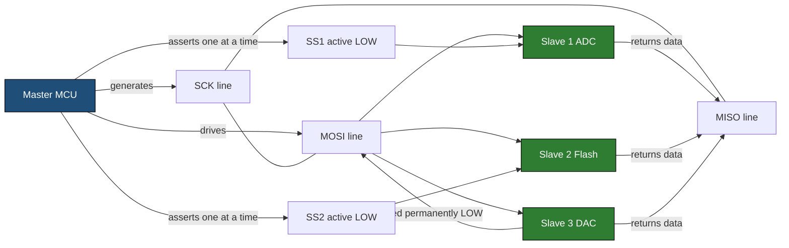
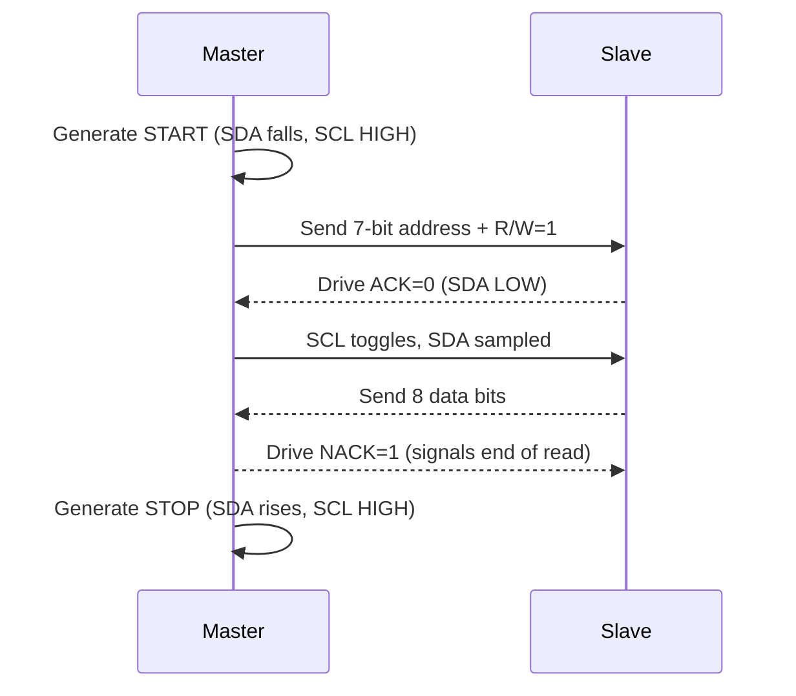
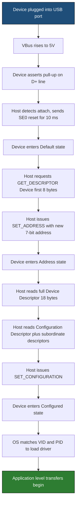
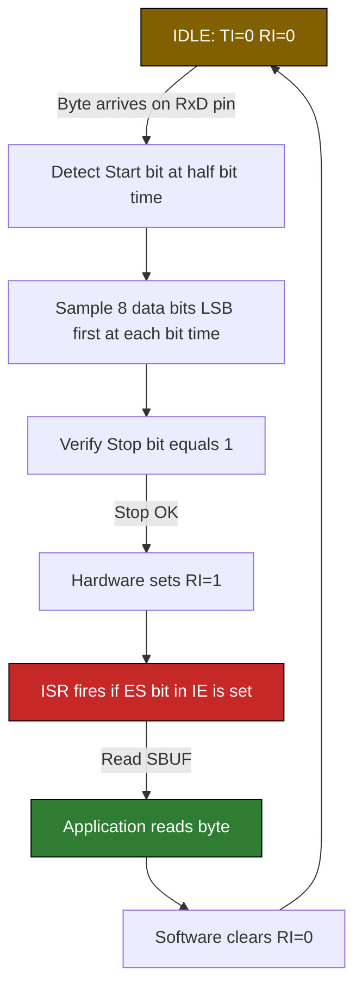

# Communication Protocols and USB:-

<!-- SECTION_1_START -->
# Communication Protocols and USB — Core Technical Definition & Intuitive Overview

## 1.1 Formal Definition (KTU 2024 Syllabus Terminology)

A **Communication Protocol** in embedded systems is a formally defined set of **rules, signal timings, voltage levels, and data framing conventions** that govern the exchange of binary information between two or more digital devices (typically a microcontroller and a peripheral). In the context of the **8051 / ARM / PIC microcontroller** curriculum (PBCST504), communication protocols are classified by:

- **Synchronization mechanism** → *Synchronous* (shared clock) vs *Asynchronous* (no shared clock).
- **Number of physical wires** → *Serial* (1 bit at a time) vs *Parallel* (n bits simultaneously).
- **Device addressing topology** → *Peer-to-peer* vs *Multi-drop bus* (Master–Slave).

> [!IMPORTANT]
> **KTU 2024 Module 3 — Communication Protocols and USB** explicitly expects mastery of **UART, SPI, I²C, and USB**. The student must be able to *draw the frame format*, *state the pin configuration of the 8051 (SCON, SBUF, SCLK at P3.0–P3.1 / alternate pins)*, and *compare baud-rate calculations* as per the **Course Outcome CO3 — Apply**.

## 1.2 Intuitive Overview — The "Postal System" Analogy

Imagine two offices (devices) that need to exchange letters (data bytes). They have three viable courier services:

| Courier Service | Analogy | Microcontroller Equivalent |
|---|---|---|
| **UART (Postal Letter)** | Sender writes the letter, drops it in a mailbox; receiver checks mailbox periodically. Both must agree on **letter format** (A4, English) and **arrival rate** (1 letter/hour). No central postmaster needed. | Asynchronous serial; both sides pre-agree on **baud rate** and **frame format (8N1)**. |
| **SPI (Walkie-Talkie with a Clock Line)** | Sender presses Push-To-Talk; a **synchronized ticking clock** dictates when each word is spoken. Fast, but needs a dedicated clock wire. | Synchronous serial with **SCK, MOSI, MISO, SS** lines; one Master, multiple Slaves via SS lines. |
| **I²C (Conference Call with a Moderator)** | One **moderator (Master)** controls the floor; each participant has a **unique 7-bit address** to be called. Only **two wires** (SDA, SCL) carry both data and address. | Synchronous **2-wire multi-master bus**; uses 7-bit/10-bit addressing with ACK/NACK handshaking. |
| **USB (Courier with Tracking ID)** | A standardized **plug-and-play courier** with hot-pluggable connectors, automatic device enumeration, and differential signalling for noise immunity. | Universal Serial Bus — differential (D+/D−), host-driven, plug-and-play with descriptors. |

## 1.3 Physical Constants and Standard Metrics

> [!NOTE]
> **Standard Baud Rates:** **1200, 2400, 4800, 9600, 19200, 38400, 57600, 115200** bps. The most common in KTU labs is **9600 bps** and **115200 bps**.

> [!IMPORTANT]
> **Standard I²C Speeds:** **100 kHz (Standard-mode)**, **400 kHz (Fast-mode)**, **1 MHz (Fast-mode Plus)**, **3.4 MHz (High-speed)**. Pull-up resistors: typically **$R_P = 4.7 \text{ k}\Omega$** to **$V_{DD}$**.

> [!NOTE]
> **USB Signalling Speeds:** **Low-Speed (1.5 Mbps), Full-Speed (12 Mbps), High-Speed (480 Mbps), SuperSpeed (5 Gbps)**. Differential voltage swing: **$\pm 400 \text{ mV}$** (HS) on lines **D+ and D−**.

## 1.4 Concept Anchor — When to Use Which Protocol?

> [!VISUALIZATION CONTROL]
> **Concept:** *Decision-tree for protocol selection in embedded design*
> **Visualization Logic (mental plot):**
> * X-axis → *Wires Available* (1, 2, 4, …)
> * Y-axis → *Throughput Required* (kbps to Gbps)
> **Observation:** UART occupies the *low-wire, low-speed* corner; I²C sits in the *2-wire, low-to-medium* zone; SPI in the *4-wire, high-speed* zone; USB dominates *high-throughput + plug-and-play*.
> **Visual Description:** A scatter plot where each protocol is a labelled node; students should see that *USB is the boundary technology that bridges MCUs to PCs*.

<!-- SECTION_1_END -->

<!-- SECTION_2_START -->
# Deep Theoretical Analysis & KTU High-Yield Formula Sheet

## 2.1 UART — Universal Asynchronous Receiver/Transmitter

### 2.1.1 Operational Block Diagram (Logical)

UART transmits data as a **frame**, asynchronous to any clock, using **start and stop bits** for byte synchronization.

The 8051 UART pins:
- **P3.0 (RxD)** — Receive Data (input)
- **P3.1 (TxD)** — Transmit Data (output)

### 2.1.2 Frame Format (8N1 — the KTU default)

```
|<-- Start -->|<------- 8 Data bits (LSB first) ------->|<- Stop ->|
   ___           _   _   _   _   _   _   _   _   _       ____
__|   |_________| |_| |_| |_| |_| |_| |_| |_| |_| |_____|    |______
  '0'   D0      D1  D2  D3  D4  D5  D6  D7                '1'
        (Idle line is HIGH; Start bit pulls line LOW)
```

For **8N1** (8 data, No parity, 1 stop bit): **Total bits per frame = 10**.
Therefore, time to send **1 byte = 10 / BaudRate seconds**.

### 2.1.3 8051 SCON Register (Serial Control)

| Bit | Symbol | Function |
|---|---|---|
| 7 | **SM0** | Mode select bit 0 (combined with SM1) |
| 6 | **SM1** | Mode select bit 1 |
| 5 | **SM2** | Multiprocessor communication enable |
| 4 | **REN** | Receive Enable (must be **1** to receive) |
| 3 | **TB8** | 9th transmitted bit (Mode 2/3) |
| 2 | **RB8** | 9th received bit (Mode 2/3) |
| 1 | **TI** | Transmit Interrupt flag (set by HW, cleared by SW) |
| 0 | **RI** | Receive Interrupt flag (set by HW, cleared by SW) |

> [!IMPORTANT]
> **KTU High-Yield:** Mode 1 (8-bit UART, variable baud rate) uses **Timer 1 overflow** as the baud-rate generator. Always write `SCON = 0x50;` to configure **Mode 1, REN=1**.

### 2.1.4 Baud-Rate Formula (8051, Mode 1, using Timer 1)

$$ \text{BaudRate} = \frac{2^{\text{SMOD}} \cdot f_{\text{osc}}}{32 \cdot 12 \cdot (256 - \text{TH1})} $$

For **SMOD = 0** (default) and crystal **$f_{\text{osc}} = 11.0592 \text{ MHz}$**:

$$ \text{TH1} = 256 - \frac{f_{\text{osc}}}{384 \cdot \text{BaudRate}} $$

> [!TIP]
> **The "magic crystal" 11.0592 MHz** is chosen because it is exactly divisible by standard baud rates, eliminating fractional errors that would otherwise accumulate into framing slips. KTU questions **always assume 11.0592 MHz** unless stated otherwise.

| Baud Rate (bps) | TH1 (Hex) | Timer Mode |
|---|---|---|
| 1200 | **E8** | Mode 2 (auto-reload) |
| 2400 | **F4** | Mode 2 |
| 9600 | **FD** | Mode 2 |
| 19200 | **FD** *(with SMOD=1)* | Mode 2 |
| 4800 | **FA** | Mode 2 |

---

## 2.2 SPI — Serial Peripheral Interface

### 2.2.1 The Four SPI Signals

| Signal | Full Name | Direction (Master view) | Purpose |
|---|---|---|---|
| **SCK** | Serial Clock | Output | Synchronization clock from Master |
| **MOSI** | Master Out, Slave In | Output | Data: Master → Slave |
| **MISO** | Master In, Slave Out | Input | Data: Slave → Master |
| **SS** / **CS** | Slave Select / Chip Select | Output | Active-LOW device-enable line |

### 2.2.2 SPI Configuration Parameters (4 sub-options)

1. **Clock Polarity (CPOL)** — Idle state of SCK: **0 (LOW)** or **1 (HIGH)**.
2. **Clock Phase (CPHA)** — When data is sampled: **0 (leading edge)** or **1 (trailing edge)**.
3. **Bit Order** — **MSB-first** (Motorola default) or **LSB-first**.
4. **Slave Select Logic** — Active **LOW** (most common) or active HIGH.

These give **$2 \times 2 \times 2 = 8$** combinations; the two most common are **Mode 0 (CPOL=0, CPHA=0)** and **Mode 3 (CPOL=1, CPHA=1)**.

### 2.2.3 SPI Timing Diagram (Mode 0)

```
SCK  ___|‾|___|‾|___|‾|___|‾|___  (idle LOW, sample on rising edge)
MOSI --<D7>-<D6>-<D5>-<D4>-<D3>-<D2>-<D1>-<D0>--
MISO --<D7>-<D6>-<D5>-<D4>-<D3>-<D2>-<D1>-<D0>--
SS   ‾‾‾‾‾‾‾‾‾‾\___________________/‾‾‾‾‾‾‾‾‾‾  (active LOW only during transaction)
```

### 2.2.4 SPI Data-Rate (Baud) Formula

$$ f_{\text{SPI}} = \frac{f_{\text{CLK}}}{2 \cdot (\text{SPPR} + 1) \cdot (2^{\text{SPR} + 1})} $$

For the LPC2148 ARM7 SPI peripheral, the maximum is **$f_{\text{CLK}} / 2$**.

---

## 2.3 I²C — Inter-Integrated Circuit (Philips, 1982)

### 2.3.1 The Two-Wire Bus

- **SDA** — Serial Data (bidirectional, open-drain).
- **SCL** — Serial Clock (Master-driven, open-drain).

> [!IMPORTANT]
> Both SDA and SCL are **open-drain** lines → they can only pull LOW; HIGH state is achieved through **pull-up resistors** ($R_P$, typically 4.7 kΩ). This is what enables **wired-AND arbitration** during multi-master contention.

### 2.3.2 I²C Frame Structure

```
|<-Start->|<- 7-bit Address ->|<R/W>|<-ACK->|<- 8-bit Data ->|<-ACK->|...|<-Stop->|
   S           A6 A5 ... A0       0/1    A         D7 ... D0       A        P
```

- **Start Condition (S)**: SDA falls while SCL is HIGH.
- **Stop Condition (P)**: SDA rises while SCL is HIGH.
- **ACK**: Receiver pulls SDA LOW for 1 clock cycle after every byte.
- **NACK**: Receiver leaves SDA HIGH (used to signal "end of read").

### 2.3.3 I²C Addressing (Standard 7-bit)

| Address Bits | Range | Notes |
|---|---|---|
| **A6–A0** | 0x00 – 0x7F (0–127) | **0x00** = General Call; **0x7F** rarely used |
| R/W bit | 0 = Write, 1 = Read | LSB of the first byte |

> [!TIP]
> Common KTU-referenced slave addresses:
> * **EEPROM 24C04** → **0xA0** (write) / **0xA1** (read)
> * **RTC DS1307** → **0xD0** (write) / **0xD1** (read)
> * **LM75 Temperature** → **0x90**

### 2.3.4 I²C Bus Speed Modes

| Mode | Max Frequency |
|---|---|
| Standard-mode (Sm) | **100 kHz** |
| Fast-mode (Fm) | **400 kHz** |
| Fast-mode Plus (Fm+) | **1 MHz** |
| High-speed (Hs) | **3.4 MHz** |

---

## 2.4 USB — Universal Serial Bus

### 2.4.1 USB Topology (Tiered Star)

- **Host** (PC) at the root.
- **Hubs** branch outward.
- **Devices** (slaves) at the leaves.
- **Maximum tier depth = 7** (including root).
- **Maximum devices per host = 127**.

### 2.4.2 USB Signalling

USB uses **differential signalling** on **D+ and D−** lines:

| State | D+ | D− | Logic |
|---|---|---|---|
| **J-state (idle)** | HIGH | LOW | '1' (Full-Speed / High-Speed) |
| **K-state** | LOW | HIGH | '0' |
| **SE0** | LOW | LOW | End-of-Packet / Reset |

**Speed detection** is performed by the device through a **pull-up resistor**:
- **D+ pull-up (1.5 kΩ to $V_{DD}$)** → **Full-Speed (12 Mbps) / High-Speed (480 Mbps)**.
- **D− pull-up** → **Low-Speed (1.5 Mbps)**.

### 2.4.3 USB NRZI Bit-Stuffing

USB uses **Non-Return-to-Zero Inverted (NRZI)** encoding. To ensure clock recovery, a **'0' is bit-stuffed** after every run of **6 consecutive '1's** (the receiver de-stuffs by removing this '0').

### 2.4.4 USB Packet Format (Token Packet Example — SETUP)

```
|<--- SYNC (8 bits) --->|<-- PID (8 bits) -->|<-- ADDR (7) --->|<-- ENDP (4) -->|<-- CRC5 (5) -->|
     KJKJKJKK              0xB4 (10110100)        device            endpoint          5-bit CRC
```

**PID Types (4-bit + 4-bit complement for error detection):**

| PID Type | PID[3:0] | Use |
|---|---|---|
| **SETUP** | 0xB | Control transfer start |
| **IN** | 0x9 | Device → Host |
| **OUT** | 0x1 | Host → Device |
| **SOF** | 0x5 | Start-of-Frame marker (1 ms interval) |
| **DATA0 / DATA1** | 0x3 / 0xB | Data toggle for ACK reliability |
| **ACK** | 0x2 | Handshake: success |
| **NAK** | 0xA | Handshake: not ready |
| **STALL** | 0xE | Handshake: error |

### 2.4.5 USB Descriptors (Plug-and-Play Magic)

When a device is plugged in, the Host requests a hierarchy of **descriptors**:

| Descriptor | Purpose |
|---|---|
| **Device Descriptor** | VID, PID, bcdUSB, iManufacturer, iProduct |
| **Configuration Descriptor** | Power requirements, number of interfaces |
| **Interface Descriptor** | Class code (HID, CDC, MSC), endpoint count |
| **Endpoint Descriptor** | Address, transfer type, max packet size |
| **String Descriptor** | Human-readable names (Manufacturer, Product) |

### 2.4.6 USB Transfer Types

| Transfer Type | Use Case | Error Correction |
|---|---|---|
| **Control** | Enumeration, setup | Guaranteed delivery, CRC-5/16 |
| **Bulk** | Printers, USB drives, file transfer | Retried on error, no bandwidth guarantee |
| **Interrupt** | Keyboard, mouse | Polled with bounded latency |
| **Isochronous** | Audio, video streaming | No retry, real-time |

---

## 2.5 Real-World Engineering Utility

| Protocol | Typical MC Application |
|---|---|
| UART | **GPS modules (NMEA at 9600 bps)**, **Bluetooth HC-05**, **PC debug terminal** |
| SPI | **SD cards, TFT displays (ILI9341), ADC (MCP3008), Flash (W25Q64)** — high-speed, short-distance |
| I²C | **RTC (DS1307), EEPROM (24Cxx), sensors (MPU6050, BMP280), GPIO expanders (PCF8574)** — multi-device, low-pin |
| USB | **PC ↔ MCU communication, HID devices (mouse/keyboard emulation), CDC virtual COM port, Mass Storage** |

> [!NOTE]
> **KTU Real-World Insight:** In the **PBCST504 lab**, students typically implement **UART loopback (TX→RX)** on the 8051 development board, and **I²C EEPROM read/write** on the LPC2148 ARM7. The USB module is theoretical with descriptive questions on descriptors and enumeration.

<!-- SECTION_2_END -->

<!-- SECTION_3_START -->
# Step-by-Step Derivations & Code Implementations

## 3.1 UART Baud-Rate Numerical Derivation (KTU-Most-Frequent Type)

**Problem (KTU Style):** An 8051 system uses a **11.0592 MHz** crystal. Calculate the **TH1 reload value** for **9600 bps** UART communication. Assume **SMOD = 0** and **Timer 1 in Mode 2 (auto-reload)**.

### Step-by-Step Solution

**Step 1:** Recall the 8051 Mode-1 baud-rate equation.

$$ \text{BaudRate} = \frac{2^{\text{SMOD}} \cdot f_{\text{osc}}}{32 \cdot 12 \cdot (256 - \text{TH1})} $$

**Step 2:** Substitute the known values: $\text{SMOD} = 0 \Rightarrow 2^{0} = 1$, $f_{\text{osc}} = 11.0592 \times 10^{6} \text{ Hz}$, $\text{BaudRate} = 9600$.

$$ 9600 = \frac{1 \cdot 11.0592 \times 10^{6}}{32 \cdot 12 \cdot (256 - \text{TH1})} $$

**Step 3:** Simplify the constant denominator.

$$ 32 \cdot 12 = 384 $$

$$ 9600 = \frac{11.0592 \times 10^{6}}{384 \cdot (256 - \text{TH1})} $$

**Step 4:** Isolate $(256 - \text{TH1})$.

$$ (256 - \text{TH1}) = \frac{11.0592 \times 10^{6}}{384 \cdot 9600} $$

**Step 5:** Evaluate the RHS numerator–denominator product.

$$ 384 \cdot 9600 = 3{,}686{,}400 $$

$$ (256 - \text{TH1}) = \frac{11.0592 \times 10^{6}}{3{,}686{,}400} $$

**Step 6:** Perform the division.

$$ (256 - \text{TH1}) = 3.000 $$

**Step 7:** Solve for TH1.

$$ \text{TH1} = 256 - 3 = 253 $$

**Step 8:** Convert to hexadecimal for the C/Assembly statement `TH1 = 0xFD;`.

$$ 253_{10} = \text{FD}_{16} $$

### Verification (Reverse-Compute)

$$ \text{BaudRate} = \frac{1 \cdot 11.0592 \times 10^{6}}{384 \cdot (256 - 253)} = \frac{11.0592 \times 10^{6}}{384 \cdot 3} = \frac{11.0592 \times 10^{6}}{1152} = 9600 \text{ bps} \quad \checkmark $$

> [!IMPORTANT]
> **Valuation Tip:** KTU examiners award 1 mark each for *stating the formula*, *substituting values*, *simplifying the denominator*, and *converting to hex*. Always show the **decimal-to-hex conversion step** explicitly.

---

## 3.2 Full 8051 UART Transmit/Receive C Program (KEIL-Compatible)

```c
#include <reg51.h>

/* ------------------------------------------------------------------
 * 8051 UART INITIALIZATION @ 9600 bps, 11.0592 MHz, 8N1
 * ------------------------------------------------------------------ */
void UART_Init(void)
{
    SCON  = 0x50;        /* [1 mark] Mode 1 (8-bit UART), REN = 1 (Receiver enable)   */
    TMOD &= 0x0F;        /* [1 mark] Clear lower nibble of Timer 1 (do not disturb T0) */
    TMOD |= 0x20;        /* [1 mark] Set Timer 1 to Mode 2 (8-bit auto-reload)        */
    TH1   = 0xFD;        /* [1 mark] Reload value for 9600 bps (derived above)         */
    TL1   = 0xFD;        /* [1 mark] Initial load (same as TH1 in auto-reload mode)    */
    TR1   = 1;           /* [1 mark] Start Timer 1 (baud-rate generator now active)    */
}

/* ------------------------------------------------------------------
 * UART TRANSMIT ONE BYTE (blocking, polled)
 * ------------------------------------------------------------------ */
void UART_Tx(unsigned char dat)
{
    SBUF = dat;          /* [1 mark] Load data into serial buffer; transmission begins */
    while (TI == 0);     /* [1 mark] Wait until TI is set by hardware (TX complete)    */
    TI = 0;              /* [1 mark] Clear TI flag manually (software responsibility)  */
}

/* ------------------------------------------------------------------
 * UART RECEIVE ONE BYTE (blocking, polled)
 * Returns the received byte in unsigned char.
 * ------------------------------------------------------------------ */
unsigned char UART_Rx(void)
{
    while (RI == 0);     /* [1 mark] Wait until RI is set (byte received)             */
    RI = 0;              /* [1 mark] Clear RI flag (software responsibility)          */
    return SBUF;         /* [1 mark] Read received data from buffer                    */
}

/* ------------------------------------------------------------------
 * DEMO MAIN: Echo every received character back to the sender
 * ------------------------------------------------------------------ */
void main(void)
{
    unsigned char ch;
    UART_Init();
    while (1)
    {
        ch = UART_Rx();  /* Read incoming byte from terminal (e.g., HyperTerminal) */
        UART_Tx(ch);     /* Echo the same byte back to the terminal                 */
    }
}
```

> [!WARNING]
> **Common KTU Pitfall:** Forgetting to clear **TI and RI** flags. These are **NOT** auto-cleared in 8051 — they **MUST** be cleared by software inside the ISR or polled loop, otherwise the next byte is lost.

---

## 3.3 I²C Master Transmit Sequence — Pseudocode-to-C (Bit-Banged for 8051)

The 8051's on-chip I²C is not present on classic 8051, so we **bit-bang** the protocol on P1.0 (SDA) and P1.1 (SCL).

```c
#include <reg51.h>

sbit SDA = P1^0;   /* Bidirectional data line */
sbit SCL = P1^1;   /* Clock line (Master drives) */

/* ---------- Brief active-low delay macro ---------- */
void I2C_Delay(void)
{
    unsigned char i;
    for (i = 0; i < 10; i++);   /* Tune for ~5 µs at 11.0592 MHz */
}

/* ---------- I2C START condition ---------- */
void I2C_Start(void)
{
    SDA = 1; SCL = 1; I2C_Delay();   /* Bus idle (both HIGH) */
    SDA = 0; I2C_Delay();            /* SDA falls while SCL=HIGH = START */
    SCL = 0; I2C_Delay();            /* Pull clock LOW, ready to clock out data */
}

/* ---------- I2C STOP condition ---------- */
void I2C_Stop(void)
{
    SDA = 0; I2C_Delay();
    SCL = 1; I2C_Delay();            /* SCL goes HIGH first */
    SDA = 1; I2C_Delay();            /* SDA rises while SCL=HIGH = STOP */
}

/* ---------- Write one byte on SDA, return ACK from slave ---------- */
unsigned char I2C_Write(unsigned char dat)
{
    unsigned char i, ack;
    for (i = 0; i < 8; i++)
    {
        SDA = (dat & 0x80) ? 1 : 0;  /* MSB first */
        dat <<= 1;
        I2C_Delay();
        SCL = 1; I2C_Delay();        /* Clock HIGH — slave samples */
        SCL = 0; I2C_Delay();        /* Clock LOW — next bit */
    }
    SDA = 1; I2C_Delay();            /* Release SDA for slave ACK */
    SCL = 1; I2C_Delay();            /* 9th clock HIGH */
    ack = SDA;                       /* Read ACK: 0 = ACK, 1 = NACK */
    SCL = 0; I2C_Delay();
    return ack;
}

/* ---------- Read one byte from SDA, send ack (0) or nack (1) ---------- */
unsigned char I2C_Read(unsigned char send_ack)
{
    unsigned char i, dat = 0;
    SDA = 1; I2C_Delay();            /* Release SDA for slave to drive */
    for (i = 0; i < 8; i++)
    {
        dat <<= 1;
        SCL = 1; I2C_Delay();
        if (SDA) dat |= 0x01;        /* Sample MSB-first */
        SCL = 0; I2C_Delay();
    }
    SDA = send_ack ? 1 : 0; I2C_Delay();  /* Master sends ACK=0 or NACK=1 */
    SCL = 1; I2C_Delay();
    SCL = 0; I2C_Delay();
    SDA = 1; I2C_Delay();            /* Release SDA */
    return dat;
}

/* ---------- DEMO: Write 0x55 to EEPROM at internal address 0x00 ---------- */
void EEPROM_WriteByte(unsigned char addr7, unsigned char memAddr, unsigned char dataByte)
{
    I2C_Start();
    I2C_Write((addr7 << 1) | 0x00);  /* Address + Write=0 */
    I2C_Write(memAddr);              /* Internal memory address */
    I2C_Write(dataByte);             /* Data byte */
    I2C_Stop();
}

unsigned char EEPROM_ReadByte(unsigned char addr7, unsigned char memAddr)
{
    unsigned char received;
    I2C_Start();
    I2C_Write((addr7 << 1) | 0x00);  /* Address + Write=0 (to set mem pointer) */
    I2C_Write(memAddr);
    I2C_Start();                     /* Repeated START */
    I2C_Write((addr7 << 1) | 0x01);  /* Address + Read=1 */
    received = I2C_Read(1);          /* Read with NACK to end read */
    I2C_Stop();
    return received;
}
```

---

## 3.4 SPI Master Transmit on LPC2148 (ARM7) — Realistic Excerpt

```c
#include <LPC214x.h>

/* ------------------------------------------------------------------
 * SPI0 INITIALIZATION (LPC2148)
 * Mode 0, Master, 8-bit, clock = PCLK / 16
 * Pins: P0.15 (SCK), P0.17 (MISO), P0.18 (MOSI), P0.16 (SS)
 * ------------------------------------------------------------------ */
void SPI0_Init(void)
{
    PINSEL0 |= 0x00001500;   /* [1 mark] P0.15, P0.16, P0.17, P0.18 to SPI0 function */
    S0SPCR   = 0x00000008;   /* [1 mark] Master mode, CPOL=0, CPHA=0 (Mode 0)        */
    S0SPCCR  = 0x00000010;   /* [1 mark] Clock counter = 16 → SCK = PCLK / (2*16)     */
}

/* ------------------------------------------------------------------
 * SPI0 FULL-DUPLEX TRANSFER
 * Send 'tx' byte; return the byte simultaneously clocked in from slave
 * ------------------------------------------------------------------ */
unsigned char SPI0_Transfer(unsigned char tx)
{
    S0SPDR = tx;                       /* [1 mark] Write to data register — TX begins */
    while ((S0SPSR & 0x80) == 0);      /* [1 mark] Wait until SPIF (bit 7) is set    */
    return S0SPDR;                     /* [1 mark] Read the received byte            */
}
```

> [!TIP]
> **KTU ARM Note:** The LPC2148 has **two on-chip SPI controllers** (SPI0 @ 0xE0020000, SPI1 @ 0xE0030000). For the PBCST504 lab, students typically interface an **MCP3008 ADC** or a **25-series SPI Flash** through SPI0.

---

## 3.5 USB Enumeration — Step-by-Step Description (Common 14-Mark Question)

Although no C code is required for the 8051 (no on-chip USB), the **enumeration process** is a frequent KTU descriptive question worth **14 marks**.

**Step 1 — Device Attachment (VBus detection):**
The device detects **+5V on VBus** and powers up its internal pull-up (D+ for Full-Speed).

**Step 2 — Reset by Host:**
The Host drives both **D+ and D− LOW for ≥10 ms** (SE0). The device enters the **Default state**.

**Step 3 — Address 0 Communication:**
The Host sends a **SETUP packet to address 0, endpoint 0** (the only valid endpoint at this stage). It requests the **Device Descriptor** (first 8 bytes to learn bMaxPacketSize0).

**Step 4 — Assigning Unique Address:**
The Host sends **SET_ADDRESS** control transfer. The device stores the new address (1–127) in non-volatile memory.

**Step 5 — Full Descriptor Read:**
The Host re-issues GET_DESCRIPTOR (Device) for 18 bytes, then reads **Configuration, Interface, Endpoint, and String descriptors**.

**Step 6 — Set Configuration:**
The Host issues **SET_CONFIGURATION** with the chosen configuration value. The device enters the **Configured state** and is now ready for application-level data transfer.

**Step 7 — Driver Loading:**
The Host's OS uses **VID/PID** from the Device Descriptor to load the appropriate driver (e.g., generic HID, CDC, or vendor-specific).

> [!IMPORTANT]
> **Valuation Key (14 marks):** 2 marks each for VBus detection, SE0 reset, GET_DESCRIPTOR, SET_ADDRESS, full descriptor read, SET_CONFIGURATION, and driver loading.

---

## 3.6 Comparison Matrix — Engineering Decision Table

| Parameter | UART | SPI | I²C | USB |
|---|---|---|---|---|
| **Wires** | 2 (TX, RX) | 4+ (SCK, MOSI, MISO, SS) | 2 (SDA, SCL) | 4 (VBUS, D+, D−, GND) |
| **Clock** | Asynchronous | Synchronous | Synchronous | Synchronous, NRZI |
| **Speed** | ≤ 1 Mbps typical | ≤ 50+ Mbps | ≤ 5 Mbps (Hs) | ≤ 5 Gbps (SS) |
| **Topology** | Point-to-point | Master + N Slaves (SS) | Multi-master bus | Tiered star |
| **Addressing** | None | Hardware (SS line) | 7-/10-bit software | 7-bit device + endpoint |
| **Max Devices** | 1:1 | Limited by SS pins | 127 (theoretical) | 127 per host |
| **Complexity** | Low | Medium | Medium | High |
| **Hot-plug** | No | No | No | **Yes** |
| **Power** | n/a | n/a | n/a | VBUS (5V, 500 mA high-power) |
| **KTU MC** | 8051 on-chip | ARM7 on-chip | Bit-bang / ARM7 | External controller (FT232) |

<!-- SECTION_3_END -->

<!-- SECTION_4_START -->
# Structural Diagrams & Schematics

## 4.1 Mermaid Block Diagram — UART 8051 Transmit/Receive Topology

```mermaid
graph LR
    A[PC HyperTerminal] -->|RxD via MAX232| B[P3.0 RxD of 8051]
    B --> C[UART Receiver in 8051]
    C --> D[SBUF Register]
    D --> E[CPU reads via MOV A,SBUF]
    E --> F[Application Processing]
    F --> G[CPU writes via MOV SBUF,A]
    G --> H[UART Transmitter in 8051]
    H --> I[P3.1 TxD of 8051]
    I -->|TxD via MAX232| J[PC HyperTerminal]

    K[Timer 1 in Mode 2] -.->|Overflow at 9600 Hz| C
    K -.->|Overflow at 9600 Hz| H

    L[11.0592 MHz Crystal] --> M[OSC Block]
    M --> K

    style A fill:#1f4e79,stroke:#000,color:#fff
    style J fill:#1f4e79,stroke:#000,color:#fff
    style K fill:#806000,stroke:#000,color:#fff
    style L fill:#806000,stroke:#000,color:#fff
```



## 4.2 Mermaid Block Diagram — SPI Master–Slave Multi-Device



## 4.3 Mermaid Sequence Diagram — I²C Byte Transfer (Master Read)



## 4.4 Mermaid Flow — USB Enumeration (Top-Down Sequential)



## 4.5 Mermaid State Machine — 8051 UART Receive Interrupt Path



<!-- SECTION_4_END -->

<!-- SECTION_5_START -->
# KTU 2024 Scheme Examination Question Bank & Topic Recap

---

## **PART A — 3-Mark Questions (Remember / Understand)**

### **Q1. [KTU University Exam — Dec 2023]**
Define a communication protocol. List the four key communication protocols covered in the PBCST504 Module 3 syllabus.

**Model Answer (3 Marks):**
A communication protocol is a **formalized set of rules** that governs the **exchange of digital data** between two or more devices, specifying the *physical layer (voltage, wires)*, *data-link layer (framing, addressing)*, and *timing* of transmission. **[1 Mark]**
The four protocols in Module 3 are: **[2 Marks — ½ mark each]**
1. **UART** — Universal Asynchronous Receiver/Transmitter
2. **SPI** — Serial Peripheral Interface
3. **I²C** — Inter-Integrated Circuit
4. **USB** — Universal Serial Bus

### **Q2. [KTU University Exam — July 2024]**
With reference to the 8051 UART, what is the significance of the **SCON register** and the **SBUF register**? Mention the default mode used for 8-bit variable baud-rate communication.

**Model Answer (3 Marks):**
* **SCON (Serial Control)** is an 8-bit special-function register at address **0x98** that configures the UART mode, enables the receiver, and holds the TI/RI interrupt flags. **[1 Mark]**
* **SBUF (Serial Buffer)** is an 8-bit register at address **0x99** that acts as the common data port for both transmission (write) and reception (read). **[1 Mark]**
* The default 8051 8-bit variable baud-rate mode is **Mode 1 (SM0=0, SM1=1)**, where the baud rate is derived from **Timer 1 overflow**. **[1 Mark]**

---

## **PART B — 14-Mark Questions (Apply / Analyze) — Internal Choice**

### **Question A (14 Marks)**

**[KTU University Exam — Dec 2023, Model Paper]**

**Q.A (a)** With a neat block diagram, explain the **UART frame format** for **8N1** configuration. Compute the **time required to transmit 1 KB (1024 bytes)** of data at **9600 bps**. **[7 Marks]**

**Model Answer — Q.A (a):**

**Block Diagram of UART Frame (8N1):**

```
|<-Start->|<-- D0 -->|<-- D1 -->|<-- D2 -->|<-- D3 -->|<-- D4 -->|<-- D5 -->|<-- D6 -->|<-- D7 -->|<-Stop->|
___|‾‾‾|___________________________________________________________________________________________|‾‾‾|___
   '0'   (Idle=HIGH)                                                                       (Idle=HIGH)  '1'
```

* Start bit: 1 bit (LOW) **[0.5 Mark]**
* Data bits: 8 bits, **LSB transmitted first** **[0.5 Mark]**
* Parity: None (in 8N1) **[0.5 Mark]**
* Stop bit: 1 bit (HIGH) **[0.5 Mark]**

**Time Calculation:**

* Total bits per frame = 1 (Start) + 8 (Data) + 0 (Parity) + 1 (Stop) = **10 bits** **[1 Mark]**
* Time per frame = $\dfrac{10 \text{ bits}}{9600 \text{ bps}} = 1.0417 \times 10^{-3} \text{ s} = 1.0417 \text{ ms}$ **[1 Mark]**
* Time for 1024 bytes = $1024 \times 1.0417 \text{ ms}$ **[1 Mark]**
* $\boxed{\text{Total time} \approx 1066.67 \text{ ms} \approx 1.067 \text{ seconds}}$ **[1 Mark — final result]**

---

**Q.A (b)** Calculate the **TH1 reload value** for the 8051 UART to operate at **4800 bps** using an **11.0592 MHz crystal** and **SMOD = 1**. Assume Timer 1 in **Mode 2 (auto-reload)**. **[7 Marks]**

**Model Answer — Q.A (b):**

**Step 1 — Write the formula with SMOD = 1.** **[1 Mark]**

$$ \text{BaudRate} = \frac{2^{1} \cdot f_{\text{osc}}}{32 \cdot 12 \cdot (256 - \text{TH1})} $$

**Step 2 — Substitute values.** **[1 Mark]**

$$ 4800 = \frac{2 \cdot 11.0592 \times 10^{6}}{384 \cdot (256 - \text{TH1})} $$

**Step 3 — Simplify numerator.** **[1 Mark]**

$$ 2 \cdot 11.0592 \times 10^{6} = 22.1184 \times 10^{6} $$

**Step 4 — Solve for (256 − TH1).** **[1 Mark]**

$$ (256 - \text{TH1}) = \frac{22.1184 \times 10^{6}}{384 \cdot 4800} = \frac{22.1184 \times 10^{6}}{1{,}843{,}200} = 12.000 $$

**Step 5 — Solve for TH1.** **[1 Mark]**

$$ \text{TH1} = 256 - 12 = 244 $$

**Step 6 — Convert to hex.** **[1 Mark]**

$$ 244_{10} = \text{F4}_{16} $$

**Step 7 — Verification:** $\text{BaudRate} = \frac{2 \cdot 11.0592 \times 10^{6}}{384 \cdot 12} = \frac{22.1184 \times 10^{6}}{4608} = 4800 \text{ bps} \quad \checkmark$ **[1 Mark]**

**Code snippet (8051 C):**

```c
SCON  = 0x50;    /* Mode 1, REN = 1                */
TMOD  = 0x20;    /* Timer 1 in Mode 2 (auto-reload)*/
TH1   = 0xF4;    /* Reload value for 4800 bps, SMOD=1 */
TL1   = 0xF4;
TR1   = 1;       /* Start Timer 1                  */
PCON |= 0x80;    /* Set SMOD = 1 (double baud)     */
```

> [!WARNING]
> **Examiner's Pitfall Callout — UART Part-B:**
> * Do **NOT** forget to multiply by $2^{\text{SMOD}}$ in the numerator when SMOD = 1; this single omission causes an off-by-factor-of-2 error → **lose 2 marks**.
> * You **must** convert the final decimal TH1 to hexadecimal and write the actual C statement `TH1 = 0xF4;` → **lose 1 mark** if omitted.
> * Many students mistakenly use 12 MHz crystal in the formula but quote 11.0592 MHz; cross-check before writing → **lose 1 mark**.

---

### **Question B (14 Marks)** — *Alternative Choice*

**[KTU University Exam — July 2024, Model Paper]**

**Q.B (a)** With a neat timing diagram, explain the **SPI protocol** in **Mode 0 (CPOL = 0, CPHA = 0)**. List the **four signal lines** and explain the role of the **SS line**. **[7 Marks]**

**Model Answer — Q.B (a):**

**Four Signal Lines** **[2 Marks — ½ each]**

| Signal | Function |
|---|---|
| **SCK** (Serial Clock) | Generated by the Master; provides bit-synchronization. |
| **MOSI** (Master Out, Slave In) | Data from Master to Slave. |
| **MISO** (Master In, Slave Out) | Data from Slave to Master. |
| **SS** (Slave Select, active LOW) | Selects one specific slave among many. |

**SS Line Role:** The Master pulls **only one SS line LOW** to enable a particular slave; all other slaves keep their MISO line in **high-impedance (HI-Z)** state and ignore SCK. This allows multiple slaves to share the same MOSI/MISO/SCK bus. **[2 Marks]**

**Timing Diagram for Mode 0 (CPOL = 0, CPHA = 0):**

```
SS   ‾‾‾\_______________/‾‾‾          (active LOW only during transaction)
SCK  ___|‾|___|‾|___|‾|___            (idle LOW, sample on rising edge)
MOSI ---< D7 >-< D6 >-< D5 >-< D4 >-< D3 >-< D2 >-< D1 >-< D0 >---
MISO ---< D7 >-< D6 >-< D5 >-< D4 >-< D3 >-< D2 >-< D1 >-< D0 >---
         ↑ sample   ↑ sample   ↑ sample   ↑ sample   (Master latches MOSI on rising edge)
```

* **CPOL = 0** → SCK idles LOW. **[1 Mark]**
* **CPHA = 0** → data is sampled on the **leading (rising) edge** of SCK. **[1 Mark]**
* Bits are **shifted MSB first** in Motorola's default convention. **[1 Mark]**

---

**Q.B (b)** Describe the **I²C bus arbitration and clock synchronization** mechanism. Explain with a diagram how two masters resolve contention on the SDA line. **[7 Marks]**

**Model Answer — Q.B (b):**

**Step 1 — Open-Drain Wired-AND Property** **[1 Mark]**
Both SDA and SCL are **open-drain** lines with pull-ups. A device can only **pull the line LOW**; if any device drives LOW, the line reads LOW for everyone (logical AND).

**Step 2 — Clock Synchronization** **[2 Marks]**
When two masters generate clocks of different periods, the **actual SCL** becomes the **AND of the two clocks** — i.e., the line goes HIGH only when *both* masters release it. This produces a single common SCL with period = max of the two.

**Step 3 — Arbitration on SDA** **[2 Marks]**
While transmitting, each master continuously **monitors SDA** to check whether the actual line state matches what it drove. If a master drives HIGH but reads LOW (because the other master is winning by driving LOW), **that master loses arbitration** and immediately stops driving SDA, becoming a Slave.

**Diagram (2-Master Arbitration):**

```
Master A transmits:  S | 1 0 0 1 1 0 1 0 | ...
Master B transmits:  S | 1 0 0 0 1 1 0 0 | ...
Actual SDA line:     S | 1 0 0 [0] 1 1 0 0 | ...
                                       ↑
                        A reads back 0 (mismatch with its '1') → A LOSES arbitration
```

**Step 4 — Result** **[1 Mark]**
The losing master **waits for a STOP condition**, then re-tries. The winning master continues its transmission **uninterrupted**; the bus is never corrupted.

**Step 5 — KTU Real-World Note** **[1 Mark]**
In practice, **most I²C devices are single-master**, so arbitration is a **theoretical safeguard** ensuring future expandability. The **multi-master** feature is rarely used in production MC systems.

> [!WARNING]
> **Examiner's Pitfall Callout — I²C/SPI Part-B:**
> * **SPI SS must be active LOW**, not HIGH — students frequently flip this → **lose 1 mark**.
> * In SPI Mode 0, **sampling is on the rising edge** (not falling) — many students write the opposite → **lose 1 mark**.
> * In I²C arbitration, the loser **does NOT transmit a STOP** before losing; it just **releases SDA** and waits for a STOP later → **lose 1 mark** if you claim otherwise.
> * USB **Pull-up on D+** = Full-Speed; on **D−** = Low-Speed. Mixing them up is a guaranteed 1-mark loss.

---

## **Topic Recap & Important Things to Remember**

* 🔑 **UART 8051 Frame** is **10 bits wide** in 8N1: 1 Start + 8 Data (LSB first) + 0 Parity + 1 Stop. Time per byte = **10 / BaudRate**.
* 🔑 **8051 Baud-Rate Formula** is $\text{BaudRate} = \dfrac{2^{\text{SMOD}} \cdot f_{\text{osc}}}{32 \cdot 12 \cdot (256 - \text{TH1})}$ with **Timer 1 Mode 2**.
* 🔑 **The 11.0592 MHz crystal** is mandatory for zero-error baud rates. Always check: $11.0592 \times 10^6 / (384 \cdot \text{TH1\_divisor})$ must equal the target.
* 🔑 **SPI has 4 wires** (SCK, MOSI, MISO, SS); **SS is active LOW**; **Mode 0 (CPOL=0, CPHA=0)** is the most common default.
* 🔑 **I²C has 2 wires** (SDA, SCL); both are **open-drain with pull-ups** (4.7 kΩ); **START = SDA falls while SCL HIGH**; **STOP = SDA rises while SCL HIGH**.
* 🔑 **I²C ACK = 0 (LOW)**, **NACK = 1 (HIGH)**; 7-bit addressing uses **0x00–0x7F**; bit R/W is the LSB of the address byte.
* 🔑 **USB is host-driven**; uses **differential signalling** on D+/D−; **Full-Speed** device pulls **D+** HIGH; **Low-Speed** pulls **D−** HIGH.
* 🔑 **USB NRZI bit-stuffing** requires inserting a '0' after every **6 consecutive '1's** to maintain clock recovery.
* 🔑 **USB Enumeration** sequence: **Attach → Reset (SE0 10 ms) → GET_DESCRIPTOR → SET_ADDRESS → full descriptor read → SET_CONFIGURATION → driver load**.
* 🔑 **USB packet** contains **SYNC, PID, ADDR, ENDP, CRC5** for tokens; PID is **4-bit type + 4-bit complement** for redundancy.
* 🔑 **SCON = 0x50** initializes 8051 UART in **Mode 1 with REN = 1** — write this in every UART program.
* 🔑 **TI and RI must be cleared by software** — they are **NOT** auto-cleared by hardware.
* 🔑 **In I²C arbitration**, the master that drives HIGH on SDA while reading LOW **loses** the bus and waits for a STOP.
* 🔑 **SPI is faster than I²C** but uses more pins; **I²C saves pins** but is slower and needs pull-ups; **USB is best for PC connectivity**; **UART is best for legacy/simple devices**.
* 🔑 **KTU lab favourite**: UART loopback (TX→RX), I²C EEPROM read/write, and LPC2148 SPI ADC interface.
* 🔑 **Maximum USB devices per host = 127**; **maximum tier depth = 7**; **maximum cable length = 5 m (Full-Speed)**.
* 🔑 **USB transfer types**: Control (enumeration), Bulk (printers, mass storage), Interrupt (HID), Isochronous (audio/video) — match them to your application in viva questions.
* 🔑 **Bit stuffing** in USB is the equivalent of UART's start/stop bits — both ensure **clock resynchronization** at the receiver.

<!-- SECTION_5_END -->
