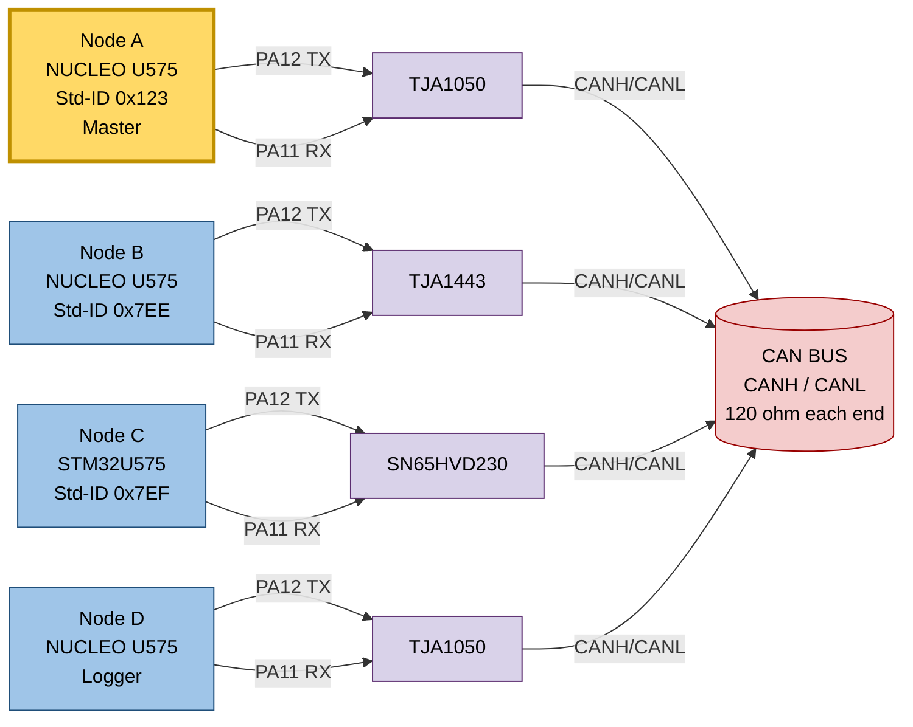
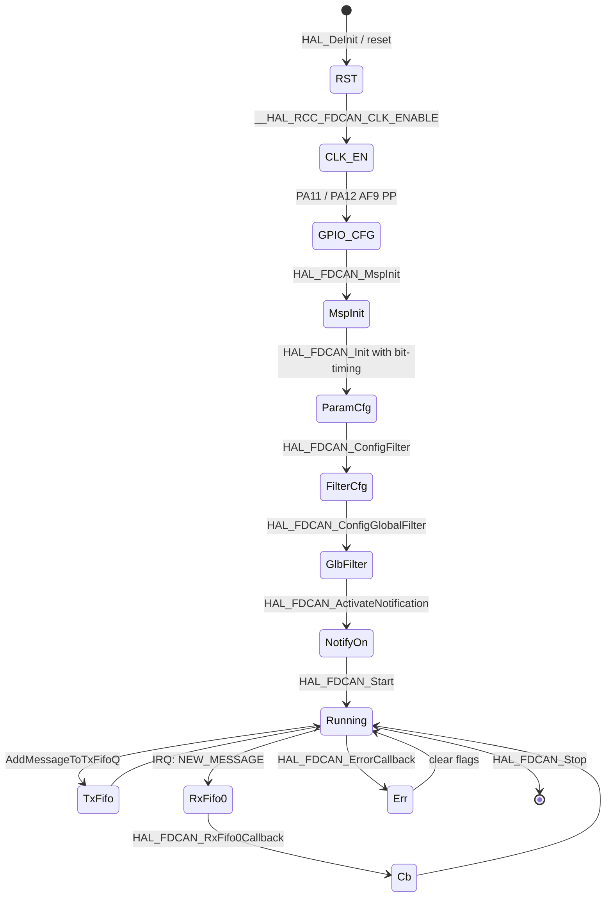
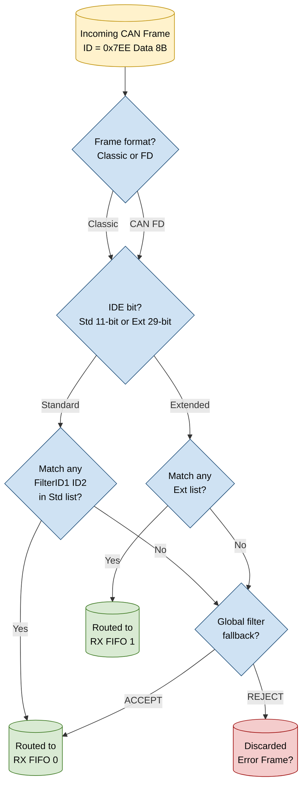

# Configuring and Implementing CAN Communication between Multiple STM32U575 Microcontrollers

<!-- SECTION_1_START -->

# Configuring and Implementing CAN Communication between Multiple STM32U575 Microcontrollers

## 1. Core Technical Definition

**Controller Area Network (CAN)** is a robust, multi-master, differential, message-oriented serial bus protocol originally standardized in **ISO 11898-1** and widely used in automotive, industrial automation, and embedded distributed control systems. It allows multiple **Electronic Control Units (ECUs)** to communicate over a single twisted-pair bus without a host controller.

The **STM32U575** from STMicroelectronics integrates the new-generation **FDCAN (Flexible Data-rate CAN)** peripheral, which is fully compliant with:

- **ISO 11898-1:2015** (Classical CAN 2.0A/2.0B and CAN FD)
- **ISO 11898-1:2024** updates
- Bosch CAN FD specification v1.0

> [!IMPORTANT]
> In STM32U5 nomenclature, the peripheral is called **FDCAN** but it fully supports both *Classic CAN* (max 1 Mbps, 8-byte payload) and *CAN FD* (max 5 Mbps, 64-byte payload). The HAL APIs are prefixed with `HAL_FDCAN_`.

A standard **CAN data frame** (Classic CAN) is composed of:

- **SOF** (1 dominant bit)
- **Arbitration Field** — 11-bit **Standard ID** (or 29-bit Extended ID) + RTR bit
- **Control Field** — IDE, r0, 4-bit **DLC** (Data Length Code)
- **Data Field** — 0 to 8 bytes
- **CRC Field** — 15-bit CRC + 1-bit delimiter
- **ACK Field** — 2 bits
- **EOF** — 7 recessive bits
- **IFS** — 3 recessive bits (inter-frame space)

**Bit stuffing** is applied after the SOF up to the CRC: a complementary bit is inserted whenever 5 consecutive identical bits appear, guaranteeing a DC-balanced line for clock recovery.

## 2. Intuitive Analogy (Real-World Picture)

> [!NOTE]
> **Analogy — The "Conference Call" model**
> Imagine a conference call with **5 participants** (your STM32U575 boards), all sharing a single phone line (the **CAN bus**). When anyone wants to speak, they whisper a unique **priority tag** (the **Message ID**, where *lower numeric value = higher priority*). If two people start talking at the same instant, the one with the more *urgent* (lower) ID "wins" and continues — the other politely backs off (**non-destructive CSMA/CD arbitration**). Each participant has a personal filter (their *post-it note* with allowed IDs): they only *listen* to topics they care about, ignoring the rest. A hardware **interpreter** (the **CAN transceiver**, e.g., TJA1050 or TJA1443) translates the digital logic levels of the MCU into robust differential voltages on the twisted pair.

**Geometric Intuition (CAN Bit Time):**

$$
\text{One CAN Bit} \;=\; \underbrace{1 \cdot t_q}_{\text{Sync Seg}} \;+\; \underbrace{\text{Prop Seg} + \text{Phase Seg 1}}_{T_{SEG1}} \;+\; \underbrace{\text{Phase Seg 2}}_{T_{SEG2}}
$$

The bit is sampled near the end of Phase Seg 1. **Sync Seg** is fixed at 1 $t_q$ and is where every receiver synchronizes the falling edge of SOF. **Prop Seg** compensates for physical line delays (cable + transceiver + ECU propagation). **Phase Seg 1/2** absorb clock drift between nodes — they are the "resynchronization" cushions.

> [!VISUALIZATION CONTROL]
> **Concept:** CAN Nominal Bit Time Partitioning
> **Desmos Input Equations / Graph Specification:**
> * `f(x) = 0` for `0 <= x <= 1` → Sync segment (fixed 1 tq)
> * `f(x) = 0` for `1 < x <= 14` → TSEG1 (Prop + Phase1)
> * `f(x) = 0` for `14 < x <= 16` → TSEG2 (Phase2)
> * Sample point marker at `x = 14.5` (≈87.5 % of bit)
> **Visual Description:** A horizontal time axis divided into 16 equal time quanta $t_q$. The sample point (vertical dashed line) falls inside TSEG1, near its end — the canonical ISO 11898 sample point is at **87.5 %** of the bit. The shaded "Resync Jump Width" (SJW) region straddles the boundary between TSEG1 and TSEG2.

---

<!-- SECTION_1_END -->

<!-- SECTION_2_START -->

# Deep Theoretical Analysis and KTU High-Yield Formula Sheet

## 1. Layered Architecture of a CAN Node

A CAN bus node consists of **four conceptual layers**, mapped to STM32U575 hardware as follows:

| OSI Layer | CAN Concept | STM32U575 Implementation |
|---|---|---|
| Application | User code, message semantics | Application firmware (HAL callbacks) |
| Data Link | Frame formatting, arbitration, ACK, error handling | **FDCAN IP** core |
| Physical (digital) | Bit timing, sampling | FDCAN protocol engine + bit timing unit |
| Physical (analog) | Differential voltages, bus levels | **External transceiver** (TJA1050 / TJA1443 / SN65HVD230) |

The STM32U575 FDCAN handles layers 1, 2, and part of the application filter list. The **external transceiver** is mandatory because the FDCAN peripheral outputs/inputs *digital* signals (TTL/CMOS on dedicated pins) — it does **not** drive the differential bus directly.

## 2. Bit Timing Theory (Classic CAN)

The FDCAN peripheral derives a **time quantum** $t_q$ from the peripheral clock:

$$
t_q \;=\; \frac{N\!B\!R\!P}{f_{FDCAN\_CLK}}
$$

One nominal bit time occupies:

$$
T_{bit} \;=\; \bigl(1 + N\!T_{SEG1} + N\!T_{SEG2}\bigr) \cdot t_q
$$

Nominal bit rate:

$$
f_{baud} \;=\; \frac{1}{T_{bit}} \;=\; \frac{f_{FDCAN\_CLK}}{N\!B\!R\!P \cdot (1 + N\!T_{SEG1} + N\!T_{SEG2})}
$$

The **sample point** is critical — it must lie between 50 % and 90 % of the bit, and ISO 11898 strongly recommends **75 % to 87.5 %**:

$$
\text{Sample Point} \;=\; \frac{1 + N\!T_{SEG1}}{1 + N\!T_{SEG1} + N\!T_{SEG2}} \times 100\%
$$

The **Synchronization Jump Width (SJW)** defines the maximum number of $t_q$ that a resynchronization can shorten or lengthen a bit. ISO 11898 mandates $1 \le SJW \le \min(4, T_{SEG2})$.

> [!NOTE]
> **Why a sample point near 87.5 %?** It gives the maximum time for the wave to physically propagate down the cable, be reflected, and still settle at the receiver before sampling — a key reason CAN is robust in harsh automotive environments.

## 3. CAN FD Bit Timing (Two Segments)

CAN FD adds a *data* bit rate (typically faster) configured by `DBRP`, `DT_{SEG1}`, `DT_{SEG2}`. The arbitration phase keeps the classic (slower) rate to preserve compatibility:

$$
f_{baud,arb} \;=\; \frac{f_{FDCAN\_CLK}}{N\!B\!R\!P \cdot (1 + N\!T_{SEG1} + N\!T_{SEG2})}
$$

$$
f_{baud,data} \;=\; \frac{f_{FDCAN\_CLK}}{D\!B\!R\!P \cdot (1 + D\!T_{SEG1} + D\!T_{SEG2})}
$$

The `BRS` (Bit Rate Switch) bit in the FD frame header signals receivers to switch to the data rate after the arbitration field.

## 4. Message RAM, Filters, and FIFOs

The FDCAN peripheral contains a **dedicated message RAM** (independent of main SRAM) storing:

- **Filter list** (Standard + Extended)
- **RX FIFO 0** and **RX FIFO 1** message elements
- **TX FIFO / TX Queue** elements
- **TX Event FIFO** elements

Each element occupies a fixed number of 32-bit words (e.g., 2 words for a Classic CAN RX filter). The user programs only the **element count**; the hardware auto-computes RAM addresses.

### Filter Types

| Filter Type | Behaviour |
|---|---|
| **Range Filter** | Accept IDs in [FilterID1, FilterID2] |
| **Mask Filter** | Accept IDs where `(ID & FilterID2) == FilterID1` |
| **Dual ID** (extended) | Accept only FilterID1 *or* FilterID2 |

## 5. KTU Formula Sheet / Cheat Sheet

| Symbol | Meaning | Formula / Value | Units |
|---|---|---|---|
| $f_{FDCAN\_CLK}$ | FDCAN peripheral clock (from PLL-Q on STM32U5) | e.g. **80** | MHz |
| $N\!B\!R\!P$ | Nominal Baud Rate Prescaler | $\ge 1$ | — |
| $t_q$ | Time quantum | $\dfrac{N\!B\!R\!P}{f_{FDCAN\_CLK}}$ | s |
| $N\!T_{SEG1}$ | Nominal Time Segment 1 (Prop + Phase1) | $2 \dots 256$ | $t_q$ |
| $N\!T_{SEG2}$ | Nominal Time Segment 2 (Phase2) | $2 \dots 128$ | $t_q$ |
| $N\!S\!J\!W$ | Nominal Synchronization Jump Width | $1 \dots 128$ | $t_q$ |
| $T_{bit}$ | Nominal bit time | $(1+N\!T_{SEG1}+N\!T_{SEG2}) \cdot t_q$ | s |
| $f_{baud}$ | Nominal bit rate | $\dfrac{f_{FDCAN\_CLK}}{N\!B\!R\!P \cdot (1+N\!T_{SEG1}+N\!T_{SEG2})}$ | bps |
| SP | Sample Point | $\dfrac{1+N\!T_{SEG1}}{1+N\!T_{SEG1}+N\!T_{SEG2}}$ | — |
| $t_{prop}$ | Physical loop delay | $\le N\!T_{SEG1} \cdot t_q$ | s |
| $R_{term}$ | Bus termination resistor | **120** | $\Omega$ |
| $V_{diff-dom}$ | Differential dominant voltage | $\ge 1.5$ | V |
| $V_{diff-rec}$ | Differential recessive voltage | $\le 0.5$ | V |

> [!IMPORTANT]
> **No pipes inside table cells** — every absolute value, modulus, or such symbol is written using $\vert \cdot \vert$ or `\\vert` in $\mathrm{\LaTeX}$ form to keep Markdown tables intact.

## 6. Real-World Engineering Utility

CAN remains the **de-facto automotive bus** because of:

- **Deterministic worst-case latency** (priority-based arbitration, not collision-detection retries)
- **Robust differential signalling** surviving ±25 V transients, withstanding **8 kV ESD**
- **Built-in error detection**: bit monitoring, bit stuffing, CRC, ACK, form check — yielding a **Hamming Distance = 6** (5 consecutive bit errors can be detected)
- **Multi-drop topology** — up to **30+ nodes** at 1 Mbps over ~40 m, or fewer nodes at 1 km

In production you will see CAN used in **vehicle ECUs** (engine, ABS, airbags, body control), **industrial PLC fieldbuses** (CANopen, DeviceNet, J1939), **medical instruments**, **agricultural machinery**, and increasingly as a **redundant low-level backbone** inside EV battery management systems (BMS).

---

<!-- SECTION_2_END -->

<!-- SECTION_3_START -->

# Step-by-Step Derivations, Calculations, and Code Implementation

## 1. Worked Bit-Timing Calculation (Classic CAN @ 500 kbps)

**Given:**
- $f_{FDCAN\_CLK} = 80~\mathrm{MHz}$ (PLL-Q on STM32U575, APB1 bus = 80 MHz, FDCAN clock = 80 MHz)
- Target nominal bit rate $f_{baud} = 500~\mathrm{kbps}$

**Step 1 — Compute required time quanta per bit**

$$
N\!B\!R\!P \cdot (1 + N\!T_{SEG1} + N\!T_{SEG2}) \;=\; \frac{80 \times 10^{6}}{500 \times 10^{3}} \;=\; 160
$$

**Step 2 — Choose prescaler to keep $t_q$ in the recommended 100–500 ns range**

Try $N\!B\!R\!P = 10$:

$$
t_q \;=\; \frac{10}{80 \times 10^{6}} \;=\; 125~\mathrm{ns} \quad (\text{valid range})
$$

**Step 3 — Distribute the remaining 16 $t_q$**

$$
1 + N\!T_{SEG1} + N\!T_{SEG2} \;=\; \frac{160}{10} \;=\; 16
$$

Choose $N\!T_{SEG1} = 13$ and $N\!T_{SEG2} = 2$ (with $N\!S\!J\!W = 1$).

**Step 4 — Verify sample point**

$$
SP \;=\; \frac{1 + 13}{1 + 13 + 2} \;=\; \frac{14}{16} \;=\; 87.5~\% \quad \checkmark
$$

> [!NOTE]
> 87.5 % is the **most common** CAN sample point in commercial stacks (Vector, Bosch, CANopen). Lower values (e.g., 75 %) are sometimes used for *very long* buses where round-trip delay dominates.

**Step 5 — Verify physical compatibility**

For a 40 m cable, propagation delay ≈ 5 ns/m × 40 = 200 ns (one way), round-trip ≈ 400 ns = 3.2 $t_q$. Thus $N\!T_{SEG1} \ge 4$ is safe. Our $N\!T_{SEG1} = 13$ provides ample margin.

## 2. Clock Tree Setup on STM32U575

The FDCAN peripheral is clocked from a dedicated clock that must be **enabled** and **sourced** correctly:

```c
/* Enable FDCAN clock (kernel clock from PLL-Q) */
__HAL_RCC_FDCAN_CLK_ENABLE();

/* Make sure PLL-Q is configured to 80 MHz in RCC */
__HAL_RCC_PLL_ENABLE();
/* Example: PLL config — PLL1-Q = 80 MHz with PLL1-N=40, M=4, Q=2 (crystal 8 MHz) */
```

In STM32CubeIDE, the **Clock Configuration** tab should show:

| Domain | Frequency |
|---|---|
| HSE (crystal) | **8** MHz |
| PLL1-M | /4 → 2 MHz |
| PLL1-N | ×40 → 80 MHz |
| PLL1-Q | /2 → 80 MHz → **FDCAN clk** |
| AHB / APB1 / APB2 | 80 / 80 / 80 MHz |

> [!IMPORTANT]
> On STM32U5, **FDCAN clock divider** can be `FDCAN_CLOCK_DIV1`, `DIV2`, `DIV4`, `DIV6`, `DIV8`, `DIV10`, `DIV12`, `DIV14`, `DIV16`. Use `DIV1` if the kernel clock is already at the target $t_q$ resolution; otherwise divide.

## 3. GPIO Pinout for FDCAN1 (Nucleo-U575ZI-Q)

| Pin | Function | AF | Notes |
|---|---|---|---|
| **PA12** | FDCAN1_TX | AF9 | Push-pull, no pull, **high speed** |
| **PA11** | FDCAN1_RX | AF9 | Input, no pull, optional internal pull-up |
| (Alt) **PD1 / PD0** | FDCAN1_TX / RX | AF9 | Used if PA11/12 are taken by other peripherals |

## 4. Complete HAL-Based Multi-Node CAN Implementation (Transmitter Node)

```c
/* === main.c — STM32U575 CAN Transmitter (Node A) === */
#include "main.h"

FDCAN_HandleTypeDef hfdcan1;
FDCAN_TxHeaderTypeDef TxHeader;
uint8_t TxData[8] = { 0xA1, 0xB2, 0xC3, 0xD4, 0xE5, 0xF6, 0x11, 0x22 };

/* Function prototypes */
void SystemClock_Config(void);
static void MX_GPIO_Init(void);
static void MX_FDCAN1_Init(void);
void CAN_Send_Standard_Message(uint16_t stdId, uint8_t *payload, uint8_t len);
void Error_Handler(void);

int main(void)
{
    HAL_Init();
    SystemClock_Config();
    MX_GPIO_Init();
    MX_FDCAN1_Init();

    /* Start the FDCAN peripheral */
    if (HAL_FDCAN_Start(&hfdcan1) != HAL_OK) {
        Error_Handler();
    }

    /* Main loop: broadcast a message every 500 ms */
    uint16_t counter = 0;
    while (1) {
        TxData[0] = (uint8_t)(counter >> 8);
        TxData[1] = (uint8_t)(counter & 0xFF);
        CAN_Send_Standard_Message(0x123, TxData, 8);
        counter = (counter + 1) & 0xFFFF;
        HAL_Delay(500);
    }
}

/* ---- FDCAN1 peripheral init: 500 kbps classic CAN, 80 MHz clk ---- */
static void MX_FDCAN1_Init(void)
{
    hfdcan1.Instance                  = FDCAN1;
    hfdcan1.Init.ClockDivider         = FDCAN_CLOCK_DIV1;
    hfdcan1.Init.FrameFormat          = FDCAN_FRAME_CLASSIC;
    hfdcan1.Init.Mode                 = FDCAN_MODE_NORMAL;
    hfdcan1.Init.AutoRetransmission   = ENABLE;
    hfdcan1.Init.TransmitPause        = DISABLE;
    hfdcan1.Init.ProtocolException    = ENABLE;

    /* === Bit timing from Section 1 of this module === */
    hfdcan1.Init.NominalPrescaler     = 10;   /* NBRP */
    hfdcan1.Init.NominalTimeSeg1      = 13;   /* NTSEG1 */
    hfdcan1.Init.NominalTimeSeg2      = 2;    /* NTSEG2 */
    hfdcan1.Init.NominalSyncJumpWidth = 1;    /* NSJW */

    /* CAN FD data phase (not used in classic mode but must be filled) */
    hfdcan1.Init.DataPrescaler        = 1;
    hfdcan1.Init.DataTimeSeg1         = 1;
    hfdcan1.Init.DataTimeSeg2         = 1;
    hfdcan1.Init.DataSyncJumpWidth    = 1;

    hfdcan1.Init.StdFiltersNbr        = 1;
    hfdcan1.Init.ExtFiltersNbr        = 0;
    hfdcan1.Init.TxFifoQueueMode      = FDCAN_TX_FIFO_OPERATION;
    hfdcan1.Init.TxBuffersNbr         = 0;
    hfdcan1.Init.TxEventsNbr          = 0;
    hfdcan1.Init.RxBuffersNbr         = 0;
    hfdcan1.Init.RxFifo0ElmtsNbr      = 1;
    hfdcan1.Init.RxFifo0ElmtSize      = FDCAN_DATA_BYTES_8;
    hfdcan1.Init.RxFifo1ElmtsNbr      = 0;
    hfdcan1.Init.RxFifo1ElmtSize      = FDCAN_DATA_BYTES_8;
    hfdcan1.Init.MessageRAMOffset    = 0;

    if (HAL_FDCAN_Init(&hfdcan1) != HAL_OK) {
        Error_Handler();
    }

    /* Configure GPIO for FDCAN1 (PA11/PA12) inside HAL_FDCAN_MspInit */
}

/* ---- Send one standard data frame ---- */
void CAN_Send_Standard_Message(uint16_t stdId, uint8_t *payload, uint8_t len)
{
    if (len > 8) len = 8;                                /* Classic CAN max */

    TxHeader.Identifier          = stdId;                /* 11-bit ID */
    TxHeader.IdType              = FDCAN_STANDARD_ID;
    TxHeader.TxFrameType         = FDCAN_DATA_FRAME;
    TxHeader.DataLength          = (FDCAN_DataLengthType)(len << 16);
    TxHeader.ErrorStateIndicator = FDCAN_ESI_ACTIVE;
    TxHeader.BitRateSwitch       = FDCAN_BRS_OFF;
    TxHeader.FDFormat            = FDCAN_CLASSIC_CAN;
    TxHeader.TxEventFifoControl  = FDCAN_NO_TX_EVENTS;
    TxHeader.MessageMarker       = 0;

    /* Use a 1-tick timeout to avoid busylocks */
    if (HAL_FDCAN_AddMessageToTxFifoQ(&hfdcan1, &TxHeader, payload) != HAL_OK) {
        Error_Handler();
    }
}

/* ---- Msp init: clock, GPIO, NVIC ---- */
void HAL_FDCAN_MspInit(FDCAN_HandleTypeDef *hfdcan)
{
    GPIO_InitTypeDef GPIO_InitStruct = {0};
    if (hfdcan->Instance == FDCAN1) {
        __HAL_RCC_FDCAN_CLK_ENABLE();
        __HAL_RCC_GPIOA_CLK_ENABLE();

        /* PA12 = FDCAN1_TX, PA11 = FDCAN1_RX (AF9) */
        GPIO_InitStruct.Pin       = GPIO_PIN_11 | GPIO_PIN_12;
        GPIO_InitStruct.Mode      = GPIO_MODE_AF_PP;
        GPIO_InitStruct.Pull      = GPIO_NOPULL;
        GPIO_InitStruct.Speed     = GPIO_SPEED_FREQ_VERY_HIGH;
        GPIO_InitStruct.Alternate = GPIO_AF9_FDCAN1;
        HAL_GPIO_Init(GPIOA, &GPIO_InitStruct);

        /* FDCAN1 interrupt priority for RX/TX notifications */
        HAL_NVIC_SetPriority(FDCAN1_IT0_IRQn, 5, 0);
        HAL_NVIC_EnableIRQ(FDCAN1_IT0_IRQn);
    }
}
```

## 5. Receiver Node with Filtering and Interrupt

```c
/* === main.c — STM32U575 CAN Receiver (Node B) === */
FDCAN_HandleTypeDef hfdcan1;
FDCAN_RxHeaderTypeDef RxHeader;
uint8_t RxData[8];
volatile uint8_t canRxFlag = 0;

/* Callback declared in USER CODE BEGIN 0 */
void HAL_FDCAN_RxFifo0Callback(FDCAN_HandleTypeDef *hfdcan, uint32_t RxFifo0ITs)
{
    if ((RxFifo0ITs & FDCAN_IT_RX_FIFO0_NEW_MESSAGE) != 0U) {
        if (HAL_FDCAN_GetRxMessage(hfdcan, FDCAN_RX_FIFO0, &RxHeader, RxData) == HAL_OK) {
            canRxFlag = 1;  /* Application main loop picks it up */
        }
    }
}

int main(void)
{
    HAL_Init();
    SystemClock_Config();
    MX_GPIO_Init();
    MX_FDCAN1_Init();

    /* === Filter: accept ONLY standard ID 0x123 (exact match) === */
    FDCAN_FilterTypeDef sFilterConfig;
    sFilterConfig.IdType         = FDCAN_STANDARD_ID;
    sFilterConfig.FilterIndex    = 0;
    sFilterConfig.FilterType     = FDCAN_FILTER_MASK;
    sFilterConfig.FilterConfig   = FDCAN_FILTER_TO_RXFIFO0;
    sFilterConfig.FilterID1      = 0x123;
    sFilterConfig.FilterID2      = 0x7FF;     /* mask: all bits must match */
    if (HAL_FDCAN_ConfigFilter(&hfdcan1, &sFilterConfig) != HAL_OK) Error_Handler();

    /* Activate RX FIFO0 "new message" interrupt */
    if (HAL_FDCAN_ActivateNotification(&hfdcan1,
            FDCAN_IT_RX_FIFO0_NEW_MESSAGE, 0) != HAL_OK) Error_Handler();

    /* Global filter: reject all non-matching standard & extended IDs */
    if (HAL_FDCAN_ConfigGlobalFilter(hfdcan1,
            FDCAN_REJECT, FDCAN_REJECT, FDCAN_FILTER_REMOTE, FDCAN_FILTER_REMOTE) != HAL_OK)
        Error_Handler();

    if (HAL_FDCAN_Start(&hfdcan1) != HAL_OK) Error_Handler();

    while (1) {
        if (canRxFlag) {
            canRxFlag = 0;
            /* RxHeader.Identifier holds the received 11-bit ID */
            /* RxData[0..7] holds the 8-byte payload */
            /* Toggle LED or process payload here */
        }
    }
}
```

## 6. Hardware Wiring Matrix (Multi-Node Lab Setup)

| Node | MCU Board | Transceiver | CANH / CANL Connection | Termination |
|---|---|---|---|---|
| Node A (Transmitter) | Nucleo-U575ZI-Q | TJA1050 / TJA1443 / SN65HVD230 | twisted pair (≈ 30 AWG) | **120 Ω** at bus end |
| Node B (Receiver 1) | Nucleo-U575ZI-Q | TJA1050 | same bus | — |
| Node C (Receiver 2) | STM32U575 custom PCB | TJA1443 | same bus | — |
| Node D (Logger) | Nucleo-U575ZI-Q | SN65HVD230 | same bus | **120 Ω** at bus end |

> [!NOTE]
> **Two 120 Ω resistors** are required — one at each **physical end** of the bus, never in the middle. The combined DC resistance seen between CANH and CANL is then ≈ 60 Ω, matching the differential impedance of standard CAN cable.

## 7. Bit Timing Worksheet Reference Table

| Target Bit Rate | $f_{FDCAN\_CLK}$ | $N\!B\!R\!P$ | $t_q$ | $N\!T_{SEG1}$ | $N\!T_{SEG2}$ | $N\!S\!J\!W$ | Sample Point |
|---|---|---|---|---|---|---|---|
| 1 Mbps | 80 MHz | 5 | 62.5 ns | 13 | 2 | 1 | 87.5 % |
| 500 kbps | 80 MHz | 10 | 125 ns | 13 | 2 | 1 | 87.5 % |
| 250 kbps | 80 MHz | 20 | 250 ns | 13 | 2 | 1 | 87.5 % |
| 125 kbps | 80 MHz | 40 | 500 ns | 13 | 2 | 1 | 87.5 % |
| 100 kbps | 80 MHz | 50 | 625 ns | 13 | 2 | 1 | 87.5 % |
| 33.3 kbps (low-speed CAN) | 8 MHz | 4 | 500 ns | 4 | 3 | 2 | 62.5 % |

---

<!-- SECTION_3_END -->

<!-- SECTION_4_START -->

# Structural Diagrams and Schematics

## 4.1 Multi-Node CAN Bus Topology



## 4.2 FDCAN1 Initialization and Runtime State Machine



## 4.3 FDCAN Filter Acceptance Flow



## 4.4 Sequential Bit-Time Partition (Worked Example)

```mermaid
gantt
    title CAN Bit Time @ 500 kbps  NBRP=10  TS1=13  TS2=2  SJW=1
    dateFormat X
    axisFormat %s
    section Bit Partition
    Sync Seg (1 tq)        :a1, 0, 1
    Prop + Phase1 (13 tq)  :a2, 1, 13
    Phase2 (2 tq)          :a3, 14, 2
    Sample Point           :crit, 14, 1
```



---

<!-- SECTION_4_END -->

<!-- SECTION_5_START -->

# KTU 2024 Scheme Examination Question Bank and Topic Recap

## Part A Questions (3 Marks Each)

### Q1. **[KTU University Exam – July 2024]** (CO3, Remember)
List any **three differences** between **Classic CAN** and **CAN FD**.

**Model Answer:**

1. **Maximum payload:** Classic CAN supports up to **8 bytes** of data per frame, while CAN FD supports up to **64 bytes**.
2. **Bit rate:** Classic CAN uses a single bit rate throughout the frame (max **1 Mbps**); CAN FD uses a slower rate during arbitration and switches to a faster data rate (up to **5 Mbps** or higher) for the data and CRC fields.
3. **CRC field:** Classic CAN uses a **15-bit CRC**, while CAN FD uses a **17-bit or 21-bit CRC** for stronger error detection, with extra stuff-bit counters.

> [!NOTE]
> *Any three valid differences are accepted. Common acceptable points: error detection strength, DLC encoding, frame structure, controller cost, use case.*

---

### Q2. **[KTU University Exam – Dec 2023]** (CO3, Understand)
What is the **function of a CAN transceiver** in a multi-node embedded system?

**Model Answer:**

A **CAN transceiver** (e.g., TJA1050, TJA1443, SN65HVD230) acts as the physical-layer interface between the **digital FDCAN peripheral** of the MCU and the **differential CAN bus** (CANH and CANL lines). It performs three main functions:

1. **Level translation** — converts the CMOS/TTL `TX` and `RX` logic signals of the FDCAN peripheral to ISO 11898-compliant differential voltages.
2. **Bus driving** — provides the high-current drive capability (up to ±50 mA short-circuit) required by the bus.
3. **Protection & isolation** — offers ESD protection, common-mode voltage tolerance, and bus-failure detection (e.g., dominant timeout), preventing damage to the MCU.

---

## Part B Questions (14 Marks Each, with Internal Choice)

> **Instructions (KTU pattern):** Answer **ONE** full question. Each sub-part carries 7 marks.

---

### Q1. **[KTU University Exam – July 2024]** (CO3, Understand + Apply)

#### Q1 (a) — 7 Marks (Understand)
Explain the **CAN data frame structure** for the **Classic CAN 2.0A standard** (11-bit ID) format with a neat sketch. Label the **SOF, Arbitration, Control, Data, CRC, ACK and EOF** fields along with their respective bit lengths.

**Model Answer Sketch:**

```
| 1 | 11 bits | 1 | 1 | 1 | 4 | 0–8 bytes | 15 | 1 | 1 | 1 | 7 | 3 |
 SOF  Std ID   RTR IDE r0  DLC  DATA       CRC  D   ACK D  EOF IFS
```

**Field-wise breakdown:**

| Field | Length | Description |
|---|---|---|
| SOF | **1 bit** | Dominant bit marking the start of frame |
| Arbitration | **11 bits** | Identifier (priority) |
| RTR | **1 bit** | Dominant for data frame, recessive for remote frame |
| IDE | **1 bit** | Dominant → standard 11-bit ID |
| r0 | **1 bit** | Reserved dominant |
| DLC | **4 bits** | Data length code: 0–8 |
| Data | **0–8 bytes** | Payload |
| CRC | **15 bits** | Cyclic Redundancy Check |
| CRC Delimiter | **1 bit** | Recessive |
| ACK Slot | **1 bit** | Transmitter sends recessive, any receiver overwrites with dominant |
| ACK Delimiter | **1 bit** | Recessive |
| EOF | **7 bits** | Recessive end-of-frame |
| IFS | **3 bits** | Inter-frame space |

**[Neat sketch: 3 marks] [Field descriptions: 3 marks] [Function of ACK: 1 mark]**

#### Q1 (b) — 7 Marks (Apply)
The FDCAN peripheral of STM32U575 is clocked at **80 MHz**. Calculate the bit-timing parameters $N\!B\!R\!P$, $N\!T_{SEG1}$, $N\!T_{SEG2}$ and $N\!S\!J\!W$ to achieve a nominal bit rate of **250 kbps** with a sample point of **87.5 %**. Show all steps.

**Step-by-step model solution:**

**Step 1 — Total $t_q$ per bit:**

$$
N\!B\!R\!P \cdot (1 + N\!T_{SEG1} + N\!T_{SEG2}) \;=\; \frac{80 \times 10^{6}}{250 \times 10^{3}} \;=\; 320
$$

**Step 2 — Choose $N\!B\!R\!P$ to keep $t_q$ between 100–500 ns:**

Pick $N\!B\!R\!P = 20 \Rightarrow t_q = 20/80~\mathrm{MHz} = 250~\mathrm{ns}$. **[1 Mark]**

**Step 3 — Find $N\!T_{SEG1}$ and $N\!T_{SEG2}$:**

$$
1 + N\!T_{SEG1} + N\!T_{SEG2} \;=\; \frac{320}{20} \;=\; 16
$$

$$
\text{Sample Point} \;=\; \frac{1 + N\!T_{SEG1}}{1 + N\!T_{SEG1} + N\!T_{SEG2}} \;=\; 0.875
$$

$$
1 + N\!T_{SEG1} \;=\; 0.875 \times 16 \;=\; 14 \;\Rightarrow\; N\!T_{SEG1} = 13
$$

$$
N\!T_{SEG2} \;=\; 16 - 14 \;=\; 2
$$

**Step 4 — Choose $N\!S\!J\!W$:**

Set $N\!S\!J\!W = 1$ (the smallest allowed, which is the most noise-tolerant).

**Final Answer:**

$$
N\!B\!R\!P = 20,\quad N\!T_{SEG1} = 13,\quad N\!T_{SEG2} = 2,\quad N\!S\!J\!W = 1
$$

**[Stating the baud-rate formula: 2 Marks] [Solving for prescaler and time segments: 3 Marks] [Sample point verification and SJW: 2 Marks]**

> [!WARNING]
> **Common valuation pitfall:** Students often forget to **verify the sample point** after computing the time segments. The examiner will deduct 1 mark if the sample point is not calculated. Also remember $N\!S\!J\!W$ must be $\le \min(4, N\!T_{SEG2})$.

---

### Q2. **[KTU University Exam – Dec 2023 — Alternative Choice]** (CO3, Understand + Apply)

#### Q2 (a) — 7 Marks (Understand)
Compare the **acceptance filtering** mechanisms in the FDCAN peripheral of STM32U575. Explain **Range Filter**, **Mask Filter**, and **Dual ID Filter** with one example each.

**Model Answer:**

The FDCAN peripheral in STM32U575 has a **hardware acceptance filter list** that screens incoming frames *before* they reach the FIFOs, saving CPU load.

| Filter Type | Operation | Example | Accepts |
|---|---|---|---|
| **Range Filter** | FilterID1 ≤ incoming ID ≤ FilterID2 | ID1=0x100, ID2=0x1FF | Any ID from 0x100 to 0x1FF inclusive |
| **Mask Filter** | `(incoming ID & ID2) == ID1` | ID1=0x200, ID2=0x7F0 | 0x200, 0x210, 0x220 … (only upper bits compared) |
| **Dual ID Filter (Extended only)** | ID == ID1 **or** ID == ID2 | ID1=0x18FEF100, ID2=0x18FF1100 | Exactly those two extended IDs |

**[Range Filter: 2 Marks] [Mask Filter with truth table: 3 Marks] [Dual ID with example: 2 Marks]**

#### Q2 (b) — 7 Marks (Apply)
Write the **STM32 HAL configuration code** to:
1. Initialize FDCAN1 for **Classic CAN**, 500 kbps, with the bit-timing parameters computed in Q1(b) above.
2. Configure a **mask filter** that accepts any standard ID where the upper 3 bits equal `101b` (i.e., IDs of the form `0b101xxxxxxxxx`).
3. Activate the **RX FIFO 0 new-message interrupt**.

**Model Answer Code (excerpt):**

```c
/* 1. Peripheral init */
hfdcan1.Instance                  = FDCAN1;
hfdcan1.Init.FrameFormat          = FDCAN_FRAME_CLASSIC;
hfdcan1.Init.Mode                 = FDCAN_MODE_NORMAL;
hfdcan1.Init.NominalPrescaler     = 10;
hfdcan1.Init.NominalTimeSeg1      = 13;
hfdcan1.Init.NominalTimeSeg2      = 2;
hfdcan1.Init.NominalSyncJumpWidth = 1;
hfdcan1.Init.StdFiltersNbr        = 1;
hfdcan1.Init.RxFifo0ElmtsNbr      = 1;
hfdcan1.Init.RxFifo0ElmtSize      = FDCAN_DATA_BYTES_8;
HAL_FDCAN_Init(&hfdcan1);                       /* [2 Marks] */

/* 2. Mask filter: bits 10..8 = 101b  ==>  ID1 = 0b101000000000 = 0x500 */
/* 11-bit ID:  101xxxxxxxxx  (8 LSBs don't care) */
/* Mask ID2    = 0b111000000000 = 0x700    */
FDCAN_FilterTypeDef sFilter = {
    .IdType       = FDCAN_STANDARD_ID,
    .FilterIndex  = 0,
    .FilterType   = FDCAN_FILTER_MASK,
    .FilterConfig = FDCAN_FILTER_TO_RXFIFO0,
    .FilterID1    = 0x500,
    .FilterID2    = 0x700
};
HAL_FDCAN_ConfigFilter(&hfdcan1, &sFilter);     /* [3 Marks] */

/* 3. Activate RX notification */
HAL_FDCAN_ActivateNotification(&hfdcan1,
    FDCAN_IT_RX_FIFO0_NEW_MESSAGE, 0);          /* [1 Mark] */

/* 4. Start the peripheral */
HAL_FDCAN_Start(&hfdcan1);                      /* [1 Mark] */
```

> [!WARNING]
> **Valuation Pitfall:** Many students mistakenly set `FilterID2 = 0x7FF` (all-ones) when they mean "exact match". For a mask filter, **ID2 is the mask, not a wildcard**. Setting it to `0x7FF` will *ignore* the mask and accept ALL standard IDs. The correct mask for "upper 3 bits must be 101" is `0x700` — *not* `0x7FF`. The examiner typically awards the 3-mask-filter mark only if the mask is computed correctly.

---

> [!WARNING]
> **KTU Examiner's General Pitfall Callout:**
> 1. **Do not forget the external transceiver** — the FDCAN peripheral *cannot* drive the bus directly.
> 2. **Do not skip termination** — without two **120 Ω** resistors at the ends, reflections corrupt bits at 500 kbps+.
> 3. **Do not forget to call `HAL_FDCAN_Start()`** — configuration is not active until then.
> 4. **In multi-node setups, always assign each node a unique ID range** using filters to avoid unnecessary CPU load.
> 5. **Never operate without a common ground** — the bus is differential, but the common-mode range is limited.

---

## Topic Recap and Important Things to Remember

> [!IMPORTANT]
> Use this checklist for a final 5-minute revision before the KTU exam.

- **CAN = multi-master, differential, message-priority bus** (ISO 11898-1).
- **STM32U575 uses the FDCAN peripheral** (HAL prefix `HAL_FDCAN_`).
- **Bit Rate Formula:**
  $f_{baud} = \dfrac{f_{FDCAN\_CLK}}{N\!B\!R\!P \cdot (1 + N\!T_{SEG1} + N\!T_{SEG2})}$.
- **Time quantum:** $t_q = N\!B\!R\!P / f_{FDCAN\_CLK}$.
- **Sample Point:** $(1 + N\!T_{SEG1}) / (1 + N\!T_{SEG1} + N\!T_{SEG2})$; **target ≈ 87.5 %**.
- **SJW range:** $1 \le N\!S\!J\!W \le \min(4, N\!T_{SEG2})$.
- **Classic CAN max:** **1 Mbps**, **8 bytes**; **CAN FD max:** **5 Mbps**, **64 bytes**.
- **Standard ID** = 11 bits; **Extended ID** = 29 bits; lower numerical ID = higher priority.
- **Filters operate BEFORE FIFOs** — `HAL_FDCAN_ConfigFilter()` with Range / Mask / Dual ID.
- **Always call:** `HAL_FDCAN_Init → ConfigFilter → ConfigGlobalFilter → ActivateNotification → Start`.
- **RX path:** `HAL_FDCAN_RxFifo0Callback()` (or RxFifo1) is invoked inside `FDCAN1_IT0_IRQn`.
- **TX path:** `HAL_FDCAN_AddMessageToTxFifoQ()` (Classic) or `_TxBuffer()` for FD.
- **Hardware essentials:** TJA1050 / TJA1443 / SN65HVD230 transceiver, **120 Ω** at each bus end, shared ground.
- **GPIO on Nucleo-U575:** PA11 = FDCAN1_RX, PA12 = FDCAN1_TX, Alternate Function **9**.
- **Clock source:** FDCAN clock = **PLL1-Q** on STM32U5; common value **80 MHz**.
- **Errors detected:** bit, stuff, CRC, form, ACK; total **Hamming Distance = 6**.
- **Maximum nodes:** ~30 at 1 Mbps over 40 m (electrical limit of transceiver), thousands in extended CANopen stacks logically.

<!-- SECTION_5_END -->
