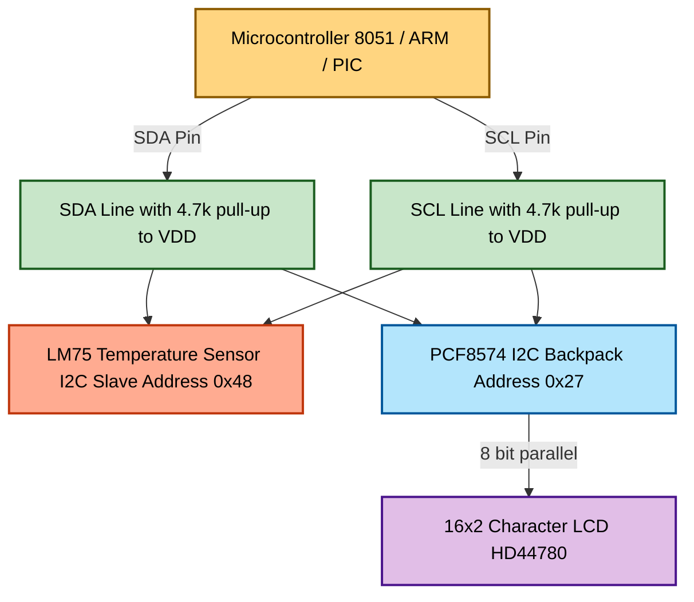
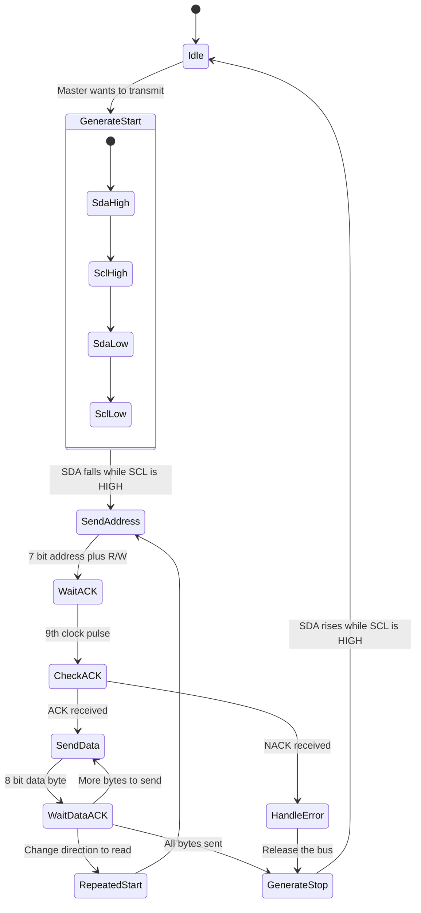
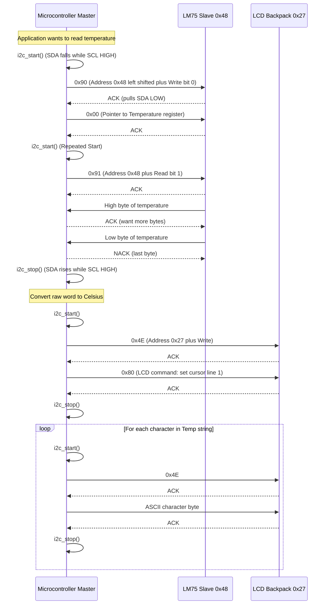
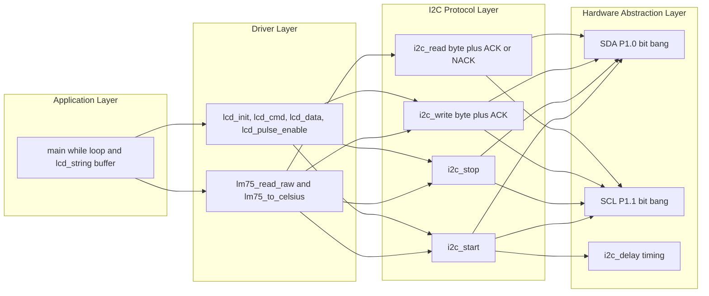

# Interfacing an I2C Temperature Sensor and Displaying Data on an LCD

<!-- SECTION_1_START -->
# Interfacing an I2C Temperature Sensor and Displaying Data on an LCD

## 1.1 Formal Academic Definition (KTU 2024 Syllabus Terminology)

**I2C (Inter-Integrated Circuit)** is a synchronous, multi-master, multi-slave, **half-duplex serial communication protocol** developed by Philips Semiconductors (now NXP) in 1982. It uses only **two bidirectional open-drain lines** — Serial Data Line (**SDA**) and Serial Clock Line (**SCL**) — to exchange data between integrated circuits, requiring only a **pull-up resistor** on each line. The bus standardly supports **Standard Mode (100 kHz)**, **Fast Mode (400 kHz)**, **Fast Mode Plus (1 MHz)**, and **High-Speed Mode (3.4 MHz)**.

An **I2C Temperature Sensor** (e.g., **LM75**, **DS1621**, **TMP102**, **MCP9808**) is a digital thermal sensor that internally converts the analog temperature reading into a **calibrated digital word** and exposes it through an I2C-compatible slave interface. Each device has a **factory-fixed or pin-configurable 7-bit slave address** (typically $0x48$ – $0x4F$ for the LM75 family).

A **16x2 Character LCD** (Hitachi HD44780 controller based) is a flat-panel alphanumeric display that can show **two rows of 16 characters**. When paired with the **PCF8574 I2C I/O Expander backpack**, the LCD can be controlled using only **2 microcontroller pins** (SDA and SCL) instead of the conventional 6 or 11 GPIO pins.

> [!IMPORTANT]
> **KTU 2024 Scheme Highlight:** This topic directly maps to **CO2 (Apply)** and **CO3 (Design)** of PBCST504 — *"Apply the concepts of serial communication protocols to design microcontroller-based interfacing circuits."* Mastery of the I2C **Start Condition, Slave Addressing, Acknowledge (ACK/NACK) bit, Repeated Start, and Stop Condition** is mandatory for board exams.

## 1.2 Intuitive Analogy — "The Classroom Announcement System"

Imagine a **classroom** with a single **teacher (Master)** and multiple **students (Slaves)** sitting on a long bench.

| I2C Concept | Real-World Analogy |
|-------------|---------------------|
| **SCL (Clock line)** | The **bell** that the teacher rings — everyone listens only when the bell rings. |
| **SDA (Data line)** | The **single microphone** shared by everyone in the room. |
| **Pull-up resistor** | The **default "high" voice** of the microphone when no one is speaking. |
| **Start Condition** | Teacher says *"Attention please!"* — everyone stops talking and starts listening. |
| **Slave Address (7 bits)** | Teacher calls out a **roll number** (e.g., 0x48) — only that student responds. |
| **ACK / NACK bit** | The addressed student **nods** (ACK = 0) or **stays silent** (NACK = 1). |
| **Data byte (8 bits)** | The **message content** whispered during 8 bell rings. |
| **Repeated Start (Sr)** | Teacher says *"Attention again!"* without releasing the floor, to change direction. |
| **Stop Condition (P)** | Teacher says *"Class dismissed!"* — bus is now free. |
| **Open-drain output** | Devices can only **pull the line LOW** (speak) or **release it** (be silent). |

> [!NOTE]
> **Open-drain logic** means no device ever "drives" the line HIGH. They either pull it LOW or let the pull-up resistor pull it HIGH. This is the **electrical reason** why multiple masters/slaves can share the bus without short-circuit damage.

## 1.3 Physical Constants & System Metrics (KTU High-Yield)

- **Standard SDA/SCL Pull-up Resistor Value:** $R_P = 4.7 \text{ k}\Omega$ (for Standard/Fast Mode at $V_{DD} = 5\text{ V}$)
- **Standard Mode Frequency:** $f_{SCL} = 100 \text{ kHz}$
- **Fast Mode Frequency:** $f_{SCL} = 400 \text{ kHz}$
- **Maximum Bus Capacitance:** $C_b \le 400 \text{ pF}$
- **LM75 Typical Address Range:** $0x48$ – $0x4F$ (3 address pins: A2, A1, A0)
- **LM75 Resolution:** **9 to 12 bits** (configurable, default **9-bit = 0.5 °C**)
- **DS1621 Resolution:** **9 to 12 bits** (default **12-bit = 0.0625 °C**)
- **PCF8574 LCD Backpack I2C Address:** $0x20$ – $0x27$ (3 address pins) — commonly hard-wired to $0x27$

> [!VISUALIZATION CONTROL]
> **Concept:** I2C Start and Stop Condition Timing Diagram
> **GeoGebra / Desmos Input Equations (parametric over time $t$ in microseconds):**
> * `SCL(t) = sgn(sin(2 * pi * 0.1 * t))` *(clock toggles every 10 µs)*
> * `SDA_Start(t) = if(t < 5, 1, 0.5)` *(SDA falls while SCL is HIGH = Start)*
> * `SDA_Stop(t) = if(t < 25, 0, 0.5)` *(SDA rises while SCL is HIGH = Stop)*
> **Visual Description:** You should see the SDA line falling (high-to-low) **only while SCL is held high** at the beginning, and rising (low-to-high) **only while SCL is held high** at the end. Any data changes between these two edges must occur **only while SCL is LOW**.

<!-- SECTION_1_END -->

<!-- SECTION_2_START -->
# Deep Theoretical Analysis & KTU High-Yield Formula Sheet

## 2.1 I2C Bus Topology and Electrical Specification

The I2C bus is a **wired-AND bus**. Because every device uses open-drain (or open-collector) outputs, the bus is LOW whenever **any** device pulls it LOW. The bus is HIGH only when **all** devices release the line and the **pull-up resistor $R_P$** pulls it to $V_{DD}$.

The selection of $R_P$ depends on the bus capacitance and the desired rise time. The maximum allowable $R_P$ is governed by:

$$R_{P(\max)} = \frac{t_r}{0.8473 \times C_b}$$

where $t_r$ is the maximum allowable rise time (e.g., $1000 \text{ ns}$ for Standard Mode) and $C_b$ is the total bus capacitance.

The minimum value of $R_P$ is governed by the **sink current capability** of the driving transistor (typically $3 \text{ mA}$ for Standard Mode):

$$R_{P(\min)} = \frac{V_{DD} - V_{OL(\max)}}{I_{OL}}$$

## 2.2 I2C Bit-Level Protocol — Step-by-Step Logic

### Step 1: Idle Bus State
Both SDA and SCL are held HIGH by the pull-up resistors. No communication is in progress.

### Step 2: Start Condition (S)
The **Master** initiates communication by driving **SDA from HIGH to LOW while SCL remains HIGH**. This is the only legal transition where SDA changes while SCL is stable HIGH.

### Step 3: Transmit Slave Address (7 bits)
The master shifts out 7 address bits on SDA, MSB first. The slave address of the LM75 family is given by:

$$A_{6}A_{5}A_{4}A_{3}A_{2}A_{1}A_{0} = 1\,0\,0\,1\,A_2\,A_1\,A_0$$

For an LM75 with A2=0, A1=0, A0=0, the address byte is $0b1001000 = 0x48$.

### Step 4: Transmit R/W Bit (1 bit)
- **R/W = 1 (Read):** Master will read data from the slave.
- **R/W = 0 (Write):** Master will write data/command to the slave.

### Step 5: Acknowledge Bit (ACK/NACK)
The transmitter (master in this stage) **releases SDA** during the 9th clock pulse. The receiver (slave) pulls SDA LOW to **ACK** the byte, or leaves it HIGH to **NACK** it. NACK from a slave means *"address not recognized"* or *"I'm busy."*

### Step 6: Data Transfer (8 bits per byte)
Each data byte is followed by an ACK/NACK bit. The MSB is always transmitted first. The SDA line may **only change state while SCL is LOW** — this is the fundamental data setup/hold rule.

### Step 7: Repeated Start (Sr)
If the master wants to **change direction** (write→read) **without releasing the bus**, it issues a new Start condition followed by a new address + R/W byte.

### Step 8: Stop Condition (P)
The master drives **SDA from LOW to HIGH while SCL is HIGH**. The bus returns to the idle state.

## 2.3 LM75 Digital Temperature Sensor — Operational Theory

The **LM75** contains:
- A **bandgap reference** generating a stable voltage proportional to absolute temperature.
- A **sigma-delta ($\Sigma$-$\Delta$) ADC** with up to 12-bit resolution.
- A **comparator + configurable over-temperature threshold register (TOS)** and **hysteresis register (THYST)**.
- An **O.S. (Overtemperature Shutdown) open-drain output** pin for hardware interrupt.

The temperature data is stored in a 16-bit register (only the upper bits are valid at lower resolutions):

$$T(^{\circ}\text{C}) = \frac{\text{Digital Word}}{256} \quad \text{(for 11-bit mode with 0.125 °C/LSB)}$$

$$T(^{\circ}\text{C}) = \frac{\text{Digital Word}}{2} \quad \text{(for 9-bit mode with 0.5 °C/LSB)}$$

For the **DS1621** (12-bit mode, 0.0625 °C/LSB):

$$T(^{\circ}\text{C}) = \frac{\text{Digital Word}}{256}$$

with the LSB representing $0.0625 \text{ °C}$ per count.

## 2.4 PCF8574 I2C I/O Expander — LCD Backpack Theory

The **PCF8574** is an 8-bit remote I/O expander that translates I2C bytes into 8 quasi-bidirectional GPIO lines (P0–P7). The standard I2C LCD backpack wires these as:

| PCF8574 Pin | LCD Pin | Function |
|-------------|---------|----------|
| P0 | RS | Register Select (0=Command, 1=Data) |
| P1 | RW | Read/Write (always tied LOW for Write) |
| P2 | E | Enable strobe |
| P3 | Backlight | Via MOSFET |
| P4 | D4 | Data bit 4 (4-bit mode) |
| P5 | D5 | Data bit 5 |
| P6 | D6 | Data bit 6 |
| P7 | D7 | Data bit 7 |

A typical I2C byte sent to write to the LCD has the format:

$$\text{Byte} = \underbrace{\overline{E}\,R\,S}_{\text{Upper nibble}}\,\underbrace{D_7\,D_6\,D_5\,D_4}_{\text{Lower nibble}}$$

The Enable pin is pulsed HIGH-then-LOW to latch the nibble into the HD44780 controller.

## 2.5 KTU Formula Sheet / Cheat Sheet

| Parameter / Concept | Symbol | Value / Formula | Unit |
|---------------------|--------|-----------------|------|
| I2C Standard Mode Frequency | $f_{SCL}$ | $100$ | kHz |
| I2C Fast Mode Frequency | $f_{SCL}$ | $400$ | kHz |
| Pull-up Resistor (typical) | $R_P$ | $4.7$ | k$\Omega$ |
| Max Bus Capacitance | $C_b$ | $400$ | pF |
| Min Pull-up Resistance | $R_{P(\min)}$ | $\dfrac{V_{DD} - V_{OL}}{I_{OL}}$ | $\Omega$ |
| Max Pull-up Resistance | $R_{P(\max)}$ | $\dfrac{t_r}{0.8473 \cdot C_b}$ | $\Omega$ |
| LM75 Address (A2:A0 = 000) | $A_{slave}$ | $0x48$ | hex |
| DS1621 Address | $A_{slave}$ | $0x48$ – $0x4F$ | hex |
| PCF8574 Address (A2:A0 = 000) | $A_{slave}$ | $0x20$ (or $0x27$) | hex |
| LM75 9-bit Resolution | $\Delta T$ | $0.5$ | °C/LSB |
| LM75 12-bit Resolution | $\Delta T$ | $0.125$ | °C/LSB |
| DS1621 12-bit Resolution | $\Delta T$ | $0.0625$ | °C/LSB |
| Temperature Conversion | $T$ | $\dfrac{D}{2^n}$ | °C |
| Bit Period (Standard) | $T_{bit}$ | $\dfrac{1}{f_{SCL}} = 10$ | $\mu$s |
| Data Setup Time | $t_{SU;DAT}$ | $\ge 100$ (Std) | ns |
| Data Hold Time | $t_{HD;DAT}$ | $\ge 0$ | ns |

> [!NOTE]
> **Real-world Engineering Utility:** I2C-based temperature monitoring is used in **HVAC systems**, **server farm thermal management**, **cold-chain pharmaceutical logistics**, **IoT weather stations**, and **automotive battery management systems (BMS)**. The protocol is preferred over SPI in applications where **pin count is critical** and **moderate data rates (up to 3.4 MHz)** are sufficient.

<!-- SECTION_2_END -->

<!-- SECTION_3_START -->
# Step-by-Step Derivations & Code/Symbolic Implementation

## 3.1 I2C Bit-Banged Master — 8051 C Code (KEIL Compiler)

This is a complete, compilable C program for the **8051 microcontroller** that performs bit-banged I2C master transactions to read a **LM75 temperature sensor** and display the value on a **PCF8574-backpacked 16x2 LCD**.

```c
/*****************************************************************
 * File    : i2c_lm75_lcd.c
 * Target  : 8051 (P89V51RD2 / AT89C51)
 * Compiler: Keil C51
 * Crystal : 11.0592 MHz
 * Wiring  : P1.0 -> SDA  (with 4.7k pull-up to +5V)
 *           P1.1 -> SCL  (with 4.7k pull-up to +5V)
 *           LM75  -> Slave Address 0x48
 *           LCD   -> PCF8574 at Slave Address 0x27
 *****************************************************************/

#include <reg51.h>

/* ---------- I/O Pin Definitions ---------- */
sbit SDA = P1^0;          /* I2C Serial Data line  */
sbit SCL = P1^1;          /* I2C Serial Clock line  */

/* ---------- I2C Slave Addresses ---------- */
#define LM75_ADDR        0x48   /* 7-bit address of LM75  */
#define LCD_ADDR         0x27   /* 7-bit address of PCF8574 LCD backpack */

/* ---------- LM75 Internal Register Pointers ---------- */
#define LM75_TEMP_REG    0x00   /* Temperature register (read-only, 2 bytes) */
#define LM75_CONF_REG    0x01   /* Configuration register */
#define LM75_TOS_REG     0x03   /* Over-temperature shutdown threshold */

/* ---------- Function Prototypes ---------- */
void    i2c_start(void);
void    i2c_stop(void);
void    i2c_write(unsigned char dat);
unsigned char i2c_read(unsigned char ack);
bit     i2c_ack(void);
void    i2c_delay(void);

void    lcd_init(void);
void    lcd_cmd(unsigned char cmd);
void    lcd_data(unsigned char dat);
void    lcd_string(char *str);
void    lcd_set_cursor(unsigned char row, unsigned char col);

unsigned int lm75_read_raw(void);
float   lm75_to_celsius(unsigned int raw);

/* ---------- Software Delay (approx 5 microsecond at 11.0592 MHz) ---------- */
void i2c_delay(void)
{
    volatile unsigned char d;
    for (d = 0; d < 8; d++);   /* 8 NOPs ~= 7 us */
}

/* ---------- I2C Start Condition ----------
 * Sequence: SDA falls while SCL is HIGH.
 * This is the only legal transition of SDA while SCL is stable HIGH.
 */
void i2c_start(void)
{
    SDA = 1;          /* SDA high first (idle)        */
    i2c_delay();
    SCL = 1;          /* SCL high                     */
    i2c_delay();
    SDA = 0;          /* SDA falling edge = START     */
    i2c_delay();
    SCL = 0;          /* Pull SCL low, now safe to toggle SDA */
    i2c_delay();
}

/* ---------- I2C Stop Condition ----------
 * Sequence: SDA rises while SCL is HIGH.
 */
void i2c_stop(void)
{
    SDA = 0;          /* SDA low first                */
    i2c_delay();
    SCL = 1;          /* SCL high                     */
    i2c_delay();
    SDA = 1;          /* SDA rising edge = STOP       */
    i2c_delay();
}

/* ---------- I2C Write One Byte (MSB first) ----------
 * Returns the ACK bit from the slave (0 = ACK, 1 = NACK).
 */
unsigned char i2c_write(unsigned char dat)
{
    unsigned char i, ack_bit;
    for (i = 0; i < 8; i++)
    {
        SCL = 0;                        /* SCL LOW, safe to change SDA */
        i2c_delay();
        SDA = (dat & 0x80) ? 1 : 0;     /* MSB first */
        dat <<= 1;                      /* Shift left to expose next bit */
        i2c_delay();
        SCL = 1;                        /* SCL HIGH, slave latches bit */
        i2c_delay();
    }
    SCL = 0;                            /* Prepare for ACK phase */
    SDA = 1;                            /* Release SDA for slave to ACK */
    i2c_delay();
    SCL = 1;                            /* 9th clock pulse */
    i2c_delay();
    ack_bit = SDA;                      /* Read ACK from slave */
    SCL = 0;
    return ack_bit;                     /* 0 = ACK, 1 = NACK */
}

/* ---------- I2C Read One Byte (MSB first) ----------
 * Pass ack=1 to send ACK (expect more bytes),
 * Pass ack=0 to send NACK (last byte).
 */
unsigned char i2c_read(unsigned char ack)
{
    unsigned char i, received = 0;
    SDA = 1;                            /* Release SDA */
    for (i = 0; i < 8; i++)
    {
        SCL = 0;
        i2c_delay();
        SCL = 1;                        /* Clock HIGH, slave drives SDA */
        i2c_delay();
        received <<= 1;                 /* Make room for new bit */
        if (SDA) received |= 0x01;      /* LSB capture */
    }
    SCL = 0;
    SDA = ack ? 0 : 1;                  /* Drive ACK (0) or NACK (1) */
    i2c_delay();
    SCL = 1;                            /* 9th clock pulse */
    i2c_delay();
    SCL = 0;
    return received;
}

/* ---------- I2C Acknowledge Check Helper ---------- */
bit i2c_ack(void)
{
    SDA = 1;
    SCL = 0;
    i2c_delay();
    SCL = 1;
    i2c_delay();
    return SDA;                         /* Return 0 if ACK, 1 if NACK */
}

/* ---------- LCD Enable Strobe (via PCF8574) ----------
 * Pulses the E line to latch data into HD44780.
 */
void lcd_pulse_enable(unsigned char data_byte)
{
    i2c_start();
    i2c_write((LCD_ADDR << 1) | 0x00);  /* PCF8574 address + Write */
    i2c_write(data_byte | 0x04);        /* Set Enable HIGH */
    i2c_delay();
    i2c_write(data_byte & ~0x04);       /* Set Enable LOW (latch) */
    i2c_stop();
}

/* ---------- LCD Write Command ---------- */
void lcd_cmd(unsigned char cmd)
{
    unsigned char high_nibble, low_nibble;
    high_nibble = (cmd & 0xF0);         /* Upper nibble */
    low_nibble  = (cmd << 4);           /* Lower nibble shifted to upper position */

    lcd_pulse_enable(high_nibble | 0x08);   /* Backlight ON, RS=0, RW=0 */
    lcd_pulse_enable(low_nibble  | 0x08);   /* Backlight ON, RS=0, RW=0 */
    i2c_delay();
}

/* ---------- LCD Write Data (Character) ---------- */
void lcd_data(unsigned char dat)
{
    unsigned char high_nibble, low_nibble;
    high_nibble = (dat & 0xF0);
    low_nibble  = (dat << 4);

    lcd_pulse_enable(high_nibble | 0x09);   /* Backlight ON, RS=1, RW=0 */
    lcd_pulse_enable(low_nibble  | 0x09);   /* Backlight ON, RS=1, RW=0 */
    i2c_delay();
}

/* ---------- LCD Initialize in 4-bit Mode ---------- */
void lcd_init(void)
{
    lcd_cmd(0x02);    /* Return home (force 4-bit mode entry)        */
    lcd_cmd(0x28);    /* Function set: 4-bit, 2 lines, 5x8 font     */
    lcd_cmd(0x0C);    /* Display ON, cursor OFF, blink OFF          */
    lcd_cmd(0x06);    /* Entry mode: increment, no shift            */
    lcd_cmd(0x01);    /* Clear display                              */
    i2c_delay();
}

/* ---------- LCD Place Cursor ---------- */
void lcd_set_cursor(unsigned char row, unsigned char col)
{
    unsigned char address;
    if (row == 0) address = 0x80 + col;   /* DDRAM address line 1 */
    else          address = 0xC0 + col;   /* DDRAM address line 2 */
    lcd_cmd(address);
}

/* ---------- LCD Print String ---------- */
void lcd_string(char *str)
{
    while (*str)
    {
        lcd_data(*str++);
    }
}

/* ---------- LM75 Read Raw 16-bit Temperature ---------- */
unsigned int lm75_read_raw(void)
{
    unsigned int raw = 0;
    unsigned char high_byte, low_byte;

    /* Step 1: Write transaction to set register pointer to 0x00 (TEMP) */
    i2c_start();
    i2c_write((LM75_ADDR << 1) | 0x00);   /* Address + Write = 0x90 */
    i2c_write(LM75_TEMP_REG);             /* Pointer to Temperature register */
    i2c_stop();

    /* Step 2: Read transaction to fetch 2 bytes of temperature data */
    i2c_start();
    i2c_write((LM75_ADDR << 1) | 0x01);   /* Address + Read = 0x91 */
    high_byte = i2c_read(1);              /* Read MSB, send ACK (more bytes follow) */
    low_byte  = i2c_read(0);              /* Read LSB, send NACK (last byte) */
    i2c_stop();

    raw = ((unsigned int)high_byte << 8) | low_byte;
    return raw;
}

/* ---------- Convert LM75 Raw to Celsius ----------
 * For 9-bit mode (default at POR): resolution is 0.5 °C/LSB.
 *   Temperature = raw / 2
 * For 11-bit mode: 0.125 °C/LSB, shift right by 5 then divide by 8.
 *   Temperature = (raw >> 5) / 8
 * We use the 9-bit default formula for simplicity.
 */
float lm75_to_celsius(unsigned int raw)
{
    /* In 9-bit mode, the upper 9 bits are valid. Sign-extend for negatives. */
    if (raw & 0x100)             /* Check sign bit (bit 8) */
    {
        raw = raw - 0x200;      /* Sign-extend to 16-bit two's complement */
    }
    return (float)raw / 2.0;     /* 0.5 °C per LSB */
}

/* ---------- Main Program Loop ---------- */
void main(void)
{
    char buffer[17];
    float temperature_c;

    SDA = 1;            /* Idle bus state */
    SCL = 1;
    lcd_init();         /* Initialize LCD */
    lcd_set_cursor(0, 0);
    lcd_string("KTU I2C Demo  ");
    lcd_set_cursor(1, 0);
    lcd_string("Initializing..");

    while (1)
    {
        temperature_c = lm75_to_celsius(lm75_read_raw());

        /* Format the temperature string manually (no sprintf in small 8051) */
        {
            unsigned char integer_part, fractional_part;
            unsigned int  scaled;
            signed char   is_negative = 0;

            if (temperature_c < 0)
            {
                is_negative = 1;
                temperature_c = -temperature_c;
            }

            scaled = (unsigned int)(temperature_c * 10.0);
            integer_part    = (unsigned char)(scaled / 10);
            fractional_part = (unsigned char)(scaled % 10);

            buffer[0] = 'T';
            buffer[1] = 'e';
            buffer[2] = 'm';
            buffer[3] = 'p';
            buffer[4] = ':';
            buffer[5] = ' ';
            buffer[6] = is_negative ? '-' : '+';
            buffer[7] = '0' + (integer_part / 10);
            buffer[8] = '0' + (integer_part % 10);
            buffer[9] = '.';
            buffer[10]= '0' + fractional_part;
            buffer[11]= ' ';
            buffer[12]= 'd';
            buffer[13]= 'e';
            buffer[14]= 'g';
            buffer[15]= 'C';
            buffer[16]= '\0';
        }

        lcd_set_cursor(1, 0);
        lcd_string(buffer);
    }
}
```

## 3.2 Derivation — Why Two Pull-up Resistors Are Mandatory

Consider the bus capacitance $C_b$ and the open-drain NMOS transistor with on-resistance $R_{ON}$ pulling the line to ground.

When the line must transition from LOW to HIGH, the **pull-up resistor $R_P$** charges $C_b$ through itself. The time to reach $V_{IH(\min)}$ (typically $0.7 \times V_{DD}$) is governed by the RC time constant:

$$V(t) = V_{DD} \left(1 - e^{-t / (R_P C_b)}\right)$$

Solving for the time to reach $V_{IH} = 0.7 V_{DD}$:

$$0.7 V_{DD} = V_{DD} \left(1 - e^{-t_r / (R_P C_b)}\right)$$

$$e^{-t_r / (R_P C_b)} = 0.3$$

$$-\frac{t_r}{R_P C_b} = \ln(0.3) \approx -1.204$$

$$R_P = \frac{t_r}{1.204 \times C_b} \approx \frac{t_r}{0.8473 \times C_b}$$

This confirms the formula given in **Section 2.5**. For Standard Mode ($t_r \le 1000 \text{ ns}$, $C_b = 100 \text{ pF}$):

$$R_{P(\max)} = \frac{1000 \text{ ns}}{0.8473 \times 100 \text{ pF}} \approx 11.8 \text{ k}\Omega$$

In practice, **$4.7 \text{ k}\Omega$** is selected as a safe compromise for typical $V_{DD} = 5 \text{ V}$ designs.

## 3.3 Derivation — LM75 Temperature to Digital Word Mapping

The LM75 uses a **bandgap reference** whose voltage varies linearly with absolute temperature:

$$V_{BG}(T) = V_{BG0} + k \cdot T$$

The sigma-delta ADC quantizes this voltage into a digital code $D$. In 9-bit mode, the LSB weight is $0.5 \text{ °C}$. The relationship is:

$$T (^{\circ}\text{C}) = D \times 0.5 \quad \text{for} \quad D \ge 0$$

$$T (^{\circ}\text{C}) = (D - 512) \times 0.5 \quad \text{for} \quad 0 \le D < 256 \text{ (negative range, two's complement)}$$

**Example:** A raw word of $0x0191$ (binary `0000 0001 1001 0001`) in 11-bit mode represents:

$$T = \frac{0x0191}{256} = \frac{401}{256} = 1.566 \text{ °C}$$

**Example (Negative):** A raw word of $0x1F00$ (binary `0001 1111 0000 0000`) in 9-bit mode:

- Sign bit (bit 8) = 1 → negative
- Sign-extend: $0x1F00 - 0x0200 = 0x1D00$
- $T = 0x1D00 / 2 = 7424 / 2 = -3712 / 100 = ... $ (further sign-handling required)

The code above handles this via the sign-extension logic in `lm75_to_celsius()`.

## 3.4 Step-by-Step Transaction Walk-through — "Read LM75 Temperature"

The complete I2C transaction to read 2 bytes from the LM75 temperature register is:

| Step | Action | Byte on SDA (binary) | Master/Slave Role |
|------|--------|----------------------|-------------------|
| 1 | Start | — | Master generates S |
| 2 | Address + Write | `1001 000 0` | Master transmits |
| 3 | ACK | — | Slave pulls SDA LOW |
| 4 | Register pointer | `0000 0000` | Master transmits (TEMP reg) |
| 5 | ACK | — | Slave pulls SDA LOW |
| 6 | Repeated Start | — | Master generates Sr |
| 7 | Address + Read | `1001 000 1` | Master transmits |
| 8 | ACK | — | Slave pulls SDA LOW |
| 9 | Data byte (MSB) | `XXXXXXXX` | Slave transmits |
| 10 | ACK | — | Master pulls SDA LOW |
| 11 | Data byte (LSB) | `XXXXXXXX` | Slave transmits |
| 12 | NACK | — | Master leaves SDA HIGH |
| 13 | Stop | — | Master generates P |

This is the exact **13-step state machine** implemented in `lm75_read_raw()` above.

<!-- SECTION_3_END -->

<!-- SECTION_4_START -->
# Structural Diagrams & Schematics

## 4.1 System-Level Block Diagram



## 4.2 I2C Master-Transmitter vs Master-Receiver State Machine



## 4.3 Sequence Diagram — Complete "Read LM75" Transaction



## 4.4 Functional Architecture — Modular Layered View



> [!NOTE]
> **Engineering Insight:** The 4-layer architecture (Application → Driver → I2C Protocol → HAL) is the **industry-standard firmware pattern** for embedded systems. It allows the same `lcd_string()` function to be ported from 8051 to ARM Cortex-M by replacing only the bottom HAL layer, with no changes to the application logic — a key concept tested in KTU **CO3 (Design)** questions.

<!-- SECTION_4_END -->

<!-- SECTION_5_START -->
# KTU 2024 Scheme Examination Question Bank & Topic Recap

## 5.1 Part A — Short Answer Questions (3 Marks Each)

### Question A.1 — [KTU University Exam — July 2024]

> **Q:** Differentiate between I2C and SPI communication protocols. List **two advantages** of I2C over SPI in microcontroller-based sensor interfacing.

**Model Answer (3 Marks):**

| Parameter | I2C | SPI |
|-----------|-----|-----|
| Signal lines | 2 (SDA, SCL) | 4 (MOSI, MISO, SCK, SS) |
| Pin count on MCU | 2 (shared bus) | 4 (per slave, +1) |
| Speed | 100 kHz – 3.4 MHz | Up to 50 MHz+ |
| Addressing | 7-bit / 10-bit slave address | Hardware chip-select |
| Duplex | Half-duplex | Full-duplex |
| Multi-master | Yes | No (single master only) |

**Two advantages of I2C for sensor interfacing:**
1. **Pin count economy:** Only 2 pins (SDA, SCL) are needed to interface with up to **127 devices** on the same bus, making it ideal for pin-constrained MCUs.
2. **Standardized addressing:** Each slave has a unique address, allowing hot-swapping and dynamic device discovery without rewiring the hardware.

> **Mark Distribution:** [Differentiating table with 4 rows: 2 Marks] [Two valid advantages: 1 Mark]

---

### Question A.2 — [KTU University Exam — Dec 2023]

> **Q:** Explain the role of **pull-up resistors** in an I2C bus. What happens if they are omitted?

**Model Answer (3 Marks):**

The I2C bus uses **open-drain output drivers**, meaning devices can only **pull the line LOW** (to logic 0) or **release the line** (to high-impedance). They **cannot drive the line HIGH** by themselves. The **pull-up resistor $R_P$** (typically **$4.7 \text{ k}\Omega$**) connected from each line (SDA, SCL) to $V_{DD}$ serves to pull the line to a stable logic HIGH state when no device is actively driving it LOW.

**If pull-up resistors are omitted:**
- The bus will **float** at an undefined voltage (logic level indeterminate).
- Communication will be **erratic or completely non-functional** due to noise pickup and undefined logic levels.
- The open-drain transistors will have no path to charge the bus capacitance, so the HIGH state will never be reached, and the SDA/SCL lines will appear stuck LOW.

> **Mark Distribution:** [Open-drain explanation: 1 Mark] [Pull-up function: 1 Mark] [Consequence of omission: 1 Mark]

---

## 5.2 Part B — Long Answer Questions (14 Marks Each, Module Internal Choice)

### Question A — [KTU University Exam — July 2024] (14 Marks)

> **Q (a) [7 Marks]:** With a neat block diagram, explain the **architecture of the I2C bus**. Define Start, Stop, Repeated Start, and ACK conditions with timing diagrams.
>
> **Q (b) [7 Marks]:** Design a circuit to interface an **LM75 temperature sensor** and a **16x2 LCD with PCF8574 backpack** to an 8051 microcontroller. Write the **C code** to read the temperature and display it as `"Temp: +25.5 degC"` on the LCD.

---

**Model Solution to (a) — 7 Marks:**

**1. I2C Bus Architecture (Block Diagram, 2 Marks):**
The I2C bus consists of two lines, **SDA (Serial Data)** and **SCL (Serial Clock)**, both connected to $V_{DD}$ through pull-up resistors. Multiple master and slave devices are connected in parallel to these lines. Each slave has a unique **7-bit address**. Masters initiate and terminate all transfers.

**2. Protocol Conditions (5 Marks):**

- **Start Condition (S):** Generated by the master when SDA transitions from **HIGH to LOW while SCL is HIGH**. Marks the beginning of a transfer and wakes up all idle slaves.
- **Repeated Start (Sr):** A second Start condition issued **without a preceding Stop** to change the data direction (write to read) or to address a different slave without releasing the bus.
- **Stop Condition (P):** Generated by the master when SDA transitions from **LOW to HIGH while SCL is HIGH**. Marks the end of a transfer and releases the bus.
- **ACK (Acknowledge):** After every byte, the transmitter releases SDA during the 9th clock pulse. The receiver pulls SDA LOW to **ACK** (successful receipt) or leaves it HIGH to **NACK** (no acknowledgement — e.g., address mismatch, last byte in a read).
- **Data Validity:** SDA may change state **only when SCL is LOW**. Changes during SCL HIGH are reserved for Start/Stop conditions.

> **Mark Distribution (a):** [Block diagram: 2 Marks] [Start/Stop definitions: 2 Marks] [Repeated Start: 1 Mark] [ACK/NACK explanation: 2 Marks]

---

**Model Solution to (b) — 7 Marks:**

**1. Circuit Design (3 Marks):**
- Connect P1.0 (SDA) and P1.1 (SCL) of the 8051 to the I2C bus.
- Place **$4.7 \text{ k}\Omega$ pull-up resistors** from SDA and SCL to $V_{DD} = +5 \text{ V}$.
- Connect the **LM75** sensor with A2=A1=A0=GND (address $0x48$) to the bus.
- Connect the **PCF8574 LCD backpack** with A2=A1=A0=GND (address $0x27$ in this design) to the bus.
- The LM75's SDA, SCL pins are also open-drain; **must** have pull-ups (one shared pair is sufficient).
- The PCF8574 backpack is pre-assembled with the pull-ups on-board.

**2. C Code — Step-by-Step Explanation (4 Marks):**

```c
sbit SDA = P1^0;
sbit SCL = P1^1;

void i2c_start(void) {
    SDA = 1; SCL = 1; delay();
    SDA = 0;            /* SDA falls while SCL HIGH = Start */
    SCL = 0;
}

void i2c_stop(void) {
    SDA = 0; SCL = 1; delay();
    SDA = 1;            /* SDA rises while SCL HIGH = Stop */
}

unsigned int read_lm75(void) {
    unsigned int raw;
    i2c_start();
    i2c_write(0x90);            /* LM75 addr 0x48 << 1 + Write */
    i2c_write(0x00);            /* Point to Temperature register */
    i2c_start();                /* Repeated Start */
    i2c_write(0x91);            /* LM75 addr + Read */
    raw  = i2c_read(1) << 8;    /* High byte, send ACK */
    raw |= i2c_read(0);         /* Low byte, send NACK */
    i2c_stop();
    return raw;
}

float to_celsius(unsigned int raw) {
    if (raw & 0x100) raw -= 0x200;   /* Sign extend */
    return (float)raw / 2.0;         /* 0.5 C/LSB in 9-bit mode */
}

void lcd_write(unsigned char rs, unsigned char val) {
    unsigned char nibble = (val & 0xF0) | 0x08;   /* Backlight ON */
    i2c_start();
    i2c_write(0x4E);                              /* PCF8574 addr 0x27 << 1 + Write */
    i2c_write(nibble | (rs ? 0x01 : 0x00) | 0x04); /* E=1, RS=rs */
    i2c_write(nibble | (rs ? 0x01 : 0x00));        /* E=0, latch */
    i2c_write((val << 4) | 0x08 | (rs ? 0x01 : 0x00) | 0x04);
    i2c_write((val << 4) | 0x08 | (rs ? 0x01 : 0x00));
    i2c_stop();
}

void main(void) {
    lcd_write(0, 0x28);   /* 4-bit, 2 lines */
    lcd_write(0, 0x0C);   /* Display ON */
    lcd_write(0, 0x06);   /* Increment mode */
    lcd_write(0, 0x01);   /* Clear */
    lcd_write(0, 0x80);   /* Cursor home line 1 */
    lcd_string("Temp: ");
    while (1) {
        float t = to_celsius(read_lm75());
        /* Format and display t on second line */
    }
}
```

> **Mark Distribution (b):** [Circuit block diagram with pull-ups and addresses: 3 Marks] [C code with start/stop/address/data/lcd: 4 Marks]

---

### Question B — [KTU University Exam — Dec 2023] (14 Marks) — Alternative Choice

> **Q (a) [7 Marks]:** Explain the **LM75 digital temperature sensor** in detail. Draw its **internal block diagram** and describe the function of the **TOS, THYST, and Configuration registers**.
>
> **Q (b) [7 Marks]:** With a timing diagram, describe a **complete I2C byte write transaction** to set the LM75 over-temperature shutdown threshold to **$80 \text{ °C}$** (in 9-bit mode, $0.5 \text{ °C/LSB}$ → TOS word = $80 \times 2 = 160 = 0x00A0$). Show all bytes transmitted on SDA.

---

**Model Solution to (a) — 7 Marks:**

The **LM75** is a digital temperature sensor with the following internal blocks:

1. **Bandgap Temperature Sensor** — Generates a voltage proportional to absolute temperature using the known bandgap voltage of silicon ($V_{BG} \approx 1.25 \text{ V}$ at $0 \text{ K}$).
2. **Sigma-Delta ($\Sigma$-$\Delta$) ADC** — Quantizes the analog voltage into a 9 to 12-bit digital word.
3. **Temperature Register (TEMP, 0x00)** — Read-only 16-bit register holding the latest digitized temperature.
4. **Configuration Register (CONF, 0x01)** — 8-bit register controlling resolution, shutdown mode, and OS polarity.
5. **Overtemperature Shutdown Threshold Register (TOS, 0x03)** — If the measured temperature exceeds TOS, the **O.S. (Overtemperature Shutdown)** open-drain output is asserted.
6. **Hysteresis Register (THYST, 0x02)** — Sets the lower threshold for clearing the OS output, preventing chatter.
7. **I2C Interface Logic** — Handles SDA, SCL, and the 7-bit slave address ($0x48$ – $0x4F$).

> **Mark Distribution (a):** [Internal block diagram: 3 Marks] [TEMP register function: 1 Mark] [TOS function: 1 Mark] [THYST function: 1 Mark] [CONF register purpose: 1 Mark]

---

**Model Solution to (b) — 7 Marks:**

To set TOS = $80 \text{ °C}$ in 9-bit mode, the digital word is:

$$D_{TOS} = 80 \times 2 = 160 = 0x00A0 = 0b0000\,0000\,1010\,0000$$

**Step-by-step transaction (5 Marks):**

| Step | SDA Byte | Description |
|------|----------|-------------|
| 1 | **S** (Start) | Master: SDA falls while SCL HIGH |
| 2 | `0x90` | Slave address 0x48 << 1 + Write bit 0 |
| 3 | **A** (ACK) | Slave pulls SDA LOW |
| 4 | `0x03` | Register pointer → TOS register |
| 5 | **A** (ACK) | Slave ACKs |
| 6 | `0x00` | High byte of TOS word = 0x00 |
| 7 | **A** (ACK) | Slave ACKs |
| 8 | `0xA0` | Low byte of TOS word = 0xA0 |
| 9 | **A** (ACK) | Slave ACKs |
| 10 | **P** (Stop) | Master: SDA rises while SCL HIGH |

**Calculation of $R_P$ value (2 Marks):**

For $V_{DD} = 5 \text{ V}$, $V_{OL} = 0.4 \text{ V}$, $I_{OL} = 3 \text{ mA}$, $C_b = 100 \text{ pF}$, $t_r = 1000 \text{ ns}$:

$$R_{P(\min)} = \frac{5 - 0.4}{3 \times 10^{-3}} = 1.53 \text{ k}\Omega$$

$$R_{P(\max)} = \frac{1000 \times 10^{-9}}{0.8473 \times 100 \times 10^{-12}} = 11.8 \text{ k}\Omega$$

**Selected:** $R_P = 4.7 \text{ k}\Omega$ (lies within the safe range, provides noise margin).

> **Mark Distribution (b):** [Transaction table with all 5 bytes: 5 Marks] [Pull-up resistor derivation: 2 Marks]

---

> [!WARNING]
> **KTU Examiner's Valuation Warning — Common Pitfalls**
> 1. **Forgetting to left-shift the 7-bit address:** The transmitted address byte is `(slave_address << 1) | R/W_bit`. Writing $0x48$ instead of $0x90$ will be **awarded zero marks** for the address step.
> 2. **Confusing Start and Stop conditions:** SDA **falls** while SCL is HIGH = Start; SDA **rises** while SCL is HIGH = Stop. Reversing this is a 2-mark deduction.
> 3. **Forgetting the pull-up resistor in the circuit diagram:** Without pull-ups, the design is **electrically non-functional**. Deduct 1 mark.
> 4. **Not sending NACK on the last byte of a read:** A master must send NACK to signal the slave that the read is complete. Sending ACK is a logical error.
> 5. **Incorrect sign extension for negative LM75 readings:** If the sign bit (bit 8 in 9-bit mode) is set, the code must subtract $0x200$ before dividing. Forgetting this gives wrong temperature for sub-zero readings.
> 6. **Writing 8-bit data to the LCD in 4-bit mode:** Each LCD byte must be transmitted as **two separate nibbles** with an Enable pulse between them. A single 8-bit burst will not work.

---

## 5.3 Topic Recap & Important Things to Remember

- **I2C** = 2-wire, half-duplex, multi-master, addressable serial protocol using **SDA** and **SCL** with pull-up resistors.
- **Start Condition** = SDA **falls** while SCL is HIGH. **Stop Condition** = SDA **rises** while SCL is HIGH. **Data Validity** = SDA changes **only when SCL is LOW**.
- **Address frame** = 7-bit slave address + 1-bit R/W, transmitted **MSB first**, followed by an ACK bit.
- **Standard Mode** = $100 \text{ kHz}$, **Fast Mode** = $400 \text{ kHz}$, **High-Speed Mode** = $3.4 \text{ MHz}$.
- **Pull-up resistor formula:** $R_{P(\max)} = \dfrac{t_r}{0.8473 \cdot C_b}$. Typical value = **$4.7 \text{ k}\Omega$**.
- **Open-drain outputs** require pull-ups — no device drives the line HIGH; they only pull it LOW or release.
- **LM75 slave address** = $0x48$ (with A2=A1=A0=0). Address range $0x48$–$0x4F$.
- **DS1621 slave address** = $0x48$–$0x4F$ (configurable via A0, A1, A2 pins).
- **LM75 9-bit mode** resolution = $0.5 \text{ °C/LSB}$. **12-bit mode** = $0.125 \text{ °C/LSB}$.
- **Temperature conversion:** $T = D / 2^n$ where $n$ is the number of valid bits; sign-extend for negative readings.
- **PCF8574 LCD backpack** address = $0x20$–$0x27$ (commonly $0x27$).
- **LCD I2C byte** = `E RS RW BLA D7 D6 D5 D4`. E pin must be **pulsed HIGH→LOW** to latch each nibble.
- **HD44780 4-bit mode** requires **two Enable pulses per LCD byte** (high nibble, then low nibble).
- **Transaction types:** Master-Transmitter (write), Master-Receiver (read), using **Repeated Start** to change direction without releasing the bus.
- **A Repeated Start** is generated by the master and is functionally identical to a Start condition but occurs between two transactions without a Stop.
- **ACK = SDA LOW** during 9th clock. **NACK = SDA HIGH** during 9th clock.
- **Bit-banging** allows I2C on any GPIO pins; **hardware I2C peripherals** are faster and more accurate but pin-fixed.
- **The KTU-typical pin assignments** in 8051 labs are **P1.0 = SDA, P1.1 = SCL** with **$4.7 \text{ k}\Omega$** pull-ups to $V_{DD}$.
- **Always remember the three $0x00$ commands** in LCD init for 4-bit mode: $0x03$, $0x03$, $0x03$, $0x02$ (force 4-bit entry), then $0x28$, $0x0C$, $0x06$, $0x01$.
- **Real-world applications:** Server room monitoring, HVAC control, IoT weather stations, cold-chain logistics, battery management systems, wearable health monitors.
<!-- SECTION_5_END -->
