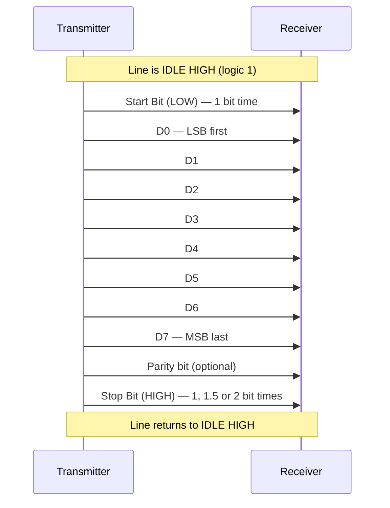
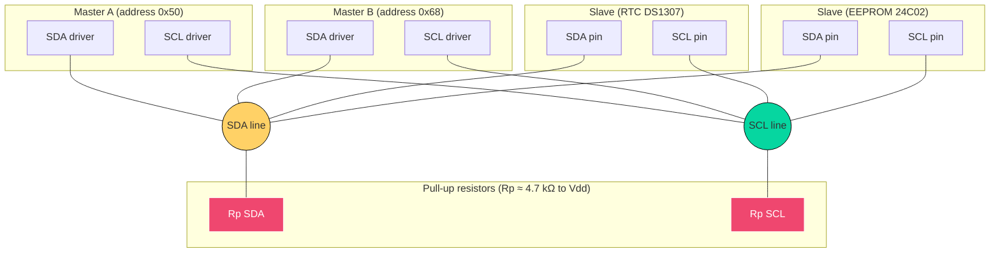
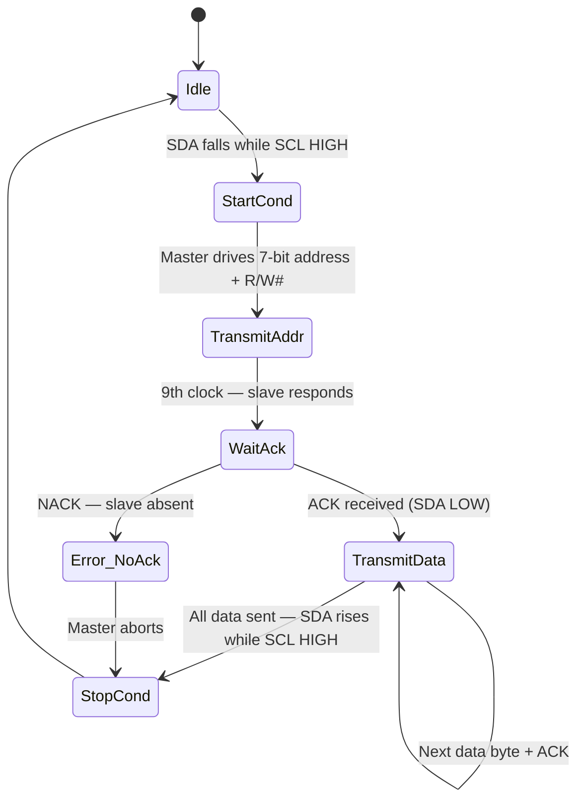
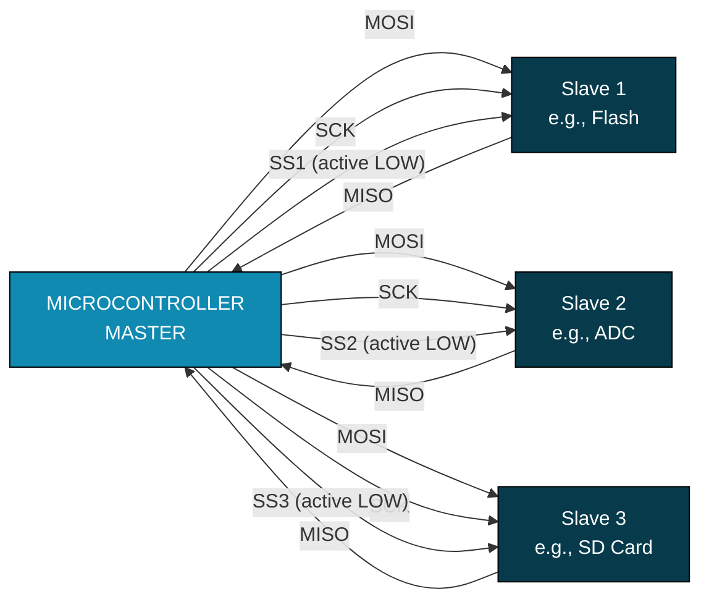
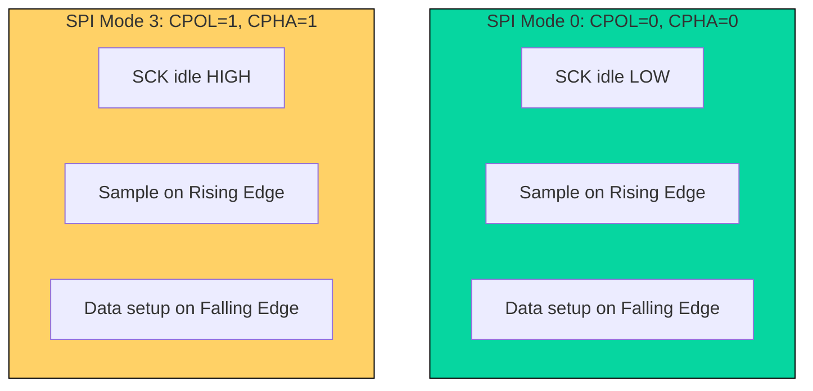
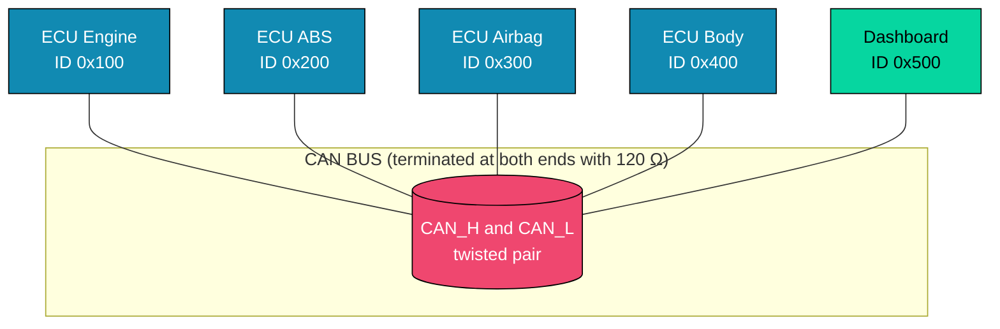
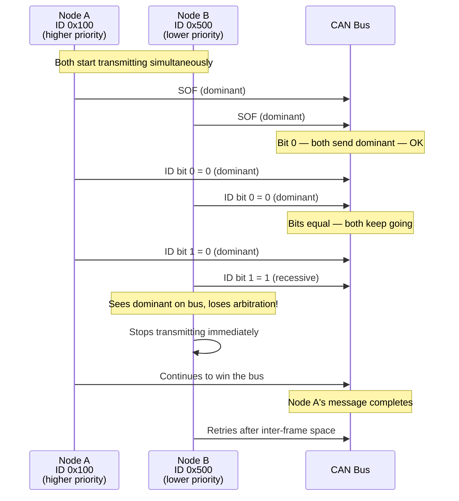

# Serial communication (USART, I2C, SPI, CAN)

<!-- SECTION_1_START -->
# Serial Communication Protocols — USART, I²C, SPI & CAN

## 1.1 What is Serial Communication?

> [!NOTE]
> **Formal Definition (KTU 2024 Syllabus):**
> *Serial communication* is the process of transmitting data **one bit at a time**, sequentially, over a single communication channel or wire, between a microcontroller and one or more peripheral devices. It is the foundational mechanism of **embedded system inter-device dialogue**, in direct contrast to parallel communication which sends multiple bits simultaneously across multiple data lines.

### Conceptual Analogy — "The Single-File Tunnel"

Imagine a **single-lane mountain tunnel** between two cities:
- **Parallel communication** is like opening **8 such tunnels side by side** — one full byte crosses in a single "tick", but you need 8 tunnels (costly, space-hungry).
- **Serial communication** is like having **one tunnel** — bits must line up and enter one after another. The trip is slower per byte, but the tunnel is **cheap, simple, and easy to extend over long distances**.

> [!IMPORTANT]
> **The Universal Trade-off (always asked in KTU):**
> Serial protocols sacrifice **raw bit-rate per pin** in exchange for **fewer pins, simpler PCBs, lower EMI, and the ability to traverse longer distances**. This is *exactly* why every modern embedded system — from your smartwatch to a car's ECU — relies on serial busses.

---

## 1.2 The Four Protocols at a Glance

| Protocol | Acronym For | Wires | Topology | Speed Class | Sync/Async |
| :--- | :--- | :--- | :--- | :--- | :--- |
| **USART** | Universal Synchronous/Asynchronous Receiver-Transmitter | 2 (TX, RX) | Point-to-Point | Low–Medium | Both |
| **I²C** | Inter-Integrated Circuit | 2 (SDA, SCL) | Multi-Master / Multi-Slave | Low–Medium | Synchronous |
| **SPI** | Serial Peripheral Interface | 4 (MOSI, MISO, SCK, SS) | Single Master / Multi-Slave | High | Synchronous |
| **CAN** | Controller Area Network | 2 (CAN_H, CAN_L) | Multi-Master Bus | Medium | Asynchronous |

> [!TIP]
> **Mnemonic to remember the wires:** *"Two Twins, Two Twins, Four Spies, Two Cars"*
> - USART → **T**X, R**X** (2)
> - I²C → S**D**A, SCL (2)
> - SPI → **M**OSI, **M**ISO, S**C**K, **S**S (4)
> - CAN → CAN_**H**, CAN_**L** (2)

---

## 1.3 Why These Four Protocols are KTU-High-Yield

> [!IMPORTANT]
> **Syllabus Highlight (Module 3):**
> KTU examiners **frequently** ask comparative questions (e.g., *"Differentiate between SPI and I²C"*) and frame-format questions (*"Draw and explain the SPI frame / USART frame"*). You must know **signaling, master-slave roles, clocking, and frame structure** for **all four**.

> [!VISUALIZATION CONTROL]
> **Concept:** Protocol Pin Count vs Bandwidth Envelope (conceptual sketch)
> **Desmos / GeoGebra Input Equations:**
> * `x = 2` (USART, I²C, CAN) — vertical line at pin count
> * `x = 4` (SPI) — vertical line at pin count
> * `y_USART(x) = 0.115` * `x` (≤ 1 Mbps typical)
> * `y_I2C(x) = 0.0034` * `x` (≤ 3.4 Mbps High-Speed)
> * `y_SPI(x) = 0.05` * `x` (≤ 50 Mbps)
> * `y_CAN(x) = 0.001` * `x` (≤ 1 Mbps)
> **Visual Description:** Plot x = number of wires, y = typical throughput in Mbps. SPI sits highest-right; I²C and CAN sit left but lower; USART sits far left at moderate height. Students should see that **adding wires (SPI) trades for speed**, while **2-wire protocols trade speed for simplicity**.
<!-- SECTION_1_END -->

<!-- SECTION_2_START -->
# Deep Theoretical Analysis & KTU High-Yield Formula Sheet

## 2.1 USART — Universal Synchronous/Asynchronous Receiver-Transmitter

### Operational Breakdown

USART is the **most fundamental** serial protocol implemented inside nearly every microcontroller (8051, PIC, AVR, ARM, STM32 all have at least one USART peripheral). It can operate in two modes:

1. **Asynchronous mode** — no shared clock line; both ends agree on a **baud rate** (bits/second).
2. **Synchronous mode** — a separate clock line is sent alongside data.

> [!NOTE]
> **The "Universal" in USART** literally means the same hardware block can be configured as either a UART (asynchronous) or a USRT (synchronous) by enabling/disabling the clock pin.

### USART Frame Anatomy (Asynchronous, the KTU default)

A standard USART frame looks like this, transmitted **LSB-first** (least significant bit first):

```
 Idle HIGH  | Start(0) | D0 D1 D2 D3 D4 D5 D6 D7 | Parity? | Stop(1) | Idle HIGH
     1          0          8 data bits              P         1
```

- **Idle line = HIGH (Logic 1)** — the resting state.
- **Start bit = 1 bit of LOW** — tells the receiver *"data is coming, sample now!"*
- **Data bits = 5, 6, 7, 8, or 9** (8 is most common).
- **Parity bit = optional** (Even, Odd, Mark, Space). Used for **single-bit error detection**.
- **Stop bit(s) = 1, 1.5, or 2 bits of HIGH** — gives the line time to settle.

### USART Baud-Rate Generation

The baud rate is derived from the system clock through a **baud-rate generator divider** in the hardware. The relationship is:

$$\text{BaudRate} = \frac{f_{\text{osc}}}{16 \times (UBRR + 1)}$$

For **double-speed mode (U2X = 1)** in AVR:

$$\text{BaudRate} = \frac{f_{\text{osc}}}{8 \times (UBRR + 1)}$$

> [!TIP]
> **Why the factor of 16?** USART oversamples each bit **16 times** (using a higher internal clock) and decides the bit's value by **majority vote** (3 samples near center). This is why baud-rate error tolerance is roughly **±2 %** before framing errors become likely.

### KTU Formula Sheet — USART

| Parameter | Formula / Value | Units | Notes |
| :--- | :--- | :--- | :--- |
| **Baud Rate (Normal)** | $f_{osc} / [16 \times (UBRR+1)]$ | bps | Standard mode |
| **Baud Rate (2X)** | $f_{osc} / [8 \times (UBRR+1)]$ | bps | Double-speed mode (AVR) |
| **UBRR value** | $[f_{osc} / (16 \times \text{Baud})] - 1$ | integer | Round to nearest |
| **Baud error** | $\frac{\text{Baud}_{\text{actual}} - \text{Baud}_{\text{desired}}}{\text{Baud}_{\text{desired}}} \times 100$ | % | Must be < 2 % |
| **Total bits per frame** | $1 + n_{\text{data}} + n_{\text{parity}} + n_{\text{stop}}$ | bits | e.g., 1+8+0+1 = 10 bits |
| **Throughput** | $\text{Baud} \times n_{\text{data}} / \text{total bits}$ | bps | Effective data rate |

---

## 2.2 I²C — Inter-Integrated Circuit (Philips, 1982)

### Operational Breakdown

I²C is a **2-wire, multi-master, packet-switched, synchronous** serial bus invented by Philips Semiconductors. Its elegance lies in using only **two open-drain lines**:

- **SDA (Serial Data)** — bidirectional data line.
- **SCL (Serial Clock)** — clock generated **only by the current master**.

> [!IMPORTANT]
> **Open-Drain is the secret sauce.** Both SDA and SCL are pulled HIGH by **pull-up resistors** (typically $R_p$ = $4.7\text{ k}\Omega$ for 100 kHz, $2.2\text{ k}\Omega$ for 400 kHz, $1\text{ k}\Omega$ for 1 MHz). Any device can pull the line LOW, but **no device ever drives it HIGH**. This is what makes **wired-AND arbitration** possible — a cornerstone of multi-master I²C.

### I²C Addressing

Every slave has a **7-bit or 10-bit address**. After the START condition, the master transmits:

```
[ Start ] [ 7-bit Slave Addr (A6..A0) ] [ R/W# ] [ ACK ] [ 8-bit Data ] [ ACK ] ... [ Stop ]
```

- **R/W# = 0** → Master **Writes** to slave.
- **R/W# = 1** → Master **Reads** from slave.
- **ACK** is a LOW pulse from the receiver (released HIGH by the transmitter, then pulled LOW by the receiver).
- **NACK** is the receiver leaving SDA HIGH — meaning *"no more data, please stop"*.

### I²C Pull-Up Resistor Sizing (Engineering Reality)

$$R_{p,\min} = \frac{V_{DD} - V_{OL,\max}}{I_{OL,\min}}$$

$$R_{p,\max} = \frac{t_r}{0.8473 \times C_{\text{bus}}}$$

> Where $V_{OL,\max} = 0.4\text{ V}$, $I_{OL,\min} = 3\text{ mA}$ (standard), $t_r$ = max rise time, $C_{\text{bus}}$ = total bus capacitance in farads.

### I²C Speed Modes

| Mode | Max Bit Rate | Max Bus Capacitance | Driver |
| :--- | :--- | :--- | :--- |
| Standard | **100 kbps** | 400 pF | Open-drain |
| Fast | **400 kbps** | 400 pF | Open-drain |
| Fast-Plus | **1 Mbps** | 550 pF | Open-drain |
| High-Speed | **3.4 Mbps** | 100 pF | Current-source |

### KTU Formula Sheet — I²C

| Parameter | Formula / Rule | Unit |
| :--- | :--- | :--- |
| **Pull-up minimum** | $(V_{DD} - 0.4) / 0.003$ | $\Omega$ |
| **Pull-up maximum** | $t_r / (0.8473 \times C_{bus})$ | $\Omega$ |
| **Address space (7-bit)** | $2^7 = 128$ (112 usable, 16 reserved) | — |
| **Address space (10-bit)** | $2^{10} = 1024$ | — |
| **Worst-case throughput** | Bit rate $\times$ (data/frame ratio) | bps |

### Real-World Engineering Use of I²C

- Reading **EEPROMs** (24Cxx series), **RTCs** (DS1307), **temperature sensors** (LM75, TMP102).
- Configuring **audio codecs**, **touch controllers**, **PMIC** chips in smartphones.
- The **SMBus** (System Management Bus) used in PCs is essentially a *strict* subset of I²C.

---

## 2.3 SPI — Serial Peripheral Interface (Motorola, 1980s)

### Operational Breakdown

SPI is a **4-wire, full-duplex, master-slave, synchronous** protocol. It is the **fastest** of the three short-distance protocols and is the choice for high-throughput peripherals like SD cards, displays, and ADCs.

| Wire | Full Name | Direction | Purpose |
| :--- | :--- | :--- | :--- |
| **MOSI** | Master Out, Slave In | Master → Slave | Data from master to slave |
| **MISO** | Master In, Slave Out | Slave → Master | Data from slave to master |
| **SCK** | Serial Clock | Master → Slave | Clock generated by master |
| **SS / CS** | Slave Select / Chip Select | Master → Slave | Active-LOW to enable a slave |

> [!NOTE]
> **Full-duplex means simultaneous read and write.** While the master sends a byte on MOSI, the slave is sending a byte on MISO **on the same clock edge**. This is why SPI is roughly **2× the effective throughput** of I²C for the same clock rate.

### SPI Clock Configuration (CPOL & CPHA — *always asked in KTU*)

SPI has **4 modes** determined by two bits:

| Mode | CPOL | CPHA | Clock Idle | Sampling Edge | Setup Edge |
| :--- | :--- | :--- | :--- | :--- | :--- |
| **0** | 0 | 0 | LOW | Rising | Falling |
| **1** | 0 | 1 | LOW | Falling | Rising |
| **2** | 1 | 0 | HIGH | Falling | Rising |
| **3** | 1 | 1 | HIGH | Rising | Falling |

> [!IMPORTANT]
> **CPOL** = clock polarity (idle state of SCK).
> **CPHA** = clock phase (which edge samples data, which edge sets up data).
> **Both master and slave MUST agree** on the same mode. Mismatch → garbage data.

### SPI Data Frame

SPI has **no formal frame format** — it is a **streaming protocol**. Data length is typically 8 bits but can be 4–16 bits per transaction. There is **no addressing**, no ACK, no built-in error detection. That's why SPI is great for **noise-free, short PCB traces** but **terrible for long cables**.

### KTU Formula Sheet — SPI

| Parameter | Formula / Value | Notes |
| :--- | :--- | :--- |
| **Max clock (typical MCU)** | $f_{PCLK} / 2$ | e.g., STM32 → 36 MHz SPI |
| **Full-duplex throughput** | $f_{SCK} \times n_{\text{bits}} / 8$ | bytes/sec |
| **Number of slave selects needed** | $N_{\text{slaves}}$ | One SS pin per slave |
| **Total pins used** | $3 + N_{\text{slaves}}$ | SCK + MOSI + MISO + SS each |

### Real-World Use of SPI

- **SD cards** (SPI mode is universal fallback).
- **TFT/OLED displays** (high pixel throughput).
- **Flash memory** (W25Q series).
- **DACs / ADCs** (audio, instrumentation).
- **NRF24L01+** 2.4 GHz radio modules.

---

## 2.4 CAN — Controller Area Network (Bosch, 1986)

### Operational Breakdown

CAN is a **2-wire differential, message-oriented, multi-master, asynchronous** bus, originally designed to **replace bulky wiring harnesses in automobiles**. Today it is the *lingua franca* of **automotive ECUs**, industrial robotics, and medical devices.

| Wire | Function |
| :--- | :--- |
| **CAN_H** | High-side of differential pair |
| **CAN_L** | Low-side of differential pair |

> [!IMPORTANT]
> **Differential signaling is the killer feature.** CAN transmits the *same* logic bit on both lines *in opposite polarity*. The receiver computes $V_{\text{diff}} = V_{CAN\_H} - V_{CAN\_L}$. This **rejects common-mode noise** — exactly what you get from a car's ignition system or a factory's VFD drives.

### CAN Logic Levels

| State | CAN_H | CAN_L | $V_{diff}$ | Logic |
| :--- | :--- | :--- | :--- | :--- |
| **Dominant** | 3.5 V | 1.5 V | **+2 V** | **0** |
| **Recessive** | 2.5 V | 2.5 V | **0 V** | **1** |

> [!NOTE]
> **Dominant = 0** because a dominant bit **overrides** any recessive bit on the bus — this is the basis of **non-destructive bit-wise arbitration** in CAN.

### CAN Frame Structure (Standard 11-bit ID)

```
[ SOF (1b) ] [ Arbitration (11b ID + RTR) ] [ Control (6b) ] [ Data (0–8 B) ] [ CRC (15b) ] [ ACK (2b) ] [ EOF (7b) ]
```

- **SOF** — dominant bit announces frame start.
- **Arbitration field** — 11-bit (Standard) or 29-bit (Extended) ID + RTR.
- **Control** — IDE, r0, DLC (data length code, 0–8 bytes).
- **Data** — the actual payload (max 8 bytes for Classic CAN).
- **CRC** — 15-bit cyclic redundancy check + delimiter.
- **ACK** — every node that received correctly pulls ACK dominant.
- **EOF** — 7 recessive bits ending the frame.

### CAN Bit Timing & Baud Rate

CAN divides each bit into **multiple time quanta** to allow robust synchronization:

$$\text{Bit Time} = t_q \times (Sync + Prop + Phase1 + Phase2)$$

$$\text{BaudRate}_{\text{CAN}} = \frac{1}{\text{Bit Time}}$$

$$\text{Nominal Bit Rate} = \frac{f_{\text{CANCLK}}}{\text{BRP}} \times \frac{1}{1 + t_{\text{PropSeg}} + t_{\text{PhaseSeg1}} + t_{\text{PhaseSeg2}}$$

A common CAN bus speed: **125 kbps, 250 kbps, 500 kbps, 1 Mbps**.

### CAN Arbitration (CSMA/CD + AMP)

When two nodes transmit **simultaneously**, they monitor the bus. The node sending a **recessive (1)** while it sees a **dominant (0)** realizes it has *lost* arbitration and **backs off immediately**. The message with the **lower ID wins** (lower ID = higher priority). Crucially, the losing message is **not destroyed** — it is **automatically retried** once the bus is free.

### Real-World Use of CAN

- **Automotive**: OBD-II port, ECU-to-ECU communication (engine, ABS, airbags, infotainment).
- **Industrial**: CANopen, DeviceNet protocols.
- **Avionics & medical**: where deterministic message delivery matters.

### KTU Formula Sheet — CAN

| Parameter | Formula / Value | Notes |
| :--- | :--- | :--- |
| **Max baud (Classic CAN)** | **1 Mbps** | Bus length ≤ 40 m at 1 Mbps |
| **Max data per frame (Classic)** | **8 bytes** | 64 bits |
| **Max data per frame (CAN FD)** | **64 bytes** | Flexible Data-rate |
| **Identifier (Standard)** | 11 bits | 2,048 IDs |
| **Identifier (Extended)** | 29 bits | 537 million IDs |
| **Bit stuffing** | After 5 equal bits, stuff opposite | Maintains DC balance & sync |
| **Max nodes (recommended)** | ~30 (practical) | Theoretical: $2^{11}$ = 2,048 |

---

## 2.5 Master Comparison Table (Print This!)

| Feature | USART | I²C | SPI | CAN |
| :--- | :--- | :--- | :--- | :--- |
| **Wires** | 2 (TX, RX) | 2 (SDA, SCL) | 4+ (MOSI, MISO, SCK, SS) | 2 (CAN_H, CAN_L) |
| **Clock** | Async (or Sync) | Sync | Sync | Async (bit-stuffed) |
| **Duplex** | Full | Half | Full | Half (broadcast) |
| **Topology** | Point-to-Point | Multi-Master Bus | Star (1 Master) | Multi-Master Bus |
| **Max Speed** | ~1 Mbps | 3.4 Mbps | 50+ Mbps | 1 Mbps (Classic) |
| **Addressing** | None | 7/10-bit | None (SS lines) | Message ID |
| **Error Detection** | Parity | ACK only | None | CRC-15, ACK, stuff check |
| **Distance** | Medium | Short (<5 m) | Very short (<1 m) | Long (1 km @ 50 kbps) |
| **Cost** | Very Low | Low | Low | Medium (transceiver IC) |
| **Use case** | PC comm, GPS | Sensors, EEPROM | Displays, SD cards | Automotive, industrial |
<!-- SECTION_2_END -->

<!-- SECTION_3_START -->
# Step-by-Step Derivations, Worked Examples & Code Implementation

## 3.1 USART Worked Example — Baud Rate Computation (AVR @ 16 MHz)

**Problem:** An ATmega328P is clocked at $f_{osc} = 16\text{ MHz}$. The required baud rate is **9600 bps**. Compute the UBRR value and the actual baud-rate error.

### Step 1 — Apply the UBRR formula

$$\text{UBRR} = \frac{f_{osc}}{16 \times \text{Baud}} - 1$$

$$\text{UBRR} = \frac{16{,}000{,}000}{16 \times 9600} - 1 = \frac{16{,}000{,}000}{153{,}600} - 1$$

$$\text{UBRR} = 104.1667 - 1 = 103.1667$$

### Step 2 — Round to nearest integer (UBRR must be 8-bit unsigned, 0–255)

$$\text{UBRR} = 103$$

> **[Valuation Key: Stating the formula correctly: 1 Mark. Plugging values: 1 Mark. Final integer: 1 Mark]**

### Step 3 — Compute the actual baud rate produced

$$\text{Baud}_{\text{actual}} = \frac{16{,}000{,}000}{16 \times (103 + 1)} = \frac{16{,}000{,}000}{1664} = 9615.38\text{ bps}$$

### Step 4 — Compute percentage error

$$\%\text{Error} = \frac{9615.38 - 9600}{9600} \times 100 = 0.16\,\%$$

> **Conclusion:** 0.16 % error is well within the ±2 % tolerance → **No framing errors expected**.

---

## 3.2 Full C Implementation — USART (ATmega328P, GCC-AVR)

```c
/*
 * File: usart_demo.c
 * Target: ATmega328P @ 16 MHz
 * Baud: 9600 bps, 8N1, polling (no interrupts)
 * Hardware: PD0=RXD, PD1=TXD
 */
#include <avr/io.h>
#include <stdint.h>

#define F_CPU   16000000UL
#define BAUD    9600
#define UBRR_V  ((F_CPU / 16 / BAUD) - 1)   // 103

/* Initialize USART0 in 8N1 async normal mode */
void usart_init(void) {
    UBRR0H = (uint8_t)(UBRR_V >> 8);        // 0
    UBRR0L = (uint8_t)(UBRR_V);             // 103
    UCSR0B = (1 << TXEN0) | (1 << RXEN0);   // enable TX + RX
    UCSR0C = (1 << UCSZ01) | (1 << UCSZ00); // 8 data bits, no parity, 1 stop
}

/* Blocking transmit of one byte */
void usart_tx(uint8_t data) {
    while (!(UCSR0A & (1 << UDRE0)));       // wait for TX buffer empty
    UDR0 = data;                             // load data (transmission starts)
}

/* Blocking receive of one byte */
uint8_t usart_rx(void) {
    while (!(UCSR0A & (1 << RXC0)));        // wait for RX complete
    return UDR0;
}

/* Print a null-terminated string */
void usart_print(const char *s) {
    while (*s) {
        if (*s == '\n') usart_tx('\r');     // CR before LF for terminal
        usart_tx(*s++);
    }
}

int main(void) {
    usart_init();
    usart_print("KTU USART Demo OK\n");
    for (;;) {
        uint8_t b = usart_rx();             // echo loop
        usart_tx(b);
    }
}
```

> **Explanation of the magic numbers:** `UCSZ01:00 = 11` selects 8-bit character size. The frame will be: 1 start + 8 data + 1 stop = 10 bits per byte. At 9600 baud the actual bit time is $1/9600 = 104.17\ \mu s$.

---

## 3.3 Full Python Implementation — Bit-Banged I²C Master (Educational)

```python
"""
Educational bit-banged I²C master (no hardware I²C required).
Simulates SDA/SCL using two GPIO pins. Reads a 24C02 EEPROM byte.
"""
import time

class BitBangI2C:
    def __init__(self, sda_pin, scl_pin, freq_hz=100_000):
        # In real hardware: import RPi.GPIO as GPIO
        self.SDA = sda_pin
        self.SCL = scl_pin
        self.half_period = 1.0 / (2 * freq_hz)   # 5 µs for 100 kHz

    def _delay(self):
        time.sleep(self.half_period)

    def _sda_high(self):  pass  # release line (open-drain)
    def _sda_low(self):   pass  # drive SDA LOW
    def _scl_high(self):  pass
    def _scl_low(self):   pass
    def _read_sda(self):  return 0

    def start(self):
        """START condition: SDA falling while SCL is HIGH."""
        self._sda_high(); self._scl_high(); self._delay()
        self._sda_low();  self._delay()      # SDA falls while SCL high
        self._scl_low();  self._delay()

    def stop(self):
        """STOP condition: SDA rising while SCL is HIGH."""
        self._sda_low();  self._scl_high(); self._delay()
        self._sda_high(); self._delay()      # SDA rises while SCL high

    def write_bit(self, bit):
        self._sda_low() if bit == 0 else self._sda_high()
        self._delay()
        self._scl_high(); self._delay()      # slave samples on SCL HIGH
        self._scl_low();  self._delay()

    def read_bit(self):
        self._sda_high()                     # release so slave can drive
        self._scl_high(); self._delay()
        bit = self._read_sda()               # sample on SCL HIGH
        self._scl_low();  self._delay()
        return bit

    def write_byte(self, byte):
        for i in range(8):
            self.write_bit((byte >> (7 - i)) & 1)   # MSB first (I²C standard)
        return self.read_bit()               # return ACK (0 = ACK, 1 = NACK)

    def read_byte(self, ack=True):
        val = 0
        for _ in range(8):
            val = (val << 1) | self.read_bit()
        self.write_bit(0 if ack else 1)      # 0 = ACK, 1 = NACK
        return val

    def read_eeprom(self, dev_addr7, mem_addr):
        """Read one byte from 24C02 EEPROM at given memory address."""
        self.start()
        self.write_byte((dev_addr7 << 1) | 0) # write mode (R/W# = 0)
        self.write_byte(mem_addr)
        self.start()                          # repeated START
        self.write_byte((dev_addr7 << 1) | 1) # read mode (R/W# = 1)
        data = self.read_byte(ack=False)      # NACK = last byte
        self.stop()
        return data

# Example:
# bus = BitBangI2C(sda_pin=2, scl_pin=3, freq_hz=100_000)
# byte = bus.read_eeprom(dev_addr7=0x50, mem_addr=0x00)
# print(f"EEPROM[0x00] = 0x{byte:02X}")
```

> **Step-by-step I²C transaction (read from 24C02 address 0x10):**
>
> 1. **START** condition issued by master.
> 2. Master transmits address byte `0b1010_0000` = `0xA0` (write mode, since `0x50 << 1 | 0`).
> 3. Slave at `0x50` ACKs by pulling SDA LOW on the 9th clock.
> 4. Master transmits memory address `0x10`. Slave ACKs.
> 5. Master issues a **repeated START** (no STOP, so the bus is *not* released).
> 6. Master transmits `0b1010_0001` = `0xA1` (read mode).
> 7. Slave transmits the data byte, master ACKs (or NACKs on the last byte).
> 8. Master issues **STOP**.

---

## 3.4 Full C Implementation — SPI Master (STM32 HAL, Register-Level Snippet)

```c
/*
 * File: spi_master_stm32.c
 * Target: STM32F103 (or any F1 / F4)
 * Function: Full-duplex SPI master, Mode 0 (CPOL=0, CPHA=0), fPCLK=36 MHz,
 *           SCK baud = fPCLK/16 ≈ 2.25 MHz
 */
#include "stm32f1xx_hal.h"

SPI_HandleTypeDef hspi1;

void spi1_init(void) {
    hspi1.Instance               = SPI1;
    hspi1.Init.Mode              = SPI_MODE_MASTER;
    hspi1.Init.Direction         = SPI_DIRECTION_2LINES;   // full-duplex
    hspi1.Init.DataSize          = SPI_DATASIZE_8BIT;
    hspi1.Init.CLKPolarity       = SPI_POLARITY_LOW;       // CPOL = 0
    hspi1.Init.CLKPhase          = SPI_PHASE_1EDGE;        // CPHA = 0 → Mode 0
    hspi1.Init.NSS               = SPI_NSS_SOFT;           // software SS
    hspi1.Init.BaudRatePrescaler = SPI_BAUDRATEPRESCALER_16;
    hspi1.Init.FirstBit          = SPI_FIRSTBIT_MSB;       // standard
    hspi1.Init.TIMode            = SPI_TIMODE_DISABLE;
    HAL_SPI_Init(&hspi1);
}

uint8_t spi_tx_rx(uint8_t tx_byte) {
    uint8_t rx_byte = 0;
    /* Lower the chip-select line for our slave (e.g., PA4 = SS) */
    HAL_GPIO_WritePin(GPIOA, GPIO_PIN_4, GPIO_PIN_RESET);
    /* Full-duplex exchange: 1 byte out, 1 byte in */
    HAL_SPI_TransmitReceive(&hspi1, &tx_byte, &rx_byte, 1, 100);
    HAL_GPIO_WritePin(GPIOA, GPIO_PIN_4, GPIO_PIN_SET);
    return rx_byte;
}
```

> **Why Mode 0?** Most SD cards, sensors, and Flash chips default to **SPI Mode 0** (CPOL=0, CPHA=0). Always check the slave's datasheet.

---

## 3.5 CAN Bit-Time Derivation — Worked Example

**Problem:** A CAN node is clocked from $f_{\text{clk}} = 8\text{ MHz}$. The desired nominal bit rate is **125 kbps**. Configure BRP, PropSeg, PhaseSeg1, PhaseSeg2 such that the sample point is at **75 %** of the bit time, and SJW = 1 tq.

### Step 1 — Choose total Time Quanta per bit

Standard CAN allows 8 to 25 tq. We pick **16 tq** (most common, robust).

$$t_q = \frac{\text{BRP}}{f_{\text{clk}}} = \frac{\text{BRP}}{8 \times 10^6}$$

Bit time = $N_{\text{tq}} \times t_q = 16 \times t_q = \frac{1}{125{,}000} = 8\ \mu s$

$$t_q = 8\ \mu s / 16 = 0.5\ \mu s \quad\Rightarrow\quad \text{BRP} = t_q \times f_{\text{clk}} = 0.5 \times 10^{-6} \times 8 \times 10^6 = 4$$

> **[Valuation Key: Setting up tq: 2 Marks. Computing BRP: 1 Mark]**

### Step 2 — Choose segment lengths for 75 % sample point

Sample point = (Sync_Seg + PropSeg + PhaseSeg1) / Total_tq

We choose Sync_Seg = 1 tq (fixed). So:

$$0.75 = \frac{1 + \text{PropSeg} + \text{PhaseSeg1}}{16} \quad\Rightarrow\quad \text{PropSeg} + \text{PhaseSeg1} = 11$$

Pick **PropSeg = 3, PhaseSeg1 = 8**, and **PhaseSeg2 = Total - 1 - 11 = 4** tq.

### Step 3 — Verify bit time

$$\text{Bit Time} = (1 + 3 + 8 + 4) \times 0.5\ \mu s = 16 \times 0.5\ \mu s = 8\ \mu s \quad\checkmark$$

### Step 4 — Compute actual baud

$$\text{Baud} = 1 / 8\ \mu s = 125{,}000\ \text{bps} = 125\ \text{kbps} \quad\checkmark$$

> **Final register values:** BRP = 3 (BRP+1 = 4), PropSeg = 2 (Prog+1 = 3), PhaseSeg1 = 7, PhaseSeg2 = 3, SJW = 0 (SJW+1 = 1).
<!-- SECTION_3_END -->

<!-- SECTION_4_START -->
# Structural Diagrams & Schematics

## 4.1 USART Asynchronous Frame — Bit-by-Bit Timing



> **Reading the diagram:** Time flows left-to-right. Each arrow is exactly **1 bit-time** long. The receiver uses the **falling edge of the start bit** to reset its internal sampling clock, then samples each subsequent bit at the **center** of its bit time (≈ 16 internal clock ticks later).

---

## 4.2 I²C — Multi-Master Bus Topology with Arbitration



> **Architecture insight:** Every node's SDA/SCL pin is **open-drain** — they can only pull LOW. The pull-up resistors are what restore the line to HIGH when **no** device is pulling it down. This wired-AND behavior is what allows **two masters to coexist** without short circuits.

### I²C Transaction State Machine



---

## 4.3 SPI — Master with Multiple Slaves (Star Topology)



> **Why this matters:** Each slave needs its **own dedicated SS line**. If the master accidentally drives two SS lines LOW at once, both slaves will drive MISO simultaneously → bus contention. This is the **#1 SPI debugging pitfall**.

### SPI Clock Mode Visualization



---

## 4.4 CAN — Bus Topology and Frame Flow



> **Insight:** In a real car, **all ECUs are connected to the same two wires**. There is no "master" ECU. When the brake pedal is pressed, the ABS ECU broadcasts a message with ID `0x100` and the engine/dashboard ECUs that need that data will accept it; others ignore it.

### CAN Non-Destructive Arbitration



> **Why "non-destructive"?** Node B's message is **not corrupted** — it will be retried automatically. Node A's higher-priority message wins without delay. This is the beauty of CAN: **deterministic latency for high-priority messages**.
<!-- SECTION_4_END -->

<!-- SECTION_5_START -->
# KTU 2024 Scheme Examination Question Bank

---

## Part A — Short Answer Questions (3 Marks Each)

### Question 1: [KTU University Exam — July 2024] — *USART Frame*

> **Q: Draw the frame format of a USART transmitting the ASCII character 'K' (0x4B = 0b01001011) using 8-N-1 configuration (8 data bits, no parity, 1 stop bit). Label each field.**

**Model Answer (3 Marks):**

| Bit Position | Logic | Field |
| :--- | :--- | :--- |
| (idle) | **1** | Idle (line HIGH) |
| 1 | **0** | **Start bit** |
| 2 | **1** | D0 (LSB of 0x4B = 1) |
| 3 | **1** | D1 = 1 |
| 4 | **0** | D2 = 0 |
| 5 | **0** | D3 = 0 |
| 6 | **1** | D4 = 1 |
| 7 | **0** | D5 = 0 |
| 8 | **0** | D6 = 0 |
| 9 | **0** | D7 (MSB) = 0 |
| 10 | **1** | **Stop bit** |
| (idle) | **1** | Idle (line HIGH) |

```
Idle  Start  D0  D1  D2  D3  D4  D5  D6  D7  Stop  Idle
 1     0     1   1   0   0   1   0   0   0    1     1
```

> **[Valuation Key: Correct LSB-first ordering of 0x4B: 1 Mark. Start/Stop bits correct: 1 Mark. Idle state marked: 1 Mark]**

---

### Question 2: [KTU University Exam — Dec 2023] — *I²C Lines*

> **Q: Name the two wires used in I²C. Why are external pull-up resistors required? What is the role of the slave address?**

**Model Answer (3 Marks):**

1. The two wires of I²C are **SDA (Serial Data)** and **SCL (Serial Clock)** — both are **open-drain** lines. **(1 Mark)**
2. Pull-up resistors are required because open-drain outputs can only pull the line LOW. When no device is pulling the line LOW, the resistor pulls it to V$_{DD}$ (HIGH). This enables the **wired-AND** behavior, multi-master arbitration, and safe bus sharing. Typical values are **4.7 kΩ at 100 kHz** and **2.2 kΩ at 400 kHz**. **(1 Mark)**
3. The slave address is a **7-bit (or 10-bit) unique identifier** sent by the master at the beginning of every transaction. Only the slave whose address matches will ACK and respond. This allows up to **127 devices** (7-bit) on a single 2-wire bus. **(1 Mark)**

---

## Part B — Long Answer Questions (14 Marks Each)

> **Note:** As per KTU ESE regulations, you must answer **one full question** (with sub-parts) from a choice of two. Each sub-part is typically **7 marks**.

---

### Question A: [KTU University Exam — Dec 2023, Model Paper] — *SPI & USART Comparison*

> **(a)** Explain the **SPI protocol** in detail with a neat block diagram showing the master, three slaves, and all four signal lines. Describe the **role of CPOL and CPHA** and list all **4 SPI modes**. **(7 Marks)**
>
> **(b)** Compare **USART and SPI** on the basis of: number of wires, clocking (sync/async), duplex mode, maximum speed, error detection, addressing, and typical applications. **(7 Marks)**

**Model Answer:**

#### Part (a) — SPI Protocol Explanation **[7 Marks]**

**Block Diagram** (reproduce from §4.3 above) **[2 Marks]**:
- Master with MOSI, MISO, SCK, and 3 separate SS lines (SS1, SS2, SS3).
- 3 slaves each connected to MOSI, MISO, SCK and one unique SS.

**Description of operation** **[2 Marks]**:
- The master **always generates the SCK** clock. The master chooses which slave to talk to by pulling that slave's **SS line LOW** (active low).
- Data is shifted out of the master's MOSI into the slave's MOSI input **MSB first** (by default), and simultaneously the slave shifts data out on MISO. This is **full-duplex** operation.
- For every **8 clock pulses**, 1 byte is exchanged in each direction.
- When SS returns HIGH, the slave deselects and tri-states its MISO.

**CPOL and CPHA** **[2 Marks]**:
- **CPOL (Clock Polarity)** = idle state of SCK when no data is being transferred. CPOL=0 → idle LOW; CPOL=1 → idle HIGH.
- **CPHA (Clock Phase)** = which clock edge is used to sample data. CPHA=0 → sample on first edge; CPHA=1 → sample on second edge.
- Four combinations give **4 SPI modes (Mode 0, 1, 2, 3)** as listed in §2.3.

**Master-slave SS wiring** **[1 Mark]**: One dedicated SS pin per slave; only one SS is LOW at a time.

#### Part (b) — USART vs SPI Comparison **[7 Marks]**

| Feature | USART | SPI |
| :--- | :--- | :--- |
| **Wires** | 2 (TX, RX) | 4+ (MOSI, MISO, SCK, N×SS) |
| **Clocking** | Asynchronous (no clock line) | Synchronous (SCK line) |
| **Duplex** | Full-duplex (separate TX, RX) | Full-duplex (MOSI + MISO simultaneously) |
| **Max speed** | ~1 Mbps typical (115.2 kbps classic) | 10–50 Mbps typical |
| **Error detection** | Parity bit, framing check | None built-in |
| **Addressing** | None (point-to-point) | None (uses SS lines) |
| **Slave count** | 1 (one-to-one) | N slaves, each needs its own SS |
| **Distance** | Medium (RS-232 up to ~15 m, RS-485 up to 1200 m) | Very short (<1 m on PCB) |
| **Typical use** | PC-microcontroller comm, GPS modules, XBee, Bluetooth modules | SD cards, TFT displays, Flash memory, ADCs/DACs |

> **[Valuation Key: 7 sub-attributes × 1 Mark = 7 Marks. Any 7 attributes clearly stated and contrasted earn full marks.]**

---

### Question B: [KTU University Exam — July 2024, Model Paper] — *I²C and CAN*

> **(a)** Draw and explain the **complete I²C frame format** for a **master-write** transaction to a slave at address `0x50`, sending 2 data bytes. Show the **START, address byte, R/W# bit, ACK bits, data bytes, and STOP** conditions clearly. State the role of the **repeated START** condition. **(7 Marks)**
>
> **(b)** Explain the **CAN protocol** frame format (standard 11-bit ID) with a neat diagram. Describe **CSMA/CA + AMP arbitration** with an example showing two nodes transmitting simultaneously. Why is CAN called a **"non-destructive"** arbitration protocol? **(7 Marks)**

**Model Answer:**

#### Part (a) — I²C Master-Write Frame **[7 Marks]**

**Frame diagram** **[3 Marks]**:

```
Line:    SDA: ___‾‾‾\___________________/‾‾‾\__/‾‾\__/‾‾\__/‾‾‾‾‾‾‾‾‾‾‾‾‾‾/‾‾‾‾‾
                     |                                |       |       |
SCL:    _____________|‾‾‾‾|‾|‾|‾|‾|‾|‾|‾|‾|‾|‾|‾|‾|‾|‾|‾|‾|‾|‾|‾|‾|‾|‾|‾|‾‾‾|_____
              START   | A6 A5 A4 A3 A2 A1 A0 R/W ACK |  D0..D7  ACK  |  D0..D7  ACK | STOP
              ↓       | 1   0  1  0  1  0  0   0   0 |  0xA5     0  |   0x3C     0 |   ↑
              ↓       | (0x50 << 1 = 0xA0, write)    | (data 1)     |  (data 2)    |
              ↓                                                                      
        SDA falls while                                                                
        SCL is HIGH                                                                  
```

**Description** **[3 Marks]**:
- **START condition** (S): SDA falls while SCL is HIGH.
- **Address byte**: 7-bit slave address `0b1010000` (0x50), followed by **R/W# = 0** (write). Sent MSB-first.
- **ACK**: 9th clock pulse; the addressed slave pulls SDA LOW.
- **Data bytes**: First data byte `0xA5` and second `0x3C`, each followed by an ACK from the slave.
- **STOP condition** (P): SDA rises while SCL is HIGH.

**Repeated START** **[1 Mark]**: A repeated START (Sr) is a START issued *without* a preceding STOP. It prevents another master from stealing the bus between the address phase and the data phase, which is critical in **read** transactions (write address → Sr → read address → data).

#### Part (b) — CAN Frame and Arbitration **[7 Marks]**

**Standard CAN frame (11-bit ID)** **[3 Marks]**:

```
| SOF | Arbitration (11b ID + RTR) | Control (6b: IDE, r0, DLC[3:0]) | Data (0–8 bytes) | CRC (15b + delim) | ACK (2b) | EOF (7b) | IFS (3b) |
  1b   12 bits                       6 bits                              0–64 bits         16 bits            2 bits    7 bits   3 bits
```

- **SOF**: 1 dominant bit.
- **Arbitration**: 11-bit ID + 1-bit RTR. **Lower ID = higher priority**.
- **Control**: 6 bits (IDE, r0, DLC).
- **Data**: 0–8 bytes of payload.
- **CRC**: 15-bit polynomial CRC + 1 recessive delimiter.
- **ACK**: 2 bits (slot + delimiter).
- **EOF**: 7 recessive bits.

**CSMA/CA + AMP Arbitration** **[3 Marks]**:
- CSMA/CA = Carrier Sense Multiple Access with Collision Avoidance. AMP = Arbitration on Message Priority.
- Each transmitting node **monitors the bus bit-by-bit** while transmitting.
- A node that **sends a recessive (1) but reads a dominant (0)** from the bus realizes it has *lost* arbitration. It **immediately stops driving** and becomes a receiver.
- **Example**: Node A (ID `0x100 = 0b001_0000_0000`) and Node B (ID `0x180 = 0b001_1000_0000`) start at the same time. The first 7 bits match (001_000...), but on bit 8, A sends **0** and B sends **1**. The bus reads **0**, so B loses arbitration and backs off. A continues and completes the message.

**Why "non-destructive"?** **[1 Mark]**: Because the message being transmitted is *not corrupted* during arbitration. The losing node simply re-queues its message and tries again after the inter-frame space. The winning message completes with zero delay penalty.

---

## KTU Examiner's Valuation Warning / Pitfall Callout

> [!WARNING]
> **Common Mark-Deduction Traps in Serial-Communication Questions**
>
> 1. **USART baud-rate questions**: Students often forget the **−1** in the UBRR formula. Off by one → wrong baud rate → wrong error → **lose 2–3 marks**.
> 2. **I²C address transmission**: The 7-bit address is sent as **(address << 1) | R/W**. Many students send the 7-bit address directly and forget the R/W bit, or shift in the wrong direction. **Always** clearly mark which bit is the R/W# bit in your diagram.
> 3. **SPI CPOL/CPHA confusion**: CPHA=0 means **first edge** is the sampling edge. CPHA=1 means **second edge**. Drawing a wrong timing diagram costs **3 marks** in §3 of the answer.
> 4. **CAN arbitration**: Students often write *"lower ID has higher priority"* correctly but then incorrectly conclude that the *lower-priority node destroys its own message*. Emphasize that **the message is preserved and retried**.
> 5. **Frame diagrams**: An unlabeled diagram with no field names = **0 marks** for that sub-part. Always label every field (Start, D0, …, D7, Parity, Stop).
> 6. **Differential vs single-ended**: For CAN, never draw a single-ended signal — always show both **CAN_H and CAN_L** with the differential pair.

---

## Topic Recap & Important Things to Remember

> [!TIP]
> **High-Density Rapid Revision Checklist — Serial Communication Protocols**

### USART
- 2-wire, point-to-point, **async by default** (UART), optionally sync.
- Frame = **1 Start + 5–9 Data + 0–1 Parity + 1–2 Stop** bits.
- **Idle = HIGH**, Start = LOW, Stop = HIGH, LSB first.
- Baud rate formula (AVR): $\text{UBRR} = f_{osc} / (16 \times \text{Baud}) - 1$.
- Baud error must be **< 2 %**. Each bit oversampled 16×.
- Parity is a single-bit error detector (catches odd-number errors only).
- No addressing, no built-in multi-drop, no error recovery beyond parity.

### I²C
- 2-wire, **open-drain**, multi-master, sync, half-duplex.
- Wires: **SDA, SCL** with pull-up resistors ($R_p$).
- 7-bit or 10-bit addressing; up to **127 / 1023** slaves.
- Speed modes: 100 kbps, 400 kbps, 1 Mbps, 3.4 Mbps.
- START = SDA↓ while SCL↑; STOP = SDA↑ while SCL↑.
- **Wired-AND arbitration** — DOMINANT (LOW) wins over RECESSIVE (HIGH).
- ACK = 9th-clock LOW; NACK = 9th-clock HIGH.
- Pull-up sizing: $R_{p,\min} = (V_{DD} - 0.4)/0.003$; $R_{p,\max} = t_r / (0.8473 \cdot C_{bus})$.

### SPI
- 4-wire, **full-duplex**, master-slave, synchronous, fastest of the four short-distance protocols.
- Wires: **MOSI, MISO, SCK, SS** (one SS per slave).
- **No addressing** — slaves are selected by hard-wired SS lines.
- **CPOL** = idle state of SCK; **CPHA** = which edge samples data.
- **4 modes (0, 1, 2, 3)** — both master and slave must match.
- No built-in error detection, no ACK, no flow control.
- Best for: SD cards, displays, Flash, high-speed ADC/DAC.

### CAN
- 2-wire **differential** bus, multi-master, async, message-oriented.
- Wires: **CAN_H, CAN_L** — terminated with **120 Ω** at both ends.
- **Differential signaling** rejects common-mode noise (EMI).
- Logic: **Dominant = 0** (CAN_H=3.5V, CAN_L=1.5V, $V_{diff}=+2V$); **Recessive = 1** (both 2.5V, $V_{diff}=0$).
- Frame: SOF, Arbitration (11b/29b ID), Control, Data (0–8 B), CRC-15, ACK, EOF.
- **Lower ID = higher priority** — non-destructive CSMA/CA + AMP arbitration.
- **Bit stuffing**: after 5 consecutive equal bits, stuff 1 opposite bit (for clock sync).
- Baud: 125 kbps, 250 kbps, 500 kbps, 1 Mbps.
- Used in: automobiles, industrial (CANopen, DeviceNet), avionics, medical.

### Master Mnemonic
> **"U-S-I-C"** → **U**niversal Async Receiver/Transmitter — **S**ynchronous serial? use SPI. Need **I**nter-chip comm? I²C. **C**ar? CAN.

### KTU High-Yield Buzzwords to Memorize
- *Open-drain, wired-AND, dominant bit, bit stuffing, differential pair, oversampling, frame format, baud rate, MSB-first vs LSB-first, arbitration, ACK/NACK, repeated START, bit time, time quantum, sample point.*
<!-- SECTION_5_END -->
