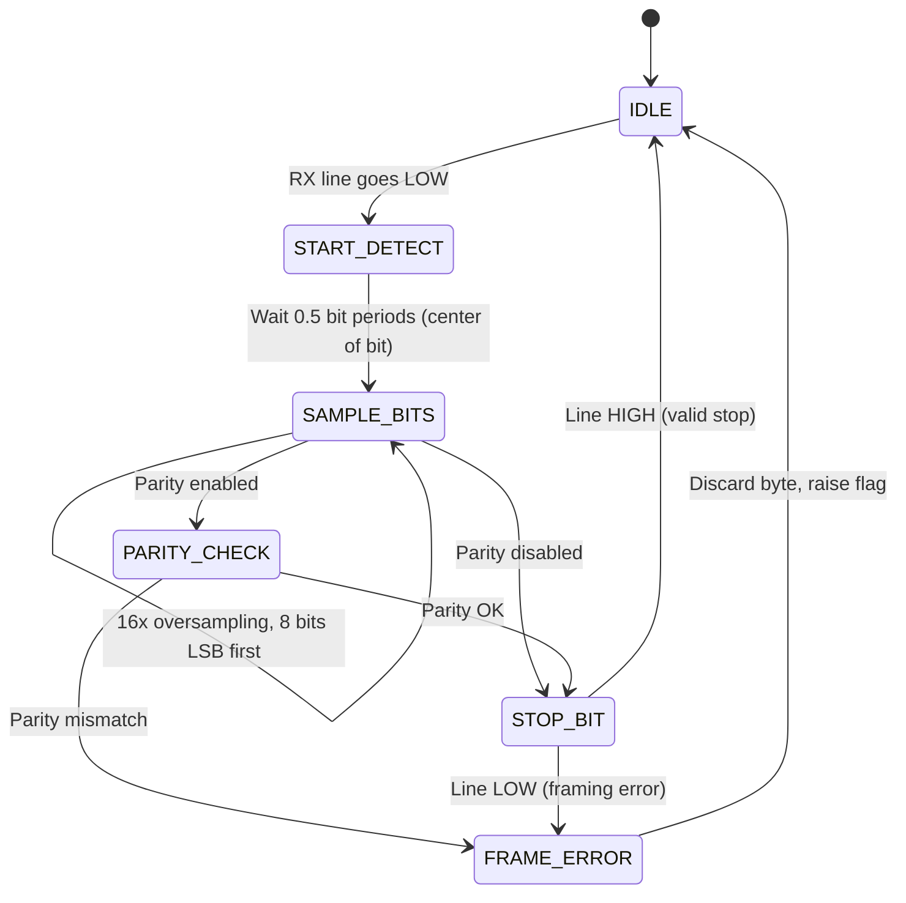
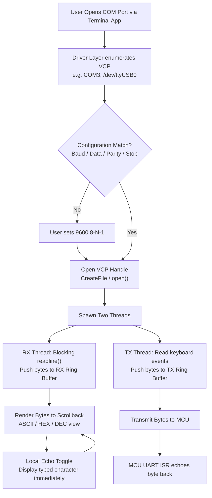
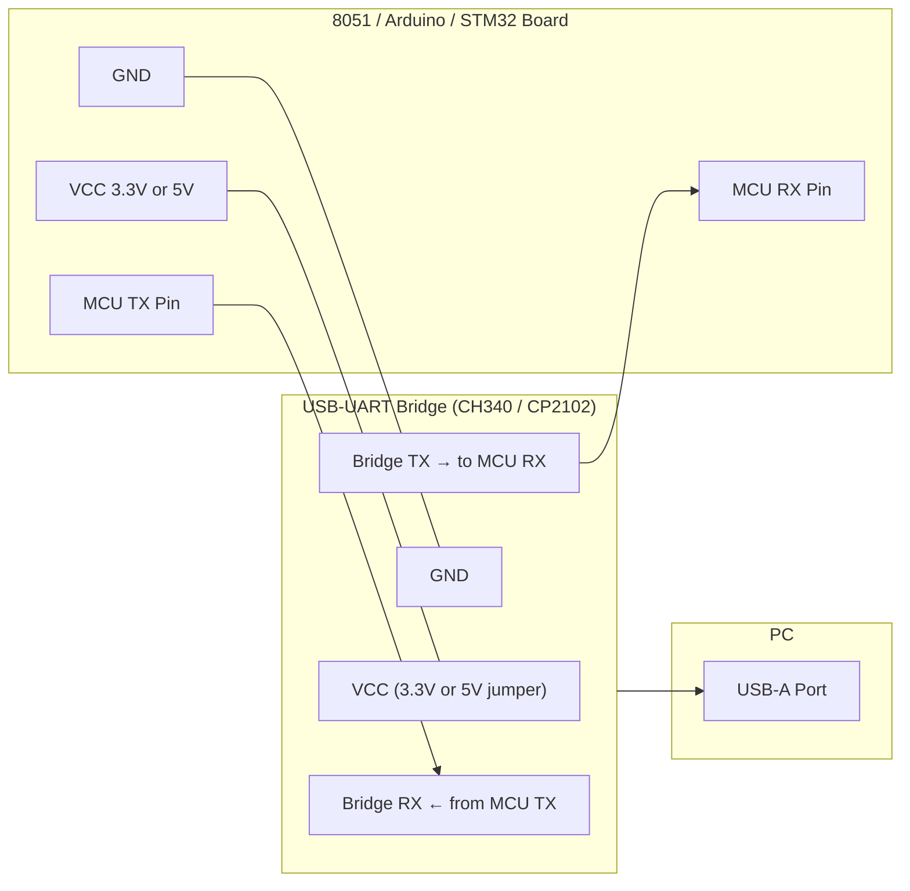

# Serial port terminal Application

<!-- SECTION_1_START -->

# 🔌 Serial Port Terminal Application

> [!NOTE]
> **Module Context (KTU 2024 Scheme - PBCST504)**
> This topic belongs to **Module 3: Communication Protocols and USB**, which covers wired/wireless communication between microcontrollers and external peripherals. The **Serial Port Terminal Application** is the bridge between a microcontroller's UART hardware and a developer's PC for debugging, data logging, and command-line control.

---

## 1.1 Formal Academic Definition

A **Serial Port Terminal Application** is a software program (running on a host PC) that establishes a bidirectional, character-oriented communication channel with a microcontroller (or any embedded device) over a **Universal Asynchronous Receiver/Transmitter (UART)** link. It interprets incoming bytes as **ASCII characters**, renders them on a virtual console (a "terminal"), and transmits keystrokes back to the embedded target — thereby converting a PC's USB or legacy COM port into a human-readable console for the embedded system.

Mathematically, an asynchronous serial frame of **N** bits is transmitted over a fixed time window:

$$T_{frame} = \frac{N}{B} \quad \text{[seconds]}$$

where $B$ is the **baud rate** (symbols per second) and $N$ is the total number of bits including start, data, parity, and stop bits.

> [!IMPORTANT]
> **KTU Syllabus Highlight:** The serial port terminal is the *de-facto* debugging tool in embedded systems. Every professional KTU lab viva will ask you to configure a terminal (PuTTY / Tera Term / RealTerm / Arduino Serial Monitor) at a specific baud rate to interact with a UART-enabled microcontroller.

---

## 1.2 Conceptual Analogy — "The Telegraph Line"

Imagine you and a friend are separated by a long hallway. You cannot shout loudly enough, so you install a **single copper wire** between your rooms. To send a message:

1. Both of you must agree **in advance** on a speed of tapping — this is the **baud rate** (e.g., 10 taps per second).
2. Before each message, you tap **once** to say "I'm starting" — this is the **Start Bit**.
3. You tap the actual message in a fixed pattern of short and long taps (e.g., 8 taps = 1 character) — these are the **Data Bits**.
4. Optionally, you tap an extra tap to confirm parity — the **Parity Bit**.
5. Finally, you pause for one or two tap-periods so the receiver can rest — the **Stop Bit**.

A **serial port terminal application** is like a **stenographer sitting at the other end of the wire**, transcribing the taps into letters on a screen so you can read them, and typing letters back so you can tap them to your friend.

> [!TIP]
> **Why "Asynchronous"?** There is **no shared clock wire**. Both sides rely on a pre-agreed baud rate and a fresh start bit to re-synchronize on every single character. This is why the baud rate of the PC terminal *must exactly match* the microcontroller's UART configuration — even a **2 % mismatch** can corrupt data.

---

## 1.3 Key Terminology & Physical Metrics

| Term | Meaning | Typical Value |
|---|---|---|
| **Baud Rate** | Symbols transmitted per second | 9600, 115200 bps |
| **UART** | Universal Asynchronous Receiver/Transmitter | Hardware peripheral inside MCU |
| **COM Port** | Logical name of a serial port on a PC | `COM1`, `COM3`, `/dev/ttyUSB0` |
| **USB-to-UART Bridge** | Chip that converts USB ↔ TTL UART | CH340, CP2102, FT232RL |
| **ASCII** | 7-bit character encoding | 0–127 |
| **Logic Levels** | Voltage representing 0 and 1 | **TTL: 0 V / 3.3 V or 5 V** ; **RS-232: +3 to +15 V / −3 to −15 V** |

> [!VISUALIZATION CONTROL]
> **Concept:** UART Frame Structure (Idle → Start → Data → Parity → Stop → Idle)
> **GeoGebra / Desmos Input Equations (timeline $t$ vs. line voltage $V$):**
> * `V(t) = 5` for $0 \le t < 1$ (Idle HIGH line)
> * `V(t) = 0` for $1 \le t < 1.1$ (Start bit — line goes LOW)
> * `V(t) = data(t)` for $1.1 \le t < 1.9$ (8 data bits, LSB first)
> * `V(t) = parity` for $1.9 \le t < 2.0$ (Parity bit)
> * `V(t) = 5` for $2.0 \le t < 2.2$ (Stop bit — line returns HIGH)
> **Visual Description:** The student should observe a single negative-going pulse (start), followed by 8 data pulses, an optional parity pulse, and a return-to-idle HIGH region. This is the classic "UART frame" oscilloscope signature.

---

<!-- SECTION_1_END -->

<!-- SECTION_2_START -->

# 📚 Deep Theoretical Analysis & KTU High-Yield Formula Sheet

---

## 2.1 Block-Level Anatomy of a Serial Port Terminal System

A complete serial-port-terminal system consists of **three major blocks** working in concert:

### 🅰️ The Microcontroller Side (Transmitter/Receiver)
The MCU's **UART peripheral** is responsible for:
- Parallel-to-serial conversion of bytes from the CPU
- Serial-to-parallel conversion of incoming bytes back to the CPU
- Generating accurate baud-rate timing from the system clock
- Sampling the receive line at the **center of each bit period** (3 samples per bit, majority vote)
- Managing TX/RX FIFO buffers and interrupt flags

### 🅱️ The Physical Layer
- **TTL UART** (3.3 V or 5 V) for direct MCU-to-MCU communication
- **RS-232** (±12 V levels via MAX232 level shifter) for legacy PC COM ports
- **USB-to-UART Bridge** (CH340 / CP2102 / FT232) for modern PCs that lack COM ports

### 🅲️ The PC Side (The Terminal Application)
The terminal application performs:
1. **Enumeration** — detecting the virtual COM port created by the USB-UART driver
2. **Configuration** — letting the user set baud rate, data bits, parity, stop bits (the famous **"8-N-1"** = 8 data, No parity, 1 stop bit)
3. **Data display** — rendering received bytes as ASCII, HEX, or DEC on a scrollable console
4. **Local echo** — optionally echoing back transmitted characters for verification
5. **Line discipline** — handling `\r` (carriage return) and `\n` (line feed), flow control (XON/XOFF or RTS/CTS)

---

## 2.2 The UART Frame — A Bit-Level Breakdown

An asynchronous serial frame, transmitted **LSB first**, is composed as:

$$\underbrace{S}_{1 \text{ start bit}} \;+\; \underbrace{D_0 D_1 \dots D_7}_{8 \text{ data bits (LSB→MSB)}} \;+\; \underbrace{P}_{\text{optional parity}} \;+\; \underbrace{St_1 [St_2]}_{1 \text{ or } 2 \text{ stop bits}}$$

> [!IMPORTANT]
> **LSB-First Transmission:** Unlike most digital protocols, UART sends the **Least Significant Bit first**. This is a common KTU viva trap — students often wire up shift registers or write firmware assuming MSB-first.

---

## 2.3 KTU Formula Sheet / Cheat Sheet

| # | Formula / Rule | Description | Typical Application |
|---|---|---|---|
| 1 | $T_{bit} = \dfrac{1}{B}$ | Time duration of one bit | If $B = 9600$, $T_{bit} = 104.17 \;\mu s$ |
| 2 | $T_{frame} = \dfrac{N}{B}$ | Total frame time ($N$ = total bits) | "8-N-1" → $N=10$, $T = 1.042$ ms @ 9600 |
| 3 | $BR_{val} = \dfrac{f_{osc}}{16 \cdot B} - 1$ | Baud-rate generator reload (8051 Timer-1, mode 2) | Setting up UART in 8051 |
| 4 | $UBRR = \dfrac{f_{CPU}}{16 \cdot B} - 1$ | UBRR register for AVR ATmega | Common in Arduino bootloader |
| 5 | $BRR = \dfrac{f_{PCLK}}{(16) \cdot B}$ | USARTDIV in STM32 (oversampling by 16) | ARM Cortex-M baud setup |
| 6 | $\%_{\text{error}} = \left\vert \dfrac{B_{actual} - B_{desired}}{B_{desired}} \right\vert \cdot 100$ | Baud-rate error percentage | Must be **< 2 %** for reliable comms |
| 7 | $f_{sampling} = 16 \cdot B$ | Receiver samples line 16× per bit | All standard UARTs |
| 8 | $V_{IH} \ge 2.0$ V, $V_{IL} \le 0.8$ V | TTL logic input thresholds | 5 V CMOS logic |
| 9 | $V_{OH} \ge 2.4$ V, $V_{OL} \le 0.4$ V | TTL output levels | Direct MCU-to-MCU |
| 10 | $V_{RS232}^{HIGH} \in [+3, +15]$ V, $V_{RS232}^{LOW} \in [-15, -3]$ V | RS-232 voltage levels (inverted polarity) | Legacy PC COM port |

> [!WARNING]
> **Never connect a microcontroller UART pin directly to an RS-232 port.** RS-232 uses ±12 V which will permanently destroy 3.3 V or 5 V MCU pins. **Always use a MAX232 level shifter.**

---

## 2.4 Why Serial Port Terminals are Indispensable in Engineering

| Domain | Real-World Use Case |
|---|---|
| **Firmware Debugging** | Printf-style logs over UART to a PC terminal — the original "printf debugging" |
| **Bootloader Flashing** | STM32, ESP32, Arduino all use UART bootloaders controlled by terminal apps |
| **AT-Command Set** | GSM (SIM800), Wi-Fi (ESP8266), and Bluetooth (HC-05) modules accept AT commands via UART terminal |
| **Sensor Data Logging** | Stream accelerometer / temperature / GPS NMEA data to a PC terminal in real time |
| **Industrial PLCs / SCADA** | Modbus RTU is a multi-drop UART protocol used in factories — a terminal is the human-Machine Interface (HMI) |
| **Production Test Jigs** | Factory-floor test rigs use PuTTY/Tera Term scripts to validate every unit's UART output |

---

## 2.5 Popular Terminal Applications — A Quick Comparison

| Tool | Platform | Free? | Special Feature |
|---|---|---|---|
| **PuTTY** | Windows/Linux | ✅ | Lightweight, SSH + Serial, scripting |
| **Tera Term** | Windows | ✅ | Macro scripting, built-in file transfer |
| **RealTerm** | Windows | ✅ | HEX view, binary file capture, scope mode |
| **CoolTerm** | Win/Mac/Linux | ✅ | Cross-platform, easy data logging |
| **Arduino Serial Monitor** | Bundled with IDE | ✅ | Built into Arduino, line-based |
| **minicom / picocom** | Linux | ✅ | CLI-based, scriptable, headless servers |
| **Putty / screen** | Linux/macOS | ✅ | `screen /dev/ttyUSB0 115200` |

---

<!-- SECTION_2_END -->

<!-- SECTION_3_START -->

# 🛠️ Step-by-Step Derivations, Register Setup & Code Implementation

---

## 3.1 Derivation: Baud-Rate Generator Value for the 8051

The classic **8051 UART** uses **Timer-1 in Mode 2 (8-bit auto-reload)**. The timer overflows every 256 − $X$ machine cycles, where $X$ is the value preloaded into `TH1`. Since one machine cycle = 12 oscillator periods, the overflow frequency is:

$$f_{overflow} = \frac{f_{osc}}{12 \cdot (256 - X)}$$

The UART divides this overflow by **16** to produce the baud rate:

$$B = \frac{f_{osc}}{12 \cdot 16 \cdot (256 - X)} = \frac{f_{osc}}{192 \cdot (256 - X)}$$

Solving for the reload value $X$:

$$\boxed{X = 256 - \frac{f_{osc}}{192 \cdot B}}$$

### Worked Numerical Example (Common KTU Question)

> **Given:** $f_{osc} = 11.0592$ MHz, desired baud rate $B = 9600$ bps.
> **Find:** TH1 reload value.

**Step 1 — Substitute the values:**

$$X = 256 - \frac{11.0592 \times 10^6}{192 \cdot 9600}$$

**Step 2 — Compute the denominator:**

$$192 \cdot 9600 = 1{,}843{,}200$$

**Step 3 — Compute the division:**

$$\frac{11{,}059{,}200}{1{,}843{,}200} = 6$$

**Step 4 — Subtract from 256:**

$$X = 256 - 6 = 250 = 0xFA$$

**Step 5 — Verify error:**

$$B_{actual} = \frac{11.0592 \times 10^6}{192 \cdot (256 - 250)} = \frac{11.0592 \times 10^6}{192 \cdot 6} = 9600 \text{ bps} \;\; \checkmark \; 0 \% \text{ error}$$

> [!IMPORTANT]
> **Why 11.0592 MHz?** It is a magic frequency because it is exactly divisible by standard baud rates (9600, 19200, 38400, 115200). It is the **canonical KTU exam crystal** for 8051 UART problems.

---

## 3.2 Derivation: UBRR Value for AVR ATmega (Arduino UNO)

The AVR USART uses a separate baud-rate generator clocked at $f_{CPU}$. In normal asynchronous mode (oversampling × 16):

$$B = \frac{f_{CPU}}{16 \cdot (UBRR + 1)}$$

Solving for UBRR:

$$\boxed{UBRR = \frac{f_{CPU}}{16 \cdot B} - 1}$$

### Worked Numerical Example

> **Given:** Arduino UNO $f_{CPU} = 16$ MHz, $B = 115200$ bps.

**Step 1 — Compute numerator/denominator:**

$$UBRR = \frac{16 \times 10^6}{16 \cdot 115200} - 1 = \frac{16 \times 10^6}{1{,}843{,}200} - 1$$

**Step 2 — Compute division:**

$$\frac{16{,}000{,}000}{1{,}843{,}200} = 8.6805$$

**Step 3 — Take integer value:**

$$UBRR = 8.6805 - 1 \approx 8 \;\; (\text{so } UBRR = 8)$$

**Step 4 — Actual baud achieved:**

$$B_{actual} = \frac{16 \times 10^6}{16 \cdot (8 + 1)} = 111{,}111 \text{ bps}$$

**Step 5 — Error percentage:**

$$\%_{err} = \left\vert \frac{111{,}111 - 115{,}200}{115{,}200} \right\vert \cdot 100 = 3.55 \%$$

This is why the Arduino Serial Monitor shows occasional `?` or garbled characters at 115200 — it slightly exceeds the 2 % safe margin. **For perfect UART, use 38400 or 9600 on a 16 MHz Arduino.**

---

## 3.3 Complete 8051 Firmware — UART Echo Terminal

Below is a fully operational **Keil C** program for the 8051. When a character is received from the PC terminal, the MCU echoes it back. This is the classic "loopback" used in KTU lab viva to verify the terminal application is correctly configured.

```c
/*
 * File:        serial_terminal_echo.c
 * Target:      8051 (e.g., AT89C51 / P89V51RD2)
 * Crystal:     11.0592 MHz
 * Baud:        9600 bps, 8-N-1
 * Compiler:    Keil µVision (C51)
 */

#include <reg51.h>      /* SFR definitions for the standard 8051 */

/* ------------------------------------------------------------------
 * Function: uart_init
 * Purpose : Configure Timer-1 in Mode-2 (auto-reload) and the UART
 *           for 9600 bps, 8 data bits, no parity, 1 stop bit.
 * ------------------------------------------------------------------ */
void uart_init(void)
{
    /* --- Step 1: Choose Timer-1 Mode 2 (8-bit auto-reload) ---- */
    TMOD = (TMOD & 0x0F) | 0x20;   /* keep T0 bits, set T1 to M2 */

    /* --- Step 2: Load the auto-reload value -------------------- */
    /* TH1 = 0xFD  →  reload 253  →  generates 9600 bps exactly   */
    TH1 = 0xFD;
    TL1 = 0xFD;                    /* initial timer value         */

    /* --- Step 3: Select baud-rate generator -------------------- */
    /* PCON has the SMOD bit at position 7.
       SMOD = 0  →  baud is NOT doubled (we keep it 0 for 9600)   */
    PCON = PCON & 0x7F;            /* clear SMOD explicitly       */

    /* --- Step 4: Start Timer-1 --------------------------------- */
    TR1 = 1;                       /* run Timer-1                  */

    /* --- Step 5: Configure the UART in Mode-1 ----------------- */
    SCON = 0x50;                   /* SM0=0, SM1=1 → 8-bit UART    *
                                   * REN=1  →  enable receiver     */

    /* --- Step 6: Select the baud-rate source ------------------ */
    /* Already Timer-1 by default; nothing more to set.           */
}

/* ------------------------------------------------------------------
 * Function: uart_tx_char
 * Purpose : Transmit a single 8-bit character over UART.
 * ------------------------------------------------------------------ */
void uart_tx_char(unsigned char c)
{
    SBUF = c;                      /* load byte into the buffer    */
    while (TI == 0);               /* wait until transmission done */
    TI = 0;                        /* clear the flag by software   */
}

/* ------------------------------------------------------------------
 * Function: uart_rx_char
 * Purpose : Block until a character is received and return it.
 * ------------------------------------------------------------------ */
unsigned char uart_rx_char(void)
{
    while (RI == 0);               /* wait for incoming byte       */
    RI = 0;                        /* clear the flag by software   */
    return SBUF;                   /* return received data         */
}

/* ------------------------------------------------------------------
 * Function: main
 * Purpose : Echo every received character back to the terminal.
 *           Sends a startup banner first.
 * ------------------------------------------------------------------ */
void main(void)
{
    unsigned char ch;

    uart_init();                   /* bring up the UART            */

    /* Send banner character-by-character */
    {
        unsigned char banner[] = "\r\n8051 Serial Terminal Echo Ready.\r\n";
        unsigned char i = 0;
        while (banner[i] != '\0') {
            uart_tx_char(banner[i]);
            i++;
        }
    }

    while (1) {
        ch = uart_rx_char();       /* wait for a key from the PC   */
        uart_tx_char(ch);          /* echo it back                 */
    }
}
```

**Pin-out for the 8051 board:**

| Signal | 8051 Pin | Direction | Connect To |
|---|---|---|---|
| TXD | P3.1 | Output | RX pin of USB-UART bridge |
| RXD | P3.0 | Input | TX pin of USB-UART bridge |
| GND | Pin 20 | — | GND of USB-UART bridge |
| VCC | Pin 40 | — | 5 V supply |

**Terminal Configuration in PuTTY / Tera Term:**

| Parameter | Value |
|---|---|
| Serial line | `COM3` (or whichever port the CH340 enumerates as) |
| Speed | **9600** |
| Data bits | **8** |
| Stop bits | **1** |
| Parity | **None** |
| Flow control | **None** |

---

## 3.4 Complete Python Host-Side Script — Logging MCU Data to File

A KTU lab extension often asks you to **log sensor data** received from the MCU. Below is a robust Python script with **type hints, error handling, and graceful shutdown**:

```python
#!/usr/bin/env python3
"""
File        : serial_logger.py
Description : Reads UART data from a microcontroller and logs it
              to both the console and a timestamped text file.
Author      : KTU B.Tech Reference Implementation
Python      : 3.9+
Dependency  : pyserial  →  pip install pyserial
"""

import serial
import argparse
import sys
import time
from datetime import datetime
from pathlib import Path
from typing import Optional


def parse_args() -> argparse.Namespace:
    """Parse command-line arguments for port, baud, and log file."""
    parser = argparse.ArgumentParser(
        description="Serial-port terminal logger for KTU microcontroller lab."
    )
    parser.add_argument(
        "--port", default="/dev/ttyUSB0",
        help="Serial port device (e.g., COM3 on Windows, /dev/ttyUSB0 on Linux)"
    )
    parser.add_argument(
        "--baud", type=int, default=9600,
        help="Baud rate (must match MCU UART configuration)"
    )
    parser.add_argument(
        "--logfile", default=None,
        help="Path to log file. If omitted, auto-generates a timestamped name."
    )
    return parser.parse_args()


def open_serial(port: str, baud: int) -> Optional[serial.Serial]:
    """Open the serial port with strict error handling."""
    try:
        ser = serial.Serial(
            port=port,
            baudrate=baud,
            bytesize=serial.EIGHTBITS,
            parity=serial.PARITY_NONE,
            stopbits=serial.STOPBITS_ONE,
            timeout=1.0,                # 1-second blocking read timeout
            rtscts=False,
            xonxoff=False,
        )
        # Flush any garbage from a previous session
        ser.reset_input_buffer()
        ser.reset_output_buffer()
        return ser
    except serial.SerialException as exc:
        print(f"[FATAL] Could not open {port} @ {baud} baud → {exc}",
              file=sys.stderr)
        return None


def main() -> int:
    args = parse_args()

    # --- Resolve log-file path -----------------------------------------
    if args.logfile is None:
        ts = datetime.now().strftime("%Y%m%d_%H%M%S")
        log_path = Path(f"serial_log_{ts}.txt")
    else:
        log_path = Path(args.logfile)
    log_path.parent.mkdir(parents=True, exist_ok=True)

    print(f"[INFO] Opening {args.port} at {args.baud} baud "
          f"→ log → {log_path}")

    ser = open_serial(args.port, args.baud)
    if ser is None:
        return 1

    line_count = 0
    try:
        with log_path.open("a", encoding="utf-8", buffering=1) as logf:
            print("[INFO] Press Ctrl+C to stop.\n")
            while True:
                try:
                    # Read ONE line (until '\n' or timeout)
                    raw: bytes = ser.readline()
                    if not raw:
                        continue
                    # Decode safely, ignore non-UTF8 junk
                    text = raw.decode("utf-8", errors="replace").rstrip()
                    if not text:
                        continue

                    timestamp = datetime.now().strftime("%H:%M:%S.%f")[:-3]
                    line = f"{timestamp}  {text}"
                    print(line)
                    logf.write(line + "\n")
                    line_count += 1
                except serial.SerialTimeoutException:
                    continue
    except KeyboardInterrupt:
        print(f"\n[INFO] Stopped by user. {line_count} line(s) logged.")
    finally:
        ser.close()
        print(f"[INFO] Serial port {args.port} closed cleanly.")
    return 0


if __name__ == "__main__":
    sys.exit(main())
```

**Usage examples:**

```bash
# Linux — log from /dev/ttyUSB0 at 9600 baud
python3 serial_logger.py --port /dev/ttyUSB0 --baud 9600

# Windows — log from COM5 at 115200 baud, custom filename
python serial_logger.py --port COM5 --baud 115200 --logfile sensor1.txt
```

---

## 3.5 Common Baud-Rate Lookup Table (For Quick Lab Use)

| Target Baud | 8051 (11.0592 MHz) TH1 | AVR (16 MHz) UBRR | STM32 (72 MHz) USARTDIV | % Error |
|---|---|---|---|---|
| **1200** | 0xE8 (232) | 832 | 3749 | 0.00 |
| **2400** | 0xF4 (244) | 416 | 1874 | 0.03 |
| **9600** | 0xFD (253) | 103 | 468 | 0.00 / 0.02 |
| **19200** | — | 51 | 233 | 0.16 |
| **38400** | — | 25 | 116 | 0.16 |
| **57600** | — | 16 | 78 | 2.12 |
| **115200** | — | 8 | 38 | 3.55 / 2.11 |

---

<!-- SECTION_3_END -->

<!-- SECTION_4_START -->

# 🗺️ Structural Diagrams & Schematics

---

## 4.1 High-Level System Block Diagram — MCU ↔ PC Terminal

```mermaid
flowchart LR
    subgraph MCU["Embedded Target (8051 / AVR / STM32)"]
        CPU["CPU / Application Code"]
        UART["UART Peripheral"]
        TX1["TX Pin (P3.1)"]
        RX1["RX Pin (P3.0)"]
        CPU <--> UART
        UART --> TX1
        RX1 --> UART
    end

    subgraph PHY["Physical Layer"]
        BR["USB-to-UART Bridge (CH340 / CP2102 / FT232)"]
        USB["USB Cable"]
    end

    subgraph PC["Host PC"]
        DRV["Virtual COM-Port Driver (VCP)"]
        APP["Terminal Application<br/>PuTTY / Tera Term / RealTerm / minicom"]
        SCR["Console / Scrollback Buffer"]
    end

    TX1 --> BR
    RX1 <-- BR
    BR <--> USB
    USB --> DRV
    DRV --> APP
    APP --> SCR
    SCR -. Keyboard Input .-> APP
    APP -. Byte Stream .-> DRV
```

---

## 4.2 UART Transmit / Receive State Machine (Software View)



---

## 4.3 Serial Terminal Application — Internal Block Architecture



---

## 4.4 Hardware Wiring Schematic — MCU to USB-UART Bridge



> [!WARNING]
> **Cross-over rule:** MCU **TX** must connect to Bridge **RX**, and MCU **RX** to Bridge **TX**. This is a **crossover** connection — never straight-through. Crossing these is the #1 reason for "I see garbage in PuTTY."

---

<!-- SECTION_4_END -->

<!-- SECTION_5_START -->

# 📝 KTU 2024 Scheme Examination Question Bank & Topic Recap

---

## PART A — Short Answer Questions (3 Marks Each)

### Q1. **[KTU University Exam – July 2024]** CO1, Remember
**List any six standard baud rates supported by a typical serial-port terminal application.**

**Model Answer (3 marks — 0.5 per item):**
1. 1200 bps
2. 2400 bps
3. 4800 bps
4. 9600 bps
5. 19200 bps
6. 38400 bps
7. 57600 bps
8. 115200 bps

> Any six accepted. **1200, 2400, 4800, 9600, 19200, 38400, 57600, 115200** are the canonical set.

---

### Q2. **[KTU University Exam – Dec 2023]** CO1, Understand
**What is the significance of the "8-N-1" configuration in a serial port terminal application?**

**Model Answer (3 marks):**
- **8** → 8 **data bits** per frame (one full ASCII character). *(1 mark)*
- **N** → **No parity** bit is used for error checking. *(1 mark)*
- **1** → **1 stop bit** is appended to mark the end of the frame, giving the receiver time to process the byte. *(1 mark)*

> This is the **most common UART framing** in embedded systems and is the default in Arduino, STM32Cube, and PuTTY.

---

## PART B — Long Answer Questions (14 Marks Each, Internal Choice)

---

### 📘 Question A (14 Marks) **[KTU University Exam – Model Question, July 2024]** CO2, Apply + Analyze

**Q3. (a)** With a neat UART frame diagram, explain the asynchronous serial communication protocol. What is the role of the start bit and stop bit? *(7 marks)*

**(b)** An 8051 system uses a **11.0592 MHz** crystal and Timer-1 in Mode-2 to generate **19200 bps**. Calculate the TH1 reload value and verify whether the achieved baud rate is exact. *(7 marks)*

---

#### Model Solution — Q3(a) (7 marks)

**UART Frame Diagram (3 marks):**


**Description (4 marks):**
- **Start bit (1 mark):** A logic **LOW** bit transmitted when the line is idle HIGH. It signals the receiver to wake up, reset its bit-counter, and start sampling at the next bit center. It also re-synchronizes the receiver's internal clock, hence the name **asynchronous**.
- **Data bits (1 mark):** 5 to 9 bits (most commonly 8) representing the payload character. Sent **LSB first** per the UART convention.
- **Parity bit (1 mark):** Optional error-detection bit. Even parity makes the total number of 1s even; odd parity makes it odd.
- **Stop bit (1 mark):** Logic **HIGH** bit (1 or 2 periods) that returns the line to its idle state, giving the receiver a known boundary for the next frame.

---

#### Model Solution — Q3(b) (7 marks)

**Step 1 — Apply the 8051 baud-rate formula (1 mark):**

$$X = 256 - \frac{f_{osc}}{192 \cdot B}$$

**Step 2 — Substitute the values (1 mark):**

$$X = 256 - \frac{11.0592 \times 10^6}{192 \times 19200}$$

**Step 3 — Compute denominator (1 mark):**

$$192 \times 19200 = 3{,}686{,}400$$

**Step 4 — Compute division (1 mark):**

$$\frac{11{,}059{,}200}{3{,}686{,}400} = 3$$

**Step 5 — Compute reload value (1 mark):**

$$X = 256 - 3 = 253 = 0xFD$$

**Step 6 — Verify achieved baud rate (1 mark):**

$$B_{actual} = \frac{11.0592 \times 10^6}{192 \cdot (256 - 253)} = \frac{11{,}059{,}200}{192 \cdot 3} = \frac{11{,}059{,}200}{576} = 19{,}200 \text{ bps}$$

**Step 7 — Comment on error (1 mark):**

$$\%_{err} = \left\vert \frac{19{,}200 - 19{,}200}{19{,}200} \right\vert \cdot 100 = 0.00 \,\% \;\; \checkmark$$

**Conclusion:** The achieved baud rate is **exact** with **0 % error** because 11.0592 MHz is a standard crystal that is an integer multiple of 19200.

**[Valuation Key]:** Stating formula = 1 mark, substitution = 1 mark, division = 1 mark, $X$ value = 1 mark, verification = 1 mark, error calculation = 1 mark, conclusion = 1 mark.

---

### 📗 Question B (14 Marks) **[KTU University Exam – Dec 2023]** CO3, Apply + Analyze

**Q4. (a)** Compare any **four** features of **PuTTY, Tera Term, and RealTerm** serial-port terminal applications. Why is local echo important in terminal debugging? *(7 marks)*

**(b)** Design a Python program using `pyserial` that opens `COM5` at `115200` baud and prints the received data prefixed with a timestamp. List the steps to install and run the program. *(7 marks)*

---

#### Model Solution — Q4(a) (7 marks)

**Comparison Table (4 marks — 0.5 per cell, 4 rows × 2 columns chosen):**

| Feature | PuTTY | Tera Term | RealTerm |
|---|---|---|---|
| Platform | Windows/Linux | Windows only | Windows only |
| Cost | Free & open source | Free & open source | Free |
| File Transfer | Manual XMODEM | Built-in YMODEM/ZMODEM | Native binary capture |
| HEX/Decimal View | No (text only) | No (text only) | **Yes (HEX view)** |
| Scripting | Limited CLI args | Macro language | Limited scripting |

> Any four features on the [Valuation Key] mark scheme.

**Why local echo matters (3 marks):**
- **Feedback to the user (1 mark):** The terminal displays each character as you type, so you know your keystroke was captured by the application.
- **Detects mismatched settings (1 mark):** If the baud rate is wrong, garbled echo confirms the configuration mismatch before you waste time debugging firmware.
- **Loopback test (1 mark):** When combined with MCU echo firmware, local echo verifies the **entire physical link** — TX → bridge → USB → driver → terminal → display.

---

#### Model Solution — Q4(b) (7 marks)

**Python Program (5 marks):**

```python
import serial
from datetime import datetime

PORT   = "COM5"
BAUD   = 115200
LOGFILE = "lab_data.txt"

ser = serial.Serial(PORT, BAUD, timeout=1.0)
ser.reset_input_buffer()

print(f"Connected to {PORT} @ {BAUD}. Logging to {LOGFILE}")
with open(LOGFILE, "a", encoding="utf-8") as f:
    try:
        while True:
            line_bytes = ser.readline()
            if not line_bytes:
                continue
            text = line_bytes.decode("utf-8", errors="replace").rstrip()
            ts   = datetime.now().strftime("%H:%M:%S.%f")[:-3]
            line = f"{ts}  {text}"
            print(line)
            f.write(line + "\n")
    except KeyboardInterrupt:
        pass
    finally:
        ser.close()
        print("Closed port cleanly.")
```

**Steps to install and run (2 marks — 0.5 per step):**
1. **Install Python 3.x** from python.org (any 3.8+ version).
2. **Install pyserial** in a terminal: `pip install pyserial`.
3. **Plug in the USB-UART bridge** and verify it enumerates as `COM5` in Device Manager.
4. **Run the script:** `python serial_logger.py`. Press **Ctrl+C** to stop.

---

> [!WARNING]
> **KTU Examiner's Valuation Warning — Common Pitfalls**
> - ❌ **Forgetting to cross TX↔RX.** "I see garbage characters" is almost always a wiring mistake, not a code bug. Draw the cross-over clearly in the answer.
> - ❌ **Confusing baud rate with bit rate.** For UART (binary signalling), they happen to be equal — but this is **not** a general rule. State the difference if asked.
> - ❌ **Forgetting the `'A5 5A'` parity check** when the lab asks to verify stop bits — students often omit the stop bit count and lose 2 marks.
> - ❌ **Not mentioning oversampling by 16** — many UART receivers sample each bit 16 times and pick the majority value. Forgetting this loses a mark on advanced questions.
> - ❌ **Forgetting to flush buffers** in Python code — `ser.reset_input_buffer()` prevents stale bytes from corrupting your first log line.

---

## ✅ Topic Recap & Important Things to Remember

> [!TIP]
> **Rapid-Revision Checklist — Pin This in Your Lab Notebook!**

- 🔑 A **serial port terminal** is a PC-side software bridge that turns a microcontroller's UART bytes into readable characters.
- 🔑 The three building blocks are: **MCU UART peripheral** + **USB-UART bridge (CH340/CP2102/FT232)** + **Terminal app (PuTTY/Tera Term/RealTerm)**.
- 🔑 UART is **asynchronous** — no clock line; both sides must pre-agree on **baud rate**, **data bits**, **parity**, and **stop bits**.
- 🔑 Default KTU configuration: **9600 8-N-1** (9600 bps, 8 data bits, no parity, 1 stop bit).
- 🔑 UART transmits **LSB first** — opposite of I²C, SPI, and most memory.
- 🔑 Standard 8051 baud-rate formula: $X = 256 - \dfrac{f_{osc}}{192 \cdot B}$.
- 🔑 Standard AVR/Arduino formula: $UBRR = \dfrac{f_{CPU}}{16 \cdot B} - 1$.
- 🔑 Standard STM32 formula: $USARTDIV = \dfrac{f_{PCLK}}{16 \cdot B}$.
- 🔑 Maximum acceptable baud-rate error is **±2 %**. Crystal **11.0592 MHz** gives **0 % error** for 9600.
- 🔑 **RS-232 (±12 V) is NOT TTL** — always use a **MAX232** level shifter; never wire directly to MCU pins.
- 🔑 **TX ↔ RX crossover** is mandatory. MCU TX → Bridge RX, MCU RX → Bridge TX.
- 🔑 In a UART frame: **1 start bit (LOW) + 5–9 data bits (LSB first) + optional parity + 1/2 stop bits (HIGH)**.
- 🔑 Receiver **oversamples 16× per bit** and reads the bit center for noise immunity.
- 🔑 Popular terminal apps: **PuTTY, Tera Term, RealTerm, CoolTerm, minicom, screen, Arduino IDE Serial Monitor**.
- 🔑 For lab logging, **Python + pyserial** is the industry-standard way to capture, timestamp, and file MCU data.
- 🔑 Common baud rates: **1200, 2400, 4800, 9600, 19200, 38400, 57600, 115200**.
- 🔑 Terminal apps support three flow-control modes: **None, XON/XOFF (software), RTS/CTS (hardware)**.
- 🔑 **ASCII** is 7-bit; UART almost always uses 8-bit "data bits" with the high bit as parity or unused.

<!-- SECTION_5_END -->
