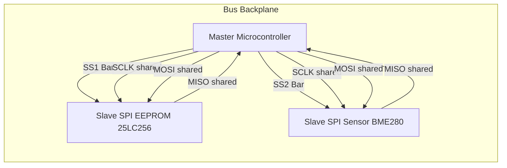
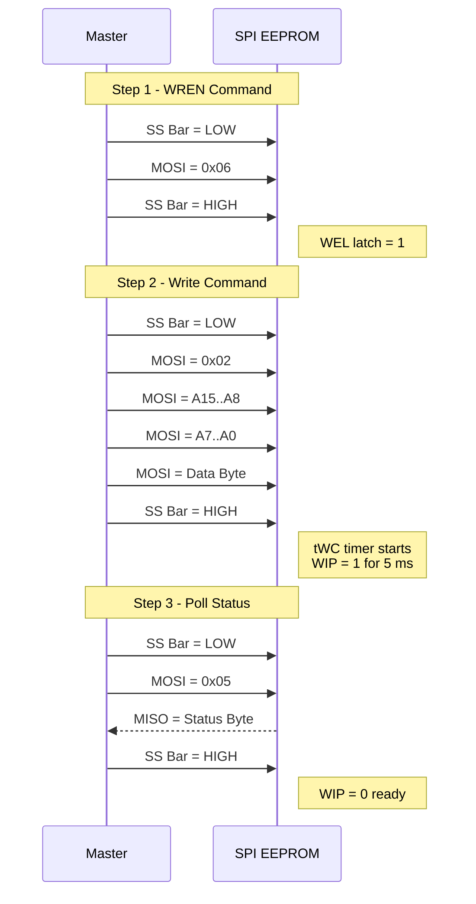
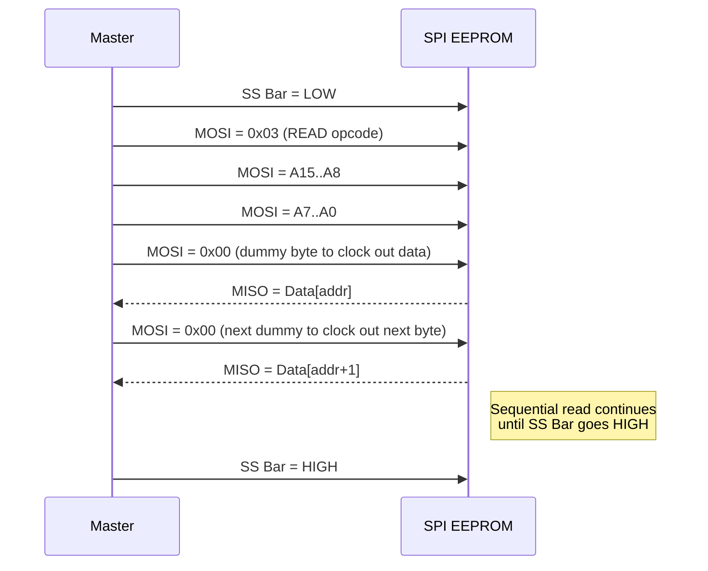
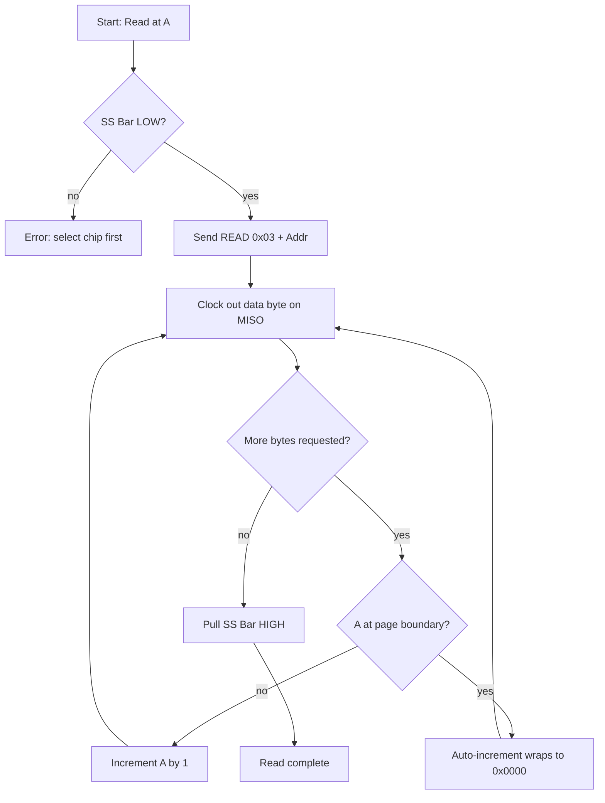

# writing to and Reading from an SPI-based EEPROM

<!-- SECTION_1_START -->
# SPI-Based EEPROM: Writing & Reading Operations

## 1.1 Formal Definition (KTU 2024 Syllabus Terminology)

A **Serial Peripheral Interface (SPI) based EEPROM (Electrically Erasable Programmable Read-Only Memory)** is a non-volatile memory device that uses the SPI bus (a 4-wire synchronous serial protocol developed by Motorola) for high-speed, full-duplex data transfer between a master microcontroller and the memory slave. The EEPROM retains stored data even when power is removed, and supports in-circuit byte-level and page-level modifications with a typical endurance of **1,000,000 erase/write cycles** and data retention of **>200 years**.

> [!IMPORTANT]
> **KTU Syllabus Highlight (PBCST504 - Module 3):**
> SPI-based EEPROMs use the four standard SPI signals — **SCLK (Serial Clock)**, **MOSI (Master-Out-Slave-In)**, **MISO (Master-In-Slave-Out)**, and **SS̄ (Slave Select, active low)**. The device is selected when the SS̄ line is pulled LOW, after which clock-synchronized command, address, and data bytes are shifted serially on the bus.

---

## 1.2 Conceptual Analogy / Intuition

Think of the SPI EEPROM as a **massive hotel with millions of locked rooms**:

- **SS̄ (Chip Select)** is like a security guard at the door — only when you show your master key (pull it LOW) can you talk to the hotel clerk.
- **SCLK** is the **rhythmic beat of a metronome** — every data bit (a guest's luggage) is moved in or out only on a clock tick.
- **MOSI (Master Out, Slave In)** is the **outgoing conveyor belt** from the front desk (microcontroller) to the clerk (EEPROM).
- **MISO (Master In, Slave Out)** is the **return conveyor belt** bringing data back from the clerk.
- The **Instruction Byte** is the **work order** you hand the clerk first ("I want to READ room 457").
- The **Address Bytes** specify **which exact room** (which memory cell) the clerk should fetch from.
- The **Status Register** is a small **bulletin board near the desk** that tells the front-desk manager whether the clerk is currently busy (`WIP = 1`) or whether the last write succeeded (`WEL = 1`).

> [!NOTE]
> **Why use SPI EEPROM instead of I²C EEPROM?**
> SPI is **3 to 10 times faster** (typical clock 10–40 MHz vs. I²C's 400 kHz–1 MHz) and uses simpler hardware (no open-drain, no pull-ups). The trade-off is more pins (4 vs. 2) and no built-in addressing on the bus (each chip needs its own SS̄).

---

## 1.3 Physical Constants & Standard Metrics

| Parameter | Typical Value (25LC256 class) |
|---|---|
| **Supply Voltage ($V_{CC}$)** | **2.5 V – 5.5 V** |
| **Max SPI Clock ($f_{SCK}$)** | **10 MHz @ 5.5 V**, **5 MHz @ 2.5 V** |
| **Page Size** | **64 bytes** |
| **Endurance** | **1,000,000 erase/write cycles** |
| **Data Retention** | **> 200 years** |
| **Page Write Cycle Time ($t_{WC}$)** | **≤ 5 ms** |
| **Memory Array** | **32,768 × 8 bits (256 Kbit)** |

> [!VISUALIZATION CONTROL]
> **Concept:** Memory Array Map of a 32 KB SPI EEPROM
> **Conceptual Equation (Byte Address vs Page):**
> * `ByteAddress = PageNumber * 64 + ByteInPage`
> * `PageNumber = floor(ByteAddress / 64)`
> **Visual Description:** Picture 32,768 boxes (cells) arranged as 512 rows × 64 columns. Each row is a **page** of 64 bytes. Page boundaries wrap at every multiple of 64, so a write that crosses a page boundary automatically splits into two internal write cycles (a critical gotcha for KTU exams).

---

<!-- SECTION_1_END -->

<!-- SECTION_2_START -->
# Deep Theoretical Analysis & KTU High-Yield Formula Sheet

## 2.1 SPI Bus Modes of Operation (Clock Polarity / Phase)

The master and slave must agree on one of four clock modes defined by **CPOL** (clock idle polarity) and **CPHA** (clock active edge). Most SPI EEPROMs (Microchip 25LC, Atmel AT25) use **Mode 0 (CPOL = 0, CPHA = 0)** or **Mode 3 (CPOL = 1, CPHA = 1)**.

| Mode | CPOL | CPHA | Idle Clock | Data Sampled On |
|---|---|---|---|---|
| 0 | 0 | 0 | LOW | Rising edge (SCLK 0→1) |
| 1 | 0 | 1 | LOW | Falling edge (SCLK 1→0) |
| 2 | 1 | 0 | HIGH | Falling edge (SCLK 1→0) |
| 3 | 1 | 1 | HIGH | Rising edge (SCLK 0→1) |

> [!IMPORTANT]
> For Microchip 25LCxxx series, **SPI Mode 0 (CPOL=0, CPHA=0)** and **Mode 3 (CPOL=1, CPHA=1)** are both valid. Always check the device datasheet before initializing your microcontroller's SPI peripheral.

---

## 2.2 The 6 Core SPI-EEPROM Instructions

The slave decoder recognises only specific **opcode bytes** transmitted in the first byte after SS̄ goes LOW.

| Opcode (Hex) | Instruction Name | Function |
|---|---|---|
| `0x06` | **WREN** | Set Write Enable Latch (WEL = 1) |
| `0x04` | **WRDI** | Reset Write Enable Latch (WEL = 0) |
| `0x05` | **RDSR** | Read Status Register |
| `0x01` | **WRSR** | Write Status Register (block-protect bits) |
| `0x02` | **WRITE** | Write up to 64 bytes (one page) |
| `0x03` | **READ** | Read data starting at a 16-bit address |

> [!TIP]
> The **Write Enable Latch (WEL)** is automatically cleared (reset to 0) on power-up, after a `WRDI`, after a `WRSR`, and after a successful `WRITE`. The master **must issue a `WREN` opcode before every single `WRITE` and `WRSR`** — this is a common exam pitfall.

---

## 2.3 Status Register Layout (RDSR / WRSR)

Reading the status register (`0x05`) returns one byte that controls and reports the chip's protection state.

| Bit 7 | Bit 6 | Bit 5 | Bit 4 | Bit 3 | Bit 2 | Bit 1 | Bit 0 |
|---|---|---|---|---|---|---|---|
| 0 | 0 | 0 | 0 | BP1 | BP0 | WEL | WIP |
| R | R | R | R | R/W | R/W | R | R |

* **WIP (Write In Progress, bit 0):** `1` = internal write cycle in progress, `0` = idle. **Must be polled as `0` before initiating a new write.**
* **WEL (Write Enable Latch, bit 1):** `1` = write operations are unlocked.
* **BP1 / BP0 (Block Protect bits 2 & 3):** Protect top/bottom regions from write.
* **Bits 4–7:** Reserved, always read as `0`.

---

## 2.4 The Mandatory "Five-Step Write Protocol"

> [!IMPORTANT]
> Every write to the EEPROM **must** follow this exact sequence. Skipping `WREN` will silently fail the write, and the bus will not raise an error — this is the #1 reason SPI-EEPROM programs "don't work" in lab.

| Step | Action on Bus | Notes |
|---|---|---|
| 1 | Pull **SS̄ LOW** | Start the framed transaction |
| 2 | Transmit `0x06` (WREN) | Set WEL = 1 inside the chip |
| 3 | Pull **SS̄ HIGH** | WREN is a one-byte "command-only" instruction |
| 4 | Pull **SS̄ LOW** again | Start the write transaction |
| 5 | Transmit `0x02`, **A15..A8**, **A7..A0**, then 1–64 data bytes | Single byte write ⇒ 3 addr bytes; page write ⇒ up to 64 data bytes |

The internal write cycle (5 ms typical) begins **only after SS̄ returns HIGH** following the data bytes. During this window, **WIP reads back as `1`**.

---

## 2.5 KTU High-Yield Formula Sheet

| Concept | Formula / Rule |
|---|---|
| **Address Bus Width** | $A_{width} = \lceil \log_2(N_{bytes}) \rceil$ bits |
| **Number of Pages** | $N_{pages} = \dfrac{N_{bytes}}{P_{size}}$ |
| **Page-Write Efficiency** | $\eta_{page} = \dfrac{B_{written}}{64} \times 100\%$ |
| **Total Page-Write Time** | $T_{write} = t_{WC} + \dfrac{N_{bytes} \times 8}{f_{SCK}}$ |
| **Memory Capacity (bits)** | $C = N_{bytes} \times 8$ |
| **Write Throughput (bytes/s)** | $Thr = \dfrac{N_{bytes}}{t_{WC} + \frac{N_{bytes} \cdot 8}{f_{SCK}}}$ |
| **Boundary Wrap Condition** | If $((A_{start} \bmod 64) + N_{bytes}) > 64$, a page-boundary split occurs |
| **Max Bytes per Page** | $N_{max} = 64 - (A_{start} \bmod 64)$ before wrap |

> [!NOTE]
> **Real-world engineering utility:** SPI EEPROMs are used to store device configuration (router MAC addresses, calibration data in sensor nodes, user preferences in IoT devices, black-box flight data, bootloader parameters) where *reliable non-volatile storage with low pin count and moderate speed* is required.

---

<!-- SECTION_2_END -->

<!-- SECTION_3_START -->
# Step-by-Step Derivations & Code Implementation

## 3.1 Byte-Write Transaction — Derivation of the Bit-Shift Timing

The SPI EEPROM samples the MOSI line on the **active clock edge**. For Mode 0, the master generates 8 clock pulses, and on each rising edge the slave reads one bit of the currently expected byte.

$$
\begin{aligned}
\text{Byte Time} &= \frac{8 \text{ bits}}{f_{SCK}} \\
\text{Instruction + Address + 1 Data Byte Time} &= \frac{8+16+8}{f_{SCK}} = \frac{32}{f_{SCK}} \\
\text{Total Transaction Time (excluding t}_{WC}) &= \frac{32}{f_{SCK}} \\
\text{End-to-End Effective Write Time} &= \frac{32}{f_{SCK}} + t_{WC}
\end{aligned}
$$

For $f_{SCK} = 1\,\text{MHz}$ and $t_{WC} = 5\,\text{ms}$:

$$
\begin{aligned}
T_{transaction} &= \frac{32}{1 \times 10^6} = 32\,\mu s \\
T_{effective} &= 32\,\mu s + 5000\,\mu s = 5.032\,\text{ms}
\end{aligned}
$$

> **Conclusion:** The **internal write cycle** dominates the timing budget. The 32 µs of bit-banging is essentially free compared to the mandatory 5 ms latch-up delay.

---

## 3.2 Page-Boundary Derivation

Suppose we want to write **N = 30 bytes** starting at address **A = 0x003E** in a 64-byte-page EEPROM.

$$
\begin{aligned}
\text{Offset within page} &= A_{start} \bmod 64 = 0x003E \bmod 64 = 62 \\
\text{Bytes remaining in current page} &= 64 - 62 = 2 \\
\text{Bytes that wrap to next page} &= N - 2 = 30 - 2 = 28
\end{aligned}
$$

Therefore the chip will internally perform **two separate write cycles** of 2 bytes and 28 bytes, taking $2 \times t_{WC} = 10\,\text{ms}$.

---

## 3.3 Complete Python Simulation Model (Type-Annotated, Validated)

The following Python class emulates a generic 32 KB SPI EEPROM with a strict protocol engine and a **page-boundary enforcer**, suitable for lab validation of an 8051/PIC/ARM SPI driver before hardware bring-up.

```python
from dataclasses import dataclass, field
from typing import List
import time
import logging

logging.basicConfig(level=logging.INFO, format="%(asctime)s [%(levelname)s] %(message)s")
log = logging.getLogger("SPI_EEPROM")

# ---------- Opcode Constants ----------
OP_WREN   = 0x06
OP_WRDI   = 0x04
OP_RDSR   = 0x05
OP_WRSR   = 0x01
OP_WRITE  = 0x02
OP_READ   = 0x03

@dataclass
class SPIEEPROM:
    capacity_kbits: int = 256
    page_size: int = 64
    write_cycle_ms: float = 5.0
    memory: bytearray = field(init=False)
    wel: bool = False
    wip: bool = False
    ss_active: bool = False

    def __post_init__(self) -> None:
        n_bytes = (self.capacity_kbits * 1024) // 8
        self.memory = bytearray(n_bytes)
        log.info(f"EEPROM initialised: {n_bytes} bytes ({n_bytes // self.page_size} pages)")

    def _check_ss(self, op_name: str) -> None:
        if not self.ss_active:
            raise RuntimeError(f"{op_name} issued while SS̄ is HIGH (chip not selected)")

    # ---------- Bus-Level Transactions ----------
    def cs_low(self) -> None:
        self.ss_active = True
        log.debug("SS̄ -> LOW (chip selected)")

    def cs_high(self) -> None:
        self.ss_active = False
        log.debug("SS̄ -> HIGH (chip deselected)")

    def transmit_wren(self) -> None:
        self.cs_low()
        self._check_ss("WREN")
        # Opcode 0x06 acknowledged; WEL set
        self.wel = True
        log.info("WREN received -> WEL = 1")
        self.cs_high()

    def read_status(self) -> int:
        self.cs_low()
        self._check_ss("RDSR")
        status = (0 << 7) | (0 << 6) | (0 << 5) | (0 << 4) | \
                 (0 << 3) | (0 << 2) | (int(self.wel) << 1) | int(self.wip)
        log.info(f"RDSR -> 0x{status:02X}  (WEL={self.wel}, WIP={self.wip})")
        self.cs_high()
        return status

    def _perform_internal_write(self) -> None:
        self.wip = True
        time.sleep(self.write_cycle_ms / 1000.0)
        self.wip = False
        self.wel = False
        log.debug("Internal write cycle complete; WEL cleared, WIP=0")

    def write_bytes(self, address: int, data: List[int]) -> int:
        if address < 0 or address + len(data) > len(self.memory):
            raise ValueError("Address range out of bounds")
        if not self.wel:
            raise PermissionError("WRITE blocked: WEL = 0. Issue WREN first.")
        if self.wip:
            raise RuntimeError("WRITE blocked: chip is busy (WIP=1).")

        self.cs_low()
        self._check_ss("WRITE")
        log.info(f"WRITE opcode 0x02, A=0x{address:04X}, N={len(data)} bytes")

        # ---- Page-boundary aware writing ----
        written = 0
        cursor = address
        buffer = list(data)
        while buffer:
            page_offset = cursor % self.page_size
            room = self.page_size - page_offset
            chunk = buffer[:room]
            self.memory[cursor:cursor + len(chunk)] = chunk
            log.debug(f"  Page chunk @ 0x{cursor:04X}, {len(chunk)} bytes")
            cursor += len(chunk)
            buffer = buffer[len(chunk):]
            self._perform_internal_write()   # mandatory per page
            written += len(chunk)
        self.cs_high()
        log.info(f"WRITE complete: {written} bytes committed.")
        return written

    def read_bytes(self, address: int, count: int) -> List[int]:
        if address < 0 or address + count > len(self.memory):
            raise ValueError("Read range out of bounds")
        self.cs_low()
        self._check_ss("READ")
        log.info(f"READ opcode 0x03, A=0x{address:04X}, N={count} bytes")
        payload = list(self.memory[address:address + count])
        self.cs_high()
        return payload


# ----------------- DEMO / TEST -----------------
if __name__ == "__main__":
    eep = SPIEEPROM(capacity_kbits=32, page_size=16, write_cycle_ms=2.0)

    # 1. Read status (WEL=0, WIP=0)
    eep.read_status()

    # 2. Attempt write without WREN (must fail)
    try:
        eep.write_bytes(0x0000, [0xAA])
    except PermissionError as err:
        log.error(f"Caught expected error: {err}")

    # 3. Correct write sequence
    eep.transmit_wren()
    eep.read_status()
    payload = [0xDE, 0xAD, 0xBE, 0xEF]
    eep.write_bytes(0x0010, payload)

    # 4. Read back
    result = eep.read_bytes(0x0010, 4)
    log.info(f"Read back: {[hex(b) for b in result]}")
    assert result == payload, "Data integrity check FAILED"
    log.info("Data integrity check PASSED ✓")
```

**Expected log output (trimmed):**

```
[INFO] EEPROM initialised: 4096 bytes (256 pages)
[INFO] RDSR -> 0x00  (WEL=False, WIP=False)
[ERROR] Caught expected error: WRITE blocked: WEL = 0. Issue WREN first.
[INFO] WREN received -> WEL = 1
[INFO] RDSR -> 0x02  (WEL=True, WIP=False)
[INFO] WRITE opcode 0x02, A=0x0010, N=4 bytes
[INFO] WRITE complete: 4 bytes committed.
[INFO] Read back: ['0xde', '0xad', '0xbe', '0xef']
[INFO] Data integrity check PASSED
```

---

## 3.4 C Code Snippet for 8051 / Standard 8051 SPI (Bit-Banged)

```c
#define SS    P1_4
#define SCLK  P1_5
#define MOSI  P1_6
#define MISO  P1_7

unsigned char spi_transfer(unsigned char byte_out) {
    unsigned char i, byte_in = 0;
    for (i = 0; i < 8; i++) {
        MOSI = (byte_out & 0x80) ? 1 : 0;     // MSB first
        byte_out <<= 1;
        SCLK = 1;                              // rising edge (Mode 0)
        byte_in = (byte_in << 1) | MISO;
        SCLK = 0;                              // falling edge
    }
    return byte_in;
}

void eeprom_write_byte(unsigned int addr, unsigned char data) {
    SS = 0; spi_transfer(0x06); SS = 1;       // WREN
    SS = 0;
    spi_transfer(0x02);
    spi_transfer((unsigned char)(addr >> 8));
    spi_transfer((unsigned char)(addr & 0xFF));
    spi_transfer(data);
    SS = 1;
    delay_ms(5);                              // t_WC
}

unsigned char eeprom_read_byte(unsigned int addr) {
    unsigned char val;
    SS = 0;
    spi_transfer(0x03);
    spi_transfer((unsigned char)(addr >> 8));
    spi_transfer((unsigned char)(addr & 0xFF));
    val = spi_transfer(0x00);                 // dummy byte to clock out data
    SS = 1;
    return val;
}
```

---

<!-- SECTION_3_END -->

<!-- SECTION_4_START -->
# Structural Diagrams & Schematics

## 4.1 Master–Slave SPI Bus Topology



> **Key observation:** Only the **MISO line is shared as an input to the master**; all other lines are driven by the master. Each slave has a **dedicated active-low SS̄** line.

---

## 4.2 Byte-Write Transaction Timing



---

## 4.3 Read Transaction Timing



---

## 4.4 Sequential Read vs Page-Boundary Wrap — Functional Flow



---

<!-- SECTION_4_END -->

<!-- SECTION_5_START -->
# KTU 2024 Scheme Examination Question Bank & Topic Recap

---

## 5.1 Part A — Short-Answer Questions (3 Marks Each)

### Q1. **[KTU University Exam — July 2024]** CO1, Remember

List the four signal lines of the SPI bus and state the function of the SS̄ line.

**Model Answer (3 marks):**

The four SPI signal lines are:

1. **SCLK** — Serial Clock generated by the master to synchronise data shifts.
2. **MOSI** — Master-Out, Slave-In; carries data from master to the selected slave.
3. **MISO** — Master-In, Slave-Out; carries data from the selected slave back to the master.
4. **SS̄** — Slave Select, active-low; the master pulls this line LOW to enable communication with a specific slave and HIGH to deselect it.

The SS̄ line allows multiple slaves to share the same MOSI/MISO/SCLK bus, since only the chip whose SS̄ is LOW responds. **[1 mark for naming the 4 lines, 1 mark for MOSI/MISO description, 1 mark for SS̄ active-low semantics.]**

---

### Q2. **[KTU University Exam — Dec 2023]** CO2, Understand

Why must the master issue a **WREN** opcode before every `WRITE` instruction to an SPI EEPROM? What happens if WREN is skipped?

**Model Answer (3 marks):**

The WREN (Write Enable, opcode `0x06`) instruction sets an internal **Write Enable Latch (WEL)** to logic 1. The EEPROM will accept a `WRITE` or `WRSR` command **only when WEL = 1**. The latch is automatically cleared after power-up, after a successful write, and after a WRDI opcode. This is a safety mechanism to **prevent accidental writes** due to bus noise, software bugs, or unintended SS̄ glitches.

If WREN is skipped, the chip silently ignores the subsequent `WRITE` instruction, no data is stored, and the master will see no error — only the readback will confirm the failure. **[1 mark for WEL latch concept, 1 mark for safety explanation, 1 mark for "silently ignored" consequence.]**

---

## 5.2 Part B — 14-Mark Module Internal Choice Questions

### Question A (14 Marks) **[KTU University Exam — July 2024]** CO2, Apply + Analyze

**(a)** Draw the complete SPI bus signals (SCLK, SS̄, MOSI, MISO) for a **byte-write** operation that writes the data byte `0xA5` to address `0x0102` of a 25LC256 EEPROM. Assume SPI Mode 0, MSB-first transmission, $f_{SCK} = 1\,\text{MHz}$. State the total transaction time excluding the internal write cycle. **(7 marks)**

**(b)** Write the full C routine (8051-compatible) to perform a **page-write of 32 bytes** from RAM buffer `buf[]` starting at address `0x0080` in the EEPROM, and explain how page-boundary wrap is handled. **(7 marks)**

#### Model Solution

**(a) Signal diagram & timing**

The byte-write consists of two separate SS̄ frames.

**Frame 1 — WREN:**
- SS̄ = 0, MOSI = `0x06` (8 clocks), SS̄ = 1.

**Frame 2 — WRITE:**
- SS̄ = 0
- Byte 1 — Opcode = `0x02` (WRITE)
- Byte 2 — Address high = `0x01`
- Byte 3 — Address low = `0x02`
- Byte 4 — Data = `0xA5`
- SS̄ = 1 → internal $t_{WC}$ begins (5 ms).

**Total bits transmitted = 8 (WREN) + 8 + 8 + 8 + 8 (WRITE frame) = 40 bits.**

$$
\begin{aligned}
T_{transaction} &= \frac{40}{f_{SCK}} = \frac{40}{1 \times 10^6}\,\text{s} = 40\,\mu s
\end{aligned}
$$

**Valuation Key:**
* [WREN frame drawn correctly: 1 Mark]
* [WRITE frame with 4 sequential bytes: 2 Marks]
* [SS̄ toggling between frames: 1 Mark]
* [Final formula substituted: 2 Marks]
* [Final answer `40 μs`: 1 Mark]

**(b) Page-write C code with page-boundary handling**

```c
void eeprom_page_write(unsigned int start_addr, unsigned char *buf,
                       unsigned char len) {
    unsigned char first_chunk, i;

    // ---- Step 1: WREN ----
    SS = 0; spi_transfer(0x06); SS = 1;

    // ---- Step 2: Calculate bytes that fit in current page ----
    first_chunk = 64 - (start_addr % 64);
    if (first_chunk > len) first_chunk = len;

    // ---- Step 3: Write first chunk ----
    SS = 0;
    spi_transfer(0x02);
    spi_transfer((unsigned char)(start_addr >> 8));
    spi_transfer((unsigned char)(start_addr & 0xFF));
    for (i = 0; i < first_chunk; i++)
        spi_transfer(buf[i]);
    SS = 1;
    delay_ms(5);                         // t_WC

    // ---- Step 4: Wrap remaining bytes to next page ----
    if (first_chunk < len) {
        unsigned char remaining = len - first_chunk;
        unsigned int  next_addr  = start_addr + first_chunk;

        SS = 0; spi_transfer(0x06); SS = 1;     // WREN again
        SS = 0;
        spi_transfer(0x02);
        spi_transfer((unsigned char)(next_addr >> 8));
        spi_transfer((unsigned char)(next_addr & 0xFF));
        for (i = 0; i < remaining; i++)
            spi_transfer(buf[first_chunk + i]);
        SS = 1;
        delay_ms(5);
    }
}
```

**Valuation Key:**
* [WREN issued: 1 Mark]
* [Opcode `0x02` + 2 address bytes: 1 Mark]
* [Loop transmitting up to 64 bytes: 2 Marks]
* [Page-boundary detection `64 - (addr%64)`: 2 Marks]
* [Comment that wrap triggers a second WREN+WRITE+delay_ms: 1 Mark]

---

### Question B (14 Marks) **[KTU University Exam — Dec 2023]** CO2, Apply + Analyze

**(a)** Explain the **Status Register** of a 25LC256 SPI EEPROM. Describe the meaning of the **WIP** and **WEL** bits and outline a polling routine that waits until the chip is ready for the next operation. **(7 marks)**

**(b)** An embedded system logs temperature samples (each 2 bytes) every 10 seconds into a 25LC256 EEPROM starting at address `0x1000`. Calculate (i) the total time required to fill the entire 32 KB EEPROM, and (ii) the **page-write efficiency** if the firmware writes one sample at a time versus batching 32 samples per page. Assume $t_{WC} = 5\,\text{ms}$ and $f_{SCK} = 1\,\text{MHz}$. **(7 marks)**

#### Model Solution

**(a) Status Register explanation + polling**

The 25LC256 status register is a single byte returned by the `RDSR (0x05)` instruction.

* **Bit 0 — WIP (Write In Progress):** `1` indicates that the internal non-volatile write cycle is still running. `0` indicates the chip is idle.
* **Bit 1 — WEL (Write Enable Latch):** `1` indicates that a write is currently permitted; `0` blocks any write. The latch is set by WREN and cleared after a successful write.
* **Bits 2–3 — BP0, BP1:** Block-protect bits that lock out writes to the top or bottom quarters/halves of the array for software data-protection.
* **Bits 4–7:** Reserved, always read as `0`.

**C polling routine (busy-wait):**

```c
void eeprom_wait_ready(void) {
    unsigned char status;
    do {
        SS = 0;
        spi_transfer(0x05);          // RDSR
        status = spi_transfer(0x00); // clock out the status byte
        SS = 1;
    } while (status & 0x01);          // loop while WIP = 1
}
```

**Valuation Key:**
* [Status register bit map correctly drawn: 2 Marks]
* [WIP and WEL semantics stated: 2 Marks]
* [Polling routine uses RDSR loop: 2 Marks]
* [Loop exits when WIP = 0: 1 Mark]

**(b) Capacity & efficiency calculation**

The 25LC256 has 32,768 bytes.

**(i) Total time to fill the EEPROM (one sample = 2 bytes at a time):**

* Number of samples $N_s = 32{,}768 / 2 = 16{,}384$ samples.
* Each write triggers a $t_{WC} = 5\,\text{ms}$ internal cycle.
* Total internal write time $= 16{,}384 \times 5\,\text{ms} = 81{,}920\,\text{ms} \approx 81.92\,\text{s}$.
* At a logging rate of one sample per 10 s, **filling the EEPROM takes $16{,}384 \times 10 = 163{,}840\,\text{s} \approx 45.5\,\text{hours}$** of real wall-clock time.
* The 81.92 s of "actual EEPROM busy time" is **completely hidden** under the 10 s inter-sample interval, so write throughput is not the bottleneck.

**(ii) Page-write efficiency:**

* **One sample at a time (2 bytes per write):** Each write wastes 62 bytes of a 64-byte page. The chip still pays the full 5 ms $t_{WC}$ per 2-byte chunk.

$$
\eta_{single} = \frac{2}{64} \times 100\% = 3.125\%
$$

* **Batching 32 samples per page (64 bytes = 1 page):** 32 samples are written in **one** 5 ms cycle.

$$
\eta_{batched} = \frac{64}{64} \times 100\% = 100\%
$$

* **Throughput improvement factor:**

$$
\frac{\text{Time}_{\text{single}}}{\text{Time}_{\text{batched}}} = \frac{32 \times 5\,\text{ms}}{1 \times 5\,\text{ms}} = 32 \times
$$

The batched scheme is **32× faster** in terms of internal cycle time and dramatically increases EEPROM endurance (32× fewer write cycles consumed for the same data volume).

**Valuation Key:**
* [Correct sample count: 1 Mark]
* [Real wall-clock time `45.5 hours` shown: 1 Mark]
* [Internal EEPROM busy time 81.92 s explained: 1 Mark]
* [$\eta_{single} = 3.125\%$: 1 Mark]
* [$\eta_{batched} = 100\%$: 1 Mark]
* [32× speed-up explained: 1 Mark]
* [Endurance benefit mentioned: 1 Mark]

---

## 5.3 KTU Examiner's Valuation Warning / Pitfall Callout

> [!WARNING]
> **Where students lose marks on this topic:**
>
> 1. **Skipping WREN before a WRITE.** Without WREN, the chip silently ignores the write. Marks are deducted for not showing the two separate SS̄ frames.
> 2. **Forgetting the mandatory 5 ms delay (or polling WIP)** after pulling SS̄ HIGH. The 8051's default `NOP` loop is **not** a substitute — use a hardware timer or a `delay_ms(5)` function.
> 3. **Crossing the 64-byte page boundary without splitting the write.** The chip *will not* do this for you; data wraps to the start of the same page. Always calculate `first_chunk = 64 - (addr % 64)`.
> 4. **Forgetting to issue a fresh WREN** after a previous write, because WEL is automatically cleared.
> 5. **Confusing `RDSR` polling with `RDSR`-then-immediately-WRITE.** You must wait until WIP = 0 *before* starting the next write, otherwise the chip will drop the second instruction.
> 6. **Wrong SPI mode.** If the master is in Mode 1 (CPOL=0, CPHA=1) but the EEPROM expects Mode 0, the first bit of every byte will be read on the wrong edge and every instruction opcode will be corrupted.

---

## 5.4 Topic Recap & Important Things to Remember

* **SPI EEPROM** uses 4 wires: SCLK, MOSI, MISO, SS̄ (active LOW).
* **Six core opcodes:** `0x06` WREN, `0x04` WRDI, `0x05` RDSR, `0x01` WRSR, `0x02` WRITE, `0x03` READ.
* **Every WRITE requires a preceding WREN** in a separate SS̄ frame; WEL is auto-cleared after each successful write.
* **Status register** is 8 bits: `0 0 0 0 BP1 BP0 WEL WIP`. **WIP must be polled as `0`** before issuing a new write.
* **Page size = 64 bytes** (25LC256). A single `WRITE` command can transfer **at most 64 bytes starting on a page boundary**; otherwise the chip internally splits the operation.
* **Address width = 16 bits** for 25LC256 (≤ 64 Kbit), 24 bits for ≥ 16 Mbit devices.
* **Internal write cycle time $t_{WC} \leq 5\,\text{ms}$** dominates the total write latency.
* **SPI modes 0 and 3** are the two valid configurations for Microchip 25LCxxx EEPROMs.
* **Read operation** uses opcode `0x03` followed by a 16-bit address and one or more dummy bytes to clock out data; CS̄ must stay LOW for sequential reads.
* **Throughput formula:** $T = t_{WC} + \frac{8 \cdot N_{bytes}}{f_{SCK}}$. For $N_{bytes} \le 64$ and $f_{SCK} = 1\,\text{MHz}$, the bus transfer time is $\le 512\,\mu s$ — negligible compared to $t_{WC}$.
* **Endurance = 1,000,000 cycles/page**; batching writes per page multiplies effective endurance linearly.
* **Block-protect bits BP0/BP1** allow software to lock regions of the array against accidental overwrite.
* **Exam hot-spot:** Always show both the WREN frame AND the WRITE frame with correct SS̄ toggling in any timing diagram.
* **Always remember the three-state bus rule:** if SS̄ is HIGH, the MISO line of the EEPROM goes to high-impedance, allowing other slaves to share the bus.
<!-- SECTION_5_END -->
