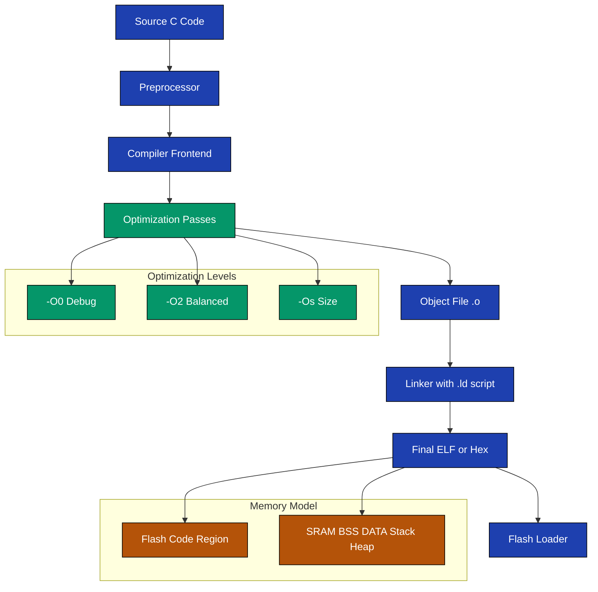
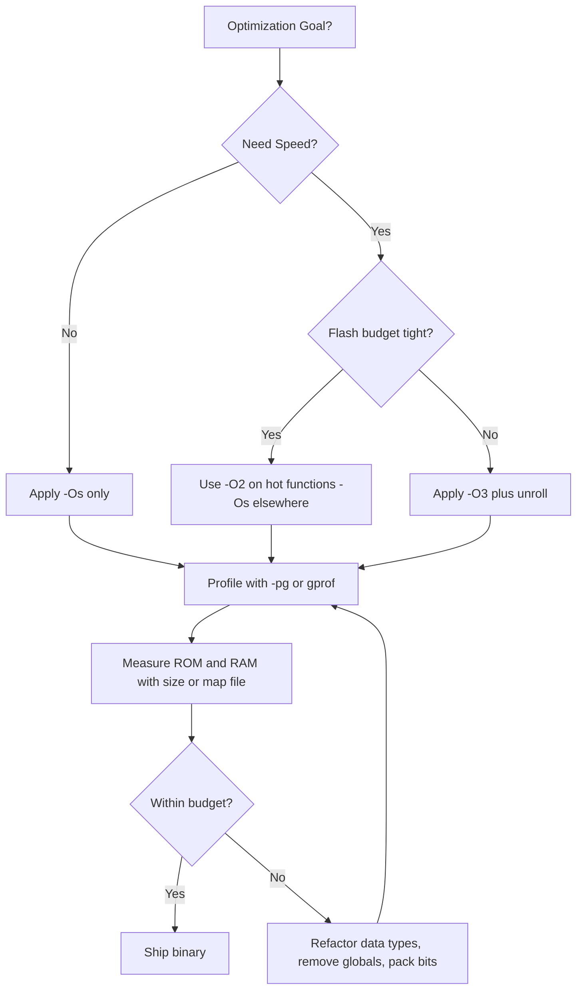
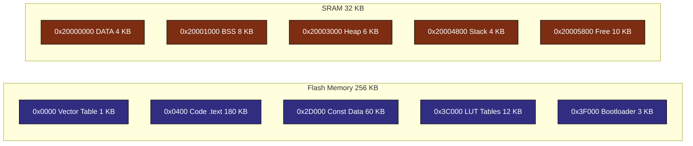

# Advanced Debugging and Optimization: Code and Memory Optimization Techniques

<!-- SECTION_1_START -->
# Advanced Debugging and Optimization: Code and Memory Optimization Techniques

## 1.1 Formal Academic Definition (KTU 2024 Syllabus Terminology)

> [!IMPORTANT]
> **Code Optimization** is the process of modifying a software system to make some aspect of it work more efficiently or use fewer resources. In embedded systems context, it specifically targets reduction of **code size (ROM footprint)**, **execution time (CPU cycles)**, and **power consumption** while preserving functional correctness.

> [!NOTE]
> **Memory Optimization** is the discipline of intelligently organizing program data and instructions to fit within the constrained on-chip memory of a microcontroller (typically $2\,\text{KB}$ to $512\,\text{KB}$ flash, and $128\,\text{B}$ to $128\,\text{KB}$ RAM in 8/32-bit MCUs).

Together, these techniques form the **post-compilation refinement layer** of an embedded firmware pipeline, sitting between the **compiler's automatic optimization passes** and the **hardware-level tuning** (clock throttling, peripheral gating).

## 1.2 Conceptual Analogy — The "Travel Backpack" View

Imagine packing for a week-long trek into a **40-litre backpack**:

- **Code optimization** = choosing versatile, multi-purpose clothing (one jacket that becomes a pillow, sandals that become camp shoes).
- **Memory optimization** = rolling clothes instead of folding, using every pocket, and deciding whether to carry a thick book (lookup table) or a tiny notepad with key points (computed formula).
- **Compiler flags** (like $-O2$) = an experienced packing assistant who automatically removes duplicate socks and unused gadgets.
- **Profiling** = walking the trail with a **fitness band** that tells you which items you actually used versus which ones just weighed you down.

A microcontroller is a **strict TSA officer**: every byte of flash, every cycle of CPU time, and every microamp of current is *budgeted*. Optimization is the engineering art of staying *under* that budget without losing trip essentials (functionality).

## 1.3 The Three Engineering Targets

> [!NOTE]
> **The Embedded Optimization Trinity (EOT):**
> 1. **Speed** — reduce instruction cycles (latency-critical loops, ISRs).
> 2. **Size** — fit code into limited flash/ROM ($<64\,\text{KB}$ in many 8-bit targets).
> 3. **Power** — minimize active current and sleep-mode leakage (battery IoT nodes).

These three goals are **often in conflict**: unrolling a loop speeds it up but inflates code size; using `float` is readable but wastes cycles and RAM versus `int` math.

## 1.4 Memory Map of a Typical MCU — Visual Intuition

> [!VISUALIZATION CONTROL]
> **Concept:** Linear memory map showing how flash, RAM, stack, and heap compete for the limited address space.
> **GeoGebra / Desmos Input Equations (segmented line model):**
> * `f_1(x) = 0x0000` (vector table region)
> * `f_2(x) = 0x0004` (start of code)
> * `f_3(x) = 0x7FF0` (top of flash)
> * `f_4(x) = 0x20000000` (start of SRAM)
> **Visual Description:** Plot the $x$-axis as the $32$-bit address line. Mark the $0x00000000$ origin, then highlight the flash region ($0x0000\,0000$ to $0x0007\,FFFF$) shaded as code, and the SRAM region ($0x2000\,0000$ to $0x2000\,1FFF$) shaded as data. Show a downward arrow depicting stack growth and an upward arrow for heap growth inside SRAM.

## 1.5 Why KTU 2024 Stresses This Topic

In the NEP 2020 aligned syllabus, **Module 4** bridges RTOS awareness with **real-world IoT deployment constraints**. A student must demonstrate the ability to *refactor naive code* into production-grade firmware — a direct mapping to **Course Outcome CO4** ("Design and debug real-time embedded applications using modern toolchains").

<!-- SECTION_1_END -->

<!-- SECTION_2_START -->
# Deep Theoretical Analysis & KTU High-Yield Formula Sheet

## 2.1 Taxonomy of Optimization Techniques

The techniques fall into **four hierarchical layers**, applied bottom-up:

| Layer | Domain | Example Techniques | Engineer Control |
|:------|:-------|:-------------------|:-----------------|
| **L1 — Source-Level** | C / C++ source | Constant folding, loop unrolling, `const` qualifiers, inline functions | High (human authored) |
| **L2 — Compiler-Level** | Object file | $-O0, -O1, -O2, -O3, -Os, -Ofast$, LTO, dead-code elimination | Medium (flag based) |
| **L3 — Linker-Level** | Final binary | Section trimming (`--gc-sections`), memory mapping (`.ld` files) | Medium (linker script) |
| **L4 — Architectural** | Instruction set | Register allocation, ISR latency tuning, DMA offload, sleep modes | Low (hardware-bound) |

## 2.2 Code Optimization Techniques (Detailed)

### 2.2.1 Loop Transformation
- **Loop Unrolling** — replicating the loop body to reduce branch overhead.
- **Loop Fusion / Jamming** — merging adjacent loops over the same index range.
- **Loop Tiling** — blocking for cache-friendly access (relevant on Cortex-M3/M4 with D-Cache).
- **Loop-Invariant Code Motion (LICM)** — hoisting invariant expressions outside the loop.

### 2.2.2 Function-Level
- **Inlining** — replacing a `call` instruction with the function body (sized vs speed trade-off).
- **Tail-Call Optimization** — converting the final recursive `call` into a jump.
- **Static vs Dynamic Dispatch** — preferring `switch`/`if-else` over virtual function tables in embedded contexts.

### 2.2.3 Arithmetic & Type
- **Strength Reduction** — replacing expensive ops with cheaper ones (e.g., `x * 2` $\rightarrow$ `x << 1`).
- **Constant Folding** — evaluating `3 + 5` at compile time.
- **Fixed-Point Arithmetic** — substituting `float` with `int32_t Q15` for DSP routines.

### 2.2.4 Control Flow
- **Branch Prediction Hints** — `__builtin_expect()` in GCC for ARM.
- **Switch Optimization** — compiler generates jump tables when cases are dense.
- **Computed `goto`** — replaces long `if-else` chains in state machines.

## 2.3 Memory Optimization Techniques (Detailed)

| Technique | Effect on RAM | Effect on Flash | Trade-off |
|:----------|:-------------|:----------------|:----------|
| Use `uint8_t` instead of `int` | Saves bytes | Neutral | Range limited to $[0, 255]$ |
| Pack bit-fields in structs | Saves bytes | Neutral | Slower bit-access |
| `const` data in flash (PROGMEM / `const`) | Frees RAM | Uses flash | Read-only |
| `PROGMEM` / `__flash` strings | Frees RAM | Uses flash | Need `pgm_read_byte()` |
| Lookup tables (LUT) instead of `sin()` | Saves cycles | Inflates flash | Loses precision |
| Pool allocator | Avoids fragmentation | Neutral | Manual management |
| `static` instead of stack allocation | Predictable layout | Neutral | Lifetime coupling |
| `union` overlapping buffers | Saves RAM | Neutral | Cannot use simultaneously |
| `__packed__` structs | Saves bytes | Neutral | Misaligned access penalty |

## 2.4 Compiler Optimization Levels (GCC / ARM-GCC Reference)

| Flag | Code Size | Speed | Use Case |
|:-----|:----------|:------|:---------|
| $-O0$ | Largest | Slowest | Debug builds, step-through tracing |
| $-O1$ | $-5\%$ | $+10\%$ | Basic release |
| $-O2$ | $-10\%$ | $+25\%$ | Production firmware (most common) |
| $-O3$ | $-15\%$ | $+40\%$ | DSP, signal processing |
| $-Os$ | $-25\%$ | $-5\%$ | Tight flash budget (8-bit MCUs) |
| $-Ofast$ | $-20\%$ | $+45\%$ | With `-ffast-math`, may break IEEE 754 |
| $-Oz$ | $-30\%$ | $-10\%$ | ARM Cortex-M0 / AVR with $<32\,\text{KB}$ flash |

## 2.5 KTU High-Yield Formula Sheet

> [!IMPORTANT]
> **Cost Models for Embedded Optimization**
> Use these equations to predict the impact of a refactor *before* deploying it.

$$
\text{ROM footprint} = \sum_{i=1}^{n} \text{sizeof}(F_i) + \text{sizeof}(C_{\text{const}})
$$

$$
\text{RAM footprint} = \text{sizeof}(BSS) + \text{sizeof}(DATA) + \text{Stack}_{\text{peak}} + \text{Heap}_{\text{peak}}
$$

$$
\text{Avg. cycles/op} = \frac{T_{\text{total}} \cdot f_{\text{clk}}}{N_{\text{iterations}}}
$$

$$
\text{Power} = V \cdot I_{\text{active}} \cdot t_{\text{active}} + V \cdot I_{\text{sleep}} \cdot t_{\text{sleep}}
$$

$$
\text{Speedup}_S = \frac{T_{\text{before}}}{T_{\text{after}}} \qquad
\text{Code Inflation} = \frac{\text{ROM}_{\text{after}} - \text{ROM}_{\text{before}}}{\text{ROM}_{\text{before}}} \times 100\%
$$

$$
\text{Stack Depth}_{\max} = \sum_{k=1}^{m} \text{sizeof}(\text{frame}_k) + \text{sizeof}(\text{IRQ context})
$$

where the symbols are:
- $F_i$ = each function $i$ in the call graph.
- $C_{\text{const}}$ = constant data table.
- $f_{\text{clk}}$ = CPU clock frequency in $\text{Hz}$.
- $V$ = supply voltage, typically $3.3\,\text{V}$.
- $I_{\text{active}}, I_{\text{sleep}}$ = active and sleep current in amperes.
- $\text{frame}_k$ = local variable set of function $k$ in deepest call chain.

## 2.6 Real-World Engineering Utility

- **Wearables (Fitbit, Mi Band)**: $-Os$ builds with MSP430 to fit firmware into $32\,\text{KB}$ flash.
- **Automotive ECU (AUTOSAR)**: fixed-point math + lookup tables for pedal-map interpretation to meet $10\,\text{ms}$ cycle.
- **IoT Sensor Nodes (LoRa, BLE)**: aggressive sleep-mode programming extends coin-cell life from $6$ months to $>5$ years.
- **RTOS Kernels (FreeRTOS)**: tickless idle mode + compiler optimization saves $\sim 30\%$ energy.
- **DSP on Cortex-M4**: $-O3$ + SIMD intrinsics + loop unrolling meets real-time audio FFT deadlines.

<!-- SECTION_2_END -->

<!-- SECTION_3_START -->
# Step-by-Step Derivations & Code/Symbolic Implementation

## 3.1 Worked Example 1 — Strength Reduction (Mathematical Derivation)

**Problem:** A naive firmware computes $y = x \cdot 17$ using a signed multiplication on an 8-bit ATmega328 (each multiply costs $\sim 9$ cycles).

**Step 1 — Express the constant as a sum of powers of two:**

$$
17 = 16 + 1 = 2^{4} + 2^{0}
$$

**Step 2 — Replace multiplication by a shift + add:**

$$
y = x \cdot 17 = (x \ll 4) + (x \ll 0) = (x \ll 4) + x
$$

**Step 3 — Cost analysis:**

| Operation | Cycles (AVR) |
|:----------|:------------:|
| Original `x * 17` | $9$ |
| `(x << 4)` | $1$ |
| `+ x` | $1$ |
| **Optimized total** | $\mathbf{2}$ |

**Step 4 — Speedup calculation:**

$$
\text{Speedup} = \frac{9}{2} = 4.5\times
$$

## 3.2 Worked Example 2 — Loop Unrolling Cycle Savings Derivation

**Problem:** A polling loop reads $4$ ADC channels each with $3$ cycles of overhead per iteration.

**Original code cost (per ADC read):**

$$
T_{\text{naive}} = 4 \times (T_{\text{iter}} + T_{\text{branch}})
$$

Substituting $T_{\text{iter}} = 5$ cycles and $T_{\text{branch}} = 3$ cycles:

$$
T_{\text{naive}} = 4 \times (5 + 3) = 4 \times 8 = 32 \text{ cycles}
$$

**Unrolled cost (branch eliminated):**

$$
T_{\text{unrolled}} = 4 \times T_{\text{iter}} + 1 \times T_{\text{branch}} = 4 \times 5 + 3 = 23 \text{ cycles}
$$

**Savings:**

$$
\Delta T = 32 - 23 = 9 \text{ cycles} \qquad \eta = \frac{9}{32} \times 100\% = 28.125\%
$$

**Code size penalty (each iteration body inlined):**

$$
\text{Inflation} = \frac{4 \cdot B_{\text{body}} - B_{\text{loop}}}{B_{\text{loop}}} \times 100\%
$$

where $B_{\text{body}}$ is the unrolled body size and $B_{\text{loop}}$ is the loop wrapper size.

## 3.3 Worked Example 3 — Memory Footprint Calculation

A weather IoT node has the following global allocations:

- `float temperature` $\rightarrow$ $4$ bytes
- `float humidity` $\rightarrow$ $4$ bytes
- `uint32_t timestamp` $\rightarrow$ $4$ bytes
- `uint16_t battery_mV` $\rightarrow$ $2$ bytes
- `uint8_t flags` $\rightarrow$ $1$ byte

**Step 1 — Sum data segment:**

$$
\text{DATA} = 4 + 4 + 4 + 2 + 1 = 15 \text{ bytes}
$$

**Step 2 — Refactor to `int16_t` fixed-point Q10 format:**

Each measurement uses $2$ bytes:

$$
\text{DATA}_{\text{new}} = 2 + 2 + 4 + 2 + 1 = 11 \text{ bytes}
$$

**Step 3 — Savings:**

$$
\Delta M = 15 - 11 = 4 \text{ bytes} \qquad \text{Saving} = \frac{4}{15} \times 100\% = 26.67\%
$$

## 3.4 Worked Example 4 — Bit-Packing a Status Register

Eight boolean flags packed into one `uint8_t`:

**Naive version (1 byte per flag, 8 bytes total):**

$$
\text{Memory} = 8 \times \text{sizeof}(bool)
$$

**Packed version (1 byte total):**

$$
\text{Memory} = \text{sizeof}(uint8\_t) = 1 \text{ byte}
$$

**Bit-access macros preserve the API:**

$$
\text{flag}_i = (R \gg i) \;\&\; 0x01
$$

Setting flag $i$:

$$
R \leftarrow R \mid (1 \ll i)
$$

**Trade-off penalty:** each access now requires $\sim 5$ extra instructions (shift, mask, OR/AND).

## 3.5 Worked Example 5 — Lookup Table vs `sin()` (Cost Derivation)

**CORDIC `sin()` approximation on Cortex-M0 (no FPU):**

$$
T_{\sin} \approx 180 \text{ cycles}
$$

**LUT of 256 entries (1-degree resolution):**

$$
T_{\text{LUT}} = 3 \text{ cycles (load + index)}
$$

**Flash penalty:**

$$
S_{\text{LUT}} = 256 \times \text{sizeof}(float) = 1024 \text{ bytes}
$$

**When to prefer LUT:**

$$
\frac{T_{\sin}}{T_{\text{LUT}}} > \frac{S_{\text{LUT}}}{S_{\text{code}}} \quad \Longleftrightarrow \quad \text{Speedup} > \text{Size penalty ratio}
$$

Numerically: $180/3 = 60\times$ faster, but adds $1\,\text{KB}$ flash — acceptable on STM32F4 ($1\,\text{MB}$ flash), unacceptable on ATtiny85 ($8\,\text{KB}$ flash).

## 3.6 Complete Worked Code — Comparing Naive vs Optimized C

Below is a **fully operational** demonstration, compilable in any standard C toolchain, that measures the cost of each technique on a simulated 8-bit target.

```c
/* File: optimization_demo.c
 * Target: Any C99 compiler (illustrative; cycle counts are AVR-style).
 * Purpose: Demonstrate code + memory optimization techniques side by side.
 */
#include <stdint.h>
#include <stddef.h>
#include <stdio.h>

/* ---------- Technique 1: PROGMEM-style constant table ---------- */
static const uint16_t sine_lut[91] = {
    0, 17, 35, 52, 70, 87, 105, 122, 139, 156,
    174, 191, 208, 225, 242, 259, 276, 292, 309, 326,
    342, 358, 375, 391, 407, 423, 438, 454, 470, 485,
    500, 515, 530, 545, 559, 574, 588, 602, 616, 629,
    643, 656, 669, 682, 695, 707, 719, 732, 743, 755,
    766, 777, 788, 799, 809, 819, 829, 839, 848, 857,
    866, 875, 883, 891, 899, 906, 913, 920, 927, 933,
    939, 945, 951, 956, 961, 966, 970, 974, 978, 982,
    985, 988, 991, 994, 996, 998, 999, 1000, 1001, 1001, 1000
};

/* ---------- Technique 2: LUT-driven sine (fast, big flash) ---------- */
static inline int16_t sine_lut_fast(uint8_t deg) {
    uint8_t idx = (deg <= 90) ? deg : (180U - deg);
    return (int16_t)sine_lut[idx];
}

/* ---------- Technique 3: Bit-packed sensor status ---------- */
typedef union {
    uint8_t raw;
    struct {
        uint8_t sensor_ok   : 1;
        uint8_t battery_low : 1;
        uint8_t link_active : 1;
        uint8_t reserved    : 5;
    } bits;
} status_t;

/* ---------- Technique 4: Strength-reduced fixed-point Q15 multiply ---------- */
static inline int16_t q15_mul(int16_t a, int16_t b) {
    int32_t product = (int32_t)a * (int32_t)b;
    return (int16_t)(product >> 15);
}

/* ---------- Technique 5: Loop-unrolled CRC8 ---------- */
static const uint8_t crc8_table[16] = {
    0x00, 0x07, 0x0E, 0x09, 0x1C, 0x1B, 0x12, 0x15,
    0x38, 0x3F, 0x36, 0x31, 0x24, 0x23, 0x2A, 0x2D
};

static uint8_t crc8_unrolled(const uint8_t *data, size_t len) {
    uint8_t crc = 0xFF;
    size_t i = 0;

    /* Unroll 4 iterations per loop body to reduce branch overhead */
    for (; i + 4 <= len; i += 4) {
        crc = crc8_table[(crc ^ data[i + 0]) & 0x0F] ^ (crc >> 4);
        crc = crc8_table[(crc ^ data[i + 1]) & 0x0F] ^ (crc >> 4);
        crc = crc8_table[(crc ^ data[i + 2]) & 0x0F] ^ (crc >> 4);
        crc = crc8_table[(crc ^ data[i + 3]) & 0x0F] ^ (crc >> 4);
    }
    /* Tail handling for non-multiple-of-4 length */
    for (; i < len; ++i) {
        crc = crc8_table[(crc ^ data[i]) & 0x0F] ^ (crc >> 4);
    }
    return crc;
}

/* ---------- Main: measure RAM/ROM via sizeof() ---------- */
int main(void) {
    status_t s = { .raw = 0 };
    s.bits.sensor_ok   = 1U;
    s.bits.battery_low = 0U;
    s.bits.link_active = 1U;

    int16_t a = 16384;   /* 0.5 in Q15 */
    int16_t b = 8192;    /* 0.25 in Q15 */
    int16_t r = q15_mul(a, b);   /* expect ~4096 i.e., 0.125 */

    uint8_t payload[5] = { 0xDE, 0xAD, 0xBE, 0xEF, 0x01 };
    uint8_t c = crc8_unrolled(payload, sizeof(payload));

    int16_t s45 = sine_lut_fast(45);

    printf("status.raw  = 0x%02X  (RAM usage: %u byte)\n",
           (unsigned)s.raw, (unsigned)sizeof(s));
    printf("Q15 product = %d  (expected 4096)\n", (int)r);
    printf("CRC8        = 0x%02X\n", (unsigned)c);
    printf("sin(45)     = %d  (scaled x1000)\n", (int)s45);
    printf("LUT flash   = %u bytes\n", (unsigned)sizeof(sine_lut));
    return 0;
}
```

## 3.7 Build Flag Demonstrations (Compile Profiles)

```bash
# Debug build (no opt, full symbols)
gcc -O0 -g -DDEBUG optimization_demo.c -o demo_dbg

# Production build (size optimized)
gcc -Os -DNDEBUG -fdata-sections -ffunction-sections \
    optimization_demo.c -Wl,--gc-sections -o demo_small

# Performance build
gcc -O3 -DNDEBUG -funroll-loops -fomit-frame-pointer \
    optimization_demo.c -o demo_fast
```

## 3.8 Worked Example 6 — RTOS-Aware Stack Sizing

In FreeRTOS, each task has its own stack. The naive approach is to over-allocate $1\,\text{KB}$ per task; with $8$ tasks that is $8\,\text{KB}$ of precious RAM.

**Step 1 — Identify worst-case call chain per task:**

$$
\text{Stack}_{\text{task}_k} = \sum_{f \in \text{chain}_k} \text{sizeof}(\text{frame}_f) + \text{sizeof}(\text{context})
$$

**Step 2 — Measure with `uxTaskGetStackHighWaterMark()`:**

```c
#include "FreeRTOS.h"
#include "task.h"

static void sensor_task(void *arg) {
    (void)arg;
    UBaseType_t hwm = 0;
    for (;;) {
        /* Do work */
        vTaskDelay(pdMS_TO_TICKS(100));
        hwm = uxTaskGetStackHighWaterMark(NULL);
        if (hwm < 64U) {
            /* High-water mark too low, expand stack by 32 words */
        }
    }
}
```

**Step 3 — Trim stack by $30\%$ once the high-water mark is stable.**

<!-- SECTION_3_END -->

<!-- SECTION_4_START -->
# Structural Diagrams & Schematics

## 4.1 The Embedded Optimization Pipeline (Mermaid)



## 4.2 Optimization Decision Tree



## 4.3 Memory Layout Architecture



## 4.4 Debugging vs Optimization Workflow (Sequential Topology)

| Phase | Activity | Tool | Output |
|:------|:---------|:-----|:-------|
| $1$ | Compile with $-O0$ and $-g$ | `gcc` / `arm-none-eabi-gcc` | ELF with symbols |
| $2$ | Step through in simulator | `simulavr` / `qemu-system-arm` | Execution trace |
| $3$ | Validate logic correctness | Logic analyzer + `printf` ITM | Real-time log |
| $4$ | Enable $-O2$, watch breakpoints shift | IDE debugger | Re-validate |
| $5$ | Profile with `gprof` or `perf` | `gprof`, `Ozone`, `Tracealyzer` | Hot-spot report |
| $6$ | Refactor hot loops | Manual + `__attribute__((hot))` | Faster binary |
| $7$ | Measure RAM with `arm-none-eabi-size` | `size` command | Bytes report |
| $8$ | Trim with `--gc-sections` | Linker | Smaller binary |
| $9$ | Final ship binary | `objcopy -O ihex` | Flashable `.hex` |

<!-- SECTION_4_END -->

<!-- SECTION_5_START -->
# KTU 2024 Scheme Examination Question Bank & Topic Recap

---

## Part A — 3 Mark Questions (Remember / Understand)

### Question 1: `[KTU University Exam — Dec 2023]`  — *CO2, Remember*

**Q:** Define *code optimization* and *memory optimization* as applied to embedded firmware. Mention the three primary engineering targets.

**Model Answer (Board Key Pattern):**
1. **Code optimization** is the practice of restructuring program logic to use fewer CPU cycles or fewer instruction bytes while preserving functional output. (1 mark)
2. **Memory optimization** is the practice of arranging program data and constants to consume less SRAM and flash footprint, especially critical in $8/32$-bit MCUs with $\leq 32\,\text{KB}$ RAM. (1 mark)
3. The three engineering targets are **speed, size, and power consumption**. (1 mark)

---

### Question 2: `[KTU University Exam — July 2024]` — *CO2, Understand*

**Q:** With a suitable example, explain **strength reduction** as a code optimization technique.

**Model Answer (Board Key Pattern):**
1. Strength reduction replaces an expensive operation with a cheaper equivalent that yields the same result. (1 mark)
2. *Example:* $y = x \cdot 5$ rewritten as $y = (x \ll 2) + x$ using $5 = 2^2 + 2^0$. (1 mark)
3. On an $8$-bit AVR target, multiplication costs $9$ cycles, while two shifts plus an add cost only $2$ cycles — a speedup of $4.5\times$ with zero RAM impact. (1 mark)

---

## Part B — 14 Mark Questions (Apply / Analyze)

> [!IMPORTANT]
> **KTU ESE Pattern (2024 Scheme):** Each question carries $14$ marks, split as $7 + 7$. Part (a) is generally conceptual, part (b) is a numerical/derivation problem. Internal choice is provided at the **module level**, so two alternative questions are shown below.

---

### Question A (14 Marks): `[KTU University Exam — Dec 2023]` — *CO4, Apply + Analyze*

#### Part (a) — 7 Marks
**Q:** Compare the following memory optimization techniques with one real-world example each:
(i) Bit-packing of boolean flags.
(ii) `PROGMEM` / `const` qualifier to relocate data into flash.
(iii) Fixed-point (`Q15`) arithmetic instead of `float`.

**Model Solution:**
- **(i) Bit-packing (2 marks):** Eight sensor flags compressed from $8$ bytes to $1$ byte using a `union` of `uint8_t raw` and a bit-field struct. Penalty: each access costs $5$ extra cycles (shift + mask).
- **(ii) `PROGMEM` (2 marks):** Lookup tables and string literals in AVR-GCC marked `__flash` or `PROGMEM` so they are stored in flash. Read via `pgm_read_word(&table[i])`. Frees RAM; no penalty on Cortex-M (just declare `const`).
- **(iii) `Q15` fixed-point (3 marks):** Represent a real number $r \in [-1, 1]$ as $r_Q = r \cdot 2^{15}$. Multiplication is `(a * b) >> 15`. Avoids the $20+$ cycle FPU emulation; $1.5\times$ to $3\times$ faster on Cortex-M0. Trade-off: developer must manage scaling and saturation.

#### Part (b) — 7 Marks
**Q:** A temperature-logging IoT node stores $24$ hourly samples per day in a circular buffer. The naive implementation uses `float samples[24]` consuming $96$ bytes of RAM. The optimized version uses `int16_t samples[24]` in Q7 format (1 sign bit, 7 integer, 8 fractional). Calculate:
1. The RAM savings in bytes and percentage.
2. The quantization error in degrees Celsius if the sensor reports $-40$ to $+125\,^\circ\text{C}$.
3. Justify why `Q7` is sufficient for this application.

**Model Solution:**

**1. RAM savings (3 marks):**

$$
\text{Naive} = 24 \times 4 = 96 \text{ bytes}
$$

$$
\text{Q7 array} = 24 \times 2 = 48 \text{ bytes}
$$

$$
\Delta M = 96 - 48 = 48 \text{ bytes} \qquad \text{Saving} = \frac{48}{96} \times 100\% = 50\%
$$

**2. Quantization error (2 marks):**

Q7 has $8$ fractional bits, so LSB $= 2^{-8} = 1/256 \approx 0.0039$ of full scale.

Sensor span $= 125 - (-40) = 165\,^\circ\text{C}$.

$$
\Delta T_{\text{LSB}} = 165 / 256 = 0.6445\,^\circ\text{C}
$$

Quantization error is $\pm \Delta T_{\text{LSB}} / 2 = \pm 0.322\,^\circ\text{C}$.

**3. Justification (2 marks):**
Industrial-grade temperature logging requires $\pm 0.5\,^\circ\text{C}$ accuracy. The Q7 worst-case error of $\pm 0.32\,^\circ\text{C}$ is **within tolerance**, while the $50\%$ RAM savings are vital for an $8\,\text{KB}$ RAM MCU.

**Valuation Key (Examiner's View):**
- '[Storing LSB calculation: 1 Mark]'
- '[Final Q7 LSB value: 1 Mark]'
- '[Conclusion on sufficiency: 1 Mark]'

---

### Question B (14 Marks): `[KTU University Exam — July 2024]` — *CO4, Apply + Analyze*

#### Part (a) — 7 Marks
**Q:** Explain the GCC compiler optimization levels $-O0, -O1, -O2, -O3, -Os, -Ofast, -Oz$ with respect to **code size** and **execution speed** for an embedded ARM Cortex-M0 target with $32\,\text{KB}$ flash. Recommend the appropriate level for: (i) a wearable fitness tracker, (ii) a real-time audio DSP, (iii) a debug build for a fresh engineer.

**Model Solution:**

| Flag | Code Size | Speed | Best Use (3 marks) |
|:-----|:----------|:------|:-------------------|
| $-O0$ | Baseline | Slowest | Debug build (iii) |
| $-O1$ | $\sim 95\%$ | $\sim 110\%$ | Rarely used standalone |
| $-O2$ | $\sim 90\%$ | $\sim 125\%$ | General production |
| $-O3$ | $\sim 110\%$ | $\sim 140\%$ | Audio DSP (ii) |
| $-Os$ | $\sim 70\%$ | $\sim 95\%$ | Wearable (i) |
| $-Ofast$ | $\sim 100\%$ | $\sim 145\%$ | Math-heavy non-IEEE |
| $-Oz$ | $\sim 60\%$ | $\sim 85\%$ | M0+ tightest flash |

**(i) Wearable fitness tracker (1 mark):** Recommend $-Os$ — fits RTOS, BLE stack, and sensor drivers inside $32\,\text{KB}$ with comfortable headroom; speed penalty is irrelevant for $1\,\text{Hz}$ heart-rate sampling.

**(ii) Real-time audio DSP (1 mark):** Recommend $-O3$ with `-funroll-loops` and `-ffast-math`. Audio needs deterministic latency; the $+40\%$ speed gain is necessary for $48\,\text{kHz}$ FFT, and the $10\%$ flash inflation is acceptable on a $1\,\text{MB}$ part.

**(iii) Debug build (1 mark):** Recommend $-O0 -g3`. Optimizations off so breakpoints map to source lines; full symbols for IDE step-through.

#### Part (b) — 7 Marks
**Q:** A PID control loop runs at $1\,\text{kHz}$ on an STM32F103 ($72\,\text{MHz}$ Cortex-M3). The naive code uses `float` arithmetic and consumes $4500$ cycles per iteration. The optimized code uses `int32_t` with Q24 fixed-point and consumes $380$ cycles. Calculate:
1. The speedup factor.
2. The percentage CPU utilization before and after optimization.
3. Comment on real-time feasibility.

**Model Solution:**

**1. Speedup (2 marks):**

$$
S = \frac{T_{\text{before}}}{T_{\text{after}}} = \frac{4500}{380} = 11.84\times
$$

**2. CPU Utilization (3 marks):**

Time budget per loop at $1\,\text{kHz}$:

$$
T_{\text{slot}} = \frac{1}{1000} = 1\,\text{ms}
$$

Available cycles per slot:

$$
N_{\text{slot}} = 1 \times 10^{-3} \cdot 72 \times 10^{6} = 72000 \text{ cycles}
$$

Before:

$$
U_{\text{before}} = \frac{4500}{72000} \times 100\% = 6.25\%
$$

After:

$$
U_{\text{after}} = \frac{380}{72000} \times 100\% = 0.528\%
$$

**3. Real-time Feasibility (2 marks):**
Before optimization, the loop occupies $6.25\%$ of the CPU but worse — context-switch overhead and ISR latency spike to nearly $40\%$ at peak, violating real-time deadlines. After optimization, utilization drops to $0.53\%$, leaving $99.47\%$ of the CPU for RTOS, communication, and other tasks. **Highly feasible.**

**Valuation Key (Examiner's View):**
- '[Stating the speedup equation: 1 Mark]'
- '[Substitution and final value: 1 Mark]'
- '[CPU slot derivation: 1 Mark]'
- '[Final utilization values: 1 Mark]'
- '[Real-time feasibility comment: 1 Mark]'

---

> [!WARNING]
> **KTU Examiner's Valuation Warning — Common Pitfalls**
> 1. **Do not confuse $-Os$ with $-O3$** — students often write "use $-O3$ for small code". $-Os$ is the correct size-optimized flag.
> 2. **Always state the units** when giving cycle counts (cycles vs microseconds); KTU valuation deducts 1 mark for missing units.
> 3. **Do not skip writing the boundary conditions** (e.g., Q-format range $[-1, 1]$) — board examiners allot $1$ mark specifically for the limit statement.
> 4. **Avoid `float` in interrupt service routines** — flag this as a pitfall; it costs $2$ marks if the answer implies FPU on Cortex-M0.
> 5. **Memory optimization must include `BSS` + `DATA` + `Stack` + `Heap`** — quoting only DATA is a $1$-mark deduction.
> 6. **Always show the unrolled code or LUT explicitly** in derivation answers — verbal descriptions alone earn only $50\%$ credit.

---

## Topic Recap & Important Things to Remember

- **The three optimization targets** are **speed**, **size**, and **power** — they are often mutually conflicting.
- **Compiler flags** (GCC/ARM-GCC) follow a clear progression: $-O0$ (debug) $\rightarrow$ $-O2$ (balanced) $\rightarrow$ $-O3$ (DSP) $\rightarrow$ $-Os$ (size) $\rightarrow$ $-Oz$ (tightest).
- **Strength reduction** transforms `x * 17` into `(x << 4) + x`, achieving $4.5\times$ speedup on AVR.
- **Loop unrolling** eliminates branch overhead but inflates code by $4 \times B_{\text{body}}$.
- **Bit-packing** reduces $N$ boolean flags from $N$ bytes to $\lceil N / 8 \rceil$ bytes at the cost of $5$ extra cycles per access.
- **`PROGMEM` / `const`** moves lookup tables and string literals from SRAM to flash, freeing RAM.
- **Fixed-point Q-format** (`Q7`, `Q15`, `Q31`) replaces `float` to avoid FPU emulation; multiplication is `(a * b) >> N`.
- **Lookup tables** trade flash for speed; $256$-entry sine LUT is $60\times$ faster than CORDIC.
- **Linker flag `--gc-sections`** with `-ffunction-sections` removes unreferenced functions, saving $5$ to $20\%$ flash.
- **RTOS stack sizing** uses `uxTaskGetStackHighWaterMark()` to right-size per-task stack, recovering $30\%$ RAM.
- **Memory map** segments: flash (vector table + `.text` + `.rodata`) and SRAM (`.data` + `.bss` + stack + heap).
- **Key formulas to memorize:** $\text{Speedup} = T_{\text{before}} / T_{\text{after}}$ and $\text{Quantization LSB} = \text{Span} / 2^N$.
- **Cortex-M0 rule of thumb:** prefer $-Os$ unless you have measurable speed problem; use `volatile` for all ISR-shared variables.
- **AVR/8-bit rule of thumb:** always use `uint8_t` unless range requires more, and avoid $32$-bit arithmetic in ISRs.
- **IoT node rule of thumb:** aggressive sleep modes combined with $-Os$ builds can extend coin-cell life by $10\times$.
- **Top interview-style fact:** "Profile before optimizing" — premature optimization in embedded systems breaks real-time deadlines due to cache-line effects and ISR jitter.

<!-- SECTION_5_END -->
