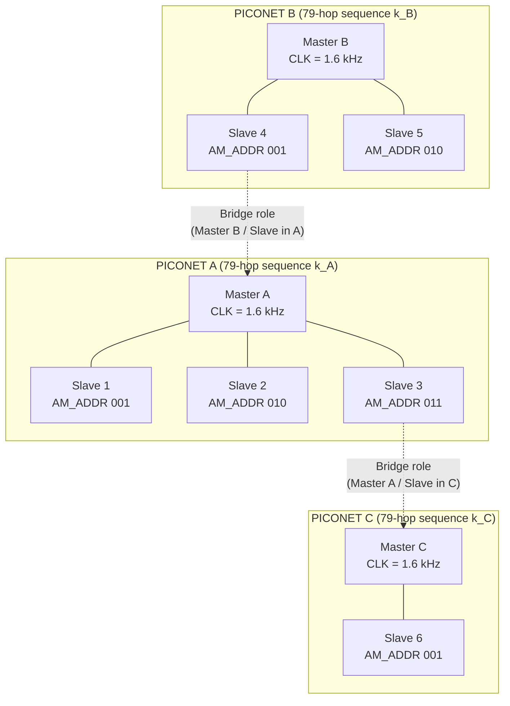
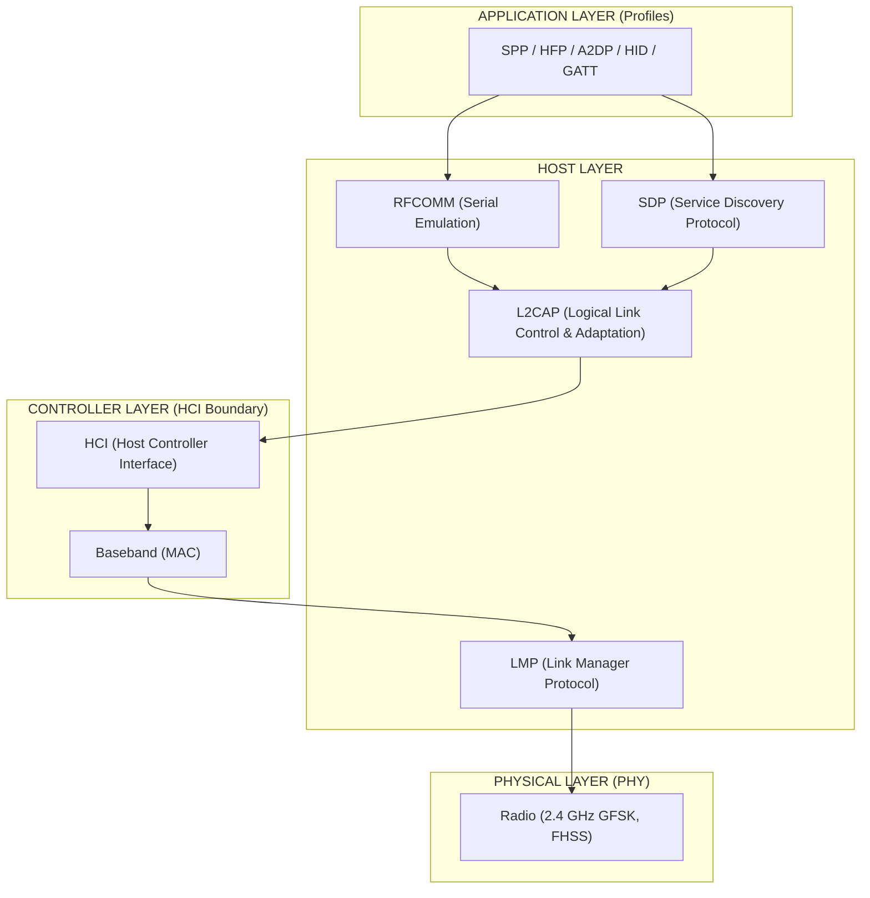
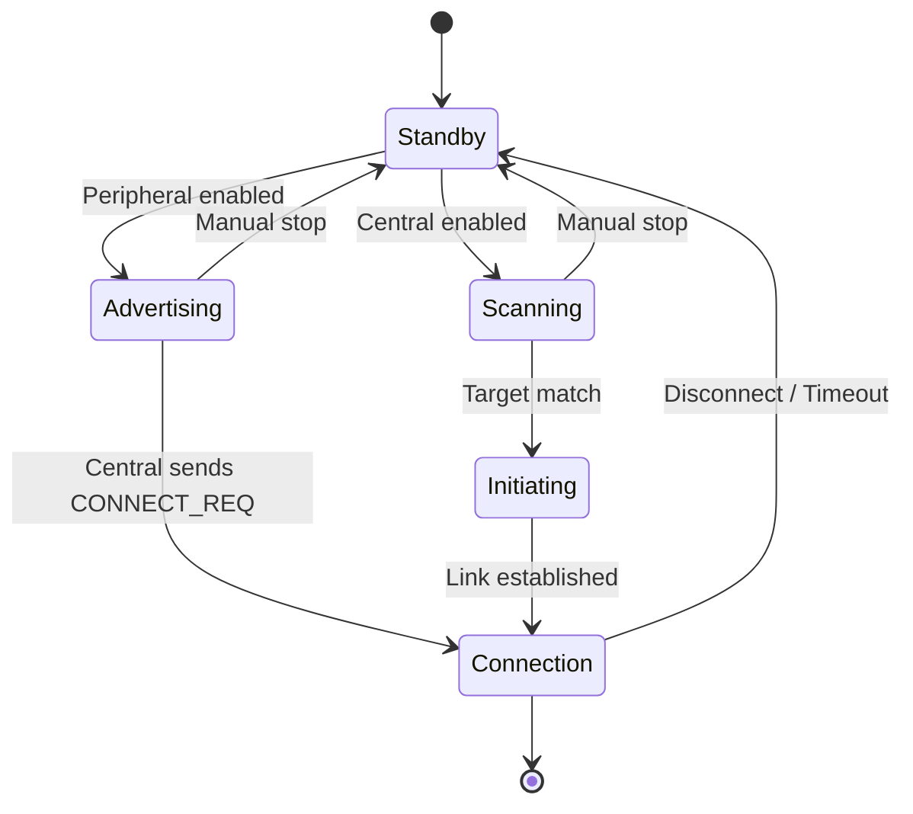
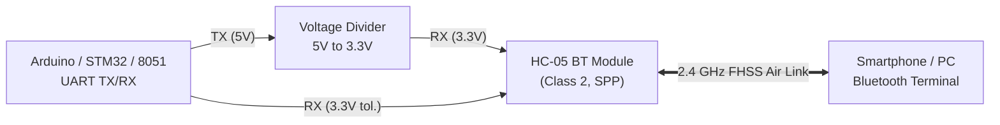

# Bluetooth Communication Basics

<!-- SECTION_1_START -->

# Bluetooth Communication Basics — KTU 2024 Module 4

> [!NOTE]
> **KTU 2024 Syllabus Anchor (PBCST504 — Module 4: IoT Wireless Communication and RTOS)**
> This topic establishes the foundation of **short-range, license-free, 2.4 GHz wireless communication** used in modern IoT edge devices, sensor hubs, wearable electronics, and embedded systems. It directly maps to **CO4** of the KTU 2024 Scheme microcontroller syllabus.

---

## 1.1 Formal Definition (KTU 2024 Terminology)

**Bluetooth** is a short-range, low-power, low-cost **wireless personal area network (WPAN)** technology standardized by the **Bluetooth Special Interest Group (SIG)**. It operates in the globally unlicensed **2.4 GHz Industrial, Scientific, and Medical (ISM) radio band** (2.4000 GHz — 2.4835 GHz) using **Frequency Hopping Spread Spectrum (FHSS)** with **1 600 hops per second** to minimize interference from coexisting wireless technologies such as Wi-Fi and microwave ovens.

> [!IMPORTANT]
> **Definition (Board-Exact Wording):**
> *Bluetooth is a packet-based, master-slave, frequency-hopping short-range radio protocol designed by Ericsson (1994) and governed by the IEEE 802.15.1 standard for classic Bluetooth, while Bluetooth Low Energy (BLE) operates under IEEE 802.15.4-derived core specifications since version 4.0.*

---

## 1.2 Conceptual Analogy & Intuition

> [!TIP]
> **"The Whispering Hallway" Analogy**
> Imagine a noisy school hallway where **80 students (channels)** are all talking at once. To make sure only two friends can hear each other, they agree on a secret rule: *they will jump from student to student **1 600 times every second**, always knowing whose turn is next.* Anyone listening in randomly will only catch meaningless fragments. This is exactly how Bluetooth's **frequency hopping** keeps a link private and interference-resistant in the crowded **2.4 GHz** spectrum.

**Geometric Intuition:** A Bluetooth link is like a **synchronous dance** between a *leader* (master) and up to **7 followers** (slaves), choreographed at a tempo of **1 600 hops/second** across **79 RF channels** (Classic) or **40 channels** (BLE), each separated by **1 MHz** (Classic) or **2 MHz** (BLE).

---

## 1.3 Key Physical & Protocol Constants

The following constants are **high-yield for KTU board examinations** and must be memorized verbatim.

| Parameter | Classic Bluetooth | Bluetooth Low Energy (BLE) |
|---|---|---|
| RF Band | **2.4 GHz ISM** | **2.4 GHz ISM** |
| Number of Channels | **79** | **40** |
| Channel Bandwidth | **1 MHz** | **2 MHz** |
| Hop Rate | **1 600 hops/s** | Adaptive (channel selection algo) |
| Modulation | **GFSK** | **GFSK** |
| Raw PHY Data Rate | **1 Mbps (BR) / 2–3 Mbps (EDR)** | **1 Mbps / 2 Mbps (LE 2M PHY)** |
| Range (typical) | **10 m (Class 2)** | **50–100 m (long range coded PHY)** |
| Max Active Slaves/Piconet | **7** | Unlimited (via advertisers) |
| Topology | Master–Slave (Piconet) | Master–Slave / Connectionless advertiser |

> [!IMPORTANT]
> The numbers **79 channels**, **1 MHz spacing**, **1 600 hops/s**, and **7 active slaves per piconet** appear repeatedly in KTU question papers. Memorize them as a "magic quartet."

---

## 1.4 Visualization Control

> [!VISUALIZATION]
> **Concept:** Bluetooth Frequency Hopping Pattern Across the 2.4 GHz Band
>
> **Plot Description (for Desmos / GeoGebra):**
> The X-axis represents time in microseconds (0 to 1 600 $\mu$s).
> The Y-axis represents the RF frequency in MHz (2 400 to 2 483.5).
> A discrete-step function jumps between **79 evenly-spaced points** (every 1 MHz) at a constant hop interval of $\frac{1 \ 600}{1 \ 000 \ 000} \approx 625 \ \mu\text{s}$ per hop.
>
> **Sample pseudo-random hop sequence (illustrative):** 2 402, 2 441, 2 467, 2 410, 2 478, 2 433, 2 455, ...
>
> **What to observe:** No two consecutive hops share the same channel, and the sequence is **deterministic to paired devices** but **pseudo-random to outsiders** — this is the cryptographic defense of the physical layer.

<!-- SECTION_1_END -->

<!-- SECTION_2_START -->

# Deep Theoretical Analysis & KTU High-Yield Formula Sheet

---

## 2.1 The Piconet and Scatternet Architecture

Bluetooth organizes devices into a strict hierarchical topology. This is the **single most-tested architectural concept** in KTU Module 4.

### 2.1.1 Piconet (The Base Cluster)

A **Piconet** is the smallest independent Bluetooth network, consisting of:
- **1 Master** device (provides clock reference, $F_H = 1.6 \times 10^{3}$ hops/s).
- **Up to 7 active slave** devices (synchronized to master's clock).
- **Up to 255 parked slaves** (synchronized but inactive to save power).

> [!IMPORTANT]
> **The "8 device rule" is universally tested:**
> *A piconet supports 7 active slaves simultaneously because the master uses a 3-bit Active Member Address (AM_ADDR), where 000 is reserved for broadcast.*

The master transmits in even-numbered slots ($T_{even}$), and slaves transmit in odd-numbered slots ($T_{odd}$), forming a **Time Division Duplex (TDD)** pattern.

### 2.1.2 Scatternet (Inter-Piconet Bridge)

A **Scatternet** is formed when:
- One device is a **master in one piconet** and a **slave in another**, OR
- Two piconets share exactly one common device acting as a bridge.

> [!NOTE]
> **Engineering reality:** Scatternets reduce throughput because the bridge device must time-share its radio between piconets. Modern BLE designs largely avoid scatternets by using **multi-role** or **mesh** topologies instead.

---

## 2.2 Bluetooth Protocol Stack (Layered Model)

The Bluetooth stack is structured in **four logical layers**, mapping closely to the OSI 7-layer model.

| Layer | KTU Naming | Function |
|---|---|---|
| **Radio (PHY)** | Physical Layer | 2.4 GHz, GFSK modulation, FHSS hopping |
| **Baseband** | Link Layer (MAC) | Piconet addressing, packet framing, error correction |
| **LMP / L2CAP** | Host Layer | Link management, logical channel multiplexing |
| **HCI / SDP / RFCOMM / OBEX** | Application/Profile Layer | Service discovery, serial emulation, file transfer |

> [!TIP]
> **Mnemonic — "R-B-L-A":** **R**adio → **B**aseband → **L**MP/L2CAP → **A**pplication Profiles. This order matches data flow from antenna to user app.

---

## 2.3 Frequency Hopping Mathematics

The hop sequence for classic Bluetooth is generated by a **pseudo-random polynomial** with the following key parameters:

$$
f_{k+1} = \left( f_{k} + c_{k} \right) \mod 79
$$

where:
- $f_{k}$ is the current RF channel index (0–78),
- $c_{k}$ is a **hop increment** selected from a pre-shared $K_C$ cipher key,
- $\mod 79$ ensures the sequence stays within the 2.4 GHz ISM band.

The **dwell time** on each channel is:

$$
T_{dwell} = \frac{1}{1 \ 600} = 625 \ \mu\text{s}
$$

Hence the **single-slot packet transmission time** for 1 Mbps Basic Rate is:

$$
T_{slot} = 625 \ \mu\text{s}, \quad \text{Payload per slot} = 1 \ \text{Mbps} \times 625 \ \mu\text{s} = 625 \ \text{bits} \approx 78 \ \text{bytes (raw)}
$$

---

## 2.4 Bluetooth Low Energy (BLE) Fundamentals

Introduced in **Bluetooth 4.0 (2010)**, BLE was designed for coin-cell-powered IoT sensors. Its core innovation is **asymmetric duty cycling** — the slave sleeps $>99\%$ of the time.

### 2.4.1 BLE Channel Map

BLE uses **40 channels** indexed 0–39:
- **Channels 37, 38, 39** → **Advertising channels** (used for discovery & connection requests).
- **Channels 0–36** → **Data channels** (used post-connection).

$$
\text{Advertising Channel Frequency} = 2 \ 402 + k \cdot 2 \ \text{MHz}, \quad k \in \{37, 38, 39\}
$$

### 2.4.2 BLE Roles

| Role | Description |
|---|---|
| **Broadcaster** | Advertises data, accepts no connection (e.g., iBeacon). |
| **Observer** | Scans for advertisements only. |
| **Peripheral** | Advertises & accepts connections (typical sensor). |
| **Central** | Scans & initiates connections (typical smartphone/edge). |

### 2.4.3 GATT Architecture

Generic Attribute Profile (GATT) defines **Services** and **Characteristics**:

$$
\text{GATT Server} \rightarrow \text{Service} \rightarrow \text{Characteristic} \rightarrow \text{Value + Descriptors}
$$

Each Service/Characteristic is identified by a **16-bit UUID** (standard) or **128-bit UUID** (custom).

---

## 2.5 KTU Formula Sheet (Exam-Ready Cheat Table)

> [!IMPORTANT]
> **The following table consolidates every quantitative relationship testable in KTU 2024 ESE for Module 4.** Use $\vert$ in math mode, never bare $\vert$ in markdown cells.

| Concept | Formula / Relation | Units / Typical Value |
|---|---|---|
| Hop rate (Classic) | $f_{hop} = 1 \ 600$ | hops/s |
| Dwell time | $T_{dwell} = 1 / f_{hop} = 625$ | $\mu$s |
| Classic channels | $N_{ch} = 79$ | channels |
| BLE channels | $N_{ch} = 40$ | channels |
| Channel bandwidth (Classic) | $\Delta f = 1$ | MHz |
| Channel bandwidth (BLE) | $\Delta f = 2$ | MHz |
| Active slaves per piconet | $N_{slave} = 2^3 - 1 = 7$ | devices |
| Max raw bit rate (BR) | $R = 1$ | Mbps |
| Max raw bit rate (EDR 2/3) | $R = 2$ or $3$ | Mbps |
| Max raw bit rate (BLE 2M PHY) | $R = 2$ | Mbps |
| BER target (typical) | $\text{BER} \leq 10^{-3}$ | dimensionless |
| ISM band | $2.4000 \text{ GHz} \to 2.4835 \text{ GHz}$ | GHz |
| Range (Class 1 / 2 / 3) | $\approx 100$ / $10$ / $1$ | m |
| Max Tx power (Class 1) | $P_{tx} = 20$ | dBm = 100 mW |
| Max Tx power (Class 2) | $P_{tx} = 4$ | dBm = 2.5 mW |

---

## 2.6 Real-World Engineering Utility

> [!TIP]
> **Where you will see Bluetooth in production engineering:**
> 1. **Wearables & Health-Tech** — heart-rate straps, glucose monitors (BLE GATT).
> 2. **Smart Home** — BLE mesh lighting (signify / Philips Hue) — scales to thousands of nodes.
> 3. **Industrial IoT** — Bluetooth 5.1 direction-finding for asset tracking ($\pm 10$ cm accuracy via AoA/AoD).
> 4. **Automotive** — hands-free profiles (HFP) and audio streaming (A2DP).
> 5. **Embedded Education Kits** — HC-05 / HC-06 / HM-10 modules interfacing with Arduino, ESP32, STM32, and 8051 boards covered earlier in PBCST504.

<!-- SECTION_2_END -->

<!-- SECTION_3_START -->

# Step-by-Step Derivations, Code & Symbolic Implementation

---

## 3.1 Derivation: Maximum Devices in a Piconet

We start from the **Active Member Address (AM_ADDR)** field used by the master to identify slaves in every transmitted packet.

**Step 1 — Identify the addressing field.**
The AM_ADDR is a fixed-length field in the Bluetooth baseband header, occupying 3 bits.

$$
\text{AM\_ADDR width} = 3 \ \text{bits}
$$

**Step 2 — Compute the number of unique addresses.**

$$
N_{addr} = 2^3 = 8
$$

**Step 3 — Subtract the broadcast reserved address.**
The value $\text{AM\_ADDR} = 000$ is reserved for **parked-slave broadcast**, leaving addresses for active slaves:

$$
N_{active} = 2^3 - 1 = 7
$$

**Step 4 — State the final result.**

$$
\boxed{N_{active \ slave} = 7}
$$

This is the canonical "7 active slaves" KTU answer.

---

## 3.2 Derivation: Theoretical Throughput over 625 $\mu$s Slot

For a classic Bluetooth **DH1 packet** (1-slot, 1 Mbps):

**Step 1 — Bits per slot.**

$$
B_{slot} = R \times T_{slot} = 1 \times 10^6 \ \text{bits/s} \times 625 \times 10^{-6} \ \text{s} = 625 \ \text{bits}
$$

**Step 2 — Convert to bytes (raw, no FEC).**

$$
B_{bytes} = \frac{625}{8} = 78.125 \ \text{bytes}
$$

**Step 3 — Effective user payload after FEC/CRC/header overhead (DH1):**

$$
B_{user} \approx 27 \ \text{bytes (after 2/3 FEC)}
$$

**Step 4 — User throughput per second:**

$$
R_{user} \approx \frac{27 \ \text{bytes} \times 8 \ \text{bits}}{625 \ \mu\text{s}} = 345.6 \ \text{kbps}
$$

$$
\boxed{R_{user} \approx 345.6 \ \text{kbps per DH1 stream}}
$$

---

## 3.3 HC-05 Module — AT Command Configuration Sequence

The **HC-05** is the most common Bluetooth Serial Port Profile (SPP) module used in KTU microcontroller labs. It exposes a UART at **9 600 baud** (default) for AT commands.

> [!NOTE]
> **Pin mapping for HC-05 ↔ Arduino Uno:**
> | HC-05 Pin | Arduino Pin | Notes |
> |---|---|---|
> | VCC | 5V | Regulated supply |
> | GND | GND | Common ground |
> | TXD | D10 (SoftwareSerial RX) | Cross-couple to MCU RX |
> | RXD | D11 (SoftwareSerial TX) | Cross-couple to MCU TX (use divider!) |
> | STATE | D9 | Indicates connection status |
> | EN | 3.3V (logic HIGH to enter AT mode) | Pull HIGH before power-up |

### 3.3.1 AT Command Sequence (Step-by-Step)

> [!IMPORTANT]
> **Procedure:** Hold the HC-05 button (or strap EN to 3.3V) **before** powering the module. The onboard LED will blink **slowly (~2 s)** indicating AT mode.

| Step | AT Command | Expected Response | Purpose |
|---|---|---|---|
| 1 | `AT` | `OK` | Sanity check handshake |
| 2 | `AT+NAME=KTU_BT_MODULE` | `OK` | Set device name |
| 3 | `AT+PSWD="1234"` | `OK` | Set PIN (default `1234`) |
| 4 | `AT+UART=38400,0,0` | `OK` | Set baud to 38 400, no parity |
| 5 | `AT+ROLE=0` | `OK` | Set as **slave** (0) or master (1) |
| 6 | `AT+ADDR?` | `+ADDR:ABCD:EF:123456` | Read BD_ADDR |

> [!TIP]
> **Always terminate every AT command with `\r\n`.** The HC-05 firmware silently ignores commands without CRLF.

### 3.3.2 Operational Arduino Sketch (HC-05 + LED Toggle)

```cpp
/*
 * KTU 2024 Lab — HC-05 Bluetooth LED Control
 * Toggles Arduino D13 LED via Bluetooth SPP.
 * Tested on Arduino Uno + HC-05 (slave, 38400 baud).
 */
#include <SoftwareSerial.h>

// RX, TX
SoftwareSerial BT(10, 11);   // D10 = BT TXD, D11 = BT RXD
const int LED_PIN = 13;
char cmd;

void setup() {
  pinMode(LED_PIN, OUTPUT);
  digitalWrite(LED_PIN, LOW);
  Serial.begin(9600);        // USB debug
  BT.begin(38400);           // HC-05 AT-configured baud
  Serial.println(F("[KTU] Bluetooth SPP bridge ready."));
}

void loop() {
  if (BT.available() > 0) {
    cmd = BT.read();
    Serial.print(F("[RX] "));
    Serial.println(cmd);

    switch (cmd) {
      case '1':
        digitalWrite(LED_PIN, HIGH);
        BT.println(F("LED ON"));
        break;
      case '0':
        digitalWrite(LED_PIN, LOW);
        BT.println(F("LED OFF"));
        break;
      default:
        BT.println(F("INVALID CMD. Send '1' or '0'."));
        break;
    }
  }
}
```

### 3.3.3 Python Companion Script (BLE Central with `bleak`)

```python
"""
KTU 2024 Demo — BLE Central scan using bleak (cross-platform).
Scans for any device advertising the custom 128-bit UUID
'0000ffe0-0000-1000-8000-00805f9b34fb' (HC-08 / HM-10 style).
"""
import asyncio
from typing import Optional
from bleak import BleakScanner, BleakClient

TARGET_NAME: str = "KTU_BT_MODULE"
TARGET_UUID: str = "0000ffe0-0000-1000-8000-00805f9b34fb"
COMMAND_UUID: str = "0000ffe1-0000-1000-8000-00805f9b34fb"


async def discover() -> Optional[str]:
    print("[KTU] Scanning for BLE peripherals ...")
    devices = await BleakScanner.discover(timeout=5.0)
    for d in devices:
        if d.name and TARGET_NAME in d.name:
            print(f"[KTU] Found peripheral: {d.name} -> {d.address}")
            return d.address
    print("[KTU] Target not found in scan window.")
    return None


async def control(address: str) -> None:
    async with BleakClient(address) as client:
        if not client.is_connected:
            print("[ERROR] Link not established.")
            return
        print("[KTU] GATT link established.")
        for cmd in (b"1", b"0", b"1"):
            await client.write_gatt_char(COMMAND_UUID, cmd)
            print(f"[KTU] Sent command: {cmd.decode()}")
            await asyncio.sleep(1.0)


async def main() -> None:
    address = await discover()
    if address:
        await control(address)


if __name__ == "__main__":
    asyncio.run(main())
```

> [!WARNING]
> **Never connect a 5V Arduino TX directly to a 3.3V HC-05 RXD.** Use a **voltage divider** (1 k$\Omega$ + 2 k$\Omega$) or a logic-level shifter, or the HC-05 voltage regulator will degrade over time.

---

## 3.4 BLE Connection Establishment State Machine (Textual Derivation)

A BLE connection progresses through the following **deterministic states**:

$$
\text{Standby} \rightarrow \text{Advertising} \rightarrow \text{Scanning} \rightarrow \text{Initiating} \rightarrow \text{Connection}
$$

**Step 1 — Advertise.**
Peripheral sends `ADV_IND` packets on **channels 37, 38, 39** at intervals $T_{adv} \in [20 \ \text{ms}, 10.24 \ \text{s}]$.

**Step 2 — Scan.**
Central listens for advertisements on the same 3 channels.

**Step 3 — Initiate.**
Central sends `CONNECT_REQ` (still on an advertising channel), specifying:
- `Interval` (7.5 ms – 4 s)
- `Latency` (0 – 499)
- `Supervision Timeout` (100 ms – 32 s)
- `Hop Increment`, `Channel Map`

**Step 4 — Connect.**
Both devices transition to the data channel hopping sequence, and the central becomes the **master** of a new piconet with one peripheral slave.

> [!NOTE]
> **Connection Interval Latency Trade-off:**
> Lower $T_{conn}$ ⇒ lower latency, higher current.
> Higher $T_{conn}$ ⇒ better battery life, higher latency.

<!-- SECTION_3_END -->

<!-- SECTION_4_START -->

# Structural Diagrams & Schematics

---

## 4.1 Piconet & Scatternet Topology (Mermaid)



> [!NOTE]
> **Reading the diagram:** Solid lines are **intra-piconet** master–slave links. Dashed lines are **scatternet bridge** links where a device plays dual roles. Each piconet has its own private **hop sequence** keyed by $K_C$.

---

## 4.2 Bluetooth Protocol Stack (Mermaid)



---

## 4.3 BLE Connection State Machine



---

## 4.4 HC-05 Hardware Interfacing Block Diagram



---

## 4.5 Frequency Hopping Timeline (Sequential Topology Matrix)

| Slot Index $k$ | Time $\mu$s | Channel (MHz) | Transmitter |
|---|---|---|---|
| 0 | 0 | 2 402 | Master |
| 1 | 625 | 2 441 | Slave 1 |
| 2 | 1 250 | 2 467 | Master |
| 3 | 1 875 | 2 410 | Slave 2 |
| 4 | 2 500 | 2 478 | Master |
| 5 | 3 125 | 2 433 | Slave 1 |
| 6 | 3 750 | 2 455 | Master |
| 7 | 4 375 | 2 419 | Slave 3 |

> [!NOTE]
> **Pattern observation:** Master always transmits on even slots, slaves on odd slots. This is the TDD discipline enforced by the master clock.

<!-- SECTION_4_END -->

<!-- SECTION_5_START -->

# KTU 2024 Scheme Examination Question Bank & Topic Recap

---

## 5.1 Part A — Short Answer Questions (3 Marks Each)

> **[KTU University Exam — July 2024 (Model Paper Pattern)]** — *CO4, Remember*

**Q1.** What is the ISM band on which Bluetooth operates? Mention the number of RF channels and the hop rate used by classic Bluetooth.

**Model Answer (Board-Expected):**

> Bluetooth operates in the **2.4 GHz Industrial, Scientific and Medical (ISM) band** spanning **2.4000 GHz to 2.4835 GHz**. Classic Bluetooth uses **79 RF channels** with **1 MHz spacing** and a **hop rate of 1 600 hops per second**. These parameters minimize interference in a spectrally crowded license-free band. **[3 Marks]**

---

> **[KTU University Exam — Dec 2023 (Model Paper Pattern)]** — *CO4, Understand*

**Q2.** Differentiate between a **Piconet** and a **Scatternet** in Bluetooth topology.

**Model Answer:**

> A **Piconet** is the smallest Bluetooth network containing **one master and up to 7 active slaves** synchronized to the master's 1.6 kHz clock. A **Scatternet** is formed when two or more piconets inter-connect through a **bridge device** that participates as a slave in one piconet and a master in another. Scatternets allow network scalability at the cost of throughput due to radio time-sharing. **[3 Marks]**

---

## 5.2 Part B — 14 Mark Questions (ESE Internal Choice)

> [!WARNING]
> **KTU Examiner's Valuation Warning (Read First):**
> 1. **Always state numerical constants** (79 channels, 1 600 hops/s, 7 slaves) explicitly — never as "many" or "several." [−1 Mark penalty if vague]
> 2. **Draw the piconet diagram** with a labeled master and clearly numbered slaves. Marks are awarded for the *visual representation* itself.
> 3. In derivation questions, **show every algebraic step**. Skipping the modulo step in the hop sequence equation costs **2 Marks**.
> 4. For HC-05 lab questions, **mention the baud rate** and the **voltage-divider requirement for RXD pin**, or lose **1 Mark** for hardware completeness.

---

### **Question A (14 Marks) — 14-Mark Choice Option 1**

> **[KTU University Exam — July 2024 (Past Pattern)]** — *CO4, Understand + Apply*

**(a)** With a neat diagram, explain the **architecture of a Bluetooth Piconet** and Scatternet. State the maximum number of active slaves and justify it with reference to the AM_ADDR field. **[7 Marks, Understand]**

**Model Solution:**

1. **Definition & Diagram** [2 Marks]: A Piconet is a master–slave network where the master coordinates timing. Diagram should show one central node (master) and 7 surrounding nodes (slaves).

2. **AM_ADDR Justification** [3 Marks]:
   The master identifies each active slave using a **3-bit Active Member Address** field.
   $$N_{active} = 2^3 - 1 = 7$$
   The value `000` is reserved for broadcast to parked slaves.

3. **Scatternet Extension** [2 Marks]: A scatternet is two or more piconets connected by a bridge device. State that the bridge loses throughput due to time-shared radio operation.

---

**(b)** A Bluetooth system uses **classic BR packets (1 Mbps)** with a **625 $\mu$s slot duration**.
Compute:
  (i) The number of bits that can be transmitted in a single slot.
  (ii) The raw throughput in kbps.
  (iii) The time taken to transmit a 1 KB file **excluding** overhead. **[7 Marks, Apply]**

**Model Solution:**

**(i) Bits per slot** [2 Marks]:
$$B_{slot} = R \times T_{slot} = 1 \times 10^6 \times 625 \times 10^{-6} = 625 \ \text{bits}$$

**(ii) Raw throughput** [1 Mark]:
$$R_{raw} = 1 \ \text{Mbps} = 1 \ 000 \ \text{kbps}$$

**(iii) Time for 1 KB file** [3 Marks, 1 per logical step]:
Convert file: $1 \ \text{KB} = 1024 \times 8 = 8 \ 192 \ \text{bits}$
Slots needed: $N_{slots} = \lceil 8 \ 192 / 625 \rceil = 14$ slots (state rounding rule)
Time: $T = 14 \times 625 \ \mu\text{s} = 8 \ 750 \ \mu\text{s} = 8.75 \ \text{ms}$

> **Incremental Valuation Key:**
> '[Stating slot duration: 1 Mark]'
> '[Bits per slot calculation: 1 Mark]'
> '[Final time value with units: 1 Mark]'

---

### **Question B (14 Marks) — 14-Mark Choice Option 2**

> **[KTU University Exam — Dec 2023 (Past Pattern)]** — *CO4, Understand + Apply*

**(a)** Compare **Classic Bluetooth** and **Bluetooth Low Energy (BLE)** across at least **six** technical parameters. **[7 Marks, Understand]**

**Model Solution (Tabular — Board-Preferred Format):** [7 Marks]

| Parameter | Classic Bluetooth | Bluetooth Low Energy |
|---|---|---|
| Channels | **79** | **40** |
| Channel BW | 1 MHz | 2 MHz |
| Hop rate | 1 600 hops/s | Adaptive (Channel Selection Algo) |
| Modulation | GFSK | GFSK |
| Data rate | 1 / 2 / 3 Mbps | 1 / 2 Mbps (LE Coded: 125/500 kbps) |
| Active slaves | 7 | Unlimited (connectionless) |
| Tx current (peak) | ~25 mA | ~7.5 mA |
| Use case | Audio, file transfer | Sensor telemetry, beacons |

---

**(b)** Explain the **steps to configure an HC-05 module** for use with an Arduino Uno. Include the wiring, baud rate, and one operational test sketch that toggles an LED. **[7 Marks, Apply]**

**Model Solution Outline:**

1. **Wiring (voltage divider rationale)** [2 Marks]:
   | HC-05 Pin | Arduino | Notes |
   |---|---|---|
   | VCC | 5V | Power |
   | GND | GND | Common |
   | TXD | D10 | SoftwareSerial RX |
   | RXD | D11 (via 1k–2k divider) | Step down 5V→3.3V |
   | EN | 3.3V (pre-power-up) | Enter AT mode |

2. **AT Configuration sequence** [2 Marks]:
   - Hold button, power on → slow blink = AT mode.
   - `AT` → `OK`
   - `AT+NAME=KTU_BT_MODULE` → `OK`
   - `AT+UART=38400,0,0` → `OK`
   - `AT+ROLE=0` → `OK` (slave)

3. **Test sketch logic** [2 Marks]:
   - Use `SoftwareSerial BT(10, 11)`.
   - On receiving `'1'`, set D13 HIGH; on `'0'`, set D13 LOW.
   - Echo confirmation string back via BT.println.

4. **Operational test** [1 Mark]: Pair from smartphone Bluetooth terminal → send `'1'` → LED on.

---

## 5.3 Topic Recap & Important Things to Remember

> [!IMPORTANT]
> **Rapid-Revision Checklist — KTU Module 4: Bluetooth Basics**
>
> - **RF band:** 2.4 GHz ISM (2.4000 – 2.4835 GHz), **license-free**.
> - **Classic channels:** **79** at **1 MHz** spacing.
> - **BLE channels:** **40** at **2 MHz** spacing — channels 37, 38, 39 for advertising.
> - **Hop rate:** **1 600 hops/s**; **dwell time = 625 $\mu$s**.
> - **Modulation:** **GFSK** for both classic and BLE.
> - **Max active slaves per piconet:** **7** (AM_ADDR = 3 bits, minus broadcast `000`).
> - **Piconet** = 1 master + ≤ 7 active slaves; **Scatternet** = 2+ piconets joined by a bridge.
> - **TDD discipline:** master on even slots, slave on odd slots.
> - **Bluetooth versions:** 1.0 (1999) → 5.4 (2023). BLE introduced in **4.0**.
> - **BLE roles:** Broadcaster, Observer, Peripheral, Central.
> - **GATT** hierarchy: Profile → Service → Characteristic → Value + Descriptors.
> - **HC-05** default baud 9 600; configure via AT commands; remember the **voltage divider** on RXD.
> - **Class 1 / 2 / 3** Tx power: **20 dBm / 4 dBm / 0 dBm** with ranges **100 m / 10 m / 1 m**.
> - **Standard lab profiles for KTU:** **SPP** (HC-05, serial), **GATT** (BLE, sensor data).
> - **Bluetooth SIG** governs the spec; **IEEE 802.15.1** is the classic reference; BLE shares **802.15.4**-derived PHY.

<!-- SECTION_5_END -->
