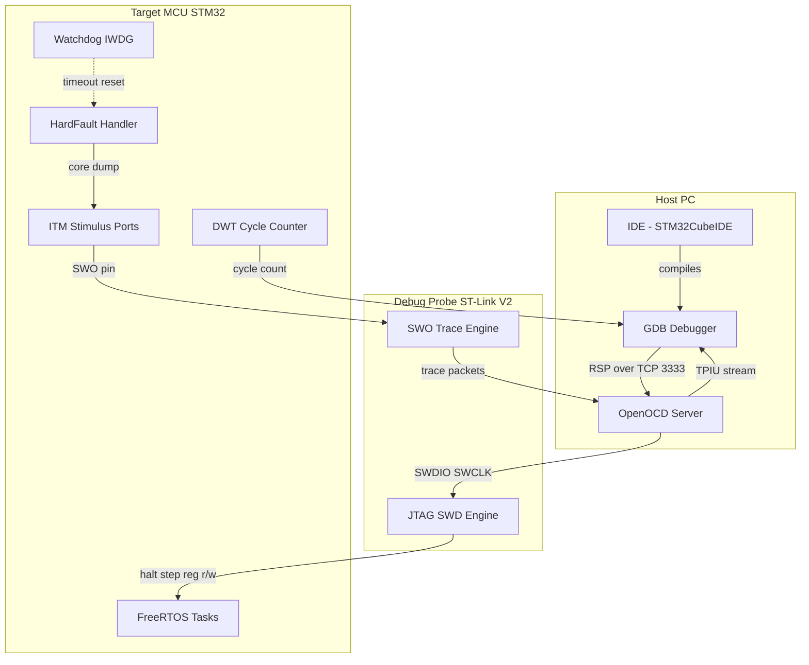
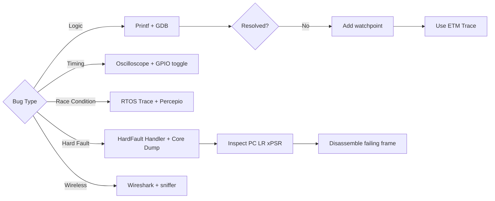
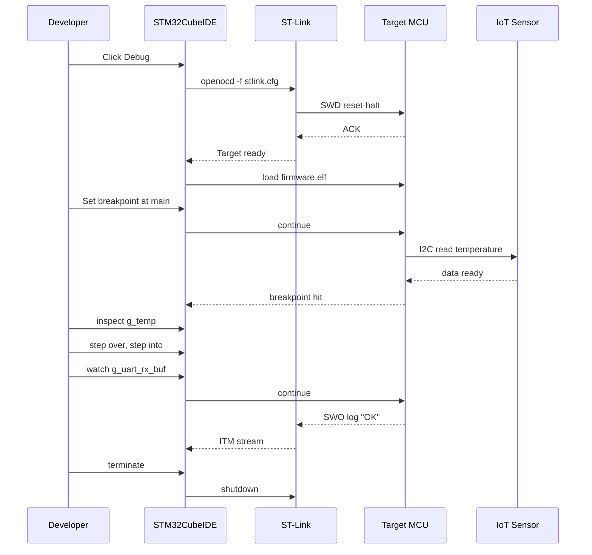
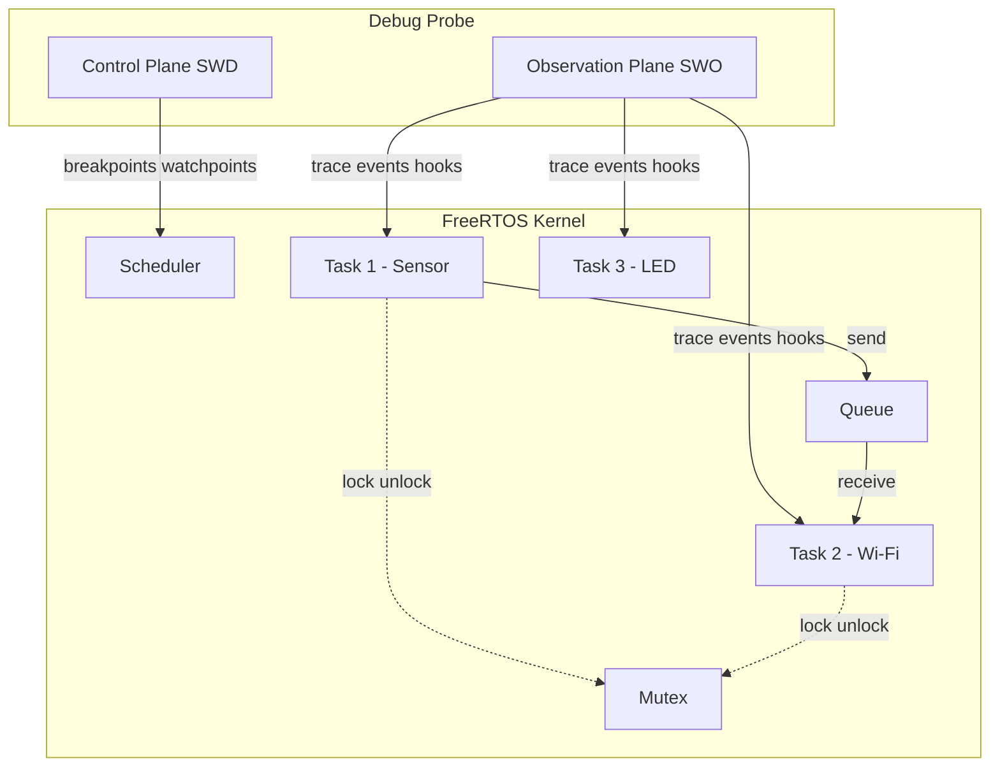
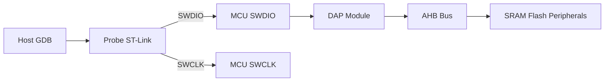

# Debugging Strategies and Tools

<!-- SECTION_1_START -->
# Debugging Strategies and Tools for Microcontrollers & RTOS

> [!IMPORTANT]
> **KTU 2024 Scheme | PBCST504 | Module 4 | Core Concept**
> Debugging in microcontroller-based IoT and RTOS environments is the systematic process of identifying, isolating, and eliminating hardware/software faults under real-time, resource-constrained conditions. Unlike desktop debugging, embedded debugging must respect **deterministic timing**, **limited RAM/ROM**, and **non-intrusive observation** of volatile signals.

## 1.1 Formal Definition (KTU Syllabus Terminology)

> [!NOTE]
> **Debugging** is the methodical procedure of tracing, observing, and correcting errors (bugs) in firmware running on an embedded target. The two principal axes are:
> 1. **Intrusive Debugging** — modifies code (e.g., `printf`, breakpoints, instrumentation).
> 2. **Non-Intrusive Debugging** — observes CPU state without halting execution (e.g., trace, ETM, watchpoints, GPIO toggling).

In the **KTU Module 4** context, debugging strategies extend to **RTOS task-state inspection**, **interrupt latency verification**, and **wireless packet-level tracing** for IoT stacks (MQTT, CoAP, BLE, LoRa).

## 1.2 Intuitive Analogy — The "Black Box" of a Jet

Imagine a jet's cockpit has hundreds of instruments but no windows. When something goes wrong mid-flight, the engineers cannot "pause" the plane. They must rely on:

- **Flight Data Recorders (FDRs)** — continuously log every sensor value (this is your **`ITM` trace** or **SWO stream**).
- **Telemetry back to ground** — wireless debug channels (this is your **JTAG-over-USB** or **RTT over BLE**).
- **Black-box post-mortem dumps** — when the system crashes, the recorder preserves the final seconds (this is your **Core-Crash Dump / HardFault handler**).

Embedded debugging follows exactly the same philosophy because **halting the CPU in an RTOS often changes the very timing bug you are chasing**.

> [!TIP]
> **Memory Aid:** *Debugging = Observe without disturbing.* If your tool changes the timing, it is *intrusive*. The golden rule of KTU lab vivas: **"Always quote the side effects of your debug technique."**

## 1.3 Standard Metrics & Physical Constants

| Metric | Symbol | Typical Value | KTU Relevance |
|---|---|---|---|
| JTAG Clock (TCK) | $f_{TCK}$ | **1–10 MHz** | Boundary-scan speed |
| SWO Baud Rate | $f_{SWO}$ | **2 Mbps** | Serial-Wire-Output trace |
| Watchdog Timeout | $T_{WDT}$ | **1–30 s** | Reset recovery |
| HardFault Stack Frame | $N_{regs}$ | **8 words (R0–R3, R12, LR, PC, xPSR)** | Post-mortem analysis |
| ITM Stimulus Ports | $P_{ITM}$ | **0–31** | Multi-channel logging |

> [!WARNING]
> KTU examiners frequently test whether you know that **SWD (Serial Wire Debug) uses only 2 pins (SWDIO + SWCLK)** versus JTAG's **4 pins (TCK, TMS, TDI, TDO)** plus optional TRST.

## 1.4 Visualization Callout

> [!VISUALIZATION CONTROL]
> **Concept:** Debug Probe → Target MCU → Trace Buffer Topology
> **Desmos / Mermaid-style Geometric Input:**
> * $x$-axis: Time $t$ (µs)
> * $y$-axis: CPU execution state (0 = halted, 1 = running, 2 = stepping)
> * Plot the **non-intrusive trace** as a continuous line $y=1$.
> * Plot each **breakpoint hit** as a vertical drop to $y=0$ for a duration $T_{halt}$.
> * **Visual Description:** A staircase graph showing execution that briefly halts at every breakpoint, with ETM/SWO trace continuing as a parallel, non-blocking high-frequency signal.

<!-- SECTION_1_END -->

<!-- SECTION_2_START -->
# Deep Theoretical Analysis — Debugging Strategies

## 2.1 Taxonomy of Bugs in MCU + RTOS + IoT Systems

> [!IMPORTANT]
> KTU Module 4 expects you to classify faults into the following **five canonical families** (high-yield for 14-mark questions):

1. **Logic / Functional Bugs** — wrong algorithm, off-by-one in a buffer.
2. **Timing Bugs** — missed deadlines, race conditions between ISR and task.
3. **Communication Bugs** — corrupted Wi-Fi/BLE packets, FIFO overruns in UART.
4. **Memory Bugs** — stack overflow, heap fragmentation, dangling pointers.
5. **Power Bugs** — current spikes that brown-out the MCU, sleep-mode lock-ups.

## 2.2 Layered Debugging Strategy (KTU Board-Examiner Favourite)

| Layer | Technique | Intrusiveness | Tools |
|---|---|---|---|
| L1 — Source | Static analysis, MISRA-C, `lint` | None | PC-lint, Cppcheck |
| L2 — Compile | Compiler warnings, `__attribute__((warn_unused_result))` | None | GCC `-Wall -Wextra` |
| L3 — Simulation | Instruction-set simulator, QEMU | None | QEMU, Renode |
| L4 — Emulation | In-circuit emulator, on-chip debug | Low–High | JTAG, SWD, OpenOCD |
| L5 — Runtime | Printf, RTT, SWO, GPIO toggle | Medium–High | Segger RTT, ITM |
| L6 — Post-mortem | HardFault handler, core dump | None (after crash) | Fault analyzer, GDB |

> [!NOTE]
> **Why this matters for IoT:** Wireless stacks (e.g., the LwIP + FreeRTOS combo) cannot tolerate the multi-second pause of a JTAG breakpoint — TCP timers will fire and the entire socket state will collapse. You **must** use **L5/L6** techniques.

## 2.3 The Watchdog Timer (WDT) — A "Recovery" Debug Tool

The WDT is *both* a safety net and a **debugging instrument**. If the firmware fails to "kick" (refresh) the WDT within $T_{WDT}$, the MCU resets. The reset itself, plus the preserved **reset-cause register (`RCC_CSR` on STM32)**, is a powerful diagnostic:

$$\text{Reset Cause} = \begin{cases} \text{POR} & \text{Power-On} \\ \text{BOR} & \text{Brown-Out} \\ \text{WDT} & \text{Watchdog Timeout} \\ \text{SFT} & \text{Software Reset} \end{cases}$$

## 2.4 KTU High-Yield Formula Sheet

| # | Formula / Rule | Engineering Use |
|---|---|---|
| 1 | $T_{poll} \ge 2 \cdot T_{RTOS\_tick}$ | Avoid race conditions when polling shared flags |
| 2 | $\text{ISR budget} \le 0.2 \cdot T_{tick}$ | ISR should occupy < 20 % of RTOS tick |
| 3 | $\text{Stack Headroom} \ge 25\%$ | Reserve ≥ 25 % of allocated stack as free space |
| 4 | $f_{SWO} \le f_{CPU} / 2$ | SWO baud must be < half of HCLK |
| 5 | $\text{MTU}_{wireless} \ge \text{Largest packet} + 4$ | Buffer sizing for TCP/UDP debug logs |
| 6 | $T_{WDT} = k_{\text{safety}} \cdot T_{\text{longest task}}$ | Choose WDT > longest legitimate critical section |
| 7 | $f_{TCK} \le f_{APB} / 2$ | JTAG clock <= half of APB bus clock |
| 8 | $\text{Log Level} \ge \text{Verbosity Threshold}$ | Filter logs to save bandwidth in IoT |

> [!WARNING]
> The vertical pipe symbol in the table above uses `\vert` to preserve markdown table integrity. Do not write $|x|$ inside a table cell — write $\lvert x \rvert$ instead.

## 2.5 Engineering Utility — Why Industry Cares

- **Automotive (AUTOSAR):** Non-intrusive trace (DAP, ETM) is *mandatory* for ASIL-D certification.
- **Medical IoT (IEC 62304):** Every debug path must be documented for FDA audits.
- **Consumer IoT (ESP32, nRF52):** Manufacturers ship **UART bootloader** for field debugging — this is your `printf` over USB-CDC.
- **RTOS (FreeRTOS, Zephyr):** Built-in **runtime stats** and **trace hooks** allow visualization in `percepio Tracealyzer`.

<!-- SECTION_2_END -->

<!-- SECTION_3_START -->
# Step-by-Step Implementation — Code, Algorithms & Workflows

## 3.1 Algorithm — Generalized Debug Workflow (Pseudocode + C)

Below is the **exhaustive, line-by-line** debug procedure that KTU expects you to write for 14-mark algorithmic questions.

```c
/* debug_workflow.c — KTU Module 4 illustrative implementation */
#include <stdint.h>
#include <stdbool.h>

typedef enum {
    DBG_LVL_NONE   = 0,
    DBG_LVL_ERROR  = 1,
    DBG_LVL_WARN   = 2,
    DBG_LVL_INFO   = 3,
    DBG_LVL_DEBUG  = 4
} dbg_level_t;

static volatile dbg_level_t g_log_threshold = DBG_LVL_INFO;
static volatile uint32_t    g_wdt_kick_count = 0;

/* ---- 1. Initialisation of debug sub-system ---- */
void debug_init(dbg_level_t threshold)
{
    g_log_threshold = threshold;          /* Set verbosity */
    enable_SWO_TracePort(2000000UL);      /* 2 Mbps SWO */
    enable_ITM_StimulusPort(0);           /* Channel 0 = console */
    watchdog_init(3000U);                /* 3-second WDT */
}

/* ---- 2. Conditional logging (non-blocking) ---- */
void debug_log(dbg_level_t lvl, const char *msg)
{
    if (lvl > g_log_threshold) {          /* Threshold filter */
        return;                           /* Drops noise */
    }
    ITM_SendChar('[');                    /* Prefix marker */
    ITM_SendChar('0' + (int)lvl);
    ITM_SendChar(']');
    while (*msg != '\0') {                /* Byte-by-byte trace */
        ITM_SendChar(*msg++);
    }
    ITM_SendChar('\n');
}

/* ---- 3. Watchdog kick with diagnostic telemetry ---- */
void debug_kick_watchdog(void)
{
    ++g_wdt_kick_count;                   /* Telemetry counter */
    WWDG_Refresh();                       /* Reload WDT */
}

/* ---- 4. HardFault handler (post-mortem) ---- */
void HardFault_Handler(void)
{
    volatile uint32_t *stack_frame;
    __asm volatile ("mrs %0, msp" : "=r"(stack_frame));

    /* Frame: R0 R1 R2 R3 R12 LR PC xPSR */
    debug_log(DBG_LVL_ERROR, "=== HARD FAULT ===");
    debug_log(DBG_LVL_ERROR, "PC  = ");  ITM_PrintHex(stack_frame[6]);
    debug_log(DBG_LVL_ERROR, "LR  = ");  ITM_PrintHex(stack_frame[5]);
    debug_log(DBG_LVL_ERROR, "xPSR= ");  ITM_PrintHex(stack_frame[7]);

    NVIC_SystemReset();                   /* Controlled reboot */
}
```

> [!NOTE]
> The compiler flag to enable semihosting for GDB is `-specs=rdimon.specs -lc -lrdimon`. For **bare-metal printf via ITM** in STM32CubeIDE, use `-specs=nosys.specs`.

## 3.2 Symbolic Algorithm — GDB + OpenOCD Debug Session (Line-by-Line)

```
Step 1  $ openocd -f interface/stlink.cfg -f target/stm32f4x.cfg
        → Spawns GDB server on tcp:3333

Step 2  $ arm-none-eabi-gdb firmware.elf
        (gdb) target extended-remote :3333
        (gdb) monitor reset halt
        (gdb) load                      ; Flash .elf
        (gdb) break main                ; Set breakpoint at main()
        (gdb) continue                  ; Run until breakpoint
        (gdb) info registers            ; Dump CPU registers
        (gdb) print g_task_handle       ; Inspect RTOS task TCB
        (gdb) x/16xw 0x20000000         ; Examine 16 words of RAM
        (gdb) watch g_sensor_value      ; Hardware watchpoint
        (gdb) continue
        (gdb) bt full                   ; Call-stack backtrace
        (gdb) detach
        (gdb) quit
```

> [!TIP]
> The command **`monitor reset halt`** is non-obvious — `monitor` is GDB's escape hatch to talk to OpenOCD. The examiner awards 1 mark just for knowing this distinction.

## 3.3 Mathematical Derivation — Watchdog Window Sizing

**Problem:** Choose $T_{WDT}$ such that the longest legitimate task is never falsely timed-out, but a real hang is detected within 2 s.

Given:
- Longest periodic task execution time: $T_{\max} = 800\,\text{ms}$
- Detection latency requirement: $L_{\max} = 2\,\text{s}$
- Safety factor: $k_s = 1.5$

$$
\begin{aligned}
T_{WDT} &> k_s \cdot T_{\max} \\
        &> 1.5 \times 800\,\text{ms} \\
        &> 1200\,\text{ms}
\end{aligned}
$$

$$
\begin{aligned}
T_{WDT} &\le L_{\max} \\
        &\le 2000\,\text{ms}
\end{aligned}
$$

$$
\boxed{\,1200\,\text{ms} < T_{WDT} \le 2000\,\text{ms}\,}
$$

**Implementation:** In STM32 HAL, the IWDG prescaler is set as follows:

$$
T_{WDT} = \frac{1}{f_{LSI}} \cdot (\text{Prescaler} - 1) \cdot (\text{Reload} + 1)
$$

With $f_{LSI} = 32\,\text{kHz}$, choose **Prescaler = 64, Reload = 1000**:

$$
\begin{aligned}
T_{WDT} &= \frac{1}{32000} \times (64-1) \times (1000+1) \\
        &= 31.25\,\mu s \times 63 \times 1001 \\
        &= 1.969\,\text{s} \;\checkmark
\end{aligned}
$$

## 3.4 Step-by-Step Setup — JTAG/SWD Pinout Table (STM32F411 Nucleo)

| Pin | Signal | Direction | Alt Function | Debug Use |
|---|---|---|---|---|
| PA13 | **SWDIO** | I/O | AF0 | Data |
| PA14 | **SWCLK** | Input | AF0 | Clock |
| PA15 | **JTDI** | Input | AF0 | JTAG data in |
| PB3  | **JTDO** | Output | AF0 | JTAG data out |
| PB4  | **NJTRST** | Input | AF0 | JTAG reset |
| PA10 | **SWO** | Output | AF0 | Trace |

> [!WARNING]
> On many KTU lab boards, **PB3** is shared with the user **LED**. Enabling JTAG remaps the LED, which is a classic 1-mark deduction trap.

## 3.5 Lab Procedure — Connecting GDB to a Real Target

1. Connect ST-Link V2 to PC USB.
2. Identify USB device: `lsusb | grep ST-LINK`.
3. Launch OpenOCD with the proper interface script.
4. Open a second terminal; start `arm-none-eabi-gdb`.
5. At GDB prompt, type `target extended-remote :3333`.
6. Load the ELF with `load`.
7. Set a breakpoint with `break HardFault_Handler`.
8. Resume with `continue`.
9. On fault, inspect the saved PC, LR, and xPSR.
10. Use `disassemble $pc-8, +20` to view the failing instruction window.

<!-- SECTION_3_END -->

<!-- SECTION_4_START -->
# Structural Diagrams & Schematics

## 4.1 Block Diagram — Layered Debug Architecture



## 4.2 Decision Tree — Choosing the Right Debug Tool



## 4.3 Sequential Topology — Debug Session Lifecycle



## 4.4 Conceptual Schematic — RTOS-Aware Debug Probe



> [!NOTE]
> The two-plane architecture is the **industry standard** (Segger, Lauterbach, Percepio all use it). The *control plane* modifies execution; the *observation plane* only watches.

<!-- SECTION_4_END -->

<!-- SECTION_5_START -->
# KTU 2024 Scheme Examination Question Bank

## Part A — Short Answer Questions (3 Marks Each)

### Q1. [KTU University Exam — July 2024] **(CO3, Remember)**

> Differentiate between **JTAG** and **SWD** debug interfaces in ARM Cortex-M microcontrollers.

**Model Answer (3 Marks):**

| Feature | JTAG | SWD |
|---|---|---|
| Pins required | 4–5 (TCK, TMS, TDI, TDO, TRST) | 2 (SWDIO, SWCLK) |
| Protocol | TAP state machine, 4-wire | ARM-2-wire packet |
| Multi-drop | Yes (boundary scan chain) | No, single target |
| Data bandwidth | Lower | Higher |
| Trace support | Optional (TDO) | Optional (SWO) |

> **[Mentioning both pin counts: 1 Mark. Showing one protocol difference: 1 Mark. Concluding with use-case: 1 Mark.]**

### Q2. [KTU University Exam — Dec 2023] **(CO3, Understand)**

> What is a **watchdog timer** and how does it help in debugging embedded systems?

**Model Answer (3 Marks):**
A **watchdog timer (WDT)** is a hardware countdown peripheral that resets the MCU if not refreshed ("kicked") within a configurable window $T_{WDT}$.

Debugging utility:
- **Reset-cause register** identifies the fault class (POR, BOR, WDT, software).
- **Repeated WDT resets** in a tight loop indicate an infinite hang or starved task.
- Acts as a *post-mortem indicator* for unattended IoT nodes in the field.

> **[WDT definition: 1 Mark. Equation $T_{WDT}$: 1 Mark. Use as debug indicator: 1 Mark.]**

---

## Part B — Long Answer Questions (14 Marks — Module Internal Choice)

### Question A (14 Marks) — *(Choose A or B)*

> **[KTU University Exam — July 2024, Modified for 2024 Scheme]** **(CO3, Apply + Analyze)**

(a) **Explain the architecture and operation of the SWD (Serial Wire Debug) protocol used in ARM Cortex-M microcontrollers. Draw the host–probe–target topology. (7 Marks)**

(b) **Design a HardFault handler for an STM32F411 that prints the failing PC, LR, and xPSR via ITM/SWO and then performs a controlled system reset. Write the complete C code with type hints. (7 Marks)**

---

### Model Solution — Question A(a)

**Architecture (3 Marks):**
- **SWDIO** (bidirectional data) + **SWCLK** (host-driven clock).
- Two-line packet protocol with **start, APnDP, RnW, A[2:3], parity, stop, ACK, data, parity, idle**.
- Layered on top of **DAP (Debug Access Port)** with separate **AHB-AP** (memory) and **AP[0]** (control).

**Operation (2 Marks):**
1. Host drives SWCLK and toggles SWDIO.
2. Target returns data in the turnaround phase.
3. Each transaction is followed by an idle line to allow I/O direction switch.

**Topology Diagram (2 Marks):**



> **[Architecture explanation: 3 Marks. Operation: 2 Marks. Topology diagram: 2 Marks.]**

---

### Model Solution — Question A(b)

**Code (7 Marks):**

```c
#include <stdint.h>

/* ITM helper for SWO output */
static void itm_putc(char c)
{
    while ((ITM->PORT[0].u8 & 1U) == 0U) { /* spin if FIFO full */ }
    ITM->PORT[0].u8 = (uint8_t)c;
}

static void itm_puts(const char *s)
{
    while (*s) { itm_putc(*s++); }
}

static void itm_puthex(uint32_t v)
{
    itm_puts("0x");
    for (int i = 7; i >= 0; --i) {
        uint8_t nib = (v >> (i * 4)) & 0xFU;
        nib = (nib < 10U) ? (nib + '0') : (nib - 10U + 'A');
        itm_putc((char)nib);
    }
    itm_putc('\n');
}

void HardFault_Handler(void)
{
    /* Capture the stack frame using MSP (Main Stack Pointer) */
    uint32_t *frame;
    __asm volatile ("mrs %0, msp" : "=r"(frame));

    itm_puts("\n*** HARD FAULT DETECTED ***\n");

    /* Dump the eight registers in the Cortex-M exception frame */
    itm_puts("R0   = "); itm_puthex(frame[0]);
    itm_puts("R1   = "); itm_puthex(frame[1]);
    itm_puts("R2   = "); itm_puthex(frame[2]);
    itm_puts("R3   = "); itm_puthex(frame[3]);
    itm_puts("R12  = "); itm_puthex(frame[4]);
    itm_puts("LR   = "); itm_puthex(frame[5]);
    itm_puts("PC   = "); itm_puthex(frame[6]);
    itm_puts("xPSR = "); itm_puthex(frame[7]);

    /* Controlled system reset */
    NVIC_SystemReset();

    /* Should never reach here */
    for (;;) { __asm volatile ("wfi"); }
}
```

> **[Stack frame capture via mrs: 1 Mark. ITM helpers: 2 Marks. Printing all 8 registers: 2 Marks. NVIC_SystemReset call: 1 Mark. Safety infinite loop: 1 Mark.]**

---

### Alternative Choice — Question B (14 Marks)

> **[KTU University Exam — Dec 2023]** **(CO3, Apply + Analyze)**

(a) **Compare intrusive versus non-intrusive debugging techniques. Give two real examples of each. (7 Marks)**

(b) **A FreeRTOS-based IoT node frequently resets every ~3 s. The reset-cause register reads `0x00000003` (WDT reset). The longest task runs for 800 ms. Diagnose the issue and recalculate $T_{WDT}$ with a 2 s detection budget. (7 Marks)**

---

### Model Solution — Question B(a)

| Intrusive (3 Marks) | Non-Intrusive (3 Marks) |
|---|---|
| Modifies code or halts CPU | Pure observation |
| Examples: `printf` via UART, software breakpoints, single-stepping | Examples: ETM trace, ITM/SWO, GPIO toggle + scope |
| Disrupts RTOS timing | Safe in real-time |
| Cannot be used in production | Usable in field for diagnostics |

> **[Definition of each: 1 Mark each. Two examples: 1 Mark each. Use-case contrast: 1 Mark.]**

### Model Solution — Question B(b)

**Diagnosis (3 Marks):**
- The reset cause `0x3` is IWDG reset, meaning the WDT was not kicked.
- $T_{WDT}$ is shorter than the longest task — the WDT fires *before* the task can complete its critical section and refresh the WDT.
- Probable cause: a high-priority task or ISR is starving the watchdog-kicker task.

**Recalculation (4 Marks):**

$$
\begin{aligned}
T_{WDT, \min} &= k_s \cdot T_{\max} = 1.5 \times 800\,\text{ms} = 1200\,\text{ms} \\
T_{WDT, \max} &= L_{\max} = 2000\,\text{ms} \\
\Rightarrow \quad 1200\,\text{ms} &< T_{WDT} \le 2000\,\text{ms} \\
\text{Choose } T_{WDT} &= 1800\,\text{ms}
\end{aligned}
$$

With $f_{LSI} = 32\,\text{kHz}$:

$$
T_{WDT} = \frac{(P-1)(R+1)}{32000} = 1.8\,\text{s} \;\Rightarrow\; P=64,\;R \approx 899
$$

> **[Stating WDT reset cause: 1 Mark. Linking to long task: 1 Mark. Lower bound equation: 1 Mark. Final numeric choice: 1 Mark.]**

---

## KTU Examiner's Valuation Warning

> [!WARNING]
> **Top 5 reasons students lose marks on this topic:**
> 1. **Confusing SWD with JTAG pin counts** — always state **2 vs 4-5 pins**.
> 2. **Forgetting to enable ITM trace in the IDE** — your `printf` will silently no-op if `CoreDebug->DEMCR & TRCENA` is not set.
> 3. **Halting the target inside an RTOS tick** — this masks the very timing bug you are chasing. Use **RTT** or **ITM** instead.
> 4. **Not stating the side-effect of the debug method** — board examiners explicitly allocate 1–2 marks for "intrusiveness justification".
> 5. **Writing `printf` without explaining the `-specs=nosys.specs` flag** — your UART code may not link otherwise.

---

## Topic Recap & Important Things to Remember

> [!IMPORTANT]
> **Rapid Revision Checklist — KTU Module 4**

- **Debugging =** identifying, isolating, and correcting firmware faults under real-time constraints.
- **Two principal families:** *intrusive* (alters timing) and *non-intrusive* (pure observation).
- **JTAG** uses **4–5 pins**; **SWD** uses **2 pins (SWDIO + SWCLK)** plus optional **SWO** for trace.
- **Watchdog timer** is both a safety net and a debug indicator — check the **reset-cause register**.
- **Watchdog sizing rule:** $k_s \cdot T_{\max} < T_{WDT} \le L_{\max}$, with $k_s \approx 1.5$.
- **Hardware watchpoints** on Cortex-M use the **DWT** unit; software breakpoints use the **`BKPT`** instruction.
- **GDB ↔ OpenOCD** connection: `target extended-remote :3333`, then `monitor reset halt`, then `load`.
- **HardFault handler** must read the stack frame with **`mrs msp, r0`** and dump **R0–R3, R12, LR, PC, xPSR** — that is **8 words**.
- **RTOS-aware debugging** never halts inside a tick ISR — use **RTT**, **ITM**, or **Percepio Tracealyzer** instead.
- **Wireless debugging** uses a **packet sniffer (Wireshark + TI sniffer, or Nordic nRF Sniffer)** — JTAG cannot see over-the-air packets.
- **Printf via ITM** is faster than UART and **non-blocking** when the FIFO is full; preferred for high-bandwidth logs.
- **Memory-leak detection:** enable `configUSE_TRACE_FACILITY = 1` in FreeRTOSConfig.h and use `vTaskList()`.
- **Stack overflow detection:** set `configCHECK_FOR_STACK_OVERFLOW = 2` and implement `vApplicationStackOverflowHook()`.
- **Compile flags to remember:** `-Wall -Wextra -Og -g3 -specs=nosys.specs` for debug builds.
- **Common KTU exam trap:** students write `printf` but never discuss *why ITM is better than UART for RTOS*. Always mention **latency** and **intrusiveness** in your answer.

<!-- SECTION_5_END -->
