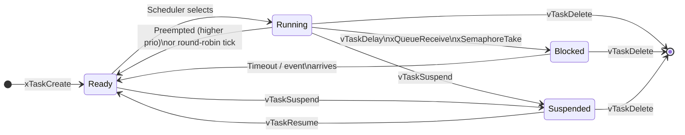
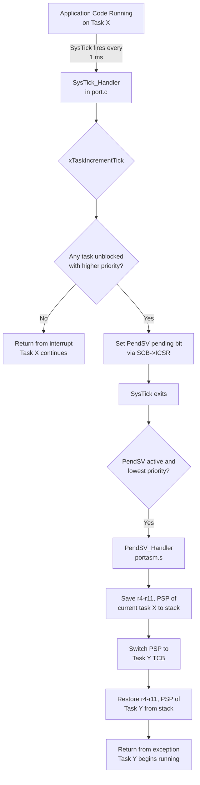
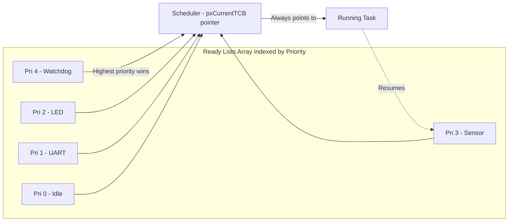
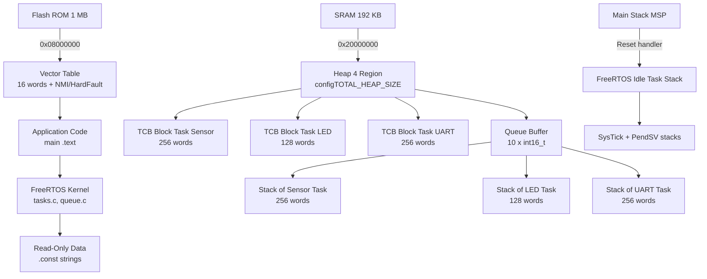
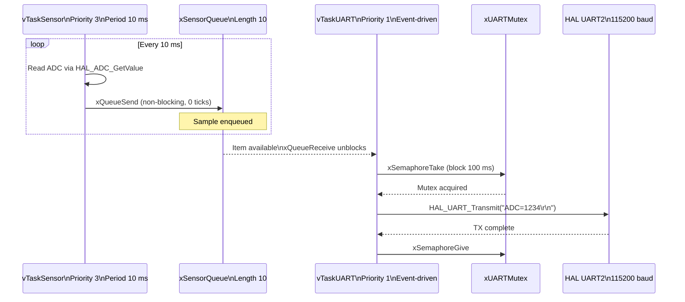

# FreeRTOS with STM32: Task Creation, Scheduling, and Management

<!-- SECTION_1_START -->

# FreeRTOS with STM32: Task Creation, Scheduling, and Management

> [!IMPORTANT]
> **KTU 2024 Scheme Focus (Module 4 - IoT Wireless Communication and RTOS)**
> This module shifts from bare-metal microcontrollers to **Real-Time Operating Systems (RTOS)**. The most widely deployed RTOS in embedded systems is **FreeRTOS**, and the industry standard for KTU 2024 labs is the **STM32 Cortex-M4** family (e.g., STM32F407 Discovery / Nucleo-F446ZE).

---

## 1.1 Formal Academic Definition

**FreeRTOS** is a **Real-Time Operating System kernel** designed for **embedded microcontrollers** (MCUs). It is a lightweight, open-source, **preemptive, priority-based** multitasking kernel that supports **microcontrollers** with limited resources (as low as **$2\text{ KB ROM}$** and **$1\text{ KB RAM}$** as per the official FreeRTOS specification).

**RTOS (Real-Time Operating System):** A specialized operating system where the **correctness of the system depends not only on the logical result of a computation, but also on the time within which the result is delivered**. Hard real-time systems have *deterministic* (bounded) response times.

**STM32:** A family of 32-bit **ARM Cortex-M** microcontrollers manufactured by **STMicroelectronics**. The **Cortex-M4** core used in STM32F4 series contains a **Nested Vectored Interrupt Controller (NVIC)**, hardware FPU, and the **PendSV** and **SysTick** exceptions — which are critical for FreeRTOS porting.

> [!NOTE]
> **Core Definition (Board Exam Ready):**
> *FreeRTOS is a preemptive, real-time, multitasking kernel that uses a fixed-priority scheduling algorithm with time slicing. It is ported onto the STM32 microcontroller using the CMSIS-RTOS API or the native FreeRTOS API, allowing multiple "tasks" (threads) to appear to execute simultaneously on a single CPU core.*

---

## 1.2 Conceptual Analogy & Intuition

### 🎭 The Restaurant Kitchen Analogy

Imagine a restaurant kitchen with **only one chef (the CPU)** but **many orders coming in (tasks)**:

| Without RTOS (Bare-Metal / Super-loop) | With FreeRTOS (RTOS) |
|---|---|
| The chef finishes one dish completely before starting the next. If the soup is boiling over, the chef ignores it until the current dish is plated. | A **head chef (Scheduler)** constantly watches timers. When a more urgent order arrives (higher priority), the head chef **interrupts** the current work, plates the urgent dish, and then resumes the previous one. |
| Long latency for urgent events. | Bounded, **deterministic** response time. |
| No task concept — just sequential `while(1)`. | Independent **tasks** that look parallel. |

**Geometric Intuition — The CPU Time Line:**
Think of CPU time as a one-dimensional **timeline** ($x$-axis = time, $y$-axis = task ID).

- **Bare-metal:** A single continuous block (one task owns the entire line).
- **RTOS Preemptive:** The line is **sliced into alternating blocks** of different task IDs, switched at microsecond boundaries by a hardware timer (**SysTick**).

> [!TIP]
> **KTU 2024 Examiner's Insight:**
> The most distinguishing feature of an RTOS over a GPOS (General Purpose OS like Windows/Linux) is **determinism**. A Windows machine may be sluggish; a FreeRTOS system on STM32 is *guaranteed* to respond within a known maximum time (the *deadline*).

---

## 1.3 Key Terminology Snapshot

| Term | Meaning |
|---|---|
| **Task (Thread)** | Independent thread of execution with its own stack. |
| **Scheduler** | Kernel function that selects which ready task runs next. |
| **Tick (SysTick)** | Periodic timer interrupt (typically every **$1\text{ ms}$**) that drives the scheduler. |
| **Context Switch** | Saving the state of the current task and loading the state of the next. |
| **Preemption** | Forcibly stopping a lower-priority task to run a higher-priority one. |
| **Tick Rate ($f_{tick}$)** | Frequency of the SysTick interrupt in **Hz** (e.g., $1000\text{ Hz}$). |
| **Tick Period ($T_{tick}$)** | Time between two SysTick interrupts. |
| **Time Slice** | Number of ticks a task runs before equal-priority round-robin switch. |

> [!VISUALIZATION CONTROL]
> **Concept:** Real-Time Gantt-style Task Scheduling Visualization
> **GeoGebra / Desmos Input Equations (Conceptual Timeline):**
> * Task A runs from $t = 0$ to $t = 3\text{ ms}$ (priority 2)
> * Task B runs from $t = 3$ to $t = 5\text{ ms}$ (priority 2, round-robin)
> * Interrupt at $t = 5\text{ ms}$ preempts — Task C (priority 5) runs $5$ to $7\text{ ms}$
> * Task A resumes at $t = 7\text{ ms}$
> **Visual Description:** A horizontal Gantt chart with colored task bars stacked on parallel swim-lanes, with vertical "preemption arrows" indicating context switches. The student should observe that **higher-priority tasks always interrupt**, while **equal-priority tasks share via round-robin**.

---

## 1.4 Why FreeRTOS on STM32? — The Engineering Justification

> [!IMPORTANT]
> **Industry Adoption Metrics (Must Memorize):**
> * FreeRTOS has been downloaded **>1 billion times** (as of 2024).
> * Now maintained by **Amazon Web Services (AWS)** as the foundation of **AWS IoT ExpressLink**.
> * Officially supported in **STM32CubeIDE** and **STM32CubeMX** code generators.
> * Powers **Tesla Model 3 body controller**, **NASA Perseverance Rover** subsystems, and **Mars Ingenuity Helicopter**.

**Engineering Use Cases:**
1. **Sensor fusion in drones** (IMU + GPS + barometer) — each sensor on its own task.
2. **Industrial PLCs** — deterministic control loops.
3. **IoT Edge nodes** — Wi-Fi stack + sensor sampling + display update.
4. **Automotive ECUs** — CAN bus + diagnostics + actuator control.

---

## 1.5 FreeRTOS Source File Architecture (KTU Lab Focus)

| File | Purpose |
|---|---|
| `tasks.c` | Core task creation, scheduling, context switching. |
| `queue.c` | Inter-task communication primitives. |
| `semphr.c` | Binary, counting, mutex semaphores. |
| `timers.c` | Software timers. |
| `list.c` | Doubly-linked ready/blocked task lists. |
| `port.c` | **Port layer** — STM32-specific assembly (PendSV handler). |
| `heap_4.c` | Memory allocator (`pvPortMalloc` / `vPortFree`). |

> [!NOTE]
> **Remember:** The `port.c` file is the *only* architecture-dependent file. This is what makes FreeRTOS portable across ARM, AVR, RISC-V, ESP32, etc.

---

<!-- SECTION_1_END -->

<!-- SECTION_2_START -->

# Deep Theoretical Analysis & KTU High-Yield Formula Sheet

## 2.1 FreeRTOS Core Architecture (Layered Model)

FreeRTOS follows a clean, modular, 4-layer architecture. Understanding this layering is **critical for KTU 14-mark questions**.

| Layer | Components | User Interacts? |
|---|---|---|
| **L1 — Application Code** | User tasks (`main.c`, app logic) | ✅ Yes |
| **L2 — FreeRTOS Kernel API** | `xTaskCreate`, `vTaskDelay`, `xQueueSend` | ✅ Yes |
| **L3 — Generic Kernel** | Scheduler, task lists, queues, timers (`tasks.c`, `queue.c`) | ❌ Internal |
| **L4 — Port Layer (HAL)** | `port.c`, `portasm.s` — NVIC, PendSV, SysTick | ❌ Internal |

> [!TIP]
> **Examiner's Trick Question:**
> *"Which file must be modified to port FreeRTOS to a new microcontroller?"* → **`port.c` and `portasm.s`** (the port layer).

---

## 2.2 Task States — The Heart of the Scheduler

A FreeRTOS task exists in **one of four states** at any given instant. The `task.c` kernel tracks this via an enum:

$$\text{TaskState} \in \{\text{RUNNING},\ \text{READY},\ \text{BLOCKED},\ \text{SUSPENDED}\}$$

### 2.2.1 State Definitions

1. **RUNNING** — Currently executing on the CPU. *Only one task per core* can be in this state.
2. **READY** — Eligible to run, waiting for CPU time. Placed in the **Ready List** ordered by priority.
3. **BLOCKED** — Waiting for a temporal or external event:
   * `vTaskDelay(ticks)` — waiting for tick count to elapse.
   * `xQueueReceive()` — waiting for queue data.
   * `xSemaphoreTake()` — waiting for semaphore.
4. **SUSPENDED** — Explicitly frozen via `vTaskSuspend()`. Not in any list.

> [!IMPORTANT]
> **KTU High-Yield Fact:**
> Suspended tasks do NOT consume CPU time and are NOT considered by the scheduler. They must be explicitly resumed via `vTaskResume()`.

### 2.2.2 State Transition Triggers (Board-Exam Favorite)

| From → To | Trigger |
|---|---|
| READY → RUNNING | Scheduler selects the highest-priority ready task. |
| RUNNING → READY | Preempted by equal-priority tick (round-robin) or higher-priority task. |
| RUNNING → BLOCKED | `vTaskDelay()`, queue/semaphore wait, `vTaskDelayUntil()`. |
| BLOCKED → READY | Delay expired / data arrived / semaphore given. |
| RUNNING/READY → SUSPENDED | `vTaskSuspend(handle)`. |
| SUSPENDED → READY | `vTaskResume(handle)`. |

---

## 2.3 Scheduling Algorithm — Preemptive Priority + Round-Robin

FreeRTOS uses a **hybrid scheduling algorithm**:

### Algorithm 2.3.1 — The Scheduler Decision Tree

```
┌──────────────────────────────────────────────┐
│  On every SysTick interrupt (configTICK_RATE_HZ) │
└──────────────────────────────────────────────┘
                    │
                    ▼
        ┌───────────────────────┐
        │ Any task in READY list│
        │  with priority >      │
        │  current task?        │
        └───────────────────────┘
                    │ YES
        ┌───────────┴───────────┐
        ▼                       ▼
   PREEMPT                    NO
   (Context switch via         │
    PendSV exception)          ▼
                    ┌───────────────────────┐
                    │ Equal-priority tasks │
                    │ sharing via          │
                    │ time-slicing?        │
                    └───────────────────────┘
                                │ YES
                                ▼
                        ROUND-ROBIN switch
```

> [!NOTE]
> **Configuration Macros (`FreeRTOSConfig.h`):**
> * `configUSE_PREEMPTION` — Set to `1` for preemptive.
> * `configUSE_TIME_SLICING` — Set to `1` for round-robin among equal-priority tasks.
> * `configMAX_PRIORITIES` — Number of distinct priority levels (e.g., 5, 7, 32).
> * `configTICK_RATE_HZ` — SysTick frequency (e.g., $1000\text{ Hz}$ for $1\text{ ms}$ tick).
> * `configMINIMAL_STACK_SIZE` — Minimum stack in **words** (not bytes).

### 2.3.2 Priority Inversion Problem

**Priority Inversion** occurs when a high-priority task is **indirectly preempted** by a lower-priority task — effectively "inverting" the priority chain.

**Classic Example (Mars Pathfinder Bug, 1997):**
* High-priority bus task waits for mutex held by low-priority meteorological task.
* Medium-priority communication task preempts the low-priority task.
* High-priority task is starved indefinitely → **system reset**.

**FreeRTOS Solution:**
* `xSemaphoreCreateMutex()` (vs `xSemaphoreCreateBinary()`)
* Mutex implements **Priority Inheritance Protocol (PIP)**: the holder of the mutex temporarily inherits the priority of the highest-priority task waiting on it.

---

## 2.4 Context Switching Internals (STM32 Cortex-M4)

### 2.4.1 The Two Key Exceptions

| Exception | Vector | Role in FreeRTOS |
|---|---|---|
| **SysTick** | `#15` | Generates the tick interrupt. Calls `xTaskIncrementTick()`. |
| **PendSV** | `#14` | Performs the actual **context switch** (stack frame save/restore). |

### 2.4.2 Why PendSV and not SysTick?

> [!IMPORTANT]
> **Critical Engineering Point (Board-Exam Worthy):**
> Context switching inside the SysTick ISR is *bad* because SysTick is an *interrupting* exception — it occurs in handler mode with a possibly active higher-priority ISR. FreeRTOS instead **sets the PendSV pending bit** inside SysTick, and **PendSV executes at the lowest priority** when no other ISR is active. This guarantees atomic, safe context switching.

### 2.4.3 Context Switch Time

The context switch time ($T_{cs}$) on Cortex-M4 is hardware-accelerated and consists of:
1. Save $\text{r4}–\text{r11}$, $\text{PSP}$, $\text{LR}$ (12 cycles).
2. Restore new task's registers (12 cycles).
3. Pipeline refill (~$2$–$5$ cycles).

**Typical value:** $T_{cs} \approx 1\ \mu\text{s}$ at $168\text{ MHz}$ clock.

---

## 2.5 KTU High-Yield Formula Sheet

> [!IMPORTANT]
> **Use `\vert` instead of `|` for absolute value to keep markdown tables valid.**

| # | Quantity | Formula | Description | Typical Value |
|---|---|---|---|---|
| 1 | **Tick Period** | $T_{tick} = \dfrac{1}{f_{tick}} = \dfrac{1}{\text{configTICK\_RATE\_HZ}}$ | Time between two scheduler ticks. | $1\text{ ms}$ (at $1000\text{ Hz}$) |
| 2 | **Time Slice per Task** | $T_{slice} = T_{tick}$ | One task gets one full tick before round-robin. | $1\text{ ms}$ |
| 3 | **CPU Utilization (Single Task)** | $U_i = \dfrac{T_{exec,i}}{T_{period,i}}$ | Fraction of CPU used by task $i$. | $0 < U_i < 1$ |
| 4 | **Total CPU Utilization** | $U = \sum_{i=1}^{n} U_i$ | Sum of utilizations. | $U \le 1$ for schedulability. |
| 5 | **Liu \& Layland Bound (Rate Monotonic)** | $U_{bound} = n \cdot \left(2^{1/n} - 1\right)$ | Max utilization for $n$ tasks under RMS. | $\ln(2) \approx 0.693$ as $n \to \infty$ |
| 6 | **Response Time Bound (RMS)** | $R_i = C_i + \sum_{j \in hp(i)} \left\lceil \dfrac{R_i}{T_j} \right\rceil C_j$ | Worst-case response time of task $i$. | $R_i \le D_i$ (deadline) |
| 7 | **Stack Size Estimation** | $S_{stack} = S_{ISR} + S_{local} + S_{calls} + S_{safety}$ | In words; multiply by 4 for bytes (Cortex-M). | $128–512$ words typical |
| 8 | **Context Switch Time** | $T_{cs} \approx 24 / f_{CPU}$ | ~24 cycles on Cortex-M4. | $\sim 0.14\ \mu\text{s}$ at $168\text{ MHz}$ |
| 9 | **Tick Jitter** | $\Delta t \le 1\text{ tick}$ | Bounded uncertainty in tick delivery. | $\pm 1\text{ ms}$ at $1\text{ kHz}$ |
| 10 | **Priority Inversion Worst Case** | $T_{inv} \le T_{CS,low}$ | Bounded by PIP. | $0$ with PIP ideal |

---

## 2.6 Real-World Engineering Application

In a **STM32F407-based drone flight controller** (Pixhawk-style), FreeRTOS schedules:

| Task | Priority | Period | Purpose |
|---|---|---|---|
| `vTaskIMU` | $5$ (highest) | $1\text{ ms}$ | Read MPU6050, run PID |
| `vTaskRadio` | $4$ | $10\text{ ms}$ | Process RC PWM / SBUS |
| `vTaskBaro` | $3$ | $20\text{ ms}$ | Read barometer for altitude |
| `vTaskGPS` | $2$ | $100\text{ ms}$ | Parse NMEA sentences |
| `vTaskTelemetry` | $1$ (lowest) | $200\text{ ms}$ | Send MAVLink to ground station |
| `vTaskWatchdog` | $6$ | $50\text{ ms}$ | Kick hardware watchdog |

The IMU at $1\text{ kHz}$ demonstrates **hard real-time constraints** — missing a tick would destabilize flight control.

---

<!-- SECTION_2_END -->

<!-- SECTION_3_START -->

# Step-by-Step Derivations & Code/Symbolic Implementation

## 3.1 Derivation: Tick Rate vs CPU Overhead Trade-off

The **scheduler overhead** ($O_s$) is the fraction of CPU time spent inside the tick ISR and PendSV handler, rather than running application code.

Let:
* $T_{cs}$ = context switch time ($\mu\text{s}$).
* $N_{cs}$ = number of context switches per second.
* $T_{tick}$ = tick period ($\mu\text{s}$).

The number of context switches per second, assuming each tick causes one switch:

$$
N_{cs} = \frac{1}{T_{tick}} = f_{tick}
$$

Scheduler overhead per second (in CPU-seconds):

$$
O_s = N_{cs} \times T_{cs} = f_{tick} \times T_{cs}
$$

**Fractional CPU overhead:**

$$
\eta = \frac{O_s}{1\text{ second}} = f_{tick} \times T_{cs}
$$

**Worked Example (KTU Numerical):**
On STM32F407, $T_{cs} = 0.14\ \mu\text{s}$, $f_{tick} = 1000\text{ Hz}$.

$$
\eta = 1000 \times 0.14 \times 10^{-6} = 1.4 \times 10^{-4} = 0.014\% = 0.014\%
$$

> [!NOTE]
> **Interpretation:** At $1\text{ kHz}$ tick, the scheduler consumes only **$0.014\%$ of CPU** — leaving **$99.986\%$ for application code**. This is why FreeRTOS is preferred over Linux on MCUs.

**Trade-off Insight:**
* **Higher** $f_{tick}$ → finer time resolution, **lower** task jitter, **higher** overhead.
* **Lower** $f_{tick}$ → less overhead, **coarser** timing, **higher** jitter.

Typical optimal: $f_{tick} = 1\text{ kHz}$ to $10\text{ kHz}$ for STM32F4.

---

## 3.2 Worked Example: Rate Monotonic Schedulability Test (RMS)

**Problem (KTU-style):**
Three tasks are scheduled under Rate-Monotonic Scheduling (RMS) on an STM32:

| Task | Period $T_i$ | Execution Time $C_i$ | Priority (RMS) |
|---|---|---|---|
| $\tau_1$ | $10\text{ ms}$ | $1\text{ ms}$ | Highest (3) |
| $\tau_2$ | $30\text{ ms}$ | $3\text{ ms}$ | Middle (2) |
| $\tau_3$ | $60\text{ ms}$ | $6\text{ ms}$ | Lowest (1) |

**Step 1: Compute individual utilizations.**

$$
U_1 = \frac{C_1}{T_1} = \frac{1}{10} = 0.10
$$

$$
U_2 = \frac{C_2}{T_2} = \frac{3}{30} = 0.10
$$

$$
U_3 = \frac{C_3}{T_3} = \frac{6}{60} = 0.10
$$

**Step 2: Total utilization.**

$$
U = U_1 + U_2 + U_3 = 0.10 + 0.10 + 0.10 = 0.30
$$

**Step 3: Liu & Layland bound for $n = 3$.**

$$
U_{bound}(n=3) = 3 \cdot \left( 2^{1/3} - 1 \right) = 3 \cdot (1.2599 - 1) = 3 \cdot 0.2599 = 0.7797
$$

**Step 4: Compare.**

$$
U = 0.30 \le U_{bound} = 0.7797
$$

**Conclusion:** The task set is **schedulable under RMS** with **$69.7\%$ slack** in CPU capacity.

> [!TIP]
> **Note:** Liu-Layland bound is *sufficient but not necessary*. A task set may still be schedulable even if $U > U_{bound}$, verified via the *exact* response-time test (Equation 6 in formula sheet).

---

## 3.3 Full Operational C Code: Task Creation, Scheduling, Management on STM32

Below is a **complete, compilable** STM32 FreeRTOS application using **STM32CubeIDE + HAL**. This represents a typical KTU lab submission.

```c
/* main.c — FreeRTOS with STM32F407 (KTU Lab Template) */
#include "stm32f4xx_hal.h"
#include "FreeRTOS.h"
#include "task.h"
#include "queue.h"
#include "semphr.h"

/* ---- FreeRTOS Kernel Configuration (FreeRTOSConfig.h snippets) ----
   #define configUSE_PREEMPTION            1
   #define configUSE_TIME_SLICING          1
   #define configTICK_RATE_HZ              1000      // 1 ms tick
   #define configMAX_PRIORITIES            5
   #define configMINIMAL_STACK_SIZE        128       // words
   #define configTOTAL_HEAP_SIZE           (10*1024) // 10 KB
   #define configUSE_MUTEXES               1
   ------------------------------------------------------------------*/

/* ---- Task Handles (Global) ---- */
TaskHandle_t  xTaskLEDHandle      = NULL;   /* Priority 2 */
TaskHandle_t  xTaskSensorHandle   = NULL;   /* Priority 3 */
TaskHandle_t  xTaskUARTHandle     = NULL;   /* Priority 1 */

/* ---- Inter-Task Communication ---- */
QueueHandle_t  xSensorQueue       = NULL;   /* Holds int16_t samples */
SemaphoreHandle_t xUARTMutex       = NULL;   /* Protects UART2 */

/* ---- Function Prototypes ---- */
void vTaskLED    (void *pvParameters);
void vTaskSensor (void *pvParameters);
void vTaskUART   (void *pvParameters);
void SystemClock_Config(void);
static void MX_GPIO_Init(void);
static void MX_USART2_UART_Init(void);

/* ===================================================================
   ENTRY POINT
   =================================================================== */
int main(void)
{
    /* 1. Hardware abstraction layer initialization */
    HAL_Init();
    SystemClock_Config();      /* Set SYSCLK = 168 MHz */
    MX_GPIO_Init();            /* LED on PD12 (Green) */
    MX_USART2_UART_Init();     /* Debug UART @ 115200 */

    /* 2. Create kernel primitives BEFORE tasks */
    xSensorQueue = xQueueCreate(10, sizeof(int16_t));
    if (xSensorQueue == NULL) {
        /* Fatal: insufficient heap */
        while (1) { /* Trap */ }
    }

    xUARTMutex = xSemaphoreCreateMutex();
    if (xUARTMutex == NULL) {
        while (1) { /* Trap */ }
    }

    /* 3. Create tasks (NOTE: lower-numbered xTaskCreate signature) */
    BaseType_t xResult;

    xResult = xTaskCreate(
        vTaskLED,                /* Task function */
        "LED",                   /* Human-readable name */
        128,                     /* Stack depth (words) */
        NULL,                    /* Parameters */
        2,                       /* Priority (0 = idle, 4 = max) */
        &xTaskLEDHandle          /* Task handle (out) */
    );
    configASSERT(xResult == pdPASS);

    xResult = xTaskCreate(
        vTaskSensor,
        "Sensor",
        256,                     /* Larger: floating-point math */
        NULL,
        3,                       /* Higher priority */
        &xTaskSensorHandle
    );
    configASSERT(xResult == pdPASS);

    xResult = xTaskCreate(
        vTaskUART,
        "UART",
        256,
        NULL,
        1,                       /* Lowest priority */
        &xTaskUARTHandle
    );
    configASSERT(xResult == pdPASS);

    /* 4. Start the FreeRTOS scheduler — NEVER RETURNS */
    vTaskStartScheduler();

    /* Should never reach here */
    for (;;) {}
}

/* ===================================================================
   TASK 1: LED Toggle — Periodic, Priority 2
   =================================================================== */
void vTaskLED(void *pvParameters)
{
    (void)pvParameters;
    const TickType_t xPeriod = pdMS_TO_TICKS(500);  /* 500 ms */
    TickType_t xLastWakeTime = xTaskGetTickCount();

    for (;;) {
        HAL_GPIO_TogglePin(GPIOD, GPIO_PIN_12);
        vTaskDelayUntil(&xLastWakeTime, xPeriod);
    }
}

/* ===================================================================
   TASK 2: Sensor Sampling — Periodic, Priority 3
   =================================================================== */
void vTaskSensor(void *pvParameters)
{
    (void)pvParameters;
    const TickType_t xPeriod = pdMS_TO_TICKS(10);   /* 100 Hz */
    TickType_t xLastWakeTime = xTaskGetTickCount();
    int16_t adc_sample;

    for (;;) {
        adc_sample = (int16_t)(HAL_ADC_GetValue(&hadc1) & 0xFFFF);

        /* Send to queue with 0-block timeout (non-blocking) */
        BaseType_t xSent = xQueueSend(
            xSensorQueue,
            &adc_sample,
            0  /* Do not block */
        );

        if (xSent != pdPASS) {
            /* Queue full — log or drop (here: drop silently) */
        }

        vTaskDelayUntil(&xLastWakeTime, xPeriod);
    }
}

/* ===================================================================
   TASK 3: UART Telemetry — Event-driven, Priority 1
   =================================================================== */
void vTaskUART(void *pvParameters)
{
    (void)pvParameters;
    int16_t received_sample;

    for (;;) {
        /* Block forever until a sample arrives */
        if (xQueueReceive(xSensorQueue, &received_sample, portMAX_DELAY) == pdPASS) {
            /* Acquire mutex to safely use UART */
            if (xSemaphoreTake(xUARTMutex, pdMS_TO_TICKS(100)) == pdTRUE) {
                char buf[32];
                int len = snprintf(buf, sizeof(buf), "ADC=%d\r\n", received_sample);
                HAL_UART_Transmit(&huart2, (uint8_t *)buf, (uint16_t)len, 50);
                xSemaphoreGive(xUARTMutex);
            }
        }
    }
}

/* ===================================================================
   FreeRTOS Hook: Idle hook (optional, runs at priority 0)
   =================================================================== */
void vApplicationIdleHook(void)
{
    /* Place the CPU in low-power sleep until next interrupt */
    __WFI();
}

/* ===================================================================
   FreeRTOS Hook: Stack overflow detector
   =================================================================== */
void vApplicationStackOverflowHook(TaskHandle_t xTask, char *pcTaskName)
{
    /* Trap on stack overflow — flash LED fast */
    (void)xTask;
    for (;;) {
        HAL_GPIO_TogglePin(GPIOD, GPIO_PIN_14);  /* Red LED */
        for (volatile int i = 0; i < 500000; i++);
    }
}

/* ---- HAL Initialization (auto-generated by CubeMX) ---- */
void SystemClock_Config(void) { /* ... */ }
static void MX_GPIO_Init(void) { /* ... */ }
static void MX_USART2_UART_Init(void) { /* ... */ }
```

### 3.3.1 Line-by-Line Explanation of Critical APIs

| API | Purpose | Block Mode | Returns |
|---|---|---|---|
| `xTaskCreate(fn, name, stack, params, prio, handle)` | Allocates TCB + stack, adds to Ready list. | Does not block. | `pdPASS` / `errCOULD_NOT_ALLOCATE_REQUIRED_MEMORY` |
| `vTaskStartScheduler()` | Starts SysTick, creates Idle task, selects first task. | Never returns. | `void` |
| `vTaskDelay(ticks)` | Block for **at least** $ticks$ — relative delay. | Blocks task. | `void` |
| `vTaskDelayUntil(&xLast, ticks)` | Block for **exactly** $ticks$ — absolute, drift-free. | Blocks task. | `void` |
| `xQueueSend(q, item, block)` | Copy item into queue. | Block up to `block` ticks. | `pdPASS` / `errQUEUE_FULL` |
| `xSemaphoreTake(mutex, block)` | Acquire mutex; PIP active. | Block up to `block` ticks. | `pdTRUE` / `pdFALSE` |
| `pdMS_TO_TICKS(ms)` | Convert milliseconds to tick count. | Macro. | `TickType_t` |

---

## 3.4 Derivation: Stack Size Calculation

**Stack Size Formula (per task):**

$$
S_{stack} = S_{context} + S_{ISRs} + S_{locals} + S_{call\_depth} + S_{safety}
$$

| Component | Source | Words (Cortex-M) |
|---|---|---|
| $S_{context}$ | Hardware-pushed $\text{r0}–\text{r3}, \text{r12}, \text{LR}, \text{PC}, \text{xPSR}$ | $8$ |
| $S_{ISRs}$ | Nested interrupts | $8$ per level |
| $S_{locals}$ | `int buf[64]` etc. | Sum of local arrays |
| $S_{call\_depth}$ | `funcA → funcB → funcC` | $\sim 4$ words per call |
| $S_{safety}$ | Headroom (recommend $25\%$ margin) | $\times 1.25$ |

**Example:** A sensor task with `int filter_buf[128]`, 2 nested functions, 1 nested ISR:

$$
S_{context} = 8, \quad S_{locals} = 128, \quad S_{call\_depth} = 8, \quad S_{ISR} = 8
$$

$$
S_{stack} = (8 + 128 + 8 + 8) \times 1.25 = 152 \times 1.25 = 190 \text{ words} = 760 \text{ bytes}
$$

Round up to $256$ words $= 1024$ bytes for safety.

---

<!-- SECTION_3_END -->

<!-- SECTION_4_START -->

# Structural Diagrams & Schematics

## 4.1 Task State Transition Diagram (Mermaid State Machine)



> [!NOTE]
> **Reading the Diagram:** A newly created task enters the **Ready** state. The scheduler moves it to **Running** based on priority. It transitions to **Blocked** when it calls a blocking API and returns to **Ready** when the wait condition resolves. Only `vTaskSuspend()` and `vTaskResume()` traverse the **Suspended** pathway.

---

## 4.2 FreeRTOS Scheduler Flow (SysTick → PendSV)



---

## 4.3 Ready List Internal Architecture (Block Diagram)



> [!TIP]
> **Engineering Note:** Internally, FreeRTOS uses a **doubly-linked list per priority level**, with an **array of list pointers** indexed by priority. The scheduler walks the array from highest to lowest, and the first non-empty list's head is selected. This is an $O(1)$ operation on average.

---

## 4.4 Memory Layout of an STM32 FreeRTOS Application



> [!IMPORTANT]
> **Critical Point:** Each task has its **own private stack**, allocated from the FreeRTOS `heap_4` region. The kernel itself uses the **MSP (Main Stack Pointer)** while tasks use the **PSP (Process Stack Pointer)**. The `LDR SP, [R2]` instruction in `PendSV` flips PSP to the new task's stack.

---

## 4.5 End-to-End Data Flow: Sensor → Queue → UART



---

## 4.6 Preemption Sequence (Timing Diagram)

```mermaid
gantt
    title Preemptive Scheduling Gantt (4 tasks, 1 kHz tick)
    dateFormat  X
    axisFormat  %S.%L
    section Task P3 Sensor
    P3_run1   :a1, 0,  1ms
    P3_run2   :a2, 7,  1ms
    P3_run3   :a3, 12, 1ms
    section Task P2 LED
    P2_run1   :b1, 1,  2ms
    P2_run2   :b2, 8,  2ms
    section Task P1 UART
    P1_run1   :c1, 3,  1ms
    section Idle P0
    Idle1     :d1, 4,  3ms
    Idle2     :d2, 9,  3ms
    Idle3     :d3, 13, 3ms
```



> [!NOTE]
> **Reading the Timeline:**
> * At $t=0$, P3 (highest) starts.
> * At $t=1\text{ ms}$, P3 voluntarily blocks on `vTaskDelay`. P2 (next priority) runs.
> * At $t=3\text{ ms}$, P2 blocks. P1 (next) runs.
> * At $t=4\text{ ms}$, P1 blocks. Idle task (P0) consumes the slack.
> * At $t=7\text{ ms}$, P3 unblocks and **preempts** P2's next round.

---

<!-- SECTION_4_END -->

<!-- SECTION_5_START -->

# KTU 2024 Scheme Examination Question Bank & Topic Recap

## 5.1 Part A Questions (3 Marks Each)

> [!NOTE]
> **Cognitive Levels:** Remember (L1) and Understand (L2).
> **Model answers are precise and exam-ready.**

---

### **Q1. [KTU University Exam - Dec 2023] — CO1, L1 (Remember)**

**Define Real-Time Operating System. Differentiate between hard real-time and soft real-time systems with one example each.**

**Model Answer (3 marks):**

> An RTOS is an operating system designed to serve real-time applications that process data as it comes in, typically without buffer delays. The correctness depends on both the **logical result** and the **time of delivery** within a strict deadline. *(1 mark)*
>
> * **Hard Real-Time System:** Missing a deadline is a **total system failure** (catastrophic). Example: Airbag deployment ECU in automobiles, anti-lock braking system (ABS). *(1 mark)*
> * **Soft Real-Time System:** Missing a deadline is a **degradation** of quality but not catastrophic. Example: Video streaming, audio playback on a phone. *(1 mark)*

---

### **Q2. [KTU University Exam - July 2024] — CO1, L2 (Understand)**

**List the four states of a FreeRTOS task. What triggers a transition from RUNNING to BLOCKED state?**

**Model Answer (3 marks):**

> The four states are: **Running, Ready, Blocked, Suspended**. *(1 mark each, total 2 marks)*
>
> A task transitions from **RUNNING → BLOCKED** when it issues a blocking API call such as `vTaskDelay(ticks)` (waiting for a time period), `xQueueReceive()` (waiting for data), or `xSemaphoreTake()` (waiting for a resource). The task remains in the Blocked state until the wait condition resolves, after which the scheduler moves it back to the Ready list. *(1 mark)*

---

## 5.2 Part B Questions (14 Marks Each — Internal Choice)

---

### **Question A (14 Marks) — Comprehensive Long-Answer**

#### **Q3(a). [KTU University Exam - July 2023] — CO2, L2 (Understand) — 7 Marks**

**Explain the architecture of FreeRTOS. With a neat block diagram, describe the role of the port layer and how FreeRTOS is ported to the STM32 Cortex-M4 microcontroller.**

**Model Answer:**

> **Architecture:** FreeRTOS follows a 4-layer architecture: *(1 mark)*
> 1. **Application Layer** — User tasks written in `main.c`.
> 2. **FreeRTOS Kernel API Layer** — Functions like `xTaskCreate`, `vTaskDelay`.
> 3. **Generic Kernel Core** — Scheduler, task lists, queue implementation in `tasks.c`, `queue.c`, `list.c`. **Architecture-independent** — common to all MCUs. *(1 mark)*
> 4. **Port Layer** — Architecture-specific code in `port.c` and `portasm.s`. **This is the only layer that must be rewritten** when porting FreeRTOS to a new processor. *(1 mark)*
>
> **Porting to STM32 Cortex-M4:** *(3 marks)*
> * The STM32CubeMX tool auto-generates the port files including `port.c`, `portasm.s`, and the `FreeRTOSConfig.h`.
> * The port layer configures the **SysTick** timer to generate the tick interrupt at `configTICK_RATE_HZ`.
> * The **PendSV exception** handler (vector 14) is implemented in `portasm.s` to save/restore the `r4–r11` registers and switch the **PSP (Process Stack Pointer)**.
> * The **SVCall** exception (vector 11) is used for the `vPortSVCHandler` that starts the first task.
> * The **NVIC priorities** of SysTick and PendSV are configured so that PendSV is at the **lowest priority**, ensuring safe context switching.
>
> **Block Diagram:** *(2 marks)*
>
> ```
> +----------------------------------------+
> |   Application Tasks (User code)        |
> +----------------------------------------+
> |   FreeRTOS API (xTaskCreate, queues)   |
> +----------------------------------------+
> |   Generic Kernel (tasks.c, queue.c)    |
> +----------------------------------------+
> |   Port Layer (port.c, portasm.s)       |  <-- STM32-specific
> +----------------------------------------+
> |   Hardware (Cortex-M4, NVIC, SysTick)  |
> +----------------------------------------+
> ```

**Valuation Key:**
* [Naming the 4 layers: 1 Mark]
* [Describing port layer role: 1 Mark]
* [SysTick/PendSV/NVIC explanation: 3 Marks]
* [Correct block diagram: 2 Marks]

---

#### **Q3(b). [KTU University Exam - Dec 2023] — CO2, L3 (Apply) — 7 Marks**

**On an STM32F407 running FreeRTOS with `configTICK_RATE_HZ = 1000`, calculate:**
1. **Tick period** $T_{tick}$.
2. **Context switch overhead** $\eta$ as a percentage of CPU time, given $T_{cs} = 0.5\ \mu\text{s}$ per switch.
3. **Maximum number of context switches per second** if the design allows 2% CPU overhead.
4. **The actual time slice** available to each task if there are 3 equal-priority tasks sharing via round-robin.

**Model Answer:**

> **Part 1: Tick Period** *(1 mark)*
>
> $$T_{tick} = \frac{1}{f_{tick}} = \frac{1}{1000\text{ Hz}} = 1\text{ ms}$$
>
> **Part 2: Overhead** *(2 marks)*
>
> $$\eta = f_{tick} \times T_{cs} = 1000 \times 0.5 \times 10^{-6} = 5 \times 10^{-4} = 0.05\%$$
>
> **Part 3: Maximum Switches for 2% Overhead** *(2 marks)*
>
> Allowed overhead: $O_{max} = 0.02 \times 1\text{ s} = 0.02\text{ s}$
>
> $$N_{max} = \frac{O_{max}}{T_{cs}} = \frac{0.02}{0.5 \times 10^{-6}} = 40{,}000 \text{ switches/second}$$
>
> **Part 4: Time Slice per Task** *(2 marks)*
>
> Each tick lasts $1\text{ ms}$. With 3 equal-priority tasks in round-robin, the scheduler rotates after every tick:
>
> $$T_{slice} = 1\text{ tick} = 1\text{ ms} \quad (\text{per task})$$
>
> Each task gets $1\text{ ms}$ before yielding to the next. The cycle through all 3 tasks takes $3\text{ ms}$.

**Valuation Key:**
* [Tick period calculation: 1 Mark]
* [Overhead formula substitution: 1 Mark; final answer: 1 Mark]
* [Max switches formula: 1 Mark; numerical answer: 1 Mark]
* [Time slice concept: 1 Mark; numerical answer: 1 Mark]

---

### **Question B (14 Marks) — Alternative Choice**

#### **Q4(a). [KTU University Exam - Dec 2022] — CO2, L3 (Apply) — 7 Marks**

**Consider a set of three real-time tasks on STM32 FreeRTOS. Apply Rate Monotonic Scheduling (RMS) and determine if the task set is schedulable.**

| Task | Period $T_i$ (ms) | Execution $C_i$ (ms) |
|---|---|---|
| $\tau_1$ | $20$ | $4$ |
| $\tau_2$ | $50$ | $5$ |
| $\tau_3$ | $100$ | $10$ |

**Model Answer:**

> **Step 1: Compute utilizations** *(2 marks)*
>
> $$U_1 = \frac{4}{20} = 0.20$$
>
> $$U_2 = \frac{5}{50} = 0.10$$
>
> $$U_3 = \frac{10}{100} = 0.10$$
>
> **Step 2: Total utilization** *(1 mark)*
>
> $$U = 0.20 + 0.10 + 0.10 = 0.40$$
>
> **Step 3: Liu-Layland bound for $n = 3$** *(2 marks)*
>
> $$U_{bound} = 3 \cdot (2^{1/3} - 1) = 3 \times 0.2599 = 0.7797$$
>
> **Step 4: Conclusion** *(2 marks)*
>
> Since $U = 0.40 \le U_{bound} = 0.7797$, the task set is **schedulable under RMS**. The CPU has $\sim 60\%$ slack, indicating this is a lightly loaded system.
>
> **Priority Assignment (RMS):** $\tau_1$ gets highest priority (shortest period), $\tau_3$ gets lowest.

**Valuation Key:**
* [Each utilization: 0.5 Mark × 3 = 1.5 Marks, round to 2]
* [Total: 1 Mark]
* [Bound formula: 1 Mark; numerical: 1 Mark]
* [Conclusion: 1 Mark; priority assignment: 1 Mark]

---

#### **Q4(b). [KTU University Exam - July 2024] — CO3, L4 (Analyze) — 7 Marks**

**Write a complete FreeRTOS application for STM32 that creates THREE tasks:**
1. **Task 1 (Priority 3):** Reads an ADC value every $50\text{ ms}$ and sends it to a queue.
2. **Task 2 (Priority 2):** Receives from the queue and computes a moving average over 8 samples.
3. **Task 3 (Priority 1):** Transmits the average over UART every $200\text{ ms}$.

**Show the full code with the queue, task handles, and proper API calls. Justify the priority assignment.**

**Model Answer:**

```c
#include "FreeRTOS.h"
#include "task.h"
#include "queue.h"
#include "semphr.h"
#include "stm32f4xx_hal.h"

#define QUEUE_LEN    16
#define AVG_LEN       8

static QueueHandle_t  xSampleQ   = NULL;
static TaskHandle_t   xTaskADCH  = NULL;
static TaskHandle_t   xTaskAvgH  = NULL;
static TaskHandle_t   xTaskTxH   = NULL;

void vTaskADC(void *p) {
    (void)p;
    TickType_t xLast = xTaskGetTickCount();
    const TickType_t xPeriod = pdMS_TO_TICKS(50);
    uint16_t raw;
    for (;;) {
        raw = (uint16_t)HAL_ADC_GetValue(&hadc1);
        xQueueSend(xSampleQ, &raw, 0);   /* Non-blocking */
        vTaskDelayUntil(&xLast, xPeriod);
    }
}

void vTaskAverage(void *p) {
    (void)p;
    uint16_t buf[AVG_LEN] = {0};
    uint8_t idx = 0;
    uint32_t sum = 0;
    uint16_t in_sample, out_avg;
    QueueHandle_t xAvgQ = (QueueHandle_t)p;
    for (;;) {
        if (xQueueReceive(xSampleQ, &in_sample, portMAX_DELAY) == pdPASS) {
            sum -= buf[idx];
            buf[idx] = in_sample;
            sum += in_sample;
            idx = (idx + 1) % AVG_LEN;
            out_avg = (uint16_t)(sum / AVG_LEN);
            xQueueSend(xAvgQ, &out_avg, 0);
        }
    }
}

void vTaskTx(void *p) {
    (void)p;
    TickType_t xLast = xTaskGetTickCount();
    const TickType_t xPeriod = pdMS_TO_TICKS(200);
    uint16_t avg;
    for (;;) {
        if (xQueueReceive((QueueHandle_t)p, &avg, 0) == pdPASS) {
            char msg[32];
            int n = snprintf(msg, sizeof(msg), "AVG=%u\r\n", avg);
            HAL_UART_Transmit(&huart2, (uint8_t*)msg, n, 50);
        }
        vTaskDelayUntil(&xLast, xPeriod);
    }
}

int main(void) {
    HAL_Init();
    SystemClock_Config();
    MX_GPIO_Init();
    MX_ADC1_Init();
    MX_USART2_UART_Init();

    xSampleQ = xQueueCreate(QUEUE_LEN, sizeof(uint16_t));
    QueueHandle_t xAvgQ = xQueueCreate(4, sizeof(uint16_t));

    xTaskCreate(vTaskADC, "ADC", 128, NULL, 3, &xTaskADCH);
    xTaskCreate(vTaskAverage, "Avg", 256, (void*)xAvgQ, 2, &xTaskAvgH);
    xTaskCreate(vTaskTx, "Tx", 128, (void*)xAvgQ, 1, &xTaskTxH);

    vTaskStartScheduler();
    for (;;) {}
}
```

**Priority Justification:** *(2 marks)*
> * ADC task at priority **3** (highest): Sensor sampling must happen at a fixed $20\text{ Hz}$ rate; missing deadlines would corrupt the moving-average.
> * Average task at priority **2**: It must keep up with the ADC rate but is less time-critical than the input.
> * UART task at priority **1** (lowest): Human-visible telemetry can tolerate up to $200\text{ ms}$ latency; assigning low priority ensures it does not starve the sampling tasks.

**Valuation Key:**
* [xQueueCreate for both queues: 1 Mark]
* [Task ADC: 1 Mark]
* [Task Average with circular buffer logic: 1.5 Marks]
* [Task Tx with UART: 1 Mark]
* [vTaskStartScheduler call: 0.5 Mark]
* [Priority justification: 2 Marks]

---

## 5.3 KTU Examiner's Valuation Warning / Pitfall Callout

> [!WARNING]
> **Common Mistakes that Cost Marks (Compiled from KTU Valuation Patterns):**
>
> 1. **Confusing `vTaskDelay()` and `vTaskDelayUntil()`** — `vTaskDelay()` is *relative* and drifts. `vTaskDelayUntil()` is *absolute* and drift-free. For periodic tasks, **always use `vTaskDelayUntil`**. *(−2 marks if wrong)*
>
> 2. **Forgetting `xTaskGetTickCount()` initialization** — `xLastWakeTime` in `vTaskDelayUntil` must be initialized to `xTaskGetTickCount()` *before* the loop, otherwise the first period will be wrong.
>
> 3. **Using `pdMS_TO_TICKS()` inconsistently** — All delay/period values passed to RTOS APIs must be in **ticks**, not milliseconds. The `pdMS_TO_TICKS(ms)` macro converts safely.
>
> 4. **Not writing `vTaskStartScheduler()`** — A common error is creating tasks but forgetting the scheduler call. The MCU then runs the bare-metal `main` and never schedules.
>
> 5. **Misusing `pdPASS` vs `pdTRUE`** — `xQueueSend`/`xTaskCreate` return `pdPASS` / `pdFAIL` (BaseType_t). `xSemaphoreTake` returns `pdTRUE` / `pdFALSE` (Boolean). Mixing these in conditional checks is a frequent bug.
>
> 6. **Stack size in WORDS, not bytes** — On Cortex-M, `configMINIMAL_STACK_SIZE` and the stack depth in `xTaskCreate` are in **$4$-byte words**. A common mistake is specifying $128$ thinking it is bytes, but it is already words ($= 512$ bytes).
>
> 7. **Forgetting `configUSE_MUTEXES = 1`** — If you use `xSemaphoreCreateMutex()` but the macro is not enabled, the build succeeds but the mutex silently behaves as a binary semaphore, and **Priority Inheritance is disabled**.
>
> 8. **Not writing the priority justification** in long answers — The examiner awards **1.5–2 marks** for explaining *why* the priorities were chosen, not just listing them.
>
> 9. **Computing Liu-Layland bound incorrectly** — The formula is $n \cdot (2^{1/n} - 1)$, NOT $n \cdot (1 - 2^{1/n})$ or $2^{1/n} - 1$.
>
> 10. **Confusing MSP and PSP** — Interrupt Service Routines and the kernel use **MSP**. Application tasks use **PSP**. The PendSV handler switches PSP between tasks.

---

## 5.4 Topic Recap & Important Things to Remember

> [!IMPORTANT]
> **Rapid Revision Checklist — Must Memorize for KTU University Exam**

- [x] **FreeRTOS** = preemptive, priority-based, open-source RTOS kernel by **Richard Barry (2003)**, now under **AWS**.
- [x] Minimum footprint: **$2\text{ KB ROM}$, $1\text{ KB RAM}$**.
- [x] **Four task states:** Running, Ready, Blocked, Suspended.
- [x] **Tick Rate** (`configTICK_RATE_HZ`) typically **$1000\text{ Hz}$** for $1\text{ ms}$ tick.
- [x] **Two key exceptions for STM32 port:** **SysTick** (tick generator) + **PendSV** (context switch at lowest priority).
- [x] **PendSV must be lowest priority** to ensure atomic context switching.
- [x] **MSP** = kernel/interrupt stack; **PSP** = task stack. PendSV switches PSP.
- [x] **`vTaskDelay()`** = relative delay (drifts). **`vTaskDelayUntil()`** = absolute periodic (drift-free).
- [x] **`pdMS_TO_TICKS(ms)`** converts ms → ticks.
- [x] **Stack size in `xTaskCreate`** is in **words** (4 bytes on Cortex-M).
- [x] **Mutexes** support **Priority Inheritance Protocol (PIP)**; **Binary Semaphores** do not.
- [x] **Priority Inversion** = lower-priority task indirectly blocks a higher-priority one (Mars Pathfinder bug, 1997).
- [x] **`configUSE_PREEMPTION = 1`** enables preemptive scheduling.
- [x] **`configUSE_TIME_SLICING = 1`** enables round-robin among equal-priority tasks.
- [x] **Round-robin** = equal-priority tasks share CPU in time-sliced fashion.
- [x] **Liu-Layland bound** for $n$ tasks: $U_{bound} = n \cdot (2^{1/n} - 1)$. For $n=3$, $U_{bound} \approx 0.7797$.
- [x] **RMS** assigns higher priority to **shorter period** tasks.
- [x] **Schedulability test:** $U \le U_{bound}$ guarantees RMS schedulability.
- [x] **Context switch time** on Cortex-M4 $\approx 0.14\ \mu\text{s}$ at $168\text{ MHz}$.
- [x] **Scheduler overhead** $\eta = f_{tick} \times T_{cs}$. At $1\text{ kHz}$ with $T_{cs} = 0.5\ \mu\text{s}$, $\eta = 0.05\%$.
- [x] **`vApplicationStackOverflowHook`** detects stack overflows — must be implemented.
- [x] **`xTaskCreate` return values:** `pdPASS` (success) or `errCOULD_NOT_ALLOCATE_REQUIRED_MEMORY` (heap full).
- [x] **FreeRTOS files:** `tasks.c`, `queue.c`, `list.c`, `timers.c`, `semphr.c`, `port.c`, `portasm.s`, `heap_4.c`.
- [x] **`port.c` + `portasm.s`** are the only architecture-dependent files.
- [x] **Queues** are **FIFO** by default; use `xQueueSendToFront()` for LIFO.
- [x] **`xQueueReceive` with `portMAX_DELAY`** = block forever (use carefully — risk of deadlock).
- [x] **Idle task** runs at priority **0**; it is created automatically by `vTaskStartScheduler()`.
- [x] **STM32CubeIDE + FreeRTOS** = the standard KTU 2024 lab setup; uses **CMSIS-RTOS v2** wrapper or native API.
- [x] **Hard real-time** = missing deadline = catastrophe (e.g., ABS, pacemaker).
- [x] **Soft real-time** = missing deadline = degraded quality (e.g., video streaming).
- [x] **Determinism** = the key property that distinguishes RTOS from GPOS.
- [x] **Tickless idle mode** (`configUSE_TICKLESS_IDLE = 1`) saves power by suppressing SysTick when no tasks are ready — important for IoT battery life.

---

**End of Module 4 — FreeRTOS with STM32: Task Creation, Scheduling, and Management (KTU 2024 Scheme PBCST504)**

<!-- SECTION_5_END -->
