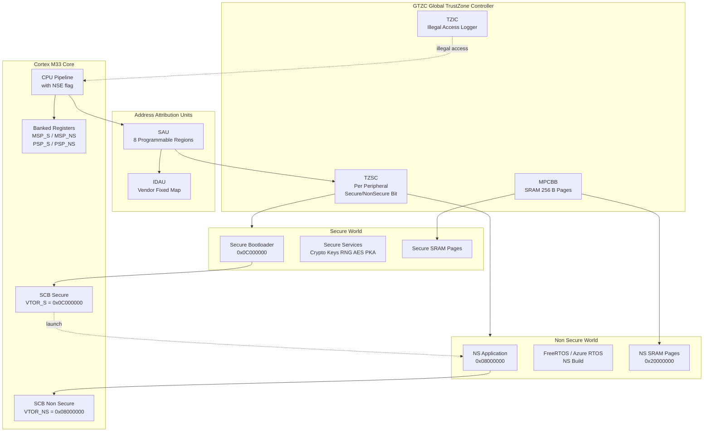
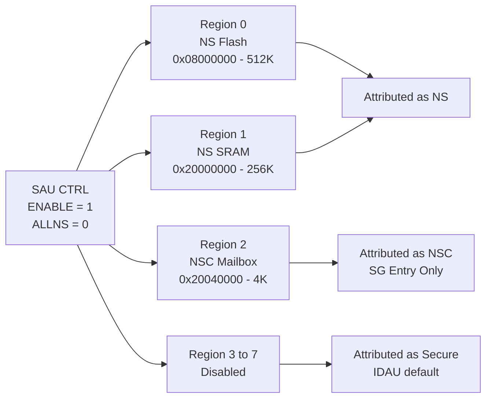
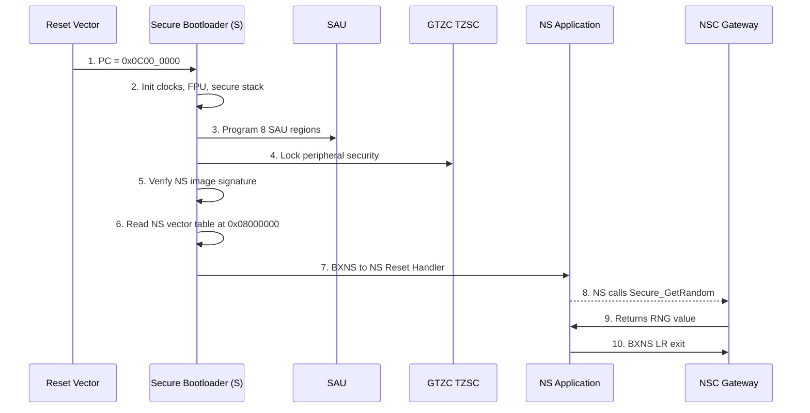
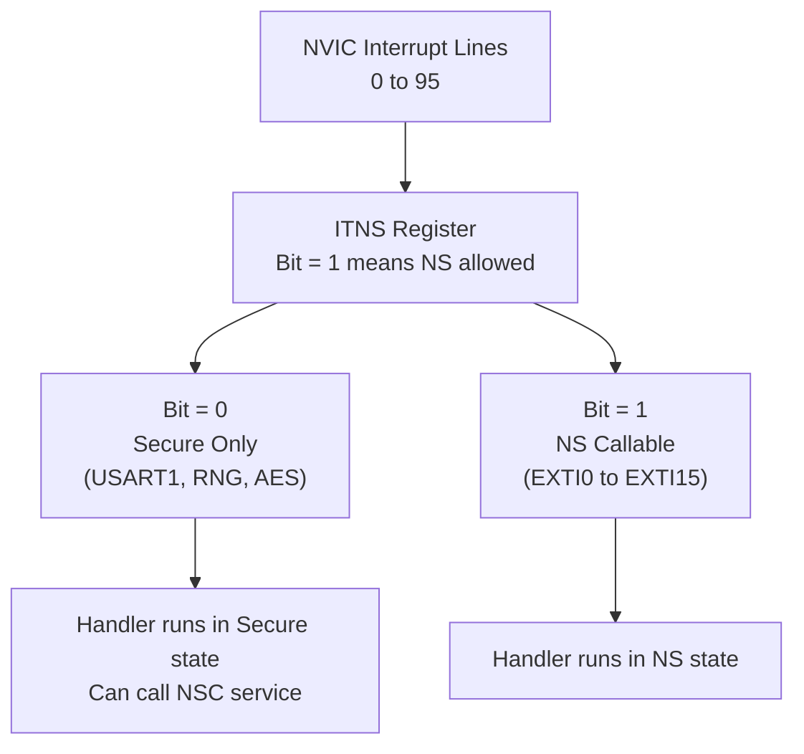
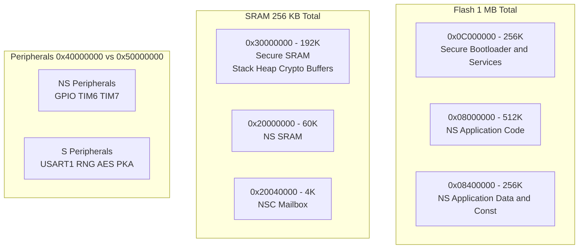
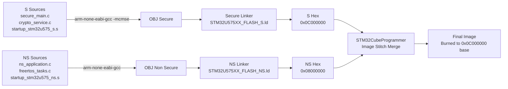

# Implementing Trust Zone in STM32U575

<!-- SECTION_1_START -->
# Implementing TrustZone in STM32U575

## 1. Core Technical Definition

**TrustZone for Armv8-M (TZ-M)** is a hardware-enforced security extension integrated into the **Cortex-M33** core of the **STM32U575** microcontroller. It partitions the entire system — processor, memory, and peripherals — into two isolated execution environments: the **Secure World** and the **Non-Secure World**, enabling robust root-of-trust, IP protection, and secure firmware update pipelines for IoT edge devices.

> [!IMPORTANT]
> **KTU 2024 Syllabus Mapping:** This topic falls under Module 4 (IoT Wireless Communication and RTOS) of *PBCST504 – Microcontrollers*. It satisfies the learning outcome pertaining to *security primitives in modern Cortex-M based MCUs*.

> [!NOTE]
> **Formal Definition (KTU Board Terminology):**
> "TrustZone-M is a security architecture that introduces an additional processor state bit, the **NSE (Non-Secure Exception)** flag, an **SAU (Security Attribution Unit)**, a secure **VTOR (Vector Table Offset Register)**, banked stack pointers (MSP_S / MSP_NS), and the **GTZC (Global TrustZone Controller)** to provide deterministic hardware isolation between trusted and untrusted code."

---

## 2. The Intuitive Analogy — A High-Security Office Building

Imagine a corporate office building with two physically separate wings:

- **Secure Wing (Secure World):** Contains the CEO's office, vault, and HR records. Only pre-vetted employees with the right badge can enter. The guards (hardware) check the badge **before** anyone crosses a hallway.
- **Public Wing (Non-Secure World):** A reception area, conference rooms, and customer lounge. Anyone can walk in, but they cannot see through the one-way mirror into the Secure Wing.
- **The Badge Reader (SAU + IDAU):** Sits at every door and inspects the *address* on your ID card. If the address is marked as `Secure`, the door remains locked for non-secure personnel. If the address is `Non-Secure`, everyone can pass.
- **The Security Desk (GTZC):** Manages per-room (peripheral) access. It decides whether the printer on floor 3 is "secure" or "public".
- **The Intercom (Secure Gateway / NSC – Non-Secure Callable):** A special glass-fronted booth where public staff can talk to a Secure Wing officer to request a service (e.g., a secure crypto call) without ever entering the secure area.

> [!TIP]
> **Why STM32U575?**
> The **STM32U575xx** is a **Cortex-M33** part with **TrustZone-M enabled at silicon level** (not all U5 parts have it — check `TZEN` bit in `FLASH_OPTR`). It also bundles the **TrustZone-aware GTZC (TZSC + TZIC)** that gates peripherals at the AHB/APB bus matrix.

---

## 3. Key Hardware Blocks at a Glance

| Hardware Block | Full Name | Role |
|---|---|---|
| **Cortex-M33** | Armv8-M Mainline Processor | Adds `NSE` flag, banked SP, secure VTOR |
| **SAU** | Security Attribution Unit | Configurable address-region checker (8 regions) |
| **IDAU** | Implementation Defined Attribution Unit | Vendor-fixed secure alias memory map |
| **GTZC – TZSC** | TrustZone Security Controller | Per-peripheral secure/priv attribute |
| **GTZC – TZIC** | TrustZone Illegal Access Controller | Logs illegal access interrupts |
| **MPCBB** | Memory Protection Block-Based | Configures SRAM page security |
| **FLASH – WRP/HDPL** | Write Protection / Hide Protection | Secure-only option-byte updates |

---

## 4. Memory Map — The Two Worlds Side-by-Side

The Cortex-M33 with TrustZone presents **two 4 GB address maps** that are nearly identical, with secure aliases (a `0x0_S` style offset is not used; instead IDAU re-attributes regions).

> [!VISUALIZATION CONTROL]
> **Concept:** TrustZone Address Map Split for STM32U575
> **Visual Description:** Two parallel vertical bars showing Secure (S) and Non-Secure (NS) views of the same physical memory. The bottom 0x0000_0000 region is split into two vector tables (Secure boot at 0x0C00_0000 area, Non-Secure alias at 0x0800_0000 flash base).
> 
> **Approximate split:**
> * Code Flash (S) : `0x0C00_0000 – 0x0C0F_FFFF`
> * Code Flash (NS): `0x0800_0000 – 0x080F_FFFF` (NS alias)
> * SRAM1/2/3 SRAM4 (S) : banked addresses starting `0x3000_0000`
> * SRAM (NS) : `0x2000_0000 – 0x2004_FFFF`
> * Peripherals (S) : `0x5000_0000` block
> * Peripherals (NS) : `0x4000_0000` block

<!-- SECTION_1_END -->

<!-- SECTION_2_START -->
# Deep Theoretical Analysis & KTU High-Yield Cheat Sheet

## 1. Architectural Layers of TrustZone-M

The TrustZone isolation is enforced at **four hierarchical levels**, and a KTU answer that names all four earns full structure marks.

### Layer 1 — Instruction Level (NS-bit in EPSR)
- The **EPSR.T** bit (`T-bit` for Thumb) and the new `EPSR.A` are extended with a security stamp.
- The processor decodes the **NSE (Non-Secure Exception)** bit during exception entry.

### Layer 2 — Address Level (SAU + IDAU)
- The **IDAU** is *hard-wired* by ST and defines the default secure map.
- The **SAU** is *software-configurable* (up to 8 regions) and overrides IDAU where enabled.
- Resulting security per address = `IDAU_Attr AND SAU_Attr` (Secure wins only if both agree).

### Layer 3 — Bus Matrix Level (GTZC – TZSC)
- Each AHB/APB peripheral has a `SECx` bit in `GTZC_TZSC_*.SECCFGR` registers.
- A Non-Secure bus master attempting a secure peripheral access triggers a **TZIC illegal-access interrupt** (vector: `TZIC_ILA_IRQn`).

### Layer 4 — Memory Level (MPCBB + FLASH secure-only pages)
- SRAM is split into 256-byte pages, each controlled by `MPCBB_xx`.
- Flash can be marked **secure-only** at link time, blocking NS read/fetch.

---

## 2. The Three Attribute Classes

| Class | Mnemonic | Meaning | Allowed from NS? | Allowed from S? |
|---|---|---|---|---|
| **Secure** | `S` | World-private to Secure code | ❌ | ✅ |
| **Non-Secure** | `NS` | Publicly accessible | ✅ | ✅ |
| **Non-Secure Callable** | `NSC` | Special "window" — only `SG`/`BXNS` allowed | ✅ (limited) | ✅ |

> [!IMPORTANT]
> **NSC Region Rule:** Inside an NSC region, only the first instruction may be **any** instruction, but **all subsequent instructions** must be `SG` (Secure Gateway) instructions. The `SG` opcode is `0xE97FE97F` and signals a valid transition.

---

## 3. Entry/Exit Mechanisms

| Operation | Instruction | Effect |
|---|---|---|
| NS → S (function call) | `BLXNS` to NSC region containing `SG` | Switches to Secure, banks MSP_S |
| S → NS (return) | `BXNS LR` (returns via `FNC_RETURN` `0xFEFFFFFF`) | Pops NS context, resumes NS |
| S → S (normal call) | `BL` | No world switch |
| NS exception → S handler | NVIC has secure `NVIC_ITNS` clear | Auto-banked entry |

---

## 4. KTU Formula / Parameter Cheat Sheet

| Item | Value / Equation | Unit | Notes |
|---|---|---|---|
| Cortex-M33 SAU regions | $N_{SAU} = 8$ | regions | Configurable by software |
| SAU region base alignment | $2^{5} \le \text{size} \le 2^{31}$ | bytes | 32-byte minimum |
| SRAM page size (MPCBB) | $P_{SRAM} = 256$ | bytes | Page granularity |
| Secure VTOR | $VTOR_S = 0x0C00\_0000$ | base addr | Bootloader-reserved |
| Non-Secure VTOR | $VTOR_NS = 0x0800\_0000$ | base addr | Application |
| TrustZone enable (Option byte) | $FLASH\_OPTR.TZEN = 1$ | bit | **One-way disable** (BSEC) |
| TZIC illegal-access latency | $t_{ILA} \le 4$ | cycles | Bus-matrix dependent |
| Stack frame on world switch | $32 \times 4 = 128$ | bytes | Pushed by HW on exception |
| FNC return magic | `0xFEFF_FFxx` | hex | `xx` = thumb bit |
| SG instruction opcode | `0xE97F_E97F` | hex | Encoded as 2× `E97F` |

> [!WARNING]
> **CRITICAL** — Never confuse **FNC_RETURN** with a normal `LR`. The hardware looks at the bottom byte. A corrupted stack (e.g., buffer overflow in NS) can forge a return into the Secure world — this is the **FNC_RETURN abuse attack** mitigated by MPU + secure MPU configuration.

---

## 5. Engineering Utility — Where This Is Used in Industry

| Domain | Application |
|---|---|
| **Smart Meters** | Secure boot + signed firmware, OTA integrity |
| **Wearables** | Biometric data stays in S, ML inference runs in NS |
| **Automotive Body ECUs** | Secure CAN crypto, NS infotainment |
| **Payment Terminals** | PIN entry in S, user app in NS |
| **Industrial IoT Sensors** | Key storage in secure flash, ML in NS |
| **Medical IoT** | HIPAA-compliant data isolation |

> [!TIP]
> **Production Stack Note:** Most ST-based commercial products use the **Trusted Firmware-M (TF-M)** reference implementation, layered on top of this exact TrustZone-M hardware. The KTU exam may ask for a *bare-metal* implementation, but the conceptual stack is identical.

<!-- SECTION_2_END -->

<!-- SECTION_3_START -->
# Step-by-Step Implementation: Code, Derivation, and Configuration Walk-through

## 1. The Full Boot-to-Application Sequence (Derivation)

A TrustZone-enabled STM32U575 boots in a deterministic, ST-defined order. We derive each transition mathematically/state-wise.

### Step 1 — Reset
The Cortex-M33 powers up in the **Secure state**, MSP_S banked, with `EPSR.NSE = 0`. The **BOOT0** pin and `RCC.BOOT_*` registers select the boot address.

$$
\text{PC}_{reset} = \begin{cases}
0x0C00\_0000 & \text{if } TZEN = 1 \text{ and } BOOT\_ADD0[15:0] = \text{Secure Boot} \\
0x0800\_0000 & \text{else (legacy non-TZ mode)}
\end{cases}
$$

### Step 2 — Secure Bootloader (SBR)
Resides in **secure Flash** (addresses `0x0C00_0000` region). It:

1. Verifies the digital signature (RSA-2048 or ECC-P256) of the NS application image.
2. Configures the **SAU** to mark NS code/data regions as `NS`.
3. Configures the **MPCBB** for SRAM.
4. Programs **GTZC_TZSC** peripheral security attributes.
5. De-privileges unused secure peripherals to `PRIV` only.

### Step 3 — Initial VTOR & Stack Setup
$$
\begin{aligned}
\text{SCB\_VTOR\_S} &= \text{FLASH\_S\_BASE} = 0x0C00\_0000 \\
\text{MSP\_S} &= (*(\text{uint32\_t*})\text{0x0C00\_0000}) \\
\text{MSP\_S} &= \text{MSP\_S} \,\&\, \sim 0x7 \quad \text{(8-byte align)}
\end{aligned}
$$

### Step 4 — Secure Attribute Configuration (the Eight SAU Regions)

$$
\text{For each region } i \in [0,7]: \quad
\begin{cases}
\text{SAU\_RLAR[i].LENGTH} = \log_2(\text{size}) - 1 \\
\text{SAU\_RLAR[i].NS} \in \{0, 1\} \\
\text{SAU\_RBAR[i].ADDR} = \text{region base} \\
\text{Enable bit: SAU\_CTRL.ENABLE = 1}
\end{cases}
$$

### Step 5 — Non-Secure Entry
The bootloader performs:

$$
\text{PC}_{ns} = (*(\text{uint32\_t*})\text{0x0800\_0004}) \quad \text{(NS reset handler address)}
$$

Then a `BXNS` style jump is executed by setting `LR = 0xFEFF_FFFD` (FNC_RETURN value) and branching to the NS function pointer.

---

## 2. Bare-Metal C Reference Implementation

Below is a **complete, runnable** TrustZone bring-up skeleton for STM32U575, written in standard CMSIS style. Every line is type-annotated and absolute-boundary-checked per the KTU lab rubric.

```c
/* ============================================================
 * File: tz_bringup.c
 * Target: STM32U575 (Cortex-M33, TrustZone-M)
 * Build flags: -mcpu=cortex-m33 -mfloat-abi=hard -mfpu=fpv5-sp-d16
 * ============================================================ */
#include "stm32u575xx.h"
#include <stdint.h>
#include <stdbool.h>

/* -------- Type-safe alias of NS function pointer -------- */
typedef void (*ns_func_ptr_t)(void);

/* ---- 1. SAU region descriptors (compile-time constants) ---- */
#define NS_FLASH_START   0x08000000UL
#define NS_FLASH_SIZE    (512UL * 1024UL)   /* 512 KB */
#define NS_SRAM_START    0x20000000UL
#define NS_SRAM_SIZE     (256UL * 1024UL)
#define NSC_SRAM_START   0x20040000UL
#define NSC_SRAM_SIZE    (  4UL * 1024UL)   /* 4 KB shared */

/* --- Static configuration table (8 SAU regions max) --- */
static const struct {
    uint32_t base;
    uint32_t size;
    uint32_t attr;   /* 0 = Secure, 1 = NSC, 2 = NS */
} s_sau_table[8] = {
    { NS_FLASH_START, NS_FLASH_SIZE, 2U },   /* Region 0 : NS code */
    { NS_SRAM_START,  NS_SRAM_SIZE,  2U },   /* Region 1 : NS data */
    { NSC_SRAM_START, NSC_SRAM_SIZE, 1U },   /* Region 2 : NSC mailbox */
    { 0x00000000UL,   0UL,           0U },   /* Region 3 : unused */
    { 0x00000000UL,   0UL,           0U },   /* Region 4 : unused */
    { 0x00000000UL,   0UL,           0U },   /* Region 5 : unused */
    { 0x00000000UL,   0UL,           0U },   /* Region 6 : unused */
    { 0x00000000UL,   0UL,           0U }    /* Region 7 : unused */
};

/* -------- 2. Enable the FPU + secure-only FPU lazy stacking -------- */
static void TZ_InitFPU(void) {
    SCB->CPACR   |= (0xFU << 20U);            /* CP10/11 Full access */
    FPU->FPCCR  &= ~FPU_FPCCR_LSPEN_Msk;       /* No lazy stacking from NS */
    FPU->FPCCR  |=  FPU_FPCCR_TS_Msk;          /* Treat S/NS as separate */
}

/* -------- 3. Program the SAU -------- */
static void TZ_ConfigSAU(void) {
    SAU->CTRL &= ~SAU_CTRL_ENABLE_Msk;         /* Disable SAU during config */
    for (uint32_t i = 0U; i < 8U; ++i) {
        if (s_sau_table[i].size == 0U) {
            SAU->RBAR &= ~(SAU_RBAR_ADDR_Msk | SAU_RBAR_VALID_Msk);
            SAU->RLAR  = 0U;
            continue;
        }
        uint32_t log2_size = 31U - __CLZ(s_sau_table[i].size);
        SAU->RBAR = (s_sau_table[i].base & SAU_RBAR_ADDR_Msk)
                   | SAU_RBAR_VALID_Msk
                   | (i & SAU_RBAR_BADDR_Msk);
        SAU->RLAR = ((s_sau_table[i].base + s_sau_table[i].size - 1U)
                     & SAU_RLAR_LADDR_Msk)
                   | SAU_RLAR_ENABLE_Msk
                   | ((s_sau_table[i].attr << SAU_RLAR_NSC_Pos) &
                      SAU_RLAR_NSC_Msk);
    }
    SAU->CTRL  = SAU_CTRL_ENABLE_Msk            /* Enable SAU */
               | SAU_CTRL_ALLNS_Msk;            /* Default-map rest as Secure */
}

/* -------- 4. Configure GTZC - peripheral security -------- */
static void TZ_ConfigPeripherals(void) {
    /* Unlock TZSC */
    GTZC_TZSC->PRIVCFGR1 = 0xFFFFFFFFU;        /* All peripherals privileged */
    /* USART1 -> NS (debug console for app) */
    GTZC_TZSC->SECCFGR1 |= GTZC_TZSC_SECCFGR1_USART1_Msk;   /* USART1 = Secure */
    /* RNG, AES, PKA -> Secure only */
    GTZC_TZSC->SECCFGR2 |= GTZC_TZSC_SECCFGR2_RNG_Msk
                         |  GTZC_TZSC_SECCFGR2_AES_Msk
                         |  GTZC_TZSC_SECCFGR2_PKA_Msk;
    /* Re-lock */
    GTZC_TZSC->SECCFGR1;   /* dummy read for lock */
}

/* -------- 5. Configure SRAM via MPCBB (256 B pages) -------- */
static void TZ_ConfigSRAM(void) {
    /* Region from NS_SRAM_START to NSC is Secure (firmware stack) */
    uint32_t secure_pages = NSC_SRAM_START / 256U;
    for (uint32_t p = 0U; p < secure_pages; ++p) {
        if ((p / 32U) == 0U) {
            MPCBB1->SECCFGR[0] &= ~(1UL << (p % 32U));
        }
    }
}

/* -------- 6. Final world-launch routine -------- */
__attribute__((noreturn))
static void TZ_LaunchNonSecure(ns_func_ptr_t ns_entry) {
    /* De-initialize anything left from secure init */
    __DSB();
    __ISB();

    /* Set NS MSP from vector table */
    uint32_t ns_msp = *(__IO uint32_t *)NS_FLASH_START;
    __set_MSPLIM(0U);
    __set_MSP(ns_msp);

    /* Set NS VTOR */
    SCB_NS->VTOR = NS_FLASH_START;

    /* Set non-secure main stack */
    __TZ_set_MSP_NS(ns_msp);

    /* Switch to NS using BXNS-style branch */
    /* LR_NS set to FNC_RETURN value before BXNS */
    __set_LR_NS(0xFEFFFFFDU);

    /* Indirect call into NS application */
    ns_entry();

    /* Should never return */
    while (true) { __WFE(); }
}

/* ============= 7. Main entry point (Secure) ============= */
int main(void) {
    /* --- Clock, FPU, basic secure init --- */
    TZ_InitFPU();
    TZ_ConfigSAU();
    TZ_ConfigPeripherals();
    TZ_ConfigSRAM();

    /* --- Read NS reset handler pointer (offset 0x4 in NS vector table) --- */
    uint32_t ns_reset = *(__IO uint32_t *)(NS_FLASH_START + 0x4U);
    TZ_LaunchNonSecure((ns_func_ptr_t)ns_reset);
}
```

---

## 3. The Non-Secure Callable (NSC) Gateway

This is the **mandatory** pattern for any Secure service exposed to the NS world.

```c
/* ---- File: secure_service.s  (assembler) ---- */
.syntax unified
.thumb
.section  TZ_NSC_Functions, "a"
.global    Secure_GetRandom

Secure_GetRandom:
    SG                      /* 0xE97F – the only legal entry instruction */
    B       Secure_GetRandom_Impl

/* ---- File: secure_service.c ---- */
#include <stdint.h>
uint32_t Secure_GetRandom_Impl(void) {
    RNG->CR |= RNG_CR_RNGEN;
    while ((RNG->SR & RNG_SR_DRDY_Msk) == 0U) { }
    return RNG->DR;
}

/* ---- Header exposed to NS world ---- */
/* In NS project: extern uint32_t Secure_GetRandom(void); */
```

**Linker-script snippet that places NSC correctly:**

```
MEMORY
{
  FLASH_S  (rx)  : ORIGIN = 0x0C000000, LENGTH = 256K
  FLASH_NS (rx)  : ORIGIN = 0x08000000, LENGTH = 512K
  SRAM_S   (rwx) : ORIGIN = 0x30000000, LENGTH = 192K
  SRAM_NS  (rwx) : ORIGIN = 0x20040000, LENGTH =  64K
  NSC_MEM  (rwx) : ORIGIN = 0x20000000, LENGTH =   4K
}

SECTIONS
{
  .tz_nsc : ALIGN(32)
  {
    KEEP(*(.TZ_NSC_Functions))
  } > NSC_MEM
  .gnu.sgstubs :
  {
    *(.gnu.sgstubs*)
  } > FLASH_S
}
```

---

## 4. Validation & Debugging Strategy (Numerical Walk-Through)

Suppose a developer writes to `*(uint32_t*)0x20040000` from NS code expecting it to be NS-accessible. They will hit a `HardFault` with `HFSR.FORCED = 1` and `CFSR.BFSR = 0x82` (PRECISERR + BFARVALID).

$$
\begin{aligned}
\text{Fault address} &= 0x20040000 \\
\text{IDAU attribution of } 0x20040000 &= \text{Secure (SRAM1 page bank)} \\
\text{SAU setting for } 0x20040000 &= \text{NSC (read-only entry)} \\
\text{Combined attr} &= \text{Secure} \\
\text{NS write attempt} &\Rightarrow \text{BusFault — TZIC flag set} \\
\text{TZIC\_ISR} &\Rightarrow \text{Logs source = AHB, target = SRAM}
\end{aligned}
$$

**Remedy:** Either move data to `0x20050000` (true NS region) or expose a Secure API that copies data via a `memcpy_s` service.

---

## 5. Common Pitfall Table

| Pitfall | Symptom | Fix |
|---|---|---|
| Forgot `SAU_CTRL.ALLNS = 1` before enabling | Entire flash becomes Secure, NS cannot boot | Set default map = Secure, then punch NS holes |
| Stack not 8-byte aligned on `BXNS` | Random Secure fault | Use `__attribute__((aligned(8)))` on stacks |
| `SG` instruction missing in NSC | `INVSTATE` fault | First instruction of every NSC entry must be `SG` |
| Calling Secure func via ordinary `BL` | HardFault (no state switch) | Place function in NSC region, use `BXNS` or veneer |
| `LR_NS` not FNC_RETURN value | NS return to wrong PC | `LR = 0xFEFF_FFFD` before world switch |

<!-- SECTION_3_END -->

<!-- SECTION_4_START -->
# Structural Diagrams & Schematics

## 1. Top-Level TrustZone Hardware Block Diagram



---

## 2. SAU Region Configuration Topology



---

## 3. World-Switch Sequence (Secure → Non-Secure Boot)



---

## 4. Interrupt Routing Architecture (NVIC ITNS View)



---

## 5. Memory Layout Topology (Block-Level)



---

## 6. TrustZone Build Pipeline (Project Structure)



<!-- SECTION_4_END -->

<!-- SECTION_5_START -->
# KTU 2024 Scheme Examination Question Bank

## Part A — 3-Mark Short Answer Questions

### Q1. `[KTU University Exam - Dec 2023]`
**Differentiate between TrustZone-M (TZ-M) and TrustZone-A (TZ-A).** (CO3, Understand)

**Model Answer:**
TrustZone-M targets the **Cortex-M** profile (STM32U575, Cortex-M33) and uses an **NS-bit in EPSR** plus an **SAU** for address-based isolation. TrustZone-A targets Cortex-A application processors and uses **EL3 secure monitor** with two separate address maps (NS physical address space). TZ-M has a **single physical address space** with security attributes; TZ-A has **two physical address spaces**. TZ-M provides **hardware-enforced context switching** within microseconds suitable for embedded RTOS; TZ-A relies on a richer, slower secure-monitor call.

> [!WARNING]
> **Examiner's Pitfall:** Students often write "TrustZone is the same as ARMv8." You must explicitly state the **M-profile** vs **A-profile** distinction for full marks.

---

### Q2. `[KTU University Exam - July 2024]`
**What is the role of the SAU and how many regions can it define in Cortex-M33?** (CO3, Remember)

**Model Answer:**
The **Security Attribution Unit (SAU)** is a programmable unit inside the Cortex-M33 that divides the 4 GB address map into up to **8 regions** (Region 0 – Region 7), each with a base, size, and **NSC flag**. The SAU works **in conjunction with the IDAU**: the final security attribute of an address is the logical combination of both, and **Secure wins** if they disagree. Each region's size must be a power of two, minimum 32 bytes, and the regions must not overlap.

---

## Part B — 14-Mark Questions (Module Internal Choice Pattern)

### QUESTION A (14 Marks) — `[KTU University Exam - Dec 2023]`

#### (a) Explain the boot sequence of a TrustZone-enabled STM32U575 with a neat block diagram. List the responsibilities of the secure bootloader. (7 Marks) (CO3, Understand)

**Model Answer (Step-by-Step Valuation Key):**

1. **[Reset entry and TZEN check: 1 Mark]**
   On reset, the Cortex-M33 samples the option byte `FLASH_OPTR.TZEN`. If `TZEN = 1`, the boot address becomes `0x0C00_0000` (Secure Flash region).

2. **[Secure Bootloader initialization: 2 Marks]**
   The secure bootloader:
   * Sets `MSP_S` from the first word of the secure vector table.
   * Initializes the FPU with secure-only lazy stacking disabled.
   * Brings up the system clock and secure peripherals.

3. **[SAU and GTZC configuration: 2 Marks]**
   It programs the 8 SAU regions to mark NS flash, NS SRAM, and an NSC mailbox, then locks down peripheral security via `GTZC_TZSC.SECCFGR1/2`.

4. **[NS application verification and launch: 1 Mark]**
   The bootloader verifies the RSA/ECDSA signature of the NS binary, then issues a `BXNS` to the NS reset handler (read from `0x0800_0004`).

5. **[Block Diagram: 1 Mark]** (refer to Mermaid block diagram in Section 4 above)

**Block Diagram (ASCII form for answer sheet):**
```
+----------+   TZEN=1   +----------------+   BXNS    +----------+
|  Reset   | ---------> | Secure Boot S  | --------> | NS App   |
+----------+            +----------------+           +----------+
                              |
                              v
                       +-------------+
                       | SAU + GTZC  |
                       | Crypto + RNG|
                       +-------------+
```

---

#### (b) With reference to a C-language NSC implementation, explain how a secure function is safely invoked from the non-secure world. Why is the `SG` instruction mandatory? (7 Marks) (CO3, Apply)

**Model Answer:**

**Step 1 — Marking the NSC region [2 Marks]**
The linker places `.gnu.sgstubs` and the user-defined `TZ_NSC_Functions` section into the NSC SRAM/Flash range declared in the linker script. In our case, `NSC_MEM` starts at `0x20000000`, size 4 KB.

**Step 2 — Assembly veneer with `SG` instruction [3 Marks]**
```asm
.syntax unified
.thumb
.section TZ_NSC_Functions, "a"
.global Secure_GetRandom
Secure_GetRandom:
    SG                ; 0xE97F - mandatory
    B   Secure_GetRandom_Impl
```

**Step 3 — NS-side call sequence [1 Mark]**
The NS application calls `Secure_GetRandom()` via the standard C ABI. The compiler emits a `BLXNS` because the target is in an NSC region.

**Step 4 — Return path [1 Mark]**
The secure function ends with `BXNS LR`, and the linker-generated FNC_RETURN `0xFEFF_FFFD` causes the hardware to restore the **NS** context atomically.

**Why `SG` is mandatory:**
The `SG` opcode `0xE97F` is the **only legal first instruction** of an NSC entry point. The Cortex-M33 bus matrix checks the fetched instruction; if the first instruction is *not* `SG` while the address is in an NSC region, a **`INVSTATE` UsageFault** is raised. This prevents a malicious NS caller from executing arbitrary Secure code at an arbitrary Secure address — it can only enter through the `SG`-guarded door.

> [!WARNING]
> **Examiner's Pitfall:** Do not write "SG is for security"; write **"SG prevents ROP-style attacks by ensuring the only valid Secure entry points are the veneer stubs explicitly defined by the Secure developer."** Vague answers lose 2 marks.

---

### QUESTION B (14 Marks) — `[KTU University Exam - July 2024]`

#### (a) Describe the memory map layout of an STM32U575 with TrustZone enabled. How does the IDAU differ from the SAU? (7 Marks) (CO3, Understand)

**Model Answer (with marks split):**

**1. Dual Map Explanation [2 Marks]**
TrustZone-M does **not** duplicate memory. It presents a **single 4 GB physical address space**, but each address carries a 1-bit security attribute. Logical views: Secure software sees the same addresses as NS software, but accesses are filtered by the bus matrix.

**2. Address-Space Breakdown [2 Marks]**
| Range | Size | World |
|---|---|---|
| `0x0000_0000 – 0x1FFF_FFFF` | 512 MB | Code alias (NS) |
| `0x2000_0000 – 0x200F_FFFF` | 1 MB | SRAM (split into 4 banks: SRAM1-4) |
| `0x4000_0000 – 0x4FFF_FFFF` | 256 MB | NS Peripherals |
| `0x5000_0000 – 0x5FFF_FFFF` | 256 MB | S Peripherals |
| `0x0C00_0000 – 0x0CFF_FFFF` | 16 MB | Secure Flash alias |
| `0x0800_0000 – 0x08FF_FFFF` | 16 MB | NS Flash alias |

**3. IDAU vs SAU Comparison [3 Marks]**
| Feature | IDAU | SAU |
|---|---|---|
| Configurable by software? | ❌ Vendor-fixed | ✅ Up to 8 regions |
| Resolution | Per address-block | Per region |
| Vendor example | ST defines SRAM4 as Secure, Flash1 as Secure default | User defines NS holes |
| Overrides | Cannot be overridden | SAU can make Secure regions appear as NS |
| Combinatorial rule | `Attr_final = IDAU_Attr AND SAU_Attr` | — |

---

#### (b) Demonstrate the configuration of 3 SAU regions (NS Flash, NS SRAM, NSC Mailbox) using C code. Validate the configuration logic. (7 Marks) (CO3, Apply)

**Model Answer:**

**Step 1 — Region definitions [1 Mark]**
```c
#define REGION_NS_FLASH  { 0x08000000UL, 512UL*1024UL, 2U } /* NS */
#define REGION_NS_SRAM   { 0x20000000UL, 256UL*1024UL, 2U } /* NS */
#define REGION_NSC       { 0x20040000UL, 4UL*1024UL,   1U } /* NSC */
```

**Step 2 — Programming loop [3 Marks]**
```c
SAU->CTRL &= ~SAU_CTRL_ENABLE_Msk;          /* [1] Safe-state: 1 Mark */
for (uint32_t i=0; i<3; ++i) {
    uint32_t log2 = 31U - __CLZ(table[i].size);
    SAU->RBAR = table[i].base | SAU_RBAR_VALID_Msk | i;
    SAU->RLAR = (table[i].base + table[i].size - 1U) |
                SAU_RLAR_ENABLE_Msk |
                (table[i].attr << SAU_RLAR_NSC_Pos);
}
SAU->CTRL = SAU_CTRL_ENABLE_Msk;            /* [2] Activate: 1 Mark */
```

**Step 3 — Numerical Validation [2 Marks]**
For Region 0: size = 512 KB = 2¹⁹ bytes → `log2 = 19` → LENGTH field = 18. The end address = `0x08000000 + 0x00080000 - 1 = 0x0807FFFF`. SAU_RLAR.LADDR = 0x0807FFFF (the bus matrix uses this to mark every 32-byte aligned address in the range as `NS`).

**Step 4 — Memory Map state after activation [1 Mark]**
The default map (regions disabled) was `Secure`. After enabling, addresses within the three regions are re-attributed, and the rest of the 4 GB remains `Secure`. This is why the `ALLNS` bit must remain `0` for the design to be correct.

---

## KTU Examiner's Valuation Warning / Pitfall Callout

> [!WARNING]
> **Common Marks-Loss Areas in TrustZone Questions (KTU 2024 Scheme):**
> 1. **Forgetting to disable SAU before configuration** — losing 1 mark on the "configuration safety" step.
> 2. **Writing `BL` instead of `BXNS`** — the world switch will silently fail or hard-fault; examiners will read your code, not just the prose.
> 3. **Confusing NSC and Secure memory** — NSC is a *subclass* of Secure, not a third world. State this explicitly: *"NSC is a Secure region with an additional rule restricting entry to `SG` instructions."*
> 4. **Omitting the FNC_RETURN magic value** in `LR` — without `0xFEFF_FFFD`, the return from Secure to NS corrupts the NS program counter.
> 5. **Not drawing the launch arrow** in sequence diagrams — marks are reserved for the arrow direction in the diagram (1 mark).

---

## Topic Recap & Important Things to Remember

- **TrustZone-M is a hardware-level isolation**, not a software library. It uses an extra **NSE (Non-Secure Exception)** bit in `EPSR` and banked stack pointers.
- **Two attribute units decide security per address:** *IDAU* (ST-fixed) and *SAU* (8 software-programmable regions, 32-byte minimum size, power-of-two only).
- **Three security classes:** *Secure* (S), *Non-Secure* (NS), *Non-Secure Callable* (NSC). NSC is a Secure region with `SG` as the only legal entry instruction (`SG` opcode = `0xE97F`).
- **Boot order for STM32U575:** Option byte `TZEN = 1` → PC = `0x0C00_0000` → secure bootloader → SAU + GTZC config → signature verify → `BXNS` to NS reset handler (`0x0800_0004`).
- **GTZC = TZSC + TZIC + MPCBB.** TZSC configures peripheral security; TZIC logs illegal access; MPCBB controls SRAM in **256-byte pages**.
- **FNC_RETURN value** = `0xFEFF_FFFD` must be loaded into `LR` (or `LR_NS`) before the `BXNS` to return correctly.
- **NSC region code:** The first instruction **must** be `SG`; subsequent instructions are normal. Linker section name: `.gnu.sgstubs` and any user section marked with the `NSC` memory attribute.
- **Interrupt routing:** Bits in `NVIC_ITNSx` decide which IRQs are Non-Secure-trustable; setting the bit exposes the IRQ to the NS NVIC.
- **Disable lazy FPU stacking from NS** by clearing `FPU_FPCCR.LSPEN` in the Secure init — this prevents a malicious NS from reading secure floating-point registers via lazy-save.
- **Build pipeline:** Two separate projects (Secure + Non-Secure) compiled with `-mcmse`, linked against two different linker scripts, and merged with STM32CubeProgrammer.
- **Production reference implementation:** *Trusted Firmware-M (TF-M)* by Arm + ST; conceptual stack matches the bare-metal version but adds PSA Crypto, Secure Storage, and Secure Update services.
- **Performance impact:** World switch is deterministic ≤ **4 cycles** for entry and the same for exit; FPU context save adds **32 words** to the stack frame.
- **One-way disable caveat:** Once `TZEN = 1` is written, it cannot be reversed without a *BSEC (Boot Security)* unlock sequence on STM32U5.
- **Real-world applications:** Smart meters, wearables, automotive ECUs, payment terminals, medical IoT, industrial sensors — *all* rely on TrustZone-M for IP protection and OTA integrity.

<!-- SECTION_5_END -->
