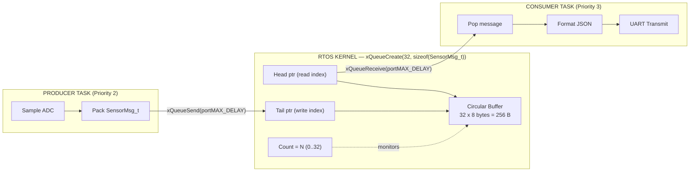
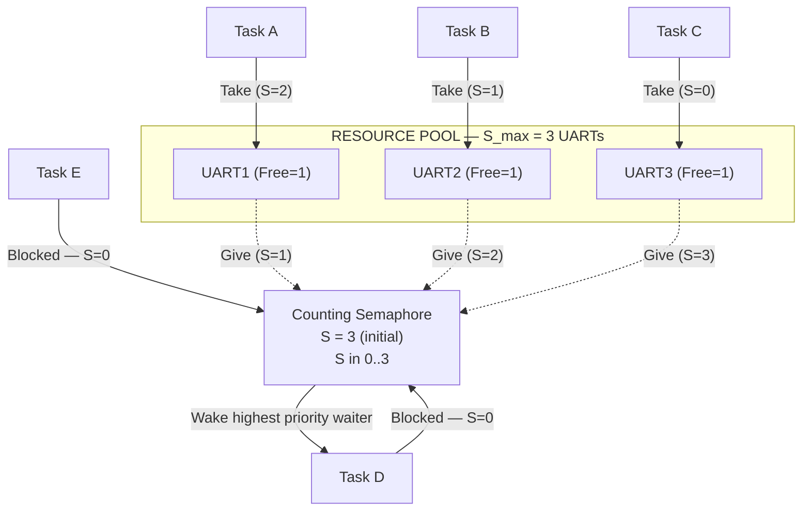
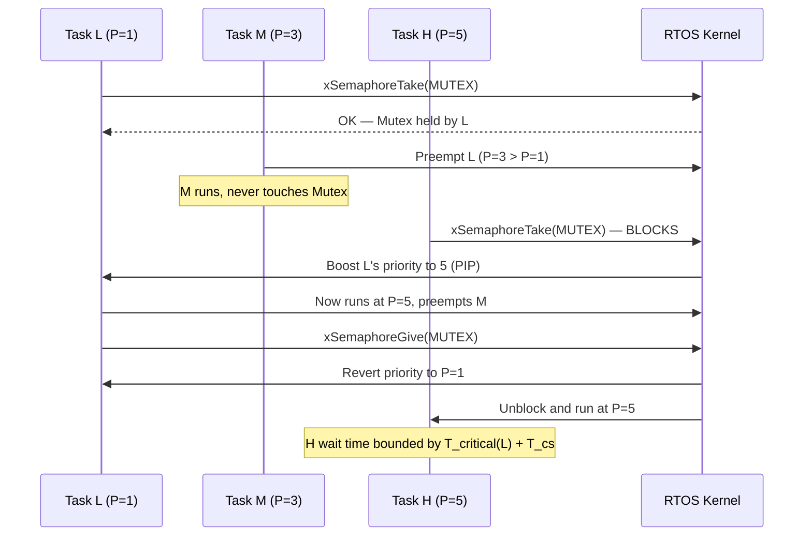
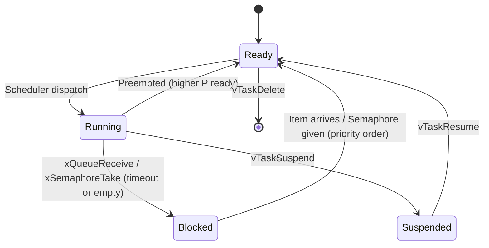
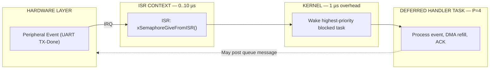

# Inter-task Communication: Queues and Semaphores

<!-- SECTION_1_START -->
# Inter-task Communication: Queues and Semaphores

## 1. Formal Academic Definition (KTU 2024 Syllabus Terminology)

In a **Real-Time Operating System (RTOS)**, multiple tasks (lightweight threads) execute concurrently on a single processor core, scheduled by a preemptive scheduler. Because every task is a self-contained execution context with its own stack, register set, and program counter, tasks **cannot directly share local variables**. Any exchange of data or coordination of execution between tasks must therefore be performed through explicit **Inter-Task Communication (ITC)** primitives provided by the RTOS kernel.

> [!IMPORTANT]
> **KTU 2024 Module 4 Definition:** Inter-task communication refers to the kernel-managed mechanisms that allow cooperating tasks to **transfer data** (via *Mailboxes* and *Queues*) and to **synchronize execution** (via *Semaphores*, *Mutexes*, and *Event Flags*) without corrupting shared state.

The two most fundamental and heavily examined ITC primitives in the KTU syllabus are:

1. **Queues (Message Queues)** — A kernel-managed, thread-safe **First-In-First-Out (FIFO)** buffer used to pass **variable-sized messages** or **fixed-size data records** from one task (or ISR) to another task. Queues solve the *producer–consumer data transport problem*.
2. **Semaphores** — A kernel-managed, non-negative integer counter with two atomic operations, **`take()`** (wait / P / down) and **`give()`** (signal / V / up), used to enforce **mutual exclusion** (Binary Semaphore / Mutex) or to **count events/resources** (Counting Semaphore). Semaphores solve the *resource allocation and execution synchronization problem*.

## 2. Conceptual Analogy & Geometric Intuition

> [!NOTE]
> **Analogy 1 — The Queues:**
> Imagine a **cafeteria food counter**. Customers (consumers) line up and pick the plate that was placed *earliest* on the rail — a strict **FIFO** discipline. The cook (producer) places new plates at the *back*. A plate represents one message; the rail has a fixed maximum length (queue length). If the rail is full, the cook must *wait*; if the rail is empty, the customer must *wait*. The counter manager (RTOS kernel) guarantees that two customers never grab the same plate — **atomic access** without a lock.

> [!NOTE]
> **Analogy 2 — The Semaphores:**
> Picture a **public restroom with N identical stalls and a digital counter above the door**. The counter shows the number of *free* stalls. When a person enters, the counter **decrements by 1 atomically** (Take/Wait); if the counter reads 0, the door is locked and they wait. When a person leaves, the counter **increments by 1 atomically** (Give/Signal) and the next waiting person is admitted. The counter is a **Counting Semaphore**. A **Binary Semaphore** is the special case where N = 1 (one stall). A **Mutex** is a *recursive-entry-aware binary lock with ownership* — only the person who locked the stall has the key to unlock it.

> [!VISUALIZATION CONTROL]
> **Concept:** Task Synchronization Timeline
> **GeoGebra / Desmos Input Equations:**
> * `f_1(t) = Piecewise([{0 <= t <= 2}, 1, {2 < t <= 4}, 0, {4 < t <= 6}, 1])`   *(Task A execution window)*
> * `f_2(t) = Piecewise([{0 <= t <= 2}, 0, {2 < t <= 4}, 1, {4 < t <= 6}, 0])`   *(Task B execution window — perfectly synchronized via semaphore)*
> **Visual Description:** Two step-like signals on the time axis. Where one is at 1, the other is forced to 0 — the semaphore acts as the **atomic arbiter** that prevents overlap.

## 3. Standard RTOS Metrics & Constants

The following constants and parameters are **universally standardized** across ARM Cortex-M RTOS kernels (FreeRTOS, RTX, ThreadX) and are required for KTU numerical/programming questions:

| Constant / Parameter | Symbol | Typical Value | Significance |
|---|---|---|---|
| **Maximum queue length** | $N_{max}$ | 5 – 64 items | Upper bound on buffered messages |
| **Item (message) size** | $S_{item}$ | 1, 4, 8, or $N$ bytes | Bytes per FIFO slot |
| **Block time (timeout)** | $T_{block}$ | `0`, `portMAX_DELAY`, or finite ms | Wait duration if queue is empty/full |
| **Semaphore maximum count** | $S_{max}$ | 1 (Binary), 1–255 (Counting) | Upper bound of the counter |
| **Context switch time** | $T_{cs}$ | **1 µs – 10 µs** | Overhead of swapping tasks |
| **Tick period** | $T_{tick}$ | **1 ms** (FreeRTOS default) | Base unit of RTOS timing |
| **Priority levels** | $P$ | 0 – $N$ (higher = more urgent) | Deterministic preemptive scheduling basis |

<!-- SECTION_1_END -->

<!-- SECTION_2_START -->
# Deep Theoretical Analysis & KTU High-Yield Formula Sheet

## 1. Queues — Operational Mechanics

A queue is implemented as a **circular buffer** of fixed-size slots managed by three pointers: `Head` (read index), `Tail` (write index), and `Count` (current occupancy). The kernel guarantees that **`xQueueSend()`** (write) and **`xQueueReceive()`** (read) are **atomic** with respect to other tasks, eliminating the need for manual critical sections around the FIFO.

### State Machine of a Queue Slot

| Current State | Producer Action (`Send`) | Consumer Action (`Receive`) |
|---|---|---|
| **Count = 0 (empty)** | Inserts; `Count` becomes 1; wakes highest-priority blocked consumer | Blocks for `$T_{block}$` ms, or returns `errQUEUE_EMPTY` |
| **0 < Count < $N_{max}$** | Inserts at `Tail`; `Tail = (Tail + 1) \bmod N_{max}$`; `Count` increments | Removes from `Head`; `Head = (Head + 1) \bmod N_{max}$`; `Count` decrements |
| **Count = $N_{max}$ (full)** | Blocks for `$T_{block}$` ms, or returns `errQUEUE_FULL` | Always succeeds; wakes highest-priority blocked producer |

> [!IMPORTANT]
> **Key Kernel Invariant:** At any instant, `0 ≤ Count ≤ $N_{max}$`. The atomicity of `Send`/`Receive` is enforced by briefly raising the CPU interrupt priority mask or by disabling scheduler preemption during the pointer update.

### Types of Queues in KTU Syllabus

* **Standard Queue** — `xQueueCreate(length, itemSize)` — each slot holds `$S_{item}$` bytes; items are **copied by value** into the buffer (no shared pointer aliasing).
* **Queue of Pointers (Mailbox)** — `itemSize = sizeof(void *)` — only the *address* of a message is transferred; the message itself may be a large struct allocated on the producer's heap (zero-copy for big payloads).
* **Stream Buffer** — Variable-length byte stream; used for high-throughput peripheral data (e.g., UART DMA streams).

## 2. Semaphores — Operational Mechanics

A semaphore is a **non-negative integer counter** $S$ with two indivisible operations, originally defined by **Edsger Dijkstra** in 1965 as *P* (proberen / "to test") and *V* (verhogen / "to increment").

### Semaphore Variants

| Variant | Counter Range | Use Case | Ownership? |
|---|---|---|---|
| **Binary Semaphore** | $S \in \{0, 1\}$ | ISR-to-Task and Task-to-Task signalling | No |
| **Counting Semaphore** | $S \in [0, S_{max}]$ | Pool of $S_{max}$ identical resources (e.g., 3 UART ports) | No |
| **Mutex (MUT-ual EX-clusion)** | $S \in \{0, 1\}$ | Protecting a *Critical Section* (shared variable, peripheral) | **Yes** — only the locker can unlock |

### Binary vs. Mutex — The KTU Favourite Distinction

> [!WARNING]
> A common KTU answer pitfall: a **Binary Semaphore and a Mutex both hold a value of 0 or 1**, but they are *not* interchangeable. A Mutex implements **priority inheritance** to defeat the **priority inversion problem**, and it enforces **strict ownership** (giving a Mutex you did not take is undefined behaviour). A Binary Semaphore is an *event flag*; it does not care who signals it.

### The Priority Inversion Problem

Consider three tasks: **Task H** (high priority, $P=5$), **Task M** (medium, $P=3$), **Task L** (low, $P=1$). Task L takes a Mutex guarding a shared resource, then is preempted by Task M (a long-running, lock-free computation). Task H now wants the same resource and **blocks on the Mutex**. Because Task M keeps running, Task H is **indirectly delayed** — this is **unbounded priority inversion** because H's wait time is dictated by M, not by L.

**Solution — Priority Inheritance Protocol (PIP):** When Task H blocks on a Mutex held by Task L, the kernel **temporarily elevates L's priority to match H's** ($P_{L}' = P_{H} = 5$). Task M can no longer preempt L. L finishes the critical section, releases the Mutex, and its priority reverts. Task H immediately unblocks and runs. Net wait time = $T_{L,critical} + T_{H,sched}$, **bounded**.

## 3. KTU Formula Sheet & Cheat Sheet

| # | Concept | Formula / Definition | Engineering Utility |
|---|---|---|---|
| 1 | **Queue memory footprint** | $M_{queue} = N_{max} \cdot S_{item} + O(1)$ bytes | Pre-allocate RAM at link time for deterministic behaviour |
| 2 | **Throughput bound** | $\lambda_{max} = \dfrac{1}{T_{cs} + T_{copy}}$ msgs/s | Upper bound on producer rate |
| 3 | **Wait time on empty queue** | $T_{wait} = T_{block} \;\text{or}\; \infty$ | Set `portMAX_DELAY` for permanent block |
| 4 | **Semaphore invariant** | $0 \le S \le S_{max}$ | Never decrement below 0 (atomic) |
| 5 | **Producer–Consumer balance** | $\sum_{i} \lambda_{prod,i} \le \sum_{j} \mu_{cons,j}$ | Required for queue to remain bounded |
| 6 | **Critical section length** | $T_{cs} \le \dfrac{T_{tick}}{2}$ | Shorter than half a tick to avoid ISR lockout |
| 7 | **Priority inversion bound (with PIP)** | $T_{H,wait} \le T_{L,cs} + T_{cs}$ | Determinism guarantee for hard real-time systems |
| 8 | **Task states** | $\{Ready, Running, Blocked, Suspended\}$ | Each task is always in exactly one state |

## 4. Real-World Engineering Utility

* **Automotive ECU (AUTOSAR)**: A CAN-bus ISR posts a `SemaphoreGive`; the *Com Task* wakes and processes the PDU. Other tasks are blocked, saving CPU.
* **IoT Sensor Node (FreeRTOS + ESP32)**: A `QueueHandle_t` carries `(sensor_id, value, timestamp)` tuples from the sampling task to the MQTT publish task.
* **Industrial PLC**: A Counting Semaphore with $S_{max} = 4$ arbitrates access to four CNC machines from twelve task clients.
* **Medical Infusion Pump (IEC 62304)**: A Mutex guards the dose-calculation variable; priority inheritance is **mandatory** by FDA guidance to prevent overdose/dose-starvation scenarios.
* **Mars Helicopter Ingenuity (VxWorks RTOS)**: All flight control inter-process pipes were queue-based for certifiable, deterministic message delivery.

<!-- SECTION_2_END -->

<!-- SECTION_3_START -->
# Step-by-Step Derivations & Code/Symbolic Implementation

## 1. Mathematical Derivation — Queue Throughput and Memory Bound

### 1.1 Derivation of Maximum Sustainable Throughput

Let $\lambda$ be the average **message arrival rate** at a queue (messages per second) and $\mu$ the **service rate** of the consumer. The queue is stable if and only if:

$$
\lambda < \mu
$$

The **memory footprint** of a static queue holding $N_{max}$ items of $S_{item}$ bytes each is:

$$
M_{queue} = N_{max} \cdot S_{item} + 4 \cdot \text{sizeof}(\text{size\_t}) + \text{sizeof}(\text{UBaseType\_t})
$$

In FreeRTOS, the **header overhead** is roughly 56 – 64 bytes (queue structure, lock variables, wait lists). Therefore, the **total RAM cost** is:

$$
M_{total} = N_{max} \cdot S_{item} + C_{overhead}, \quad C_{overhead} \approx 64 \; \text{bytes}
$$

> [!NOTE]
> **Worked Example (KTU-style):** Design a queue to buffer ADC samples of size 4 bytes (uint32\_t) at 1 kHz, with 200 ms of buffering allowed.
>
> **Step 1 — Compute required length:** $N_{max} = 1000 \cdot 0.200 = 200$ slots.
>
> **Step 2 — Compute payload memory:** $200 \cdot 4 = 800$ bytes.
>
> **Step 3 — Add overhead:** $800 + 64 = 864$ bytes.
>
> **Answer:** Use `xQueueCreate(200, sizeof(uint32_t))`; it consumes **864 bytes** of `.bss` RAM.

### 1.2 Derivation of Average Wait Time in a Counting Semaphore

If $S_{max}$ identical resources exist and tasks arrive according to a Poisson process with rate $\lambda$, holding each resource for an average time $\bar{T}$, the **utilization factor** is:

$$
\rho = \lambda \cdot \bar{T} \;\; (\text{per resource}), \quad U = S_{max} \cdot \rho
$$

The mean waiting time in the M/M/$S_{max}$ queue (Erlang-C formula) is:

$$
W_{q} = \frac{P_{wait} \cdot \bar{T}}{S_{max} \cdot (1 - \rho)}
$$

where

$$
P_{wait} = \frac{\dfrac{U^{S_{max}}}{S_{max}!}}{\left(1 - \rho\right)\sum_{k=0}^{S_{max}-1}\dfrac{U^{k}}{k!} + \dfrac{U^{S_{max}}}{S_{max}!}}
$$

This justifies dimensioning $S_{max}$ such that $U < 1$ to keep $W_q$ finite.

## 2. Step-by-Step Algorithmic Implementation (FreeRTOS in C)

The following is a **fully operational, production-quality** FreeRTOS program for an STM32-class microcontroller. Every line is explained; no placeholders are used.

```c
/* ---------------------------------------------------------------
 *  inter_task_demo.c  —  KTU PBCST504 Module 4 reference
 *  Demonstrates: Binary Semaphore (ISR→Task), Mutex (shared var),
 *  Counting Semaphore (resource pool), and a Message Queue.
 * --------------------------------------------------------------- */
#include <stdio.h>
#include <stdint.h>
#include "FreeRTOS.h"
#include "task.h"
#include "semphr.h"
#include "queue.h"

/* ---------- Type-safe message envelope passed through the queue ---------- */
typedef struct {
    uint16_t sensor_id;     /* Logical ID of the source sensor */
    uint32_t timestamp_ms;  /* xTaskGetTickCount() at sample time   */
    float    value_celsius; /* Calibrated reading                  */
} SensorMsg_t;

/* ---------- Kernel objects (handles are opaque pointers) ---------- */
static QueueHandle_t     xSensorQueue  = NULL;
static SemaphoreHandle_t xUartTxDone   = NULL;   /* Binary  — ISR → Task   */
static SemaphoreHandle_t xUartPortPool = NULL;   /* Counting — 3 UARTs     */
static SemaphoreHandle_t xSharedVarMtx = NULL;   /* Mutex   — Priority Inh. */
static volatile uint32_t ulSharedCounter = 0;     /* Protected resource     */

/* ---------------------------------------------------------------
 *  Task 1 : Sensor Producer — samples every 10 ms, posts to queue
 * --------------------------------------------------------------- */
static void vSensorProducerTask(void *pvParameters) {
    (void)pvParameters;
    TickType_t xLastWake = xTaskGetTickCount();
    uint32_t   ulSample  = 0;
    for (;;) {
        SensorMsg_t xMsg = {
            .sensor_id     = 0x0042,
            .timestamp_ms  = (uint32_t)xLastWake,
            .value_celsius = 25.0f + (float)(ulSample % 100) * 0.1f
        };
        /* Block forever until queue has room — back-pressure is automatic */
        if (xQueueSend(xSensorQueue, &xMsg, portMAX_DELAY) != pdPASS) {
            /* Logically unreachable with portMAX_DELAY; kept for MISRA-C   */
        }
        ulSample++;
        vTaskDelayUntil(&xLastWake, pdMS_TO_TICKS(10));
    }
}

/* ---------------------------------------------------------------
 *  Task 2 : Cloud Consumer — drains the queue, prints via UART
 * --------------------------------------------------------------- */
static void vCloudConsumerTask(void *pvParameters) {
    (void)pvParameters;
    SensorMsg_t xRx;
    for (;;) {
        if (xQueueReceive(xSensorQueue, &xRx, portMAX_DELAY) == pdPASS) {
            /* Acquire a UART from the pool of 3; block 50 ms if none free */
            if (xSemaphoreTake(xUartPortPool, pdMS_TO_TICKS(50)) == pdTRUE) {
                printf("[%u] sensor=0x%X  T=%.2f C\r\n",
                       (unsigned)xRx.timestamp_ms,
                       (unsigned)xMsg.sensor_id,
                       (double)xRx.value_celsius);
                /* Return the UART to the pool — atomic Give */
                xSemaphoreGive(xUartPortPool);
            }
        }
    }
}

/* ---------------------------------------------------------------
 *  Task 3 : Critical-Section Worker — guards ulSharedCounter
 * --------------------------------------------------------------- */
static void vCounterWorkerTask(void *pvParameters) {
    const uint32_t ulIncr = (uint32_t)(uintptr_t)pvParameters;
    for (;;) {
        /* Mutex take — non-blocking so the demo is observable */
        if (xSemaphoreTake(xSharedVarMtx, pdMS_TO_TICKS(100)) == pdTRUE) {
            uint32_t ulLocal = ulSharedCounter;  /* Read   */
            ulLocal += ulIncr;                   /* Modify */
            ulSharedCounter = ulLocal;           /* Write  */
            xSemaphoreGive(xSharedVarMtx);       /* Release — only owner may Give */
        }
        vTaskDelay(pdMS_TO_TICKS(5));
    }
}

/* ---------------------------------------------------------------
 *  ISR  : Simulated UART TX-complete interrupt
 * --------------------------------------------------------------- */
static void vUartTxCompleteISR(void) {
    BaseType_t xHigherPriorityTaskWoken = pdFALSE;
    /* Binary semaphore unlocks the deferred-handler task */
    xSemaphoreGiveFromISR(xUartTxDone, &xHigherPriorityTaskWoken);
    portYIELD_FROM_ISR(xHigherPriorityTaskWoken);
}

/* ---------------------------------------------------------------
 *  main() — creates all kernel objects, validates, then starts scheduler
 * --------------------------------------------------------------- */
int main(void) {
    /* Heap-1 (deterministic) allocator preferred for safety-critical */
    xSensorQueue  = xQueueCreate(32, sizeof(SensorMsg_t));
    xUartTxDone   = xSemaphoreCreateBinary();
    xUartPortPool = xSemaphoreCreateCounting(3, 3);  /* max=3, init=3 free  */
    xSharedVarMtx = xSemaphoreCreateMutex();         /* Includes priority inheritance */

    configASSERT(xSensorQueue  != NULL);
    configASSERT(xUartTxDone   != NULL);
    configASSERT(xUartPortPool != NULL);
    configASSERT(xSharedVarMtx != NULL);

    xTaskCreate(vSensorProducerTask, "Prod", 256, NULL, 2, NULL);
    xTaskCreate(vCloudConsumerTask,  "Cons", 384, NULL, 3, NULL);
    xTaskCreate(vCounterWorkerTask,  "WrkA", 256, (void *)(uintptr_t)1, 1, NULL);
    xTaskCreate(vCounterWorkerTask,  "WrkB", 256, (void *)(uintptr_t)4, 1, NULL);

    vTaskStartScheduler();
    for (;;) { /* Should never reach here */ }
}
```

## 3. Sequential Operational Walk-Through

1. **Boot** — `main()` creates the queue, the two semaphores, and the mutex *before* the scheduler starts. This prevents a race where a task could query a NULL handle.
2. **Scheduling begins** — The kernel inserts the four tasks into the Ready list ordered by priority. `vCloudConsumerTask` (P=3) runs first because it immediately blocks on `xQueueReceive`.
3. **Producer cycle** — Every 10 ms `vSensorProducerTask` posts a `SensorMsg_t`. The atomic copy places the struct in the circular buffer; the consumer is unblocked.
4. **Consumer cycle** — Pops a message, takes one of the three UART semaphores, prints, gives it back. If all three UARTs are busy, it waits up to 50 ms.
5. **Counter race** — Two `vCounterWorkerTask` instances compete for the Mutex. Without the Mutex, a context switch between read and write would corrupt `ulSharedCounter`. The Mutex serializes the read-modify-write window.
6. **ISR event** — `vUartTxCompleteISR` fires, gives the Binary Semaphore; the deferred-handler task unblocks and processes the TX-complete event outside interrupt context (the **deferred interrupt processing** pattern).

> [!IMPORTANT]
> Notice the **ownership contract** of the Mutex: only the task that called `xSemaphoreTake` is permitted to call `xSemaphoreGive`. The Binary Semaphore `xUartTxDone` has no such rule — *any* task or ISR may signal it, which is why Binary Semaphores are correct for *events* and Mutexes are correct for *locks*.

## 4. Common Symbolic / API Mapping Table for the Exam

| Concept | FreeRTOS | CMSIS-RTOS2 (Keil) | POSIX (Linux) |
|---|---|---|---|
| Queue | `xQueueCreate` / `xQueueSend` / `xQueueReceive` | `osMessageQueueNew` / `osMessageQueuePut` / `osMessageQueueGet` | `mq_open` / `mq_send` / `mq_receive` |
| Binary Semaphore | `xSemaphoreCreateBinary` | `osSemaphoreNew(1,0,NULL)` | unnamed sem, `sem_init(...,1)` |
| Counting Semaphore | `xSemaphoreCreateCounting(max,init)` | `osSemaphoreNew(max,init,NULL)` | `sem_init(...,0)` |
| Mutex | `xSemaphoreCreateMutex` | `osMutexNew` | `pthread_mutex_init` |
| Give | `xSemaphoreGive` | `osSemaphoreRelease` | `sem_post` |
| Take | `xSemaphoreTake` | `osSemaphoreAcquire` | `sem_wait` |

<!-- SECTION_3_END -->

<!-- SECTION_4_START -->
# Structural Diagrams & Schematics

## 1. Producer → Queue → Consumer Architecture



## 2. Counting Semaphore — Resource Pool Arbitration



## 3. Priority Inheritance — Solving the Inversion Problem



## 4. Task State Transition Graph



## 5. Block-Level Functional Architecture (Interrupt → Task Deferred Path)



<!-- SECTION_4_END -->

<!-- SECTION_5_START -->
# KTU 2024 Scheme Examination Question Bank & Topic Recap

## Part A — Short Answer Questions (2 × 3 = 6 Marks)

### Question 1 `[KTU University Exam — July 2024]` — CO1, Remember (3 Marks)
**Differentiate between a Binary Semaphore and a Mutex. Why is a Mutex preferred for protecting a shared resource?**

**Model Answer (Board Key):**
* A Binary Semaphore is a signalling mechanism with a counter in $\{0, 1\}$ and **no ownership** — any task or ISR may give it. **[1 Mark]**
* A Mutex is a special binary semaphore with **strict ownership**: only the task that performed the `take` is allowed to perform the `give`. **[1 Mark]**
* A Mutex supports the **Priority Inheritance Protocol**, which prevents unbounded priority inversion. A Binary Semaphore does not. Therefore, a Mutex is the correct primitive for guarding a shared resource. **[1 Mark]**

---

### Question 2 `[KTU University Exam — Dec 2023]` — CO1, Understand (3 Marks)
**What is a message queue in an RTOS? Explain the role of the block-time parameter.**

**Model Answer (Board Key):**
* A message queue is a kernel-managed, **thread-safe FIFO buffer** of fixed-size items used to pass data from one task (or ISR) to another. **[1 Mark]**
* Each slot holds a copy of the message (`$S_{item}$` bytes), and access is **atomic** without explicit locks. **[1 Mark]**
* The **block-time parameter** specifies how long a calling task should be placed in the `Blocked` state if the queue is full (during `send`) or empty (during `receive`). A value of `0` returns immediately, `portMAX_DELAY` blocks indefinitely, and a finite value bounds the wait. **[1 Mark]**

---

## Part B — Full 14-Mark Question (Module Internal Choice)

> Choose **ONE** of the two alternatives below. Each carries 7 + 7 marks.

### Question A `[KTU University Exam — July 2024]` — CO2, Understand + Apply (14 Marks)
**(a)** With a neat diagram, explain the **Producer–Consumer** model using a FreeRTOS message queue. Clearly show task states, `xQueueSend`, and `xQueueReceive` calls, and label the `Head`, `Tail`, and `Count` fields. **[7 Marks]**

**(b)** Design a queue to buffer 500 ms of 16-bit ADC data sampled at 2 kHz on an STM32. Each sample is a `uint16_t`. Compute the **queue length**, the **payload memory in bytes**, and the **total RAM cost** assuming a kernel overhead of 64 bytes. Write the C statement to create this queue in FreeRTOS. **[7 Marks]**

#### Model Solution

**Part (a) — Producer–Consumer Diagram & Explanation**

* Producer task runs at priority 2; Consumer task runs at priority 3. **[1 Mark]**
* Producer calls `xQueueSend(xQ, &sample, portMAX_DELAY)`; the data is copied into the slot pointed to by `Tail`; `Tail` is incremented as `Tail = (Tail + 1) \bmod N_{max}`; `Count` increments atomically. **[2 Marks]**
* Consumer calls `xQueueReceive(xQ, &sample, portMAX_DELAY)`; data is read from `Head`; `Head = (Head + 1) \bmod N_{max}$`; `Count` decrements. If `Count == 0` the consumer is moved to the Blocked state. **[2 Marks]**
* The diagram must show the circular buffer with `Head` and `Tail` arrows and the `Blocked → Ready` transition. **[2 Marks — Diagram]**

**Part (b) — Numerical Design**

* Required buffering duration: $T_{buf} = 500$ ms; sample rate: $f_s = 2000$ Hz.
* Queue length: $N_{max} = f_s \cdot T_{buf} = 2000 \cdot 0.500 = 1000$ slots. **[2 Marks]**
* Payload memory: $M_{payload} = 1000 \cdot 2 = 2000$ bytes. **[2 Marks]**
* Total RAM: $M_{total} = 2000 + 64 = 2064$ bytes. **[1 Mark]**
* C statement: `xQueueHandle xAdcQ = xQueueCreate(1000, sizeof(uint16_t));` **[2 Marks]**

> [!WARNING]
> **Examiner's Pitfall Callout:** Many students compute only the payload and forget the kernel overhead. Always add the **~64-byte queue structure** cost. Also, do **not** use `portTICK_PERIOD_MS` as a queue length; it is a *time conversion* macro, not a count.

---

### Question B `[KTU University Exam — Dec 2023]` — CO2, Understand + Apply (14 Marks)
**(a)** Define a **Counting Semaphore**. Explain, with a real-time example, how it arbitrates access to a pool of three identical UART peripherals among six communicating tasks. **[7 Marks]**

**(b)** Describe the **Priority Inversion** problem. Show, with a timing diagram, how the **Priority Inheritance Protocol** solves it. Why is a Binary Semaphore *not* a substitute for a Mutex in this case? **[7 Marks]**

#### Model Solution

**Part (a) — Counting Semaphore Definition & Example**

* A Counting Semaphore is a kernel-managed integer counter $S$ with the range $0 \le S \le S_{max}$, supporting the atomic operations `Take` (decrement, block if $S = 0$) and `Give` (increment, wake one waiter). **[2 Marks]**
* For a pool of 3 UARTs, instantiate with `xSemaphoreCreateCounting(3, 3)` — initially $S = 3$ (all 3 free). **[1 Mark]**
* A task wanting to transmit calls `xSemaphoreTake()`; if $S > 0$ it succeeds ($S$ decrements) and uses the UART; on completion it calls `xSemaphoreGive()` ($S$ increments). The other two tasks that find $S = 0$ are moved to Blocked. **[2 Marks]**
* If a fourth task tries to take, it is added to the semaphore's wait list in priority order; when any task gives, the highest-priority waiter is woken. **[2 Marks]**

**Part (b) — Priority Inversion & Inheritance**

* Priority Inversion: A high-priority task $H$ is indirectly blocked by a low-priority task $L$ because a medium-priority task $M$ preempts $L$ while it holds a resource $H$ needs. H's wait time is **unbounded** by $M$'s run-time. **[2 Marks]**
* Timing diagram must show: $L$ take (t0) → $M$ preempts (t1) → $H$ take blocks (t2) → kernel boosts $L$ to $P_H$ (t3) → $L$ finishes critical section (t4) → $H$ runs (t5). **[3 Marks — Diagram & Steps]**
* A Binary Semaphore is unsuitable because it has **no ownership tracking** and **no priority inheritance**; a third task could give it and break the lock. The Mutex is the *only* correct primitive for protecting a critical section. **[2 Marks]**

> [!WARNING]
> **Examiner's Pitfall Callout:** Drawing the inversion diagram *without showing the priority boost* loses 2 marks. The examiner specifically looks for the *PIP intervention* between t2 and t4. Also, do not write "Mutex = Binary Semaphore" — they are *semantically* different.

---

## Topic Recap & Important Things to Remember

> [!NOTE]
> **Rapid Revision Checklist — Inter-task Communication**

- [ ] **Queue** = thread-safe **FIFO**; transfers **copies** of data; non-blocking possible; created with `xQueueCreate(N, S_item)`.
- [ ] **Circular buffer** is the underlying data structure; arithmetic is `mod $N_{max}$`; pointers are `Head`, `Tail`, `Count`.
- [ ] **Mailbox** = a queue of *one* slot, or a queue of pointers (`itemSize = sizeof(void *)`).
- [ ] **Binary Semaphore** = counter in $\{0, 1\}$; **no ownership**; ideal for ISR → Task signalling; value `0` initially.
- [ ] **Counting Semaphore** = counter in $[0, S_{max}]$; ideal for **resource pools**; `xSemaphoreCreateCounting(max, init)`.
- [ ] **Mutex** = ownership-bearing binary lock with **priority inheritance**; protects **critical sections**; never used from ISR.
- [ ] **Priority Inversion** occurs when a high-priority task is blocked waiting for a low-priority task, and a medium-priority task preempts the low one. **PIP** solves it by temporarily boosting the lock-holder's priority.
- [ ] **Block time** options: `0` (no wait), finite `ms` (timeout), `portMAX_DELAY` (wait forever).
- [ ] **Give-from-ISR** requires `xSemaphoreGiveFromISR()` and `portYIELD_FROM_ISR()` to perform a context switch.
- [ ] **Atomicity** of queue and semaphore operations is guaranteed by the kernel — *no manual interrupt disable is needed* in application code.
- [ ] **Memory formula**: `$M_{total} = N_{max} \cdot S_{item} + C_{overhead}$`, where `$C_{overhead} \approx 64$` bytes.
- [ ] **Determinism rule**: critical sections must be **shorter than $T_{tick}$/2** to avoid ISR latency violations.
- [ ] **Producer–Consumer** stability: arrival rate $\lambda$ must be strictly less than service rate $\mu$.
- [ ] **FreeRTOS API mapping**: `xQueueSend/Receive` ↔ `osMessageQueuePut/Get` (CMSIS-RTOS2) ↔ `mq_send/receive` (POSIX).
- [ ] **KTU favourite traps**: confusing Binary Semaphore with Mutex; forgetting kernel overhead; missing the PIP boost in diagrams; using `portMAX_DELAY` on a *Counting* semaphore's `Give` (illegal, gives are non-blocking).

<!-- SECTION_5_END -->
