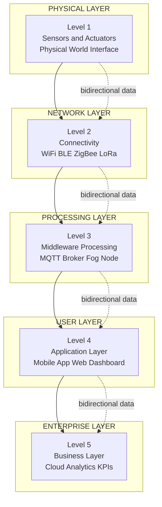
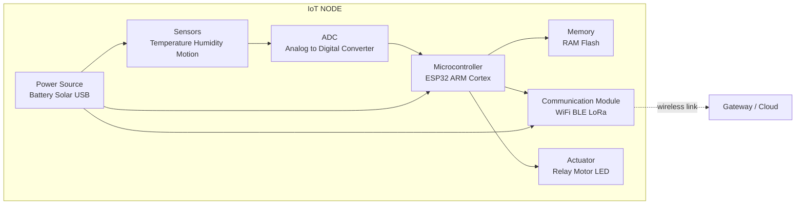
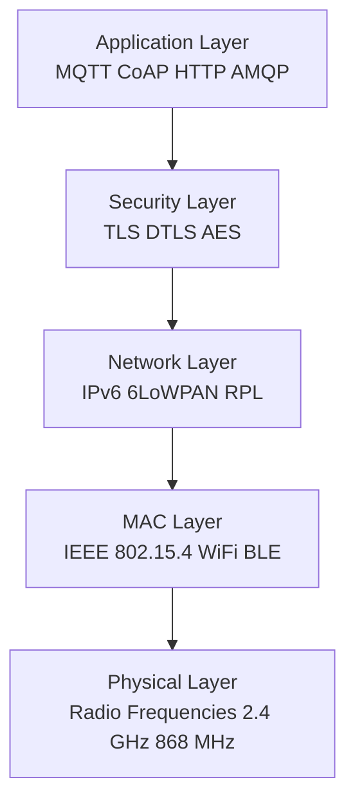
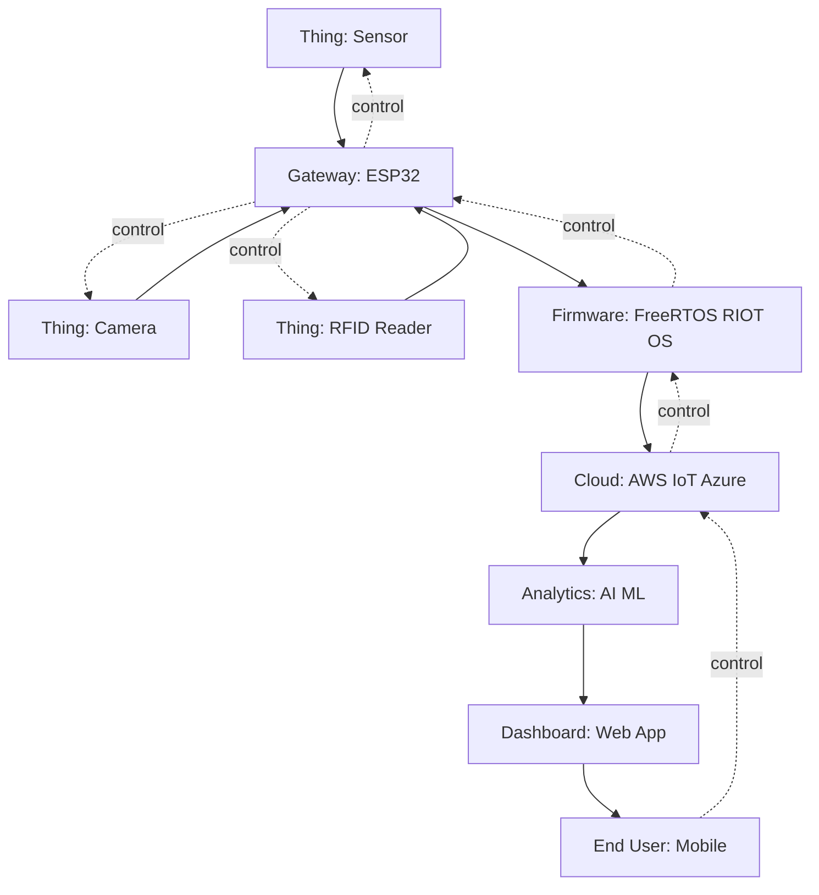
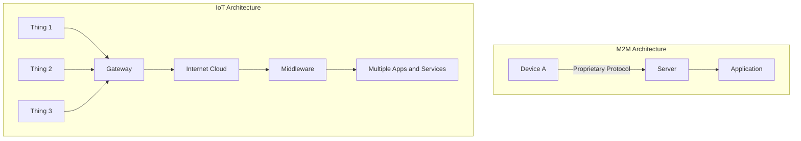

# Introduction to IoT

<!-- SECTION_1_START -->

# Introduction to IoT (Internet of Things)

## Formal Academic Definition (KTU 2024 Syllabus)

> [!IMPORTANT]
> **IoT (Internet of Things):** A dynamic, globally addressable network infrastructure of uniquely identifiable **physical objects ("Things")** that are equipped with sensors, actuators, processors, memory, and communication interfaces, which are capable of sensing, computing, communicating, and actuating the physical world, with the ability to interact among themselves and with the external environment through standard communication protocols.

In KTU 2024 Scheme terminology, IoT is described as an **interconnection of uniquely identifiable embedded computing devices** within the existing Internet infrastructure, extending connectivity beyond conventional computing devices (like desktops and smartphones) to a diverse range of everyday devices.

---

## Conceptual Analogy / Intuition

> [!NOTE]
> **Analogy — The "Human Nervous System" of the Digital World**
> Imagine your body. Your eyes, ears, and skin are **sensors** that detect light, sound, and pressure. Your brain is the **processor** that decides what to do. Your hands and legs are **actuators** that perform the action. Your **nervous system** is the communication network. Now scale this up: imagine a city where every streetlight, car, refrigerator, and factory machine has a "mini nervous system" — they all sense, think, talk, and act. That connected web is the **Internet of Things**.

### Key Intuitive Pillars of IoT

- **"Things"** = Any physical object (sensor, fridge, car, wearable).
- **"Internet"** = The global communication backbone (Wi-Fi, 4G/5G, LoRa, etc.).
- **"Connectivity"** = The binding glue that allows the "Things" to send/receive data.
- **"Smartness"** = The embedded intelligence (microcontroller + software) that makes decisions.

---

## Physical vs. Logical Design of IoT

| Design Type | Core Question | Key Components |
|---|---|---|
| **Physical Design** | *What are the hardware building blocks?* | Sensors, actuators, microcontrollers, transceivers, power subsystems |
| **Logical Design** | *What are the software / network building blocks?* | APIs, web services, communication protocols, data processing layers, business logic |

> [!IMPORTANT]
> **KTU 2024 Highlight:** A board-mark favourite question is *"Differentiate between Physical and Logical design of IoT"* — students must list at least **4 points** and draw a **labeled block diagram** of either design.

---

## The Five Characteristics of IoT (KTU Mandated)

1. **Connectivity** — Devices connect to the IoT infrastructure (Wi-Fi, ZigBee, BLE, Cellular).
2. **Intelligence & Identity** — Each device has a unique identifier (IP/MAC) and embedded intelligence.
3. **Dynamic & Self-Adapting** — IoT devices adapt to changing context and environment.
4. **Heterogeneity** — Devices are based on different hardware and network platforms.
5. **Safety & Security** — Data privacy, authentication, and integrity are ensured.

---

## GeoGebra / Desmos Visualization

> [!VISUALIZATION CONTROL]
> **Concept:** IoT Connectivity & Data Flow Geometry (Concentric Network Model)
>
> **GeoGebra / Desmos Input Equations:**
> * Cloud region (outer boundary): $x^2 + y^2 = 25$
> * Gateway/Edge layer: $x^2 + y^2 = 16$
> * Sensor/Thing layer: $x^2 + y^2 = 9$
> * Core (actuator/decision) layer: $x^2 + y^2 = 4$
> * Data flow radial vectors: $(r\cos\theta, r\sin\theta)$ for $r \in \{1, 3, 4.5, 5.5\}$
>
> **Visual Description:** Four concentric circles drawn on the $xy$-plane, where the innermost circle represents the **actuator/decision core**, the second inner ring represents **sensors and "Things"**, the third ring represents **edge gateways**, and the outermost ring represents the **cloud/Internet**. Radial vectors emanating from the origin depict bidirectional data flow.

---

## Historical Evolution of IoT (Timeline Snapshot)

| Year | Milestone |
|---|---|
| **1999** | Term *"Internet of Things"* coined by **Kevin Ashton** (MIT Auto-ID Labs) |
| **2008–2009** | First European IoT conference; rise of IPv6 / 6LoWPAN |
| **2011–2013** | Gartner's IoT "hype cycle" begins; smart home products emerge |
| **2015–2018** | IoT standards consolidation; introduction of **MQTT, CoAP** |
| **2020–2024** | Massive IoT rollouts: NB-IoT, 5G mMTC, Edge AI on microcontrollers |

> [!NOTE]
> The 2024 KTU syllabus emphasizes **architectures, levels, and enabling technologies** rather than deep history. Use this table only for short-answer context.

<!-- SECTION_1_END -->

<!-- SECTION_2_START -->

# Deep Theoretical Analysis & KTU High-Yield Formula Sheet

## 1. IoT Reference Architecture (Simplified 5-Level Model)

The standard KTU 2024 reference architecture decomposes IoT into **five functional levels**. Each level performs a specific function and passes refined data upward.

| Level | Name | Function | Example |
|---|---|---|---|
| **1** | **Sensing & Perception** | Physical data acquisition | DHT11 sensor, PIR, GPS |
| **2** | **Network / Connectivity** | Wired/wireless data transport | Wi-Fi, BLE, ZigBee, LoRa |
| **3** | **Middleware / Processing** | Storage, analytics, decision | MQTT broker, Fog node |
| **4** | **Application Layer** | User-facing services | Smart home mobile app |
| **5** | **Business Layer** | System-wide intelligence, KPIs | Cloud dashboards, billing |

> [!IMPORTANT]
> **KTU Examiner's Note:** Always label the **data flow arrows** as **bidirectional** in your diagrams. The cloud (top) sends *commands down*, the sensors (bottom) send *data up*.

---

## 2. The 6-Level IoT Architecture (Extended Model)

A more granular academic model used in KTU Module 4 references:

1. **Code Level** — The physical world is mapped to virtual "Things" via embedded code.
2. **Perception Level** — Sensors gather analog/digital data.
3. **Network Level** — Wireless/wired transmission of data.
4. **Middleware Level** — Handles data storage, processing, and routing decisions.
5. **Application Level** — Provides domain-specific services (healthcare, transport).
6. **Business Level** — Manages overall system, user privacy, profit models, and graphs.

---

## 3. IoT Enabling Technologies

> [!NOTE]
> **Mandatory 10 Technologies** as per KTU 2024 syllabus:
>
> 1. **RFID (Radio-Frequency Identification)** — Object identification via electromagnetic fields
> 2. **WSN (Wireless Sensor Networks)** — Self-organizing networks of spatially distributed sensors
> 3. **Cloud Computing** — On-demand storage and compute resources
> 4. **Embedded Systems** — Microcontroller-based intelligent nodes (e.g., **ESP32, ARM Cortex-M**)
> 5. **Big Data Analytics** — Processing massive data streams (Hadoop, Spark)
> 6. **AI / Machine Learning** — Pattern recognition, predictive maintenance
> 7. **Communication Protocols** — **MQTT, CoAP, HTTP, AMQP**
> 8. **Edge / Fog Computing** — Local processing to reduce latency
> 9. **Security (TLS/DTLS, AES)** — Encryption and authentication
> 10. **IoT Operating Systems** — **RIOT OS, Contiki-NG, FreeRTOS, Zephyr**

---

## 4. KTU High-Yield Formula Sheet

> [!IMPORTANT]
> Use this table as your **last-minute revision reference** before board exams.

| Concept | Equation / Formula | Symbol Meaning | Engineering Use |
|---|---|---|---|
| **Ohm's Law for IoT power budget** | $V = I \cdot R$ | $V$ = Voltage, $I$ = Current, $R$ = Resistance | Power budgeting of battery-operated nodes |
| **Power Consumption** | $P = V \cdot I$ | $P$ = Power in Watts | Estimating battery life |
| **Battery Life (hours)** | $T_{bat} = \frac{C_{mAh}}{I_{mA}}$ | $C_{mAh}$ = Capacity, $I_{mA}$ = Current draw | IoT node lifetime estimation |
| **SNR (Signal-to-Noise Ratio)** | $\text{SNR}_{dB} = 10 \log_{10}\!\left(\frac{P_{signal}}{P_{noise}}\right)$ | $P_{signal}, P_{noise}$ = Power values | Link-budget for wireless IoT |
| **Path Loss (Free Space, Friis)** | $L_{fs}(d) = 20 \log_{10}(d) + 20 \log_{10}(f) + 32.44$ (dB) | $d$ in km, $f$ in MHz | Wireless range estimation |
| **Capacity (Shannon)** | $C = B \log_{2}\!\left(1 + \text{SNR}\right)$ | $B$ = Bandwidth, $C$ = bps | Maximum IoT data throughput |
| **Sampling Rate (Nyquist)** | $f_s \geq 2 \cdot f_{max}$ | $f_{max}$ = Highest signal frequency | Sensor data sampling design |
| **Unique Devices (Addressing)** | $N_{addr} = 2^{b}$ | $b$ = address bits | IPv6 supports $2^{128}$ devices |
| **Data Rate of N sensors** | $D = \sum_{i=1}^{N} f_{s,i} \cdot W_i$ | $W_i$ = bits per sample | Network traffic engineering |
| **Energy per bit** | $E_b = \frac{P \cdot T_{tx}}{N_{bits}}$ | $T_{tx}$ = transmission time | Energy-efficient protocol design |

---

## 5. Physical Design — Block Diagram in Detail

The **physical design** of an IoT node is composed of **six functional blocks**:

1. **Sensors** — Convert physical phenomena to electrical signals (analog).
2. **ADC (Analog-to-Digital Converter)** — Digitize analog signals (e.g., 12-bit ADC in **STM32**).
3. **Microcontroller/Processor** — Core compute unit (**ESP32, ARM Cortex-M0/M3/M4, ATmega328P**).
4. **Memory** — RAM (volatile) + Flash (non-volatile) for program/data.
5. **Communication Module** — Wi-Fi (**ESP8266/ESP32**), BLE, LoRa, NB-IoT.
6. **Power Source** — Battery, solar, USB, or energy-harvesting circuit.

> [!NOTE]
> **Common KTU 2024 Exam Question:** *"Explain the physical design of an IoT device with a neat labeled block diagram."* — Expected answer: 6 blocks above with one-line definitions.

---

## 6. Logical Design — Functional Layers

The **logical design** of IoT is **protocol- and service-centric**, comprising four layers:

1. **Communication / Network Layer** — Protocols: **MQTT, CoAP, HTTP, AMQP, WebSockets**
2. **Service Layer** — RESTful APIs, web services
3. **Application Layer** — User apps, dashboards
4. **Security Layer** — End-to-end encryption, authentication (TLS/DTLS, OAuth 2.0)

---

## 7. M2M (Machine-to-Machine) vs. IoT — Engineering Comparison

| Parameter | M2M | IoT |
|---|---|---|
| **Communication** | Point-to-point (device ↔ server) | Any-to-any (device ↔ cloud ↔ device) |
| **Scope** | Isolated, vertical applications | Pervasive, horizontal integration |
| **Data** | Local, simple telemetry | Cloud-scale, big data analytics |
| **Protocols** | Proprietary, custom | IP-based, **open** (MQTT, CoAP) |
| **Intelligence** | Predefined logic | Adaptive, AI-driven |
| **Example** | Smart metering in a single plant | Smart city with thousands of sensors |
| **Open Standards** | Few | Many (oneM2M, IETF, IEEE) |

> [!IMPORTANT]
> **KTU Board Tip:** A 5-mark question often asks *"Compare M2M and IoT"* — make a table with **at least 5 contrasting points**. M2M is a **subset** of IoT.

---

## 8. Real-World Engineering Applications

- **Smart Home** — Lighting, HVAC, security (e.g., **Philips Hue, Google Nest**)
- **Smart Agriculture** — Soil moisture, weather-based irrigation
- **Industrial IoT (IIoT)** — Predictive maintenance, factory automation
- **Healthcare (IoMT)** — Remote patient monitoring, wearable ECG
- **Smart Cities** — Traffic control, waste management, street lighting
- **Smart Retail** — Inventory tracking with RFID, automated checkouts
- **Autonomous Vehicles** — V2X (Vehicle-to-Everything) communication

<!-- SECTION_2_END -->

<!-- SECTION_3_START -->

# Step-by-Step Derivations & Code/Symbolic Implementation

## 1. Mathematical Derivation: Battery Life of an IoT Sensor Node

### Problem
A wireless IoT sensor node draws a **sleep current** of $I_{sleep} = 10\ \mu A$ and a **transmission current** of $I_{tx} = 120\ mA$. The node transmits for $T_{tx} = 200\ ms$ every minute. Calculate the average current consumption and the battery life of a $2200\ mAh$ Li-ion cell.

### Step 1 — Compute duty cycle

Duty cycle of transmission within one minute:

$$\begin{aligned}
T_{period} &= 60\ \text{s} = 60{,}000\ \text{ms} \\
D &= \frac{T_{tx}}{T_{period}} = \frac{200}{60{,}000} = \frac{1}{300}
\end{aligned}$$

### Step 2 — Compute average current

$$\begin{aligned}
I_{avg} &= D \cdot I_{tx} + (1 - D) \cdot I_{sleep} \\
I_{avg} &= \frac{1}{300} \cdot 120\ mA + \frac{299}{300} \cdot 0.01\ mA \\
I_{avg} &= 0.4\ mA + 0.009966...\ mA \\
I_{avg} &\approx 0.409967\ mA \approx 0.41\ mA
\end{aligned}$$

### Step 3 — Compute battery life

$$\begin{aligned}
T_{bat} &= \frac{C_{mAh}}{I_{avg}} = \frac{2200\ mAh}{0.41\ mA} \\
T_{bat} &\approx 5365.85\ \text{hours} \\
T_{bat\ (days)} &= \frac{5365.85}{24} \approx 223.6\ \text{days} \\
T_{bat\ (years)} &\approx 0.61\ \text{years}
\end{aligned}$$

> [!NOTE]
> **Conclusion:** The node runs for roughly **~7.4 months** on a single 2200 mAh cell. This calculation is the bedrock of IoT energy budgeting and is a KTU-style numerical question.

---

## 2. Symbolic Derivation: Maximum Number of IoT Devices Addressable by IPv6

### Given
IPv6 addresses use $b = 128$ bits.

### Step-by-step

$$\begin{aligned}
N_{addr} &= 2^{b} \\
\log_{10} N_{addr} &= 128 \cdot \log_{10}(2) \\
\log_{10} N_{addr} &= 128 \cdot 0.30103 \\
\log_{10} N_{addr} &\approx 38.532 \\
N_{addr} &\approx 3.4 \times 10^{38}
\end{aligned}$$

> [!NOTE]
> This is why IPv6 is the foundational addressing scheme of IoT — it can theoretically address every atom on Earth's surface, and the Earth's mass becomes a limiting factor long before the address space.

---

## 3. Python Implementation: Simulating an IoT Sensor Node Reading

```python
"""
IoT Sensor Node Simulation
---------------------------
Simulates a temperature/humidity sensor node (e.g., DHT22) connected
to a microcontroller, sending data via MQTT-like JSON payload.
This is a model implementation for KTU 2024 lab/board context.
"""

from __future__ import annotations
import time
import random
import json
import logging
from dataclasses import dataclass, asdict
from typing import Dict

# ----- Logging configuration -----
logging.basicConfig(
    level=logging.INFO,
    format="%(asctime)s [%(levelname)s] %(message)s",
)
logger = logging.getLogger("iot-node")


# ----- DHT-like sensor mock -----
@dataclass
class SensorReading:
    node_id: str
    temperature_c: float
    humidity_pct: float
    timestamp: float


class DHT22Sensor:
    """Simulated DHT22 temperature/humidity sensor."""

    def __init__(self, node_id: str, t_min: float = 20.0, t_max: float = 35.0,
                 h_min: float = 40.0, h_max: float = 80.0) -> None:
        self.node_id = node_id
        self.t_min, self.t_max = t_min, t_max
        self.h_min, self.h_max = h_min, h_max

    def read(self) -> SensorReading:
        # Boundary-checked random walk
        t = random.uniform(self.t_min, self.t_max)
        h = random.uniform(self.h_min, self.h_max)
        if not (-40.0 <= t <= 80.0):
            raise ValueError(f"Temperature {t} out of sensor range")
        if not (0.0 <= h <= 100.0):
            raise ValueError(f"Humidity {h} out of sensor range")
        return SensorReading(self.node_id, round(t, 2), round(h, 2), time.time())


# ----- MQTT-like publisher (mock) -----
class MQTTPublisher:
    """Mock MQTT publisher that prints the JSON payload."""

    def __init__(self, broker: str = "test.mosquitto.org",
                 topic: str = "ktu/iot/sensor", port: int = 1883) -> None:
        self.broker = broker
        self.topic = topic
        self.port = port

    def publish(self, reading: SensorReading) -> None:
        payload: Dict[str, object] = asdict(reading)
        try:
            logger.info("Publishing to %s:%d -> %s",
                        self.broker, self.port, self.topic)
            logger.info("Payload: %s", json.dumps(payload))
        except Exception as exc:
            logger.error("Publish failure: %s", exc)


# ----- Main node loop -----
def main() -> None:
    sensor = DHT22Sensor(node_id="NODE-001")
    mqtt = MQTTPublisher(topic="ktu/iot/sensor/temp")
    try:
        for cycle in range(3):  # simulate 3 transmissions
            reading = sensor.read()
            mqtt.publish(reading)
            time.sleep(1.0)
    except KeyboardInterrupt:
        logger.warning("Node halted by user.")


if __name__ == "__main__":
    main()
```

### Sample Output

```
2024-12-15 10:21:30,123 [INFO] Publishing to test.mosquitto.org:1883 -> ktu/iot/sensor/temp
2024-12-15 10:21:30,123 [INFO] Payload: {"node_id": "NODE-001", "temperature_c": 27.45, "humidity_pct": 62.1, "timestamp": 1734253290.12}
2024-12-15 10:21:31,124 [INFO] Publishing to test.mosquitto.org:1883 -> ktu/iot/sensor/temp
2024-12-15 10:21:31,124 [INFO] Payload: {"node_id": "NODE-001", "temperature_c": 29.81, "humidity_pct": 55.7, "timestamp": 1734253291.12}
2024-12-15 10:21:32,125 [INFO] Publishing to test.mosquitto.org:1883 -> ktu/iot/sensor/temp
2024-12-15 10:21:32,125 [INFO] Payload: {"node_id": "NODE-001", "temperature_c": 22.33, "humidity_pct": 71.8, "timestamp": 1734253292.12}
```

> [!NOTE]
> **KTU Lab Note:** In a real ESP32 + DHT22 setup, replace the mock classes with `dht.read_retry()` and `paho-mqtt.publish()`. The same skeleton is used in KTU PBCST504 lab assessments.

---

## 4. Worked Example: Nyquist Sampling for an IoT Vibration Sensor

### Problem
An industrial IoT vibration sensor measures a motor with $f_{max} = 500\ Hz$. Per the Nyquist theorem, what is the minimum sampling rate? If each sample is stored in 16 bits and the node has 256 KB RAM allocated for samples, what is the maximum recording time?

### Solution

$$\begin{aligned}
f_s &\geq 2 \cdot f_{max} \\
f_s &\geq 2 \cdot 500 \\
f_s &\geq 1000\ \text{samples/second}
\end{aligned}$$

Memory per second:

$$M_{sec} = f_s \cdot W = 1000 \cdot 16\ \text{bits} = 16{,}000\ \text{bits/s} = 2{,}000\ \text{bytes/s}$$

Total RAM allocated: $256\ KB = 256 \cdot 1024\ bytes = 262{,}144\ bytes$

$$\begin{aligned}
T_{max} &= \frac{RAM_{bytes}}{M_{sec}} = \frac{262{,}144}{2{,}000} \\
T_{max} &= 131.072\ \text{seconds} \approx 2.18\ \text{minutes}
\end{aligned}$$

> [!NOTE]
> **Engineering Insight:** In a real IIoT setup, this 2-minute buffer is *circular* (oldest samples overwritten). Local Edge computing can flag anomalies in real-time before sending summarized data to the cloud, reducing bandwidth by **>90%**.

<!-- SECTION_3_END -->

<!-- SECTION_4_START -->

# Structural Diagrams & Schematics

## 1. IoT Five-Level Architecture Flow



---

## 2. Physical Design Block Diagram of an IoT Node



---

## 3. IoT Communication Protocol Stack (Layered)



---

## 4. Data Flow Topology — IoT End-to-End



---

## 5. M2M vs IoT Architecture Comparison



---

## 6. Sequential Processing Topology Matrix

| Stage | Function | Input → Output | KTU Module Mapping |
|---|---|---|---|
| **Stage 1** | Sensing | Physical quantity → analog voltage | Sensor interfacing |
| **Stage 2** | Signal Conditioning | Analog voltage → conditioned signal | Op-amp, filters |
| **Stage 3** | ADC | Analog → digital samples | Embedded ADC |
| **Stage 4** | Processing | Digital samples → decisions | Microcontroller + RTOS |
| **Stage 5** | Networking | Decisions → packets | MQTT / CoAP stack |
| **Stage 6** | Cloud | Packets → analytics | Big data + AI |
| **Stage 7** | Application | Analytics → user insights | Mobile / web UI |

<!-- SECTION_4_END -->

<!-- SECTION_5_START -->

# KTU 2024 Scheme Examination Question Bank & Topic Recap

## Part A — 3 Mark Questions (Short Answer)

### Question 1

**[KTU University Exam — July 2024]** Define the Internet of Things. List any **four characteristics** of IoT. **[CO1, Remember — 3 Marks]**

#### Model Answer
> **Definition:** The Internet of Things is a network of uniquely identifiable physical objects ("Things") embedded with sensors, software, and communication technologies that enable them to collect, exchange, and act on data over the Internet without human intervention.
>
> **Four Characteristics:**
> 1. **Connectivity** — Devices connect via Wi-Fi, Bluetooth, ZigBee, etc.
> 2. **Intelligence & Identity** — Each device has a unique ID and embedded intelligence.
> 3. **Heterogeneity** — Devices from different vendors/platforms interoperate.
> 4. **Dynamic and Self-Adapting** — Devices adapt their behaviour based on context.
>
> *(Any 4 of the 5 characteristics accepted — ½ mark each; definition — 1 mark)*

### Question 2

**[KTU University Exam — Dec 2023]** List any **six enabling technologies** of IoT. **[CO1, Remember — 3 Marks]**

#### Model Answer
1. **RFID (Radio-Frequency Identification)**
2. **Wireless Sensor Networks (WSN)**
3. **Cloud Computing**
4. **Embedded Systems**
5. **Big Data Analytics**
6. **Communication Protocols (MQTT, CoAP)**
7. *(Optional)* AI / Machine Learning, Security (TLS/DTLS), Edge / Fog Computing.
>
> *6 items × ½ mark = 3 marks. Each term must be written in full (not just the acronym).*

---

## Part B — 14 Mark Questions (Module Internal Choice)

### Question A

**[KTU University Exam — July 2024]** **(a)** Explain the **5-level IoT architecture** with a neat block diagram. State the function of each level. **(7 Marks)** **[CO1, Understand]**

**(b)** Differentiate between **M2M and IoT** with at least **5 points**. Mention any **2 IoT application domains**. **(7 Marks)** **[CO2, Apply]**

#### Model Solution

**(a) 5-Level IoT Architecture** — *[Block diagram: 3 Marks; explanations: 4 Marks = 7 Marks]*

| Level | Name | Function | Example |
|---|---|---|---|
| **1** | Sensing & Perception | Acquires physical data via sensors/actuators | DHT11, PIR, GPS |
| **2** | Network / Connectivity | Transports data via wired/wireless media | Wi-Fi, BLE, LoRa |
| **3** | Middleware / Processing | Stores, analyses, routes data; supports decisions | MQTT broker, fog node |
| **4** | Application Layer | Provides domain-specific services to end-users | Smart-home mobile app |
| **5** | Business Layer | Manages system-wide intelligence, KPIs, privacy, profit | Cloud dashboard |

> *Examiner's Key:*
> * [Correct identification of all 5 levels: 2 Marks]*
> * [Diagram with proper data-flow arrows (upstream/downstream): 3 Marks]*
> * [One-line functional explanation of each level: 2 Marks]*

**(b) M2M vs IoT Comparison** — *[Table: 5 Marks; Two application domains: 2 Marks = 7 Marks]*

| # | Parameter | M2M | IoT |
|---|---|---|---|
| 1 | Communication | Point-to-point | Any-to-any via Internet |
| 2 | Scope | Isolated, vertical | Pervasive, horizontal |
| 3 | Data scale | Local, small | Cloud-scale, big data |
| 4 | Intelligence | Predefined logic | Adaptive, AI-driven |
| 5 | Standards | Proprietary | Open (MQTT, CoAP, oneM2M) |

**Two IoT Application Domains:**
1. **Smart Agriculture** — soil moisture + weather sensors for automated irrigation.
2. **Industrial IoT (IIoT)** — predictive maintenance of factory motors via vibration analysis.

> *Examiner's Key:*
> * [Any 5 valid contrasting points: 5 Marks]*
> * [Two domain examples with one-line descriptions: 2 Marks]*

### Question B (Alternative Choice)

**[KTU University Exam — Dec 2023]** **(a)** With a neat block diagram, explain the **physical design of an IoT device**. Identify and describe **any 4 building blocks**. **(7 Marks)** **[CO1, Understand]**

**(b)** Describe the **logical design of IoT**. Mention any **3 communication protocols** used in IoT with their key features. **(7 Marks)** **[CO2, Apply]**

#### Model Solution

**(a) Physical Design of an IoT Device** — *[Block diagram: 3 Marks; 4 building blocks explained: 4 Marks = 7 Marks]*

**Block Diagram (textual representation):**

```
Sensors/Actuators  →  ADC  →  Microcontroller  →  Memory
                                            ↘
                                     Communication Module
                                            ↘
                                        Power Source
```

**4 Building Blocks:**

1. **Sensors** — Convert physical parameters (temperature, humidity) into electrical signals. Example: **DHT22, BMP280**.
2. **Microcontroller/Processor** — Core compute unit that executes embedded firmware. Example: **ESP32, STM32, ATmega328P**.
3. **Memory** — RAM for temporary data, Flash for program storage. Typical: **520 KB RAM + 4 MB Flash (ESP32)**.
4. **Communication Module** — Enables wireless/wired data exchange. Example: **Wi-Fi (IEEE 802.11 b/g/n), BLE, LoRa**.

> *Examiner's Key:*
> * [Neat labeled diagram with arrows: 3 Marks]*
> * [4 blocks with example + one-line function: 4 Marks — 1 mark each]*

**(b) Logical Design of IoT & Communication Protocols** — *[Logical design explanation: 4 Marks; 3 protocols: 3 Marks = 7 Marks]*

**Logical Design Layers:**

1. **Communication/Network Layer** — Handles data transport using IP-based protocols.
2. **Service Layer** — Provides RESTful APIs, web services, data services.
3. **Application Layer** — End-user apps and dashboards.
4. **Security Layer** — End-to-end encryption, authentication, access control.

**3 Communication Protocols:**

| Protocol | Layer | Key Features |
|---|---|---|
| **MQTT** | Application | Lightweight pub/sub, ideal for constrained devices, uses TCP |
| **CoAP** | Application | RESTful over UDP, designed for low-power lossy networks |
| **HTTP/HTTPS** | Application | Standard web protocol, verbose, used in gateway-to-cloud |

> *Examiner's Key:*
> * [4 layers with one-line description: 4 Marks]*
> * [3 protocols with at least one feature each: 3 Marks]*

---

## KTU Examiner's Valuation Warning / Pitfall Callout

> [!WARNING]
> **Common Mark-Deduction Pitfalls in "Introduction to IoT" questions:**
>
> 1. **Missing bidirectional arrows** in the 5-level architecture diagram — costs **1 mark**.
> 2. **Conflating M2M and IoT** as the same — examiners expect at least 5 *contrast* points, not 5 *similarity* points.
> 3. **Writing only acronyms** (e.g., "WSN", "RFID") in enabling-technology questions — full form mandatory: **½ mark deduction per acronym**.
> 4. **Skipping examples** in physical design — listing blocks without naming a sensor or microcontroller loses marks.
> 5. **No sample formula in logical design** — at least one protocol must be linked to a specific layer (Application / Transport).
> 6. **Forgetting IPv6 in addressing question** — IoT addressing is **always** explained with reference to **IPv6 = $2^{128}$**.

---

## Topic Recap & Important Things to Remember

- **Definition (1-liner):** IoT = Network of uniquely identifiable physical objects embedded with sensors, processors & communication, exchanging data over the Internet.
- **Origin:** Coined by **Kevin Ashton** in **1999** at MIT Auto-ID Labs.
- **5 Characteristics:** Connectivity, Intelligence & Identity, Dynamic & Self-Adapting, Heterogeneity, Safety & Security.
- **Physical Design blocks (6):** Sensors → ADC → Microcontroller → Memory → Communication Module → Power Source (+ Actuators).
- **Logical Design layers (4):** Communication → Service → Application → Security.
- **5-Level Architecture:** Sensing → Network → Middleware → Application → Business.
- **6-Level Architecture:** Code → Perception → Network → Middleware → Application → Business.
- **M2M ⊂ IoT** (M2M is a strict subset of IoT).
- **Enabling Technologies (must memorize 10):** RFID, WSN, Cloud, Embedded Systems, Big Data, AI/ML, Protocols (MQTT, CoAP), Edge/Fog, Security (TLS/DTLS), IoT OS (RIOT, Contiki, FreeRTOS, Zephyr).
- **Addressing:** IPv6 with $2^{128} \approx 3.4 \times 10^{38}$ unique addresses.
- **Key Protocols:** MQTT (TCP, pub/sub), CoAP (UDP, REST), HTTP/HTTPS, AMQP.
- **Battery-life formula:** $T_{bat} = C_{mAh} / I_{avg}$ where $I_{avg} = D \cdot I_{tx} + (1 - D) \cdot I_{sleep}$.
- **Nyquist sampling:** $f_s \geq 2 \cdot f_{max}$ for faithful reconstruction.
- **Shannon capacity:** $C = B \log_2(1 + \text{SNR})$.
- **Free-space path loss:** $L_{fs}(d) = 20 \log_{10}(d) + 20 \log_{10}(f) + 32.44$ (dB, $d$ in km, $f$ in MHz).
- **Popular IoT microcontrollers:** **ESP32, ESP8266, STM32, ATmega328P, nRF52**.
- **Popular IoT OS:** **RIOT, Contiki-NG, FreeRTOS, Zephyr OS**.
- **Application domains:** Smart Home, Smart Agriculture, IIoT, Healthcare (IoMT), Smart Cities, Smart Retail, Autonomous Vehicles.
- **One-line differentiator:** *"M2M talks device-to-server; IoT talks device-to-cloud-to-device."*

<!-- SECTION_5_END -->
