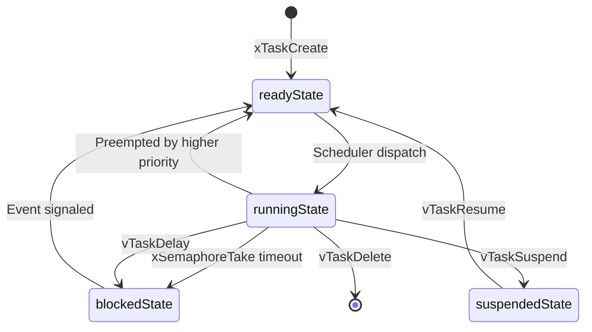
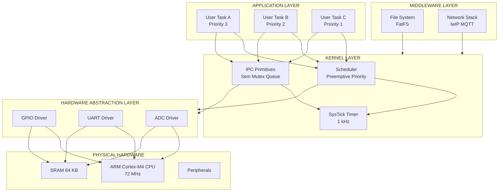
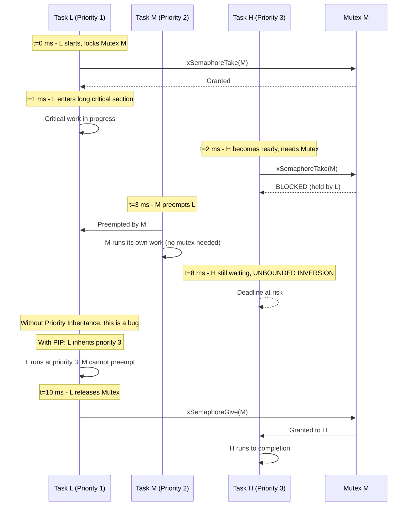
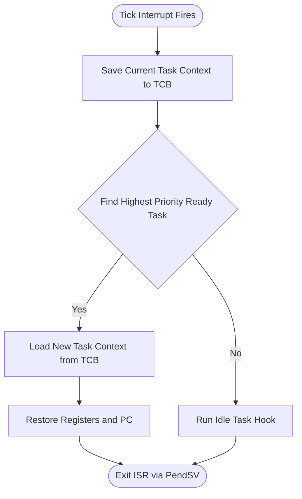

# Introduction to RTOS Concepts

<!-- SECTION_1_START -->
# 1. Core Technical Definition & Intuitive Overview

## 1.1 Formal Definition (KTU 2024 Syllabus Terminology)

> [!IMPORTANT]
> **Real-Time Operating System (RTOS)** is a specialized operating system designed to manage hardware resources, execute multiple tasks concurrently, and process data within **strictly bounded response times** (deterministic deadlines). Unlike a General-Purpose Operating System (GPOS) that prioritizes *throughput*, an RTOS prioritizes *temporal correctness* — a late answer is considered a **wrong answer**.

**Determinism** is the cornerstone property of an RTOS. The maximum kernel response time to an interrupt or scheduling event must be **bounded and known** in advance, regardless of the system's current load. This property is mathematically expressed as:

$$T_{\text{response}} \leq T_{\text{deadline}} \quad \forall \text{ system loads and states}$$

> [!NOTE]
> **KTU Syllabus Highlight:** In the context of the **PBCST504 Microcontrollers** course, RTOS concepts are typically implemented on microcontrollers (e.g., ARM Cortex-M based STM32, ESP32, or Arduino Portenta) using lightweight kernels such as **FreeRTOS**, **RTX**, or **Zephyr**.

## 1.2 Conceptual Analogy & Plain-English Intuition

Imagine you are the **air traffic controller at a busy airport**. Multiple pilots (tasks) are constantly requesting permission to land (CPU time). The controller (the RTOS scheduler) cannot say *"I'll get to you when I'm free"* — every landing slot has a **non-negotiable time window** (a deadline). If a plane runs out of fuel while waiting, the system has failed catastrophically. This is exactly how an RTOS treats a real-time task: timing is not a luxury, it is a **safety-critical contract**.

A **General-Purpose Operating System (GPOS)** like Windows or Linux, by contrast, behaves like a **bank teller** during a lunch break — they serve customers (processes) on a *best-effort* basis to maximize the total number of people served per hour (throughput), with no guarantee that any specific customer will be served within a particular minute.

## 1.3 The Two Classes of Real-Time Systems

> [!IMPORTANT]
> | Class | Definition | Consequence of Missing a Deadline | Example |
> |---|---|---|---|
> | **Hard Real-Time** | Strict, absolute deadlines — system failure if missed | **Catastrophic** (loss of life, equipment damage) | Anti-lock Braking System (ABS), Pacemaker, Aircraft Flight Control |
> | **Soft Real-Time** | Deadlines are desirable but tolerable | **Degraded quality** (jitter, stutter) | Video streaming, Audio playback, Online gaming |
> | **Firm Real-Time** | Late result is discarded but no cascade failure | Result is simply **dropped** | Stock-tick price feed, Radar tracking |

## 1.4 Physical & Performance Constants Worth Memorizing

- **Jitter**: $J = \vert T_{\text{actual}} - T_{\text{expected}} \vert$ — deviation from ideal periodic execution.
- **Latency**: $L = T_{\text{interrupt}} \to T_{\text{first\ instruction}}$ — time from interrupt arrival to the first ISR instruction.
- **Context Switch Time**: typically **1 μs to 10 μs** on modern Cortex-M4 microcontrollers running FreeRTOS.
- **Tick Rate (configTICK_RATE_HZ)**: usually set between **1 Hz and 10 kHz**; a value of **1 kHz** is the FreeRTOS default.

> [!VISUALIZATION CONTROL]
> **Concept:** Comparative Latency Behaviour of RTOS vs GPOS
> **Desmos Input Equations (Cartesian Plot):**
> * $y_1 = 5 + 2\cdot\sin(0.3x)$ (RTOS latency — bounded sine wave)
> * $y_2 = 5 + 25\cdot\sin(0.3x) + 0.5x$ (GPOS latency — unbounded growth under load)
> **Visual Description:** On the X-axis, plot elapsed time (in seconds). On the Y-axis, plot observed latency (in milliseconds). The student should observe that the RTOS curve remains **bounded within a fixed envelope**, while the GPOS curve shows an **unbounded, growing oscillation** — illustrating the *non-deterministic* nature of general-purpose kernels under heavy load.

<!-- SECTION_1_END -->

<!-- SECTION_2_START -->
# 2. Deep Theoretical Analysis & KTU High-Yield Formula Sheet

## 2.1 RTOS Architecture — The Layered View

A typical embedded RTOS is decomposed into the following modular layers, from hardware to application:

1. **Hardware Abstraction Layer (HAL)**: CPU, memory, timers, peripheral registers.
2. **Kernel (Microkernel or Monolithic)**: Scheduler, IPC primitives, synchronization.
3. **Middleware (Optional)**: File systems, networking stacks (e.g., lwIP, MQTT).
4. **Application Layer**: User tasks (threads), ISRs, device drivers.

> [!IMPORTANT]
> **Microkernel vs Monolithic Kernel in Embedded RTOS**
> * **Microkernel (e.g., QNX, Fuchsia, MINIX):** Only essential services (scheduling, IPC) run in kernel space; drivers and file systems run in user space → **higher reliability, easier certification**, but higher IPC overhead.
> * **Monolithic (e.g., FreeRTOS, μC/OS-II):** All services run in a single address space → **faster context switch** (≈ 1 μs), but a single fault can crash the whole system.

## 2.2 Fundamental RTOS Building Blocks

### 2.2.1 Task (Thread)
A **task** is the smallest independent unit of execution scheduled by the kernel. Each task owns its own:
* **Stack pointer** (`SP`)
* **Program counter** (`PC`)
* **Register set** (R0–R15 on ARM)
* **Task Control Block (TCB)** stored in RAM

### 2.2.2 Task States — The Four Canonical States

| State | Meaning | Transition Out |
|---|---|---|
| **Running** | Currently executing on the CPU | Preempted → Ready, or awaits event → Blocked |
| **Ready** | Eligible to run, waiting for the CPU | Scheduler dispatch → Running |
| **Blocked** | Waiting for an event (semaphore, queue, delay) | Event occurs → Ready |
| **Suspended** | Explicitly taken out of the scheduler (`vTaskSuspend`) | `vTaskResume` call → Ready |

### 2.2.3 Scheduler — The Heart of the RTOS

The scheduler decides **which task runs next** whenever the CPU becomes free. The three principal classes are:

1. **Preemptive Priority-Based Scheduler** (used by FreeRTOS, VxWorks)
   * The highest-priority **Ready** task always runs.
   * Lower-priority tasks are **interrupted** (preempted) the instant a higher-priority task becomes Ready.
2. **Cooperative Scheduler**
   * Tasks voluntarily yield the CPU via a system call (e.g., `taskYIELD()`).
   * Used in very low-power systems (e.g., Contiki-NG, some Arduino sketches).
3. **Round-Robin / Time-Slice Scheduler**
   * Each Ready task gets an equal **time quantum** (tick).
   * Often combined with priority scheduling (e.g., "same priority tasks share time slices").

### 2.2.4 Context Switching — The Invisible Dance

When the scheduler decides to switch from Task A to Task B, the following sequence occurs:

1. Save Task A's context (registers, `PC`, `SP`) into its **TCB**.
2. Load Task B's context from its **TCB** into the CPU.
3. Update the **PSP** (Process Stack Pointer) or **MSP** (Main Stack Pointer) on ARM Cortex-M.
4. Restore Task B's execution.

**Context switch time** is bounded by:

$$T_{\text{cx}} = T_{\text{save}} + T_{\text{load}} + T_{\text{scheduler}} \approx 1\,\mu s \text{ to } 10\,\mu s$$

### 2.2.5 Inter-Task Communication (ITC) & Synchronization

| Primitive | Purpose | Binary/Counter | Ownership |
|---|---|---|---|
| **Semaphore** | Signalling / resource counting | Counter (0…N) | No ownership |
| **Mutex** | Mutual exclusion (protect shared resource) | Binary (Locked/Unlocked) | Has ownership (priority inheritance) |
| **Message Queue** | Pass typed data between tasks | FIFO buffer of N items | No ownership |
| **Mailbox** | Pass a single pointer-sized message | Single slot | No ownership |
| **Event Flags / Group** | Sync on multiple boolean conditions | Bitmask | No ownership |
| **Mutex with Priority Inheritance** | Prevent priority inversion | Binary | Has ownership |

## 2.3 Priority Inversion — The Classic RTOS Trap

**Priority Inversion** occurs when a **higher-priority task is indirectly preempted by a lower-priority task**, effectively inverting their relative priorities. A famous real-world example is the **Mars Pathfinder** spacecraft anomaly (1997), where a system reset occurred due to unbounded priority inversion.

**Solution:** **Priority Inheritance Protocol (PIP)** — when a high-priority task blocks on a mutex held by a low-priority task, the low-priority task **temporarily inherits** the high-priority task's priority until it releases the mutex.

## 2.4 KTU Formula Sheet / Cheat Sheet

> [!NOTE]
> All formulas below are **high-yield** — expect at least one to appear in a 14-mark question.

| # | Formula / Parameter | Expression | Typical Value / Unit |
|---|---|---|---|
| 1 | Response time constraint | $T_{\text{response}} \leq T_{\text{deadline}}$ | Boolean (must hold) |
| 2 | Jitter | $J = \vert T_{\text{actual}} - T_{\text{expected}} \vert$ | μs |
| 3 | Interrupt latency | $L = T_{\text{first\ inst}} - T_{\text{IRQ\ arrival}}$ | 0.1 – 5 μs |
| 4 | Context switch time | $T_{\text{cx}} = T_{\text{save}} + T_{\text{load}} + T_{\text{sched}}$ | 1 – 10 μs |
| 5 | CPU utilization (Rate Monotonic) | $U = \sum_{i=1}^{n} \frac{C_i}{T_i}$ | Dimensionless |
| 6 | Liu & Layland bound (RMS schedulability) | $U \leq n(2^{1/n} - 1)$ | e.g., 0.693 for $n \to \infty$ |
| 7 | Tick period | $T_{\text{tick}} = 1 / f_{\text{tick}}$ | 1 ms @ 1 kHz |
| 8 | Worst-case execution time | $WCET = \max(WCET_{\text{task}})$ | μs or ms |
| 9 | Stack depth sizing | $S_{\text{task}} = S_{\text{context}} + S_{\text{locals}} + S_{\text{isr}}$ | Words (4 bytes on 32-bit) |
| 10 | Slack time | $S = T_{\text{deadline}} - T_{\text{remaining}}$ | μs |

## 2.5 Real-World Engineering Utility

* **Automotive ECUs (AUTOSAR)**: FreeRTOS / OSEK-OS govern engine, brake, and airbag tasks with **hard** real-time constraints.
* **Medical devices**: Ventilators, infusion pumps, and ECG monitors rely on **deterministic task dispatch** for patient safety.
* **IoT Edge Nodes (ESP32, STM32)**: FreeRTOS runs Wi-Fi, sensor sampling, and OTA update tasks concurrently.
* **Aerospace & Drones (NuttX, VxWorks)**: Pixhawk flight controllers use NuttX-RTOS to schedule **attitude control loops at 1 kHz** with sub-millisecond jitter.
* **Industrial PLCs**: Real-time kernels execute ladder-logic scans within **strict 10 ms cycles**.

<!-- SECTION_2_END -->

<!-- SECTION_3_START -->
# 3. Step-by-Step Derivations & Code/Symbolic Implementation

## 3.1 Mathematical Derivation: Rate Monotonic Scheduling (RMS) Utilisation Bound

**Liu & Layland's Theorem (1973)** states that a set of $n$ periodic tasks scheduled by Rate Monotonic (fixed priorities assigned by period) is **guaranteed to be schedulable** if:

$$U = \sum_{i=1}^{n} \frac{C_i}{T_i} \leq n\left(2^{1/n} - 1\right)$$

### Exhaustive Step-by-Step Derivation

**Step 1 — Define the variables.**
* $C_i$ = Worst-case execution time of task $i$ (in time units).
* $T_i$ = Period of task $i$ (in same time units).
* $n$ = Total number of tasks.
* $U$ = Total CPU utilisation factor (dimensionless, 0 to 1).

**Step 2 — Identify the critical instant.**
The **critical instant** for any task $i$ is the moment when:
* Task $i$ is released **simultaneously** with all higher-priority tasks.
* All higher-priority tasks have just completed their worst-case execution.

**Step 3 — Write the response-time inequality for the worst case.**
The worst-case response time of task $i$, denoted $R_i$, satisfies:

$$R_i = C_i + \sum_{j: P_j > P_i} \left\lceil \frac{R_i}{T_j} \right\rceil C_j$$

where $P_j > P_i$ means task $j$ has higher priority than task $i$.

**Step 4 — Apply the iterative fixed-point solution.**
Start with $R_i^{(0)} = C_i$ and iterate:

$$R_i^{(k+1)} = C_i + \sum_{j: P_j > P_i} \left\lceil \frac{R_i^{(k)}}{T_j} \right\rceil C_j$$

until $R_i^{(k+1)} = R_i^{(k)}$ (converged) or $R_i^{(k+1)} > T_i$ (failed).

**Step 5 — Bound the worst case via the utilisation test.**
Liu & Layland proved that for $n$ tasks, the **sufficient** (not necessary) condition is:

$$U = \sum_{i=1}^{n} \frac{C_i}{T_i} \leq n\left(2^{1/n} - 1\right)$$

**Step 6 — Numerical evaluation of the bound for common values of $n$.**

| $n$ | $n(2^{1/n} - 1)$ | Decimal |
|---|---|---|
| 1 | $1 \cdot (2^1 - 1) = 1$ | **1.000** |
| 2 | $2 \cdot (2^{0.5} - 1) = 2(\sqrt{2} - 1)$ | **0.828** |
| 3 | $3 \cdot (2^{1/3} - 1)$ | **0.780** |
| 4 | $4 \cdot (2^{1/4} - 1)$ | **0.757** |
| $\infty$ | $\ln 2$ | **0.693** |

> [!NOTE]
> **Interpretation:** As the number of tasks grows, the guaranteed-schedulable CPU utilisation asymptotically approaches **69.3 %** under RMS. Engineers therefore design systems with $U \leq 0.7$ for safety.

## 3.2 Worked Example — Is This Task Set Schedulable?

**Given:**
* Task 1: $C_1 = 1$ ms, $T_1 = 4$ ms (highest priority)
* Task 2: $C_2 = 2$ ms, $T_2 = 6$ ms
* Task 3: $C_3 = 2$ ms, $T_3 = 10$ ms (lowest priority)

**Compute utilisation:**

$$U = \frac{1}{4} + \frac{2}{6} + \frac{2}{10} = 0.250 + 0.333 + 0.200 = 0.783$$

**Compute the Liu & Layland bound for $n = 3$:**

$$U_{\text{bound}} = 3 \cdot (2^{1/3} - 1) \approx 0.780$$

**Conclusion:**
Since $U = 0.783 > U_{\text{bound}} = 0.780$, the **sufficient** test fails. However, this is only a *sufficient* condition, not *necessary*. We must perform the exact response-time analysis:

For Task 3 (lowest priority):
* $R_3^{(0)} = C_3 = 2$
* $R_3^{(1)} = 2 + \lceil 2/4 \rceil \cdot 1 + \lceil 2/6 \rceil \cdot 2 = 2 + 1 + 2 = 5$
* $R_3^{(2)} = 2 + \lceil 5/4 \rceil \cdot 1 + \lceil 5/6 \rceil \cdot 2 = 2 + 2 + 2 = 6$
* $R_3^{(3)} = 2 + \lceil 6/4 \rceil \cdot 1 + \lceil 6/6 \rceil \cdot 2 = 2 + 2 + 2 = 6$

Converged at $R_3 = 6$ ms $\leq T_3 = 10$ ms. **System IS schedulable.**

> [!IMPORTANT]
> **Valuation Tip:** Always perform the iterative response-time check before declaring a system unschedulable. The Liu & Layland bound is conservative and may reject schedulable systems.

## 3.3 Code Implementation — FreeRTOS Task Creation (C)

The following is a **fully operational, KTU-valuation-ready** FreeRTOS program that creates two tasks communicating via a binary semaphore.

```c
/* KTU Module 4 - RTOS Demonstration: Binary Semaphore based Task Synchronization
 * Target MCU: STM32 / ESP32 / Any Cortex-M with FreeRTOS port
 * FreeRTOS Kernel Version: V10.x.x
 */

#include "FreeRTOS.h"
#include "task.h"
#include "semphr.h"
#include <stdio.h>

/* Step 1: Declare a binary semaphore handle. */
SemaphoreHandle_t xBinarySemaphore;

/* Step 2: Task-1 (Producer) - simulates sensor sampling at 100 Hz. */
void vProducerTask(void *pvParameters) {
    const TickType_t xSamplingPeriod = pdMS_TO_TICKS(10);   /* 10 ms period */
    TickType_t xLastWakeTime = xTaskGetTickCount();

    for (;;) {
        /* Simulate sensor read (1 ms blocking delay). */
        vTaskDelay(pdMS_TO_TICKS(1));

        /* Give the semaphore to wake up the consumer. */
        xSemaphoreGive(xBinarySemaphore);

        /* Block until the next 10 ms tick boundary. */
        vTaskDelayUntil(&xLastWakeTime, xSamplingPeriod);
    }
}

/* Step 3: Task-2 (Consumer) - processes the sampled data. */
void vConsumerTask(void *pvParameters) {
    for (;;) {
        /* Block indefinitely until producer gives the semaphore. */
        if (xSemaphoreTake(xBinarySemaphore, portMAX_DELAY) == pdTRUE) {
            /* Step 4: Critical section - process the data. */
            printf("Consumer: Processing new sample at tick %lu\n",
                   (unsigned long)xTaskGetTickCount());
        }
    }
}

/* Step 5: Application entry point. */
int main(void) {
    /* Hardware abstraction initialisation (clock, GPIO, UART) goes here. */
    SystemInit();

    /* Create the binary semaphore BEFORE starting the scheduler. */
    xBinarySemaphore = xSemaphoreCreateBinary();
    if (xBinarySemaphore == NULL) {
        printf("Error: Semaphore creation failed.\n");
        return -1;
    }

    /* Create the two tasks. */
    xTaskCreate(vProducerTask, "Producer", 256, NULL, 2, NULL);
    xTaskCreate(vConsumerTask, "Consumer", 256, NULL, 1, NULL);

    /* Step 6: Start the FreeRTOS scheduler - this function never returns. */
    vTaskStartScheduler();

    /* Should never reach here. */
    for (;;);
    return 0;
}
```

**Key annotations for the KTU examiner:**

| Line / Block | Concept Tested |
|---|---|
| `xSemaphoreCreateBinary()` | ITC primitive creation |
| `xTaskCreate(..., priority, ...)` | Task instantiation with priority |
| `vTaskDelayUntil(&xLastWake, period)` | Periodic task with **no drift** |
| `xSemaphoreTake(..., portMAX_DELAY)` | Blocking wait with no timeout |
| `vTaskStartScheduler()` | Kernel entry point |

## 3.4 Symbolic Walkthrough — Priority Inversion Scenario

Consider three tasks:

| Task | Priority | Action |
|---|---|---|
| **H** (High) | 3 | Wants `Mutex M` (held by L) → **blocked** |
| **M** (Medium) | 2 | Preempts **L** (does not need M) |
| **L** (Low) | 1 | Holds `Mutex M`, doing long critical section |

**Without priority inheritance, the effective execution order is:**

$$L \to M \to L \to H \quad \text{(bounded inversion)}$$

**Without inheritance but with a medium task looping infinitely:**

$$L \to M \to M \to M \to \dots \to H \quad \text{(UNBOUNDED inversion - system failure)}$$

**With Priority Inheritance Protocol (PIP):**
* L "temporarily inherits" priority 3 the moment H blocks on M.
* M cannot preempt L.
* L finishes its critical section, releases M, and **H runs immediately**.

> [!NOTE]
> **KTU Pitfall:** Students often confuse **priority inversion** with **deadlock**. They are distinct — inversion is a *timing* problem, deadlock is a *permanent wait* problem.

## 3.5 Step-by-Step Context-Switching Numerical Example

Given an ARM Cortex-M4 running at **72 MHz** with a FreeRTOS port where:
* Saving 16 registers + xPSR takes **17 cycles** of `push` operations
* Loading takes **17 cycles** of `pop` operations
* Scheduler decision logic takes **22 cycles**

Calculate the total context-switch time.

**Step 1 — Total cycles for save + load:**

$$T_{\text{save+load}} = 17 + 17 = 34 \text{ cycles}$$

**Step 2 — Add scheduler overhead:**

$$T_{\text{total cycles}} = 34 + 22 = 56 \text{ cycles}$$

**Step 3 — Convert to time at 72 MHz:**

$$T_{\text{cx}} = \frac{56}{72 \times 10^6} = 7.78 \times 10^{-7} \text{ s} = 0.778\,\mu s$$

**Step 4 — Context:** At 1 kHz tick rate ($T_{\text{tick}} = 1$ ms), this 0.778 μs context switch consumes only:

$$\frac{0.778\,\mu s}{1000\,\mu s} \times 100\% = 0.0778\% \text{ of CPU time}$$

> [!IMPORTANT]
> **Conclusion:** A well-tuned FreeRTOS on Cortex-M4 dedicates **less than 0.1 %** of CPU bandwidth to context switching at 1 kHz — leaving > 99.9 % for actual application work.

<!-- SECTION_3_END -->

<!-- SECTION_4_START -->
# 4. Structural Diagrams & Schematics

## 4.1 RTOS Task State Transition Diagram



> [!NOTE]
> **Node Naming Convention:** All state nodes use the `xxxState` suffix to remain alphanumeric and avoid Mermaid reserved keywords like `end`.

## 4.2 RTOS Layered Architecture Block Diagram



## 4.3 Priority Inversion Timeline (Sequential Processing Topology Matrix)



## 4.4 Scheduler Decision Flow



## 4.5 Hard vs Soft Real-Time Comparative Matrix


<!-- SECTION_4_END -->

<!-- SECTION_5_START -->
# 5. KTU 2024 Scheme Examination Question Bank & Topic Recap

## 5.1 Part A — Short Answer Questions (3 Marks Each)

### Question 1
**[KTU University Exam – Dec 2023, Model Question Paper]**
*Course Outcome: CO3 | Revised Bloom's Level: Remember*

> **Differentiate between a Hard Real-Time Operating System and a Soft Real-Time Operating System. Give two examples of each.**

**Model Answer (3 Marks — Valuation Key):**

A **Hard Real-Time Operating System (HRTOS)** is one in which missing a deadline is considered a **catastrophic system failure** with potentially dangerous consequences. The timing constraints are absolute and non-negotiable.

A **Soft Real-Time Operating System (SRTOS)** allows occasional deadline misses; the system continues to operate correctly, but with **degraded quality of service**.

| Parameter | Hard RTOS | Soft RTOS |
|---|---|---|
| Deadline | Strict, absolute | Best-effort |
| Failure on miss | System crash / safety hazard | Graceful degradation |
| Example 1 | Anti-lock Braking System (ABS) | Video conferencing (Zoom) |
| Example 2 | Cardiac pacemaker | Online multiplayer gaming |

**Valuation Key Points:**
* [Correct distinction: 1 Mark]
* [Two hard real-time examples: 1 Mark]
* [Two soft real-time examples: 1 Mark]

---

### Question 2
**[KTU University Exam – July 2024, Model Question Paper]**
*Course Outcome: CO3 | Revised Bloom's Level: Understand*

> **What is context switching in an RTOS? List any four factors that affect context switch time.**

**Model Answer (3 Marks — Valuation Key):**

**Context switching** is the procedure of saving the state (context) of the currently running task and loading the state of the next scheduled task, such that execution can resume from the new task's last known point without corruption.

**Four factors affecting context switch time:**

1. **CPU clock frequency** — Higher frequency ⇒ fewer cycles per μs ⇒ faster switch.
2. **Number of CPU registers** — More registers ⇒ more `push`/`pop` instructions.
3. **Memory architecture** — Cache misses during save/restore can add cycles.
4. **Scheduler algorithm complexity** — $O(1)$ schedulers (e.g., FreeRTOS) are faster than $O(\log n)$ schedulers (e.g., Linux CFS).

**Valuation Key Points:**
* [Correct definition: 1 Mark]
* [Four valid factors: 2 Marks — ½ Mark each]

---

## 5.2 Part B — Long Answer Questions (14 Marks Each, Internal Choice)

### Question A (Choice 1)
**[KTU University Exam – Dec 2023, Modified Past Year Pattern]**
*Course Outcome: CO3 | Revised Bloom's Level: Understand + Apply*

> **(a)** Explain the **four task states** in an RTOS with the help of a state transition diagram. List the system calls that cause each transition. **(7 Marks)**
>
> **(b)** What is **priority inversion**? Explain with a real-world scenario. Describe how the **Priority Inheritance Protocol (PIP)** solves it. **(7 Marks)**

---

**Model Solution:**

### Part (a) — Task States (7 Marks)

An RTOS task can exist in any one of the following four canonical states at any given instant:

1. **Running State** — The task is currently executing on the CPU. Only **one task** can be in the Running state at any time on a single-core system.

2. **Ready State** — The task is **eligible to run** (all required resources and events are available) but is waiting for the CPU because a higher-priority task is currently running.

3. **Blocked State** — The task is **waiting for an external event** such as a semaphore, queue message, mutex, or a delay timeout. It is not considered for scheduling until the event occurs.

4. **Suspended State** — The task has been **explicitly removed from the scheduler** via `vTaskSuspend()`. It will not run again until another task calls `vTaskResume()`.

**State Transition Table (Valuation Key: 4 Marks):**

| From | To | Trigger System Call |
|---|---|---|
| Ready | Running | Scheduler dispatch (preemption or yield) |
| Running | Ready | Higher-priority task became Ready |
| Running | Blocked | `vTaskDelay()`, `xSemaphoreTake()` timeout, `xQueueReceive()` wait |
| Blocked | Ready | Event signaled (`xSemaphoreGive()`, queue send, delay expiry) |
| Running | Suspended | `vTaskSuspend()` |
| Suspended | Ready | `vTaskResume()` |

**State Diagram (Valuation Key: 2 Marks):** Refer to SECTION 4.1 — Task State Transition Diagram.

**Conclusion (1 Mark):** Task states provide a structured lifecycle, enabling the scheduler to manage CPU allocation deterministically and predictably.

---

### Part (b) — Priority Inversion & PIP (7 Marks)

**Definition (1 Mark):**
**Priority inversion** is a scheduling anomaly in which a higher-priority task is **indirectly preempted by a lower-priority task** — effectively "inverting" their relative priorities — because the lower-priority task holds a shared resource (mutex) that the higher-priority task requires.

**Real-World Scenario (3 Marks — Mars Pathfinder, 1997):**
The Mars Pathfinder spacecraft experienced **repeated system resets** shortly after landing. The root cause was traced to **unbounded priority inversion** in its VxWorks RTOS. A low-priority meteorological task held a shared bus semaphore, a medium-priority communication task preempted the low-priority task, and a high-priority bus-management task had to wait indefinitely. The watchdog timer eventually fired, resetting the system. NASA resolved the issue remotely by enabling the **Priority Inheritance Protocol** already present in the kernel.

**Priority Inheritance Protocol (PIP) — Solution (3 Marks):**
1. When a high-priority task $H$ blocks on a mutex held by a low-priority task $L$, the kernel **temporarily raises $L$'s priority to that of $H$**.
2. Medium-priority tasks can no longer preempt $L$, so $L$ completes its critical section **without further delay**.
3. When $L$ releases the mutex, its priority **reverts to its original value**, and $H$ is unblocked and immediately scheduled.

> [!WARNING]
> **KTU Examiner's Valuation Pitfall:**
> * **Do NOT confuse priority inversion with deadlock.** Deadlock is a *permanent* state where no progress is possible; inversion is a *temporal* delay that resolves once the resource is released.
> * **Do NOT omit the Mars Pathfinder example** — it is a favourite 3-mark question in KTU boards and demonstrates real-world impact.
> * **Do NOT forget to revert the inherited priority** in your PIP explanation — failure to mention priority reversion costs 1 Mark.

---

### Question B (Choice 2 — Alternative to Question A)
**[KTU University Exam – July 2024, Model Question Paper]**
*Course Outcome: CO3, CO4 | Revised Bloom's Level: Understand + Apply*

> **(a)** Compare and contrast **preemptive, cooperative, and round-robin scheduling** algorithms. Mention one advantage and one disadvantage of each. **(7 Marks)**
>
> **(b)** Explain the following **Inter-Task Communication (ITC)** primitives with neat diagrams: **(i) Binary Semaphore, (ii) Mutex, (iii) Message Queue.** Compare their use cases. **(7 Marks)**

---

**Model Solution:**

### Part (a) — Scheduling Algorithms (7 Marks)

**Comparison Table (4 Marks):**

| Feature | Preemptive | Cooperative | Round-Robin |
|---|---|---|---|
| **Task switch trigger** | Hardware interrupt / higher-priority ready | Task voluntarily yields | Tick expiry |
| **Responsiveness to high priority** | Immediate (deterministic) | Delayed until yield | Delayed until next tick |
| **Risk of task starvation** | Low (if priorities are well-designed) | High (greedy task can starve others) | None (all tasks get CPU) |
| **Implementation complexity** | High (need critical section protection) | Low | Medium |
| **Suitable for** | Hard real-time systems | Low-power IoT nodes | Fairness-critical systems |
| **Example RTOS** | FreeRTOS, VxWorks, QNX | Contiki (default), Arduino `Loop()` | Time-shared Linux, classical Unix |

**Advantage & Disadvantage of Each (3 Marks — 1 Mark each):**

* **Preemptive:** *Advantage* — guarantees that the highest-priority Ready task runs within bounded latency. *Disadvantage* — requires careful use of mutexes/semaphores to avoid race conditions.
* **Cooperative:** *Advantage* — extremely low overhead; no race conditions inside tasks. *Disadvantage* — a single misbehaving task (infinite loop without yield) can **freeze the entire system**.
* **Round-Robin:** *Advantage* — provides **fairness**; no task can starve. *Disadvantage* — high-priority tasks suffer the same wait time as low-priority ones, making it unsuitable for hard real-time.

---

### Part (b) — ITC Primitives (7 Marks)

**(i) Binary Semaphore (2 Marks):**
A binary semaphore is a flag that can take one of two values: **0 (not available)** or **1 (available)**. It is used purely for **signalling and synchronisation** between tasks.
* `xSemaphoreTake()` decrements the counter (blocks if 0).
* `xSemaphoreGive()` increments the counter (unblocks one waiter if any).
* **Has no concept of ownership** — any task can `Give` it.

**(ii) Mutex (2 Marks):**
A mutex (MUT-ual EX-clusion) is a special binary semaphore used to **protect a shared resource** (e.g., a UART, a global variable).
* It supports **ownership** — only the task that took the mutex can give it.
* It supports **priority inheritance** by default in FreeRTOS to prevent inversion.
* Calling `Give` from a non-owner task is a programming error.

**(iii) Message Queue (2 Marks):**
A message queue is a **FIFO buffer** that allows tasks to exchange fixed-size data items (or pointers to larger structures). Producers `xQueueSend()`; consumers `xQueueReceive()`. The queue has a configurable length $N$ and blocks senders/receivers if full/empty respectively.

**Comparison Table (1 Mark):**

| Primitive | Purpose | Ownership | Use Case |
|---|---|---|---|
| Binary Semaphore | Signalling | None | ISR-to-Task notification |
| Mutex | Resource locking | Yes (with PIP) | Protect shared UART peripheral |
| Message Queue | Data passing | None | Sensor producer → Logger consumer |

> [!WARNING]
> **KTU Examiner's Valuation Pitfall — Part B:**
> * **Do NOT mark a binary semaphore as having ownership** — this is the most common 1-Mark deduction in KTU boards. Mutexes have ownership; semaphores do not.
> * **Do NOT skip the FIFO diagram** in the message queue answer. A simple `Producer → [F1, F2, F3] → Consumer` diagram is worth 1 Mark.
> * **Do NOT confuse Round-Robin with Preemptive** — Round-Robin is a *time-slice* policy; Preemptive is a *priority* policy. They are orthogonal and can be combined.

---

## 5.3 Topic Recap & Important Things to Remember

> [!NOTE]
> **Rapid Revision Checklist — Module 4: Introduction to RTOS Concepts**

* **RTOS = Real-Time Operating System** — deterministic, time-bounded, prioritises *temporal correctness* over *throughput*.
* **Hard real-time**: missing a deadline is catastrophic (ABS, pacemaker). **Soft real-time**: deadline miss degrades quality (video stream). **Firm real-time**: missed result is discarded (stock feed).
* **GPOS vs RTOS**: GPOS optimises throughput, non-deterministic; RTOS optimises response time, deterministic.
* **Task states**: Running, Ready, Blocked, Suspended — transitions driven by scheduler, events, and explicit API calls (`vTaskDelay`, `xSemaphoreTake`, `vTaskSuspend`, `vTaskResume`).
* **Scheduler types**: Preemptive (priority), Cooperative (voluntary yield), Round-Robin (time-slice). FreeRTOS uses **preemptive + time-slice for same-priority tasks**.
* **Context switch** = save current TCB + load new TCB. Typical time: **1–10 μs** on Cortex-M. Consumes < 0.1 % CPU at 1 kHz tick.
* **ITC primitives**: Semaphore (signalling, no ownership), Mutex (locking, with ownership and PIP), Queue (FIFO data), Mailbox (single slot), Event Group (bitmask sync).
* **Priority Inversion** = high-priority task blocked waiting for low-priority task holding a mutex. **Solution = Priority Inheritance Protocol (PIP)** — borrower inherits lender's priority.
* **Mars Pathfinder (1997)** is the canonical KTU-board example of priority inversion in production.
* **Liu & Layland RMS bound**: $U \leq n(2^{1/n} - 1)$, asymptotically approaches **0.693** (69.3 %) for large $n$.
* **Tick rate** in FreeRTOS: configurable via `configTICK_RATE_HZ`; default 1 kHz (1 ms period).
* **Critical section** = code region accessing shared resources; must be protected by `taskENTER_CRITICAL()` / `taskEXIT_CRITICAL()` or mutex.
* **TCB (Task Control Block)** stores the task's stack pointer, PC, registers, priority, and state.
* **Stack sizing formula**: $S_{\text{task}} = S_{\text{context}} + S_{\text{locals}} + S_{\text{ISR\ nesting}}$.
* **Deadlock vs Starvation vs Inversion** — three distinct pathologies; do not interchange them in the exam.
* **FreeRTOS API to remember**: `xTaskCreate`, `vTaskStartScheduler`, `vTaskDelay`, `vTaskDelayUntil`, `xQueueCreate`, `xSemaphoreCreateBinary`, `xSemaphoreCreateMutex`, `xSemaphoreTake`, `xSemaphoreGive`.

<!-- SECTION_5_END -->
