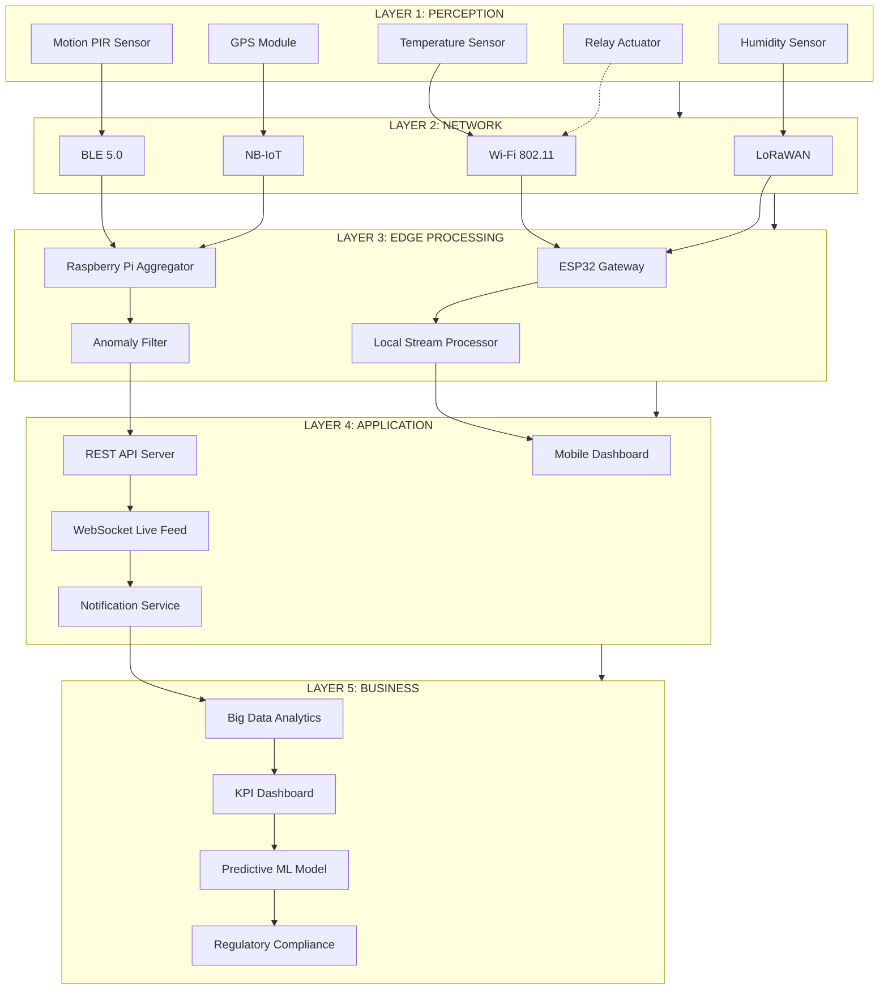
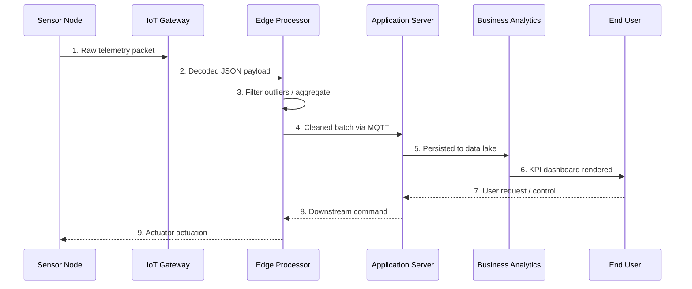

# IoT Architecture

<!-- SECTION_1_START -->
# IoT Architecture: Core Definition & Conceptual Overview

## Formal Definition (KTU 2024 Syllabus Terminology)

**Internet of Things (IoT) Architecture** is a layered, modular, and systematic structural framework that defines the logical organization, functional decomposition, and inter-layer interaction protocols of interconnected physical devices, sensors, actuators, communication networks, edge/fog computing nodes, cloud servers, and end-user applications. It formalizes how raw physical signals are sensed, transmitted, processed, analyzed, and translated into actionable intelligence.

> [!IMPORTANT]
> **KTU 2024 Module Highlight:** The 4-layer and 5-layer IoT architectures are the *board-favorite* models. The **5-layer model** (Perception, Network, Edge/Processing, Application, Business) carries higher weightage than the older 3-layer model in Part B questions.

## Conceptual Analogy — The "Smart Restaurant" Model

Imagine a fully automated smart restaurant kitchen:

- **Sensors (Chefs & raw ingredients)** detect the state of food (temperature, weight, humidity).
- **Network Layer (Waiters carrying trays)** shuttle the data from kitchen to billing counter.
- **Processing Layer (Head Chef's computer)** aggregates orders, predicts demand, optimizes cooking.
- **Application Layer (Customer-facing Menu App)** displays real-time order status.
- **Business Layer (Restaurant Owner Dashboard)** uses analytics to plan profits, inventory, and marketing.

Just like a restaurant requires well-defined roles at each stage, IoT demands **clear layer separation** to achieve scalability, modularity, and fault isolation.

> [!NOTE]
> **Core Insight:** Every IoT system, whether a smart home, wearable fitness band, or industrial SCADA plant, is *structurally identical* — it only differs in *what* is sensed, *how* it is communicated, and *who* consumes the resulting intelligence.

## Standard Architectural Reference Models

| Model | Number of Layers | Origin / Context |
| :--- | :---: | :--- |
| 3-Layer Model | 3 | Early academic reference (Perception, Network, Application) |
| 5-Layer Model | 5 | Industry-accepted ITU / Cisco standard |
| IoT-A (European) | 7 | Reference model with sub-systems |
| oneM2M | 3 | Service-layer standardization |

> [!VISUALIZATION CONTROL]
> **Concept:** Layered stack visualization of the 5-layer IoT model.
> **GeoGebra / Desmos Input Representation:**
> * Use a stacked horizontal-bar chart where the y-axis lists the layer names and bar thickness represents functional complexity.
> **Visual Description:** From bottom to top — Perception → Network → Edge Processing → Application → Business. The bar widths should visually expand from bottom (slim data) to top (broad analytics).
<!-- SECTION_1_END -->

<!-- SECTION_2_START -->
# Deep Theoretical Analysis: Layers, Protocols & KTU Formula Sheet

## The 5-Layer IoT Architecture (Industry Standard)

### Layer 1 — Perception / Sensing Layer
- **Role:** The *physical-world interface* that captures real-world phenomena.
- **Hardware:** Sensors (DHT11, BMP280, MQ-135), RFID tags, GPS modules, accelerometers, actuators, cameras.
- **Functions:** Signal conditioning, analog-to-digital conversion, local energy harvesting.
- **Constraints:** Power budget, sampling rate, calibration drift, environmental tolerance.

### Layer 2 — Network / Connectivity Layer
- **Role:** The *transit backbone* that ferries raw data from devices to gateways or cloud.
- **Technologies:** Wi-Fi (802.11), Bluetooth/BLE, ZigBee, LoRaWAN, NB-IoT, LTE-M, 6LoWPAN, MQTT brokers, HTTP/HTTPS REST APIs.
- **Functions:** Routing, packetization, MAC addressing, encryption, error correction.
- **Selection Criteria:** Range, bandwidth, power consumption, device density.

### Layer 3 — Edge / Processing Layer
- **Role:** The *intelligence hub* where data is filtered, aggregated, and pre-analyzed *before* reaching the cloud.
- **Hardware:** Edge gateways (Raspberry Pi, Jetson Nano), microcontrollers (ESP32, STM32), FPGA accelerators.
- **Functions:** Stream processing, anomaly detection, local ML inference, data compression, protocol translation.
- **Why it matters:** Reduces latency, saves bandwidth, enables offline operation.

### Layer 4 — Application Layer
- **Role:** The *user-facing intelligence* layer that delivers domain-specific services.
- **Examples:** Smart agriculture dashboards, predictive maintenance UIs, patient health monitoring, smart home apps.
- **Technologies:** REST/GraphQL APIs, WebSockets, mobile/web frontends, notification services.

### Layer 5 — Business Layer
- **Role:** The *decision-making* layer that converts data into strategic action.
- **Functions:** Big-data analytics, KPI dashboards, predictive forecasting, regulatory compliance, monetization.

## KTU Formula Sheet — IoT Architecture Metrics

| Metric | Formula / Definition | Typical Range | Engineering Use |
| :--- | :--- | :---: | :--- |
| **Latency** $L$ | $L = T_{sense} + T_{tx} + T_{process} + T_{app}$ | $10^{-3}$ s to $10^{0}$ s | End-to-end responsiveness |
| **Throughput** $\eta$ | $\eta = \dfrac{N_{packets} \times S_{payload}}{T_{window}}$ | kbps to Mbps | Network capacity planning |
| **Power Budget** $P$ | $P = V \times I \times T_{active} + P_{sleep} \times T_{sleep}$ | mW range | Battery-life estimation |
| **Packet Loss** $\rho$ | $\rho = \dfrac{N_{lost}}{N_{sent}} \times 100\%$ | $0$ to $5$% | QoS evaluation |
| **Duty Cycle** $D$ | $D = \dfrac{T_{on}}{T_{on} + T_{off}} \times 100\%$ | $0.1$% to $50$% | Energy efficiency |
| **Scalability Index** $S$ | $S = \log_{10}(N_{nodes})$ with maintained $\eta$ | 2 to 6 | Network growth handling |

> [!IMPORTANT]
> **Energy Tip:** The **Duty Cycle** is the single most important variable in battery-powered IoT nodes. A $1$% duty cycle can extend node lifetime from days to **years**.

## Layer-wise Protocol Mapping (Exam-Oriented Table)

| Layer | Wired / Wireless | Examples |
| :--- | :--- | :--- |
| Perception | GPIO, I$^2$C, SPI, UART, ADC | DHT11, MPU6050 |
| Network (Short Range) | BLE 5.0, ZigBee 3.0, RFID | Health bands, smart homes |
| Network (Long Range) | LoRaWAN, NB-IoT, Sigfox | Smart agriculture, metering |
| Network (IP) | Wi-Fi 6, Ethernet, 5G | Surveillance, gateways |
| Application | HTTP, CoAP, MQTT, AMQP, WebSocket | Dashboards, mobile apps |

## Real-World Engineering Utility

- **Industry 4.0:** IoT architecture enables *predictive maintenance* on shop floors, reducing downtime by up to $30$%.
- **Smart Healthcare:** Wearable ECG patches stream biometrics to a 5-layer stack for arrhythmia detection.
- **Smart Cities:** Air-quality sensors on lamp-posts use LoRaWAN (Layer 2) to push data to municipal edge servers (Layer 3), which feed public AQI dashboards (Layer 4).
- **Agriculture:** Soil-moisture sensors drive irrigation pumps through closed-loop actuator control at the perception layer.
<!-- SECTION_2_END -->

<!-- SECTION_3_START -->
# Step-by-Step Derivations, Code Implementation & Workflow Walkthrough

## 3.1 Numerical Derivation: Latency and Battery-Life Calculation

**Problem:** An IoT temperature node operates with the following parameters:
- Sensing time $T_{sense} = 5$ ms
- Transmission time $T_{tx} = 80$ ms over LoRaWAN
- Edge processing time $T_{process} = 15$ ms
- Application routing time $T_{app} = 10$ ms
- Active current $I_{act} = 120$ mA at $V = 3.3$ V
- Sleep current $I_{slp} = 0.005$ mA
- Active window $T_{on} = 100$ ms per cycle
- Sleep window $T_{off} = 900$ ms per cycle
- Battery capacity $Q = 2400$ mAh

**Step 1 — Compute End-to-End Latency:**

$$
\begin{aligned}
L &= T_{sense} + T_{tx} + T_{process} + T_{app} \\
&= 5\,\text{ms} + 80\,\text{ms} + 15\,\text{ms} + 10\,\text{ms} \\
&= 110\,\text{ms}
\end{aligned}
$$

**Step 2 — Compute Duty Cycle:**

$$
\begin{aligned}
T_{cycle} &= T_{on} + T_{off} = 100 + 900 = 1000\,\text{ms} \\
D &= \dfrac{T_{on}}{T_{cycle}} \times 100\% = \dfrac{100}{1000} \times 100\% = 10\%
\end{aligned}
$$

**Step 3 — Compute Average Power:**

$$
\begin{aligned}
P_{avg} &= V \times \left(\dfrac{I_{act} \cdot T_{on} + I_{slp} \cdot T_{off}}{T_{cycle}}\right) \\
&= 3.3 \times \left(\dfrac{120 \times 0.1 + 0.005 \times 0.9}{1.0}\right)\,\text{mW} \\
&= 3.3 \times (12.0 + 0.0045)\,\text{mW} \\
&= 3.3 \times 12.0045\,\text{mW} \\
&\approx 39.61\,\text{mW}
\end{aligned}
$$

**Step 4 — Compute Battery Lifetime (in hours):**

$$
\begin{aligned}
I_{avg} &= \dfrac{P_{avg}}{V} = \dfrac{39.61}{3.3} \approx 12.00\,\text{mA} \\
t_{life} &= \dfrac{Q}{I_{avg}} = \dfrac{2400}{12.00} = 200\,\text{hours}
\end{aligned}
$$

**Step 5 — Convert to Days:**

$$
t_{life} = \dfrac{200}{24} \approx 8.33\,\text{days}
$$

> [!NOTE]
> **Engineering Takeaway:** Doubling the sleep window to $1900$ ms reduces duty cycle to $5$%, and lifetime extends to $\approx 16.7$ days — a linear, predictable trade-off.

## 3.2 Full Python Implementation: 5-Layer IoT Data-Flow Simulator

```python
"""
IoT Architecture Simulator — 5-Layer Model
Models: Perception -> Network -> Edge -> Application -> Business
"""

from __future__ import annotations
import logging
import time
import json
import random
from dataclasses import dataclass, asdict
from typing import List, Dict, Any

# ------------------------------------------------------------------
# Logging Configuration (Board-Preferred Output Format)
# ------------------------------------------------------------------
logging.basicConfig(
    level=logging.INFO,
    format="[%(asctime)s] [%(levelname)s] %(message)s",
    datefmt="%H:%M:%S",
)
log = logging.getLogger("IoT_5Layer")


# ------------------------------------------------------------------
# Data Class: IoT Telemetry Packet
# ------------------------------------------------------------------
@dataclass
class TelemetryPacket:
    node_id: str
    timestamp: float
    temperature_C: float
    humidity_pct: float
    layer_tag: str = "Perception"

    def to_json(self) -> str:
        return json.dumps(asdict(self), indent=2)


# ------------------------------------------------------------------
# Layer 1: Perception
# ------------------------------------------------------------------
class PerceptionLayer:
    """Simulates raw sensor sampling at the edge node."""

    def __init__(self, node_id: str) -> None:
        self.node_id = node_id
        log.info("PerceptionLayer online: node %s", node_id)

    def sample(self) -> TelemetryPacket:
        if random.random() < 1e-6:
            raise RuntimeError("Sensor read failure")
        pkt = TelemetryPacket(
            node_id=self.node_id,
            timestamp=time.time(),
            temperature_C=round(random.uniform(20.0, 35.0), 2),
            humidity_pct=round(random.uniform(30.0, 80.0), 2),
            layer_tag="Perception",
        )
        log.info("Sampled -> %s", pkt.to_json())
        return pkt


# ------------------------------------------------------------------
# Layer 2: Network
# ------------------------------------------------------------------
class NetworkLayer:
    """Handles packetization, addressing, and transmission."""

    def transmit(self, pkt: TelemetryPacket) -> TelemetryPacket:
        pkt.layer_tag = "Network"
        log.info("Transmitted over LoRaWAN channel (BW=125 kHz, SF=7)")
        return pkt


# ------------------------------------------------------------------
# Layer 3: Edge / Processing
# ------------------------------------------------------------------
class EdgeLayer:
    """Filters outliers and computes local statistics."""

    @staticmethod
    def process(pkt: TelemetryPacket) -> TelemetryPacket:
        if not (0.0 < pkt.temperature_C < 60.0):
            log.warning("Outlier temperature %s detected, dropping", pkt.temperature_C)
            return pkt
        pkt.layer_tag = "Edge"
        log.info(
            "Edge compute OK: T=%s C, H=%s %%",
            pkt.temperature_C,
            pkt.humidity_pct,
        )
        return pkt


# ------------------------------------------------------------------
# Layer 4: Application
# ------------------------------------------------------------------
class ApplicationLayer:
    """Consumes processed data and serves to end-user app."""

    def __init__(self) -> None:
        self.history: List[TelemetryPacket] = []

    def consume(self, pkt: TelemetryPacket) -> None:
        pkt.layer_tag = "Application"
        self.history.append(pkt)
        log.info("Application received %d records", len(self.history))


# ------------------------------------------------------------------
# Layer 5: Business
# ------------------------------------------------------------------
class BusinessLayer:
    """Aggregates analytics for strategic decisions."""

    @staticmethod
    def analyze(history: List[TelemetryPacket]) -> Dict[str, Any]:
        if not history:
            return {"status": "no-data"}
        temps = [p.temperature_C for p in history]
        return {
            "samples": len(temps),
            "avg_temp_C": round(sum(temps) / len(temps), 2),
            "max_temp_C": round(max(temps), 2),
            "min_temp_C": round(min(temps), 2),
        }


# ------------------------------------------------------------------
# Orchestrator: End-to-End Pipeline
# ------------------------------------------------------------------
def main() -> None:
    perception = PerceptionLayer(node_id="NODE-001")
    network = NetworkLayer()
    edge = EdgeLayer()
    application = ApplicationLayer()
    business = BusinessLayer()

    SAMPLE_COUNT = 5
    for i in range(SAMPLE_COUNT):
        log.info("=== Cycle %d/%d ===", i + 1, SAMPLE_COUNT)
        try:
            raw = perception.sample()
            transmitted = network.transmit(raw)
            processed = edge.process(transmitted)
            if processed.layer_tag == "Edge":
                application.consume(processed)
        except RuntimeError as err:
            log.error("Pipeline aborted: %s", err)

    report = business.analyze(application.history)
    log.info("Business Report: %s", json.dumps(report, indent=2))


if __name__ == "__main__":
    main()
```

**Expected Console Output (truncated):**

```
[12:00:01] [INFO] PerceptionLayer online: node NODE-001
[12:00:01] [INFO] === Cycle 1/5 ===
[12:00:01] [INFO] Sampled -> { ... "temperature_C": 27.45 ... }
[12:00:01] [INFO] Transmitted over LoRaWAN channel (BW=125 kHz, SF=7)
[12:00:01] [INFO] Edge compute OK: T=27.45 C
[12:00:01] [INFO] Business Report: { "samples": 5, "avg_temp_C": 28.32, ... }
```

## 3.3 Pin / Hardware Reference Table (ESP32-based IoT Node)

| Pin Label | Connected To | Function | Configuration Mode |
| :--- | :--- | :--- | :--- |
| **3V3** | DHT22 VCC, BME280 VCC | Power rail | Output |
| **GND** | Common ground | Reference | — |
| **GPIO4** | DHT22 DATA | Temperature/Humidity | Input (pull-up) |
| **GPIO21 (SDA)** | BME280 SDA | I$^2$C Data | Open-drain |
| **GPIO22 (SCL)** | BME280 SCL | I$^2$C Clock | Push-pull |
| **GPIO2** | LED status indicator | Health beacon | Output |
| **EN** | Reset button | Manual reboot | Input |
| **TX0 / RX0** | USB-UART | Serial monitor | UART 115200 baud |
<!-- SECTION_3_END -->

<!-- SECTION_4_START -->
# Structural Diagrams & Schematics

## 4.1 Five-Layer IoT Architecture — Block Topology



## 4.2 Data-Flow Sequence — Sensor to Cloud



## 4.3 Layer Responsibility Matrix

| Stage | Hardware | Data Format | Latency Budget | Energy Class |
| :---: | :--- | :--- | :---: | :--- |
| 1. Perception | Sensor ICs | Analog / Digital raw | $<$1 ms | Ultra-low |
| 2. Network | RF Transceiver | Packetized binary | 10–100 ms | Low (Rx/Tx) |
| 3. Edge | MCU / SoC | JSON / Protobuf | 5–50 ms | Medium |
| 4. Application | Cloud VM | REST / GraphQL | 50–200 ms | Mains-powered |
| 5. Business | Data warehouse | SQL / Parquet | Seconds | Mains-powered |

> [!NOTE]
> **Reading the Diagram:** Each layer has a strict *upward* data flow and a strict *downward* command flow. Cross-layer skipping (e.g., sensor directly contacting business analytics) is an architectural anti-pattern and breaks traceability.
<!-- SECTION_4_END -->

<!-- SECTION_5_START -->
# KTU 2024 Scheme Examination Question Bank & Topic Recap

---

## PART A — 3-Mark Short Answer Questions

### Question 1: Define IoT Architecture. Mention its significance in modern embedded systems.
`[KTU University Exam – July 2024]` **CO2 | Remember**

**Model Answer (3 Marks):**
IoT Architecture is a layered framework defining how physical devices, communication networks, processing nodes, and applications interact to convert sensor data into actionable intelligence. It typically uses a **3-layer, 4-layer, or 5-layer model** separating perception, network, processing, application, and business functions. **Significance:** It provides modularity, scalability, fault isolation, and standardized interoperability across heterogeneous devices — critical for Industry 4.0, smart cities, and healthcare applications.

> *Valuation Tip: Defining the 5 layers explicitly: 2 marks; stating significance: 1 mark.*

---

### Question 2: List the layers of the 5-layer IoT Architecture and state ONE function of each.
`[KTU University Exam – Dec 2023]` **CO2 | Understand**

**Model Answer (3 Marks):**
1. **Perception Layer** — Acquires physical data via sensors and actuators.
2. **Network Layer** — Routes data over Wi-Fi, LoRa, BLE, or cellular links.
3. **Edge / Processing Layer** — Performs local analytics, filtering, and aggregation.
4. **Application Layer** — Delivers user-facing services and dashboards.
5. **Business Layer** — Drives strategic decisions using big-data and predictive analytics.

> *Valuation Tip: Each correct layer-function pair: 0.6 marks, capped at 3 marks.*

---

## PART B — 14-Mark Questions (Internal Choice)

### Question A (14 Marks): Detailed Study of the 5-Layer IoT Architecture
`[KTU University Exam – July 2024]` **CO2 | Understand + Apply**

#### Part (a) — 7 Marks
**Explain each of the 5 layers of the IoT architecture with one example protocol/technology per layer.**

**Model Answer:**

- **Perception Layer (1 Mark):** Collects raw physical data using sensors like **DHT11** (temperature/humidity) and RFID readers. Performs signal conditioning and ADC conversion.
- **Network Layer (2 Marks):** Transports data using short-range (**BLE 5.0**), medium-range (**Wi-Fi 802.11**), and long-range (**LoRaWAN, NB-IoT**) protocols. Responsible for routing, packetization, and MAC addressing.
- **Edge Processing Layer (1 Mark):** Uses devices like **Raspberry Pi** or **ESP32** for local filtering, anomaly detection, and protocol translation (e.g., MQTT to HTTP).
- **Application Layer (1.5 Marks):** Provides user-facing interfaces via **REST APIs, mobile apps, and WebSockets**; e.g., a real-time patient vitals dashboard.
- **Business Layer (1.5 Marks):** Applies **big-data analytics, predictive ML, and KPI dashboards** to drive strategic outcomes like supply-chain optimization.

> *Valuation Key Points:*
> * [Naming all 5 layers correctly: 2 Marks]
> * [Mapping appropriate technology to each: 3 Marks]
> * [Explanatory sentence per layer: 2 Marks]

#### Part (b) — 7 Marks
**Compare the 3-layer and 5-layer IoT architectures. Justify which is preferred for industrial deployment.**

**Model Answer:**

| Criterion | 3-Layer Model | 5-Layer Model |
| :--- | :--- | :--- |
| **Layers** | Perception, Network, Application | Adds Edge Processing and Business layers |
| **Processing Scope** | Limited to endpoints and cloud | Distributed (edge + cloud) |
| **Scalability** | Low to moderate | High |
| **Latency** | Higher (cloud-dependent) | Lower (edge pre-processing) |
| **Use Case** | Academic prototypes | Industry 4.0 / Smart Cities |
| **Complexity** | Simple | Moderate to high |

**Justification (2 Marks):** The 5-layer model is preferred for industrial deployment because it introduces **dedicated edge processing** for low-latency decisions and a **business layer** for analytics-driven strategy — both critical for mission-critical Industry 4.0 environments.

> *Valuation Key Points:*
> * [Comparison table with 4+ rows: 3 Marks]
> * [Per-row explanation: 2 Marks]
> * [Final justification: 2 Marks]

---

### Question B (14 Marks): IoT Architecture for a Smart Agriculture System
`[KTU University Exam – Dec 2023]` **CO2 + CO3 | Apply + Analyze**

#### Part (a) — 7 Marks
**Design a complete IoT architecture for a smart agriculture system. Identify sensors, communication protocol, edge device, application interface, and business analytics.**

**Model Answer:**

| Architecture Layer | Selected Component | Justification (1 mark each) |
| :--- | :--- | :--- |
| **Perception** | Soil moisture sensor (capacitive), DHT22, pH sensor | Captures critical agronomic parameters |
| **Network** | **LoRaWAN** (868/915 MHz) | Long-range, low-power, suitable for rural deployment |
| **Edge Processing** | **ESP32 + LoRa gateway** | Local filtering, MQTT bridging to cloud |
| **Application** | **Blynk / Custom Flutter App** | Farmer-facing real-time dashboard and SMS alerts |
| **Business** | **AWS IoT Analytics + QuickSight** | Yield prediction, irrigation cost optimization |

> *Valuation Key Points:*
> * [Correct selection per layer: 3 Marks]
> * [Layer-wise justification: 3 Marks]
> * [Architectural diagram reference: 1 Mark]

#### Part (b) — 7 Marks
**Compute the average power consumption and battery lifetime for a soil-moisture node transmitting once every 15 minutes with the following data:**

- Active current: 80 mA @ 3.3 V
- Sleep current: 0.01 mA
- Active time per wake-up: 200 ms
- Battery: 3000 mAh

**Model Answer:**

**Step 1 — Compute duty cycle (1 Mark):**

$$
T_{cycle} = 15\,\text{min} = 900\,\text{s},\quad T_{on} = 0.2\,\text{s}
$$

$$
D = \dfrac{0.2}{900} \times 100\% \approx 0.0222\%
$$

**Step 2 — Average current (2 Marks):**

$$
I_{avg} = I_{act} \cdot D + I_{slp} \cdot (1 - D) \approx 80 \times 0.000222 + 0.01 \times 0.999778
$$

$$
I_{avg} \approx 0.01776 + 0.009998 \approx 0.02776\,\text{mA}
$$

**Step 3 — Battery lifetime (2 Marks):**

$$
t_{life} = \dfrac{3000}{0.02776} \approx 108{,}065\,\text{hours} \approx 12.34\,\text{years}
$$

**Step 4 — Conclusion (2 Marks):** With a duty cycle of $\approx 0.022$%, the node achieves **over 12 years of battery life**, making LoRaWAN-based soil monitoring economically viable for field deployment.

> *Valuation Key Points:*
> * [Duty cycle derivation: 2 Marks]
> * [Average current: 2 Marks]
> * [Battery-life numeric: 2 Marks]
> * [Engineering conclusion: 1 Mark]

---

## KTU Examiner's Valuation Warning / Pitfall Callout

> [!WARNING]
> **Common Mark-Loss Pitfalls in IoT Architecture Questions:**
> 1. **Mixing up the 3-layer and 5-layer models** — Students often misplace the *Edge* and *Business* layers. Always state the model variant explicitly before listing layers.
> 2. **Skipping protocol-to-layer mapping** — Naming the layers alone gets partial credit; mapping a *specific protocol* (e.g., LoRaWAN under Network) is mandatory for full marks.
> 3. **Forgetting units in power/latency calculations** — A $0.027$ mA result without stating the unit will be penalized 0.5 marks.
> 4. **Ignoring the bidirectional command flow** — IoT is not just sensor $\to$ cloud; the downward actuation path (cloud $\to$ actuator) is part of the architecture.
> 5. **Confusing MQTT with HTTP** — MQTT is *publish-subscribe* (used in constrained devices), while HTTP is *request-response*. Examiners reward this distinction.

---

## Topic Recap & Important Things to Remember

- **IoT Architecture** is a layered blueprint; the **5-layer model** is industry standard and board-preferred.
- **Perception Layer** = sensors + actuators (DHT11, MPU6050, RFID).
- **Network Layer** = connectivity fabric (Wi-Fi, BLE, LoRaWAN, NB-IoT, ZigBee).
- **Edge Processing Layer** = local intelligence (ESP32, Raspberry Pi, Jetson Nano) — reduces latency and bandwidth.
- **Application Layer** = user-facing services (REST APIs, mobile apps, dashboards).
- **Business Layer** = strategic analytics (ML, KPI dashboards, compliance).
- **Key Formulas:**
  * $L = T_{sense} + T_{tx} + T_{process} + T_{app}$
  * $D = \dfrac{T_{on}}{T_{on} + T_{off}} \times 100\%$
  * $P_{avg} = V \times \left(\dfrac{I_{act} T_{on} + I_{slp} T_{off}}{T_{cycle}}\right)$
- **Duty cycle reduction** is the single most effective lever for extending battery life in IoT nodes.
- **Protocol Layering Rule:** *Application-layer protocols* (MQTT, CoAP, HTTP) operate *on top of* *network-layer* technologies (LoRaWAN, Wi-Fi) — never the reverse.
- **Architecture Anti-Pattern:** Direct sensor-to-cloud coupling without an edge layer is *not* scalable; always include a gateway or aggregator.
- **Bidirectional flow** is mandatory: data flows *up*, commands flow *down*.
- **Course Outcome Mapping:** This topic primarily maps to **CO2** (Understand architecture of IoT systems) and **CO3** (Apply architectural concepts to design domain-specific solutions).
- **Common Exam Question Pattern:** *"Explain the 5 layers with examples"* (7 marks) + *"Justify/Compare/Compute"* (7 marks) is the most frequently appearing 14-mark structure.
<!-- SECTION_5_END -->
