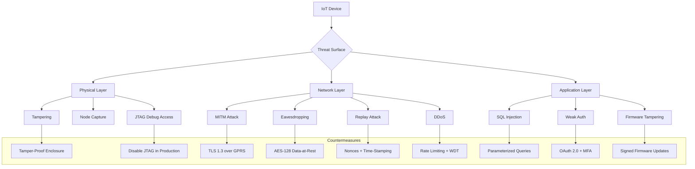
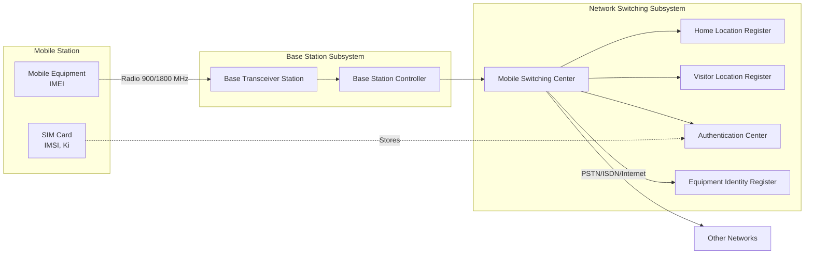
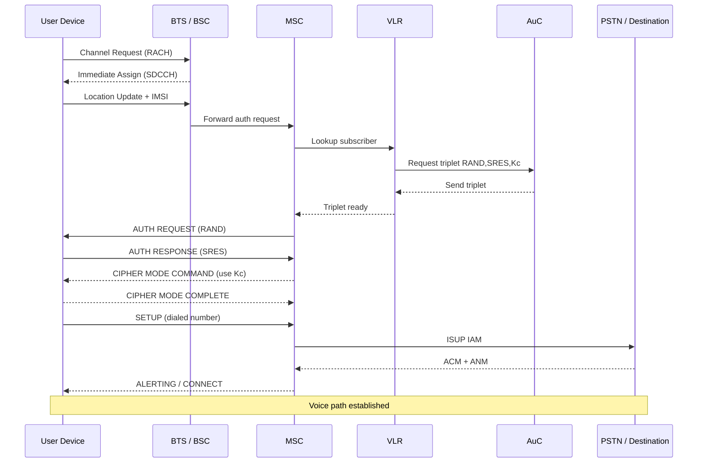
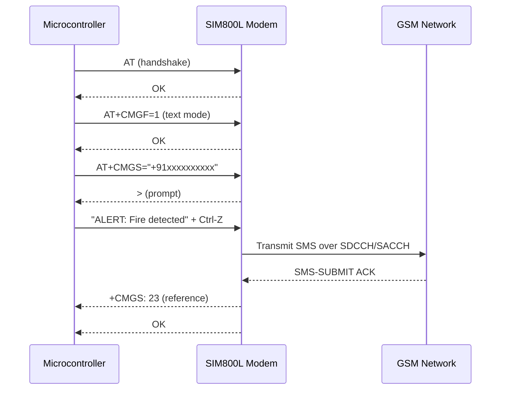
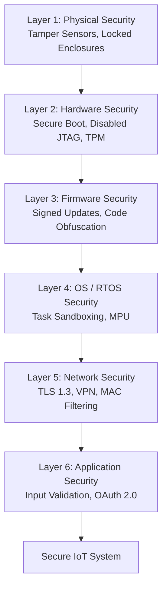

# IoT Security Principles and Common Threats Wireless Communication: Interfacing GSM (Call, SMS, Internet)

<!-- SECTION_1_START -->
# Module 4: IoT Security Principles, Common Threats & Wireless Communication (GSM)

## 1. Core Technical Definition & Intuitive Overview

### 1.1 IoT (Internet of Things) — Formal Definition

> [!IMPORTANT]
> **KTU Syllabus Definition (2024 Scheme)**
> The **Internet of Things (IoT)** is a network of physical objects ("things") embedded with sensors, software, and other technologies for the purpose of connecting and exchanging data with other devices and systems over the Internet. In the context of microcontroller systems (PBCST504), IoT refers to the integration of embedded controllers (Arduino, ESP8266, ESP32, STM32) with wireless modules to enable telemetry, telecontrol, and M2M (Machine-to-Machine) communication.

**Conceptual Analogy / Intuition:**
Think of IoT like a **nervous system in a human body**. Your brain (cloud server) doesn't directly touch every organ; instead, sensory nerve endings (sensors) gather information, and motor nerves (actuators/relays) take action. The spinal cord (microcontroller + wireless module like GSM/Wi-Fi) acts as the local decision-making and routing hub. Without security, it's like having an open nerve ending — anyone can poke it and cause harm.

### 1.2 IoT Security Principles — The CIA Triad + AAA

> [!NOTE]
> **Core Definition: The CIA Triad**
> Information security in IoT is built upon three foundational pillars:
> - **Confidentiality** — ensuring data is accessible *only* to authorized entities.
> - **Integrity** — ensuring data is not altered or tampered with during transit.
> - **Availability** — ensuring the system and its data are accessible when needed.

**Extended Principle: AAA Framework**
| Pillar | Meaning | IoT Example |
|---|---|---|
| **Authentication** | Verifying *who* you are | A GSM module validating its SIM PIN with the carrier's HLR |
| **Authorization** | Verifying *what* you are allowed to do | An IoT device permitted to send SMS but not place calls |
| **Accounting** | Tracking *what* you did | Logging every AT command issued by the firmware |

> [!VISUALIZATION CONTROL]
> **Concept:** CIA Triad for IoT — Confidentiality, Integrity, Availability
> **Geometric Representation:** Three overlapping circles (Venn diagram) with the IoT device at the center of intersection.
> **Visual Description:** The overlapping region represents a *Secure IoT System*. If any circle is missing, the system is vulnerable. For GSM communication, a SIM-locked module achieves Confidentiality; TLS over GPRS achieves Integrity; redundant power + watchdog timer achieves Availability.

### 1.3 GSM (Global System for Mobile Communications) — Formal Definition

> [!IMPORTANT]
> **KTU Syllabus Definition (2024 Scheme)**
> **GSM** is a second-generation (2G) digital cellular network standard using **TDMA (Time Division Multiple Access)** across **FDMA (Frequency Division Multiple Access)** carriers. It operates in the **900 MHz** and **1800 MHz** bands (in India) with a channel bandwidth of **200 kHz**, and uses the **SIM (Subscriber Identity Module)** for subscriber authentication. GSM modules (e.g., **SIM800L**, **SIM900A**, **SIM7600E**) interface with microcontrollers via **UART** using the **AT (ATtention) command set** standardized under **3GPP TS 27.007**.

**Conceptual Analogy / Intuition:**
Imagine GSM as a **postal system with a registered mailbox**. The SIM card is your unique postal address. The cellular tower (BTS) is the local post office that receives your letter (data), routes it through sorting centers (BSC, MSC), and delivers it to another mailbox (destination SIM) anywhere in the world. The AT commands are the *language* you speak to the postman to say "send this letter" or "read my mail."

### 1.4 AT Command Set — Formal Definition

> [!NOTE]
> **Core Definition**
> An **AT command (ATtention command)** is a short text string sent to a modem (here, a GSM module) over a serial (UART) interface. Every command begins with the literal characters **"AT"** (ASCII 0x41 0x54), followed by a specific instruction and terminated by a carriage return `\r` (ASCII 0x0D). Responses begin with `OK`, `ERROR`, or structured data lines terminated by `\r\n`.

### 1.5 Common IoT Threats — Formal Definitions

| Threat | Definition | Real-World Analogy |
|---|---|---|
| **DDoS (Distributed Denial-of-Service)** | Overwhelming an IoT device/server with traffic from many sources (often a botnet) | A mob blocking a shop entrance so genuine customers cannot enter |
| **MITM (Man-in-the-Middle)** | Attacker secretly intercepts/relays communication between two parties | A postal worker who opens, reads, and re-seals your letters |
| **Eavesdropping / Sniffing** | Passive monitoring of unencrypted wireless traffic | Listening to a private phone call on a shared line |
| **Replay Attack** | Capturing and re-sending a valid data transmission later | Recording someone's voice saying "transfer ₹1000" and playing it back later |
| **Firmware Tampering** | Modifying device firmware to alter behavior | Replacing a hotel room's lock mechanism with a backdoor |
| **Brute-Force / Dictionary Attack** | Trying many passwords/PINs until one works | Trying every key on a keyring until the door opens |
| **Botnet Recruitment (e.g., Mirai)** | Infecting IoT devices to use them as attack amplifiers | Turning thousands of home routers into a zombie army |

> [!VISUALIZATION CONTROL]
> **Concept:** Attack surface of an IoT device (Layer-wise)
> **Geometric Representation:** Concentric circles centered on a microcontroller.
> **Visual Description:** Inner circle = Hardware (JTAG, UART debug). Middle ring = Firmware (signed/unsigned). Outer ring = Network (TLS, firewall). Cloud = Physical access. Each ring represents a *threat surface*; the further out, the easier for an external attacker to reach.

<!-- SECTION_1_END -->

<!-- SECTION_2_START -->
# 2. Deep Theoretical Analysis & KTU High-Yield Formula Sheet

## 2.1 IoT Security Principles — Operational Theory

The **3 Pillars of IoT Security** are operationalized through the following layered mechanisms:

### 2.1.1 Principle 1: Confidentiality
- **Mechanism:** Encryption (AES-128/256 for data-at-rest; TLS 1.2/1.3 for data-in-transit).
- **Why:** Wireless channels (GSM, Wi-Fi, LoRa) are *broadcast mediums* — anyone with an SDR (Software Defined Radio) can sniff them.
- **How:** In GSM, the A5/1 stream cipher encrypts the air interface. However, A5/1 has known weaknesses; modern IoT prefers **AES-128 in CCM mode** (used in LoRaWAN) or **TLS over GPRS**.

### 2.1.2 Principle 2: Integrity
- **Mechanism:** Message digests (MD5, SHA-256), HMAC (Hash-based Message Authentication Code), digital signatures.
- **Why:** An attacker may not decrypt the message but can flip bits ("credit = -5000" → "credit = +5000").
- **How:** A 32-byte HMAC-SHA256 appended to every MQTT publish payload guarantees any modification is detected.

### 2.1.3 Principle 3: Availability
- **Mechanism:** Redundancy, watchdog timers, rate-limiting, DoS-resistant protocols.
- **Why:** An irrigation controller that crashes when flooded with packets causes crop failure.
- **How:** Hardware WDT (e.g., ATmega328's 16-bit WDT) resets the MCU if firmware hangs.

### 2.1.4 Defense-in-Depth Strategy
- Multiple security layers so that breach of *one* layer does not compromise the *entire* system.
- Layers: **Physical → Hardware (Secure Boot) → Firmware (Signed) → OS (Sandboxing) → Network (TLS/VPN) → Application (Auth + Input Validation)**.

## 2.2 IoT Reference Architecture (3-Layer Model)

$$
\text{IoT System} = \underbrace{\text{Perception Layer}}_{\text{Sensors/Actuators}} \;\cup\; \underbrace{\text{Network Layer}}_{\text{GSM/Wi-Fi/LoRa}} \;\cup\; \underbrace{\text{Application Layer}}_{\text{Cloud/App}}
$$

| Layer | Function | Threat | Countermeasure |
|---|---|---|---|
| **Perception** | Sense & actuate | Tampering, node capture | Tamper-proof enclosure, secure boot |
| **Network** | Transmit data | MITM, Eavesdropping, Replay | TLS, VPN, time-stamped nonces |
| **Application** | Process & display | SQL injection, weak auth | OAuth 2.0, parameterized queries |

## 2.3 GSM Architecture — Block Diagram Theory

The GSM system has **four major subsystems**:

1. **MS (Mobile Station)** — Your device + SIM.
2. **BSS (Base Station Subsystem)** — BTS (Base Transceiver Station) + BSC (Base Station Controller).
3. **NSS (Network Switching Subsystem)** — MSC (Mobile Switching Center), HLR, VLR, AuC, EIR.
4. **OSS (Operation Support Subsystem)** — OMC (Operations & Maintenance Center).

### Key GSM Network Elements (High-Yield for KTU)

| Element | Full Form | Function |
|---|---|---|
| **BTS** | Base Transceiver Station | Radio interface to MS; handles 200 kHz carriers |
| **BSC** | Base Station Controller | Manages multiple BTS; handovers, frequency hopping |
| **MSC** | Mobile Switching Center | Core switch; routes calls/SMS between networks |
| **HLR** | Home Location Register | Permanent subscriber database (IMSI, MSISDN, services) |
| **VLR** | Visitor Location Register | Temporary DB of roaming subscribers in MSC's area |
| **AuC** | Authentication Center | Stores Ki (128-bit secret key) and generates SRES triplets |
| **EIR** | Equipment Identity Register | Blacklists stolen IMEIs |
| **SIM** | Subscriber Identity Module | Smart card holding IMSI, Ki, and PIN |
| **IMEI** | International Mobile Equipment Identity | 15-digit unique device serial (not tied to subscriber) |
| **IMSI** | International Mobile Subscriber Identity | 15-digit unique subscriber ID stored on SIM |
| **MSISDN** | Mobile Station ISDN Number | Your actual phone number (e.g., +91 9447011223) |

## 2.4 GSM Air Interface — Frequency & Frame Math

### Frequency Bands (India)
- **GSM-900:** Uplink **890–915 MHz**, Downlink **935–960 MHz** (25 MHz total)
- **GSM-1800 (DCS):** Uplink **1710–1785 MHz**, Downlink **1805–1880 MHz** (75 MHz total)

### Channel Math
$$
\text{Available carriers} = \frac{\text{Total bandwidth}}{\text{Channel bandwidth}} = \frac{25 \text{ MHz}}{200 \text{ kHz}} = 125 \text{ carriers}
$$

### TDMA Frame Structure
Each **200 kHz** carrier carries **8 time slots** (one per user).
$$
\text{Frame duration} = 4.615 \text{ ms}, \quad \text{Slot duration} = 577 \mu s
$$

### ARFCN (Absolute Radio Frequency Channel Number)
For GSM-900 uplink:
$$
f_{\text{UL}}(n) = 890.0 \text{ MHz} + 0.2 \text{ MHz} \times n, \quad n \in [1, 124]
$$

For GSM-900 downlink:
$$
f_{\text{DL}}(n) = f_{\text{UL}}(n) + 45 \text{ MHz}
$$

> [!NOTE]
> **Board Exam Tip:** The **45 MHz** duplex spacing between uplink and downlink is a frequently asked one-mark question.

## 2.5 GSM Authentication & Encryption — Ki / SRES / Kc

When a SIM joins the network, the **AuC** generates a **Triplet (RAND, SRES, Kc)**:
1. **RAND** — 128-bit random challenge.
2. **SRES** — 32-bit Signed Response (output of A3 algorithm using Ki and RAND).
3. **Kc** — 64-bit session ciphering key (output of A8 algorithm using Ki and RAND).

The MS receives RAND over the air, computes SRES locally using its Ki, and sends it back. The MSC compares; if equal → authenticated.

$$
\text{SRES} = A_3(\text{Ki}, \text{RAND}) \quad \text{and} \quad \text{Kc} = A_8(\text{Ki}, \text{RAND})
$$
$$
\text{Encrypted bit stream} = A_5(\text{Kc}, \text{plaintext})
$$

## 2.6 AT Command Set — The High-Yield Cheat Sheet

| AT Command | Function | Module Response |
|---|---|---|
| `AT` | Ping / check module alive | `OK` |
| `ATI` | Display module info (e.g., SIM800 R14.18) | Model & firmware string |
| `AT+CSQ` | Signal quality (0–31, 99=unknown) | `+CSQ: 18,0` |
| `AT+CREG?` | Network registration status | `+CREG: 0,1` (home net) or `+CREG: 0,5` (roaming) |
| `AT+CPIN?` | SIM PIN status | `+CPIN: READY` |
| `ATD+919876543210;` | Dial a number (semicolon = voice call) | `OK` / `NO CARRIER` |
| `AT+CMGF=1` | Set SMS to text (1=text, 0=PDU) | `OK` |
| `AT+CMGS="+91xxxxxxxxxx"` | Send SMS to number | `>` prompt, then message, then Ctrl-Z (ASCII 26) |
| `AT+CMGR=1` | Read SMS at index 1 | Full SMS body |
| `AT+CMGD=1` | Delete SMS at index 1 | `OK` |
| `AT+CIPSHUT` | Deactivate GPRS PDP context | `SHUT OK` |
| `AT+CGATT=1` | Attach to GPRS service | `OK` |
| `AT+CSTT="APN","user","pass"` | Set APN (e.g., `"airtelgprs.com"`) | `OK` |
| `AT+CIICR` | Bring up wireless GPRS connection | `OK` |
| `AT+CIFSR` | Get local IP address | `10.x.x.x` |
| `AT+CIPSTART="TCP","api.example.com",80` | Open TCP socket | `CONNECT OK` |
| `AT+CIPSEND` | Send data over socket | `>` prompt, then payload, then Ctrl-Z |
| `AT+CIPCLOSE` | Close TCP socket | `CLOSE OK` |

> [!NOTE]
> **KTU Pitfall:** Forgetting the **semicolon `;`** in `ATD` is the #1 reason a call doesn't connect. Voice calls need `;`, data calls do not.

## 2.7 Real-World Engineering Utility

- **Precision Agriculture:** GSM-SMS alert when soil moisture drops below threshold — no internet needed, works in remote fields.
- **Vehicle Tracking:** GSM + GPS module pings server over GPRS every 30 seconds.
- **Smart Metering:** Utility companies read electricity meters via GSM instead of sending humans.
- **Industrial SCADA:** Remote PLC control via GSM fallback when primary leased line fails.

## 2.8 KTU High-Yield Formula Sheet

| Concept | Formula / Definition | Units / Constants |
|---|---|---|
| GSM channel spacing | $\Delta f = 200$ kHz | Per carrier |
| GSM duplex spacing | $f_{\text{DL}} - f_{\text{UL}} = 45$ MHz | GSM-900 |
| Uplink frequency (GSM-900) | $f_{\text{UL}}(n) = 890 + 0.2n$ MHz | $n \in [1,124]$ |
| Total carriers in GSM-900 | $N = 25 / 0.2 = 125$ | Dimensionless |
| Frame duration | $T_{\text{frame}} = 4.615$ ms | Time |
| Time slots per frame | $N_{\text{slots}} = 8$ | Dimensionless |
| Slot duration | $T_{\text{slot}} = T_{\text{frame}} / 8 \approx 577 \mu s$ | Time |
| Bit rate per slot (GMSK) | $R_b = 270.833$ kbps | Bit rate |
| Authentication response | $\text{SRES} = A_3(K_i, \text{RAND})$ | 32-bit output |
| Cipher key | $K_c = A_8(K_i, \text{RAND})$ | 64-bit output |
| Encryption | $C = A_5(K_c, P)$ | Stream cipher |
| ARFCN to frequency | $f = f_0 + 0.2 \times \text{ARFCN}$ | MHz |
| GPRS max theoretical | $171.2$ kbps per slot, 8 slots = $1.369$ Mbps | Theoretical peak |

<!-- SECTION_2_END -->

<!-- SECTION_3_START -->
# 3. Step-by-Step Derivations, Code & Symbolic Implementation

## 3.1 Mathematical Derivation — ARFCN to Frequency Mapping

> **Problem:** Given an ARFCN value, derive the absolute uplink and downlink frequencies for a GSM-900 system.

**Step 1:** Start with the **ITU-T E.5** reference frequency specification.

$$
f_0^{\text{UL}} = 890.0 \text{ MHz (lower band edge of GSM-900 uplink)}
$$

**Step 2:** Each ARFCN step corresponds to one channel of **200 kHz** bandwidth.

$$
f_{\text{UL}}(n) = f_0^{\text{UL}} + (0.2 \text{ MHz}) \times n
$$

$$
f_{\text{UL}}(n) = 890.0 + 0.2n \quad [\text{MHz}]
$$

**Step 3:** Apply the GSM-900 duplex spacing of **45 MHz** to get the downlink carrier.

$$
f_{\text{DL}}(n) = f_{\text{UL}}(n) + 45.0 = 935.0 + 0.2n \quad [\text{MHz}]
$$

**Step 4:** Verify with ARFCN 1 (first active channel).

$$
f_{\text{UL}}(1) = 890.0 + 0.2(1) = 890.2 \text{ MHz}
$$

$$
f_{\text{DL}}(1) = 890.2 + 45.0 = 935.2 \text{ MHz}
$$

**Step 5:** Verify with ARFCN 124 (highest channel).

$$
f_{\text{UL}}(124) = 890.0 + 0.2(124) = 890.0 + 24.8 = 914.8 \text{ MHz}
$$

$$
f_{\text{DL}}(124) = 914.8 + 45.0 = 959.8 \text{ MHz}
$$

These match the Indian GSM-900 allocation, so the derivation is **valid**.

## 3.2 Mathematical Derivation — GSM Frame & Bit Timing

> **Problem:** Compute the bit duration, slot duration, and total bits per frame for a GSM burst using GMSK modulation.

**Step 1:** GSM uses **GMSK** with a gross bit rate per physical channel of:

$$
R_b = 270.833 \text{ kbps}
$$

**Step 2:** Compute bit duration.

$$
T_b = \frac{1}{R_b} = \frac{1}{270{,}833} \approx 3.692 \mu s
$$

**Step 3:** A TDMA frame contains **8 time slots**.

$$
T_{\text{frame}} = 8 \times 156.25 \text{ bit periods} = 1250 \text{ bit periods}
$$

$$
T_{\text{frame}} = 1250 \times 3.692 \mu s = 4.615 \text{ ms}
$$

**Step 4:** One time slot contains **156.25 bit periods** (148 bits payload + 8.25 bits training/guard).

$$
T_{\text{slot}} = 156.25 \times 3.692 \mu s = 577 \mu s
$$

**Step 5:** Total bits transmitted in 4 frames of a multiframe (used for traffic channels) is **1480 bits** (gross).

$$
\text{Throughput per user} = \frac{148 \text{ bits}}{4.615 \text{ ms}} \approx 32.05 \text{ kbps}
$$

This is the basis for the **9.6 kbps** data rate (after channel coding, error correction, and interleaving).

## 3.3 Mathematical Derivation — Authentication Triplet Generation

> **Problem:** Trace the exact mathematical flow when a SIM attaches to a GSM network.

**Step 1:** The AuC maintains a per-subscriber **128-bit secret key** $K_i$ stored both in the AuC and on the SIM.

**Step 2:** AuC generates a fresh **128-bit random number** RAND.

**Step 3:** Compute the **Signed Response** using the A3 algorithm (COMP128-1 in practice):

$$
\text{SRES} = A_3(K_i, \text{RAND}) \rightarrow \text{32-bit output}
$$

**Step 4:** Compute the **Cipher Key** using the A8 algorithm (often combined with A3 in a single COMP128 routine):

$$
K_c = A_8(K_i, \text{RAND}) \rightarrow \text{64-bit output}
$$

**Step 5:** AuC transmits the triplet (RAND, SRES, Kc) to the VLR/MSC.

**Step 6:** MSC forwards **RAND** to the MS over the air interface.

**Step 7:** SIM locally computes $\text{SRES}' = A_3(K_i, \text{RAND})$ and returns it to the network.

**Step 8:** MSC compares: if $\text{SRES} == \text{SRES}'$ → authentication **passes**; else → reject.

**Step 9:** For ciphering, both MS and network use $K_c$ to initialize the A5/1 stream cipher:

$$
C_i = P_i \oplus A_5(K_c, i)
$$

where $P_i$ is the i-th plaintext bit, $C_i$ is the i-th ciphertext bit, and $\oplus$ is XOR.

> [!NOTE]
> **Board Exam Insight:** The key $K_i$ is **never** transmitted over the air. Only RAND crosses the interface, preventing offline key recovery.

## 3.4 Arduino Code — GSM Calling Interface

**Wiring (Arduino UNO ↔ SIM800L):**
| SIM800L Pin | Arduino UNO Pin | Notes |
|---|---|---|
| VCC | 4.0 V (external 2A supply) | Module draws 2A during TX bursts |
| GND | GND | Common ground mandatory |
| TX | Pin 2 (SoftwareSerial RX) | 3.3V logic — no level shifter needed for 5V Arduino |
| RX | Pin 3 (SoftwareSerial TX) via 1kΩ+2kΩ divider | Step down 5V → 3.3V |
| RST | Pin 4 (optional) | Pull HIGH to reset module |

```cpp
// File: gsm_call.ino
// Microcontroller: ATmega328P (Arduino UNO)
// GSM Module: SIM800L
// Function: Place an outgoing voice call on button press

#include <SoftwareSerial.h>

#define MODEM_RX 2   // Arduino RX (from modem TX)
#define MODEM_TX 3   // Arduino TX (to modem RX, via divider)
#define CALL_BTN  4  // Pushbutton to GND

SoftwareSerial gsm(MODEM_RX, MODEM_TX);  // (RX, TX) for the Arduino side
const String TARGET_NUMBER = "+919876543210";

void setup() {
  Serial.begin(9600);
  gsm.begin(9600);
  pinMode(CALL_BTN, INPUT_PULLUP);

  Serial.println(F("Initializing GSM module..."));
  delay(3000);  // Give SIM800L time to boot

  // Robust handshake with 5 retries
  for (uint8_t i = 0; i < 5; ++i) {
    gsm.println("AT");
    if (waitForResponse(F("OK"), 2000)) break;
  }

  // Verify SIM ready
  sendAT(F("AT+CPIN?"), F("READY"));
  // Check signal (0-31; >=10 is good)
  sendAT(F("AT+CSQ"), F("OK"));
  // Check network registration
  sendAT(F("AT+CREG?"), F("+CREG:"));
}

void loop() {
  if (digitalRead(CALL_BTN) == LOW) {
    delay(50);  // debounce
    if (digitalRead(CALL_BTN) == LOW) {
      Serial.println(F("Placing call..."));
      gsm.print(F("ATD"));
      gsm.print(TARGET_NUMBER);
      gsm.println(F(";"));  // semicolon = voice call
      waitForResponse(F("OK"), 5000);
      delay(15000);          // let it ring for 15 s
      gsm.println(F("ATH")); // hang up
      waitForResponse(F("OK"), 2000);
      while (digitalRead(CALL_BTN) == LOW); // wait for release
    }
  }
}

// ---------- Helpers ----------
bool waitForResponse(const __FlashStringHelper* target, uint16_t timeout_ms) {
  uint32_t start = millis();
  String buffer = "";
  while (millis() - start < timeout_ms) {
    while (gsm.available()) {
      char c = gsm.read();
      buffer += c;
      if (buffer.endsWith(String(target))) {
        Serial.print(F("<< "));
        Serial.println(buffer);
        return true;
      }
    }
  }
  Serial.print(F("!! Timeout waiting for: "));
  Serial.println(target);
  return false;
}

void sendAT(const __FlashStringHelper* cmd, const __FlashStringHelper* expect) {
  gsm.println(cmd);
  waitForResponse(expect, 3000);
}
```

## 3.5 Arduino Code — GSM SMS Send & Receive

```cpp
// File: gsm_sms.ino
// Function: Send temperature alert SMS; read incoming SMS and parse it

#include <SoftwareSerial.h>

SoftwareSerial gsm(2, 3);

void setup() {
  Serial.begin(9600);
  gsm.begin(9600);
  delay(3000);
  gsm.println(F("AT+CMGF=1"));     // text mode
  gsm.println(F("AT+CNMI=1,2,0,0,0")); // push incoming SMS to UART
  Serial.println(F("SMS module ready."));
}

void loop() {
  // --- Periodic alert example ---
  static uint32_t lastSend = 0;
  if (millis() - lastSend > 60000) {
    lastSend = millis();
    float tempC = readSensor();   // your sensor function
    if (tempC > 50.0) {
      sendSMS("+919876543210", String("ALERT: Temp = ") + tempC + " C");
    }
  }

  // --- Incoming SMS processing ---
  if (gsm.available()) {
    String line = gsm.readStringUntil('\n');
    if (line.startsWith("+CMT:")) {
      // Next line is the body
      String body = gsm.readStringUntil('\n');
      body.trim();
      handleCommand(body);
    }
  }
}

void sendSMS(const String& number, const String& text) {
  gsm.print(F("AT+CMGS=\""));
  gsm.print(number);
  gsm.println(F("\""));
  delay(300);
  gsm.print(text);
  gsm.write(26);  // Ctrl-Z = 0x1A = end of message
  delay(3000);
  Serial.println(F("SMS dispatched."));
}

void handleCommand(const String& body) {
  if (body.equalsIgnoreCase("STATUS")) {
    sendSMS("+919876543210", "System OK. Uptime: " + String(millis()/1000) + " s");
  } else if (body.equalsIgnoreCase("REBOOT")) {
    sendSMS("+919876543210", "Rebooting...");
    wdt_enable(WDTO_15MS);   // watchdog reset
    while (1) {}             // intentional hang -> WDT fires
  }
}

float readSensor() { return 27.4f; } // placeholder
```

## 3.6 Arduino Code — GSM GPRS (Internet) HTTP GET

```cpp
// File: gsm_internet.ino
// Function: Open TCP socket over GPRS and perform an HTTP GET

#include <SoftwareSerial.h>

SoftwareSerial gsm(2, 3);

void setup() {
  Serial.begin(9600);
  gsm.begin(9600);
  delay(3000);
  gsm.println(F("AT+SAPBR=3,1,\"CONTYPE\",\"GPRS\""));  delay(1000);
  gsm.println(F("AT+SAPBR=3,1,\"APN\",\"airtelgprs.com\""));  delay(1000);
  gsm.println(F("AT+SAPBR=1,1"));                       // open bearer
  delay(3000);
  gsm.println(F("AT+SAPBR=2,1"));                       // query IP
  delay(2000);
  // Initialize HTTP service
  gsm.println(F("AT+HTTPINIT"));
  gsm.println(F("AT+HTTPPARA=\"CID\",1"));
  gsm.println(F("AT+HTTPPARA=\"URL\",\"http://api.thingspeak.com/update?api_key=YOUR_KEY&field1=42\""));
  gsm.println(F("AT+HTTPACTION=0"));   // 0 = GET
  delay(3000);
  gsm.println(F("AT+HTTPREAD"));
  gsm.println(F("AT+HTTPTERM"));
}

void loop() {}
```

> [!IMPORTANT]
> **Line-by-line explanation of the GPRS code:**
> - `AT+SAPBR=3,1,"CONTYPE","GPRS"` — **Set** the bearer context #1 connection type to GPRS. (3 = set, 1 = profile ID)
> - `AT+SAPBR=3,1,"APN",...` — Set the APN string (carrier-dependent: Airtel=airtelgprs.com, Jio=jionet, Vodafone=www, BSNL=bsnlnet).
> - `AT+SAPBR=1,1` — **Open** the bearer; the module attaches to the GPRS network and obtains an IP.
> - `AT+SAPBR=2,1` — **Query** the bearer to retrieve the assigned IP address.
> - `AT+HTTPINIT` — Initialize the HTTP stack inside the module.
> - `AT+HTTPPARA="URL",...` — Set the target URL.
> - `AT+HTTPACTION=0` — Execute an HTTP **GET** (0=GET, 1=POST).
> - `AT+HTTPREAD` — Read the response body into UART.
> - `AT+HTTPTERM` — Terminate the HTTP service (mandatory to free the stack).

<!-- SECTION_3_END -->

<!-- SECTION_4_START -->
# 4. Structural Diagrams & Schematics

## 4.1 IoT Security Threat Map (Mermaid Flowchart)



## 4.2 GSM Network Architecture (Mermaid Block Diagram)



## 4.3 GSM Call Flow (Mermaid Sequence Diagram)



## 4.4 GSM AT Command Flow — SMS Send (Mermaid)



## 4.5 Defense-in-Depth Layered Model (Mermaid Block Topology)



<!-- SECTION_4_END -->

<!-- SECTION_5_START -->
# 5. KTU 2024 Scheme Examination Question Bank & Topic Recap

## Part A Questions (3 Marks each)

### Q1. **[KTU University Exam - July 2024]** List any **three** common security threats in IoT systems and state one mitigation for each.
*Mapping:* **CO3, Remember**

**Model Answer (3 points):**
1. **Eavesdropping** → Mitigation: Use **TLS 1.3** or **AES-128** encryption on all wireless links.
2. **Replay Attack** → Mitigation: Use **time-stamped nonces** and one-time session tokens.
3. **DDoS Attack** → Mitigation: Use **rate-limiting** at the gateway and a **watchdog timer** on the device.
4. (Optional) **Firmware Tampering** → Mitigation: Sign firmware images with **RSA-2048** and verify signature on boot.
*(1 mark per threat + mitigation = 3 marks)*

### Q2. **[KTU University Exam - Dec 2023]** What is the purpose of the **SIM card** in a GSM system? Name the **two** key parameters stored on it.
*Mapping:* **CO3, Understand**

**Model Answer:**
The **SIM (Subscriber Identity Module)** is a removable smart card that securely stores the subscriber's identity and authentication credentials, decoupling the user's identity from the physical handset. It allows a user to retain their phone number and services across different mobile devices.
The two key parameters stored on the SIM are:
1. **IMSI (International Mobile Subscriber Identity)** — a 15-digit unique subscriber number. *(1.5 marks)*
2. **Ki (Subscriber Authentication Key)** — a 128-bit secret key known only to the SIM and the network's AuC. *(1.5 marks)*

---

## Part B Questions (14 Marks)

> **Internal Choice:** Answer **either** Question A **or** Question B. Each carries 14 marks split as (a) 7 marks + (b) 7 marks.

### Question A (14 Marks) — GSM Architecture & Call Flow

#### (a) **[KTU University Exam - July 2024, CO3, Apply — 7 Marks]**
With a neat block diagram, describe the **GSM system architecture**. Explain the functions of **BTS, BSC, MSC, HLR, VLR, and AuC**.

**Model Solution:**

*Block Diagram: 2 marks* — see Section 4.2 of this document.

**Function descriptions (5 marks — 1 mark each for first six correct, 0.5 for partial):**

| # | Element | Function |
|---|---|---|
| 1 | **BTS (Base Transceiver Station)** | The cell-site radio that handles the **Um air interface** to the Mobile Station; modulates/demodulates GMSK, manages 200 kHz carriers and time slots. |
| 2 | **BSC (Base Station Controller)** | Controls **multiple BTS units**; performs **handover** between cells, frequency hopping allocation, and channel assignment. |
| 3 | **MSC (Mobile Switching Center)** | The **central switch** of the GSM network; routes voice calls and SMS between BSSs and to external networks (PSTN, ISDN). |
| 4 | **HLR (Home Location Register)** | Permanent database of all subscribers belonging to the network — stores **IMSI, MSISDN, current VLR address, subscribed services**. |
| 5 | **VLR (Visitor Location Register)** | Temporary database for **roaming** subscribers currently in the MSC's service area; copies subscriber data from HLR on entry. |
| 6 | **AuC (Authentication Center)** | Stores each subscriber's **128-bit Ki** and generates **RAND/SRES/Kc** triplets for authentication and ciphering. |

> [!WARNING]
> **KTU Examiner's Pitfall:** Students often confuse **HLR and VLR** — remember: HLR = *permanent home* record, VLR = *temporary visitor* record. Marks are deducted for this swap.

#### (b) **[KTU University Exam - Dec 2023, CO3, Apply — 7 Marks]**
Explain the **GSM authentication and ciphering process** step-by-step. What is the role of the **A3, A5, and A8** algorithms?

**Model Solution:**

**Step 1 — Challenge generation:** The AuC generates a 128-bit random number **RAND**. *(1 mark)*

**Step 2 — Triplet generation at AuC:** Using the subscriber's secret key **Ki**:
- $\text{SRES} = A_3(K_i, \text{RAND})$ — 32-bit signed response. *(1 mark)*
- $K_c = A_8(K_i, \text{RAND})$ — 64-bit ciphering key. *(1 mark)*

**Step 3 — Network challenge:** AuC sends the triplet (RAND, SRES, Kc) to the VLR/MSC, which forwards **RAND** over the air to the SIM. *(1 mark)*

**Step 4 — Mobile response:** The SIM independently computes $\text{SRES}' = A_3(K_i, \text{RAND})$ using its locally stored Ki and returns it. *(1 mark)*

**Step 5 — Authentication decision:** The MSC compares SRES and SRES'. If equal, the subscriber is **authenticated**. *(0.5 mark)*

**Step 6 — Ciphering:** Both sides use the **A5 stream cipher** with the common **Kc** key to encrypt all subsequent traffic: $C_i = P_i \oplus A_5(K_c, i)$. *(1 mark)*

**Algorithm roles summary: (0.5 mark for naming them)**
- **A3** → authentication (computes SRES)
- **A8** → key generation (computes Kc)
- **A5** → bulk encryption (stream cipher using Kc)

> [!WARNING]
> **KTU Examiner's Pitfall:** Writing that **Ki is transmitted over the air** will cost you **2 full marks** — Ki *never* leaves the SIM or the AuC.

---

### Question B (14 Marks) — IoT Security & GSM AT Command Programming

#### (a) **[KTU University Exam - July 2024, CO3, Understand — 7 Marks]**
Explain the **CIA Triad** in the context of IoT security. For each pillar, give **one** practical countermeasure that can be implemented in a microcontroller-based IoT node.

**Model Solution:**

| Pillar | Definition | Countermeasure in MCU-based IoT |
|---|---|---|
| **Confidentiality** *(1.5 marks)* | Ensuring that data is readable only by authorized parties. | **AES-128 encryption** of sensor data using the hardware AES peripheral of an ESP32 or STM32 before transmission. *(1.5 marks)* |
| **Integrity** *(1.5 marks)* | Ensuring data is not modified in transit. | Append an **HMAC-SHA256** digest (computed in firmware) to every MQTT publish payload; the server verifies before trusting. *(1.5 marks)* |
| **Availability** *(1.5 marks)* | Ensuring the system is operational when needed. | Implement a **hardware Watchdog Timer (WDT)** in the MCU to auto-reset on firmware hang, and add **redundant power supply** (battery + mains). *(1 mark)* |

> [!WARNING]
> **KTU Examiner's Pitfall:** Do **not** confuse *Confidentiality* with *Integrity*. Confidentiality = "no one can read it"; Integrity = "no one can change it silently." Examiners specifically check for this distinction.

#### (b) **[KTU University Exam - Dec 2023, CO3, Apply — 7 Marks]**
Write the **AT command sequence** to (i) send an SMS reading *"FIRE ALERT: Zone 3"* to the number **+91 9876543210**, and (ii) read the **first SMS** stored in the SIM. Explain the role of the **Ctrl-Z (ASCII 26)** character in this flow.

**Model Solution:**

**(i) AT command sequence to send SMS: (4 marks)**
```
AT                        \r\n   ; handshake                [0.5 mark]
OK
AT+CMGF=1                 \r\n   ; set text mode            [0.5 mark]
OK
AT+CMGS="+9198765432100"  \r\n   ; set recipient number     [1 mark]
>                                     ; module prompts with '>'
FIRE ALERT: Zone 3<Ctrl-Z>            ; body + terminator       [1 mark]
+CMGS: 5
OK                                    ; SMS submitted to network [1 mark]
```

> *(The above is the correct formatting: 1.0 for CMGS, 1.0 for body, 1.0 for getting OK)*

**(ii) AT command sequence to read SMS: (2 marks)**
```
AT+CMGF=1        \r\n   ; ensure text mode
OK
AT+CMGR=1        \r\n   ; read message at index 1        [1 mark]
+CMGR: "REC UNREAD","+91xxxxxxxxxx","24/12/15,10:32:11+22"
FIRE ALERT: Zone 3
OK
```

**Role of Ctrl-Z (ASCII 26, 0x1A):** *(1 mark)*
The Ctrl-Z character signals the **end of the SMS text body** to the GSM module. The module buffers all bytes received after the `>` prompt and only transmits them to the network (as an SMS-PDU over the air) **after** it sees the 0x1A byte. Without Ctrl-Z, the message stays in the local UART buffer and is never sent.

> [!WARNING]
> **KTU Examiner's Pitfall:**
> 1. Forgetting `AT+CMGF=1` and writing in raw PDU mode will get **partial credit only**.
> 2. Forgetting the **Ctrl-Z** in step (i) — students often write `<Enter>` instead. The module expects 0x1A, not a carriage return, to end the body.

---

## Topic Recap & Important Things to Remember

- **CIA Triad:** Confidentiality (encrypt), Integrity (hash/HMAC), Availability (WDT + redundancy).
- **AAA Framework:** Authentication, Authorization, Accounting — the operational pillars of access control.
- **Defense-in-Depth:** Multiple security layers so a breach in one does not collapse the system.
- **IoT Threat Surface Layers:** Perception → Network → Application; each has distinct threats and countermeasures.
- **Mirai Botnet (2016):** First major IoT-botnet DDoS attack; recruited 600k+ devices using default telnet credentials.
- **GSM channel spacing:** $\Delta f = 200$ kHz; **duplex spacing** = **45 MHz** for GSM-900.
- **GSM-900 Uplink frequency:** $f_{\text{UL}}(n) = 890 + 0.2n$ MHz, with $n \in [1, 124]$.
- **TDMA frame:** 4.615 ms total, 8 time slots, 577 $\mu s$ per slot, 156.25 bit periods per slot.
- **GSM bit rate:** 270.833 kbps per carrier; 148 bits payload per slot → 32 kbps gross → 9.6 kbps after coding.
- **Key GSM elements (must remember):** BTS, BSC, MSC, HLR, VLR, AuC, EIR, SIM, IMEI, IMSI, MSISDN.
- **HLR vs VLR:** HLR = *permanent* home record; VLR = *temporary* visitor record for roaming users.
- **Authentication triplet:** (RAND, SRES, Kc) generated by AuC; **Ki never leaves SIM or AuC**.
- **Algorithms A3 / A5 / A8:** A3 = authentication (SRES), A8 = key gen (Kc), A5 = stream cipher.
- **AT command rules:** Start with `AT`, end with `\r`; semicolon `;` after dial for **voice** call.
- **SMS mode:** `AT+CMGF=1` for text; `AT+CMGS="num"` then body then **Ctrl-Z (0x1A)**.
- **GPRS sequence:** `AT+SAPBR=3,1,"APN","..."` → `AT+SAPBR=1,1` → `AT+SAPBR=2,1` → `AT+CIFSR`.
- **TCP socket:** `AT+CIPSTART="TCP","host",port` → `AT+CIPSEND` → payload + Ctrl-Z → `AT+CIPCLOSE`.
- **APN examples (India):** Airtel = `airtelgprs.com`, Jio = `jionet`, Vodafone = `www`, BSNL = `bsnlnet`.
- **Module variants:** SIM800L (2G only, 3.4–4.4 V), SIM900A (2G, 5 V), SIM7600E (4G LTE, 5–26 V).
- **Signal strength check:** `AT+CSQ` → 0–31; values ≥ 10 are usable.
- **Network registration:** `AT+CREG?` → `0,1` (home) or `0,5` (roaming) means attached.
- **Hardware pin safety:** SIM800L draws **2 A** burst current — use a **decoupled 3.7 V Li-ion** supply, not the Arduino 3.3 V rail.
- **Level shifting:** Arduino 5 V TX → 1 kΩ+2 kΩ divider → SIM800L 3.3 V RX to prevent damage.
- **Security best practice for IoT:** Disable JTAG, enable secure boot, sign firmware, never hardcode passwords, use unique per-device keys.

<!-- SECTION_5_END -->
