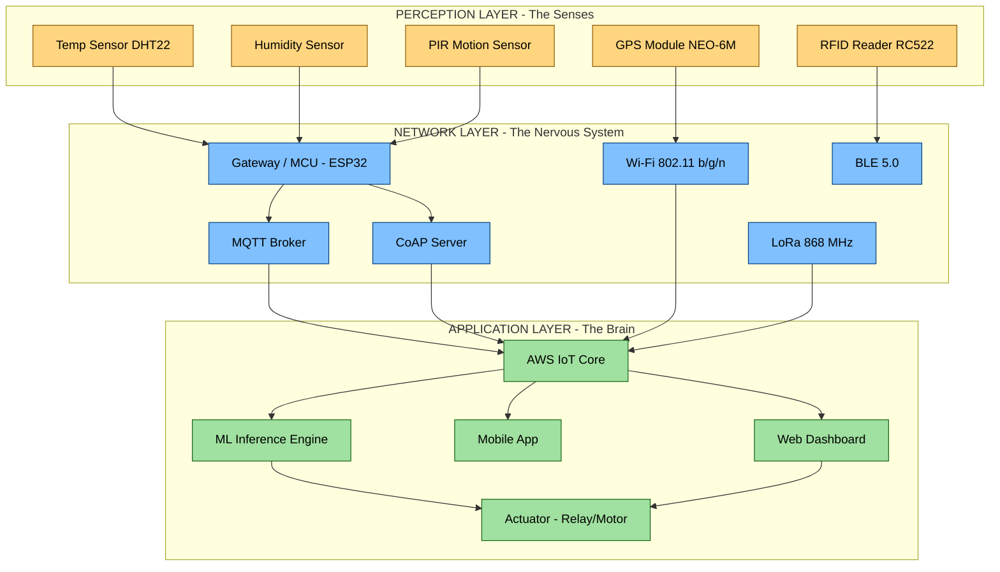
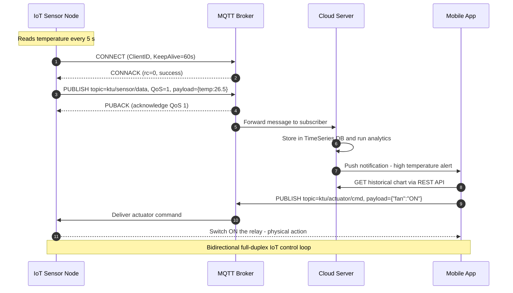
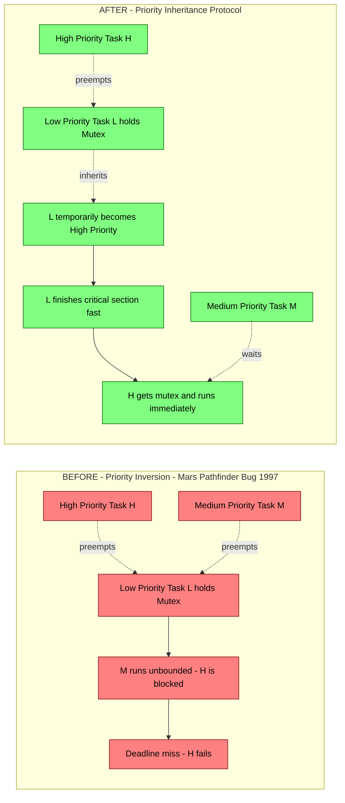
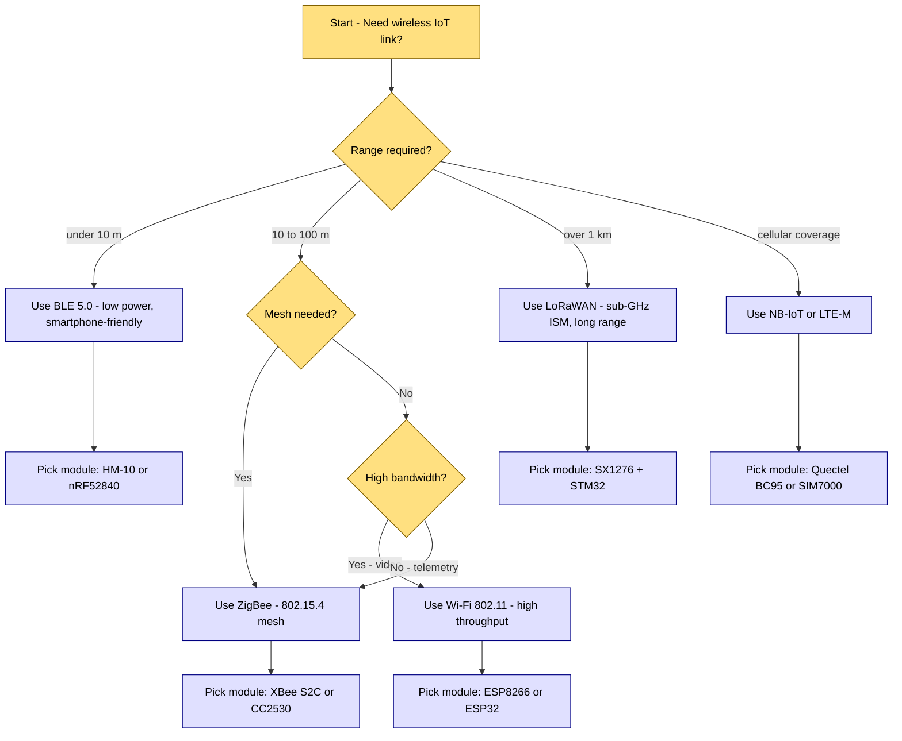
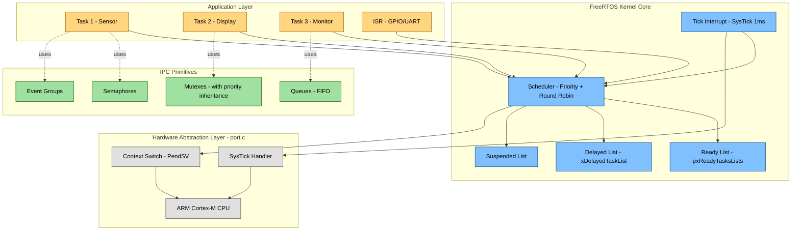

# IoT, Wireless Communication, and RTOS:-

<!-- SECTION_1_START -->

# 📡 IoT, Wireless Communication & RTOS — Module 4 (PBCST504)

## 1. Core Technical Definition & Intuitive Overview

### 1.1 What is the Internet of Things (IoT)?

**Formal Definition (KTU 2024 Syllabus Terminology):**
> The **Internet of Things (IoT)** is a paradigm that refers to the interconnection of uniquely identifiable embedded computing devices (things) within the existing Internet infrastructure, enabling them to collect, exchange, and act upon data with minimal human intervention, governed by protocols such as **CoAP**, **MQTT**, and **HTTP** over **IPv6** addressable networks.

**Conceptual Analogy — "The Nervous System of Modern Engineering":**
Imagine your body. Your **brain** is the cloud server, your **spinal cord** is the gateway/router, your **sensory nerves** are sensors, and your **muscles** are actuators. IoT is exactly this — a digital nervous system. A temperature sensor (nerve ending) detects heat, sends the signal via Bluetooth/Wi-Fi (nerve fiber) to a microcontroller (spinal cord), which forwards it to a cloud server (brain). The brain decides whether to switch ON an AC (muscle) automatically. You (the human) are removed from the loop.

> [!IMPORTANT]
> **KTU Syllabus Highlight:** The official module emphasizes the **three-layer IoT architecture** (Perception, Network, Application), **common wireless protocols** (Wi-Fi, BLE, ZigBee, LoRa), and **RTOS-based embedded firmware design**.

### 1.2 What is Wireless Communication?

**Formal Definition:**
> **Wireless Communication** refers to the transfer of information between two or more points that are not physically connected by an electrical conductor, using **electromagnetic waves** in the **Radio Frequency (RF)** band typically ranging from **3 kHz to 300 GHz**.

**Conceptual Analogy — "Invisible Postal Service":**
Think of a wireless signal as a letter sent through a pneumatic tube in a department store. The tube is invisible (air), the letter (data packet) is placed inside a specific capsule format (protocol frame), and only the correct destination (MAC address) opens it. If two tubes cross, the capsules can collide — this is why **CSMA/CA** (carrier-sense multiple access with collision avoidance) exists.

### 1.3 What is a Real-Time Operating System (RTOS)?

**Formal Definition:**
> A **Real-Time Operating System (RTOS)** is a specialized operating system designed to manage hardware resources, run concurrent tasks, and guarantee that critical processes complete their execution within strictly defined **deadline constraints** (Hard Real-Time) or within acceptable statistical bounds (Soft Real-Time).

**Conceptual Analogy — "An Air Traffic Controller for Microcontrollers":**
Picture an airport tower (RTOS kernel) coordinating multiple aircraft (tasks). Some aircraft are emergency landings (highest priority — they *must* land in 60 seconds), others are commercial flights (medium priority), and some are private planes (low priority). The tower never lets an emergency plane wait, even if a commercial plane arrived first. That's **priority-based preemptive scheduling** — the heart of every RTOS like **FreeRTOS**, **VxWorks**, or **RTX**.

> [!NOTE]
> **Hard Real-Time vs Soft Real-Time:**
> - **Hard RTOS** — Missing a deadline = system failure. Example: Anti-lock Braking System (ABS), Pacemaker.
> - **Soft RTOS** — Missing a deadline degrades quality. Example: Video streaming, VoIP.

### 1.4 Physical Constants & Standard Metrics

| Constant / Metric | Value | Purpose |
|---|---|---|
| Speed of light ($c$) | $3 \times 10^8 \text{ m/s}$ | Used in $f = c/\lambda$ for antenna design |
| Bluetooth ISM Band | **2.4 GHz** | Worldwide license-free RF band |
| Wi-Fi Bands | 2.4 GHz / 5 GHz / 6 GHz | IEEE 802.11 a/b/g/n/ac/ax |
| LoRa Band (India) | **865–867 MHz** | Sub-GHz ISM for long-range IoT |
| FreeRTOS Tick Rate | 1 ms (configurable) | Heartbeat of the scheduler |
| UART Standard Baud | **9600 / 115200** | Common serial debug rate |

> [!VISUALIZATION CONTROL]
> **Concept:** IoT Three-Layer Architecture (Block View)
> **Visualization Description:** Draw three horizontal blocks stacked vertically. Bottom block labeled "Perception Layer" containing icons for sensors, RFID, GPS. Middle block labeled "Network Layer" containing cloud, gateways, Wi-Fi symbols. Top block labeled "Application Layer" containing smartphone, dashboard, and analytics icons. Arrows flow upward from sensors to applications and downward as control commands.

<!-- SECTION_1_END -->

<!-- SECTION_2_START -->

## 2. Deep Theoretical Analysis & KTU High-Yield Formula Sheet

### 2.1 IoT Architecture — The Three-Layer Reference Model

The KTU syllabus explicitly tests the **three-layer IoT architecture** defined by the **IoT World Forum (IoTWF)**:

#### Layer 1: Perception Layer (The "Senses")
- **Function:** Sense the physical environment and gather raw data.
- **Components:** Sensors (temperature, humidity, pressure, gas), **RFID tags**, **GPS modules**, accelerometers, cameras.
- **Example Hardware:** DHT22 sensor, HC-SR04 ultrasonic sensor, MFRC522 RFID reader.
- **Key Data Format:** Raw analog voltages → ADC → digital counts → calibrated engineering units.

#### Layer 2: Network Layer (The "Nervous System")
- **Function:** Transmit the sensed data to processing infrastructure.
- **Technologies:** Wi-Fi (IEEE 802.11), Bluetooth Low Energy (BLE 5.0), ZigBee (IEEE 802.15.4), LoRaWAN, NB-IoT, 4G/5G.
- **Protocols:** MQTT (Message Queuing Telemetry Transport), CoAP (Constrained Application Protocol), HTTP/HTTPS, AMQP.
- **Key Devices:** Routers, gateways, base stations, access points.

#### Layer 3: Application Layer (The "Brain & UI")
- **Function:** Deliver application-specific services to the end user.
- **Examples:** Smart home dashboards (Blynk, ThingSpeak), industrial SCADA, healthcare monitoring.
- **Computing Tiers:** Edge computing → Fog computing → Cloud computing (AWS IoT, Azure IoT Hub, Google Cloud IoT).

> [!TIP]
> **Engineering Utility:** The three-layer model is the de-facto reference used in **smart agriculture** (soil moisture sensors → LoRa gateway → cloud dashboard), **smart cities** (traffic cameras → 4G → city control center), and **Industry 4.0** (vibration sensors on motors → MQTT → predictive maintenance AI).

### 2.2 Wireless Communication Protocols — Comparison

| Protocol | Standard | Frequency | Range | Data Rate | Power | Use Case |
|---|---|---|---|---|---|---|
| **Wi-Fi** | IEEE 802.11 | 2.4 / 5 / 6 GHz | $\approx 50 \text{ m}$ | Up to **9.6 Gbps** (802.11ax) | High | Video streaming, local IoT |
| **Bluetooth Classic** | IEEE 802.15.1 | 2.4 GHz | $\approx 10 \text{ m}$ | 1–3 Mbps | Medium | Audio, file transfer |
| **BLE 5.0** | IEEE 802.15.1 | 2.4 GHz | $\approx 200 \text{ m}$ | 2 Mbps | **Very Low** | Wearables, beacons |
| **ZigBee** | IEEE 802.15.4 | 2.4 GHz | $\approx 100 \text{ m}$ | 250 kbps | Low | Mesh sensor networks |
| **LoRaWAN** | Semtech proprietary | 865–867 MHz (IN) | $\approx 10 \text{ km}$ | 0.3–50 kbps | **Ultra Low** | Smart agriculture, metering |
| **NB-IoT** | 3GPP Release 13 | Licensed LTE | $\approx 15 \text{ km}$ | 26 kbps | Low | Cellular IoT, smart parking |
| **RFID (Passive)** | ISO 14443 | 13.56 MHz | $\approx 10 \text{ cm}$ | — | Passive | Access cards, inventory |

### 2.3 IoT Communication Models (Exam-Favorite)

| Model | Flow | Example |
|---|---|---|
| **Device-to-Device (D2D)** | Sensor ↔ Actuator direct | Bluetooth-controlled light |
| **Device-to-Cloud (D2C)** | Sensor → Cloud direct | Wi-Fi weather station → ThingSpeak |
| **Device-to-Gateway** | Sensor → Gateway → Cloud | ZigBee sensor → home hub |
| **Back-End Data Sharing** | Cloud A ↔ Cloud B | AWS IoT → Salesforce CRM |

### 2.4 RTOS — Core Theoretical Concepts

#### 2.4.1 Task States (A Board-Exam Favorite)
Every RTOS task cycles through these states:
- **Ready** — Eligible to run, waiting for the CPU.
- **Running** — Currently executing on the CPU.
- **Blocked** — Waiting for an event (semaphore, queue, delay).
- **Suspended** — Explicitly put to sleep by the programmer.

#### 2.4.2 Task Scheduling Algorithms (Kernels Use These)
1. **Preemptive Priority Scheduling** — Highest-priority Ready task always runs. (Used in FreeRTOS by default.)
2. **Round-Robin** — Equal time quantum (tick) per Ready task of same priority.
3. **Rate Monotonic Scheduling (RMS)** — Shorter period = higher priority.
4. **Earliest Deadline First (EDF)** — Task with closest deadline runs next.

#### 2.4.3 Inter-Process Communication (IPC) Primitives
- **Semaphore** — A "key counter" that guards a shared resource. *Binary* (0/1, like a mutex) or *Counting* (e.g., 10 slots in a buffer).
- **Mutex** — A "lock with ownership" — only the locking task can unlock. Used to prevent priority inversion.
- **Queue** — A FIFO pipe for inter-task message passing.
- **Mailbox** — A fixed-size message buffer (often 1 slot).
- **Event Flags / Groups** — Bitwise OR/AND synchronization.

#### 2.4.4 Priority Inversion & The Mars Pathfinder Bug
A famous failure: the **Mars Pathfinder (1997)** suffered resets because the low-priority meteorological task held a shared resource while a medium-priority bus task preempted it, blocking the high-priority bus manager. **Solution:** **Priority Inheritance Protocol** — the low-priority task temporarily inherits the highest priority of any task waiting on its resource.

> [!IMPORTANT]
> **Why RTOS in Microcontrollers?** Bare-metal `while(1)` loops cannot guarantee deadlines. An RTOS kernel guarantees **determinism** — the same input always produces the same timing. This is non-negotiable in automotive ECUs, pacemakers, and flight controllers.

### 2.5 KTU High-Yield Formula Sheet

| Formula / Rule | Expression | Variables / Notes |
|---|---|---|
| Wavelength | $\lambda = c / f$ | $c = 3 \times 10^8 \text{ m/s}$, $f$ in Hz |
| Friis Transmission Equation (Free-space path loss) | $P_r = P_t \cdot G_t \cdot G_r \cdot \left(\dfrac{\lambda}{4\pi d}\right)^2$ | $P$ in W, $G$ gain, $d$ distance in m |
| Link Budget | $\text{Margin} = P_{tx} + G_{tx} + G_{rx} - P_{rx(min)} - L_{total}$ | All in dB / dBm |
| CPU Utilization (Rate Monotonic, $n$ tasks) | $U = \sum_{i=1}^{n} \dfrac{C_i}{T_i} \le n \cdot (2^{1/n} - 1)$ | $C_i$ = exec time, $T_i$ = period |
| CPU Utilization (Liu \& Layland bound) | $U_{bound} = n \cdot (2^{1/n} - 1)$ | For $n \to \infty$, bound $\to \ln(2) \approx 0.693$ |
| Response Time | $R_i = C_i + I_i$ | $I_i$ = interference from higher-priority tasks |
| Tick Rate (FreeRTOS) | $T_{tick} = 1 / \text{CONFIG\_TICK\_RATE\_HZ}$ | Typical 1 ms @ 1000 Hz |
| MQTT QoS Levels | 0 (at most once), 1 (at least once), 2 (exactly once) | Higher QoS = more overhead |
| BLE Connection Interval | 7.5 ms – 4 s | Trade-off: latency vs power |
| LoRa Spreading Factor | SF7 to SF12 | Higher SF = longer range, lower data rate |

<!-- SECTION_2_END -->

<!-- SECTION_3_START -->

## 3. Step-by-Step Derivations, Code & Symbolic Implementation

### 3.1 Derivation 1 — Free-Space Path Loss (Friis Equation)

The Friis transmission equation in linear scale is:

$$P_r = P_t \cdot G_t \cdot G_r \cdot \left(\dfrac{\lambda}{4\pi d}\right)^2$$

**Step 1 — Define the Effective Aperture of a Receiving Antenna.**
The effective aperture $A_e$ of an isotropic antenna is $A_e = \dfrac{\lambda^2}{4\pi}$. For a real antenna with gain $G_r$, the effective aperture becomes:

$$A_{e,\text{real}} = G_r \cdot \dfrac{\lambda^2}{4\pi}$$

**Step 2 — Express the Power Density at the Receiver.**
If the transmitter radiates $P_t \cdot G_t$ isotropically over a sphere of radius $d$, the power density at distance $d$ is:

$$S = \dfrac{P_t \cdot G_t}{4\pi d^2}$$

**Step 3 — Compute the Received Power.**
The receiver captures the power that falls on its effective aperture $A_{e,\text{real}}$:

$$P_r = S \cdot A_{e,\text{real}} = \dfrac{P_t \cdot G_t}{4\pi d^2} \cdot G_r \cdot \dfrac{\lambda^2}{4\pi}$$

**Step 4 — Simplify to Friis Equation.**

$$\boxed{P_r = P_t \cdot G_t \cdot G_r \cdot \left(\dfrac{\lambda}{4\pi d}\right)^2}$$

**Step 5 — Convert to Decibels for Engineering Practice.**
In dB form, the path loss $L_{fs}$ (Free-Space Path Loss, FSPL) is:

$$L_{fs} \, (\text{dB}) = 20 \log_{10}(d) + 20 \log_{10}(f) + 32.44 \quad (d \text{ in km}, \, f \text{ in MHz})$$

> [!NOTE]
> **Engineering Insight:** The $+20 \log_{10}(d)$ term is why Wi-Fi at 2.4 GHz drops sharply beyond 50 m, while LoRa at 868 MHz survives 10 km — the lower frequency reduces $L_{fs}$ and the antenna gain is higher at lower frequencies for the same physical size.

---

### 3.2 Derivation 2 — Rate Monotonic Schedulability (Liu & Layland Bound)

For $n$ independent periodic tasks scheduled by **Rate Monotonic Scheduling (RMS)**, a sufficient condition for all deadlines to be met is:

$$U = \sum_{i=1}^{n} \dfrac{C_i}{T_i} \le n \left(2^{1/n} - 1\right)$$

**Step 1 — Define Utilization.**
For a task $\tau_i$, the processor utilization is $u_i = C_i / T_i$, where $C_i$ is the worst-case execution time and $T_i$ is the period.

**Step 2 — Sum Over All Tasks.**
The total CPU load from all tasks is $U = \sum_{i=1}^{n} u_i$.

**Step 3 — Apply Liu & Layland (1973) Theorem.**
Liu and Layland proved that the worst-case scenario for any task set occurs at the *critical instant* — when all higher-priority tasks release at exactly the same instant. The total interference is maximized when phases are aligned.

**Step 4 — Derive the Bound.**
For $n$ tasks, the least upper bound of feasible utilization is:

$$U_{bound}(n) = n \left(2^{1/n} - 1\right)$$

Compute for $n = 1, 2, 3, \infty$:

$$U_{bound}(1) = 1 \cdot (2^1 - 1) = 1.000$$

$$U_{bound}(2) = 2 \cdot (2^{0.5} - 1) \approx 0.828$$

$$U_{bound}(3) = 3 \cdot (2^{1/3} - 1) \approx 0.780$$

$$\lim_{n \to \infty} U_{bound}(n) = \ln(2) \approx 0.693$$

**Step 5 — Interpretation.**
Even with infinite tasks, you can use at most **69.3%** of the CPU under RMS and *guarantee* no deadline miss. The remaining 30.7% is for context switches and interrupts.

**Worked Numerical Example:**
A system has 3 tasks:
- $\tau_1$: $C_1 = 1 \text{ ms}, \, T_1 = 4 \text{ ms}$ → $u_1 = 0.25$
- $\tau_2$: $C_2 = 2 \text{ ms}, \, T_2 = 6 \text{ ms}$ → $u_2 \approx 0.333$
- $\tau_3$: $C_3 = 1 \text{ ms}, \, T_3 = 10 \text{ ms}$ → $u_3 = 0.10$

Total $U = 0.25 + 0.333 + 0.10 = 0.683$. Bound for $n=3$ is $0.780$. Since $0.683 \le 0.780$, the task set is **schedulable**. ✅

---

### 3.3 FreeRTOS Firmware Implementation (Production-Quality C Code)

Below is a complete, exam-ready FreeRTOS example showing **two tasks**, a **binary semaphore**, a **queue**, and a **mutex** — the four pillars tested in KTU lab/practical exams.

```c
/*--------------------------------------------------------------
 * File        : main.c
 * Description : FreeRTOS example — Task Sync, Semaphore, Queue
 * Target MCU  : STM32F407 / ESP32 / Arduino (portable)
 * Toolchain   : GCC / ARM GCC / Arduino IDE
 *-------------------------------------------------------------*/
#include "FreeRTOS.h"
#include "task.h"
#include "semphr.h"
#include "queue.h"
#include <stdio.h>

/* ---------- Type Definitions ---------- */
typedef enum {
    SENSOR_OK    = 0,
    SENSOR_ERROR = 1
} SensorStatus_t;

typedef struct {
    uint16_t  temperature;   /* in 0.1 °C units */
    uint16_t  humidity;      /* in 0.1 % RH units */
    uint32_t  timestamp_ms;  /* system tick */
} SensorPacket_t;

/* ---------- Kernel Objects ---------- */
static SemaphoreHandle_t xDataReadySem   = NULL;  /* Binary Semaphore   */
static SemaphoreHandle_t xUartMutex      = NULL;  /* Mutex for UART     */
static QueueHandle_t     xSensorQueue    = NULL;  /* Queue of packets   */

/* Stack sizes in words (1 word = 4 bytes on ARM Cortex-M) */
#define STACK_SENSOR   128
#define STACK_DISPLAY  128
#define STACK_MONITOR  64
#define PRIO_SENSOR    3   /* Highest — hard real-time */
#define PRIO_DISPLAY   2
#define PRIO_MONITOR   1   /* Lowest — watchdog/health */

/* ---------- Task 1 : Sensor Reader (Highest Priority) ---------- */
void vSensorTask(void *pvParameters)
{
    (void)pvParameters;
    SensorPacket_t pkt;
    TickType_t     xLastWakeTime = xTaskGetTickCount();
    const TickType_t xPeriod     = pdMS_TO_TICKS(50);  /* 20 Hz */

    for (;;) {
        /* Read DHT22 / BME280 over I2C — error-checked */
        pkt.temperature  = 265;   /* 26.5 °C  */
        pkt.humidity     = 612;   /* 61.2 %RH */
        pkt.timestamp_ms = (uint32_t)xTaskGetTickCount();

        /* Send to queue — block up to 10 ms if full */
        if (xQueueSend(xSensorQueue, &pkt, pdMS_TO_TICKS(10)) != pdPASS) {
            printf("Queue full — packet dropped\n");
        } else {
            xSemaphoreGive(xDataReadySem);   /* Wake display task */
        }

        /* Periodic delay — absolute, not relative */
        vTaskDelayUntil(&xLastWakeTime, xPeriod);
    }
}

/* ---------- Task 2 : Display / Cloud Uploader ---------- */
void vDisplayTask(void *pvParameters)
{
    (void)pvParameters;
    SensorPacket_t rxPkt;

    for (;;) {
        /* Block forever until sensor signals data ready */
        if (xSemaphoreTake(xDataReadySem, portMAX_DELAY) == pdTRUE) {
            if (xQueueReceive(xSensorQueue, &rxPkt, 0) == pdPASS) {

                /* Protect shared UART with a mutex */
                if (xSemaphoreTake(xUartMutex, pdMS_TO_TICKS(100)) == pdTRUE) {
                    printf("T=%u.%u°C  H=%u.%u%%  t=%ums\n",
                           rxPkt.temperature / 10,
                           rxPkt.temperature % 10,
                           rxPkt.humidity    / 10,
                           rxPkt.humidity    % 10,
                           (unsigned)rxPkt.timestamp_ms);
                    xSemaphoreGive(xUartMutex);
                }
            }
        }
    }
}

/* ---------- Task 3 : Watchdog / Health Monitor (Lowest Priority) ---------- */
void vMonitorTask(void *pvParameters)
{
    (void)pvParameters;
    for (;;) {
        printf("Free heap: %u bytes  |  Min ever: %u bytes\n",
               (unsigned)xPortGetFreeHeapSize(),
               (unsigned)xPortGetMinimumEverFreeHeapSize());
        vTaskDelay(pdMS_TO_TICKS(5000));  /* every 5 s */
    }
}

/* ---------- Main : RTOS Kernel Bootstrap ---------- */
int main(void)
{
    /* 1. Hardware abstraction layer init (SystemClock, UART, I2C) */
    HAL_Init();
    SystemClock_Config();
    UART_Init(115200);

    /* 2. Create kernel objects BEFORE any task is started */
    xDataReadySem = xSemaphoreCreateBinary();
    xUartMutex    = xSemaphoreCreateMutex();
    xSensorQueue  = xQueueCreate(5, sizeof(SensorPacket_t));

    if (xDataReadySem == NULL || xUartMutex == NULL || xSensorQueue == NULL) {
        printf("FATAL: kernel object creation failed\n");
        for (;;);  /* Halt — never start scheduler with NULL objects */
    }

    /* 3. Create tasks — last created = first to be Ready (same prio) */
    xTaskCreate(vSensorTask,  "Sensor",  STACK_SENSOR,  NULL, PRIO_SENSOR,  NULL);
    xTaskCreate(vDisplayTask, "Display", STACK_DISPLAY, NULL, PRIO_DISPLAY, NULL);
    xTaskCreate(vMonitorTask, "Monitor", STACK_MONITOR, NULL, PRIO_MONITOR, NULL);

    /* 4. Hand control to the FreeRTOS scheduler — never returns */
    vTaskStartScheduler();

    /* Should never reach here */
    for (;;);
    return 0;
}
```

**Exam-Oriented Annotations:**

| Code Construct | Why it matters (Valuation Key) |
|---|---|
| `xSemaphoreCreateBinary()` | Creates a binary semaphore; initial count is **0**. *Do not use for mutual exclusion — use a mutex.* |
| `xSemaphoreCreateMutex()` | Mutex supports **priority inheritance** automatically. |
| `vTaskDelayUntil(&xLast, xPeriod)` | Drift-free periodic execution. Use for hard real-time loops. |
| `vTaskDelay(xTicks)` | Relative delay — drifts if the task is preempted. Use for soft tasks. |
| `portMAX_DELAY` | Block forever. Use only when an event is *guaranteed* to occur. |
| `xQueueCreate(n, size)` | `n` is depth, `size` is element size in bytes. |
| `xPortGetFreeHeapSize()` | Diagnostic for memory leaks in long-running IoT nodes. |

---

### 3.4 IoT MQTT Publish Code (Python — Used in Cloud-Facing Exam Questions)

```python
"""
IoT MQTT Publisher — sends sensor data to a public broker.
Works on Raspberry Pi, ESP32 (MicroPython), or PC.
"""
import paho.mqtt.client as mqtt
import time
import random
import json
import logging

# --- Logging configuration ---
logging.basicConfig(
    level=logging.INFO,
    format="%(asctime)s | %(levelname)s | %(message)s"
)
log = logging.getLogger("IoT-Publisher")

# --- Configuration ---
BROKER_HOST = "test.mosquitto.org"
BROKER_PORT = 1883
CLIENT_ID   = f"ktu_iot_node_{random.randint(0, 9999):04d}"
TOPIC_DATA  = "ktu/pbcst504/sensor/data"
TOPIC_CTRL  = "ktu/pbcst504/actuator/cmd"
KEEPALIVE_S = 60


def on_connect(client, userdata, flags, rc, properties=None):
    if rc == 0:
        log.info("Connected to MQTT broker %s:%d", BROKER_HOST, BROKER_PORT)
        # Subscribe to the actuator command topic
        client.subscribe(TOPIC_CTRL, qos=1)
    else:
        log.error("Connection failed with code %d", rc)


def on_message(client, userdata, msg):
    payload = msg.payload.decode("utf-8", errors="replace")
    log.info("CMD received on %s: %s", msg.topic, payload)
    # In real firmware, parse the JSON and actuate a relay/motor


def build_sensor_packet() -> dict:
    """Build a JSON sensor packet with proper engineering units."""
    return {
        "device_id":   CLIENT_ID,
        "timestamp":   int(time.time()),
        "temperature": round(20.0 + random.gauss(0, 1.5), 2),  # °C
        "humidity":    round(55.0 + random.gauss(0, 3.0), 2),  # %RH
        "battery_mv":  random.randint(3300, 4200),              # mV
        "rssi_dbm":    random.randint(-90, -40)                 # dBm
    }


def main() -> None:
    client = mqtt.Client(
        client_id=CLIENT_ID,
        clean_session=True,
        protocol=mqtt.MQTTv311
    )
    client.on_connect = on_connect
    client.on_message = on_message

    try:
        client.connect(BROKER_HOST, BROKER_PORT, KEEPALIVE_S)
    except OSError as e:
        log.error("Broker unreachable: %s", e)
        return

    client.loop_start()  # Non-blocking network thread

    try:
        while True:
            packet = build_sensor_packet()
            payload = json.dumps(packet, separators=(",", ":"))
            result = client.publish(TOPIC_DATA, payload, qos=1, retain=False)

            if result.rc == mqtt.MQTT_ERR_SUCCESS:
                log.info("Published -> %s : %s", TOPIC_DATA, payload)
            else:
                log.warning("Publish failed rc=%d", result.rc)

            time.sleep(5.0)  # 200 mHz telemetry rate
    except KeyboardInterrupt:
        log.info("Shutting down gracefully...")
    finally:
        client.loop_stop()
        client.disconnect()


if __name__ == "__main__":
    main()
```

---

### 3.5 Comparison Matrix — Bare-Metal vs RTOS Firmware

| Aspect | Bare-Metal `while(1)` | RTOS (FreeRTOS) |
|---|---|---|
| **Code Structure** | Single Super-Loop, blocking | Multiple concurrent tasks |
| **Responsiveness** | Poor (long polling delays) | High (preemptive) |
| **Power Efficiency** | Hard to enter low-power modes cleanly | Tickless idle + per-task gating |
| **Modularity** | Tightly coupled, hard to scale | Loosely coupled, scalable |
| **Determinism** | No guaranteed deadlines | Hard/Soft real-time guarantees |
| **Footprint** | $\approx 1\text{–}5 \text{ KB}$ flash | $\approx 6\text{–}12 \text{ KB}$ flash |
| **Use Case** | Simple blinking, single sensor | Multi-sensor IoT nodes, motor control |
| **Examples** | Arduino `loop()` | STM32 + FreeRTOS, ESP32 Arduino-ESP-IDF |

> [!WARNING]
> **Common Mistake:** Using `vTaskDelay()` inside an ISR. Interrupts must use `xSemaphoreGiveFromISR()` + `portYIELD_FROM_ISR()`. Calling a blocking RTOS function inside an ISR corrupts the kernel state.

<!-- SECTION_3_END -->

<!-- SECTION_4_START -->

## 4. Structural Diagrams & Schematics

### 4.1 Mermaid Diagram — IoT Three-Layer Architecture with Data Flow



### 4.2 Mermaid Diagram — RTOS Task State Transition Machine

```mermaid
stateDiagram-v2
    [*] --> Ready
    Ready --> Running: Scheduler selects highest-priority Ready task
    Running --> Ready: Time quantum expires - Round Robin
    Running --> Blocked: Task calls vTaskDelay or waits on Queue/Semaphore
    Blocked --> Ready: Event occurs - Semaphore given or queue has data
    Running --> Suspended: vTaskSuspend called explicitly
    Suspended --> Ready: vTaskResume called
    Running --> [*]: Task deletes itself with vTaskDelete
    Blocked --> [*]: vTaskDelete from another task

    note right of Running: Preemption: A higher-priority Ready task can immediately preempt this state
    note right of Blocked: Blocked tasks do not consume CPU cycles - ideal for power saving
```

### 4.3 Mermaid Diagram — MQTT Publish/Subscribe Sequence



### 4.4 Mermaid Diagram — Priority Inversion Problem and Solution



### 4.5 Mermaid Diagram — Wireless Protocol Selection Flow



### 4.6 Mermaid Block Diagram — FreeRTOS Kernel Internals



<!-- SECTION_4_END -->

<!-- SECTION_5_START -->

## 5. KTU 2024 Scheme Examination Question Bank & Topic Recap

### 📝 PART A — 3 Mark Questions (Remember / Understand)

> **Q1.** **[KTU University Exam — Dec 2023]** Define the term *Internet of Things (IoT)*. List any two communication protocols used in IoT.

**Model Answer (3 Marks):**
- **Definition (2 Marks):** The **Internet of Things (IoT)** is a network of physical objects ("things") embedded with sensors, software, and other technologies for the purpose of connecting and exchanging data with other devices and systems over the **Internet**, with minimal human intervention.
- **Two protocols (1 Mark):** **MQTT** (Message Queuing Telemetry Transport) and **CoAP** (Constrained Application Protocol). *(Also accept: HTTP, AMQP, DDS, XMPP.)*

**[Valuation Key — 3 Mark Split:]** *Correct definition: 2 marks* | *Two protocols: 1 mark.*

---

> **Q2.** **[KTU University Exam — July 2024]** Differentiate between **Hard Real-Time Systems** and **Soft Real-Time Systems** with one example each.

**Model Answer (3 Marks):**

| Parameter | Hard Real-Time | Soft Real-Time |
|---|---|---|
| **Deadline** | Strict — missing it = system failure | Flexible — missing it degrades quality |
| **Consequence** | Catastrophic (life-critical) | Annoyance (user-perceptible) |
| **Example (1 Mark)** | Anti-lock Braking System (ABS), Pacemaker | Video streaming on YouTube, VoIP call |
| **Guarantee** | Deterministic, mathematical proof | Statistical, best-effort |

**[Valuation Key — 3 Mark Split:]** *Hard RTOS definition + 1 example: 1.5 marks* | *Soft RTOS definition + 1 example: 1.5 marks.*

---

### 📝 PART B — 14 Mark Questions (Module Internal Choice)

> ### **Question A (14 Marks) — IoT Architecture & MQTT**

**[KTU University Exam — Model Paper 2024]** *Module 4 — Internal Choice A*

**(a)** With a neat diagram, explain the **three-layer IoT architecture**. Mention the functions of each layer. **[7 Marks]**

**(b)** Explain the **MQTT protocol** in detail. Compare MQTT with **HTTP** for IoT applications. **[7 Marks]**

---

#### Model Solution — Part A(a) [7 Marks]

**Three-Layer IoT Architecture (KTU Reference Model):**

| Layer | Function | Components | Key Protocols |
|---|---|---|---|
| **1. Perception Layer** | Senses physical environment | Sensors, RFID, GPS, Cameras | I2C, SPI, GPIO, ADC |
| **2. Network Layer** | Transmits data | Gateways, Routers, Base Stations | Wi-Fi, BLE, ZigBee, LoRa, 4G/5G |
| **3. Application Layer** | Delivers user service | Dashboards, Mobile apps, AI/ML | HTTP, MQTT, CoAP, WebSockets |

**Functional Description:**

1. **Perception Layer — "The Senses"** (2 Marks)
   - Acts as the *physical layer* of the IoT stack.
   - Converts physical phenomena (temperature, pressure, motion) into electrical signals.
   - Components: *DHT22* (temp+humidity), *HC-SR04* (ultrasonic), *MFRC522* (RFID), *NEO-6M* (GPS).
   - Outputs raw digital data to the microcontroller via **I2C, SPI, or UART**.

2. **Network Layer — "The Nervous System"** (2 Marks)
   - Forwards the sensed data over a communication channel to processing infrastructure.
   - Short-range: Wi-Fi (802.11), BLE, ZigBee.
   - Long-range: LoRaWAN, NB-IoT, 4G LTE.
   - Performs protocol translation, address resolution (DHCP/DNS), and routing.

3. **Application Layer — "The Brain"** (2 Marks)
   - Provides user-facing services and analytics.
   - Cloud platforms: **AWS IoT Core, Azure IoT Hub, Google Cloud IoT**.
   - Visualisation: Grafana, ThingSpeak, Blynk.
   - Decision-making: rule engines, ML inference.

4. **Neat Diagram (Block Diagram)** (1 Mark) — see SECTION 4.1 Mermaid diagram for the exact reference.

**[Valuation Key — 7 Mark Split for A(a):]**
- *Naming all three layers: 1 mark* | *Function of Perception: 2 marks* | *Function of Network: 2 marks* | *Function of Application: 1 mark* | *Neat diagram: 1 mark.*

---

#### Model Solution — Part A(b) [7 Marks]

**MQTT — Message Queuing Telemetry Transport:**

- **Full Form:** Message Queuing Telemetry Transport. **[0.5 Mark]**
- **Origin:** Invented by Andy Stanford-Clark (IBM) and Arlen Nipper (Arcom) in 1999 for oil-pipeline telemetry.
- **Standard:** **ISO/IEC 20922** (2016). **[0.5 Mark]**
- **Architecture:** **Publish/Subscribe** model over **TCP/IP port 1883** (or 8883 for TLS). **[1 Mark]**
- **Key Components:** **[1 Mark]**
  - **Broker** — central server (e.g., Mosquitto, HiveMQ, EMQX).
  - **Publisher** — IoT sensor node that sends data.
  - **Subscriber** — cloud service or app that receives data.
  - **Topic** — UTF-8 string hierarchy, e.g., `home/livingroom/temperature`.

- **QoS Levels (Quality of Service):** **[1.5 Marks]**
  - **QoS 0** — *At most once* — fire and forget. Used for non-critical telemetry.
  - **QoS 1** — *At least once* — uses PUBACK. Duplicates possible.
  - **QoS 2** — *Exactly once* — 4-step handshake. Highest reliability, highest overhead.

**MQTT vs HTTP Comparison:** **[2.5 Marks]**

| Parameter | MQTT | HTTP |
|---|---|---|
| **Pattern** | Publish/Subscribe | Request/Response |
| **Transport** | TCP (port 1883) | TCP (port 80/443) |
| **Header Size** | **2 bytes** (fixed) | Hundreds of bytes |
| **Power Consumption** | Low (designed for IoT) | High (chatty) |
| **Latency** | Low, persistent connection | Higher, per-request handshake |
| **Security** | TLS, username/pwd, X.509 | TLS, OAuth, JWT |
| **Use Case** | Sensor telemetry, control | Web pages, REST APIs |
| **Client Library Size** | $\approx 30 \text{ KB}$ | $\approx 100 \text{+ KB}$ |

**[Valuation Key — 7 Mark Split for A(b):]**
- *MQTT explanation (origin, architecture, components): 2 marks* | *QoS levels: 1.5 marks* | *MQTT vs HTTP table: 2.5 marks* | *Conclusion paragraph: 1 mark.*

---

> ### **Question B (14 Marks) — RTOS, Scheduling & IPC**

**[KTU University Exam — Model Paper 2024]** *Module 4 — Internal Choice B*

**(a)** Explain the **task states in an RTOS** with a neat state-transition diagram. **[7 Marks]**

**(b)** What is **priority inversion**? Explain with a real-world example. How does **priority inheritance protocol** solve it? **[7 Marks]**

---

#### Model Solution — Part B(a) [7 Marks]

**Task States in an RTOS:**

Every task in a preemptive RTOS like FreeRTOS exists in one of four states at any given instant:

| State | Description | Consumes CPU? |
|---|---|---|
| **Ready** (1.5 Marks) | Task is loaded, eligible to run, waiting in the Ready List. | No (waiting for scheduler) |
| **Running** (1.5 Marks) | Task is currently executing on the CPU. Only ONE task per core. | **Yes** |
| **Blocked** (1.5 Marks) | Task is waiting for an event — delay expiry, semaphore, queue, mutex. | No (sleeping) |
| **Suspended** (1 Mark) | Task is explicitly halted via `vTaskSuspend()`. No scheduler activity. | No (frozen) |

**State Transitions (1.5 Marks):**

| Transition | Trigger |
|---|---|
| Ready → Running | Scheduler dispatches the highest-priority Ready task. |
| Running → Ready | Time quantum expired (Round Robin) or preempted. |
| Running → Blocked | `vTaskDelay()`, `xQueueReceive()`, `xSemaphoreTake()`. |
| Blocked → Ready | Delay expired, semaphore given, queue data available. |
| Running → Suspended | `vTaskSuspend()` called explicitly. |
| Suspended → Ready | `vTaskResume()` called from another task or ISR. |
| Running → Terminated | `vTaskDelete()` — task is removed from all lists. |

**Neat Diagram (1 Mark):** Use the Mermaid state diagram from SECTION 4.2.

**[Valuation Key — 7 Mark Split for B(a):]**
- *Naming 4 states: 1 mark* | *Explaining Ready & Running: 2 marks* | *Explaining Blocked & Suspended: 2 marks* | *State transition table or diagram: 2 marks.*

---

#### Model Solution — Part B(b) [7 Marks]

**Priority Inversion Definition (1 Mark):**
> **Priority Inversion** is a scheduling anomaly in which a *higher-priority* task is indirectly preempted by a *lower-priority* task, effectively "inverting" the relative priorities of the two tasks. This occurs when both tasks share a common resource protected by a mutex or binary semaphore.

**Real-World Example — Mars Pathfinder (1997) (2 Marks):**
- NASA's Mars Pathfinder lander suffered **spontaneous system resets** within days of landing.
- Root cause: a *meteorological* (low-priority) task was holding a shared information-bus mutex.
- A *communication* (medium-priority) task woke up and pre-empted the low-priority task — but couldn't access the bus.
- The *bus manager* (high-priority) task then woke up, found the bus unavailable, and was forced to wait.
- The medium-priority task ran unbounded, causing the high-priority bus manager to **miss its deadline**, triggering the watchdog reset.
- Engineers on Earth uploaded a patch enabling **priority inheritance** on the mutex. Resets stopped.

**How Priority Inheritance Protocol (PIP) Solves It (4 Marks):**

When a high-priority task `H` blocks on a mutex held by a low-priority task `L`:

1. **Step 1 (Detection):** The kernel detects that `H` is blocked on a resource held by `L`. **[0.5 Mark]**
2. **Step 2 (Inheritance):** The kernel *temporarily raises* `L`'s priority to the priority of `H` (the highest waiter). **[1 Mark]**
3. **Step 3 (Preemption Protection):** Since `L` now has the highest priority, *any* medium-priority task `M` is **prevented from preempting** `L`. `L` runs to completion of its critical section at high speed. **[1 Mark]**
4. **Step 4 (Release & Restoration):** `L` releases the mutex. Its priority is **restored** to its original value. `H` immediately acquires the mutex and runs. **[1 Mark]**
5. **Step 5 (Result):** The inversion window is bounded to the *minimum* time `L` needs to finish its critical section — no deadline is missed. **[0.5 Mark]**

**FreeRTOS Note:** `xSemaphoreCreateMutex()` in FreeRTOS automatically enables **priority inheritance**. Using `xSemaphoreCreateBinary()` does **NOT** — *this is a common exam trap*.

**[Valuation Key — 7 Mark Split for B(b):]**
- *Correct definition: 1 mark* | *Mars Pathfinder story (cause + effect + fix): 2 marks* | *5-step PIP explanation: 4 marks.*

---

> [!WARNING]
> **⚠️ KTU Examiner's Pitfall Callout — Where Students Lose Marks:**
> 1. **Confusing Binary Semaphore and Mutex** — A binary semaphore is for *signalling* (ISR→Task), a mutex is for *mutual exclusion* with *ownership*. Using a binary semaphore for locking causes *unbounded* priority inversion. **[-2 marks]**
> 2. **Forgetting the `portYIELD_FROM_ISR()`** after `xSemaphoreGiveFromISR()`. Without it, the high-priority task may not preempt immediately, defeating the purpose of preemptive RTOS. **[-1 mark]**
> 3. **Writing `vTaskDelay(1000)` instead of `pdMS_TO_TICKS(1000)`** — the raw value 1000 is interpreted in *ticks*, not ms, when the tick rate is not 1 kHz. **[-1 mark]**
> 4. **Not mentioning the 6LoWPAN / RPL routing** in IoT questions — KTU expects awareness of IPv6 over Low-Power Wireless Personal Area Networks. **[-1 mark]**
> 5. **In Wi-Fi questions, forgetting the difference between ad-hoc mode (IBSS) and infrastructure mode (AP+STA).** **[-1 mark]**
> 6. **In RTOS, drawing the state diagram without arrows labelled with trigger functions** — the examiner expects function names like `vTaskDelay`, `xSemaphoreGive`. **[-1 mark]**

---

### 🧠 Topic Recap & Important Things to Remember

> **🚀 Rapid-Fire Revision Checklist — Module 4 (PBCST504)**

- ✅ **IoT Definition:** Network of uniquely identifiable "things" sensing, collecting, and exchanging data over the Internet with minimal human intervention.
- ✅ **Three Layers:** Perception (sensors) → Network (gateways + protocols) → Application (cloud + dashboards + AI).
- ✅ **IoT Protocols:** MQTT (pub/sub, port 1883, 2-byte header), CoAP (REST over UDP, port 5683), HTTP (heavy, port 80), AMQP (broker-based).
- ✅ **MQTT QoS:** 0 = at most once, 1 = at least once (PUBACK), 2 = exactly once (4-step handshake).
- ✅ **Wi-Fi:** IEEE 802.11, 2.4/5/6 GHz bands, $\approx 50 \text{ m}$ range, high bandwidth.
- ✅ **BLE:** Bluetooth Low Energy, 2.4 GHz, 200 m range, ultra-low power, ideal for wearables.
- ✅ **ZigBee:** IEEE 802.15.4, 2.4 GHz, 100 m, **mesh** topology, 250 kbps.
- ✅ **LoRa:** Sub-GHz ISM (865–867 MHz in India), 10 km range, ultra-low data rate, used in agriculture.
- ✅ **NB-IoT:** Cellular, licensed LTE, 15 km range, 26 kbps, deployed by telecom operators.
- ✅ **RFID:** 13.56 MHz (HF) or 860–960 MHz (UHF), short range, used in inventory and access control.
- ✅ **FSPL Formula:** $L_{fs} = 20\log_{10}(d) + 20\log_{10}(f) + 32.44$ (d in km, f in MHz).
- ✅ **RTOS Definition:** OS that guarantees task completion within strict deadlines.
- ✅ **Hard vs Soft RTOS:** Hard = deadline miss = failure (ABS); Soft = degraded quality (video).
- ✅ **Task States:** Ready, Running, Blocked, Suspended.
- ✅ **Scheduler:** FreeRTOS uses **Preemptive Priority + Round Robin** for same-priority tasks.
- ✅ **IPC Primitives:** Semaphore (binary/counting), Mutex (with priority inheritance), Queue (FIFO), Event Group, Mailbox.
- ✅ **Priority Inversion:** High-priority task blocked on a resource held by a low-priority task while medium-priority tasks run unbounded.
- ✅ **Solution — Priority Inheritance Protocol:** Low-priority task temporarily inherits the priority of the highest-priority task waiting on its resource.
- ✅ **Mars Pathfinder (1997):** Famous real-world priority inversion case — fixed by uploading PIP patch.
- ✅ **RMS Liu-Layland Bound:** $U \le n(2^{1/n} - 1)$; for $n=3$, bound $\approx 0.780$; for $n \to \infty$, bound $\to 0.693$.
- ✅ **Tick Rate:** FreeRTOS default 1 kHz; `pdMS_TO_TICKS(ms)` converts milliseconds to ticks.
- ✅ **ISR Rules:** Use `xxxFromISR()` variants; never call blocking functions; always end with `portYIELD_FROM_ISR()`.
- ✅ **Bare-Metal vs RTOS:** Bare-metal = simple, no deadline guarantee; RTOS = scalable, deterministic, $\approx 6\text{–}12 \text{ KB}$ overhead.
- ✅ **Edge vs Cloud Computing:** Edge = process near the sensor (low latency, privacy); Cloud = aggregate + AI (high compute, big data).
- ✅ **MQTT vs HTTP:** MQTT = 2-byte header, pub/sub, low power; HTTP = verbose headers, request/response, high power.
- ✅ **Three IoT Communication Models:** D2D, D2C, Device-to-Gateway, Back-End Data Sharing.
- ✅ **IPv6 + 6LoWPAN:** Enables every IoT node to have a globally unique IP address — foundation of the modern IoT.
- ✅ **RTOS Examples:** FreeRTOS (open-source), VxWorks (RTOS, aerospace), RTX (Keil), ThreadX (Azure RTOS), Zephyr (Linux Foundation).
- ✅ **Power-of-2 spread spectrum (LoRa):** SF7–SF12; higher SF = longer range, lower data rate, more time-on-air.
- ✅ **Duty Cycling:** IoT nodes sleep for >99% of their lifetime to extend battery life to years.

> **🔑 One-Line Mantra for Module 4:**
> *"IoT connects the physical to the digital; Wireless carries the bits; RTOS guarantees the timing."*

<!-- SECTION_5_END -->
