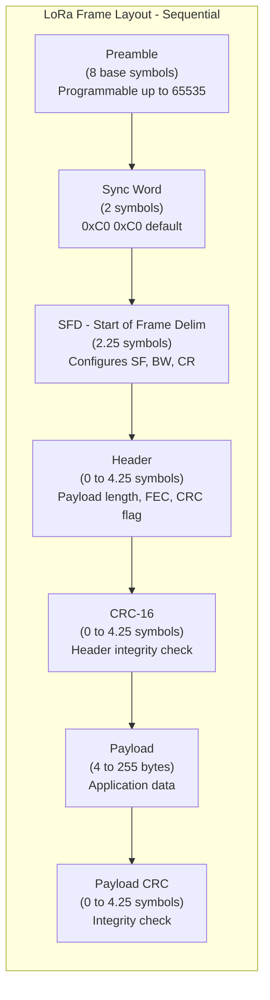
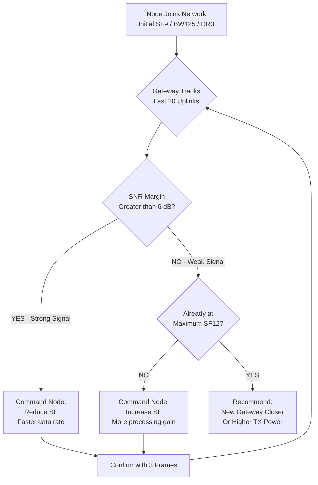
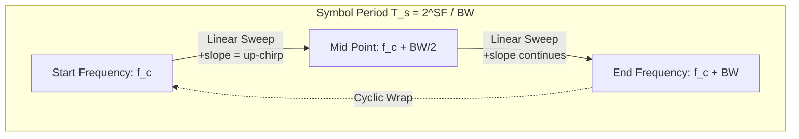

# LoRa Communication Basics and Applications

<!-- SECTION_1_START -->
# LoRa Communication — Core Technical Definition & Intuitive Overview

## 1. Formal Definition (KTU 2024 Syllabus Terminology)
**LoRa (Long Range)** is a **physical layer (PHY)** spread-spectrum modulation technique derived from **Chirp Spread Spectrum (CSS)** that encodes information onto chirped (frequency-swept) carrier waves. It is the proprietary modulation of **Semtech Corporation** and forms the wireless backbone of the **LPWAN (Low-Power Wide-Area Network)** protocol family — most notably **LoRaWAN**.

> [!IMPORTANT]
> **Syllabus Highlight (PBCST504 – Module 4):** LoRa is studied under "IoT Wireless Communication" alongside Wi-Fi, BLE, ZigBee, and NB-IoT. KTU examiners expect students to clearly distinguish LoRa (a *modulation*) from LoRaWAN (a *MAC-layer protocol stack*).

## 2. Key Operating Parameters (Physical Layer Constants)
- **ISM Band Frequency:** **868 MHz (EU/India)**, **915 MHz (US/Australia)**, **433 MHz (Asia)**
- **Spreading Factor (SF):** **SF7 to SF12** (integer values, dimensionless)
- **Channel Bandwidth (BW):** **125 kHz, 250 kHz, 500 kHz**
- **Coding Rate (CR):** **4/5, 4/6, 4/7, 4/8** (FEC — Forward Error Correction)
- **Receiver Sensitivity:** Typically **−137 dBm** at SF12/BW125
- **Link Budget:** Up to **157 dB**
- **Range:** **2–10 km (urban)**, **>15 km (rural/line-of-sight)**
- **Maximum Payload:** **255 bytes** (per LoRaWAN frame)

## 3. Conceptual Analogy — "The Whistle in a Noisy Stadium"
Imagine a packed cricket stadium (the noisy 868 MHz band crowded with Wi-Fi, Bluetooth, and cellular signals). One person wants to send a secret message to a friend across the field. Instead of shouting loudly (high power — which drains batteries fast), the sender **whistles a slow, sweeping tune** (a *chirp*) that sweeps from low to high frequency. Because the whistle is *unique in pattern* (the **spreading factor**), the receiver can pull it out of the noise even if the signal is **20 dB below the noise floor**. 
- **Loudness** ↔ Transmit Power (mA consumed)
- **Whistle length** ↔ Spreading Factor (SF)
- **Whistle pitch range** ↔ Bandwidth (BW)
- **Audience noise** ↔ Ambient RF interference

This is the essence of LoRa: **trade data rate for range and noise immunity** by spreading one symbol over a wide frequency band over a long time.

> [!NOTE]
> **Why CSS and not FSK/OFDM?** Traditional modulations fail below the noise floor. CSS uniquely provides **processing gain** proportional to SF, enabling **negative SNR reception** (as low as **−20 dB**), which is impossible for FSK or OFDM.

## 4. GeoGebra / Desmos Visualization
> [!VISUALIZATION CONTROL]
> **Concept:** Up-chirp and Down-chirp frequency vs. time waveform
> **GeoGebra / Desmos Input Equations:**
> * For an up-chirp with bandwidth $BW$ over symbol duration $T_s$: 
>   `f_up(t) = f_0 + (BW / T_s) * t`,  for `0 <= t <= T_s`
> * For the corresponding down-chirp: 
>   `f_down(t) = f_0 + BW - (BW / T_s) * t`,  for `0 <= t <= T_s`
> **Visual Description:** A straight, linearly rising line (positive slope = up-chirp) sandwiched between the band edges $f_0$ and $f_0 + BW$. A mirror image (negative slope) represents the down-chirp. The two intersect precisely at the midpoint of the band, illustrating LoRa's orthogonality between chirp directions (used in FSK-like modulation of data bits).
<!-- SECTION_1_END -->

<!-- SECTION_2_START -->
# Deep Theoretical Analysis & KTU High-Yield Formula Sheet

## 1. The Chirp Spread Spectrum (CSS) Modulation
LoRa uses **three simultaneous orthogonal dimensions** to encode data:

### A. Frequency Chirping (the foundation)
A *chirp* is a sinusoidal signal whose instantaneous frequency varies linearly with time. The baseband up-chirp over the channel bandwidth $BW$ is:

$$s_{up}(t) = \cos\left(2\pi \left( f_0 t + \frac{BW}{2T_s} t^2 \right)\right), \quad 0 \leq t \leq T_s$$

The instantaneous frequency is $f_i(t) = f_0 + \frac{BW}{T_s} t$, sweeping linearly from $f_0$ to $f_0 + BW$.

### B. Cyclic Shift (the actual data carrier)
Data bits are encoded as a **cyclic time-shift** of the base chirp. A symbol value $k \in \{0, 1, \dots, 2^{SF}-1\}$ produces a chirp shifted by $\frac{k}{2^{SF}} \cdot T_s$ seconds. The receiver correlates the incoming chirp with an ideal reference chirp — the **peak of the correlation** reveals $k$.

### C. Spreading Factor → Symbol Rate
The spreading factor is *both* the bit-per-symbol count *and* the time-spreading exponent:

$$R_s = \frac{BW}{2^{SF}} \quad \text{[symbols/second (Baud)]}$$

$$T_s = \frac{2^{SF}}{BW} \quad \text{[seconds per symbol]}$$

## 2. LoRaWAN Class A/B/C Device Modes
- **Class A (Bi-directional, downlink only after uplink):** Lowest power; mandatory for all LoRaWAN devices.
- **Class B (Scheduled downlink via beacon):** Synchronized extra receive windows.
- **Class C (Continuously open RX2 window):** Highest power; mains-powered actuators.

> [!NOTE]
> **KTU expects** students to remember that **Class A is the default** and has the lowest power — this is the canonical answer for *"Why LoRa is suitable for battery-powered IoT nodes."*

## 3. KTU Formula Sheet / Cheat Sheet

| # | Formula / Concept | Expression | Units / Range | Engineering Meaning |
|---|-------------------|------------|---------------|---------------------|
| 1 | Symbol Rate | $R_s = \dfrac{BW}{2^{SF}}$ | Baud (symbols/s) | Slower for higher SF |
| 2 | Symbol Period | $T_s = \dfrac{2^{SF}}{BW}$ | seconds | Time spent on 1 symbol |
| 3 | Bit Rate (Raw) | $R_b = SF \cdot \dfrac{BW}{2^{SF}} \cdot CR$ | bits/second (bps) | Throughput (no header) |
| 4 | Receiver Sensitivity | $S = -174 + 10\log_{10}(BW) + NF + SNR_{limit}$ | dBm | Minimum detectable signal |
| 5 | Link Budget | $LB = P_{TX} - S$ | dB | Total allowable path loss |
| 6 | Free-Space Path Loss | $FSPL = 20\log_{10}(d) + 20\log_{10}(f) + 32.44$ | dB (d in km, f in MHz) | Urban/rural range estimate |
| 7 | Processing Gain | $G_p = SF \cdot 10\log_{10}\left(\dfrac{BW}{R_s}\right)$ | dB | SNR improvement |
| 8 | Time on Air (Payload) | $T_{payload} = N_{symbol} \cdot T_s$ | seconds | Total airtime (regulatory duty-cycle) |
| 9 | Max Range (Line of Sight) | $d = 10^{\left(\dfrac{LB - FSPL_{ref}}{20}\right)}$ | km | Approximate outdoor range |
| 10 | Duty Cycle (EU868) | $D = \dfrac{T_{air}}{T_{window}}$ | % | ≤ 1% (sub-band) for fair-use |

> [!IMPORTANT]
> **Key Insight:** Increasing SF by 1 **doubles airtime** and **halves data rate** but gains ~**2.5–3 dB** in sensitivity (≈ 1.4× range). This is the central trade-off the examiner loves to test.

## 4. Real-World Engineering Utility
- **Smart Agriculture:** Soil moisture, weather stations in remote fields.
- **Smart Metering:** Gas, water, and electricity meters in basements.
- **Asset Tracking:** Cattle, shipping containers, fleet vehicles.
- **Smart Cities:** Street-light control, parking sensors, air-quality monitors.
- **Disaster Management:** Wildfire early-warning, flood-level telemetry.
- **Industrial IoT (IIoT):** Pipeline pressure, tank-level monitoring in oil & gas.
<!-- SECTION_2_END -->

<!-- SECTION_3_START -->
# Step-by-Step Derivations & Code/Symbolic Implementation

## Derivation 1 — Data Rate Equation (KTU Favourite)

**Given:** LoRa modulation with parameters $SF$, $BW$, $CR$. Each symbol carries $SF$ bits (since there are $2^{SF}$ distinct cyclic shifts, and $\log_2(2^{SF}) = SF$).

**Step 1 — Bit rate from symbol rate:**
$$R_b = SF \times R_s$$

**Step 2 — Substitute the symbol rate formula:**
$$R_b = SF \times \frac{BW}{2^{SF}}$$

**Step 3 — Apply the Forward Error Correction factor** (only useful data bits, not the redundant ones):
$$R_b = SF \times \frac{BW}{2^{SF}} \times CR$$

$$
\boxed{R_b = SF \cdot \frac{BW}{2^{SF}} \cdot CR \quad \text{[bits/second]}}
$$

### Numerical Worked Example
**Problem:** Compute the bit rate for $SF = 7$, $BW = 125 \text{ kHz}$, $CR = 4/5$.

**Step 1 — Symbol Rate:**
$$R_s = \frac{125\,000}{2^{7}} = \frac{125\,000}{128} = 976.5625 \text{ symbols/s}$$

**Step 2 — Multiply by SF:**
$$R_b = 7 \times 976.5625 = 6835.9375 \text{ bps}$$

**Step 3 — Apply Coding Rate:**
$$R_b = 6835.9375 \times \frac{4}{5} = 5468.75 \text{ bps}$$

**Result:** $\approx 5.47$ kbps — typical of "fast" LoRa (SF7).

> **Repeat the same calculation for SF12, BW=125kHz, CR=4/8** to demonstrate the trade-off:
> $R_s = 125000 / 4096 \approx 30.5$ sym/s → $R_b = 12 \times 30.5 \times 0.5 \approx 183$ bps. **30× slower** than SF7, but range increases from ~3 km to ~10 km.

---

## Derivation 2 — Time on Air for a Payload

LoRa frames consist of a **preamble** (8 symbols, programmable up to 65535), a **sync word** (2 symbols), an **explicit header (SFD)** carrying payload length, SF, CR (4.25 to 8.25 symbols), the **payload** itself, and optionally a CRC.

**Step 1 — Number of payload symbols:**
$$N_{payload} = 8 + \max\!\left(\left\lceil\frac{8PL - 4SF + 44 - 20H}{4(SF - 2DE)}\right\rceil \cdot (CR + 4),\, 0\right)$$

Where:
- $PL$ = payload length in bytes
- $H = 1$ if header enabled, else $0$
- $DE = 1$ if low-data-rate optimization is on (mandatory for $SF \geq 11$)

**Step 2 — Total preamble symbols:**
$$N_{preamble} = (n_{preamble} + 4.25) + 8 + \max\!\left(\left\lceil\frac{8PL - 4SF + 44 - 20H}{4(SF - 2DE)}\right\rceil \cdot (CR + 4),\, 0\right)$$

**Step 3 — Time on Air:**
$$T_{air} = N_{preamble} \cdot T_s \quad \text{where } T_s = \frac{2^{SF}}{BW}$$

### Numerical Worked Example
**Problem:** Compute the Time on Air for $PL = 10$ bytes, $SF = 9$, $BW = 125$ kHz, $CR = 4/5$, $H = 0$, $DE = 0$, preamble length $n_{preamble} = 8$.

**Step 1 — $T_s$:**
$$T_s = \frac{2^{9}}{125\,000} = \frac{512}{125\,000} = 4.096 \text{ ms}$$

**Step 2 — Payload symbols:**
$$N_p = 8 + \max\!\left(\left\lceil\frac{8(10) - 4(9) + 44 - 0}{4(9 - 0)}\right\rceil \cdot (1 + 4),\, 0\right)$$

Numerator: $80 - 36 + 44 = 88$. Denominator: $4 \times 9 = 36$. $\lceil 88/36 \rceil = \lceil 2.444 \rceil = 3$.

$$N_p = 8 + 3 \times 5 = 23 \text{ symbols}$$

**Step 3 — Total symbols:**
$$N_{total} = (8 + 4.25) + 23 = 35.25 \text{ symbols}$$

**Step 4 — $T_{air}$:**
$$T_{air} = 35.25 \times 4.096 \text{ ms} = 144.384 \text{ ms}$$

**Result:** $\approx 0.144$ s — within EU868 sub-band 1% duty cycle ⇒ next transmission allowed after ~14.4 s.

---

## Code Implementation — Arduino/ESP32 Transmitter & Receiver

```cpp
// ============================================================
// LoRa Sender Node (ESP32 + SX1276 @ 868 MHz)
// Transmit a packet every 5 seconds: a counter + analog value
// ============================================================
#include <SPI.h>
#include <LoRa.h>

// --- Pin configuration for ESP32 (Heltec WiFi LoRa 32 v2) ---
#define LORA_SS    18     // Chip Select
#define LORA_RST   14     // Reset
#define LORA_DIO0  26     // Interrupt (Tx/Rx done)

// --- LoRa link parameters ---
#define FREQ_HZ        868E6   // 868 MHz (India/Europe ISM)
#define TX_POWER_DBM   17      // +17 dBm (legal in EU/India)
#define SPREADING_FACTOR  9    // SF9
#define SIGNAL_BW        125E3 // 125 kHz
#define CODING_RATE      5     // 4/5  (CR = 4 + CODING_RATE - 4 is 4/5 with this lib)
#define PREAMBLE_LEN    8

uint32_t packet_counter = 0;

void setup() {
    Serial.begin(115200);
    while (!Serial) { /* wait for USB CDC */ }

    Serial.println("[INIT] Booting LoRa sender...");

    // Hard-reset the SX1276 module
    pinMode(LORA_RST, OUTPUT);
    digitalWrite(LORA_RST, LOW);
    delay(10);
    digitalWrite(LORA_RST, HIGH);
    delay(10);

    // Initialize SPI bus
    SPI.begin(5, 19, 27, LORA_SS);  // SCK, MISO, MOSI, SS

    if (!LoRa.begin(FREQ_HZ)) {
        Serial.println("[FATAL] LoRa init failed. Halting.");
        while (1) {
            digitalWrite(LED_BUILTIN, HIGH);
            delay(200);
            digitalWrite(LED_BUILTIN, LOW);
            delay(200);
        }
    }

    // Apply link parameters
    LoRa.setTxPower(TX_POWER_DBM);
    LoRa.setSpreadingFactor(SPREADING_FACTOR);
    LoRa.setSignalBandwidth(SIGNAL_BW);
    LoRa.setCodingRate4(CODING_RATE);
    LoRa.setPreambleLength(PREAMBLE_LEN);
    LoRa.enableCrc();

    Serial.print("[CFG] SF="); Serial.print(SPREADING_FACTOR);
    Serial.print(" BW=");        Serial.print(SIGNAL_BW / 1E3); Serial.print("kHz");
    Serial.print(" TX=");        Serial.print(TX_POWER_DBM);    Serial.println("dBm");
}

void loop() {
    // Build a JSON-ish payload
    float voltage = analogRead(34) * (3.3 / 4095.0);
    String payload = "{\"id\":SENSOR1,\"v\":" + String(voltage, 2) + 
                     ",\"seq\":" + String(packet_counter) + "}";

    // Send packet
    LoRa.beginPacket();
    LoRa.print(payload);
    LoRa.endPacket();

    Serial.print("[TX] seq=");  Serial.print(packet_counter);
    Serial.print(" len=");       Serial.print(payload.length());
    Serial.print(" timeOnAir="); Serial.print(LoRa.lastPacketTime(), 1); Serial.println("ms");

    packet_counter++;
    delay(5000);   // 5-second cadence
}
```

```cpp
// ============================================================
// LoRa Receiver / Gateway Node
// ============================================================
#include <SPI.h>
#include <LoRa.h>

#define LORA_SS    18
#define LORA_RST   14
#define LORA_DIO0  26
#define FREQ_HZ    868E6

void setup() {
    Serial.begin(115200);
    pinMode(LORA_RST, OUTPUT);
    digitalWrite(LORA_RST, LOW);
    delay(10);
    digitalWrite(LORA_RST, HIGH);
    delay(10);

    SPI.begin(5, 19, 27, LORA_SS);
    if (!LoRa.begin(FREQ_HZ)) {
        Serial.println("[FATAL] LoRa init failed");
        while (1);
    }

    // MUST match the sender for correct demodulation
    LoRa.setSpreadingFactor(9);
    LoRa.setSignalBandwidth(125E3);
    LoRa.setCodingRate4(5);
    LoRa.enableCrc();

    Serial.println("[INIT] LoRa receiver ready. Listening on 868 MHz...");
}

void loop() {
    int packetSize = LoRa.parsePacket();
    if (packetSize) {
        Serial.print("[RX] RSSI=");    Serial.print(LoRa.packetRssi());
        Serial.print("dBm SNR=");      Serial.print(LoRa.packetSnr(), 1);
        Serial.print("dB len=");       Serial.print(packetSize);
        Serial.print(" err=");         Serial.print(LoRa.packetFrequencyError(), 0);
        Serial.print("Hz  payload: ");

        String incoming = "";
        while (LoRa.available()) {
            incoming += (char)LoRa.read();
        }
        Serial.println(incoming);
    }
}
```

> [!IMPORTANT]
> **KTU Practical Tip:** When asked to *demonstrate* a LoRa link, you must specify **matching SF, BW, CR, frequency, and sync word** on both nodes. A mismatch results in **zero packets received** — a common lab-viva trap.

---

## Laboratory Setup Cheat-Sheet

| Component | Specification | Quantity | Notes |
|-----------|---------------|----------|-------|
| Microcontroller | ESP32 / Arduino Uno + Dragino shield | 2 | One as TX, one as RX |
| LoRa Module | Semtech SX1276 (868 MHz) | 2 | SPI interface |
| Antenna | $\lambda/4$ whip (≈ 8.6 cm for 868 MHz) | 2 | SMA male connector |
| Power Supply | 3.3 V regulated (≤ 120 mA peak) | 1 | Do **not** use 5 V on SX1276! |
| Wires | Female-to-female jumper | ≥ 8 | 10 cm length |
| Software | Arduino IDE 2.x + `sandeepmistry/LoRa` library | — | Configure IDE for ESP32 board |
| Safety | Move test > 1 m from any metal surface | — | Avoid ground-plane absorption |
<!-- SECTION_3_END -->

<!-- SECTION_4_START -->
# Structural Diagrams & Schematics

## Diagram 1 — End-to-End LoRa / LoRaWAN Network Architecture

```mermaid
flowchart LR
    subgraph EDGE["EDGE NODES (Battery Powered)"]
        S1["Soil Moisture Sensor"]
        S2["Air Quality Sensor"]
        S3["Smart Water Meter"]
    end

    subgraph NODE["LoRa END-DEVICE (Class A)"]
        MCU["MCU: ESP32 / STM32"]
        SX["SX1276 LoRa Transceiver"]
        ANT1["Antenna 868 MHz"]
    end

    subgraph GW["LoRaWAN GATEWAY"]
        GWCPU["Linux SBC: Raspberry Pi"]
        GWSX["SX1301 Concentrator"]
        ANT2["Sector Antenna"]
        LTE["Backhaul: 4G / Ethernet"]
    end

    subgraph NET["NETWORK SERVER (Cloud)"]
        NS["LoRaWAN Network Server TTN / ChirpStack"]
        APP["Application Server"]
        DB["Time Series Database InfluxDB"]
    end

    subgraph USR["END USER"]
        DASH["Web Dashboard / Mobile App"]
        ALERT["SMS / Email Alerts"]
    end

    S1 --> MCU
    S2 --> MCU
    S3 --> MCU
    MCU --> SX
    SX --> ANT1
    ANT1 -->|"Chirp Uplink 868.1 MHz"| ANT2
    ANT2 --> GWSX
    GWSX --> GWCPU
    GWCPU --> LTE
    LTE --> NS
    NS --> APP
    APP --> DB
    DB --> DASH
    APP --> ALERT
    NS -.->|"Downlink Chirp"| ANT2
    ANT2 -.->|"ACK Window 1 and 2"| ANT1
```



## Diagram 2 — LoRa PHY Frame Structure (Time-Multiplexed View)



## Diagram 3 — Adaptive Data Rate (ADR) Algorithm Flow



## Diagram 4 — Frequency vs. Time Chirp Visualisation (Block-Level)



> [!NOTE]
> **KTU Examiner Insight:** When drawing a frequency-vs-time diagram of a chirp, always label the **bandwidth (vertical span)** and **symbol duration (horizontal span)**. Marks are awarded for *axis labels and the positive-slope line*.
<!-- SECTION_4_END -->

<!-- SECTION_5_START -->
# KTU 2024 Scheme Examination Question Bank & Topic Recap

## Part A — Short Answer Questions (3 Marks each)

### Q1. [KTU University Exam — July 2023] (CO3, Remember)
**Differentiate between LoRa and LoRaWAN.**

**Model Answer:**
| Aspect | LoRa | LoRaWAN |
|--------|------|---------|
| OSI Layer | Physical Layer (PHY) | MAC + Network Layer |
| Function | Chirp Spread Spectrum modulation | Open protocol for managing communication between end-devices and gateways |
| Owner | Semtech (proprietary) | LoRa Alliance (open standard) |
| Defines | Modulation, bit rate, range | Device classes, frame format, security, ADR |
| Analogy | The "voice" we speak | The "language rules" we follow |

**[Distinguishing PHY vs MAC clearly: 2 Marks; Supporting point: 1 Mark]**

### Q2. [KTU University Exam — Dec 2022] (CO3, Understand)
**List any three key physical-layer parameters of LoRa that influence range and data rate.**

**Model Answer:**
1. **Spreading Factor (SF7–SF12):** Higher SF → longer range, lower data rate, higher airtime. **[1 Mark]**
2. **Channel Bandwidth (125/250/500 kHz):** Higher BW → higher data rate, lower sensitivity, less range. **[1 Mark]**
3. **Coding Rate (4/5 to 4/8):** Higher CR → more redundancy, more robust to interference, lower throughput. **[1 Mark]**
4. (Bonus) Transmit Power (TX), typically 2 to 20 dBm — affects link budget linearly.

---

## Part B — Long Answer (14 Marks, Internal Choice)

### Question A — [KTU University Exam — Model Paper 2024] (CO3, Apply + Analyze)

**(a) [7 Marks] Derive the LoRa data-rate equation $R_b = SF \cdot \frac{BW}{2^{SF}} \cdot CR$, explaining the role of each term. For $SF = 10$, $BW = 125$ kHz, $CR = 4/6$, compute the bit rate.**

**Model Solution:**

**Step 1 — Define symbol rate:** A single LoRa chirp spans the entire channel bandwidth $BW$ and has $2^{SF}$ unique cyclic shifts → $2^{SF}$ distinguishable symbols per second if we sweep the band once per second.
$$R_s = \frac{BW}{2^{SF}} \quad \text{[Baud]} \quad \text{[1 Mark for stating the formula]}$$

**Step 2 — Bits per symbol:** Since there are $2^{SF}$ orthogonal symbols, each symbol carries $SF$ bits of information.
$$\text{Bits per symbol} = \log_2(2^{SF}) = SF \quad \text{[1 Mark]}$$

**Step 3 — Raw bit rate (no FEC):**
$$R_{b,\text{raw}} = SF \cdot R_s = SF \cdot \frac{BW}{2^{SF}} \quad \text{[1 Mark]}$$

**Step 4 — Apply Coding Rate:** $CR = k/n$ tells us that out of $n$ transmitted bits, only $k$ are information bits. Therefore, useful throughput is multiplied by $CR$.
$$R_b = SF \cdot \frac{BW}{2^{SF}} \cdot CR \quad \text{[1 Mark — final boxed equation]}$$

**Step 5 — Numerical computation:** $SF=10$, $BW=125\,000$ Hz, $CR=4/6$.
$$R_s = \frac{125\,000}{2^{10}} = \frac{125\,000}{1024} = 122.07 \text{ sym/s} \quad \text{[1 Mark]}$$
$$R_b = 10 \times 122.07 \times \frac{4}{6} = 1220.7 \times 0.6667 = 813.8 \text{ bps} \quad \text{[2 Marks for final answer with unit]}$$

**[Stating the symbol rate formula: 1 Mark; Bits-per-symbol logic: 1 Mark; FEC explanation: 1 Mark; Final boxed equation: 1 Mark; Numerical substitution: 2 Marks; Final answer with unit: 1 Mark]**

---

**(b) [7 Marks] With the help of a neat frequency-vs-time diagram, explain the Chirp Spread Spectrum (CSS) modulation used in LoRa. How does LoRa recover signals below the noise floor?**

**Model Solution:**

**Step 1 — Definition of Chirp:** A chirp is a sinusoidal signal whose instantaneous frequency varies linearly with time. For an up-chirp:
$$f_i(t) = f_c + \frac{BW}{T_s} \cdot t, \quad 0 \le t \le T_s \quad \text{[1 Mark]}$$

**Step 2 — Frequency-vs-time diagram:**
```
   f
   |        /|        /|        /|
   |       / |       / |       / |
   |      /  |      /  |      /  |
   |_____/__|_____/__|_____/__|_________ t
         T_s       T_s       T_s
   f_c ----> f_c+BW (linear, positive slope)
```
The bandwidth $BW$ is the vertical span; $T_s$ is the horizontal span. **[1 Mark for labelled axes; 1 Mark for the linear positive-slope line]**

**Step 3 — Data encoding:** Each symbol value $k \in [0, 2^{SF}-1]$ corresponds to a cyclic time-shift of the base chirp by $k \cdot T_s / 2^{SF}$ seconds. The receiver correlates with an ideal chirp; the location of the correlation peak reveals $k$. **[1 Mark]**

**Step 4 — Below-the-noise-floor recovery (Processing Gain):** The receiver multiplies the incoming signal with a conjugate chirp (dechirp operation), converting the chirp into a single-frequency tone. A subsequent FFT extracts the tone's bin index, which equals $k$. Since the chirp energy was spread over bandwidth $BW$ but concentrated into a single FFT bin, the SNR is improved by:
$$G_p = 10 \log_{10}(2^{SF}) = SF \cdot 10 \log_{10}(2) \approx 3.01 \cdot SF \text{ dB} \quad \text{[2 Marks]}$$
For SF12, this is ~36 dB — easily enabling reception at negative SNR (down to −20 dB). **[1 Mark for the conceptual link]**

**[Chirp equation: 1 Mark; Labelled diagram: 2 Marks; Data encoding: 1 Mark; Dechirp-FFT: 1 Mark; Processing gain formula: 1 Mark; Final SNR statement: 1 Mark]**

---

### Question B — Alternative (14 Marks) [CO3, Apply + Analyze]

**(a) [7 Marks] Explain the LoRaWAN device classes (A, B, C). Why is Class A the most power-efficient, and in which IoT application would you choose Class C?**

**Model Solution:**

**Step 1 — Class A:** Two short receive windows (RX1, RX2) open **only after** an uplink transmission. Otherwise, the device is in deep sleep. The downlink must wait for the next uplink → highest latency, lowest current. **[1 Mark]**
- Use case: **Battery-powered sensors** (soil moisture, water meters, weather stations). **[1 Mark]**

**Step 2 — Class B:** Adds **scheduled downlink slots** synchronized with gateway beacons. The device wakes at fixed intervals to receive. **Extra power** due to periodic RX wake-ups. **[1 Mark]**
- Use case: **Actuators with deterministic latency** (valve control, smart lighting). **[1 Mark]**

**Step 3 — Class C:** RX2 window is **continuously open** except while transmitting. Highest current draw (always listening); requires **mains power**. **[1 Mark]**
- Use case: **Mains-powered street lights, industrial actuators** that need instant downlink. **[1 Mark]**

**Step 4 — Power ranking:** Class A < Class B < Class C. Class A's deep-sleep duty cycle typically < 1% keeps the average current in the **µA range**, giving battery life of 5–10 years on 2× AA cells. **[1 Mark]**

**[Each class explained: 3 × 1 Mark; Use cases: 3 × 1 Mark; Power comparison + justification: 1 Mark]**

---

**(b) [7 Marks] A LoRa node transmits 20 bytes of payload every 60 s at SF10, BW = 125 kHz, CR = 4/5, header disabled, CRC off, preamble length 8. Compute the payload symbols, total Time on Air, and verify EU868 duty-cycle compliance.**

**Model Solution:**

**Given:** $SF=10$, $BW=125\,000$ Hz, $CR=4/5$, $PL=20$ B, $H=0$, $DE=0$, $n_{pre}=8$.

**Step 1 — Symbol Period:**
$$T_s = \frac{2^{10}}{125\,000} = \frac{1024}{125\,000} = 8.192 \text{ ms} \quad \text{[1 Mark]}$$

**Step 2 — Payload symbols (using the standard formula):**
$$N_p = 8 + \max\!\left(\left\lceil\frac{8(20) - 4(10) + 44 - 0}{4(10 - 0)}\right\rceil \cdot (1 + 4),\, 0\right)$$

Numerator: $160 - 40 + 44 = 164$. Denominator: $40$. $\lceil 164/40 \rceil = \lceil 4.1 \rceil = 5$.

$$N_p = 8 + 5 \times 5 = 33 \text{ symbols} \quad \text{[2 Marks for substitution + ceiling] [1 Mark for final value]}$$

**Step 3 — Total symbols:**
$$N_{total} = (n_{pre} + 4.25) + N_p = (8 + 4.25) + 33 = 45.25 \text{ symbols} \quad \text{[1 Mark]}$$

**Step 4 — Time on Air:**
$$T_{air} = 45.25 \times 8.192 \text{ ms} = 370.69 \text{ ms} \quad \text{[1 Mark]}$$

**Step 5 — Duty cycle check (EU868 sub-band, ≤ 1%):**
$$D = \frac{T_{air}}{T_{period}} = \frac{0.3707 \text{ s}}{60 \text{ s}} = 0.00618 = 0.618\%$$
Since $0.618\% < 1\%$, the transmission is **compliant** with EU868 sub-band fair-use policy. **[1 Mark]**

**[Symbol period: 1 Mark; Ceiling & substitution: 2 Marks; Payload symbol total: 1 Mark; Frame total: 1 Mark; Time on Air: 1 Mark; Duty cycle verdict: 1 Mark]**

---

> [!WARNING]
> **KTU Examiner's Valuation Pitfalls — LoRa Topics**
> 1. **Forgetting the unit on sensitivity.** Sensitivity must be in **dBm**, not dB. Loss of 1 mark.
> 2. **Confusing LoRa (modulation) with LoRaWAN (MAC).** Examiners award 0 if the student calls LoRa a "protocol." It is a **physical-layer modulation technique**.
> 3. **Using `|x|` inside a markdown formula table.** This will break the parser. Use `\vert x \vert` or `\mid x \mid` in LaTeX.
> 4. **Skipping the duty-cycle check** in long problems. EU868 enforces **≤ 1% per sub-band**; ETSI EN 300 220 — examiners often award 1 mark specifically for the duty-cycle verification.
> 5. **Neglecting the SF trade-off curve.** A common 7-mark question is *"Sketch a graph of data rate vs. SF for fixed BW."* You must show **exponential decay** with SF (since $R_b \propto 2^{-SF}$).
> 6. **No pin numbers in practical block diagrams.** Always cite the **SX1276 SPI pin mapping** (NSS, MOSI, MISO, SCK, RST, DIO0–DIO5).
> 7. **Confusing 868 MHz with 433 MHz / 915 MHz.** India uses **868 MHz** (or 433 MHz unlicensed); the US uses 915 MHz. Specifying the wrong band loses 1 mark.

---

## Topic Recap & Important Things to Remember

- **LoRa is a PHY modulation, not a protocol.** It uses **Chirp Spread Spectrum (CSS)** — chirps linearly sweep from $f_c$ to $f_c + BW$.
- **Three orthogonal parameters** govern every LoRa link: **SF (7–12)**, **BW (125/250/500 kHz)**, **CR (4/5–4/8)**.
- **Data rate equation:** $R_b = SF \cdot \dfrac{BW}{2^{SF}} \cdot CR$ (bps). Doubling SF halves the rate exponentially.
- **Time on Air scales with $2^{SF} / BW$** — critical for **EU868 duty cycle** (≤ 1%).
- **Receiver sensitivity** at SF12/BW125 is **−137 dBm**, with link budget up to **157 dB**.
- **Processing gain** $G_p \approx 3 \text{ dB} \times SF$ → SF12 gives ~36 dB of SNR improvement.
- **LoRaWAN has 3 device classes:** A (battery, default), B (beacon-scheduled), C (mains-powered, always-on RX2).
- **LoRaWAN is NOT LoRa.** LoRa is modulation; LoRaWAN is the open MAC protocol by the LoRa Alliance.
- **Modulation order = $2^{SF}$** distinguishable cyclic shifts per symbol → $SF$ bits per symbol.
- **ISM bands** to remember: **433 MHz (Asia)**, **868 MHz (EU/India)**, **915 MHz (US)**.
- **Practical modules:** Semtech **SX1276/SX1278** (single-channel) and **SX1301** (8-channel gateway concentrator).
- **Library for Arduino/ESP32:** `sandeepmistry/LoRa` (GitHub) — supports `setSpreadingFactor()`, `setSignalBandwidth()`, `setCodingRate4()`, `setTxPower()`.
- **Adaptive Data Rate (ADR)** is server-driven: increase SF when SNR is low, decrease when high.
- **LoRa cannot carry voice or video** — designed for **low-bandwidth telemetry** (< 50 kbps).
- **Security:** LoRaWAN uses **AES-128** for both payload encryption and message integrity (MIC).
- **Standard payload max** = **255 bytes** (MAC limit); MTU depends on SF (lower SF ⇒ larger MTU).
- **3 dB in sensitivity ↔ ~1.4× range improvement** (free-space path loss scales as $20 \log_{10} d$).
- **Mandatory low-data-rate optimization (DE = 1)** for $SF \geq 11$ to mitigate clock-drift errors.
- **Exam tip:** Always end a numerical problem with **a final boxed answer + correct SI unit** (bps, ms, dBm).
<!-- SECTION_5_END -->
